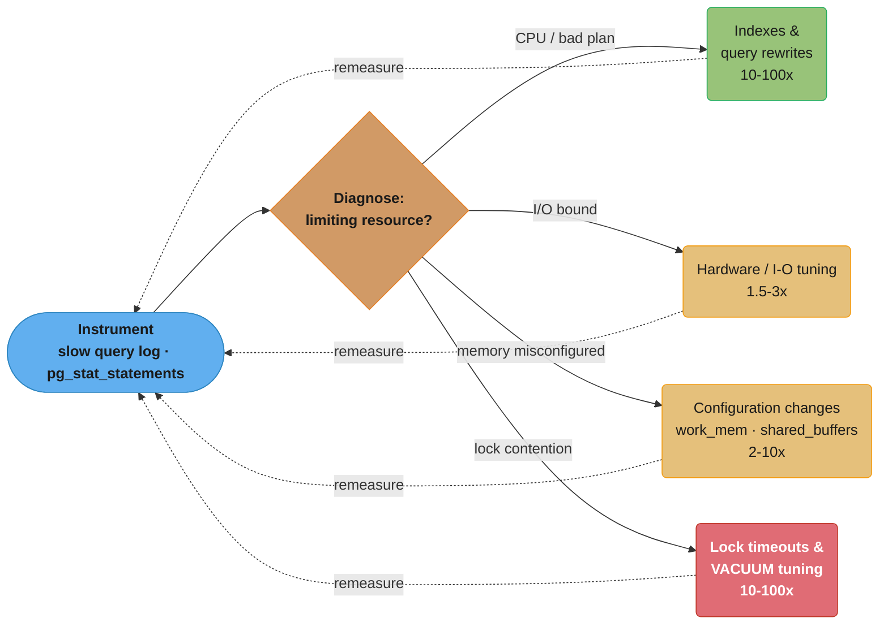
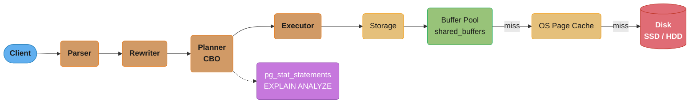
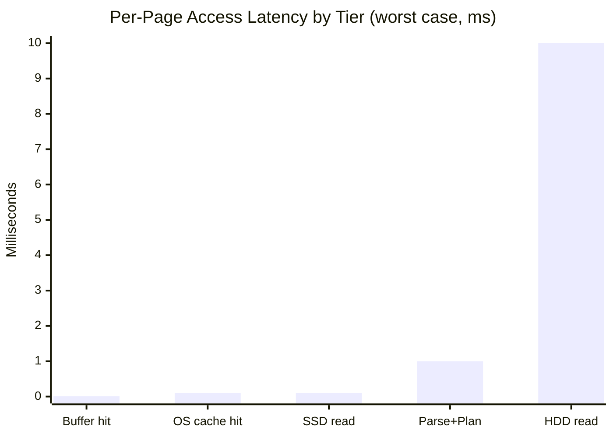
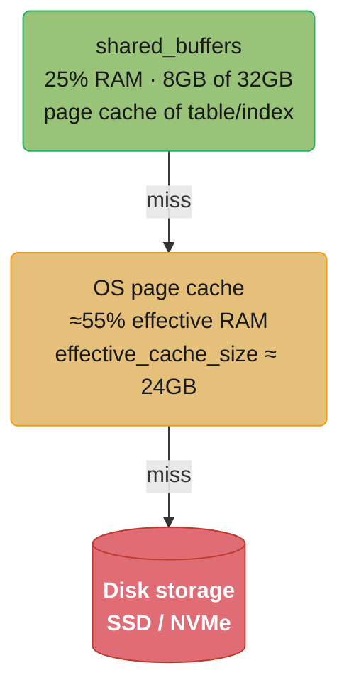
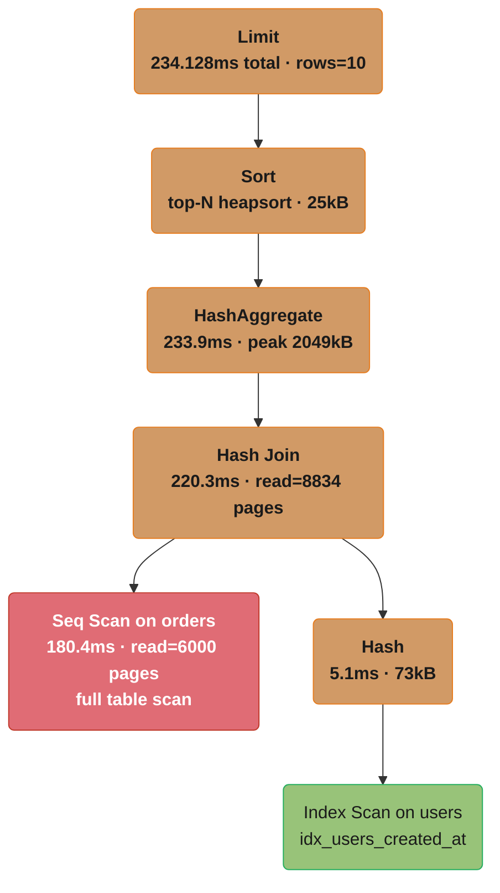

# Database Performance Tuning

## 1. Concept Overview

Database performance tuning is the iterative process of measuring, diagnosing, and improving query throughput, latency, and resource utilization. The methodology is: instrument (enable slow query logging, collect metrics), diagnose (identify the limiting resource — CPU, I/O, memory, locks), then fix (indexes, query rewrites, configuration changes, hardware). Tuning without measurement is guesswork; measurement without a baseline is noise.

The vast majority of performance problems are in one of four categories: missing or suboptimal indexes, slow queries (poor plans, N+1, unoptimized joins), memory misconfiguration (buffer pool too small, work_mem too large), and lock contention (long-running transactions blocking others).

---

## 2. Intuition

A database is a race car. Configuration tuning adjusts tire pressure, fuel mix, and suspension — incremental improvements. Query and index optimization changes the route entirely — 100× improvements are possible. Change the route first (fix queries), then tune the car (adjust configuration). Never start with configuration tuning if you have unoptimized queries.

---

## 3. Core Principles

**Measure before optimizing**: Identify the actual bottleneck (EXPLAIN ANALYZE, pg_stat_statements, slow query log). A query taking 1ms does not need optimization regardless of how it looks.

**Index first, configure second**: A missing index that causes a full sequential scan of a 100M-row table is worth more attention than any configuration parameter. Fix indexes before touching memory parameters.

**Production-realistic benchmarks**: Tune with production-sized data under production-realistic concurrency. A benchmark on 10K rows tells you nothing about behavior at 100M rows.

**Avoid over-tuning**: Changing one parameter at a time, measuring impact, and reverting if no improvement. Changing 10 parameters simultaneously makes causality impossible to determine.

**Tuning Methodology — Measure, Diagnose, Fix**



Tuning is iterative: instrument first, diagnose which resource is the actual bottleneck, then apply the matching fix and remeasure. Index and lock fixes typically return 10-100x, dwarfing the 1.5-3x and 2-10x available from hardware and configuration changes alone — the numeric reason this module says "index first, configure second."

---

## 4. Types / Architectures / Strategies

```
Tuning Category      | Impact | Scope         | Typical Win
---------------------|--------|---------------|------------------
Index optimization   | 10-100× | Query         | Seq scan → index scan
Query rewriting      | 5-100×  | Query         | N+1 → JOIN FETCH
Configuration: memory| 2-10×   | All queries   | Buffer pool hit rate
Configuration: I/O   | 1.5-3×  | Write-heavy   | Checkpoint tuning
Configuration: WAL   | 1.5-2×  | Write-heavy   | WAL segment sizing
Lock contention      | 10-100× | Write-heavy   | VACUUM, timeout tuning
Hardware: SSD        | 5-20×   | I/O bound     | HDD → NVMe SSD
Hardware: RAM        | 2-5×    | Memory bound  | Increase shared_buffers
```

---

## 5. Architecture Diagrams

**Query Execution Path — Where Time Is Spent**



A query flows through parse, rewrite, plan, and execute stages before touching storage; the planner is instrumented by pg_stat_statements and EXPLAIN ANALYZE, and a storage read cascades from the fast in-memory buffer pool down to the OS page cache and finally disk on each miss.



A shared_buffers hit costs 0.01ms; a full miss cascading down to a spinning disk costs up to 1,000× more per page (10ms) — parsing and planning (up to 1ms) barely register next to a disk seek, which is why avoiding disk I/O dominates every other optimization.

**PostgreSQL Memory Hierarchy**



Each tier is checked in order — a shared_buffers miss falls through to the OS page cache, and a page-cache miss falls through to disk; sizing shared_buffers and effective_cache_size correctly keeps most reads in the first two, faster tiers.

```
Per-Query Memory
================

work_mem = 4MB (default)
  Used for: sort operations, hash joins, hash aggregates
  Each parallel worker and each operation can use work_mem
  A complex query with 5 sorts × 20 connections × 3 parallel workers
  = 5 × 20 × 3 × 4MB = 1.2GB memory consumed simultaneously
  → OOM kill risk if work_mem set too high

maintenance_work_mem = 64MB (default)
  Used for: VACUUM, CREATE INDEX, REINDEX, ALTER TABLE ADD FOREIGN KEY
  Set higher during index builds: SET maintenance_work_mem = '1GB';
```

---

## 6. How It Works — Detailed Mechanics

### Slow Query Analysis

```sql
-- Enable pg_stat_statements extension (add to postgresql.conf):
-- shared_preload_libraries = 'pg_stat_statements'
-- pg_stat_statements.max = 10000
-- pg_stat_statements.track = all

-- After enabling and running workload, query top N slow queries:
SELECT
    round(total_exec_time::numeric, 2) AS total_ms,
    round(mean_exec_time::numeric, 2) AS mean_ms,
    round(stddev_exec_time::numeric, 2) AS stddev_ms,
    calls,
    round((100 * total_exec_time / sum(total_exec_time) OVER ())::numeric, 2) AS percentage_cpu,
    query
FROM pg_stat_statements
ORDER BY total_exec_time DESC
LIMIT 10;

-- Reset statistics after tuning to measure improvement:
SELECT pg_stat_statements_reset();
```

```sql
-- PostgreSQL slow query logging (postgresql.conf):
log_min_duration_statement = 1000  -- Log queries taking > 1 second
log_statement = 'none'             -- Don't log all statements (noisy)
log_line_prefix = '%t [%p]: [%l-1] user=%u,db=%d,app=%a,client=%h '

-- MySQL slow query log:
slow_query_log = ON
slow_query_log_file = /var/log/mysql/slow.log
long_query_time = 1
log_queries_not_using_indexes = ON
```

### EXPLAIN ANALYZE Deep Dive

```sql
EXPLAIN (ANALYZE, BUFFERS, FORMAT TEXT)
SELECT u.name, COUNT(o.id) AS order_count
FROM users u
JOIN orders o ON o.user_id = u.id
WHERE u.created_at > now() - interval '30 days'
GROUP BY u.id, u.name
ORDER BY order_count DESC
LIMIT 10;

-- Sample output and interpretation:
-- Limit  (cost=1234.56..1234.59 rows=10 width=44) (actual time=234.123..234.128 rows=10 loops=1)
--   -> Sort  (cost=1234.46..1236.96 rows=1000 ...) (actual time=234.120..234.121 rows=10 loops=1)
--         Sort Key: (count(o.id)) DESC
--         Sort Method: top-N heapsort  Memory: 25kB          ← small sort: ok
--     -> HashAggregate  (cost=...) (actual time=233.8..233.9 rows=1000 ...)
--           Group Key: u.id, u.name
--           Peak Memory Usage: 2049kB
--       -> Hash Join  (cost=...) (actual time=5.2..220.3 rows=50000 ...)
--               Hash Cond: (o.user_id = u.id)
--               Buffers: shared hit=4521 read=8834     ← 8834 pages from disk
--           -> Seq Scan on orders o (cost=...) (actual time=0.03..180.4 rows=500000 ...)
--                 Buffers: shared hit=2100 read=6000   ← full table scan
--           -> Hash  (cost=...) (actual time=5.1..5.1 rows=1000 ...)
--               Buckets: 1024  Batches: 1  Memory Usage: 73kB
--               -> Index Scan on users u using idx_users_created_at ...

-- Key metrics to read:
--   actual time vs cost: if actual >> estimated, stale statistics
--   rows (estimated) vs rows (actual): large difference = bad plan
--   Buffers read: high disk reads → index missing or buffer pool too small
--   Sort Method: heapsort (good for top-N), external merge (bad, spills to disk)
--   Hash Batches > 1: hash join spilled to disk (increase work_mem)
```

**Reading the Plan Tree**



The text output nests bottom-up but reads top-down; walking it as a tree shows the Seq Scan on orders alone costs 180.4ms of the 234.128ms total (about 77%), while the Index Scan on users off the small hash side resolves in a few milliseconds — the red node is the one worth indexing.

### Memory Configuration (PostgreSQL)

```
# postgresql.conf — memory settings

# shared_buffers: The primary buffer pool
# Rule: 25% of total RAM
# 32GB RAM → shared_buffers = 8GB
shared_buffers = 8GB

# effective_cache_size: Hint to planner about total cache available (shared_buffers + OS cache)
# Rule: 75% of total RAM (postgres does NOT allocate this — it's a hint)
# 32GB RAM → effective_cache_size = 24GB
# Higher value → planner prefers index scans over seq scans for mid-size tables
effective_cache_size = 24GB

# work_mem: Sort/hash memory per operation per sort/hash in a query
# Default: 4MB — usually too low (spills to disk on large datasets)
# Danger: multiple concurrent queries, each with multiple operations
# Formula: total_RAM × 0.25 / (max_connections × avg_queries_per_connection × avg_operations)
# For 32GB RAM, 100 connections, each with 2 operations:
#   32000MB × 0.25 / (100 × 2) = 40MB max safe work_mem
# Start at 4MB, increase for sessions with slow sorts/hash joins:
#   SET work_mem = '64MB';  -- per-session override for specific heavy queries
work_mem = 16MB

# maintenance_work_mem: Memory for VACUUM, CREATE INDEX, REINDEX, CLUSTER
# Rule: 5-10% of RAM, or 1-2GB maximum
# Higher values speed up index builds and VACUUM
maintenance_work_mem = 1GB

# max_wal_size: Maximum WAL size between checkpoints
# Default: 1GB — too small for write-heavy workloads (causes frequent checkpoints)
# Rule: set to 3-10× expected WAL generation between checkpoints (target: 5-min checkpoints)
max_wal_size = 4GB
min_wal_size = 1GB

# checkpoint_completion_target: Spread checkpoint I/O over this fraction of checkpoint interval
# Default: 0.5 (spread I/O over 50% of interval → spiky I/O)
# Best practice: 0.9 (spread over 90% → smooth I/O)
checkpoint_completion_target = 0.9
```

### I/O Tuning

```
# random_page_cost: Cost of random disk page access (relative to seq_page_cost=1.0)
# Default: 4.0 (optimized for HDD with ~5ms seek)
# SSD: set to 1.1-2.0 (random access is nearly as fast as sequential)
# NVMe SSD: set to 1.1
random_page_cost = 1.5  # for SSD

# seq_page_cost: Cost of sequential disk page read
seq_page_cost = 1.0  # keep at default

# effective_io_concurrency: Estimated concurrent I/O operations the disk can handle
# HDD: 1-2
# SSD: 100-200
# NVMe RAID: 200-500
effective_io_concurrency = 200  # for SSD

# max_worker_processes, max_parallel_workers: Parallel query workers
# Parallel query helps for large sequential scans
max_worker_processes = 8
max_parallel_workers = 8
max_parallel_workers_per_gather = 4  # max workers per query node
```

### Lock Monitoring and Tuning

```sql
-- Find blocking queries (queries waiting for locks held by other queries):
SELECT
    blocked.pid AS blocked_pid,
    blocked.query AS blocked_query,
    blocked.wait_event_type,
    blocked.wait_event,
    blocking.pid AS blocking_pid,
    blocking.query AS blocking_query,
    blocking.query_start,
    now() - blocking.query_start AS blocking_duration
FROM pg_stat_activity blocked
JOIN pg_stat_activity blocking ON blocking.pid = ANY(pg_blocking_pids(blocked.pid))
WHERE blocked.wait_event_type = 'Lock';

-- Find long-running queries:
SELECT pid, now() - query_start AS duration, state, query
FROM pg_stat_activity
WHERE state != 'idle'
  AND query_start < now() - interval '5 minutes'
ORDER BY duration DESC;

-- Kill a specific query (not the connection):
SELECT pg_cancel_backend(pid);

-- Kill the connection:
SELECT pg_terminate_backend(pid);
```

```
# PostgreSQL lock timeout settings
lock_timeout = '5s'              # Kill queries waiting for a lock > 5s
statement_timeout = '30s'        # Kill statements running > 30s
idle_in_transaction_session_timeout = '30s'  # Kill idle-in-transaction > 30s
```

### MySQL Performance Tuning

```ini
# /etc/mysql/mysql.conf.d/mysqld.cnf

# Buffer pool: most important MySQL setting
# Rule: 70-80% of RAM for dedicated MySQL server
innodb_buffer_pool_size = 24G   # for 32GB RAM

# Buffer pool instances: reduce lock contention for large buffer pools
# Rule: 1 per GB, max 64
innodb_buffer_pool_instances = 24

# I/O capacity: disk I/O operations per second MySQL can use
innodb_io_capacity = 2000           # SSD: 2000-10000
innodb_io_capacity_max = 4000       # Peak I/O capacity

# Redo log: too small → frequent log flushes, I/O spikes; too large → slow crash recovery
# MySQL 8.0: automatically sized; MySQL 5.7 default: 48MB (usually too small)
innodb_log_file_size = 1G           # MySQL 5.7 only; MySQL 8.0 auto-configures
innodb_log_buffer_size = 64M        # Buffer before writing to redo log

# Flush method: most important durability/performance knob
# 0: commit writes to log buffer; flush to disk every second (1s data loss risk)
# 1: flush log on every commit (default; durable; 2-3x slower than =2)
# 2: write to OS cache on commit; flush every second (1s data loss risk; faster)
innodb_flush_log_at_trx_commit = 1  # Production: keep at 1 for durability

# Read/write threads
innodb_read_io_threads = 4
innodb_write_io_threads = 4

# Slow query log
slow_query_log = ON
long_query_time = 1
log_queries_not_using_indexes = ON
```

### Table Bloat Diagnosis (PostgreSQL)

```sql
-- Detect bloated tables (using pg_stat_user_tables approximation):
SELECT
    schemaname,
    tablename,
    n_live_tup AS live_rows,
    n_dead_tup AS dead_rows,
    round(n_dead_tup::numeric / NULLIF(n_live_tup + n_dead_tup, 0) * 100, 1) AS dead_pct,
    last_vacuum,
    last_autovacuum,
    last_analyze
FROM pg_stat_user_tables
WHERE n_dead_tup > 10000
ORDER BY dead_pct DESC;

-- Accurate bloat estimate using pgstattuple extension:
CREATE EXTENSION pgstattuple;
SELECT * FROM pgstattuple('orders');
-- Returns: table_len, tuple_count, tuple_len, tuple_percent, dead_tuple_count, dead_tuple_percent, free_space, free_percent

-- Manual VACUUM if autovacuum isn't keeping up:
VACUUM (ANALYZE, VERBOSE) orders;
VACUUM (FULL, ANALYZE) orders;  -- Rewrites table, removes all bloat, but takes exclusive lock
```

### Autovacuum Tuning

```sql
-- Per-table autovacuum settings for high-write tables
ALTER TABLE orders SET (
    autovacuum_vacuum_scale_factor = 0.01,   -- Vacuum when 1% of rows are dead (default: 20%)
    autovacuum_vacuum_cost_delay = 2,        -- 2ms delay between I/O bursts (less throttling)
    autovacuum_vacuum_threshold = 1000,      -- Vacuum when > 1000 dead tuples (default: 50)
    autovacuum_analyze_scale_factor = 0.005  -- Analyze more frequently for accurate stats
);

-- Monitor autovacuum activity:
SELECT
    schemaname, relname,
    last_autovacuum,
    autovacuum_count,
    n_dead_tup,
    n_mod_since_analyze
FROM pg_stat_user_tables
WHERE last_autovacuum > now() - interval '1 hour'
ORDER BY last_autovacuum DESC;

-- Check if autovacuum workers are running:
SELECT pid, query, state, wait_event_type, wait_event
FROM pg_stat_activity
WHERE query LIKE 'autovacuum:%';
```

---

## 7. Real-World Examples

**GitLab**: Published their PostgreSQL tuning guide extensively. Key insight: `work_mem` set too high caused OOM kills. They run `work_mem = 8MB` globally and use `SET LOCAL work_mem = '256MB'` only for specific batch operations.

**Discourse**: Runs PostgreSQL tuned for small datasets (< 100GB) on SSDs. Key parameters: `shared_buffers = 256MB` (small — dataset fits in OS cache), `random_page_cost = 1.5`, `effective_io_concurrency = 200`. Demonstrates that small shared_buffers can be right when OS page cache handles most I/O.

**Percona**: Publishes the `pt-query-digest` tool for MySQL slow query analysis and `pt-online-schema-change` for zero-downtime schema changes. Their tuning checklist for MySQL 8: innodb_buffer_pool_size=80% RAM, innodb_io_capacity based on disk type, slow_query_log enabled from day one.

---

## 8. Tradeoffs

```
Tuning Action          | Benefit               | Risk/Cost
-----------------------|-----------------------|---------------------------
Increase shared_buffers| Higher hit rate       | Less OS cache available
Increase work_mem      | Faster sort/hash joins| OOM kill at high concurrency
Increase max_wal_size  | Fewer checkpoints     | Longer crash recovery
VACUUM (FULL)          | Eliminate bloat       | Exclusive lock, table rewrites
Create index           | Faster reads          | Slower writes, storage, maintenance
Parallel query workers | Faster large scans    | CPU-bound queries may thrash
```

---

## 9. When to Use / When NOT to Use

**Profile before tuning**: EXPLAIN ANALYZE, pg_stat_statements, slow query log — always identify the bottleneck first.

**Index optimization**: first action for any query > 100ms. A missing index on a 10M-row table can cause 10-second sequential scans.

**Work_mem increase**: only for specific sessions with confirmed sort/hash spill to disk. Never increase globally without calculating OOM risk.

**VACUUM FULL**: last resort for bloat (requires exclusive lock); prefer aggressive autovacuum tuning first.

**Parallel workers**: useful for analytics/OLAP queries that do large sequential scans; not useful for OLTP point queries.

---

## 10. Common Pitfalls

**work_mem OOM kill**: DBA increases work_mem from 4MB to 512MB globally to speed up sorts. At peak load: 200 connections × 5 sort operations each = 1000 operations × 512MB = 500GB memory demand. Server OOM kills PostgreSQL. Fix: raise work_mem per-session for known heavy queries only (`SET LOCAL work_mem = '256MB'` inside a transaction).

**Missing statistics causing bad query plan**: A bulk load inserts 100M rows into a table. Autovacuum hasn't run ANALYZE yet — statistics still show 1000 rows. The planner estimates a tiny result set and chooses nested loop join instead of hash join. Query takes 30 minutes instead of 30 seconds. Fix: run `ANALYZE orders;` after bulk loads. Set `autovacuum_analyze_scale_factor = 0.01` for high-write tables.

**Checkpoint I/O spike**: `max_wal_size = 1GB` (default) with a write workload generating 500MB/minute of WAL. Checkpoint fires every 2 minutes, flushing 1GB of dirty pages in a 1-second burst. Disk I/O saturates; all queries stall. Fix: set `max_wal_size = 4GB`, `checkpoint_completion_target = 0.9` — checkpoints spread I/O over 9 minutes, eliminating spikes.

**Index bloat from UPDATE-heavy workload**: A table with 10M rows undergoes 1M updates/day. Each UPDATE creates a new row version (dead tuple + new tuple). Without sufficient VACUUM, dead tuples and index entries accumulate. After 6 months: table is 4× larger than data, index is 3× larger. Reads slow because pages are sparse. Fix: increase autovacuum frequency for that table, use REINDEX CONCURRENTLY to rebuild bloated indexes.

**Query plan regression after PostgreSQL upgrade**: After upgrading from PG 13 to PG 15, a critical query plan changes from index scan to sequential scan. Throughput drops 10×. Root cause: PG 15 improved the cost model; now accurately estimates the table is larger and planner switches to seq scan. Fix: use `pg_hint_plan` extension to pin the old plan temporarily while investigating. Long term: add a more selective index or rewrite the query to use a covering index.

---

## 11. Technologies & Tools

| Tool                  | Purpose                                     |
|-----------------------|---------------------------------------------|
| pg_stat_statements    | Query statistics aggregation (PostgreSQL)   |
| EXPLAIN ANALYZE       | Per-query execution plan analysis           |
| pgBadger              | PostgreSQL log analyzer (slow query report) |
| pgstattuple           | Table/index bloat measurement               |
| pg_activity           | Real-time pg_stat_activity dashboard        |
| pt-query-digest       | MySQL slow query log analyzer (Percona)     |
| pt-online-schema-change | MySQL zero-downtime schema changes        |
| MySQL Performance Schema | Real-time MySQL performance monitoring  |
| Prometheus + Grafana  | Long-term metrics visualization             |
| pganalyze             | SaaS PostgreSQL performance monitoring      |

---

## 12. Interview Questions with Answers

**Q: How do you diagnose and fix table bloat in PostgreSQL?**
Table bloat is excess storage from dead tuples not yet reclaimed by VACUUM. Diagnose: query `pg_stat_user_tables` for `n_dead_tup` and compare with `n_live_tup`; a dead-to-live ratio above 20% indicates bloat. For accurate measurement, use `pgstattuple`. Fix: (1) Run `VACUUM (ANALYZE, VERBOSE) table_name` to reclaim dead tuple space without a lock. (2) If autovacuum is not keeping up, tune per-table: `ALTER TABLE t SET (autovacuum_vacuum_scale_factor = 0.01, autovacuum_vacuum_cost_delay = 2)`. (3) For extreme bloat requiring full rewrite, use `VACUUM FULL` (exclusive lock) or `pg_repack` extension (concurrent rewrite, no lock). Also run `REINDEX CONCURRENTLY` to rebuild bloated indexes.

**Q: What is work_mem and why can setting it too high cause OOM kills?**
`work_mem` is the memory limit per sort/hash operation within a query execution. It is NOT a per-query or per-session limit — a complex query can have multiple simultaneous sort and hash operations, each using up to `work_mem`. With `max_connections = 200`, `work_mem = 256MB`, and a complex query with 5 operations: 200 × 5 × 256MB = 256GB potential memory demand — far exceeding any server. PostgreSQL does not enforce a global memory cap, so this can OOM-kill the server. Best practice: keep the global `work_mem` at 8–32MB; increase per-session with `SET work_mem = '256MB'` for known heavy analytical queries.

**Q: How do you find the top N slow queries in production without pg_stat_statements installed?**
Options in degrading priority: (1) Check PostgreSQL log files: if `log_min_duration_statement` is set, slow queries are logged. Parse with `pgBadger` or `grep`. (2) Use `pg_stat_activity`: query it repeatedly and look for long-running queries (duration = `now() - query_start`). (3) Enable `pg_stat_statements` at next maintenance window — it requires a server restart (shared_preload_libraries). (4) Use `auto_explain` module with `auto_explain.log_min_duration = 1000` to log query plans for slow queries without restarting. (5) Check OS-level: high CPU process → identify PostgreSQL PID → `SELECT query FROM pg_stat_activity WHERE pid = <pid>`.

**Q: What is checkpoint_completion_target and how does it affect I/O spikes?**
When a checkpoint fires, PostgreSQL must flush all dirty shared_buffers pages to disk. Without `checkpoint_completion_target`, all dirty pages are flushed as fast as possible — causing a brief I/O spike that starves concurrent queries. `checkpoint_completion_target = 0.9` tells PostgreSQL to spread the dirty page flush over 90% of the checkpoint interval. If checkpoints occur every 5 minutes (max_wal_size limit), the background writer spreads I/O over 4.5 minutes, eliminating the spike. Set to 0.9 in all production environments. The default of 0.5 is too aggressive for write-heavy workloads.

**Q: How do you read the output of EXPLAIN ANALYZE to identify the bottleneck?**
Key signals: (1) `Seq Scan` on a large table — check if an index could convert it to an `Index Scan`. (2) Rows estimate vs actual: if estimated=100, actual=100000, the planner was wrong — stale statistics (`ANALYZE` needed). (3) `Buffers: read` (disk reads) — high disk reads indicate the table/index is not in shared_buffers or OS cache (buffer pool too small or table too large). (4) `Sort Method: external merge` — sort spilled to disk; increase `work_mem`. (5) `Hash Batches: N > 1` — hash join spilled to disk; increase `work_mem`. (6) Loop counts: a node with `loops=10000` and 1ms per loop = 10 seconds in that node alone — often indicates N+1 pattern.

**Q: How do you tune autovacuum for a high-write table?**
Default autovacuum triggers when `autovacuum_vacuum_threshold + autovacuum_vacuum_scale_factor × reltuples` dead tuples accumulate. For a 100M-row table with default 20% scale factor: autovacuum triggers only after 20M dead tuples — by then, the table is severely bloated. Per-table tuning: `ALTER TABLE orders SET (autovacuum_vacuum_scale_factor = 0.005, autovacuum_vacuum_threshold = 1000, autovacuum_vacuum_cost_delay = 2)`. This triggers VACUUM after 500K dead tuples (0.5% of 100M), runs with less throttling (2ms delay vs 20ms default). Also increase `autovacuum_max_workers` globally if multiple tables need concurrent vacuuming.

**Q: What is the effect of random_page_cost on query planning for SSD storage?**
`random_page_cost = 4.0` (default, tuned for HDD) tells the planner that random page access is 4× more expensive than sequential access. On HDD, this is accurate (disk seek = 5–10ms vs sequential read = 0.1ms/page). On SSD, random access is ~0.1ms vs sequential ~0.05ms/page — approximately 1.5–2× difference, not 4×. With `random_page_cost = 4.0` on SSD, the planner over-penalizes index scans relative to sequential scans, sometimes choosing sequential scans when index scans would be faster. Setting `random_page_cost = 1.5` for SSD or `1.1` for NVMe corrects the planner's cost model, enabling it to choose index scans more aggressively for mid-selectivity predicates.

**Q: How does the innodb_buffer_pool_size affect MySQL performance?**
The InnoDB buffer pool is the primary memory cache for table and index data. Reads first check the buffer pool; if missing (buffer pool miss), InnoDB reads from disk. For a dedicated MySQL server, 70–80% of RAM should be allocated to `innodb_buffer_pool_size`. Increasing it increases the working set that fits in memory, reducing disk reads. For a 10GB database on a 32GB server: set `innodb_buffer_pool_size = 24GB` — the entire database likely fits in RAM. Monitor `Innodb_buffer_pool_reads` (disk reads) vs `Innodb_buffer_pool_read_requests` (total reads): a hit rate below 95% indicates the buffer pool is undersized.

**Q: What is the XID wraparound problem in PostgreSQL and how do you prevent it?**
PostgreSQL uses 32-bit transaction IDs (XIDs). After ~2.1 billion transactions, the XID counter approaches the "frozen" XID, and older transactions could appear to be in the future — corrupting visibility. PostgreSQL prevents this with `VACUUM FREEZE`: it marks old rows with a special "frozen" XID that is always considered in the past. `autovacuum_freeze_max_age = 200M` (default): autovacuum aggressively freezes tables when their oldest XID is within 200M of the wraparound limit. Signs of approaching wraparound: PostgreSQL warns in logs ("WARNING: database X must be vacuumed within N transactions"). Emergency: PostgreSQL forces a single-user maintenance mode at 100M XIDs before wraparound. Monitor: `SELECT age(datfrozenxid) FROM pg_database ORDER BY 1 DESC`. Alert if age > 150M.

**Q: How do you measure and improve database cache hit rate?**
For PostgreSQL: `SELECT sum(blks_hit) / (sum(blks_hit) + sum(blks_read)) AS hit_rate FROM pg_stat_database`. A hit rate below 95% indicates the database is frequently reading from disk. Improvement: (1) Increase `shared_buffers` (more pages stay in buffer pool). (2) Identify which tables are causing disk reads: `SELECT relname, heap_blks_read, heap_blks_hit FROM pg_statio_user_tables ORDER BY heap_blks_read DESC LIMIT 10`. (3) Add indexes to avoid sequential scans of cold data. (4) For read-heavy tables, consider a caching layer (Redis) to keep the database's working set focused on write-heavy tables. For MySQL: use `SHOW STATUS LIKE 'Innodb_buffer_pool%'` — `Innodb_buffer_pool_reads` vs `Innodb_buffer_pool_read_requests`.

**Q: What is pgBadger and how does it help with performance tuning?**
pgBadger is a log analyzer for PostgreSQL log files that generates HTML reports from `log_min_duration_statement` entries. It aggregates: top N slowest queries, top N most frequently executed queries, top N most time-consuming queries (total_time = count × avg_time), lock waits, connection peaks, and error rates. It also shows the number of prepared statements, temporary files created (sort spills), and autovacuum activity. pgBadger is the first tool to run when you have a slow query problem in production. It requires log rotation: `pgbadger /var/log/postgresql/postgresql-$(date +%F).log -o report.html`.

**Q: How do you tune PostgreSQL for write-heavy OLTP workloads?**
Key settings: (1) `synchronous_commit = off` for non-critical writes: allows OS to buffer WAL before fsync, 3× write throughput at the cost of up to 200ms data loss window on crash. (2) `max_wal_size = 4GB`, `checkpoint_completion_target = 0.9`: fewer, smoother checkpoints. (3) `commit_delay = 100`, `commit_siblings = 5`: delay individual commits briefly to batch WAL flushes when many transactions are committing concurrently (group commit). (4) Use `UNLOGGED TABLE` for scratch/temporary tables that don't need WAL (no crash recovery). (5) Use `COPY` instead of `INSERT` for bulk loads. (6) Batch commits: commit every 1000 rows rather than every row (`BEGIN; INSERT × 1000; COMMIT`).

**Q: What is the difference between VACUUM and VACUUM FULL in PostgreSQL?**
`VACUUM` reclaims dead tuple space and marks it as reusable within the table file — the file does not shrink. It runs concurrently with reads and writes (does not hold an exclusive lock). It is the correct tool for routine bloat management. `VACUUM FULL` rewrites the entire table into a new file, removing all free space and returning it to the OS — the table file shrinks. It requires an exclusive lock (no reads or writes for the duration) and can take hours on large tables. Use `pg_repack` extension instead of `VACUUM FULL` when you need space reclaimed without a table lock. Never run `VACUUM FULL` in production during business hours without a maintenance window.

**Q: How do you use parallel query and when does it not help?**
PostgreSQL parallel query (`max_parallel_workers_per_gather = 4`) splits a sequential scan or aggregation across multiple workers, each processing a portion of the table. It speeds up: large sequential scans, hash joins on large tables, aggregations (COUNT, SUM, AVG) over many rows. It does NOT help: index scans (single-page access pattern, no parallelism benefit), single-row OLTP queries, UPDATE/DELETE (parallel DML is limited). Parallel query can hurt OLTP by consuming CPU for a single analytical query, starving concurrent OLTP queries. Use `max_parallel_workers_per_gather = 0` for OLTP-only databases; enable parallel workers only on read replicas used for analytics.

---

## 13. Best Practices

- **Enable pg_stat_statements from day one** — you cannot diagnose query performance without it, and enabling it requires a server restart.
- **Set log_min_duration_statement = 1000** in development and staging; 5000 in production — never run without slow query logging.
- **Run ANALYZE after bulk loads** — autovacuum may not run fast enough; stale statistics cause bad query plans immediately after bulk inserts.
- **Configure per-table autovacuum for high-write tables** — the global 20% scale factor is too large for tables with millions of rows.
- **Set statement_timeout and idle_in_transaction_session_timeout** — runaway queries and stalled transactions are the two most common lock sources.
- **Test query plans at production data scale** — a plan that uses an index on 10K rows may switch to sequential scan at 100M rows.
- **Monitor checkpoint frequency** — if checkpoints occur more often than every 5 minutes, increase max_wal_size.
- **Prefer pg_repack over VACUUM FULL** for large tables — same result (space reclaim) without the exclusive lock.

---

## 14. Case Study

**Scenario**: A fintech application's transaction history query for a user's last 90 days of transactions runs at 4,500ms P99 in production. The database is PostgreSQL 15, 64GB RAM. The table has 500M rows.

**Step 1: EXPLAIN ANALYZE**
```sql
EXPLAIN (ANALYZE, BUFFERS)
SELECT id, amount, description, created_at
FROM transactions
WHERE user_id = 12345
  AND created_at >= now() - interval '90 days'
ORDER BY created_at DESC
LIMIT 50;

-- Output shows:
-- Seq Scan on transactions (cost=0..8M rows=45000) (actual time=4200..4480 rows=50)
-- Buffers: shared hit=12000 read=88000  ← 88K pages from disk
-- Filter: ((user_id = 12345) AND (created_at >= (now() - '90 days'::interval)))
-- Rows Removed by Filter: 499999950
```

**Step 2: Missing index — the root cause**

No index on `(user_id, created_at)`. Full sequential scan of 500M rows to find 50 rows.

**Step 3: Fix**

```sql
-- Create index concurrently (no table lock)
CREATE INDEX CONCURRENTLY idx_transactions_user_date
ON transactions (user_id, created_at DESC)
INCLUDE (id, amount, description);  -- covering index: no heap fetch needed

-- After index creation — new plan:
-- Index Only Scan on transactions using idx_transactions_user_date
-- Index Cond: (user_id = 12345 AND created_at >= ...)
-- Heap Fetches: 0  ← covering index, no heap access
-- Buffers: shared hit=4 read=0
-- Actual time: 0.842ms
```

**Step 4: Configuration tuning (secondary)**

```
Before fix:
  shared_buffers = 1GB (too small for 500M row table)
  random_page_cost = 4.0 (HDD setting, using SSD)

After index fix (configuration changes less critical, but applied):
  shared_buffers = 16GB (25% of 64GB RAM)
  effective_cache_size = 48GB
  random_page_cost = 1.5 (SSD)
  autovacuum_vacuum_scale_factor on transactions = 0.005
```

**Result**: 4,500ms → 0.842ms. The index was the entire fix. Configuration changes improved overall database throughput by 15% but had negligible impact on this specific query once the index was in place.
