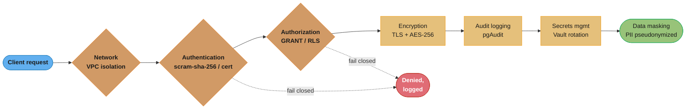
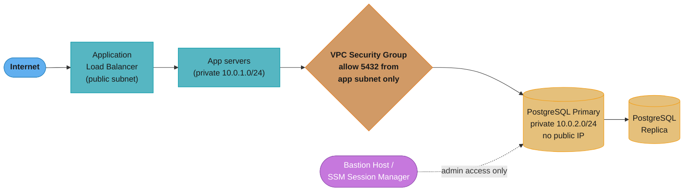
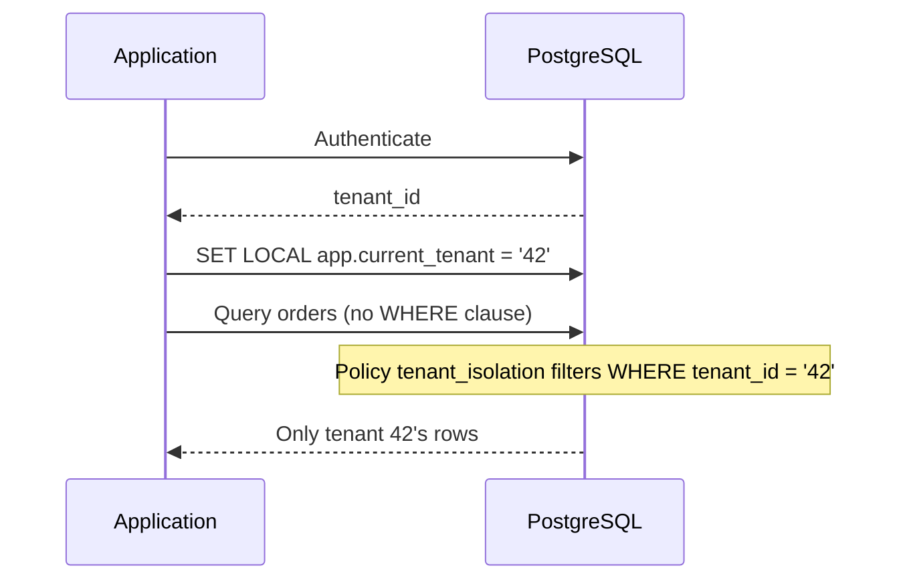
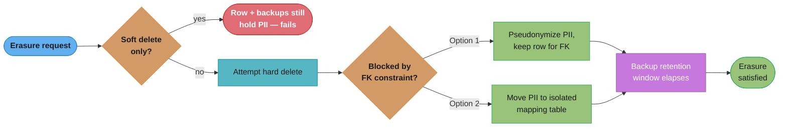

# Database Security and Compliance

## 1. Concept Overview

Database security protects data from unauthorized access, modification, and leakage. Compliance ensures the database meets regulatory requirements (GDPR, PCI DSS, HIPAA, SOC 2) around data handling, access control, audit logging, and data lifecycle management. Security and compliance overlap extensively: most compliance requirements translate directly to technical security controls.

The threat model spans internal threats (privilege escalation by engineers, accidental data exposure), external threats (SQL injection, credential theft, network attacks), and systemic threats (vendor compromise, cloud misconfiguration). Defense in depth — multiple independent layers — is the guiding principle.

---

## 2. Intuition

Database security is like securing a safe deposit vault. The building has multiple doors with key cards (network access controls). Each floor has a security guard checking IDs (authentication). Each drawer in the vault is locked (authorization). Every time someone opens a drawer, it is logged on camera (audit logging). The contents of the drawer are in a locked box inside the drawer (encryption at rest). The contents are scrambled so that even the guard cannot read them directly (data masking).

---

## 3. Core Principles

**Principle of least privilege**: Every user, application, and service should have the minimum database permissions necessary for its function. An API that only reads product data should never have INSERT, UPDATE, DELETE, or DDL privileges.

**Defense in depth**: Network isolation + authentication + authorization + encryption + audit logging — no single control is assumed to be infallible.

**Secrets never in code**: Database passwords in source code, environment variables in plain-text configuration files, or hardcoded in application JARs are security failures waiting to happen.

**Audit logging as a requirement**: The ability to answer "who accessed what data, when, and from where" is a compliance requirement for most regulatory frameworks and a forensic requirement for security incidents.

---

## 4. Types / Architectures / Strategies

```
Security Layer     | Controls                             | Technology
-------------------|--------------------------------------|---------------------------
Network            | VPC isolation, private subnets,      | VPC, Security Groups,
                   | no public IP, bastion host           | AWS VPN, PrivateLink
Authentication     | Password (scram-sha-256), cert-based | pg_hba.conf, TLS
                   | IAM authentication (cloud)           | AWS RDS IAM auth
Authorization      | GRANT/REVOKE, roles, RLS, column     | PostgreSQL GRANT,
                   | privileges                           | Row-Level Security
Encryption         | TLS in transit, AES-256 at rest      | pg SSL, LUKS, TDE
Audit logging      | DDL audit, DML on sensitive tables,  | pgAudit, MySQL audit,
                   | privilege escalation events          | CloudTrail
Secrets management | No passwords in code; rotation       | Vault, AWS Secrets Manager
Data masking       | Pseudonymize PII, mask SSN/CC        | Application layer, views
```

Every request has to clear each layer in sequence — defense in depth means a leaked credential still has to get past authorization, and a bypassed authorization check is still encrypted, audited, and masked before it reaches sensitive data:



No single layer is trusted to be infallible: a request that fails authentication or authorization is rejected and logged before it ever reaches encryption, audit logging, or masking — the same nested-vault mental model as Section 2.

---

## 5. Architecture Diagrams

**Network Security — PostgreSQL in AWS**



Neither the primary nor the replica has a public IP. The only paths in are the application-server security group on port 5432 and the bastion host for administrative access — developers never get a direct connection to 5432.

**Row-Level Security (RLS) for Multi-Tenant SaaS**



The policy is `CREATE POLICY tenant_isolation ON orders USING (tenant_id = current_setting('app.current_tenant')::UUID)`. Without RLS, a bug in the application's WHERE clause exposes every tenant's data; with RLS, the database enforces isolation regardless of what the application code does.

---

## 6. How It Works — Detailed Mechanics

### Authentication Configuration (PostgreSQL)

```
# pg_hba.conf — Host-Based Authentication
# Format: TYPE  DATABASE  USER  ADDRESS  METHOD

# Reject all local connections without password
local   all      all               scram-sha-256

# Application connections: require scram-sha-256 from app subnet
host    mydb     app_user     10.0.1.0/24   scram-sha-256

# Replication connections: certificate-based auth
host    replication  replicator  10.0.2.0/24   cert

# Reject everything else
host    all      all        0.0.0.0/0     reject

# Authentication methods (in order of security):
#   trust       — No password (NEVER use in production)
#   md5         — MD5 hash (weak, susceptible to rainbow tables; avoid)
#   scram-sha-256 — Strong (PostgreSQL 10+; default in PG 14+)
#   cert        — Client certificate authentication (strongest)
#   ident/peer  — OS user mapping (local connections only)
```

```sql
-- Create application user with minimum privileges
CREATE ROLE app_user WITH LOGIN PASSWORD 'use-vault-not-this';

-- Read-only access (example: reporting service)
GRANT CONNECT ON DATABASE mydb TO app_readonly;
GRANT USAGE ON SCHEMA public TO app_readonly;
GRANT SELECT ON ALL TABLES IN SCHEMA public TO app_readonly;
ALTER DEFAULT PRIVILEGES IN SCHEMA public GRANT SELECT ON TABLES TO app_readonly;

-- Application user: only specific tables and operations
GRANT CONNECT ON DATABASE mydb TO app_user;
GRANT USAGE ON SCHEMA public TO app_user;
GRANT SELECT, INSERT, UPDATE ON orders, order_items TO app_user;
GRANT SELECT ON products TO app_user;
-- NOT: GRANT ALL, CREATE, DROP, TRUNCATE
-- NOT: GRANT ON pg_catalog, information_schema tables
```

### Row-Level Security (RLS)

```sql
-- Enable RLS on a table
ALTER TABLE orders ENABLE ROW LEVEL SECURITY;
ALTER TABLE orders FORCE ROW LEVEL SECURITY;  -- applies to table owner too

-- Policy: each row visible only to the tenant that owns it
CREATE POLICY tenant_isolation ON orders
    FOR ALL
    USING (tenant_id = current_setting('app.current_tenant', true)::UUID)
    WITH CHECK (tenant_id = current_setting('app.current_tenant', true)::UUID);

-- Application: set tenant context before queries
-- In Spring Boot (with R2DBC or JDBC):
try (Connection conn = dataSource.getConnection()) {
    // Set tenant for this connection session
    conn.prepareStatement("SET LOCAL app.current_tenant = ?")
        .setString(1, tenantId.toString());

    // All subsequent queries on this connection are tenant-filtered
    ResultSet rs = conn.prepareStatement("SELECT * FROM orders").executeQuery();
    // Returns only current tenant's orders — RLS enforces this
}

-- Bypass RLS for admin/service accounts:
CREATE ROLE admin_user WITH LOGIN BYPASSRLS;
-- Use sparingly; audit all BYPASSRLS usage

-- Test RLS policy:
SET ROLE app_user;
SET app.current_tenant = '00000000-0000-0000-0000-000000000001';
SELECT COUNT(*) FROM orders;  -- Should return only tenant 1's orders
RESET ROLE;
```

### Encryption

```sql
-- TLS configuration (postgresql.conf):
ssl = on
ssl_cert_file = '/etc/ssl/certs/server.crt'
ssl_key_file  = '/etc/ssl/private/server.key'
ssl_min_protocol_version = 'TLSv1.2'  -- Reject TLS 1.0, 1.1
ssl_ciphers = 'HIGH:!aNULL'           -- Require strong ciphers

-- pg_hba.conf: require SSL for all connections
hostssl all all 0.0.0.0/0 scram-sha-256

-- Application JDBC connection string requiring SSL:
jdbc:postgresql://db-host:5432/mydb?sslmode=verify-full
    &sslrootcert=/etc/ssl/certs/ca.crt
# verify-full: validate server certificate AND hostname (prevents MITM)
# require: encrypt but don't validate certificate (weaker)
```

```bash
# At-rest encryption (Linux LUKS for self-hosted)
cryptsetup luksFormat /dev/sdb
cryptsetup luksOpen /dev/sdb data_volume
mkfs.ext4 /dev/mapper/data_volume
mount /dev/mapper/data_volume /var/lib/postgresql

# PostgreSQL data directory on encrypted volume
# Encryption is transparent to PostgreSQL — it reads/writes unencrypted
# Key: stored in KMS (AWS KMS, HashiCorp Vault) — never on the same server

# AWS RDS: enable encryption at creation (cannot enable after)
aws rds create-db-instance \
    --storage-encrypted \
    --kms-key-id arn:aws:kms:us-east-1:123456789:key/abc123

# MySQL Enterprise Transparent Data Encryption (TDE):
# Encrypts tablespace files on disk; keys managed via keyring plugin
```

### SQL Injection Prevention

```java
// VULNERABLE: String concatenation (never do this)
String query = "SELECT * FROM users WHERE email = '" + email + "'";
// Attacker input: ' OR '1'='1
// Resulting query: SELECT * FROM users WHERE email = '' OR '1'='1'
// Returns ALL users

// SAFE: Parameterized queries
PreparedStatement stmt = conn.prepareStatement(
    "SELECT * FROM users WHERE email = ?"
);
stmt.setString(1, email);  // Parameter, not concatenated into SQL string
ResultSet rs = stmt.executeQuery();
// No matter what email contains, it is treated as data, not SQL

// SAFE: Spring Data JPA (uses parameterized queries internally)
@Query("SELECT u FROM User u WHERE u.email = :email")
Optional<User> findByEmail(@Param("email") String email);

// SAFE: QueryDSL / Criteria API (no string SQL)
QUser user = QUser.user;
User result = queryFactory.selectFrom(user)
    .where(user.email.eq(email))
    .fetchOne();

// VULNERABLE in JPA: Native query with string concatenation
@Query(value = "SELECT * FROM users WHERE email = '" + email + "'", nativeQuery = true)
// Never do this

// ORM risks: even with ORMs, ORDER BY, GROUP BY, and raw SQL fragments can be injection points
// Always use named parameters or type-safe builders for dynamic clauses
```

### Audit Logging with pgAudit

```sql
-- Install pgAudit extension
-- postgresql.conf:
shared_preload_libraries = 'pgaudit'
pgaudit.log = 'write, ddl, role, connection'
-- Log categories: read, write, function, role, ddl, misc, connection

-- Session-level logging (all operations by current session):
SET pgaudit.log = 'all';

-- Object-level logging (specific tables):
CREATE ROLE auditor;
GRANT SELECT ON sensitive_table TO auditor;
SET pgaudit.role = 'auditor';
-- pgAudit logs all SELECT on sensitive_table regardless of who runs it

-- Log format example:
-- 2025-12-01 14:23:45 UTC [1234]: AUDIT: SESSION,1,1,WRITE,UPDATE,TABLE,
--   public.users,UPDATE users SET email = $1 WHERE id = $2,<not logged>

-- What to audit in production:
-- 1. All DDL (CREATE, ALTER, DROP)
-- 2. All writes to sensitive tables (UPDATE, INSERT, DELETE on users, payments)
-- 3. All GRANT/REVOKE (privilege changes)
-- 4. Failed authentication attempts (pg_hba rejection logs)
-- 5. Superuser/privileged role usage
```

### Secrets Management

```java
// WRONG: Database password in application.properties
spring.datasource.password=mysecretpassword  // checked into Git → security incident

// WRONG: Environment variable in plain text
spring.datasource.password=${DB_PASSWORD}    // if .env file committed to Git → exposed

// RIGHT: HashiCorp Vault dynamic credentials
// Vault generates time-limited credentials (TTL = 1 hour)
// Application uses Vault's JDBC secrets engine

@Configuration
public class DatabaseConfig {

    @Bean
    public DataSource dataSource(VaultTemplate vault) {
        VaultResponse response = vault.read("database/creds/app-role");
        Map<String, Object> data = response.getData();

        // Credentials valid for 1 hour; Vault auto-renews or app re-requests
        return DataSourceBuilder.create()
            .url("jdbc:postgresql://db-host:5432/mydb")
            .username((String) data.get("username"))  // Dynamic: v-role-xyz123
            .password((String) data.get("password"))  // Randomly generated
            .build();
    }
}

// RIGHT: AWS Secrets Manager with automatic rotation
// Secrets Manager rotates the password every 30 days automatically
// Application fetches secret at startup (cached, refreshed periodically)

String secret = secretsManagerClient.getSecretValue(
    GetSecretValueRequest.builder()
        .secretId("prod/myapp/db-credentials")
        .build()
).secretString();

// Parse JSON: {"username": "app_user", "password": "abc123xyz"}
```

The security value of rotation is a single quantity — how long a stolen credential keeps working:

```
  exposure_window        = credential_lifetime
  expected_exposure      = credential_lifetime / 2      (leak equally likely at any moment)
```

**What this actually says.** "Rotation does not stop a credential from being stolen; it puts an expiry date on the theft, and the length of that date is the entire security benefit."

This reframes rotation from hygiene into risk arithmetic. A password that never rotates has an unbounded exposure window, which is why a credential in Git history is a permanent incident rather than a past one.

| Symbol | What it is |
|--------|------------|
| `credential_lifetime` | How long a given username/password remains valid. `TTL = 1 hour` for Vault dynamic creds |
| `exposure_window` | Worst-case time an attacker can use a stolen credential before it dies on its own |
| `expected_exposure` | Average, assuming the theft is equally likely at any point in the credential's life |
| TTL | Vault's time-to-live. Vault revokes the database user when it expires — no human step |
| 30-day rotation | AWS Secrets Manager's automatic cadence. Bounded, but two orders of magnitude looser than a 1-hour TTL |

**Walk one example.** The same stolen credential under three regimes:

```
  regime                        lifetime      worst case      expected (half)
  static password in Git        unbounded     forever          forever
  Secrets Manager, 30 days       720 h         30 days          15 days
  Vault dynamic creds, TTL 1h      1 h          1 hour          30 minutes

  moving from 30-day rotation to a 1-hour TTL:
    720 h / 1 h  =  720x smaller window   =  99.861% of the exposure removed
```

The jump from "never" to "30 days" is the one that converts an unbounded risk into a bounded one; the jump from 30 days to 1 hour is what shrinks the bound to something an incident response process can actually outrun. Both jumps matter, and they are different in kind.

**What the dynamic-credential model buys beyond the shorter window.** Vault issues a *distinct* database user per application instance (`v-role-xyz123`), so the audit log attributes every statement to a specific lease rather than to a shared `app_user`. That turns "someone with the app credential read the patients table" into "this lease, issued to this pod at this time, read the patients table" — which is the difference between knowing a breach happened and being able to scope it.

### GDPR/CCPA Right to Erasure

Soft delete alone does not satisfy the right to erasure — the row and its PII still exist in the database and in backups. The database has to pick a path around the foreign-key constraints that reference the user:



Options 1 and 2 both preserve referential integrity while destroying the PII itself; either way, erasure is only complete once the backup retention window (for example 35 days) elapses and the last PITR snapshot holding the old value expires.

```sql
-- Hard delete vs soft delete for compliance
-- Soft delete (deleted_at column) does NOT satisfy right to erasure
-- Data still exists in the database and in backups

-- Option 1: Hard delete + referential integrity
-- Challenge: foreign key constraints prevent deletion of user if referenced

-- Solution: pseudonymization before deletion
UPDATE users SET
    email = 'deleted_' || id || '@deleted.invalid',
    phone = NULL,
    name = 'Deleted User',
    address = NULL,
    deleted_at = now()
WHERE id = :user_id;

-- The user record still exists (preserves referential integrity for orders, etc.)
-- But all PII is overwritten — effectively anonymized
-- Orders still reference user_id but user's personal data is gone

-- Option 2: Data masking with re-identification prevention
-- Replace PII with consistent pseudonymous identifiers
-- user_id 12345 → pseudonym "USR_abc123def456" (consistent but not reversible)
-- Maintain mapping table in separate isolated system (for support purposes)
-- Erase mapping on deletion request

-- Backup compliance:
-- PITR backups retain deleted data (WAL includes the UPDATE/DELETE)
-- After retention period expires (e.g., 35 days), the backup is gone
-- Document: "right to erasure is effective within backup retention period"
-- Some regulations (GDPR) accept this; review with legal team

-- PostgreSQL pg_catalog encryption for stored procedures with PII:
CREATE OR REPLACE FUNCTION get_user_email(p_user_id BIGINT)
    RETURNS TEXT
    LANGUAGE SQL
    SECURITY DEFINER  -- runs as function owner, not caller
    SET search_path = public
AS $$
    SELECT email FROM users WHERE id = p_user_id;
$$;
-- Only grant EXECUTE, not SELECT on users table directly
GRANT EXECUTE ON FUNCTION get_user_email TO app_user;
REVOKE SELECT ON users FROM app_user;  -- access only via function
```

---

## 7. Real-World Examples

**Facebook**: Uses column-level access controls and data warehouse privacy annotations. Access to PII fields (email, phone) requires separate justification and logging even for internal engineers.

**Stripe**: All database access is through an internal service gateway that enforces role-based access, logs every query to a separate audit system, and requires two-factor authentication for production database access.

**Cloudflare**: Zero-trust database access — no direct database connections for engineers. All access is through a bastion host with hardware key authentication, recorded sessions, and approval workflows for production access.

---

## 8. Tradeoffs

```
Control             | Security Benefit       | Performance/UX Cost
--------------------|------------------------|-------------------------
RLS enforcement     | Row-level isolation    | Slight query overhead
TLS (verify-full)   | Prevent MITM           | TLS handshake overhead
pgAudit all writes  | Full audit trail       | Storage and I/O overhead
Dynamic credentials | Credential rotation    | Vault dependency
Hard delete         | True erasure           | Referential integrity complexity
SCRAM-SHA-256       | Strong auth            | Slightly slower than md5
Column encryption   | Field-level security   | Application complexity
```

---

## 9. When to Use / When NOT to Use

**Always use**: TLS for connections, scram-sha-256 authentication, parameterized queries (not optional), VPC isolation with private subnets, least-privilege roles.

**Use RLS when**: multi-tenant SaaS where the same database serves multiple tenants and application-layer filtering is insufficient defense. RLS provides database-enforced isolation.

**Use pgAudit when**: compliance frameworks require audit trails (PCI DSS, HIPAA, SOC 2 Type II). Log DDL always; log DML selectively (sensitive tables only — avoid logging all DML as it is high volume).

**Use dynamic credentials (Vault) when**: team is large enough that credential rotation is a serious operational concern, or compliance requires credential rotation without manual process.

**Avoid over-encryption**: encrypting every column individually creates significant application complexity. Encrypt at rest (storage encryption) + encrypt in transit (TLS) + encrypt backups. Column-level encryption only for the most sensitive fields (SSN, credit card, health data).

---

## 10. Common Pitfalls

**Database credentials committed to Git**: A developer adds `spring.datasource.password=prod_password` to application.properties and commits it. Git history preserves it forever even after deletion. An attacker with repository access (or via a public repo accident) has production database access. Fix: rotate the credential immediately. Use `.gitignore` + Vault/Secrets Manager. Scan Git history with `git-secrets` or `truffleHog`.

**Superuser privilege creep**: An application role accumulates SUPERUSER or CREATEROLE privileges over time ("just for the migration"). The application runs with superuser. A SQL injection attack now has full database superuser access — can read all data, create backdoor roles, drop tables. Fix: application roles should never have SUPERUSER, CREATEROLE, or CREATEDB. Run schema migrations as a separate migration role with only DDL privileges during deployment windows.

**SQL injection via ORDER BY**: Team uses parameterized queries for WHERE clauses but constructs ORDER BY dynamically: `"SELECT * FROM products ORDER BY " + column + " " + direction`. An attacker passes `column = "1; DROP TABLE products; --"`. Fix: validate `column` and `direction` against a whitelist of allowed values: `if (!ALLOWED_COLUMNS.contains(column)) throw new IllegalArgumentException(...)`.

**Open security group for 5432**: During development, someone opens PostgreSQL port 5432 to `0.0.0.0/0` in the cloud security group for "convenience." The database is now reachable from the internet. Automated scanners find it within hours; brute-force attempts begin. Fix: PostgreSQL should never be directly reachable from the internet. Use VPC private subnets, security groups restricted to application subnet CIDR, and bastion host / AWS Systems Manager Session Manager for administrative access.

**pgAudit log storage explosion**: pgAudit configured with `pgaudit.log = 'all'` on a 50K TPS database. Every SELECT is logged. Log storage grows at 10GB/hour. Disk fills. PostgreSQL halts. Fix: be selective — log DDL and ROLE always; log WRITE for sensitive tables; consider READ only for specific audit-required tables via object-level pgAudit configuration.

---

## 11. Technologies & Tools

| Tool                  | Purpose                                     |
|-----------------------|---------------------------------------------|
| pgAudit               | PostgreSQL audit logging extension          |
| MySQL Audit Plugin    | MySQL Enterprise audit logging              |
| HashiCorp Vault       | Dynamic secrets, credential rotation        |
| AWS Secrets Manager   | Managed secret storage with rotation        |
| AWS IAM DB Auth       | IAM authentication for RDS/Aurora           |
| pg_partman            | Partition management for audit log tables   |
| Prowler               | AWS security config audit                   |
| AWS Macie             | PII detection in S3 (backup data)           |
| Snyk                  | Dependency and secret scanning in CI        |
| OWASP SQLMap          | SQL injection testing tool                  |

---

## 12. Interview Questions with Answers

**Q: How does row-level security in PostgreSQL work and when would you use it?**
Row-Level Security (RLS) attaches access policies to database tables. When enabled (`ALTER TABLE t ENABLE ROW LEVEL SECURITY`), every query against the table is automatically filtered by the policy's `USING` clause. For multi-tenant SaaS: `CREATE POLICY tenant_isolation ON orders USING (tenant_id = current_setting('app.current_tenant')::UUID)`. The application sets the tenant context (`SET LOCAL app.current_tenant = 'uuid'`) before each query. The database enforces isolation — no application WHERE clause needed, and no application bug can leak cross-tenant data. Use RLS when the database hosts data for multiple security principals and application-layer filtering is insufficient defense.

**Q: What is the risk of granting SUPERUSER in PostgreSQL?**
SUPERUSER bypasses all access controls, RLS policies, and authorization checks. A SUPERUSER can: read any data in any database, modify any row (including audit logs), create and drop any object, execute system commands (via `COPY TO/FROM PROGRAM`), create new superuser roles, and read pg_shadow (hashed passwords). If an application runs with SUPERUSER, a SQL injection attack gains complete control over the database server, potentially including OS-level code execution. Rules: no application role should be SUPERUSER; no human should have permanent SUPERUSER (use just-in-time elevated access via Vault); monitor all SUPERUSER login events.

**Q: How do you implement the right to erasure without compromising referential integrity?**
Hard delete violates foreign key constraints if the user is referenced by orders, reviews, etc. Solutions: (1) Pseudonymization: overwrite all PII fields with placeholder values (`email = 'deleted_' || id || '@deleted.invalid'`, `name = NULL`, `phone = NULL`), keeping the row for referential integrity. The user's identity is erased; their orders still reference their (now anonymous) user_id. (2) Cascade soft delete with PII nullification: mark `deleted_at = now()`, null out all PII columns. Foreign key references remain valid. (3) Separate PII table: store PII in a separate table joined to the main user table; deletion removes the PII row while the stub user_id remains for referential integrity. For backups: document that erasure applies to live data; backup data containing the erased PII expires within the backup retention window (typically 7–35 days).

**Q: What is parameterized query and why does it prevent SQL injection?**
A parameterized query sends the SQL template and the parameter values as separate messages to the database driver. The driver handles parameter escaping and type-safe binding. The database parses the SQL template as structure (not including parameter values) and treats parameter values as data — no matter what characters they contain. In contrast, string concatenation embeds the parameter value directly into the SQL string before sending it, allowing an attacker to inject SQL syntax. With `PreparedStatement.setString(1, email)`, an email containing `' OR '1'='1` is treated as a literal string value, not SQL syntax. The database sees: `SELECT * FROM users WHERE email = $1` with $1 bound to the full email string as a data value.

**Q: How do you secure database credentials in a Kubernetes environment?**
Options in increasing security: (1) Kubernetes Secrets (base64-encoded, not encrypted by default) + RBAC to restrict access — minimum viable approach. (2) Kubernetes Secrets with etcd encryption at rest + RBAC — moderate improvement. (3) External Secrets Operator + AWS Secrets Manager or Vault: Secrets Manager stores credentials, Operator syncs to Kubernetes Secrets, credentials rotated automatically without redeployment. (4) HashiCorp Vault Agent Injector: injects credentials directly into the pod as files via init container; credentials have short TTL (1 hour); no Kubernetes Secret object created. (5) AWS RDS IAM authentication: no password at all — application exchanges its IAM role identity for a temporary DB token. Each approach has a different tradeoff between complexity and security.

**Q: What is TDE (Transparent Data Encryption) and how does it compare to volume encryption?**
TDE encrypts database data files at the database engine level, before they are written to disk. The database manages encryption keys internally (often via a keyring plugin). Data is decrypted in memory when read by the database. Provides fine-grained control (can encrypt specific tablespaces or columns). Volume encryption (LUKS, AWS EBS encryption) encrypts the entire storage volume at the block level. The operating system and database see unencrypted data in memory; disk writes are encrypted transparently. Volume encryption is simpler to configure and covers all files (including WAL, temp files, log files). Both protect against physical media theft. Volume encryption is sufficient for most use cases; TDE provides additional protection if OS-level access is a concern.

**Q: How does pgAudit differ from PostgreSQL standard logging?**
Standard PostgreSQL logging (`log_statement = 'all'`) logs queries as submitted but does not parse them into meaningful audit events. pgAudit is an extension that hooks into the executor and parses each statement into a structured audit record: operation type (SELECT/INSERT/UPDATE/DELETE/DDL), object type (TABLE/INDEX/SCHEMA), object name, and the full statement. pgAudit supports two modes: session-level auditing (log all operations in the current session) and object-level auditing (log operations on specific tables via a dedicated audit role). pgAudit's structured output is parseable by SIEM systems; standard logging requires complex log parsing. pgAudit is the standard for PCI DSS and HIPAA compliance on PostgreSQL.

**Q: How do you detect and respond to SQL injection attacks?**
Detection: (1) WAF (Web Application Firewall) with SQL injection rules — blocks known patterns at the HTTP layer. (2) Database audit logs — unusual queries with SQL metacharacters (`'`, `--`, `UNION`, `OR 1=1`) in parameter positions. (3) Anomaly detection — queries from application service accounts that include DDL commands are suspicious (application role should not have DDL privileges). (4) Error monitoring — a sudden spike in `pg_stat_activity.query` containing error patterns. Response: (1) Block the source IP at the WAF or application layer immediately. (2) Audit logs to determine what data was accessed or modified. (3) If data was exfiltrated, initiate breach notification procedures per GDPR/CCPA. (4) Apply parameterized query fixes before re-enabling access.

**Q: What are the compliance database requirements for PCI DSS?**
PCI DSS (Payment Card Industry Data Security Standard) for databases: (1) Encryption: cardholder data must be encrypted at rest (AES-256) and in transit (TLS 1.2+). (2) Access control: least privilege; no generic shared accounts; individual user accounts with audit trails. (3) Audit logging: log all access to cardholder data, failed authentication, privilege escalation, DDL operations. Logs retained for 12 months. (4) Network segmentation: PCI-scoped databases isolated in separate VPC/subnet, accessible only from in-scope application servers. (5) Vulnerability management: database software patched within 30 days for critical CVEs. (6) Key management: encryption keys stored separately from encrypted data, with key rotation annually. (7) No direct access to cardholder data fields by application code — use tokenization (replace card number with opaque token).

**Q: How do you implement column-level permissions for sensitive data?**
PostgreSQL supports column-level GRANT: `GRANT SELECT (id, name, email) ON users TO app_user;` — the role can read only the specified columns, not `ssn` or `credit_card_number`. However, this becomes complex to manage at scale. Alternative approaches: (1) Database views that expose only non-sensitive columns; application queries the view, not the base table. (2) Row-Level Security with attribute-based policies (specific roles see specific columns by using CASE expressions or NULLing sensitive fields for lower-privileged roles). (3) Application-layer masking: fetch all columns at the database layer but mask before returning to the API response. (4) Dedicated data access layer (DAL) with masking logic that intercepts all database reads. Column-level grants are the most rigorous (enforced at DB) but add operational complexity.

**Q: What is the principle of least privilege and how do you audit compliance?**
Least privilege: every database principal has exactly the minimum permissions required for its function and no more. Audit compliance: (1) Enumerate all roles and their privileges: `SELECT grantee, table_name, privilege_type FROM information_schema.role_table_grants WHERE table_schema = 'public'`. (2) Enumerate superusers: `SELECT rolname FROM pg_roles WHERE rolsuper`. (3) Identify roles with excessive privileges: roles granted DML on all tables when they only need access to a subset. (4) Compare actual privileges against documented "least privilege baseline" in a runbook. (5) Use `pg_stat_user_tables` to identify tables that a role accesses — if a role has SELECT on 50 tables but only queries 5, revoke the other 45. Run this audit quarterly; automate with CI/CD that fails if a role has undocumented privileges.

**Q: How do you protect against accidental data exposure via overly broad queries?**
Multi-layer approach: (1) RLS (database layer): ensure every sensitive table has RLS policies — even if application code forgets a WHERE clause, the database enforces tenant/user isolation. (2) Scoped application roles: the application role has SELECT only on the specific columns and tables it legitimately needs, not `SELECT ON ALL TABLES`. (3) Query monitoring: pg_stat_statements tracks all queries; alert on queries scanning full tables (seq scans on large tables without filters) from application roles. (4) Data classification: tag tables/columns as PII/PHI; automated tests ensure application code accessing tagged columns always includes appropriate filters. (5) API response validation: application-layer tests that verify responses contain only the expected user's data (not other users' records).

**Q: How do you protect PII when copying production data into staging or development environments?**
Copying a production dump straight into staging exposes real PII to a much larger, less-audited set of engineers, so it must be masked first. A masking pipeline runs between the production export and the staging import: replace names, emails, and phone numbers with deterministic fake values (the same input always maps to the same fake output, preserving referential consistency across tables), null out high-sensitivity fields like SSN and payment tokens entirely, and preserve realistic data distributions so masked data still exercises real application code paths. Tools like Delphix, or `pg_dump` combined with custom masking scripts, automate this at the database layer instead of relying on developers to manually scrub data before every environment refresh. Apply staging access controls proportional to whatever sensitivity remains after masking — a staging database with any residual PII fields is still effectively in HIPAA or PCI scope. Never grant broader staging access than the sensitivity of the data actually stored there justifies.

**Q: How do you secure PostgreSQL replication connections between the primary and its replicas?**
Replication traffic carries a full copy of the write-ahead log, so an unencrypted or weakly authenticated replication connection is a direct path to exfiltrate the entire database. Configure `pg_hba.conf` with a dedicated replication entry using certificate-based authentication (`hostssl replication replicator 10.0.2.0/24 cert`) rather than password auth, since certificates are harder to phish and can be scoped to exactly the replica's IP range. Require TLS for the replication connection itself, not just client connections, with `ssl_min_protocol_version = 'TLSv1.2'`, and restrict the replication user's role to `REPLICATION` privilege only — never grant it broader table access. Place replicas in the same private-subnet security model as the primary, with the security group allowing port 5432 only from other database-tier nodes, never from application subnets or the internet. Rotate replication certificates on the same schedule as other service certificates rather than treating them as a one-time setup step.

**Q: What is a SOC 2 Type II audit and what database controls does it require, in contrast to PCI DSS?**
SOC 2 Type II evaluates whether security controls operated effectively over a sustained period, typically 6-12 months, rather than at one point in time like PCI DSS. For databases, this means an auditor needs continuous evidence, not just a snapshot: access logs and pgAudit output retained across the entire audit window, change-management records showing every schema migration went through review, and proof that least-privilege access reviews happened on a recurring cadence rather than once. The trust principles most relevant to databases are security (RLS, encryption, network isolation) and availability (documented RPO/RTO with tested DR), with confidentiality applying wherever sensitive columns need restricted access. Unlike PCI DSS's prescriptive checklist, SOC 2 lets the organization define its own controls but requires auditors to verify those controls were followed consistently, so gaps show up as missing evidence rather than missing checkboxes. Build audit-evidence collection into routine operations, such as automated pgAudit log archival and quarterly access reviews, well before the audit window starts since Type II cannot be satisfied retroactively.

**Q: What is a GDPR data subject access request (DSAR) and how does it differ from the right to erasure?**
A DSAR requires an organization to provide a data subject with a copy of all personal data held about them within one month, whereas the right to erasure requires deleting or anonymizing that data instead. Fulfilling a DSAR at the database layer means being able to answer which tables and columns contain this person's data across the entire schema, not just the obvious `users` table — foreign-keyed records in orders, support tickets, and audit logs all count. Teams typically build a data inventory or catalog, tagging PII columns at the schema level, so a DSAR script can join across every tagged table by the subject's identifier and export a complete, human-readable record. Unlike erasure, a DSAR must include data currently in backups only if it is reasonably accessible without disproportionate effort — most organizations satisfy this by exporting from the live database and documenting that backup data is covered by normal retention policies. Automate DSAR fulfillment before volume makes manual per-request data hunting operationally unsustainable.

---

## 13. Best Practices

- **Enable TLS with `sslmode=verify-full`** — accept no connections without certificate validation.
- **Use scram-sha-256** — never md5 (deprecated), never trust (except for local Unix socket admin).
- **Create a dedicated migration role** with DDL privileges for schema changes; the application role has only DML.
- **Enable RLS for all multi-tenant tables** — database-enforced isolation is defense against application bugs.
- **Store credentials in Vault or Secrets Manager** — rotate automatically; never in environment variables committed to repos.
- **Enable pgAudit for DDL and sensitive table writes** — log to a separate, append-only audit log storage.
- **No direct developer access to production database** — use just-in-time elevated access with audit logging (AWS SSM Session Manager, Teleport).
- **Scan Git history and CI pipelines** for secrets — use `git-secrets`, `truffleHog`, or GitHub Advanced Security.

---

## 14. Case Study

**Scenario**: A healthcare SaaS company stores patient records in PostgreSQL. HIPAA requires: access controls (only authorized users see patient data), audit trails (who accessed which patient records), encryption at rest and in transit, and breach notification capability. The current system uses a single `app_user` role with full access to all tables.

**Security redesign**:

```sql
-- 1. Role hierarchy
CREATE ROLE readonly_role;
CREATE ROLE clinician_role;
CREATE ROLE admin_role;

-- 2. Least privilege
GRANT SELECT ON patients, appointments TO readonly_role;
GRANT SELECT, INSERT, UPDATE ON patients, appointments, clinical_notes TO clinician_role;
GRANT readonly_role TO clinician_role;  -- clinician inherits readonly

-- 3. Row-Level Security (patient data isolated per provider organization)
ALTER TABLE patients ENABLE ROW LEVEL SECURITY;
CREATE POLICY org_isolation ON patients
    USING (org_id = current_setting('app.current_org')::UUID);

-- Clinicians can only see patients in their organization
-- Even a bug leaking org_id is limited to single org

-- 4. Column-level protection for SSN
REVOKE SELECT ON patients FROM clinician_role;
GRANT SELECT (id, name, dob, medical_record_number, org_id) ON patients TO clinician_role;
-- SSN column not granted; only accessible via SECURITY DEFINER function with audit log

CREATE FUNCTION get_patient_ssn(p_patient_id BIGINT) RETURNS TEXT
    LANGUAGE plpgsql SECURITY DEFINER AS $$
DECLARE v_ssn TEXT;
BEGIN
    SELECT ssn INTO v_ssn FROM patients WHERE id = p_patient_id;
    -- Audit log this access
    INSERT INTO ssn_access_log (user_id, patient_id, accessed_at)
    VALUES (current_user, p_patient_id, now());
    RETURN v_ssn;
END;
$$;

-- 5. pgAudit configuration
-- postgresql.conf:
-- shared_preload_libraries = 'pgaudit'
-- pgaudit.log = 'ddl,role'
-- Object-level audit on clinical_notes:
SET pgaudit.role = 'hipaa_auditor';
GRANT SELECT, INSERT, UPDATE, DELETE ON clinical_notes TO hipaa_auditor;
-- Now all access to clinical_notes is audit-logged

-- 6. Network (AWS): PostgreSQL in private subnet
-- Security group: allow 5432 only from application server security group
-- No public IP; developer access via AWS SSM Session Manager (logged, MFA required)

-- 7. Encryption
-- Storage: AWS RDS with encryption at rest (AWS KMS)
-- Transit: TLS with verify-full, TLS 1.2+ only
-- Application properties: credentials from AWS Secrets Manager (auto-rotated every 30 days)
```

**HIPAA compliance mapping**:
- Access controls: role hierarchy + RLS ✓
- Minimum necessary access: column-level privileges on SSN ✓
- Audit trail: pgAudit for DDL/role + object-level for clinical_notes + SSN access log ✓
- Encryption: RDS at-rest encryption + TLS in transit ✓
- Workforce access: individual named roles (not shared app_user) + SSM Session Manager ✓
- Breach notification: audit logs in S3 (90-day retention) enable forensic reconstruction of what data was accessed ✓
