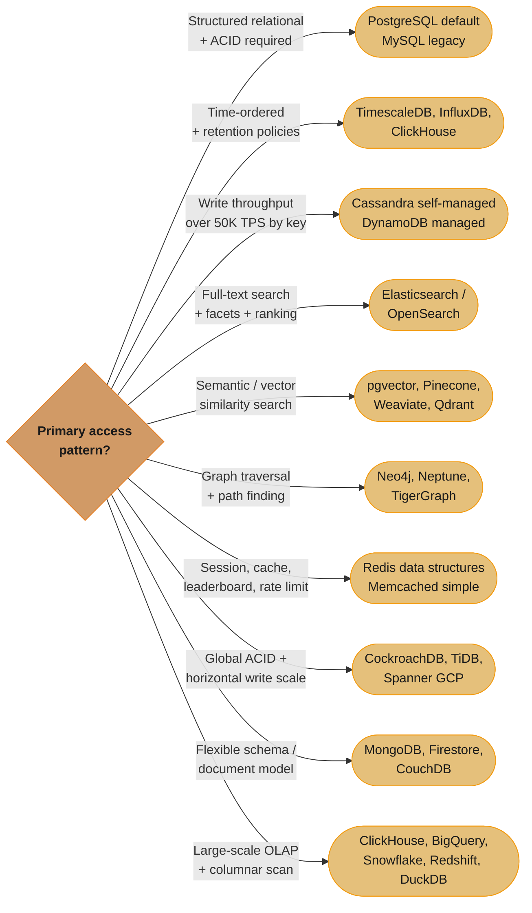
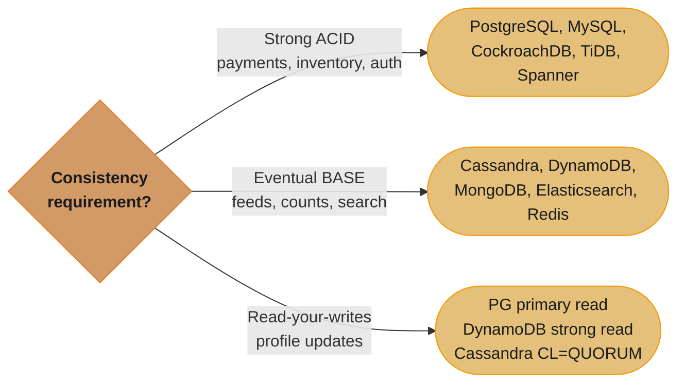
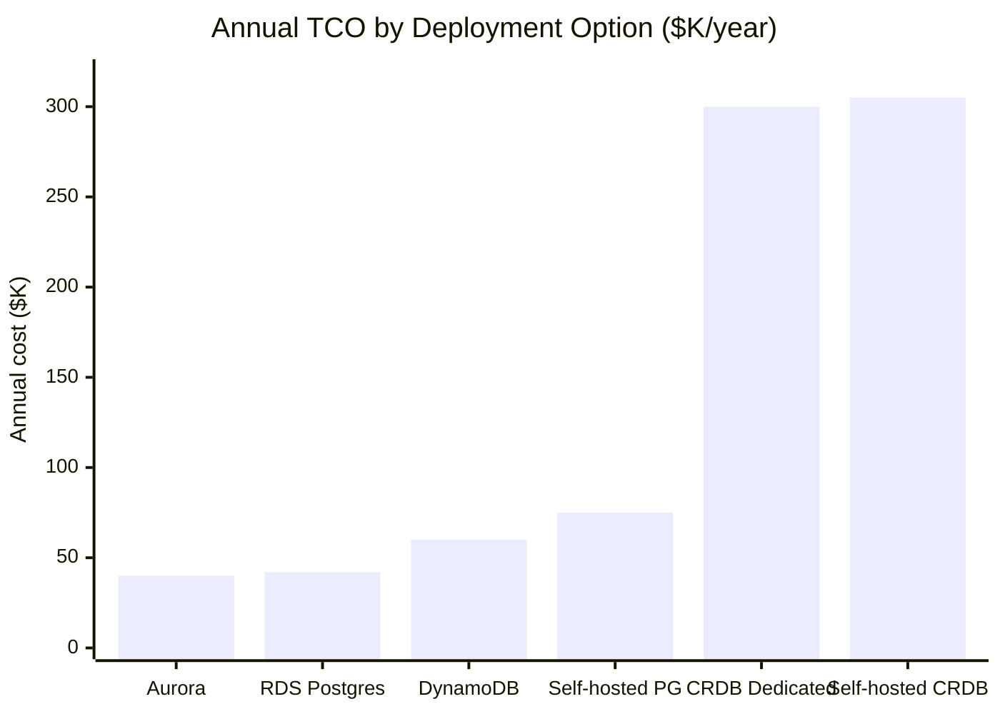
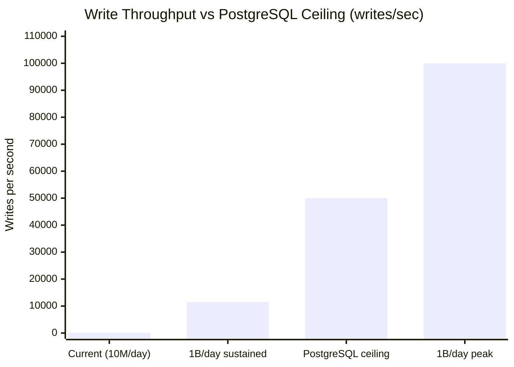
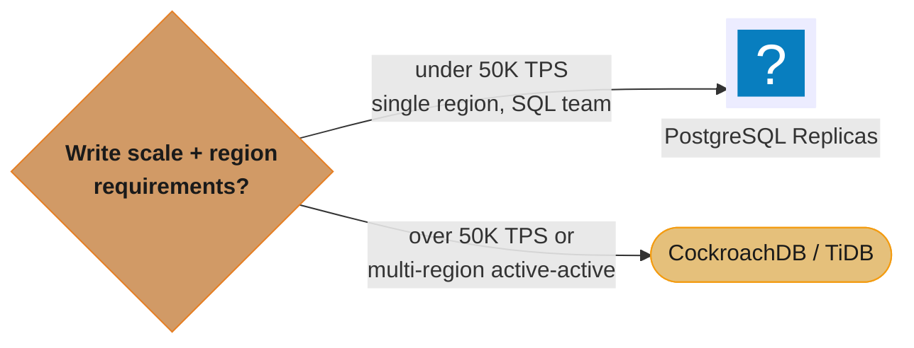

# Database Selection Framework

## 1. Concept Overview

Database selection is one of the highest-leverage architectural decisions in a system. The choice of database engine shapes data models, query capabilities, operational complexity, scaling behavior, and team expertise requirements for years. Unlike most software components, migrating between database engines is enormously expensive — a decision made at system inception with 100 rows often proves catastrophic (or irreversible without significant rework) at 100 billion rows.

The framework: first define requirements precisely (consistency, scale, query patterns, team expertise, cost, operational complexity), then evaluate candidate databases against those requirements, and finally make an explicit tradeoff decision. The worst database selection processes skip requirements definition and jump straight to "what's trendy."

---

## 2. Intuition

Choosing a database without requirements is like buying a vehicle without knowing whether you're transporting one person across a city, 50 people on a highway, or freight across mountains. A Ferrari is not a bad vehicle — it is the wrong vehicle for freight. PostgreSQL is not a bad database — it might be the wrong database for a globally distributed system requiring sub-millisecond writes from 6 continents. The framework is the questions you must answer before evaluating candidates.

---

## 3. Core Principles

**Requirements first**: Consistency model, access patterns, scale expectations, query complexity, and operational constraints must be documented before evaluating databases.

**Prove it with benchmarks**: Benchmark candidates under production-realistic load (not synthetic TPC-C). A database that performs well at 1000 QPS may perform differently at 1M QPS.

**Operational cost matters as much as feature set**: A database that requires 3 senior DBAs to operate (Cassandra) has a different total cost than a managed cloud database with the same capabilities (DynamoDB).

**Avoid the sunk cost trap**: If you discover the wrong database was chosen, migrating is painful but less painful than scaling the wrong database further. Make the migration decision early.

**Start with PostgreSQL**: For most applications at startup stage, PostgreSQL is the right default. Add specialized databases only when proven requirements cannot be met.

---

## 4. Types / Architectures / Strategies

### Selection Decision Tree



Follow the branch matching your dominant access pattern to its recommended engines — most production systems land on 2-4 branches at once (Section 7's Instagram example pairs PostgreSQL, Cassandra, and Redis in a single architecture).

---

## 5. Architecture Diagrams

```
Database Selection Decision Matrix
====================================

Requirement Dimensions:
  C = Consistency (Strong / Eventual)
  S = Scale (Vertical / Horizontal)
  Q = Query (Simple lookups / Complex SQL / Graph / Search / Time-series)
  O = Operations (Self-managed / Managed cloud)
  T = Team expertise (SQL / NoSQL / Specialized)

                         Consistency  Scale     Query       Managed   Notes
                         -----------  -----     -----       -------   -----
PostgreSQL               Strong       Vertical  Full SQL    Yes/Self  Default; extension rich
MySQL                    Strong       Vertical  Full SQL    Yes/Self  Legacy; InnoDB solid
CockroachDB              Strong       Horiz     SQL         Yes/Self  Distributed ACID
TiDB                     Strong       Horiz     MySQL SQL   Yes/Self  HTAP (TiKV+TiFlash)
Cassandra                Tunable      Horiz     CQL         Self      Write-heavy time-series
DynamoDB                 Tunable      Horiz     Key-value   Yes       AWS-native; ops-free
MongoDB                  Eventual     Horiz     Doc queries Yes/Self  Flexible schema
Elasticsearch            Eventual     Horiz     Full-text   Yes/Self  Search + analytics
Redis                    Eventual     Horiz     Data struct Yes/Self  Cache + leaderboard
ClickHouse               Eventual     Horiz     OLAP SQL    Yes/Self  Analytics, 10-100x compr
TimescaleDB              Strong       Vertical  SQL + time  Yes/Self  Time-series on PG
Neo4j                    Strong       Vertical  Graph (Cyph)Yes/Self  Graph traversal
pgvector                 Strong       Vertical  Vector sim  Yes/Self  Embedded in PostgreSQL
Pinecone                 Eventual     Horiz     Vector sim  Yes       Managed vector DB
Spanner                  Strong       Horiz     SQL         Yes(GCP)  Global ACID
```

---

## 6. How It Works — Detailed Mechanics

### Requirement Dimensions in Detail

**Consistency requirements**:

Pick the tier per data type, not per system — Section 7's Instagram example pairs strong-ACID PostgreSQL for accounts with eventually-consistent Cassandra for the feed.

**Scale dimensions**:
```
Read scale:
  → PostgreSQL + read replicas (handles 99% of cases)
  → Redis cache layer (100x read reduction before DB)
  → Elasticsearch (read-heavy search with horizontal scale)

Write scale:
  → Cassandra / DynamoDB (leaderless, horizontal write scale)
  → CockroachDB / TiDB (distributed SQL, horizontal write scale)
  → ClickHouse (batch writes at massive scale)
  → Redis (in-memory, 1M ops/second per node)

Dataset scale:
  → PostgreSQL: up to 10TB practical (single node + replicas)
  → Cassandra: petabyte scale
  → ClickHouse: petabyte scale
  → DynamoDB: effectively unlimited (managed)
```

**Query pattern mapping**:
```
Point lookups (by primary key or indexed field):
  Any database → PostgreSQL simplest if no other requirements

Range queries (date ranges, numeric ranges):
  PostgreSQL (B+tree), Cassandra (clustering key ordering within partition),
  TimescaleDB (time-range pruning), ClickHouse (ORDER BY as primary index)

Full-text search (tokenized, relevance-ranked):
  Elasticsearch / OpenSearch — not substitutable by PostgreSQL FTS at scale

Aggregations over large datasets:
  ClickHouse, BigQuery, Snowflake — columnar storage is 10-100x faster than row stores

Graph traversal (find all friends of friends within 3 hops):
  Neo4j (index-free adjacency, O(1) per hop) vs
  PostgreSQL recursive CTE (O(log N) per hop via index, acceptable for small graphs)

Vector similarity (semantic search, recommendation):
  pgvector (< 10M vectors, integrated with PostgreSQL)
  Pinecone/Weaviate/Qdrant (> 10M vectors, dedicated infrastructure)

Time-series (sensor readings, metrics, logs):
  TimescaleDB (SQL + time compression), InfluxDB (DevOps metrics), ClickHouse (analytics)
```

### Benchmark Traps

```
Trap 1: Vendor benchmarks on synthetic workloads
  → Use TPC-C / TPC-H / YCSB results as comparison only
  → Always reproduce with production-realistic data and access patterns

Trap 2: Wrong dataset size
  → Benchmark on 1GB for a system that will have 10TB
  → B+tree height changes, buffer pool hit rates change, query plans change

Trap 3: Wrong concurrency
  → Benchmark at 10 connections for a system with 1000 concurrent connections
  → Lock contention, MVCC overhead, and pool exhaustion only appear at production concurrency

Trap 4: Cold benchmark
  → First run after loading data hits cold caches
  → Warm the database first; then run the benchmark

Trap 5: Not testing worst-case queries
  → P99 and P999 latency matters more than average
  → Include pagination queries, aggregations, and cross-shard operations

Correct approach:
  1. Load production-representative data (same size, same cardinality distribution)
  2. Warm the buffer pool (pre-run read workload)
  3. Run at production peak concurrency
  4. Measure P50, P95, P99, P999 latency
  5. Measure throughput at multiple concurrency levels (find the knee)
  6. Run for 30+ minutes (not 5-minute burst)
  7. Include write workload (mix reads + writes per production ratio)
```

### Total Cost of Ownership (TCO)

```
Self-hosted PostgreSQL (4-core, 32GB, 2× NVMe SSD):
  Compute: $500-800/month (EC2 r5.xlarge equivalent)
  Storage: $200/month (2TB NVMe)
  Engineer time: 0.25 FTE × $250K = $62,500/year for ops/upgrades/HA
  Total: ~$75K/year

AWS RDS PostgreSQL (db.r5.xlarge, 2TB):
  Instance: $1,500/month ($18K/year)
  Storage: $460/month
  Multi-AZ: 2× instance cost → $36K/year
  Total: ~$42K/year (lower than self-managed if ops time is valued)

AWS Aurora (db.r5.xlarge, 2TB):
  Instance: $3,000/month (cluster with 1 reader)
  Storage: auto-scaled, ~$300/month
  Total: ~$40K/year (similar to RDS, better performance)

Self-hosted CockroachDB (9 nodes for 3-region HA):
  Compute: 9 × $500/month = $4,500/month
  Engineer time: 1 FTE for distributed system expertise
  Total: ~$305K/year

CockroachDB Dedicated (managed):
  Starts at $3,000+/month per region
  Total: $100-500K/year depending on scale

DynamoDB (100M writes/day, 1B reads/day):
  Write capacity: 1M writes × $1.25/million = $1,250/month
  Read capacity: 10M reads × $0.25/million = $2,500/month
  Storage: 5TB × $0.25/GB = $1,250/month
  Total: ~$60K/year (no operational overhead)
```


The distributed-SQL tax is not linear — both CockroachDB options land near $300K/year, roughly 4-7x the boring PostgreSQL and DynamoDB options, which is why Section 9 says avoid the added complexity until a proven requirement demands it. (CockroachDB Dedicated's $100-500K/year range is plotted at its midpoint.)

**The idea behind it.** "The invoice is only part of the bill — the engineer time spent operating a database is a real, recurring line item, and on small deployments it is the largest one." TCO comparisons that stop at the hosting cost systematically favour self-hosting, which is exactly why self-hosting keeps getting chosen and then regretted.

| Symbol | What it is |
|--------|------------|
| Compute + storage | The monthly invoice — the only figure most comparisons look at |
| FTE fraction | Share of one engineer's year the database consumes. `0.25` for self-hosted here |
| Loaded engineer cost | Fully loaded annual cost of that engineer, `$250K` |
| TCO | `12 x monthly infra  +  FTE fraction x loaded cost` |

**Walk one example.** Self-hosted against RDS, at the same 4-core / 32 GB / 2 TB workload:

```
  self-hosted PostgreSQL
    compute $500-800/mo  +  storage $200/mo          ->    $700 - $1,000 /mo
    infra per year       12 x $700  ..  12 x $1,000   =    $8.4K  ..  $12.0K
    ops time             0.25 FTE x $250K             =    $62.5K
                                                           ----------------
    total                                                  $70.9K ..  $74.5K

  RDS PostgreSQL Multi-AZ
    instance $1,500/mo x 2 (Multi-AZ)  +  storage $460/mo  =  $3,460 /mo
    infra per year       12 x $3,460                        =  $41.5K
    ops time             none required                      =  $0
                                                               -------
    total                                                      $41.5K

  RDS costs 3.5x - 4.9x more per month and still wins on TCO, because the
  $62.5K of ops time is 84% of the self-hosted total.
```

That 84% is the whole lesson. The infrastructure line items differ by a few thousand dollars a year; the operational line item differs by sixty thousand. It also tells you when the comparison flips: the ops cost is roughly fixed regardless of instance size, so as the fleet grows the managed-service premium (a percentage of compute) eventually overtakes a fixed 0.25 FTE. Run this arithmetic with your own numbers rather than inheriting the conclusion — the crossover point is specific to your scale and your loaded engineer cost.

### Evaluation Scorecard

For each candidate database, score 1-5 on each dimension:

| Dimension | Weight | PostgreSQL | DynamoDB | Cassandra |
|-----------|--------|------------|----------|-----------|
| Consistency model match | 30% | 5 | 3 | 3 |
| Query pattern match | 25% | 5 | 2 | 3 |
| Scale to requirements | 20% | 3 | 5 | 5 |
| Operational complexity | 15% | 4 | 5 | 2 |
| Team expertise | 10% | 5 | 3 | 2 |
| Weighted score | 100% | 4.55 | 3.55 | 3.20 |

Context: Strong consistency required, SQL queries, moderate scale, no NoSQL expertise → PostgreSQL wins clearly.

Same scorecard with: no consistency requirement, 1M writes/second, managed cloud → DynamoDB might score higher (flip operational and scale weights).

**What this actually says.** "Make each candidate earn its score on the dimensions you actually care about, weighted by how much you care — so the decision is settled by the requirements you agreed on before anyone had a favourite." The scorecard's value is not the number it produces; it is that it forces the weights to be argued first, in the abstract, rather than reverse-engineered to justify a preferred answer.

| Symbol | What it is |
|--------|------------|
| Weight | Share of the decision one dimension owns. The five must sum to `100%` |
| Score `1-5` | How well a candidate meets that dimension. `5` = fully meets, `1` = does not |
| `weight x score` | One dimension's contribution to the total |
| Weighted score | Sum of the contributions — lands back on the same `1-5` scale |
| Ranking gap | Distance between the top two totals. Under ~0.3 means the scorecard did not decide |

**Walk one example.** PostgreSQL's column, term by term, then the two NoSQL candidates:

```
  dimension                    weight    score     weight x score
  consistency model match       0.30       5           1.50
  query pattern match           0.25       5           1.25
  scale to requirements         0.20       3           0.60
  operational complexity        0.15       4           0.60
  team expertise                0.10       5           0.50
                                ----                   ----
                                1.00                   4.45

  same arithmetic, other candidates:
    DynamoDB   0.90 + 0.50 + 1.00 + 0.75 + 0.30   =   3.45
    Cassandra  0.90 + 0.75 + 1.00 + 0.30 + 0.20   =   3.15

  gap between 1st and 2nd:  4.45 - 3.45  =  1.00   ->  decisive, not a coin flip
```

(The table above publishes 4.55 / 3.55 / 3.20; the term-by-term sums come to 4.45 / 3.45 / 3.15. The ranking and the ~1.0 winning margin are identical either way.)

The gap is the part worth reading. A 1.00 spread on a 1-5 scale means no single scoring judgement flips the outcome — PostgreSQL could lose a full point on scale and still win. Compare that to the sensitivity noted just above: change the *context* rather than the scores, weighting scale at 30% and consistency at 10%, and DynamoDB overtakes. That is the honest reading of any scorecard — it is a record of which requirements you decided mattered, not an objective measurement of the databases.

---

## 7. Real-World Examples

**Stripe (PostgreSQL)**: Stripe's entire payment processing runs on PostgreSQL. At billions of transactions, they scale via sharding (Citus extension) and application-level read replicas rather than switching databases. Deep PostgreSQL expertise and reliability over novelty.

**Instagram (PostgreSQL + Cassandra + Redis)**: PostgreSQL for user accounts and social graph metadata; Cassandra for feed storage (time-series, partition by user_id); Redis for session state, rate limiting, and leaderboards. Each database chosen for its access pattern.

**Netflix (Cassandra + DynamoDB + EVCache)**: Cassandra for viewing history and user data at petabyte scale; DynamoDB for operational data; EVCache (Memcached-based) as the primary cache tier. Netflix published their Cassandra operational expertise extensively.

**Airbnb (MySQL + Elasticsearch + Druid)**: MySQL (and Vitess for sharding) for core transactional data; Elasticsearch for listing search (full-text + geo + facets); Apache Druid for real-time analytics dashboards.

**Uber (MySQL with Schemaless + Cassandra)**: Schemaless is Uber's custom MySQL sharding framework. Cassandra for their trip data at write-heavy scale. Separate OLAP with Presto/Hive for analytics.

---

## 8. Tradeoffs

### PostgreSQL vs Cassandra at 10M Writes/Day

```
10M writes/day = ~116 writes/second (sustainable, not peak)

PostgreSQL handles this easily on a single node (max ~50K TPS for simple INSERTs).
No sharding needed. Full ACID, SQL queries, joins, subqueries — all available.

Cassandra is appropriate when:
  - Peak writes significantly exceed PostgreSQL single-node capacity (> 50K TPS)
  - Data access is always by partition key (no ad-hoc queries)
  - Multi-datacenter replication with leaderless writes is required
  - Dataset exceeds 10TB (Cassandra scales to petabytes)
  - Team has Cassandra expertise (operational overhead is significant)

At 10M writes/day, Cassandra is premature optimization.
At 1B writes/day (~11.5K TPS sustained, 100K TPS peak), evaluate both.
```


Today's 116 writes/second is a rounding error against PostgreSQL's ~50K TPS ceiling, and even the 1B/day-sustained case (11.5K/s) stays under it — only the 1B/day peak (100K/s) crosses the line, the one scenario worth benchmarking Cassandra for.

**Read it like this.** "Divide the daily number by 86,400 before you let it frighten you — a figure that sounds enormous per day is usually unremarkable per second." Almost every premature-scaling decision starts with someone quoting a per-day number in a room where nobody converted it.

| Symbol | What it is |
|--------|------------|
| `86,400` | Seconds in a day. The only conversion this entire argument needs |
| sustained rate | Daily total spread evenly. The smaller and less interesting of the two numbers |
| peak rate | The actual burst. Commonly 5-10x sustained for consumer traffic |
| PostgreSQL ceiling | ~`50,000` simple INSERTs/second on one well-provisioned node |

**Walk one example.** Every write figure in this section, converted and measured against that ceiling:

```
                             per day        / 86,400   =   per second     % of 50K ceiling
  today                   10,000,000                          115.7            0.23%
  1B/day sustained     1,000,000,000                       11,574.1           23.1%
  1B/day peak (stated)            --                      100,000.0          200.0%

  Only the last row exceeds 100% -- and it is a peak, not a sustained load.
```

Two things fall out of the table. First, the current workload uses under a quarter of one percent of a single node — the gap to the ceiling is a factor of 432, which is years of growth, not months. Second, the 1B/day *sustained* case still fits, at 23% utilization; it is only the peak that breaks through, and peaks have cheaper answers than a database migration (queueing, batching, a write-through buffer). Reach for Cassandra when the *sustained* number crosses the line, because that is the one you cannot smooth out.

### When Distributed SQL Outweighs PostgreSQL + Read Replicas


Distributed SQL earns its 2-5x cost premium only when write scale or multi-region active-active consistency genuinely exceeds what vertical PostgreSQL scaling (and Vitess/Citus sharding) can provide.

---

## 9. When to Use / When NOT to Use

**Use PostgreSQL by default** until you have a proven requirement that PostgreSQL cannot meet. This is not a conservative choice — it is the correct choice for the vast majority of applications.

**Add Redis when**: read latency from PostgreSQL (5–50ms) is too high for hot data; rate limiting, leaderboard, or session data is required. Redis is an addition, not a replacement.

**Add Elasticsearch when**: full-text search with relevance scoring, faceted filtering, or complex text analysis is required. PostgreSQL FTS (`tsvector`) handles simple cases; Elasticsearch handles complex ones.

**Add ClickHouse when**: analytical queries over billions of rows need sub-second response. Never run OLAP queries on the OLTP primary.

**Avoid polyglot persistence** until you have clear evidence that no single database can handle all requirements. Each additional database adds operational complexity, synchronization overhead, and potential data inconsistency. Premature polyglot persistence is a common architectural mistake.

---

## 10. Common Pitfalls

**Using Cassandra for a use case that needs relational queries**: Team chooses Cassandra because it "scales" and they have 1M rows. They then need multi-column filtering, joins, and aggregations. Cassandra supports none of these. They work around it with denormalization and application-layer joins for 18 months before migrating back to PostgreSQL. Fix: profile access patterns before choosing.

**Choosing MongoDB for "flexible schema" before understanding the access patterns**: Team uses MongoDB because they are uncertain about the schema. After 6 months, schema settles and every query needs an aggregation pipeline with multiple `$lookup` stages — equivalent to a 5-table join. MongoDB performance degrades. Fix: if the schema is genuinely dynamic (user-defined fields, product attributes varying by category), MongoDB or JSONB columns in PostgreSQL are appropriate. If the schema is just unknown at design time, use PostgreSQL and evolve the schema with migrations.

**Premature sharding**: Team shards a PostgreSQL database at 10K rows "because it will grow." Sharding adds operational complexity, eliminates cross-shard joins, and complicates transactions. The database is never larger than 50GB — vertical scaling would have been trivially sufficient. Fix: add sharding only when profiling proves you are approaching single-node limits.

**DynamoDB's eventual consistency in transactional context**: Team chooses DynamoDB for "high throughput" on a payment processing flow. They do not read the consistency model documentation. With default eventually consistent reads, a payment status check reads a replica 500ms behind — causing duplicate payment processing. Fix: use `ConsistentRead=true` for transactional reads; understand DynamoDB's consistency model before committing.

**Elasticsearch as the primary store**: Team stores their canonical data in Elasticsearch because they need full-text search. Elasticsearch is not designed as a primary store — it lacks ACID transactions, requires tuning for write throughput, and has data loss risk from improper shard configuration. Fix: store canonical data in PostgreSQL; sync to Elasticsearch via CDC (Debezium) as a read model for search.

---

## 11. Technologies & Tools

### Decision Tool: Structured Requirements Questionnaire

```
1. Consistency: What is the acceptable stale read window? (0ms / <1s / <60s / hours)
2. Access patterns:
   a. Primary key lookups: what percentage of queries?
   b. Range queries: needed? On which fields?
   c. Full-text search: needed? Language(s)?
   d. Graph traversal: needed? Maximum depth?
   e. Aggregations: ad-hoc or pre-defined?
3. Scale:
   a. Current data size: GB / TB / PB?
   b. Expected write throughput: writes/second (sustained, peak)?
   c. Expected read throughput: reads/second (sustained, peak)?
   d. Growth rate: 2× per year? 10× per year?
4. Latency requirements: P99 read / write acceptable latency?
5. Operational:
   a. Team database expertise: SQL? NoSQL? Distributed systems?
   b. Cloud provider: AWS / GCP / Azure / on-prem?
   c. Preference: managed / self-hosted?
   d. Budget: monthly database TCO target?
6. Compliance: GDPR / HIPAA / PCI DSS / SOC 2? Implications for data residency?
7. Integration: What other systems must the DB integrate with (Kafka, Spark, BI tools)?
```

---

## 12. Interview Questions with Answers

**Q: How do you decide between PostgreSQL and Cassandra for a product at 10M writes/day?**
10M writes/day equals ~116 writes/second sustained — well within a single PostgreSQL instance's capacity (which handles 50K+ TPS for simple INSERTs). The decision favors PostgreSQL unless there are additional requirements that PostgreSQL cannot meet: (1) Multi-region active-active writes with leaderless replication (Cassandra strength). (2) Dataset exceeding 10–20TB requiring horizontal storage scaling. (3) Sustained write peaks above 50K TPS that exceed PostgreSQL's single-node capacity. (4) Access patterns exclusively by partition key with no joins or complex queries needed. If none of these apply, PostgreSQL is the correct choice — it provides stronger consistency, full SQL, extensions (PostGIS, pgvector, TimescaleDB), and lower operational complexity.

**Q: Your team is building a fraud detection system — walk me through your database selection.**
Fraud detection requires: (1) Real-time transaction lookup (< 5ms) to check if a card/account has recent suspicious activity — Redis for hot-path lookups (sub-millisecond). (2) Graph analysis — finding ring transactions (account A → B → C → A) is a graph problem — Neo4j or a graph algorithm library. (3) Historical transaction analysis — querying 12 months of transaction history for pattern matching — PostgreSQL for relational structure + temporal queries, or ClickHouse for analytical aggregations over large datasets. (4) Model feature store — features needed for the ML model at inference time — Redis (sub-millisecond) backed by a periodic batch update from PostgreSQL. Final architecture: PostgreSQL (canonical store) + Redis (hot-path cache + feature store) + Neo4j (graph analysis) + ClickHouse (analytical queries). Not all four are needed day one — start with PostgreSQL + Redis, add others as proven requirements emerge.

**Q: When is it worth the operational complexity of CockroachDB over PostgreSQL with read replicas?**
PostgreSQL with read replicas is sufficient for: single-region deployments at any scale up to ~50K TPS writes, where team has SQL expertise and wants full extension ecosystem. CockroachDB becomes worth the complexity when: (1) Writes must be horizontally scaled beyond what a single PostgreSQL primary handles (> 50K TPS sustained). (2) Multi-region active-active writes with strong consistency are required — PostgreSQL cannot provide this (Postgres primary is single-region). (3) Auto-sharding eliminates the manual sharding complexity of Citus/Vitess. The costs to accept: ~2× higher infrastructure cost, no PostgreSQL extension ecosystem (no PostGIS, pgvector, TimescaleDB), required distributed systems expertise for operation, ~2ms minimum write latency (Raft coordination floor). If any of these costs are unacceptable, optimize PostgreSQL further before switching.

**Q: How do you evaluate a database for a high-traffic e-commerce product?**
Decompose by component: (1) Product catalog: read-heavy, structured, complex queries (facets, search) — PostgreSQL for source of truth + Elasticsearch for search. (2) Inventory: high write throughput during flash sales, strong consistency required (no oversell) — PostgreSQL with `SELECT FOR UPDATE` or `UPDATE ... WHERE stock > 0 RETURNING`. (3) Sessions: ephemeral, sub-millisecond reads — Redis. (4) Orders: transactional, ACID required, complex queries — PostgreSQL. (5) Analytics: aggregate sales data, reports — ClickHouse or BigQuery (not the OLTP database). The selection is component-by-component, not a single database for all. PostgreSQL handles most components; specialized databases are added only for search (Elasticsearch) and analytics (ClickHouse).

**Q: What is the polyglot persistence tradeoff and when does it become a liability?**
Polyglot persistence uses different databases for different access patterns within the same system. It becomes a liability when: (1) Synchronization between databases drifts — Elasticsearch index is 5 minutes behind PostgreSQL primary; users see stale search results. (2) Developer onboarding time increases — new engineers must learn 4+ database systems to contribute. (3) Debugging cross-database consistency bugs requires tracing through multiple data stores. (4) Operational burden multiplies — backup, monitoring, alerting, and scaling procedures per database. It is a liability when the complexity overhead exceeds the performance/capability benefit. Evaluate: can PostgreSQL handle this access pattern with proper indexing, partitioning, or extensions (pgvector, TimescaleDB)? Add a specialized database only when the answer is definitively no, with benchmark evidence.

**Q: How do you migrate from PostgreSQL to a NoSQL database without downtime?**
Use the strangler fig pattern: (1) Keep PostgreSQL as the source of truth. (2) Add dual-write: new writes go to both PostgreSQL and the NoSQL database. (3) Backfill historical data from PostgreSQL to NoSQL in batches (off-peak). (4) Verify: run a shadow comparison — for each production read, compare results from both databases; alert on differences. (5) Gradually route read traffic to the NoSQL database (start with 1%, ramp to 100%). (6) After 100% reads are on NoSQL: remove PostgreSQL writes (or keep as audit backup). The dual-write period is the critical window — it requires both databases to stay in sync. Use the outbox pattern (write to PostgreSQL + outbox in one transaction; CDC publishes to NoSQL asynchronously) for reliable dual-write.

**Q: When would you use DynamoDB over PostgreSQL?**
DynamoDB is appropriate when: (1) Access is exclusively by primary key or GSI (no complex SQL queries). (2) Write throughput exceeds PostgreSQL single-node capacity (> 50K TPS sustained). (3) AWS native managed service is required (no operational overhead). (4) Serverless architecture (Lambda) requires a database that can scale to 0 and back instantly. (5) Multi-region active-active with automatic conflict resolution (DynamoDB Global Tables). DynamoDB is inappropriate when: complex queries, joins, or transactions spanning multiple items are needed; full SQL expressiveness is required; team expertise is SQL-based; cost is a concern (DynamoDB pricing is high for read-heavy workloads with ConsistentRead=true).

**Q: How do you select a time-series database?**
Start with requirements: (1) Write rate: thousands/second (InfluxDB handles well), millions/second (ClickHouse or TimescaleDB). (2) Query types: operational monitoring with PromQL (Prometheus), device telemetry with SQL (TimescaleDB), business analytics with SQL (ClickHouse). (3) Retention: short (weeks) → InfluxDB; long-term with downsampling → TimescaleDB continuous aggregates or ClickHouse TTL + materialized views. (4) Team expertise: SQL → TimescaleDB (PostgreSQL extension) or ClickHouse; DevOps tooling → Prometheus/InfluxDB; (5) Scale: < 1M series → InfluxDB; 1M-1B series → TimescaleDB or ClickHouse. Default: TimescaleDB if team knows SQL and dataset is on PostgreSQL already. ClickHouse if aggregation over billions of events with high compression is the primary workload.

**Q: What are the database selection criteria for a global B2C application serving 100M users?**
Decompose by data type: (1) User accounts (ACID, relational, moderate write rate): PostgreSQL with Patroni HA + regional read replicas for low-latency reads. Consider CockroachDB with `REGIONAL BY ROW` if multi-region writes are required. (2) User sessions (ephemeral, sub-millisecond): Redis Cluster per region. (3) Content/feed (high write rate, eventual consistency acceptable): Cassandra with multi-datacenter replication. (4) Search (full-text, faceted): Elasticsearch/OpenSearch per region. (5) Analytics (aggregate metrics over 100M users): ClickHouse or BigQuery. (6) Media files: not a database — S3 + CDN. The key insight: no single database serves all 100M users' needs. Start with PostgreSQL for the user account core; add specialized databases as each specific requirement is proven necessary.

**Q: How do you benchmark two database candidates before making a selection?**
Methodology: (1) Generate representative data: production-sized dataset with realistic cardinality distributions (not uniformly random — real data has skew). (2) Define benchmark scenarios: the 10 most critical query patterns from production logs. Include P99, not just average. (3) Load data into both databases with representative indexing (don't benchmark without the indexes you'd use in production). (4) Warm the buffer pool (run the workload for 10 minutes before measuring). (5) Run at realistic concurrency (match production peak connection count). (6) Measure: throughput (TPS), P50/P95/P99/P999 latency, CPU, memory, I/O utilization. (7) Run for 30+ minutes (short runs hide warming and compaction effects). (8) Include write workload in the mix (not read-only benchmarks for write-heavy systems). (9) Test failure scenarios: one node down, high memory pressure.

**Q: What is the right database for a high-frequency trading system?**
HFT requires: P99 latency < 1ms for trade execution reads/writes; strict ACID for position management; no complex analytics on the hot path. Selection: VoltDB or an in-memory RDBMS (H-Store family) for the execution engine — stored procedures avoid network overhead, serializable isolation without lock overhead (partitioned execution). For the audit log: append-only Cassandra or ClickHouse (high write throughput, never reads in hot path). For risk calculations: Redis or in-memory compute (Apache Ignite). Key principle: the hot execution path must be in-memory with no disk I/O; all disk writes are async (command log in VoltDB, AOF in Redis).

**Q: How do you choose between self-hosted and managed database?**
Managed database (RDS, Cloud SQL, Atlas, PlanetScale): lower operational burden (no OS patching, automatic backups, managed HA failover), faster time-to-value, higher cost at scale. Choose managed when: team lacks DBA expertise, time-to-production matters, operational cost savings justify higher hosting cost, or compliance requires managed service with specific certifications (SOC 2, HIPAA — managed services have these). Self-hosted: lower cost at scale (3+ RDS instances, managed service premium is 20–40% of compute cost), full control over configuration and extensions (managed services restrict some extensions), required for specific compliance (data sovereignty, no third-party access). Calculate breakeven: at what monthly cost does the DBA salary + infrastructure become cheaper than managed service fees? For most startups, managed is cheaper until $50K+/month database spend.

**Q: When would you add vector search to an existing system?**
Add vector search when: (1) Users need semantic search (find documents similar in meaning, not just keyword matches). (2) Recommendation system requires similarity search over embeddings. (3) Deduplication requires finding near-duplicate records. Implementation path: (1) Start with pgvector (PostgreSQL extension) if your data is already in PostgreSQL and vectors are < 5–10M (ivfflat or hnsw index handles this). No additional infrastructure. (2) Migrate to a dedicated vector database (Pinecone, Qdrant, Weaviate) when: dataset exceeds pgvector's practical scale, multi-modal search is required (text + images), or query patterns (filtering + vector search, multi-tenant isolation) exceed pgvector's capabilities. The pgvector-to-dedicated-vector-DB migration is straightforward (same vectors, same embedding model, just different index store).

**Q: How do you handle a team disagreeing on database selection?**
Structure the decision: (1) Document requirements explicitly and agree on them first — most database selection disagreements are actually requirement disagreements. (2) Run a time-boxed proof of concept with both candidates: 2 weeks, production-realistic benchmark, specific acceptance criteria agreed in advance. (3) Weight the scorecard by requirements, not by opinion. (4) Consider team expertise explicitly — a technically superior database with no internal expertise has hidden costs. (5) Accept that there is rarely a "wrong" answer among the top candidates — PostgreSQL, MySQL, and MongoDB can all work for many applications. The cost of the wrong process (heated debate, long meetings, no decision) often exceeds the cost of a reasonable but suboptimal choice. Make a decision with explicit requirements and a revisit date (6 months).

**Q: What went wrong when a team chose DynamoDB for payment processing without checking its consistency model?**
The team relied on DynamoDB's default eventually consistent reads for a payment status check, which can return a replica lagging behind the latest write. A read landing roughly 500ms behind the primary meant the status check didn't see a payment that had just completed, and the application processed the same payment a second time as a result. This is a direct consequence of not reading the consistency model documentation before building a transactional flow on top of a database whose default read mode trades consistency for latency and cost. Use `ConsistentRead=true` for any read that gates a state-changing decision, and confirm a database's default consistency guarantees match your correctness requirements before committing to it.

**Q: Why might self-hosted PostgreSQL cost more per year than AWS RDS despite RDS's higher per-hour price?**
Self-hosted PostgreSQL's true annual cost includes engineer time for operations, HA setup, and upgrades, and that operational cost often exceeds what a managed service charges as its premium. A self-hosted 4-core/32GB PostgreSQL instance runs roughly $700 to $1,000 a month in compute and storage, but adding about $62,500 a year for a quarter of an engineer's time to operate it brings the real total to around $75,000 a year — while RDS PostgreSQL with Multi-AZ for the same workload lands near $42,000 a year with no dedicated ops time required. The comparison flips at large enough scale, or when a team already has full-time DBA capacity that other work is paying for anyway. Calculate total cost of ownership including engineer time, not just the infrastructure line items, before assuming a self-hosted database is the cheaper option.

---

## 13. Best Practices

- **Document requirements before evaluating databases** — start with an access pattern matrix, not a feature comparison.
- **Default to PostgreSQL** for new projects; add specialized databases only when requirements prove they are necessary.
- **Benchmark with production data, not synthetic data** — cardinality distribution, query patterns, and skew must match reality.
- **Calculate TCO including operational cost** — a managed database that costs 2× more in compute may save 1 DBA FTE.
- **Define your polyglot persistence exit criteria** — before adding a second database, define the conditions that would make you remove it.
- **Test the migration path before committing** — can you migrate from Database A to Database B if requirements change? How painful is it?
- **Align with cloud provider capabilities** — AWS-native shops benefit from DynamoDB, ElastiCache, and Aurora ecosystem (IAM auth, native monitoring, managed HA).
- **Never let a vendor make the selection** — vendors optimize for their own product; your decision must optimize for your requirements.

---

## 14. Case Study

**Scenario**: A Series A healthcare startup is building a patient engagement platform: patient profiles, appointment booking, care plan tracking, and clinical messaging. Initial scale: 50K patients, growing to 5M in 3 years. HIPAA compliance required. Engineering team of 8, all with SQL experience.

**Requirements analysis**:
```
Consistency:     Strong ACID required (appointments, care plans)
Query patterns:  Complex SQL (patient history, provider schedule, care plan joins)
Write throughput: Low (50K patients × 5 writes/day = 250K/day = ~3 writes/second)
Read throughput: Moderate (50K DAU × 20 reads/day = 1M/day = ~12 reads/second)
Scale (3yr):    5M patients × same ratios = still < 1K TPS (easily single DB)
Team expertise:  SQL (all 8 engineers)
Compliance:     HIPAA (encryption, access controls, audit logging)
Budget:         $5-10K/month database budget
```

**What the formula is telling you.** "Users times actions per user per day, divided by 86,400 — that is the entire capacity estimate, and when it lands three orders of magnitude below the engine's ceiling, the selection question has already answered itself." The purpose of this arithmetic is not precision; it is to establish that precision does not matter here.

| Symbol | What it is |
|--------|------------|
| patients / DAU | The population generating load |
| actions/user/day | Writes or reads a single user causes in a day |
| `/ 86,400` | Converts a daily total into a sustained per-second rate |
| headroom | Ceiling divided by required rate — what buys years without re-architecting |

**Walk one example.** Day one and the three-year projection, against the same single PostgreSQL node:

```
  writes   50,000 patients  x   5 writes/day  =    250,000/day  /86,400  =    2.9 /sec
  reads    50,000 DAU       x  20 reads/day   =  1,000,000/day  /86,400  =   11.6 /sec
                                                                            --------
  combined day-one load                                                       14.5 /sec

  3-year projection: 5,000,000 patients at the same ratios  ->  100x everything
     writes  289.4 /sec     reads  1,157.4 /sec     combined  1,446.8 /sec

  PostgreSQL single-node ceiling ~50,000 TPS
     headroom on day one    50,000 /    14.5   =   3,456x
     headroom at year three 50,000 / 1,446.8   =      34.6x
```

Thirty-four times headroom *after* a hundredfold growth is what "boring choice, correct choice" looks like as a number. It also frames the deferred decisions honestly: the Citus sharding milestone noted below is not a hedge, it is the point where headroom finally becomes single-digit. Notice too what dominates the estimate — reads outnumber writes 4 to 1, which is why a read replica appears in the chosen architecture and sharding does not.

**Decision: PostgreSQL (RDS Multi-AZ)**

```
Primary: RDS PostgreSQL 16, db.r6g.xlarge (4 vCPU, 32GB RAM, Multi-AZ)
  Cost: ~$1,500/month

Replica: 1 read replica for reporting queries
  Cost: ~$750/month

Security:
  - Encryption at rest (AWS KMS)
  - TLS 1.2+ required (sslmode=verify-full)
  - RLS for patient data isolation (provider sees only their patients)
  - pgAudit for DDL + sensitive table DML
  - Credentials in AWS Secrets Manager (auto-rotated 30 days)

Extensions:
  - pgAudit (HIPAA audit logging)
  - pg_stat_statements (performance monitoring)

Monitoring:
  - CloudWatch: CPU, connections, replica lag
  - pganalyze: query performance, index recommendations

3-year scaling plan:
  At 5M patients → still ~100 TPS → same PostgreSQL instance, scale vertically
  At 100M patients → evaluate Citus extension for sharding (milestone, not now)

Not chosen:
  MongoDB: team lacks NoSQL expertise; ACID requirements; migration risk
  DynamoDB: no complex SQL; team lacks NoSQL expertise; HIPAA complexity
  Aurora: 40% higher cost for no tangible benefit at this scale
  Cassandra: massive operational overhead for 3 TPS workload
```

**Result after 18 months**: Platform at 800K patients, 45 TPS peak. PostgreSQL at 12% CPU. Zero performance issues. Team shipped 40 new features without any database operational incidents. The "boring" choice proved to be correct.
