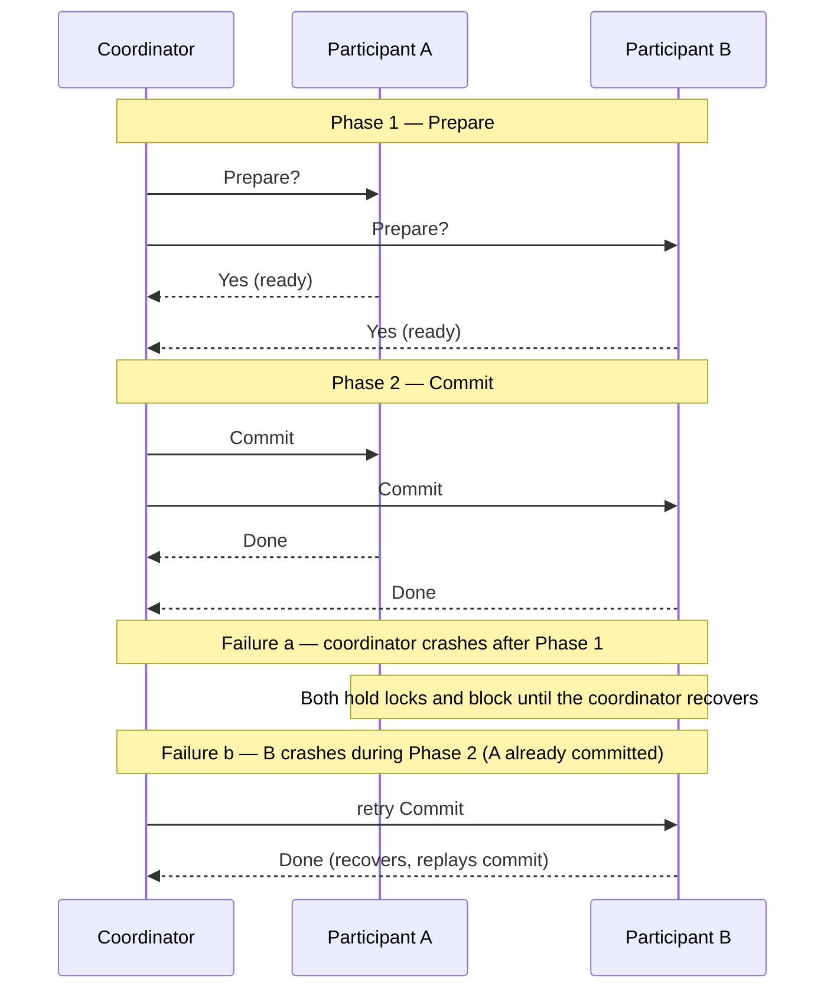
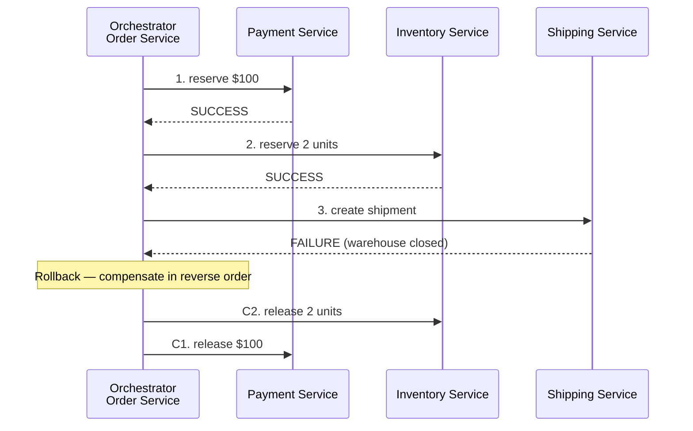
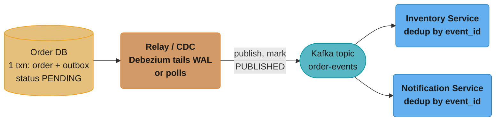
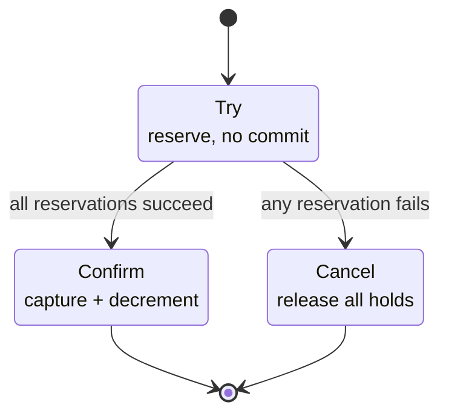
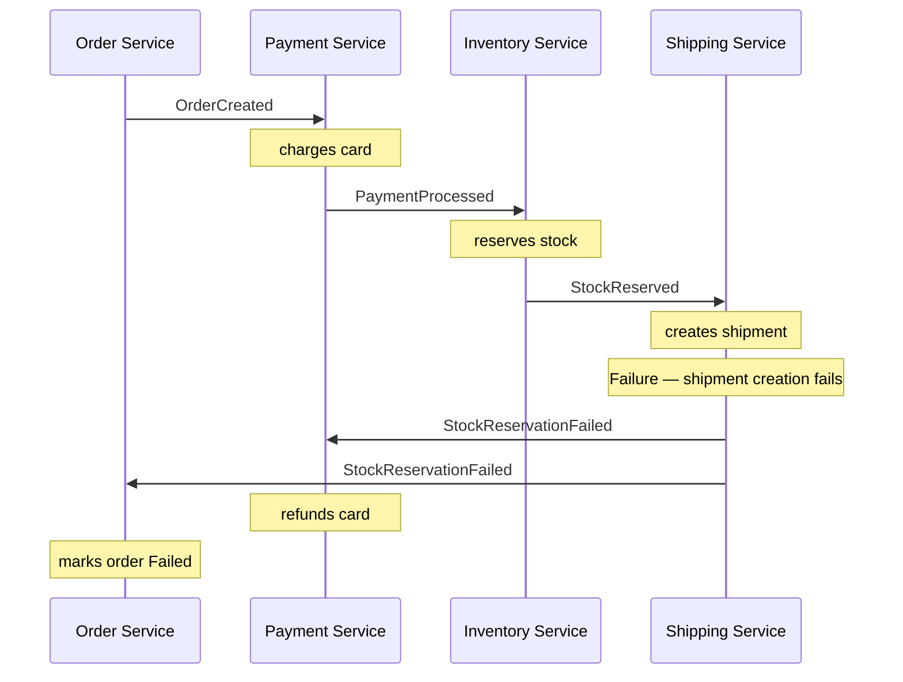
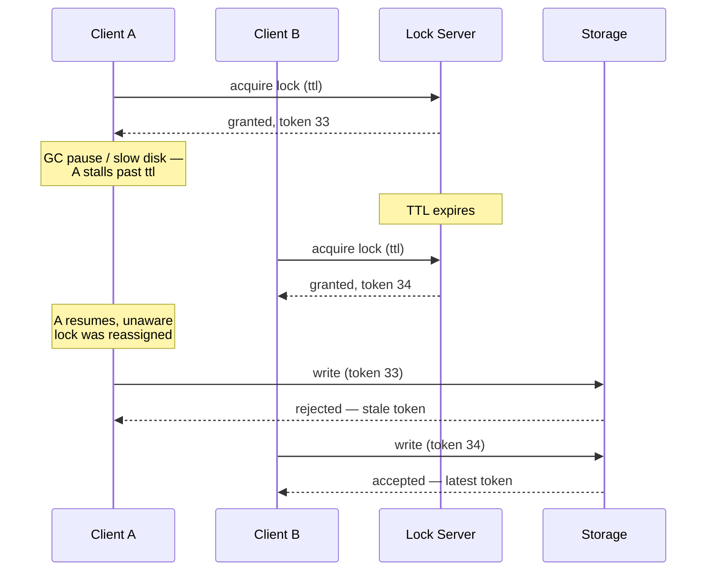

# Distributed Transactions

## 1. Concept Overview

A distributed transaction is an atomic operation spanning multiple independent services, databases, or nodes. ACID guarantees (atomicity, consistency, isolation, durability) that are trivially enforced within a single database become fundamentally hard when data lives across service boundaries. The core challenge: no single node controls all the resources, so "commit or abort together" requires coordination, and coordination introduces failure scenarios that cannot be fully eliminated.

Distributed transactions are not a feature to add — they are a design constraint that forces architectural choices. The primary patterns are 2PC (strong consistency, high coupling), Saga (eventual consistency, loose coupling), and the outbox pattern (reliable messaging with at-least-once delivery).

---

## 2. Intuition

Imagine a hotel booking: reserve a flight (airline system), a hotel (hotel system), and a car (rental system). Either all three succeed or you want none to commit. With a single database, a transaction rolls back if any step fails. Across three independent companies' systems, there is no shared transaction manager. 2PC is like getting all three companies on a phone call and making them all say "ready" before any of them confirm — but if the call drops mid-confirmation, nobody knows whether to proceed or cancel. Sagas say: book each independently, but have a cancellation protocol for each step. If the car rental fails, call the airline and hotel to cancel.

---

## 3. Core Principles

**Atomicity across boundaries requires coordination**: Any protocol that guarantees all-or-nothing across independent systems must involve communication between those systems. Communication can fail.

**The two generals problem**: It is impossible to achieve guaranteed agreement between two parties over an unreliable network. Every distributed commit protocol has a window where a crash can leave the system uncertain.

**Idempotency is the foundation**: Retry-safe operations are the prerequisite for any distributed transaction pattern. If an operation can be safely repeated without side effects, the system can recover from partial failures by retrying.

**Design for compensation over prevention**: Instead of preventing failure (impossible at scale), design each operation to have a compensating transaction that semantically reverses it.

---

## 4. Types / Architectures / Strategies

```
Pattern              | Consistency    | Coupling    | Failure Handling
---------------------|----------------|-------------|------------------
2PC                  | Strong (ACID)  | Tight       | Coordinator SPOF, blocking
3PC                  | Strong         | Tight       | Non-blocking, but not partition-safe
XA Transactions      | Strong         | Tight       | Performance overhead, SPOF
Saga (Choreography)  | Eventual       | Loose       | Compensating transactions
Saga (Orchestration) | Eventual       | Medium      | Orchestrator manages rollback
Outbox Pattern       | Eventual       | Loose       | At-least-once, idempotent consumer
TCC (Try-Confirm-Cancel) | Strong     | Medium      | Reserve → confirm/cancel lifecycle
```

---

## 5. Architecture Diagrams

**Two-Phase Commit (2PC)**



Phase 1 collects a unanimous vote before Phase 2 commits; a coordinator crash between the two phases leaves both participants holding locks until the coordinator recovers — typically 30s–5min (see Section 6).

**Saga Pattern (Orchestration)**



Each step and its compensating action must be idempotent.

**Outbox Pattern**



The order row and its outbox event commit in the same local transaction, so the relay only ever ships events that truly happened — a broker outage just delays the publish, it never loses or fabricates one.

**TCC (Try-Confirm-Cancel)**



TCC trades 2PC's cross-service row locks for an explicit reservation phase: Try holds a soft reservation per resource, then a single all-or-nothing decision either Confirms every resource or Cancels every hold.

---

## 6. How It Works — Detailed Mechanics

### Two-Phase Commit Deep Dive

```
2PC Protocol:

Phase 1 (Voting/Prepare):
  1. Coordinator sends PREPARE to all participants
  2. Each participant:
     a. Writes prepare log to durable storage (WAL)
     b. Acquires all necessary locks
     c. Replies VOTE-YES (ready to commit) or VOTE-NO (abort)

Phase 2 (Decision):
  3. If all VOTE-YES: coordinator writes COMMIT to its log, sends COMMIT to all
     If any VOTE-NO: coordinator writes ABORT to its log, sends ABORT to all
  4. Each participant commits/aborts, releases locks, sends ACK
  5. Coordinator completes transaction, releases coordinator log entry

Blocking problem:
  If coordinator crashes after recording COMMIT but before sending COMMIT to participants:
  - Participants are in "prepared" state with locks held
  - They cannot decide independently (coordinator decision is unknown)
  - They block until coordinator recovers (typically 30s–5min timeout)
  - During this window: locks are held, other transactions waiting on those resources are blocked

3PC adds a "pre-commit" phase to make the decision known to participants before commit:
  Phase 1: Prepare
  Phase 2: Pre-commit (participants know decision is COMMIT)
  Phase 3: Commit
  Non-blocking for coordinator crash after Phase 2
  But: still blocks during network partitions (not partition-safe)
```

### XA Transactions in Java

```java
// JTA (Java Transaction API) — standard XA interface
@Transactional  // JTA transaction manager coordinates 2PC
public void transferMoney(long fromAccount, long toAccount, BigDecimal amount) {
    // XA resource 1: main database
    accountRepository.debit(fromAccount, amount);

    // XA resource 2: audit database
    auditRepository.logTransfer(fromAccount, toAccount, amount);

    // XA resource 3: message broker
    kafkaProducer.send(new TransferEvent(fromAccount, toAccount, amount));

    // JTA coordinates 2PC across all three XA resources
    // If any fails in prepare phase, all are rolled back
}
// Performance cost: 2-3x overhead vs single-resource transaction
// Each XA resource holds locks during prepare phase
// Network failure during phase 2 → blocking
```

### Saga Pattern — Choreography vs Orchestration

**Choreography**: Each service publishes events; downstream services react to events and publish their own. No central coordinator.



Tradeoff: no single place to see the saga state; harder to debug; cyclic event dependencies.

**Orchestration**: A central orchestrator service drives the saga.

```java
// Saga orchestrator state machine
public class OrderSagaOrchestrator {

    public void execute(CreateOrderCommand cmd) {
        SagaState state = sagaRepository.create(cmd.orderId());

        try {
            // Step 1: Payment
            PaymentResult payment = paymentService.reserve(cmd.userId(), cmd.amount());
            state.recordStep("PAYMENT_RESERVED", payment.reservationId());

            // Step 2: Inventory
            InventoryResult inventory = inventoryService.reserve(cmd.items());
            state.recordStep("INVENTORY_RESERVED", inventory.reservationId());

            // Step 3: Shipping
            ShipmentResult shipment = shippingService.createShipment(cmd.address());
            state.recordStep("SHIPMENT_CREATED", shipment.trackingId());

            // All succeeded
            state.complete();

        } catch (StepFailedException e) {
            // Compensate in reverse order
            compensate(state);
        }
    }

    private void compensate(SagaState state) {
        // Compensation must be idempotent and retryable
        if (state.hasStep("INVENTORY_RESERVED")) {
            inventoryService.release(state.get("INVENTORY_RESERVED"));
        }
        if (state.hasStep("PAYMENT_RESERVED")) {
            paymentService.refund(state.get("PAYMENT_RESERVED"));
        }
        state.markFailed();
    }
}
```

**Idempotent compensating transactions**: Every compensation must be idempotent. A refund called twice must not refund twice. Store a compensation ID and check for its presence before executing:

```sql
-- Idempotent compensation in Payment Service
INSERT INTO refunds (order_id, compensation_id, amount)
VALUES (12345, 'comp-abc-123', 100.00)
ON CONFLICT (compensation_id) DO NOTHING;
-- If called twice, the second call is a no-op
```

### Outbox Pattern

```java
@Service
@Transactional  // Single database transaction
public class OrderService {

    public Order createOrder(CreateOrderRequest req) {
        // Main business operation
        Order order = orderRepository.save(new Order(req));

        // Outbox entry in SAME transaction — atomic with order creation
        outboxRepository.save(OutboxEvent.builder()
            .id(UUID.randomUUID())
            .aggregateType("Order")
            .aggregateId(order.getId().toString())
            .eventType("OrderCreated")
            .payload(objectMapper.writeValueAsString(order))
            .status(OutboxStatus.PENDING)
            .createdAt(Instant.now())
            .build());

        return order;  // Both committed or both rolled back
    }
}
```

**Outbox relay options**:

1. **Polling relay**: A background thread queries `WHERE status = 'PENDING'` every 100–500ms, publishes to Kafka, marks as PUBLISHED. Simple but 100–500ms latency, polling overhead.

2. **CDC relay (Debezium)**: Tails the database WAL, detects `INSERT INTO outbox`, publishes to Kafka. Near-zero latency (< 100ms), no polling overhead, but requires Debezium infrastructure.

```
Debezium outbox setup:
  debezium-connector configured to monitor: outbox table
  transforms:
    - io.debezium.transforms.outbox.EventRouter
  Event router maps: aggregate_type → Kafka topic, payload → message value
  Message key = aggregate_id (ensures ordering for same aggregate)
```

### Inbox (Idempotent Consumer) Pattern

The receiving service may receive the same event twice (Kafka at-least-once delivery). The inbox pattern deduplicates:

```sql
-- Inbox table in Inventory Service
CREATE TABLE processed_events (
    event_id UUID PRIMARY KEY,
    processed_at TIMESTAMPTZ DEFAULT now()
);

-- Inventory Service consumer
BEGIN;
  -- Check if already processed
  INSERT INTO processed_events (event_id) VALUES (:event_id)
  ON CONFLICT DO NOTHING;

  GET DIAGNOSTICS rows_affected = ROW_COUNT;

  IF rows_affected > 0 THEN
    -- First time processing
    UPDATE inventory SET reserved = reserved + :quantity WHERE sku = :sku;
  END IF;
COMMIT;
-- If consumer receives the same event_id again, INSERT is a no-op → idempotent
```

### Distributed Locks

```
Implementation options:
  Redis Redlock:     SET key value NX PX ttl (or Redlock with N/2+1 Redis nodes)
  PostgreSQL:        SELECT pg_advisory_lock(lock_id)
  ZooKeeper:         Ephemeral sequential nodes (lowest node = lock holder)
  etcd:              Lease-based locks with TTL

Redlock controversy (Kleppmann critique):
  Problem: If lock TTL expires while holder is doing work (GC pause, slow disk),
  a second client acquires the lock. Both clients now hold the lock simultaneously.
  Solution: Fencing tokens
    - Lock server issues monotonically increasing token with each lock grant
    - Clients include token in every write
    - Storage layer rejects writes with token < last seen token
    - Guarantees only the latest lock holder's writes succeed

PostgreSQL advisory lock (session-scoped):
  SELECT pg_advisory_lock(42);     -- blocks if held by another session
  -- ... critical section ...
  SELECT pg_advisory_unlock(42);   -- must unlock or session close releases
  -- Risk: if connection dies, lock is auto-released (safe)
  -- If server crashes with lock held, it is auto-released on recovery

PostgreSQL advisory lock (transaction-scoped):
  SELECT pg_advisory_xact_lock(42);  -- auto-released at transaction end
  -- Better: no forget-to-unlock bug
```



The lock's TTL expires mid-pause, so both clients briefly believe they hold it; the storage layer — not the lock — resolves the split-brain by rejecting client A's stale token 33 and accepting client B's newer token 34.

---

## 7. Real-World Examples

**Uber** (Saga + outbox): Booking a ride involves payment service, driver assignment, and notification. Implemented as a saga with an orchestrator. The outbox pattern guarantees notifications are sent exactly once even if the notification service is temporarily down.

**Amazon** (Saga + choreography): Amazon's order flow is a classic saga. Each stage (payment, warehouse pick, shipping) is a separate service. Failures trigger compensating events (payment release, warehouse unwind).

**Netflix** (Saga + Conductor): Netflix's Conductor orchestration engine manages sagas across microservices. Each workflow step is a task; the orchestrator retries failed steps and executes compensations.

**Debezium + Outbox** (Red Hat): Debezium's outbox event router is the reference implementation used by thousands of teams for CDC-based reliable messaging without polling.

---

## 8. Tradeoffs

```
Pattern     | Consistency  | Latency   | Complexity | Rollback     | Use case
------------|--------------|-----------|------------|--------------|-------------------
2PC         | Strong ACID  | High      | Medium     | Automatic    | Same-org services
Saga        | Eventual     | Low       | High       | Compensating | Microservices
Outbox      | Eventual     | ~100ms    | Medium     | N/A (events) | Reliable messaging
TCC         | Strong       | Medium    | High       | Cancel phase | Financial reserves
```

---

## 9. When to Use / When NOT to Use

**Use 2PC when**: Operations span multiple databases owned by the same team/org, latency tolerance is high, blocking on coordinator failure is acceptable, and dataset is small enough that lock contention during prepare is manageable.

**Use Saga when**: Operations cross service boundaries in a microservices architecture, services are owned by different teams, long-running workflows (minutes to hours), and eventual consistency is acceptable for the business operation.

**Use outbox when**: A service must reliably publish events after committing a local transaction. The outbox guarantees that if the transaction commits, the event will eventually be published, even if the broker is temporarily unavailable.

**Avoid 2PC across microservices**: Network failures, independent deployments, and service-specific databases make 2PC impractical across microservice boundaries. The blocking failure mode is unacceptable for distributed systems at scale.

---

## 10. Common Pitfalls

**2PC coordinator is a single point of failure**: Team uses JTA/XA for a "simple" distributed transaction. The transaction manager crashes mid-commit. All participants are stuck in prepared state with locks held for the timeout period (5 minutes). All services that need those rows are blocked. Fix: never use 2PC across services you don't fully control; use saga + outbox instead.

**Non-idempotent compensating transactions**: Saga's payment refund service has a bug — it does not check if a refund already exists. A network retry causes the refund to fire twice: the customer receives a double refund. Fix: always store and check a compensation/idempotency key before executing compensation.

**Outbox table not cleaned up**: The outbox table grows without bound. A background poller publishes events and marks them PUBLISHED but never deletes them. After 6 months, the outbox table has 500M rows. Reads slow to a crawl. Fix: add a periodic cleanup job (`DELETE FROM outbox WHERE status = 'PUBLISHED' AND created_at < now() - interval '7 days'`).

**Saga stuck in intermediate state**: The orchestrator crashes mid-saga. The saga state is stored in memory, not database. On restart, no record of in-progress sagas. Reservations are held indefinitely. Fix: saga state must be persisted durably (database) with each step result before proceeding to the next step. Resume from last checkpoint on restart.

**Inbox table unbounded growth**: The inbox (processed events) table grows without bound. After a year: 1B rows, lookups slow from O(1) to O(log N) on a large B+tree. Fix: expire inbox entries after the message delivery window (typically 7 days, matching Kafka retention), using a TTL or periodic cleanup.

---

## 11. Technologies & Tools

| Tool               | Purpose                                         |
|--------------------|-------------------------------------------------|
| Debezium           | CDC-based outbox relay from DB WAL to Kafka     |
| Apache Kafka       | Message broker for saga events                  |
| Netflix Conductor  | Saga orchestration engine                       |
| Temporal.io        | Durable workflow execution (saga as code)       |
| Apache Camel       | Saga pattern integration                        |
| Spring Integration | Outbox pattern with Spring Data                 |
| Eventuate Tram     | Framework for saga + outbox pattern (Java)      |
| Seata              | Distributed transaction framework (Java/Go)     |
| JTA / Atomikos     | XA/2PC transaction manager for Java             |

---

## 12. Interview Questions with Answers

**Q: Why is 2PC considered an anti-pattern in microservices?**
2PC requires all participants to hold locks during the prepare phase. In a microservices architecture, services have independent deployment cycles and can be unreachable for valid operational reasons (deployment, crash, network partition). If any participant or the coordinator is unreachable during phase 2, all participants block with locks held until the coordinator recovers. This makes 2PC incompatible with the independent failure domain requirement of microservices. Additionally, 2PC requires all participants to implement the XA interface, which constrains technology choices. Sagas with compensating transactions are the preferred alternative.

**Q: How does the Saga pattern handle partial failures?**
The saga executes each step as a local transaction. If a step fails, the saga triggers compensating transactions for all previously completed steps, in reverse order. Compensation is designed to semantically undo each step (e.g., release a payment reservation). The critical requirements: (1) each step must be atomic within its service, (2) each compensating transaction must be idempotent (safe to retry on failure), (3) the orchestrator or event choreography must track saga state durably so it can resume after crashes. Sagas accept that there is a window of inconsistency (between step failure and completion of all compensations).

**Q: What is the outbox pattern and how does it guarantee at-least-once delivery?**
The outbox pattern stores domain events in an `outbox` table within the same database transaction as the business operation. Since both the business data change and the outbox row are committed atomically, there is no possibility of committing the order without recording the event, or recording the event without the order. A relay process (polling or CDC via Debezium) reads the outbox table and publishes events to the message broker. At-least-once delivery is guaranteed because if publishing fails, the relay retries until the broker acknowledges. The consumer must be idempotent (inbox pattern) to handle duplicate deliveries.

**Q: How do you implement idempotent compensating transactions?**
Every compensating transaction must be idempotent: calling it multiple times has the same effect as calling it once. Implementation: include a unique compensation ID (derived from the saga ID and step number) in each compensation request. The compensated service stores this ID when executing and returns success without re-executing if it has already processed this ID. Example: `INSERT INTO refunds (compensation_id, amount) VALUES (:id, :amount) ON CONFLICT (compensation_id) DO NOTHING`. The conflict is a no-op, not an error. This pattern makes compensating transactions safe to retry unconditionally.

**Q: What is the TCC (Try-Confirm-Cancel) pattern?**
TCC is a distributed transaction pattern with three phases per resource: (1) Try: reserve resources tentatively (hold payment authorization, reserve inventory quantity) without actually committing. (2) Confirm: if all Tries succeed, confirm all resources (capture payment, decrement inventory). (3) Cancel: if any Try fails, cancel all tried resources (release payment authorization, release reserved inventory). TCC provides strong consistency (either all Confirm or all Cancel) without holding database row locks across service calls. The trade-off: each resource must implement all three operations explicitly, which is more development effort than saga compensation.

**Q: What is Temporal.io and how does it simplify distributed transactions?**
Temporal is a durable workflow engine that makes saga orchestration reliable by persisting the execution state of workflow code as events. If the workflow (orchestrator) crashes mid-execution, it replays from the last recorded event, resuming exactly where it left off without the developer writing explicit state recovery logic. Each "activity" (service call) is retried automatically with configurable policies. Workflows are written as plain code (Go, Java, TypeScript) but execute with durable state, making saga orchestration look like sequential code rather than complex state machines. Compensation is implemented as explicit cancel activities triggered on workflow failure.

**Q: How does the Redlock algorithm work and why is it controversial?**
Redlock acquires a lock across N independent Redis nodes (N ≥ 5, typically 5). The client sends `SET key value NX PX ttl` to all N nodes simultaneously and starts a timer. If N/2+1 or more nodes respond with success within a timeout, the lock is acquired. The validity time is `ttl - elapsed_time`. Martin Kleppmann's critique: if the lock holder pauses (JVM GC, OS preemption) for longer than the TTL, the lock expires and another client acquires it. Both clients now believe they hold the lock. Redlock cannot prevent this without fencing tokens because it relies on wall-clock time across nodes with independent clocks. The safe alternative is to pair distributed locks with fencing tokens that the protected resource can validate.

**Q: What is a fencing token and how does it prevent split-brain writes?**
A fencing token is a monotonically increasing number issued by the lock server each time a lock is granted. The client includes the token in every write request to the protected resource. The storage layer (database, file system) tracks the highest token it has seen and rejects writes with a lower token. If client A holds lock token 33 but pauses, token 34 is issued to client B. When A resumes and sends a write with token 33, the storage rejects it because token 34 is already known. This guarantees that even if two clients simultaneously believe they hold the lock, only the most recent lock holder's writes succeed.

**Q: What is the difference between saga choreography and saga orchestration?**
In choreography, there is no central coordinator. Each service reacts to events published by previous services and publishes its own events. Services are decoupled — no service knows about the others. Trade-off: event dependencies form implicit workflows that are hard to visualize and debug. Adding a new step requires modifying event handlers in multiple services. In orchestration, a central orchestrator drives the workflow, calling each service in sequence and tracking state. The workflow is visible in one place and easier to debug and modify. Trade-off: the orchestrator becomes a bottleneck and single point of deployment. For simple, stable workflows: orchestration. For complex event-driven ecosystems with many independent teams: choreography.

**Q: How do you handle a saga that gets stuck in a partially completed state?**
Sagas can get stuck when the compensating transaction itself fails (e.g., the payment service is down when the inventory compensation triggers a payment release). Recovery strategies: (1) Retry compensations with exponential backoff — eventually the downstream service recovers. (2) Dead-letter queue: after N retries, send the stuck saga to a dead-letter topic for manual review. (3) Manual intervention: an operations dashboard shows stuck sagas with their last step and error; an operator can trigger retry or force-complete. (4) Timeout-based compensation: if a saga is in a partial state for longer than a business-defined SLA, automatically trigger full compensation. Always monitor the count of stuck sagas in production.

**Q: What are idempotency keys and how do you implement them?**
An idempotency key is a client-provided UUID that uniquely identifies a specific operation attempt. The server stores the idempotency key and its result on first execution; subsequent requests with the same key return the cached result without re-executing. Implementation:
```sql
CREATE TABLE idempotency_keys (
    key UUID PRIMARY KEY,
    request_hash TEXT NOT NULL,
    response_body JSONB,
    status INT,
    created_at TIMESTAMPTZ DEFAULT now(),
    expires_at TIMESTAMPTZ DEFAULT now() + interval '24 hours'
);
```
On receiving a request: (1) Check if key exists; if so, return stored response. (2) If not, execute operation, store result with key, return response. The key expires after 24 hours (or business-appropriate window). Client generates the key (UUID v4) and retries with the same key on network errors.

**Q: How does the outbox pattern differ from direct Kafka publishing?**
Direct publishing: write to DB, then publish to Kafka as two separate operations. If the DB commit succeeds but Kafka publish fails (Kafka down, network error, process crash), the event is lost — the DB change happened but the event was never delivered. This is the dual-write problem. Outbox pattern: write to DB and outbox table in one transaction, then separately publish from outbox. If Kafka publish fails, the outbox row is still there; the relay retries until successful. The event is guaranteed to be published eventually as long as the relay is running, because the outbox row persists across crashes.

**Q: What is the XA transaction protocol and what are its performance characteristics?**
XA is a standard protocol (ISO/IEC 10026) for distributed transactions across multiple resource managers (databases, message queues). The transaction manager coordinates 2PC using XA calls: `xa_start`, `xa_end`, `xa_prepare`, `xa_commit`/`xa_rollback`. Performance characteristics: each participant holds row locks from xa_prepare until xa_commit is received — typically an additional network RTT. With 2 participants on LAN: +2–5ms per transaction. With participants across data centers: +50–200ms. XA also requires stateful connections (each resource must be addressed by the same connection that called xa_start), reducing connection pool effectiveness. Overhead typically 2–3x compared to single-resource transactions.

**Q: How do you detect and handle saga compensation failures?**
Compensation failures must be logged with the saga ID, step, attempt number, and error. An alert fires when compensations exceed N retries (e.g., 10 retries over 30 minutes). The compensation enters a dead-letter state visible in a dashboard. Resolution: (1) Automated: fix the downstream service, then trigger saga retry from the compensation step (saga resumes rather than starts over). (2) Manual: operator reviews the stuck compensation, determines if it can be safely skipped (e.g., the resource was already cleaned up externally), and marks it complete in the saga state store. Key metric: number of sagas in compensation failure state — alert if non-zero for > 30 minutes.

**Q: How does Debezium relay the outbox pattern with CDC?**
Debezium connects to PostgreSQL as a logical replication client using the `pgoutput` plugin. It receives WAL change events, including inserts to the outbox table. The Debezium Outbox Event Router transformation inspects each insert, extracts the `aggregate_type` (maps to Kafka topic), `aggregate_id` (maps to Kafka message key, ensuring ordering), `event_type` and `payload` (message content). The event is published to the corresponding Kafka topic. Debezium commits its WAL position only after Kafka acknowledges the message — guaranteeing at-least-once delivery. The outbox row's status can optionally be marked PUBLISHED by a second operation, but this is not strictly required if Debezium handles idempotency via the event ID.

**Q: What happens when an outbox relay fails for an extended period?**
The outbox table accumulates unprocessed rows. Depending on the relay implementation: (1) Polling relay: new rows pile up; when the relay recovers, it catches up by replaying all pending rows in order. (2) Debezium CDC: the WAL is held by the replication slot until Debezium processes it — risk of WAL accumulation causing primary disk fill (same replication slot danger as regular replicas). Monitor: outbox table row count and age of oldest PENDING row. Alert if oldest PENDING row is > 5 minutes old. Set `max_slot_wal_keep_size` to cap WAL retention. Prioritize outbox relay uptime in SLAs.

**Q: How do distributed locks differ from optimistic concurrency control?**
Distributed locks (Redis, ZooKeeper, PostgreSQL advisory): a lock is acquired before entering a critical section, preventing concurrent access. The lock is held for the duration of the operation and released afterward. Suitable when the critical section has side effects that cannot be easily undone (external API call, messaging). Optimistic concurrency control (OCC): no lock is acquired; the operation proceeds and, at commit time, checks whether the data was modified by another transaction since the read began. If so, the transaction is retried. Suitable for low-contention scenarios where conflicts are rare — OCC has no lock overhead on the happy path but requires retry logic. Distributed locks are preferable for high-contention resources; OCC for low-contention with retriable operations.

---

## 13. Best Practices

- **Make all service operations idempotent from day one** — idempotency keys are not optional in distributed systems.
- **Prefer saga over 2PC for cross-service operations** — 2PC's blocking failure mode is incompatible with independent service deployments.
- **Persist saga state durably after every step** — saga state in memory is lost on orchestrator crash; always write to database before proceeding.
- **Design compensations as always-retryable** — compensation must succeed eventually; make it idempotent and retry indefinitely with backoff.
- **Monitor outbox table health** — alert on oldest pending event age > 5 minutes and row count > 10K.
- **Use Debezium CDC for outbox relay** over polling when possible — near-zero latency and no polling overhead.
- **Include fencing tokens with any distributed lock** — TTL-based locks alone cannot prevent split-brain in the presence of GC pauses.
- **Test saga failure scenarios** — simulate each step's failure in integration tests to verify compensation fires correctly.
- **Expire idempotency keys** — keys older than the retry window (typically 24h) can be safely deleted.

---

## 14. Case Study

**Scenario**: An e-commerce platform processes 5K orders/minute. Order creation involves: (1) create order in Order DB, (2) reserve payment in Payment Service, (3) reserve stock in Inventory Service, (4) send confirmation email via Notification Service. Initially implemented with direct DB writes + REST calls. Payment and inventory are separate microservices with separate databases. Failures cause inconsistent state: orders with no payment reservation, double-charged customers on retry.

**Before: Dual-write hell**
```java
public Order createOrder(CreateOrderRequest req) {
    Order order = orderRepo.save(new Order(req));     // DB 1
    paymentService.charge(req.userId(), req.amount()); // REST call — may fail
    inventoryService.reserve(req.items());             // REST call — may fail after payment charged
    emailService.send(order.getId());                 // may double-send on retry
    return order;
}
// If inventory fails after payment: customer charged, no stock reserved
// If retry: customer double-charged
```

**After: Saga + Outbox**

```java
@Transactional
public Order createOrder(CreateOrderRequest req) {
    // 1. Create order + outbox event atomically
    Order order = orderRepo.save(new Order(req).withStatus(PENDING));
    outboxRepo.save(OutboxEvent.orderCreated(order, req.idempotencyKey()));
    return order;
    // Nothing else in this method — single DB transaction
}

// Saga Orchestrator (driven by Kafka event)
@KafkaListener(topics = "order-events")
public void onOrderCreated(OrderCreatedEvent event) {
    SagaState saga = sagaRepo.createOrResume(event.orderId());

    switch (saga.currentStep()) {
        case START:
            paymentService.reserve(
                new PaymentReserveCmd(event.userId(), event.amount(), saga.getId())
            );
            saga.advanceTo(PAYMENT_RESERVED);
            break;

        case PAYMENT_RESERVED:
            inventoryService.reserve(
                new InventoryReserveCmd(event.items(), saga.getId())
            );
            saga.advanceTo(INVENTORY_RESERVED);
            break;

        case INVENTORY_RESERVED:
            orderRepo.updateStatus(event.orderId(), CONFIRMED);
            // Notification via another outbox event in orderRepo transaction
            saga.advanceTo(COMPLETE);
            break;
    }
}

@KafkaListener(topics = "payment-events")  // PaymentReservationFailed
public void onPaymentFailed(PaymentFailedEvent event) {
    SagaState saga = sagaRepo.find(event.sagaId());
    orderRepo.updateStatus(saga.getOrderId(), FAILED);
    saga.markFailed();
    // No compensation needed: payment never reserved
}
```

**Result**:
- Zero inconsistent states in 3 months of production
- Double-charge rate: 0.12% → 0.00% (idempotency keys on payment service)
- Order failure handling: transparent, with observable saga state in dashboard
- Outbox relay via Debezium: < 100ms event lag from DB commit to Kafka publish
