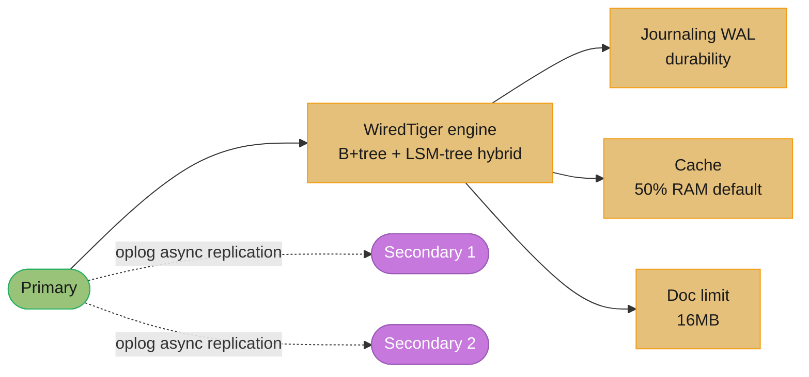
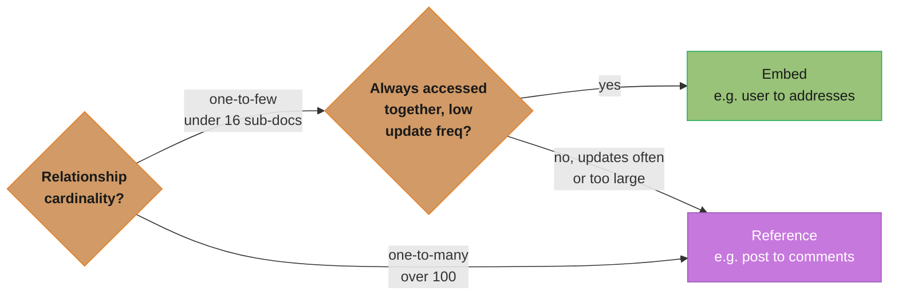
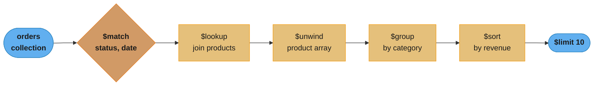
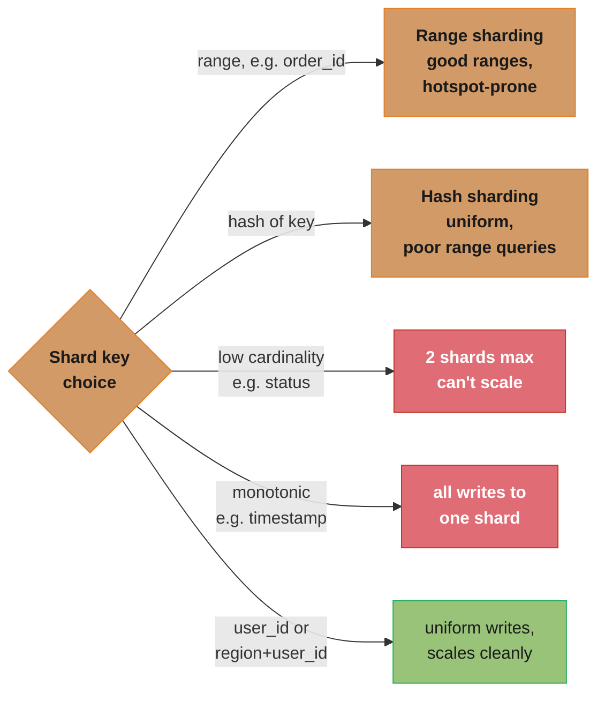
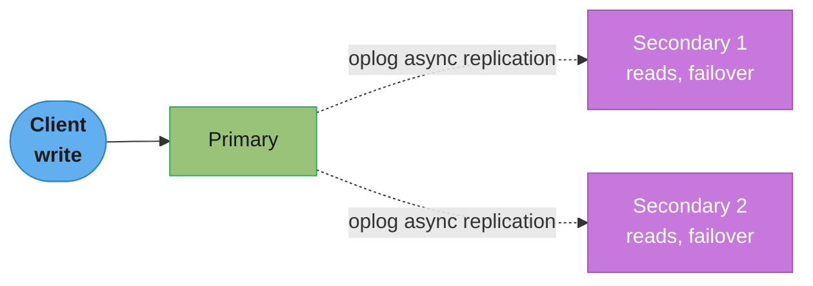
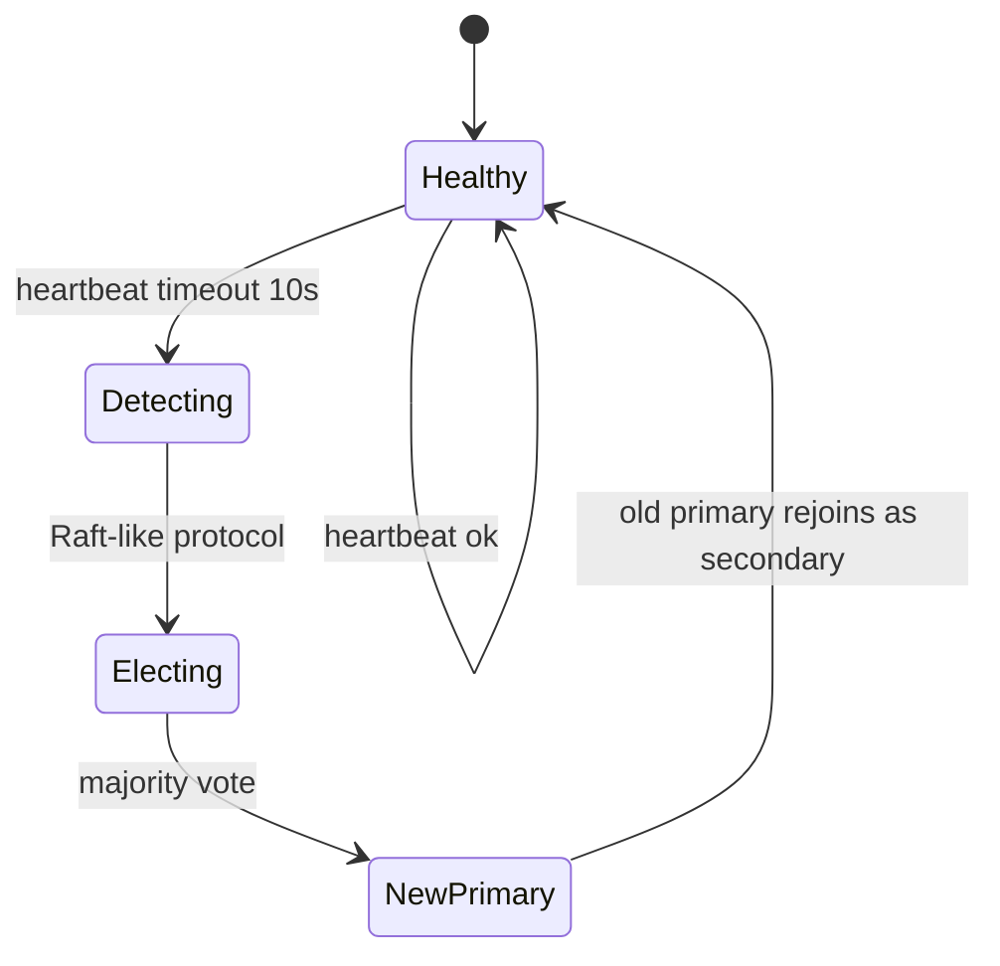
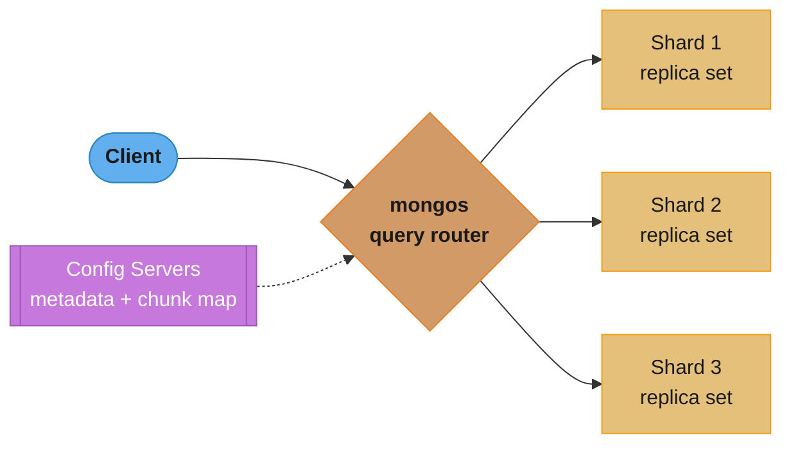
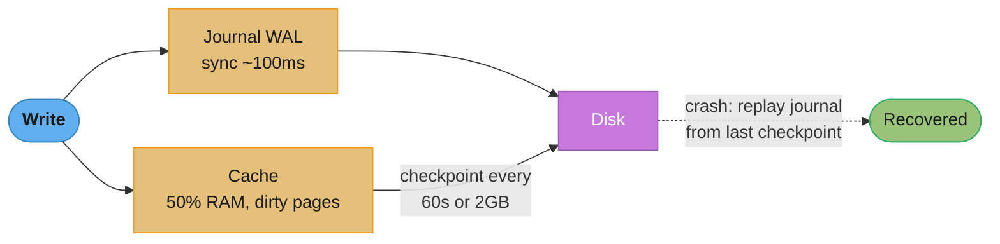
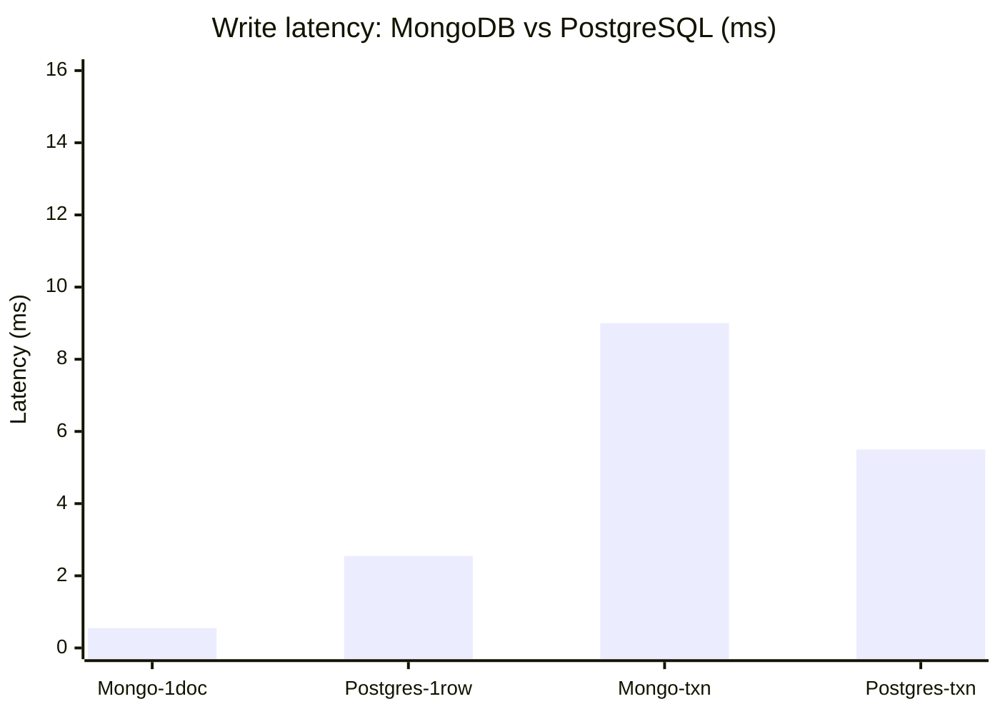

# Document Databases

## 1. Concept Overview

Document databases store data as semi-structured documents (typically JSON/BSON), allowing each document to have a different structure. The document model is natural for hierarchical data and objects that map directly to application code. MongoDB is the dominant document database, with WiredTiger as its storage engine since 3.2.

---

## 2. Intuition

A document database is like a filing cabinet where each folder (document) can contain any papers (fields) in any format — unlike a relational table where every row must have the same columns. Documents eliminate the impedance mismatch between object-oriented application code and normalized relational tables.

- **Key insight**: The embedding vs referencing decision is the most critical design choice in document databases. Get it wrong and you face either 16MB document limits or N+1 equivalent query patterns.

---

## 3. Core Principles

### MongoDB Architecture


*The primary's WiredTiger engine journals every write and caches dirty pages, capped at 16MB per document; secondaries replicate asynchronously by tailing the oplog — a capped collection that new replicas copy on join and that change streams (CDC) also tail.*

### Embedding vs Referencing Decision Matrix

| Factor | Embed | Reference |
|--------|-------|-----------|
| Relationship cardinality | One-to-few (< 16 sub-docs) | One-to-many (> 100) |
| Access pattern | Always access together | Access separately |
| Sub-document update frequency | Low (re-write parent) | High (update independently) |
| Sub-document size | Small (total < 16MB) | Large |
| Example | User → addresses | Blog post → comments |


*This is the single most critical design choice in document databases: start from relationship cardinality, then check access pattern and update frequency — get it wrong and you hit either the 16MB document limit or an N+1-style query pattern.*

```javascript
// Embed (good for one-to-few, always accessed together):
{
  "_id": ObjectId("..."),
  "name": "Alice Smith",
  "addresses": [  // Embedded array
    { "type": "home", "city": "NYC", "zip": "10001" },
    { "type": "work", "city": "NYC", "zip": "10002" }
  ]
}

// Reference (good for one-to-many, accessed independently):
// users collection:
{ "_id": ObjectId("user1"), "name": "Alice" }

// comments collection:
{ "_id": ObjectId("comment1"), "user_id": ObjectId("user1"),
  "post_id": ObjectId("post1"), "body": "Great post!" }
// Query: db.comments.find({post_id: ObjectId("post1")}) — indexed lookup
```

---

## 4. Types / Architectures / Strategies

### Aggregation Pipeline

MongoDB's aggregation framework processes documents through a pipeline of stages:

```javascript
db.orders.aggregate([
  // Stage 1: Filter early (reduces documents flowing to next stages)
  { $match: { status: "completed", date: { $gte: new Date("2024-01-01") } } },

  // Stage 2: Join with products collection ($lookup = left outer join)
  { $lookup: {
    from: "products",
    localField: "product_id",
    foreignField: "_id",
    as: "product"
  }},

  // Stage 3: Unwind array from lookup
  { $unwind: "$product" },

  // Stage 4: Group and aggregate
  { $group: {
    _id: "$product.category",
    total_revenue: { $sum: { $multiply: ["$quantity", "$product.price"] } },
    order_count: { $sum: 1 }
  }},

  // Stage 5: Sort result
  { $sort: { total_revenue: -1 } },

  // Stage 6: Limit output
  { $limit: 10 }
]);

// Performance tip: $match and $project early to reduce data flowing through pipeline
// Index on: { status: 1, date: 1 } for the $match stage
```


*Order matters: an indexed `$match` shrinks the document set before the expensive `$lookup` join and `$group` aggregation run, so filtering early means `$lookup`/`$group` process far fewer documents than filtering late would.*

### Indexing in MongoDB

```javascript
// Compound index:
db.orders.createIndex({ customer_id: 1, created_at: -1 });

// Multikey index (on array fields): automatically created
db.products.createIndex({ tags: 1 });
// Query: db.products.find({ tags: "electronics" }) — uses multikey index

// Text index (full-text search):
db.articles.createIndex({ title: "text", body: "text" });
db.articles.find({ $text: { $search: "database internals" } });

// 2dsphere (geospatial):
db.stores.createIndex({ location: "2dsphere" });
db.stores.find({ location: { $near: { $geometry: { type: "Point", coordinates: [-73.9, 40.7] }, $maxDistance: 1000 } } });

// TTL index (auto-expire documents):
db.sessions.createIndex({ expires_at: 1 }, { expireAfterSeconds: 0 });
// Documents with expires_at in the past are automatically deleted

// Partial index:
db.users.createIndex({ email: 1 }, { partialFilterExpression: { status: "active" } });

// Sparse index (only indexes documents that have the field):
db.users.createIndex({ phone: 1 }, { sparse: true });

// Wildcard index (MongoDB 4.2+):
db.products.createIndex({ "attributes.$**": 1 });
// Indexes all fields under "attributes" dynamically
```

### Sharding


*Shard key choice drives scalability: range and hash sharding route documents differently, but low-cardinality or monotonically increasing keys create write hotspots on one shard, while a high-cardinality key like `user_id` or a compound `(region, user_id)` spreads writes evenly. Jumbo chunks — over the 200MB default — can't be split; monitor with `db.stats()`/`sh.status()` and fix via `clearJumboFlag` or a shard-key change.*

### Change Streams

MongoDB change streams provide real-time notifications of data changes:

```javascript
// Watch a collection for changes (CDC):
const changeStream = db.orders.watch([
  { $match: { "operationType": { $in: ["insert", "update"] } } }
]);

changeStream.on("change", (change) => {
  console.log("Change:", change.operationType, change.fullDocument);
  // Use for: cache invalidation, event sourcing, audit, real-time sync
});

// Change streams are built on oplog tailing
// Resumable: store change.id (resume token) and resume from that point after reconnect
// Requires replica set or sharded cluster (not standalone)
```

### Multi-Document Transactions (MongoDB 4.0+)

```javascript
const session = client.startSession();
session.startTransaction({
  readPreference: 'primary',
  readConcern: { level: 'snapshot' },
  writeConcern: { w: 'majority' }
});
try {
  await db.accounts.updateOne(
    { _id: userId1 }, { $inc: { balance: -100 } }, { session }
  );
  await db.accounts.updateOne(
    { _id: userId2 }, { $inc: { balance: 100 } }, { session }
  );
  await session.commitTransaction();
} catch (e) {
  await session.abortTransaction();
} finally {
  await session.endSession();
}
// Performance overhead: ~10-20% vs single-document ops
// Multi-document transactions in MongoDB use WiredTiger MVCC
// Recommended only when cross-document atomicity is truly required
```

---

## 5. Architecture Diagrams

**MongoDB Replica Set**


*Writes always go to the primary; secondaries replicate asynchronously by tailing the oplog and serve reads or stand ready for failover.*


*On a missed heartbeat (10s timeout) the replica set runs a Raft-like election; the newly elected primary takes writes while the old primary rejoins as a secondary.*

```
Read Preferences:
  primary          → Always read from primary (strong consistency)
  primaryPreferred → Read from primary if available, else secondary
  secondary        → Always read from secondary (stale reads allowed)
  nearest          → Read from nearest node (lowest latency)
  secondaryPreferred → Read from secondary if available
```

**Sharded Cluster**


*mongos routes each query using the chunk map from the config servers (a replica set, 3 nodes minimum) — each shard is itself a replica set, so the shard key strategy decides which shard's chunk range a document lands in.*

---

## 6. How It Works — Detailed Mechanics

### WiredTiger Cache and Journaling


*Every write lands in both the journal (fsynced roughly every 100ms, tunable down to 10ms) and the WiredTiger cache; dirty cache pages checkpoint to disk every 60 seconds or when the journal reaches 2GB, and a crash recovers by replaying the journal from the last checkpoint.*

### MongoDB vs Relational Transaction Overhead


*Single-document MongoDB writes (about 0.1 to 1ms) are comparable to single-row PostgreSQL updates (about 0.1 to 5ms); MongoDB's multi-document transactions add 10 to 20% overhead versus single-doc ops, landing around 3 to 15ms versus PostgreSQL's roughly 1 to 10ms for simple transactions. Recommendation: reserve multi-document transactions for genuine cross-document atomicity and default to single-document operations with embedding otherwise.*

---

## 7. Real-World Examples

- **Catalog systems**: MongoDB for product catalogs (varying attributes per product type). Indexing on `category`, `price`, `availability`. Change streams sync to Elasticsearch for full-text search.
- **Content management**: Blog posts with embedded author info and tags. TTL indexes for draft cleanup. Text indexes for search.
- **IoT device data**: Each device document stores recent readings in an embedded array (bounded size). Older readings archived to a separate collection.
- **User profiles**: Flexible schema handles different user types (buyer vs seller vs admin) without nullable columns. Embedded preferences and settings.

---

## 8. Tradeoffs

| Feature | MongoDB | PostgreSQL |
|---------|---------|------------|
| Schema flexibility | Excellent | Poor (requires migrations) |
| Query flexibility | Good (aggregation pipeline) | Excellent (SQL, any join) |
| Multi-document transactions | Available (4.0+, overhead) | Native (lower overhead) |
| Horizontal sharding | Built-in | Requires Citus or manual |
| Full ACID | Yes (with majority write concern) | Yes |
| Full-text search | Basic (text index) | Good (tsvector + GIN) |
| Mature ecosystem | Yes | Yes |
| JSON support | Native (BSON) | JSONB (also excellent) |

---

## 9. When to Use / When NOT to Use

**Use MongoDB when**:
- Schema varies significantly per document type (product catalog, CMS, user profiles)
- Object model maps naturally without normalization (embedded documents avoid joins)
- Need horizontal scaling built in (sharding)
- Team uses document-oriented thinking (JSON APIs)

**Do not use MongoDB when**:
- Complex joins between many entity types (relational is better)
- Heavy aggregation with cross-collection joins at query time (data warehouse better)
- Financial systems where full ACID on multiple collections is required (PostgreSQL is simpler)
- Simple key-value access patterns (Redis is faster)

---

## 10. Common Pitfalls

**Pitfall 1: Unbounded embedded arrays**
```javascript
// Broken: embed all comments in post document
{ _id: "post1", comments: [...10000 comments...] }
// After 1000+ comments, document exceeds 16MB limit → ERROR

// Fix: reference model
{ _id: "comment1", post_id: "post1", body: "...", created_at: ISODate(...) }
// Index: { post_id: 1, created_at: -1 }
// Query: db.comments.find({post_id: "post1"}).sort({created_at:-1}).limit(20)
```

**Pitfall 2: Missing index on shard key**
A sharded collection's shard key must be indexed (required). Additionally, all queries in a sharded cluster that don't include the shard key result in scatter-gather: the query fan-out goes to ALL shards. For a 10-shard cluster, a non-shard-key query hits 10 shards × the query cost = 10x overhead. Always include the shard key in hot query predicates.

**Pitfall 3: Using $where or JavaScript in queries**
`db.users.find({$where: "this.age > 18"})` executes JavaScript per document — no index, full collection scan, single-threaded JavaScript engine. Always use native MongoDB query operators instead.

**Pitfall 4: Write concern w:1 for financial operations**
Default write concern `w:1` acknowledges when the primary's memory buffer receives the write — not when it's durable on disk or replicated. If the primary crashes immediately after ack, data is lost. Use `w: 'majority'` for durable writes and `j: true` for journal fsync.

**Pitfall 5: Not monitoring oplog size and replication lag**
The oplog is a capped collection. If a secondary falls too far behind (e.g., slow network, heavy write burst), it may fall off the oplog — it can no longer replicate. Fix: monitor replication lag (`rs.printReplicationInfo()`). Set `oplogSizeMB` large enough to cover at least 24 hours of operations. Alert when lag > 30 seconds.

---

## 11. Technologies & Tools

| Tool | Purpose |
|------|---------|
| MongoDB Compass | GUI for queries, schema analysis, explain plans |
| `explain("executionStats")` | Query plan and actual execution stats |
| `db.currentOp()` | Active operations, long-running queries |
| `mongotop` | Top collection activity (reads/writes per collection) |
| `mongostat` | Server-wide stats (ops/s, connections, memory) |
| `mongodump/mongorestore` | Logical backup/restore |
| Atlas | Managed MongoDB (AWS/Azure/GCP), auto-sharding, atlas search |
| Mongoose (Node.js) | ODM for MongoDB with schema validation |
| Spring Data MongoDB | Java ODM for MongoDB |
| Debezium MongoDB connector | CDC from MongoDB change streams |

---

## 12. Interview Questions with Answers

**Q: How do you choose a shard key in MongoDB and what are the consequences of a bad one?**
Good shard key criteria: high cardinality (many unique values — ensures even distribution across shards), good write distribution (avoid monotonically increasing keys like timestamps → all writes to one shard "hotspot"), colocates related documents (e.g., compound `{region, user_id}` ensures user's data lands on one shard). Bad shard key consequences: monotonically increasing key → all inserts go to the last shard (insert hotspot, all other shards idle); low cardinality (e.g., status) → only a few possible shards, cannot scale beyond cardinality count; querying without shard key → scatter-gather to all shards (10x overhead for 10-shard cluster).

**Q: When should you embed documents vs reference them in MongoDB?**
Embed when: the data has a one-to-few relationship (user has 2-5 addresses), the embedded data is always accessed with the parent (user profile always needs address), and the total document size stays well under 16MB. Reference when: the data has a one-to-many or many-to-many relationship (post has thousands of comments), the child data changes frequently and independently (updating one comment shouldn't rewrite the entire post), or the child data is large enough to risk document size limits. General rule: start with embedding, switch to referencing when documents exceed 2MB consistently or when update patterns become problematic.

**Q: How do MongoDB transactions compare to PostgreSQL in terms of overhead?**
MongoDB multi-document transactions (4.0+) use WiredTiger's MVCC to provide snapshot isolation. Overhead: ~10-20% latency vs single-document operations for simple transactions. Causes: starting an MVCC snapshot, tracking transaction state, coordinating oplog entries. PostgreSQL single transactions: ~1-10ms, similar MVCC mechanism but more mature implementation with less overhead per operation. For cross-document atomicity requiring consistency, PostgreSQL transactions are generally faster for complex multi-table operations because its cost-based planner handles joins better than MongoDB's $lookup + $match pipeline. MongoDB's advantage: single-document operations (no transaction) are very fast and naturally atomic at the document level.

**Q: Explain how MongoDB change streams work and what they can be used for.**
Change streams use MongoDB's oplog as the source of truth. The oplog records all write operations to replica set members. Change streams expose this as a subscribable stream with filtering, resumability, and full document pre/post images. Use cases: (1) CDC to sync MongoDB data to Elasticsearch, Redis, or data warehouses. (2) Real-time notifications (user gets notified when their order status changes). (3) Cache invalidation (when a product document changes, invalidate Redis cache). (4) Audit logging (every change recorded). Resumability: the change stream returns a `resumeToken` with each event. On reconnect, pass the token to resume exactly from where it left off — no events missed. Requires: replica set or sharded cluster (change streams read the oplog).

**Q: What is the WiredTiger cache and how does it differ from PostgreSQL's buffer pool?**
WiredTiger cache (default 50% RAM or 1GB, whichever is larger): stores recently accessed pages from data files, including B+tree nodes for indexes and document pages. Similar to PostgreSQL's `shared_buffers`. Key differences: (1) WiredTiger uses a CLOCK eviction algorithm instead of PostgreSQL's clock-sweep. (2) WiredTiger compresses pages both in cache and on disk (Snappy compression by default). (3) WiredTiger cache is per-process (the mongod process), while PostgreSQL's shared_buffers is shared across all connections. (4) On Linux, the OS page cache also caches MongoDB data files — double-buffering similar to PostgreSQL. Set `storage.wiredTiger.engineConfig.cacheSizeGB` to tune.

**Q: How does MongoDB replication differ from PostgreSQL streaming replication?**
MongoDB replication: each write is recorded in the oplog (a capped collection of logical operations). Secondaries tail the oplog and re-execute operations. Replication is logical (re-execute operations), not physical (copy byte changes). This allows filtering, selective replication, and cross-version compatibility. Failover: Raft-like election (majority of nodes must agree on new primary). PostgreSQL streaming replication: physical WAL stream (byte-level page changes). Faster replication (no re-execution overhead), but requires same major version. Logical replication (PostgreSQL) is the equivalent of MongoDB's oplog for cross-version compatibility. Both support multi-region, but PostgreSQL's physical replication is typically lower-latency for identical hardware/version.

**Q: What are TTL indexes in MongoDB and when do you use them?**
A TTL (Time-To-Live) index on a BSON date field causes MongoDB to automatically delete documents where the date field is older than the specified time. `db.sessions.createIndex({expires_at: 1}, {expireAfterSeconds: 0})` — documents where `expires_at < now()` are deleted. Use cases: session storage, cache documents, soft-expiring events, rate limiting records. Background: TTL expiration runs in a background thread every 60 seconds, deleting up to 1000 documents per pass (may lag under high insertion rates). Limitation: TTL index must be on a Date field; the `expireAfterSeconds` is relative to the field's value (or can be 0 to use the field value as the absolute expiry time).

**Q: What is the oplog and why does its size matter?**
The oplog (operations log) is a capped collection in the `local` database that records all write operations in a replication set. Secondaries tail the oplog to apply changes. Capped collection: has a fixed size in bytes; old entries are overwritten when full. Why size matters: if a secondary falls behind (network partition, slow network, heavy write burst) and the oplog wraps around before the secondary reads those entries, the secondary can no longer catch up — it needs a full resync. Recommended oplog size: able to hold at least 24-72 hours of write operations. Default: 5% of free disk space (can be too small for high-write deployments). Set with `--oplogSize` or `storage.replication.oplogSizeMB`.

**Q: How does MongoDB schema validation work?**
MongoDB 3.6+ supports JSON Schema validation on collections. Define a schema with required fields, types, and constraints:
```javascript
db.createCollection("users", {
  validator: { $jsonSchema: {
    bsonType: "object",
    required: ["email", "created_at"],
    properties: {
      email: { bsonType: "string", pattern: "^.+@.+$" },
      age: { bsonType: "int", minimum: 0, maximum: 150 }
    }
  }},
  validationLevel: "strict",   // "strict" = all writes validated; "moderate" = new docs only
  validationAction: "error"    // "error" = reject invalid; "warn" = allow with warning
});
```
Validation runs on INSERT and UPDATE. Unlike relational databases, it's applied at the application layer (doesn't prevent direct shell bypasses unless validationLevel=strict). Use it as a safety net for required fields and basic type constraints.

**Q: Explain MongoDB's aggregation pipeline performance optimization.**
The pipeline processes documents stage by stage. Optimization rules: (1) Put `$match` as early as possible — it reduces the number of documents flowing to later stages. If the match uses an indexed field, it avoids a collection scan. (2) Put `$project` early to remove fields not needed downstream — reduces document size in memory. (3) `$limit` before `$sort` when you only need top-N: sorts up to N documents, not the whole collection. (4) `$lookup` is expensive (cross-collection join) — filter before it to minimize the joined set. (5) Use `allowDiskUse: true` for large aggregations that exceed the 100MB memory limit. (6) Use `$facet` for multiple aggregations in one pipeline pass instead of separate queries. Check performance with `.explain("executionStats")` on the aggregate call.

**Q: What is MongoDB Atlas Search and when should you use it instead of a text index?**
MongoDB Atlas Search (built on Lucene) provides full-text search with relevance scoring, fuzzy matching, phrase matching, facets, and autocomplete — features missing from MongoDB's native text indexes. Native text index limitations: all fields weighted equally (unless specified), no phrase search, limited relevance scoring, no facets. Atlas Search: Lucene-based, full BM25 scoring, facets, fuzzy matching (`fuzziness` parameter), autocomplete, search-as-you-type, synonym groups, custom analyzers. Trade-off: Atlas Search requires Atlas (managed MongoDB) and is eventually consistent (replication delay of ~1-2 seconds for indexed changes). Use Atlas Search when: advanced relevance ranking needed, user-facing search with autocomplete, faceted navigation. Use native text index for: simple keyword matching, self-hosted MongoDB, cases where search is not a primary use case.

**Q: When would you use MongoDB's $lookup instead of embedding and what are the limitations?**
`$lookup` performs a left outer join between collections in an aggregation pipeline. Use when: referencing is the right data model (one-to-many relationship where child data is large or changes independently), but you need to fetch related data in one query. Limitations: (1) `$lookup` cannot use sharding to colocate data — if the "from" collection is sharded, every lookup requires scatter-gather to all shards (expensive). (2) `$lookup` returns an array of matching documents — must use `$unwind` to join cardinality. (3) No indexed nested loop join optimization — always a hash join or nested loop without optimal index usage. (4) Performance degrades significantly at scale vs an embedded approach or pre-computed joins. Use embedding when: performance is critical and data fits in document size limits.

**Q: What is the write concern in MongoDB and when should you use w: majority?**
Write concern specifies how many replica set members must acknowledge a write before the driver considers it successful. Options: `w:1` (primary only, default), `w: 'majority'` (majority of replica set members must acknowledge), `w: N` (specific N members). `w:1` risk: if primary crashes before replicating to any secondary, the write is lost on failover (rollback). `w: 'majority'` guarantees that even if the primary crashes and a new primary is elected, the write was replicated to a majority — it will be present. Latency cost: `w: 'majority'` adds one replication round trip (~1-10ms LAN, ~30-100ms WAN). Use `w: 'majority'` for: financial transactions, user account changes, any data that cannot afford to be lost. Use `w:1` for: analytics events, logs, metrics where occasional loss is acceptable.

---

## 13. Best Practices

1. Default to embedding; switch to referencing when documents grow beyond 1MB or update patterns become complex.
2. Limit embedded arrays to a bounded size; use references for unbounded relationships.
3. Index all fields used in query predicates and sort operations.
4. Include the shard key in all frequently-run queries to avoid scatter-gather.
5. Use `w: 'majority'` and `j: true` for writes that cannot be lost.
6. Monitor oplog size: ensure it can hold 48+ hours of write operations.
7. Use change streams for CDC instead of periodic polling.
8. Avoid multi-document transactions when single-document atomicity can be designed in.
9. Use Atlas Search for user-facing search; native text index for basic keyword matching.
10. Run `db.collection.explain("executionStats")` on all query patterns during development.

---

## 14. Case Study

**Scenario**: An e-learning platform uses MongoDB to store courses. Original design embedded all student enrollments in the course document:

```javascript
{
  "_id": ObjectId("course1"),
  "title": "Database Internals",
  "enrollments": [
    { "student_id": "s1", "enrolled_at": ISODate(), "progress": 0.45 },
    ... // 50,000 students
  ]
}
```

**Problem**: After 50,000 enrollments, course document exceeded 16MB. New enrollments failed with `BSONObjectTooLarge`. Queries updating individual student progress rewrote the entire 16MB document.

**Redesign**:
```javascript
// courses collection (lightweight):
{ "_id": ObjectId("course1"), "title": "Database Internals", "instructor_id": "i1",
  "enrollment_count": 50000 }

// enrollments collection (references):
{ "_id": ObjectId("e1"), "course_id": ObjectId("course1"), "student_id": ObjectId("s1"),
  "enrolled_at": ISODate("2024-01-15"), "progress": 0.45, "last_accessed": ISODate() }

// Indexes:
db.enrollments.createIndex({ course_id: 1, student_id: 1 }, { unique: true });
db.enrollments.createIndex({ student_id: 1, enrolled_at: -1 });
db.enrollments.createIndex({ course_id: 1, last_accessed: -1 });

// Update progress (now single document update):
db.enrollments.updateOne(
  { course_id: ObjectId("course1"), student_id: ObjectId("s1") },
  { $set: { progress: 0.50, last_accessed: new Date() } }
);
// 0.1ms vs 10ms+ for the 16MB document update

// Enrollment count: maintained with $inc on courses or via change stream
```

**Result**: Document size capped at ~200 bytes per enrollment. Update operations: 0.1ms vs 10ms. No more size limit errors. The enrollment count is maintained with atomic `$inc` on the course document, preserving the frequently-displayed counter without aggregating.
