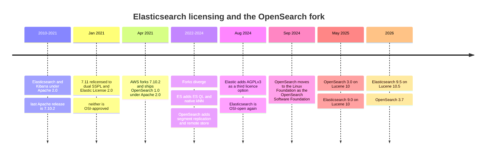
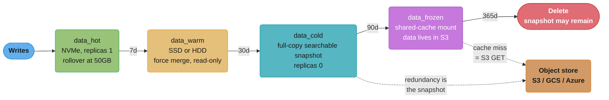
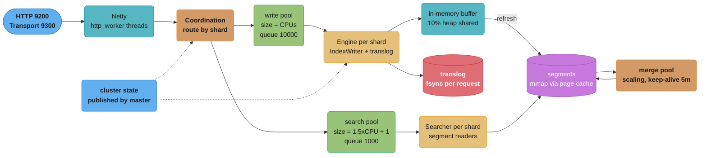
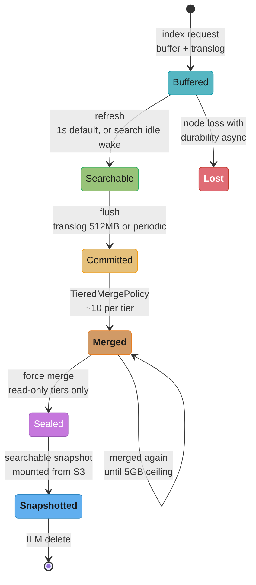
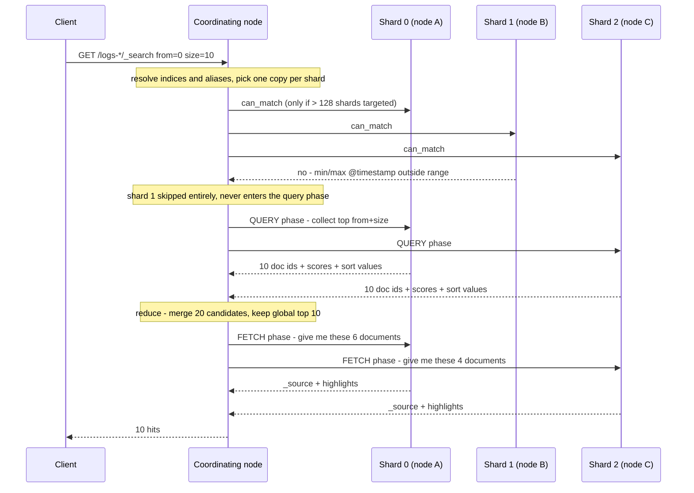
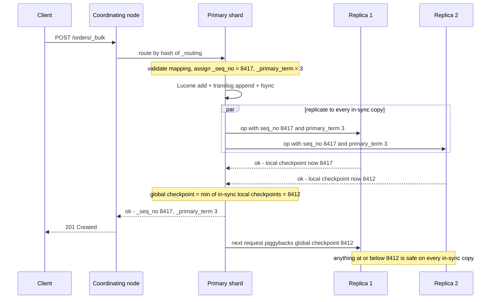
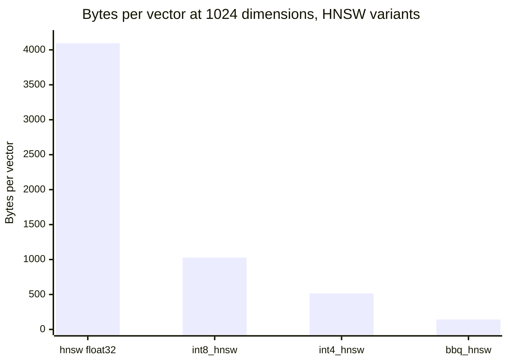
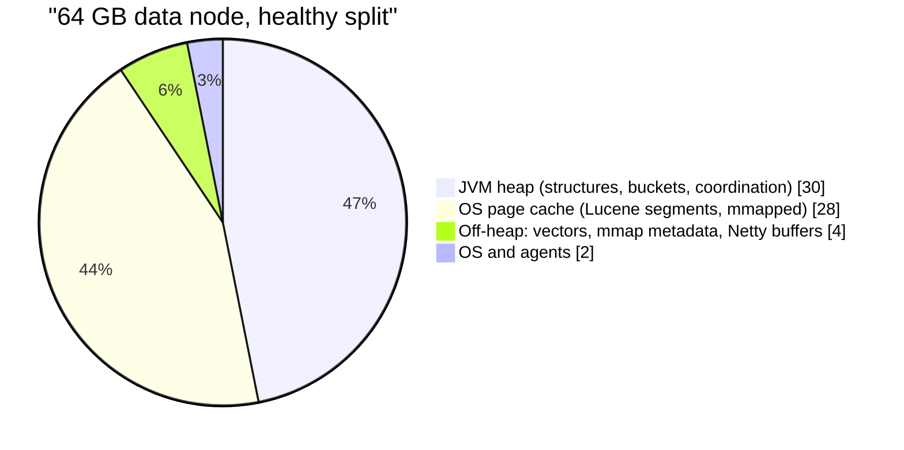
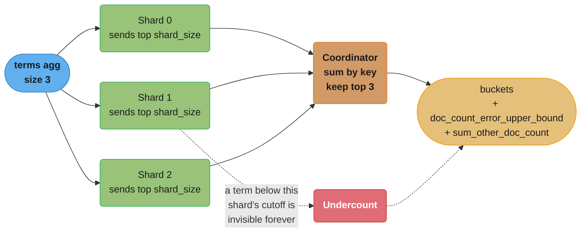
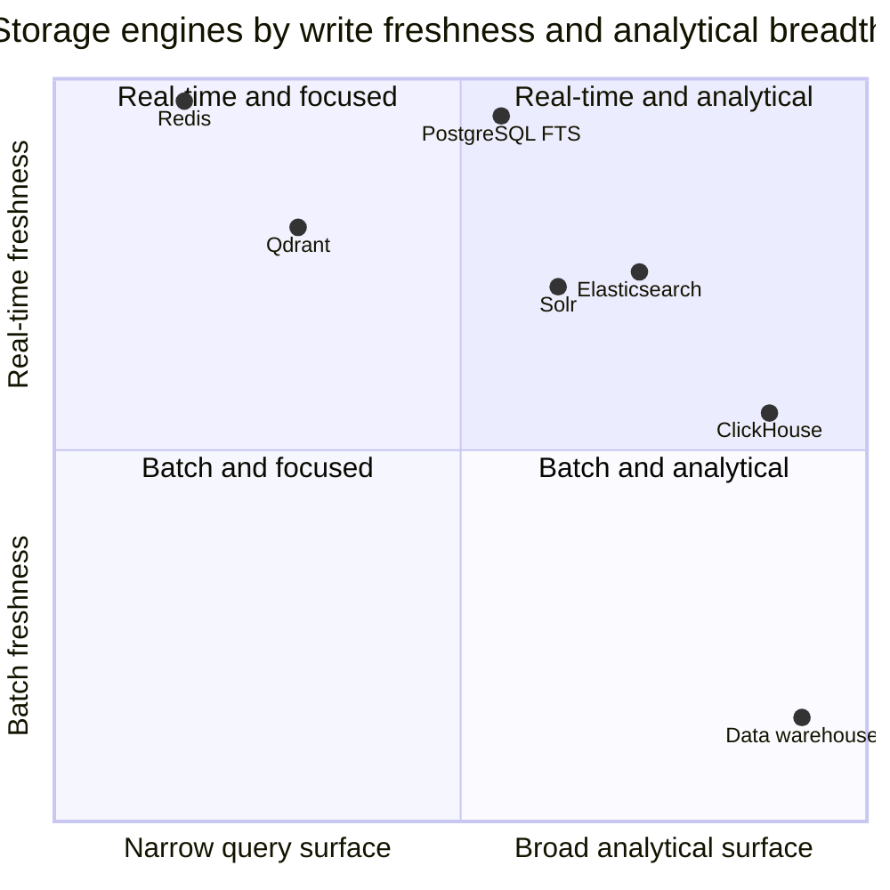

# Elasticsearch Internals

<!-- study-paths
senior: elasticsearch_internals.md
principal: elasticsearch_internals.md
files this module contributes to each curated path; omit a tier to leave it out
-->
## 1. Concept Overview

> **Version anchor (2026-08-05).** **Elasticsearch 9.5.0** (4 Aug 2026) is current and ships
> **Apache Lucene 10.5**. The maintained lines are **9.5**, **9.4** (latest 9.4.4, series GA
> May 2026), **9.3** (latest 9.3.8, series GA February 2026) and **8.19** (GA July 2025,
> supported to July 2027). 9.2 went end-of-support in May 2026, 9.1 in February 2026, 9.0 in
> October 2025 — Elastic maintains a major for the longer of 30 months after its own GA or 18
> months after the next major's GA. **OpenSearch 3.7.0** (July 2026) is the fork's current
> release; it forked from Elasticsearch **7.10.2** in January 2021 and now runs its own Lucene
> 10 line. Behaviour that arrived in a specific release is tagged inline as `[9.5]`, `[9.1]`,
> `[8.17]`, `[7.0]`, `[Lucene 10.3]`, `[OpenSearch 2.7]` — nothing here is called "current"
> without naming where it landed.

### What this page is, and what it is not

[Search Engines](../search_engines/search_engines.md) teaches the **category**. What an inverted
index is and why it turns `O(documents)` into `O(matching documents)`. Why BM25's three
corrections beat naive term counting. What a shard is, what filter context buys, what deep
pagination costs, why ILM tiers save money. Every one of those ideas survives if you swap
Elasticsearch for OpenSearch, Solr, Vespa, or a search service you have never heard of.

This page teaches **the specific program and the specific library underneath it**. Its file
extensions on disk. Its settings names and their defaults. Its checkpoint arithmetic. Its
circuit breakers. Its licence history. If a paragraph here names `.tim`, `index.translog.durability`,
`doc_count_error_upper_bound`, `bbq_hnsw`, `number_of_routing_shards` or the global checkpoint, it
is a fact about Elasticsearch-on-Lucene and it lives here. If it would still be true of another
search engine, it lives in the concept module. Read them in that order; this page assumes you
already have the category.

Three neighbours are load-bearing and are cross-linked rather than re-derived:

| For | Go to |
|-----|-------|
| HNSW derivation, ANN recall-vs-latency, library-versus-service | [FAISS deep dive](../../llm/faiss_deep_dive/faiss_deep_dive.md) |
| The vector-store category, pgvector, hybrid search, multi-tenancy | [Vector Databases](../vector_databases/vector_databases.md) |
| B+tree vs LSM, WAL, buffer pool, columnar layout | [Storage Engines Internals](../storage_engines_internals/storage_engines_internals.md) |

### The one-sentence thesis

**Elasticsearch is a distributed coordination layer wrapped around a pile of immutable Lucene
segments, and nearly every operational surprise it produces is a consequence of exactly one of
three facts: segments are immutable, the shard is the unit of everything, and the JVM heap is the
scarce resource.**

- **Segments are immutable** — so a document is never modified, only superseded; a delete is a bit
  flip in a side file; disk usage goes *up* when you delete; new data is invisible until a refresh
  opens a new reader; and merges, not writes, are what actually reclaim space (§6.6, §6.7).
- **The shard is the unit of everything** — of routing, of scoring statistics, of aggregation
  accuracy, of recovery, of allocation, of thread scheduling. This is why scores are not comparable
  across shards, why a terms aggregation can be flatly wrong, and why the primary shard count is
  the one decision you cannot cheaply undo (§6.10, §6.12, §6.16).
- **The heap is the scarce resource** — not CPU, not usually disk. Cluster state, global ordinals,
  nested-parent bitsets, aggregation buckets, field data and coordinator merge buffers all live
  there, and every "Elasticsearch fell over" story is one of them growing without a ceiling
  (§6.16, §6.17, §6.22).

Everything in §6 is one of those three sentences worked out in detail.

### The licence story and the fork, because you will be asked



**The honest reading.** AGPLv3 is OSI-approved, so Elasticsearch 9 *is* open source by the standard
definition. But it is **tri-licensed** — AGPLv3, SSPL, or the Elastic License 2.0 — and a
redistributor still has to pick one. An organisation that cannot ship AGPL code is left choosing
between two licences that are not open source. That is why "Elasticsearch is open source again" and
"our legal team still blocks Elasticsearch" are both true statements in 2026.

And the fork did not fold when the licence changed back. Four years of independent development is
not a rounding error. **The two engines share the Lucene core, the shard/replica model and most of
the query DSL; they have genuinely diverged everywhere above that.**

| Area | Elasticsearch 9.5 | OpenSearch 3.7 |
|---|---|---|
| Licence | AGPLv3 / SSPL / Elastic License 2.0 (pick one) | Apache 2.0, Linux Foundation |
| Fork point | — | Elasticsearch 7.10.2, Jan 2021 |
| Replication model | Document replication only — every replica indexes independently | Document **or** segment replication `[OpenSearch 2.7]` — primary ships segments |
| Remote-backed storage | Searchable snapshots, frozen tier | Remote store: translog and segments to object storage, requires segment replication |
| Vector field | `dense_vector` in core, `bbq_hnsw` default at dims ≥ 384 `[9.1]` | `knn_vector` via the k-NN plugin, engines `faiss` / `lucene`, GPU index build `[3.x]` |
| Sparse / semantic | ELSER, `sparse_vector`, `semantic_text` | Neural Search plugin, its own model serving |
| Query language | ES\|QL (piped), SQL, Painless | PPL (piped), SQL, Painless |
| Lifecycle | ILM plus data-stream lifecycle | ISM — a different API at `_plugins/_ism/policies` |
| Rollups | Removed in favour of TSDS downsampling | Index rollups still shipped as part of ISM |
| Index modes | `standard`, `logsdb` `[8.17]`, `time_series`, `lookup`, columnar `[9.5 tech preview]` | No equivalent mode family |
| Security | Built into the distribution, on by default `[8.0]` | OpenSearch Security plugin, descended from Open Distro |

This is a live engineering choice, not a footnote. If you need ES|QL, ELSER, searchable snapshots
against Elastic's frozen tier, or logsdb, you need Elasticsearch. If you need Apache 2.0, segment
replication, remote-backed storage, or AWS's managed default, you need OpenSearch. Everything else
on this page — segments, analysis, scoring, checkpoints, allocation, aggregation accuracy — is
common to both, and where it is not, the text says which engine it is describing.

---

## 2. Intuition

> **One-line analogy:** Elasticsearch is a filing cabinet whose drawers are welded shut the moment
> you close them. You never edit a document — you write a newer one and cross the old one out on a
> list taped to the drawer, and once a month you burn several drawers down into one new drawer that
> omits everything crossed out.

**Mental model.** Hold three pictures at once and almost every behaviour becomes predictable:

1. **A shard is one Lucene index.** One Lucene index is a set of immutable *segments* plus a small
   commit file naming which segments are live. That is the whole storage story.
2. **Writes land in a memory buffer and a log, not in a segment.** The buffer becomes a segment on
   *refresh* (default once a second). The log — the translog — is what makes the write durable
   before that. A *flush* turns memory-and-log into a committed on-disk state and truncates the log.
3. **The cluster is one elected master publishing a single shared data structure** — the cluster
   state — to every node. Mappings, settings, and the shard routing table live in it. If that
   structure gets big, the master gets slow, and a slow master is a slow cluster.

**Why it matters.** The commonest Elasticsearch incident is not "search is slow". It is one of:

- "I indexed it and it isn't there" — you are inside the refresh window (§6.3).
- "Disk is full and I deleted half the data yesterday" — deletes are bit flips; only merges reclaim
  (§6.7).
- "The cluster is red and nobody deployed anything" — a mapping explosion made cluster-state
  publication time out (§6.14, §6.17).
- "The counts on the dashboard are wrong but the query is right" — a terms aggregation across
  shards, working exactly as designed (§6.16).

None of those are bugs. All four are the immutable-segment / shard-as-unit / heap-is-scarce thesis
showing through.

**Key insight — the sentence the rest of the page unpacks.** *Nothing in Elasticsearch is modified
in place, so every cost you care about is the cost of writing something new and the cost of later
throwing the old thing away.* From that single fact:

- Indexing throughput is dominated by how often you cut a new segment (`refresh_interval`), not by
  how fast you can parse JSON (§6.3).
- Update-heavy workloads cost far more than insert-heavy ones at identical document rates, because
  an update is a delete plus an insert plus an eventual merge (§6.7).
- A force-merged 60 GB segment is a permanent liability: it exceeds the merge policy's ceiling, so
  its deleted documents are never reclaimed again (§6.6, Pitfall 3).
- The frozen tier works at all only because segments never change, so a segment in S3 is a valid
  cache key forever (§6.20).

---

## 3. Core Principles

- **A shard is a Lucene index; a Lucene index is immutable segments plus a commit point.**
  Everything Elasticsearch adds — routing, replication, aggregation, the REST API — is a
  distribution layer over that one primitive (§4.1).
- **Refresh, flush and merge are three different operations and beginners conflate all three.**
  Refresh makes data *visible*. Flush makes data *committed*. Merge makes data *cheap*. They are
  triggered by different thresholds, cost different resources, and fail differently (§6.3–§6.6).
- **Durability is the translog's job and it is configurable down to "mostly".**
  `index.translog.durability: request` fsyncs before acking every write. `async` fsyncs every 5
  seconds and quietly converts durability into a 5-second gamble (§6.4).
- **Scoring statistics are per-shard, so relevance is only approximately global.** IDF is computed
  from the local shard's document frequencies. Two identical documents on two shards can score
  differently, and `dfs_query_then_fetch` is the opt-in fix that costs an extra round trip (§6.10).
- **Search is a two-phase protocol and the coordinator pays for depth, not for page size.**
  Query phase collects `from + size` from every shard; fetch phase retrieves only the survivors.
  `search_after` plus a point in time replaces the offset with a cursor and flattens the cost curve
  (§6.11).
- **The primary shard count is a divisor baked into routing — but "immutable" is folklore.**
  `_split` and `_shrink` change it without a reindex, subject to arithmetic constraints set at index
  creation time by `index.number_of_routing_shards` (§6.12).
- **Consistency is enforced by sequence numbers and primary terms, not by consensus per write.**
  Every operation gets a `_seq_no` and a `_primary_term`; the global checkpoint is the watermark
  below which all in-sync copies agree. A replica that cannot keep up is *failed out*, never allowed
  to diverge (§6.13).
- **Cluster membership is a real consensus protocol as of 7.0.** Voting configurations replaced the
  hand-set `discovery.zen.minimum_master_nodes`, because a number a human has to keep correct is a
  split brain waiting for a maintenance window (§6.14).
- **Aggregations trade exactness for a single round trip, and say so in the response.**
  `doc_count_error_upper_bound` and `sum_other_doc_count` are not diagnostics — they are the
  aggregation telling you how wrong it might be (§6.16).
- **Mappings are cluster state, and cluster state is replicated to every node on every change.**
  This is why field explosion is a *cluster stability* problem rather than a disk problem (§6.17).
- **The heap is for structures, the page cache is for data.** Give the JVM half the RAM, never past
  the compressed-oops boundary, and leave the rest to the OS so Lucene's mmapped segments stay warm
  (§6.22).

---

## 4. Types / Architectures / Strategies

This section is the object system: the layer between "Elasticsearch stores documents" and "why does
this index occupy 3.4x the raw JSON". Almost everything here is a fact about Lucene that
Elasticsearch exposes under a different name.

### 4.1 What a segment actually is on disk

A shard directory contains a `segments_N` commit file and one group of files per segment. Files in a
group share a base name (`_4`, `_5`, …) and differ only by extension. This is the Lucene 10.5
inventory, which is what Elasticsearch 9.5 writes:

| Extension | Holds | Read during |
|-----------|-------|-------------|
| `segments_N` | The commit point: which segments are live, and the user data map (including the translog generation) | Open / recovery |
| `.si` | Segment metadata: doc count, codec, diagnostics, which files belong to it | Open |
| `.fnm` | Field infos: every field's name, number, index options, doc-values type, vector config | Open |
| `.tim` | **Term dictionary** — the terms themselves plus per-term metadata and pointers into `.doc` | Every term lookup |
| `.tip` | **Term index** — the in-memory-resident prefix structure that says which `.tim` block to read | Every term lookup |
| `.tmd` | Term dictionary metadata (per-field roots, min/max term) | Open |
| `.doc` | Postings: doc IDs and term frequencies, plus the inlined skip data | Every matching query |
| `.pos` | Token positions — needed only for phrase, span and interval queries | Phrase queries |
| `.pay` | Payloads and character offsets | Highlighting, payload scoring |
| `.nvd` / `.nvm` | Norms — the field-length factor BM25 needs, one **byte** per field per document | Every scored query |
| `.dvd` / `.dvm` | **Doc values** — the columnar store behind sorting, aggregations, scripts and TSDS | Aggregations, sorts |
| `.fdt` / `.fdx` / `.fdm` | **Stored fields** — the compressed blocks holding `_source` and any `store: true` field | Fetch phase only |
| `.kdd` / `.kdi` / `.kdm` | BKD trees: numerics, dates, IPs, geo points, `_seq_no` ranges | Range queries |
| `.vec` / `.vem` / `.veq` / `.vex` | Dense vectors: raw values, metadata, quantized values, HNSW graph | kNN search |
| `.tvx` / `.tvd` | Term vectors, if `term_vector` is enabled — a per-document mini index | Fast-vector highlighting, MLT |
| `.liv` | The live-docs bitset: one bit per document, cleared on delete | Every query, as a filter |
| `.cfs` / `.cfe` | Compound file — small segments pack all the above into one file to save file handles | Open |

Two structural consequences fall straight out of this list and are worth carrying into an interview:

1. **A field can be stored up to four separate times.** `title` mapped as `text` with a `.keyword`
   sub-field, present in `_source` and aggregated on, occupies postings (`.doc`/`.tim`), norms
   (`.nvd`), doc values for the sub-field (`.dvd`), and stored fields (`.fdt`). Each copy answers a
   different question, and disabling the wrong one breaks a feature you did not know depended on it
   (§6.8).
2. **`.liv` is the only mutable-looking file, and it is not mutable either.** A delete writes a
   *new* `.liv` generation for that segment. The document's postings, doc values and stored fields
   all remain on disk until a merge rewrites the segment without it (§6.7).

### 4.2 The term dictionary — block tree, and the FST that is no longer an FST

Terms are stored sorted, in blocks, with shared prefixes stripped. The `.tim` file holds the blocks;
the `.tip` file holds an index *over* the blocks that maps a term prefix to the byte offset of the
block that would contain it.

For roughly fifteen years that `.tip` index was a **finite state transducer** — a minimal
deterministic automaton whose arcs carry output values, which is why "Lucene uses an FST for the
term index" is in every article ever written about it. **As of `[Lucene 10.3]` it is not.** The
block-tree index was replaced by a specialised trie, kept for the same reason (a compact,
memory-resident prefix map) with a simpler layout and better lookup performance.

**What did not change, and is what the interview question is really about:**

- The term index is **memory-resident** and the term dictionary is **not**. `.tip` is small enough
  to hold; `.tim` is read from the page cache on demand. That split is what makes term lookup one
  seek rather than a binary search over gigabytes.
- Lookup is `prefix → block → linear scan within the block`. Block size is bounded (25–48 terms in
  the default writer), so the scan is short and cache-friendly.
- FSTs are still all over Lucene — synonym filters, suggesters, and the automaton machinery behind
  `wildcard`, `regexp` and fuzzy queries all use them. Only the *terms index* moved off it.

The practical fallout: high-cardinality `keyword` fields (UUIDs, request IDs) blow up `.tim` and
`.tip` because there is almost no shared prefix to strip and almost no block sharing to exploit.
That is the mechanism behind "we indexed the trace ID as a keyword and the index doubled".

### 4.3 Postings, delta encoding, and two levels of inlined skip data

A postings list for one term is an ascending run of doc IDs with a frequency each. Lucene stores
gaps, not values, and packs them in fixed-size blocks with the PFOR-delta family of codecs — every
block picks the bit width that fits its largest gap, with outliers stored as exceptions.

`[Lucene 10.4]` changed the two numbers most write-ups still quote:

| | Lucene ≤ 9.11 | Lucene 9.12 | Lucene 10.4+ (what 9.5 ships) |
|---|---|---|---|
| Block size | 128 docs | 128 docs | **256 docs** |
| Skip levels | Multi-level, stored at the **end** of the postings list | 2 levels, **inlined** | 2 levels, **inlined** |
| Skip granularity | 128, then 128² | every 128 and every 4,096 | **every 256 and every 8,192** |

Inlining the skip data was the important change: it makes the access pattern sequential, so a
conjunction that leapfrogs between two postings lists reads forward through one file instead of
bouncing between the list body and a skip block at the far end.

```
POSTINGS FOR "database", ONE SEGMENT  (Lucene 10.4+ layout, .doc file)

  byte offset ->  0        ~1.2K      ~2.4K      ~3.6K      ~4.8K
                  +----------+----------+----------+----------+----------+
  L0 skip every   | blk 0    | blk 1    | blk 2    | blk 3    | blk 4    |
  256 postings    | docs     | docs     | docs     | docs     | docs     |
                  | 17..903  | 907..2K1 | 2K4..5K0 | 5K2..9K8 | 9K9..14K |
                  +----------+----------+----------+----------+----------+
  L1 skip every   ^                                                     ^
  8192 postings   |<---------------- one L1 entry -------------------->|

  advance(target = 5300):
      L1 pointer   ->  jump straight past 8,191 postings if target is beyond them
      L0 pointers  ->  read the 5 block headers, land on blk 3 (5K2..9K8)
      within blk 3 ->  decode 256 gaps, linear scan  (vectorised, ~ns per doc)

  Cost model: O(1) pointer hops + ONE 256-doc block decode, NOT O(n) over 5,300 docs.
  Without skip data a conjunction of a 14M-doc term and a 900-doc term would decode
  14M gaps to find 900 intersections.
```

Skip data is what makes `bool.filter` cheap. A filter on `status: published` (14 million matches)
intersected with a term query matching 900 documents drives the leapfrog from the *rare* side, and
the common side never decodes more than 900 blocks.

### 4.4 The four places a field value can live

This is the single most useful table on the page, because almost every mapping mistake is choosing
the wrong row.

| Structure | Layout | Answers | Cost | Turned off with |
|-----------|--------|---------|------|-----------------|
| **Inverted index** (`.tim`/`.doc`) | term → doc list | "Which documents contain X?" | Large; positions dominate | `index: false` |
| **Doc values** (`.dvd`) | doc → value, columnar, per field | "What is field F for these docs?" — sorts, aggregations, scripts, `search_after` | Moderate; compresses well | `doc_values: false` |
| **Stored fields** (`.fdt`) | doc → all stored fields, row-oriented, block-compressed | "Give me the original document" — fetch phase, highlighting | Cheap on disk, only read for the top N | `_source.enabled: false`, `store: false` |
| **BKD tree** (`.kdd`) | balanced k-d tree over numeric/geo points | "Which documents fall in this range or shape?" | Small | `index: false` on a numeric |

**The rule that follows.** Aggregating requires doc values. Searching requires the inverted index or
a BKD tree. Returning the document requires stored fields. They are three independent switches, and
a `keyword` field you only ever aggregate on should be `index: false, doc_values: true` — which
typically removes 30–40% of that field's on-disk footprint with no functional loss.

**And the classic OOM.** A `text` field has *no* doc values, because an analysed field has many
values per document and no useful ordering. Setting `fielddata: true` on it makes aggregation
possible by inverting the inverted index **into the heap**, uncompressed, for every unique term in
the segment. The field data cache has no default size limit; the circuit breaker at 40% of heap is
the only thing between you and a node death, and it fires *during* the query, killing it after the
memory has already been reserved (§6.8).

### 4.5 Field types that carry a hidden structural cost

| Type | What it really is | The cost nobody budgets for |
|------|-------------------|------------------------------|
| `text` | Analysed into terms; no doc values | Cannot sort or aggregate; positions are the biggest part of the index |
| `keyword` | One term, unanalysed, doc values on | `ignore_above` (default 256 on dynamic sub-fields) silently drops longer values from the index |
| multi-field | The same source value indexed twice under two types | Doubles that field's index cost; the reason `title` and `title.keyword` coexist |
| `normalizer` | A keyword-only analysis chain: char filters plus per-character token filters, **no tokenizer** | Lets `keyword` be case-insensitive without becoming `text` |
| `object` | Flattened into dotted paths at index time | An array of objects loses the correlation between fields (§6.17) |
| `nested` | Each object is its **own hidden Lucene document** | A parent with 100 nested objects is 101 docs; parent bitsets live on heap permanently |
| `flattened` | The whole subtree as one field, every leaf a keyword | One mapping entry regardless of key count — the antidote to field explosion; loses typing, analysis and per-subfield aggregation |
| `join` | Parent/child within one shard, resolved by global ordinals at query time | `has_child` is typically 5–10x a `nested` query; children must be routed to the parent's shard |
| `dense_vector` | Raw or quantized vectors plus an HNSW graph | The graph must be in page cache to be fast; recall depends on `m`, `ef_construction`, `num_candidates` |
| `sparse_vector` | Term-weight pairs (ELSER output) indexed as a rank-features style field | Term-count explosion at query time — an ELSER query is a hundred-term weighted OR |

### 4.6 Index modes — the storage strategy is now a first-class setting

`index.mode` selects a bundle of defaults: which fields are the routing key, what the index sort is,
whether `_source` is synthetic, and which extra structures are built.

| Mode | Landed | What it changes | Use it for |
|------|--------|-----------------|------------|
| `standard` | always | Nothing — routing by `_id`, no index sort, stored `_source` | General search, anything mutable |
| `logsdb` | GA `[8.17]` | Index sorted by `host.name` then `@timestamp` descending, synthetic `_source`, aggressive codec defaults, `ignore_dynamic_beyond_limit` on | Log data streams |
| `time_series` (TSDS) | GA `[8.7]` | Routing by `_tsid` (a hash of the dimension fields) instead of `_id`, sorted by `_tsid` then time descending, synthetic `_source`, downsampling, `start_time`/`end_time` bounds per backing index | Metrics |
| `lookup` | `[8.16]` | Single-shard index intended as the right-hand side of an ES\|QL `LOOKUP JOIN` | Small dimension tables |
| columnar | tech preview `[9.5]` | Fields stored once as doc values, with no inverted index or BKD tree by default | Analytic, write-heavy, long-retention data |

**Index sorting is where the savings come from, not magic compression.** Sorting a log index by
host and time puts near-identical documents next to each other, so delta and prefix compression in
every structure — doc values, stored-field blocks, postings — has far more redundancy to exploit.
It also lets Lucene terminate early on a query whose sort matches the index sort.

**The licence catch.** Basic `logsdb` behaviour (index sorting and the compression defaults) is
available on Standard, Gold and Platinum. **Synthetic `_source`, which is where the largest share of
the reduction comes from, requires an Enterprise licence or serverless.** Budget the licence before
you budget the disk saving.

### 4.7 Node roles, and the two that people get wrong

| Role | Does | Sizing note |
|------|------|-------------|
| `master` | Elects, holds and publishes cluster state; makes allocation decisions | Runs **no** shards in a dedicated deployment; three of them, always odd |
| `data_content` | Shards of non-time-series indices | The default general-purpose data node |
| `data_hot` / `data_warm` / `data_cold` / `data_frozen` | The tiers ILM allocates to | Frozen nodes need disk for the shared cache, not for shards |
| `ingest` | Runs ingest pipelines (grok, enrich, inference) before indexing | CPU-heavy; a grok pipeline can cost more than the indexing |
| `ml` | Runs anomaly detection, NLP inference, ELSER | Needs its own memory budget outside the JVM heap |
| `remote_cluster_client` | Required on any node that issues cross-cluster search | Easy to forget; CCS fails with a confusing error without it |
| `transform` | Runs continuous transforms (pivot / latest) | Effectively a data node's workload |
| *(no roles)* | A **coordinating-only** node: routes, merges, aggregates | Not a role you add — it is what you get by removing all others |

The two mistakes: putting `master` on a busy data node (a long GC pause on the data workload makes
the master appear to have left the cluster) and never provisioning coordinating-only nodes for a
heavy-aggregation workload (the reduce phase then competes with indexing on the data nodes).

### 4.8 Data tiers and the two shapes of searchable snapshot



Cold and frozen are the same underlying feature — a snapshot mounted as a searchable index — used
two different ways. **Full-copy** (cold) downloads every segment to local disk and drops replicas,
because the snapshot in object storage *is* the redundancy; query latency is unchanged. **Shared
cache** (frozen) downloads nothing up front and keeps an LRU disk cache sized by
`xpack.searchable.snapshot.shared_cache.size`; a cache miss is an S3 range GET, so first-query
latency is object-store latency and a frozen node can front roughly 100x its own disk in data.

### 4.9 Which settings you can change, and which you cannot

| Setting | Changeable? | If not, the way out |
|---------|-------------|---------------------|
| `number_of_replicas` | Yes, live | — |
| `refresh_interval` | Yes, live | — |
| `index.translog.durability` | Yes, live | — |
| `index.codec` | Yes, but only applies to **new** segments | Force merge or reindex to convert the existing ones |
| Analyzer definitions | Only on a closed index, and only for **future** documents | Reindex; or use `search_analyzer` plus `_reload_search_analyzers` for updateable synonyms |
| Add a new field to a mapping | Yes | — |
| Change an existing field's type | **No** | Reindex into a new index, swap the alias |
| `number_of_shards` | **No** directly | `_split` (multiples) or `_shrink` (factors), bounded by `number_of_routing_shards` — see §6.12 |
| `index.number_of_routing_shards` | **No** — creation only | This is the setting that decides how far you can split later. Set it deliberately |
| `index.sort.field` / `index.mode` | **No** — creation only | Reindex |

The row people are surprised by is `index.number_of_routing_shards`. It is the one creation-time
setting whose whole purpose is to preserve a future option, and almost nobody sets it on purpose.

---

## 5. Architecture Diagrams

### 5.1 What is actually running inside one Elasticsearch process



One process, many pools. The two that show up in incidents are `write` (its queue of 10,000 is what
turns a bulk overload into `es_rejected_execution_exception`, a 429, rather than an OOM) and
`search` (its queue of 1,000 is per node, so a fan-out across 200 shards consumes 200 slots from one
request).

### 5.2 The life of a segment — refresh, flush, merge



Durability and visibility are on different edges. A document is **searchable** after refresh but not
yet **committed**; it is protected in that window only by the translog, which is why the `Lost` edge
exists at all and only for `index.translog.durability: async`.

### 5.3 A real shard directory, sized

```
ONE 42 GB SHARD OF A LOG INDEX  (11 segments, 380M docs, standard index mode)

  file group          bytes      share  in page cache?    read when
  ------------------------------------------------------------------------------
  _a1.fdt  _a1.fdx   18.9 GB     45.0%  cold, on demand   fetch phase (top N only)
  _a1.doc              8.0 GB     19.0%  hot               every matching query
  _a1.dvd              6.7 GB     16.0%  hot               aggregations, sorts
  _a1.pos              3.8 GB      9.0%  warm              phrase queries only
  _a1.tim              2.5 GB      6.0%  warm              term lookups
  _a1.kdd              1.3 GB      3.1%  warm              range filters
  _a1.nvd              0.4 GB      0.9%  hot               every scored query
  _a1.tip              0.3 GB      0.7%  pinned            every term lookup
  _a1.liv           14.2 MB       0.03% pinned            every query
  _a1.si _a1.fnm     1.1 MB       0.00% pinned            open only
  ------------------------------------------------------------------------------
  total              41.9 GB     100.0%

  raw JSON ingested                            27.4 GB
  index expansion factor  41.9 / 27.4     =      1.53x
  stored fields alone     18.9 / 27.4     =      0.69x   (_source, LZ4)
  everything else         23.0 / 27.4     =      0.84x   (the searchable part)

  with index.codec: best_compression (ZSTD level 9), stored fields fall to ~12.9 GB
      -> total 35.9 GB, a 14% whole-shard saving, paid for at fetch time
```

The distribution is the point: **`_source` is usually the single largest file group and the one
almost never read**, because the fetch phase touches only the top N documents. That asymmetry is
what `best_compression` and synthetic `_source` both exploit, and it is why "our index is 3x the
data" is normally a stored-fields conversation, not a postings conversation.

### 5.4 Query-then-fetch, with the pre-filter round



Two rounds, and the first one moves almost no data — doc IDs, scores and sort values only. That is
what makes `from + size` deceptively cheap in latency and expensive in memory: the coordinator holds
`(from + size) x shards` sort tuples in heap before it can discard any of them.

### 5.5 The write path, with sequence numbers and checkpoints



The acknowledgement to the client happens after **every in-sync copy** has the operation, not after
a quorum. There is no quorum in the data path — a replica that fails to apply an operation is
reported to the master and removed from the in-sync set, so the set is always exactly the copies
that agree.

### 5.6 Bytes per vector, by `dense_vector` index option



`bbq_hnsw` is the default for float vectors at 384 dimensions and above `[9.1]`: it keeps the
dimensionality and reduces each dimension to one bit, giving 32x compression plus about 14 bytes of
correction data per vector. The graph is unchanged; only the stored vectors shrink. Recall is bought
back at query time by rescoring the top candidates against higher-fidelity vectors, which is why the
default is safe rather than merely small — see the [FAISS deep dive](../../llm/faiss_deep_dive/faiss_deep_dive.md)
for the recall-versus-compression frontier this sits on.

### 5.7 Where a 64 GB data node's memory goes



Half to the heap, capped below the compressed-oops boundary, and everything left to the page cache.
The page cache is not spare capacity — it is where the `.doc`, `.dvd` and `.tip` files actually live
at query time. A node with 60 GB of heap and 4 GB of page cache reads every postings block from disk
and is slower than the same box with 30 GB of heap (§6.22).

---

## 6. How It Works — Detailed Mechanics

### 6.1 The analysis chain, and the contract between index time and search time

Analysis is three ordered stages, and only the middle one is mandatory:


**The contract.** A query term only matches if it comes out of analysis looking *exactly* like the
term that went into the index. The default is that both sides run the same analyzer, and every
zero-results mystery is a place where that stopped being true.

The four ways it goes wrong, in decreasing order of how often you will meet them:

1. **`match` against a `keyword` field.** The field was never analysed at index time, but `match`
   analyses the *query*, so searching `"Published"` on a `keyword` holding `Published` works while
   searching it on one holding `PUBLISHED` does not. Use `term` on keywords, or add a `normalizer`.
2. **`term` against a `text` field.** The query is not analysed, so you are looking for `Running`
   in an index that only contains `run`. Zero results, no error.
3. **`edge_ngram` applied at search time.** An index-time `edge_ngram` filter is correct — it stores
   `q`, `qu`, `qui`, `quic`, `quick`. Letting the same analyzer run at search time turns the query
   `quick` into five terms, of which `q` matches most of the corpus. Always pair an `edge_ngram`
   index analyzer with `"search_analyzer": "standard"`.
4. **Synonyms added at index time.** Then adding a synonym requires a full reindex. Put
   `synonym_graph` in the **search** analyzer with `"updateable": true`, store the set through the
   synonyms API `[8.10]`, and push changes live with
   `POST /my-index/_reload_search_analyzers`.

**Debug it with `_analyze`, always, before touching the query:**

```json
POST /products/_analyze
{ "field": "title", "text": "Quick-Brown Foxes" }
```

```json
POST /products/_analyze
{ "analyzer": "keyword", "text": "Quick-Brown Foxes" }
```

Run both, compare token streams, and the mystery resolves in a minute. `GET /products/_termvectors/1?fields=title`
shows what is actually in the index for one document, which settles the argument when `_analyze`
and reality disagree because someone changed the analyzer after the document was written.

### 6.2 Indexing one document, from REST to buffer

```
POST /orders/_doc/A17   ->  coordinating node
  1. resolve alias/data stream        -> concrete index, is_write_index
  2. run ingest pipeline if any       -> ingest thread pool, may rewrite the doc
  3. route                            -> shard = f(hash(_routing)); see 6.12
  4. forward over transport           -> node holding that primary
  5. primary: mapping check           -> dynamic mapping may need a CLUSTER STATE UPDATE
  6. primary: parse into Lucene doc   -> one field per structure it needs
  7. primary: assign _seq_no, _primary_term
  8. primary: IndexWriter.addDocument (or updateDocument = delete + add)
  9. primary: translog append (+ fsync if durability = request)
 10. replicate to every in-sync copy, wait for all
 11. ack
```

Step 5 is the one that bites. **A document introducing a new field triggers a cluster-state update**,
which is a master round trip, serialised and published to every node. Under a burst of
first-seen-fields — a new tenant, a new log source, a service that puts request IDs in field
*names* — the master becomes the bottleneck for indexing, and the symptom is bulk latency with an
idle CPU on every data node (§6.17).

### 6.3 Refresh — visibility, and the idle trick that surprises everyone

A refresh flushes the in-memory buffer to a new segment and opens a new `IndexSearcher` over it. It
does **not** fsync, does not touch the translog, and does not make anything durable. It costs a new
(usually tiny) segment and a searcher reopen.

| Setting | Default | Effect |
|---------|---------|--------|
| `index.refresh_interval` | `1s` | How often a background refresh runs |
| `index.search.idle.after` | `30s` | With no search for this long, background refresh **stops** |
| `?refresh=true` on a write | off | Refresh that shard synchronously; the write pays the cost |
| `?refresh=wait_for` on a write | off | Block the write until the next scheduled refresh includes it |
| `?refresh=false` | default | Do nothing extra |

**Search idle is the behaviour nobody expects.** If an index has an unset `refresh_interval` and has
not been searched for 30 seconds, Elasticsearch stops refreshing it. The next search triggers a
refresh and *waits for it*. So the first query after a quiet period takes about a second, and only
that one. This is a throughput optimisation for the thousands of idle indices in a log cluster, and
it is a latency mystery in a low-traffic search cluster. Setting `refresh_interval` explicitly —
even to `1s` — opts the index out of search idle entirely.

**`refresh_interval` is the single biggest indexing-throughput knob** because the cost of a refresh
is nearly independent of how many documents it contains. At `1s` a shard ingesting 2,000 docs/s cuts
a 2,000-document segment every second: 3,600 segments an hour, each of which must then be merged,
and merging is amortised rewriting. At `30s` the same shard cuts 120 segments an hour containing the
same data. **Same bytes written to segments, roughly one-thirtieth the segment count, and a merge
tree that is one level shallower.** The commonly cited "10x bulk speedup" from `refresh_interval: -1`
is mostly merge work that never happens.

```
# during a backfill
PUT /orders/_settings
{ "index": { "refresh_interval": "-1", "number_of_replicas": 0 } }

# ... bulk load ...

PUT /orders/_settings
{ "index": { "refresh_interval": "1s", "number_of_replicas": 1 } }
POST /orders/_forcemerge?max_num_segments=1&wait_for_completion=false
```

The `-1` must be reverted. Leaving it set means new documents are never searchable, and there is no
warning anywhere in the cluster health output.

### 6.4 The translog, and what `durability` actually buys

Every operation is appended to a per-shard translog *before* the write is acknowledged. The translog
exists because a Lucene commit is expensive and cannot run per write; it is the redo log that
replays anything not yet committed.

| `index.translog.durability` | Behaviour | Loss window |
|---|---|---|
| `request` (default) | fsync **and commit** the translog before acking each index, delete, update or bulk | None from a single node crash |
| `async` | fsync every `index.translog.sync_interval` (default `5s`), ack immediately | Up to 5 seconds of **acknowledged** writes |

**Read that loss window carefully, because the usual explanation is wrong.** With `async`, a JVM
crash alone loses nothing — the bytes are already in the OS page cache and the kernel will write
them out. What `async` gives up is the *machine*: a kernel panic, a power loss, a hard reset. And it
gives it up on writes you already told the client succeeded.

What `request` does **not** buy you:

- It is per shard copy, so a write acked with `request` is fsynced on the primary and on every
  in-sync replica. Good. But it is still **not a transaction** — a bulk of 500 documents is 500
  independent operations, and 3 of them can fail with the other 497 succeeding.
- It says nothing about *visibility*. A durable document is still invisible until refresh.

Sizing: `index.translog.flush_threshold_size` (default `512mb`) triggers a Lucene commit when the
translog for a shard grows past it. On a shard taking 2,000 docs/s at 1 KB each, that is a flush
about every four minutes. Recovery time after an unclean shutdown is bounded by translog replay, so
a larger threshold trades faster steady-state indexing for slower restarts.

**When `async` is the right answer:** log and metric ingestion where the source can replay (Kafka
offsets, a Beats registry, an S3 bucket), and the cost of an fsync per bulk is measurable. Measured
on a busy log cluster, `async` with `sync_interval: 5s` is commonly worth 15–25% indexing
throughput. **When it is the wrong answer:** anything Elasticsearch is the system of record for —
which should be nothing, but often is not.

### 6.5 Flush — the Lucene commit, and what `segments_N` means

A flush is a Lucene `commit`: fsync all live segment files, write a new `segments_N` generation
naming them, and truncate the translog up to that point. After a flush, restarting the process
replays nothing.

```
before flush                    after flush
  segments_7                      segments_8            <- new generation
  _a1.*  _a2.*  _a3.*             _a1.*  _a2.*  _a3.*  _a4.*
  translog-19.tlog  (340 MB)      translog-20.tlog  (0 MB)
  translog.ckp                    translog.ckp
```

`segments_N` also carries a *user data* map, and Elasticsearch stores the translog generation, the
local checkpoint and the maximum sequence number in it. That is how a restarting shard knows exactly
which translog operations it still needs.

You almost never call `_flush` by hand. The two times it matters: before a planned node restart (to
shorten recovery) and when reading `_stats` to confirm that a shard's translog is actually being
truncated rather than growing because a replica is stuck.

### 6.6 Merging — TieredMergePolicy, and why force merge is a trap

Segments accumulate; every additional segment is another term dictionary to consult, another live
docs bitset to apply, another set of file handles. Lucene's `TieredMergePolicy` continuously picks
groups of similarly sized segments and rewrites them into one.

| Setting | Default | What it controls |
|---------|---------|------------------|
| `index.merge.policy.segments_per_tier` | `10` | Roughly how many segments are allowed per size tier before a merge is scheduled |
| `index.merge.policy.max_merged_segment` | `5gb` | **A segment at or above this size is never selected for a normal merge again** |
| `index.merge.policy.floor_segment` | `2mb` | Segments below this are treated as this size, so tiny segments merge in bulk |
| `index.merge.policy.deletes_pct_allowed` | `20` | Target ceiling on the share of deleted documents in the index |
| `index.merge.scheduler.max_thread_count` | `max(1, min(4, CPUs/2))` | Concurrent merges per shard |

Merges run on a dedicated node-level `merge` thread pool (scaling, keep-alive 5m, max size = the
node's allocated processors), and the scheduler auto-throttles merge I/O when it is keeping up so
that background merging does not starve indexing.

**Force merge is the trap.** `POST /index/_forcemerge?max_num_segments=1` ignores
`max_merged_segment` and produces one segment of whatever size the shard is. On a 42 GB shard that
is a 42 GB segment — permanently above the 5 GB ceiling, therefore **never eligible for another
merge**. Every document you subsequently delete or update in that shard is a tombstone that will
never be reclaimed, and its disk space is gone until you reindex.

```
# BROKEN: force merge on an index that still receives writes
POST /orders/_forcemerge?max_num_segments=1
# 42 GB single segment. Six months later:
#   docs.count    141,203,884
#   docs.deleted   58,904,117      <- 29% of the shard is tombstones
#   store.size          61.4 GB    <- and growing, because nothing can merge it away
```

```
# FIXED: only ever force merge something that will never be written again,
# and let ILM do it as part of the read-only transition
PUT _ilm/policy/logs
{ "policy": { "phases": {
    "hot":  { "actions": { "rollover": { "max_primary_shard_size": "50gb" } } },
    "warm": { "min_age": "2d", "actions": {
        "readonly": {},
        "forcemerge": { "max_num_segments": 1 }
    } }
} } }
```

`readonly` before `forcemerge`, in that order, is the whole discipline. Elastic's own guidance is
explicit: force merge only indices that are no longer being written to.

### 6.7 Deletes and updates — why deleting data makes the index bigger

A delete does not remove anything. It clears one bit in the segment's `.liv` bitset and writes a new
`.liv` generation. The postings, doc values, stored fields and BKD entries for that document all
remain, and they are still read and then discarded by every query that would have matched.

An **update** is `delete + index`. The `_update` API does not patch anything: it fetches `_source`,
applies the change in memory, and writes a whole new document with a new `_seq_no`, marking the old
one deleted.

That produces a cost model most people get wrong:

```
  Workload A: 100M inserts, no updates
      segment bytes written  ~= 100M docs, merged log-style
      docs.deleted            = 0
      steady-state size       = data size

  Workload B: 10M documents, each updated 10 times  (identical 100M ops)
      segment bytes written  ~= 100M docs -- IDENTICAL write amplification
      docs.deleted at peak    = up to 90M
      steady-state size       = data size x (1 + deletes_pct_allowed)
                              = 1.2x, only if merges keep up

  Same op rate. Workload B needs the merge budget of a 100M-doc index to
  hold a 10M-doc index, and its query cost includes reading and rejecting
  the tombstones that have not yet been merged away.
```

Watch it with `GET /_cat/indices?v&h=index,docs.count,docs.deleted,store.size`. A `docs.deleted`
share above about 25% means merges are not keeping up, and the causes are, in order: force-merged
oversized segments (§6.6), throttled merge I/O on slow disks, or an update rate the shard count
cannot absorb.

**Soft deletes are a separate mechanism with a confusingly similar name.** Since `[8.0]` every index
retains recently deleted and updated documents in the Lucene history for a while
(`index.soft_deletes.retention_lease.period`, default `12h`) so that a returning replica or a
cross-cluster-replication follower can be caught up **operation by operation** instead of by copying
whole segment files. It is what replaced translog retention. It also means "we deleted it for GDPR"
is not true until the retention lease expires and a merge runs.

**Optimistic concurrency, correctly.** Do not use the deprecated `version` parameter. Read
`_seq_no` and `_primary_term` from the document and pass them back:

```
PUT /orders/_doc/A17?if_seq_no=8417&if_primary_term=3
{ "status": "shipped" }
# 409 version_conflict_engine_exception if anyone else wrote it first
```

Passing only `if_seq_no` is not safe: sequence numbers restart their guarantee under a new primary,
and the primary term is what disambiguates them.

### 6.8 `_source`, stored fields, doc values, and the fielddata OOM

**`_source` is a stored field.** The original JSON body, verbatim, compressed in blocks with the
stored-fields codec (LZ4 by default, ZSTD level 9 under `best_compression`, in blocks of at most
4,096 documents or 512 KB). It is read only in the fetch phase, for the documents that actually made
the top N.

Disabling it (`"_source": {"enabled": false}`) saves real disk and breaks, all at once: the update
and update-by-query APIs, reindex, highlighting on non-stored fields, the ability to change a
mapping and rebuild, and any debugging you were going to do. Almost always the right answer is
`_source.excludes` for a few large fields you never return, or synthetic `_source` — which
*reconstructs* the JSON from doc values at read time, costing query CPU and normalising field order,
array order and numeric formatting along the way. Synthetic `_source` is what makes `logsdb` and
TSDS as small as they are, and outside those it is a licensed feature.

**Doc values** are the columnar store: one column per field, per segment, encoded per type
(`SORTED_SET` ordinals for keywords, packed ints or delta-and-GCD for numerics). Aggregations,
sorting, scripts and `search_after` all read doc values. They are on by default for every field type
that can have them, and off for `text` because an analysed field has no single value per document.

**Global ordinals** are the per-shard structure that makes keyword aggregations fast: each segment
has local ordinals for its own terms, and a `terms` aggregation needs a shard-wide mapping to
combine them. That mapping is built **lazily on the first aggregation after each refresh** and
cached until the next one. Two consequences:

- The first aggregation after a refresh is much slower than the rest. On a high-cardinality field
  this can be seconds. `"eager_global_ordinals": true` moves that cost into the refresh instead,
  which is the right trade for a field aggregated on constantly and the wrong one for a field
  aggregated on rarely.
- Global ordinals live on the heap and scale with **cardinality**, not document count. A `keyword`
  field holding 40 million distinct user IDs builds a 40-million-entry ordinal map per shard.

**And `fielddata`, the classic node-killer.** Setting `"fielddata": true` on a `text` field makes it
aggregatable by loading every term of that field into heap, uninverted, per segment:

```
# BROKEN: the mapping was left dynamic, "message" became text,
# and someone built a Kibana terms visualisation on it
{ "aggs": { "top_messages": { "terms": { "field": "message" } } } }
-> "Fielddata is disabled on [message] in [logs-2026.08.01]"
# and the "fix" someone applies:
PUT /logs-2026.08.01/_mapping
{ "properties": { "message": { "type": "text", "fielddata": true } } }
-> one query later: CircuitBreakingException, [fielddata] would be larger
   than the limit of 40% of heap; and if the breaker had been raised, an OOM
```

```
# FIXED: aggregate on the keyword sub-field, never on the analysed one
{ "aggs": { "top_messages": {
    "terms": { "field": "message.keyword", "size": 20 } } } }
# and if the field is genuinely unbounded free text, do not aggregate on it at all --
# extract the categorical part at ingest time into its own keyword field
```

`indices.fielddata.cache.size` is **unbounded by default**, so the circuit breaker is the only
ceiling. Leave `fielddata` off. There is no production use case for it that a `.keyword` sub-field
or an ingest-time extraction does not serve better.

### 6.9 BM25 as Lucene actually computes it, including the one-byte norm

The formula is in the [concept module](../search_engines/search_engines.md#bm25-scoring-algorithm);
this is what the implementation does differently from the formula.

**`k1` and `b` are per-field settings, not global constants.**

```json
PUT /products
{ "settings": { "index": { "similarity": {
      "title_sim":  { "type": "BM25", "k1": 1.2, "b": 0.0 },
      "body_sim":   { "type": "BM25", "k1": 1.2, "b": 0.75 }
  } } },
  "mappings": { "properties": {
      "title": { "type": "text", "similarity": "title_sim" },
      "body":  { "type": "text", "similarity": "body_sim"  }
  } } }
```

`b: 0` on `title` is the standard move: every product title is short, so length carries no signal
and normalising by it only punishes the titles that are descriptive. `similarity` can be changed on
an existing field, unlike almost every other mapping parameter, because it is a query-time
construct.

**The norm is one byte, and that is a real source of surprise.** `|D|` in the BM25 denominator is
not the exact token count. Lucene encodes the field length as a single byte per field per document
in `.nvd`, using a lossy `SmallFloat` mapping with only 256 representable values, and the resolution
is coarse at the long end:

```
  exact length ->  encoded norm bucket  ->  decoded length used by BM25
      1                    1                        1
      2                    2                        2
     10                   10                       10
     40                   40                       40
     41 .. 42             41                       41
     56 .. 59             56                       56
    100 ..104             96                       96
    300 ..319            288                      288
   1000 ..1055           960                      960
```

Two documents of 300 and 318 tokens are, as far as scoring is concerned, the same length. This is
why an A/B test that trims boilerplate from long documents often shows no relevance change at all —
the change never crossed a bucket boundary. It is also why `"norms": false` on a `keyword`-like text
field is free: there was never useful length information there in the first place, and it saves a
byte per document per field.

**Explain it, do not theorise about it:**

```
GET /products/_explain/A17
{ "query": { "match": { "title": "wireless keyboard" } } }
```

The response is the full tree — `boost`, `idf` with its `n` and `N`, and `tf` with `freq`,
`k1`, `b`, `dl` (the *decoded* length) and `avgdl`. Every argument about relevance ends there.

### 6.10 Why scores are not comparable, and what `dfs_query_then_fetch` fixes

IDF needs `df` (documents containing the term) and `N` (documents in the corpus). **Both are read
from the local shard.** No shard knows the global figures during the query phase, because knowing
them would require a round trip that the two-phase protocol is designed to avoid.

```
  index "products", 3 shards, term "titanium"

  shard 0:  df =   3   N = 1,000,000  ->  IDF = ln(1 + (1e6 - 3 + .5)/(3 + .5))     = 12.66
  shard 1:  df = 900   N = 1,000,000  ->  IDF = ln(1 + (1e6 - 900 + .5)/(900 + .5)) =  7.01
  shard 2:  df = 897   N = 1,000,000  ->  IDF = ln(1 + (1e6 - 897 + .5)/(897 + .5)) =  7.02

  global:   df = 1,800  N = 3,000,000 ->  IDF                                       =  7.42

  A document on shard 0 scores 1.8x what an identical document on shard 1 scores.
```

At normal corpus sizes and normal shard counts this washes out — the law of large numbers puts every
shard's `df/N` near the global ratio. It stops washing out in exactly three situations, and all
three are common:

1. **Few documents per shard.** A five-shard index with 200 documents is the classic "why is my test
   relevance nonsense" report. Use one shard for small indices.
2. **Skewed routing.** Custom `_routing` by tenant means one tenant's documents are all on one shard,
   so its term statistics *are* that shard's statistics.
3. **Searching across indices.** `GET /products-2025,products-2026/_search` computes IDF per shard
   of each index. Scores from two indices with different corpus sizes and different mappings are not
   on a common scale, and no amount of `boost` tuning makes them so.

**The fix, and its price.** `?search_type=dfs_query_then_fetch` adds a preliminary DFS round: every
shard reports its term statistics, the coordinator sums them, and the real query phase runs with
global `df` and `N`. It is exact. It costs one extra network round trip to every shard on every
query, which on a 30-shard index across three availability zones is not free. Use it for relevance
*evaluation* always, and in production only when the three conditions above genuinely apply and you
have measured the latency.

**What it does not fix:** scores from two different queries, or from two different indices with
different fields and analyzers, are still not comparable, because they are sums over different term
sets. If you need a comparable number, you need reciprocal rank fusion (`rrf`), a learning-to-rank
rescore, or a normalised score you compute yourself — not a bigger `boost`.

### 6.11 Query-then-fetch in detail, and the deep-paging blowup

The concept module covers the `(from + size) x shards` cost curve. Four implementation details
change what you do about it:

**The pre-filter (can-match) phase.** When a search targets more than `pre_filter_shard_size`
shards (default 128), the coordinator first asks every shard a cheap question: could you possibly
match, given your `@timestamp` min/max and the query's range filter? Shards that answer no are
skipped entirely and never enter the query phase. This is what makes `GET /logs-*/_search` over 900
daily indices with a `now-15m` filter cost about the same as searching one index — and it is why a
query *without* a time filter over the same alias is catastrophically more expensive, a difference
of two orders of magnitude that looks like nothing in the query DSL.

**`batched_reduce_size`** (default 512) caps how many shard results the coordinator holds before
partially reducing them. `[9.1]` went further and added **batched query execution with data-node
side reduce**: shards on the same data node are queried in one request and reduced there, so the
coordinator merges per-node results rather than per-shard results. On a 900-shard fan-out across 20
nodes that turns 900 responses into 20, which is a large reduction in coordinator heap and transport
overhead. The user-visible semantics are unchanged; the failure semantics changed slightly, since a
reduce failure can now surface from a data node.

**`track_total_hits` defaults to `10000`, not `true`.** Since `[7.0]` the response says
`"total": {"value": 10000, "relation": "gte"}` once more than 10,000 documents match, because
counting the rest costs a full postings walk with no early termination. Setting
`"track_total_hits": true` restores the exact count and can double query cost on a broad query. Most
UIs should show "10,000+" instead.

**`max_result_window`** (default 10,000) caps `from + size` **per shard request**. Raising it is
almost always the wrong fix — it converts a clean 400 into an OOM.

**The fix, properly written.** A point in time pins the segment set so pagination is consistent even
while indexing continues, and `search_after` replaces the offset with a sort-key cursor:

```
POST /orders/_pit?keep_alive=2m
# -> { "id": "46ToAwMDaWR5..." }

POST /_search
{ "size": 1000,
  "pit": { "id": "46ToAwMDaWR5...", "keep_alive": "2m" },
  "sort": [ { "@timestamp": "asc" }, { "_shard_doc": "asc" } ],
  "track_total_hits": false }

# every subsequent page:
{ "size": 1000, "pit": { "id": "<the id RETURNED BY THE LAST RESPONSE>", "keep_alive": "2m" },
  "sort": [ { "@timestamp": "asc" }, { "_shard_doc": "asc" } ],
  "search_after": [ 1785312000000, 4294967298 ],
  "track_total_hits": false }

DELETE /_pit  { "id": "..." }
```

Four things in that snippet are load-bearing and routinely omitted:

- **`_shard_doc` as the final sort key.** It is a free, globally unique tiebreaker available only
  inside a PIT. Without a unique tiebreaker, documents with equal sort values are silently skipped or
  duplicated across pages.
- **Re-use the PIT id from the last response, not the first.** It can change between requests.
- **`track_total_hits: false`** — otherwise every page recounts the whole result set.
- **`DELETE /_pit` when finished.** A PIT pins segments open, which blocks merges from freeing their
  disk. A forgotten PIT with a long `keep_alive` on a busy index is a genuine disk-full incident.

`search_after` without a PIT works and is the right choice for a user-facing infinite scroll: pages
are cheap and consistency across pages does not matter much. `search_after` **with** a PIT is the
right choice for an export, where it does.

### 6.12 Routing — the real formula, and why "you cannot change the shard count" is folklore

The formula everyone quotes is `shard = hash(_routing) % number_of_primary_shards`. That is the
special case. The general one, which is what actually runs, is:

```
  routing_factor = index.number_of_routing_shards / index.number_of_shards
  shard_num      = (Murmur3(_routing) mod number_of_routing_shards) / routing_factor
```

with `_routing` defaulting to `_id`. When `number_of_routing_shards == number_of_shards` the
routing factor is 1 and it collapses to the familiar modulo. The extra level of indirection is the
entire point: **it is what makes `_split` possible without rehashing anything.**

```
  number_of_routing_shards = 12,  number_of_shards = 3   -> routing_factor = 4

  hash mod 12 :  0  1  2  3 | 4  5  6  7 | 8  9 10 11
  shard_num   :  0  0  0  0 | 1  1  1  1 | 2  2  2  2

  split 3 -> 6 (routing_factor becomes 2), same hashes, no rehash:

  hash mod 12 :  0  1 | 2  3 | 4  5 | 6  7 | 8  9 |10 11
  shard_num   :  0  0 | 1  1 | 2  2 | 3  3 | 4  4 | 5  5

  Every document that was on old shard 0 is now on new shard 0 or 1 --
  a clean partition, so the split is a hard-link-and-filter of the
  existing segments, not a reindex.
```

| Operation | Constraint | Preconditions | Cost |
|-----------|------------|---------------|------|
| `_split` | Target must be a multiple of the source and divide `number_of_routing_shards` | Index read-only (`index.blocks.write: true`), green | Hard-links segments, then deletes the wrong-shard docs and merges. Minutes, not hours |
| `_shrink` | Target must be a **factor** of the source | Read-only, **all primaries on one node**, green | Hard-links segments into one directory. Fast |
| `_reindex` | None | — | Full re-analysis of every document. Hours to days |

`index.number_of_routing_shards` defaults to a value that permits a few doublings, so a 3-shard
index can usually be split to 6 or 12 without having planned for it. Check before you promise it:
`GET /my-index/_settings?include_defaults=true&flat_settings=true` and read the value back.

**Custom routing** (`?routing=tenant-42`) puts a tenant's documents on one shard, which turns a
scatter-gather over 30 shards into a single-shard query — often a 10x latency win for a
multi-tenant search. Its two costs are a permanent obligation (every write, read, update and delete
for that tenant must carry the same routing value, forever) and hotspotting (one enormous tenant
lands entirely on one shard). `index.routing_partition_size` softens the second by spreading a
routing value across a bounded set of shards:

```
  shard_num = (Murmur3(_routing) + Murmur3(_id) mod routing_partition_size)
              mod number_of_shards
```

It must be less than `number_of_shards`, cannot be combined with a `join` field, and forbids `_id`
lookups without routing. Reach for it only when you have measured a real hotspot.

### 6.13 Replication — sequence numbers, primary terms, and the checkpoint machinery

Every operation that reaches a primary is stamped with two numbers:

| Field | Scope | Incremented by | Purpose |
|-------|-------|----------------|---------|
| `_seq_no` | Per shard | The primary, once per operation | Total order of operations on that shard |
| `_primary_term` | Per shard | The **master**, once per primary promotion | Distinguishes operations issued by different primaries |

From those two, three watermarks:

- **Local checkpoint** (per shard copy): the highest `n` such that every operation with
  `_seq_no <= n` has been processed locally. It stalls at the first gap.
- **Global checkpoint** (owned by the primary, piggybacked to replicas): the minimum local
  checkpoint across all **in-sync** copies. Everything at or below it exists on every in-sync copy.
- **Max seq no**: the highest sequence number the primary has issued.

**What the machinery buys, concretely:**

*Recovery without copying files.* When a replica comes back after a restart, the primary compares
the replica's local checkpoint with the operations still retained in the Lucene soft-deletes history.
If the gap is covered, it replays exactly those operations — an **operations-based recovery**, often
seconds. If it is not (the node was away too long, or a retention lease expired), it falls back to a
**file-based recovery** that copies whole segments, which for a 42 GB shard is a 42 GB network
transfer throttled by `indices.recovery.max_bytes_per_sec` (default 40 MB/s on most node sizes,
higher on dedicated cold/frozen nodes). That is the difference between a 15-second rolling restart
and a two-hour one, and the lever is `index.soft_deletes.retention_lease.period` (default `12h`).

*Correct failover.* When a primary dies, the master promotes an in-sync replica and **increments the
primary term**. The new primary runs a primary/replica resync: it replays operations above the
global checkpoint to every copy, so any operation that the old primary had applied locally but not
replicated everywhere is either completed or discarded consistently. Operations stamped with the old
primary term are recognised as stale and rejected.

*No silent divergence.* If a replica fails to apply an operation the primary applied, the primary
sends a **shard-failed** request to the master, which removes that copy from the in-sync allocation
IDs. The cluster goes yellow. It never goes "green and wrong".

**`wait_for_active_shards` is the knob people misread.** Default `1` means "the primary is
allocated" — it is a *pre-flight* check before the write starts, not a durability guarantee. Setting
it to `all` makes the write refuse to start when a replica is unassigned; it does **not** change the
fact that a write is already replicated to every in-sync copy before it is acked.

### 6.14 Cluster coordination since 7.0 — voting configurations and why `minimum_master_nodes` is gone

Before 7.0, split-brain protection was a number you set by hand:
`discovery.zen.minimum_master_nodes: 2`. It had to equal `floor(n/2) + 1` for the number of
master-eligible nodes you *currently* had, and it had to be updated every time that number changed.
Adding a third master node and forgetting to change it from 1 was a documented way to end up with
two clusters that both believed they were authoritative and both accepted writes.

`[7.0]` replaced it with a real consensus layer. The cluster maintains a **voting configuration**:
the set of master-eligible nodes whose votes count. A master is elected, and a cluster-state update
is committed, only with a strict majority of that set.

| Concept | What it is |
|---------|------------|
| Voting configuration | The set of master-eligible nodes whose votes count. Managed automatically |
| Quorum | A strict majority of the voting configuration |
| `cluster.initial_master_nodes` | Bootstrap only, **first start of a brand-new cluster**. Must be removed afterwards |
| `discovery.seed_hosts` | How a node finds peers. Not a quorum setting |
| `cluster.auto_shrink_voting_configuration` | Default `true` — the cluster shrinks the voting config when a node leaves permanently, keeping it odd |
| `POST /_cluster/voting_config_exclusions` | The correct way to decommission a master node |

**Why it is safer than a number.** The voting configuration is itself part of the cluster state, so
changing it requires a quorum of the *old* configuration — the same mechanism Raft uses for
membership changes. There is no window in which two disjoint quorums exist. The setting a human had
to keep correct is gone, and the one remaining human-set value (`cluster.initial_master_nodes`) is
used exactly once and is dangerous only if you leave it in the config file, where it can re-bootstrap
a *new* cluster on a node that failed to rejoin the old one.

**The three-master rule, arithmetically.** With 3 master-eligible nodes the quorum is 2, so the
cluster survives 1 failure. With 2, the quorum is 2, so it survives **zero** — two masters are
strictly worse than one. With 4, the quorum is 3, so it also survives 1: the fourth node buys
nothing and adds a node that can fail. Three, always, and dedicated in any cluster above a handful
of nodes.

**Cluster-state publication, and the failure mode that takes a cluster down.** Every change — an
index created, a mapping field added, a shard moved — is a new cluster-state version that the master
publishes in two phases (publish, then commit once a quorum acknowledges), sending diffs where it
can and the full state where it cannot.

```
  A healthy log cluster
      indices                          1,200
      fields per index (average)          180
      cluster state serialized           14 MB
      state updates per minute            ~40
      master CPU on publication           low

  The same cluster after six weeks of dynamic mapping on Kubernetes pod labels
      indices                          1,200
      fields per index (average)       11,400
      cluster state serialized          890 MB
      state updates per minute           ~40  (each one a new field)
      master CPU on publication          100%, single-threaded serialisation
      cluster.publish.timeout (30s)      exceeded
      symptom                            pending_tasks climbing, index creation
                                         hangs, nodes marked as lagging and
                                         eventually removed. Cluster is RED and
                                         nothing was deployed.
```

`GET /_cluster/pending_tasks` and `GET /_cluster/state?filter_path=metadata.indices.*.mappings --raw | wc -c`
are the two commands that identify this in under a minute. The fix is §6.17, and the emergency
mitigation is `dynamic: false` on the offending index template plus a rollover.

### 6.15 Allocation, watermarks, and what green / yellow / red actually mean

| Colour | Means | You can still |
|--------|-------|---------------|
| **Green** | Every primary and every replica is assigned | Everything |
| **Yellow** | Every primary is assigned; at least one replica is not | Read and write everything. You have no redundancy for the affected shards |
| **Red** | At least one **primary** is unassigned | Search the other shards — a search over the index returns *partial results*, and writes routed to the missing shard fail |

Two things about red that people get wrong. First, red is not cluster-wide unavailability: the rest
of the cluster serves fine, and a `_search` will happily return a 200 with `"_shards": {"failed": 1}`
and quietly incomplete results unless you check. Second, **a single-node cluster with the default
`number_of_replicas: 1` is permanently yellow and always will be** — a replica is never allocated to
the same node as its primary — which is the single most common false alarm in development.

Allocation is decided by a chain of **deciders** on the master. The ones that produce real incidents:

| Decider | Default | Behaviour when it bites |
|---------|---------|-------------------------|
| Disk threshold — low watermark | 85% | No **new** shards allocated to that node |
| Disk threshold — high watermark | 90% | Existing shards **relocated away** from that node |
| Disk threshold — flood stage | 95% | Every index with a shard on that node gets `index.blocks.read_only_allow_delete: true`. Writes start failing cluster-wide |
| `cluster.max_shards_per_node` | 1000 | Index creation is **rejected** with `validation_failed`. Rollover stops. Ingestion stops |
| Awareness (`cluster.routing.allocation.awareness.attributes`) | unset | With `forced_awareness`, replicas refuse to allocate until the other zone exists |
| `total_shards_per_node` (per index) | unset | Set too tight, shards stay unassigned with no obvious reason |
| Data tier preference | set by ILM | A `data_warm` index with no warm nodes never allocates |

Flood stage is the one that turns a disk problem into an outage, because the read-only block is
**not** removed automatically when disk frees up in older lines and must be cleared explicitly:

```
PUT /*/_settings
{ "index.blocks.read_only_allow_delete": null }
```

When a shard will not allocate, do not guess. `GET /_cluster/allocation/explain` names the decider
and the node, in prose, every time.

### 6.16 Aggregations — how a terms agg is computed, and why it can be wrong

A `terms` aggregation is not a distributed `GROUP BY`. It is a per-shard top-N followed by a merge,
and the merge cannot recover information the shards did not send.



**`shard_size` defaults to `size * 1.5 + 10`.** For `size: 10`, each shard returns its top 25. A
term that is 26th on every shard but would be 3rd globally is invisible to the coordinator — not
undercounted, *absent*.

The response tells you how bad it might be:

| Field | Meaning |
|-------|---------|
| `doc_count_error_upper_bound` | Worst-case undercount for the returned buckets: the sum, across shards, of the doc count of the last term each shard returned |
| `sum_other_doc_count` | Documents that fell into buckets not returned at all |
| `show_term_doc_count_error: true` | Adds a per-bucket error, so you can see which bucket is uncertain |

**When it is exact and you can prove it:** `doc_count_error_upper_bound: 0`, or a single-shard index,
or ordering by `_key` instead of `_count` (a key-ordered agg can be merged exactly). Raising
`shard_size` reduces the error at a cost in coordinator heap and network; setting it to the field's
cardinality makes it exact and makes the aggregation as expensive as a full scan.

**Ordering by a sub-aggregation is worse and the docs say so.** `"order": {"avg_price": "desc"}`
asks each shard for the terms with the highest local average, which correlates with the global
average not at all — a term with one very expensive document on one shard beats a term with a
thousand near-average documents. There is no error bound reported for this case because none can be
computed. If the number will appear on a finance dashboard, compute it with a composite aggregation
that pages through every bucket, or in ES|QL, or in a data warehouse.

**Cardinality is HyperLogLog++, and its accuracy is a setting.**

| `precision_threshold` | Memory per shard per agg | Behaviour |
|---|---|---|
| 3000 (default) | ~24 KB | Near-exact below ~3,000 distinct values; roughly 1–2% relative error at 100,000 |
| 40000 (max) | ~320 KB | Roughly 0.4% error at one million distinct values, at 16x the memory |

Memory is about `precision_threshold * 8` bytes per shard per aggregation, and the counter is
mergeable, which is the whole reason the aggregation is one round trip. Values above 40,000 are
silently clamped. Below the threshold the algorithm uses linear counting and is exact or nearly so —
which is why a `cardinality` agg on a low-cardinality field looks perfect right up until production
data arrives.

**`composite` is the exact, paginated alternative.** It walks every bucket in key order with an
`after` cursor, so it is exact, memory-bounded, and slower. It is the right tool for exports and
scheduled reports and the wrong tool for an interactive facet.

**Circuit breakers are the ceiling on all of it:**

| Breaker | Default limit | Trips on |
|---------|---------------|----------|
| `indices.breaker.total.limit` | 95% of heap (with `use_real_memory: true`, the default) | Actual JVM heap usage, checked before large allocations |
| `indices.breaker.request.limit` | 60% of heap | Aggregation buckets and other per-request structures |
| `indices.breaker.fielddata.limit` | 40% of heap | Loading a text field's fielddata |
| `indices.breaker.inflight_requests.limit` | 100% of heap | Request bodies in transit |
| `search.max_buckets` | 65,536 | Total buckets one search may create, across all aggregations |

`search.max_buckets` is not a breaker but behaves like one and is hit constantly: a `date_histogram`
at `1m` over 90 days is 129,600 buckets before any sub-aggregation multiplies it. Raising it is
almost always the wrong answer; widening the interval or using a `composite` agg is the right one.

**A `CircuitBreakingException` is Elasticsearch protecting itself and is a good outcome.** The bad
outcome is the parent breaker not firing in time and the node leaving the cluster with a heap dump.

### 6.17 Mapping — dynamic mapping, field explosion, nested, and join

**Dynamic mapping is convenient and is the leading cause of cluster-stability incidents.** Every
first-seen field is a cluster-state update (§6.14) and a permanent addition to a structure published
to every node.

| `dynamic` | Behaviour | When |
|-----------|-----------|------|
| `true` (default) | Add the field to the mapping | Prototypes only |
| `runtime` | Add it as a **runtime field** — queryable, computed at search time, **not** in the cluster-state field count in the same way, no index cost | Exploratory log data you may want to query occasionally |
| `false` | Store it in `_source`, do not index it, do not map it | Data you must keep but never query |
| `strict` | **Reject the document** with `strict_dynamic_mapping_exception` | Anything with a contract |

The relevant guards:

| Setting | Default | What it stops |
|---------|---------|---------------|
| `index.mapping.total_fields.limit` | 1000 | Field explosion — but as a hard rejection of the document |
| `index.mapping.total_fields.ignore_dynamic_beyond_limit` | `false` (`true` under `logsdb`) | Turns that rejection into "index the document, ignore the extra fields" |
| `index.mapping.nested_fields.limit` | 50 | Distinct `nested` fields per index |
| `index.mapping.nested_objects.limit` | 10000 | Nested objects in one document |
| `index.mapping.depth.limit` | 20 | Object nesting depth |

```
# BROKEN: an application that logs its request context as a map keyed by request id
{ "ctx": { "req-8f2a1c": { "user": 42, "ms": 17 } } }
-> a new mapped field "ctx.req-8f2a1c.user" and "ctx.req-8f2a1c.ms" per request
-> 11,400 fields per index after six weeks, 890 MB cluster state, master at 100%
```

```
# FIXED: keys-as-data, not keys-as-schema
{ "ctx": [ { "id": "req-8f2a1c", "user": 42, "ms": 17 } ] }
# mapping: exactly three fields, forever
{ "ctx": { "type": "nested", "properties": {
    "id":   { "type": "keyword" },
    "user": { "type": "long" },
    "ms":   { "type": "long" } } } }

# OR, when the shape is genuinely unknown and you only need term/range lookups:
{ "ctx": { "type": "flattened" } }
# one mapping entry regardless of how many keys ever appear.
# Cost: every leaf is a keyword -- no numeric ranges, no analysis, no
# per-subfield aggregation, no highlighting.
```

**Nested documents, and their real cost.** An `object` array is flattened at index time, which loses
the correlation between an object's fields — the classic `author.name: Alice AND author.city: LA`
false positive. `nested` fixes it by indexing each object as its own hidden Lucene document, and the
costs are all structural:

- A parent with 100 nested objects occupies **101 documents** in the segment. Against the Lucene
  limit of 2,147,483,519 documents per shard, and against every doc-count-based estimate you made.
- Updating any field of the parent rewrites the parent **and all of its nested children**.
- `nested` queries need a bitset marking parent documents, cached per segment in the
  `BitsetFilterCache`. It is on the heap, it is **never evicted**, and it grows with segment count
  and document count. Watch it at
  `GET /_nodes/stats/indices/segments?filter_path=**.fixed_bit_set_memory_in_bytes`. A few hundred
  megabytes here is normal on a nested-heavy index and comes straight out of the same heap the
  aggregations want.
- `inner_hits` — the only way to know *which* nested object matched — is a second fetch per hit.

**Join fields, and why parent/child is usually the wrong answer.** A `join` field models a real
one-to-many where children change independently of parents. It works, and it is expensive:

| | `nested` | `join` |
|---|---|---|
| Storage | Children inside the parent document | Separate documents, same shard |
| Update a child | Rewrites the whole parent | Rewrites just the child |
| Query cost | Cheap — block join within one segment | `has_child` / `has_parent` typically 5–10x a nested query |
| Extra structures | Parent bitsets on heap | Global ordinals for the join field, rebuilt per refresh |
| Constraints | `nested_objects.limit` | One join field per index; children must be routed to the parent's shard |

The decision order is: **denormalise first** (duplicate the parent's fields onto each child document
and accept the rewrite cost), **nested second** (children are small, bounded, and change with the
parent), **join only** when children are numerous, updated far more often than parents, and you have
measured that denormalising is worse.

### 6.18 Storage economics — codecs, index sorting, and what actually shrinks

| Lever | Typical saving | Paid for with |
|-------|----------------|---------------|
| `index.codec: best_compression` (ZSTD level 9, blocks of ≤4,096 docs or 512 KB) | 10–15% of the whole shard, ~30% of stored fields | Slower fetch phase — decompressing a block to return one document |
| Index sorting (`index.sort.field`) | 10–30% depending on how correlated the sort is with content | Slower indexing; sort chosen at creation and immutable |
| `logsdb` mode `[8.17]` | Elastic quotes up to 65% versus standard for logs | Enterprise licence for the synthetic-`_source` part; slower `_source` retrieval |
| Synthetic `_source` | Removes the stored `_source` entirely — often 40%+ of a shard | Query-time reconstruction, and JSON that is normalised rather than verbatim |
| `index: false` on aggregate-only keywords | 30–40% of that field | Field is no longer searchable |
| `norms: false`, `doc_values: false` where unused | A byte or a column per field per doc | Breaks scoring / aggregation on that field, silently |
| Dropping `_source` for fields you never return | Proportional | Reindex and update stop working for them |

`index.codec` changes apply to **new segments only**. Setting it on a live index and expecting the
disk graph to move is a common disappointment; you need a force merge (on a read-only index) or a
reindex to convert existing segments.

### 6.19 Data streams, rollover, and ILM as a state machine

A **data stream** is an alias with rules: an append-only name backed by hidden indices called
`.ds-<name>-<yyyy.MM.dd>-<NNNNNN>`, where writes always go to the newest backing index, `@timestamp`
is required, and only `create` (never `index` with an id, never `update`) is allowed. That last
restriction is why data streams suit logs and metrics and not documents you edit.

**Rollover** creates the next backing index and moves the write target. Conditions:

| Condition | Recommended for | Why |
|-----------|-----------------|-----|
| `max_primary_shard_size` | **Almost always** | Directly targets the thing that matters — shard size — regardless of document size or ingest rate |
| `max_primary_shard_docs` | TSDS and high-cardinality data | Bounds per-shard document count |
| `max_age` | Alongside a size condition | Guarantees a rollover even when ingestion stops |
| `max_size`, `max_docs` | Legacy | Index-wide, so they scale with shard count and mislead |

The condition is checked when ILM polls, every `indices.lifecycle.poll_interval` (default 10
minutes). **ILM is not a real-time system.** An index configured to roll at 50 GB with a 200 GB/hour
ingest rate can reach 80 GB before the poll fires; the fix is a smaller target, not a shorter poll.

ILM phases are `hot → warm → cold → frozen → delete`, and `min_age` is measured **from the index's
rollover** (for a rolled index) or from its creation, not from the phase before it — so a warm
`min_age` of 2d and a cold `min_age` of 7d means cold starts 7 days after rollover, not 9.

**Data stream lifecycle (DSL)** is the newer, simpler alternative: retention and downsampling
configured directly on the data stream (`PUT /_data_stream/<name>/_lifecycle`), with rollover
managed for you and no tier movement. Use DSL when all you want is "roll over sensibly and delete
after N days" and ILM when you need tiers, searchable snapshots, shrink or force merge.

### 6.20 Searchable snapshots and the frozen tier

A snapshot is incremental at the **segment file** level: a new snapshot uploads only segment files
no existing snapshot in that repository already holds, and deleting a snapshot removes only the
files nothing else references. This works precisely because segments are immutable — a file name is
a content identity.

Mounting a snapshot turns it into a searchable index:

```
POST /_snapshot/my-repo/snap-2026.02/_mount?wait_for_completion=true
{ "index": "logs-2026.02.14", "renamed_index": "restored-logs-2026.02.14",
  "index_settings": { "index.number_of_replicas": 0 },
  "storage": "shared_cache" }
```

| `storage` | Tier | Local disk needed | First-query latency | Redundancy |
|-----------|------|-------------------|---------------------|------------|
| `full_copy` (default) | cold | Full index size | Unchanged | The snapshot itself |
| `shared_cache` | frozen | An LRU cache, not the index | Object-store latency on a miss | The snapshot itself |

On a frozen node, `xpack.searchable.snapshot.shared_cache.size` defaults to 90% of the node's total
disk space, and the tier is sized by a **data-to-cache ratio** — a frozen node commonly fronts on
the order of 100x its own disk in searchable data. The tradeoff is honest and worth stating plainly:
a frozen-tier query that misses cache is a sequence of S3 range GETs, so p99 is seconds, not
milliseconds. Frozen is for compliance search and incident archaeology, not for dashboards.

Both tiers set `number_of_replicas: 0`, because the object store is the durable copy. A frozen node
dying loses cache, not data.

### 6.21 Vector search inside Elasticsearch — and when it is the wrong home

`dense_vector` is a first-class field type with its own Lucene structures (`.vec`, `.veq`, `.vex`,
`.vem`) and an HNSW graph per segment.

```json
"embedding": {
  "type": "dense_vector",
  "dims": 1024,
  "similarity": "cosine",
  "index_options": { "type": "bbq_hnsw", "m": 16, "ef_construction": 100 }
}
```

| Parameter | Default | Effect |
|-----------|---------|--------|
| `index_options.type` | `bbq_hnsw` for float vectors at dims ≥ 384, otherwise `int8_hnsw` `[9.1]` | Quantization: `flat`, `hnsw`, `int8_hnsw`, `int4_hnsw`, `bbq_hnsw` |
| `m` | 16 | Graph connectivity. Higher = better recall, larger graph, slower build |
| `ef_construction` | 100 | Build-time candidate list. Higher = better graph, slower indexing |
| `num_candidates` (query time) | `max(1.5 * k, 100)` | Search-time candidate list. **The main recall dial**, per query |
| `rescore_vector.oversample` | set by the quantization default | Fetch more candidates, rescore against higher-fidelity vectors |

**Two Elasticsearch-specific facts that do not transfer from a standalone HNSW library:**

1. **Each segment has its own graph.** A kNN search runs the graph in every segment and merges. So
   segment count affects vector recall and latency far more than it affects lexical search, and
   force-merging a read-only vector index is genuinely valuable in a way it usually is not
   elsewhere. Merging vector segments is also expensive, because the graph is rebuilt.
2. **Filtered kNN is not post-filtering.** Elasticsearch pushes the filter *into* the graph traversal,
   and `[9.1]` added ACORN-style filtered traversal, which keeps recall reasonable at low filter
   selectivity. This is the axis on which an in-process library loses hardest — see
   [FAISS §6.8](../../llm/faiss_deep_dive/faiss_deep_dive.md) for why a filter over an ANN index is a
   genuinely hard problem rather than an implementation detail.

**The honest comparison.** Do not re-derive HNSW here; decide where the vectors live.

| | Elasticsearch `dense_vector` | Dedicated vector store (Qdrant, Weaviate, Milvus) | FAISS in-process |
|---|---|---|---|
| Hybrid lexical + vector in one query | Native (`rrf` retriever, `knn` + `query`) | Varies; usually a bolted-on BM25 | You build it |
| Filtered kNN | Pushed into traversal, ACORN `[9.1]` | Strong; the category's main selling point | Weak — the known hard edge |
| Metadata, updates, deletes, security | Full document model, RBAC, field-level security | Good | None — you own all of it |
| Index build speed at scale | Slower; the general-purpose write path is in the way | Fast | Fastest |
| Memory efficiency at a target recall | Good with BBQ; graph must be page-cached | Comparable | Best — no server overhead |
| Operating a second system | No | Yes | No, but you build the service |

**The rule.** If you already run Elasticsearch and your corpus is under a few hundred million
vectors, put the vectors in it — one query, one filter model, one security model, one thing to
operate, and hybrid retrieval is where quality actually comes from. Move to a dedicated store when
vector search is the *product* rather than a feature, when you need billions of vectors, or when the
index-build rate is the bottleneck. Use FAISS directly only when there is no service boundary at
all.

### 6.22 Sizing — the numbers, and the condition attached to each one

Every number below has a condition. Quoting them without it is how bad clusters get built.

**Heap.** Set `-Xms` and `-Xmx` equal, to **50% of node RAM**, and **below the compressed-oops
boundary**. The JVM addresses objects with 32-bit references plus a 3-bit shift while the heap is
small enough, giving 32 GB of addressable space from 4-byte pointers; past that every reference
becomes 8 bytes and effective capacity *falls*. The zero-based variant, which is faster still,
is typically lost somewhat below that. **26–30 GB is the safe band; verify, do not assume:**

```
grep -i "compressed oops" /var/log/elasticsearch/*.log
# "heap address: 0x0000000340000000, size: 30720 MB,
#  Compressed Oops mode: Zero based, Oop shift amount: 3"
```

*Condition:* Elasticsearch 8+ sizes the heap automatically from node RAM and roles, and the
automatic choice is usually right. Override it only with a measured reason.

**Page cache.** The other 50%. Lucene reads segments through mmap, so `.doc`, `.dvd` and `.tip`
being resident is what makes queries fast. *Condition:* this assumes the hot working set fits. On a
frozen node the ratio is meaningless — that node is a cache, and its disk is the cache.

**Also required, and forgotten every time:** `vm.max_map_count` must be at least 262144, because a
node with thousands of segments exhausts the default and fails to start with a message about mmap
count. Set `bootstrap.memory_lock: true` and disable swap; a swapped heap is worse than a small one.

**Shard size: 10–50 GB.** *Condition:* this is a recovery-time and merge-cost guideline, not a
performance cliff. Below ~10 GB the fixed per-shard overhead dominates; above ~50 GB a file-based
recovery of that shard takes an uncomfortably long time at 40 MB/s and merges get chunky. Time-series
data is routinely pushed to the top of the band or past it because it is rarely relocated.

**Shards per node: aim for 20 or fewer per GB of heap; hard limit 1,000
(`cluster.max_shards_per_node`).** *Condition:* the 20-per-GB figure assumes ordinary shards. A
30 GB-heap node is fine with 600 ordinary shards and will struggle with 600 shards each carrying a
large nested-parent bitset or eager global ordinals. Frozen shards are much cheaper and get their
own limit (`cluster.max_shards_per_node.frozen`, default 3,000).

**Documents per shard: 2,147,483,519 (Lucene's hard limit).** *Condition:* **nested documents count**.
An index averaging 40 nested objects per document hits it at ~52 million user-visible documents.

**A worked sizing, end to end:**

```
  Requirement: 900 GB/day of logs, 30 days hot+warm retention, 1 replica

  daily primary data                              900 GB
  target shard size                                50 GB
  primary shards per daily index   900 / 50     =  18
  with 1 replica                    18 x 2      =  36 shards/day
  30 days                           36 x 30     = 1,080 shards
  30 days of data                  900 x 30 x 2 =  54 TB on disk

  Nodes at 64 GB RAM / 30 GB heap / 6 TB NVMe:
    by disk      54 TB / (6 TB x 0.80 usable)   =  12 nodes
    by shards    1,080 / (30 GB x 20 per GB)    =   2 nodes   <- not the constraint
    by ingest    900 GB/day = 10.4 MB/s sustained, x3 for
                 bursts and merge = ~32 MB/s write per node   <- comfortable
    choose       12 data nodes + 3 dedicated masters

  Now move days 3-30 to a frozen searchable-snapshot tier:
    hot+warm      3 days x 900 GB x 2  =  5.4 TB   ->  2 nodes
    frozen        27 days x 900 GB x 1 = 24.3 TB in S3, replicas 0
    frozen nodes  2 x 2 TB cache fronting 24.3 TB  ->  a ~6:1 ratio, conservative
    total         2 hot + 2 frozen + 3 masters, versus 12 + 3
```

The frozen tier is not a 10% saving; it removes the replica *and* moves the bytes to object storage,
so it is typically a 5–10x cost reduction on the retention tail. What it costs is p99 on the queries
that reach it — which for 27-day-old logs is the correct trade, and for a live dashboard is not.

---

## 7. Real-World Examples

- **Wikipedia / Wikimedia search (CirrusSearch).** Runs Elasticsearch over hundreds of wikis in
  multiple languages, with per-language analysis chains and a custom scoring pipeline. The
  interesting engineering is the analysis layer: a shared cluster serving hundreds of language
  variants is a demonstration that the analyzer, not the query DSL, is where multilingual relevance
  is won.
- **GitHub code search.** Went the other way. GitHub ran Elasticsearch for code search for years and
  then built a purpose-built engine (Blackbird) because code is adversarial to a general text
  analyzer: identifiers do not tokenise usefully, substring search matters, and the corpus is
  enormous relative to the query load. A useful counter-example to "put everything in
  Elasticsearch".
- **Elastic's own Observability and Security products.** Both are Elasticsearch clusters with a UI.
  This is why `logsdb`, TSDS, downsampling, searchable snapshots and the frozen tier exist at all —
  they are the features Elastic needed to make its own products' storage economics work, and they
  were built for petabyte-scale log retention before they were features you could buy.
- **The default of the container ecosystem.** The EFK stack (Fluent Bit / Fluentd → Elasticsearch or
  OpenSearch → Kibana) is the out-of-the-box logging story for a large share of Kubernetes clusters.
  It is also the single largest source of the mapping-explosion incident in §6.14, because pod
  labels and annotations are user-controlled and end up as field *names*.
- **Amazon OpenSearch Service.** AWS's managed offering for the forked lineage, and the reason
  OpenSearch has the adoption it does. Worth knowing because a design conversation on AWS will
  default here, and the divergence table in §1 is what decides whether that default is acceptable.

---

## 8. Tradeoffs

### 8.1 The knobs that trade throughput against something else

| Knob | Setting | Buys | Costs |
|------|---------|------|-------|
| Refresh cadence | `refresh_interval: 30s` | Large indexing throughput gain, far fewer segments | 30-second visibility lag |
| Durability | `translog.durability: async` | 15–25% indexing throughput | Up to 5s of acked writes on machine loss |
| Replicas during load | `number_of_replicas: 0` | Halves write work | No redundancy during the load |
| Codec | `best_compression` | 10–15% of shard size | Slower fetch phase |
| Index mode | `logsdb` | Up to 65% for logs | Enterprise licence, slower `_source` |
| Scoring | `dfs_query_then_fetch` | Exact, comparable relevance | One extra round trip per query |
| Total hits | `track_total_hits: true` | Exact result counts | Up to 2x query cost on broad queries |
| Terms accuracy | Large `shard_size` | Smaller `doc_count_error_upper_bound` | Coordinator heap and network |
| Aggregation speed | `eager_global_ordinals: true` | No first-query cliff | Every refresh pays the build |
| Vector recall | Higher `num_candidates` | Better recall | Linear-ish latency increase |

### 8.2 Where in the design space a search engine sits



Elasticsearch's position is the whole argument for it: near-real-time freshness *and* a broad
analytical surface, which is a combination almost nothing else offers. Its position is also the
whole argument against it — a warehouse is cheaper and more correct for analytics, PostgreSQL is
correct for transactions, and a search engine straddling both is a compromise you should choose on
purpose.

### 8.3 Elasticsearch against its actual alternatives

| | Elasticsearch | OpenSearch | PostgreSQL FTS | ClickHouse | Vespa |
|---|---|---|---|---|---|
| Relevance quality | Excellent — BM25, LTR, ELSER, RRF | Very good — BM25, neural plugin | Adequate — `ts_rank`, no BM25 | Poor — text search is not the point | Excellent, with ranking as a first-class program |
| Transactions | None | None | Full ACID | None | None |
| Log analytics economics | Good with logsdb + frozen | Good with remote store | Poor | **Best** — often 5–10x cheaper per TB | Not the target |
| Vector search | Native, BBQ, filtered traversal | k-NN plugin, GPU build | pgvector | Approximate, improving | Native, strong |
| Operational burden | High | High | Low | Medium | High |
| Licence | AGPL / SSPL / ELv2 | Apache 2.0 | PostgreSQL licence | Apache 2.0 | Apache 2.0 |

The honest summary: **if your corpus fits in PostgreSQL and your relevance needs are modest, use
PostgreSQL** — you avoid a whole distributed system and a dual-write problem. **If your workload is
"count and group by over immutable events", ClickHouse is materially cheaper.** Elasticsearch wins
when you need genuine relevance ranking, faceting, and near-real-time freshness in the same query.

---

## 9. When to Use / When NOT to Use

**Reach for Elasticsearch when:**

- Relevance ranking is a product requirement, not a `LIKE` clause — you will tune analyzers, boosts,
  synonyms and possibly a rescore, and you need `_explain` to argue about it.
- You need faceted navigation: counts alongside results in one round trip, over fields the user can
  filter on interactively.
- You are storing logs, traces or events and engineers genuinely search them ad hoc, with unknown
  predicates over full text.
- You need hybrid retrieval — BM25 and dense vectors fused, with a filter — and you would rather run
  one system than three.
- Geospatial search over shapes and distances is central.
- The data has a natural time axis and a retention policy, so ILM, rollover and the frozen tier turn
  retention into a configuration file rather than a cron job.

**Do NOT use it when:**

- **It would be the system of record.** No cross-document transactions, no foreign keys, eventual
  visibility, and a `_reindex` in your future for any type change. Keep a durable source and project
  into Elasticsearch through CDC or an outbox — see
  [Polyglot Persistence Patterns](../polyglot_persistence_patterns/polyglot_persistence_patterns.md).
- **You need read-your-own-write.** The refresh window is real, and `?refresh=true` on every write
  destroys indexing throughput while creating a segment per request.
- **The workload is "GROUP BY over 40 billion rows and the number must be exact".** Terms aggregation
  error and `search.max_buckets` are design constraints, not bugs. ClickHouse or a warehouse.
- **You mostly filter by a handful of known labels and grep within.** Loki or a columnar store holds
  the same volume for a fraction of the cost, because you are paying for a full-text index you never
  use.
- **The query pattern is a key lookup.** Redis or the primary store. An inverted index is a very
  expensive hash map.
- **You cannot staff it.** Elasticsearch has more sharp edges per operator-hour than almost anything
  else in this repository. A managed service moves some of them; it does not move shard sizing,
  mapping design, or heap pressure.

---

## 10. Common Pitfalls

**Pitfall 1 — the mapping explosion that took down the master.** A platform team ran EFK for 40
microservices. Teams logged structured context, and one service used request IDs as JSON *keys*.
Dynamic mapping created two fields per request. Six weeks later the cluster state was 890 MB, master
CPU sat at 100% serialising it, `cluster.publish.timeout` expired on every update, nodes were marked
as lagging and removed, and the cluster went red with no deployment in flight. **Fix:** `dynamic:
strict` on the index template for anything with a contract, `dynamic: runtime` for exploratory data,
`flattened` for genuinely unknown shapes, plus `index.mapping.total_fields.limit` left at 1000 so a
regression fails loudly instead of accumulating. Recovery required deleting the offending backing
indices — a mapping is not shrinkable.

**Pitfall 2 — `?refresh=true` on every write.** A team hit read-your-own-write problems in an
end-to-end test suite and fixed it by appending `?refresh=true` to every index call. It shipped.
Indexing throughput fell from 12,000 docs/s to about 400, segment count per shard passed 8,000, and
merge threads saturated every node. **Fix:** `?refresh=wait_for` in the rare places a caller must see
its own write (it batches into the next scheduled refresh instead of forcing one), and for
everything else, design the application not to read its own writes from Elasticsearch.

**Pitfall 3 — the force-merged index that could never reclaim disk.** An operations runbook said
"force merge nightly for performance". It ran against the live write index. Every night produced one
60 GB segment, permanently above `max_merged_segment: 5gb` and therefore never merged again. Six
months later `docs.deleted` was 29% of the shard and disk usage was growing while document count was
flat. **Fix:** force merge only after `readonly`, and only from ILM. Recovering the existing indices
took a reindex.

**Pitfall 4 — deep pagination that survived review because it was "only page 3".** An export job
walked results with `from` and `size: 1000`. It worked in staging with 4,000 documents. In production
the same job walked 2 million, hit `max_result_window` at page 10, and the "fix" was raising the
window to 2,000,000 — which asked every one of 30 shards for 2 million sorted tuples and OOM'd three
data nodes. **Fix:** PIT plus `search_after` sorted on `_shard_doc`, with `track_total_hits: false`
and an explicit `DELETE /_pit`. And put `max_result_window` back.

**Pitfall 5 — the terms aggregation on the finance dashboard.** Revenue by merchant, `size: 20`,
30 shards. The dashboard disagreed with the ledger by 3–7% and nobody could reproduce it, because
the discrepancy depended on how the day's documents happened to distribute across shards.
`doc_count_error_upper_bound` was in the response the whole time. **Fix:** for a number that must be
right, a `composite` aggregation paging every bucket, or ES|QL, or the warehouse. For a UI facet,
raise `shard_size` and display the error honestly.

**Pitfall 6 — `fielddata: true` to make an error message go away.** "Fielddata is disabled on
[message]" is a clear message with a wrong-looking fix one line below it in every search result.
Enabling it loaded every distinct term of a free-text log message into heap. The circuit breaker
fired at 40%, the team raised the breaker, and the next query OOM'd the node. **Fix:** aggregate on
`.keyword`, or extract the categorical part at ingest time. Never enable `fielddata`.

**Pitfall 7 — five shards for a 500 MB index, and one shard for a 900 GB one.** Both directions of
the same mistake, and the second is worse. Over-sharding pays per-shard overhead — a search thread
slot, cluster-state metadata, file handles, a merge scheduler — for nothing. Under-sharding produces
a 900 GB shard that takes most of a day to recover at 40 MB/s, cannot be relocated during a rolling
restart, and pins the index to one node's disk. **Fix:** `ceil(mature_size / 50GB)`, and set
`index.number_of_routing_shards` at creation so `_split` remains available when the estimate is
wrong.

**Pitfall 8 — the single-node cluster that was "always yellow, we ignore it".** A team learned to
ignore yellow in development. In production, yellow meant a replica had been unassigned for eleven
days because a disk watermark blocked allocation. When the primary's node failed, the shard went red
and that day's data was gone. **Fix:** alert on yellow in production, always, and route it to
`GET /_cluster/allocation/explain` rather than to a human's intuition.

**Pitfall 9 — the index-time synonym file.** Synonyms were baked into the index analyzer. Every
merchandising change — a new brand alias, a seasonal term — required a full reindex of 40 million
products, so changes were batched quarterly and the search team stopped being able to iterate.
**Fix:** `synonym_graph` in the **search** analyzer with `"updateable": true`, the synonym set stored
through the synonyms API, and `POST /_reload_search_analyzers` to apply it live.

**Pitfall 10 — the forgotten point in time.** An export tool crashed after opening a PIT with
`keep_alive: 24h`. The PIT pinned every segment open, merges could not delete the segments they had
replaced, and disk on the hot tier climbed 400 GB overnight until the flood-stage watermark set every
index read-only. **Fix:** short `keep_alive` values, `DELETE /_pit` in a `finally` block, and
`GET /_nodes/stats/indices/search?filter_path=**.open_contexts` on the monitoring dashboard.

---

## 11. Technologies & Tools

### 11.1 The engines and their distributions

| Tool | What it is |
|------|------------|
| Elasticsearch | The engine. Tri-licensed AGPLv3 / SSPL / Elastic License 2.0 |
| OpenSearch | The Apache-2.0 fork of 7.10.2, now under the Linux Foundation |
| Apache Lucene | The Java library underneath both — segments, postings, BM25, HNSW |
| Apache Solr | The other Lucene server: schema-first, deep faceting, SolrCloud on ZooKeeper |
| Elastic Cloud | Elastic's managed hosting, where licensed features land first |
| Amazon OpenSearch | AWS's managed offering for the forked lineage, sold as Amazon OpenSearch Service |
| Elastic Cloud Serverless | Object-storage-backed Elasticsearch with no shard sizing to do |

### 11.2 Diagnostics — the commands that end arguments

| Tool | Answers |
|------|---------|
| `_cluster/allocation/explain` | Why exactly is this shard unassigned |
| `_cluster/pending_tasks` | Is the master the bottleneck |
| `_nodes/hot_threads` | What is burning CPU right now, with stack traces |
| `_cat/indices` | Merge health and deleted-doc share, with `?v&h=index,docs.count,docs.deleted,store.size,segments.count` |
| `_cat/thread_pool` | Where the 429s are coming from, with `?v&h=node_name,name,active,queue,rejected` |
| `_nodes/stats` | Circuit-breaker headroom and trip counts under `/breaker`, plus thread pools, heap and open search contexts |
| Profile API | Per-shard, per-phase, per-query-clause timing, with `"profile": true` in the search body |
| explain API | Why this document scored this — `GET /<index>/_explain/<id>` |
| `_validate/query` | What the query was actually rewritten into, with `?explain=true` |
| `_analyze` | What the analyzer produced — the first stop for zero results |
| `_field_caps` | Which fields exist across a set of indices, and what type each is mapped to |
| `_disk_usage` | What each field actually costs on disk, broken down by structure |
| `_index_template/_simulate_index` | What mapping and settings a new index will actually get |

The **slow log** is the standing counterpart to all of the above: it is not an endpoint you
call but a per-index setting family
(`index.search.slowlog.threshold.query.warn`, `...fetch.warn`, `index.indexing.slowlog.threshold.index.warn`)
that writes any shard-level phase exceeding its threshold to a dedicated log file. Set it before
the incident, because it is the only one of these that records what was slow an hour ago.

### 11.3 The surrounding stack

| Tool | Role |
|------|------|
| Kibana / OpenSearch Dashboards | Query UI, dashboards, index management, ILM editor, Dev Tools console |
| Elastic Agent | The current shipper story — one binary, integrations pushed to it from Fleet in Kibana |
| Filebeat / Metricbeat | The older single-purpose Beats; still ubiquitous |
| Logstash | Heavyweight parsing and enrichment pipeline |
| Fluent Bit / Fluentd | The Kubernetes-native alternatives, usually the F in EFK |
| OpenTelemetry Collector | Increasingly the shipper, with an Elasticsearch exporter |
| Kafka Connect | The standard CDC landing path from a topic into an index, via the Elasticsearch sink connector |
| Debezium | The other half of that path — transaction log to topic |
| elasticsearch-curator | The pre-ILM retention tool. Legacy; ILM or data-stream lifecycle instead |
| Rally | Elastic's official macrobenchmark harness, with published tracks |

Two cluster-to-cluster capabilities belong in the same picture and are features of the engine
rather than things you install. **Cross-cluster search** federates one query across remote clusters
so a single request spans them, and **cross-cluster replication** follows a leader index's
operations into a follower in another cluster; CCR is a licensed feature, CCS is not.

### 11.4 Query and retrieval surfaces

- **Elasticsearch Query DSL** — the JSON query language; everything else compiles toward it.
- **ES|QL** — Elastic's piped query language for search and analytics, with a PromQL source command in preview `[9.x]`.
- **PPL** — OpenSearch's piped language, the fork's equivalent, and not compatible with ES|QL.
- **`rrf` retriever** — reciprocal rank fusion of lexical and vector result lists in one request.
- **ELSER** — Elastic's learned sparse retrieval model, indexed into `sparse_vector`.
- **`semantic_text`** — a field type that owns chunking, inference and retrieval for you.
- **Painless** — the sandboxed scripting language for scripted fields, scores and ingest.

Learning to rank is the technique that sits on top of these rather than a component beside them:
a model trained offline rescores the top N candidates a retriever already returned, and it has been
a core rescorer since `[8.12]` instead of a plugin. It is judgement, not plumbing — the retriever
decides what is a candidate, the model only reorders what it was handed.

---

## 12. Interview Questions with Answers

**Q: I indexed a document and immediately searched for it and got nothing. Is that a bug?**
**Short:** No — a document is only searchable after a refresh, which runs once a second by default.

Indexing writes to an in-memory buffer and the translog; neither is visible to search. A refresh
turns the buffer into a segment and opens a new reader over it, and `index.refresh_interval` defaults
to `1s`. The document is durable before it is visible, which is the opposite of most databases and
catches everyone once. Use `?refresh=wait_for` on the write when a specific caller must see its own
write, never `?refresh=true` in a hot path, and design the application so its source of truth is
somewhere with read-your-own-write semantics.

**Q: We deleted half the documents in an index and disk usage went up. Why?**
**Short:** Deletes only flip a bit in the segment's live-docs file; the data is reclaimed by a later merge.

Segments are immutable, so a delete writes a new `.liv` bitset generation marking the document dead
while its postings, doc values and stored fields stay exactly where they were. Disk goes up because
you wrote a new bitset generation and nothing was removed. Space comes back only when
`TieredMergePolicy` rewrites those segments without the dead documents, which it schedules against
`deletes_pct_allowed` (default 20%). Watch `docs.deleted` against `docs.count` in `_cat/indices`; a
share stuck above about 25% means merges cannot keep up, and the usual cause is an oversized
force-merged segment.

**Q: Why is force merging a live index a mistake?**
**Short:** It creates a segment above max_merged_segment (5gb), which is then never merged again and can never reclaim deletes.

`_forcemerge?max_num_segments=1` ignores the merge policy's size ceiling and produces one segment of
whatever size the shard is. `index.merge.policy.max_merged_segment` defaults to `5gb`, and any
segment at or above it is permanently excluded from normal merge selection. On a live index that
means every subsequent delete or update becomes a tombstone that nothing will ever reclaim, and disk
grows while document count stays flat. Force merge only indices that will never be written to again,
and do it from ILM after a `readonly` action so the ordering cannot be got wrong by hand.

**Q: What breaks when you paginate with from and size, and what is the correct fix?**
**Short:** Cost is (from + size) x shards in coordinator heap, so use search_after with a point in time instead.

Every shard must return its own top `from + size` sorted tuples because no shard can know whether its
local 7,000th is the global 9,900th. `max_result_window` caps `from + size` at 10,000 for exactly
this reason, and raising it converts a clean 400 into an OOM. The fix is `search_after`, which
replaces the offset with the previous page's sort key so each shard returns exactly `size` rows at
any depth. For exports, wrap it in a PIT, add `_shard_doc` as the final sort tiebreaker, set
`track_total_hits: false`, and delete the PIT when you finish so pinned segments can be merged away.

**Q: A terms aggregation is giving numbers that disagree with the source system. Is it broken?**
**Short:** No — a terms agg is a per-shard top-N merge, and doc_count_error_upper_bound tells you how wrong it can be.

Each shard returns its own top `shard_size` terms (default `size * 1.5 + 10`) and the coordinator
sums them. A term ranked just below every shard's cutoff is not undercounted — it is absent, and its
documents land in `sum_other_doc_count`. The response reports `doc_count_error_upper_bound`, the sum
across shards of the doc count of the last term each shard returned, which is the worst-case
undercount. Ordering by a sub-aggregation is worse still and reports no error bound at all. For a
number that must be right, use a `composite` aggregation that pages every bucket, ES|QL, or a
warehouse; raise `shard_size` only for a UI facet where approximation is acceptable.

**Q: Why does enabling fielddata on a text field kill a node?**
**Short:** It uninverts every term of that field into heap, uncompressed, with an unbounded cache and only a circuit breaker as protection.

Text fields have no doc values, because an analysed field has many values per document and no useful
ordering, so aggregating on one requires building the inverse mapping in memory. `fielddata: true`
does that per segment for every distinct term. `indices.fielddata.cache.size` is unbounded by
default, so the only ceiling is `indices.breaker.fielddata.limit` at 40% of heap, and that fires
during the query after memory has already been reserved. Aggregate on the `.keyword` sub-field
instead, or extract the categorical part of the text into its own keyword field at ingest time.

**Q: What is a mapping explosion and why does it take down a cluster rather than just a disk?**
**Short:** Mappings live in cluster state, which the master serialises and publishes to every node on every change.

Dynamic mapping adds a field for every first-seen JSON key, and a common trigger is an application
using identifiers as field *names*. Each new field is a cluster-state update. Once the state reaches
hundreds of megabytes, single-threaded serialisation saturates the master, `cluster.publish.timeout`
(30s) starts expiring, nodes are marked as lagging and removed, and the cluster goes red with no
deployment in flight. Set `dynamic: strict` on anything with a contract, `dynamic: runtime` for
exploratory data, `flattened` for genuinely unknown object shapes, and leave
`index.mapping.total_fields.limit` at 1000 so a regression fails loudly.

**Q: When should a field be text, keyword, or both?**
**Short:** text is analysed and searchable but cannot be aggregated; keyword is exact and aggregatable; a multi-field gives you both.

`text` runs the analysis chain and produces many terms, so it supports relevance-scored `match`
queries but has no doc values and therefore cannot sort or aggregate. `keyword` stores the value as
one unanalysed term with doc values on, so it supports `term`, sorting and aggregations but will not
match a lowercase query against a mixed-case value. The multi-field pattern indexes the same source
twice — `title` as text and `title.keyword` as keyword — at the cost of indexing it twice. Watch
`ignore_above`, which defaults to 256 on dynamically created keyword sub-fields and silently drops
longer values from the index.

**Q: Our single-node development cluster is permanently yellow. What does yellow actually mean?**
**Short:** Yellow means every primary is assigned but at least one replica is not, which is unavoidable on one node.

Green is all primaries and all replicas assigned; yellow is all primaries assigned with a replica
missing; red is at least one primary unassigned. A replica is never allocated to the same node as its
primary, so a one-node cluster with the default `number_of_replicas: 1` cannot be green. In
production yellow is never noise — it means you have lost redundancy for some shard, and the answer
is always `GET /_cluster/allocation/explain`, which names the decider that refused. Red is also
narrower than people expect: the rest of the cluster serves fine and a search returns a 200 with
partial results unless you inspect `_shards.failed`.

**Q: Why is refresh_interval the biggest indexing-throughput knob?**
**Short:** The cost of a refresh barely depends on how many documents it contains, so refreshing less often means far fewer segments to merge.

At `1s`, a shard taking 2,000 docs/s cuts 3,600 tiny segments an hour, every one of which then has to
be merged through several tiers. At `30s` the same data becomes 120 segments an hour. The bytes
written into segments are identical; what disappears is merge work, which is the real cost. That is
why `refresh_interval: -1` during a bulk load is worth roughly 10x — most of the win is merges that
never happen. Restore the interval afterwards, because `-1` means new documents are never searchable
and nothing in cluster health warns you.

**Q: Can you change the number of primary shards without reindexing?**
**Short:** Yes — _split multiplies and _shrink divides, bounded by index.number_of_routing_shards set at creation.

The "immutable shard count" claim is folklore built on the simplified routing formula. The real
formula routes through `number_of_routing_shards` and divides by a routing factor, which is precisely
what lets a split partition each old shard cleanly into new ones without rehashing. `_split` requires
the target to be a multiple of the source and to divide `number_of_routing_shards`; `_shrink`
requires a factor, all primaries on one node, and a read-only index. Both hard-link segments and are
minutes of work rather than the hours a reindex costs. What you genuinely cannot change is
`number_of_routing_shards` itself, which is why it is worth setting deliberately at index creation.

**Q: Why are relevance scores not comparable across shards or indices?**
**Short:** IDF is computed from each shard's local document frequencies, so identical documents on different shards can score differently.

The query phase has no global view: each shard computes `df` and `N` from its own segments, and BM25's
IDF term is built from those. At large corpus sizes the ratios converge and nobody notices. They
diverge when shards hold few documents, when custom routing concentrates a tenant on one shard, or
when you search across indices of different sizes. `?search_type=dfs_query_then_fetch` adds a
preliminary round that gathers global term statistics and makes scoring exact, at the cost of an
extra round trip to every shard on every query. Use it for relevance evaluation always and in
production only when you have measured the latency.

**Q: What is a Lucene segment and what files does it consist of?**
**Short:** A segment is an immutable mini-index: term dictionary, postings, norms, doc values, stored fields, points and vectors.

The term dictionary and its index are `.tim` and `.tip`; postings and positions are `.doc` and
`.pos`; norms are `.nvd`; doc values are `.dvd`; stored fields including `_source` are `.fdt`; BKD
trees for numerics and geo are `.kdd`; dense vectors and their HNSW graph are `.vec` and `.vex`; and
`.liv` holds the live-docs bitset. A `segments_N` commit file names which segments are live. The
structural insight is that one logical field can occupy four of those independently — postings, norms,
doc values and stored fields — and each answers a different question, which is why turning one off
breaks a feature you did not realise depended on it.

**Q: Explain the difference between refresh, flush and merge.**
**Short:** Refresh makes data visible, flush makes it committed and truncates the translog, merge makes it cheap.

Refresh writes the in-memory buffer to a new segment and opens a reader — one second by default, no
fsync, no durability change. Flush is a Lucene commit: fsync the segments, write a new `segments_N`,
and truncate the translog, triggered when the translog passes
`index.translog.flush_threshold_size` (512mb). Merge rewrites groups of segments into fewer larger
ones, reclaiming deleted documents and reducing per-segment query overhead. They are triggered by
different thresholds and cost different resources, and conflating them is the root of most
Elasticsearch misconceptions.

**Q: What does index.translog.durability actually buy, and what does it not?**
**Short:** request fsyncs the translog before acking each write; async fsyncs every 5s and risks losing acknowledged writes on machine loss.

With the default `request`, every index, delete, update and bulk is fsynced on the primary and on
every in-sync replica before the client is told it succeeded. With `async`, the fsync happens every
`index.translog.sync_interval` (default `5s`), which is worth roughly 15–25% indexing throughput and
gives up up to five seconds of acked writes. The nuance people get wrong: a JVM crash alone loses
nothing under `async`, because the bytes are in the OS page cache — what you are gambling on is the
machine, meaning a kernel panic or power loss. `request` also does not make a bulk atomic and does
not make anything visible.

**Q: How does Lucene find a term, and is it still an FST?**
**Short:** A memory-resident prefix index maps a term prefix to a block in the on-disk term dictionary — and since Lucene 10.3 it is a specialised trie, not an FST.

Terms are stored sorted in prefix-compressed blocks in `.tim`, with an index over those blocks in
`.tip` that is small enough to stay resident. Lookup is prefix to block to a short linear scan within
the block. That index was a finite state transducer for well over a decade, which is why every
article says so, but `[Lucene 10.3]` replaced it with a specialised trie for the same purpose with
better lookup performance. FSTs remain everywhere else in Lucene — synonym filters, suggesters, and
the automata behind wildcard, regexp and fuzzy queries. The practical consequence is unchanged:
high-cardinality keyword fields with no shared prefixes, like UUIDs, blow up both files.

**Q: How do skip lists make a filtered query cheap?**
**Short:** Postings carry two levels of inlined skip pointers, so advancing to a target doc ID is a couple of pointer hops plus one block decode.

Postings are delta-encoded in blocks and, since `[Lucene 9.12]`, the skip data is inlined into the
postings rather than parked at the end of the list, which makes the access pattern sequential.
`[Lucene 10.4]` widened the block from 128 to 256 documents, so the two skip levels now sit every 256
and every 8,192 postings. A conjunction leapfrogs from the rare side: intersecting a 14-million-hit
filter with a 900-hit term decodes a few hundred blocks rather than 14 million gaps. This is the
mechanism behind the advice to put selective predicates in filter context.

**Q: What is the difference between doc values, stored fields and _source?**
**Short:** Doc values are columnar per-field data for aggregations and sorting; stored fields are row-oriented and read only in the fetch phase; _source is one stored field holding the original JSON.

Doc values answer "what is field F for these documents", which is what aggregations, sorting, scripts
and `search_after` need, and they are on by default for everything except `text`. Stored fields
answer "give me the document back" and are block-compressed, so they are cheap on disk and only read
for the top N hits. `_source` is a stored field containing the verbatim JSON, and it is typically the
largest file group in a shard and the least read — which is exactly why `best_compression` and
synthetic `_source` target it. Disabling `_source` saves real disk and breaks update, reindex,
highlighting and any future mapping change.

**Q: Why can two documents of different lengths get identical BM25 scores?**
**Short:** Lucene stores the field length as a single lossy byte, so lengths are bucketed and 300 and 318 tokens are the same number to the scorer.

The `|D|` term in the BM25 denominator is read from the norms file, which holds one byte per field per
document encoded with a `SmallFloat` mapping. There are only 256 representable values and the
resolution is coarse at the long end, so a whole range of lengths decodes to the same value. This is
why trimming boilerplate from long documents often shows no relevance change at all — the edit never
crossed a bucket boundary. It also means `"norms": false` costs nothing on a field where length
carries no signal, and saves a byte per document. Confirm any of this with `_explain`, which prints
the decoded `dl`.

**Q: What are sequence numbers, primary terms and the global checkpoint for?**
**Short:** They give every shard operation a total order and an issuing-primary identity, so recovery and failover can be exact instead of approximate.

The primary stamps each operation with a monotonic `_seq_no`; the master increments `_primary_term`
on each primary promotion. Each copy tracks a local checkpoint — the highest sequence number below
which it has no gaps — and the primary computes the global checkpoint as the minimum across in-sync
copies, which is the watermark where every copy agrees. This buys operations-based recovery: a
returning replica is replayed from the soft-deletes history instead of copying a 42 GB segment set,
turning a two-hour rolling restart into seconds. It also makes failover safe, because a new primary
resyncs everything above the global checkpoint and rejects operations stamped with a stale term.

**Q: Why was minimum_master_nodes removed in 7.0?**
**Short:** It was a quorum size a human had to keep correct by hand, and getting it wrong produced split brain; voting configurations manage it automatically.

`discovery.zen.minimum_master_nodes` had to equal `floor(n/2)+1` for the current number of
master-eligible nodes, and adding a node without updating it allowed two disjoint groups to each
believe they had a quorum. Since `[7.0]` the cluster maintains a voting configuration as part of
cluster state, and changing that configuration itself requires a quorum of the old one — the same
safety property Raft membership changes have — so no window exists in which two quorums coexist. The
one remaining human input, `cluster.initial_master_nodes`, is used exactly once when bootstrapping a
brand-new cluster and is dangerous only if left in the config file afterwards.

**Q: Why are three master-eligible nodes the standard, rather than two or four?**
**Short:** Quorum is a strict majority, so three tolerates one failure while two tolerates none and four also tolerates only one.

With three nodes the quorum is two, so losing one still leaves a majority. With two nodes the quorum
is also two, so losing either one stops the cluster from electing a master — strictly worse than a
single node. With four the quorum is three, so it still tolerates only one failure while adding a
fourth thing that can fail and a fourth vote to collect. Odd numbers, and three unless you have a
specific reason. In any cluster above a handful of nodes those three should be dedicated, because a
long GC pause on a busy data node makes the master look like it left the cluster.

**Q: Walk through how a search request executes across the cluster.**
**Short:** An optional can_match pre-filter, then a query phase collecting top from+size doc ids per shard, then a fetch phase retrieving only the survivors.

The coordinating node resolves aliases and picks one copy of each shard. When more than
`pre_filter_shard_size` (128) shards are targeted, it first asks each shard whether it could match at
all given its min and max values for the sorted or filtered field, which is what makes a time-bounded
query over 900 daily indices cheap. Surviving shards run the query phase and return doc IDs, scores
and sort values only. The coordinator reduces them to the global top N and issues a fetch to the
shards that own those documents, which return `_source` and highlights. `[9.1]` added batching so
shards on one data node are queried and reduced together, cutting a 900-shard fan-out to one response
per node.

**Q: What is the routing formula, and what does number_of_routing_shards do?**
**Short:** shard = (Murmur3(_routing) mod number_of_routing_shards) / routing_factor, and the routing shard count is what makes _split possible.

`_routing` defaults to `_id`, and `routing_factor` is `number_of_routing_shards / number_of_shards`.
When those two are equal the factor is one and the formula collapses to the familiar
`hash(_id) % shards`. The indirection matters because a split changes only the routing factor, so
every document that was on old shard 0 lands on a contiguous pair of new shards — a clean partition
that lets Lucene hard-link segments and then filter, rather than rehashing anything. Custom routing
turns a scatter-gather into a single-shard query, at the price of a permanent obligation to supply
the same routing on every operation and the risk of a hotspot from one enormous tenant.

**Q: What does a nested field really cost?**
**Short:** Each nested object is its own hidden Lucene document, and nested queries need a parent bitset that lives on heap and is never evicted.

A parent with 100 nested objects occupies 101 documents in the segment, which counts against the
per-shard limit of 2,147,483,519 and against every document-count estimate you made. Updating any
field of the parent rewrites the parent and all its children. Nested queries need a bitset marking
parent documents, cached per segment in the `BitsetFilterCache`, which is on the heap and never
evicted — visible as `fixed_bit_set_memory_in_bytes` in node stats and often hundreds of megabytes on
a nested-heavy index. And `inner_hits`, the only way to learn which object matched, is a second fetch
per hit. Use nested when children are small, bounded and change with the parent.

**Q: When would you use a join field instead of nested, and why is it usually the wrong answer?**
**Short:** Use join only when children are numerous and updated far more often than parents, because has_child costs roughly 5-10x a nested query.

`join` keeps parents and children as separate documents on the same shard, so updating a child
rewrites only the child rather than the whole parent — the one genuine advantage. Against that,
`has_child` and `has_parent` are typically 5–10x a nested query, the join field needs global ordinals
rebuilt after each refresh, only one join field is allowed per index, and every child must carry the
parent's routing value. The decision order is denormalise first, accepting the rewrite cost of
duplicating parent fields onto children; nested second; join only when you have measured that both of
those are worse.

**Q: How does the cardinality aggregation work and how accurate is it?**
**Short:** HyperLogLog++ with a precision_threshold that trades memory for accuracy, near-exact below the threshold and roughly 0.4% error at a million values at maximum precision.

Each value is hashed and the sketch tracks leading-zero distributions, which makes the counter
mergeable and is why the aggregation is a single round trip rather than a shuffle. `precision_threshold`
defaults to 3000, costing roughly 24 KB per shard per aggregation and giving 1–2% relative error at
100,000 distinct values. The maximum is 40000, about 320 KB per shard, for roughly 0.4% error at a
million; values above it are silently clamped. Memory is about `precision_threshold * 8` bytes. The
trap is that below the threshold it uses linear counting and is exact, so it looks perfect in testing
and drifts once production cardinality arrives.

**Q: Which circuit breakers exist and what does a CircuitBreakingException mean?**
**Short:** It means Elasticsearch refused an allocation to protect the node, which is the good outcome — the bad one is an OOM.

The parent breaker `indices.breaker.total.limit` defaults to 95% of heap and, with
`use_real_memory` on by default, checks actual JVM usage before large allocations. Below it,
`request` is capped at 60% for aggregation buckets and per-request structures, `fielddata` at 40%,
and `inflight_requests` at 100% for request bodies in transit. `search.max_buckets` (65,536) is not a
breaker but behaves like one and is hit constantly by fine-grained date histograms. Raising a breaker
is almost never the fix; the fix is a coarser aggregation, a `composite` agg, or a field that should
never have been aggregated on.

**Q: What do the logsdb and time_series index modes change, and where do the savings come from?**
**Short:** They set an index sort, synthetic _source and aggressive codec defaults, and most of the saving comes from sorting plus dropping stored _source.

`logsdb` `[8.17]` sorts by `host.name` then `@timestamp` descending; `time_series` routes by a hash of
the dimension fields rather than `_id`, sorts by that then time, and bounds each backing index with
`start_time` and `end_time` so downsampling is possible. The mechanism is not magic compression:
sorting puts near-identical documents adjacent, so delta and prefix encoding in doc values, stored
fields and postings has far more redundancy to exploit. The largest single component is synthetic
`_source`, which reconstructs the JSON from doc values instead of storing it — and that part requires
an Enterprise licence or serverless, so budget the licence before you budget the disk.

**Q: How do searchable snapshots and the frozen tier work?**
**Short:** A snapshot is mounted as a read-only index whose data lives in object storage, either fully copied locally (cold) or served through an LRU disk cache (frozen).

Snapshots are incremental at the segment-file level, which only works because segments are immutable
— a file name is a content identity, so a new snapshot uploads only files no existing snapshot holds.
Mounting with `storage: full_copy` downloads everything and drops replicas, because the snapshot is
the redundancy; latency is unchanged. Mounting with `shared_cache` downloads nothing and keeps an LRU
cache sized by `xpack.searchable.snapshot.shared_cache.size`, so a frozen node fronts on the order of
100x its own disk. Be honest about the cost: a cache miss is an S3 range GET, so frozen p99 is
seconds. It is for compliance search and incident archaeology, not dashboards.

**Q: When should vectors live in Elasticsearch and when do you need a dedicated vector store?**
**Short:** Keep them in Elasticsearch when hybrid retrieval, filtering and one security model matter; move out when vector search is the product or the corpus is in the billions.

`dense_vector` is native, defaults to `bbq_hnsw` at 384 dimensions and above `[9.1]` for 32x
compression with rescoring, and pushes filters into the graph traversal rather than post-filtering —
which is the axis where in-process libraries lose hardest. Against that, index build is slower
because the general-purpose write path is in the way, and each segment carries its own graph, so
segment count affects vector recall and latency far more than it affects lexical search. If you
already run Elasticsearch and are under a few hundred million vectors, put them in it; hybrid
retrieval is where quality actually comes from. See the FAISS deep dive for the underlying
recall-versus-compression argument.

**Q: How do you size heap on an Elasticsearch data node?**
**Short:** Half of RAM, equal Xms and Xmx, and below the compressed-oops boundary — roughly 26 to 30 GB, with the rest left to the OS page cache.

The JVM uses 4-byte object references with a 3-bit shift while the heap is small enough, giving 32 GB
of addressable space; past that boundary every reference becomes 8 bytes and effective capacity
falls, so a 40 GB heap can hold less than a 30 GB one. The other half of RAM is not spare — Lucene
reads segments through mmap, and the postings, doc values and terms index being resident in page
cache is what makes queries fast. Verify rather than assume by reading the "Compressed Oops mode"
line in the startup log. Also set `vm.max_map_count` to at least 262144 and lock memory, because a
swapped heap is worse than a small one.

**Q: Why do synonyms belong in the search analyzer rather than the index analyzer?**
**Short:** Index-time synonyms require a full reindex to change; search-time synonyms with updateable true can be reloaded live.

Baking synonyms into the index analyzer means every merchandising change — a new brand alias, a
seasonal term — requires reindexing the whole corpus, which is how a search team ends up batching
relevance changes quarterly. Putting `synonym_graph` in the search analyzer with `"updateable": true`,
storing the set through the synonyms API `[8.10]`, and calling
`POST /my-index/_reload_search_analyzers` applies changes without touching the data. The cost is a
slightly more expensive query, since expansion happens per request. Multi-word synonyms need
`synonym_graph` rather than `synonym`, or phrase matching breaks in subtle ways.

**Q: A query returns zero results and you are sure the data is there. How do you debug it?**
**Short:** Run _analyze on both the field and the query text and compare token streams — almost every case is an index-time and search-time analyzer mismatch.

`POST /index/_analyze` with `"field": "title"` shows what the indexing analyzer produced;
`_termvectors` on a known document shows what is actually stored, which settles the argument when
someone changed the analyzer after indexing. The four usual causes, in order: `match` against a
`keyword` field, where the query is analysed but the field never was; `term` against a `text` field,
where you are searching for `Running` in an index containing `run`; an `edge_ngram` analyzer applied
at search time, which explodes the query into prefixes; and a `normalizer` that was added after the
documents were written. `_validate/query?explain=true` shows the rewritten query when the DSL itself
is the suspect.

**Q: Elasticsearch or OpenSearch — how do you choose in 2026?**
**Short:** They share Lucene, sharding and most of the query DSL, and have genuinely diverged on licensing, replication, vector plugins, lifecycle APIs and query languages.

OpenSearch forked from Elasticsearch 7.10.2 in January 2021 and is Apache 2.0 under the Linux
Foundation; Elasticsearch is tri-licensed AGPLv3, SSPL or Elastic License 2.0, so it is OSI-open
again but a redistributor still has to pick one. Beyond licensing, OpenSearch has segment replication
and remote-backed storage, ISM instead of ILM, PPL instead of ES|QL, a k-NN plugin instead of native
`dense_vector`, and still ships index rollups that Elastic removed in favour of TSDS downsampling.
Choose Elasticsearch for ES|QL, ELSER, logsdb and the frozen tier; choose OpenSearch for Apache 2.0,
segment replication, or AWS's managed default.

**Q: What happens if you forget to delete a point in time?**
**Short:** It pins segments open so merges cannot free their disk, and a long keep_alive on a busy index becomes a disk-full incident.

A PIT holds open the exact segment set it was created against so pagination stays consistent. Merges
still run, but the segments a merge replaced cannot be deleted while a reader holds them, so disk
grows steadily. With a 24-hour `keep_alive` on a hot log index that is easily hundreds of gigabytes
overnight, and the endgame is the flood-stage watermark at 95% setting every index on that node to
`read_only_allow_delete` and stopping ingestion cluster-wide. Use short `keep_alive` values, delete
the PIT in a `finally` block, and put `open_contexts` from `_nodes/stats/indices/search` on the
dashboard.

**Q: Why is the first search after a quiet period slow, but only the first one?**
**Short:** Search idle stops background refreshes after 30 seconds without a search, so the next query triggers a refresh and waits for it.

An index whose `refresh_interval` has never been set explicitly enters search-idle state after
`index.search.idle.after` (default `30s`) with no search activity, and background refresh stops. The
next search triggers a refresh and blocks on it, which is roughly the refresh cost plus the backlog.
It is a deliberate optimisation for the thousands of mostly-idle indices in a log cluster and a
latency mystery in a low-traffic search cluster. Setting `refresh_interval` explicitly — even to the
default `1s` — opts the index out of search idle entirely, which is usually what a user-facing search
index wants.

**Q: How do you decide the number of primary shards for a new index?**
**Short:** ceil(mature size / 50GB), sized for the data volume you expect at maturity, with number_of_routing_shards set so a split stays available.

The 10–50 GB guideline is about recovery time and merge cost, not a performance cliff: below 10 GB
the fixed per-shard overhead dominates, and above 50 GB a file-based recovery at roughly 40 MB/s
becomes uncomfortable and the shard is hard to relocate during a rolling restart. Size for maturity
rather than for launch, because you are choosing a divisor. Check the two ceilings as well — aim for
20 or fewer shards per GB of heap, and stay well under `cluster.max_shards_per_node` (1000), which
rejects index creation outright and therefore stops rollover and ingestion when you hit it. Set
`index.number_of_routing_shards` deliberately so `_split` remains an option when the estimate is
wrong.

---

## 13. Best Practices

**Mapping and schema**

1. Write an explicit index template before the first document. `dynamic: strict` for anything with a
   contract, `dynamic: runtime` for exploratory data, `flattened` for genuinely unknown object shapes.
2. Never let identifiers become field *names*. Keys-as-data (`[{ "id": ..., "value": ... }]`), never
   keys-as-schema.
3. Set `index: false` on keyword fields you only aggregate on, and `doc_values: false` on fields you
   only search. Each typically removes 30–40% of that field's footprint.
4. Leave `fielddata` off, permanently. Aggregate on `.keyword` or extract the categorical part at
   ingest.
5. Denormalise before you reach for `nested`, and reach for `nested` before `join`.
6. Set `index.number_of_routing_shards` at creation so `_split` stays available when your size
   estimate is wrong.

**Indexing**

7. `refresh_interval: 30s` (or `-1` during a backfill) plus `number_of_replicas: 0` for bulk loads —
   and put both back afterwards, in the same script, not in a runbook.
8. Bulk requests of 5–15 MB, tuned by measurement, never single-document writes in a loop.
9. Use `async` translog durability only where the source can replay, and write down which indices
   those are.
10. Never force merge a live index. Put `readonly` then `forcemerge` in an ILM warm phase and let the
    policy own the ordering.

**Querying**

11. Non-scoring predicates go in `filter` context by default; only text whose relevance matters
    belongs in `must`.
12. Always time-bound a query over a wildcard index pattern, so the can-match phase can skip shards.
13. `search_after` beyond the first few pages; PIT plus `search_after` sorted on `_shard_doc` for
    exports; `DELETE /_pit` in a `finally` block.
14. Leave `track_total_hits` at its default and show "10,000+" in the UI.
15. Query the alias or data stream, never a concrete index name, so a reindex-and-swap is invisible
    to callers.
16. Put synonyms in the search analyzer with `"updateable": true` so relevance work does not require
    a reindex.

**Aggregations**

17. Read `doc_count_error_upper_bound` before trusting a terms aggregation, and use `composite` or
    ES|QL for numbers that must be exact.
18. Set `precision_threshold` on `cardinality` deliberately, and remember it looks exact in testing.
19. Widen the interval rather than raising `search.max_buckets`.

**Operating**

20. Three dedicated master-eligible nodes. Remove `cluster.initial_master_nodes` after bootstrap.
21. Heap at 50% of RAM, `Xms == Xmx`, below the compressed-oops boundary, verified from the startup
    log. `vm.max_map_count` at least 262144, swap off, memory locked.
22. Alert on yellow in production and route it straight to `_cluster/allocation/explain`.
23. Alert on `docs.deleted` share above 25%, on the disk low watermark, and on
    `thread_pool.write.rejected` climbing.
24. Watch cluster-state size and `pending_tasks`. A slow master is a slow cluster and looks like
    nothing else.
25. Benchmark with Rally against your own data, not with a synthetic tool, before changing a sizing
    decision you cannot undo.

---

## 14. Case Study — The Observability Cluster That Went Red Without a Deploy

### The situation

A payments company ran a self-managed Elasticsearch 8.x cluster as the log backend for 240
Kubernetes services. Fluent Bit shipped container logs into daily indices behind a `logs-*` alias.
The cluster had grown organically for three years.

| Dimension | Value |
|-----------|-------|
| Ingest | 640 GB/day, peaks 1.1 TB |
| Retention | 45 days, all on hot nodes |
| Data nodes | 18 x (64 GB RAM, 30 GB heap, 8 TB NVMe) |
| Master-eligible | 3, but **not dedicated** — they were also data nodes |
| Indices | one per day per environment, 4 environments = 180 indices |
| Shards | 12 primaries + 12 replicas per daily index = 4,320 shards |
| Mapping | dynamic, inherited from the original 2023 template |
| Retention mechanism | a cron job calling `DELETE /logs-<date>` |
| Force merge | a nightly cron, `max_num_segments=1`, against **all** indices |

Nobody had touched the cluster configuration in fourteen months. It worked.

### Incident 1 — red cluster, no deployment, no obvious cause

At 09:14 on a Tuesday the cluster went yellow, then red. No deployment had gone out. Ingest had not
spiked. CPU on the data nodes was 30%.

```
GET /_cluster/pending_tasks
  -> 3,847 tasks queued, oldest 41 minutes, all "put-mapping"

GET /_cluster/state?filter_path=metadata.indices.*.mappings   (measured)
  -> 1.2 GB serialized

GET /_nodes/hot_threads
  -> master node: 98% in ClusterState serialization, single thread
```

**Root cause.** A service deployed three weeks earlier logged its request context as a JSON object
keyed by correlation ID:

```json
{ "level": "info", "ctx": { "req-8f2a1c9d": { "user_id": 4471, "duration_ms": 17 } } }
```

Dynamic mapping added two fields per request. By the third week the current day's index carried
41,000 fields. Every new field was a `put-mapping` cluster-state update, and the master — which was
also serving searches as a data node — could not serialise a 1.2 GB state faster than new fields
arrived. `cluster.publish.timeout` expired repeatedly, two data nodes were marked as lagging and
removed, their primaries went unassigned, and the cluster went red.

**Why it took three weeks to show.** The state grew linearly and publication cost grew with it. It
crossed the 30-second timeout on a Tuesday morning because that is when traffic was highest, not
because anything changed.

**Immediate mitigation (23 minutes):**

```
# 1. stop the bleeding at the source
PUT /_index_template/logs
{ "index_patterns": ["logs-*"],
  "template": { "mappings": { "dynamic": "false" } },
  "priority": 500 }

# 2. force a new backing index that inherits it
POST /logs-prod-2026.02.17/_rollover

# 3. drop the offending index -- a mapping cannot be shrunk
DELETE /logs-prod-2026.02.16
```

Cluster state fell to 310 MB. Publication completed. The cluster returned to green in eleven minutes.

### Incident 2 — disk growing while document count fell

Three weeks later, disk usage on the hot tier was climbing 2%/day while daily ingest was flat and the
retention cron was deleting indices on schedule.

```
GET /_cat/indices/logs-prod-2026.03.0*?v&h=index,docs.count,docs.deleted,store.size,segments.count

index                    docs.count  docs.deleted  store.size  segments.count
logs-prod-2026.03.01    1418003912     412887340      2.1tb                12
logs-prod-2026.03.02    1402117884     398214019      2.0tb                12
```

**Root cause.** Two compounding mistakes. The nightly force-merge cron ran against every index
including the current write index, producing 170 GB single segments — vastly above
`max_merged_segment: 5gb` and therefore permanently ineligible for further merging. Separately, an
enrichment pipeline had been changed to re-index each log line after a geo-IP lookup, turning every
document into a delete plus an insert. Together: 29% of every shard was tombstones that could never
be reclaimed.

The arithmetic that made it concrete:

```
  documents indexed per day                 1.42 x 10^9
  documents re-indexed by enrichment        1.42 x 10^9   (100% update rate)
  total segment writes per day              2.84 x 10^9   -- 2x the useful data

  tombstones at steady state, healthy       <= deletes_pct_allowed = 20%
  tombstones observed                          29% and rising, because no
                                               merge could ever select the
                                               170 GB segments

  wasted hot-tier disk  45 days x 2.05 TB x 0.29  =  26.8 TB
  cost of that disk on the hot tier                ~= 31% of the tier
```

**Fix.** Delete the force-merge cron entirely. Move enrichment into an ingest pipeline so the geo-IP
lookup happens *before* the document is written, eliminating the update entirely. Reindex the
affected indices once to reclaim the tombstones — an unavoidable one-time cost of the original
mistake.

### Incident 3 — the export job that OOM'd three data nodes

A compliance request needed 4.2 million log lines for one account exported to CSV. The script used
`from` and `size: 1000`, hit `max_result_window` at page 10, and an engineer raised the window:

```
PUT /logs-*/_settings
{ "index.max_result_window": 5000000 }
```

The next page requested `from: 4000000, size: 1000` across 12 shards. Each shard built a priority
queue of 4,001,000 sort tuples. Three data nodes hit the parent circuit breaker and two left the
cluster.

**Fix.** The PIT plus `search_after` shape from §6.11, sorted on `@timestamp` then `_shard_doc`, with
`track_total_hits: false`, `size: 5000`, and `DELETE /_pit` in a `finally` block. 840 pages, 6
minutes, flat memory. `max_result_window` was returned to 10,000 the same day, and the incident
review added "never raise a limit that exists to protect the heap" to the runbook.

### The rebuild

The three incidents shared one cause: a 2023 design that had never been revisited. The team rebuilt
around data streams, index modes and tiers.

```
PUT /_index_template/logs-prod
{ "index_patterns": ["logs-prod-*"],
  "data_stream": {},
  "priority": 500,
  "template": {
    "settings": {
      "index.mode": "logsdb",
      "index.number_of_shards": 6,
      "index.number_of_replicas": 1,
      "index.refresh_interval": "30s",
      "index.translog.durability": "async",
      "index.codec": "best_compression",
      "index.mapping.total_fields.limit": 1000,
      "index.mapping.total_fields.ignore_dynamic_beyond_limit": true,
      "index.lifecycle.name": "logs-prod-policy"
    },
    "mappings": {
      "dynamic": "runtime",
      "properties": {
        "@timestamp":  { "type": "date" },
        "host.name":   { "type": "keyword" },
        "service.name":{ "type": "keyword" },
        "level":       { "type": "keyword" },
        "account_id":  { "type": "keyword" },
        "message":     { "type": "match_only_text" },
        "ctx":         { "type": "flattened" }
      } } } }
```

Four choices in that template carry the whole design:

- **`dynamic: runtime` plus `flattened` for `ctx`.** Unknown keys are queryable without becoming
  mapped fields, and `ctx` is one mapping entry no matter how many correlation IDs appear. The
  Incident 1 failure mode is now structurally impossible.
- **`index.mode: logsdb`.** Index sorting by host and time plus synthetic `_source`. Measured on this
  corpus: 2.05 TB/day became 0.79 TB/day, a 61% reduction.
- **`match_only_text` for `message`.** Full-text searchable, but without positions and norms, which
  removed a further 14% and cost only phrase-query performance that nobody used.
- **`translog.durability: async`.** Fluent Bit's position database can replay, so a five-second
  window is acceptable, and it recovered about 18% of indexing throughput.

```
PUT /_ilm/policy/logs-prod-policy
{ "policy": { "phases": {
    "hot":    { "actions": { "rollover": {
                  "max_primary_shard_size": "50gb", "max_age": "1d" } } },
    "warm":   { "min_age": "2d",  "actions": {
                  "readonly": {}, "forcemerge": { "max_num_segments": 1 },
                  "set_priority": { "priority": 50 } } },
    "cold":   { "min_age": "7d",  "actions": {
                  "searchable_snapshot": { "snapshot_repository": "s3-logs" } } },
    "frozen": { "min_age": "14d", "actions": {
                  "searchable_snapshot": { "snapshot_repository": "s3-logs",
                                           "storage": "shared_cache" } } },
    "delete": { "min_age": "45d", "actions": { "delete": {} } } } } }
```

`readonly` **before** `forcemerge` is the line that would have prevented Incident 2, and putting it
in a policy rather than a cron job is what makes it stay true.

### Capacity arithmetic, after

```
  daily primary data, logsdb + best_compression + match_only_text   0.68 TB
  rollover target                                                    50 GB
  primaries per daily backing index   680 / 50                    =  14   -> 12 chosen
  hot window (2 days, replicas 1)     0.68 x 2 x 2                =  2.7 TB
  warm window (5 days, replicas 1)    0.68 x 5 x 2                =  6.8 TB
  cold  (7 days, full-copy snapshot, replicas 0)                  =  4.8 TB local
  frozen (31 days, shared cache, replicas 0)                      = 21.1 TB in S3
                                                                     ~2 TB of cache

  nodes
    hot     2 x (64 GB / 30 GB heap / 8 TB NVMe)
    warm    2 x (64 GB / 30 GB heap / 8 TB NVMe)
    cold    2 x (32 GB / 16 GB heap / 6 TB)
    frozen  2 x (32 GB / 16 GB heap / 2 TB cache)
    master  3 x (16 GB / 8 GB heap)  -- DEDICATED, no shards

  shards
    hot+warm  12 x 2 x 7 days   =  168
    cold      12 x 1 x 7 days   =   84
    frozen    12 x 1 x 31 days  =  372   (frozen shards, cheap, own limit)
    total                          624   -- against 18 nodes, comfortable
                                          (previously 4,320 on 18 nodes)
```

### Outcome, ninety days on

| Metric | Before | After |
|--------|--------|-------|
| Data nodes | 18 x 8 TB NVMe | 4 hot/warm + 2 cold + 2 frozen |
| Dedicated masters | 0 | 3 |
| Total shards | 4,320 | 624 |
| Cluster state | 1.2 GB at peak | 41 MB |
| Daily primary bytes | 2.05 TB | 0.68 TB |
| Storage cost | baseline | 71% lower |
| p50 / p99 search, last 7 days | 180 ms / 4.2 s | 95 ms / 810 ms |
| p99 search, 30-day-old data | not queryable in practice | 6.4 s (frozen, honest) |
| Red-cluster incidents | 2 in 14 months | 0 |

**What they gave up, and it is worth naming.** Queries against data older than 14 days now hit the
frozen tier and take seconds, because a cache miss is an S3 range GET. The team accepted that
deliberately: 96% of queries touch the last 48 hours, and the alternative was paying hot-tier NVMe
prices for 45 days of logs nobody read. `dynamic: runtime` also means a genuinely new field is
queryable but not aggregatable until someone adds it to the template — a small, visible piece of
friction that replaced an invisible path to a red cluster.

**The transferable lesson.** None of the three incidents was an Elasticsearch bug, and none was
caused by a change. Each was a 2023 default surviving into a 2026 workload: dynamic mapping that was
fine at 200 fields, a force-merge cron that was fine when indices were read-only, a pagination
pattern that was fine at 4,000 documents. Elasticsearch's defaults are tuned for the small case and
its failure modes are all silent and cumulative, which is why the cluster review has to be scheduled
rather than triggered.

---

## Related Reading

| Topic | Where |
|-------|-------|
| Inverted index, BM25 derivation, the search-engine category | [Search Engines](../search_engines/search_engines.md) |
| HNSW, ANN recall-versus-latency, library versus service | [FAISS deep dive](../../llm/faiss_deep_dive/faiss_deep_dive.md) |
| The vector-store category, pgvector, hybrid search | [Vector Databases](../vector_databases/vector_databases.md) |
| LSM trees, WAL, columnar layout, buffer pools | [Storage Engines Internals](../storage_engines_internals/storage_engines_internals.md) |
| Consistent hashing, shard keys, resharding strategy | [Sharding and Partitioning](../sharding_and_partitioning/sharding_and_partitioning.md) |
| Raft, quorums, linearizability | [Consistency Models and Consensus](../consistency_models_and_consensus/consistency_models_and_consensus.md) |
| CDC, outbox, projecting a primary store into a search index | [Polyglot Persistence Patterns](../polyglot_persistence_patterns/polyglot_persistence_patterns.md) |
| A product-internals page in the same shape, one level down | [Redis Internals](../redis_internals/redis_internals.md) |


