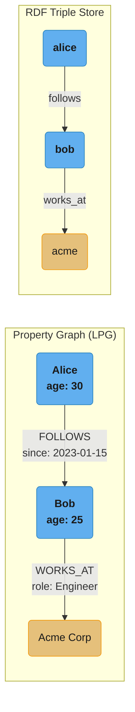
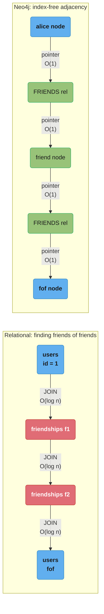
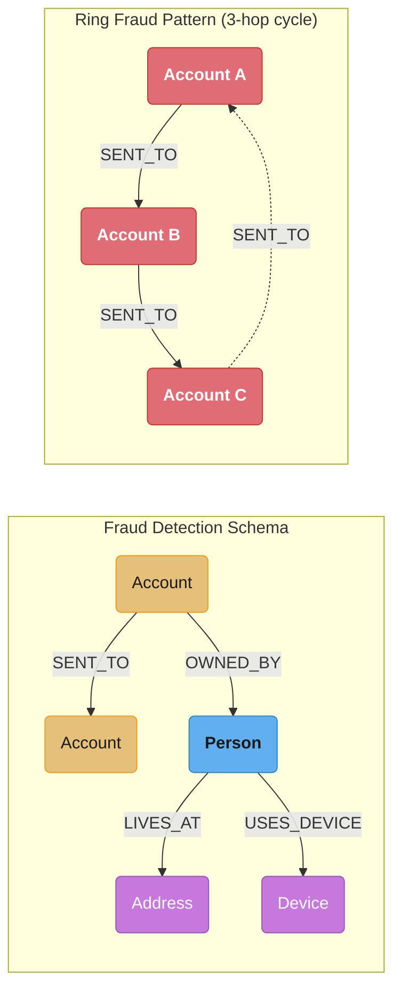
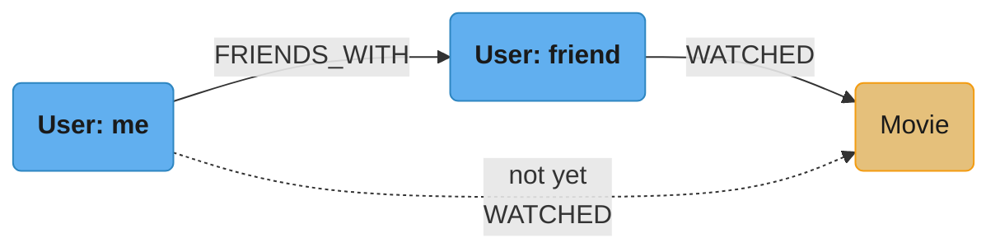
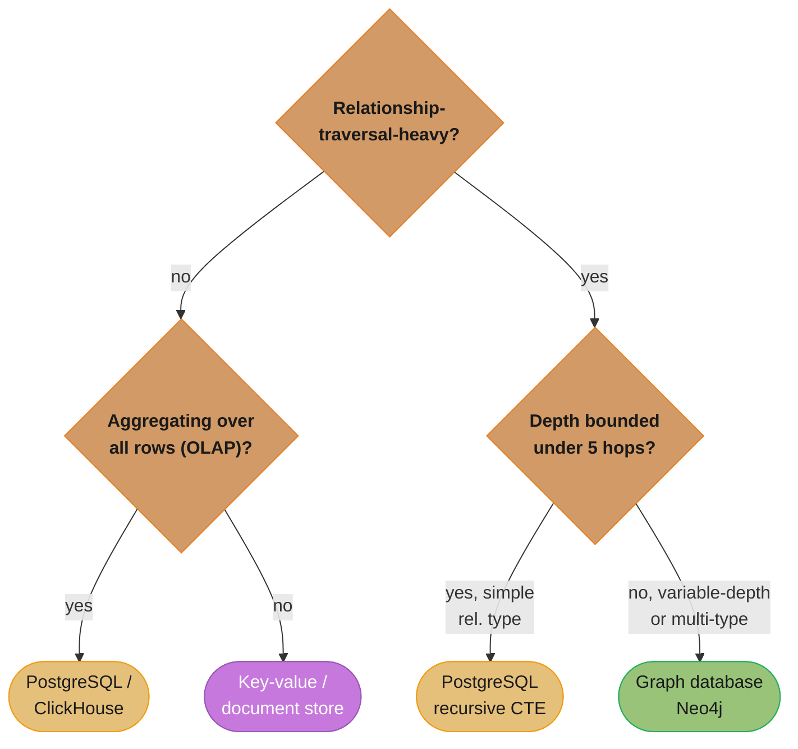
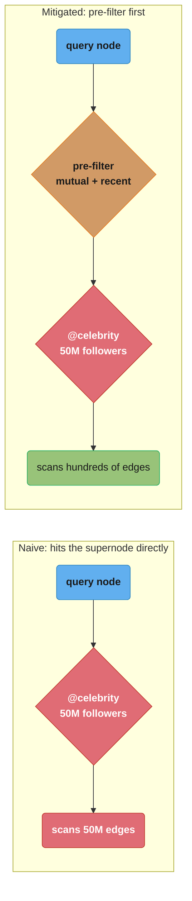

# Graph Databases

## 1. Concept Overview

Graph databases model data as nodes (entities), relationships (connections), and properties (key-value pairs on nodes and relationships). They excel at traversing highly connected data where relationships are first-class citizens rather than foreign-key JOIN operations. Neo4j is the dominant native graph database; Amazon Neptune, TigerGraph, and JanusGraph are notable alternatives.

---

## 2. Intuition

Relational databases store relationships as foreign keys — finding connected data requires JOIN operations that scan index trees. Graph databases use index-free adjacency: each node directly stores pointers to its adjacent relationships. Traversing from node to node follows pointers at O(1) per hop, making multi-hop traversals dramatically faster than recursive JOINs.

- **Key insight**: Graph databases win when the query is relationship-traversal-heavy (fraud ring detection, recommendation paths, access control graphs). They lose for high write throughput, simple queries, and OLAP aggregations.

---

## 3. Core Principles

### Property Graph Model

Nodes carry labels (type tags) and properties; relationships are directed, typed, and can carry their own properties. RDF triple stores instead reduce everything to bare subject-predicate-object atoms, so properties have to be reified as extra triples.



Both models describe the same Alice-Bob-Acme chain; the property graph attaches `since` and `role` directly to typed edges, while RDF triples stay bare atoms — properties require additional reified triples, and RDF is the model of choice for semantic web, knowledge graphs, and linked data.

### Index-Free Adjacency



**Concrete numbers**: Neo4j relationship traversal is ~O(1) per hop (following a stored pointer); a PostgreSQL recursive CTE is O(log n) per hop for an indexed FK lookup. At 6 degrees of separation, Neo4j resolves millions of hops in seconds while the relational equivalent is O(n^6) — impractical for 1M+ nodes.

**In plain terms.** The contrast is between two different variables. A join costs `O(log n)` where
`n` is **how big the table is**; a pointer hop costs `O(1)` and the traversal costs
`O(d1 x d2 x ... x dk)` where each `d` is **how many neighbours that node actually has**. Graph
traversal is priced by the neighbourhood; joins are priced by the whole dataset. That is the entire
argument for index-free adjacency, and the reason a graph DB's advantage grows with depth.

| Symbol | What it is |
|--------|------------|
| `n` | Total rows/nodes in the store. Drives B+tree height, so it drives join cost |
| `d` | Degree — the number of relationships attached to one node |
| `k` | Hop count (traversal depth) |
| `log2(n)` | Comparisons in one B+tree descent — the per-hop cost of the relational plan |
| `b` | Average branching factor. Frontier size at depth `k` is roughly `b^k` |

**Walk one example.** Friends-of-friends-of-friends (3 hops) on a 10M-node social graph, average
degree 50:

```
  relational (indexed FK join per hop)
    one index descent    log2(10,000,000) = 23.25 comparisons
    3 hops               3 x 23.25 = 69.8 comparisons PER PATH...
    ...and paths explode: hop1 50, hop2 2,500, hop3 125,000 rows
    total index work     125,000 x 23.25 = 2,906,250 comparisons

  Neo4j (pointer dereference per hop)
    per hop              O(1) -- read the next relationship record, no search
    total work           50 + 2,500 + 125,000 = 127,550 pointer hops
    ratio                2,906,250 / 127,550 = 22.8x less work

  now grow the graph 100x, to 1,000,000,000 nodes, same degree 50:
    relational           log2(1e9) = 29.90 -> 125,000 x 29.90 = 3,737,500 comparisons
    Neo4j                127,550 hops -- UNCHANGED
```

That last pair is the point. Multiply the graph by 100 and the traversal cost does not move at all,
because no step of it ever consulted the graph's size. The relational plan gets 29% more expensive
just from the taller B+tree — before counting the row-fetch I/O.

**But notice what did not shrink.** `b^k` is the same 125,000 in both columns. Index-free adjacency
removes the `log n` factor; it does **not** remove the exponential frontier growth. That is why
Section 10's supernode problem and the `[:KNOWS*1..6]` depth caps in Best Practices exist — an
unbounded traversal on a well-connected graph is expensive in *any* engine.

### Neo4j Record Files

```
Neo4j storage (physical layout):
  neostore.nodestore.db:    Fixed 15-byte records per node
  neostore.relationshipstore.db:  Fixed 34-byte records per relationship
  neostore.propertystore.db:  Variable-length property records

Node record (15 bytes):
  1 byte: in-use flag
  4 bytes: first relationship ID
  4 bytes: first property ID
  4 bytes: label store ID
  2 bytes: extra

Relationship record (34 bytes):
  1 byte: in-use flag
  4 bytes: first node ID (source)
  4 bytes: second node ID (target)
  4 bytes: relationship type ID
  4 bytes: first relationship of first node (doubly-linked list)
  4 bytes: second relationship of first node
  4 bytes: first relationship of second node
  4 bytes: second relationship of second node
  4 bytes: next property ID
  1 byte: flags (first in chain)

Why fixed-size records matter:
  Random access by record ID: record offset = ID × record_size
  Traversal: follow relationship → find node at ID × 15 bytes offset
  This is the "index-free adjacency" — no B+tree lookup needed
```

**What this actually says.** `record offset = ID x record_size` says: "the record ID *is* the
address." Because every record is the same width, the store never needs a lookup table mapping ID to
file position — it multiplies. This is the mechanical reason index-free adjacency is `O(1)` rather
than merely "fast": there is no data structure to search, just arithmetic and a page read.

| Symbol | What it is |
|--------|------------|
| `ID` | The node or relationship ID — an ordinal, not an opaque key |
| `record_size` | Fixed width: 15 bytes per node record, 34 bytes per relationship record |
| offset | Byte position of that record in the store file. Computed, never searched |
| Chain pointers | The 4 relationship-ID fields that make a node's edges a doubly-linked list |

**Walk one example.** Verify both record widths, then locate one by ID:

```
  node record        1 + 4 + 4 + 4 + 2                       = 15 bytes   (checks out)
                     flag, first-rel, first-prop, labels, extra

  relationship rec   1 + 4 + 4 + 4 + 4 + 4 + 4 + 4 + 4 + 1   = 34 bytes   (checks out)
                     flag, src, tgt, type, 4 chain pointers, next-prop, flags

  find node 1,000,000
    offset           1,000,000 x 15  =  15,000,000 bytes into nodestore.db
    cost             one multiply + one page read.  No B+tree, no index, no scan.

  find relationship 1,000,000
    offset           1,000,000 x 34  =  34,000,000 bytes into relationshipstore.db

  storing 1,000,000,000 relationships
    file size        1e9 x 34 bytes  =  34 GB, exactly and predictably
```

**What the fixed width costs you.** Properties cannot live in these records — a 15-byte node has no
room for a name or an age, which is why they are pushed into a separate variable-length
`propertystore.db` behind a pointer. So a traversal that only follows structure is pure pointer
arithmetic, but a traversal that *filters on properties* pays an extra random read per node touched.
This is precisely why Section 10's advice is to pre-filter before hitting a high-degree node, and why
the `WHERE` clause placement in a Cypher query changes its cost so dramatically.

---

## 4. Types / Architectures / Strategies

### Cypher Query Language

```cypher
-- Create nodes and relationships:
CREATE (alice:User {name: "Alice", age: 30})
CREATE (bob:User {name: "Bob", age: 25})
CREATE (alice)-[:FOLLOWS {since: date("2024-01-15")}]->(bob)

-- Find: users Alice follows who work at tech companies:
MATCH (alice:User {name: "Alice"})-[:FOLLOWS]->(u:User)-[:WORKS_AT]->(c:Company)
WHERE c.industry = "Technology"
RETURN u.name, c.name

-- Shortest path (BFS):
MATCH path = shortestPath((alice:User {name: "Alice"})-[:KNOWS*]-(target:User {name: "Charlie"}))
RETURN path, length(path) AS degrees

-- Variable-length traversal (1 to 5 hops):
MATCH (alice:User {name: "Alice"})-[:FOLLOWS*1..5]->(u:User)
RETURN u.name, count(*) AS reach

-- Pattern for fraud detection (ring transaction):
MATCH (a:Account)-[:SENT_TO]->(b:Account)-[:SENT_TO]->(c:Account)-[:SENT_TO]->(a)
WHERE a <> c
RETURN a.id, b.id, c.id

-- MERGE (upsert — create if not exists, match if exists):
MERGE (u:User {email: "alice@example.com"})
ON CREATE SET u.created_at = datetime(), u.name = "Alice"
ON MATCH SET u.last_seen = datetime()
```

### Graph Algorithms (GDS — Graph Data Science Library)

```cypher
-- PageRank (node importance/centrality):
CALL gds.pageRank.stream('social-graph', {
  maxIterations: 20,
  dampingFactor: 0.85
}) YIELD nodeId, score
RETURN gds.util.asNode(nodeId).name, score
ORDER BY score DESC LIMIT 10

-- Community detection (Louvain):
CALL gds.louvain.stream('social-graph') YIELD nodeId, communityId
RETURN communityId, count(*) AS members ORDER BY members DESC

-- Shortest path (Dijkstra weighted):
CALL gds.shortestPath.dijkstra.stream('road-network', {
  sourceNode: sourceId,
  targetNode: targetId,
  relationshipWeightProperty: 'distance'
}) YIELD totalCost, nodeIds
```

---

## 5. Architecture Diagrams

**Fraud detection schema and ring pattern** — an `Account` links to other accounts via `SENT_TO`, and to its owning `Person`, whose `Address` and `Device` round out the identity graph. A ring of three `SENT_TO` edges closing back on the origin account is the classic fraud signature.



```cypher
MATCH (a:Account)-[:SENT_TO]->(b:Account)-[:SENT_TO]->(c:Account)-[:SENT_TO]->(a)
WHERE a.id <> c.id AND a.id <> b.id
RETURN a.id, b.id, c.id, "ring_fraud" AS pattern
```

**Social recommendation graph** — movies a friend watched that "me" has not yet watched are surfaced by traversing `FRIENDS_WITH` then `WATCHED`, filtering out any movie already reachable directly from `me`.



```cypher
MATCH (me:User {id: 42})-[:FRIENDS_WITH]-(friend:User)-[:WATCHED]->(movie:Movie)
WHERE NOT (me)-[:WATCHED]->(movie)
RETURN movie.title, count(friend) AS friends_who_watched, avg(friend.rating) AS avg_rating
ORDER BY friends_who_watched DESC
LIMIT 10
```

---

## 6. How It Works — Detailed Mechanics

### TinkerPop / Gremlin (Vendor-Neutral Traversal)

```groovy
// Gremlin traversal (works with Neo4j, JanusGraph, Amazon Neptune):
// Find products purchased by customers who also bought product 42:
g.V().has('Product', 'id', 42)        // Start at product 42
  .in('PURCHASED')                    // Traverse to customers who bought it
  .out('PURCHASED')                  // Traverse to what they also bought
  .where(neq(V().has('Product', 'id', 42).next()))  // Exclude product 42
  .groupCount()                       // Count by product
  .order(local).by(values, desc)     // Sort by frequency
  .limit(local, 10)                   // Top 10
```

### Access Control Graph

```cypher
-- RBAC/ABAC via graph:
(:User {id, name})
  -[:MEMBER_OF]→ (:Group {name})
  -[:HAS_ROLE]→ (:Role {name})
  -[:GRANTS]→ (:Permission {action, resource})

-- "Can Alice delete documents in project X?":
MATCH (alice:User {name: "Alice"})-[:MEMBER_OF*1..3]->(:Group)-[:HAS_ROLE]->(:Role)-[:GRANTS]->(p:Permission)
WHERE p.action = "delete" AND p.resource = "document"
  AND (p)-[:SCOPED_TO]->(:Project {id: "X"})
RETURN count(p) > 0 AS allowed

-- This handles nested group membership automatically (GROUP-IN-GROUP)
-- Relational equivalent: 3-5 recursive CTEs + JOINs — much more complex
```

---

## 7. Real-World Examples

- **PayPal**: Uses graph databases for fraud detection — detecting rings of compromised accounts performing circular transactions.
- **LinkedIn**: Social graph for "people you may know" — 2nd-degree connections, common connections.
- **NASA**: Knowledge graph for equipment maintenance, tracking dependencies between systems.
- **Airbnb**: Knowledge graph for recommendations — host-guest interaction patterns, location graphs.
- **eBay**: Shopping graph for product recommendations based on browsing patterns.
- **Twitter**: Social graph for following/followers — initially used relational, moved to graph for relationship traversal.

---

## 8. Tradeoffs

| Feature | Graph DB (Neo4j) | PostgreSQL (recursive CTE) | MongoDB |
|---------|-----------------|--------------------------|---------|
| Multi-hop traversal | O(degree) per hop | O(n log n) per hop | Not designed for |
| Query language | Cypher (intuitive for graphs) | SQL (complex for graphs) | MQL (poor for graphs) |
| ACID | Yes (full) | Yes | Yes (4.0+) |
| Write throughput | Medium | High | High |
| Horizontal scale | Limited | Manual sharding | Built-in |
| Analytics/OLAP | Poor | Good | Good |
| Use case fit | Highly connected data | General relational | Documents |

---

## 9. When to Use / When NOT to Use

**Use graph database when**:
- Data is highly connected and relationships are queried heavily
- Variable-depth traversal (1 to N hops)
- Relationship properties matter (weight, timestamp)
- Fraud detection patterns, social recommendations, access control
- Knowledge graphs, taxonomy traversal

**Do not use when**:
- High write throughput > 50K writes/second (graph DBs are not optimized for this)
- Simple key-value or document lookups (no traversal benefit)
- OLAP aggregations over all data (use ClickHouse or PostgreSQL)
- Hierarchical data with bounded depth (PostgreSQL recursive CTE is sufficient)
- Team is not comfortable with graph data modeling

**PostgreSQL recursive CTE is sufficient when**:
- Depth is bounded (< 5 levels)
- Relationship structure is simple (one relationship type, few properties)
- The rest of the data is relational and adding another database is not worth the operational overhead

The three criteria above resolve into a single decision cascade — ask them in this order:



Relationship-traversal-heavy and shallow-and-simple both point away from a graph database; only variable-depth or multi-relationship-type traversal earns the extra operational cost of running Neo4j alongside the primary store.

---

## 10. Common Pitfalls

**Pitfall 1: Modeling everything as a property instead of a relationship**
```cypher
-- Broken: friend IDs as a list property
(:User {id: 1, friends: [2, 3, 4, ...]})
-- Cannot traverse, index only on id (not list contents), no relationship properties

-- Fix: explicit relationships
(:User {id: 1})-[:FRIENDS_WITH {since: date("2024")}]→(:User {id: 2})
-- Now: traversal is native, relationship has properties, indexable
```

**Pitfall 2: Supernode problem (high-degree nodes)**
A "celebrity" user with 50 million followers. Every traversal starting from or passing through this user (e.g., "who follows people who follow @celebrity?") must navigate 50M relationships. Solution: (1) Filter by additional criteria before traversing the high-degree node. (2) Cache popular traversal results. (3) Use sampling for recommendations (don't traverse all 50M edges). (4) Store popularity separately as a property and filter before graph traversal.



A traversal that reaches the 50M-follower supernode unfiltered scans all 50M relationships; pushing a predicate (mutual connections, recency) before the hop — strategy (1) above — shrinks that same hop to hundreds of edges.

**Put simply.** The supernode problem is `b^k` with one enormous `b`: "traversal cost is the product
of the degrees along the path, so a single 50-million-degree node multiplies the cost of every path
that touches it." A predicate applied *before* the hop changes `b` itself, and because `b` is a
factor rather than a term, shrinking it shrinks everything downstream of it too.

| Symbol | What it is |
|--------|------------|
| `b` | Branching factor at a hop — the degree of the node you are expanding |
| `k` | Traversal depth |
| `b^k` | Frontier size at depth `k`; total work is the sum over all depths |
| Pre-filter | A predicate evaluated before expanding, replacing `b` with a much smaller `b'` |
| ~100ns | Rough cost of one pointer dereference against a warm page cache |

**Walk one example.** "Who follows people who follow @celebrity?" — a 2-hop query, with and without
the pre-filter. Assume the celebrity has 50M followers, each following ~200 accounts:

```
  naive: expand the supernode first
    hop 1   b1 = 50,000,000                    edges scanned  50,000,000
    hop 2   b2 = 200                           edges scanned  50e6 x 200
                                                            = 10,000,000,000
    time    1e10 hops x 100 ns                = 1,000 s     = 16.7 minutes

  mitigated: pre-filter to mutual + active-in-last-30-days first
    hop 1   b1' = 500 (after the predicate)    edges scanned  500
    hop 2   b2  = 200                          edges scanned  500 x 200 = 100,000
    time    100,500 hops x 100 ns             = 0.01 s      = 10 ms

  reduction on hop 1        50,000,000 / 500       = 100,000x
  reduction on total work   10,000,100,000 / 100,500 = 99,504x
```

Note that the pre-filter's 100,000x cut at hop 1 propagates almost intact to the total, because hop 2
multiplies whatever hop 1 handed it. This is why the fix must be applied *upstream* of the supernode:
a `WHERE` clause after the expansion still pays the full 10 billion dereferences and only discards
the results afterwards. Same Cypher predicate, two very different query plans — which is exactly what
`PROFILE` is for.

**Pitfall 3: Treating Neo4j as a general database**
A team replaced their entire PostgreSQL with Neo4j. Simple queries like "count all users by country" required full graph scans (no columnar optimization). Customer reports taking 30 minutes. Graph databases are not good at aggregation over all nodes. Fix: use PostgreSQL for tabular analytics, Neo4j only for relationship-heavy queries.

**Pitfall 4: Missing indexes on node properties**
Neo4j without indexes on node properties is equivalent to a full graph scan for every lookup. `MATCH (u:User {email: "alice@example.com"})` — without an index on `User.email`: scans ALL user nodes. Fix: `CREATE INDEX FOR (u:User) ON (u.email)`.

---

## 11. Technologies & Tools

| Tool | Purpose |
|------|---------|
| Neo4j Browser | Graph visualization, Cypher query interface |
| Neo4j GDS | Graph Data Science library (PageRank, community detection) |
| `EXPLAIN` / `PROFILE` | Query plan analysis in Neo4j |
| Amazon Neptune | Managed graph database (Gremlin + SPARQL) |
| TigerGraph | Distributed graph for very large graphs |
| JanusGraph | Open-source distributed graph (Cassandra/HBase backend) |
| Memgraph | In-memory graph database |
| ArangoDB | Multi-model (graph + document + KV) |
| Apache AGE | PostgreSQL extension for graph queries |
| APOC | Neo4j procedures library (utility functions) |

---

## 12. Interview Questions with Answers

**Q: How does index-free adjacency in Neo4j differ from a foreign key join in PostgreSQL?**
In PostgreSQL, finding connected data requires a foreign key join — an index lookup (B+tree traversal) to find matching rows. For a query with 4 hops: 4 index traversals, each O(log n) where n is the number of rows. Total: O(4 × log n) minimum, but often O(n^k) for k-hop queries on large datasets. In Neo4j, each node record stores a direct pointer to its first relationship record. Each relationship record stores pointers to the source and destination nodes plus the next relationship of each node (doubly-linked list of relationships). Traversal: follow pointer from node → relationship → next node — all pointer dereferences at fixed offsets in fixed-size record files. Time per hop: O(1). For 4 hops: O(degree1 × degree2 × degree3 × degree4) — proportional to the number of actual connections, not the total graph size.

**Q: Design a fraud detection graph schema for detecting ring transactions.**
Schema:
- Nodes: `(:Account {id, balance, created_at, risk_score})`, `(:Person {id, name, ssn})`, `(:Device {fingerprint, ip})`
- Relationships: `(:Account)-[:SENT_TO {amount, timestamp, tx_id}]→(:Account)`, `(:Person)-[:OWNS]→(:Account)`, `(:Person)-[:USES]→(:Device)`

Ring pattern (3-hop loop):
```cypher
MATCH (a:Account)-[:SENT_TO]->(b:Account)-[:SENT_TO]->(c:Account)-[:SENT_TO]->(a)
WHERE a.id <> b.id AND b.id <> c.id
  AND all(r IN relationships() WHERE r.timestamp > datetime() - duration('P7D'))
RETURN a.id, b.id, c.id AS ring
```

Advanced: shared device/address detection (money mule network):
```cypher
MATCH (p1:Person)-[:USES]->(d:Device)<-[:USES]-(p2:Person)
WHERE p1 <> p2
MATCH (p1)-[:OWNS]->(a1:Account), (p2)-[:OWNS]->(a2:Account)
RETURN p1.id, p2.id, d.fingerprint AS shared_device, a1.id, a2.id
```

**Q: When would you choose a graph database over PostgreSQL with recursive CTEs?**
Choose graph database when: (1) Variable-depth traversal with no fixed maximum depth ("who can reach X within any number of hops"). (2) Complex pattern matching across multiple relationship types (fraud rings, supply chain). (3) Relationship properties matter and are frequently queried (when did they connect, how strong is the connection). (4) Graph algorithms (PageRank, community detection, shortest path) are core to the application. Choose PostgreSQL recursive CTEs when: (1) Maximum depth is bounded and small (< 5 levels). (2) The rest of the data is relational and the overhead of running a separate database outweighs the graph traversal benefit. (3) Simple parent-child hierarchy (org chart, file system) — ltree extension may suffice. (4) Team is more comfortable with SQL than Cypher/Gremlin.

**Q: What is the Cypher MERGE statement and when do you use it?**
MERGE is a combination of MATCH and CREATE: it matches the pattern if it exists and creates it if not. Essential for idempotent graph updates — prevents duplicate node or relationship creation. `MERGE (u:User {email: "alice@example.com"}) ON CREATE SET u.created_at = datetime() ON MATCH SET u.last_login = datetime()` — creates the user if the email doesn't exist, updates last_login if it does. Common mistake: `MERGE` on a large pattern without indexes — it performs a full scan to find the pattern before deciding to create it. Always ensure all properties used in MERGE conditions are indexed. Use `MERGE` for nodes when you have a natural unique identifier; use CREATE for relationships when you want to allow multiple relationships of the same type between two nodes.

**Q: How does Neo4j GDS (Graph Data Science) library enable graph analytics?**
GDS provides in-memory graph projections and algorithm implementations: (1) Project the graph: `CALL gds.graph.project('my-graph', 'User', 'FOLLOWS')` — loads nodes and relationships into an optimized in-memory format. (2) Run algorithms: PageRank (node importance), Louvain community detection (cluster discovery), Dijkstra shortest path (weighted path), betweenness centrality (bridge nodes). (3) Write results back: stream results to application or write as node properties. GDS uses parallel execution (multi-threaded traversals) for large graphs. Use cases: recommendation systems (community detection → recommend within community), content ranking (PageRank for important documents), fraud detection (betweenness centrality to find money mule nodes in transaction networks).

**Q: What is the supernode problem and how do you mitigate it?**
A supernode is a node with extremely high degree (many relationships) — examples: a celebrity user with 50M followers, a highly-connected product in a recommendation graph, an IP address seen in millions of transactions. Problem: any traversal that reaches a supernode must consider all N edges, even if only a few lead to the answer. For a 3-hop traversal that hits a supernode with 50M relationships at hop 2: 50M edges must be examined. Mitigation strategies: (1) Filter before reaching the supernode (use additional predicates to narrow the traversal earlier). (2) Cap the degree of traversal: use relationship properties to select only recent or high-weight connections. (3) Cache: precompute traversals from/to supernodes as static properties. (4) Avoid using supernodes as traversal waypoints — start traversals from the query-specific node, not from the supernode. (5) Consider not modeling extremely high-degree relationships in the graph at all — use alternative structures.

**Q: What graph databases work at billion-node scale?**
Neo4j: handles billions of nodes on a single server with high RAM (2-4TB RAM servers handle 10B+ nodes). Not horizontally scalable in the traditional sense — Fabric provides federation across multiple Neo4j instances. TigerGraph: natively distributed, handles 100B+ nodes and 1T+ edges across a cluster. Uses parallel graph computation (GSQL parallel traversals). Used by financial institutions for global fraud detection. JanusGraph: distributed graph using Cassandra or HBase as backend storage — horizontally scalable but with higher latency per hop than native graphs. Amazon Neptune: managed, scales to billions of nodes, but latency is higher than on-premise native graphs due to network round trips. At extreme scale (>100B nodes): consider specialized graph processing frameworks like Apache Spark GraphX or Pregel for batch analytics.

**Q: How does Neo4j handle transactions and ACID compliance?**
Neo4j provides full ACID compliance at the graph level. Write transactions: all changes to nodes and relationships within a transaction are atomic (either all committed or all rolled back). WAL (write-ahead log): changes written to WAL before data files, ensuring crash recovery. MVCC: readers do not block writers; each transaction gets a consistent snapshot. Constraint enforcement: unique constraints (on node properties), existence constraints. Transaction timeouts: configurable to prevent long-running transactions from holding locks. Cluster: in a causal cluster, write transactions are applied to the leader (primary), replicated via Raft consensus to followers. Read transactions can be served by followers (potentially slightly stale). `USING PERIODIC COMMIT` (or `CALL { ... } IN TRANSACTIONS OF N ROWS`): batch large write operations to avoid memory exhaustion on large imports.

**Q: What are the index types in Neo4j and how do you choose?**
Neo4j index types: (1) Range index (B+tree based): supports equality, range, prefix, and ordering. Use for: numeric properties (age, price), dates, string prefixes. Default index type. (2) Text index (Lucene-based): full-text search on string properties. Use for: free-text search within graph queries (`MATCH (u:User) WHERE u.bio CONTAINS "database expert"`). (3) Point index: for spatial properties (latitude, longitude). Use for geospatial queries (within distance, bounding box). (4) Composite index: multiple properties in one index for compound queries. (5) Full-text index: Lucene-based search across multiple node labels and properties. Create: `CREATE INDEX idx_user_email FOR (u:User) ON (u.email)`. Always create indexes on properties used in MERGE conditions, MATCH patterns, and WHERE clauses on high-cardinality properties.

**Q: How do you model a hierarchical permission system in a graph database?**
RBAC (Role-Based Access Control) graph schema:
```
(:User)-[:MEMBER_OF]→(:Group)-[:SUBGROUP_OF*]→(:Group) // Nested groups
(:Group)-[:HAS_ROLE]→(:Role)-[:GRANTS]→(:Permission {action, resource})
(:Role)-[:SCOPED_TO]→(:Tenant|Project|Document)
```
Advantages over relational RBAC: inherited permissions through group hierarchies work naturally via variable-depth traversal. Complex permission queries like "what can Alice do?" or "who can delete document 42?" are single Cypher queries — no multi-level SQL JOINs. ABAC (Attribute-Based): add property predicates to the `GRANTS` relationship or permission node (`IF request.time > 9AM AND request.department = "Finance"`). Policy evaluation becomes a graph traversal with property filtering.

**Q: What is the difference between a labeled property graph and an RDF triple store?**
Labeled property graph (LPG — used by Neo4j, Amazon Neptune property graph): nodes and relationships are first-class objects with labels (type tags) and properties (key-value pairs attached directly). Relationships have a direction, type, and properties. Query: Cypher or Gremlin. RDF triple store (used by Amazon Neptune RDF, AllegroGraph): data modeled as subject-predicate-object triples. Attributes are additional triples: `(alice, age, 30)` instead of a property. No native relationship properties — must reify relationships as nodes. Query: SPARQL. RDF follows W3C standards for semantic web and linked data. LPG: more intuitive for application development, better performance for typical graph queries. RDF: better for knowledge graph integration, linked data, ontology reasoning. Many enterprise knowledge graphs use RDF (Google Knowledge Graph, DBpedia).

**Q: What is Gremlin/TinkerPop and how does it differ from Cypher for portability across graph databases?**
Gremlin is a vendor-neutral graph traversal language from the Apache TinkerPop project, portable across Neo4j, JanusGraph, and Amazon Neptune unchanged. Cypher, by contrast, is Neo4j's own declarative query language, adopted by a handful of other vendors through the openCypher initiative but not natively supported everywhere Gremlin is. Gremlin traversals are written imperatively as a chain of steps — `g.V().has(...).out(...).groupCount()` — describing exactly how to walk the graph, while Cypher is declarative pattern matching where you describe the shape you want and let the query planner decide how to traverse it. The practical tradeoff is portability versus readability: Gremlin is the right choice when a system might migrate between graph engines or must support several simultaneously, while Cypher's declarative style is generally easier to read and lets Neo4j's planner optimize automatically. Amazon Neptune supports Gremlin and SPARQL but not Cypher, which matters when choosing between AWS-managed graph options and self-hosted Neo4j.

**Q: Why do graph databases have limited write throughput compared to relational or document databases?**
Index-free adjacency, the mechanism that makes traversals fast, requires every write to update a chain of doubly-linked relationship pointers. Adding a single relationship in Neo4j means updating the "first relationship" pointer on both endpoint nodes and splicing the new relationship record into each node's existing chain, which creates lock contention when many writes target the same node concurrently — the supernode problem applied to writes instead of reads. Relational databases and Cassandra, by comparison, can append new rows largely independently of each other, giving them the linear write scaling that graph databases structurally cannot match. This is why graph databases are not recommended above roughly 50K writes/second: beyond that, pointer-chain maintenance and lock contention on high-degree nodes become the bottleneck rather than raw I/O. Route write-heavy ingestion, such as raw event logs, into a database built for appends and only project the relationship-relevant subset into the graph database asynchronously.

**Q: How do you prevent unbounded variable-length traversal queries from causing a performance blowup?**
A Cypher pattern like `[:KNOWS*]` with no upper bound tells Neo4j to explore paths of any length, and on a dense graph this can expand combinatorially. A few hops from a well-connected node can touch a large fraction of the entire graph before the query even returns a result. Always cap variable-length traversals with an explicit maximum, such as `[:KNOWS*1..6]` instead of `[:KNOWS*]`, so the traversal engine has a hard stop regardless of how connected the graph turns out to be. Combine the depth cap with early filtering predicates, matching on node properties before expanding further, so the traversal prunes unproductive branches instead of exploring them fully first. For genuinely unbounded reachability questions, use a dedicated graph algorithm such as bounded breadth-first search or the GDS shortest-path procedures instead of a raw variable-length MATCH, since these are built to terminate efficiently rather than materialize every path; profile with `EXPLAIN`/`PROFILE` before shipping any variable-length traversal to catch a missing upper bound before it reaches production data volumes.

**Q: How does Neo4j's causal cluster provide read scaling while keeping reads causally consistent?**
A causal cluster elects one leader that accepts all writes and replicates them via Raft consensus to follower and read-replica nodes, which can serve read traffic without going through the leader. To prevent a client from writing on the leader and then immediately reading stale data from a lagging follower, Neo4j issues a bookmark after every write — an opaque token representing the transaction's position in the replication stream — that the client passes with its next read request. A follower receiving a read with a bookmark waits until it has caught up to that bookmark's position before executing the query, guaranteeing the client always sees at least its own prior writes even though the read was served by a different node than the write. This "causal chaining" gives read-scaling without full linearizability: reads across different clients that never exchange bookmarks can still observe different points in time, but a single client's session is always causally consistent with itself. Use bookmarks explicitly in any workflow where a user's read must reflect their own immediately preceding write, such as showing a freshly created record right after its creation request.

**Q: When would you use Apache AGE, a PostgreSQL graph extension, instead of a standalone graph database like Neo4j?**
Apache AGE adds a graph query layer (openCypher support) on top of a regular PostgreSQL table, letting graph and relational data live in the same database and be queried in the same transaction. This is the right choice when the graph portion of the workload is modest in scale and connectivity — org charts, small permission graphs, lightweight recommendation joins — and the operational cost of running a second database (Neo4j) outweighs the traversal performance it would provide. AGE inherits PostgreSQL's ACID guarantees, backup tooling, and connection pooling for free, which is a meaningful operational win over standing up a separate Neo4j cluster with its own HA, backup, and monitoring stack. The tradeoff is traversal performance: AGE does not have Neo4j's index-free adjacency, so multi-hop traversals on large or highly connected graphs are meaningfully slower than on a native graph engine. Reach for AGE when the team wants some graph query ergonomics without adding a new database to operate, and migrate to standalone Neo4j once traversal-heavy queries against a large graph become the dominant workload.

---

## 13. Best Practices

1. Create indexes on all node properties used in MATCH conditions, MERGE patterns, and WHERE clauses.
2. Always use MERGE for idempotent writes, never CREATE for nodes that should be unique.
3. Avoid supernodes (nodes with millions of relationships) — bound degree with timestamps/weights.
4. Keep relationship types specific and meaningful (PURCHASED is better than RELATED_TO).
5. Model relationships with direction that matches your query direction.
6. Use relationship properties for metadata (timestamps, weights, labels) rather than intermediate nodes.
7. Profile traversal queries with EXPLAIN and PROFILE to catch full graph scans.
8. Limit unbounded variable-length traversals with max depth ([:KNOWS*1..6] not [:KNOWS*]).
9. Use APOC library for utility operations (data import, path finding utilities).
10. For production: use causal cluster (leader + followers) for HA and read scale.

---

## 14. Case Study

**Scenario**: A fintech company needs to detect money laundering networks in real-time as transactions are processed. Traditional rule-based systems flag less than 2% of actual fraud. Need: detect ring transactions (A→B→C→A), layering patterns (>3 hops of rapid transfers), and shared infrastructure (two "unrelated" accounts using the same device/IP).

**Graph schema**:
```cypher
// Nodes:
CREATE (:Account {id: $id, balance: $balance, risk_score: 0, created_at: datetime()})
CREATE (:Person {id: $id, name: $name, kyc_level: $level})
CREATE (:Device {fingerprint: $fp, last_ip: $ip})
CREATE (:BankBranch {id: $id, location: $location})

// Relationships:
CREATE (p:Person)-[:OWNS {since: datetime()}]->(a:Account)
CREATE (a1:Account)-[:SENT_TO {amount: $amount, ts: datetime(), tx_id: $id}]->(a2:Account)
CREATE (p:Person)-[:USES {last_seen: datetime()}]->(d:Device)
```

**Real-time fraud queries** (run on each transaction):
```cypher
// Query 1: Ring detection (3-hop)
MATCH (new_account:Account {id: $new_account_id})
MATCH ring = (new_account)-[:SENT_TO*2..5]->(new_account)
WHERE ALL(r IN relationships(ring) WHERE r.ts > datetime() - duration('P1D'))
RETURN count(ring) > 0 AS is_ring, length(ring) AS ring_length

// Query 2: Shared infrastructure (money mule network)
MATCH (a:Account {id: $account_id})<-[:OWNS]-(p:Person)-[:USES]->(d:Device)<-[:USES]-(p2:Person)-[:OWNS]->(a2:Account)
WHERE a.id <> a2.id AND a2.created_at > datetime() - duration('P30D')
RETURN count(DISTINCT a2) AS suspicious_accounts_sharing_device

// Query 3: Rapid transfer chain (layering)
MATCH path = (a:Account {id: $account_id})-[:SENT_TO*3..10]->(:Account)
WHERE ALL(r IN relationships(path) WHERE r.ts > datetime() - duration('PT1H'))
RETURN length(path) AS chain_length, extract(r IN relationships(path) | r.amount) AS amounts
ORDER BY chain_length DESC LIMIT 5
```

**Performance**:
- Average query time (3-hop ring): 2ms (vs 500ms+ for equivalent PostgreSQL recursive CTE at 10M accounts)
- Real-time scoring: each incoming transaction scored in < 10ms
- Fraud detection rate improved from 2% (rule-based) to 23% (graph patterns)

**The idea behind it.** The `<10ms` real-time budget is really a statement about `b^k`: "a
variable-length pattern `[:SENT_TO*2..5]` visits `b^2 + b^3 + b^4 + b^5` paths, so the depth bound
and the branching factor together decide whether this query fits in the transaction path or belongs
in a batch job." The `*2..5` in the Cypher is not stylistic — it is the cost cap.

| Symbol | What it is |
|--------|------------|
| `b` | Out-degree: how many accounts a typical account has sent money to |
| `*2..5` | Depth bound in the Cypher pattern — the `k` range actually walked |
| `sum b^k` | Total paths explored across all depths in range |
| `r.ts > now - 1 day` | The predicate that keeps `b` small by discarding cold edges before expanding |

**Walk one example.** Query 1 (ring detection) under two different branching factors:

```
  ordinary account, b = 8 (recent SENT_TO edges only, after the 1-day filter)
    depth 2      8^2 =        64 paths
    depth 3      8^3 =       512
    depth 4      8^4 =     4,096
    depth 5      8^5 =    32,768
    total                37,440 paths  x 100 ns  =  3.74 ms   -> inside the 10 ms budget

  money-mule hub, b = 20 (no time filter, or a genuinely busy account)
    total       20^2 + 20^3 + 20^4 + 20^5 = 3,368,400 paths
                                     x 100 ns  =  336.84 ms   -> 34x over budget

  what one extra hop costs at b = 8
    extending *2..5 to *2..6:  + 8^6 = 262,144 paths, a 7x jump in total work
```

The two rows show why the 1-day `r.ts` predicate is load-bearing rather than a business rule: it is
what holds `b` near 8 instead of 20, and `b` sits under an exponent. The stated `2ms vs 500ms+`
PostgreSQL comparison is the same story from the other side — a recursive CTE pays `log2(10M) = 23`
comparisons per expansion on top of the identical path count, a 250x wall-clock gap.

**What the detection-rate numbers mean.** Going from 2% to 23% is an 11.5x improvement in *recall*,
not in accuracy. On 1M transactions at a 1% true fraud rate: rule-based catches `10,000 x 0.02 = 200`
fraudulent transactions and misses 9,800; the graph patterns catch `10,000 x 0.23 = 2,300` and still
miss 7,700. Graph traversal surfaces the structural patterns — rings, shared devices — that no
single-row rule can express; it does not make the problem solved.

**Result**: Graph traversal found patterns invisible to rule-based systems — particularly ring transactions that span 5+ hops and money mule networks identified by shared device fingerprints across "unrelated" accounts.
