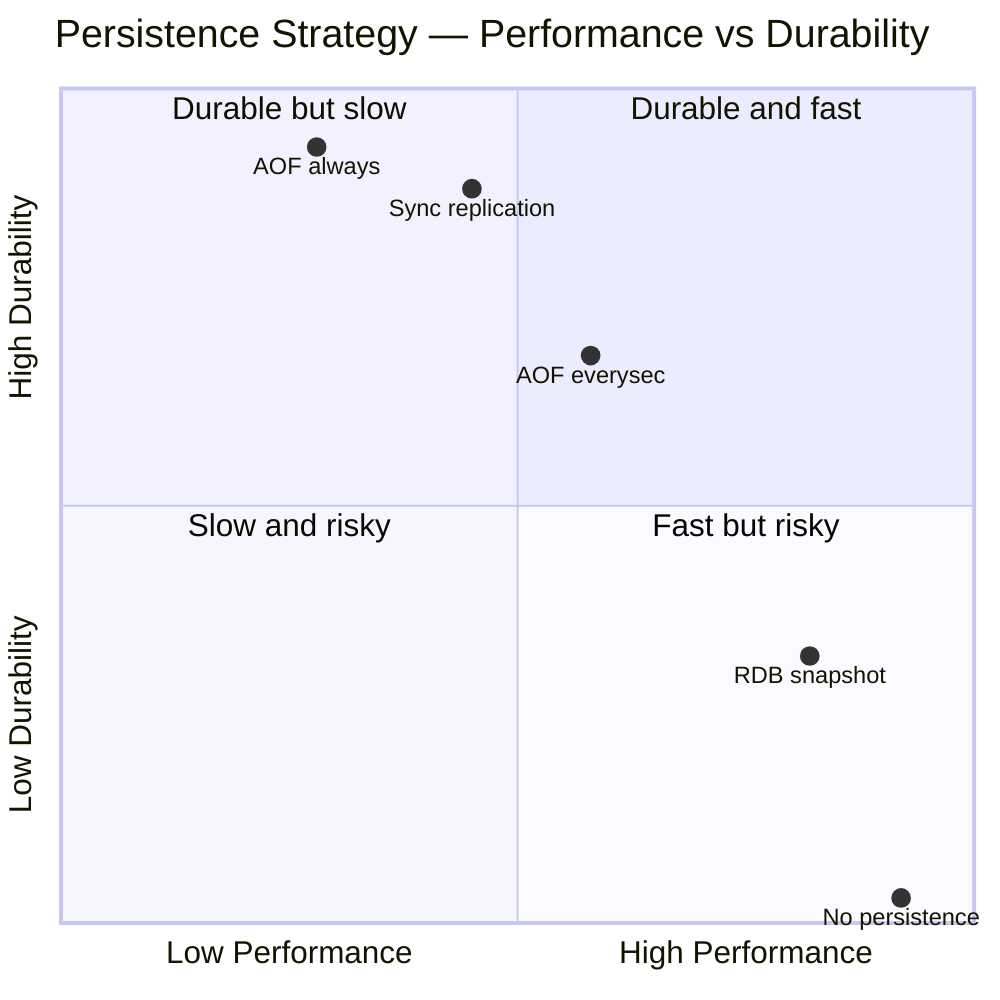
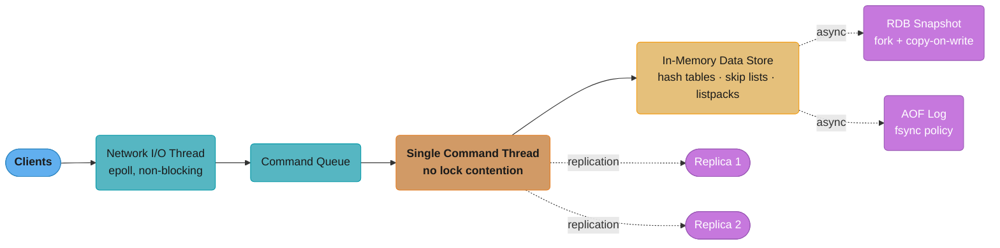
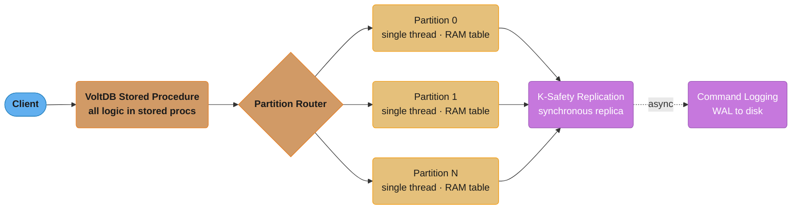
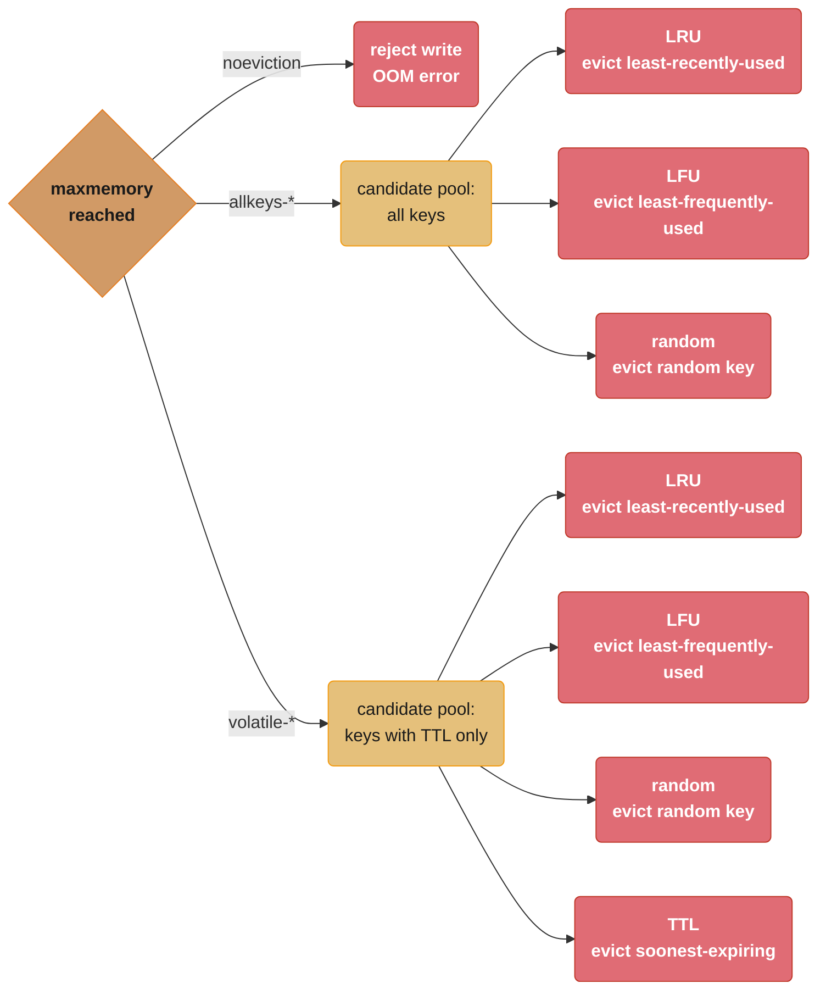

# In-Memory Databases

## 1. Concept Overview

In-memory databases (IMDBs) keep their primary data structure in RAM rather than on disk. Disk access is eliminated from the critical read/write path, reducing latency from milliseconds to microseconds. Persistence varies: pure in-memory (data lost on restart), snapshot-based, WAL-backed, or NVMe-backed with byte-addressable persistence. Use cases span caching layers, session stores, real-time leaderboards, rate limiters, counters, pub/sub, and ML feature stores.

Key distinction: "in-memory database" (primary store is RAM) vs "cache" (secondary store backed by a durable source of truth). Redis straddles both: it can operate as a pure cache (no persistence) or as a durable primary store (AOF + RDB).

---

## 2. Intuition

A disk-backed database is a library with books stored in a warehouse — every read requires a trip to the warehouse (disk seek + read). An in-memory database is the same library where every book is already on the desk in front of you. You still need a table of contents (index), but retrieval is measured in microseconds instead of milliseconds. The catch: if the building burns down (server crash), everything on the desk is gone unless you photocopied it (persistence).

---

## 3. Core Principles

**No disk I/O on critical path**: Data structures live in RAM. Reads bypass page cache, buffer pool, and disk I/O entirely. This eliminates the ~5ms disk seek and ~0.1ms SSD random read latency.

**Specialized data structures**: IMDBs optimize their in-memory data structures differently from disk-optimized B+trees. Redis uses skip lists for sorted sets, hash tables for hashes, and listpacks for small collections. VoltDB uses hash-partitioned in-memory tables.

**Durability spectrum**: Configurable tradeoff between durability and performance. RDB snapshots, AOF logs, synchronous replication, NVMe persistence, and hybrid approaches each provide different RPO/RTO characteristics.



Each point trades write-path latency for how much committed data can survive a crash: RDB risks losing the minutes since the last snapshot, AOF `everysec` risks one second, and AOF `always` or synchronous (K-safety) replication trade throughput for near-zero loss — see the RDB/AOF and K-safety discussion later in this module for the numbers behind each position.

**Concurrency without lock overhead**: Many IMDBs (Redis, VoltDB single-threaded core) serialize access to eliminate lock contention. Redis's single-threaded command processing avoids mutex overhead entirely for most operations.

---

## 4. Types / Architectures / Strategies

```
Category              | Systems                    | Use Case
----------------------|----------------------------|---------------------------
Key-Value Cache       | Redis, Memcached           | Session, cache, leaderboard
In-Memory RDBMS       | VoltDB, H-Store, SAP HANA  | OLTP with ACID at microsecond speed
Distributed Cache     | Apache Ignite, Hazelcast   | Distributed cache + compute grid
In-Memory Analytics   | Apache Arrow, DuckDB       | Vectorized analytical queries in RAM
Persistent Memory     | pmem-based stores          | NVMe DIMM, byte-addressable
```

---

## 5. Architecture Diagrams

**Redis Single-Instance Architecture** — network I/O is decoupled from command execution: the single command thread avoids all lock contention on data structures, while persistence and replication both branch off that same write path.



**Redis 6+ I/O threading**: network I/O became multi-threaded (reading and writing sockets), but command execution stays on the single thread shown above — no contention on data structures is introduced.

**VoltDB Architecture** — every transaction runs as a stored procedure routed to its owning partition; each partition is single-threaded, so committed state is protected by synchronous K-safety replication before the (async) command log is written.



---

## 6. How It Works — Detailed Mechanics

### Redis vs Memcached

```
Feature               | Redis                  | Memcached
----------------------|------------------------|------------------
Data structures       | String, List, Hash,    | String only
                      | Set, Sorted Set,       |
                      | HyperLogLog, Stream,   |
                      | Bitmap, Geo            |
Persistence           | RDB + AOF + hybrid     | None
Cluster mode          | Redis Cluster (native) | None (client sharding)
Replication           | Primary-replica        | None
Lua scripting         | Yes (EVAL, atomic)     | No
Pub/Sub               | Yes                    | No
Transactions          | MULTI/EXEC (optimistic)| No
Threading model       | Single cmd thread      | Multi-threaded
Memory efficiency     | Slightly higher overhead| Slightly lower overhead
Expiration            | Per-key TTL            | Per-key TTL
Max key size          | 512MB                  | 250 bytes (key)
Max value size        | 512MB                  | 1MB per item
```

Memcached remains relevant for simple string caching at very high throughput where multi-threading matters and no persistence or data structure richness is needed. Redis dominates for all other use cases.

### Eviction Policies

When Redis reaches its `maxmemory` limit, it evicts keys according to the configured policy:

```
Policy              | Behavior
--------------------|--------------------------------------------------
noeviction          | Return error on write when memory full (safe: no data loss, may block)
allkeys-lru         | Evict least-recently-used key from all keys
volatile-lru        | Evict LRU key from keys with TTL set only
allkeys-lfu         | Evict least-frequently-used key from all keys (LFU)
volatile-lfu        | Evict LFU key from keys with TTL set only
allkeys-random      | Evict random key from all keys
volatile-random     | Evict random key from keys with TTL only
volatile-ttl        | Evict key with shortest remaining TTL
```

The policy name encodes a two-stage decision: which keys are eligible (`allkeys-*` vs `volatile-*`), then which one to pick within that pool.



**LRU vs LFU**: LRU evicts the key not accessed for the longest time. LFU tracks access frequency; a key accessed once yesterday is evicted before a key accessed 100 times last week. Use LFU when access patterns are skewed (most data accessed rarely, hot data accessed frequently) — this is common for caches.

**noeviction production gotcha**: Redis with `noeviction` in a cache role will return `OOM command not allowed when used memory > 'maxmemory'` errors on writes, causing application errors rather than gracefully degrading. Always pair `noeviction` with monitoring and capacity planning, or use an LRU/LFU policy for caches.

### VoltDB Partitioned Execution Model

VoltDB eliminates traditional locking by assigning each table partition to a single execution thread. Since only one thread ever touches partition N's data, there are no shared-memory data races or mutex overhead. All application logic runs as stored procedures — VoltDB executes the entire procedure as a single atomic unit on the relevant partition(s).

**Single-partition transactions**: Execute entirely on one partition's thread. Zero coordination overhead. Latency ~100–300 microseconds.

**Multi-partition transactions**: Require a coordinator and 2PC across partitions. Latency ~1–5ms. Multi-partition transactions block all partitions involved. Design schemas to minimize them.

**Command logging**: VoltDB writes all stored procedure invocations (not data changes) to a command log. On restart, it replays procedures from the command log against an empty in-memory state. This is faster than WAL replay because procedures are higher-level operations. Typical restart recovery: 60 seconds for 100GB dataset.

### Apache Ignite: Distributed In-Memory Grid

Ignite is a distributed in-memory cache and compute grid. Data is partitioned across cluster nodes using consistent hashing. Ignite supports:

- **Replicated cache**: all nodes have all data (read-anywhere, write to all)
- **Partitioned cache**: data split across nodes with configurable backup count
- **Near cache**: local node copy of frequently accessed partitions
- **SQL queries**: distributed SQL over in-memory tables with ANSI SQL support
- **Compute grid**: run code co-located with data (MapReduce-style)

Ignite persists data to native persistence (RocksDB-backed) or relies on an external DB (RDBMS, Cassandra) as the system of record.

### Warming Strategies

Cold start is a major operational concern for in-memory systems. Options:

```
Strategy          | Mechanism                           | Tradeoff
------------------|-------------------------------------|---------------------------
Lazy warming      | Cache misses populate cache on read | Slow initial requests
Eager warming     | Pre-load data on startup            | Startup delay, memory spike
Pre-warming job   | Background job fills cache before   | Complex, must run before
                  | traffic is cut over                 | traffic shift
Replica warming   | Serve traffic from old instance     | Requires blue-green deploy
                  | while new one warms                 |
Snapshot restore  | Load RDB snapshot on Redis start    | Fast (memory-mapped read)
```

---

## 7. Real-World Examples

**Twitter**: Used Redis Sorted Sets for user timelines (score = tweet timestamp). Each user's timeline is a sorted set of tweet IDs. `ZREVRANGE` retrieves the last N tweets in O(log N + K) time. Timeline capacity was capped at 800 tweets per sorted set to bound memory.

**GitHub**: Uses Memcached for fragment caching of rendered HTML and Redis for queues, rate limiting, and distributed locking across their infrastructure.

**Stack Overflow**: Relies heavily on in-memory SQL Server (in-memory OLTP tables) for hot counters and vote tallying. The entire active question/answer dataset fits in 256GB RAM.

**Twitch**: Uses Redis for chat presence (which users are in which channel), real-time viewer counts, and pub/sub for chat message fanout.

---

## 8. Tradeoffs

```
Concern            | In-Memory DB               | Disk-Backed DB
-------------------|----------------------------|-----------------------------
Read latency       | ~1–100 microseconds        | ~1–10 milliseconds
Write latency      | ~1–100 microseconds        | ~1–10 milliseconds (fsync)
Durability         | Configurable (lossy–durable)| Default durable
Memory cost        | ~$5–20/GB RAM/month (cloud) | ~$0.02–0.10/GB SSD/month
Dataset size       | Limited to RAM (typically  | Virtually unlimited
                   | < 1TB per node)            | (multi-TB per node)
Cold start         | Warming required            | Hot from OS page cache
ACID transactions  | Limited (Redis MULTI/EXEC) | Full ACID
Complex queries    | Limited (Redis no JOIN)     | Full SQL
```

---

## 9. When to Use / When NOT to Use

**Use in-memory databases for**:
- Session state (user authentication tokens, shopping carts) — high read/write rate, temporary data
- Rate limiting — atomic `INCR` with TTL, sub-millisecond response
- Leaderboards and ranked data — Sorted Set `ZADD`/`ZRANK` at microsecond speed
- Real-time pub/sub — Redis Pub/Sub or Streams for event fanout
- Distributed locking — `SET NX PX` for distributed mutex
- ML feature stores — sub-millisecond feature retrieval for online serving
- Counter tables — high-frequency increments that would cause B+tree contention in RDBMS

**Do NOT use for**:
- Primary source of truth for financial or compliance data without durable persistence (AOF fsync=always minimum)
- Large datasets that exceed available RAM — query performance degrades severely when data spills to swap
- Complex relational queries with joins across multiple tables — no join optimizer
- Long-term analytics or reporting — no columnar storage, no partition pruning
- Cold datasets with infrequent access — paying RAM cost for rarely accessed data is wasteful

---

## 10. Common Pitfalls

**Redis OOM crash with noeviction**: A service sets Redis `maxmemory` to 8GB with `noeviction` and does not monitor memory. At 7.5GB, memory crosses the limit at 3 AM. Writes start failing with OOM errors. Application logs fill with exceptions. Fix: always set a non-noeviction policy for caches, monitor `used_memory` vs `maxmemory` with alerting at 80%.

**Fork pause on RDB snapshot**: Redis uses `fork()` to create an RDB snapshot. The fork call itself causes a pause proportional to the page table size (~1ms per GB of used memory on Linux). For a 20GB Redis instance, the fork pause can be 20ms — long enough to trigger downstream timeouts. Fix: use `jemalloc` (default), enable `transparent_hugepage=never`, or run snapshots on a replica, not the primary.

**Key expiration avalanche**: 10M keys set with the same TTL (e.g., 3600 seconds, loaded at startup). An hour later, all 10M keys expire simultaneously, causing a cache stampede. Fix: add random jitter to TTL (e.g., `3600 + rand(0, 300)`) when setting keys.

**Memcached multi-get amplification**: Application issues a `get_multi` for 1000 keys across 10 Memcached nodes. Each node receives a sub-request; the client waits for the slowest node. Under load, the slowest node determines p99 latency. Fix: limit batch size, use connection pooling, and monitor per-node latency independently.

**VoltDB multi-partition transaction hotspot**: A schema design requires updating a global counter in every transaction (e.g., total_orders). Every transaction becomes multi-partition because the counter is on partition 0. Throughput collapses. Fix: shard counters across partitions (e.g., counter per partition), sum at read time.

**Redis replica lag under heavy writes**: A Redis primary under 100K writes/second has replicas that lag 30–60 seconds. Reads from replicas return stale data. Applications using replicas for reads encounter cache inconsistency. Fix: monitor `master_repl_offset - slave_repl_offset` (replication lag bytes); route reads to primary for stale-sensitive data or accept the lag window explicitly.

---

## 11. Technologies & Tools

| System          | Language | License      | Key Feature                        |
|-----------------|----------|--------------|------------------------------------|
| Redis           | C        | RSALv2/SSPL  | Rich data structures, Cluster, AOF |
| Memcached       | C        | BSD          | Simple, multi-threaded, no persist |
| VoltDB          | Java/C++ | AGPL/Commercial | ACID stored procedures, partitioned |
| Apache Ignite   | Java     | Apache 2.0   | Distributed cache + compute grid   |
| Hazelcast       | Java     | Apache 2.0   | Distributed data grid, JCache API  |
| Aerospike       | C        | BSL          | Hybrid DRAM/NVMe, high throughput  |
| Dragonfly       | C++      | BSL          | Redis-compatible, multi-threaded   |
| KeyDB           | C++      | BSD          | Redis fork, multi-threaded         |

**Aerospike** is notable for its hybrid memory architecture: indexes in DRAM, values on NVMe SSD. Reads still avoid OS page cache (direct device access), achieving ~0.5ms latency with dataset sizes exceeding available RAM.

---

## 12. Interview Questions with Answers

**Q: When is an in-memory database preferable to a disk-backed one?**
Choose in-memory when sub-millisecond latency is required and the working dataset fits in RAM. Specific cases: session state where every request requires a lookup and the data is ephemeral; rate limiters where latency matters more than durability; leaderboards using sorted sets with microsecond rank lookups; distributed locks where lock acquisition must complete before a network timeout. Do not use in-memory as the primary store for financial records or any data where loss on restart is unacceptable unless you configure durable persistence (AOF fsync=always).

**Q: How does VoltDB guarantee ACID without disk writes on the critical path?**
VoltDB uses partitioned execution with a single thread per partition, eliminating locking overhead. Each stored procedure executes as an atomic unit on its target partition(s). Durability comes from synchronous K-safety replication: before returning success to the client, VoltDB ensures the transaction is committed on K+1 nodes. A node failure does not lose committed data because at least one replica has the committed state. Command logging writes to disk asynchronously after the replication acknowledgment, so the disk I/O is off the critical path.

**Q: What happens when a Redis node runs out of memory with the noeviction policy?**
Redis returns an error for write commands (`OOM command not allowed when used memory > 'maxmemory'`). Read commands still succeed. The application receives errors that it must handle, typically by returning an error to the user or falling back to the database. In production this causes cascading failures if the application does not handle Redis write errors gracefully. The correct response: monitor Redis memory, alert at 80% capacity, and use an eviction policy (allkeys-lru or allkeys-lfu) for cache workloads.

**Q: What is the difference between Redis RDB and AOF persistence and when would you use each?**
RDB creates point-in-time snapshots by forking the process and writing a compact binary dump to disk. It has low I/O overhead during operation but the potential to lose minutes of data (between snapshots). AOF logs every write command; on restart Redis replays the AOF to reconstruct state. `fsync=always` gives durability similar to a traditional database but halves throughput; `fsync=everysec` risks 1 second of data loss. Use RDB for caches where some data loss is acceptable and fast restarts are needed. Use AOF `fsync=everysec` for session stores. Use both (hybrid mode) for primary data stores requiring fast restart and minimal data loss.

**Q: How does Redis Sorted Set support a leaderboard with 10 million users?**
A Redis Sorted Set stores members with a floating-point score, backed by a skip list for O(log N) rank operations. `ZADD leaderboard score user_id` adds or updates a user's score. `ZRANK leaderboard user_id` returns the user's rank (0-indexed) in O(log N). `ZREVRANGE leaderboard 0 9` retrieves the top 10 in O(log N + 10). Memory usage: ~200 bytes per entry (skip list overhead), so 10M users ≈ 2GB RAM. This is a well-known Redis use case that handles 10M entries with sub-millisecond operations.

**Q: What is the Redis fork pause and how do you mitigate it?**
When Redis creates an RDB snapshot or begins AOF rewrite, it calls `fork()` to create a child process. The fork itself is instantaneous (copy-on-write pages), but copying the page table takes ~1ms per GB of used memory. A 20GB Redis instance pauses ~20ms during fork. Mitigation: use jemalloc allocator (Redis default, reduces page table fragmentation), disable transparent huge pages (`echo never > /sys/kernel/mm/transparent_hugepage/enabled`), schedule snapshots on a replica not the primary, and monitor `latest_fork_usec` in Redis INFO.

**Q: How do you implement a distributed rate limiter with Redis?**
Use an atomic Lua script or a single Redis command to ensure the check-and-increment is atomic:
```lua
-- Lua script: rate limit to N requests per window_seconds
local key = KEYS[1]
local limit = tonumber(ARGV[1])
local window = tonumber(ARGV[2])
local current = redis.call('INCR', key)
if current == 1 then
    redis.call('EXPIRE', key, window)
end
if current > limit then
    return 0  -- rate limited
end
return 1  -- allowed
```
This script executes atomically (Redis single-threaded commands). The key is scoped per user/IP/API-key per time window. For sliding window, use a Sorted Set (score = timestamp, trim expired entries with `ZREMRANGEBYSCORE`).

**Q: What is Apache Ignite's near cache and when is it useful?**
A near cache is a local in-process cache on each application node that stores frequently accessed entries from the distributed Ignite cluster. When a node requests a cached entry, Ignite first checks the near cache (L1), then the distributed cluster (L2). Near cache reduces network round trips for hot data to zero. It is useful when a small subset of data is accessed by nearly every application node (e.g., product catalog, configuration). The risk: near cache invalidation lag — when the primary copy updates, near caches become stale for up to the configured invalidation window. Not suitable for data requiring strict consistency.

**Q: How does Aerospike achieve high throughput with datasets larger than RAM?**
Aerospike uses a hybrid memory model: all indexes are kept in DRAM (for sub-millisecond index lookup), while values are stored on NVMe SSDs with direct device access (bypassing the OS page cache and filesystem). A read requires one DRAM index lookup followed by one direct NVMe read. Since NVMe latency is ~0.1ms (vs ~5ms for HDD or ~0.5ms for Redis network round trip), Aerospike achieves ~0.5ms reads for datasets many times larger than available RAM. This makes it suitable for ML feature stores and ad-tech where dataset size exceeds RAM but sub-millisecond latency is still required.

**Q: What is the difference between Redis MULTI/EXEC transactions and Lua scripts?**
`MULTI/EXEC` queues commands and executes them atomically (no other client commands interleave), but it does NOT support conditional logic — you cannot inspect a value and branch within a MULTI/EXEC block. If a queued command fails, other commands still execute (no rollback). Lua scripts (`EVAL`) execute as a single atomic operation with full Lua programming capability: conditionals, loops, variable reads. Scripts can read a value and branch on it atomically. Use MULTI/EXEC for simple batched writes; use Lua for conditional operations (check-then-set, rate limiting, inventory decrement with floor check).

**Q: How do you choose between allkeys-lru and volatile-ttl eviction, and what failure mode does each have?**
Use allkeys-lru when every key is expendable cache data, and a volatile-* policy such as volatile-ttl only when the evictable keys reliably carry TTLs. The volatile-ttl trap: those policies can only evict keys that have a TTL set — if writers forget to set TTLs, the eligible pool is empty and Redis behaves exactly like noeviction, returning OOM errors on writes even though "an eviction policy is configured." The allkeys-lru trap is the mirror image: in an instance that mixes cache entries with durable-intent data (sessions, locks, counters), LRU will happily evict the durable keys once memory fills. Keep cache and persistent data in separate Redis instances, prefer allkeys-lfu for skewed cache access patterns, and audit that TTLs are actually being set before trusting any volatile-* policy.

**Q: Why does VoltDB run each partition on a single thread, and what does that cost?**
One thread per partition means no locks, latches, or data races are ever possible on that partition's data, so single-partition transactions complete in roughly 100-300 microseconds. Each stored procedure is routed to the partition owning its data and runs there serially to completion — the atomicity comes from the execution model itself rather than from lock managers or MVCC bookkeeping. The cost is multi-partition transactions: they need a coordinator and two-phase commit at 1-5ms latency, and they block every partition involved, so a schema where each transaction touches a global row (like a total_orders counter on partition 0) collapses throughput. Design the schema so the dominant transactions are single-partition — shard counters per partition and aggregate at read time.

**Q: What does enabling native persistence change about Apache Ignite's role in an architecture?**
With native persistence enabled, Ignite becomes a durable system of record: the full dataset lives on disk and RAM serves as a hot-data layer over it. Without it, Ignite is a pure in-memory grid — a restart loses everything, and the source of truth must be an external database wired in via read-through/write-through. Enabling it changes three things: data survives cluster restarts without a full reload from the external store; the dataset can exceed total cluster RAM because cold entries are read from disk on demand; and restart warm-up happens lazily as pages are touched rather than requiring an explicit bulk load. Decide the mode up front — bolting durability onto a grid that was designed as a cache-in-front-of-RDBMS reshapes both capacity planning and recovery procedures.

**Q: Compare lazy, bulk (eager), and replay strategies for warming a cache after restart.**
Lazy warming fills the cache from misses, eager warming bulk-loads data before taking traffic, and replay warming restores state from a snapshot or a replayed traffic log. Lazy is simplest but the cold window is dangerous: hit rate starts near zero, so the backing database absorbs nearly the full read load — a stampede risk at production traffic. Eager warming avoids that but delays startup, causes a memory spike, and needs a heuristic for which keys deserve pre-loading. Replay approaches are often best: Redis restores an RDB snapshot in minutes (about 2 minutes for 5M sorted-set entries), and blue-green replica warming serves traffic from the old instance while the new one fills. Never cut a high-traffic cache over cold — combine snapshot restore with a pre-warming job and shift traffic gradually.

**Q: What does the Redis mem_fragmentation_ratio measure, and when is it a problem?**
mem_fragmentation_ratio in INFO memory is RSS divided by used_memory: sustained values above ~1.5 mean the allocator is holding memory Redis is not using, while below 1.0 means the OS has swapped Redis pages to disk. Fragmentation accumulates in workloads with widely varying value sizes and heavy delete/overwrite churn — freed allocations leave holes that new, differently-sized allocations cannot reuse. jemalloc (the default allocator) limits this with size-class arenas, and `activedefrag yes` lets Redis compact memory online at a small CPU cost; the blunt fix is a restart during low traffic. A ratio under 1.0 is the real emergency: swapping turns microsecond operations into disk-latency operations. Alert on the ratio alongside used_memory, not on RSS alone.

**Q: Why is Memcached multi-threaded while Redis keeps command execution on one thread?**
Memcached's flat get/set model shards cleanly across threads with a simple item lock, while Redis keeps commands on a single thread so its rich data structures need no locking and every command is naturally atomic. Multi-threading Redis's sorted sets, streams, and Lua scripting would require fine-grained locks that reintroduce contention and destroy the single-threaded atomicity guarantees that patterns like INCR-based rate limiting rely on. Redis 6+ compromises: socket reads and writes move to I/O threads, but execution stays serialized; scale beyond one core comes from Redis Cluster sharding rather than intra-instance parallelism (Dragonfly and KeyDB relax exactly this design point). Choose per workload: rich data structures and persistence favor Redis, while a pure string cache needing maximum per-node throughput on many cores favors Memcached.

---

## 13. Best Practices

- **Set maxmemory and eviction policy always**: never run a Redis cache without `maxmemory` configured; choose `allkeys-lfu` for general caches.
- **Use pipelining for bulk operations**: batch multiple Redis commands in a single network round trip using pipelining — reduces latency from N×RTT to 1×RTT for N commands.
- **Avoid large keys and values**: keys > 1KB and values > 1MB cause network and serialization overhead. Split large objects or compress before storing.
- **Monitor hit rate continuously**: cache hit rate below 90% indicates either insufficient memory or a cache design issue. Alert on hit rate drops.
- **Prefer structured TTLs over manual deletion**: rely on TTL for cleanup rather than explicit DEL commands for ephemeral data. Explicit deletes create tombstones in AOF.
- **Use connection pooling**: each Redis connection consumes ~20KB memory and a file descriptor. Pool connections at the application layer (Lettuce, Jedis pool).
- **Test with Redis Cluster from the start**: Cluster mode changes key routing (hash slots), disallows cross-slot operations in multi-key commands, and requires client library support. Discovering this at scale is painful.
- **Benchmark with realistic data sizes**: Redis memory usage per key varies significantly with encoding (listpack vs hashtable). Benchmark with production-representative key counts and sizes.

---

## 14. Case Study

**Scenario**: A gaming platform has 5M concurrent players with a leaderboard showing global rankings, per-game rankings, and friend rankings. Each player scores 2–10 times per minute. The current PostgreSQL leaderboard using `ORDER BY score DESC` with a B+tree index degrades to 800ms per query at 5M concurrent players. The game requires leaderboard refresh every 5 seconds per user.

**Design with Redis Sorted Sets**:

```
Global leaderboard:    ZADD global_lb <score> <player_id>
Game leaderboard:      ZADD game:{game_id}_lb <score> <player_id>
Friend leaderboard:    Computed by ZINTERSTORE or ZUNIONSTORE with user's friend set

Read top 100:          ZREVRANGE global_lb 0 99 WITHSCORES → O(log N + 100)
Read player rank:      ZREVRANK global_lb <player_id>       → O(log N)
Score update:          ZADD global_lb XX <new_score> <player_id> → O(log N)
```

**Memory calculation**:
- 5M players in global leaderboard: ~200 bytes/entry × 5M = 1GB RAM
- 1000 game leaderboards × 50K players each: ~200 bytes × 50K × 1000 = 10GB RAM
- Total: ~11GB Redis memory

**Cluster design**:
- Hash slot assignment: `{global_lb}` pinned to one slot (entire sorted set must be on one node)
- 3-node Redis Cluster with 3 replicas (total 6 nodes) for HA
- Read from replicas for leaderboard reads (allow stale = 100ms acceptable)
- Writes to primary for score updates

**Results**:
- Score update: 800ms (PostgreSQL) → 0.2ms (Redis ZADD)
- Top-100 query: 800ms → 0.1ms (ZREVRANGE)
- Player rank: 800ms → 0.1ms (ZREVRANK)
- 5M concurrent players × 5-second refresh = 1M reads/second — well within Redis Cluster capacity (~500K ops/node × 3 data nodes)
- Persistence: AOF `fsync=everysec` — acceptable to lose 1 second of score updates on failure
- Warm-up: on Redis restart, leaderboard restores from AOF in ~2 minutes for 5M entries
