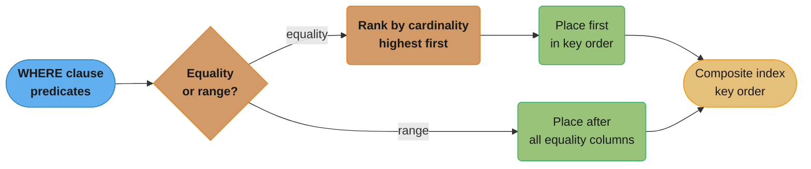
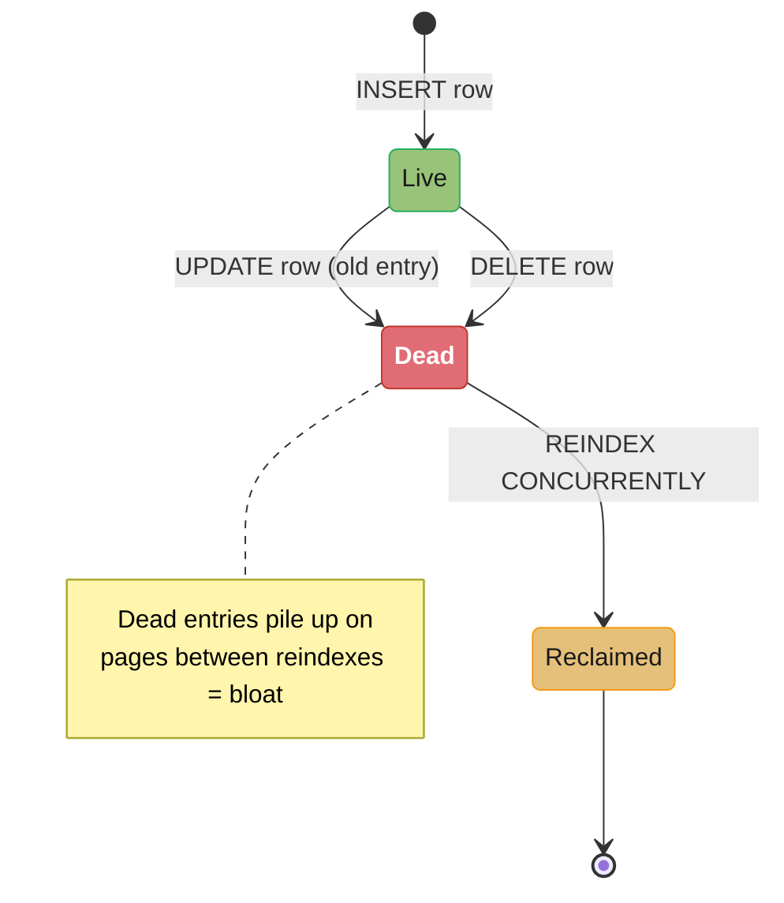
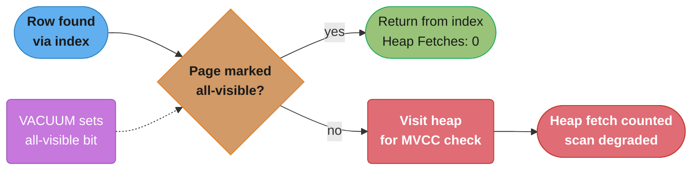

# Indexing Deep Dive

## 1. Concept Overview

A database index is a separate data structure that enables efficient data retrieval without scanning every row in a table. Indexes trade write overhead and storage space for dramatically faster reads. The choice of index type, column ordering, and covering strategy can be the difference between a 5ms query and a 50-second full table scan on a 100M-row table.

---

## 2. Intuition

An index is like the index at the back of a textbook: you could find every mention of "B+tree" by reading every page (sequential scan), or you could look it up in the index (O(log n) or better). Each index entry points to the page(s) where the data lives.

- **Key insight**: The right index turns an O(n) table scan into an O(log n) lookup — critical at scale. The wrong index wastes write performance and disk space without helping reads.
- **Covering indexes**: If the index contains all columns a query needs, the database never touches the heap. This is often the biggest single optimization for read-heavy queries.

---

## 3. Core Principles

- Every index has a maintenance cost: every INSERT/UPDATE/DELETE must update all applicable indexes.
- Index selectivity: high-cardinality columns (unique values) benefit most from B+tree indexes. Low-cardinality columns (boolean, gender) rarely benefit.
- Index bloat: dead index entries accumulate from deleted/updated rows. Monitor and `REINDEX CONCURRENTLY` periodically.
- Index-only scans: possible when all queried columns are in the index. Check via `EXPLAIN` — "Index Only Scan" is the goal.

---

## 4. Types / Architectures / Strategies

### B+Tree Index (Default)

The default index type in PostgreSQL and MySQL. Supports equality, range, prefix, and ORDER BY queries.

```
B+Tree Index on (last_name):
Internal: [G | M | T]
           /   |   \
          /    |    \
   [A-F] [G-L] [M-S] [T-Z]   ← Leaf nodes
   (linked list for range scans)
```

- Height: 3-4 for most production tables (fan-out ~100-400)
- Supports: `=`, `<`, `>`, `<=`, `>=`, `BETWEEN`, `LIKE 'prefix%'`, `ORDER BY`, `GROUP BY`
- Does NOT support: `LIKE '%suffix'`, regex, full-text, arbitrary expressions (without expression index)

**What this actually says.** "Height 3-4, fan-out 100-400" is not folklore — it is one division
and one exponent: `fanout = page_size / entry_size`, and `rows_addressable = fanout ^ height`.
This is the single most useful piece of arithmetic in indexing, because it is what lets you say
"a point lookup on a billion-row table is four page reads" without measuring anything.

| Symbol | What it is |
|--------|------------|
| `page_size` | The fixed block a B+tree node occupies. 8192 bytes (8 KB) in PostgreSQL and InnoDB |
| `entry_size` | Bytes for one key plus its child pointer plus per-tuple header, in an internal node |
| `fanout` | `page_size / entry_size` — how many children one node can point at |
| `height` | Number of levels traversed root to leaf. Each level costs one page read |
| `fanout ^ height` | Rows the tree can address. The exponent is why height grows so slowly |

**Walk one example.** First the division, then the exponent:

```
  fanout = 8192 / entry_size

    entry_size = 20 bytes (bigint key, tight)   ->  8192 / 20 = 409
    entry_size = 40 bytes (uuid key)            ->  8192 / 40 = 204
    entry_size = 80 bytes (wide composite key)  ->  8192 / 80 = 102

  This is exactly the quoted "fan-out ~100-400" -- it is a key-width statement.

  Now compound it. Take fanout = 400:

    level 1  root       1 page       ->            400 pointers
    level 2             400 pages    ->        160,000 pointers
    level 3  leaf     160,000 pages  ->     64,000,000 rows      height = 3
    level 4  leaf  64,000,000 pages  -> 25,600,000,000 rows      height = 4

  And the pessimistic wide-key case, fanout = 100:

    height 3  ->       1,000,000 rows
    height 4  ->     100,000,000 rows
    height 5  ->  10,000,000,000 rows
```

Read the last two blocks together: anywhere between 64 million and 25.6 *billion* rows, the tree
is 4 levels deep. Going from 64M rows to 25.6B rows -- 400x more data -- costs you exactly one
extra page read. That is the whole reason indexes scale, and it is why "how big is the table"
is almost never the interesting question about a point lookup.

**The idea behind it.** In practice a height-4 lookup is not 4 disk reads. The root is one page
and the second level is 400 pages (3.2 MB) — both live in the buffer pool permanently under any
real workload, so only the leaf (and sometimes level 3) is a physical read:

```
  logical page reads per lookup :  4   (root, L2, L3, leaf)
  pages that must be cached     :  1 + 400 = 401 pages = 3.2 MB   <- trivially resident
  physical reads in steady state:  1 - 2

  vs sequential scan of the same 64,000,000-row table at 40 rows/page:
      64,000,000 / 40 = 1,600,000 page reads
```

1-2 physical reads against 1,600,000. The `O(log n)` in Section 2 is a logarithm with base 400,
not base 2 — that base is the entire engineering achievement of the B+tree over a binary tree.

### Hash Index

- PostgreSQL: WAL-logged since PostgreSQL 10 (previously crashed unsafe). Only for equality (`=`).
- O(1) lookup vs O(log n) for B+tree. Useful when: equality-only queries, very high cardinality.
- No support for range queries, ordering, or partial matching.
- MySQL InnoDB: adaptive hash index (AHI) — automatically creates hash index in memory for frequently accessed B+tree pages. Transparent to users.

```sql
CREATE INDEX idx_hash ON sessions USING HASH (session_token);
-- Only useful for: SELECT ... WHERE session_token = $1
-- Not useful for: ORDER BY, range queries
```

### GiST (Generalized Search Tree) — PostgreSQL

Framework for custom index types. Used by:
- **Geometric types**: PostGIS (GEOGRAPHY, GEOMETRY columns), nearest-neighbor queries
- **Range types**: `tsrange`, `int4range` — queries like `WHERE reservation_period @> '2024-01-15'`
- **Full-text search (tsvector)**: `@@` operator
- **ip4r** extension for IP range lookups

### GIN (Generalized Inverted Index) — PostgreSQL

An inverted index: maps each element value to a list of rows containing it.

Use cases:
- **JSONB columns**: `WHERE data @> '{"status": "active"}'`
- **Array columns**: `WHERE tags @> ARRAY['postgresql', 'index']`
- **Full-text search**: `WHERE to_tsvector('english', body) @@ to_tsquery('index')`

Size tradeoffs:
- GIN index for JSONB = 3-5x the base table size (stores every key and value path)
- GIN insert is slow (must update posting lists for each element) — enable `gin_pending_list_limit` and fastupdate

```sql
-- GIN on JSONB
CREATE INDEX idx_gin_data ON events USING GIN (data);
-- Supports: WHERE data @> '{"type": "click"}' -- fast
-- Does NOT support: WHERE data->>'type' = 'click' -- uses B-tree or seq scan
```

### BRIN (Block Range INdex) — PostgreSQL

Stores min/max values per block range (128 pages by default). Extremely small index (typically 1/1000th the size of a B+tree index on the same column).

Best for: very large tables with naturally correlated physical order and column values (timestamp tables written sequentially, append-only logs, warehouse fact tables).

```
Block range [0-127]:    min_ts=2024-01-01, max_ts=2024-01-02
Block range [128-255]:  min_ts=2024-01-02, max_ts=2024-01-03
...

Query: WHERE ts BETWEEN '2024-01-15' AND '2024-01-16'
→ Only read block ranges where max_ts >= '2024-01-15' AND min_ts <= '2024-01-16'
→ Skip 99% of blocks
```

Not useful when: data is not correlated with physical order (after deletes/updates scatter data).

```sql
CREATE INDEX idx_brin_ts ON logs USING BRIN (created_at) WITH (pages_per_range = 128);
-- Index size: ~few MB for 100GB table
-- B+tree equivalent: ~5-10GB
```

**Read it like this.** A BRIN index stores one small summary per *block range*, not one entry per
*row* — so its size is driven by `table_pages / pages_per_range`, a number thousands of times
smaller than the row count. Everything surprising about BRIN falls out of that one substitution.

| Symbol | What it is |
|--------|------------|
| `table_pages` | `table_size / 8192` — how many 8 KB blocks the heap occupies |
| `pages_per_range` | Blocks summarized by one index entry. Default 128 |
| `n_ranges` | `table_pages / pages_per_range` — the number of index entries that exist |
| range summary | min and max of the column plus header, roughly 32 bytes per range |
| correlation | How well physical row order tracks column order. BRIN's entire premise |

**Walk one example.** The "few MB vs 5-10GB" claim above, computed:

```
  table  = 100 GB                     = 107,374,182,400 bytes
  pages  = 107,374,182,400 / 8,192    =      13,107,200 pages
  ranges =      13,107,200 / 128      =         102,400 ranges

  BRIN size = 102,400 x 32 bytes      =       3,276,800 bytes = 3.1 MB

  B+tree on the same column, 512-byte rows:
    rows       = 107,374,182,400 / 512          = 209,715,200 rows
    entry      = 24 bytes, leaf pages ~70% full
    index size = 209,715,200 x 24 / 0.70        = 6.7 GB

  ratio = 6.7 GB / 3.1 MB = 2,194x smaller
```

Now the skip. The index does not find rows; it eliminates ranges whose `[min, max]` cannot
overlap the predicate:

```
  query window touches 1,024 of the 102,400 ranges

  ranges read  = 1,024
  pages read   = 1,024 x 128 = 131,072 pages
  pages skipped= 13,107,200 - 131,072 = 12,976,128

  fraction read = 131,072 / 13,107,200 = 1%      -> "skip 99% of blocks"
```

**Why correlation is load-bearing.** Every number above assumes `min` and `max` per range are
*tight*. Scatter the data — random inserts, or updates relocating rows — and each range's
`[min, max]` widens until nearly every range overlaps every predicate. The index is still 3.1 MB
and still gets consulted; it just stops excluding anything, and you pay a full 13-million-page
scan plus the index read. BRIN has no partial failure mode: it is either ~99% skip or ~0%.

### Covering Index (Include Columns)

A covering index contains all columns referenced by a query, enabling index-only scans (no heap fetch).

```sql
-- Query pattern:
SELECT name, email FROM users WHERE last_name = 'Smith' AND active = true;

-- Without covering index:
-- Index scan on (last_name) → get row IDs → heap fetch for name, email
-- 2 I/Os per row

-- With covering index:
CREATE INDEX idx_covering ON users (last_name, active) INCLUDE (name, email);
-- Index scan → all data in index leaf → no heap fetch
-- 1 I/O per row

-- Check with EXPLAIN:
EXPLAIN SELECT name, email FROM users WHERE last_name = 'Smith' AND active = true;
-- Shows: "Index Only Scan" (not "Index Scan")
```

The `INCLUDE` clause (PostgreSQL 11+, SQL Server) adds columns to leaf nodes only — not used for sorting, can contain types not sortable.

**In plain terms.** "2 I/Os per row versus 1 I/O per row" undersells it, because the two I/Os are
not the same kind of I/O. The index-leaf read is *sequential and shared across rows*; the heap
fetch is *random and one per row*. Cover the query and you delete the per-row term entirely.

| Symbol | What it is |
|--------|------------|
| matched rows | Rows satisfying the `WHERE` clause — the multiplier on heap fetches |
| leaf entry size | Bytes per index tuple. Key columns plus `INCLUDE` columns plus header |
| leaf pages read | `matched_rows x leaf_entry_size / 8192`, rounded up. Read sequentially |
| heap fetches | One random page read per matched row, unless the index covers the query |
| `random_page_cost` | Planner's price for a random read. Default 4.0, tune to 1.1 on SSD |

**Walk one example.** 500 rows match `last_name = 'Smith' AND active = true`:

```
  leaf entry = 24 bytes (last_name, active, name, email, header)

  WITHOUT covering index
    leaf pages   : 500 x 24 / 8,192  = 1.46  -> 2 sequential page reads
    heap fetches : 500 random page reads      <- one per matched row
    total I/Os   : 502

  WITH covering index (INCLUDE name, email)
    leaf pages   : 2 sequential page reads
    heap fetches : 0
    total I/Os   : 2

    502 / 2 = 251x fewer I/Os

  At 0.1 ms per random SSD read:
    without : 500 x 0.1 ms = 50.0 ms
    with    :   2 x 0.1 ms =  0.2 ms
```

The saving scales with the *result set*, not the table. Cover a query returning 5 rows and you
save 5 reads; cover one returning 50,000 and you save 50,000. This is why Section 9 says to add
`INCLUDE` columns for a specific high-frequency query rather than reflexively — the payoff is
proportional to how many rows that particular query drags out of the heap.

### Partial Index

An index covering only a subset of rows, defined by a WHERE clause.

```sql
-- Only index active users (99% of queries hit active users, but 20% of data)
CREATE INDEX idx_active_users ON users (email) WHERE active = true;

-- Only index unprocessed orders (5% of orders at any time)
CREATE INDEX idx_pending_orders ON orders (created_at) WHERE status = 'pending';

-- Unique constraint only for non-deleted records
CREATE UNIQUE INDEX idx_unique_email_active
ON users (email) WHERE deleted_at IS NULL;
```

Benefits: smaller index (faster maintenance), index fits in buffer pool, unique constraints on subsets.

### Expression Index (Functional Index)

Index on the result of a function or expression, not a raw column.

```sql
-- Case-insensitive email search
CREATE INDEX idx_lower_email ON users (lower(email));

-- Query must use identical expression:
SELECT * FROM users WHERE lower(email) = 'alice@example.com'; -- Uses index
SELECT * FROM users WHERE email = 'alice@example.com';         -- Sequential scan

-- Index on computed value
CREATE INDEX idx_year ON events (EXTRACT(year FROM created_at));
SELECT * FROM events WHERE EXTRACT(year FROM created_at) = 2024; -- Uses index
```

### Composite Index Column Ordering

The most common indexing mistake: wrong column order in a composite index.

Rule: Place **equality columns first**, then **range columns**.
Within equality columns: **higher cardinality first** (broader filtering first).

The rule as a decision, not just a sentence — every predicate sorts into one of two buckets, and only one of those buckets gets ranked internally:



```sql
-- Query: WHERE country = 'US' AND created_at > '2024-01-01'
-- Correct index:
CREATE INDEX idx_correct ON orders (country, created_at);
-- 'country' is equality → filters rows to just US orders → range scan on created_at

-- Wrong index:
CREATE INDEX idx_wrong ON orders (created_at, country);
-- 'created_at' range → index used for date range → country filter applied in-memory
-- Much less selective if many dates but few countries

-- Multi-column prefix matching (MySQL):
-- Index (a, b, c) can be used for:
-- WHERE a = 1                    -- uses a
-- WHERE a = 1 AND b = 2          -- uses a, b
-- WHERE a = 1 AND b > 2          -- uses a, b (range stop)
-- WHERE a = 1 AND b = 2 AND c=3  -- uses a, b, c
-- WHERE b = 2                    -- CANNOT use index (a is not in WHERE)
```

### Invisible Indexes (MySQL 8+, Oracle)

An invisible index exists and is maintained by the engine but is ignored by the optimizer. Use for safely testing whether dropping an index breaks any queries.

```sql
-- Make index invisible (optimizer ignores it, engine still maintains it)
ALTER TABLE products ALTER INDEX idx_old_search INVISIBLE;
-- Run workload for 24 hours, observe query plans (should not degrade)
-- If safe, drop:
DROP INDEX idx_old_search ON products;
-- If needed, make visible again:
ALTER TABLE products ALTER INDEX idx_old_search VISIBLE;
```

---

## 5. Architecture Diagrams

**Index lookup flow** for `SELECT * FROM orders WHERE customer_id = 42 ORDER BY created_at;` using a B+tree on `(customer_id, created_at) INCLUDE (status, amount)`:


The resulting plan confirms the ideal path — zero heap fetches and no separate sort node:

```
Index Only Scan using idx_covering on orders
  Index Cond: (customer_id = 42)
  Heap Fetches: 0  ← This is the ideal result
```

**Index bloat lifecycle** — a single index entry's state from creation to reclamation:



Over time a page fills with a mix of live and dead entries, slowing scans until the index is rebuilt:

```
+---+---+---+---+---+---+---+---+---+---+
| L |   | L | V | L |   | L | V | V | L |   L=Live V=Valid(dead tuple)
+---+---+---+---+---+---+---+---+---+---+
```

`REINDEX CONCURRENTLY idx_name` rebuilds the index from this state without blocking reads or writes.

---

## 6. How It Works — Detailed Mechanics

### Index Bloat Detection and Fix

```sql
-- Detect index bloat (PostgreSQL)
SELECT
    schemaname,
    tablename,
    indexname,
    pg_size_pretty(pg_relation_size(indexrelid)) AS index_size,
    idx_scan,
    idx_tup_read,
    idx_tup_fetch
FROM pg_stat_user_indexes
ORDER BY pg_relation_size(indexrelid) DESC;

-- Detect bloat ratio using pgstattuple
CREATE EXTENSION pgstattuple;
SELECT * FROM pgstattuple('idx_orders_customer_id');
-- dead_tuple_percent > 20% → consider REINDEX

-- Fix without locking:
REINDEX INDEX CONCURRENTLY idx_orders_customer_id;
-- PostgreSQL 12+: concurrent reindex
```

### Detecting Index-Only Scan

```sql
EXPLAIN (ANALYZE, BUFFERS)
SELECT customer_id, total FROM orders WHERE status = 'pending';

-- Good output:
Index Only Scan using idx_status_total on orders
  Index Cond: (status = 'pending')
  Heap Fetches: 0    ← covering index working perfectly

-- Bad output (heap fetches != 0):
Index Only Scan using idx_status_total on orders
  Index Cond: (status = 'pending')
  Heap Fetches: 5432  ← visibility map not updated, checking heap for MVCC
  -- Fix: run VACUUM to update visibility map
```

### Visibility Map and Index-Only Scans

PostgreSQL maintains a visibility map (1 bit per page) indicating if all tuples on a page are visible to all transactions. Index-only scans use this: if the page is marked "all visible," skip the heap fetch. After heavy updates/inserts, pages lose this bit. VACUUM sets it. Ensure autovacuum is keeping up for index-only scans to actually be index-only.

Whether an index-only scan truly stays index-only hinges on one bit per page, set by a background process and consumed at read time:



---

## 7. Real-World Examples

- **E-commerce**: `CREATE INDEX ON orders (customer_id, created_at DESC) INCLUDE (status, total)` — covers the "my orders" page query completely.
- **Authentication**: `CREATE INDEX ON sessions USING HASH (token)` — O(1) session lookup.
- **Geospatial**: `CREATE INDEX ON stores USING GIST (location)` — K-nearest-neighbor store finder.
- **Full-text search**: `CREATE INDEX ON articles USING GIN (to_tsvector('english', content))` — full-text search without Elasticsearch for moderate scale.
- **Soft delete with unique email**: `CREATE UNIQUE INDEX ON users (email) WHERE deleted_at IS NULL` — enforce unique email only for active users.
- **Audit logs (append-only, time-ordered)**: `CREATE INDEX ON audit_log USING BRIN (logged_at)` — tiny index for 10TB table.

---

## 8. Tradeoffs

| Index Type | Read Performance | Write Overhead | Size | Best For |
|-----------|----------------|----------------|------|---------|
| B+tree | Excellent (equality + range) | Medium | Medium | Most queries |
| Hash | Excellent (equality only) | Low | Small | Session tokens, hashes |
| GiST | Good (geometric, range) | High | Large | Spatial, range types |
| GIN | Excellent (containment, FTS) | Very High | Very Large | JSONB, arrays, FTS |
| BRIN | Good (correlated data) | Very Low | Tiny | Append-only time-series |
| Partial | Excellent (filtered) | Low (subset) | Small | Active records, soft delete |
| Expression | Good | Medium | Medium | Lower(col), computed values |
| Covering | Excellent (all cols covered) | Medium-High | Large | Read-heavy query patterns |

---

## 9. When to Use / When NOT to Use

**Use B+tree when**: equality and/or range queries, ORDER BY, GROUP BY, high-cardinality columns, default choice.

**Use GIN when**: JSONB containment queries, array intersection/containment, full-text search, tsvector columns.

**Use BRIN when**: very large append-only tables with sequential physical layout (logs, events, time-series). Do not use for tables with random inserts or heavy updates/deletes.

**Use partial index when**: queries consistently filter on a constant condition (active=true, status='pending'). Do not use when the filter condition changes frequently.

**Use covering index when**: a specific high-frequency query is I/O bound and can benefit from eliminating heap fetches. Do not add INCLUDE columns for every query — index size grows quickly.

**Do not index**:
- Very low cardinality columns (boolean, status with 3 values) — the planner may prefer a sequential scan anyway
- Columns in small tables (<1000 rows) — sequential scan is faster than index traversal
- Rarely queried columns — write overhead with no read benefit

---

## 10. Common Pitfalls

**Pitfall 1: Function on indexed column prevents index use**
```sql
-- Table: users, index: (email)
SELECT * FROM users WHERE UPPER(email) = 'ALICE@EXAMPLE.COM';  -- seq scan
-- Fix: expression index
CREATE INDEX idx_upper_email ON users (UPPER(email));
-- Or: normalize data to lowercase on insert
```

**Pitfall 2: Leading column range prevents composite index use**
Production incident: An API that queried `WHERE created_at > now() - interval '1 day' AND user_id = $1` had a composite index on `(created_at, user_id)`. The range on `created_at` was the leading column, so the planner often chose a sequential scan for high-volume users. Fix: reverse to `(user_id, created_at)` — equality on user_id first, then range on created_at.

**Pitfall 3: Implicit type cast prevents index use**
```sql
-- Table: orders, column: customer_id INTEGER, index: (customer_id)
-- Parameterized query with string parameter:
SELECT * FROM orders WHERE customer_id = '42'; -- May cause seq scan
-- PostgreSQL: implicit cast from text to integer may prevent index use
-- Fix: ensure application sends typed parameters, not strings
```

**Pitfall 4: Index not used due to low selectivity**
A `status` column with values ('active', 'inactive') — 90% active. Query: `WHERE status = 'active'`. Planner sees that returning 90% of rows via index scan (random I/O for each row) is slower than sequential scan. Fix: partial index `WHERE status = 'active'` only if queried in isolation. Or accept sequential scan as the right choice.

**Put simply.** The planner is not "refusing to use your index" — it is comparing two costs and
picking the smaller: `seq_cost = table_pages x seq_page_cost` against
`index_cost ~ matched_rows x random_page_cost`. One term is bounded by the table's *pages*, the
other grows with *rows returned*, and rows always outnumber pages. That asymmetry is the whole
story of index selectivity, and it produces a hard crossover percentage you can compute.

| Symbol | What it is |
|--------|------------|
| selectivity | Fraction of rows the predicate keeps. `0.9` = returns 90% of the table |
| cardinality | Distinct values in the column. A 2-value column can never be selective |
| `table_pages` | `rows / rows_per_page`. The ceiling on sequential-scan cost |
| `seq_page_cost` | Price of one sequential page read. Default 1.0 |
| `random_page_cost` | Price of one random page read. Default 4.0 (HDD-era), 1.1 on SSD |

**Walk one example.** A 10M-row table, 200-byte rows, so 40 rows per 8 KB page:

```
  table_pages = 10,000,000 / 40 = 250,000 pages
  seq_cost    = 250,000 x 1.0   = 250,000        <- fixed, whatever the predicate is

  selectivity   rows returned    index_cost = rows x 4.0     verdict
    90%          9,000,000          36,000,000               144x worse than seq
    10%          1,000,000           4,000,000                16x worse than seq
     1%            100,000             400,000               1.6x worse than seq
     0.625%         62,500             250,000               exactly tied

  crossover = 250,000 / (10,000,000 x 4.0) = 0.00625 = 0.625%
```

Below ~0.6% of the table the index wins; above it, the sequential scan wins — and at 90%
selectivity it is not close, it is 144x. A two-value `status` column can *at best* return 10% of
this table, which is still 16x worse than just reading the whole thing. The index is not
underperforming; it is being asked to do something a random-access structure cannot do.

**What `random_page_cost` actually moves.** Re-run the crossover with the SSD-tuned value from
Best Practice 5: `250,000 / (10,000,000 x 1.1) = 0.0227 = 2.27%`. Dropping the constant from 4.0
to 1.1 widens the index-friendly window 3.6x. That single setting is the most common reason the
same query plans differently on two servers holding identical data.

**Pitfall 5: Too many indexes on write-heavy tables**
A table receiving 50,000 INSERTs/second had 12 indexes. Each insert updated all 12 indexes — 600,000 index writes/second on top of the table writes. Write throughput dropped 70% vs baseline. Fix: audit indexes, drop unused ones (check `idx_scan = 0` in `pg_stat_user_indexes`), consolidate similar indexes.

**Stated plainly.** One logical INSERT is not one write. It is `1 + n_indexes` structure
modifications, so index count is a straight multiplier on every write path — WAL bytes, dirty
pages, buffer-pool churn, and checkpoint volume all scale by the same factor. Section 3's "every
index has a maintenance cost" is that multiplier, and it is linear with no discount for volume.

| Symbol | What it is |
|--------|------------|
| `n_indexes` | Number of indexes the engine must keep consistent on this table |
| write amp | `(1 + n_indexes)` — physical structure writes per one logical row write |
| effective TPS | `budget / write_amp` — rows/sec you get from a fixed write budget |
| `idx_scan` | Reads served by an index since stats reset. `0` means pure cost, zero benefit |

**Walk one example.** The incident above, and what dropping to 3 indexes buys:

```
  12 indexes:
    write amp    = 1 + 12 = 13x
    at 50,000 rows/sec -> 50,000 heap writes + 600,000 index writes = 650,000 total

  Hold the engine's write budget fixed at 650,000 structure-writes/sec:

    n_indexes    write amp      effective rows/sec = 650,000 / amp
       12           13x                50,000
        6            7x                92,857
        3            4x               162,500
        1            2x               325,000
        0            1x               650,000
```

Halving the index count from 12 to 6 nearly doubles ingest, without touching hardware. The
converse is what bites in production: the 13th index is not "8% more work" on the index layer,
it is a permanent 7.7% tax on *every* write to that table, charged forever, and charged even
if `idx_scan` for it stays at 0 for the index's entire life.

**Pitfall 6: VACUUM not running → index-only scans degraded**
A covering index was added expecting Index Only Scans. EXPLAIN showed `Heap Fetches: 50000` despite an index-only query. The visibility map had not been updated — every row required a heap check for MVCC visibility. Fix: `VACUUM ANALYZE table_name`. After VACUUM, Heap Fetches dropped to 0.

---

## 11. Technologies & Tools

| Tool | Purpose |
|------|---------|
| `EXPLAIN (ANALYZE, BUFFERS)` | Understand query plan, actual vs estimated rows, I/O |
| `pg_stat_user_indexes` | Monitor index usage, detect unused indexes |
| `pgstattuple` | Measure index bloat (dead tuple percentage) |
| `REINDEX CONCURRENTLY` | Rebuild bloated index without locking (PG 12+) |
| `CREATE INDEX CONCURRENTLY` | Add index to live table without blocking writes |
| `pg_stat_statements` | Track query execution stats, identify slow queries needing indexes |
| `hypopg` | PostgreSQL extension to test hypothetical indexes without building them |
| `pt-duplicate-key-checker` | Find duplicate/redundant indexes in MySQL |
| MySQL `EXPLAIN FORMAT=JSON` | Detailed MySQL query plan analysis |

---

## 12. Interview Questions with Answers

**Q: How do you choose the column order in a composite index?**
Put equality-filtered columns first, range-filtered columns last. Within equality columns, put higher-cardinality columns first for broader initial filtering. Reason: a B+tree composite index (a, b, c) first sorts by a, then b within equal a values, then c. If a has an equality predicate, the index efficiently narrows to all rows with that a value, then continues the scan with b and c. A range on a (like `a > 5`) stops the index from being useful for b and c — the planner must check all values of a > 5 and cannot use b/c predicates efficiently.

**Q: When would you use a partial index?**
Use a partial index when a consistent, low-selectivity condition appears in many queries. Example: `WHERE status = 'active'` when 95% of users are active. A full index on `status` is nearly useless (low cardinality). A partial index `CREATE INDEX ON users (email) WHERE status = 'active'` covers only the 5% inactive records or the 95% active — whichever is queried. Another classic: unique email only among non-deleted users: `UNIQUE INDEX ... WHERE deleted_at IS NULL`. Partial indexes are smaller, faster to maintain, and fit more easily in the buffer pool.

**Q: What is index bloat and how do you detect and fix it in production?**
Index bloat occurs when dead index entries (from deleted or updated rows) accumulate faster than they are reclaimed. Symptoms: index size growing without data growth, slow index scans. Detection: `SELECT indexname, pg_size_pretty(pg_relation_size(indexrelid)) FROM pg_stat_user_indexes ORDER BY 2 DESC;` and `pgstattuple(indexname).dead_tuple_percent`. Fix: `REINDEX INDEX CONCURRENTLY idx_name` — rebuilds the index from scratch without blocking reads or writes (requires PostgreSQL 12+). Schedule this during low-traffic periods and monitor disk space (temporary extra space needed during rebuild).

**Q: Explain why covering indexes eliminate heap fetches.**
The database heap (data file) stores full rows. An index stores only the indexed columns plus a row pointer (ctid in PostgreSQL). A standard index scan: traverse index to find matching row pointers → follow each pointer to the heap to fetch remaining columns. This requires random I/O for each row. A covering index includes all columns needed by the query in the index's leaf nodes. The database never needs to visit the heap — all data is available in the index. This eliminates random I/O and is often 5-10x faster for large result sets. Detect via EXPLAIN: "Index Only Scan" vs "Index Scan."

**Q: How does the query planner decide between a sequential scan and an index scan?**
The cost-based optimizer (CBO) estimates: (1) Index scan cost = index traversal cost + heap fetch cost (random_page_cost × estimated rows). (2) Sequential scan cost = seq_page_cost × total pages. If index selectivity is low (query returns 20%+ of rows), sequential scan is often cheaper because sequential I/O is faster than random I/O (by ~4x on HDD, ~1.5x on SSD). Settings: `random_page_cost` defaults to 4.0 (HDD assumption); for SSD, set to 1.1-1.5. `effective_cache_size` tells the planner how much data fits in OS cache — affects whether "random" I/Os are truly random or cached.

**Q: What are GIN indexes and when do you choose them over B+tree?**
GIN (Generalized Inverted Index) is an inverted index: it maps each element value to the set of rows containing it. Use GIN when: (1) JSONB containment queries (`WHERE data @> '{"type": "click"}'`), (2) Array containment (`WHERE tags @> '{postgres, index}'`), (3) Full-text search with `tsvector`. GIN is 3-5x larger than the base table for JSONB, and insert/update is slow (must update posting lists for every element). Use B+tree when: single scalar value equality/range queries. Use GIN when: containment, overlap, or element-existence queries on multi-valued columns.

**Q: What is a BRIN index and what are its limitations?**
BRIN (Block Range Index) stores min/max values per range of 128 consecutive table pages. It's tiny (1/1000th of a B+tree) and has very low maintenance cost. Query: if the query range overlaps the BRIN min/max for a block range, read that block range; otherwise skip it. Limitation: only useful if data values are correlated with physical storage order. An append-only `created_at` column is perfect — new rows have newer timestamps and are physically at the end. A `user_id` column in a randomly-ordered table is useless for BRIN — every block range has min and max spanning the entire domain, so BRIN cannot skip any blocks.

**Q: How do you find and remove unused indexes in production?**
```sql
SELECT schemaname, tablename, indexname, idx_scan
FROM pg_stat_user_indexes
WHERE idx_scan = 0
ORDER BY pg_relation_size(indexrelid) DESC;
```
`idx_scan = 0` since last stats reset means the index was never used. Verify: reset stats with `SELECT pg_stat_reset()`, wait 1-2 weeks to accumulate representative traffic. Indexes still at idx_scan=0 are candidates for removal. Test removal safely: use MySQL's INVISIBLE INDEX feature or PostgreSQL's `pg_hint_plan` to disable index use and measure query performance. Drop with `DROP INDEX CONCURRENTLY idx_name` to avoid locking.

**Q: Explain the prefix matching rule for composite indexes in MySQL.**
A composite index (a, b, c) can be used for queries that reference a prefix of the columns in order: just (a), (a, b), or (a, b, c). If a query omits a leading column (queries only on b or c), MySQL cannot use the index at all. The exception: if the leading column has an equality condition, subsequent columns can have range conditions — but once a range is hit, further columns are not usable for index navigation (though they may be used for in-index filtering). Example: `WHERE a = 1 AND b > 5 AND c = 3` — the index is used for a (equality) and b (range) but c is not used for index navigation (though it can be evaluated in the leaf nodes).

**Q: What is an expression index and when does the planner use it?**
An expression index stores the result of an expression over one or more columns. The planner uses it only when the query contains the exact same expression. Example: `CREATE INDEX ON users (lower(email))` — used by `WHERE lower(email) = 'alice@example.com'` but NOT by `WHERE email = 'Alice@example.com'`. Common uses: case-insensitive string matching, extracting date parts (`EXTRACT(year FROM ts)`), computed business logic (`(price * quantity)`). Important: the query must use the same expression text; even equivalent expressions with different function calls may not match.

**Q: How do you add an index to a 500M-row production table without causing downtime?**
Use `CREATE INDEX CONCURRENTLY idx_name ON table (col)`. This builds the index in three phases: (1) Initial scan of table — marks new inserts as needing index entries. (2) Second scan — catches changes made during first scan. (3) Third pass — cleanup. Throughout, reads and writes to the table continue normally. Downsides: (1) Takes 3x longer than regular CREATE INDEX. (2) Requires more disk I/O. (3) If it fails midway, leaves an INVALID index — must drop and restart. Monitor progress via `pg_stat_progress_create_index` (PostgreSQL 12+).

**Q: What is the visibility map and why does it matter for index-only scans?**
PostgreSQL maintains a visibility map (VM): 2 bits per heap page. Bit 1: "all tuples visible to all transactions" (set by VACUUM). Bit 2: "all tuples frozen" (for very old data). During an index-only scan, for each row found in the index, PostgreSQL checks the VM for that row's page. If the bit is set (all tuples visible), it can return the index data directly without visiting the heap. If the bit is not set, it must visit the heap to check MVCC visibility (defeating the purpose of the index-only scan). Ensure autovacuum is keeping up — check `pg_stat_user_tables.n_dead_tup` and `last_autovacuum`.

**Q: What is fill factor for a B+tree index and when should you change it?**
Fill factor (0-100, default 90 for indexes) specifies what percentage of each index page is filled during initial build. Leaving 10% free space means new inserts into existing pages don't immediately cause page splits. When to lower it: (1) Sequential inserts near existing keys (middle-of-range updates, backfills), (2) Tables with heavy UPDATE patterns that change indexed columns. When to raise it: (3) Insert-only tables where inserts are always at the end (like append-only logs with timestamp primary key) — 100% fill factor maximizes storage efficiency. Example: `CREATE INDEX ON orders (customer_id) WITH (fillfactor=70)` for a table with frequent customer_id-range updates.

**Q: How does a GIN index handle updates and why is fastupdate important?**
GIN index updates are expensive: each row that changes must update the posting list for every element it contains. For a JSONB document with 50 keys, an INSERT requires 50 GIN posting list updates — serialized writes on a shared data structure. `fastupdate=on` (default): new updates go to a pending list in a separate heap table rather than directly into the GIN structure. A background process (`gin_pending_list_limit` trigger) periodically merges the pending list into the main GIN structure. This batches the expensive sorting/merging. Downside: reads must check both the main GIN and the pending list. For read-heavy workloads with bursts of GIN inserts, fastupdate reduces write latency significantly.

**Q: How do you handle an index on a UUID v4 primary key that causes cache thrashing?**
UUID v4 is random — inserts go to random B+tree leaf pages, causing constant cache misses (each insert fetches a different page). At scale, the index cannot fit in the buffer pool, so every insert causes a disk read. Solutions: (1) Use ULIDv2 or UUID v7 (time-ordered UUID) — new inserts go to the end of the index, only the last few pages need to be in cache. (2) Use a sequence or BIGSERIAL primary key for internal use, expose UUID externally. (3) Use hash partitioning on UUID — each partition's index is smaller and can fit in cache. (4) Increase `shared_buffers` / buffer pool so the index fits — only viable for small tables.

**Q: What is the difference between REINDEX and REINDEX CONCURRENTLY?**
`REINDEX INDEX idx_name`: Acquires an ACCESS EXCLUSIVE lock on the table for the entire duration of the index rebuild. All reads and writes to the table are blocked. Fast but causes downtime. `REINDEX INDEX CONCURRENTLY idx_name` (PostgreSQL 12+): Uses the same algorithm as `CREATE INDEX CONCURRENTLY` — multiple passes, no exclusive lock, reads and writes continue. Takes 3x longer and requires temporary extra disk space (old + new index exist simultaneously). If REINDEX CONCURRENTLY fails, leaves an INVALID index — drop it and retry. Use CONCURRENTLY in production; use regular REINDEX only during maintenance windows.

**Q: Explain how a B+tree index supports ORDER BY without a sort step.**
B+tree leaf nodes are physically ordered by the indexed column(s) and linked in a doubly-linked list. A query `ORDER BY last_name` traverses the leaf pages in order, fetching rows already sorted. EXPLAIN shows "Index Scan" with no "Sort" node. This also enables "merge join" when joining two tables on their indexed columns — both index scans produce sorted output that can be merged in O(n+m). Descending ORDER BY: B+trees support backward traversal of the leaf list. `CREATE INDEX ON t (col DESC)` or the planner traverses an ascending index backward — both work but explicit DESC index can improve performance for mixed ASC/DESC compound sorts.

**Q: When would you recommend multiple single-column indexes vs one composite index?**
Multiple single-column indexes: the planner can combine them via "bitmap index scan" (OR two index results, intersect AND results). Useful when: queries use different combinations of columns unpredictably, or you need to OR conditions. One composite index: more efficient for queries that always use all (or prefix of) columns together. The composite index eliminates multiple index lookups and bitmap operations. Rule of thumb: if a specific query pattern runs millions of times per day, a targeted composite index outperforms multiple single-column indexes. For exploratory or infrequent queries, single-column indexes with bitmap scan are sufficient.

---

## 13. Best Practices

1. Always run `EXPLAIN (ANALYZE, BUFFERS)` before and after adding an index to verify it's used.
2. Use `CREATE INDEX CONCURRENTLY` in production to avoid table locks.
3. Set `idx_scan` monitoring: drop indexes unused for 30+ days (after verifying with stats reset).
4. For composite indexes: equality columns first, then range columns, then include columns.
5. Set `random_page_cost = 1.1` for SSD storage (default 4.0 is for HDD) so the planner uses indexes more aggressively.
6. Add `INCLUDE` columns to covering indexes rather than including them in the key columns (avoids key bloat, allows non-sortable types).
7. Schedule `REINDEX CONCURRENTLY` for indexes where `dead_tuple_percent > 20%`.
8. Ensure VACUUM is keeping up with writes so index-only scans can use the visibility map.
9. Never index boolean columns alone — the optimizer will choose a seq scan for either value.
10. Test hypothetical indexes with `hypopg` before building them on large production tables.

---

## 14. Case Study

**Scenario**: A healthcare records system has a `patient_records` table (200M rows, 500GB). The top query pattern is:

```sql
SELECT record_id, patient_id, diagnosis_code, created_at, summary
FROM patient_records
WHERE clinic_id = 'C123' AND record_date >= '2024-01-01' AND record_date < '2025-01-01'
ORDER BY record_date DESC
LIMIT 50;
```

This query was taking 45 seconds. `EXPLAIN` showed a sequential scan.

**Analysis**:
- `clinic_id`: high cardinality (10,000 clinics), equality condition — leading column
- `record_date`: range condition — trailing column after equality
- `ORDER BY record_date DESC`: can be satisfied by composite index traversal (backward)
- SELECT columns: `record_id, patient_id, diagnosis_code, created_at, summary` — need covering

**Solution**:
```sql
-- Step 1: Create composite + covering index
CREATE INDEX CONCURRENTLY idx_patient_records_clinic_date
ON patient_records (clinic_id, record_date DESC)
INCLUDE (record_id, patient_id, diagnosis_code, summary);
-- Took 4 hours to build on live system (no downtime)

-- Step 2: Verify
EXPLAIN (ANALYZE, BUFFERS)
SELECT record_id, patient_id, diagnosis_code, created_at, summary
FROM patient_records
WHERE clinic_id = 'C123' AND record_date >= '2024-01-01' AND record_date < '2025-01-01'
ORDER BY record_date DESC LIMIT 50;
```

**Result**:
```
Index Only Scan Backward using idx_patient_records_clinic_date
  Index Cond: (clinic_id = 'C123') AND (record_date DESC < '2025-01-01')
  Filter: (record_date >= '2024-01-01')
  Heap Fetches: 0
  Rows Removed by Filter: 12
  Actual Rows: 50
  Actual Time: 0.842ms
```

Query time: **45 seconds → 0.842ms** (53,000x improvement). The index-only scan with backward traversal required no heap fetches and no sort step. The `INCLUDE` columns added only 15% to index size vs storing them in the key.
