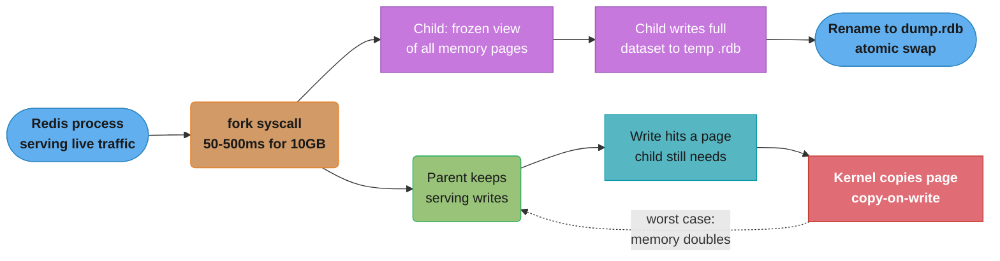
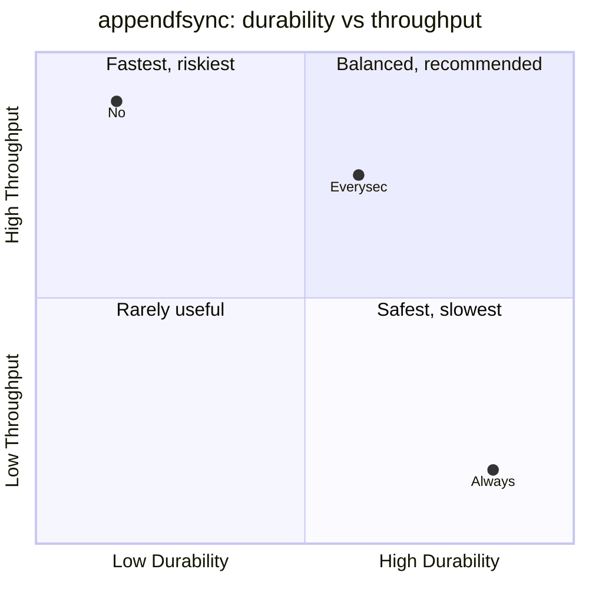
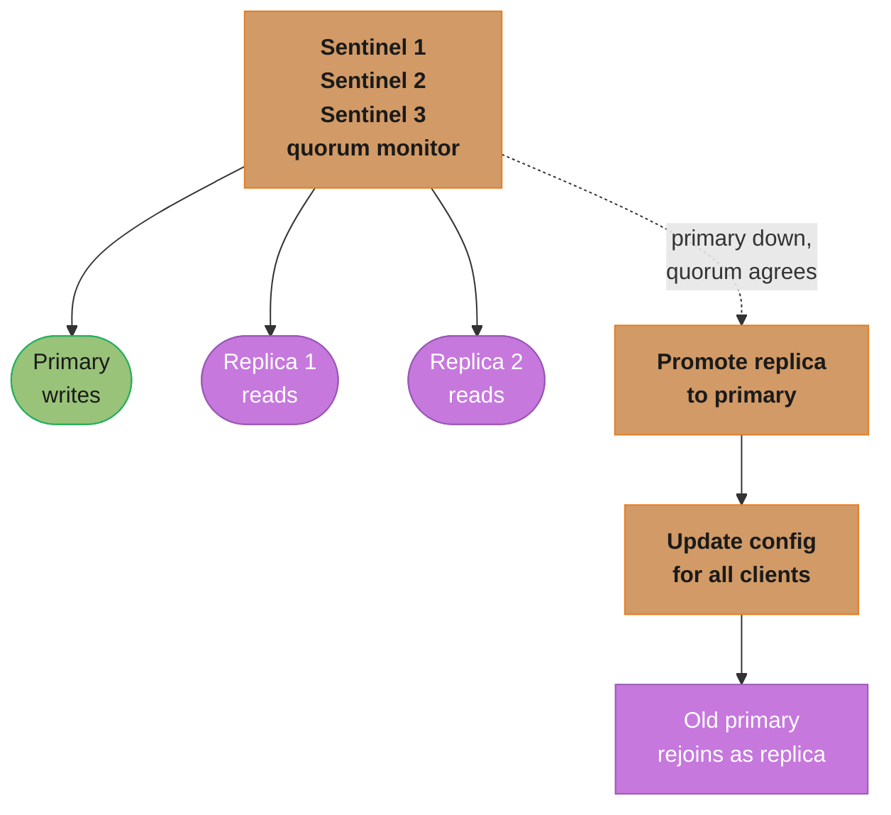
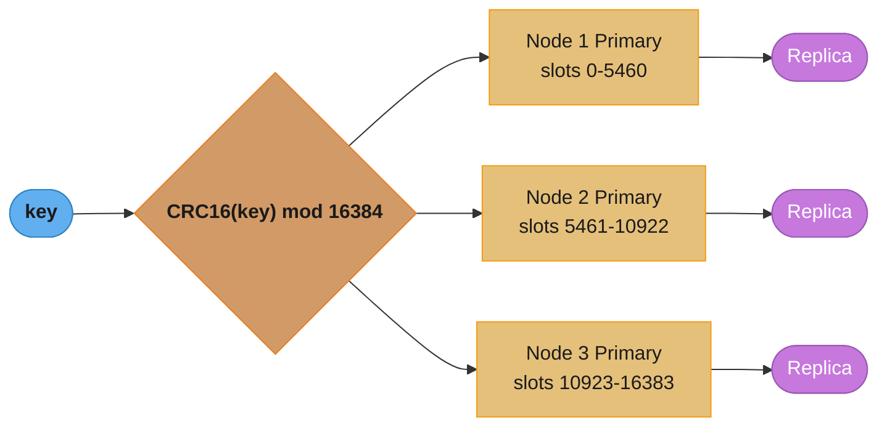
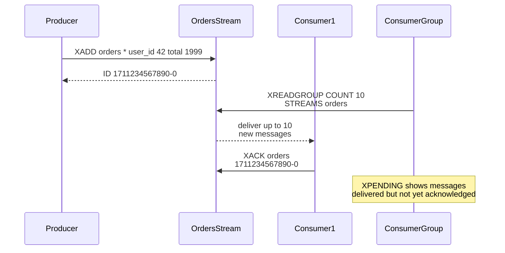
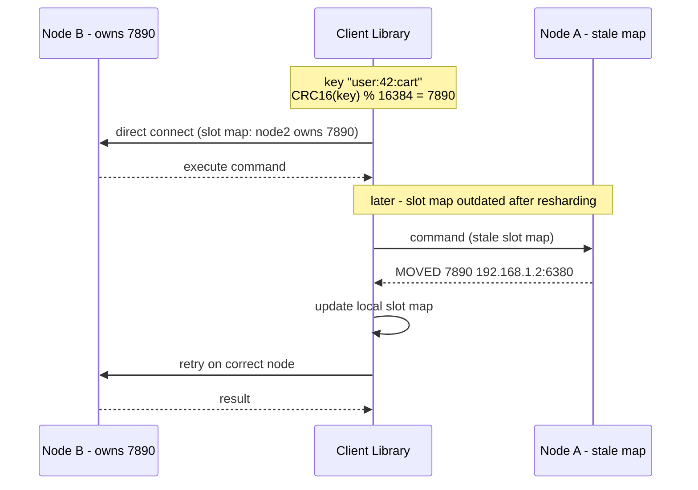
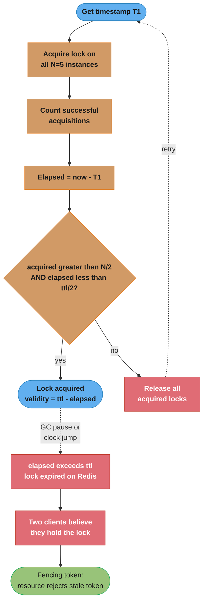

# Key-Value Stores

## 1. Concept Overview

Key-value stores are the simplest NoSQL data model: a distributed hash map mapping keys to values. Redis is the dominant in-memory key-value store, combining sub-millisecond latency with rich data structures, persistence, pub/sub, Lua scripting, and clustering. Understanding Redis data structures and their internal encodings is critical for building efficient caching, session, rate limiting, and real-time systems.

---

## 2. Intuition

Redis is like a Swiss Army knife: the basic knife is the string (simple key-value), but the attached tools — sorted sets, streams, HyperLogLog — handle complex use cases that would otherwise require multiple systems. The right data structure choice can be the difference between a 0.5ms and 50ms operation.

- **Key insight**: Every Redis data structure has two internal encodings — a compact one for small sizes and an efficient one for large sizes. Staying below the threshold (default 64 bytes / 128 entries) keeps data in the compact encoding, dramatically reducing memory.

---

## 3. Core Principles

### Redis Data Structures and Internal Encodings

```
String:
  Small: embstr (≤ 44 bytes, contiguous allocation with robj)
  Large: raw (separate allocation, INCR for integers)
  Use: cache values, counters, rate limiters, session tokens

List (doubly-linked list / quicklist):
  Small (≤ 128 elements, ≤ 64 bytes each): listpack (compact sequential)
  Large: quicklist (doubly-linked list of listpacks, default listpack size=128 bytes)
  Use: message queues, activity feeds, recent items, pub/sub queues

Hash (dict / listpack):
  Small (≤ 128 fields, ≤ 64 bytes each): listpack (compact, linear scan)
  Large: hashtable (O(1) ops)
  Use: user sessions, object attributes, counters per entity

Set (hashtable / intset):
  Small integers only: intset (compact sorted array, O(log n) lookup)
  Otherwise: hashtable (O(1) ops)
  Use: unique members, tags, follower/following relationships

Sorted Set / ZSet (skiplist + hashtable / listpack):
  Small (≤ 128 members, ≤ 64 bytes each): listpack (linear scan)
  Large: skiplist + hashtable dual structure
         skiplist: O(log n) for range queries (ZRANGE, ZRANGEBYSCORE)
         hashtable: O(1) for member lookup (ZSCORE, ZADD update)
  Use: leaderboards, rate limiters (sliding window), delayed tasks

HyperLogLog: probabilistic cardinality estimation
  Standard error: 0.81%, Memory: 12KB maximum
  Use: unique visitor count, distinct IPs, distinct searches

Bitmap: string with bit operations
  Use: user activity (bit per day), feature flags, bloom filters

Stream: append-only log with consumer groups
  Use: event sourcing, Kafka-lite, job queues with acknowledgment
```

### Persistence Modes

**RDB (Redis Database) — Snapshots**:
```
Redis forks a child process (copy-on-write semantics).
Child writes current dataset to a temporary .rdb file.
Swap: rename temporary file to dump.rdb.

Fork overhead: 50-500ms for 10GB dataset (memory pages must be allocated for CoW)
During fork: parent continues serving requests (CoW = only modified pages are copied)

Configuration:
save 900 1        # Save if ≥1 key changed in 900 seconds
save 300 10       # Save if ≥10 keys changed in 300 seconds
save 60 10000     # Save if ≥10000 keys changed in 60 seconds
```

`fork()` gives the child a frozen view of every memory page without copying; the kernel only copies a page (copy-on-write) once the parent writes to it, so cost scales with how much the dataset changes during the snapshot, not its total size.



If every page gets touched before the child finishes writing, total memory temporarily doubles — the mechanism behind Pitfall 1's multi-second fork pause on large datasets.

**AOF (Append-Only File)**:
```
Every write command is appended to aof file.
On restart: replay all commands to reconstruct dataset.

Fsync policies:
appendfsync always      # Fsync after every command. Slowest, safest (0 data loss)
appendfsync everysec    # Fsync once per second. Up to 1s data loss on crash (recommended)
appendfsync no          # Never fsync (OS decides). Fastest, most data loss risk

AOF rewrite: periodic compaction of the AOF file (remove superseded commands)
auto-aof-rewrite-percentage 100  # Rewrite when AOF doubles in size
auto-aof-rewrite-min-size 64mb   # Minimum size before auto-rewrite
```

The three `appendfsync` policies trade durability for throughput; `everysec` sits in the balanced quadrant, which is why most production deployments choose it over the two extremes.



`always` fsyncs every write (zero loss, but throughput capped around 1,000 writes/second on HDD); `no` skips explicit fsyncs entirely (highest throughput, most risk); `everysec` fsyncs once per second in the background, losing at most 1 second of writes on a crash while keeping near-native throughput.

**RDB + AOF Hybrid (Redis 4.0+)**:
```
AOF file begins with a compact RDB snapshot,
followed by AOF commands from that point forward.
Faster restart (RDB portion loads quickly) + durability (AOF guarantees from that point).
Enable with: aof-use-rdb-preamble yes
```

---

## 4. Types / Architectures / Strategies

### Redis Sentinel (HA for single primary)



Three or more Sentinels monitor the primary and both replicas; once a majority (quorum) agrees the primary is down, they promote a replica, push the new config to clients, and the old primary rejoins as a replica once it recovers. Use Sentinel when you need HA but don't need horizontal scale.

### Redis Cluster (horizontal scale + HA)



16,384 hash slots split across the primary shards (3 shown here) via `CRC16(key) mod 16384`; each primary has a replica for failover. When a client sends a command, the owning primary executes it directly; if the client's cached slot map is stale, the target node replies `MOVED ip:port` and the client redirects to the correct primary (worked example in Section 5). Key tags such as `{user}.cart` and `{user}.profile` hash only on `{user}`, guaranteeing both land on the same slot so multi-key operations work.

### Eviction Policies

```
noeviction     -- Return error when memory full. Use for durability-critical data.
allkeys-lru    -- Evict least recently used keys from all keys. Common choice.
volatile-lru   -- LRU eviction only among keys with TTL set.
allkeys-lfu    -- Evict least frequently used (LFU, Redis 4+). Better for non-uniform access.
volatile-lfu   -- LFU only among keys with TTL.
allkeys-random -- Random eviction. Rarely useful.
volatile-random-- Random from TTL keys.
volatile-ttl   -- Evict keys with shortest TTL first.

Recommendation: allkeys-lru for general cache, allkeys-lfu for Zipf-distributed access,
                noeviction for non-cache uses (job queues, sessions that must survive)
```

### Lua Scripting and Atomicity

```lua
-- Lua scripts in Redis are atomic: no other command executes between lines
-- EVALSHA for efficiency: pre-load script, send SHA for subsequent calls

-- Rate limiter (token bucket, atomic):
local key = KEYS[1]
local limit = tonumber(ARGV[1])
local window = tonumber(ARGV[2])
local current = tonumber(redis.call('GET', key) or 0)
if current + 1 > limit then
    return 0
else
    redis.call('INCR', key)
    redis.call('EXPIRE', key, window)
    return 1
end

-- Execute:
EVAL <script> 1 rate_limit:user:42 100 60
```

### Redis Streams (Kafka-lite)

A Stream is an append-only log with auto-generated timestamp-sequence IDs; producers append, and each consumer in a group gets a distinct slice of the log.



Unlike a plain Redis List (`BRPOP` for a blocking pop, no acknowledgment), a Stream supports consumer groups, acknowledgment, message replay, and multiple independent consumers off the same log.

---

## 5. Architecture Diagrams

**Cluster key routing**: a client hashes a key to a slot, connects straight to the primary its cached slot map names, and transparently re-routes on a `MOVED` reply.



The redirect is transparent to the application: the client library absorbs the `MOVED` reply, updates its slot map, and retries — callers never see the extra round trip.

**Skiplist internal structure (Sorted Set)**: higher levels skip more nodes, so range scans descend from the top level instead of walking every element.

```
Level 3: → → → → [score=50] → → → → [score=90]
Level 2: → → [score=20] → [score=50] → [score=80] → [score=90]
Level 1: [10] → [20] → [30] → [50] → [60] → [80] → [90]
```

`ZRANGE`/`ZRANGEBYSCORE` are O(log n): navigate the skiplist from the highest level down. `ZSCORE` is O(1): a parallel hashtable maps member to score without touching the skiplist at all.

---

## 6. How It Works — Detailed Mechanics

### Redlock Algorithm and Its Controversy



Redlock only counts a lock as held if a majority of the N=5 instances (greater than N/2) acknowledge it within half the TTL; otherwise it releases everything and retries. Martin Kleppmann's 2016 critique: a GC pause or clock jump between acquiring and using the lock can let it expire on the Redis nodes unnoticed, so two clients can both believe they hold it — a fencing token (a monotonically increasing number the protected resource must check) closes that gap by rejecting any request carrying a lower token than one it has already seen.

**Practical guidance**: Redlock is safer than single-Redis locks, but for true distributed safety use ZooKeeper (ephemeral nodes) or etcd — both provide linearizable semantics that Redlock cannot guarantee.

### Redis Memory Encoding Thresholds

```
# Change encoding thresholds:
hash-max-listpack-entries 128    # Use listpack for hashes with ≤128 fields
hash-max-listpack-value 64       # Use listpack if all values ≤64 bytes
zset-max-listpack-entries 128
zset-max-listpack-value 64
list-max-listpack-size 128       # elements per listpack node in quicklist
set-max-intset-entries 512       # intset for sets with ≤512 integers

# Memory impact:
# Listpack (small): ~30-50% less memory than hashtable/skiplist
# Keep objects small and below thresholds for best memory efficiency
```

### Pipeline and Multi-Exec

```
# Pipeline: batch commands, send in one network round trip
# No atomicity guarantee — commands may be interleaved with other clients
PIPELINE:
SET key1 val1
SET key2 val2
GET key1
# All sent at once, ~1 RTT instead of 3

# MULTI/EXEC: atomic block (no interleaving)
MULTI
SET key1 val1
SET key2 val2
EXEC
# Atomicity: other clients cannot insert commands between MULTI and EXEC
# However: commands queued in MULTI are NOT conditional — cannot use GET result
# For conditional logic: use Lua scripts (also atomic and can read+write)

# WATCH (optimistic locking):
WATCH balance
val = GET balance
MULTI
SET balance (val - 100)
EXEC
# If 'balance' changed between WATCH and EXEC: EXEC returns nil (abort)
```

---

## 7. Real-World Examples

- **Session storage**: HSET user:session:{token} user_id 42 role admin; EXPIRE 86400. Hash stores session fields; TTL auto-expires.
- **Rate limiting**: INCR rate:user:42:min:1711234567; EXPIRE 60. Atomic increment + TTL = sliding window rate limiter.
- **Leaderboard**: ZADD game:scores user:1 1500 user:2 2300. ZREVRANGE with scores = real-time leaderboard.
- **Job queue**: LPUSH jobs:email '{"to":"alice@example.com"}'. BRPOP jobs:email 0 for blocking worker.
- **Pub/Sub**: PUBLISH chat:room1 "Hello". SUBSCRIBE chat:room1 for real-time messaging.
- **Distributed counter**: INCR page:views:homepage — atomic, no locking needed.
- **Bloom filter**: RedisBloom extension; or `SETBIT bloom_filter <hash1> 1` for DIY implementation.

---

## 8. Tradeoffs

| Feature | Redis | Memcached |
|---------|-------|-----------|
| Data structures | Rich (List, Hash, ZSet, Stream) | String only |
| Persistence | RDB + AOF | None (pure in-memory) |
| Clustering | Built-in (Cluster mode) | Client-side sharding only |
| Replication | Primary-Replica, Sentinel, Cluster | Client-side only |
| Lua scripting | Yes (atomic) | No |
| Pub/Sub | Yes | No |
| Memory overhead | Higher (rich structures) | Lower (string-only) |
| Multi-threading | I/O via epoll, commands single-threaded (Redis 6: I/O threads) | Multi-threaded |
| Best for | Complex use cases, sessions, queues, Streams | Simple cache (highest throughput/core) |

---

## 9. When to Use / When NOT to Use

**Use Redis when**:
- Caching with rich invalidation logic (sets, sorted sets)
- Session storage with TTL
- Rate limiting (atomic counters)
- Pub/Sub messaging
- Leaderboards and sorted data
- Distributed locks (with limitations)
- Job queues (List BRPOP or Streams)

**Do not use Redis as a primary database when**:
- Data is larger than available RAM (even with eviction, hot data must fit)
- Durability is paramount (AOF offers protection but WAL in PostgreSQL is more robust)
- Complex queries across multiple keys are needed (no joins)

**Use Memcached when**:
- Simple string cache, maximum throughput per CPU core
- No persistence needed, no rich structures
- Multi-threaded workload (Memcached scales linearly with cores)

---

## 10. Common Pitfalls

**Pitfall 1: Large key-value pairs causing fork pause**
A Redis instance stores Python pickle objects averaging 5MB each (session data). The `BGSAVE` fork causes a 3-second pause on a 20GB dataset — every 60 seconds. Fix: use a more efficient serialization (protobuf, msgpack), split large objects across smaller keys, or disable RDB and rely only on AOF with `appendfsync everysec`.

**Pitfall 2: Hot key in Redis Cluster**
A Redis Cluster with 6 shards. One product (viral product ID 42) receives 500K GETs/second — all on the same slot (same Redis node). That node: 100% CPU, 200ms latency. Other nodes: idle. Fix: (1) Local in-process cache (Caffeine/Guava) for ultra-hot keys — reads never hit Redis. (2) Read from replicas: `slave-serve-stale-data yes` + client routing to replicas for read-only queries. (3) Key sharding: `GET product:42:shard:{random 0-9}` — 10 copies across different slots, read a random copy.

**Pitfall 3: KEYS command in production**
`KEYS user:*` scans all keys in the keyspace — O(N) where N is total key count. In a Redis with 10M keys, this blocks Redis for 100ms+ (single-threaded command). Fix: use `SCAN 0 MATCH user:* COUNT 100` — iterative, non-blocking (yields after each batch). Never use KEYS in production.

**Pitfall 4: AOF rewrite causing memory spike**
During AOF rewrite (BGREWRITEAOF), Redis forks a child process. The child writes a new, compacted AOF. During rewrite, new commands are appended to both the old AOF and a rewrite buffer. The rewrite buffer can grow to 2-3GB for high write workloads. Combined with the fork (CoW memory duplication), total memory usage can temporarily double. Fix: set `aof-rewrite-incremental-fsync yes` to throttle rewrite I/O; increase available RAM; schedule rewrites during low-traffic periods.

**Pitfall 5: Using MULTI/EXEC for conditional updates**
```
MULTI
GET balance         # Queued — not executed!
SET balance (computed_new_value)  # Based on GET result that hasn't been read
EXEC
# The GET result is not available to compute the SET value within MULTI
```
MULTI/EXEC queues commands but doesn't execute them until EXEC — you cannot read a value mid-transaction and use it. Fix: use Lua scripting (reads and writes in one atomic script) or WATCH + MULTI/EXEC (optimistic locking).

---

## 11. Technologies & Tools

| Tool | Purpose |
|------|---------|
| `redis-cli` | Command-line interface for debugging, monitoring |
| `redis-benchmark` | Built-in throughput benchmarking |
| `INFO memory` | Memory usage, eviction stats, fragmentation ratio |
| `INFO replication` | Replication lag, connected replicas |
| `MONITOR` | Real-time command stream (never in production — single-threaded bottleneck) |
| `redis-memory-analyzer` | Analyze key distribution and memory usage |
| `RedisInsight` | GUI for Redis (DataDog/Redis Labs) |
| `KeyDB` | Redis fork with multi-threading support |
| `Dragonfly` | Redis-compatible, multi-threaded, higher memory efficiency |
| `Valkey` | Linux Foundation Redis fork (community alternative) |

---

## 12. Interview Questions with Answers

**Q: Why is Redlock considered unsafe and what's the alternative?**
Redlock acquires locks across N independent Redis instances. Martin Kleppmann identified a fundamental issue: between acquiring the lock and using it, a process can experience a GC pause or system clock jump. If the pause exceeds the lock TTL, the lock expires on Redis — but the process believes it still holds the lock. Two processes can simultaneously believe they hold the lock. This is possible even with N=5 instances because the guarantee is based on time, and time can be non-monotonic in real systems. Safe alternative: fencing tokens — the lock server returns a monotonically increasing token with each lock grant. The protected resource rejects any operation with a token lower than the highest seen. This works even if two clients simultaneously believe they hold the lock, because only the higher-token request succeeds.

**Q: How does Redis AOF fsync=everysec differ from fsync=always in durability guarantees?**
`fsync=always`: after every write command, Redis calls fsync() — the OS guarantees the data is on durable storage. Zero data loss on any crash. Slowest: one fsync per write = 1-10ms per operation on HDD, limiting throughput to ~1000 writes/second on HDD (higher on NVMe). `fsync=everysec`: Redis accumulates writes in the OS page cache, then fsyncs once per second in a background thread. If the Redis process crashes: zero data loss (last second of data is in OS cache). If the entire machine loses power: up to 1 second of writes are lost. Throughput: near-native (hundreds of thousands of operations per second). Most production deployments use `everysec` — the 1-second window is acceptable for most non-financial use cases, and the throughput improvement is significant.

**Q: Walk me through how Redis Cluster routes a key to the correct node.**
(1) Client library (or the user) computes the slot: `CRC16(key) % 16384`. Key tags (`{tag}`) hash only the tag portion. (2) The client maintains a slot-to-node mapping (downloaded from cluster on connection). (3) Client connects directly to the node owning that slot and sends the command. (4) If the slot has moved (resharding), the node responds with `MOVED <slot> <ip:port>`. (5) Client updates its slot map and retries on the correct node. (6) During live slot migration: `ASK` redirect is temporary (ask this once, don't update map). Client sends `ASKING` before the command on the destination node. Operations requiring keys on multiple slots (MGET, transactions): all keys must be in the same slot — use key tags `{user:42}session` and `{user:42}cart` to force same slot.

**Q: What are the internal encodings for a Redis Sorted Set and why are two structures maintained?**
Small sorted sets (≤128 members, ≤64 bytes each): listpack — a compact sequential byte array. Linear scan for all operations, but cache-friendly and very memory-efficient. Large sorted sets: dual structure — a skiplist for ordered operations and a hashtable for member lookups. Skiplist: O(log n) for ZADD, ZRANGE, ZRANGEBYSCORE, ZRANK — range queries navigate through level pointers. Hashtable: O(1) for ZSCORE (member → score lookup) and ZADD update (find existing score to remove from skiplist). Two structures because: range queries need ordering (skiplist), but score lookups by member name need O(1) (hashtable). Maintaining both doubles memory overhead vs a single structure but provides O(log n) for ranges and O(1) for point lookups simultaneously.

**Q: Explain RDB snapshotting using fork and copy-on-write, and what the pause cost is.**
`BGSAVE` (or triggered by `save` configuration): Redis calls `fork()`. The kernel creates a child process that shares all memory pages with the parent — no immediate copy. The child writes the snapshot to a `.rdb` file while the parent continues serving requests. Copy-on-Write (CoW): when the parent modifies a page (e.g., updating a key), the kernel copies that page for the child before the parent modifies it. The child sees the original. Cost: (1) Fork itself: proportional to the page table size, not data size — roughly 1ms per GB of data. For a 10GB dataset: 10ms fork pause. (2) Memory: in the worst case (all pages modified during fork), total memory temporarily doubles. (3) I/O: child writes entire dataset to disk — throughput impact during snapshot.

**Q: How does Redis handle pub/sub and what are its limitations vs Streams?**
Pub/Sub: PUBLISH channel message sends to all SUBSCRIBE'd clients. Fire-and-forget: no persistence, no history. If no client is subscribed, the message is dropped. If a subscribed client disconnects, it misses all messages while disconnected. Use case: real-time notifications where some message loss is acceptable (chat, dashboards). Limitations vs Streams: (1) No persistence — messages lost if no subscriber is connected. (2) No consumer groups — each subscriber receives all messages (broadcast). (3) No acknowledgment — cannot track if a message was processed. (4) No backpressure — fast publisher overwhelms slow subscriber. Redis Streams solve all four limitations: persistent log, consumer groups (each consumer in group gets different messages), acknowledgment (XACK), and backpressure (consumer group tracking pending messages).

**Q: What is the hot key problem in Redis Cluster and how do you handle it?**
In Redis Cluster, each slot is owned by one primary shard. A "hot key" — a key accessed by thousands of requests per second — sends all traffic to one shard, saturating it while others are idle. Redis is single-threaded for commands: one shard can handle ~100K-500K simple ops/second. A viral product key receiving 1M GETs/second from 100 application servers would saturate that shard. Solutions: (1) Local in-process cache: use Caffeine/Guava with a short TTL (1-5s) in the application. Hot key GETs hit local cache, not Redis. Best for read-only data with acceptable staleness. (2) Read from replicas: configure client to route GET commands to replicas for hot keys. (3) Key duplication with random suffix: `product:42:replica:{0..9}` — 10 copies across different slots, read a random one. Write all copies on update. (4) Add a Redis shard specifically for hot keys.

**Q: What happens when Redis memory reaches maxmemory and eviction policy is allkeys-lru?**
When `maxmemory` is reached and a new write operation would exceed it, Redis runs the eviction process before executing the write. With `allkeys-lru`: Redis samples a pool of keys (default 5 samples via `maxmemory-samples=5`), tracks the approximate LRU order, and evicts the least recently used key from the sample. After eviction, the write proceeds. This is approximate LRU (not exact) — Redis uses a clock-hand approach to avoid maintaining a full LRU list. Impact: eviction adds ~0.1-1ms per write when memory is full. If eviction rate is very high (nearly all writes require eviction), Redis throughput degrades. Monitor with `INFO stats` → `evicted_keys` counter. If evicting > 1000/second, increase maxmemory or reduce value sizes.

**Q: What is Redis pipelining and how does it improve throughput?**
Normal Redis: each command = one network round trip (RTT). At 1ms RTT, max throughput = 1000 commands/second per connection. Pipelining: batch N commands in one TCP write, read all N responses in one TCP read — one RTT for N commands. Example: `SET key1 val1; SET key2 val2; GET key1` — pipelined as one write, responses batched. Throughput increase: proportional to RTT and N. At 1ms RTT and N=100: 100,000 commands/second vs 1,000. Important: pipelining is NOT atomic (other clients can interleave). For atomicity + pipelining: use MULTI/EXEC (atomic but no conditional logic) or Lua scripting (atomic + conditional). Best practice for batch operations: use pipelining for cache warming, bulk inserts, batch reads where atomicity is not needed.

**Q: Explain Redis Streams and how they compare to Kafka for event processing.**
Redis Streams: an append-only log per key. Producers: `XADD stream-key * field value` — auto-ID based on timestamp-sequence. Consumer groups: multiple consumers in a group each get different messages, tracked by last-consumed ID. XACK removes from pending. XPENDING shows unacknowledged messages. Comparison to Kafka: Redis Streams are simpler (in-memory, no broker fleet), support sub-millisecond latency, but have limited retention (capped by memory). Kafka: disk-persisted, petabyte-scale retention, consumer offset managed by consumer (not server). Use Redis Streams when: low latency required, small-to-medium throughput (< 1M events/second), same team owns producer and consumer. Use Kafka when: high durability, high throughput, long retention, multiple independent consumer teams, complex consumer topologies.

**Q: What is the ziplist/listpack and why does it matter for Redis memory?**
Listpack (successor to ziplist in Redis 7.0): a compact sequential byte encoding for small hashes, sorted sets, and lists. Stores entries consecutively in memory with no pointer overhead — entries can be as small as 11 bytes total for an integer vs 40+ bytes in a hashtable node. For a hash with 50 fields (≤64 bytes each), listpack uses ~3KB; a hashtable for the same data uses ~12KB — 4x more memory. The encoding automatically upgrades to hashtable/skiplist when the threshold is exceeded. This makes Redis efficient for many small objects: a session object with 10 string fields stays in listpack, dramatically reducing memory for high-cardinality session stores. Tuning: `hash-max-listpack-entries 128, hash-max-listpack-value 64` — reduce thresholds if memory is tight, increase if encoding transitions are frequent and data is just over threshold.

**Q: How do you implement a distributed rate limiter using Redis?**
Fixed window with atomic counter:
```lua
-- Lua script (atomic):
local key = "rate:" .. KEYS[1] .. ":" .. math.floor(tonumber(ARGV[1]) / tonumber(ARGV[2]))
local limit = tonumber(ARGV[3])
local count = redis.call("INCR", key)
if count == 1 then redis.call("EXPIRE", key, ARGV[2]) end
return count <= limit and 1 or 0
-- Args: user_id, current_timestamp_ms, window_seconds, limit
```
Sliding window with sorted set:
```
ZADD rate:user:42 <timestamp_ms> <unique_request_id>
ZREMRANGEBYSCORE rate:user:42 0 <timestamp_ms - window_ms>
count = ZCARD rate:user:42
EXPIRE rate:user:42 <window_seconds>
-- All four commands: pipeline or Lua for pseudo-atomicity
```
Token bucket: more complex — requires GETSET to read and update remaining tokens atomically. Lua script reads current tokens, computes refill based on time elapsed, checks if request can proceed, writes new state atomically.

**Q: What is the difference between Redis Sentinel and Redis Cluster?**
Redis Sentinel: HA solution for a single-primary/multi-replica setup. Sentinel processes (minimum 3) monitor the primary; if a majority agrees it's down, they promote a replica to primary. No horizontal scale — all data on one shard. Use for: datasets that fit on one server, simple HA, maximum key compatibility. Redis Cluster: horizontal scaling — data split across multiple shards (each a primary + replicas). Provides both HA (replica promotion) and scale. Limitations: multi-key operations require all keys on same slot (use key tags), no databases 1-15 (only db0), some commands not supported in cluster mode. Use for: datasets exceeding single-server capacity, write throughput beyond single-server limits.

**Q: How do you monitor Redis for production issues?**
Key metrics: `INFO memory` → `used_memory` (current usage), `mem_fragmentation_ratio` (> 1.5 indicates fragmentation — consider MEMORY PURGE or restart), `maxmemory` vs `used_memory`. `INFO stats` → `evicted_keys` (should be 0 or very low), `keyspace_hits/misses` (hit rate = hits/(hits+misses), target > 99%), `total_commands_processed`. `INFO replication` → `master_repl_offset` vs replica's `slave_repl_offset` — difference = replication lag in bytes. `INFO clients` → `connected_clients`, `blocked_clients`. `SLOWLOG GET 10` → commands that took > `slowlog-log-slower-than` microseconds. `LATENCY HISTORY event` → latency spikes for fork, AOF, networking events.

---

## 13. Best Practices

1. Set `maxmemory` and choose `allkeys-lru` or `allkeys-lfu` for cache use cases.
2. Use `allkeys-lfu` for Zipfian access distributions (most cache workloads) — better hit rates than LRU.
3. Keep values under encoding thresholds (128 entries, 64 bytes) for maximum memory efficiency.
4. Use `SCAN` instead of `KEYS` for key iteration in production.
5. Set TTL on all cache keys — keys without TTL leak memory indefinitely.
6. Monitor `mem_fragmentation_ratio` — above 1.5 indicates wasted memory from fragmentation.
7. For distributed locks, use fencing tokens or etcd/ZooKeeper rather than Redlock for safety.
8. Use `appendfsync everysec` for the best durability/performance balance in production.
9. Size the buffer pool: 2x the expected hot working set (extra space for encoding overhead, fragmentation).
10. Avoid `MONITOR` in production — it blocks the single-threaded event loop.

---

## 14. Case Study

**Scenario**: A gaming platform runs a global leaderboard for 50M active players. The leaderboard must show: (1) Top 100 globally. (2) Player's current rank. (3) Players within ±10 of the current player's rank. Update frequency: 200 score changes/second. Query frequency: 500K reads/second.

**Solution using Redis Sorted Set**:
```bash
# Score update (O(log n)):
ZADD leaderboard:global <score> <player_id>
# e.g., ZADD leaderboard:global 15423 player:42

# Top 100 globally (O(log n + 100)):
ZREVRANGE leaderboard:global 0 99 WITHSCORES
# Returns top 100 players with scores in O(log(50M) + 100) ≈ 25 + 100 operations

# Player rank (O(log n)):
ZREVRANK leaderboard:global player:42
# Returns rank (0-indexed). Add 1 for 1-indexed rank. ~0.3ms for 50M entries

# Players within ±10 of rank (O(log n + 20)):
rank = ZREVRANK leaderboard:global player:42
ZREVRANGE leaderboard:global (rank-10) (rank+10) WITHSCORES
# Returns 21 players with scores centered on the player

# Memory:
# 50M players × ~50 bytes (skiplist + hashtable dual encoding) = ~2.5GB
# Fits comfortably in Redis Cluster shard with 8GB RAM
```

**Regional leaderboards** (daily, weekly, monthly with TTL):
```bash
ZADD leaderboard:daily:20240715 <score> <player_id>
EXPIRE leaderboard:daily:20240715 86400  # Expires at end of day

# Update all affected leaderboards atomically via Lua:
EVAL <script> 3 leaderboard:global leaderboard:daily:... leaderboard:weekly:...
     <score> <player_id>
```

**Result**: Top 100 leaderboard query: 0.3ms at 50M players. Player rank query: 0.3ms. Score update: 0.5ms. The sorted set's O(log n) guarantee means performance is consistent regardless of leaderboard size. 500K reads/second served by Redis Cluster with 6 shards and local application-side caching (5-second TTL) for the global top-100 (rarely changes per second).
