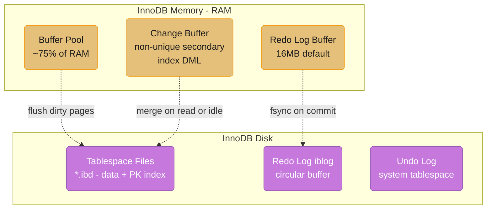
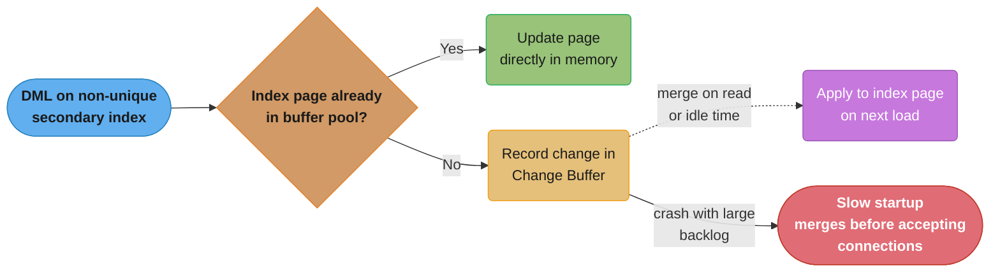
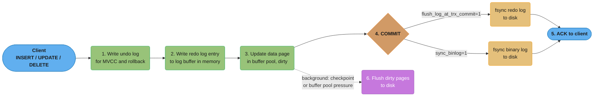
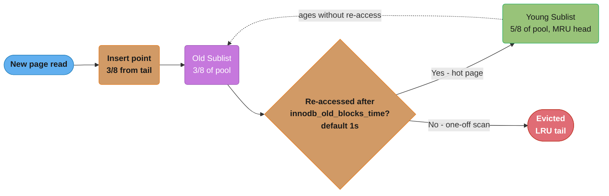
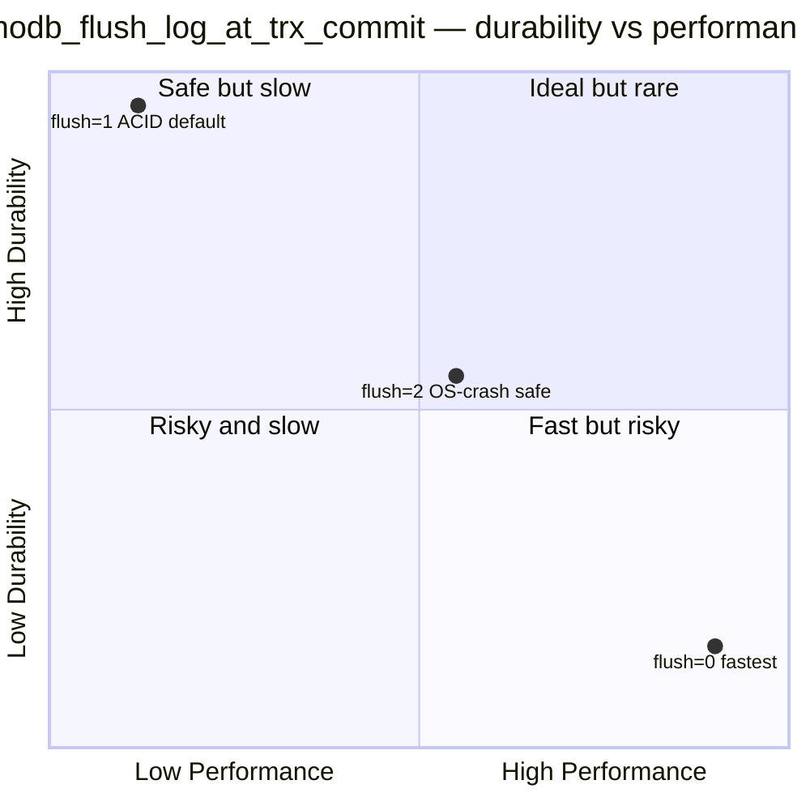
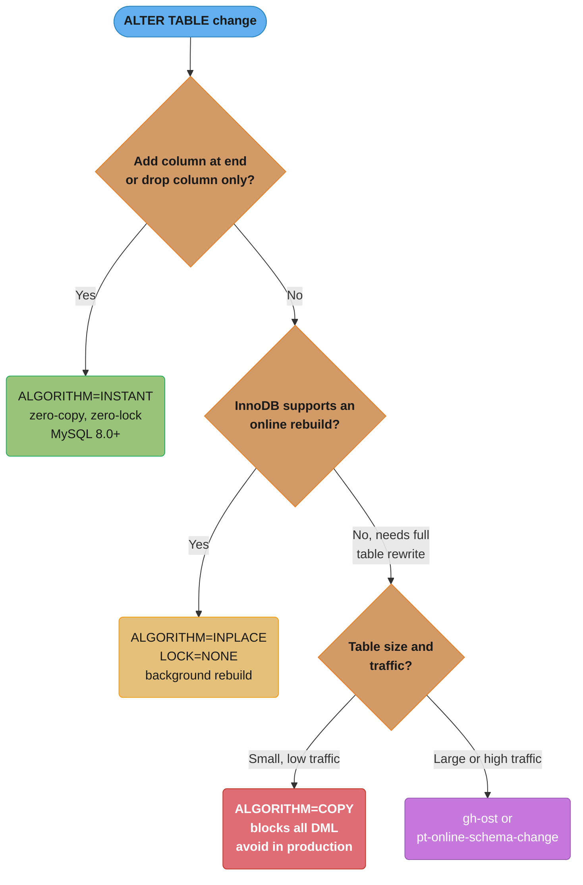

# MySQL InnoDB Internals

## 1. Concept Overview

InnoDB is MySQL's default storage engine since MySQL 5.5. It provides full ACID compliance, MVCC, row-level locking, foreign key enforcement, and crash recovery. Understanding InnoDB's internal architecture — especially its dual-log design, clustered index structure, and buffer pool mechanics — is essential for optimizing MySQL performance and diagnosing production issues.

---

## 2. Intuition

InnoDB's design philosophy: make writes durable and fast while enabling concurrent reads. Two logs serve distinct purposes: the redo log ensures crash recovery (what happened), the undo log enables MVCC and rollback (what it was before). The clustered index makes the primary key the physical data store — secondary indexes are just pointers back to the primary key.

- **Key insight**: The InnoDB buffer pool is the most important tuning parameter — it should hold the entire working set. Everything else flows from whether your data fits in memory.

---

## 3. Core Principles

### InnoDB Architecture


InnoDB splits its footprint into an in-memory tier (buffer pool, redo log buffer, change buffer) and a durable on-disk tier (tablespace files, circular redo log, undo log); the dotted edges are the background flush and merge paths that move data from memory to disk.

---

## 4. Types / Architectures / Strategies

### Clustered vs Secondary Indexes

InnoDB organizes all data in a clustered index (B+tree keyed on primary key):

```
Primary Key Clustered Index:
        [20 | 50]                    ← Internal node
       /         \
  [10,15,20]    [30,40,50]           ← Leaf nodes contain FULL ROW DATA
  (id=10, name=A, ..., email=X)

Secondary Index (on email column):
     [B@x.com | F@x.com]
    /                   \
[A@x.com,pk=10]     [G@x.com,pk=30]  ← Leaf nodes contain PK value
                                        (not the full row)
```

Secondary index lookup = two B+tree traversals:
1. Secondary index → get PK value
2. Clustered index → get full row (if not a covering index)

Implications:
- PRIMARY KEY should be small (INT vs UUID v4) — its size is duplicated in every secondary index leaf
- Natural clustered order (sequential PKs) avoids random insert fragmentation
- UUID v4 primary keys cause random B+tree inserts → ~80% buffer pool miss rate vs sequential PKs

### Redo Log vs Undo Log

**Redo Log** (iblogfile0, iblogfile1 in MySQL 5.7; auto-managed in MySQL 8):
- Circular buffer on disk
- Stores physical changes: "page N, offset O: change bytes X to Y"
- Purpose: crash recovery — replay redo log to restore committed changes
- Write path: changes written to redo log buffer in memory, flushed to disk on commit (`innodb_flush_log_at_trx_commit`)

**Undo Log**:
- Stores logical inverse operations: "row was: (id=1, balance=500)"
- Purpose: (1) ROLLBACK — apply undo records to revert changes. (2) MVCC — provide old row versions to readers
- Stored in the system tablespace or separate undo tablespaces (MySQL 8)

```
UPDATE accounts SET balance = 600 WHERE id = 1;
-- Redo log records: "page 42, slot 3: balance=600" (physical, for crash recovery)
-- Undo log records: "id=1 balance was 500" (logical, for rollback and MVCC readers)
```

### Binary Log vs Redo Log

Two completely separate logs with different purposes:

| Feature | Redo Log | Binary Log |
|---------|----------|------------|
| Format | Physical (page changes) | Logical (SQL statements or row events) |
| Scope | Per-InnoDB recovery | MySQL server level (all engines) |
| Purpose | Crash recovery | Replication, point-in-time recovery |
| Rotation | Circular (fixed size) | Sequential files (rotate by size/time) |
| Controlled by | `innodb_flush_log_at_trx_commit` | `sync_binlog` |

For full durability (ACID), both must be synced to disk on commit:
- `innodb_flush_log_at_trx_commit = 1` (sync redo log per commit)
- `sync_binlog = 1` (sync binary log per commit)

Both `=1` is slowest but safest. Common tradeoff: set both to 0 or 2 for higher performance with risk of 1-second data loss on crash.

### Change Buffer

InnoDB defers writes to non-unique secondary index pages that are not in the buffer pool. Instead of loading the page from disk, it records the change in the change buffer. The change buffer is merged to disk lazily (during buffer pool eviction or idle time). This reduces random I/O for write-heavy workloads.

Risk: large change buffer outstanding on crash → long recovery time.


A page not resident in the buffer pool gets its change deferred into the Change Buffer instead of triggering a random disk read; the deferred entries are merged lazily, which is exactly why an 8GB outstanding change buffer (see Real-World Examples) can turn a crash restart into a 45-minute merge before MySQL accepts connections.

---

## 5. Architecture Diagrams

**InnoDB Write Path**


The redo log (and binlog) are fsynced synchronously before the client is ACKed, while dirty data pages are flushed to disk lazily in the background — the gap between these two paths is exactly what `innodb_flush_log_at_trx_commit` and the background flusher are tuning.

**InnoDB Buffer Pool LRU**


New pages enter mid-list (3/8 from the tail) rather than at the MRU head; only pages re-touched after `innodb_old_blocks_time` (default 1s) get promoted to the young sublist, so a full table scan's pages age out of the old sublist without ever evicting genuinely hot data.

**In plain terms.** "Give every newly-read page a probation cell that is 3/8 of the pool
big, and only let it into the 5/8 penthouse if it is still being asked for a second
later." The split is a scan-resistance budget: the old sublist is deliberately sized
large enough to absorb a burst of one-off reads, and small enough that those reads can
never reach the young sublist where the working set lives.

| Symbol | What it is |
|--------|------------|
| `innodb_buffer_pool_size` | Total pool bytes. The 3/8 + 5/8 split partitions exactly this |
| Old sublist (3/8) | Probation area. Every freshly-read page lands at its head |
| Young sublist (5/8) | The hot working set, MRU-ordered. Promotion target |
| `innodb_old_blocks_pct` | Old-sublist percentage. Default 37, which is where 3/8 comes from |
| `innodb_old_blocks_time` | Milliseconds a page must survive in old before a re-touch promotes it. Default 1000 |

**Walk one example.** The 24GB pool from the §14 case study, pages 16KB each:

```
  innodb_buffer_pool_size            = 24 GB
  old sublist   = 24 x 3/8           =  9 GB
  young sublist = 24 x 5/8           = 15 GB

  pages the old sublist can hold     =  9 GB / 16 KB = 589,824 pages

  full table scan reads 200,000 pages, touches each once, <1s apart
    -> all 200,000 land in old, none survive innodb_old_blocks_time
    -> none promoted; they evict only each other
    -> young sublist: 15 GB untouched, working set intact
```

589,824 probation slots against a 200,000-page scan is the whole point: the scan cannot
even fill its own sublist, so it never reaches the 15GB of genuinely hot pages. Drop
`innodb_old_blocks_time` to 0 and every one of those 200,000 pages promotes on its
second touch — the young sublist is flushed out and the buffer pool hit rate collapses
the moment a nightly report runs.

---

## 6. How It Works — Detailed Mechanics

### innodb_flush_log_at_trx_commit Settings


Plotting the three settings on a durability-vs-performance plane makes the tradeoff explicit: `=1` buys full ACID durability at the cost of an fsync per commit, `=0` is fastest but risks up to a second of committed data on any crash, and `=2` splits the difference — surviving a mysqld crash but not a hardware failure.

For replicated setups with sync binlog: use `=2` on replicas (binlog is authoritative), `=1` on primary.

### InnoDB Row Formats

Four row formats:
- `REDUNDANT`: Legacy, stores column lengths twice. Largest row size.
- `COMPACT`: Default before MySQL 5.7. 20% less space than REDUNDANT.
- `DYNAMIC` (MySQL 5.7+ default): Large BLOB/TEXT stored fully off-page. Better for long columns.
- `COMPRESSED`: Like DYNAMIC but page-level compression (KEY_BLOCK_SIZE). CPU cost.

```sql
CREATE TABLE t (id INT, data TEXT)
ROW_FORMAT=DYNAMIC;  -- Modern default

-- Check format:
SELECT name, row_format FROM information_schema.innodb_tables
WHERE name LIKE '%your_table%';
```

### Online DDL Algorithms

```sql
-- INSTANT (MySQL 8.0+): Zero-copy, zero-lock
-- Supported: ADD COLUMN at end, DROP COLUMN (metadata-only)
ALTER TABLE t ADD COLUMN new_col INT DEFAULT 0, ALGORITHM=INSTANT;
-- Returns immediately for any table size

-- INPLACE: Background rebuild, no full copy
-- Allows concurrent DML during rebuild
ALTER TABLE t ADD INDEX idx_email (email), ALGORITHM=INPLACE, LOCK=NONE;
-- Requires: table must be accessible; uses internal rebuilding

-- COPY (slowest, avoid in production):
-- Copies entire table to new table, swaps atomically
-- Blocks all DML for duration
ALTER TABLE t MODIFY COLUMN name VARCHAR(500), ALGORITHM=COPY;
-- For large tables: use gh-ost or pt-online-schema-change instead
```


MySQL 8's `ALGORITHM=INSTANT` handles simple metadata-only changes with zero copying and zero locking; anything needing a rebuild falls back to `INPLACE` (online, no full copy) or, for large or high-traffic tables, an external tool like gh-ost that tails the binlog instead of taking a lock.

### GTID-Based Replication

Global Transaction Identifiers (GTID = server_uuid:transaction_id) uniquely identify each transaction across all MySQL servers. Benefits: automatic replication failover (replica knows which transactions it has applied), no need to specify binlog file/position.

```sql
-- Enable:
gtid_mode = ON
enforce_gtid_consistency = ON

-- Set up replica:
CHANGE REPLICATION SOURCE TO
    SOURCE_HOST='primary-host',
    SOURCE_USER='repl',
    SOURCE_AUTO_POSITION=1;  -- Use GTIDs, not file/position

-- Check GTID state:
SHOW REPLICA STATUS\G
-- Executed_Gtid_Set: shows all applied GTIDs
-- Retrieved_Gtid_Set: shows all received GTIDs
```

---

## 7. Real-World Examples

- **UUID PK performance**: A startup switched from INT AUTO_INCREMENT to UUID v4 as primary key (for distributed ID generation). Write throughput dropped 60%, buffer pool hit rate dropped from 99% to 75%. Root cause: random UUID inserts scattered across the entire clustered index. Fix: switched to ULIDv2 (time-ordered UUID) — first 48 bits are timestamp, so inserts are sequential. Performance recovered.
- **redo log too small**: MySQL 5.7 default redo log = 48MB. A transaction writing a 60MB BLOB to a single row exceeded the redo log size limit. MySQL crashed with "InnoDB: mtr_commit(): Log buffer size too small". Fix: increase `innodb_log_file_size = 1GB` (or use MySQL 8's auto-sizing).
- **Change buffer causing slow startup**: After a power failure, a server had 8GB of pending change buffer entries. MySQL startup took 45 minutes as it merged the change buffer before accepting connections. Fix: `innodb_change_buffer_max_size = 10` (10% of buffer pool, down from 25%) to limit change buffer growth.

---

## 8. Tradeoffs

| Configuration | Durability | Performance | Use Case |
|--------------|-----------|-------------|---------|
| `flush_log=1, sync_binlog=1` | Full ACID | Slowest | Production primary, financial |
| `flush_log=2, sync_binlog=1` | OS-crash safe | 2x faster | Production primary with risk tolerance |
| `flush_log=0, sync_binlog=0` | Lossy (up to 1s) | Fastest | Dev/analytics replicas |

---

## 9. When to Use / When NOT to Use

**Use InnoDB when**: ACID compliance required, foreign keys, row-level locking, MVCC reads, mixed read/write workloads — this should be the default for all production MySQL tables.

**Use MyISAM when**: read-only tables where no crash recovery is needed, full-text search (MySQL 5.6 and below). In MySQL 8, MyISAM is deprecated for most use cases. InnoDB has full-text search support since MySQL 5.6.

**Consider alternatives when**: write throughput > 200K/s sustained (consider Cassandra), complex joins across many tables on petabyte scale (consider ClickHouse for analytics).

---

## 10. Common Pitfalls

**Pitfall 1: Redo log too small causes I/O spikes**
When `innodb_log_file_size=48MB` (MySQL 5.7 default) and write rate is 30MB/s, the redo log fills every 1.6 seconds, triggering an emergency checkpoint (flush all dirty pages). This creates I/O spikes every 1-2 seconds. Fix: `innodb_log_file_size=1GB`. Requires MySQL restart. MySQL 8 automatically sizes the redo log.

**What this actually says.** "The redo log is a fixed-size tape running in a circle, and
`log size / write rate` is how many seconds you have before the write head laps the
checkpoint." Sizing the redo log is not a memory decision — it is a decision about how
much time you are giving the background flusher to get dirty pages onto disk before
InnoDB is forced to stop the world and flush them all at once.

| Symbol | What it is |
|--------|------------|
| `innodb_log_file_size` | Bytes per redo log file — the circumference of the tape |
| Write rate | Redo bytes generated per second by the workload, not row bytes |
| Wrap time | `log size / write rate`. Seconds of runway before the head laps the checkpoint |
| Checkpoint age | Redo bytes written but whose dirty pages are still unflushed |
| Sharp checkpoint | The emergency all-dirty-pages flush fired when checkpoint age approaches log size |

**Walk one example.** Same 30MB/s workload, three redo log sizes:

```
                  log size   write rate   wrap time = size / rate   verdict
  MySQL 5.7 default   48 MB    30 MB/s        1.6 s                stalls every 1-2 s
  bumped to          512 MB    30 MB/s       17.1 s                usable
  recommended fix   1024 MB    30 MB/s       34.1 s                flusher keeps up
```

Nothing about the write rate changed across those three rows — only the runway. The
21x jump from 1.6s to 34.1s is why the fix is a one-line config change rather than
faster disks: the flusher was never too slow, it was never given time.

**Pitfall 2: NOT NULL column without default requires table rebuild**
```sql
-- Broken (MySQL < 8): copies entire table
ALTER TABLE users ADD COLUMN phone_verified BOOLEAN NOT NULL DEFAULT FALSE;
-- For 500M rows: hours of downtime

-- Fix: Add nullable first, backfill, then add constraint
ALTER TABLE users ADD COLUMN phone_verified BOOLEAN DEFAULT NULL;
-- Backfill in batches: UPDATE users SET phone_verified=false WHERE id BETWEEN ... AND ...
-- Finally: ALTER TABLE users MODIFY phone_verified BOOLEAN NOT NULL DEFAULT FALSE;

-- MySQL 8 INSTANT DDL: many cases now instant
ALTER TABLE users ADD COLUMN phone_verified BOOLEAN DEFAULT FALSE, ALGORITHM=INSTANT;
```

**Pitfall 3: Semi-sync replication timeout causing sync replication on primary**
Semi-sync replication waits for at least one replica to acknowledge receipt of the binlog event. If the replica is slow or disconnected, the primary waits for `rpl_semi_sync_source_timeout` (default 10 seconds) before falling back to async. During those 10 seconds, every commit on the primary is delayed by 10 seconds — effectively freezing the database. Fix: reduce timeout, ensure replica network reliability, use GTID-based auto-failover.

**Pitfall 4: Missing index on foreign key column causes locking escalation**
In InnoDB, when a row in a parent table is deleted/updated, InnoDB scans all child rows to enforce the foreign key constraint. Without an index on the child table's FK column, this is a full table scan — and takes a shared lock on the entire child table for the duration. Fix: always index foreign key columns.

**Pitfall 5: Large transactions exhausting undo log space**
A batch job ran a single transaction deleting 50M rows. The undo log grew to 120GB (old row versions preserved for MVCC readers). This exceeded the system tablespace size. MySQL crashed with "cannot allocate undo log space." Fix: batch deletes with `DELETE FROM t WHERE id BETWEEN ... AND ... LIMIT 10000; COMMIT;` loop. Undo log for each batch is released at commit.

---

## 11. Technologies & Tools

| Tool | Purpose |
|------|---------|
| `SHOW ENGINE INNODB STATUS` | Buffer pool hit rate, redo log utilization, lock waits, deadlock history |
| `performance_schema.data_locks` | Current row locks (MySQL 8) |
| `information_schema.INNODB_TRX` | Active transactions, lock waiting |
| `pt-online-schema-change` | Online table rebuilds for MySQL 5.x |
| `gh-ost` | GitHub's online schema change tool — no triggers, safer than pt-osc |
| `mysqlcheck` | Table analysis and repair |
| `Percona XtraBackup` | Hot backup (no table locks) for InnoDB |
| `MySQL Workbench` | Visual query plan (EXPLAIN) |
| `ProxySQL` | Connection pooling, query routing, read/write split |
| `Vitess` | Horizontal sharding layer over MySQL |

---

## 12. Interview Questions with Answers

**Q: Why does InnoDB have two separate logs (redo and undo)?**
They serve orthogonal purposes. The redo log ensures committed writes survive crashes: it records physical page changes and is replayed during crash recovery to restore committed transactions. The undo log enables rollback and MVCC: it records the logical inverse of each operation ("balance was 500") so transactions can be reverted and old row versions can be served to concurrent readers without blocking. Redo is forward-looking (what to apply after crash), undo is backward-looking (what to revert or show old state). Combining them would complicate both recovery and MVCC garbage collection.

**Q: What is the performance impact of innodb_flush_log_at_trx_commit=1 vs 2?**
`=1` (default): every commit triggers an fsync of the redo log buffer to disk. An fsync on HDD takes 1-10ms; on NVMe SSD, 0.05-0.3ms. At 1000 TPS, this adds 50-10,000ms of I/O per second. `=2`: every commit flushes to OS page cache (no fsync); fsync happens once per second. This means the OS can batch multiple writes, dramatically reducing I/O — typically 2-5x higher throughput. Durability difference: `=1` guarantees zero data loss on any crash (hardware included). `=2` loses up to 1 second of commits on hardware failure, but not on mysqld crash (OS cache survives). For most applications, `=2` with `sync_binlog=1` provides good balance: MySQL crash-safe via binlog, hardware-crash loses at most 1s.

**Q: How does the InnoDB buffer pool LRU work with young and old sublists?**
The buffer pool is split: young sublist (5/8 of pool) for frequently accessed pages, old sublist (3/8) for recently accessed pages. New pages are inserted at the midpoint (start of old sublist) rather than the head. A page stays in the old sublist for at least `innodb_old_blocks_time` (default 1 second). If it's accessed again within that second, it stays in old (not promoted). If accessed after 1 second (genuine "hot" page), it's promoted to the young sublist head. This protects hot pages from large sequential scans: a full table scan loads thousands of pages into the old sublist, they're accessed once each (<1s apart), so they never pollute the young sublist.

**Q: What is a gap lock in InnoDB and how does it prevent phantom reads?**
A gap lock locks the range between two index values, preventing inserts into that range. At REPEATABLE READ isolation: `SELECT * FROM t WHERE id BETWEEN 10 AND 20 FOR UPDATE` locks: the gap before 10, records 10-20, and the gap after 20. No other transaction can INSERT id=15 or id=22 until this lock is released. This prevents phantom reads: re-executing the same range query in the same transaction returns the same set of rows. Gap locks don't exist at READ COMMITTED — that isolation level accepts phantom reads in exchange for better INSERT concurrency.

**Q: How does InnoDB's MVCC provide read consistency without blocking?**
Each transaction starts with a view (snapshot) of committed data. The view is defined by the "read view": a set of active (uncommitted) transaction IDs at snapshot time. When reading a row, InnoDB checks the row's trx_id against the read view: if the row was created by a transaction committed before the snapshot, it's visible; if created by an active or future transaction, InnoDB traverses the undo log chain to find the last version that was committed before the snapshot. Readers never acquire locks and never block writers. Writers don't block readers. This is why InnoDB can sustain high read concurrency — each reader gets a consistent snapshot view without locking.

**Q: What is the difference between MySQL binary log and InnoDB redo log?**
Binary log: MySQL server-level log, records all data changes (INSERT/UPDATE/DELETE) in statement or row format. Used for replication (shipped to replicas) and PITR (point-in-time recovery by replaying binlog events after a base backup restore). Sequential files, not circular. InnoDB redo log: engine-level circular log recording physical page changes (byte-level). Used for crash recovery only — on startup, replays uncommitted redo records to restore state. Not used for replication. Not human-readable. The two are separate and must both be flushed for full ACID: `innodb_flush_log_at_trx_commit=1` for redo log, `sync_binlog=1` for binary log.

**Q: How does gh-ost perform online schema changes without taking table locks?**
gh-ost (GitHub's Online Schema Change) works by: (1) Creating a new shadow table with the desired schema. (2) Setting up a binary log listener to capture changes to the original table. (3) Copying rows from original to shadow in batches (low-priority). (4) Applying binlog events (new INSERTs/UPDATEs/DELETEs) to the shadow table in real-time. (5) When shadow table catches up to original (within a few seconds), performing an atomic table swap: `RENAME TABLE original TO original_del, shadow TO original`. The swap requires a brief metadata lock (milliseconds), not a full table lock. Unlike `pt-online-schema-change` which uses triggers (risky for high-write tables), gh-ost uses binlog tailing — safer and lower overhead.

**Q: What is the purpose of the InnoDB change buffer?**
The change buffer is an area in the buffer pool that caches changes to non-unique secondary index pages that are not currently in memory. Without the change buffer, every secondary index update would require reading the index page from disk (random I/O), updating it, and writing it back. With the change buffer, the update is recorded in memory and the actual index page update is deferred until the page is next read into the buffer pool (merge on read). This reduces random I/O for write-heavy workloads. Limitation: only non-unique indexes (InnoDB cannot determine if a unique constraint is violated without reading the index page). If the buffer pool is large enough to contain all frequently accessed index pages, the change buffer provides minimal benefit.

**Q: What is GTID replication and why is it preferred over binlog file/position replication?**
GTID (Global Transaction Identifier) replication assigns a unique ID (source_server_uuid:transaction_number) to every committed transaction. Benefits: (1) No need to specify binlog file and position during replication setup — replica uses `SOURCE_AUTO_POSITION=1` and MySQL figures out what's been applied. (2) Failover is simpler: promoting a replica requires no manual binlog position calculation — just point other replicas to the new primary and they auto-detect their GTID position. (3) Safety: GTID prevents replaying the same transaction twice (idempotent). (4) Monitoring: easily see replication lag by comparing GTID sets. Limitation: all statements in a transaction must be binlog-compatible with GTIDs (no non-transactional temporary tables mixed with transactional operations).

**Q: How do you perform a zero-downtime column type change in MySQL?**
A direct `ALTER TABLE t MODIFY COLUMN name VARCHAR(200)` (expanding size) may be INSTANT in MySQL 8 for some operations, or may require INPLACE (online) or COPY (blocking). For changes requiring table rebuild (type change from INT to BIGINT): use gh-ost or pt-online-schema-change. Example with gh-ost: `gh-ost --alter="MODIFY COLUMN user_id BIGINT NOT NULL" --table=users --database=mydb --execute`. gh-ost creates shadow table, copies rows, applies binlog changes in parallel, then swaps — total time proportional to table size but no downtime. Monitor with `gh-ost --status-interval=30`.

**Q: What happens when the InnoDB redo log runs out of space?**
The redo log is a fixed-size circular buffer. If dirty pages are not flushed fast enough, the write position circles around to the checkpoint position — the oldest committed changes are still in the redo log because their pages haven't been flushed to disk yet. InnoDB must trigger a "sharp checkpoint": flush all dirty pages immediately before the redo log position wraps. This causes a massive I/O spike and can stall all writes for seconds. Prevention: set redo log large enough (`innodb_log_file_size = 1-4GB` in MySQL 5.7) to give the background flusher time to flush dirty pages before the log wraps. MySQL 8 automatically sizes the redo log based on write throughput.

**Q: How does InnoDB handle concurrent INSERTs and what is the auto-increment lock?**
MySQL 8 default `innodb_autoinc_lock_mode=2` (interleaved): AUTO_INCREMENT values are allocated without table-level locks using a lightweight mutex. Concurrent INSERT statements get non-overlapping ranges of auto-increment values instantly. Gaps in auto-increment values can occur (e.g., a batch INSERT gets IDs 100-200, another gets 201-300, but the first rollsback — gap at 100-200). For statement-based replication, mode=2 requires row-based binlog (not statement-based), otherwise non-deterministic. MySQL 5.7 default was mode=1 (sequential for single-row inserts, table lock for bulk inserts). Always use mode=2 with row-based replication for best performance.

**Q: What is the InnoDB buffer pool instance and why use multiple instances?**
`innodb_buffer_pool_instances` (default 8 for buffer pool >= 1GB): splits the buffer pool into N separate instances, each with its own LRU list, mutex, and flush threads. Benefit: reduces lock contention on the global buffer pool mutex at high concurrency. Each access to the buffer pool takes a mutex on the corresponding instance (keyed by page address). With 1 instance, all threads contend for one mutex — bottleneck at >16 concurrent connections. With 8 instances, contention is 8x lower. Recommendation: 1 instance per 1GB of buffer pool, up to the number of CPU cores.

**Q: Explain InnoDB's doublewrite buffer and when you can disable it.**
The doublewrite buffer is a sequential area in the system tablespace where InnoDB writes complete 16KB pages before writing them to their actual locations. This prevents "torn pages": if a crash occurs during the 16KB page write (OS writes in 4KB chunks), the doublewrite copy is intact and used for recovery. Disable safely when: using enterprise SSDs or NVMe drives with "power-loss data protection" (PLP) — battery-backed write cache or capacitor ensures in-flight writes complete even on power failure. Disable with `innodb_doublewrite=OFF`. Performance gain: ~5-10% write throughput improvement. Never disable on consumer SSDs without PLP.

**Q: What is the InnoDB locking model at REPEATABLE READ vs READ COMMITTED?**
REPEATABLE READ (default): uses record locks + gap locks + next-key locks. Gap locks prevent phantom reads by blocking INSERTs in locked ranges. Semi-consistent reads for UPDATE/DELETE (reads a fresh committed version, not the snapshot version, before acquiring the row lock). READ COMMITTED: only record locks (no gap locks, no next-key locks). Better INSERT concurrency. Allows phantom reads (same range query can return different rows if another transaction committed between reads). Semi-consistent reads for all DML. For applications that never re-read the same range within a transaction, READ COMMITTED is often preferred for better concurrency. OLAP/reporting connections on replicas typically use READ COMMITTED.

---

## 13. Best Practices

1. Set `innodb_buffer_pool_size = 70-80% of available RAM`. This is the single most impactful setting.
2. Set `innodb_flush_log_at_trx_commit = 1` and `sync_binlog = 1` for full ACID on primary.
3. In MySQL 8, rely on automatic redo log sizing; in MySQL 5.7 set `innodb_log_file_size = 1GB+`.
4. Use `BIGINT AUTO_INCREMENT` primary keys for InnoDB tables, not UUID v4.
5. Index all foreign key columns to avoid lock escalation on parent DELETE.
6. Use gh-ost for online schema changes on tables > 10GB.
7. Use GTID replication with `binlog_format=ROW` for reliable failover.
8. Monitor `SHOW ENGINE INNODB STATUS` — watch redo log utilization and buffer pool hit rate.
9. Use PgBouncer-equivalent ProxySQL for connection pooling — avoid > 500 connections to MySQL.
10. Enable `slow_query_log = 1` with `long_query_time = 0.1` (100ms) and analyze with pt-query-digest.

---

## 14. Case Study

**Scenario**: A MySQL 5.7 production database (32GB RAM, `innodb_buffer_pool_size=24GB`) serving a marketplace application receives reports of 500ms+ query latency during peak hours (3-5 PM daily). Off-peak latency is 5ms.

**Diagnosis**:
```sql
-- Buffer pool hit rate:
SHOW GLOBAL STATUS LIKE 'Innodb_buffer_pool_read%';
-- Innodb_buffer_pool_reads: 15420 (disk reads, bad)
-- Innodb_buffer_pool_read_requests: 180000
-- Hit rate: (180000 - 15420) / 180000 = 91.4% -- OK

-- Redo log utilization:
SHOW ENGINE INNODB STATUS\G
-- Log sequence number: 82540000000
-- Log flushed up to: 82540000000
-- Pages flushed up to: 81290000000  ← 1.25GB of dirty data
-- Last checkpoint at: 80540000000   ← redo log contains 2GB of unflushed changes
-- innodb_log_file_size: 100MB (WAY too small!)
-- Checkpoint age: 2GB >> redo log size (200MB) → emergency checkpoints firing constantly

-- Checkpoint events:
SHOW GLOBAL STATUS LIKE 'Innodb_checkpoint%';
-- Innodb_checkpoint_age: huge value relative to log size
```

**Read it like this.** Two independent ratios are being computed in that diagnosis block,
and only one of them is the problem. The hit rate asks "what fraction of page requests
were served from RAM"; the checkpoint age asks "how far ahead of the flusher has the redo
writer run". The first comes back healthy, which is what makes the second the answer.

| Symbol | What it is |
|--------|------------|
| `Innodb_buffer_pool_read_requests` | Total logical page requests. The denominator |
| `Innodb_buffer_pool_reads` | The subset that missed and went to disk |
| Hit rate | `(requests - reads) / requests`. Fraction served from RAM |
| Log sequence number (LSN) | A monotonic byte counter of everything ever written to the redo log |
| Checkpoint age | `LSN - last checkpoint LSN`. Redo bytes whose pages are still dirty |

**Walk one example.** Push the two sets of numbers through side by side:

```
  hit rate
    requests                        = 180,000
    disk reads (misses)             =  15,420
    hits = 180,000 - 15,420         = 164,580
    hit rate = 164,580 / 180,000    = 0.9143 = 91.4 %      healthy, not the bottleneck

  checkpoint age
    log sequence number             = 82,540,000,000
    pages flushed up to             = 81,290,000,000
    last checkpoint at              = 80,540,000,000

    dirty but unflushed  = 82,540,000,000 - 81,290,000,000 = 1.25 GB
    checkpoint age       = 82,540,000,000 - 80,540,000,000 = 2.00 GB
    redo capacity        = 2 files x 100 MB                = 0.20 GB

    ratio = 2.00 GB / 0.20 GB = 10x over capacity          the actual bug
```

A checkpoint age 10x larger than the entire redo log means InnoDB is firing a sharp
checkpoint continuously — it can never let the write head advance. That is why raising
`innodb_log_file_size` to 2G fixed a latency problem that a 91.4% hit rate said was not
a memory problem.

**Root cause**: `innodb_log_file_size=100MB` (non-default, manually set poorly). At peak write rate of 50MB/s, the redo log filled every 2 seconds, triggering emergency checkpoints — I/O spikes stalling all writes.

**Put simply.** The fix moves the wrap time from "shorter than a page flush" to "longer
than a peak-hour burst":

```
                      redo per file   peak write rate   wrap time = size / rate
  before                    100 MB         50 MB/s            2.0 s
  after  (innodb_log_file_size = 2G)      2048 MB   50 MB/s   41.0 s
```

A 20x larger log buys a 20x longer runway at the same 50MB/s. The background flusher
was already capable of clearing 1.25GB of dirty pages — it simply needed more than two
seconds in which to do it, which is why the maintenance window was 5 minutes and the
disks were never touched.

**Fix**:
```
# my.cnf changes:
innodb_log_file_size = 2G     # MySQL 5.7: requires restart + rename old iblogfiles
innodb_log_buffer_size = 64M  # More buffer for high-concurrency transactions
innodb_flush_method = O_DIRECT # Bypass OS page cache for buffer pool I/O (on Linux)

# Procedure:
1. SET GLOBAL innodb_fast_shutdown=0; (clean shutdown flushes dirty pages)
2. systemctl stop mysql
3. mv /var/lib/mysql/ib_logfile0 /tmp/
4. mv /var/lib/mysql/ib_logfile1 /tmp/
5. Edit my.cnf: innodb_log_file_size=2G
6. systemctl start mysql (creates new ib_logfile0/1 at 2GB)
7. Verify: SHOW ENGINE INNODB STATUS — checkpoint age should stay << log size
```

**Result**: Peak hour latency dropped from 500ms+ to 8ms. Emergency checkpoint I/O spikes: eliminated. Buffer pool hit rate: unchanged at 91% (not the bottleneck). The fix was a 5-minute maintenance window to resize the redo log.
