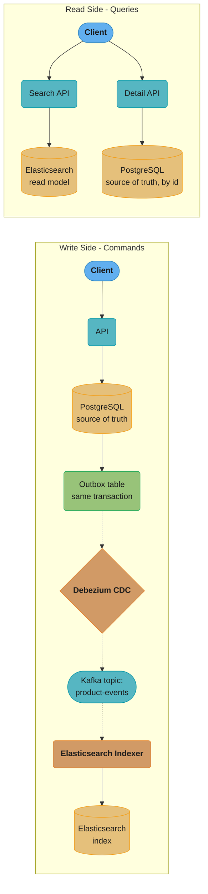
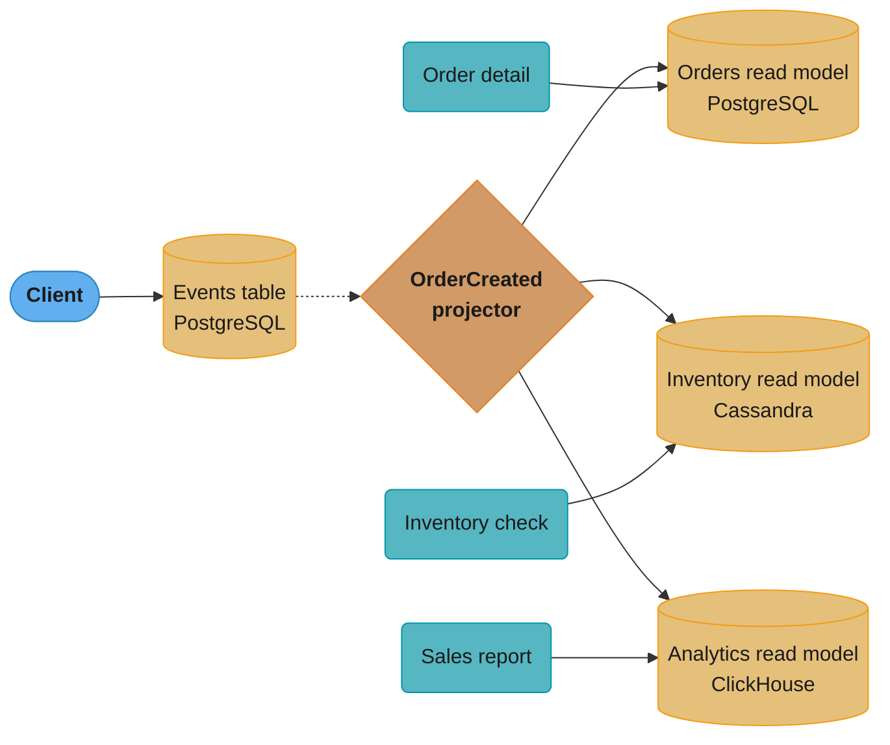
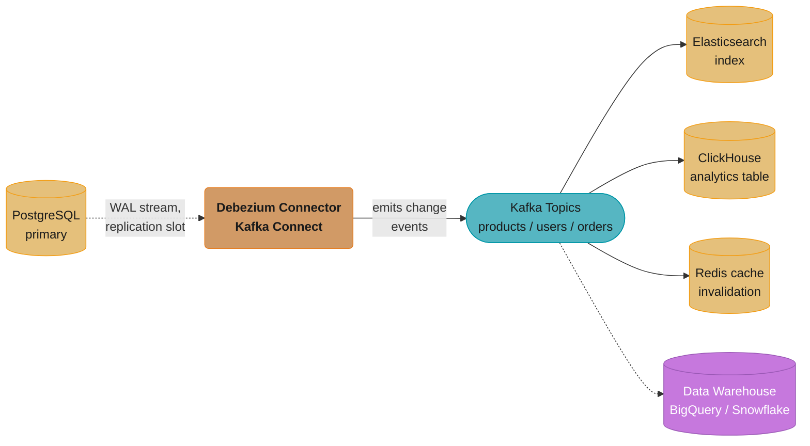
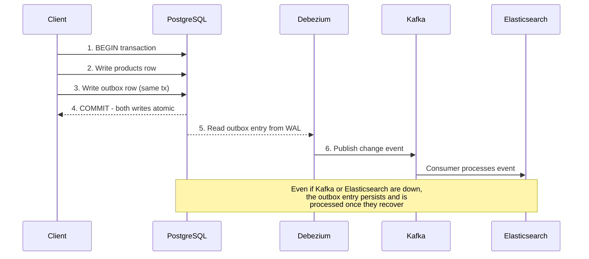
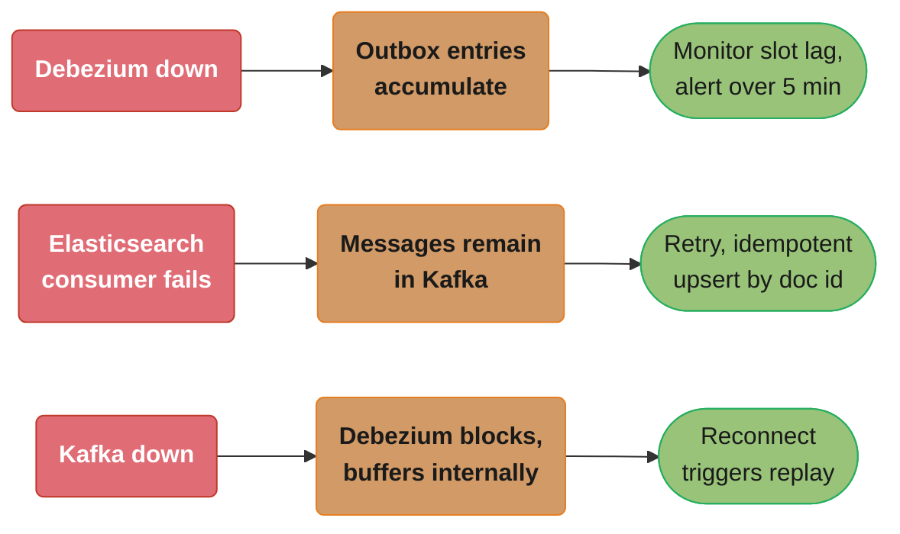
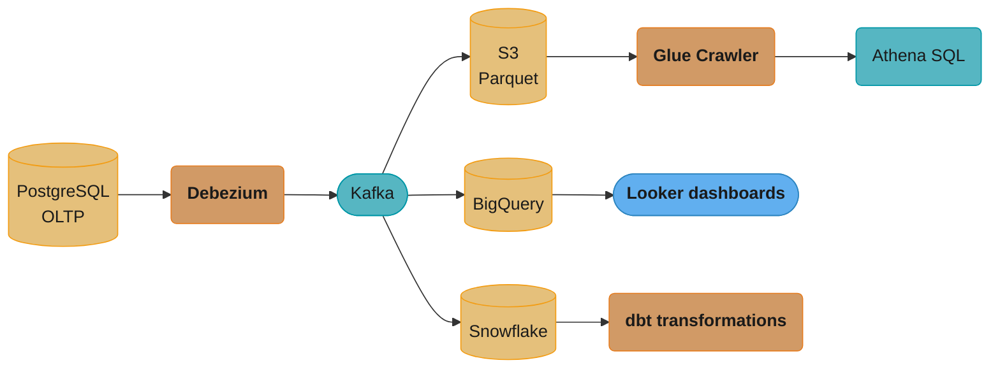
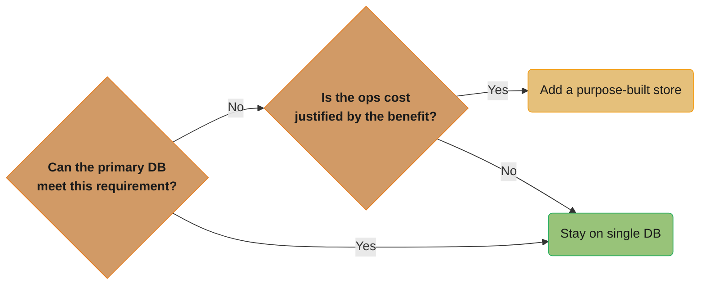
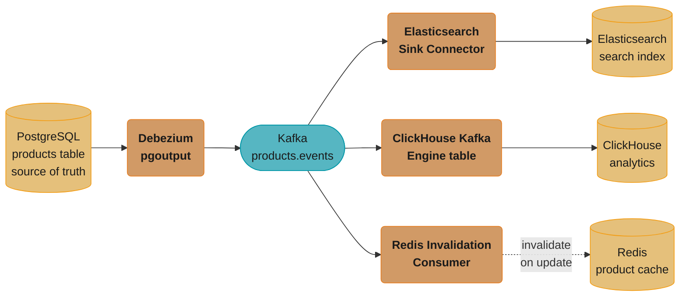
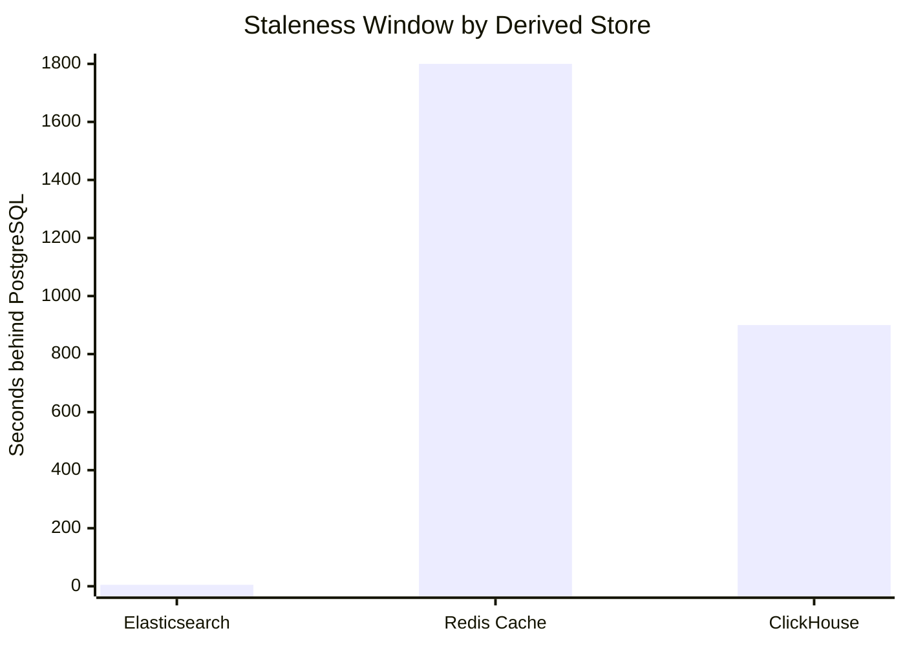

# Polyglot Persistence Patterns

## 1. Concept Overview

Polyglot persistence is the architectural pattern of using multiple purpose-built databases within the same system, choosing the optimal storage engine for each data type and access pattern. The term was coined by Martin Fowler: "application databases should be chosen for the type of data they store and the access patterns." A social feed, a product catalog, a search index, and a session store each have different access patterns — no single database optimally serves all four.

The central tension: each additional database increases system complexity (synchronization, consistency, operational overhead, monitoring), while providing performance or capability improvements. Polyglot persistence is the right answer for systems with genuinely different access patterns, and premature complexity for systems that have not yet exceeded what a single PostgreSQL can provide.

---

## 2. Intuition

Polyglot persistence is like a professional kitchen: different tools for different jobs — a chef's knife for cutting, a whisk for emulsifying, a mortar for grinding spices. Using one knife for everything is possible but suboptimal. The cost: you need space for multiple tools, you must learn each one, and cleaning them all takes longer. The benefit: each task is done optimally. The anti-pattern: buying 20 specialized tools when 5 would suffice, or buying a bread slicer on day one before you even know if bread will be on the menu.

---

## 3. Core Principles

**Source of truth isolation**: One database owns each entity as its source of truth. Other databases hold projections (read models) derived from the source of truth. Write to the source of truth; read from the projection optimized for the access pattern.

**Eventual consistency window**: Any derived read model is eventually consistent with the source of truth. The replication lag (milliseconds to seconds via CDC) is the consistency window. Applications must tolerate this window or design around it.

**CDC as the synchronization backbone**: Change Data Capture (Debezium) tailing the WAL is the most reliable mechanism for propagating changes from the primary store to derived stores — lower latency than polling, no polling overhead, ordered delivery.

**Compensate for dual-write failure**: Writing to two databases simultaneously creates a risk: write A succeeds, write B fails. The outbox pattern (writing a change event to the same database as the business write) eliminates this risk.

---

## 4. Types / Architectures / Strategies

```
Pattern                    | Description                         | When to Use
---------------------------|-------------------------------------|------------------
CQRS + separate stores     | Write to RDBMS; project to search   | Different read/write patterns
Event sourcing + projections| Event store; derive read models      | Audit trail + multiple views
CDC pipeline               | DB changes → Kafka → consumers      | Sync without dual-write
Dual-write + outbox        | Write DB + outbox; relay publishes  | Guaranteed event delivery
Read cache pattern         | Redis cache in front of PostgreSQL  | Hot data, sub-ms reads
Search sidecar             | Elasticsearch alongside RDBMS       | Full-text + faceted search
Polyglot SaaS              | Different DB per tenant type        | Enterprise vs SMB tenants
```

---

## 5. Architecture Diagrams

**CQRS with PostgreSQL + Elasticsearch**



*Write path: the client's write lands in PostgreSQL plus an outbox row in the same transaction; Debezium tails the WAL and republishes the change onto Kafka, which an indexer applies to Elasticsearch. Read path: search queries hit the Elasticsearch projection while detail lookups go straight to PostgreSQL. Consistency window (Debezium lag): 100ms-2s depending on transaction size.*

**Event Sourcing + Multiple Read Models**



*Every write appends an immutable event to the PostgreSQL events table; a CDC projector fans the `OrderCreated` event out to three purpose-built read models. Because the event log is the source of truth, any projection can be rebuilt from scratch by replaying it from the beginning.*

**CDC Pipeline with Debezium**



*Debezium tails PostgreSQL's WAL through a logical replication slot and emits change events onto per-table Kafka topics; independent sink connectors fan those events out to Elasticsearch, ClickHouse, Redis, and a downstream data warehouse.*

---

## 6. How It Works — Detailed Mechanics

### CQRS with Separate Read/Write Stores

CQRS (Command Query Responsibility Segregation) separates the write model (command side — handles state changes) from the read model (query side — optimized for read access patterns). In polyglot persistence, each side can use a different database.

```java
// Write side: transactional, PostgreSQL
@Service
@Transactional
public class ProductCommandService {

    public Product updateProduct(long productId, UpdateProductRequest req) {
        Product product = productRepo.findById(productId).orElseThrow();
        product.update(req);
        Product saved = productRepo.save(product);

        // Outbox event in same transaction — guarantees event will be published
        outboxRepo.save(OutboxEvent.productUpdated(saved));

        return saved;
    }
}

// Read side: Elasticsearch for search, PostgreSQL for detail
@Service
public class ProductQueryService {

    public SearchResult search(SearchRequest req) {
        // Elasticsearch: full-text, faceted, relevance-ranked
        return elasticsearchClient.search(req.toEsQuery(), ProductDocument.class);
    }

    public Product getById(long productId) {
        // PostgreSQL: canonical data, strongly consistent
        return productRepo.findById(productId).orElseThrow();
    }
}
```

### CDC with Debezium

Debezium connects to PostgreSQL as a logical replication client. It reads WAL changes and publishes them to Kafka topics.

```yaml
# Debezium PostgreSQL connector configuration
{
  "name": "products-connector",
  "config": {
    "connector.class": "io.debezium.connector.postgresql.PostgresConnector",
    "database.hostname": "postgres-primary",
    "database.port": "5432",
    "database.user": "debezium",
    "database.password": "${DEBEZIUM_PASSWORD}",
    "database.dbname": "mydb",
    "database.server.name": "mydb",

    "plugin.name": "pgoutput",
    "slot.name": "debezium_slot",
    "publication.name": "dbz_publication",

    "table.include.list": "public.products,public.orders",

    "transforms": "outbox",
    "transforms.outbox.type": "io.debezium.transforms.outbox.EventRouter",
    "transforms.outbox.table.field.event.id": "id",
    "transforms.outbox.table.field.event.key": "aggregate_id",
    "transforms.outbox.table.field.event.type": "event_type",
    "transforms.outbox.table.field.event.payload": "payload",
    "transforms.outbox.route.by.field": "aggregate_type",
    "transforms.outbox.route.topic.replacement": "${routedByValue}.events"
  }
}
```

```sql
-- PostgreSQL: create logical replication publication for Debezium
CREATE PUBLICATION dbz_publication FOR TABLE products, orders, outbox;

-- Create replication slot (Debezium manages this automatically, shown for clarity)
SELECT pg_create_logical_replication_slot('debezium_slot', 'pgoutput');
```

**Debezium ordering guarantees**:
- Within a table: changes are in commit order — no reordering
- Across tables: changes interleaved by commit time
- Message key = primary key → Kafka ensures ordering per key (same partition)
- At-least-once delivery: on restart, Debezium may re-emit events already published → consumers must be idempotent

### Dual-Write Problems and the Outbox Solution

**Dual-write without outbox (the failure mode)**

```mermaid
sequenceDiagram
    participant App as Client
    participant PG as PostgreSQL
    participant ES as Elasticsearch

    App->>PG: 1. Write product
    PG-->>App: SUCCESS
    App--xES: 2. Write product
    Note over ES: NETWORK TIMEOUT
    Note over PG,ES: PostgreSQL has the new product;<br/>Elasticsearch still has the stale one
```

*Result: the application serves search results inconsistent with reality. Fix today is a manual re-sync script - error-prone and manual.*

**Dual-write with the outbox pattern (the fix)**



*The outbox row commits atomically with the business write, so delivery is guaranteed even through downstream outages.*

**Failure modes and mitigations**



*Each failure mode is bounded by a concrete guardrail: WAL disk growth is capped with `max_slot_wal_keep_size`, Kafka retention absorbs consumer downtime, and Debezium's own buffer survives a Kafka outage.*

### Keeping PostgreSQL and Elasticsearch in Sync

```java
// Elasticsearch indexer consumer (Kafka Consumer)
@Component
public class ProductIndexer {

    @KafkaListener(topics = "products.events", containerFactory = "kafkaListenerFactory")
    public void onProductEvent(ProductEvent event) {
        switch (event.getType()) {
            case "ProductCreated", "ProductUpdated":
                ProductDocument doc = ProductDocument.from(event.getPayload());
                // Upsert: idempotent — safe to call multiple times for same event
                elasticsearchOps.index(IndexQuery.builder()
                    .id(String.valueOf(doc.getId()))
                    .object(doc)
                    .build());
                break;

            case "ProductDeleted":
                elasticsearchOps.delete(
                    String.valueOf(event.getAggregateId()),
                    ProductDocument.class
                );
                break;
        }
        // Commit Kafka offset (at-least-once delivery; upsert makes it idempotent)
    }
}
```

**Zero-downtime mapping change in Elasticsearch**:
```bash
# Cannot change an existing field's mapping (e.g., text → keyword)
# Use alias pattern:

# 1. Create new index with new mapping
curl -X PUT /products_v2 -d '{"mappings": {...new mapping...}}'

# 2. Reindex from old to new (run alongside production)
curl -X POST /_reindex -d '{
  "source": {"index": "products_v1"},
  "dest":   {"index": "products_v2"}
}'

# 3. Swap alias (atomic operation)
curl -X POST /_aliases -d '{
  "actions": [
    {"remove": {"index": "products_v1", "alias": "products"}},
    {"add":    {"index": "products_v2", "alias": "products"}}
  ]
}'

# 4. Application uses alias "products" — no code change needed for index version swap
# 5. Delete old index after validation
curl -X DELETE /products_v1
```

### GraphQL Federation over Polyglot Stores

```java
// GraphQL resolver: fetches from multiple databases
@Component
public class ProductResolver implements GraphQLQueryResolver {

    public Product product(long id) {
        // Canonical data from PostgreSQL
        return productRepository.findById(id).orElseThrow();
    }

    public SearchResult searchProducts(String query, List<String> facets) {
        // Search from Elasticsearch
        return productSearchService.search(query, facets);
    }
}

// DataLoader: batches N+1 calls into one MGET
@Component
public class ProductInventoryDataLoader {

    // Called once per GraphQL request batch, not per product
    public CompletableFuture<List<Integer>> loadInventory(List<Long> productIds) {
        // Single Redis MGET for all N product inventories
        return inventoryService.getBatch(productIds);
    }
}
```

### Data Mesh / Data Lake Integration



*Kafka fans CDC events out to three independent analytics paths - a Parquet data lake queried via Athena, BigQuery feeding Looker dashboards, and Snowflake feeding dbt transformations - so the OLTP database is never touched by analytics queries and the lake retains every historical change, not just current state. Ordering guarantee: Kafka partition key = primary key, giving per-record ordering. Exactly-once: Kafka Streams or Flink can deduplicate. Schema evolution: Confluent Schema Registry (Avro/Protobuf) manages schema changes.*

---

## 7. Real-World Examples

**LinkedIn**: Uses Espresso (document store), Galene (search), and Kafka (event streaming) in a polyglot architecture. Espresso is the primary store; Galene (built on Lucene) is the search read model; changes propagate via Databus (a CDC-like system predating Debezium).

**Shopify**: PostgreSQL (Vitess-sharded) as primary store; Elasticsearch for product search; Redis for sessions, rate limiting, and caching; Kafka for event streaming between services. Each is fed via CDC-like pipelines.

**Airbnb (Zipline)**: Their ML feature platform uses PostgreSQL for training data labels, Redis for online feature serving (sub-millisecond), and HDFS/Spark for offline feature computation. The same feature is available in different stores optimized for training vs inference.

**Confluent (the Debezium use case)**: Debezium + Kafka is the reference architecture for CDC-based polyglot persistence synchronization. Used by thousands of teams for PostgreSQL → Elasticsearch, PostgreSQL → data warehouse, and PostgreSQL → Redis pipelines.

---

## 8. Tradeoffs

```
Pattern              | Read Benefit          | Write Complexity  | Consistency
---------------------|----------------------|-------------------|------------------
Single DB (PG)       | None                  | None              | Strong
PG + Redis cache     | Sub-ms hot reads      | Cache invalidation| Eventual (TTL/event)
PG + Elasticsearch   | Full-text search      | Dual-write/CDC    | Eventual (sec-min)
PG + ClickHouse      | OLAP queries          | CDC pipeline      | Eventual (sec-min)
Event sourcing       | Rebuild any read model| Append-only easy  | Eventual per proj
Full polyglot        | Optimized per pattern | Very high         | Varies per pair
```

---

## 9. When to Use / When NOT to Use

**Use polyglot persistence when**: (1) Full-text search requirements cannot be met by PostgreSQL `tsvector` (complex relevance, facets, multi-field analysis). (2) Analytical queries over > 1B rows are too slow on OLTP store. (3) Sub-millisecond cache reads are required for hot data. (4) Time-series compression and retention reduce storage cost significantly.

**Do NOT use when**: (1) PostgreSQL with proper indexing and extensions handles all access patterns. (2) Team lacks expertise to operate additional databases. (3) Consistency requirements are strict and the eventual consistency window of CDC is unacceptable. (4) The system is early-stage — premature polyglot persistence creates maintenance burden before scale warrants it.

**Rule**: add a second database when a specific requirement cannot be met by the primary database with proper optimization, and when the operational cost of the second database is justified by the benefit.



*The rule above as a decision: only add a database when a requirement genuinely cannot be met by the primary store, and only when the operational cost of running it is worth the benefit.*

---

## 10. Common Pitfalls

**Elasticsearch as primary store**: Team stores products in Elasticsearch (no PostgreSQL). Benefits: amazing search. Problems: no ACID transactions, document update is replace-and-reindex (high write latency for small updates), shard corruption events lead to data loss, no foreign keys or referential integrity. Fix: PostgreSQL is primary; Elasticsearch is a read model.

**Debezium replication slot disk fill**: Elasticsearch consumer goes down for 4 hours during an incident. Debezium's replication slot accumulates 100GB of WAL on the PostgreSQL primary. Primary disk fills. PostgreSQL crashes. The fix for the incident (Elasticsearch down) cascades into a second incident (PostgreSQL down). Fix: `max_slot_wal_keep_size = 10GB` in PostgreSQL; monitor slot lag; alert at 5GB.

**Stale Elasticsearch causing customer support failures**: A product's price is updated in PostgreSQL. Debezium is 45 seconds behind (unusually high write load). Customer searches Elasticsearch and sees the old price. Customer calls support with the discrepancy. Fix: design the UI to fetch canonical price from PostgreSQL detail endpoint, using Elasticsearch only for discovery (list results). The detail page reads from the source of truth.

**Event schema breaking consumers**: The events table payload format changes (a field is renamed). Debezium republishes the renamed field. All downstream consumers expecting the old field name fail. Fix: use a schema registry (Confluent Schema Registry) with Avro schema evolution rules. Schema changes must be backward-compatible (add fields, do not rename or remove). Consumers should use tolerant reader pattern (ignore unknown fields).

**DataLoader N+1 in GraphQL federation**: A GraphQL resolver fetches a product (1 query) and then for each product fetches inventory (N queries). With 50 products, that's 51 database calls. Fix: use DataLoader (batching) to aggregate all inventory lookups into a single Redis MGET or a single SQL `WHERE id IN (...)` query. DataLoader deduplicates identical IDs and caches within a request.

---

## 11. Technologies & Tools

| Tool               | Purpose                                        |
|--------------------|------------------------------------------------|
| Debezium           | CDC from PostgreSQL/MySQL/MongoDB to Kafka      |
| Kafka Connect      | Kafka connectors ecosystem (source + sink)     |
| Confluent Schema Registry | Schema versioning for Avro/Protobuf events|
| Elasticsearch Sink | Kafka → Elasticsearch connector                |
| ClickHouse Sink    | Kafka → ClickHouse ingestion                   |
| Kafka Streams      | Stream processing for transformation/enrichment|
| Apache Flink       | Complex event processing, exactly-once CDC     |
| Airbyte            | Open-source data pipeline / ETL alternative   |
| Materialize        | Streaming SQL over CDC streams                 |
| DataLoader         | N+1 batching for GraphQL resolvers             |
| Temporal.io        | Durable workflow for complex synchronization   |

---

## 12. Interview Questions with Answers

**Q: How do you keep a PostgreSQL database and Elasticsearch index in sync?**
Use the outbox pattern + Debezium CDC: (1) Write business data and an outbox event to PostgreSQL in a single transaction. (2) Debezium tails the WAL and reads the outbox table via its EventRouter transform. (3) Debezium publishes change events to a Kafka topic (keyed by aggregate ID for ordering). (4) An Elasticsearch sink connector (or custom consumer) reads from Kafka and upserts documents into Elasticsearch. This guarantees at-least-once delivery (the outbox entry persists until the Kafka consumer processes it) and idempotency (Elasticsearch upsert with the same document ID is safe). Typical lag: 100ms–2s. For mapping changes, use the alias pattern: create a new index with the new mapping, reindex in the background, then atomically swap the alias.

**Q: What are the failure modes of dual-write and how do you fix them with CDC?**
Dual-write (write to DB then write to Elasticsearch) has three failure modes: (1) DB succeeds, Elasticsearch write fails → DB and Elasticsearch diverge. (2) Elasticsearch succeeds, DB write fails (rollback) → stale data in Elasticsearch. (3) Both succeed but in different orders due to network retries → out-of-order updates. CDC (via Debezium) fixes all three by making Elasticsearch a downstream consumer of the database WAL, not a simultaneous write target. The WAL is authoritative and ordered. Elasticsearch only receives events after the DB transaction commits. If Elasticsearch is unavailable, events buffer in Kafka; when it recovers, it processes events in order. Failure modes are reduced to: message redelivery (handled by idempotent upsert) and replication lag (bounded by Kafka retention and Debezium throughput).

**Q: How does the outbox pattern solve the dual-write problem?**
The dual-write problem is that two independent writes (DB + message broker) cannot be made atomic. If one fails, the system is inconsistent. The outbox pattern eliminates this by writing the message to the database's outbox table within the same transaction as the business write. Both the business data change and the message record are committed atomically by the database. A relay process (polling or CDC via Debezium) reads the outbox table and publishes to the message broker. The message is guaranteed to be published (eventually) as long as the relay is running, because the outbox row persists across process failures. The consumer must be idempotent to handle at-least-once delivery from the relay.

**Q: When would you use event sourcing instead of a regular database?**
Event sourcing stores all state changes as an immutable sequence of events rather than overwriting current state. Use it when: (1) Full audit trail of all state changes is required (financial ledger, medical records, compliance). (2) Temporal queries are needed (what was the state at time T?). (3) Multiple derived read models with different projections of the same events are needed (order list view, order analytics view, shipping view). (4) Event replay is required for debugging or testing. Do not use it when: team is unfamiliar with event sourcing (steep learning curve), simple CRUD operations are the primary use case (event sourcing adds overhead without benefit), and eventual consistency in read models is unacceptable for the business use case.

**Q: How do you handle schema evolution in an event-sourced system?**
Events are immutable once written — you cannot change old events. Schema evolution strategies: (1) Tolerant reader: consumers ignore unknown fields and handle missing fields with defaults. (2) Upcasting: when reading old events, a transformation layer (upcaster) converts them to the current schema before passing to the domain model. (3) Versioned events: `OrderCreatedV1`, `OrderCreatedV2` — consumers handle both versions. (4) Schema registry: Confluent Schema Registry enforces compatibility rules (BACKWARD_COMPATIBLE = new schema can read old messages; FORWARD_COMPATIBLE = old schema can read new messages). Most event sourcing systems use a combination: tolerant reader for minor changes, versioned events for breaking changes.

**Q: What is the Strangler Fig pattern applied to database migration?**
The Strangler Fig pattern (Martin Fowler) gradually replaces a legacy system by routing new functionality to a new system while keeping the old system for existing functionality. Applied to databases: (1) Identify the entity to migrate (e.g., product catalog from MySQL monolith to Elasticsearch + PostgreSQL). (2) Create the new system alongside the old. (3) New writes go to both systems (dual-write via outbox). (4) Gradually route read traffic from the old system to the new system (start with 1% using feature flags, ramp to 100%). (5) After all reads are on the new system, stop writing to the old system. (6) Decommission the old system. This allows incremental migration without a big-bang cutover.

**Q: How do you design for multi-model access over the same data?**
Multiple access patterns over the same canonical data: (1) Identify the access patterns: search by text (Elasticsearch), analytics (ClickHouse), detail by ID (PostgreSQL), hot data cache (Redis). (2) Designate one database as the source of truth (typically PostgreSQL or a transactional RDBMS). (3) Use CDC (Debezium) to stream changes to derived stores: Elasticsearch sink, ClickHouse sink, Redis invalidation consumer. (4) Each consumer maintains its own projection of the data, optimized for its access pattern. (5) Applications query the appropriate store for each use case. The consistency window between source of truth and derived stores is the CDC latency (100ms–2s). Design applications to tolerate this: search may return slightly stale results; the detail endpoint reads from PostgreSQL for freshness.

**Q: What is Materialize and how does it relate to polyglot persistence?**
Materialize is a streaming SQL database that maintains continuously updated views over Kafka streams. Instead of writing consumer code to project CDC events into read models, you write SQL queries against Kafka topics and Materialize maintains them in real time: `CREATE MATERIALIZED VIEW order_summary AS SELECT customer_id, SUM(amount) FROM orders_kafka_topic GROUP BY customer_id`. As new CDC events arrive in Kafka, Materialize incrementally updates the view. This eliminates custom consumer code for simple read model projections. Queries against Materialize return up-to-date (near-real-time) results. Limitation: complex transformations requiring business logic still need custom consumers; Materialize handles SQL-expressible projections.

**Q: How do you handle ordering and idempotency in CDC consumers?**
Ordering: Debezium assigns Kafka message keys equal to the primary key of the changed row. Kafka guarantees ordering within a partition for the same key — so all changes to `product_id=42` are processed in commit order by the same Kafka partition. Across different keys (different products), ordering is not guaranteed but also not needed (they are independent). Idempotency: Elasticsearch consumer uses `index` (upsert) not `create` — safe to call multiple times for the same document ID. PostgreSQL sink (e.g., ClickHouse or another DB): use `INSERT ... ON CONFLICT DO UPDATE` (PostgreSQL) or `ALTER TABLE ... ENGINE = ReplacingMergeTree` (ClickHouse) to make inserts idempotent. Include the CDC event's `ts_ms` (commit timestamp) as a version field to reject stale events (events with older timestamps do not overwrite newer state).

**Q: How does Debezium handle initial snapshot (historical data)?**
When Debezium first connects to a database, there is existing data that must be captured before streaming begins. Debezium performs an initial snapshot: (1) It acquires a shared lock on the tables to get a consistent snapshot point (LSN). (2) It reads all rows from each table and emits them as CREATE events to Kafka. (3) After the snapshot completes, it transitions to streaming mode (reading WAL from the snapshot LSN). The initial snapshot can take hours for large tables. During this time, existing data is published to Kafka; new changes are also captured (via WAL) and applied after the snapshot is complete. The consumer must be idempotent to handle both initial snapshot events and subsequent CDC events for the same rows.

**Q: What is the DataLoader pattern and why is it necessary in GraphQL with polyglot stores?**
In GraphQL, resolvers execute independently per field. A query for 50 products, each with inventory, would trigger 50 independent inventory lookups (N+1 problem). DataLoader batches all inventory lookups made within a single GraphQL execution tick into a single batched call: `Redis.mget("inventory:1", "inventory:2", ..., "inventory:50")` — one Redis round trip for all 50. Without DataLoader: 50 Redis calls × 0.5ms each = 25ms minimum just for inventory. With DataLoader: 1 Redis MGET call × 0.5ms = 0.5ms. DataLoader also deduplicates identical keys (if two resolvers request inventory for product 42, only one lookup is made) and caches within the request lifecycle.

**Q: How do you roll back a polyglot migration that went wrong?**
Rollback readiness requires dual-write: while migrating from Database A to Database B, keep both databases in sync via dual-write (outbox pattern). Rollback procedure: (1) Switch read traffic back to Database A (feature flag → 0% to new system, 100% to old). (2) Disable writes to Database B. (3) Verify Database A is the current source of truth and has all recent data (it should, since writes went to both via outbox). (4) Investigate the failure in Database B without production impact. Rollback is only possible if dual-write is maintained. If dual-write was disabled before the incident, rollback requires replaying the WAL or events from Database A's CDC history to reconstruct Database B's state — time-consuming and risky. Lesson: maintain dual-write for at least 2–4 weeks after cutover before decommissioning the old system.

**Q: How do you test a polyglot system for data consistency?**
Consistency testing between PostgreSQL and Elasticsearch: (1) Continuous reconciliation queries: periodically compare counts and a random sample of records between the two stores. Alert on discrepancy > threshold. (2) Shadow comparison: for each production read from Elasticsearch, asynchronously also read from PostgreSQL; compare; log differences. (3) Integration tests: write to PostgreSQL, wait for CDC propagation (use Testcontainers + Kafka + Debezium in test), assert Elasticsearch state. Include edge cases: rapid sequential updates, deletes, large transactions. (4) Chaos testing: kill the Elasticsearch consumer mid-run, let it recover, verify no events were lost and final state is consistent. Test that retry and idempotency mechanisms work correctly under failure.

**Q: What is data mesh and how does it differ from a centralized CDC pipeline fanning out to multiple stores?**
Data mesh is an organizational pattern where each domain team owns and publishes its own data as a product, rather than a central team owning one shared pipeline. A centralized CDC pipeline, like the Debezium-to-Kafka-to-sinks architecture used elsewhere in this module, is technically similar since data still flows through Kafka to various stores, but organizationally different: one team typically owns the pipeline, schema, and SLA for every consumer, becoming a bottleneck as the number of domains grows. Under data mesh, the orders team owns the `orders` event stream and its schema evolution while the inventory team owns theirs, each publishing independently on shared self-service infrastructure (a common Kafka platform and schema registry) instead of routing every change through one central pipeline team. The tradeoff is consistency versus autonomy: data mesh trades the single-source-of-truth simplicity of centralized CDC for domain team velocity, at the cost of needing strong data contracts to prevent chaos across independently evolving domains. Adopt data mesh once the number of domains and data-producing teams has outgrown what one central pipeline team can support, not as a default starting architecture.

**Q: What is CQRS, and how does it differ from simply reading from a database replica?**
CQRS (Command Query Responsibility Segregation) separates the write model from the read model into genuinely different representations, not just a copy of the same schema on another server. A read replica keeps the exact same relational schema as the primary and only helps with read scaling and geographic latency, whereas CQRS's read side can be Elasticsearch documents optimized for search or a fully denormalized reporting table shaped for one specific query, structurally unrelated to the write-side schema. CQRS therefore solves a different problem than replication: replication solves capacity, more read throughput on the same shape of data, while CQRS solves shape mismatch, since the write model that guarantees correctness is often a poor fit for how the application actually needs to read. The two are frequently combined — PostgreSQL as the write side with a read replica for internal reporting, plus Elasticsearch as a CQRS read model for customer-facing search, each solving its own problem. Choose CQRS when read and write access patterns are structurally different, not merely because read volume is high enough to need a replica.

**Q: How do you decide entity ownership boundaries in a polyglot system using domain-driven design?**
Each bounded context in domain-driven design should map to exactly one source-of-truth database for the entities it owns. The `orders` bounded context owns the canonical `orders` table, even though `inventory` and `analytics` contexts consume order events as read models rather than writing to it directly. The boundary question to ask for any entity is which bounded context is authoritative for changing it: if two services both need to write the same entity, that signals the bounded context boundary is drawn incorrectly, not a reason to build a dual-write path between two independent stores. Once ownership is assigned, every other context treats that entity as a projection fed by CDC, applying the module's "source of truth isolation" principle across service boundaries rather than just across database technologies. Getting this wrong shows up as circular dependencies between services, each treating the same entity as its own source of truth, or as unclear ownership during incidents when nobody can say definitively which system's data is correct. Draw bounded context boundaries around business capabilities first, then let the source-of-truth database assignment follow from that ownership.

---

## 13. Best Practices

- **Designate one source of truth per entity** — every entity must have a single authoritative store; all others are projections.
- **Use CDC over polling** for synchronization — polling adds latency, load, and complexity; Debezium CDC is cleaner and lower latency.
- **Monitor Debezium replication slot lag** — alert at 5 minutes; cap with `max_slot_wal_keep_size` to prevent disk fill.
- **Use schema registry** from day one in event-driven polyglot systems — schema evolution without a registry leads to breaking changes.
- **Test CDC pipeline idempotency** — consumers must handle duplicate events safely; test by replaying Kafka partitions from an earlier offset.
- **Plan the consistency window** explicitly — document which data can be eventually consistent and which requires strong consistency; design UI accordingly.
- **Add polyglot stores incrementally** — PostgreSQL first; add Elasticsearch when search requirements prove it necessary; add ClickHouse when analytics prove it necessary.
- **Maintain dual-write window** for 2–4 weeks after migration — keep the old store writable during the rollback window.

---

## 14. Case Study

**Scenario**: A B2B e-commerce platform has a product catalog of 5M SKUs. Requirements: (1) Search by text, brand, category, price range with relevance ranking. (2) Product detail API (by ID) returning full spec sheet. (3) Daily analytics: top-selling categories, search-to-purchase funnel. (4) PostgreSQL is the current single store; search queries take 8–12 seconds due to full-text search on 5M rows.

**Polyglot architecture**:



*PostgreSQL is the single source of truth; Debezium streams every change through Kafka to three independent sink consumers that keep Elasticsearch (search), ClickHouse (analytics), and Redis (cache) each eventually consistent with it.*

```java
// API routing:
// Search endpoint → Elasticsearch
GET /api/products/search?q=laptop&brand=Dell&price_max=1500
→ ProductSearchController → ElasticsearchClient.search()

// Detail endpoint → Redis (if cached) → PostgreSQL (on miss)
GET /api/products/12345
→ ProductController → Redis.get("product:12345") || PostgreSQL.findById(12345)

// Analytics endpoint → ClickHouse
GET /api/analytics/top-categories?date=2025-12-01
→ AnalyticsController → ClickHouseClient.query(...)
```

**Consistency design**:
- Search results: eventually consistent (1–5s lag from CDC). Acceptable: users tolerate slight search lag.
- Product detail: Redis TTL=30min; cache miss → PostgreSQL (strongly consistent). Fresh price always available on detail page.
- Analytics: T+15min delay (ClickHouse receives CDC events; materialized views refresh every 15 minutes). Acceptable: analytics dashboard is not real-time.



*Even within one architecture the tolerable staleness spans almost three orders of magnitude: Elasticsearch search results lag PostgreSQL by single-digit seconds, ClickHouse dashboards by up to 15 minutes (900s), and the Redis cache's worst case - if invalidation is ever missed - is bounded by its 30-minute TTL (1800s). Each window is sized to what its consumers can actually tolerate.*

**Results**:
- Search latency: 8–12s → 80ms (Elasticsearch)
- Product detail latency: 150ms → 5ms (Redis cache hit rate 92%)
- Analytics query: 45s → 1.2s (ClickHouse columnar aggregation)
- PostgreSQL read QPS: 50K → 5K (90% handled by Redis + Elasticsearch)
- Operational overhead: added Kafka cluster (3 brokers), Debezium instance, Elasticsearch cluster (3 nodes), ClickHouse (2 nodes), Redis (existing)
- Total operational complexity: 3× higher; justified by 10-100× performance improvement on each access pattern
