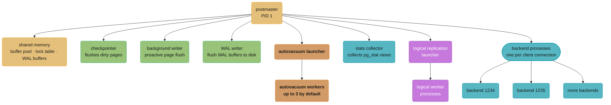
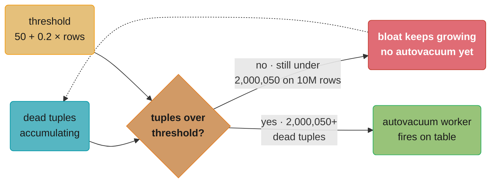
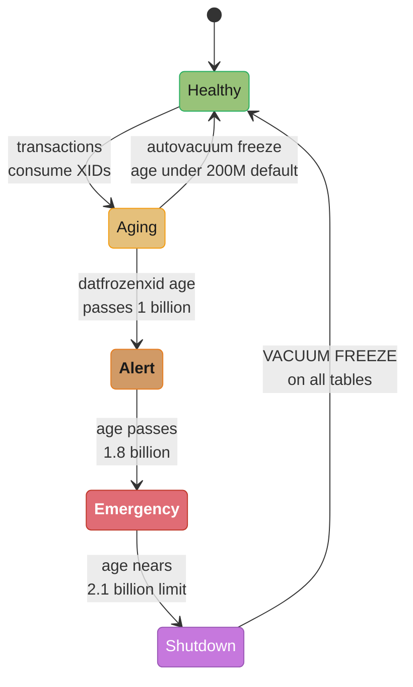
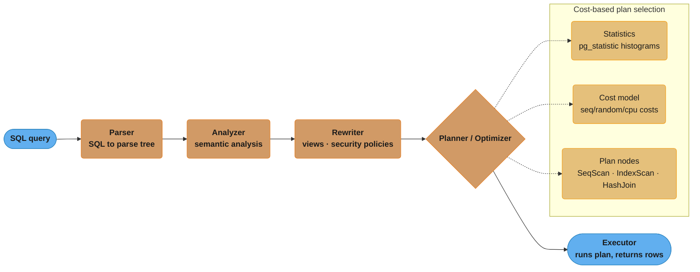

# PostgreSQL Internals

## 1. Concept Overview

PostgreSQL is a fully ACID-compliant, multi-process relational database with an extensible architecture. Understanding its internals — process model, VACUUM mechanics, query planner, replication, partitioning, and extensions — is essential for building high-throughput production systems and diagnosing performance issues.

---

## 2. Intuition

PostgreSQL's design philosophy: correctness first, then performance. Every architectural decision traces back to the MVCC model:
- Rows are never modified in-place — UPDATE = delete + insert. Dead tuples accumulate.
- VACUUM is the janitor that reclaims dead tuples. Neglecting it causes table bloat and XID wraparound.
- The query planner is a cost-based optimizer: it estimates the cheapest execution plan using statistics. Stale statistics = bad plans.
- **Key insight**: PostgreSQL's biggest operational challenges are all MVCC consequences: bloat, VACUUM tuning, and long-running transactions holding back the xmin horizon.

---

## 3. Core Principles

### Process Model

*The postmaster forks a fixed set of background workers plus one backend process per client connection:*



Each backend process is a separate OS process (~5-10 MB RSS). This is different from MySQL's thread-per-connection model. PostgreSQL 14+ introduced connection pooling via `pg_hba.conf` improvements, but external poolers (PgBouncer) remain essential at scale.

---

## 4. Types / Architectures / Strategies

### VACUUM Mechanics

PostgreSQL's MVCC creates dead tuples (old row versions after UPDATE/DELETE). VACUUM reclaims their space.

**What VACUUM does**:
1. Scans heap for dead tuples (xmax committed and older than oldest active xid)
2. Removes dead index entries for those tuples
3. Marks heap pages as reusable (Free Space Map update)
4. Updates the Visibility Map (enables index-only scans)
5. Advances the relfrozenxid (prevents XID wraparound)

**What VACUUM does NOT do**:
- Does not return space to the OS (only marks pages as reusable within the file)
- Exception: `VACUUM FULL` compacts the table and returns space — but requires ACCESS EXCLUSIVE lock (downtime)

### Autovacuum Triggers

Autovacuum fires on a table when:
```
dead_tuples > autovacuum_vacuum_threshold + autovacuum_vacuum_scale_factor × reltuples
default:    50            +               0.2               × row_count

For a 10M-row table: 50 + 0.2 × 10,000,000 = 2,000,050 dead tuples before autovacuum fires
```

This means a table receiving 200K updates/day won't trigger autovacuum for 10 days — 2M dead tuples accumulate.

**What this actually says.** "Do not vacuum a table until roughly one fifth of its rows are dead — and measure that fifth against the table's whole row count, not against how fast it is churning." The gate scales with table size, so the larger the table the longer the wait, which is exactly backwards from what a hot table needs.

| Symbol | What it is |
|--------|------------|
| `dead_tuples` | Current count of dead row versions — `n_dead_tup` in `pg_stat_user_tables` |
| `autovacuum_vacuum_threshold` | Flat floor, default `50` rows. Only decisive on tiny tables |
| `autovacuum_vacuum_scale_factor` | Fraction of the table, default `0.2` — that is 20% |
| `reltuples` | Planner's estimate of live rows, refreshed by the last ANALYZE |

**Walk one example.** The same 10M-row table, at the default scale factor and at the tuned one:

```
                        threshold  +  scale x reltuples      =  dead tuples needed
  default (0.2)              50    +   0.2  x 10,000,000     =  2,000,050
  tuned   (0.01)            100    +   0.01 x 10,000,000     =    100,100

  At 200,000 updates/day, time between autovacuum runs:
    default : 2,000,050 / 200,000  =  10.0 days
    tuned   :   100,100 / 200,000  =   0.5 days  --  roughly twice a day
```

The scale factor exists so autovacuum's cost stays proportional to table size rather than firing constantly on a busy small table. The trap is that proportional-to-size is the wrong shape for a large hot table: a 10M-row table and a 10-row table both wait for 20% dead, but the 10M-row table has to carry two million dead tuples to get there. That is why the per-table override below is the standard remedy — it turns the fraction back into something close to an absolute cap.

*The trigger is a single threshold gate: bloat keeps growing until the dead-tuple count crosses it, then autovacuum fires:*



Per-table override (recommended for high-write tables):
```sql
ALTER TABLE high_write_table SET (
    autovacuum_vacuum_scale_factor = 0.01,  -- Trigger at 1% dead tuples
    autovacuum_vacuum_threshold = 100,
    autovacuum_vacuum_cost_delay = 2        -- ms of sleep between pages (lower = faster VACUUM)
);
```

**The idea behind it.** "Autovacuum pays a toll for every page it touches, and once its toll bill reaches the limit it must sit out the delay before it is allowed to work again." Cost-based throttling is a rate limiter with an unusual meter: it charges by how expensive the page was, not by how many pages there were.

| Symbol | What it is |
|--------|------------|
| `vacuum_cost_page_hit` | `1` unit — page was already in `shared_buffers`, nearly free |
| `vacuum_cost_page_miss` | `10` units — page had to be read from disk |
| `vacuum_cost_page_dirty` | `20` units — page was modified and must be written back |
| `autovacuum_vacuum_cost_limit` | Toll budget spendable per cycle, default `200` |
| `autovacuum_vacuum_cost_delay` | Sleep once the budget is spent, default `20` ms |

**Walk one example.** A workload where half the pages are already cached and half are not:

```
  average cost per page  =  0.5 x 10 (miss)  +  0.5 x 1 (hit)   =    5.5 units

  defaults  :  200 / 5.5           =      36.4 pages per cycle
               1000 ms / 20 ms     =        50 cycles per second
               36.4 x 50           =     1,818 pages/sec  =  14.2 MB/sec of heap

  tuned     :  2000 / 5.5          =     363.6 pages per cycle
               1000 ms / 2 ms      =       500 cycles per second
               363.6 x 500         =   181,818 pages/sec (ceiling, if I/O allows)

  budget x10 and delay /10  ->  100x more pages per second
```

The tuned figure is a permission ceiling, not a promise — real throughput stops at whatever the disk delivers. What the arithmetic does show is why the two knobs must move together: raising `cost_limit` alone widens each burst but leaves the same 20 ms of sleep between them, so the sustained rate barely improves. Multiply the budget and divide the delay, and the rate multiplies by both factors at once.

### XID Wraparound

PostgreSQL transaction IDs (XIDs) are 32-bit unsigned integers cycling after ~2.1 billion transactions. If a table's relfrozenxid falls more than 2 billion XIDs behind the current XID, PostgreSQL forcibly shuts down to prevent wraparound (catastrophic data corruption). Autovacuum's `--freeze` mode (`autovacuum_freeze_max_age = 200M` XIDs by default) ensures tables are frozen before the danger zone.

**Read it like this.** "A 32-bit counter gives you about 2.1 billion transactions of runway; freeze the old rows before that runway ends, or the server stops accepting writes to protect itself." XID comparison is modular, so only half the 32-bit space is usable — the other half is what "in the past" means.

| Symbol | What it is |
|--------|------------|
| `2^31` | `2,147,483,648` — usable XID space, half of `2^32` because comparisons are modular |
| `relfrozenxid` | Oldest still-unfrozen XID in one table |
| `age(datfrozenxid)` | How many XIDs have burned since the oldest unfrozen row in the database |
| `autovacuum_freeze_max_age` | `200,000,000` default — forces a freeze vacuum regardless of dead-tuple count |

**Walk one example.** Every threshold in this module, as a fraction of the runway:

```
  usable XID space                     2^31 = 2,147,483,648      100.0%

  autovacuum_freeze_max_age             200,000,000                9.3%   routine freeze
  alert threshold (Pitfall 5)         1,000,000,000               46.6%   page someone
  emergency threshold (Pitfall 5)     1,800,000,000               83.8%   347,483,648 left
  hard stop                          ~2,100,000,000               97.8%   writes refused
```

The freeze trigger sits at 9.3% for a reason: it must fire early enough that even a slow freeze pass over a multi-terabyte table finishes with the remaining 90% of the runway to spare. Pitfall 5's 72-hour `VACUUM FREEZE` on a 10 TB database is exactly the scenario that headroom is sized for — a database that only starts freezing at the alert threshold may not finish before the hard stop.

*Autovacuum's freeze pass should cycle every table back to Healthy long before the alert thresholds monitored in Pitfall 5 are ever reached:*



---

## 5. Architecture Diagrams

```
VACUUM FLOW:

Table heap (8KB pages):
+------+------+------+------+------+
| page | page | page | page | page |
| live | dead | live | dead | live |
|  10  |  15  |  20  |  25  |  30  |
+------+------+------+------+------+
  VM=1   VM=0   VM=1   VM=0   VM=1   ← Visibility Map bits

VACUUM:
1. Read VM: skip pages with VM=1 (all tuples visible, no dead tuples)
2. Scan pages with VM=0:
   - Page 2 (15 dead tuples): reclaim, mark in FSM, set VM=1
   - Page 4 (25 dead tuples): reclaim, mark in FSM, set VM=1
3. Remove dead index entries for reclaimed tuples
4. Update pg_stat_user_tables.last_autovacuum

After VACUUM:
+------+------+------+------+------+
| live |  FSM | live |  FSM | live |  ← Dead tuples replaced by Free Space
| VM=1 | VM=1 | VM=1 | VM=1 | VM=1 |  ← All pages all-visible
+------+------+------+------+------+
```

*VM=1 lets VACUUM skip a page outright; only VM=0 pages get scanned, their dead tuples reclaimed into the Free Space Map, and the bit flipped back to 1 — no space returns to the OS until `VACUUM FULL` or `pg_repack` runs.*

**Query planner pipeline**: every statement passes through four fixed stages before the cost-based optimizer picks a plan from `pg_statistic` and the cost model.



---

## 6. How It Works — Detailed Mechanics

### EXPLAIN ANALYZE Output

```sql
EXPLAIN (ANALYZE, BUFFERS)
SELECT o.id, c.name FROM orders o JOIN customers c ON o.customer_id = c.id
WHERE o.created_at > now() - interval '30 days';

-- Example output:
Hash Join  (cost=1200.50..9800.20 rows=50000 width=32)
           (actual time=45.123..312.456 rows=48921 loops=1)
  Buffers: shared hit=2341 read=8921
  ->  Seq Scan on orders o  (cost=0..8000 rows=50000 width=12)
                             (actual time=0.012..180.3 rows=48921 loops=1)
        Filter: (created_at > (now() - '30 days'::interval))
        Rows Removed by Filter: 1500000
        Buffers: shared hit=1000 read=8000
  ->  Hash  (cost=800.00..800.00 rows=32040 width=24)
             (actual time=40.123..40.123 rows=32040 loops=1)
        ->  Seq Scan on customers c  (cost=0..800 rows=32040 width=24)
                                     (actual time=0.008..20.4 rows=32040 loops=1)

-- Reading:
-- cost=first_row_cost..total_cost
-- actual time=startup_ms..total_ms  rows=actual_rows  loops=times_executed
-- Buffers: shared hit=pages from buffer pool (fast), read=pages from disk (slow)
-- "Rows Removed by Filter" >> "rows" → missing index on created_at
```

**In plain terms.** "A sequential scan pays once for each page it streams past; an index scan pays a much steeper random-jump price for every page it has to seek to — so the index wins only while the number of pages it must seek stays small." Every cost number in an EXPLAIN plan is quoted in units of one sequential page read.

| Symbol | What it is |
|--------|------------|
| `seq_page_cost` | Cost of reading one page in sequence. Default `1.0` — the unit everything else is priced in |
| `random_page_cost` | Cost of one random page seek. Default `4.0` (spinning disk); set `1.1` on SSD |
| `cpu_index_tuple_cost` | Per-index-entry CPU charge, default `0.005` |
| `pages_to_fetch` | Heap pages the index scan must visit — at worst one per matching row, capped at the table's page count |

**Walk one example.** The `orders` scan in the plan above: 8,000 pages, 48,921 matching rows, 1,500,000 removed by the filter, so 1,548,921 rows total and 3.16% selectivity.

```
  seq scan    :  1.0 x 8,000 pages                                =   8,000
  index scan  :  0.005 x 48,921  +  4.0 x min(48,921, 8,000)
                 =  244.6  +  32,000                              =  32,245   4.03x worse
  same on SSD :  244.6  +  1.1 x 8,000                            =   9,045   1.13x worse

  Now a far more selective predicate -- only 500 matching rows:
  index scan  :  0.005 x 500  +  4.0 x 500  =  2.5 + 2,000        =   2,003   4.0x better
```

At 3.16% selectivity the planner is right to pick the Seq Scan even though an index exists — 48,921 random seeks cost four times what streaming the whole table costs. Notice what changes the verdict: dropping `random_page_cost` to `1.1` for SSD storage shrinks the gap from 4.03x to 1.13x, and cutting the matching rows to 500 flips it outright. This is why "Rows Removed by Filter" being 30.7x the returned rows is the signal to add an index — it means the predicate could be far more selective than the plan is currently able to exploit.

### Query Plan Node Types

| Node | Meaning | Best When |
|------|---------|-----------|
| Seq Scan | Full table scan | Small tables or returning >20% of rows |
| Index Scan | B+tree traversal + heap fetch | Selective queries, clustered data |
| Index Only Scan | B+tree only, no heap fetch | Covering index present, VM up-to-date |
| Bitmap Index Scan | Build bitmap of row locations, then heap scan | Multiple indexes combined (OR), non-clustered |
| Nested Loop | For each outer row, scan inner | Small outer, indexed inner |
| Hash Join | Build hash table from smaller, probe with larger | Large tables, no sort requirement |
| Merge Join | Merge two sorted inputs | Both inputs already sorted on join key |

### TOAST (Oversized Attribute Storage)

PostgreSQL pages are 8KB. A row must fit in a single page (with some exceptions). When a column value exceeds ~2KB (the TOAST threshold), it is compressed and/or stored out-of-line in a TOAST table.

```
TOAST strategies per column:
PLAIN    — inline, no compression (for small types like int, float)
EXTENDED — compress then out-of-line if still too large (default for text, jsonb)
EXTERNAL — out-of-line without compression (preserve compression ability in application)
MAIN     — compress, avoid out-of-line if possible

TOAST overhead:
- Reading a TOASTed column: extra I/O to TOAST table
- TOAST table has its own indexes
- Large JSONB documents (> 2KB) are almost always TOASTed
- SELECT queries that don't access TOASTed columns pay no TOAST overhead
```

Performance pitfall: `SELECT *` on a table with large JSONB columns reads all TOAST values. `SELECT id, status` does not.

**Put simply.** "Anything wider than a quarter of a page gets shipped off to a side table, so a fat column costs you nothing until a query actually asks for it." The threshold is not a tuning knob you pick — it falls out of PostgreSQL's requirement that at least four rows fit on every 8 KB page.

| Symbol | What it is |
|--------|------------|
| 8 KB page | `8,192` bytes — PostgreSQL's fixed block size, the unit all I/O is done in |
| ~2 KB threshold | `2,048` bytes, exactly one quarter of a page — the point where TOAST engages |
| out-of-line | Value moved to `pg_toast_<oid>`; the heap row keeps only a small pointer |
| TOAST fetch | The extra read to reassemble the value, paid only when the column is selected |

**Walk one example.** The `events` table from Section 7, with 200 KB average JSONB payloads:

```
  page size                                  8,192 bytes
  TOAST threshold        8,192 / 4       =   2,048 bytes

  payload JSONB  200 KB  =  204,800 bytes
     204,800 / 8,192     =  25 pages' worth of data per row, all out-of-line
     204,800 / 2,048     =  100x the TOAST threshold -- never stored inline

  SELECT *           ->  heap row  +  full TOAST reassembly   =  50.0 ms
  SELECT id, status  ->  heap row only, TOAST never touched   =   0.5 ms
                                                                 --------
  speedup from not selecting the TOASTed column                     100x
```

The quarter-page rule is why the threshold exists at all: PostgreSQL cannot chain a row across pages, so without out-of-line storage a single 200 KB document would be unstorable. What the 100x gap shows is that TOAST is not a tax you pay for having a wide column — it is a tax you pay for `SELECT *`. The column is free to own and expensive only to read.

### Partitioning

PostgreSQL 10+ declarative partitioning. Three types:

```sql
-- Range partitioning (most common for time-series)
CREATE TABLE orders (
    id BIGINT, created_at TIMESTAMPTZ, customer_id INT, total NUMERIC
) PARTITION BY RANGE (created_at);

CREATE TABLE orders_2024_q1 PARTITION OF orders
FOR VALUES FROM ('2024-01-01') TO ('2024-04-01');
CREATE TABLE orders_2024_q2 PARTITION OF orders
FOR VALUES FROM ('2024-04-01') TO ('2024-07-01');

-- Hash partitioning (even data distribution)
CREATE TABLE users PARTITION BY HASH (user_id);
CREATE TABLE users_p0 PARTITION OF users FOR VALUES WITH (modulus 4, remainder 0);

-- List partitioning
CREATE TABLE orders PARTITION BY LIST (region);
CREATE TABLE orders_us PARTITION OF orders FOR VALUES IN ('us-east', 'us-west');
```

**Partition pruning**: PostgreSQL evaluates partition constraints at query planning time. Query `WHERE created_at > '2024-07-01'` only scans the relevant partitions — others are excluded from the plan.

**Partition-wise joins**: PostgreSQL 11+ can join two partitioned tables partition-by-partition, enabling parallel execution.

---

## 7. Real-World Examples

- **Table bloat from high UPDATE rate**: A ride-sharing app updates trip status 10 times per trip. 1M trips/day = 10M updates/day. Without proper autovacuum tuning, the trips table grows 5x its live data size in weeks.
- **Replication slot filling disk**: A logical replication subscriber went offline for 48 hours. The replication slot retained all WAL from the past 48 hours — 400GB accumulated in pg_wal, filling the disk, crashing the primary.
- **EXPLAIN shows bad plan from stale stats**: After a bulk data load (50M rows inserted in one batch), `autovacuum_analyze_threshold` was not triggered (table stats showed 0 rows — the load happened faster than autovacuum). Queries got sequential scans instead of index scans. Fix: `ANALYZE table_name` after bulk loads.
- **TOAST causing unexpected query slowness**: `SELECT * FROM events WHERE id = 42` was taking 50ms. The events table had a `payload JSONB` column with 200KB average document size. `SELECT id, status FROM events WHERE id = 42` took 0.5ms. Fix: `SELECT` only needed columns.

---

## 8. Tradeoffs

| Feature | Benefit | Tradeoff |
|---------|---------|----------|
| MVCC | Read/write concurrency, no reader-writer blocking | Dead tuples require VACUUM |
| Autovacuum | Automatic maintenance | Can lag behind write load; must be tuned |
| Logical replication | Cross-version replication, CDC | Replication slots accumulate WAL if consumer is slow |
| Declarative partitioning | Partition pruning, easier maintenance | Planning overhead for queries across many partitions |
| Extensions (pgvector, TimescaleDB) | Rich functionality | Upgrade compatibility, support concerns |
| Per-process model | Isolation, crash safety | High RAM per connection; needs PgBouncer at scale |

---

## 9. When to Use / When NOT to Use

**PostgreSQL is the right choice when**:
- ACID compliance required
- Complex queries (joins, CTEs, window functions, JSONB)
- Need PostGIS, pgvector, TimescaleDB, or other extensions
- Strong consistency requirements
- Team has SQL expertise

**Consider alternatives when**:
- Write throughput exceeds 100K-1M writes/second (consider Cassandra or partitioning across multiple PostgreSQL shards)
- Horizontal scale required beyond a single primary + replicas (consider Citus or CockroachDB)
- Schema-free document storage at extreme scale (consider MongoDB)
- Analytics on petabyte-scale (consider ClickHouse or BigQuery)

---

## 10. Common Pitfalls

**Pitfall 1: Replication slot left behind → disk fill**
A developer created a logical replication slot for testing, then forgot to drop it when stopping the subscriber. The slot caused WAL to accumulate indefinitely. Three days later, the primary's data volume filled, PostgreSQL shut down. Fix: monitor `pg_replication_slots WHERE active = false` and alert when `pg_wal_lsn_diff(pg_current_wal_lsn(), restart_lsn)` > 10GB.

**Pitfall 2: Autovacuum disabled on large table**
A team disabled autovacuum on their largest table (1 billion rows) to reduce I/O. After 6 months, the table had 800M dead tuples. A `VACUUM FULL` (needed to reclaim space) required 24 hours with an ACCESS EXCLUSIVE lock — production downtime. Fix: never disable autovacuum on production tables. Instead, tune its cost settings to be less aggressive but never stop it.

**Pitfall 3: Forgetting ANALYZE after bulk load**
```sql
-- Bulk load 50M rows
COPY orders FROM '/tmp/orders.csv';
-- Statistics not updated until autovacuum_analyze fires (may take hours)
-- In the meantime, planner thinks table has 0 rows → bad plans
-- Fix:
ANALYZE orders;
-- Or before loading:
BEGIN;
COPY orders FROM '/tmp/orders.csv';
ANALYZE orders;
COMMIT;
```

**Pitfall 4: TOO many partitions slowing query planning**
A table with 3650 daily partitions (10 years of data). Every query went through the planner checking all 3650 partition constraints — planning took 500ms even for simple queries. Fix: use `constraint_exclusion = partition` (default), ensure partition constraints are simple enough for the planner. Alternatively, range-partition by month (120 partitions) with sub-partitioning by day.

**Pitfall 5: XID wraparound emergency**
A low-traffic database had autovacuum disabled in development. After 2 years, the XID counter was within 10M of wraparound. PostgreSQL began refusing all writes with "WARNING: database might contain unfrozen rows" and eventually stopped accepting connections. Emergency procedure: `VACUUM FREEZE` on all tables. Took 72 hours on a 10TB database. Fix: monitor `age(datfrozenxid)` for all databases. Alert at 1 billion XIDs, emergency at 1.8 billion.

---

## 11. Technologies & Tools

| Tool | Purpose |
|------|---------|
| `pg_stat_activity` | Active queries, lock waits, transaction duration |
| `pg_stat_bgwriter` | Checkpoint and bgwriter activity |
| `pg_stat_replication` | WAL sender lag per replica |
| `pg_replication_slots` | Slot name, active status, restart_lsn |
| `pg_stat_user_tables` | Autovacuum timing, dead tuple count, bloat estimation |
| `pg_stat_statements` | Top N queries by total time, calls, mean time |
| `pg_stat_progress_vacuum` | Live VACUUM progress on large tables |
| `pgstattuple` | Precise bloat measurement (dead_tuple_percent) |
| `pg_partman` | Extension for automated partition management |
| `WAL-G / pgBackRest` | WAL archiving, PITR, compressed backups |
| `Patroni` | High availability, automatic failover using etcd/Consul |
| `PgBouncer` | Connection pooling (session, transaction, statement modes) |

---

## 12. Interview Questions with Answers

**Q: Why does PostgreSQL bloat under heavy UPDATE workloads?**
PostgreSQL implements MVCC by never modifying rows in-place. Every UPDATE creates a new row version (new xmin, old row marked with xmax). The old version remains in the heap as a "dead tuple" until VACUUM reclaims it. Under heavy UPDATE workloads, dead tuples accumulate faster than VACUUM can clean them. Each dead tuple occupies 8-23 bytes plus the full row payload. A 10M-row table with 1M updates/day can accumulate 10M dead tuples per week if autovacuum lags. The heap file grows, sequential scans read more pages, index scans return dead rows that must be filtered — all degrading performance.

**Q: How do you tune autovacuum for a high-write table?**
Default autovacuum is too conservative for high-write tables. Three knobs: (1) `autovacuum_vacuum_scale_factor`: lower from 0.2 to 0.01-0.05 to trigger vacuum at 1-5% dead tuples instead of 20%. (2) `autovacuum_vacuum_cost_delay`: lower from 20ms to 2ms to allow vacuum to run faster (at cost of more I/O). (3) `autovacuum_vacuum_cost_limit`: increase from 200 to 800-2000 to allow vacuum to clean more per "cycle." Apply per-table: `ALTER TABLE t SET (autovacuum_vacuum_scale_factor=0.01, autovacuum_vacuum_cost_delay=2)`. Monitor effectiveness via `pg_stat_user_tables.n_dead_tup` trending down after each autovacuum run.

**Q: When does the query planner choose a sequential scan over an index scan?**
The planner estimates cost for both plans. Sequential scan cost = `seq_page_cost × pages`. Index scan cost = `(cpu_index_tuple_cost × index_tuples) + (random_page_cost × pages_to_fetch)`. If the query returns > ~5-15% of rows, random I/O for each row (at `random_page_cost=4`) exceeds the sequential scan cost. On SSDs, set `random_page_cost=1.1` so the planner prefers index scans at higher selectivity. Also: if the planner's row estimate is wrong (stale statistics), it may choose seq scan when an index would be faster. Fix with `ANALYZE table`.

**Q: What is a replication slot and what are the risks?**
A replication slot tracks how far a WAL consumer (replica or logical subscriber) has consumed the WAL stream. The primary will not remove WAL segments needed by any active slot. Risk: if a replica goes offline or a logical subscriber stops consuming, the slot retains WAL indefinitely — `restart_lsn` stops advancing — WAL accumulates in `pg_wal`, filling disk. Mitigation: set `max_slot_wal_keep_size = '10GB'` (PostgreSQL 13+) to limit WAL retention per slot. Alert when `pg_wal_lsn_diff(pg_current_wal_lsn(), restart_lsn) > 5GB`. Drop unused slots promptly.

**Q: Explain TOAST and when it causes performance problems.**
TOAST (The Oversized Attribute Storage Technique) stores large column values (text, jsonb, bytea > ~2KB) out-of-line in a separate table (`pg_toast_<oid>`). Reading a TOASTed column requires a join to the TOAST table — an extra I/O. Performance problems: (1) `SELECT *` on tables with large JSONB/text fields reads all TOAST data even if unused. (2) Very large documents (1MB+) cause single-row fetch times to exceed 10ms due to TOAST decompression. (3) TOAST tables accumulate dead entries that need their own VACUUM. Fix: select only needed columns, consider splitting large columns to separate tables, set column to STORAGE EXTERNAL to skip compression overhead if application compresses.

**Q: How does logical replication differ from streaming replication, and when do you use each?**
Streaming replication: physical (byte-level) WAL copy to replica. Replica is binary-identical to primary. Supports: standby queries, failover promotion. Requires: same PostgreSQL major version. Logical replication: decodes WAL into logical change events (INSERT/UPDATE/DELETE per table). Supports: cross-version replication, selective table replication, external CDC consumers (Debezium). Requires: `wal_level=logical`. Use streaming for HA/failover replicas. Use logical for: zero-downtime major version upgrades, replicating select tables to a replica, feeding changes to Kafka/data warehouse via Debezium.

**Q: What is the Free Space Map and how does it work with VACUUM?**
The Free Space Map (FSM) is a data structure tracking how much free space is available in each heap page. When VACUUM reclaims dead tuples, it updates the FSM to mark those pages as available for future inserts. When PostgreSQL needs to INSERT a new row, it consults the FSM to find a page with sufficient free space. Without FSM updates (before PostgreSQL 8.4, FSM had a fixed size limit), inserts would always extend the heap file even when free space existed within the file. With proper VACUUM, the FSM allows reuse of freed space, preventing unbounded table growth.

**Q: How do you diagnose and fix table bloat?**
```sql
-- Estimate bloat (quick):
SELECT relname, n_dead_tup, n_live_tup,
       round(n_dead_tup::numeric / NULLIF(n_live_tup+n_dead_tup, 0) * 100, 2) AS dead_pct,
       last_autovacuum
FROM pg_stat_user_tables
WHERE n_dead_tup > 1000000
ORDER BY dead_pct DESC;

-- Precise measurement (slow, locks):
CREATE EXTENSION pgstattuple;
SELECT * FROM pgstattuple('large_table');
-- dead_tuple_percent > 20% → needs VACUUM

-- Fix without downtime:
VACUUM ANALYZE large_table;  -- Reclaims dead space within file

-- Fix with OS space reclaim (downtime required):
VACUUM FULL large_table;  -- ACCESS EXCLUSIVE lock, compacts file, shrinks on disk

-- Fix online with no lock (using pg_repack extension):
pg_repack -t large_table  -- Rebuilds table in background, swaps atomically
```

**Q: What is pg_stat_statements and how do you use it for query optimization?**
`pg_stat_statements` is a PostgreSQL extension that tracks statistics for every normalized query (parameters replaced with $1, $2). Key columns: `total_exec_time` (total CPU+wait time), `calls` (how many times), `mean_exec_time` (avg latency), `stddev_exec_time` (latency variance — high stddev suggests occasional bad plans). Usage: `SELECT query, calls, mean_exec_time, total_exec_time FROM pg_stat_statements ORDER BY total_exec_time DESC LIMIT 20` — finds queries consuming the most total time. Enable with `shared_preload_libraries = 'pg_stat_statements'` and `pg_stat_statements.max = 5000`.

**Q: How does PostgreSQL's query planner use statistics, and what happens when they're stale?**
The planner reads `pg_statistic` (populated by ANALYZE): column histograms (100 buckets by default), n_distinct (number of unique values), correlation (physical order vs value order), most common values (MCVs) with their frequencies. Stale statistics: after a bulk load or schema change, `pg_statistic` shows old row counts and distributions. The planner may estimate 100 rows when the actual result is 1M rows — leading to wrong join order (small table should be hash-built, not the large one), wrong join algorithm (nested loop instead of hash join), and sequential scans where indexes would be faster. Fix: `ANALYZE table_name` after bulk operations. Permanent fix: adjust `default_statistics_target = 200` (more histogram buckets) for columns with non-uniform distributions.

**Q: Explain partition pruning and when it fails.**
Partition pruning eliminates partitions from query planning when their constraint ranges are incompatible with query predicates. For `WHERE created_at > '2024-07-01'`, the planner checks each partition's `FOR VALUES FROM... TO...` constraint — only partitions overlapping with 2024-07-01+ are scanned. Pruning fails when: (1) The WHERE clause uses a non-immutable function (e.g., `WHERE created_at > now()` — `now()` is evaluated at runtime, not planning time; use `STABLE` or hardcode the value). (2) Partition key uses an expression that doesn't match the WHERE expression exactly. (3) Too many partitions overwhelm the planning time (> 1000 partitions). Fix: use `enable_partition_pruning = on` (default), ensure WHERE predicates directly reference the partition key.

**Q: What is the difference between VACUUM and VACUUM FULL?**
VACUUM: marks dead tuples as reusable, updates FSM and VM, removes dead index entries, advances relfrozenxid. Does NOT lock the table (allows concurrent reads and writes). Does NOT return disk space to OS. File size does not shrink. VACUUM FULL: acquires ACCESS EXCLUSIVE lock (blocks all reads and writes). Copies all live tuples to a new file, drops the old file. Actual disk space returned to OS. Table file shrinks to minimum size. Used when: table bloat is so severe it's causing storage issues. Alternative without locking: `pg_repack` extension — rebuilds table in background, performs an atomic swap. Always prefer `pg_repack` over VACUUM FULL in production.

**Q: How does the autovacuum cost-based throttling work?**
Autovacuum reads pages into the buffer pool and applies CPU cycles. Without throttling, autovacuum would consume all I/O bandwidth, degrading query performance. Cost-based throttling: after accumulating `autovacuum_vacuum_cost_limit` (default 200) cost units, autovacuum sleeps for `autovacuum_vacuum_cost_delay` (default 20ms). Costs: reading a page from disk = `vacuum_cost_page_miss` (10), reading from cache = `vacuum_cost_page_hit` (1), writing a dirty page = `vacuum_cost_page_dirty` (20). With defaults, autovacuum can process ~200/(0.5×10 + 0.5×1) ≈ 36 pages before sleeping 20ms — approximately 1,800 pages/second. High-write tables need `autovacuum_vacuum_cost_delay=2` and `autovacuum_vacuum_cost_limit=2000`.

**Q: What is the pg_hba.conf file and how does it control authentication?**
`pg_hba.conf` (Host-Based Authentication) defines who can connect to which databases using which authentication methods. Format: `TYPE DATABASE USER ADDRESS METHOD OPTIONS`. Connection request matches rules top-to-bottom; first match wins. Methods: `trust` (no password — never in production), `md5` (password hash, deprecated), `scram-sha-256` (secure, default in PostgreSQL 14+), `cert` (TLS client certificate), `iam` (AWS RDS IAM), `ldap`, `radius`. Best practice: use `scram-sha-256` for password auth, `cert` for service-to-service, and `reject` as a catch-all at the bottom.

**Q: How do you achieve zero-downtime major version upgrades of PostgreSQL?**
PostgreSQL major versions (13→14→15→16) require a full dump+restore or pg_upgrade. Zero-downtime options: (1) `pg_upgrade --check` then `pg_upgrade` with link mode — fast but requires maintenance window. (2) Logical replication: set up PG16 replica, replicate all tables via logical replication from PG15, wait for lag to catch up, switch application to PG16, drop PG15. Requires `wal_level=logical` on PG15. Limitations: sequences not replicated (sync manually); DDL changes not replicated. (3) Pglogical extension for complex setups. The logical replication path allows < 1 minute of downtime for the cutover (stop PG15 writes, apply remaining lag, restart app against PG16).

**Q: What is the Visibility Map and how does it accelerate index-only scans?**
The Visibility Map has 2 bits per heap page: "all tuples on this page are visible to all transactions" (set by VACUUM) and "all tuples are frozen." Index-only scans: for each matching row in the index, check if the row's page is marked all-visible in the VM. If yes: return the index data without visiting the heap (no heap I/O). If no: visit the heap to check MVCC visibility. After `VACUUM`, all pages get the all-visible bit set (if all dead tuples were cleaned). After INSERTs/UPDATEs, the bit is cleared for affected pages. `n_dead_tup = 0` in `pg_stat_user_tables` and `heap_fetches = 0` in EXPLAIN confirm index-only scans are fully effective.

**Q: Explain autovacuum workers and how you scale them.**
`autovacuum_max_workers` (default 3) limits concurrent autovacuum processes. Each worker handles one table at a time. If more than 3 tables simultaneously need vacuuming (common in large deployments with hundreds of tables), some tables queue and bloat grows unchecked. Scaling: increase `autovacuum_max_workers = 6-10` (increases RAM usage by ~5MB per worker). Also increase `autovacuum_vacuum_cost_limit` per worker. Monitor: `SELECT relname, last_autovacuum, n_dead_tup FROM pg_stat_user_tables ORDER BY n_dead_tup DESC` — if multiple high-dead-tup tables, autovacuum is falling behind.

---

## 13. Best Practices

1. Never disable autovacuum on production tables. Instead, tune its cost settings per table.
2. Monitor replication slot lag: `pg_wal_lsn_diff(pg_current_wal_lsn(), restart_lsn)`. Alert > 5GB.
3. Set `max_slot_wal_keep_size = '10GB'` (PostgreSQL 13+) to prevent disk fill from lagging slots.
4. After bulk loads, always run `ANALYZE table_name` explicitly.
5. Use `pg_stat_statements` with `pg_stat_statements.track = all` in production.
6. Set connection-level timeouts: `lock_timeout='10s'`, `idle_in_transaction_session_timeout='5min'`.
7. Use `pg_repack` instead of `VACUUM FULL` to reclaim bloat without downtime.
8. For large tables, set per-table autovacuum parameters rather than changing global settings.
9. Set `random_page_cost = 1.1` for SSD storage; `effective_cache_size = 75% RAM`.
10. Partition large tables (> 100GB) by time or hash for manageability and partition pruning.

---

## 14. Case Study

**Scenario**: A SaaS platform's PostgreSQL database starts experiencing 10-30 second query latency spikes twice daily. The database is an RDS PostgreSQL 15 instance (16 vCPU, 64GB RAM). Table: `events` (5B rows, 2TB heap). Daily write rate: 50M rows inserted, 20M rows updated.

**Diagnosis sequence**:
```sql
-- Step 1: Find most time-consuming queries
SELECT query, calls, total_exec_time/1000 AS total_sec, mean_exec_time AS mean_ms
FROM pg_stat_statements
ORDER BY total_exec_time DESC LIMIT 10;
-- Top query: SELECT * FROM events WHERE tenant_id=$1 AND ts > $2
-- mean=35ms, but max inferred from stddev is 30,000ms (stddev=4000ms)

-- Step 2: Check table health
SELECT n_live_tup, n_dead_tup, last_autovacuum, last_autoanalyze
FROM pg_stat_user_tables WHERE relname = 'events';
-- Result: n_dead_tup=850000000 (850M!), last_autovacuum=3 hours ago

-- Step 3: Autovacuum effectiveness
SELECT * FROM pg_stat_progress_vacuum WHERE relname = 'events';
-- Shows: autovacuum has been running for 2.5 hours, 15% complete
-- Phase: vacuuming indexes (slow due to 12 indexes on events table)
```

**Root cause**: Autovacuum cannot keep pace. 20M daily updates create 20M dead tuples/day. Autovacuum default settings clean ~5M dead tuples/day on a 2TB table (too slow). 850M dead tuples cause sequential scans to read 4x more data than necessary.

**Fix**:
```sql
-- 1. Immediate: manual VACUUM (not FULL) to catch up
VACUUM (VERBOSE, ANALYZE) events;
-- Runs for 6 hours, cleans 850M dead tuples

-- 2. Per-table autovacuum tuning
ALTER TABLE events SET (
    autovacuum_vacuum_scale_factor = 0.005,   -- 0.5% of rows
    autovacuum_vacuum_cost_delay = 2,          -- 2ms sleep (was 20ms)
    autovacuum_vacuum_cost_limit = 2000,       -- 10x default budget
    autovacuum_analyze_scale_factor = 0.01    -- Analyze at 1% change
);

-- 3. Partition table by month to reduce per-partition dead tuple accumulation
-- (Future work: pg_partman for automated partition creation/retention)

-- 4. Add index to stop sequential scans
CREATE INDEX CONCURRENTLY idx_events_tenant_ts ON events (tenant_id, ts DESC);
```

**Result**: Daily dead tuple growth from 20M to ~500K after tuning (autovacuum now runs continuously and keeps pace). Query latency spikes: eliminated. Autovacuum completes table passes in 45 minutes instead of 10 hours. The partition strategy was planned for next quarter's migration.
