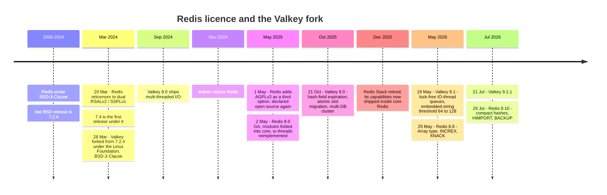
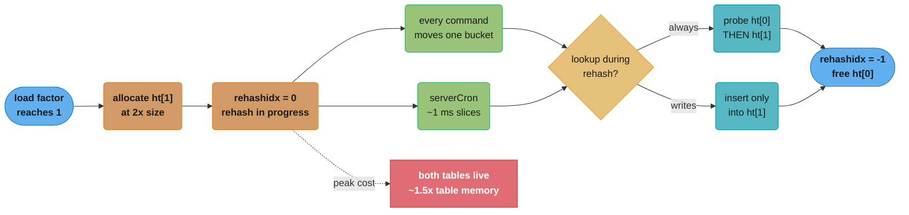
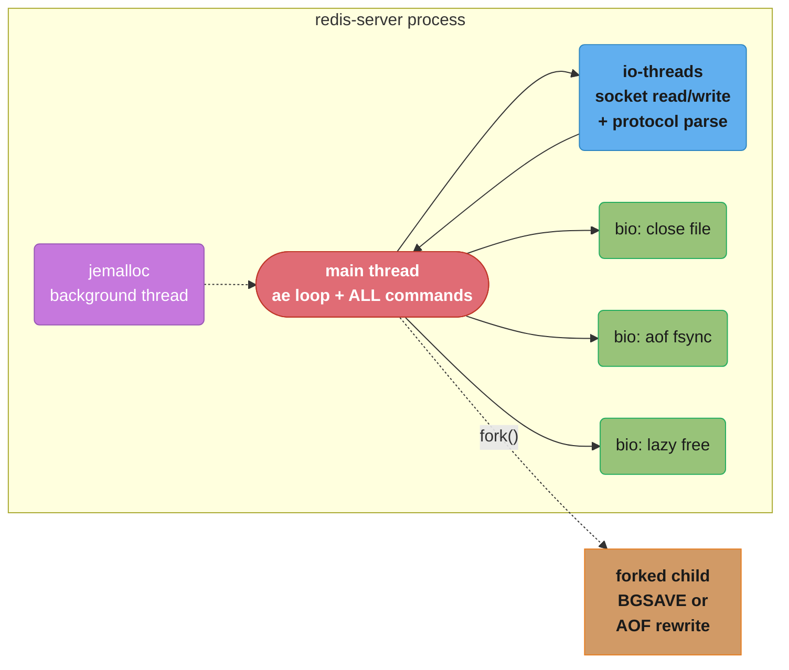
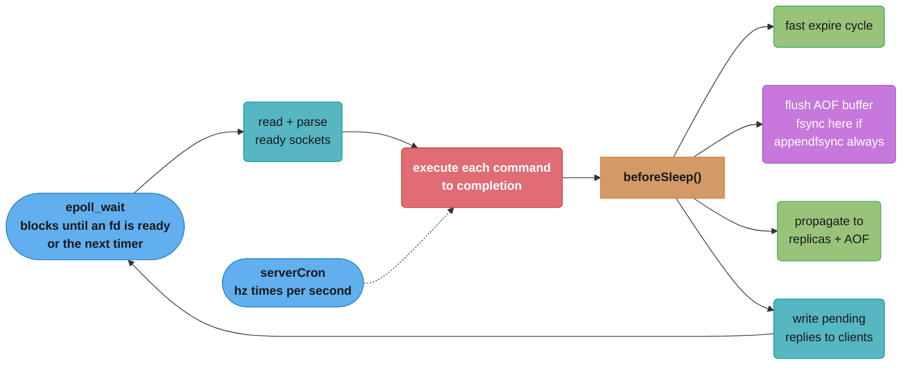
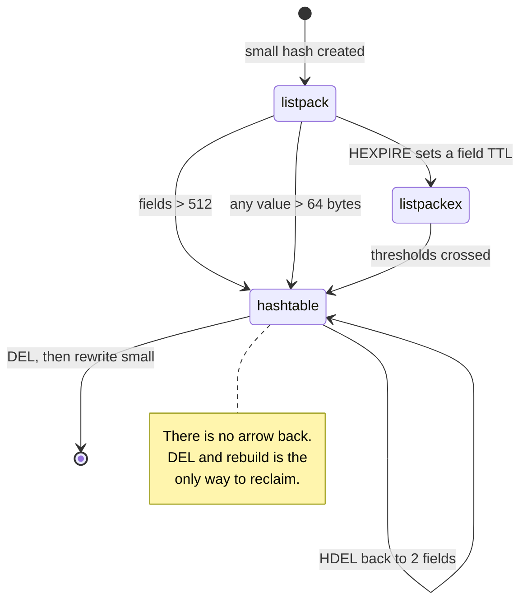
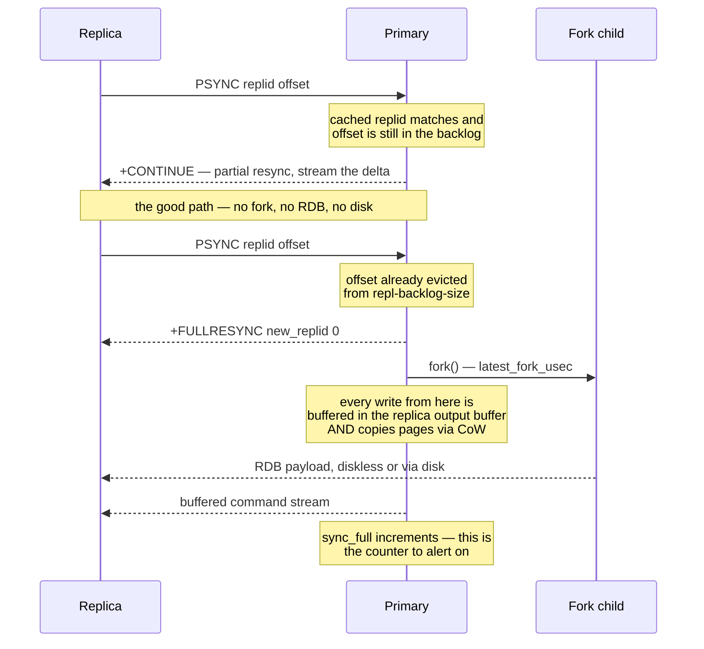
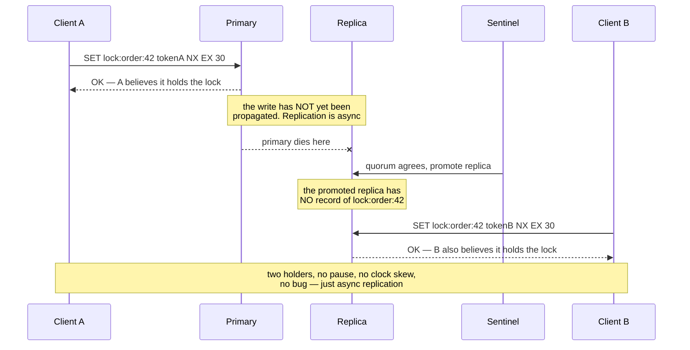

# Redis Internals

<!-- study-paths
senior: redis_internals.md
files this module contributes to each curated path; omit a tier to leave it out
-->
## 1. Concept Overview

> **Version anchor (2026-08-04).** **Redis Open Source 8.10.0** (29 Jul 2026) is current; the
> maintained lines are **8.8.1**, **8.6.5**, **8.4.5**, **8.2.8**, **7.4.10**, **7.2.15** and
> **6.2.23**. **Valkey 9.1.1** (21 Jul 2026) is the Linux Foundation fork's current release.
> Redis 8 is **tri-licensed RSALv2 / SSPLv1 / AGPLv3**; Valkey is **BSD-3-Clause**. Behaviour that
> arrived in a specific release is tagged inline as `[8.0]`, `[8.8]`, `[8.10]`, `[7.0]`,
> `[Valkey 9.0]` — nothing here is called "current" without naming the release it landed in.

### What this page is, and what it is not

[Key-Value Stores](../key_value_stores/key_value_stores.md) teaches the **category**: what a
key-value store is for, what a distributed hash map buys you, why HyperLogLog trades exactness for a
flat 12 KB, why a fixed slot layer beats `hash(key) mod N`, why expiration is not eviction, and why
Redlock is contested. Every one of those ideas survives if you swap Redis for DynamoDB, etcd, or
Valkey.

This page teaches **the specific C program**. Its source structures, its config file, its command
names, its `INFO` fields, its release history. If a paragraph here names
`hash-max-listpack-entries`, `latest_fork_usec`, `PSYNC`, `dictRehash` or `appendfsync`, it is a fact
about Redis and it lives here. If it would still be true of another store, it lives there. The two
pages are meant to be read in that order, and this one assumes you already have the category.

### The one-sentence thesis

**Redis is a single-threaded event loop over an in-memory object graph, and almost every operational
surprise it produces is the consequence of exactly one of those three words.**

- **Single-threaded** — one slow command stalls every other client, so latency is a *queueing*
  problem before it is a *throughput* problem (§6.2). It is also why every command, Lua script and
  Function is atomic for free.
- **Event loop** — work that cannot be done inline gets pushed to background threads, forked
  children, or the next loop iteration, which is why `SLOWLOG` can be empty while p99 is 40 ms
  (§6.15).
- **In-memory object graph** — every value is a `robj` wrapping one of several *encodings*, chosen
  by size thresholds you control, switched one way only, and never given back to the OS in the way
  you expect (§4, §6.4).

### The 2024–2026 licence story, because you will be asked



**The honest reading.** AGPLv3 is OSI-approved, so by the standard definition Redis 8 *is* open
source again. But Redis 8 is **tri-licensed**, and tri-licensing means a redistributor still has to
pick one — an organisation that cannot ship AGPL code is left choosing between RSALv2 and SSPLv1,
neither of which is an open-source licence. That is why "Redis is open source again" and "our legal
team still blocks Redis" are both true statements in 2026.

And Valkey did not fold when the licence changed back. It is the **default engine on AWS
ElastiCache and MemoryDB**, it is developed by a vendor-neutral group under the Linux Foundation,
and the two projects have genuinely **diverged**:

| Capability | Redis 8.10 | Valkey 9.1 |
|---|---|---|
| Licence | RSALv2 / SSPLv1 / AGPLv3 (pick one) | BSD-3-Clause |
| Query engine, JSON, time series, probabilistic types | In core `[8.0]` (`FT.*`, `JSON.*`, `TS.*`, `BF.*`) | Not present; separate modules or another store |
| Multi-database in cluster mode | No — db0 only | Yes `[Valkey 9.0]` |
| Atomic slot migration | No — `MIGRATE`-based, key by key | Yes `[Valkey 9.0]` |
| Database-level ACLs | No | Yes `[Valkey 9.1]` |
| Hash-field TTL | Yes `[7.4]` (`HEXPIRE`) | Yes `[Valkey 9.0]` |
| Newest types | Array `[8.8]`, compact hashes `[8.10]` | Not present |
| I/O threading | Reimplemented `[8.0]` | Lock-free queues `[Valkey 9.1]` |

This is a live engineering choice, not a footnote. If you need the query engine or JSON, you need
Redis. If you need BSD, multi-DB cluster mode, or a managed AWS default, you need Valkey. Everything
else in this module — encodings, eviction, fork, replication, slots — is common to both, and where
it is not, the row above says so.

---

## 2. Intuition

> **One-line analogy:** Redis is a hash table with a *very* opinionated memory allocator, wrapped in
> a single-threaded loop that refuses to be interrupted.

**Mental model.** Picture one thread standing at a conveyor belt. Commands arrive, it does each one
to completion, and then it looks at the belt again. Nothing preempts it. That is why:

- Atomicity is free — there is no other thread to race with, so `INCR`, a Lua script and a
  `MULTI/EXEC` block are all indivisible without a single lock in your code.
- A 100 ms command is a 100 ms outage for everyone, not a 100 ms slowdown for one caller.
- Every expensive thing Redis must eventually do — freeing a 5 GB hash, fsyncing an AOF, writing a
  snapshot — has been carefully moved *off* that thread, into background threads or a forked child.
  Knowing which is which is most of operating Redis.

**Why it matters.** The commonest Redis incident is not "Redis is slow". It is "Redis is fine and my
p99 is 200 ms", because the thing that hurt was a fork, an fsync, a rehash, an expire burst or a
full resync — none of which appear in `SLOWLOG`, because `SLOWLOG` times command *execution* only
(§6.15).

**Key insight — the sentence the rest of this page unpacks.** *Redis chooses a memory layout for
every value based on how big it is, and the choice is one-way.* From that single fact:

- A hash with 512 fields costs a few KB; the same hash with 513 fields costs 5× that, permanently,
  because the encoding never converts back (§4.8, Pitfall 2).
- Memory you free is returned to jemalloc, not to the OS, so `used_memory` falling and RSS not
  falling is normal, not a leak (§6.4).
- Sizing an instance is `working set × ~1.4` plus copy-on-write headroom, not `working set` (§6.16).

---

## 3. Core Principles

- **One command thread, several other threads.** "Redis is single-threaded" is shorthand for "the
  command execution path is single-threaded". A production Redis 8 process has a main thread, up to
  `io-threads` socket threads, three `bio` background threads, a jemalloc background thread, and
  transiently a forked child. Only the first executes your commands (§6.2).
- **Encodings are chosen by size and never converted back.** Every `robj` carries a type and an
  encoding; crossing a configured threshold upgrades the encoding in place, and nothing downgrades
  it (§4.8).
- **Everything expensive is deferred, forked, or amortised.** Rehashing is incremental, freeing is
  lazy, snapshots are forked, fsyncs are backgrounded. Each deferral has a failure mode, and each
  failure mode has an `INFO` field.
- **Durability is a spectrum you configure, and the default is weak.** Out of the box Redis takes
  periodic RDB snapshots and no AOF. `appendonly yes` plus `appendfsync everysec` is the normal
  production choice, and it is still a 1-second window (§6.6).
- **Replication is asynchronous, and no configuration makes it synchronous.** `WAIT` narrows the
  window and does not close it. This is the root of the distributed-lock problem in §6.10.
- **The slot layer is the unit of ownership; keys are never moved individually by the cluster.**
  16,384 slots, `CRC16(key) mod 16384`, resharding moves slots (§6.9).
- **Redis has transactions but not rollback.** A runtime error inside `EXEC` does not undo the
  commands that already ran (§6.11).
- **Memory is managed by jemalloc, not by Redis.** Fragmentation, RSS behaviour and defragmentation
  are allocator properties, and the two ratios in `INFO memory` mean different things (§6.4).

---

## 4. Types / Architectures / Strategies

This section is the object system: the layer between "Redis has a hash type" and "a hash costs 5×
more memory than it did yesterday". Everything here is a fact about the Redis source.

### 4.1 The two-level object model

Every value in the keyspace is a `redisObject` (`robj`), 16 bytes on a 64-bit build:

```
  robj layout (16 bytes)
  ------------------------------------------------------------------
  type      :  4 bits    OBJ_STRING OBJ_LIST OBJ_SET OBJ_ZSET OBJ_HASH
                         OBJ_MODULE OBJ_STREAM
  encoding  :  4 bits    int embstr raw listpack quicklist intset
                         hashtable skiplist listpackex stream
  lru       : 24 bits    LRU clock OR (16-bit decay minute + 8-bit LFU counter)
  refcount  : 32 bits    shared-integer / COW refcounting
  ptr       : 64 bits    pointer to the actual encoding structure
```

Two things fall straight out of that layout and are worth carrying into an interview:

1. **The `lru` field is 24 bits and is reused for two entirely different jobs.** Under an `lru`
   policy it holds a coarse clock; under an `lfu` policy the same 24 bits are split into a 16-bit
   "minutes since epoch" decay timestamp and an 8-bit access counter. You cannot have both, and
   switching `maxmemory-policy` between the families reinterprets every existing object's field
   (§6.3).
2. **Type and encoding are independent.** The type is what the user sees (`TYPE mykey` → `hash`);
   the encoding is how it is stored (`OBJECT ENCODING mykey` → `listpack` or `hashtable`). Only the
   second one determines cost and complexity, and only the second one changes under you.

### 4.2 SDS — why a Redis string is not a C string

Redis strings are **SDS** (Simple Dynamic String): binary-safe, length-prefixed, and still
`NUL`-terminated so that `strlen`-style C functions accidentally work. The pointer you hold points
at the *characters*, and the header sits immediately before it, which is what lets `sdslen()` be a
constant-time backwards read.

There are five header variants, picked by the string's length, and the whole point is to stop a
3-byte value paying for a 16-byte header:

| Header | Length field | Alloc field | Header bytes | Used for lengths |
|---|---|---|---|---|
| `sdshdr5` | 5 bits, packed into flags | none | 1 | < 32, immutable literals only |
| `sdshdr8` | `uint8_t` | `uint8_t` | 3 | < 256 |
| `sdshdr16` | `uint16_t` | `uint16_t` | 5 | < 64 KiB |
| `sdshdr32` | `uint32_t` | `uint32_t` | 9 | < 4 GiB |
| `sdshdr64` | `uint64_t` | `uint64_t` | 17 | up to the 512 MB value cap |

**The 44-byte number, derived.** Redis stores short strings as `embstr` — one single allocation
holding the `robj` and the SDS together, so creating and freeing the value is one `malloc`/`free`
and the bytes share a cache line. The cutoff is not arbitrary; it is what is left of a 64-byte
jemalloc size class after the fixed overhead:

```
  jemalloc size class            64 bytes
  minus robj header             -16 bytes
  minus sdshdr8 (len,alloc,flags) -3 bytes
  minus terminating NUL           -1 byte
                                 ---------
  usable characters               44 bytes   <-- OBJ_ENCODING_EMBSTR_SIZE_LIMIT
```

A 44-byte value is one allocation; a 45-byte value is `raw` — two allocations, two frees, two
pointer chases. `[Valkey 9.1]` raises its equivalent threshold from 64 to 128 bytes of total object
size, which is a straight memory-and-locality win for session-token-shaped workloads and a real
behavioural difference between the two engines.

Integers get a third treatment: a value that parses as a `long` and fits is stored as `int`
encoding, with the number *in the pointer field itself* — no SDS at all, and values 0–9999 are
shared, refcounted singletons. That is why `INCR` is cheap and why `OBJECT ENCODING counter:1`
answers `int`, not `embstr`.

### 4.3 listpack — and the ziplist bug it exists to fix

`listpack` is the compact encoding used for small hashes, sets, sorted sets, list nodes, and stream
macro-nodes: a single contiguous byte array with entries stored back to back and no pointers at all.
It replaced **ziplist** across the board in `[7.0]`.

The reason for the replacement is a specific, nasty bug in ziplist called **cascading update**. A
ziplist entry stored the length of the *previous* entry so you could walk backwards, and that field
was 1 byte when the previous entry was under 254 bytes and 5 bytes otherwise. So:

```
  insert or grow ONE entry past 253 bytes
      -> the NEXT entry's prevlen must grow 1 -> 5 bytes
      -> that entry is now 4 bytes bigger, possibly crossing 253 itself
      -> the entry after it must grow 1 -> 5 bytes
      -> ... repeat

  worst case: O(n) memmove per entry across n entries  =  O(n^2)
```

Rare, unbounded, and it fires on the command thread. Listpack removes the cause rather than
mitigating it: **no entry stores anything about its neighbour.** Each element records its own
encoding and payload, then a trailing `backlen` giving its *own* total size, so backward traversal
subtracts a self-describing length instead of reading a neighbour-describing one. Changing one
element can never force a neighbour to change size.

**Why linear scan wins under ~128 entries — cache lines, not big-O.** A listpack lookup is O(n) and
a hashtable lookup is O(1), and the listpack is still faster for small n:

```
  128 entries, ~16 bytes each  ->  ~2 KB contiguous  ->  ~32 cache lines, prefetched
                                                          sequentially, ~1 ns each

  hashtable, 128 entries       ->  hash + bucket probe + dictEntry deref + SDS deref
                                   3 to 4 dependent pointer chases, each a potential
                                   ~80 ns L3-or-DRAM miss

  scan 32 sequential lines  ~   30-60 ns total
  3 dependent misses        ~  200-300 ns
```

Big-O counts operations; the machine counts *dependent cache misses*. The default thresholds — 128
for sets and sorted sets, 512 for hashes — sit roughly where the linear scan stops being free, and
the value cap of 64 bytes exists so that entries stay small enough for that arithmetic to hold.

### 4.4 quicklist — a list of listpacks

A large Redis list is a **quicklist**: a doubly-linked list whose nodes are each a listpack. It is a
deliberate middle point between a linked list (one allocation and two pointers per element, terrible
for a million small items) and one giant listpack (an O(n) `memmove` on every push).

```
  list-max-listpack-size -2     <- NEGATIVE = size limit per node
     -1 =  4 KB      -2 =  8 KB (default)     -3 = 16 KB
     -4 = 32 KB      -5 = 64 KB
  list-max-listpack-size 128    <- POSITIVE = entry-count limit per node

  list-compress-depth 0         <- 0 = no compression (default)
     N = leave N nodes uncompressed at EACH end, LZF-compress everything between
```

`list-compress-depth 1` is the setting for a long list used as a queue: `LPUSH`/`RPOP` only ever
touch the two ends, so the compressed middle is never decompressed on the hot path and a 1 GB queue
can drop to a few hundred MB. It is the wrong setting for `LINDEX`-heavy access in the middle, which
would decompress a node per read.

### 4.5 intset — the upgrade that never reverses

A set containing only integers, under `set-max-intset-entries 512`, is stored as an `intset`: a
sorted array of fixed-width integers with a binary search over it. The width is per-set, not per
element:

```
  INTSET_ENC_INT16  ->  2 bytes/member   values fitting in int16
  INTSET_ENC_INT32  ->  4 bytes/member   promoted the first time an int32 is added
  INTSET_ENC_INT64  ->  8 bytes/member   promoted the first time an int64 is added
```

Adding one member outside the current width **rewrites the entire array at the wider encoding**, and
**it never downgrades** — removing that member leaves every remaining member paying 8 bytes. A set
of a million small user IDs plus one accidental timestamp is 8 MB instead of 2 MB, and deleting the
timestamp does not give the 6 MB back. Adding a non-integer converts the whole thing to `listpack`
or `hashtable`, which is also one-way.

### 4.6 dict — the hash table, and incremental rehashing

Large hashes, large sets, the top-level keyspace and the expires table are all `dict`s: chained hash
tables with **two** table pointers, `ht[0]` and `ht[1]`.

Growing a 10 GB keyspace in one blocking `memcpy` would be a multi-second stall, so Redis rehashes
**incrementally**. `rehashidx` marks the next bucket to migrate:



The three consequences that matter operationally:

- **Every lookup is more expensive while rehashing** — it must probe `ht[0]` and, if `rehashidx` has
  passed that bucket, `ht[1]` as well. Writes go only into `ht[1]`, so `ht[0]` only shrinks.
- **Both tables are allocated at once**, so a rehash of the top-level keyspace is a real memory
  spike — up to about 1.5× the bucket-array size, on top of the data. On a memory-tight instance at
  `maxmemory`, this is what tips it into eviction for no visible reason.
- **`activerehashing yes`** (the default) is what lets `serverCron` push the rehash forward when
  traffic is idle; turning it off means an idle instance can sit half-rehashed indefinitely, paying
  the double-probe cost forever.

`SCAN` is built to survive this. Its cursor is a **reverse-binary-increment** over the bucket index
rather than a simple counter, which is what guarantees that a key present for the whole iteration is
returned at least once even if the table doubles or halves mid-scan. That is the actual reason
`SCAN` gives no snapshot guarantee and may return duplicates — it is trading exactness for the
ability to keep working across a rehash.

### 4.7 skiplist — and where the derivation lives

A large sorted set is a **dual** structure: a `zskiplist` plus a `dict`. The category-level
derivation of why `O(log n)` holds, and the worked 50M-member hop count, is in
[Key-Value Stores §5](../key_value_stores/key_value_stores.md) — it is not repeated here. What
belongs on this page is the Redis-specific constants and the one field the derivation does not
mention:

```
  ZSKIPLIST_P        0.25   probability a node is promoted to the next level
  ZSKIPLIST_MAXLEVEL 32     hard ceiling on levels; enough for 2^64 members at P=0.25
  span               per forward pointer: HOW MANY nodes it jumps over
```

`span` is the field that makes `ZRANK` and index-based `ZRANGE` possible at all. Without it a
skiplist can answer "find score 1500" but not "find the 4,312th member", because there is no way to
count from the head without walking. Summing the spans of the pointers you follow *is* the rank, so
`ZRANK` costs the same `O(log n)` descent as a score lookup rather than an `O(n)` walk. Redis
maintains `span` on every insert and delete, which is part of why a `ZADD` costs more than an `HSET`
at the same size.

The paired `dict` maps member → score, so `ZSCORE` is `O(1)` and `ZADD` on an existing member can
find the old score without searching the skiplist. Both structures point at the **same** SDS member
string; it is stored once, not twice.

### 4.8 The encoding decision table

This is the table to hold in your head. The condition column is evaluated per *object*, and every
transition is **one-way**.

```
  TYPE     CONDITION (all must hold)                    ENCODING     LOOKUP   MEMORY
  -------- --------------------------------------------- ------------ -------- ------
  string   parses as long, fits in a long                int           O(1)    lowest
  string   <= 44 bytes                                    embstr        O(1)    low
  string   > 44 bytes, or ever modified in place          raw           O(1)    medium
  -------- --------------------------------------------- ------------ -------- ------
  list     total bytes/node <= list-max-listpack-size     listpack      O(n)    lowest
  list     any node exceeds it                            quicklist     O(n)    low
  -------- --------------------------------------------- ------------ -------- ------
  hash     fields <= hash-max-listpack-entries  (512)     listpack      O(n)    lowest
           AND every field and value <= 64 bytes
  hash     any field has a TTL                    [7.4]   listpackex    O(n)    low
  hash     either threshold crossed                       hashtable     O(1)    5x
  -------- --------------------------------------------- ------------ -------- ------
  set      all members integers, count <= 512             intset        O(log n) lowest
  set      count <= set-max-listpack-entries (128)        listpack      O(n)    low
           AND every member <= 64 bytes
  set      either threshold crossed                       hashtable     O(1)    4x
  -------- --------------------------------------------- ------------ -------- ------
  zset     members <= zset-max-listpack-entries  (128)    listpack      O(n)    lowest
           AND every member <= 64 bytes
  zset     either threshold crossed                       skiplist      O(log n) 5x
  -------- --------------------------------------------- ------------ -------- ------
  stream   always                                         stream        O(log n) n/a
```

The eight knobs, with their shipped defaults:

```
  hash-max-listpack-entries  512     set-max-intset-entries     512
  hash-max-listpack-value     64     set-max-listpack-entries   128
  zset-max-listpack-entries  128     set-max-listpack-value      64
  zset-max-listpack-value     64     list-max-listpack-size      -2
```

**One-way is the whole trap.** Cross a threshold once and the object is converted; drop back below
it and nothing converts back, for the life of that key. Redis does not check on delete, because
checking would cost a size computation on every removal and the conversion itself is an allocation
plus a full copy — a key oscillating around the boundary would thrash. The consequence is that a
hash which *briefly* held 513 fields keeps paying hashtable prices at 12 fields until you `DEL` and
rewrite it.

**`OBJECT ENCODING` is the ground truth.** Never infer the encoding from the config; ask:

```bash
redis-cli HSET u:1 name alice age 30
redis-cli OBJECT ENCODING u:1          # "listpack"
redis-cli HSET u:1 bio "$(head -c 100 /dev/zero | tr '\0' 'x')"
redis-cli OBJECT ENCODING u:1          # "hashtable"  -- value > 64 bytes
redis-cli HDEL u:1 bio
redis-cli OBJECT ENCODING u:1          # "hashtable"  -- STILL. it never converts back
redis-cli MEMORY USAGE u:1             # the number that actually matters
```

### 4.9 The derived types — what they actually are underneath

None of these is a new storage engine. Each is a specific use of the structures above, which is why
they inherit those structures' costs.

- **HyperLogLog** is a **string**. Two representations: `sparse`, a run-length encoding used while
  the cardinality is low and the byte size is under `hll-sparse-max-bytes` (default 3000), and
  `dense`, the flat 16,384 × 6-bit register array at exactly 12,288 bytes. Sparse can be a few dozen
  bytes for a handful of items; it converts to dense once and never back. `PFADD` on a sparse HLL
  can trigger that conversion mid-command. The `1.04/sqrt(m)` error derivation is in
  [Key-Value Stores §3](../key_value_stores/key_value_stores.md).
- **Bitmap** is also a **string**, addressed by bit offset. `SETBIT key 100000000 1` allocates a
  12.5 MB string immediately, because the string must be dense up to the highest bit set — the
  single most common way to accidentally allocate a large value. `BITCOUNT`/`BITPOS` take
  `BYTE`/`BIT` ranges; `BITFIELD` packs several small counters into one string.
- **Geo** is a **sorted set**. `GEOADD` interleaves latitude and longitude into a **52-bit geohash**
  (26 bits per coordinate) and stores it as the *score*, so a proximity search is a set of score
  range queries over neighbouring geohash boxes. That is why `ZRANGE` on a geo key works and returns
  gibberish-looking integers, and why `GEOSEARCH` cost is the cost of several `ZRANGEBYSCORE` calls.
- **Stream** is a **radix tree (`rax`) of macro-nodes**, where each macro-node is a listpack holding
  many entries that share a field layout. Entry IDs are `<ms>-<seq>`, and the radix tree is keyed by
  ID, which is what makes `XRANGE` a tree descent plus a listpack scan rather than a linear walk.
  The macro-node design is why a stream of small entries with identical fields is dramatically
  cheaper than the same data as a list of JSON blobs: the field names are stored once per node.

### 4.10 The new types

- **Array** `[8.8]` — a first-class ordered collection with positional access, added alongside
  `INCREX` (increment-and-set-expiry in one atomic command, removing the classic
  `INCR`-then-`EXPIRE` race that every rate limiter has to work around in Lua) and `XNACK`
  (explicitly negative-acknowledge a stream entry, returning it to the pending list without waiting
  for the idle timeout that `XAUTOCLAIM` needs).
- **Compact hashes** `[8.10]` — a lower-overhead hashtable representation for large hashes, aimed
  squarely at the 5× cliff in §4.8: it narrows the gap between `listpack` and `hashtable` so that
  crossing `hash-max-listpack-entries` is less punishing. It does not remove the cliff, and it does
  not make the transition reversible. Shipped alongside `HIMPORT` (bulk-load a hash without a
  round trip per field) and `BACKUP` (a server-side backup command).

Both are Redis-only; there is no Valkey equivalent as of 9.1.

---

## 5. Architecture Diagrams

### 5.1 What is actually running inside one `redis-server` process



Only the red box executes commands. Everything else exists so that the red box never has to wait —
and every one of them is a place latency can hide that `SLOWLOG` cannot see.

### 5.2 One iteration of the event loop



Two orderings in `beforeSleep` are load-bearing. The AOF buffer is flushed **before** pending replies
are written, which is why `appendfsync always` is honest: it fsyncs once per loop iteration rather
than literally once per command, but the fsync completes before the client is told the write
succeeded. And the fast expire cycle runs here, on the command thread, every iteration.

### 5.3 Encoding transitions



Every arrow into `hashtable` is permanent for the life of the key. The state machine is the whole
reason Pitfall 2 exists.

### 5.4 The 16,384-slot map across a 3 → 4 reshard

Alignment carries the meaning here, so this one stays ASCII.

```
  BEFORE - 3 primaries, contiguous ranges
  slot:  0        5460 5461      10922 10923      16383
         |----------- A ----------|------ B ------|------ C ------|
         |         5461          |     5462      |     5461      |

  AFTER - 4 primaries, each hands 1365 or 1366 slots to D
  slot:  0    4096                      12288          16383
         |--- A ---|---- B ----|---- C ----|-------- D --------|
         |  4096   |   4096    |   4096    |       4096        |
                                            ^^^^^^^^^^^^^^^^^^^
                                            D is NOT contiguous.
                                            It owns three donated
                                            ranges, one per donor.

  moved   3 x 1365.33 = 4096 slots = 25% of the keyspace
  stayed  12288 slots, and every key inside them, never left its node
  cost    only the migrating slots are read-modified-written, one
          MIGRATE batch at a time, while both nodes keep serving
```

The line that surprises people is the "not contiguous" one. A rebalanced cluster's slot map is a
patchwork, not four tidy quarters, because each donor gives up a range from its own middle. `CLUSTER
SLOTS` output being a long list rather than four rows is normal and is not a sign of a botched
reshard.

### 5.5 The RTT ladder — why batching dominates everything else

Also ASCII: the column alignment is what makes the comparison land.

```
  one command, 200 us RTT inside one AZ, 0.05 ms Redis-side execution

  1000 sequential GETs        1000 x (0.200 + 0.050) ms  =  250.0 ms
  1000 GETs in 10 pipelines   10   x (0.200 + 5.000) ms  =   52.0 ms
  1000 GETs in 1 pipeline     1    x (0.200 + 50.00) ms  =   50.2 ms
  1 MGET of 1000 keys         1    x (0.200 + 12.00) ms  =   12.2 ms

                              |---- network ----|---- Redis ----|
  sequential   #############################################   250 ms
  10 pipes     #########                                         52 ms
  1 pipe       ########                                          50 ms
  MGET         ##                                                12 ms

  cross-region, 60 ms RTT:
  1000 sequential GETs        1000 x 60.05 ms  =  60.05 SECONDS
  1 MGET                      1    x 72.00 ms  =   0.07 seconds
```

Three readings. Batching is worth ~5× inside an AZ and ~800× across regions, so the *first* question
about a slow Redis path is always "how many round trips". A single 1000-command pipeline is barely
better than ten 100-command pipelines but occupies the command thread for 50 ms in one unbroken
block, which is a 50 ms stall for every other client — batch in chunks of 100 to 1000, not in one
giant burst. And `MGET` beats a pipeline of `GET`s because it is one command, not 1000: one parse,
one reply object, no per-command dispatch.

### 5.6 A full resync, and where it goes wrong



`sync_full` incrementing in steady state is always a defect: it means the backlog is too small, a
replica is flapping, or a network path is dropping the replication link. Every full resync costs a
fork, a snapshot, and a burst of copy-on-write on the primary.

### 5.7 Multi-part AOF on disk `[7.0]`

```
  appendonlydir/
    appendonly.aof.manifest        <- the index. file <name> seq <n> type <b|h|i>
    appendonly.aof.1.base.rdb      <- BASE: an RDB snapshot at rewrite time
    appendonly.aof.1.incr.aof      <- INCR: commands appended since that base
    appendonly.aof.2.incr.aof      <- a second incr after the next rewrite starts

  rewrite, pre-7.0:   fork -> child writes new AOF -> parent buffers every write
                      into an AOF REWRITE BUFFER -> parent sends the buffer to the
                      child over a pipe -> child appends it -> rename
                      failure mode: the buffer grows to gigabytes under write load

  rewrite, 7.0+:      fork -> child writes a new BASE only -> parent keeps appending
                      to a NEW INCR file the whole time -> manifest updated atomically
                      -> old base and incr become history and are deleted
                      no rewrite buffer exists, so it cannot grow
```

The rewrite buffer is gone, not smaller. That is the single biggest durability-side change of the
last several major versions, and it retires an entire class of memory-spike incident.

---

## 6. How It Works — Detailed Mechanics

### 6.1 The `ae` event loop and `serverCron`

`ae` is Redis's ~1,000-line event loop, wrapping `epoll` on Linux, `kqueue` on BSD/macOS, and
`select` as a fallback. It handles two kinds of event: **file events** (a socket is readable or
writable) and **time events** (a callback due at a timestamp). There is exactly one time event that
matters, `serverCron`, and it fires `hz` times per second.

```
  hz 10                 <- default: serverCron runs every 100 ms
  dynamic-hz yes        <- default: raise the effective hz when client count is high,
                           so cron work per pass stays small; caps at hz x 5
```

What `serverCron` does on every pass, all on the command thread:

| Job | What it costs you |
|---|---|
| Active expire cycle (`databasesCron`) | Capped at 25% of the `hz` period — 25 ms per 100 ms at `hz 10` |
| Incremental rehash slice | ~1 ms per database with `activerehashing yes` |
| Resize dictionaries that are too sparse | An allocation and copy, amortised |
| Update `used_memory`, run eviction if over `maxmemory` | Eviction is *also* run before each write command |
| Check `save` points, trigger `BGSAVE` | The fork (§6.7) |
| Check AOF rewrite thresholds | The fork |
| Close timed-out clients, resize client buffers | Cheap |
| Replication cron: pings, backlog TTL, reconnects | Cheap |
| Cluster cron: gossip, failure detection | Cheap; scales with node count |

Raising `hz` makes expiry more responsive and background work more granular, at the cost of more
CPU when idle. Values above 100 are documented as a bad idea. The far more common real fix for
"expired keys are lingering" is `active-expire-effort` (default 1, range 1–10), which raises the
sampling rate per pass rather than the pass frequency.

### 6.2 What is single-threaded, and what is not

The claim "Redis is single-threaded" is true only of command execution. Here is the real map.

**`io-threads` `[8.0]`.** Introduced in 6.0 to move socket `read()`/`write()` and RESP parsing off
the main thread; **reimplemented in 8.0**, where the offload became substantially more effective and
`io-threads-do-reads` **stopped having any effect** — it is accepted for config compatibility and
ignored. Command execution never moved: the I/O threads hand parsed commands to the main thread,
which runs them one at a time.

```
  io-threads 1          <- default: everything on the main thread
  io-threads 4          <- a reasonable start on an 8-core box
  io-threads-do-reads   <- NO LONGER EFFECTIVE as of 8.0. Do not tune it.
```

Rule of thumb: set `io-threads` to about half the physical cores and no more than 8. It helps when
you are CPU-bound on the network path — many small commands, large replies, or TLS. It does nothing
for a workload bound by one expensive command, and on a box that is not saturated it costs
context switches for no gain.

**The three `bio` threads.** Fixed at three, created at startup, each with its own job queue:

| Thread | Work it takes off the main thread |
|---|---|
| `bio_close_file` | `close()` on an old AOF or RDB fd — a `close()` that triggers a large writeback can block for seconds |
| `bio_aof_fsync` | The `fsync()` for `appendfsync everysec` |
| `bio_lazy_free` | Freeing large objects and whole databases |

**Lazy freeing.** Freeing a 5 GB hash means walking millions of allocations. `DEL` does that
synchronously; `UNLINK` removes the key from the keyspace immediately and hands the object to
`bio_lazy_free`. The six related switches all ship as `no`, so if you want lazy behaviour on the
paths you do not control, set them explicitly:

```
  lazyfree-lazy-eviction    no   -> yes  # frees on the eviction path
  lazyfree-lazy-expire      no   -> yes  # frees on the expire path
  lazyfree-lazy-server-del  no   -> yes  # implicit deletes, e.g. RENAME over a key
  lazyfree-lazy-user-del    no   -> yes  # makes DEL behave as UNLINK
  lazyfree-lazy-user-flush  no   -> yes  # FLUSHALL / FLUSHDB
  replica-lazy-flush        no   -> yes  # the flush before loading a full resync RDB
```

`lazyfree-lazy-user-del yes` is the one that quietly fixes the most incidents, because application
code says `DEL` and always will.

**Why one slow command is an outage, with numbers.** Commands queue behind whatever is running:

```
  steady state           50,000 ops/s, mean service time 0.02 ms, p99 0.3 ms

  one KEYS * over 10M keys takes 100 ms:
    commands arriving during it   50,000/s x 0.100 s   =  5,000 queued
    drain time at 50,000/s        5,000 / 50,000       =  0.100 s more
    worst-case client wait        100 + 100            =  200 ms
    p99 for that window                                 ~ 150 ms  (500x normal)

  the same 100 ms spent in a fork, an fsync, or an expire burst
  costs exactly the same, and NONE of those appear in SLOWLOG
```

The list of things that produce a multi-millisecond command: `KEYS`, `SMEMBERS`/`HGETALL`/`LRANGE 0
-1` on a huge collection, `ZRANGEBYSCORE` returning a huge range, `FLUSHALL` without lazy free, `DEL`
on a multi-GB value, `SORT`, `SINTERSTORE` on large sets, a Lua script with a loop, and `MONITOR`
(which duplicates every command to a client and is a throughput cliff, not a spike).

### 6.3 Eviction — the eight policies and the two algorithms

**The policies, spelled exactly as `maxmemory-policy` accepts them:**

| Value | Candidate set | Victim chosen by |
|---|---|---|
| `noeviction` | none | nothing — writes fail with `OOM command not allowed...` |
| `allkeys-lru` | every key | approximated LRU |
| `allkeys-lfu` | every key | approximated LFU |
| `allkeys-random` | every key | random |
| `volatile-lru` | keys with a TTL | approximated LRU |
| `volatile-lfu` | keys with a TTL | approximated LFU |
| `volatile-random` | keys with a TTL | random |
| `volatile-ttl` | keys with a TTL | shortest remaining TTL |

Three facts about this list that cost people incidents:

1. **The shipped default is `noeviction`.** Setting `maxmemory` alone does not make Redis a cache;
   it makes Redis a store that starts rejecting writes at a ceiling (Pitfall 1).
2. **A bare `lru` is not a valid value.** `CONFIG SET maxmemory-policy lru` fails. The family prefix
   is mandatory, and getting this wrong in a config-management template fails at start-up rather
   than silently.
3. **A `volatile-*` policy with no volatile keys behaves exactly like `noeviction`.** There are no
   candidates, so the write is rejected. This is the classic "we set allkeys... no wait, we set
   volatile-lru and nothing evicts" outage.

Eviction runs **before each write command** when `used_memory > maxmemory`, and again from
`serverCron` — not on a timer alone. It frees in a loop until it is back under the ceiling, which is
why a sudden large write can produce a visible latency bump.

**Approximated LRU.** Redis does not maintain an LRU linked list; that would be 16 bytes of pointers
per key and a list mutation on every read. Instead:

```
  each robj carries a 24-bit lru field  = a coarse clock in SECONDS
                                          wraps every 2^24 s ~= 194 days
  server.lruclock is updated by serverCron, so reading it is free

  eviction:
    sample maxmemory-samples keys at random   (default 5)
    compute idle time for each from its lru field
    merge them into a 16-entry EVICTION POOL, kept sorted by idle time
    evict the single idlest entry in the pool
    THE POOL PERSISTS between evictions
```

That last line is the part people miss and interviewers probe. The pool is not rebuilt from scratch;
good candidates found in earlier rounds stay in it, so accuracy compounds across a run of evictions
rather than being reset. Redis's own published measurements put `maxmemory-samples 5` within a few
percent of true LRU and `10` very close to exact, at roughly double the CPU. Raising it above 10 is
almost never worth it.

**Approximated LFU.** LRU has a specific failure: a key scanned once during a nightly batch looks
"recently used" and evicts a key that is genuinely hot. LFU counts accesses instead — but a plain
counter would need 32 bits and would never forget. Redis packs both into the same 24 bits:

```
  16 bits   last decrement time, in MINUTES since the epoch
   8 bits   logarithmic counter, 0..255, starts at LFU_INIT_VAL = 5

  on access, increment with probability   p = 1 / (counter x lfu-log-factor + 1)
  on access, first decay                  counter -= elapsed_minutes / lfu-decay-time

  lfu-log-factor 10   (default)   how fast the counter saturates
  lfu-decay-time  1   (default)   minutes of idleness per 1 point of decay
```

The logarithmic probability is what makes 8 bits enough. At `lfu-log-factor 10` a counter of 5 has a
~1-in-51 chance of incrementing per access; a counter of 100 has ~1-in-1001. So a counter of 255
represents millions of accesses, and one hot key cannot run away from another hot key. The decay is
what stops yesterday's hot key from being immortal, and `lfu-decay-time 0` disables decay entirely,
which you almost never want. Inspect it with `OBJECT FREQ key` (which requires an `lfu` policy to be
active) rather than guessing.

**Which to pick.** `allkeys-lfu` for a cache with a Zipfian access distribution, which is most
caches, and specifically for any workload with a periodic full scan. `allkeys-lru` when access is
recency-driven — sessions, sliding windows. `volatile-ttl` only when TTLs genuinely encode value.
`allkeys-random` is a real answer when the distribution is uniform, because it costs nothing.

### 6.4 Memory accounting, jemalloc, and the two fragmentation ratios

Redis bundles **jemalloc** on Linux, and this is deliberate rather than incidental: jemalloc's
size-class behaviour under Redis's allocation pattern is much better than glibc's, and Redis relies
on jemalloc-specific APIs for `MEMORY PURGE` and active defragmentation.

The fields in `INFO memory` and what each actually measures:

| Field | Meaning |
|---|---|
| `used_memory` | Bytes Redis asked the allocator for. This is what `maxmemory` compares against |
| `used_memory_rss` | Resident set size as the OS sees it — includes allocator overhead, fragmentation, stacks, code |
| `used_memory_peak` | High-water mark of `used_memory` since start |
| `used_memory_lua` / `used_memory_functions` | Script and Function engine memory |
| `mem_fragmentation_ratio` | `used_memory_rss / used_memory` |
| `allocator_allocated` / `allocator_active` / `allocator_resident` | jemalloc's own three-level view |
| `allocator_frag_ratio` | `allocator_active / allocator_allocated` — **true internal fragmentation** |
| `mem_not_counted_for_evict` | Replica output buffers and AOF buffer, excluded from the eviction calculation |

**The two ratios are not interchangeable, and confusing them wastes real money.**
`mem_fragmentation_ratio` divides RSS by allocated bytes, so it includes everything RSS includes —
code, thread stacks, and crucially **copy-on-write pages left over from a recent fork**. After a
`BGSAVE` on a write-heavy instance it routinely reads 1.8–2.0 and then settles back over minutes.
`allocator_frag_ratio` compares jemalloc's active pages to its allocated bytes and is the number
that actually says "jemalloc is holding pages it cannot reuse".

```
  mem_fragmentation_ratio 1.9  AND  allocator_frag_ratio 1.05
      -> not fragmentation. A fork just happened, or the peak was much
         higher than now and the pages have not been returned.
      -> adding RAM fixes nothing.

  mem_fragmentation_ratio 1.9  AND  allocator_frag_ratio 1.6
      -> real fragmentation. Enable activedefrag, or restart the process.

  mem_fragmentation_ratio BELOW 1.0
      -> part of the dataset has been SWAPPED OUT to disk. This is the
         worst reading on the page and needs immediate action.
```

**Active defragmentation** works by exploiting the fact that Redis owns every pointer to its own
data: it allocates a new copy of a value in a fuller size class, updates the pointer, and frees the
old one. It is incremental and CPU-budgeted:

```
  activedefrag no                  -> yes   # off by default
  active-defrag-ignore-bytes 100mb           # do nothing below this much waste
  active-defrag-threshold-lower 10           # start at 10% fragmentation
  active-defrag-threshold-upper 100          # full effort at 100%
  active-defrag-cycle-min 1                  # 1% CPU at the lower threshold
  active-defrag-cycle-max 25                 # up to 25% CPU at the upper
```

`MEMORY PURGE` is the cheaper first move: it asks jemalloc to return unused pages to the OS. It does
nothing for fragmentation *within* pages, which is what `activedefrag` addresses.

**Where memory actually goes.** `MEMORY USAGE key` gives a per-key figure including the key string,
the object, and the encoding structure. Budget roughly, for a small string key:

```
  key SDS + dictEntry + robj + value       ~ 90-100 bytes MINIMUM per key
  10 million keys, values 20 bytes each    ~ 1.2 GB, of which ~200 MB is your data
```

That ~90-byte floor per key is why "many tiny keys" is almost always the wrong shape and one hash
holding the same fields is right — provided it stays under the listpack thresholds.

### 6.5 RDB snapshots

RDB is a point-in-time binary dump. `SAVE` does it on the command thread and is effectively a
production outage; `BGSAVE` forks. The shipped triggers:

```
  save 3600 1        # >=1 key changed in the last hour
  save 300 100       # >=100 keys changed in 5 minutes
  save 60 10000      # >=10000 keys changed in 1 minute
  save ""            # disable RDB entirely

  dbfilename dump.rdb
  rdbcompression yes         # LZF-compress strings in the file
  rdbchecksum yes            # CRC64 footer; costs ~10% on load
  rdb-del-sync-files no      # keep RDBs created only for replication
  stop-writes-on-bgsave-error yes    # <- the one that surprises people
```

**`stop-writes-on-bgsave-error yes` is the shipped default and it will take your write path down.**
If the last background save failed — a full disk, a permissions change, a read-only mount — Redis
starts rejecting *every write* with `MISCONF Errors writing to the RDB snapshot`, even though the
data in memory is perfectly fine and even though you may not care about RDB at all. It is a
deliberate "do not silently lose durability" stance. If you have disabled RDB (`save ""`) but left
this at `yes`, a stray `BGSAVE` from a monitoring script can still trip it. Decide explicitly.

The fork cost, and the CoW behaviour that follows it, are in §6.7 — they are shared with AOF rewrite
and with replication, and belong in one place.

### 6.6 AOF, and what multi-part AOF changed `[7.0]`

```
  appendonly no       -> yes           # off by default
  appendfsync everysec                 # always | everysec | no
  appenddirname "appendonlydir"
  aof-use-rdb-preamble yes             # the base file is RDB-formatted, not command-formatted
  auto-aof-rewrite-percentage 100      # rewrite when the AOF has doubled since the last rewrite
  auto-aof-rewrite-min-size 64mb
  aof-timestamp-enabled no             # timestamp annotations, enabling point-in-time truncation
  no-appendfsync-on-rewrite no         # see below
```

**The three `appendfsync` modes, mechanically.** Redis appends every write command to an in-memory
AOF buffer during command execution and flushes that buffer in `beforeSleep` (§5.2):

- `always` — the flush is followed by a synchronous `fsync()` in `beforeSleep`, **before** the loop
  writes pending replies. So it is not literally one fsync per command — several commands executed
  in one loop iteration share one fsync — but no client is told "OK" before its write is on stable
  storage. That is the honest description, and it is stronger than "one fsync per command" makes it
  sound while being weaker than "one fsync per iteration" makes it sound.
- `everysec` — the flush happens every iteration; the `fsync()` is queued to `bio_aof_fsync` and
  happens about once a second. If a previous fsync is still in flight, Redis will delay the write for
  up to 2 seconds and then write anyway, so the real worst case is up to 2 seconds of loss, not 1.
- `no` — Redis never calls `fsync()`; the kernel flushes on its own schedule, typically every 30
  seconds.

**`no-appendfsync-on-rewrite`.** When a rewrite child is running, its I/O can make `fsync()` block
for hundreds of milliseconds on some filesystems, and with `everysec` that blocks the main thread on
the flush. Setting this to `yes` suspends fsyncing entirely for the duration of the rewrite —
trading up to a rewrite's worth of durability for latency. It is a real choice, not a free win.

**What multi-part AOF actually removed.** Before 7.0, a rewrite meant the parent buffered every
concurrent write into an **AOF rewrite buffer**, piped it to the child, and the child appended it
before the rename. Under sustained write load that buffer grew without a natural bound — multi-GB
buffers during a rewrite were a documented incident shape. Since 7.0 there is a manifest, a base
file and one or more incr files: the child writes only the base, and the parent simply **keeps
appending to a new incr file** the entire time. There is no buffer to grow. The manifest is updated
atomically at the end and old parts become history files.

Consequences worth knowing: the on-disk artifact is a **directory** now, so backup scripts that copy
`appendonly.aof` copy nothing; `aof_rewrite_in_progress` and `aof_rewrite_scheduled` in `INFO
persistence` are still the fields to watch; and `aof-timestamp-enabled yes` writes timestamp
annotations that `redis-check-aof --truncate-to-timestamp` can cut at, giving crude point-in-time
recovery.

**Choosing.** RDB alone loses everything since the last snapshot — up to an hour with the shipped
`save` rules. AOF alone restarts slowly and takes more disk. The default production shape is both:
`appendonly yes`, `appendfsync everysec`, `aof-use-rdb-preamble yes`, with RDB snapshots taken **on a
replica** rather than the primary so the fork cost lands where nobody is served (§14).

### 6.7 fork, copy-on-write, and the numbers that predict the stall

`BGSAVE`, `BGREWRITEAOF` and a full resync all do the same thing: `fork()`. Two separate costs
follow, and they hurt at different times.

**Cost 1 — the fork call itself.** The child shares every page; nothing is copied. What *is* copied
is the **page table**:

```
  page table size = dataset bytes / 4096 x 8 bytes per PTE

  24 GB dataset  ->  24 x 1024^3 / 4096 x 8  =  50,331,648 bytes  =  48 MB of PTEs

  measured fork times, from Redis's own published figures:
    physical hardware, modern HVM EC2    ~  9-13 ms per GB
    KVM                                 ~  23    ms per GB
    old Xen paravirtualised             ~ 240-420 ms per GB

  24 GB on decent hardware  ->  ~250 ms of TOTAL BLOCKING on the command thread
  24 GB on old Xen          ->  ~6-10 SECONDS
```

Never assume the multiplier. `INFO stats` → **`latest_fork_usec`** is the measured value on your
actual hardware, and `LATENCY HISTORY fork` gives you the distribution over time. This is the single
most useful number for predicting a snapshot-induced latency cliff.

**Transparent Huge Pages is the amplifier, and the reason is arithmetic.** With THP enabled the
kernel backs memory with 2 MB pages instead of 4 KB. Copy-on-write then copies **2 MB per touched
page instead of 4 KB — a 512× amplification of the CoW cost**, and each copy is a 2 MB memcpy that
blocks the writing thread. A workload touching a modest scatter of keys during a snapshot can
double RSS in seconds. Redis logs a warning at start-up when it detects THP, and the fix is
mandatory, not advisory:

```bash
echo never > /sys/kernel/mm/transparent_hugepage/enabled
echo never > /sys/kernel/mm/transparent_hugepage/defrag
# and make it survive reboot, via the kernel cmdline or a systemd unit
```

**Cost 2 — copy-on-write growth.** Every page the parent writes during the child's lifetime gets
duplicated:

```
  40 GB dataset, snapshot takes 90 s to write
  write rate touching distinct pages: 12,000 pages/s (4 KB each)

  pages copied   12,000 x 90                = 1,080,000
  extra RSS      1,080,000 x 4096           = 4.4 GB      (THP off)
  extra RSS      1,080,000 x 2,097,152      = 2.2 TB-equivalent demand,
                                              i.e. the box dies          (THP on)
```

The planning rule that comes out of this: **provision RAM for `dataset x 1.4` plus a CoW allowance
sized on your write rate**, and set `maxmemory` to about 60–70% of physical RAM if you snapshot on
the primary at all. `vm.overcommit_memory=1` is also required — with the default `0`, Linux can
refuse the `fork()` outright because it heuristically believes the child might need to duplicate the
whole address space, and `BGSAVE` fails with a cryptic error on a box with plenty of free memory.

### 6.8 Replication

Redis replication is **asynchronous**, always. The primary executes the command, replies to the
client, and propagates to replicas afterwards. There is no configuration that makes it synchronous.

**Replication IDs and offsets.** Each primary has a 40-character hex `replid` and a monotonically
increasing byte `master_repl_offset`. A replica sends `PSYNC <replid> <offset>`:

- If the replid matches and the offset is still inside the primary's **replication backlog** — a
  fixed-size circular buffer of recently propagated bytes — the primary replies `+CONTINUE` and
  streams only the delta. Cheap: no fork, no snapshot.
- Otherwise `+FULLRESYNC`, and the whole §5.6 machinery runs.

**`replid2` is the field that makes failover cheap**, and it is worth knowing by name. When a replica
is promoted it generates a new `replid` **and stores its former primary's replid in `replid2`**,
along with `second_replid_offset`. Sibling replicas that were following the old primary can then
present the old replid, be matched against `replid2`, and get a **partial** resync from the new
primary. Without it, every failover would force a full resync from every remaining replica at once —
a fork plus N snapshot streams at the worst possible moment.

**Sizing the backlog.** The default is the single most common cause of avoidable full resyncs:

```
  repl-backlog-size 1mb        <- DEFAULT. sized for nothing real.
  repl-backlog-ttl 3600        <- free the backlog after 1h with no replicas

  the rule:  backlog >= write bytes/second x expected disconnect seconds

  20 MB/s of replication traffic, 60 s of tolerable network blip:
     20 x 60 = 1200 MB  ->  repl-backlog-size 1200mb

  at the 1 MB default that same instance holds  1 / 20  =  0.05 SECONDS
  of history. Any blip longer than 50 ms is a full resync.
```

Measure the write rate from `master_repl_offset` sampled twice a second apart; the difference is
bytes per second exactly.

**Diskless replication.**

```
  repl-diskless-sync yes            # default since 7.0: stream the RDB straight down the socket
  repl-diskless-sync-delay 5        # wait 5 s to batch multiple waiting replicas into one fork
  repl-diskless-load disabled       # disabled | on-empty-db | swapdb
```

Diskless *sync* (primary side) avoids writing the RDB to the primary's disk at all — the fork child
writes to the sockets. Diskless *load* (replica side) is the riskier one: `swapdb` keeps the old
dataset in memory while loading the new one, so a failed transfer can be rolled back, at the cost of
holding two datasets; `on-empty-db` is safe because there is nothing to lose.

**`WAIT` and `WAITAOF`.** `WAIT <numreplicas> <timeout>` blocks the calling client until that many
replicas have acknowledged **receipt in memory** of all previous writes, returning the number that
did. `WAITAOF <numlocal> <numreplicas> <timeout>` `[7.0]` is stronger: it waits for **fsync**,
locally and/or on replicas.

Neither makes replication synchronous, and the distinction matters for §6.10. `WAIT` runs *after*
the write has already been executed and acknowledged to nobody in particular — it does not make the
write conditional on replication, it only tells you afterwards how far it got. A failover in the
window between execution and the `WAIT` returning still loses the write.

**`min-replicas-to-write` is the closest thing to a safety valve.**

```
  min-replicas-to-write 1     # refuse writes unless >= 1 replica is connected
  min-replicas-max-lag 10     # ...and lagging by <= 10 seconds
```

This does not guarantee any individual write reached a replica. It guarantees the primary stops
accepting writes when it is isolated, which converts "silently accept writes that will be lost" into
"visibly fail", and that is usually the trade you want.

### 6.9 Redis Cluster, and the mechanics of a live reshard

The 16,384-slot model and its `CRC16(key) mod 16384` routing are the category-level idea and live in
[Key-Value Stores §4](../key_value_stores/key_value_stores.md). What belongs here is what the Redis
implementation actually does.

**CRC16 is XMODEM/CCITT-FALSE** — polynomial `0x1021`, initial value `0x0000`, no reflection, no
final XOR. Naming that matters when you compute a slot outside Redis (a proxy, a sharded-key
pre-check, a test fixture): the other common CRC16 variants give completely different slots.

**Gossip runs on port + 10000.** A node listening on 6379 also listens on 16379 for the binary
cluster bus. Firewalling only 6379 produces a cluster that appears to work until a failure needs
detecting, and is a genuinely common misconfiguration.

```
  cluster-enabled yes
  cluster-node-timeout 15000        # ms before a node is flagged PFAIL
  cluster-require-full-coverage yes # DEFAULT: if ANY slot is unowned, the WHOLE
                                    # cluster refuses queries. set to no if you
                                    # would rather serve the slots you still have
  cluster-migration-barrier 1       # a primary must keep this many replicas before
                                    # one may migrate to a primary that has none
  cluster-allow-replica-migration yes
```

**A live slot migration, command by command.** This is what `redis-cli --cluster reshard` runs
underneath, and knowing the sequence is how you reason about the failure modes:

```bash
# 1. Mark intent on BOTH nodes. Order matters: importing first, so the
#    destination is ready before the source starts redirecting.
redis-cli -p 7002 CLUSTER SETSLOT 7890 IMPORTING <source-node-id>
redis-cli -p 7001 CLUSTER SETSLOT 7890 MIGRATING <dest-node-id>

# 2. Move the keys in batches. MIGRATE is atomic per batch: DUMP on the source,
#    RESTORE on the destination, DEL on the source, all inside one blocking call.
while keys=$(redis-cli -p 7001 CLUSTER GETKEYSINSLOT 7890 100); [ -n "$keys" ]; do
  redis-cli -p 7001 MIGRATE 127.0.0.1 7002 "" 0 5000 KEYS $keys
done

# 3. Assign ownership. Tell the destination and the source, then the other
#    primaries so the new map propagates without waiting for gossip.
redis-cli -p 7002 CLUSTER SETSLOT 7890 NODE <dest-node-id>
redis-cli -p 7001 CLUSTER SETSLOT 7890 NODE <dest-node-id>
```

**What clients see during step 2 — `ASK` is not `MOVED`.**

| Reply | Meaning | What the client must do |
|---|---|---|
| `MOVED <slot> <host:port>` | Ownership has changed, permanently | Update the cached slot map, retry |
| `ASK <slot> <host:port>` | This *one key* has already moved; the slot has not | Do **not** update the map. Send `ASKING`, then the command, to that node only |
| `-TRYAGAIN` | A multi-key command spans keys that are split across the migration | Back off and retry; the slot will settle |

The `ASKING` command is required because the destination does not yet own the slot and would
otherwise reply `MOVED` straight back — `ASKING` sets a one-shot flag on that connection saying "I
know, I was sent here". A client library that treats `ASK` as `MOVED` corrupts its slot map for
every key in the slot and produces a redirect storm.

**Hash tags, and the three rules that break people.**

```
  key                        hashed portion       note
  ------------------------   ------------------   -----------------------------
  user:{42}:cart             42                   the intended case
  user:{42}:profile          42                   same slot as the line above
  {42}{99}                   42                   only the FIRST {...} counts
  {}:user:42                 {}:user:42           EMPTY braces do not tag at all
  user:{}:42                 user:{}:42           same - the whole key is hashed
  }{42}                      42                   first '{' then first '}' AFTER it
  foo{bar                    foo{bar              no closing brace, no tag
```

Over-tagging is the failure that follows. Tag *per entity* (`{user:42}`) and every key for one user
shares a slot — which is the point. Tag *per tenant* (`{acme}`) and one large customer's entire
dataset lands on one node: one slot, one primary, no way to spread it, and re-tagging means
rewriting every key. The rule is to tag at the granularity of your smallest multi-key operation and
no coarser.

**The other cluster-mode restrictions**, which decide whether an application can move to Cluster at
all: only database 0 exists (`SELECT 1` fails); multi-key commands, `MULTI` blocks and Lua `KEYS`
must resolve to a single slot; and plain Pub/Sub broadcasts to the entire cluster over the bus,
which is what sharded Pub/Sub `[7.0]` exists to fix (§6.13). `[Valkey 9.0]` removes two of these:
multi-DB in cluster mode, and atomic slot migration that replaces the key-by-key `MIGRATE` loop
above.

### 6.10 Distributed locks — the honest section

This is the part of Redis that is most often deployed wrong, and the reason is not exotic. It is
§6.8's first sentence.

**Step 1 — the single-instance lock is genuinely atomic.**

```bash
SET lock:order:42 <unique-token> NX EX 30
# NX  = only if it does not exist
# EX  = expire after 30 seconds, set in the SAME command
```

One command, one thread, no race. The classic bug this replaces — `SETNX` then `EXPIRE`, where a
crash between the two leaves a lock with no TTL, held forever — is genuinely gone. The unique token
is not optional: releasing must be a compare-and-delete, or you will delete a lock that has already
expired and been re-acquired by someone else:

```lua
-- release: delete ONLY if we still hold it
if redis.call("GET", KEYS[1]) == ARGV[1] then
  return redis.call("DEL", KEYS[1])
else
  return 0
end
```

**Step 2 — and it is still not safe across a failover, for a reason that has nothing to do with GC
pauses.** Replication is asynchronous. Therefore:



No garbage collector paused. No clock jumped. The system behaved exactly as designed, and mutual
exclusion was still violated. **`WAIT 1 100` narrows this window and does not close it** — the write
has already been executed and acknowledged before `WAIT` runs, so a failover inside that window
still loses it, and `WAIT` returning `0` tells you the write is at risk *after* your client already
saw `OK`.

**Step 3 — Redlock, briefly.** Redlock's answer is to stop relying on one primary: acquire on a
majority of N independent primaries, and count the lock held only if a majority acknowledged *and*
the elapsed acquisition time is still under the TTL. Kleppmann's 2016 critique is that this makes
the guarantee depend on bounded process pauses and bounded clock drift, neither of which a
distributed system may assume. The full walkthrough of the algorithm and the critique is in
[Key-Value Stores §6](../key_value_stores/key_value_stores.md); it is category-level material and is
not re-derived here.

**Step 4 — the conclusion, which is the part to say out loud in an interview.** Split the question in
two:

| You want a lock for… | Then | Because |
|---|---|---|
| **Efficiency** — avoid doing the same work twice | A single Redis instance with `SET NX EX` is fine | The worst case is duplicated work, and the lock's job is to make that rare, not impossible |
| **Correctness** — the operation must not happen twice, ever | Redis alone is **not** sufficient | No amount of Redis configuration makes async replication synchronous |

For the correctness case you need one of exactly two things:

1. **Fencing tokens the protected resource checks.** The lock grant carries a monotonically
   increasing number; the resource being protected rejects any request whose token is lower than the
   highest it has already accepted. This works *even when two clients both believe they hold the
   lock*, which is the property that matters, and it is what §14 ends up building. The token must
   come from something with a real total order — a Postgres sequence, a Raft-backed store — not from
   the same Redis whose failover caused the problem.
2. **A linearizable store**, and use its lock primitive directly: etcd or ZooKeeper, which pay
   consensus latency on every acquisition precisely so that a failover cannot lose one.

Redis's own documentation is not shy about this, and neither should you be: it is a fast lock with a
clearly stated failure mode, not a consensus system.

### 6.11 Transactions, Lua, and Functions

**`MULTI`/`EXEC` has no rollback, and the two error classes behave differently.** This is the single
most-tested Redis transaction fact:

```
  QUEUE-TIME error  (unknown command, wrong number of arguments)
      -> the server rejects the command AT QUEUE TIME
      -> the whole transaction is flagged
      -> EXEC returns EXECABORT and NOTHING runs

  RUNTIME error     (WRONGTYPE: LPUSH against a key holding a string)
      -> the command queues fine, because arity and name are valid
      -> EXEC runs everything
      -> the failing command returns an error IN THE REPLY ARRAY
      -> every OTHER command in the block HAS ALREADY BEEN APPLIED
      -> there is no rollback. none.
```

Redis's stated rationale is that a runtime type error is a programming bug, and that supporting
rollback would cost complexity and speed on every transaction to protect against something that
should not reach production. Whether you agree is beside the point in an interview; the behaviour is
what it is, and code that assumes SQL-style all-or-nothing is wrong.

`WATCH` supplies optimistic concurrency: keys watched before `MULTI` are checked at `EXEC`, and if
any was touched by anyone, `EXEC` returns nil and nothing runs. `UNWATCH`, `EXEC` and `DISCARD` all
clear the watch list. It is a compare-and-swap loop, so it needs a retry loop around it, and it
degrades badly under contention on a hot key.

**Lua scripting.** `EVAL` runs a script atomically — the whole script is one command from every
other client's point of view, which is exactly why the rate limiter in
[Key-Value Stores §6](../key_value_stores/key_value_stores.md) works. Three Redis-specific rules
that decide whether a script is correct:

- **Declare every key in `KEYS`, never construct a key name inside the script.** Cluster routes on
  the declared keys; a key invented in Lua can address a slot this node does not own. This is not
  advisory — it is the difference between working and silently reading the wrong node's data.
- **Scripts must be deterministic.** Redis propagates *effects* rather than the script itself since
  5.0, which removes the old replication hazard, but non-deterministic scripts are still rejected by
  `redis.call` restrictions and iteration-order dependence is still a bug.
- **A long script blocks everything.** `busy-reply-threshold` (default 5000 ms) is when Redis starts
  replying `BUSY` to other clients; `SCRIPT KILL` works only if the script has not yet written, and
  after a write the only exit is `SHUTDOWN NOSAVE`.

**Functions `[7.0]`, and the actual reason to prefer them.** The usual explanation ("Functions are
the modern way to write server-side logic") misses the operational point. Scripts loaded with
`SCRIPT LOAD` live only in the running server's script cache. They are **not persisted in RDB and
not part of the dataset**. So:

```
  EVALSHA <sha> ...    -> NOSCRIPT  after ANY of:
                            a server restart
                            a failover to a replica that never saw SCRIPT LOAD
                            a cache flush
  every client library therefore needs a NOSCRIPT-catch-and-EVAL fallback,
  and every application that forgot one breaks at exactly the wrong moment

  FUNCTION LOAD ...    -> the library is part of the DATASET
                            persisted in RDB and AOF
                            replicated to replicas
                            survives restart and failover
  FCALL mylib_fn 1 key arg     -> no fallback path needed, ever
```

```lua
#!lua name=ratelimit
redis.register_function('take', function(keys, args)
  local n = redis.call('INCR', keys[1])
  if n == 1 then redis.call('EXPIRE', keys[1], args[2]) end
  return n <= tonumber(args[1]) and 1 or 0
end)
```

`FCALL_RO` additionally declares the function read-only so it may run on a replica. That combination
— survives failover, routable to replicas, no `NOSCRIPT` handling — is the reason to migrate, not
the syntax.

### 6.12 Streams and consumer groups

The structure is §4.9's radix tree of listpack macro-nodes. What matters operationally is the
**PEL** — the Pending Entries List — because it is the part that leaks.

```
  XADD    orders * user 42 total 1999      -> auto ID  <ms>-<seq>
  XGROUP  CREATE orders billing $ MKSTREAM -> group starting at "now"
  XREADGROUP GROUP billing worker1 COUNT 10 STREAMS orders >
                                           -> ">" = never-delivered entries.
                                              Delivery ADDS to this consumer's PEL.
  XACK    orders billing <id>              -> removes from the PEL. ONLY this removes it.
```

An entry delivered but never acked stays in the PEL **forever**, holding the entry alive in memory
regardless of trimming intent, and the consumer name that owns it stays registered. A worker fleet
that scales with pod names accumulates dead consumers with non-empty PELs, and the stream's memory
never falls.

```
  XPENDING orders billing                       -> summary: count, min/max id, per-consumer
  XPENDING orders billing IDLE 60000 - + 10     -> the entries actually stuck
  XAUTOCLAIM orders billing worker2 60000 0 COUNT 10
       -> [6.2] scan-and-claim in one command, returns a cursor.
          Replaces the XPENDING-then-XCLAIM loop, which needed two round trips
          and could not be resumed.
  XGROUP DELCONSUMER orders billing worker1     -> reap a dead consumer; its PEL
                                                   entries are DISCARDED, not reassigned
```

That last line is a trap: `DELCONSUMER` drops the pending entries rather than returning them to the
group. Claim first with `XAUTOCLAIM`, *then* delete the consumer.

**Trimming.** `XADD orders MAXLEN 1000000 * ...` is exact and can cost an `O(n)` walk;
`XADD orders MAXLEN ~ 1000000 * ...` trims only whole macro-nodes and is `O(1)`-ish, which is what
you want in a hot path. `MINID` trims by ID, which is how you express "keep 24 hours" against
timestamp-prefixed IDs. Without any trimming a stream grows without bound — there is no default
retention.

### 6.13 Pub/Sub, sharded Pub/Sub, and keyspace notifications

| Mechanism | Delivery | Cluster behaviour | Cost |
|---|---|---|---|
| `PUBLISH` / `SUBSCRIBE` | Fire and forget, at-most-once | **Broadcast to every node over the cluster bus** | O(nodes) bus traffic per message |
| `SPUBLISH` / `SSUBSCRIBE` `[7.0]` | Same semantics | Stays within the shard owning the channel's slot | O(1) — no bus fan-out |
| Keyspace notifications | Same as Pub/Sub | Same as Pub/Sub | Extra event per matching command |

Plain Pub/Sub in Cluster mode is the one to watch: because a subscriber may be connected to any
node, every `PUBLISH` is forwarded across the whole cluster bus. A busy channel therefore costs
bandwidth proportional to node count, and adding nodes makes it *worse*. **Sharded Pub/Sub is the
fix** — channels hash to slots like keys do, publisher and subscriber must be on the same shard, and
there is no fan-out at all.

**Keyspace notifications** are off by default and cost real throughput when on:

```
  notify-keyspace-events ""        # default: disabled
  notify-keyspace-events "Ex"      # E = keyevent channel, x = expired events only
  notify-keyspace-events "KEA"     # everything. do not do this on a busy instance
```

The `Ex` combination is the common one — a `__keyevent@0__:expired` message per expiry. Two caveats
that break designs built on it: the event fires when the key is *actually removed*, which is when it
is touched or the active cycle reaches it, **not at the TTL deadline**; and delivery is Pub/Sub, so
a disconnected subscriber misses events permanently. It is a hint, never a queue.

### 6.14 Batching: `MGET` vs pipeline vs `MULTI`

The §5.5 ladder gives the arithmetic; this is the decision.

| Mechanism | Round trips | Atomic | Cluster | Use when |
|---|---|---|---|---|
| N separate commands | N | Each individually | Fine | You genuinely need each result before the next |
| Pipeline of N | 1 | No — other clients interleave | Client must group by slot | Bulk reads/writes where interleaving is harmless |
| `MGET` / `MSET` of N | 1 | Yes — one command | All keys must share a slot | Same type, same operation, one slot |
| `MULTI`/`EXEC` of N | 1 | Yes | All keys must share a slot | You need atomicity and no conditional logic |
| Lua / `FCALL` | 1 | Yes | All keys declared, one slot | You need to read a value and branch on it |

The Cluster column is where this gets practical: a pipeline in cluster mode must be split by the
client into one pipeline per node, and any *atomic* form requires a shared slot, which means a hash
tag, which means §6.9's over-tagging risk. That chain — "I want atomicity, so I need one slot, so I
need a tag, so I have created a hot slot" — is worth walking deliberately before reaching for
`MULTI` in a cluster.

Keep batches to 100–1,000 commands. The reply for a 100,000-command pipeline is buffered in the
client output buffer on the server, which is subject to `client-output-buffer-limit` and will get
the client killed.

### 6.15 Latency tooling — and the biggest measurement trap on this page

**`SLOWLOG` times command execution only.** It starts the clock when the command begins executing
and stops when it finishes. It **excludes**: time the command spent queued behind another command,
time spent reading the request off the socket, time spent writing the reply, the fork, the fsync,
the expire cycle, a rehash slice, and any time the process was swapped out or descheduled.

```
  slowlog-log-slower-than 10000     # microseconds. 10 ms. 0 logs everything, -1 disables
  slowlog-max-len 128               # entries retained, in memory

  SLOWLOG GET 10 / SLOWLOG LEN / SLOWLOG RESET
```

So the incident shape "p99 is 40 ms and `SLOWLOG` is empty" is not a contradiction, it is the normal
signature of a *non-command* stall. Reach for the other three tools:

```
  latency-monitor-threshold 100     # ms; 0 = disabled, which is the DEFAULT
  LATENCY HISTORY fork              # time series of fork events
  LATENCY HISTORY expire-cycle      # and: aof-fsync-always, aof-write, command,
                                    #      eviction-del, eviction-cycle, expire-cycle
  LATENCY LATEST                    # one row per event: latest, max, count
  LATENCY DOCTOR                    # a prose report with recommendations
  LATENCY RESET

  redis-cli --latency               # round-trip latency from THIS client, continuously
  redis-cli --latency-history       # the same, in 15 s windows
  redis-cli --intrinsic-latency 100 # the kernel/hardware floor, measured WITHOUT
                                    # touching Redis. run it on the Redis host.
```

`--intrinsic-latency` is the one people skip and it settles arguments: if the box itself has a 5 ms
scheduling floor because of a noisy neighbour or a power-management setting, no Redis tuning will
help and you have your answer in 100 seconds.

Round it out with `redis-cli --bigkeys` (samples the keyspace for the largest key per type),
`--memkeys`, `--hotkeys` (requires an `lfu` policy), and `MEMORY DOCTOR`.

### 6.16 Operations

**Sizing.**

```
  physical RAM needed
     = working set
     x 1.4                      # per-key overhead, encoding structures, allocator
     + CoW allowance            # write rate x snapshot duration x page size
     + replication buffers      # backlog + one client-output-buffer per replica

  maxmemory                     = 60-70% of physical RAM if you fork on this node
                                = 80% if snapshots are taken on a replica only
  maxmemory-policy              = SET IT. the default is noeviction.
  maxmemory-clients 5%   [7.0]  = evict misbehaving clients before they OOM the server
```

**`CONFIG SET` does not persist, and this is the outage that catches everyone once.**

```bash
redis-cli CONFIG SET maxmemory-policy allkeys-lru   # takes effect NOW
redis-cli CONFIG SET maxmemory 24gb                 # takes effect NOW
redis-cli CONFIG REWRITE                            # <- writes them into redis.conf
```

Without the `CONFIG REWRITE`, the next restart — a kernel upgrade, an OOM kill, a Kubernetes
eviction, a Sentinel failover onto a replica that never got the change — silently reverts to the
file's values. The instance comes back healthy and behaves completely differently, days after the
change was made and long after anyone connects the two. `CONFIG REWRITE` preserves comments and only
rewrites directives whose live value differs from the file. If a config-management system owns
`redis.conf`, make the change there instead and let it restart — but do not do half of each.

**Host settings that are not optional.**

```bash
vm.overcommit_memory = 1                                  # or BGSAVE can fail outright
echo never > /sys/kernel/mm/transparent_hugepage/enabled  # or CoW amplifies 512x
net.core.somaxconn = 512                                  # match Redis's tcp-backlog
# and: swappiness low or zero. a swapped Redis page is a 10 ms command.
```

**Upgrades.** In-place minor upgrades are a restart, so plan for the load time from RDB/AOF: roughly
1–2 GB per second from RDB, slower from a command-format AOF. The zero-downtime shape is to upgrade
replicas first, fail over onto an upgraded replica, then upgrade the old primary — and to confirm
`sync_full` did not spike afterwards.

---

## 7. Real-World Examples

- **Session store, sized honestly.** A hash per session with 8 short fields stays `listpack` at
  roughly 200 bytes; the same data as 8 separate string keys costs ~90 bytes of overhead *each*, so
  ~900 bytes. At 10M concurrent sessions that is 2 GB versus 9 GB. Check with `MEMORY USAGE`, not
  arithmetic on the payload.
- **Idempotency keys for a payment API.** `SET idem:<key> <result> NX EX 86400`. The `NX` makes the
  first writer the winner and every retry a read; the TTL bounds the table. Because it is one
  command it is atomic without a lock, which is exactly the "efficiency, not correctness" case
  §6.10 sanctions.
- **A work queue that survives a consumer crash.** A Stream with a consumer group, not a List. `BRPOP`
  hands the item over with no record; if the worker dies the item is gone. `XREADGROUP` leaves it in
  the PEL, and `XAUTOCLAIM` with a 60-second idle threshold gives it to someone else.
- **Reading from replicas in Cluster.** The client sends `READONLY` on its replica connections, after
  which the replica serves reads for slots it mirrors instead of replying `MOVED`. You are accepting
  replication lag, which `INFO replication`'s offset delta quantifies in bytes.
- **Fanning out a cache invalidation.** Sharded Pub/Sub (`SPUBLISH`) inside a cluster, so the message
  does not cross the bus to every node (§6.13). Or RESP3 client-side caching via `CLIENT TRACKING`,
  where Redis itself invalidates the client's local copy.
- **Client-side caching in front of a hot key.** A Caffeine cache with a 1–5 second TTL absorbs 95%
  of reads before they leave the process, which is the only fix that reduces load on a *single* hot
  slot rather than moving it.

---

## 8. Tradeoffs

### 8.1 RDB vs AOF vs both

| | RDB only | AOF only (`everysec`) | Both (recommended) |
|---|---|---|---|
| Worst-case loss | Up to the `save` interval — an hour by default | Up to ~2 s | Up to ~2 s |
| Restart speed | Fast: a compact binary load | Slower: replay, unless `aof-use-rdb-preamble` | Fast — the base is RDB-formatted |
| Disk footprint | One file, LZF-compressed | Larger, grows until rewrite | Largest |
| Steady-state cost | A fork per snapshot | An fsync per second on a `bio` thread | Both |
| Backup ergonomics | One file to copy | A directory `[7.0]` | Copy the RDB |
| Failure mode | `stop-writes-on-bgsave-error` halts writes | A rewrite competes for I/O | Both |

### 8.2 Sentinel vs Cluster vs a managed service

| | Redis Sentinel | Redis Cluster | ElastiCache / MemoryDB / Redis Cloud |
|---|---|---|---|
| Sharding | None — one dataset | 16,384 slots across primaries | Either, configured |
| Multi-key ops | Unrestricted | Same slot only | As per mode |
| Databases | 0–15 | db0 only (Redis); multi-DB `[Valkey 9.0]` | As per mode |
| Client requirement | Sentinel-aware client | Cluster-aware client | Usually a normal client behind an endpoint |
| Failure detection | Sentinel quorum | Gossip among primaries | Provider-managed |
| Ops burden | Three Sentinels to run | N primaries + N replicas, resharding | None |
| Durability | Your choice | Your choice | MemoryDB adds a **multi-AZ transaction log** |

MemoryDB is the row worth noticing: it is the one option that makes writes durable before
acknowledgement, which is precisely the §6.10 gap. It costs latency for it.

### 8.3 Encoding thresholds — raise or leave alone?

| Move | Buys | Costs |
|---|---|---|
| Raise `hash-max-listpack-entries` to 1000 | Keeps more hashes compact; big memory win on many mid-sized hashes | Every operation on those hashes becomes a longer linear scan on the command thread |
| Lower it to 128 | Predictable `O(1)` access earlier | More memory, sooner |
| Raise the `-value` caps above 64 | Compact encoding for bigger values | Scans now touch far more bytes; cache-line argument in §4.3 stops holding |

The defaults are well chosen. Raise entries only when profiling shows a specific hash population
sitting just above the line, and re-measure command latency afterwards — this is a latency-for-memory
trade, not a free win.

### 8.4 Redis vs the neighbours

| | Redis 8.10 | Valkey 9.1 | Memcached | Dragonfly | Garnet |
|---|---|---|---|---|---|
| Licence | RSALv2/SSPL/AGPL | BSD-3 | BSD | BSL | MIT |
| Threading | 1 command thread + io-threads | Same + lock-free queues | Fully multi-threaded | Multi-threaded shared-nothing | Multi-threaded |
| Data structures | Full, plus query engine/JSON/TS | Full | Strings only | Redis-compatible | Redis-compatible |
| Persistence | RDB + AOF | RDB + AOF | None | Snapshots | Checkpoints |
| Cluster | Built in | Built in, atomic migration | Client-side | Built in | Built in |
| Reach for it when | You want the ecosystem and the extra types | You want BSD or AWS defaults | Pure string cache, max throughput per core | Vertical scale on one big box | .NET shop wanting Redis wire protocol |

---

## 9. When to Use / When NOT to Use

**Reach for Redis when:**

- The working set fits in RAM, with the ×1.4 and CoW headroom of §6.16 included.
- You want a data structure the application would otherwise implement — a sorted set for a
  leaderboard or sliding window, a set for membership, a stream for an acknowledged queue, a bitmap
  for dense per-day flags.
- You need server-side atomicity without your own locking: `INCR`, `SET NX EX`, a Lua script, an
  `FCALL`.
- Sub-millisecond p99 is a requirement and a network round trip is your latency budget.
- You need pub/sub or a lightweight queue and do not want a broker fleet.

**Do NOT reach for Redis when:**

- **A lost write is a correctness bug.** Async replication plus a 1–2 second fsync window means a
  failover can lose acknowledged writes. Use a database, or MemoryDB, or accept it explicitly.
- **You need a lock for correctness rather than efficiency** (§6.10) — etcd or ZooKeeper, or fencing
  tokens from a store with a real total order.
- **The dataset does not fit in memory.** Eviction makes a cold-heavy workload a miss-storm against
  whatever is behind it; that is a disk-backed store's job.
- **You need queries across keys.** There are no joins, no secondary indexes on plain types, no ad
  hoc scans that are safe in production. The query engine `[8.0]` covers indexed search over hashes
  and JSON, but that is a deliberate index you build, not a query planner.
- **You need a broker's guarantees.** Streams are memory-bound and single-shard; Kafka is
  disk-persisted with independent consumer groups and long retention.
- **One key takes more traffic than one core can serve.** Slots do not split a key. The fixes are
  client-side caching or key duplication, both application changes.

---

## 10. Common Pitfalls

**Pitfall 1: `maxmemory` set, policy left at the default.**
A team sets `maxmemory 16gb` on a session cache, deploys, and three weeks later every write fails
with `OOM command not allowed when used memory > 'maxmemory'`. `maxmemory-policy` was never set, so
it is `noeviction` — the shipped default — and Redis is doing exactly what it was told. Two hours of
login failures.

```bash
# BROKEN — a ceiling with no eviction is a wall
redis-cli CONFIG SET maxmemory 16gb

# FIXED — a ceiling plus a policy, made permanent
redis-cli CONFIG SET maxmemory 16gb
redis-cli CONFIG SET maxmemory-policy allkeys-lfu
redis-cli CONFIG REWRITE
redis-cli INFO stats | grep evicted_keys   # should now be non-zero and stable
```

**Pitfall 2: one field past 512, and the hash costs 5× forever.**
A product-catalogue service stores each product as a hash. Products averaged 40 attributes until a
new supplier feed added a locale map, pushing some to 513 fields. `used_memory` jumped 4.2 GB
overnight against a 6 GB `maxmemory`, eviction started, and the cache hit rate fell from 99.1% to
71%. The 513-field products were `hashtable`; so were the 40-field ones written afterwards into the
same keys.

```bash
redis-cli OBJECT ENCODING product:88231     # hashtable
redis-cli HLEN product:88231                # 41 -- the feed was rolled back
redis-cli OBJECT ENCODING product:88231     # STILL hashtable. it never converts back.
redis-cli DEL product:88231                 # only a delete-and-rewrite reclaims it
```

The fix was to split the locale map into a second key, `product:88231:i18n`, keeping both under the
threshold, and to alert on `OBJECT ENCODING` for a sample of keys in CI. `[8.10]`'s compact hashes
soften this cliff; they do not remove it, and they do not make it reversible.

**Pitfall 3: `KEYS` in a health check.**
A Kubernetes liveness probe ran `KEYS health:*` every 10 seconds. At 200K keys it took 4 ms and
nobody noticed. At 14M keys it took 140 ms — so every 10 seconds, ~7,000 commands queued behind it
and p99 hit 280 ms. Worse, the probe timed out at 200 ms, so Kubernetes started killing healthy
pods. Replace with `PING`, or `SCAN 0 MATCH health:* COUNT 100` if you truly must enumerate; `SCAN`
yields between batches and never blocks the loop.

**Pitfall 4: the 1 MB backlog default, and the resync storm it causes.**
A primary pushing 20 MB/s of replication traffic sat at `repl-backlog-size 1mb` — 50 milliseconds of
history. A 3-second network blip disconnected both replicas; both came back, both were outside the
backlog, both got `+FULLRESYNC`. Two forks in 5 seconds on a 40 GB dataset, ~8 GB of copy-on-write
growth, the box hit swap, and p99 went from 0.8 ms to 3 seconds for four minutes.

```bash
# measure the actual write rate, in bytes per second
redis-cli INFO replication | grep master_repl_offset ; sleep 10
redis-cli INFO replication | grep master_repl_offset   # difference / 10

# size for a realistic outage, then confirm it stopped happening
redis-cli CONFIG SET repl-backlog-size 512mb
redis-cli CONFIG REWRITE
redis-cli INFO stats | grep -E "sync_full|sync_partial_ok"   # full should stop rising
```

**Pitfall 5: a lock that survived a failover, and a customer charged twice.**
The §14 story in miniature. A `SET NX EX 30` lock guarded a charge. The primary acknowledged the
lock, died before propagating it, Sentinel promoted a replica with no record of the key, and a retry
from a second worker acquired the same lock. Two `POST /charge` calls, 40 seconds apart, same order.
The fix is never a longer TTL or more Redis instances — it is a fencing token the payment gateway
checks (§6.10, §14).

**Pitfall 6: `mem_fragmentation_ratio` 1.9, and 32 GB of RAM bought for nothing.**
A team saw 1.9 in `INFO memory`, read "above 1.5 indicates fragmentation", and doubled the instance
size at roughly $9K a year. The ratio did not move, because `allocator_frag_ratio` was 1.04 — the
1.9 was copy-on-write residue from the `BGSAVE` running every 60 seconds plus a peak far above
current usage. Check `allocator_frag_ratio` before concluding fragmentation, and check
`latest_fork_usec` and the `save` rules before concluding anything (§6.4).

**Pitfall 7: `CONFIG SET` without `CONFIG REWRITE`.**
`maxmemory-policy` was changed from `noeviction` to `allkeys-lru` during an incident at 02:40. It
worked. Six weeks later a kernel patch restarted the node, `redis.conf` still said `noeviction`, and
the same incident recurred — this time with nobody who remembered the first one. Every live config
change needs `CONFIG REWRITE` or the equivalent change in the config-management source, and the
change belongs in both places only if you enjoy drift.

**Pitfall 8: a million keys given the same TTL.**
A bulk import wrote 1.2M keys with `EXPIRE key 86400` in one loop, so 1.2M keys came due within the
same few seconds a day later. The active expire cycle is adaptive: while more than 10% of its sample
is expired it repeats immediately, bounded only by its 25%-of-the-`hz`-period cap — 25 ms out of
every 100 ms surrendered to reclamation, for eleven minutes. p99 tripled on a schedule, daily, and
`SLOWLOG` was empty the whole time because none of it was command execution. Jitter the TTL
(`86400 + rand(0, 3600)`) at write time. The category-level mechanics of the cycle are in
[Key-Value Stores §3](../key_value_stores/key_value_stores.md).

---

## 11. Technologies & Tools

### 11.1 The servers

- **Redis** — the server itself, 8.10.0 current, tri-licensed RSALv2/SSPLv1/AGPLv3, with the query
  engine, JSON, time-series and probabilistic types folded into core since `[8.0]`.
- **Valkey** — the BSD-3-Clause Linux Foundation fork from 7.2.4, 9.1.1 current, wire-compatible and
  the default engine on AWS ElastiCache and MemoryDB, with multi-DB cluster mode and atomic slot
  migration that Redis has no equivalent of.
- **Redis Sentinel** — the HA supervisor for an unsharded primary-replica set: quorum failure
  detection, replica promotion, and config push to Sentinel-aware clients. Always name it in full;
  a bare "Sentinel" collides with Alibaba's flow-control library.
- **Dragonfly** — a multi-threaded, shared-nothing, Redis-compatible server aimed at vertical scale
  on one large machine.
- **Garnet** — Microsoft Research's multi-threaded cache-store speaking the Redis wire protocol,
  MIT-licensed and built on .NET.
- **Redis Stack** — the retired bundled distribution that carried the search, JSON, time-series and
  probabilistic modules alongside the server. Discontinued in December 2025 because its contents now
  ship inside core Redis; encountering it means you are reading pre-8.0 material.

### 11.2 Persistence, replication and introspection

- **Redis RDB** — the point-in-time binary snapshot format, written by a forked child, LZF-compressed
  with a CRC64 footer, and also the transport for a full resync.
- **Redis AOF** — the append-only command log, multi-part since `[7.0]`: a manifest, an RDB-formatted
  base, and incr files, which is what removed the unbounded rewrite buffer.
- **PSYNC** — the replication handshake carrying a replication ID and a byte offset, deciding
  partial resync (`+CONTINUE`) versus full resync (`+FULLRESYNC`) against the backlog.
- **OBJECT ENCODING** — the command that reports which internal encoding a key is actually using;
  the only reliable check that a value is still compact.
- **MEMORY USAGE** — per-key memory accounting including key, object and encoding structure, and the
  right way to size a data model before building it.

### 11.3 Managed services

- **Amazon ElastiCache** — AWS's managed Redis-and-Valkey cache service, with Valkey as the default
  and cheapest engine, cluster mode optional.
- **Amazon MemoryDB** — AWS's durable variant, adding a multi-AZ transaction log so writes are
  committed across zones before acknowledgement, which closes the acknowledged-write-loss gap at a
  latency cost.
- **Redis Cloud** — Redis Ltd's fully managed offering across AWS, GCP and Azure, with active-active
  CRDT-based geo-replication.
- **Redis Enterprise** — the self-managed commercial distribution, adding a shared-nothing proxy
  layer, multiple databases per cluster, and Flash-backed tiering.

### 11.4 Search, indexing and the folded-in types

- **Redis Query Engine** — the secondary-index and search capability in core since `[8.0]`
  (`FT.CREATE`, `FT.SEARCH`, `FT.AGGREGATE`): indexes over hash and JSON fields with text, numeric,
  tag, geo and vector types, so filtered similarity search happens in the same instance as the cache.
- **RedisJSON** — the JSON document type and its `JSON.*` command family, allowing atomic reads and
  updates of a path inside a document instead of a get-modify-set of the whole value.
- **RedisTimeSeries** — the downsampling time-series type (`TS.*`), with retention policies and
  compaction rules for metric-shaped data.
- **Redis Bloom filter** — the probabilistic membership structure (`BF.RESERVE`, `BF.ADD`,
  `BF.EXISTS`) for dedup and seen-before checks at a fraction of a set's memory.

### 11.5 Compact structures worth naming

- **listpack** — the contiguous, pointer-free byte-array encoding behind small hashes, sets, sorted
  sets, list nodes and stream macro-nodes, which replaced ziplist in `[7.0]` and with it the
  cascading-update bug.
- **quicklist** — the doubly-linked list of listpacks that a large list becomes, with a per-node byte
  cap and optional LZF compression of the middle nodes.
- **HyperLogLog** — the fixed-size probabilistic cardinality estimator stored as a Redis string, in a
  sparse run-length form while small and a dense 12,288-byte register array once it grows.

SDS, intset and the skiplist are internal structures rather than things you choose, and `WAIT` and
`WAITAOF` are commands rather than tools; they are covered in §4 and §6.8.

### 11.6 Clients, proxies and measurement

- **Clients:** **Lettuce**, **Jedis**, **Redisson**, **go-redis**, **ioredis**, **redis-py** — the
  ones whose cluster and failover behaviour you should actually read: Lettuce is Netty-based and
  reactive, Jedis is connection-per-thread, Redisson exposes Java collection interfaces over Redis
  (and ships the distributed lock most Java teams use, with §6.10's caveats), go-redis and ioredis
  are the Go and Node defaults, and redis-py is the Python one.
- **Proxies:** **Twemproxy**, **Envoy** — Twemproxy is the classic client-side-sharding proxy from
  the pre-Cluster era and still appears in legacy topologies; Envoy's Redis filter does cluster-aware
  proxying for teams that want the routing outside the client.
- **Measurement:** **redis-cli**, **redis-benchmark**, **memtier_benchmark**, **SLOWLOG**, **LATENCY DOCTOR**, **RedisInsight** — `redis-cli` carries `--latency`, `--intrinsic-latency`, `--bigkeys`, `--memkeys` and `--hotkeys`; `memtier_benchmark` is the more realistic generator (mixed ratios, key patterns, multiple threads) where `redis-benchmark` is the quick built-in; `SLOWLOG` times execution only and `LATENCY DOCTOR` is what sees the rest; RedisInsight is the official GUI over all of it.
- **In front of it:** **Caffeine** — the in-process cache that is the only real answer to a single
  hot slot, since sharding cannot split one key.

Related reading: [key-value stores](../key_value_stores/key_value_stores.md),
[in-memory databases](../in_memory_databases/in_memory_databases.md),
[database caching patterns](../database_caching_patterns/database_caching_patterns.md),
[replication and HA](../replication_and_high_availability/replication_and_high_availability.md),
[sharding and partitioning](../sharding_and_partitioning/sharding_and_partitioning.md),
[distributed transactions](../distributed_transactions/distributed_transactions.md),
[consistency models and consensus](../consistency_models_and_consensus/consistency_models_and_consensus.md),
[backend caching strategies](../../backend/caching_strategies_deep_dive/caching_strategies_deep_dive.md).

---

## 12. Interview Questions with Answers

**Q: Redis is single-threaded, so how does it use eight cores, and what is actually still serial?**
**Short:** Only command execution is serial; io-threads, three bio threads, a jemalloc thread and forked children use the other cores.

The single-threaded claim applies to the command execution path only. A Redis 8 process runs a main thread that executes every command one at a time, up to `io-threads` threads doing socket reads, writes and RESP parsing, three fixed `bio` threads handling `close()`, AOF `fsync()` and lazy frees, a jemalloc background thread, and transiently a forked child for `BGSAVE`, AOF rewrite or a full resync. `io-threads` was reimplemented in `[8.0]`, where `io-threads-do-reads` stopped having any effect and is now ignored. Set `io-threads` to about half the physical cores, capped around 8, and only when you are CPU-bound on the network path — many small commands, large replies, or TLS. It buys nothing for a workload bound by one expensive command, because that command still runs alone on the main thread.

**Q: You set maxmemory and a week later every write is failing with OOM — what did you miss?**
**Short:** maxmemory-policy was left at its shipped default of noeviction, so the ceiling rejects writes instead of evicting.

`maxmemory-policy` defaults to `noeviction`, which means Redis treats the ceiling as a hard wall and returns `OOM command not allowed when used memory > 'maxmemory'` on every write. Setting `maxmemory` alone does not make Redis a cache. Set both, in the same change, and then `CONFIG REWRITE` so a restart does not undo it. Two adjacent traps: a bare `lru` is not a valid policy value — the family prefix `allkeys-` or `volatile-` is mandatory and `CONFIG SET maxmemory-policy lru` fails outright — and a `volatile-*` policy on a keyspace where nothing has a TTL behaves exactly like `noeviction`, because there are no eviction candidates. Confirm it is working by watching `evicted_keys` in `INFO stats` become non-zero.

**Q: A hash briefly grew to 513 fields and memory jumped 5x. It is back to 40 fields — why is memory still high?**
**Short:** Encoding upgrades are one-way, so the hash converted from listpack to hashtable and will never convert back.

Crossing `hash-max-listpack-entries` (512) or `hash-max-listpack-value` (64 bytes) converts the object from `listpack` — a contiguous, pointer-free byte array — to `hashtable`, which costs roughly five times more for the same data. Redis never converts back, for the life of the key: checking on every removal would cost a size computation per delete, and the conversion is an allocation plus a full copy, so a key oscillating around the boundary would thrash. Confirm with `OBJECT ENCODING`, which is the only ground truth — the config tells you the threshold, not the current state. The only way to reclaim the memory is `DEL` and rewrite. `[8.10]`'s compact hashes narrow the gap but neither remove the cliff nor make it reversible.

**Q: Your p99 is 40ms but SLOWLOG is completely empty. Where is the time going?**
**Short:** SLOWLOG times command execution only, so it cannot see fork, fsync, queue wait, expire bursts, rehash slices or swap.

`SLOWLOG` starts its clock when a command begins executing and stops when it finishes. Everything outside that is invisible to it: the time a command spent queued behind another command, socket read and reply write, the `fork()` for a snapshot, an AOF `fsync`, an active-expire burst, a rehash slice from `serverCron`, and any time the process was swapped or descheduled. Enable `latency-monitor-threshold 100` and read `LATENCY LATEST` and `LATENCY HISTORY fork` / `expire-cycle` / `aof-fsync-always`, check `latest_fork_usec` in `INFO stats`, and run `redis-cli --intrinsic-latency 100` on the Redis host to establish the kernel and hardware floor before blaming Redis at all. An empty `SLOWLOG` with a bad p99 is the normal signature of a non-command stall, not a contradiction.

**Q: SET key value NX EX 30 is atomic on one node. Why is it still not a safe distributed lock?**
**Short:** Replication is asynchronous, so a primary can acknowledge the lock and fail over before propagating it, and the promoted replica grants it again.

The command itself is genuinely race-free — one command, one thread, and the TTL is set in the same operation, so the old `SETNX`-then-`EXPIRE` crash window is gone. The unsafety is one level up. Redis replication is asynchronous with no configuration that makes it synchronous, so the primary replies `OK`, dies before propagating, Sentinel promotes a replica that has no record of the key, and a second client acquires the same lock. No garbage-collection pause, no clock skew, no bug — just async replication behaving as designed. `WAIT 1 100` narrows the window without closing it, because the write has already executed and been acknowledged before `WAIT` runs. For efficiency locks, where the worst case is duplicated work, this is an acceptable risk. For correctness, you need fencing tokens that the protected resource itself checks, issued by something with a real total order, or a linearizable store such as etcd or ZooKeeper.

**Q: EXEC returned an error for one command in a MULTI block. What happened to the others?**
**Short:** They all ran and cannot be undone — Redis has no rollback, and only queue-time errors abort the whole transaction.

There are two distinct error classes and they behave oppositely. A **queue-time** error — an unknown command or wrong arity — is rejected as it is queued, the transaction is flagged, and `EXEC` returns `EXECABORT` with nothing executed. A **runtime** error such as `WRONGTYPE` from an `LPUSH` against a string queues fine, because the name and arity are valid, so `EXEC` runs the whole block and the failing command returns an error inside the reply array while every other command has already been applied. There is no rollback and no way to add one. Redis's rationale is that a runtime type error is a programming bug and that rollback would cost every transaction speed to protect against something that should not ship. Code written against SQL transaction semantics is therefore wrong here; use a Lua script or `FCALL` if you need read-then-branch logic in one atomic step.

**Q: How does Redis avoid stalling for seconds when the keyspace hash table has to grow?**
**Short:** It rehashes incrementally across two tables, moving a bucket per operation plus timed slices from serverCron, at the cost of a memory peak and slower lookups.

A `dict` holds two tables, `ht[0]` and `ht[1]`. When the load factor forces a grow, Redis allocates `ht[1]` at twice the size and sets `rehashidx = 0` rather than migrating everything at once. Each dictionary operation moves one bucket forward, and `serverCron` adds roughly 1 ms slices per database when `activerehashing yes`. During the rehash every lookup must probe `ht[0]` and, past `rehashidx`, `ht[1]` as well, while writes go only into `ht[1]` so `ht[0]` only shrinks. Two operational consequences: both tables are allocated simultaneously, so a large keyspace rehash is a real memory spike of up to about 1.5x the bucket array that can push a tight instance into eviction for no visible reason; and turning off `activerehashing` lets an idle instance sit half-rehashed indefinitely, paying the double-probe cost forever. `SCAN` survives all of this by using a reverse-binary-increment cursor rather than a counter, which is exactly why it may return duplicates.

**Q: Your replicas keep doing full resyncs after brief network blips. What is wrong and how do you size the fix?**
**Short:** The replication backlog is too small — at the 1 MB default a busy primary holds well under a second of history, so any blip forces a full resync.

A replica reconnects with `PSYNC <replid> <offset>`; if the offset is still inside the primary's replication backlog it gets `+CONTINUE` and only the delta, and if it has fallen out it gets `+FULLRESYNC`, which costs a `fork()`, a full snapshot stream, and a burst of copy-on-write on the primary. `repl-backlog-size` defaults to 1 MB, so a primary pushing 20 MB/s holds 50 milliseconds of history and any blip longer than that is a full resync. Size it as write bytes per second times the outage you want to tolerate — measure the rate by sampling `master_repl_offset` from `INFO replication` twice, ten seconds apart, and dividing. Then alert on `sync_full` in `INFO stats`: in steady state it should never increase, and every increment is a fork you paid for avoidably.

**Q: What does `latest_fork_usec` tell you, and why does Transparent Huge Pages make it worse?**
**Short:** It is the measured fork time on your actual hardware, and THP amplifies the copy-on-write cost 512x by making each copied page 2 MB instead of 4 KB.

`fork()` does not copy your data; it copies the page table, which is roughly `dataset / 4096 x 8` bytes — about 48 MB for a 24 GB instance — and that copy blocks the command thread. Published figures run 9–13 ms per GB on physical hardware and modern HVM EC2, around 23 ms/GB on KVM, and 240–420 ms/GB on old Xen, so never assume the multiplier: read `latest_fork_usec` from `INFO stats` and `LATENCY HISTORY fork` for the distribution. THP is the amplifier for the *second* cost. With 2 MB pages the kernel copies 2 MB every time the parent touches a shared page instead of 4 KB, so a modest scatter of writes during a 90-second snapshot can double RSS in seconds. Set `transparent_hugepage/enabled` to `never` and persist it, and set `vm.overcommit_memory=1` so Linux does not refuse the fork outright on a box with plenty of free memory.

**Q: mem_fragmentation_ratio is 1.9. Do you need more RAM?**
**Short:** Not necessarily — that ratio includes copy-on-write residue and peak history; allocator_frag_ratio is the one that means real fragmentation.

`mem_fragmentation_ratio` is `used_memory_rss / used_memory`, so it counts everything RSS counts: code, thread stacks, and crucially the pages duplicated by a recent `BGSAVE` fork. After a snapshot on a write-heavy instance it routinely reads 1.8–2.0 and settles back over minutes. `allocator_frag_ratio` is `allocator_active / allocator_allocated` and is the number that actually says jemalloc is holding pages it cannot reuse. So 1.9 with an allocator ratio of 1.05 means a fork or a past peak, and buying RAM fixes nothing; 1.9 with an allocator ratio of 1.6 is real fragmentation, where `MEMORY PURGE` returns free pages to the OS and `activedefrag yes` relocates live objects into fuller size classes under a CPU budget. A ratio below 1.0 is the serious reading: part of the dataset has been swapped to disk.

**Q: Walk me through what happens on the wire when a client hits a key during a live slot migration.**
**Short:** The source replies ASK for keys already moved, and the client must send ASKING to the destination without updating its slot map.

`MOVED` and `ASK` mean different things and conflating them corrupts the client's routing. During a migration the source holds `MIGRATING` and the destination holds `IMPORTING`. If the key is still on the source, the command executes normally. If that specific key has already been moved, the source replies `ASK <slot> <host:port>` — a one-key, one-time redirect. The client must **not** update its cached slot map, because the slot's owner has not changed yet; it sends `ASKING` on that connection first, which sets a one-shot flag telling the destination "I know you do not own this slot yet", then the command. Only when the reshard completes with `CLUSTER SETSLOT <slot> NODE <id>` does the source start replying `MOVED`, which *is* the signal to update the map. A multi-key command spanning keys on both sides gets `-TRYAGAIN`, and should be retried after a short backoff.

**Q: You need atomic multi-key operations in Redis Cluster. What do you do, and what is the trap?**
**Short:** Use a hash tag so the keys share a slot — the trap is tagging too coarsely and creating a permanent hot slot.

Multi-key commands, `MULTI` blocks and Lua `KEYS` must all resolve to a single slot, and a hash tag forces that: only the text between the first `{` and the first `}` after it is hashed, so `user:{42}:cart` and `user:{42}:profile` land together. Three parsing rules bite people — only the first brace pair counts, empty `{}` does not tag at all so the whole key is hashed, and a `{` with no closing brace is not a tag either. The real trap is granularity. Tag per entity and you get co-location, which is the point. Tag per tenant, `{acme}`, and one large customer's entire dataset lands on one slot on one primary, unsplittable by any amount of resharding, and fixing it means rewriting every key. Tag at the granularity of your smallest multi-key operation and no coarser. Note the chain this creates: wanting atomicity forces one slot, which forces a tag, which risks the hot slot — walk that deliberately before reaching for `MULTI` in a cluster.

**Q: Why prefer Redis Functions over EVALSHA, beyond the syntax?**
**Short:** Functions are part of the dataset — persisted in RDB and replicated — so they survive restart and failover, while scripts hit NOSCRIPT.

A script loaded with `SCRIPT LOAD` lives only in the running server's script cache. It is not persisted in RDB, not part of the dataset, and not guaranteed present after a restart, a failover onto a replica that never saw the load, or a cache flush — so `EVALSHA` returns `NOSCRIPT` at exactly the wrong moment and every client library needs a catch-and-`EVAL` fallback that applications routinely forget. Functions `[7.0]` are loaded with `FUNCTION LOAD` as named libraries that are part of the dataset: persisted in RDB and AOF, replicated to replicas, present after restart and failover. `FCALL` therefore never needs a fallback path, and `FCALL_RO` additionally declares a function read-only so it can be routed to a replica. That operational property, not the module syntax, is the reason to migrate.

**Q: Explain the 44-byte embstr threshold. Where does the number come from?**
**Short:** It is a 64-byte jemalloc size class minus the 16-byte robj, the 3-byte sdshdr8 header and the terminating NUL.

Short strings are stored as `embstr`: the `robj` and its SDS in one single allocation, so creating and freeing the value is one malloc and one free, and the header and characters share a cache line. The cutoff is what is left of a 64-byte allocator size class after the fixed overhead — 64 minus 16 bytes of `robj`, minus the 3-byte `sdshdr8` header of length, allocated size and flags, minus one byte for the NUL that keeps C string functions from walking off the end — which leaves 44. A 45-byte value becomes `raw`: two allocations, two frees, an extra pointer chase. Integers get a third path entirely, stored in the pointer field as `int` encoding with 0–9999 shared as refcounted singletons, which is why `OBJECT ENCODING` on a counter says `int`. `[Valkey 9.1]` raises its equivalent threshold from 64 to 128 bytes of total object size, a genuine behavioural difference between the engines.

**Q: What replaced ziplist with listpack in Redis 7, and what bug did that fix?**
**Short:** Listpack removed the cascading update — a ziplist entry stored its neighbour's length, so growing one entry could force every following entry to grow.

A ziplist entry recorded the length of the *previous* entry so you could walk backwards, encoded in 1 byte when that previous entry was under 254 bytes and 5 bytes otherwise. Growing or inserting one entry past 253 bytes forced the next entry's prevlen field from 1 to 5 bytes, which made that entry 4 bytes bigger, which could push it past the boundary too, cascading down the array — `O(n)` memmove per entry, `O(n^2)` worst case, unbounded, on the command thread. Listpack removes the cause rather than mitigating it: no entry stores anything about its neighbour. Each element records its own encoding and payload plus a trailing `backlen` giving its own total size, so backward traversal subtracts a self-describing length. Changing one element can never force a neighbour to change size. Redis 7.0 switched lists, hashes, sets, sorted sets and stream nodes over.

**Q: Why is a linear scan over 128 listpack entries faster than an O(1) hashtable lookup?**
**Short:** Big-O counts operations, but the machine pays for dependent cache misses, and a contiguous scan has none.

128 entries at roughly 16 bytes each is about 2 KB of contiguous memory — around 32 cache lines that the prefetcher walks sequentially at a nanosecond or so each, totalling perhaps 30–60 ns. A hashtable lookup for the same data is a hash computation followed by a bucket probe, a `dictEntry` dereference, and an SDS dereference: three or four *dependent* pointer chases, each a potential L3 or DRAM miss at roughly 80 ns, so 200–300 ns. The asymptotics only win once n is large enough that the scan's line count dominates. This is why the defaults sit where they do — 128 entries for sets and sorted sets, 512 for hashes — and why the 64-byte value cap exists alongside them: entries must stay small for the byte arithmetic to hold, which is exactly why raising the `-value` caps is a worse idea than raising the `-entries` caps.

**Q: appendfsync always — does it really fsync once per command?**
**Short:** Not exactly — the AOF buffer is flushed and fsynced in beforeSleep, so several commands can share one fsync, but always before any reply is sent.

Redis appends write commands to an in-memory AOF buffer during execution and flushes that buffer in `beforeSleep`, at the end of each event-loop iteration. With `always`, the flush is followed by a synchronous `fsync()` — and critically, `beforeSleep` performs the AOF flush **before** it writes pending replies to clients, so no client is told `OK` before its write is on stable storage. Several commands executed in the same iteration therefore share one fsync, which makes `always` faster than "one fsync per command" implies while still being genuinely durable per acknowledgement. `everysec` queues the fsync to the `bio_aof_fsync` thread; if a previous fsync is still in flight Redis will delay up to 2 seconds before writing anyway, so the honest worst case there is up to 2 seconds of loss, not 1.

**Q: How does approximated LRU actually work, and what does the eviction pool do?**
**Short:** Each object carries a 24-bit second-resolution clock; eviction samples a few keys per round into a 16-entry pool that persists across evictions.

Maintaining a true LRU list would cost 16 bytes of pointers per key and a list mutation on every read, so Redis approximates. Each `robj` has a 24-bit `lru` field holding a coarse clock in seconds — which wraps every roughly 194 days — updated cheaply from a global clock that `serverCron` refreshes. On eviction Redis samples `maxmemory-samples` keys at random (default 5), computes their idle times, merges them into a 16-entry eviction pool kept sorted by idle time, and evicts the idlest entry. The detail interviewers probe is that **the pool persists between evictions** rather than being rebuilt, so good candidates found in earlier rounds stay available and accuracy compounds across a run of evictions. Redis's published measurements put 5 samples within a few percent of true LRU and 10 very close to exact at roughly double the CPU; above 10 is almost never worth it.

**Q: How does LFU fit an access counter into 8 bits without saturating on the first hot key?**
**Short:** The counter increments probabilistically at 1/(counter x lfu-log-factor + 1) and decays with idleness, so 255 represents millions of accesses.

The same 24-bit field the LRU clock uses is reinterpreted under an `lfu` policy as a 16-bit "minutes since epoch" decay timestamp plus an 8-bit counter starting at 5. On access, the counter increments only with probability `1 / (counter x lfu-log-factor + 1)` — at the default factor of 10, a counter of 5 has about a 1-in-51 chance and a counter of 100 about 1-in-1001 — so the scale is logarithmic and 255 represents millions of accesses, with no hot key able to run away from another hot key. Decay is what stops yesterday's hot key being immortal: the counter loses a point per `lfu-decay-time` minutes of idleness, defaulting to 1, and setting it to 0 disables decay entirely, which you almost never want. Inspect a live counter with `OBJECT FREQ`, which requires an `lfu` policy to be active. Prefer `allkeys-lfu` for Zipfian access and anything with a periodic full scan, where LRU would let the scan evict the genuinely hot keys.

**Q: What did multi-part AOF change in Redis 7, and what incident class did it retire?**
**Short:** It replaced the single file with a manifest plus base and incr files, removing the AOF rewrite buffer that could grow to gigabytes.

Before 7.0 a rewrite forked a child that wrote a whole new AOF, while the parent buffered every concurrent write into an **AOF rewrite buffer**, piped it to the child, and the child appended it before the rename. Under sustained write load that buffer had no natural bound, and multi-gigabyte buffers during a rewrite — on top of the fork's copy-on-write growth — were a documented way to OOM a healthy instance. Since 7.0 the on-disk artifact is a directory containing a manifest, an RDB-formatted base file, and one or more incr files: the child writes only a new base while the parent simply keeps appending to a fresh incr file, so there is no buffer to grow at all. The manifest is updated atomically and the old parts become history files. Two practical consequences: backup scripts that copy `appendonly.aof` now copy nothing, and `aof-timestamp-enabled yes` writes annotations that `redis-check-aof --truncate-to-timestamp` can cut at for crude point-in-time recovery.

**Q: A Redis Stream's memory keeps growing even though you trim it. Why?**
**Short:** Entries delivered but never XACKed stay in the consumer group's pending entries list forever, holding them alive regardless of trimming.

`XREADGROUP` moves an entry into the reading consumer's **PEL** — pending entries list — and only `XACK` removes it. An entry that a worker received and then died before acknowledging stays pending indefinitely, keeping the entry alive and the dead consumer registered. A fleet whose consumer names come from pod names accumulates dead consumers with non-empty PELs and the stream never shrinks. Diagnose with `XPENDING <stream> <group>` for the summary and `XPENDING <stream> <group> IDLE 60000 - + 10` for the entries actually stuck, then reassign with `XAUTOCLAIM` `[6.2]`, which scans and claims in one resumable command instead of the old `XPENDING`-then-`XCLAIM` loop. The trap on cleanup is that `XGROUP DELCONSUMER` **discards** the consumer's pending entries rather than returning them to the group, so always claim first and delete second. Separately, trim with `MAXLEN ~` rather than exact `MAXLEN`: the approximate form trims whole macro-nodes and is cheap, while the exact form can walk.

**Q: Why is plain Pub/Sub a scaling problem in Redis Cluster, and what replaced it?**
**Short:** Every PUBLISH is broadcast to every node over the cluster bus, so cost grows with node count; sharded Pub/Sub keeps it within one shard.

In Cluster mode a subscriber may be connected to any node, so a `PUBLISH` on any node must be forwarded across the cluster bus to all of them in case someone there is subscribed. Bus traffic is therefore proportional to node count per message, which means adding nodes makes a busy channel *worse* — the opposite of what sharding is supposed to do. Sharded Pub/Sub `[7.0]` fixes it by hashing channel names to slots exactly as keys are hashed: `SPUBLISH` and `SSUBSCRIBE` operate within the shard owning that channel's slot, with no fan-out at all, at the cost that publisher and subscriber must reach the same shard. Related and often confused: keyspace notifications ride the same Pub/Sub delivery, so they inherit both the fan-out cost and the at-most-once semantics, and `notify-keyspace-events "Ex"` fires when a key is *actually removed*, not at the TTL deadline. Use them as a hint, never as a queue.

**Q: How do you decide between io-threads, more replicas, and Redis Cluster for a throughput problem?**
**Short:** io-threads fixes network CPU, replicas fix read volume, Cluster fixes dataset size and write volume — and none of them fixes one hot key.

Diagnose before choosing. If the main thread is CPU-saturated on socket and protocol work — many small commands, large replies, or TLS — `io-threads` at about half the physical cores helps, and does nothing otherwise. If reads dominate and staleness is acceptable, add replicas and send reads there with `READONLY` in Cluster mode, accepting replication lag you can quantify from the offset delta. If the dataset exceeds one node's memory or writes exceed one core, Cluster is the answer, at the cost of single-slot multi-key operations and db0-only. If a single key takes more traffic than one core can serve, **none of these help**, because slots never split a key — the only fixes are a client-side cache in front of it or writing several duplicate copies across slots and reading one at random. Establish which of the four shapes you have from `INFO commandstats`, `--hotkeys` and CPU per thread before spending anything.

**Q: What is the difference between DEL and UNLINK, and which lazyfree settings should you actually change?**
**Short:** DEL frees the object synchronously on the command thread; UNLINK unlinks it immediately and defers the free to a bio thread.

Freeing a multi-gigabyte hash means walking millions of individual allocations, and `DEL` does that inline on the command thread, so a single `DEL` on a huge collection can be a multi-second stall for every client. `UNLINK` removes the key from the keyspace immediately and hands the object to the `bio_lazy_free` thread, so the caller returns in microseconds. Redis ships all six lazy-free switches as `no`, so the paths you do not control stay synchronous unless you change them: `lazyfree-lazy-eviction`, `lazyfree-lazy-expire`, `lazyfree-lazy-server-del`, `lazyfree-lazy-user-del`, `lazyfree-lazy-user-flush` and `replica-lazy-flush`. The single highest-value one is `lazyfree-lazy-user-del yes`, which makes plain `DEL` behave as `UNLINK` — because application code says `DEL` and always will, and you cannot audit every caller.

**Q: What does replid2 do, and why does it matter during a failover?**
**Short:** A promoted replica keeps its old primary's replication ID in replid2, which lets sibling replicas partially resync instead of all forcing a full resync at once.

Every primary has a 40-character `replid` and a byte offset, and a replica reconnecting sends `PSYNC <replid> <offset>` — matching the replid and finding the offset in the backlog earns a cheap `+CONTINUE`. When a replica is promoted it generates a **new** replid, which on its own would mean every sibling replica presents an unrecognised ID and gets `+FULLRESYNC`: N forks and N snapshot streams on a brand-new primary, at the worst possible moment. `replid2` and `second_replid_offset` hold the *former* primary's identity, so the new primary can match siblings against the old ID and grant them partial resyncs. This is why a healthy failover costs almost nothing and why `sync_full` spiking right after a promotion means something else is wrong — usually a backlog too small to cover the promotion gap.

**Q: How do you size a Redis instance, and why is the working set not the answer?**
**Short:** Roughly working set x 1.4 for per-key and allocator overhead, plus copy-on-write headroom sized on your write rate and snapshot duration.

Per-key overhead alone is about 90–100 bytes for a small string — key SDS, `dictEntry`, `robj` and the value — so ten million keys holding 20-byte values is around 1.2 GB, of which only 200 MB is your data. That is where the 1.4 multiplier comes from, and it is also the argument for one hash instead of many tiny keys, provided the hash stays under the listpack thresholds. On top of that, if you snapshot on this node, every page the parent writes while the fork child lives gets duplicated, so budget write rate times snapshot duration times page size, and set `maxmemory` to 60–70% of physical RAM. Snapshotting on a replica instead lets you go to about 80%. Add the replication backlog and one client-output buffer per replica. Then set `maxmemory-policy` — the default is `noeviction` — and `CONFIG REWRITE` so a restart keeps all of it.

**Q: Is Redis open source in 2026, and does Valkey still matter?**
**Short:** Redis 8 is tri-licensed with AGPLv3 among them so it qualifies, but tri-licensing means redistributors still choose, and Valkey has diverged rather than folded.

The timeline: BSD through 7.2.4, then a move to dual RSALv2/SSPLv1 on 20 March 2024, with Valkey forked from that last BSD release eight days later under the Linux Foundation. On 1 May 2025 Redis added AGPLv3 as a third option — OSI-approved, so by the standard definition Redis 8 is open source again — and Redis 8.0 GA followed a day later with the former modules folded into core. The honest caveat is that tri-licensing means a redistributor still picks one, so an organisation that cannot ship AGPL is left choosing between two non-open-source licences. Valkey did not fold: it is the default engine on AWS ElastiCache and MemoryDB, and the projects have genuinely diverged — multi-DB cluster mode, atomic slot migration and database-level ACLs exist only in Valkey, while the query engine, JSON and time-series types exist only in Redis. Pick on capabilities and licence policy, not on which one is "the real Redis".

**Q: You changed a config with CONFIG SET during an incident and it recurred weeks later. Why?**
**Short:** CONFIG SET changes only the running process — without CONFIG REWRITE the next restart silently reverts to redis.conf.

`CONFIG SET` takes effect immediately and touches nothing on disk. Any restart — a kernel patch, an OOM kill, a Kubernetes eviction, or a Sentinel failover onto a replica that never received the change — brings the instance back with the config file's values. It comes back healthy and behaves completely differently, weeks after the change and long after anyone would connect the two events. Follow every live change with `CONFIG REWRITE`, which writes the differing directives into `redis.conf` while preserving comments, or make the change in whatever config-management system owns the file and let it restart the process. Doing half of each is how drift starts. The same discipline applies across a replica set: a change made only on the primary is gone the moment a replica is promoted.

---

## 13. Best Practices

**Configuration you must set explicitly.**

1. **`maxmemory` and `maxmemory-policy` together, never one alone.** The default policy is
   `noeviction`, and a `volatile-*` policy over a keyspace with no TTLs behaves identically to it.
2. **`CONFIG REWRITE` after every `CONFIG SET`**, or make the change in the config-management source
   instead. Doing half of each produces drift that surfaces at the next restart.
3. **Size `repl-backlog-size` from measured write throughput**, not from the 1 MB default — write
   bytes per second times the outage you want to survive.
4. **Turn on the lazy-free switches**, especially `lazyfree-lazy-user-del yes`, because application
   code will keep saying `DEL`.
5. **Decide `stop-writes-on-bgsave-error` deliberately.** Left at `yes` with RDB effectively
   disabled, one failed snapshot from a stray `BGSAVE` halts your write path.

**Host and deployment.**

6. **THP off, `vm.overcommit_memory=1`, swap effectively disabled** — prerequisites, not tuning.
7. **Take snapshots on a replica, not the primary**, so the fork and its copy-on-write growth land
   where nobody is served. That also lets `maxmemory` go to ~80% of RAM instead of ~65%.
8. **Alert on `sync_full`, `evicted_keys`, `latest_fork_usec`, `blocked_clients`, and both
   fragmentation ratios together.** `used_memory` alone is not a signal.
9. **Run `redis-cli --intrinsic-latency` on the host before tuning anything**, so you know the
   floor you are working against.

**Data modelling.**

10. **Check `OBJECT ENCODING` on representative keys in CI**, because a threshold crossing is
    silent, permanent and 4–5×.
11. **Prefer one hash to many small keys** — the ~90-byte per-key floor dominates small values — but
    only while the hash stays under the listpack thresholds.
12. **Jitter every bulk-written TTL**, or a million identical deadlines become a recurring
    active-expire burst on the command thread.
13. **Never `KEYS` in anything automated.** `SCAN` with `COUNT` yields between batches; `PING` is
    what a health check actually needs.
14. **Trim streams with `MAXLEN ~` and reap PELs with `XAUTOCLAIM`**, and claim before
    `XGROUP DELCONSUMER`, which discards pending entries.

**Correctness.**

15. **Batch in chunks of 100–1,000**, never one giant pipeline — a 50 ms burst on the command thread
    is a 50 ms stall for everyone.
16. **Declare every key in `KEYS` for Lua and Functions.** A key constructed inside a script can
    address the wrong node in Cluster.
17. **Prefer `FUNCTION LOAD` + `FCALL` to `SCRIPT LOAD` + `EVALSHA`**, because functions survive
    restart and failover and need no `NOSCRIPT` fallback.
18. **Never use a Redis lock where a duplicate operation is a correctness bug.** Fencing tokens
    checked by the protected resource, or a linearizable store.
19. **Assume `MULTI` has no rollback**, and use Lua or `FCALL` whenever you need read-then-branch
    logic atomically.
20. **Tag hash keys at the granularity of your smallest multi-key operation**, never per tenant.

---

## 14. Case Study — A Payments Team's Idempotency-and-Lock Redis

### The situation

A payments platform runs a single Redis for two jobs: idempotency keys for the public
`POST /v1/charges` endpoint, and a distributed lock serialising work per order so two workers cannot
charge the same order twice.

| Dimension | Value |
|---|---|
| Working set | 40 GB (idempotency records at 24 h TTL, order locks at 30 s TTL, some session data) |
| Throughput | 180,000 ops/s peak, roughly 70% reads |
| Topology | One primary, two replicas, three Redis Sentinels, one AZ each |
| Persistence | RDB only, shipped `save` rules, `appendonly no` |
| Instance | 64 GB RAM, `maxmemory 48gb`, `maxmemory-policy allkeys-lru` |
| SLO | p99 under 5 ms for the charge path; zero duplicate charges |

### Incident 1 — a duplicate charge that no retry logic explains

A merchant reported one order charged twice, 41 seconds apart, for $2,340. Both requests carried
different idempotency keys because the client had regenerated one on retry, so the idempotency layer
correctly treated them as distinct — the lock was the only thing that should have stopped the
second.

The lock code was correct in isolation:

```python
token = uuid4().hex
if r.set(f"lock:order:{order_id}", token, nx=True, ex=30):
    try:
        charge(order_id)
    finally:
        release_script(keys=[f"lock:order:{order_id}"], args=[token])
```

One command, atomic, TTL set in the same call, compare-and-delete release. Nothing wrong with it.

The timeline came from the Sentinel logs and `INFO`:

```
  14:22:31.402  worker-a  SET lock:order:88231 tokA NX EX 30   -> OK
  14:22:31.404  primary   network partition begins
                          the SET has NOT reached either replica
  14:22:46.9xx  sentinels +sdown master, then +odown, quorum 2 of 3
  14:22:47.6xx  sentinels +switch-master  -> replica-1 promoted
                          replica-1 has NO record of lock:order:88231
  14:23:12.108  worker-b  SET lock:order:88231 tokB NX EX 30   -> OK
  14:23:12.4xx  worker-b  charge(88231)                        -> SECOND CHARGE
```

**The diagnosis is §6.10 with real timestamps.** Redis replication is asynchronous. The primary
acknowledged the lock and died before propagating it, Sentinel promoted a replica that had never
seen the key, and the lock was granted a second time. No GC pause, no clock skew, no bug in the lock
code, and no Redis setting that would have prevented it. `WAIT 1 50` would have narrowed the window
to the acknowledgement gap without closing it, because the write is executed and replied to before
`WAIT` runs.

**The fix is not in Redis.** Redis kept the efficiency lock — it is genuinely good at making the
duplicate-work case rare and cheap. Correctness moved to a **fencing token issued by the ledger's
own PostgreSQL and checked by the ledger**:

```sql
-- one sequence per order, in the same Postgres that owns the ledger
CREATE SEQUENCE IF NOT EXISTS charge_fence_seq;

-- the ledger rejects any charge carrying a token it has already passed
UPDATE orders
   SET last_fence = $2
 WHERE id = $1
   AND (last_fence IS NULL OR last_fence < $2);
-- 0 rows updated  ->  a newer holder already acted. abort, do not charge.
```

```python
token = uuid4().hex
if r.set(f"lock:order:{order_id}", token, nx=True, ex=30):
    fence = pg.fetchval("SELECT nextval('charge_fence_seq')")
    try:
        # the gateway call is gated on the ledger accepting the fence
        if ledger.claim(order_id, fence):
            charge(order_id, idempotency_key=f"{order_id}:{fence}")
    finally:
        release_script(keys=[f"lock:order:{order_id}"], args=[token])
```

Now two clients may both believe they hold the lock and it does not matter: the ledger accepts the
higher fence and rejects the lower, and the gateway sees a stable idempotency key derived from the
fence rather than from a client-generated UUID. Redis went from being load-bearing for correctness
to being an optimisation.

### Incident 2 — a nightly latency cliff nobody could find in SLOWLOG

Independently, p99 on the charge path spiked from 3 ms to 900 ms for 40–90 seconds, several times a
night, always shortly after a burst of writes. `SLOWLOG` was empty every time.

```bash
redis-cli INFO stats | grep -E "latest_fork_usec|sync_full|expired_keys"
#  latest_fork_usec:11240000        <- 11.2 SECONDS
#  sync_full:0
redis-cli LATENCY HISTORY fork
#  repeated events, 9-12 s, matching the p99 spikes exactly
redis-cli INFO memory | grep -E "mem_fragmentation_ratio|allocator_frag_ratio"
#  mem_fragmentation_ratio:1.94     allocator_frag_ratio:1.03
cat /sys/kernel/mm/transparent_hugepage/enabled
#  [always] madvise never           <- THP ON
```

**Two facts, one cause.** `latest_fork_usec` of 11.2 seconds on a 40 GB dataset is roughly 280 ms
per GB — nowhere near the 9–13 ms/GB of healthy hardware, and squarely in old-virtualisation
territory. And THP was `always`, so every page the primary touched during the snapshot was copied at
2 MB instead of 4 KB, which is what drove `mem_fragmentation_ratio` to 1.94 while
`allocator_frag_ratio` sat at 1.03 — the 1.94 was copy-on-write residue, not fragmentation. A
previous team had responded to that same 1.94 by upgrading the instance class. It had changed
nothing.

The `save 60 10000` rule was firing on every write burst, so the fork ran several times a night, and
the AOF was off entirely — so all durability rested on the very snapshot that was causing the
outage.

### The remediation

| Change | Why |
|---|---|
| THP set to `never`, persisted via the kernel cmdline | Removes the 512× copy-on-write amplification |
| `vm.overcommit_memory=1` | Stops the kernel refusing the fork on a box with free RAM |
| `save ""` on the primary; `BGSAVE` driven from replica-2 only | The fork lands where nobody is served |
| `appendonly yes`, `appendfsync everysec`, `aof-use-rdb-preamble yes` | Real durability that does not depend on a fork on the primary. Multi-part AOF `[7.0]` means no rewrite buffer to grow |
| `repl-backlog-size` 1 MB → 512 MB | Measured 9 MB/s of replication traffic; 512 MB covers a ~55 s outage instead of 110 ms |
| `min-replicas-to-write 1`, `min-replicas-max-lag 10` | An isolated primary fails visibly instead of accepting writes that will be lost |
| `lazyfree-lazy-user-del yes` and the other five | A `DEL` on a large session hash stops being a stall |
| Fencing tokens from Postgres, checked by the ledger | The actual fix for Incident 1 |
| Alerts on `latest_fork_usec`, `sync_full`, `evicted_keys`, and both fragmentation ratios | The signals that were available the whole time and nobody was watching |
| `CONFIG REWRITE` after every change, applied to all three nodes | So a failover does not restore the old behaviour |

### Capacity arithmetic, after

```
  working set                40 GB
  x 1.4 overhead             56 GB      <- what the data actually costs
  CoW allowance on replica-2: write rate 9 MB/s x 45 s snapshot
                             ~ 0.4 GB at 4 KB pages, THP off
  replication backlog        0.5 GB
                             ---------
  primary needs              ~57 GB of the 64 GB box
  maxmemory                  52 GB      <- raised from 48, because the primary
                                           no longer forks
  replica-2 (snapshot node)  same 64 GB, maxmemory 44 GB to leave fork headroom
```

### Outcome, ninety days on

| Metric | Before | After |
|---|---|---|
| p99, charge path | 3 ms steady, 900 ms nightly | 2.6 ms steady, no spikes |
| Fork events on the primary | 4–7 per night | 0 |
| `latest_fork_usec` on the snapshot replica | n/a | 1.9 s (THP off, same hardware) |
| Full resyncs per month | 6 | 0 |
| Duplicate charges | 1 confirmed, unknown unreported | 0, and now structurally impossible |
| Worst-case durability window | up to 60 s of writes | up to 2 s |

**The transferable lesson.** Both incidents came from believing a guarantee Redis never made.
Incident 1 assumed a lock survives a failover; Incident 2 assumed `SLOWLOG` sees latency. Redis is
extremely fast and extremely honest about what it does not promise — asynchronous replication, a
fork that blocks, a command timer that times only commands. The fixes were not Redis tuning. They
were moving correctness to something with a total order, and moving the fork somewhere it does not
matter.
