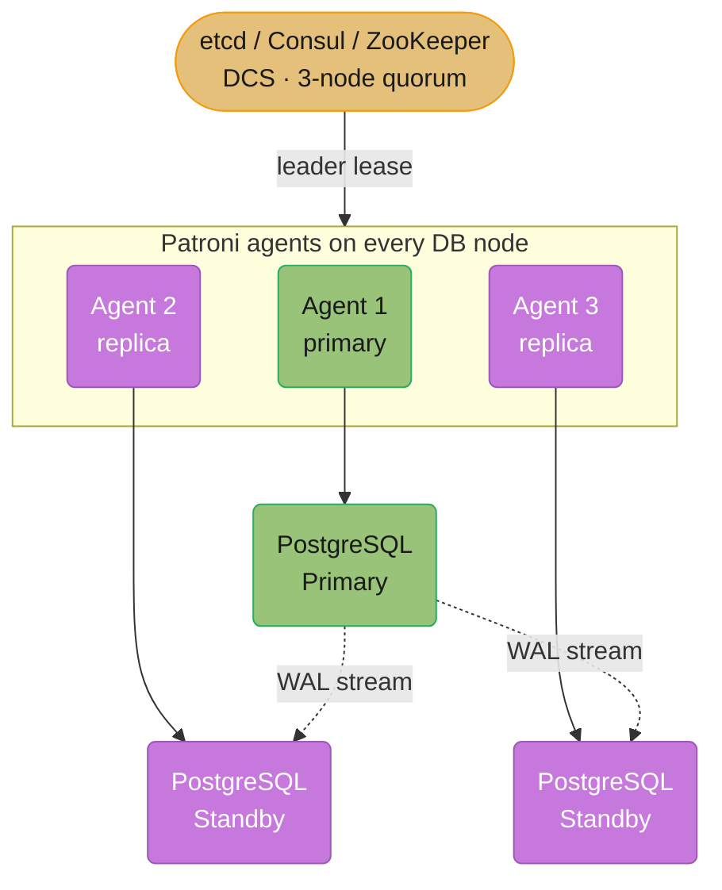
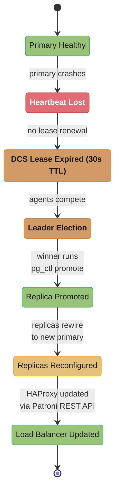
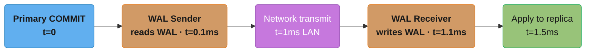
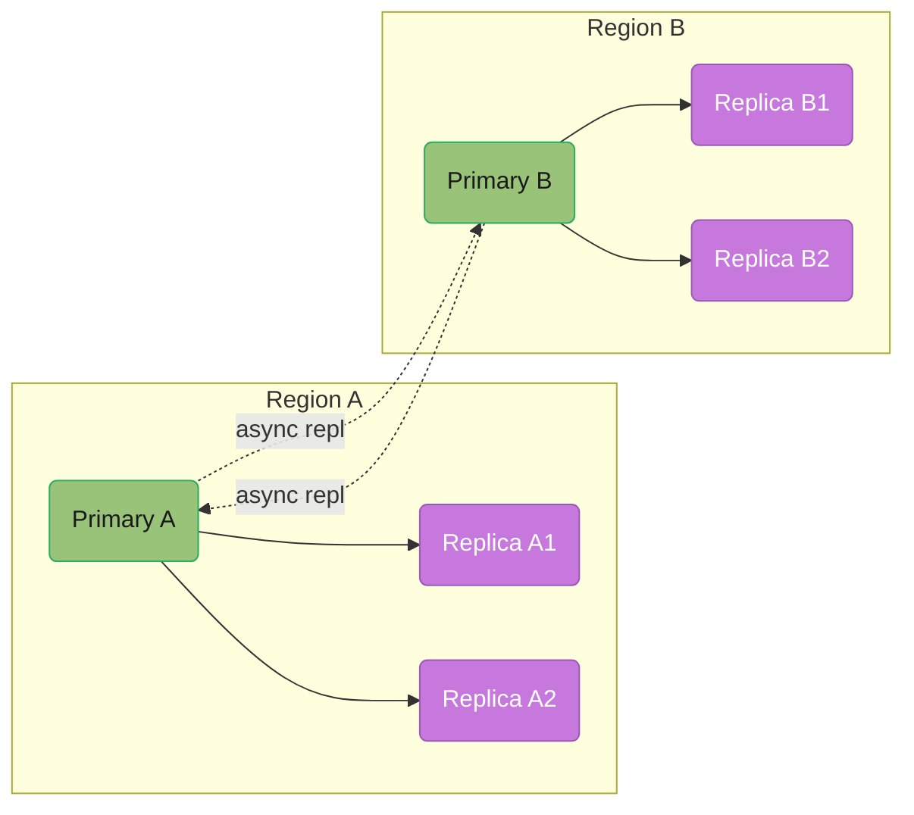
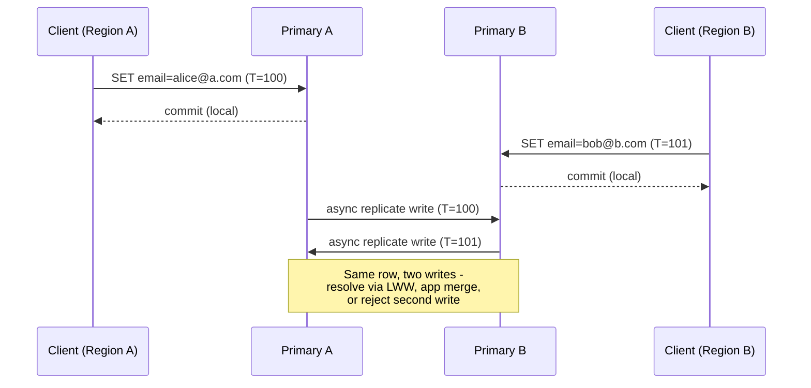
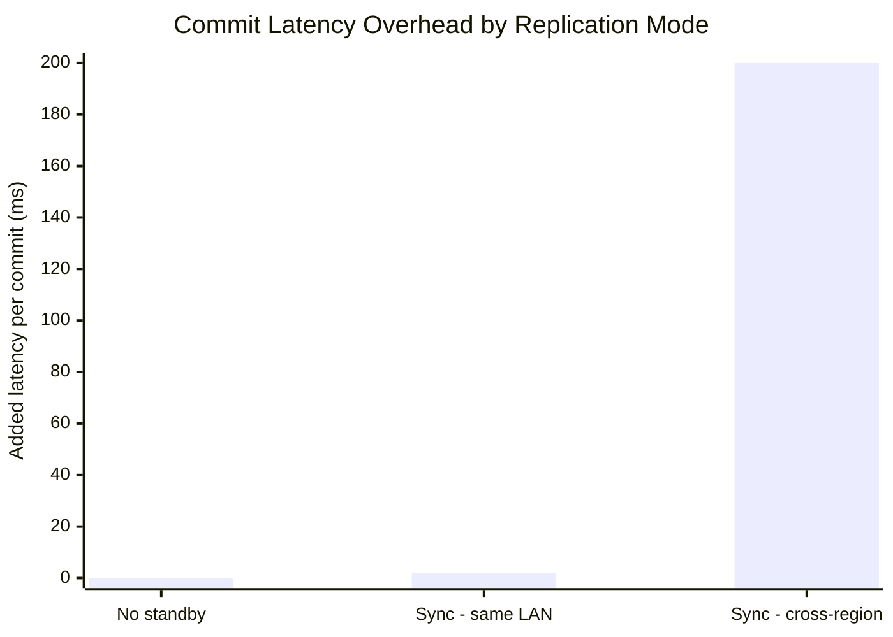
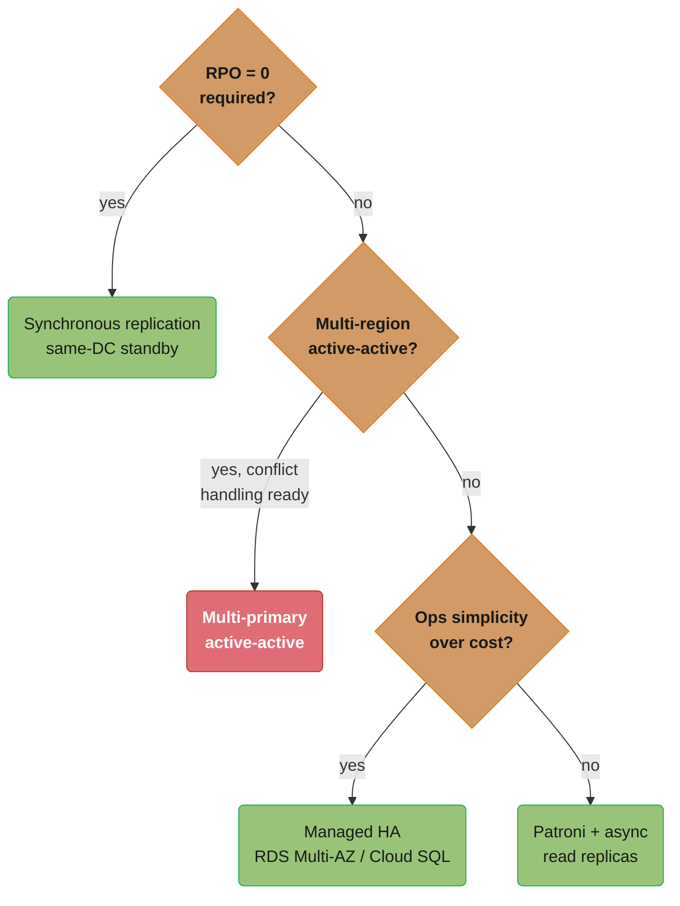
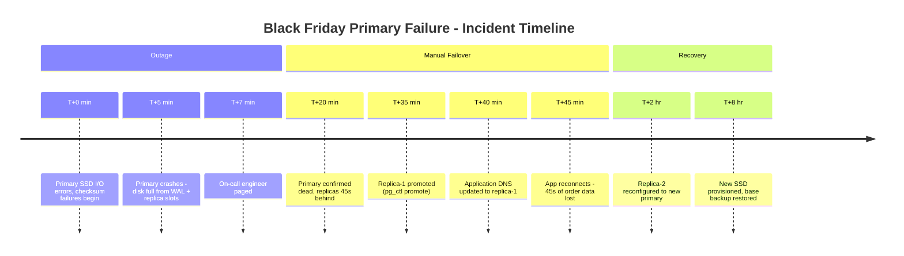

# Replication and High Availability

## 1. Concept Overview

Replication is the process of maintaining copies of data on multiple database servers so that the system continues to function when individual nodes fail. High availability (HA) combines replication with automated failover to eliminate (or minimize) downtime from hardware failures, software crashes, or planned maintenance. The key tension is between consistency (synchronous replication = zero data loss, high latency) and availability/performance (asynchronous replication = low latency, potential data loss on failover).

Production databases use one of three topologies: single-primary with replicas (most common), multi-primary (active-active, complex), or leaderless (Dynamo-style, used by Cassandra/DynamoDB).

---

## 2. Intuition

Think of a primary database as a master ledger and replicas as copies given to trusted assistants. Synchronous replication is like requiring every assistant to sign before the transaction is complete — slow but you are guaranteed everyone has the update. Asynchronous replication is like handing out carbon copies — faster, but if the master ledger burns before the carbon copies arrive, those transactions are lost.

High availability adds a protocol: when the master ledger is lost, the most up-to-date assistant is promoted and becomes the new master.

---

## 3. Core Principles

**Replication log**: Changes are captured as a sequential log (WAL in PostgreSQL, binlog in MySQL, oplog in MongoDB). Replicas consume this log and apply changes to their own copy.

**Replication lag**: The time between a write being committed on the primary and applied on a replica. Even 0.1 seconds of lag matters if your application reads from replicas and expects to see its own writes.

**Quorum**: For HA decisions (is the primary dead? should we failover?), a majority of nodes must agree to prevent split-brain.

**Fencing**: After failover, the old primary must be prevented from accepting writes. A fencing token or STONITH (Shoot The Other Node In The Head) ensures the old primary cannot corrupt data after it is demoted.

---

## 4. Types / Architectures / Strategies

```
Topology            | Description                      | Use Case
--------------------|----------------------------------|----------------------------
Single-primary      | One writer, N readers            | Most OLTP workloads
Multi-primary       | Multiple writers, conflict mgmt  | Multi-region active-active
Leaderless          | Any node accepts writes          | Dynamo, Cassandra, Riak
Cascading           | Replica of a replica             | Reduce primary load

Replication Method  | Description                      | Lag Profile
--------------------|----------------------------------|----------------------------
Streaming (physical)| Raw WAL bytes, page-level changes| Lowest lag (sub-second)
Logical             | Row-level change events (CDC)    | Slightly higher lag, selective
Statement-based     | SQL statements                   | Non-deterministic (avoid)
```

---

## 5. Architecture Diagrams

**PostgreSQL streaming replication with Patroni HA.** A Distributed Configuration Store (DCS) arbitrates leadership; the Patroni agent holding the lease runs the PostgreSQL primary, while the other agents run standbys that pull WAL over streaming replication.



**Failover sequence.** Losing the primary's heartbeat is only the first of six state transitions Patroni walks through before traffic reaches a new primary.



**Replication lag sources.** Each hop between commit and apply adds its own slice of latency.



Total lag: 1.5ms on a LAN to 50ms+ across regions.

**Multi-region active-active (conflict territory).** Two primaries in two regions each accept local writes and replicate asynchronously to the other; nothing stops the same row from being written in both regions before either replica catches up.





Both writes commit locally before either region learns about the other's update, so replication delivers a genuine conflict that only application-level policy (last-write-wins, merge, or reject) can resolve.

---

## 6. How It Works — Detailed Mechanics

### PostgreSQL WAL and Streaming Replication

PostgreSQL writes every change to the WAL (Write-Ahead Log) before applying it. Each WAL record has an LSN (Log Sequence Number). The WAL sender process on the primary streams WAL segments to WAL receiver processes on replicas. Replicas apply WAL in order, maintaining an exact copy of the primary's data.

```
WAL segment size: 16MB per file (pg_wal/ directory)
LSN format: 0/1234ABCD (segment/offset within segment)

Key configuration:
  wal_level = replica        -- minimum for streaming replication
  max_wal_senders = 10       -- max concurrent replication connections
  wal_keep_size = 1GB        -- retain this much WAL for slow replicas (without slot)

Monitoring replication lag:
  SELECT
      client_addr,
      state,
      sent_lsn,
      write_lsn,
      flush_lsn,
      replay_lsn,
      (sent_lsn - replay_lsn) AS replication_lag_bytes,
      write_lag,
      flush_lag,
      replay_lag
  FROM pg_stat_replication;
```

### Replication Lag Arithmetic

`replication_lag_bytes` is a level, not a rate, and levels obey a conservation law. WAL arrives at the primary's generation rate and leaves at the replica's apply rate:

```
lag_growth_rate  = W - A                      (bytes/sec; negative means catching up)
lag_bytes(t)     = lag_0 + (W - A) x t
lag_seconds      = lag_bytes / W              (how far back in time the replica sits)
catch_up_time    = lag_bytes / (A - W_new)    (only defined once A > W_new)
```

**What the formula is telling you.** "Lag is a queue: it grows at exactly the difference between how fast WAL is produced and how fast it is consumed, and it never drains until production drops below consumption." The consequence engineers miss is that a replica 1% too slow does not stay 1% behind — it falls behind forever, linearly, until something changes.

| Symbol | What it is |
|--------|------------|
| `W` | Primary WAL generation rate, bytes/sec (`pg_current_wal_lsn()` advance rate) |
| `A` | Replica apply rate, bytes/sec — single-threaded WAL replay in PostgreSQL, so often below `W` |
| `W - A` | The leak. Positive means the gap widens every second; zero means lag freezes wherever it is |
| `lag_0` | Lag already accumulated when the imbalance began |
| `lag_seconds` | Bytes converted to time by dividing by `W` — this is what `replay_lag` reports |
| `A - W_new` | Drain rate after the write burst subsides; the denominator of every catch-up estimate |

**Walk one example.** Section 10's incident rates — primary generating 50 GB/hour, replica applying 40 GB/hour:

```
  W = 50 GB/hr      A = 40 GB/hr      lag_0 = 0

  lag_growth = 50 - 40 = 10 GB/hr

  t = 1 hr   ->  lag =  10 GB    <- the 10GB slot alert fires here
  t = 3 hr   ->  lag =  30 GB
  t = 12 hr  ->  lag = 120 GB

  in time units at t = 12 hr:
    lag_seconds = 120 GB / (50 GB/hr) = 2.4 hr = 8,640 s
    the replica is serving reads from 2.4 hours ago

  catch-up after the burst, writes fall to W_new = 20 GB/hr:
    drain rate    = A - W_new = 40 - 20 = 20 GB/hr
    catch_up_time = 120 GB / 20 GB/hr = 6.0 hr
```

Twelve hours of a 20% shortfall takes six hours of half-rate traffic to undo. That asymmetry is why the answer to "the replica is lagging" is almost never "wait" — it is reduce `W` (batch writes, throttle the bulk job) or raise `A` (faster replica disk, fewer conflicting queries), and if neither is available, rebuild the replica from a fresh `pg_basebackup`, which resets `lag_0` to zero in one step instead of draining it.

**Why `A` is the harder number to move.** PostgreSQL replays WAL in a single startup process — one core, sequential, no parallelism. The primary generated that WAL using dozens of concurrent backends. So `A < W` is the natural state under a write burst, not a misconfiguration, and it is the reason a replica on identical hardware still falls behind.

### Replication Slots

A replication slot prevents the primary from discarding WAL that a replica has not yet consumed. Without a slot, if a replica falls behind, the primary may delete WAL before the replica reads it, breaking replication.

```sql
-- Create a physical replication slot
SELECT pg_create_physical_replication_slot('replica_1');

-- Monitor slot WAL retention
SELECT
    slot_name,
    pg_size_pretty(pg_wal_lsn_diff(pg_current_wal_lsn(), restart_lsn)) AS lag_size
FROM pg_replication_slots;
```

**Replication slot danger**: If a replica disconnects for days, the primary accumulates all WAL since the replica's last consumed LSN. A 1TB/day write workload fills disk in hours. This has caused production outages: replica slot WAL accumulation fills the primary's disk, crashing the database.

**Rule**: Always monitor slot lag size. Alert at 10GB. Drop the slot if the replica is permanently gone: `SELECT pg_drop_replication_slot('replica_1');`

### Synchronous vs Asynchronous Replication

```
postgresql.conf:
  synchronous_commit = on          -- default: wait for primary local WAL flush
  synchronous_standby_names = ''   -- asynchronous (no replica acknowledgment)

For synchronous replication:
  synchronous_standby_names = 'FIRST 1 (replica1, replica2)'
  -- Wait for at least 1 replica to flush WAL before returning commit to client

Impact:
  synchronous_commit = on, no standby: ~0.1ms overhead (local fsync)
  synchronous_commit = on, one synchronous standby (LAN): +0.5–2ms per commit
  synchronous_commit = on, one synchronous standby (cross-region): +10–200ms per commit

synchronous_commit = off (async):
  Write acknowledged before WAL flushed to disk. Up to ~200ms of data loss window.
  3x higher throughput for write-heavy workloads. Acceptable for session data, logs.
  NOT acceptable for financial transactions.
```

The commit-latency cost of synchronous replication scales dramatically with distance — the same RPO=0 guarantee that costs about 1-2ms on a LAN can cost up to 200ms across regions:



That roughly 2000x range between the cheapest and most expensive synchronous option is why most teams keep synchronous standbys in the same datacenter and fall back to asynchronous replication for cross-region replicas.

That 2000x is not a tuning failure — it is physics with a fixed floor. A synchronous commit cannot return until a round trip completes:

```
commit_latency = local_fsync + RTT + remote_fsync
RTT_floor      = 2 x distance / (c x 0.67)         (0.67 = light speed in fiber)
max_commits_per_connection = 1000 / commit_latency_ms
```

**In plain terms.** "Every synchronous commit buys its zero-data-loss guarantee with one network round trip, and no amount of hardware makes light travel faster than fiber allows." The last line is the one that surprises people: synchronous replication does not slow the *server* down, it slows each *connection* down, so the fix is concurrency, not a bigger box.

| Symbol | What it is |
|--------|------------|
| `local_fsync` | Primary flushing its own WAL to durable storage, ~0.1ms on NVMe |
| `RTT` | Round trip to the standby and back — request out, acknowledgment in |
| `remote_fsync` | Standby's own flush before it may acknowledge; overlaps the return trip |
| `c x 0.67` | ~200,000 km/s — light in glass, about two thirds of its vacuum speed |
| `distance` | One-way cable distance, always longer than the map distance (fiber does not run straight) |
| `max_commits_per_connection` | Hard ceiling on one session's commit rate; total throughput needs many sessions |

**Walk one example.** The same RPO=0 guarantee at three distances:

```
  configuration          distance    RTT floor              commit latency   commits/sec/conn
  --------------------   ---------   --------------------   --------------   ----------------
  no standby                    -    -                      0.1 ms                    10,000
  standby, same LAN         <1 km    ~0.05 ms (switching     2   ms                       500
                                      dominates)
  standby, cross-region  5,500 km    2 x 5500 / 200000      200  ms                         5
                                      = 55 ms one round
                                      trip; real links add
                                      routing + queuing

  ratio, no standby to cross-region : 200 / 0.1 = 2000x
```

The 55ms floor is what a perfectly engineered New York to Dublin link would cost; the 200ms in the chart is that floor plus real routing, queuing, and the standby's own fsync. You cannot negotiate the 55ms down — which is why the honest cross-region choices are asynchronous replication (accept RPO > 0) or a consensus system that commits within one region and replicates the log, not synchronous PostgreSQL across an ocean.

**What the per-connection ceiling means in practice.** At 200ms per commit, one connection does 5 commits/sec. To sustain 5,000 commits/sec you need 1,000 concurrent connections all blocked in `fsync` at the same time — which is a connection-pool sizing problem, not a database problem, and it is exactly the wall teams hit when they "just turn on" cross-region synchronous replication.

### Patroni HA and Split-Brain Prevention

Patroni uses a Distributed Configuration Store (DCS — etcd, Consul, or ZooKeeper) as the arbiter. The DCS is itself a 3-node quorum, tolerating 1 node failure. Patroni's leader holds a DCS lease (TTL = 30s). If the leader fails to renew, the lease expires and a new leader is elected.

**Fencing**: Before promoting a new primary, Patroni ensures the old primary is fenced:
1. Patroni calls the DCS to revoke the old primary's lease
2. Optionally: STONITH (power off the old primary via IPMI, cloud API) — prevents it from accepting writes even if it comes back up
3. The new primary issues a `pg_ctl promote`

Without fencing, the old primary could temporarily serve stale writes in a split-brain scenario: both the old and new primary accept writes, and data diverges.

### MySQL Binary Log and GTID Replication

MySQL uses the binary log (binlog) for replication. With GTID (Global Transaction Identifier), each transaction has a globally unique ID of the format `server_uuid:transaction_id`. Replicas use GTIDs to track exactly which transactions they have applied, making failover self-healing: a new replica can connect to any primary and say "I have all transactions up to GTID X; send me the rest."

```sql
-- Enable GTID replication in my.cnf
gtid_mode = ON
enforce_gtid_consistency = ON

-- Check replica GTID status
SHOW REPLICA STATUS\G
  Executed_Gtid_Set: xxxxxxxx-xxxx-xxxx-xxxx-xxxxxxxxxxxx:1-1000
  Retrieved_Gtid_Set: xxxxxxxx-xxxx-xxxx-xxxx-xxxxxxxxxxxx:1-1001
  -- Lag: 1 transaction behind
```

---

## 7. Real-World Examples

**GitHub**: Uses Orchestrator for MySQL HA. Orchestrator monitors topology, detects failures, and performs automated failover. GitHub's "loss aversion" approach: they accept a brief failover window (30–60s) to avoid data loss, using semi-synchronous replication.

**Zalando**: Open-sourced Patroni. Their PostgreSQL HA setup uses Patroni + etcd with automated failover tested weekly via chaos engineering (they intentionally kill primaries in production).

**Instagram**: Migrated from MySQL to PostgreSQL with Patroni for HA. Used logical replication for zero-downtime major version upgrades (PG 9.6 → PG 10) without downtime.

---

## 8. Tradeoffs

```
Mode                    | RPO      | RTO         | Throughput Impact | Complexity
------------------------|----------|-------------|-------------------|------------
Async replication       | Seconds  | 30-120s     | None              | Low
Sync (1 standby, LAN)   | 0        | 30-60s      | +1ms/write        | Medium
Sync (1 standby, WAN)   | 0        | 30-60s      | +50-200ms/write   | Medium
Multi-primary (active)  | 0        | 0 (no fail) | Conflict overhead | Very High
Patroni HA              | Seconds  | 15-30s      | None              | Medium
Cloud HA (RDS Multi-AZ) | 0        | 60-120s     | None (+3ms AZ)    | Low (managed)
```

The RTO column converts directly into the availability number the business actually signs up for:

```
availability     = MTBF / (MTBF + MTTR)         MTTR is the RTO you achieve
downtime_per_yr  = (1 - availability) x 525,600 minutes
combined_uptime  = 1 - (1 - p)^n                n independent replicas, each up p
```

**Read it like this.** "Availability is the fraction of time the thing works, and it is set far more by how fast you recover than by how rarely you break." Halving MTTR improves availability exactly as much as doubling MTBF — and MTTR is the one you control with automation, while MTBF is largely bought from a hardware vendor.

| Symbol | What it is |
|--------|------------|
| MTBF | Mean Time Between Failures — how long the system runs before the next incident |
| MTTR | Mean Time To Recovery — detection plus failover plus reconnection. Equals the RTO you hit |
| `525,600` | Minutes in a 365-day year; converts an availability fraction into a downtime budget |
| `p` | Probability a single node is up at a random instant |
| `(1-p)^n` | Probability all `n` replicas are down *at once*, assuming failures are independent |
| `n` | Replica count. Each one multiplies the outage probability by `(1-p)` again |

**Walk one example.** Same hardware, four failures a year, three different recovery paths:

```
  path                     MTTR (RTO)   downtime/yr        availability   "nines"
  ----------------------   ----------   ----------------   ------------   -------
  manual failover          40 min       4 x 40  = 160 min    99.96956%    3 nines
  RDS Multi-AZ             2 min        4 x 2   =   8 min    99.99848%    4 nines
  Patroni automated        18 s         4 x 0.3 =   1.2 min  99.99977%    4+ nines

  the yearly budget each tier allows:
    99.9%    ->  525.60 min/yr   (8.8 hours)
    99.99%   ->   52.56 min/yr
    99.999%  ->    5.26 min/yr

  manual failover blows the 99.99% budget on its third incident of the year:
    3 x 40 = 120 min  >  52.56 min
```

Nothing about the hardware changed across those three rows. Automating the failover — the Section 14 fix — bought two orders of magnitude of downtime reduction, `160 / 1.2 = 133x`, purely by shrinking MTTR.

**Where `1 - (1-p)^n` helps and where it lies.** With each node up 99.9% of the time:

```
  n = 1  ->  1 - 0.001^1 = 99.9%          8.76 hours down per year
  n = 2  ->  1 - 0.001^2 = 99.9999%       31.5 seconds per year
  n = 3  ->  1 - 0.001^3 = 99.9999999%    31.5 milliseconds per year
```

Those last two numbers are fantasy, and knowing why is the interview answer. The formula assumes **independent** failures, and replicas share a rack, a power feed, an availability zone, a network fabric, a deployment pipeline, and one bad `ALTER TABLE`. Correlated failure sets a floor the exponent cannot cross — which is why real HA designs spend their effort on *decorrelation* (spread across AZs, stagger upgrades, separate the DCS quorum from the database nodes) rather than on adding a fourth replica.

---

## 9. When to Use / When NOT to Use

The five rules below collapse into a single decision path — RPO first, then region topology, then operational appetite:



**Use synchronous replication when**: RPO=0 is a hard requirement (financial, healthcare). Data loss on failover is unacceptable even for a single write.

**Use asynchronous replication when**: Performance trumps RPO=0. Accept 1–60 seconds of potential data loss on primary failure. Typical for read-scaling replicas, analytics replicas, and reporting databases.

**Use Patroni when**: You run self-hosted PostgreSQL and need automated HA. It is the de facto standard. Requires managing etcd/Consul separately.

**Use managed HA (RDS Multi-AZ, Cloud SQL HA) when**: Operational simplicity trumps cost. No need to manage Patroni or etcd.

**Avoid multi-primary when**: Your application is not designed for conflict resolution. The complexity cost is almost always higher than the benefit for single-region applications.

---

## 10. Common Pitfalls

**Replication slot causing disk fill**: A replica is offline for maintenance. Its replication slot holds WAL on the primary. A high-write workload generates 50GB/hour of WAL. 12 hours later, the primary's disk fills and PostgreSQL crashes — taking down the entire service. The fix: monitor slot lag aggressively; set a maximum retained WAL size; drop slots for disconnected replicas immediately.

A replication slot turns an offline replica into a countdown timer on the primary's disk:

```
retained_WAL(t)   = W x t_disconnected            (a slot never forgets)
time_to_disk_full = free_space / W
alert_lead_time   = (free_space - alert_threshold) / W
```

**Put simply.** "An abandoned slot converts your primary's free disk into a stopwatch, and the write rate sets how fast it runs." The dangerous property is that nothing degrades gradually — the primary is perfectly healthy right up to the instant it is not, so the only useful signal is the lead time, not the current level.

| Symbol | What it is |
|--------|------------|
| `W` | WAL generation rate — the same primary write rate that drives replication lag |
| `t_disconnected` | How long the replica has been gone. The slot retains WAL for every second of it |
| `free_space` | Disk headroom on the primary's `pg_wal/` filesystem when the replica went away |
| `time_to_disk_full` | Seconds until PostgreSQL crashes with "no space left on device" |
| `alert_lead_time` | How much warning a threshold alert actually gives you — the number that matters |
| `max_slot_wal_keep_size` | PG13+ cap that invalidates the slot instead of filling the disk. The real fix |

**Walk one example.** The Section 14 incident's numbers — 50 GB/hour of WAL, two slots, 600 GB of headroom:

```
  W = 50 GB/hr        free_space = 600 GB

  time_to_disk_full = 600 / 50 = 12.0 hours     <- matches the incident timeline

  lead time from each alert threshold:
    alert at 10 GB  ->  (600 - 10) / 50 = 11.8 hr of warning   (the recommended rule)
    alert at 100 GB ->  (600 - 100) / 50 = 10.0 hr
    alert at 500 GB ->  (600 - 500) / 50 =  2.0 hr             (too late to be useful)

  the same slot on a 1 TB/day workload:
    W = 1000 GB / 24 hr = 41.7 GB/hr
    time_to_disk_full = 600 / 41.7 = 14.4 hours
```

Note how little the threshold changes the *outage* time and how much it changes the *warning* time — a 10GB alert and a 500GB alert both precede the same crash at hour 12, but one gives an on-call engineer most of a working day and the other gives them a lunch break. This is why the rule is "alert at 10GB", a level that is operationally harmless, rather than at some fraction of the disk.

Setting `max_slot_wal_keep_size = 10GB` removes the countdown entirely: past that point PostgreSQL invalidates the slot and resumes recycling WAL. You lose the replica (it must be rebuilt from a base backup) instead of losing the primary — which is always the correct trade.

**Split-brain after network partition**: Primary and replica lose connectivity. HAProxy's health checks detect the primary as down and starts routing writes to the promoted replica. The old primary's health check reconnects and it also starts accepting writes. Data diverges on both. Fix: use Patroni with proper fencing; never run HA without a quorum-based DCS.

**Read-your-writes violation**: User updates their profile, then reads it back. The read is routed to an async replica with 500ms lag. The user sees the old profile. Fix: route write-following reads to the primary, or use a stale-read tolerance window with replica lag checks.

**Failover during high-traffic**: Planned failover during peak traffic. The new primary starts cold — its buffer pool is empty. Query performance degrades 10x for 5 minutes while the buffer pool warms up. Fix: schedule failovers during low-traffic windows, or use `pg_prewarm` extension to preload frequently accessed pages on the new primary before promoting.

---

## 11. Technologies & Tools

| Tool            | Purpose                                   | Database     |
|-----------------|-------------------------------------------|--------------|
| Patroni         | PostgreSQL HA with DCS-based failover     | PostgreSQL   |
| repmgr          | PostgreSQL replication management         | PostgreSQL   |
| Orchestrator    | MySQL HA and topology management          | MySQL        |
| MHA             | MySQL Master HA (older, less used)        | MySQL        |
| HAProxy         | TCP load balancing, health-check routing  | Any          |
| PgBouncer       | Connection pooling during failover        | PostgreSQL   |
| WAL-G           | WAL archiving + continuous backup         | PostgreSQL   |
| Debezium        | CDC from replication log to Kafka         | PG/MySQL/Mongo|

---

## 12. Interview Questions with Answers

**Q: What is split-brain and how does Patroni prevent it?**
Split-brain occurs when two nodes both believe they are the primary and accept writes simultaneously, creating divergent data that cannot be automatically reconciled. Patroni prevents this using a Distributed Configuration Store (etcd, Consul, or ZooKeeper) as an external arbiter. Only the node holding the DCS leader lease may act as primary. When a primary fails to renew its lease (due to crash or network partition), the lease expires and a new election occurs. Before promoting a new primary, Patroni optionally fences the old primary (via STONITH or cloud API) to ensure it cannot accept writes even if it recovers connectivity.

**Q: Why can replication slots be dangerous in production?**
Replication slots prevent the primary from discarding WAL that a replica has not yet consumed. If a replica disconnects (maintenance, failure, misconfiguration) and its slot is not dropped, the primary retains all WAL generated since the replica's last applied position. In a write-heavy environment, this can fill the primary's disk in hours. PostgreSQL does not automatically drop slots or limit WAL accumulation — it will crash with "no space left on device" rather than drop a slot. Always monitor `pg_replication_slots.restart_lsn` lag and alert when slot lag exceeds 10GB.

**Q: How do you achieve read-your-writes consistency with read replicas?**
Options in increasing complexity: (1) Route all reads to the primary — simple but defeats the purpose of replicas. (2) Track the last write's LSN per session and only read from a replica that has caught up to that LSN — requires replica lag monitoring and routing logic. (3) Use sticky sessions: after a write, route all reads from that session to the primary for a brief window (e.g., 500ms). PostgreSQL `pg_stat_replication.replay_lag` provides the per-replica lag. Application frameworks like Spring Data can route reads using a custom `AbstractRoutingDataSource` with lag awareness.

**Q: Explain semi-synchronous replication tradeoffs.**
Semi-synchronous replication (MySQL `rpl_semi_sync_source_enabled`) waits for at least one replica to acknowledge receipt of WAL before returning success to the client — but only acknowledgment of receipt (written to replica's relay log), not full apply. This provides a guarantee that committed data exists on at least two servers, reducing data loss window to near-zero, while adding only one network RTT of latency (~0.5–2ms on LAN). If no replica acknowledges within `rpl_semi_sync_source_timeout` (default 10s), MySQL falls back to asynchronous mode to avoid blocking indefinitely. The fallback means semi-sync is not a hard RPO=0 guarantee.

**Q: What is the difference between streaming replication and logical replication in PostgreSQL?**
Streaming replication sends raw WAL bytes (physical replication) — the replica maintains an identical bit-for-bit copy of the primary. It is simpler, lower overhead, and used for HA standby servers. Logical replication decodes WAL into row-level change events (INSERT/UPDATE/DELETE) and replicates specific tables or databases. It allows replication to a different PostgreSQL major version, to a replica with different schema (e.g., additional indexes), or to non-PostgreSQL systems (via Debezium). The tradeoff: logical replication is slightly higher overhead and does not replicate DDL automatically.

**Q: How do you perform a zero-downtime major version upgrade of PostgreSQL?**
Use logical replication across versions: (1) Set up PostgreSQL 17 instance alongside PG 15 primary. (2) Use `pg_logical` or `pglogical` extension to create logical replication from PG 15 → PG 17. Wait for PG 17 to fully catch up (lag < 1 second). (3) Put application into read-only mode briefly (or use traffic shaping to drain writes). (4) Wait for PG 17 replication lag to reach 0. (5) Update application DSN to PG 17 primary. (6) Remove PG 15 instance. Alternatively, use `pg_upgrade --link` (hard links, fast but requires downtime for switchover) or AWS Aurora's blue/green deployments.

**Q: What is cascading replication and when is it useful?**
Cascading replication is a replica-of-a-replica topology: Primary → Replica A → Replica B. Replica B receives WAL from Replica A rather than the primary. This reduces WAL sender connections on the primary (each WAL sender uses ~5MB RAM and CPU), useful when you have many replicas (> 10). Replica B has higher replication lag (primary lag + A-to-B lag). Use cascading for analytics or reporting replicas that can tolerate higher lag, while keeping lag-sensitive read replicas directly connected to the primary.

**Q: How does MySQL Group Replication differ from traditional MySQL replication?**
Group Replication (MySQL 5.7.17+) uses a Paxos-based group communication protocol where all group members agree on the order of transactions before they commit. Every write is certified against concurrent writes before committing, detecting conflicts automatically. It supports both single-primary mode (one writer, automated failover) and multi-primary mode (all nodes accept writes, conflict detection). Unlike traditional async replication where the primary decides and replicas follow, Group Replication requires a quorum (N/2+1) to commit any transaction, making it CP rather than AP. Trade-off: higher write latency (~1ms additional for group certification) in exchange for stronger consistency.

**Q: What monitoring metrics are essential for replication health?**
Critical metrics: (1) `replication_lag` (seconds or bytes behind primary) — alert at > 60 seconds. (2) `pg_replication_slots` slot lag in bytes — alert at > 10GB. (3) `pg_stat_replication.write_lag / flush_lag / replay_lag` — distinguish network lag from apply lag. (4) `seconds_behind_master` in MySQL `SHOW REPLICA STATUS` — alert at > 30 seconds. (5) Replica count: alert if fewer replicas than expected are connected. (6) Primary WAL generation rate (bytes/sec) vs replica apply rate — if primary generates faster than replica applies, lag will grow. (7) Error log entries: replication errors often appear here before they cause visible lag.

**Q: How do you handle a lagging replica that is falling further behind?**
Diagnose first: is lag from network saturation, slow disk on replica, long-running transactions on primary causing large WAL, or DDL locks on replica? Tools: `pg_stat_replication`, `pg_stat_activity` on both primary and replica. Fixes: (1) Reduce primary write volume (batch more, write less). (2) If primary has long transactions, set `max_standby_streaming_delay = -1` on replica to allow it to cancel conflicting queries. (3) Add replica compute/storage resources. (4) If the lag is unrecoverable, rebuild the replica from a fresh base backup with `pg_basebackup`.

**Q: What is STONITH and why is it necessary for HA?**
STONITH (Shoot The Other Node In The Head) is a fencing mechanism that forcibly powers off or isolates a failed node before promoting its replacement. Without STONITH, a scenario arises: primary crashes and appears dead to the HA manager; new primary is promoted; old primary recovers connectivity and believes it is still primary. Both accept writes — split-brain. STONITH prevents this by cutting power to the old primary via IPMI/iLO, cloud API (AWS: terminate instance, stop EBS volume), or network-level isolation before promoting the new primary. Patroni supports STONITH via callback scripts.

**Q: Explain the differences between RPO and RTO in the context of database replication.**
RPO (Recovery Point Objective) is the maximum acceptable data loss measured in time: how many minutes or seconds of committed transactions can the business afford to lose? With async replication, RPO = replication lag at the time of failure (typically seconds to minutes). With synchronous replication, RPO = 0. RTO (Recovery Time Objective) is the maximum acceptable downtime: how long can the service be unavailable? With Patroni HA, RTO = 15–30 seconds (automatic failover). With manual failover, RTO = 5–30 minutes (human response time). Cloud managed HA (RDS Multi-AZ) typically achieves RTO < 2 minutes. Both metrics must be defined by business requirements before designing the replication topology.

**Q: What is the role of the pg_hba.conf in replication setup?**
`pg_hba.conf` controls client authentication on PostgreSQL. For replication connections, a specific entry is needed: `host replication replicator 10.0.0.0/24 scram-sha-256`. This allows the `replicator` role (created with `CREATE ROLE replicator WITH REPLICATION LOGIN`) from the replica's subnet to connect for WAL streaming. Without this entry, replicas cannot authenticate. In Patroni setups, the `pg_hba.conf` is managed by Patroni itself using the `bootstrap.dcs.postgresql.pg_hba` configuration, ensuring consistent auth across failover.

**Q: How does multi-region replication work and what are its limitations?**
In multi-region active-passive replication, the primary is in region A and replicas are in region B and C. Writes go to region A; replicas consume WAL over the WAN link (typically 50–200ms latency). RTO involves failing over to region B, which may have 1–10 seconds of lag, implying potential data loss at that lag. Active-active (multi-primary) replication across regions is more complex: every write must be replicated to all regions, conflicts from concurrent writes to the same row must be resolved (LWW, custom merge, or reject), and the application must handle conflict resolution. Systems like CockroachDB and Spanner handle this natively; for PostgreSQL, BDR (Bi-Directional Replication, by EDB) provides multi-master with conflict detection.

**Q: How does logical replication enable CDC (Change Data Capture)?**
Logical replication decodes WAL into row-level change events. Debezium connects to PostgreSQL as a logical replication client using the `pgoutput` output plugin. It receives INSERT/UPDATE/DELETE events per row with old and new values, and publishes them to Kafka topics. Consumers (Elasticsearch indexers, data warehouse loaders, cache invalidation services) process these events asynchronously. The key advantage: Debezium reads the WAL directly without impacting primary performance (WAL is generated anyway) and provides exactly-ordered, exactly-captured changes. The risk: the Debezium logical replication slot retains WAL if the Kafka consumer falls behind.

**Q: How do you monitor and alert on replication lag in production?**
For PostgreSQL: query `pg_stat_replication.replay_lag` from the primary every 30 seconds and expose it as a Prometheus gauge. Alert at lag > 30 seconds (warning) and > 5 minutes (critical). Also monitor slot lag via `pg_replication_slots.confirmed_flush_lsn` vs `pg_current_wal_lsn()`. For MySQL: use Prometheus `mysqld_exporter` which exports `mysql_slave_status_seconds_behind_master`. For automated alerting, set PagerDuty or Slack alerts on these metrics with severity thresholds matching your RPO requirements. Test alerting quarterly by deliberately pausing a replica.

---

## 13. Best Practices

- **Use synchronous replication for RPO=0 requirements** on a single standby in the same data center; accept the ~1–2ms latency addition.
- **Never run without a quorum DCS** for HA — a single Patroni agent without etcd can promote incorrectly during network partitions.
- **Drop replication slots immediately** when a replica is permanently decommissioned; never leave dangling slots.
- **Test failover quarterly** under realistic load — failover behavior under a busy buffer pool is different from failover on an idle test server.
- **Monitor replication lag with two signals**: time lag (seconds) for application impact, and WAL lag (bytes) for disk risk.
- **Use connection pooling (PgBouncer) in front of the primary** so that failover is transparent to the connection pool, not to every application connection.
- **Enable `wal_log_hints = on`** in PostgreSQL to allow `pg_rewind` — used by Patroni to resynchronize an old primary after failover without a full base backup.
- **Set `idle_in_transaction_session_timeout`** on the primary: long idle transactions block VACUUM and can cause replica recovery conflicts.

---

## 14. Case Study

**Scenario**: An e-commerce platform runs PostgreSQL on a single primary with two async replicas for reads. During Black Friday, the primary node's SSD fails. Unmonitored replication slots on both replicas have accumulated 50GB of WAL on the primary disk. The team has no automated HA.

**Timeline of the incident**:



**Total downtime**: 40 minutes. **Data loss**: 45 seconds of transactions.

Those two numbers are RTO and RPO measured rather than promised, and each decomposes into parts you can attack separately:

```
RTO = t_detect + t_decide + t_promote + t_reroute + t_reconnect
RPO = replication_lag at the moment the primary died
```

**Stated plainly.** "RTO is a sum of steps, so it improves by deleting steps; RPO is a single measurement of how far behind the survivor was, so it improves only by changing the replication mode." Confusing the two leads teams to buy faster failover when what they needed was synchronous replication, or the reverse.

| Symbol | What it is |
|--------|------------|
| `t_detect` | Crash to alarm. Bounded by heartbeat interval and lease TTL, not by human speed |
| `t_decide` | Alarm to "yes, it is really dead." The step humans are worst at |
| `t_promote` | Running `pg_ctl promote` and waiting for recovery to finish |
| `t_reroute` | Load balancer or DNS pointed at the new primary |
| `t_reconnect` | Application pools re-establishing sessions and warming |
| RPO | Replication lag at failure. `0` under synchronous replication, `= lag` under async |

**Walk one example.** The timeline above, segmented:

```
  step           span              minutes   automatable?
  ------------   ---------------   -------   -------------------------
  t_detect       T+5  -> T+7           2     yes - lease TTL, ~30s
  t_decide       T+7  -> T+20         13     yes - DCS quorum decides
  t_promote      T+20 -> T+35         15     yes - Patroni runs promote
  t_reroute      T+35 -> T+40          5     yes - Patroni REST + HAProxy
  t_reconnect    T+40 -> T+45          5     partly - pool reconnect
  ------------   ---------------   -------
  RTO total                            40

  human-in-the-loop steps: t_decide + t_promote = 13 + 15 = 28 min = 70% of RTO

  after the fixes:
    RTO  40 min -> 18 s     improvement = (40 x 60) / 18 = 133x
    RPO  45 s   -> 0 s      not from speed - from synchronous_standby_names
```

Read the two result lines separately. The 133x RTO win came entirely from removing the two human steps that were 70% of the outage — Patroni cannot fix a slow disk, it just never waits for a pager. The RPO win came from a completely different change (fix 5, synchronous replication to replica-1) and would have applied even if the failover had still taken 40 minutes. The remaining 45 seconds of lost orders in the original incident were unrecoverable no matter how fast the promotion ran, because those transactions had never left the dead machine.

**Post-mortem fixes**:
1. Installed Patroni + etcd (3-node); automated failover now takes 15–30 seconds
2. Set `max_slot_wal_keep_size = 10GB` in PostgreSQL 13+ to cap slot WAL retention
3. Added Prometheus alert on `pg_replication_slots` lag > 5GB
4. Added Prometheus alert on `pg_stat_replication.replay_lag > 30s`
5. Switched primary-to-replica1 to synchronous replication (RPO=0 for order data)
6. Scheduled monthly automated failover drills (chaos engineering, non-peak hours)

**Result after changes**: Next failure (3 months later, same cause: disk I/O error) triggered Patroni automated failover in 18 seconds with zero data loss (synchronous replication).
