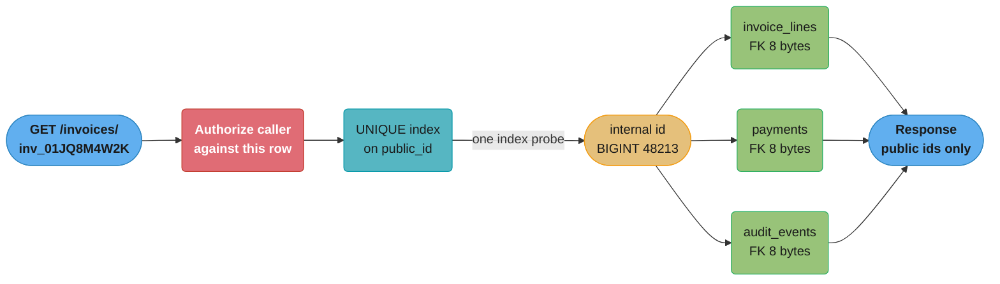
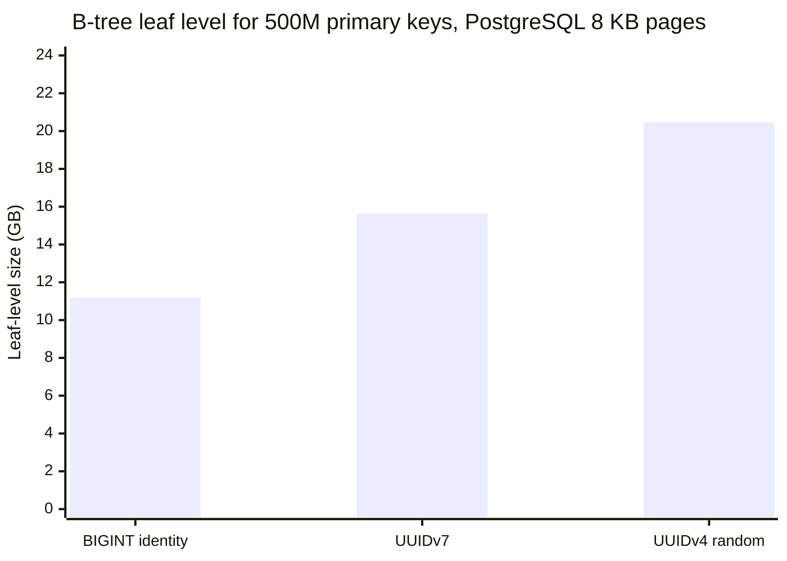

# Surrogate vs Natural Keys — Deep Dive
Companion to [Schema Design and Normalization](schema_design_and_normalization.md). The parent tells you to use
`BIGINT GENERATED ALWAYS AS IDENTITY` and discusses how *wide* an integer column should be. This
file argues the part it skips: which **value** goes in that column, why a natural key is a liability
the day the business changes it, and what `IDENTITY`, UUIDv4, UUIDv7, ULID and Snowflake each cost
at the storage layer. B-tree page mechanics, WAL and buffer-pool behaviour are established in
[Storage Engines Internals](../storage_engines_internals/storage_engines_internals.md) — especially its Section 10,
Pitfall 4, the UUIDv4 page-split story in miniature — and are cross-referenced here, not restated.

---

## 1. Concept Overview

A **natural key** is a column (or set of columns) that already identifies the row in the real world:
an email address, an ISBN, an ISO country code, a `(carrier_code, flight_number, departure_date)`
triple. A **surrogate key** is a value the database invents purely to identify the row — it has no
meaning outside the schema, and nobody outside the engineering team ever sees it.

The argument is usually framed as "meaningful vs meaningless", which makes the natural key sound
better. The correct frame is different: a primary key is a promise of **uniqueness plus
immutability, forever, enforced by something you control**. A natural key borrows that promise from
an external authority — a standards body, a government, a partner company, or a product manager.
Every natural key that has ever burned a schema burned it because that authority changed its mind.

The second, quieter question is what value the surrogate carries. A monotonic integer from a
sequence, a random 128-bit UUID, and a time-ordered UUID are all "meaningless", but they behave
completely differently in a B-tree, in the WAL, in the buffer pool, and in a URL.

**Current versions this file is written against**: PostgreSQL 18 (18.4 is the current minor as of
July 2026; PostgreSQL 19 is in beta), MySQL 9.7 LTS (released 21 April 2026), and RFC 9562 (May
2024), which obsoletes RFC 4122 and is where UUIDv6, UUIDv7 and UUIDv8 are defined.

---

## 2. Intuition

**One-line analogy**: a natural key is filing your customers by their phone number; a surrogate key
is giving each one a locker and writing the phone number on a card inside it. Both work until
someone changes their number.

**Mental model**: think of the primary key as the *bolt* the rest of the schema is welded to. Child
tables, foreign keys, index entries, cached API responses, third-party integrations, and the URLs in
your customers' bookmarks are all welded to it. Changing the bolt means cutting every weld. A
surrogate key is chosen precisely so that no business event can ever require changing it — its whole
value proposition is that it is boring.

**Why it matters**: the failure is not gradual. A natural key works perfectly for four years and
then one day a standards body retires a code, and you discover that "update the key" means
rewriting 400 million child rows under lock while the site is up.

- **Key insight**: "this value never changes" is a **business assumption**, not a technical
  guarantee, and the database cannot enforce it. The only immutability a database can guarantee is
  the immutability of a value it generated itself and nobody outside the schema depends on.

---

## 3. Core Principles

**1. Identity and description are different jobs.** The primary key answers "which row is this?"
The natural attribute answers "what is this row's email/ISBN/code?" Collapsing them means every
change to the description is a change to the identity. Keep the natural value as a `NOT NULL UNIQUE`
column — you still get the integrity constraint, you just do not build the schema on top of it.

**2. Uniqueness is not immutability.** `UNIQUE` is the only property a natural key reliably has.
People assume the second property follows from the first; it does not. An email address is unique
across your users and changes constantly.

**3. A key's width is paid by every child, forever.** The primary key is copied into every foreign
key column, every index on that foreign key, and (in InnoDB) into every secondary index on the
parent table. An 8-byte key and a 16-byte key are not a 8-byte difference; they are an 8-byte
difference multiplied by every reference in the schema.

**4. Insertion order is a physical property, not an aesthetic one.** Where a new key sorts decides
which page it dirties, and that decides how much WAL you write and how much of the buffer pool you
churn. Random keys are not "slightly less tidy" — they change the I/O profile of every insert.

**5. The key you join on and the key you publish are different keys.** Internal joins want the
narrowest, most cache-friendly value available; the API boundary wants something opaque,
non-enumerable, and stable across internal migrations. Nothing requires these to be one column.

**6. Unguessable is hardening, not authorization.** Making an identifier hard to guess reduces the
blast radius of a missing authorization check. It does not replace the check. OWASP API Security
Top 10 puts this plainly under API1:2023 Broken Object Level Authorization: prefer random GUIDs
*and* check authorization in every function that resolves a client-supplied id.

---

## 4. Types / Architectures / Strategies

### The generator comparison

| Generator | Width | Ordering | Generated by | Unique scope | Notes |
|-----------|-------|----------|--------------|--------------|-------|
| `INTEGER` identity | 4 B | Monotonic | Database sequence | One table | 2,147,483,647 ceiling — a real outage source |
| `BIGINT` identity | 8 B | Monotonic | Database sequence | One table | 9.22 x 10^18 ceiling; the default choice |
| `SERIAL` / `BIGSERIAL` | 4 / 8 B | Monotonic | Database sequence | One table | Legacy macro; PostgreSQL docs recommend identity instead |
| UUIDv4 | 16 B | None | Client or DB | Universal | 122 random bits; worst possible index locality |
| UUIDv7 | 16 B | Monotonic to the ms | Client or DB | Universal | 48-bit Unix-ms prefix + 74 bits of rand/counter (RFC 9562) |
| ULID | 16 B | Monotonic to the ms | Client | Universal | 48-bit ms + 80 random bits; 26-char Crockford base32 text form |
| Snowflake | 8 B | Monotonic to the ms | Coordinated workers | Cluster-wide | 1 sign + 41 ts + 10 machine + 12 sequence bits |

### `SERIAL` vs `GENERATED ALWAYS AS IDENTITY`

`SERIAL` is not a type. The PostgreSQL documentation says so directly — it is "merely a notational
convenience", and expands to:

```sql
CREATE SEQUENCE tablename_colname_seq AS integer;
CREATE TABLE tablename (colname integer NOT NULL DEFAULT nextval('tablename_colname_seq'));
ALTER SEQUENCE tablename_colname_seq OWNED BY tablename.colname;
```

That expansion is the whole problem. The sequence is a separate object with separate permissions
(`GRANT INSERT` on the table is not enough — the role also needs `USAGE` on the sequence), the
column's `DEFAULT` is an ordinary default that anyone can override with an explicit value, and the
dependency between the two is a convention the catalog records rather than a property of the column.

```sql
-- Identity: SQL-standard, sequence is an intrinsic property of the column
CREATE TABLE invoices (
    id  BIGINT GENERATED ALWAYS AS IDENTITY PRIMARY KEY,
    ...
);

INSERT INTO invoices (id, ...) VALUES (7, ...);
-- ERROR: cannot insert a non-DEFAULT value into column "id"
-- HINT:  Use OVERRIDING SYSTEM VALUE to override this restriction.
```

That error is the feature. A very common production incident is a data-import script that inserts
explicit ids, leaving the sequence pointing below the highest existing value, so the next organic
insert fails on a duplicate key — and keeps failing until someone runs `setval()`. `GENERATED ALWAYS`
refuses the import instead. Use `GENERATED BY DEFAULT AS IDENTITY` only when you genuinely need to
supply ids (replication, a controlled backfill), and accept that you now own the sequence position.

PostgreSQL's own "Don't Do This" wiki page recommends identity columns for new applications, on the
grounds that serial has "weird behaviors that make schema, dependency, and permission management
unnecessarily cumbersome."

### The UUID versions that matter

RFC 9562 (May 2024) obsoletes RFC 4122 and defines eight versions. Three are worth knowing:

- **UUIDv4** — 122 random bits, 4 version bits, 2 variant bits. No structure, no order.
- **UUIDv7** — `unix_ts_ms` (48 bits) | `ver` (4) | `rand_a` (12) | `var` (2) | `rand_b` (62). The
  timestamp occupies the most significant bits, so byte-wise comparison of two UUIDv7 values sorts
  them by creation time.
- **UUIDv8** — version and variant bits fixed, everything else vendor-defined. The escape hatch for
  a custom layout that still wants to be a legal UUID.

PostgreSQL 18 ships `uuidv7([shift interval])` natively, alongside a `uuidv4()` alias for
`gen_random_uuid()`, and extends `uuid_extract_timestamp()` to cover v7. The implementation puts a
sub-millisecond timestamp fraction into the 12 `rand_a` bits, which makes every value generated in a
single session strictly monotonic. MySQL 9.7 has no built-in v7 generator — `UUID()` still returns
v1, and v7 must come from the application or a loadable component.

### ULID and Snowflake

**ULID** is the same idea as UUIDv7 with a different text encoding: 48-bit millisecond timestamp,
80 bits of randomness, rendered as 26 Crockford base32 characters instead of 36 hyphenated hex ones.
Within a single millisecond, a monotonic ULID generator increments the random component by one
rather than redrawing it. The gotcha is that ULID sets no version or variant bits, so storing one in
a PostgreSQL `uuid` column works at the byte level but produces a value that
`uuid_extract_version()` and any RFC 9562 validator will read as garbage.

**Snowflake** is the only 128-bit alternative's 64-bit cousin: it fits a `BIGINT`. Twitter's original
layout is 1 sign bit, 41 timestamp bits (ms since a custom epoch), 10 machine bits, 12 sequence bits.
Discord uses 42 timestamp bits, 5 worker, 5 process, 12 increment, with an epoch of 1420070400000.
Instagram's variant replaces the machine field with a **13-bit logical shard id** and a 10-bit
sequence, so the key itself tells the router which shard owns the row and `ORDER BY id` is the same
as `ORDER BY created_at`.

The Snowflake price is operational: you need a coordinated, monotonic clock and a guaranteed-unique
worker id per generator. Clock skew or a duplicated worker id produces duplicate keys, which is a
much worse failure than a slow index.

---

## 5. Architecture Diagrams

### Where the inserts land

```
  UUIDv4 -- ten consecutive inserts, ten cold leaf pages
  leaf #    001      417      883     1204     1699     1902     2311     2500
           [ x ]    [ x ]    [ xx]    [ x ]    [ x ]    [ x ]    [ x ]    [ x ]
             ^        ^        ^        ^        ^        ^        ^        ^
           each insert dirties a page that was not in shared_buffers, costs a
           read to fault it in, and costs an 8 KB full-page image in the WAL

  UUIDv7 / BIGINT identity -- ten consecutive inserts, one hot leaf page
  leaf #    001      417      883     1204     1699     1902     2311     2500
                                                                        [xxxxxxxxxx]
                                                                             ^
           all ten append at the right-hand edge: page already resident, already
           full-page-imaged once for this checkpoint interval, split is cheap
```

The insight is not that random keys are untidy — the *set of pages touched* differs by three orders
of magnitude, and every downstream cost (reads, WAL, evictions) scales with that set.

### The two-key pattern



The external identifier is resolved exactly once, at the boundary, and never appears again. Every
join inside the request runs on an 8-byte integer. The internal id is never serialized into a
response, so it can be renumbered by a future migration without breaking a single client.

### What the leaf level costs



Two effects compound: the UUID entry is 40% wider than the BIGINT entry, *and* random insertion
leaves pages 69% full instead of 90%. The derivation is in Section 6.

---

## 6. How It Works — Detailed Mechanics

### Index entry width, exactly

A PostgreSQL B-tree leaf page is 8192 bytes. Subtract the 24-byte `PageHeaderData` and the 16-byte
B-tree special area (`BTPageOpaqueData`) and 8152 bytes remain for entries. Each entry costs an
8-byte `IndexTupleData` header plus the key, MAXALIGN'd to 8, plus a 4-byte `ItemIdData` line
pointer in the page's pointer array.

```
  BIGINT key :  MAXALIGN(8 header + 8 key)  = 16  +  4 line pointer  =  20 bytes
  UUID   key :  MAXALIGN(8 header + 16 key) = 24  +  4 line pointer  =  28 bytes
                                                                        --------
  width penalty per index entry                                          8 bytes  (+40%)
```

Now apply page fill. B-tree indexes default to `fillfactor = 90`, which sequential appends hit
almost exactly because the rightmost page splits are one-sided. Random insertion does not: the
classic analytic result (Yao, "On Random 2-3 Trees", *Acta Informatica* 9, 1978) is that evenly
splitting leaves under uniform random insertion settles at an average fill of `ln 2` ~ 69%.

```
  usable bytes per leaf page              8192 - 24 - 16          =   8152

  sequential (fill 0.90)  ->  8152 x 0.90 = 7336.8 usable
      BIGINT   7336.8 / 20  =  366 entries per leaf
      UUIDv7   7336.8 / 28  =  262 entries per leaf

  random     (fill 0.69)  ->  8152 x 0.69 = 5624.9 usable
      UUIDv4   5624.9 / 28  =  200 entries per leaf

  leaf pages for 500,000,000 rows, and the leaf level in bytes:
      BIGINT   500e6 / 366  = 1,366,121 pages  x 8192  =  11.19 GB
      UUIDv7   500e6 / 262  = 1,908,397 pages  x 8192  =  15.63 GB
      UUIDv4   500e6 / 200  = 2,500,000 pages  x 8192  =  20.48 GB
                                                          --------
  UUIDv4 vs BIGINT                                          1.83x
```

(GB here is 10^9 bytes. Leaf level only — internal pages add roughly another 1%.)

### WAL amplification, quantified

PostgreSQL's `full_page_writes` (default `on`) writes **the entire 8 KB page** into the WAL on the
first modification of that page after a checkpoint. This is what makes random insertion expensive in
a way that a page-split count does not capture.

Take one checkpoint interval carrying 1,000,000 inserts into the 500M-row index above.

```
  sequential keys: appends concentrate at the right edge
      distinct leaves touched  =  1,000,000 / 366  =  2,733
      full-page images         =  2,733 x 8192 B   =  22.4 MB

  random keys: 1,000,000 inserts scattered over N = 2,500,000 leaf pages
      expected distinct pages  =  N x (1 - (1 - 1/N)^k)
                               =  2,500,000 x (1 - e^-0.4)
                               =  2,500,000 x 0.3297     =  824,200
      full-page images         =  824,200 x 8192 B       =  6.75 GB
                                                            --------
  WAL written for FPIs, random / sequential                    302x
```

Assumptions, stated so the number is reproducible: one checkpoint interval, index pages only (the
heap adds its own images), no page reuse across the interval, uniform key distribution. The
*direction* is not an assumption — it follows from the documented semantics of `full_page_writes`
plus the collision arithmetic above.

The buffer pool suffers the mirror image. The sequential index needs only the rightmost root-to-leaf
path resident to absorb every insert; the random index needs the whole 20 GB hot or it takes a disk
read per insert. Jeremy Schneider's published PostgreSQL benchmark (ardentperf.com, February 2024 —
20M-row table, 1M concurrent inserts across 10 clients) measured exactly this signature: UUIDv7
finished in 290 s at 3,420 tps against UUIDv4's 375 s at 2,670 tps, with `IO:DataFileRead` dominating
UUIDv4's wait profile, and final sizes of 2.47 GB (v7) versus 2.65 GB (v4) versus 1.97 GB (bigint).
UUIDv7 recovers most of the throughput gap; it does not recover the width.

For the page-split and buffer-eviction mechanics behind these numbers, see
[Storage Engines Internals](../storage_engines_internals/storage_engines_internals.md) — Section 6 for B+tree splits and
the buffer pool, Section 10 Pitfall 4 for the UUIDv4 fill-factor incident.

### What a composite natural key pushes into every child

Take an airline schedule keyed naturally. In PostgreSQL a `CHAR(n)` short string costs `n + 1` bytes
(one-byte varlena header) and `DATE` costs 4:

```sql
-- Natural composite key
CREATE TABLE flight_legs (
    carrier_code    CHAR(2)  NOT NULL,   --  3 bytes
    flight_number   CHAR(4)  NOT NULL,   --  5 bytes
    departure_date  DATE     NOT NULL,   --  4 bytes (4-byte aligned)
    origin          CHAR(3)  NOT NULL,   --  4 bytes
    PRIMARY KEY (carrier_code, flight_number, departure_date, origin)
);                                       -- 16 bytes of key payload per row
```

Every child table must carry all four columns, declare a four-column foreign key, and index all four
to keep parent deletes off a sequential scan. The index entry is `MAXALIGN(8 + 16) + 4 = 28` bytes —
identical to a UUID, and 8 bytes worse than a `BIGINT` surrogate, in both the heap and the index.

```
  per row penalty:   heap  16 - 8  =  8 bytes
                     FK index entry  28 - 20  =  8 bytes
                                     ----------------
                     total          16 bytes per child row

  child table          rows            heap        FK index        total
  bookings          400,000,000     3.20 GB        3.20 GB       6.40 GB
  boarding_passes   380,000,000     3.04 GB        3.04 GB       6.08 GB
  baggage_items     220,000,000     1.76 GB        1.76 GB       3.52 GB
                  -------------                                 --------
                  1,000,000,000                                 16.00 GB
```

Sixteen gigabytes of pure overhead, before counting that every join predicate is now four column
comparisons instead of one, every `ON CONFLICT` clause names four columns, and every application DTO
carries a four-field key object. And none of that is the real cost — the real cost arrives in
Section 10 when a carrier code changes.

### Sequence gaps are not a bug

A sequence allocates outside the enclosing transaction. The PostgreSQL docs are explicit: "A value
allocated from the sequence is still 'used up' even if a row containing that value is never
successfully inserted into the table column." A rolled-back transaction, a crashed backend, or a
cached block of values on a connection that closes all burn ids permanently. Gaps are guaranteed, and
`MAX(id)` is not a row count. Any business process that needs gapless numbering (invoice numbers in
most tax jurisdictions) needs its own serialized counter table, not the primary key.

---

## 7. Real-World Examples

- **Stripe** exposes prefixed opaque object ids at its API boundary — a Customer's `id` looks like
  `cus_NffrFeUfNV2Hib`. The prefix makes the type self-describing in logs and error reports; the
  suffix is opaque. Nothing about it tells you how many customers Stripe has.
- **Instagram** encodes the logical shard id directly into the key: 41 timestamp bits, 13 shard bits,
  10 sequence bits, so the router can locate a row from the id alone and `ORDER BY id` is a
  chronological sort with no secondary index.
- **Discord** returns snowflakes "as strings in the HTTP API to prevent integer overflows in some
  languages" — the practical constraint being that a JSON number becomes an IEEE-754 double in
  JavaScript, which represents integers exactly only up to 2^53 = 9,007,199,254,740,992. A 63-bit
  snowflake silently loses its low bits if parsed as a number.
- **ISO 3166-1 alpha-2**, the canonical "stable" natural key, is not stable. `CS` meant
  Czechoslovakia until 1993, then Serbia and Montenegro from 2003, then was retired in 2006 when
  that country split into `RS` and `ME`. `AN` (Netherlands Antilles) was deleted in 2010, replaced by
  `CW`, `SX` and `BQ`. A key that has been reassigned to a different country cannot be repaired by
  `ON UPDATE CASCADE` — the cascade does not know which of two successor values each row should get.
- **ISBN** widened from 10 to 13 digits on 1 January 2007. Every `CHAR(10)` primary key in every
  bookseller's schema was a migration.

---

## 8. Tradeoffs

| Property | `BIGINT` identity | UUIDv4 | UUIDv7 / ULID | Snowflake | Natural composite |
|----------|-------------------|--------|---------------|-----------|-------------------|
| Storage width | 8 B | 16 B | 16 B | 8 B | 12-40 B, grows with columns |
| Index entry (PostgreSQL) | 20 B | 28 B | 28 B | 20 B | 28 B for the example above |
| Insert locality | Excellent | Worst possible | Excellent | Excellent | Depends on leading column |
| Generated offline / client-side | No | Yes | Yes | Needs worker-id coordination | Yes |
| Unique across shards / merges | No | Yes | Yes | Yes | Yes |
| Safe to expose in a URL | No — enumerable | Yes | Timestamp leaks | Timestamp leaks | Leaks business data |
| Reveals creation time | Ordering only | No | Yes, to the millisecond | Yes | Sometimes |
| Survives a business rule change | Yes | Yes | Yes | Yes | **No** |
| Sequence / coordinator required | Yes | No | No | Yes | No |
| Right-edge insert contention | Yes | No | Yes | Yes | Varies |

The one row in that table that dominates all the others is the second-to-last. Every other cell is a
performance or ergonomics tradeoff you can measure and reverse. "Survives a business rule change" is
the one that turns into an unplanned multi-week migration.

---

## 9. When to Use / When NOT to Use

**Use a `BIGINT` identity surrogate when** the row is created by a single database (or a single
shard) and the id never crosses the API boundary. This is the default and it should stay the default.

**Use UUIDv7 (or ULID) when** ids must be generated before the row reaches the database — offline
clients, event pipelines that need the id to build a payload, batch inserts that cannot afford a
`RETURNING` round-trip per row, or multi-master/multi-region writes that must merge without
collision. Prefer v7 over v4 unconditionally: it costs nothing extra and buys back the locality.

**Use UUIDv4 when** the identifier is exposed externally *and* the creation timestamp is itself
sensitive — a password-reset token, a share link whose age would reveal something, a public id where
the ordering would leak signup volume. v4's lack of structure is the point.

**Use Snowflake when** you need a time-sortable id that fits in 8 bytes and you already run a
sharded topology with per-shard identity, so the worker/shard field is free. Do not adopt it for the
sortability alone — UUIDv7 gives you that without a clock-coordination dependency.

**Use a natural key when**:
- The table is a pure junction table whose only columns are two surrogate foreign keys —
  `PRIMARY KEY (order_id, product_id)` is correct and adding a surrogate to it buys nothing.
- The code set is small, closed, and **governed by you** — an internal `order_status` lookup table.

**Do NOT use a natural key when** the value is governed by anyone else (a standards body, a
government, a partner, a customer), is human-entered, is personally identifiable, or is something a
user can edit in a settings page. Email is the canonical mistake; a national identifier is the
canonical mistake with a GDPR incident attached.

**Do NOT expose an identity sequence value in a URL**, ever — see Section 10, Pitfall 2.

---

## 10. Common Pitfalls

### Pitfall 1: email as the primary key

Broken:

```sql
CREATE TABLE users (
    email       TEXT PRIMARY KEY,
    display_name TEXT NOT NULL
);

CREATE TABLE orders (
    id          BIGINT GENERATED ALWAYS AS IDENTITY PRIMARY KEY,
    user_email  TEXT NOT NULL REFERENCES users(email) ON UPDATE CASCADE,
    ...
);
-- plus five more child tables, all ON UPDATE CASCADE
```

A user changes their email. `ON UPDATE CASCADE` fires against six child tables. In PostgreSQL every
matching child row is rewritten as a **new tuple version** — the old version stays until VACUUM
reclaims it — and every index on those tables gets a new entry. At an average 200-byte row, cascading
across 400,000,000 child rows writes 400e6 x 200 = **80 GB of new heap** before a single byte is
reclaimed, holds row locks on every one of them, and generates WAL proportional to all of it. The
"one-row" change touches the entire subtree.

Worse is what the cascade *cannot* reach: the analytics warehouse loaded last night, the audit table
that stores the email as a plain column with no FK, the third-party billing system keyed on the old
address, and the S3 object prefixes named after it. Those all silently keep the stale value, and now
your history has two people in it.

Fixed:

```sql
CREATE TABLE users (
    id           BIGINT GENERATED ALWAYS AS IDENTITY PRIMARY KEY,
    email        CITEXT NOT NULL UNIQUE,     -- still enforced, still one place
    display_name TEXT   NOT NULL
);

CREATE TABLE orders (
    id       BIGINT GENERATED ALWAYS AS IDENTITY PRIMARY KEY,
    user_id  BIGINT NOT NULL REFERENCES users(id) ON DELETE RESTRICT,
    ...
);
CREATE INDEX idx_orders_user ON orders (user_id);   -- see parent README, Pitfall 2
```

An email change is now `UPDATE users SET email = $1 WHERE id = $2` — one row, one index entry, no
cascade, and the audit trail still points at the right person. The uniqueness guarantee is
unchanged; only the identity moved.

### Pitfall 2: sequential ids in URLs

`GET /api/invoices/48213` tells an attacker three things: that invoice 48212 exists, that invoice 1
exists, and roughly how many invoices you have issued. The first two are an enumeration attack; the
third is a business intelligence leak, and it is old. Allied analysts in the Second World War
estimated German tank production from captured serial numbers at 246 per month against a
conventional intelligence estimate of 1,400; postwar records put the true figure at 245. Your
`orders.id` publishes the same statistic to any competitor willing to place two orders a month apart.

The enumeration half is not theoretical either. In June 2010, AT&T's iPad activation endpoint
returned the account email for any submitted ICC-ID; a brute-force script walking the ID space
harvested roughly 114,000 addresses, including government and military accounts, and ended in an FBI
investigation. A predictable identifier turned a single missing authorization check into a
114,000-record breach.

The fix is two things, in this order:

```sql
ALTER TABLE invoices
    ADD COLUMN public_id UUID NOT NULL DEFAULT uuidv7();   -- PostgreSQL 18
CREATE UNIQUE INDEX idx_invoices_public_id ON invoices (public_id);
```

and an authorization check on every handler that resolves `public_id`. OWASP is explicit that
unguessable ids are a hardening measure layered on top of authorization, never a substitute: the
requirement is to "use the authorization mechanism to check if the logged-in user has access to
perform the requested action on the record in **every** function that uses an input from the client
to access a record."

If the creation timestamp is itself sensitive, use `gen_random_uuid()` (v4) for `public_id` and
accept the index locality cost — a secondary unique index on a random 16-byte column is a far smaller
problem than the same randomness in the clustered primary key.

### Pitfall 3: `INTEGER` primary key on a table that grows

`INTEGER` tops out at 2,147,483,647. A table taking 10,000 inserts per second exhausts it in
2,147,483,647 / 10,000 = 214,748 seconds, which is **2.5 days**. In PostgreSQL the failure surfaces as
`nextval: reached maximum value of sequence`, and every insert fails from that moment. Widening the
column is an `ALTER TABLE ... ALTER COLUMN TYPE BIGINT`, which rewrites the entire table under an
`ACCESS EXCLUSIVE` lock, and then the same rewrite on every child table's foreign key column.
`BIGINT` at the same rate lasts 9.22 x 10^18 / 10,000 = 29 million years. The 4 bytes are never worth
it on a growing table.

### Pitfall 4: UUIDv4 as the clustered primary key in InnoDB

InnoDB stores the table *in* the primary key, and every secondary index entry carries the full
primary key as its row pointer. A random 16-byte primary key therefore (a) scatters heap writes as
well as index writes, and (b) widens every secondary index by 8 bytes per entry compared to a
`BIGINT`. Storing the UUID as `CHAR(36)` instead of `BINARY(16)` — still common in inherited schemas
— makes it 36 bytes and roughly triples the damage.

If you must keep a UUID primary key in MySQL, store it as `BINARY(16)` via
`UUID_TO_BIN(uuid, 1)`. The `swap_flag = 1` argument swaps the time-low and time-high fields, which
the MySQL manual notes "moves the more rapidly varying part to the right and can improve indexing
efficiency if the result is stored in an indexed column". The trap: `BIN_TO_UUID()` must be called
with the **same** flag, or the value round-trips into a different UUID. Note that this only helps
UUIDv1 (which is what MySQL's `UUID()` returns); for v4 there is no time field to move, and the
correct fix is to switch to v7 generated in the application.

### Pitfall 5: assuming `ON UPDATE CASCADE` can handle a key *split*

`ON UPDATE CASCADE` handles a rename: one old value, one new value, mechanical substitution. It
cannot handle a split, and standards bodies split codes. When `CS` was retired in 2006, every child
row referencing it had to become either `RS` or `ME` depending on data the FK constraint knows
nothing about. The same is true of a company acquisition that merges two carrier codes into one, or a
product SKU scheme that renumbers by category. There is no declarative fix — it is a bespoke
migration with a business rule in the middle, run under load, for every child table at once. This is
the cost that never appears in the design review.

---

## 11. Technologies & Tools

| Tool | Purpose |
|------|---------|
| `uuidv7()` / `uuidv4()` (PostgreSQL 18) | Native RFC 9562 generation, no extension needed |
| `uuid_extract_timestamp()` | Recover the creation time from a v1 or v7 UUID — useful for triage |
| `pg_uuidv7` extension | UUIDv7 on PostgreSQL 14-17, where the built-in is unavailable |
| `UUID_TO_BIN()` / `BIN_TO_UUID()` (MySQL) | Pack a UUID into `BINARY(16)`; `swap_flag = 1` for v1 locality |
| `pgstattuple` / `pgstatindex` | Measure real index page fill — confirms the 69% vs 90% story on your data |
| `pg_stat_wal`, `pg_waldump` | Attribute WAL volume to full-page images before and after a key change |
| `python-ulid`, `ulid-java`, `github.com/oklog/ulid` | Monotonic ULID generators |
| `hashids` / `sqids` | Reversible obfuscation of an integer id — hardening only, never a security boundary |
| `citext` (PostgreSQL) | Case-insensitive unique email column, so the natural value can stay a constraint |

---

## 12. Interview Questions with Answers

**Q: Why is a natural key dangerous even when the business swears the value never changes?**
**Short:** Because "never changes" is a business assumption no database can enforce, and the cost of it being wrong is a cascading rewrite of every child table.

Uniqueness is a property the database can enforce; immutability is not. A natural key borrows its stability from an external authority — a standards body, a government, a partner, or a product manager — and every one of those can change its mind. ISO 3166 retired `CS` in 2006 and `AN` in 2010; ISBN widened from 10 to 13 digits on 1 January 2007; users change their email addresses constantly. When it happens, the change is not one row: it propagates through every foreign key, every index on those foreign keys, every cached response, and every downstream system that copied the value without an FK. Keep the natural value as a `NOT NULL UNIQUE` column so you still get the integrity constraint, and build identity on a value you generated yourself.

**Q: What exactly does ON UPDATE CASCADE cost when a natural primary key value changes?**
**Short:** Every matching child row is rewritten as a new row version under lock, so the cost scales with the whole subtree rather than the one row you changed.

In PostgreSQL an UPDATE is an insert-plus-mark-dead, so cascading to 400 million child rows creates 400 million new tuple versions — at a 200-byte average row that is 80 GB of heap growth before VACUUM reclaims anything — plus a new entry in every index on those tables, plus WAL proportional to all of it, plus row locks held for the duration. The transaction is also all-or-nothing: you cannot checkpoint it halfway. And the cascade only reaches rows behind a declared foreign key; audit tables, analytics warehouses, third-party systems and object-storage prefixes that stored the value as plain data keep the stale copy silently. The last part is usually the expensive one, because it is discovered months later.

**Q: What is the difference between SERIAL and GENERATED ALWAYS AS IDENTITY in PostgreSQL?**
**Short:** IDENTITY is SQL-standard and makes the sequence an intrinsic property of the column; SERIAL is a macro for a default plus a separately-permissioned sequence object.

The PostgreSQL docs state that `serial` is "not a true type, but merely a notational convenience" — it expands to `CREATE SEQUENCE`, a column with `DEFAULT nextval(...)`, and an `OWNED BY` link. Three consequences follow: `GRANT INSERT` on the table is not sufficient (the role also needs `USAGE` on the sequence), any client can override the default with an explicit value, and dependency management is awkward. `GENERATED ALWAYS AS IDENTITY` rejects an explicit value outright unless the statement says `OVERRIDING SYSTEM VALUE`, which prevents the classic incident where an import script inserts explicit ids, leaves the sequence behind the maximum, and every subsequent organic insert fails on a duplicate key. PostgreSQL's own "Don't Do This" page recommends identity for new applications; use `GENERATED BY DEFAULT` only when you deliberately need to supply ids.

**Q: Why does a UUIDv4 primary key make inserts slower as the table grows?**
**Short:** Random keys scatter inserts across every leaf page, so nearly every insert dirties a cold page — costing a disk read, a WAL full-page image, and a buffer-pool eviction.

Sequential keys append at the right-hand edge of the B-tree, so the same handful of pages absorbs thousands of inserts: they stay resident in the buffer pool and pay `full_page_writes` once per checkpoint interval. Random keys touch a fresh page almost every time. For a 500M-row index of 2.5M leaf pages taking 1M inserts in a checkpoint interval, the expected number of distinct pages touched is `N x (1 - (1 - 1/N)^k)` = 824,200, versus about 2,733 for the sequential case — a 302x difference in full-page-image volume alone. Jeremy Schneider's published PostgreSQL benchmark shows the same signature empirically, with `IO:DataFileRead` dominating UUIDv4's wait profile at 2,670 tps against UUIDv7's 3,420 tps. Crucially the gap widens with table size, so the problem is invisible in a development database.

**Q: How does UUIDv7 restore index locality, and what does it give up?**
**Short:** UUIDv7 puts a 48-bit Unix millisecond timestamp in the most significant bits, so new values sort to the right edge of the index; the price is that it publishes the creation time.

RFC 9562 lays UUIDv7 out as `unix_ts_ms` (48 bits), `ver` (4), `rand_a` (12), `var` (2), `rand_b` (62). Because the timestamp occupies the high bits, byte-wise comparison is chronological, so inserts append rather than scatter and the whole page-split and full-page-write problem disappears. PostgreSQL 18's `uuidv7()` additionally fills `rand_a` with a sub-millisecond fraction, making values strictly monotonic within a session. What you give up is confidentiality of the creation instant — anyone holding the id can call `uuid_extract_timestamp()` on it, which matters if the id is public and the timing reveals signup volume or ordering. It also does not recover the 8 bytes: a UUID index entry is still 28 bytes to a BIGINT's 20.

**Q: A colleague argues UUID keys are fine because the column is only 8 bytes wider than a BIGINT. What is the real cost?**
**Short:** A UUID B-tree entry costs 28 bytes of leaf space against a BIGINT's 20, and random insertion drops average page fill from 90% to about 69% on top of that.

The per-entry arithmetic in PostgreSQL is `MAXALIGN(8-byte IndexTupleData header + key)` plus a 4-byte line pointer: 20 bytes for BIGINT, 28 for UUID — 40% wider, not 8 bytes wider in relative terms. Then fill factor compounds it. Sequential appends hit the default `fillfactor = 90` almost exactly; Yao's 1978 result for uniform random insertion into a B-tree gives an average steady-state fill of `ln 2`, about 69%. For 500M rows that is 11.19 GB of leaf pages for BIGINT, 15.63 GB for UUIDv7, and 20.48 GB for UUIDv4 — a 1.83x difference end to end. And the width is paid again in every child table's FK column and FK index, and in InnoDB in every secondary index too.

**Q: Why are sequential IDs in URLs a problem, and what should you expose instead?**
**Short:** Sequential IDs let anyone enumerate your rows and count your business; expose a separate opaque external identifier and still authorize every request.

Two distinct leaks. Enumeration: `/invoices/48213` implies `/invoices/48212`, so a single missing authorization check becomes a full-table exfiltration — this is exactly how roughly 114,000 iPad owners' email addresses were harvested from AT&T's activation endpoint in June 2010 by brute-forcing ICC-IDs. Business intelligence: the difference between two ids taken a month apart is your monthly volume, the same estimator Allied analysts used on captured German tank serial numbers (statistical estimate 246 per month against an intelligence estimate of 1,400; the true figure was 245). The fix is a `public_id` column with a unique index — UUIDv7 normally, UUIDv4 if the creation time is itself sensitive — plus, non-negotiably, an authorization check on every handler that resolves it.

**Q: Describe the two-key pattern and why the internal key must never leak.**
**Short:** Keep a BIGINT identity for joins and foreign keys and a separate indexed UUID or slug for the API, and never let the two cross.

The internal key optimizes for the database: 8 bytes, monotonic, perfect index locality, cheap in every child FK. The external key optimizes for the boundary: opaque, non-enumerable, and decoupled from physical layout. Resolve the external id exactly once per request, at the edge, through a unique index probe, and use the internal id for every join thereafter. The reason the internal key must never appear in a response is that the moment a client stores it, it becomes part of your public contract — you can no longer renumber, re-shard, or migrate the table without breaking someone. Stripe's `cus_NffrFeUfNV2Hib` is the pattern in production: prefixed so the type is legible in a log, opaque so it reveals nothing about volume.

**Q: Does using random, unguessable IDs fix broken object level authorization?**
**Short:** No. OWASP treats unguessable IDs as a hardening measure; the actual fix is an authorization check in every function that resolves a client-supplied identifier.

API1:2023 recommends preferring "random and unpredictable values as GUIDs for records' IDs", but that sits alongside — not instead of — the requirement to "use the authorization mechanism to check if the logged-in user has access to perform the requested action on the record in every function that uses an input from the client to access a record in the database." Random ids only raise the cost of discovering a valid identifier; they do nothing once one leaks through a shared link, a referrer header, a screenshot, a support ticket, or a log aggregator. Treat unguessability as defence in depth that buys you time, and put the authorization check in a place the framework enforces rather than in each handler by convention.

**Q: What does a composite natural key cost the child tables that reference it?**
**Short:** Every child carries all key columns in its heap row and in every index on the foreign key, and every join becomes an N-column comparison instead of one.

Take a four-column flight key of `CHAR(2) + CHAR(4) + DATE + CHAR(3)` — 16 bytes of payload in PostgreSQL. Each child row carries 8 bytes more heap than a BIGINT FK would, and each FK index entry costs 28 bytes against 20, so 16 bytes per child row in total. Across three child tables totalling one billion rows that is 16 GB of pure overhead. The non-storage costs are worse in practice: four-column join predicates, four-column `ON CONFLICT` clauses, four-field key objects in every DTO and cache entry, and a much higher chance someone indexes only the leading columns. Add one surrogate `BIGINT` to the parent and the whole chain collapses to one 8-byte column.

**Q: When IS a natural key the right primary key?**
**Short:** Use it for a pure junction table of two surrogate foreign keys, and for small closed code sets you govern yourself — never for an externally governed identifier.

The clear case is a many-to-many junction whose only columns are the two foreign keys: `PRIMARY KEY (order_id, product_id)` is already unique, already immutable (both sides are surrogates), and adding a third surrogate column buys nothing but a wider row and a redundant unique index. The defensible case is a small lookup table of codes you define and control — `order_status`, internal region codes — where a readable `status_code` foreign key makes queries self-documenting and the "authority" that could change it is your own change-review process. Everything else fails the test: if a standards body, a regulator, a partner, or a user can change the value, it is a `UNIQUE` attribute, not a key.

**Q: Snowflake IDs are 64-bit integers. Why do Twitter and Discord return them as strings in JSON?**
**Short:** JSON numbers become IEEE-754 doubles in JavaScript, which hold integers exactly only up to 2^53, so a 63-bit snowflake silently loses its low bits.

Discord's API reference states that snowflakes are "always returned as strings in the HTTP API to prevent integer overflows in some languages." The precise limit is 2^53 = 9,007,199,254,740,992: above that, a binary64 double cannot represent every integer, so parsing a 63-bit id as a JSON number rounds it. The failure is nasty because it is silent and near-miss — the id still looks like a plausible id, it just points at a different row or none at all, and the corruption is in the low bits which are the sequence counter, so recently created objects collide with each other. The same hazard applies to any BIGINT id you serialize once it passes 9.007 x 10^15, which is a reason to serialize BIGINT primary keys as strings at the boundary even when they are not snowflakes.

**Q: What is the difference between ULID and UUIDv7, and when does it matter?**
**Short:** Both prefix a 48-bit millisecond timestamp, but ULID adds a 26-character Crockford base32 text form and carries no UUID version or variant bits.

Structurally they are near-twins: ULID is 48 timestamp bits plus 80 random bits, UUIDv7 is 48 timestamp bits plus 4 version, 2 variant, and 74 bits of randomness or counter. Both sort chronologically as raw bytes, so both fix index locality identically. ULID's advantages are ergonomic — 26 characters instead of 36, Crockford base32 excludes I, L, O and U so it survives being read aloud or typed, and it is lexicographically sortable as text, not just as bytes. The catch is that a ULID is not a valid RFC 9562 UUID: those version and variant nibbles are just data. Storing one in a PostgreSQL `uuid` column works at the byte level but `uuid_extract_version()` and every standards-conformant validator will disagree with it, so pick one representation and do not mix them in a column.

**Q: What breaks if you migrate a live table from a natural primary key to a surrogate one?**
**Short:** Nothing, if you use expand-contract: add and backfill the surrogate, add parallel FK columns in children, dual-write, switch reads, then drop the old key last.

The steps are: add the `BIGINT GENERATED BY DEFAULT AS IDENTITY` column and backfill it in batches so no single transaction is enormous; create a unique index on it concurrently; add a nullable parallel `parent_id` column to every child and backfill it by joining on the old natural key, again in batches; add the new foreign keys as `NOT VALID` and then `VALIDATE CONSTRAINT` so the check runs without an exclusive lock; make the application write both columns; switch reads to the new column and observe; then drop the old FKs, the old columns, and finally promote the surrogate to primary key. The order matters because each step is independently reversible — the moment you drop the old key you have lost your rollback. See the parent module's sibling [Database Migrations, Zero Downtime](../database_migrations_zero_downtime/database_migrations_zero_downtime.md) for the locking details of each DDL step.

**Q: Why do identity and sequence values have gaps, and is that a bug?**
**Short:** Sequences allocate outside the transaction, so a rollback or crash burns the value permanently — gaps are by design and a key must never imply a count.

The PostgreSQL documentation is explicit: "A value allocated from the sequence is still 'used up' even if a row containing that value is never successfully inserted into the table column." A rolled-back transaction, a crashed backend, a failed constraint check, or a connection that cached a block of values and then closed all leave holes. This is deliberate — making sequences transactional would serialize every insert on a single lock. The practical rules that follow: `MAX(id)` is not a row count, `id` ordering is not a reliable creation ordering under concurrency (two sessions can commit out of allocation order), and any process that legally requires gapless numbering — invoice numbers in most tax jurisdictions — needs its own serialized counter table with the gap-free guarantee bought explicitly.

**Q: Your ORM generates the UUID in application code rather than letting the database assign an ID. Does that change your key choice?**
**Short:** It removes the insert round-trip that makes identity columns awkward for batch writes, which is the strongest real argument for a client-generated key — but use v7, not v4.

Client-side generation is genuinely useful: the application can build the whole object graph, including foreign keys between new rows, before a single statement reaches the database, which turns N `INSERT ... RETURNING id` round-trips into one multi-row insert. It also lets an offline client or an event pipeline mint an id that will still be valid when the write finally lands, and it lets multiple regions or shards insert without a shared sequence. None of that requires randomness, which is the mistake people make: the ordering benefit and the client-generation benefit are independent, and UUIDv7 gives you both. If you have already committed to client-generated UUIDv4 keys, migrating the generator to v7 is a one-line application change that improves every future insert without touching existing rows.

**Q: How would you decide between a BIGINT identity and a UUID for a brand-new service?**
**Short:** Default to BIGINT identity and switch to UUIDv7 only when ids must be minted outside the database or must merge across independent writers.

Ask three questions in order. Does anything need to know the id before the row exists — an offline client, a batch writer avoiding round-trips, an event payload built ahead of the write? Do multiple independent writers (shards, regions, a merge from an acquired system) need to insert without a shared sequence? Will rows ever be merged from separate databases? A yes to any of them argues for a 128-bit client-generated key, and then the answer is UUIDv7. If all three are no, take the BIGINT: it is half the width in every child table, needs no coordination, and never leaks a timestamp. Note that "we need to expose an id in URLs" is not on that list — that is answered by the two-key pattern, not by changing the primary key.

---

## 13. Best Practices

1. Default to `BIGINT GENERATED ALWAYS AS IDENTITY` for the primary key. Reach for something else only when one of the three questions in the last Q&A returns yes.
2. Never make an externally governed value a primary key — email, national identifier, ISBN, ISO code, partner reference. Keep it as `NOT NULL UNIQUE` and get the same integrity guarantee without the cascade.
3. If you need client-generated keys, use UUIDv7 (`uuidv7()` on PostgreSQL 18, `pg_uuidv7` on 14-17, an application library on MySQL 9.7). There is no workload where v4 beats v7 as a primary key.
4. Store UUIDs in a native 16-byte type: `uuid` in PostgreSQL, `BINARY(16)` in MySQL. Never `CHAR(36)`.
5. Never expose the internal key at the API boundary. Add a `public_id` with a unique index and resolve it once per request.
6. Authorize every request that resolves a client-supplied identifier, regardless of how unguessable the identifier is.
7. Reserve composite natural keys for pure junction tables of surrogate foreign keys. Anywhere else, do the child-table width arithmetic before committing.
8. Use `GENERATED ALWAYS` rather than `BY DEFAULT` unless a backfill or replication path genuinely needs to supply ids — it prevents the "sequence left behind the max" incident.
9. Never derive a count, a rate, or an ordering guarantee from a sequence value. Gaps are documented behaviour.
10. Index every foreign key column, whatever the key type — the parent module's Pitfall 2 applies identically to surrogate keys.

---

## 14. Case Study

**Scenario**: a B2B invoicing SaaS, five years old, 40,000 tenants and 180 million invoices. The
`invoices` table was keyed naturally on `(tenant_code CHAR(8), invoice_number INTEGER)`, and the
customer-facing URL mirrored it: `/app/inv/ACMECORP/10432`. Four child tables reference it —
`invoice_lines` (1.4 billion rows), `payments`, `reminders`, `audit_events`.

**Original schema**:

```sql
CREATE TABLE invoices (
    tenant_code     CHAR(8)  NOT NULL REFERENCES tenants(code) ON UPDATE CASCADE,
    invoice_number  INTEGER  NOT NULL,
    issued_on       DATE     NOT NULL,
    total_cents     BIGINT   NOT NULL,
    PRIMARY KEY (tenant_code, invoice_number)
);

CREATE TABLE invoice_lines (
    tenant_code     CHAR(8)  NOT NULL,
    invoice_number  INTEGER  NOT NULL,
    line_no         SMALLINT NOT NULL,
    ...
    PRIMARY KEY (tenant_code, invoice_number, line_no),
    FOREIGN KEY (tenant_code, invoice_number)
        REFERENCES invoices (tenant_code, invoice_number) ON UPDATE CASCADE
);
```

**What went wrong, in order.**

*Incident 1 — the rebrand.* A tenant was acquired and asked to change its code from `ACMECORP` to
`NOVAGRP`. `ON UPDATE CASCADE` propagated to four tables. The statement rewrote roughly 39 million
child rows as new tuple versions, held row locks across all of them, ran for 51 minutes, and bloated
`invoice_lines` until autovacuum caught up the following day. The customer's bookmarked URLs all
404'd. The archived PDF objects in S3, whose keys embedded the tenant code, were untouched by the
cascade and had to be re-keyed by a separate script.

*Incident 2 — the enumeration.* A competitor signed up for a trial, observed that invoice numbers
were per-tenant sequential and tenant codes were guessable company abbreviations, and walked
`/app/inv/{code}/{n}` to estimate several named customers' monthly billing volume. The endpoint did
check authorization and returned 403 — but the 403-versus-404 distinction confirmed existence, which
was all the estimate needed.

*Incident 3 — the ceiling.* `invoice_number INTEGER` was per-tenant, so exhaustion was never a
concern. But the `audit_events.id SERIAL` on the same schema was global, and it hit 2,147,483,647.
At the prevailing 10,000 events per second that ceiling was always going to arrive; widening it to
`BIGINT` required an `ALTER TABLE ... ALTER COLUMN TYPE`, a full rewrite under `ACCESS EXCLUSIVE`.

**The fix — two keys, expand-contract.**

```sql
-- 1. Internal surrogate, backfilled in 100k-row batches
ALTER TABLE invoices ADD COLUMN id BIGINT GENERATED BY DEFAULT AS IDENTITY;
CREATE UNIQUE INDEX CONCURRENTLY idx_invoices_id ON invoices (id);

-- 2. External opaque id, time-ordered so the index stays local
ALTER TABLE invoices ADD COLUMN public_id UUID NOT NULL DEFAULT uuidv7();
CREATE UNIQUE INDEX CONCURRENTLY idx_invoices_public_id ON invoices (public_id);

-- 3. Parallel FK in each child, backfilled, validated without an exclusive lock
ALTER TABLE invoice_lines ADD COLUMN invoice_id BIGINT;
-- ... batched UPDATE ... FROM invoices ... , then:
ALTER TABLE invoice_lines
    ADD CONSTRAINT fk_lines_invoice FOREIGN KEY (invoice_id) REFERENCES invoices (id) NOT VALID;
ALTER TABLE invoice_lines VALIDATE CONSTRAINT fk_lines_invoice;
CREATE INDEX CONCURRENTLY idx_lines_invoice ON invoice_lines (invoice_id);

-- 4. Dual-write, switch reads, then drop the old composite FK and columns.
-- 5. tenant_code and invoice_number survive as UNIQUE (tenant_code, invoice_number) --
--    the business constraint is preserved; only the identity moved.
```

**Result.** The child-side width arithmetic, using the same per-entry model as Section 6 — the
composite `(CHAR(8), INTEGER)` FK is 9 + 4 = 13 bytes of payload against 8 for the BIGINT (before
alignment padding, which depends on declared column order and can add up to 3 more), and its index
entry is `MAXALIGN(8 + 13) + 4 = 28` bytes against 20:

```
  per child row:   heap  13 - 8   =   5 bytes   (at best; padding can make it 8)
                   index 28 - 20  =   8 bytes
                                     --------
                                      13 bytes

  invoice_lines   1,400,000,000 rows  x  13 bytes   =   18.2 GB reclaimed
  other 3 children  260,000,000 rows  x  13 bytes   =    3.4 GB reclaimed
                                                        ---------
                                                         21.6 GB
```

The 21.6 GB is the least important outcome. What actually changed:

- The next tenant rebrand is `UPDATE tenants SET code = $1 WHERE id = $2` — one row, no cascade,
  no lock, and the URLs do not change because they now carry `public_id`.
- `/app/inv/inv_01JQ8M4W2K...` reveals no tenant, no ordering and no volume. The 403-versus-404 leak
  is gone too, because a nonexistent `public_id` is indistinguishable from one the caller cannot see.
- `audit_events.id` became `BIGINT GENERATED ALWAYS AS IDENTITY` during the same expand-contract, so
  the ceiling moved from 2.5 days of headroom to 29 million years.

**Lesson**: the schema did not have one key problem, it had two, and they pull in opposite
directions. The internal key wants to be narrow, monotonic and invisible; the external key wants to
be opaque and stable. Trying to satisfy both with one column is what produced a natural key in the
URL — the worst of both. Two columns, one resolution at the boundary, and both jobs are done.
