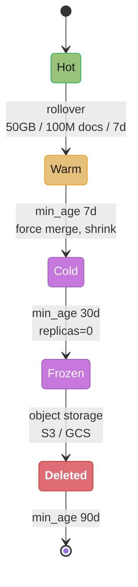
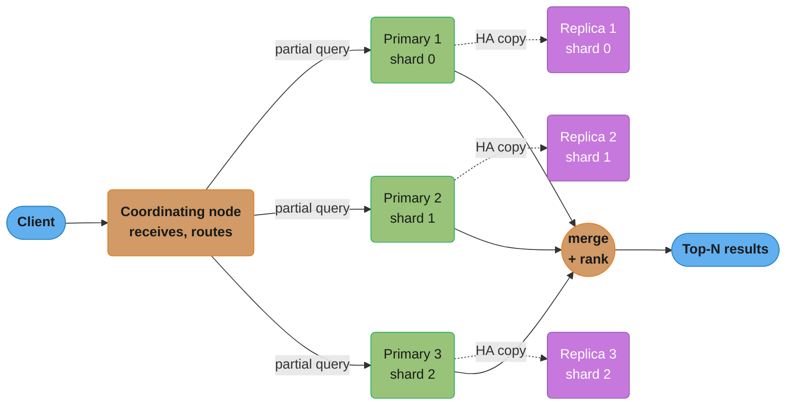
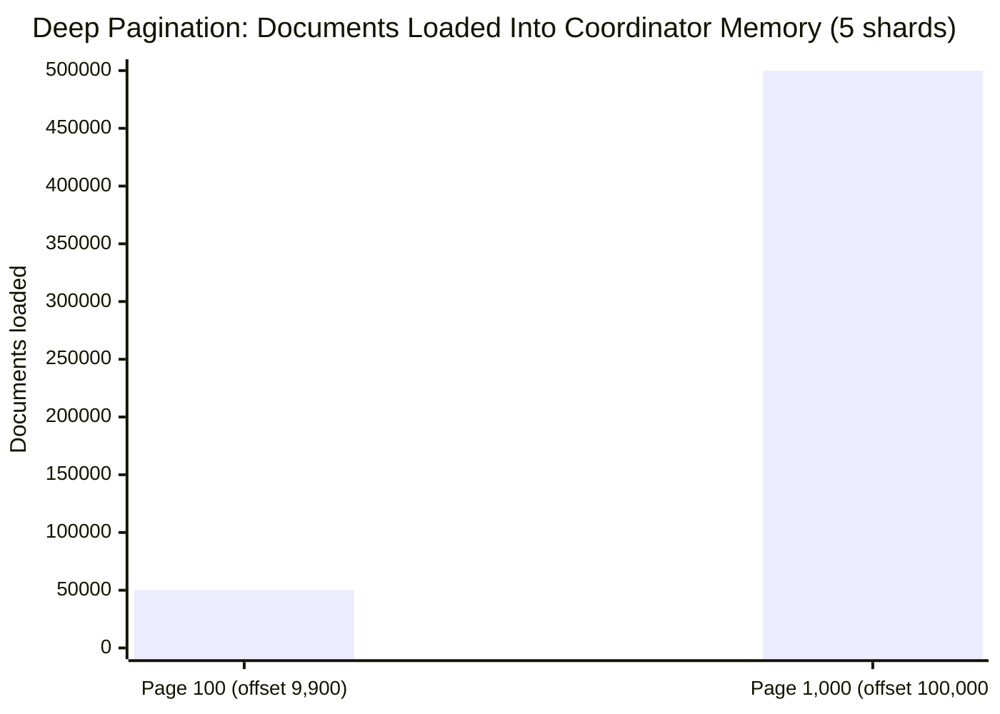
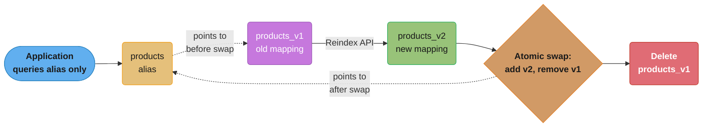

# Search Engines

## 1. Concept Overview

Search engine databases (Elasticsearch, OpenSearch, Solr) are built on top of Apache Lucene and provide full-text search, relevance ranking, aggregations, and near-real-time indexing at scale. They are not general-purpose databases — they excel at text search, log analytics, and faceted navigation use cases where precision recall and relevance matter more than ACID compliance.

---

## 2. Intuition

An inverted index is like a book's index: instead of "what's on page 42?" (forward index), it answers "on which pages does 'database' appear?" (inverted). Every word maps to a list of documents containing it — making keyword search O(1) for any term regardless of corpus size.

- **Key insight**: Elasticsearch is optimized for search, not storage. It provides near-real-time (NRT) search with a 1-second default refresh interval. It is eventually consistent by design. Never use it as a primary source of truth.

---

## 3. Core Principles

### Inverted Index

```
Documents:
  Doc 1: "database internals and indexing"
  Doc 2: "indexing strategies for search engines"
  Doc 3: "database performance tuning"

Inverted Index (after tokenization and normalization):
  Term         →  Posting List (doc_id, position, frequency)
  "database"   →  [Doc1:(pos=1,freq=1), Doc3:(pos=1,freq=1)]
  "internal"   →  [Doc1:(pos=2,freq=1)]
  "index"      →  [Doc1:(pos=4,freq=1), Doc2:(pos=1,freq=1)]
  "strategy"   →  [Doc2:(pos=2,freq=1)]
  "search"     →  [Doc2:(pos=4,freq=1)]
  "engine"     →  [Doc2:(pos=5,freq=1)]
  "performanc" →  [Doc3:(pos=2,freq=1)]

Query: "database search"
  → Lookup "database": [Doc1, Doc3]
  → Lookup "search": [Doc2]
  → Score: BM25(term_freq, doc_length, corpus_freq)
  → Return ranked: Doc1 (has "database"), Doc2 (has "search"), Doc3 (has "database")
```

**The idea behind it.** "Instead of asking every document whether it contains the word, keep
a dictionary from word to the list of documents that hold it — then a query is a dictionary
lookup plus a list intersection."

The inversion is what turns search from `O(documents)` into `O(matching documents)`. Scanning
3 documents for "database" is trivial; scanning 10 million is not, and the index makes the
two cost the same per hit.

| Symbol | What it is |
|--------|------------|
| term | A normalized token after analysis. "performanc" above is stemmed, not misspelled |
| posting | One `(doc_id, freq, positions)` entry — the fact that one term is in one document |
| posting list | Every posting for a term, sorted by doc_id so lists can be merged in one pass |
| `freq` | Occurrences of the term in that document. Feeds `TF` in the BM25 formula below |
| `pos` | Token offsets, needed only for phrase queries. The single largest part of the index |

**Walk one example.** Scale the toy index above to a real corpus — 10M documents averaging
300 tokens each, of which ~200 are distinct:

```
  postings entries : 10,000,000 docs x 200 distinct terms  = 2,000,000,000
    doc_id (delta + varint)  ~2 bytes
    freq   (varint)          ~1 byte
    -> 2,000,000,000 x 3 bytes                             =  6.0 GB

  positions        : 10,000,000 docs x 300 tokens          = 3,000,000,000
    -> 3,000,000,000 x ~1.5 bytes (delta-encoded)          =  4.5 GB

  index total                                              = 10.5 GB
  raw text (3,000,000,000 tokens x ~6 bytes)               = 18.0 GB
  index is 58% of the source text it searches
```

**Why doc_ids are delta-encoded.** A posting list stores ascending doc_ids, so Lucene writes
the *gaps* — `[17, 4, 1, 220]` instead of `[17, 21, 22, 242]`. Gaps are small numbers and
varints spend 1 byte on anything under 128, which is how 4-byte doc_ids average ~2 bytes.
Drop the sort order and every gap becomes a full-range integer: the postings file doubles and
the intersection that resolves a two-term AND stops being a single linear merge.

### BM25 Scoring Algorithm

BM25 (Best Match 25) replaced TF-IDF as Elasticsearch's default scoring algorithm (ES 5.0+):

```
BM25 score for document D, query term T:

score(D,T) = IDF(T) × (TF(D,T) × (k1+1)) / (TF(D,T) + k1 × (1 - b + b × |D|/avgdl))

Where:
  IDF(T) = log((N - df + 0.5) / (df + 0.5) + 1)
    N = total documents, df = documents containing T
    → Rare terms get higher IDF (more distinctive)

  TF(D,T) = frequency of T in D
    → More occurrences = higher TF, but with diminishing returns

  k1 = 1.2 (default): term frequency saturation
    → Very high TF doesn't dominate score as much as in TF-IDF

  b = 0.75 (default): field length normalization
    → Longer documents are penalized (divide by avgdl ratio)

  |D| = document length, avgdl = average document length

Tuning:
  Higher k1 (up to 2.0) → more weight to term frequency
  b=0 → no length normalization (good for short fields like product names)
  b=1 → full length normalization (good for long documents like articles)
```

**What this actually says.** "Rare words count for more, repeating a word helps but with
fast-fading returns, and being a long document is not the same as being a relevant one."

Three separate corrections to naive term counting, multiplied together. TF-IDF got the first
right and the other two wrong, which is exactly why BM25 replaced it as the default.

| Symbol | What it is |
|--------|------------|
| `IDF(T)` | Rarity weight. `log((N - df + 0.5)/(df + 0.5) + 1)` — big for rare terms, near 0 for ubiquitous ones |
| `df` | Document frequency: how many documents contain the term at all |
| `TF(D,T)` | Raw count of the term inside this one document |
| `k1 = 1.2` | Saturation dial. The TF factor can never exceed `k1 + 1 = 2.2`, no matter the count |
| `b = 0.75` | Length-penalty strength. `b=0` ignores length entirely, `b=1` applies it fully |
| `\|D\|/avgdl` | This document's length as a multiple of the corpus average. 2.0 = twice as long |

**Walk one example.** Corpus of `N = 10,000,000` documents, `avgdl = 300` tokens. The term
"database" appears in `df = 500,000` of them, so its rarity weight is fixed for every
document:

```
  IDF = ln((10,000,000 - 500,000 + 0.5) / (500,000 + 0.5) + 1)
      = ln(9,500,000.5 / 500,000.5 + 1)
      = ln(18.99998 + 1) = ln(19.99998) = 2.9957
```

Now hold the document at average length (`|D| = 300`, so the length factor is exactly 1.0)
and vary only how many times "database" appears:

```
  TF      TF factor = tf x 2.2 / (tf + 1.2)      score = IDF x factor
   1              1 x 2.2 / 2.2  = 1.0000              2.9957
   2              2 x 2.2 / 3.2  = 1.3750              4.1191
   3              3 x 2.2 / 4.2  = 1.5714              4.7076
   5              5 x 2.2 / 6.2  = 1.7742              5.3150
  10             10 x 2.2 /11.2  = 1.9643              5.8845
  20             20 x 2.2 /21.2  = 2.0755              6.2176
 100            100 x 2.2/101.2  = 2.1739              6.5125

  1 -> 2 occurrences : +1.12 score
 20 -> 100 occurrences: +0.29 score
```

That is the saturation curve doing its job. The second mention of "database" is worth almost
four times as much as the eightieth through hundredth combined, and the factor is
mathematically pinned below `k1 + 1 = 2.2` forever. Keyword stuffing cannot buy rank.

Now fix `TF = 5` and vary only document length:

```
  |D|    |D|/avgdl   1 - b + b x ratio    score
   100      0.33          0.50            5.8845
   300      1.00          1.00            5.3150
   900      3.00          2.50            4.1191
  1200      4.00          3.25            3.7026
```

A 1200-token document mentioning "database" 5 times scores below a 100-token one mentioning
it 5 times — 3.70 vs 5.88 — because 5-in-100 is a document *about* databases while 5-in-1200
is a passing reference. This is the term interviewers ask about: set `b = 0` and both score
5.3150, which is why `b=0` is recommended above for short fields like product names where
length carries no signal.

**Why IDF dominates everything else.** Compare a common and a rare term, each appearing
once in an average-length document:

```
  "database", df = 500,000  ->  IDF = 2.9957  ->  score 2.9957
  a product code, df = 200  ->  IDF = 10.8173 ->  score 10.8173   (3.61x higher)
```

One hit on a term that only 200 documents contain outranks 100 hits on a term half a million
documents contain (10.82 vs 6.51). The `+0.5` terms are smoothing, keeping the ratio finite
when `df = 0`; the trailing `+ 1` inside the log is what keeps IDF non-negative for terms
present in more than half the corpus, which the original BM25 formulation allowed to go
negative and score matches *worse* than non-matches.

---

## 4. Types / Architectures / Strategies

### Elasticsearch/OpenSearch Architecture

```
Cluster:
  Master-eligible nodes: manage cluster state (index creation, shard allocation)
  Data nodes: store data, execute searches
  Coordinating nodes: route requests, aggregate results

Index: a logical namespace
  Primary shard: basic unit of data and scale (default 1, was 5 before ES 7)
  Replica shard: copy of primary for HA and read scale

Shard sizing:
  Recommended shard size: 10-50GB
  Max documents per shard: ~2 billion (Lucene limit)
  Recommended shards per node: no more than 20 per GB heap
  Warning triggered: > 1000 shards per node

Routing:
  shard = hash(document_id) % number_of_primary_shards
  → Primary shards fixed at index creation (cannot change without reindex)
  → Change shard count: create new index + reindex API
```

**Stated plainly.** "Shard count is not a performance dial you tune later — it is a
divisor fixed at index creation, chosen so every piece lands in the 10-50GB band where
Lucene is happiest."

The routing line is the reason it is permanent. `hash(id) % shards` sends a document to a
shard determined by the shard *count*; change the count and every existing document's hash
now points somewhere else, so the only way forward is a full reindex.

| Symbol | What it is |
|--------|------------|
| `number_of_shards` | Primary shards. The divisor in routing. Immutable after index creation |
| `target_shard_size_GB` | Your chosen point in the 10-50GB band. 40GB is a common default |
| `ceil(total_GB / target_GB)` | The sizing rule — round up, because a partial shard still needs a whole one |
| `number_of_replicas` | Copies of each primary. Multiplies both storage and read capacity |
| `hash(document_id) % shards` | Routing. Deterministic, uniform, and count-dependent |

**Walk one example.** A log index projected to hold 1.2 TB, targeting 40GB shards, on nodes
with 30GB heap:

```
  primaries : ceil(1200 GB / 40 GB)             = 30 shards
  per shard : 1200 / 30                         = 40 GB      (inside the 10-50GB band)
  replicas=1: 30 primaries + 30 replicas        = 60 shards total
  storage   : 1.2 TB x 2                        = 2.4 TB on disk
  routing   : shard = hash(doc_id) % 30         -> a fixed 1-of-30 choice
  node cap  : 30 GB heap x 20 shards per GB     = 600 shards per node ceiling
```

60 shards sits far under both the 600-shard heap budget and the 1000-shard warning, so this
cluster has room. Contrast the over-sharding war story in Section 10: 50 shards for 500MB
is `500 / 50 = 10 MB` each — 4000x below the 40GB target here. The correct answer there is
`ceil(0.5 GB / 40 GB) = 1` shard, and the cluster paid coordination overhead on 49
unnecessary ones.

**Why `ceil` and not rounding.** `1200 / 50 = 24` exactly, but `1250 / 50 = 25` and
`1201 / 50 = 24.02`. Rounding down leaves 24 shards holding 50.04 GB each — over the band's
ceiling on day one, and shards only grow. Rounding up costs one slightly-underfull shard and
buys headroom for the drift that always happens. Size for where the index will be in a year,
because the divisor cannot be changed once documents exist.

### Index Lifecycle Management (ILM)



Each transition fires automatically off an age or size threshold — the index rolls from expensive NVMe (hot) down to object storage (frozen) and finally deletion with no manual intervention once the policy below is attached.

```
Hot tier: NVMe SSDs, active writes and reads
  Rollover: when index.lifecycle.rollover_alias triggers (max size=50GB or max_docs=100M or max_age=7d)

Warm tier: SSDs, searchable but no new writes
  Force merge: reduce segments, compress (best_compression codec)
  Shrink: reduce shard count to save resources

Cold tier: cheaper storage, searchable but slower
  Allocate replicas=0 (lower overhead, less critical)
  Freeze: unload index from heap, load segments on demand

Frozen tier (ES 7.12+): object storage (S3, GCS)
  Index cached in local cache on access, unloaded after

Delete: based on age or size policy

ILM configuration:
PUT _ilm/policy/logs_policy {
  "policy": {
    "phases": {
      "hot":  { "actions": { "rollover": { "max_size": "50GB" } } },
      "warm": { "min_age": "7d", "actions": { "forcemerge": { "max_num_segments": 1 } } },
      "cold": { "min_age": "30d", "actions": { "allocate": { "number_of_replicas": 0 } } },
      "delete": { "min_age": "90d", "actions": { "delete": {} } }
    }
  }
}
```

### Query Types: Filter vs Query Context

```json
{
  "query": {
    "bool": {
      "must": [
        { "match": { "title": "database indexing" } }
      ],
      "filter": [
        { "term":  { "status": "published" } },
        { "range": { "published_at": { "gte": "2024-01-01" } } }
      ]
    }
  }
}
```

Key distinction:
- **Query context** (must/should): calculates relevance score. Slower (BM25 computation).
- **Filter context** (filter/must_not): binary yes/no match. Faster, cached. No score computation.

Always put non-relevance predicates (date ranges, term filters, status) in `filter` context — they're cached and faster than query context.

### Aggregations

```json
{
  "aggs": {
    "by_category": {
      "terms": { "field": "category.keyword", "size": 10 },
      "aggs": {
        "avg_price": { "avg": { "field": "price" } },
        "monthly_revenue": {
          "date_histogram": {
            "field": "created_at",
            "calendar_interval": "month"
          },
          "aggs": {
            "total": { "sum": { "field": "revenue" } }
          }
        }
      }
    },
    "unique_users": {
      "cardinality": {
        "field": "user_id",
        "precision_threshold": 40000
      }
    }
  }
}
```

Aggregation types:
- `terms`: bucket documents by field value (equivalent to GROUP BY)
- `date_histogram`: time-based bucketing
- `cardinality`: HyperLogLog-based distinct count (~3-5% error at precision_threshold=40000)
- `percentiles`: p50, p95, p99 percentile computation
- `nested`/`reverse_nested`: aggregations on nested objects

---

## 5. Architecture Diagrams

**ELASTICSEARCH CLUSTER**



The coordinating node fans a partial query out to one copy of each shard (primary or replica), then merges and ranks the partial result sets before returning the top-N to the client.

**NEAR-REAL-TIME (NRT) INDEXING**


Refresh (default every 1 second) makes new writes searchable without durability; flush (every 30 seconds or 512MB of translog) fsyncs to disk for crash recovery; a later merge still consolidates the growing pile of small segments into fewer, larger ones.

---

## 6. How It Works — Detailed Mechanics

### Segment Merging and Force Merge

```
Lucene index = collection of immutable segments
Each refresh creates a new small segment
Over time: many small segments → slow searches (each segment searched separately)
Background merge: Lucene merges small segments into larger ones

Force merge (for read-only indexes):
POST /my-index/_forcemerge?max_num_segments=1
→ Merges ALL segments into ONE large segment
→ Maximum search performance (one segment = one sequential scan)
→ Expensive I/O during merge; should only run on warm/cold tiers
→ NOT suitable for indexes receiving writes (cancels merge benefits immediately)

Segment count monitoring:
GET /_cat/indices?v&h=index,segments.count,store.size
```

### The Deep Pagination Problem

```
Default max_result_window = 10000
GET /products/_search { "from": 9900, "size": 100 }
→ Coordinating node asks ALL shards for their top 10000 results
→ Each shard returns 10000 rows → N shards × 10000 rows collected in memory
→ Coordinator merges N×10000, returns rows 9900-10000
→ For 5 shards: 50,000 documents loaded to find 100

At page 1000 (offset 100000) on 5 shards: 500,000 documents in memory → OOM risk

Fix 1: Search After (cursor-based, like keyset pagination):
GET /products/_search {
  "size": 100,
  "sort": [{"price": "asc"}, {"id": "asc"}],
  "search_after": [29.99, "prod-1234"]
}
→ Returns next 100 docs after {price=29.99, id="prod-1234"}
→ O(log n) per page, no offset accumulation

Fix 2: Scroll API (for export, not interactive pagination — deprecated):
POST /products/_search?scroll=1m { "size": 1000 }
→ Creates a snapshot, returns scroll_id
GET /_search/scroll { "scroll_id": "..." }
→ Iterate through all results without sorting overhead

Fix 3: Point-in-time (PIT) + Search After (ES 7.10+, preferred):
POST /products/_pit?keep_alive=1m
GET /products/_search { "pit": { "id": "..." }, "search_after": [...] }
→ Consistent snapshot + search_after pagination
```



Coordinator memory scales with `(from + size) × shard count`, not with the 100 rows actually requested — a 10x deeper page loads 10x more documents (50,000 to 500,000) just to return the same page size, which is why `max_result_window` caps `from + size` at 10,000 by default.

**Put simply.** "To return rows 9,900-10,000 the coordinator must first collect the top
10,000 from every shard, because no shard can know whether its 7,000th-best row is the
global 9,900th."

The cost is driven entirely by `from + size`, never by `size`. A user asking for 100 results
on page 100 triggers exactly as much work as one asking for 10,000 results on page 1.

| Symbol | What it is |
|--------|------------|
| `from` | Rows to skip. The offset — and the whole problem |
| `size` | Rows actually returned to the caller. Almost irrelevant to cost |
| shard count | Every primary shard must contribute its own top `from + size` |
| `(from + size) x shards` | Documents materialised in coordinator heap for one request |
| `max_result_window` | Hard cap on `from + size`, default 10,000. Guards the heap, not the shard |
| `search_after` | Cursor: "resume after this exact sort key". No offset, so no accumulation |

**Walk one example.** Same query on a 5-shard and a 30-shard index, `size = 100` throughout:

```
  page      from      5 shards            30 shards
     1         0     100 x  5 =     500   100 x 30 =      3,000
    10       900   1,000 x  5 =   5,000 1,000 x 30 =     30,000
   100     9,900  10,000 x  5 =  50,000 10,000 x 30 =    300,000
 1,000    99,900 100,000 x  5 = 500,000     ^ blocked by max_result_window

  Same 100 rows returned in every cell.
```

Two lessons live in that grid. First, the horizontal read: adding shards for write
throughput multiplies deep-pagination cost by the same factor — 30 shards at page 100 loads
300,000 documents to return 100. Second, the vertical read: page 1,000 loads 500,000
documents on just 5 shards, the OOM risk the text above names, which is precisely what
`max_result_window` exists to stop.

**Why `search_after` escapes the trap.** It replaces "skip 99,900 rows" with "start after
sort key `[29.99, prod-1234]`" — a value each shard can seek to directly in its sorted index,
so every shard returns exactly `size` rows and the coordinator merges `100 x shards`
regardless of depth. The cost of page 1,000 becomes identical to page 1. The tradeoff is
that you can only move forward one page at a time, which is why it powers infinite scroll
but cannot implement a "jump to page 1,000" control.

### Zero-Downtime Index Mapping Changes

```
Elasticsearch mappings are mostly immutable after creation.
You cannot change a field's type (e.g., text → keyword) without reindexing.

Zero-downtime alias pattern:
1. Create new index with correct mapping:
   PUT /products_v2 { "mappings": { ... new mapping ... } }

2. Reindex from old to new:
   POST /_reindex { "source": { "index": "products_v1" }, "dest": { "index": "products_v2" } }

3. Add alias pointing to new index:
   POST /_aliases { "actions": [
     { "add": { "index": "products_v2", "alias": "products", "is_write_index": true } },
     { "remove": { "index": "products_v1", "alias": "products" } }
   ]}
   → Atomic alias swap: no downtime

4. Delete old index:
   DELETE /products_v1

Application always queries "products" alias, not the versioned index.
```



The application only ever queries the `products` alias; a single `_aliases` call adds it to `products_v2` and removes it from `products_v1` atomically, so there is no instant where the alias resolves to nothing — that indirection is what makes the reindex invisible to callers.

---

## 7. Real-World Examples

- **Log analytics (ELK Stack)**: Filebeat collects logs → Logstash parses → Elasticsearch indexes → Kibana visualizes. ILM manages retention.
- **E-commerce search**: Products indexed in Elasticsearch with full-text (match on title/description), term filters (category, brand), range filters (price), and faceted aggregations.
- **GitHub code search**: Elasticsearch indexes all public code. Queries combine code content matching with file path and language filters.
- **Airbnb listing search**: Elasticsearch for full-text (neighborhood descriptions), combined with geospatial filters (geo_shape, geo_distance) for location-based search.

---

## 8. Tradeoffs

| Feature | Elasticsearch | PostgreSQL Full-Text | Solr |
|---------|--------------|---------------------|------|
| Relevance ranking | Excellent (BM25, scripted) | Good (tsvector + rank_cd) | Excellent (BM25, BM42) |
| Scale | Excellent (horizontal) | Limited (vertical) | Excellent (horizontal) |
| Real-time indexing | NRT (1s refresh) | Immediate | NRT (~1s) |
| Complex aggregations | Excellent | Limited | Excellent |
| Faceted navigation | Excellent | Complex | Excellent |
| ACID compliance | None | Full | None |
| Operational complexity | High | Low | High |

---

## 9. When to Use / When NOT to Use

**Use Elasticsearch/OpenSearch when**:
- Full-text search with relevance ranking
- Log analytics and monitoring (ELK/OpenSearch stack)
- Faceted navigation (e-commerce, job boards)
- Geospatial search
- Large-scale aggregations on unstructured data

**Do not use as a primary database when**:
- ACID transactions required
- Data must not be lost (Elasticsearch provides best-effort durability)
- Complex relational queries needed
- Real-time writes with immediate read-after-write consistency

---

## 10. Common Pitfalls

**Pitfall 1: Too many shards (over-sharding)**
A team created an index with 50 primary shards for a 500MB dataset. Each shard has overhead: one JVM thread for searching, state tracked in cluster metadata. 50 shards for 500MB = each shard is 10MB — far below the recommended 10-50GB. Cluster performance degraded due to coordination overhead. Fix: 1-2 shards for this dataset size. Rule: `number_of_shards = ceil(total_size_GB / target_shard_size_GB)`.

**Pitfall 2: Using keyword field for full-text and vice versa**
```json
-- Broken: querying a text field for exact match (aggregation will fail)
{ "aggs": { "by_status": { "terms": { "field": "status" } } } }
-- status is mapped as "text" (analyzed) → terms aggregation on analyzed field = incorrect

-- Fix: use keyword field for aggregations and exact matches
{ "mappings": {
  "properties": {
    "status": { "type": "keyword" },  -- Exact match, aggregation-friendly
    "description": { "type": "text", "fields": { "keyword": { "type": "keyword", "ignore_above": 256 } } }
    -- Multi-field: text for search, keyword for aggregation
  }
}}
```

**Pitfall 3: Not using filter context for non-scoring predicates**
A team put all predicates in `must` (query context). Every query computed BM25 scores for all documents matching date range and status filters, even though only the text match needed scoring. Switching status and date filters to `filter` context: 40% query speedup (filter results are cached, no BM25 computation).

**Pitfall 4: Mapping explosion from dynamic mapping**
An application indexed user-provided JSON without specifying mappings. Dynamic mapping created a new field for every unique key in JSON. After 3 months: 100,000 mapped fields. Elasticsearch cluster entered a "mapping explosion" state — cluster state became multi-GB, cluster stability issues. Fix: `dynamic: strict` (reject unmapped fields) or `dynamic: false` (ignore unmapped fields). Explicitly map expected fields.

**Pitfall 5: Missing index refresh awareness**
An application indexed a document, then immediately queried for it — returned no results. The document existed in the translog but hadn't been refreshed into a searchable segment yet (default refresh = 1 second). Fix: (1) Call `POST /index/_refresh` after indexing for immediate visibility (high overhead, only for testing). (2) Use the `refresh=true` parameter on index API (sync refresh, high cost). (3) Design the application to not expect immediate read-after-write from Elasticsearch — use a different source of truth (PostgreSQL) for immediate lookups.

---

## 11. Technologies & Tools

| Tool | Purpose |
|------|---------|
| Kibana / OpenSearch Dashboards | Visualization, index management, ILM |
| `_cat/indices` | Quick cluster status |
| `_cat/shards` | Shard allocation, state |
| `_cluster/health` | Cluster health (green/yellow/red) |
| Profile API | Query execution profiling |
| `explain` API | Why a document scored the way it did |
| Logstash | Log processing pipeline |
| Filebeat | Log shipping agent |
| Fluent Bit | Lightweight log forwarder |
| Amazon OpenSearch | Managed Elasticsearch alternative |
| Elastic Cloud | Managed Elasticsearch |

---

## 12. Interview Questions with Answers

**Q: How does BM25 scoring work and when would you customize it?**
BM25 scores a document based on: (1) IDF (Inverse Document Frequency): rare terms across the corpus score higher — "database" in a corpus mostly about cooking is more distinctive than in a database technology corpus. (2) TF (Term Frequency) with saturation: more occurrences raise the score but with diminishing returns (controlled by k1=1.2). (3) Field length normalization (controlled by b=0.75): shorter documents get a boost for the same term frequency as longer documents. Customization scenarios: product title search — disable length normalization (b=0) since all titles are short; product catalog where recency matters — add a `function_score` to boost recent products; domain-specific vocabulary — add synonym expansion or custom analyzers before indexing.

**Q: What is the deep pagination problem in Elasticsearch and how do you solve it?**
Deep pagination with `from + size`: the coordinating node requests `from + size` results from all shards, merges them, and returns the requested page. At offset 100,000 with 10 shards: each shard returns 100,010 documents → 1,000,100 documents loaded in coordinator memory to return 10. Memory exhaustion and extreme latency at deep offsets. max_result_window defaults to 10,000 — attempts beyond this fail. Solutions: (1) `search_after` with a sort key (preferred): cursor-based pagination — include the sort values of the last returned document as the `search_after` parameter. O(log n) per page, no memory accumulation. (2) Point-in-time (PIT) + `search_after`: consistent snapshot for pagination — new documents don't appear mid-pagination. (3) Scroll API: deprecated but still used for data export scenarios (millions of documents).

**Q: How do you change a field mapping without downtime using aliases?**
Elasticsearch field mappings are immutable for most type changes. Zero-downtime approach: (1) Create a new index with the correct mapping. (2) Use the Reindex API to copy data from old to new index (can take hours for large indexes — run in background). (3) While reindexing, index new documents to both old and new indexes (dual-write). (4) After reindex is complete, perform an atomic alias swap: `POST /_aliases` with one action removing the alias from the old index and adding it to the new index simultaneously. (5) Delete the old index. The alias (not the versioned index name) should be used by all application code — this enables seamless index version changes.

**Q: What is a Lucene segment and why does force merge improve search performance?**
A Lucene segment is an immutable mini-index: a set of files containing the inverted index, stored fields, doc values, and bloom filters for one "snapshot" of data. Each Elasticsearch refresh (default 1 second) creates a new segment. Over time: hundreds of small segments. Search: each segment must be searched separately, results merged → O(segments) overhead. Force merge (`POST /index/_forcemerge?max_num_segments=1`): merges all segments into one. After: search scans one segment = maximum efficiency. Only applies to read-only indexes (warm/cold tier) — writing to a force-merged index immediately creates new segments.

**Q: Explain the near-real-time (NRT) search mechanism in Elasticsearch.**
NRT involves two operations: refresh and flush. Refresh (default every 1 second): Lucene "opens" a new segment reader on any new segments that have been written to the in-memory buffer. After refresh, new documents are searchable. Refresh does NOT fsync to disk — the data exists in Lucene's buffer and OS page cache. Flush (default every 30 seconds or when translog reaches 512MB): fsyncs the translog and Lucene segments to disk, clears the translog. After flush, data survives a process crash. Translog: all operations since the last flush are in the translog. On crash recovery: Elasticsearch replays the translog to reconstruct any unflushed operations.

**Q: How do Elasticsearch aggregations differ from SQL GROUP BY?**
Elasticsearch aggregations are approximate for high-cardinality fields by default: the `terms` aggregation uses a distributed approximate count (each shard returns its top-N, coordinator merges), which can miss low-frequency terms that appear across many shards. SQL GROUP BY is exact. Elasticsearch `cardinality` aggregation uses HyperLogLog (~3-5% error). SQL `COUNT(DISTINCT)` is exact but slow. Elasticsearch aggregations run on doc values (columnar on-disk format) — very efficient for analytics. SQL aggregations use B+tree index or sequential scan. For aggregations requiring exact counts on high-cardinality fields, Elasticsearch's `shard_size` parameter increases per-shard candidate set at cost of memory and latency.

**Q: What is the difference between match and term queries in Elasticsearch?**
`term` query: exact match, no analysis applied. Used for keyword fields, IDs, booleans. `{"term": {"status": "published"}}` matches documents where status field is exactly "published". `match` query: full-text match, applies the same analyzer used during indexing (tokenization, lowercasing, stemming). `{"match": {"title": "Database Indexing"}}` → analyzed to ["database", "index"] → matches documents containing either term. Use `term` for keyword fields (status, category, user_id) in filter context (fast, cached). Use `match` for text fields (title, description, body) in query context (relevance scored). Common mistake: using `match` on a keyword field (lowercase conversion may miss exact case) or `term` on a text field (searching for unstemmed form that doesn't exist in the inverted index).

**Q: What is index lifecycle management (ILM) and how does it reduce costs?**
ILM automates the movement of indices through phases based on age, size, or document count. Hot phase: active writes on NVMe SSDs (most expensive). Warm phase: after rollover (e.g., after index reaches 50GB or 7 days): move to HDD-backed nodes, force merge to 1 segment (reduce overhead), possibly shrink shard count. Cold phase: after 30 days: reduce replicas to 0 (or 1), move to cheaper storage. Frozen phase: move index to object storage (S3/GCS), load segments on demand. Delete phase: after 90 days, delete the index. Cost savings example: hot data at $500/TB-month, cold data at $50/TB-month, frozen at $5/TB-month — ILM automatically moves data to cheaper tiers as it ages.

**Q: How does Elasticsearch handle cluster state and shard allocation?**
Cluster state: maintained by the elected master node and replicated to all nodes. Contains: index metadata (mappings, settings), shard routing table (which shard lives on which node). On any cluster change (new index, failed node, shard move): master serializes the change and broadcasts updated cluster state to all nodes. Shard allocation: the master decides which nodes host which shards based on: node capacity, shard count balance, allocation filtering rules, zone awareness settings. Default: shards distributed evenly across all nodes. Zone-aware allocation: replicas placed on different availability zones. `index.routing.allocation.require.zone=us-east-1a` pins an index to specific nodes. Unassigned shards (cluster status YELLOW or RED): can indicate disk full, node offline, or insufficient nodes for the replica count.

**Q: What are doc values and why do they matter for aggregations?**
Doc values are a columnar on-disk format for field values — all values for field "price" stored sequentially, then all values for "status", etc. This contrasts with the row-oriented stored fields (all fields for document 1, then document 2). For aggregations (`terms`, `avg`, `max`): the aggregation engine reads all values for a specific field in sorted order — doc values enable this with sequential disk reads. Without doc values (fielddata in heap, the old approach): field values must be loaded into heap memory from inverted index — slow and causes OOM on large datasets. Doc values are enabled by default for all non-text fields. Text fields use `fielddata: true` (heap-based, expensive) — avoid; use a `.keyword` sub-field instead for aggregations.

**Q: How do you diagnose why a search query is slow in Elasticsearch?**
Tools: (1) Profile API: `GET /index/_search { "profile": true, "query": {...} }` — shows time spent in each phase of each shard's query execution (match, score, fetch). (2) `_explain` API: `GET /index/_explain/doc_id { "query": {...} }` — shows why a document matched (or didn't) and how its score was computed. (3) Hot threads API: `GET /_nodes/hot_threads` — shows which threads are consuming CPU across the cluster. (4) Slow log: set `index.search.slowlog.threshold.query.warn: 1s` in index settings — logs all queries taking > 1s. Common causes: missing filter context (scoring when not needed), large `terms` filter (hundreds of values), scripted scoring (Painless scripts per-document), deep pagination, aggregation on high-cardinality field.

**Q: What is the difference between a nested object and a flattened object in Elasticsearch?**
Standard object mapping: sub-document fields are flattened into the parent document's index. `{"author": {"name": "Alice", "city": "NYC"}}` → indexed as `author.name=Alice, author.city=NYC`. Problem: array of objects loses the relationship between fields of the same object: `authors: [{"name":"Alice","city":"NYC"}, {"name":"Bob","city":"LA"}]` → can incorrectly match a query for `author.name=Alice AND author.city=LA`. Nested mapping: each nested object stored as a separate hidden Lucene document, preserving field relationships. Queries use `nested` query type. Tradeoff: nested documents increase index size and query complexity. Flattened field type (ES 7.3+): stores all subfields in a single field, supports `term` and `range` queries, but not aggregations per subfield — useful for dynamic/unknown object structures.

**Q: How do you scale Elasticsearch horizontally and what are the limits?**
Horizontal scaling: add data nodes. Elasticsearch automatically rebalances shards across new nodes. Index shards are fixed at creation — to scale beyond the original shard count requires reindexing to a new index with more shards. Scaling limits: Elasticsearch cluster health degrades with too many shards — each shard has JVM heap overhead (~few KB for small segments, but shard metadata in cluster state). Recommendation: max 20 shards per GB of heap; a 64GB heap node can handle ~1280 shards. More nodes allow more shards but each additional shard adds coordination overhead. For very large-scale, cross-cluster search (CCS) federation across multiple clusters provides isolation and avoids single-cluster shard count limits.

**Q: How do you determine the right number of primary shards for a new index, and why does over-sharding hurt?**
The sizing rule is `number_of_shards = ceil(total_size_GB / target_shard_size_GB)`, using the recommended 10-50GB target shard size, so a 500MB dataset needs 1-2 shards, not 50. Each shard carries fixed overhead regardless of how much data it actually holds — a dedicated search thread, cluster-state metadata tracked by the master node, and file handles — so 50 shards on a 500MB dataset means each shard averages 10MB, far below the useful minimum, paying coordination overhead with no compensating benefit. Because the primary shard count is fixed at index creation and cannot be changed without a full reindex into a new index, undersizing is nearly as costly as oversizing: too few shards limits parallelism and caps how large the index can grow before individual shards get unwieldy. Monitor actual shard sizes with `_cat/indices?v&h=index,segments.count,store.size` after data has accumulated, and alert well before crossing 1,000 shards per node, since that is the point cluster stability visibly degrades. Size shards for the data volume you expect at maturity, not the volume at index creation time, since resizing later requires a reindex.

**Q: What is the difference between query context and filter context, and why should non-scoring predicates use filter?**
Query context (`must`/`should`) computes a BM25 relevance score for every matching document, while filter context (`filter`/`must_not`) only answers yes-or-no with no score computed at all. Because filter-context results are cacheable — Elasticsearch can reuse the bitset of matching documents across repeated queries with the same filter — a term or range filter in filter context is both faster on first execution and faster on repeat execution, whereas the same predicate in query context recomputes scoring every time. This module's own benchmark shows the effect directly: moving date-range and status filters from `must` into `filter` context produced a 40% query speedup with no change to relevance ranking, since those predicates were never meant to affect the score in the first place. The rule of thumb is that only text predicates whose relevance genuinely matters for ranking, like title and description matches, belong in query context; everything else — status flags, category IDs, date ranges, boolean toggles — belongs in filter context by default. Push every non-relevance predicate into filter context first, and only move something to query context if it genuinely needs to influence the score.

**Q: How do you optimize Elasticsearch for high-throughput bulk indexing?**
Setting `refresh_interval: -1` before a bulk load stops Elasticsearch from creating a new searchable segment every second, a change worth roughly a 10x throughput gain on its own. Reset it back to the normal `1s` once the load completes, since leaving it disabled means new documents stay invisible to search indefinitely. Temporarily set `number_of_replicas: 0` during the load so each document is written once instead of also being copied synchronously to replica shards, then restore the replica count afterward to regain normal HA and read-scale characteristics. Use the `_bulk` API with a batch size tuned to the cluster, typically 5-15MB per request or a few thousand documents, rather than individual index requests that each pay network round-trip and per-request overhead. Skip force-merge during the load itself, since running it concurrently with active writes cancels its own benefit, and only force-merge after the load completes and the index moves to a read-only warm or cold tier.

---

## 13. Best Practices

1. Use filter context for non-scoring predicates (date ranges, status, category) — they're cached and faster.
2. Right-size shards: 10-50GB per shard. Avoid micro-shards (< 1GB) and mega-shards (> 50GB).
3. Use ILM to automatically move data through hot→warm→cold tiers.
4. Always use aliases (not index names) in application code to enable zero-downtime reindexing.
5. Use `search_after` for pagination instead of `from/size` beyond page 10.
6. Force merge read-only indexes (warm/cold tier) to 1 segment for best search performance.
7. Set `refresh_interval: -1` during bulk indexing, then reset to `1s` after completion (10x faster bulk).
8. Use `dynamic: strict` to prevent mapping explosion from user-provided data.
9. Monitor shard count: alert when > 500 shards/node, critical at 1000.
10. Use `keyword` fields for aggregations and sorting, `text` for full-text search — often use both via multi-fields.

---

## 14. Case Study

**Scenario**: A B2B marketplace has 10M product listings. Users search with text queries + faceted filters (category, price range, rating, in-stock). Current solution: PostgreSQL `tsvector` full-text search is too slow (2-3 seconds) and cannot support facets efficiently.

**Elasticsearch solution**:
```json
// Index mapping:
PUT /products {
  "settings": {
    "number_of_shards": 5,
    "number_of_replicas": 1,
    "analysis": {
      "analyzer": {
        "product_analyzer": {
          "type": "custom",
          "tokenizer": "standard",
          "filter": ["lowercase", "asciifolding", "product_synonyms"]
        }
      },
      "filter": {
        "product_synonyms": {
          "type": "synonym",
          "synonyms": ["notebook,laptop,computer", "tv,television,display"]
        }
      }
    }
  },
  "mappings": {
    "properties": {
      "title":       { "type": "text", "analyzer": "product_analyzer", "fields": {"keyword": {"type": "keyword"}} },
      "description": { "type": "text", "analyzer": "product_analyzer" },
      "category":    { "type": "keyword" },
      "brand":       { "type": "keyword" },
      "price":       { "type": "float" },
      "rating":      { "type": "float" },
      "in_stock":    { "type": "boolean" },
      "created_at":  { "type": "date" }
    }
  }
}

// Search query:
POST /products/_search {
  "query": {
    "bool": {
      "must": [
        { "multi_match": {
          "query": "laptop 16GB RAM",
          "fields": ["title^3", "description"],
          "type": "best_fields"
        }}
      ],
      "filter": [
        { "term": { "category": "Electronics" } },
        { "range": { "price": { "gte": 500, "lte": 2000 } } },
        { "term": { "in_stock": true } }
      ]
    }
  },
  "aggs": {
    "by_brand": { "terms": { "field": "brand", "size": 20 } },
    "price_range": { "histogram": { "field": "price", "interval": 100 } },
    "avg_rating": { "avg": { "field": "rating" } }
  },
  "sort": [{"_score": "desc"}, {"rating": "desc"}],
  "size": 20,
  "from": 0
}
```

**CDC sync from PostgreSQL to Elasticsearch**:
- Debezium PostgreSQL connector tails WAL changes
- Kafka topic receives product change events
- Kafka Connect Elasticsearch sink connector writes to ES
- Lag: 1-3 seconds for new products/updates to appear in search

**Result**: Search latency: 30ms p50, 80ms p99 (vs 2-3s on PostgreSQL). Facet aggregations included in same query. Synonym expansion (laptop = notebook) improved recall by 15%. ILM configured: old product listings > 12 months moved to warm tier (force merged, no replicas).
