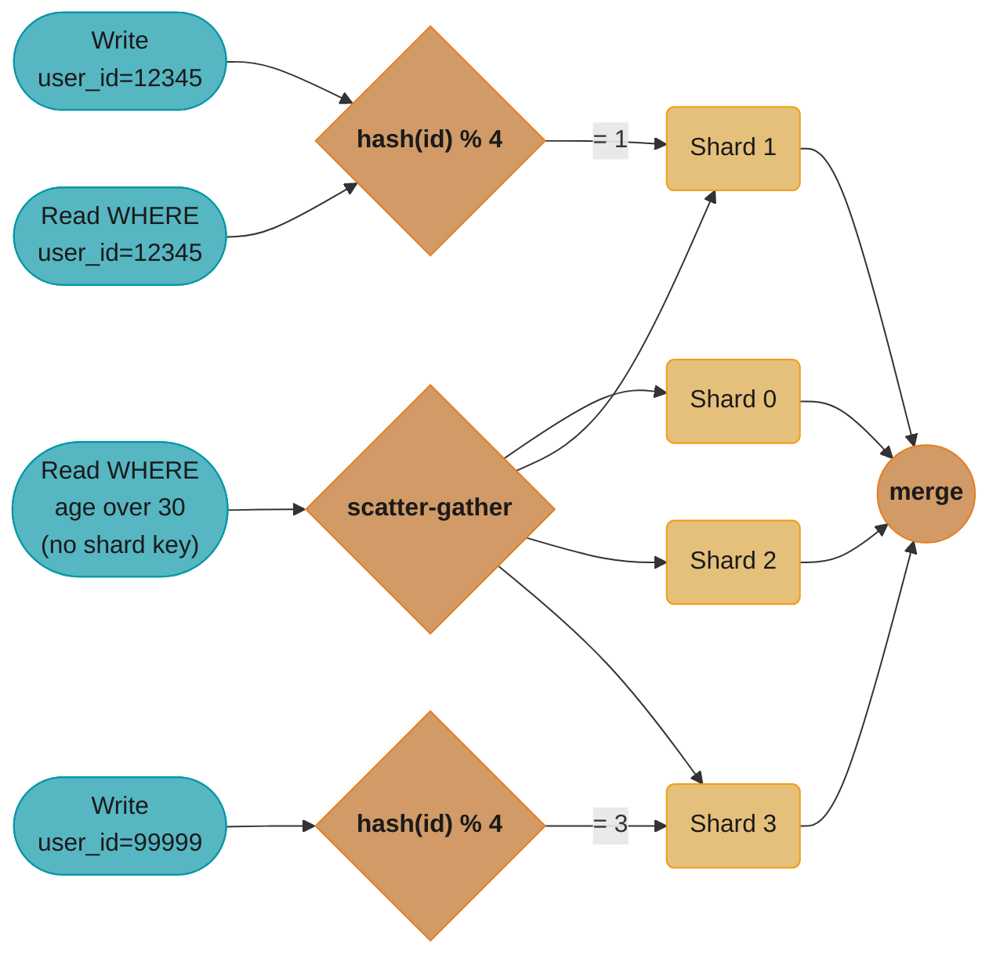
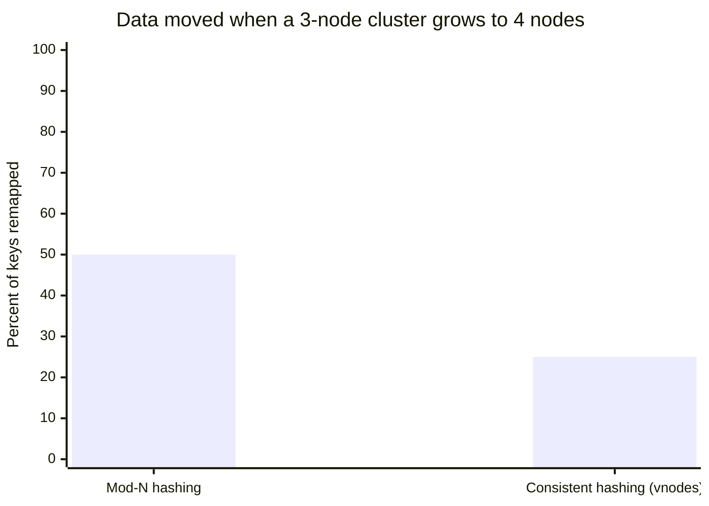
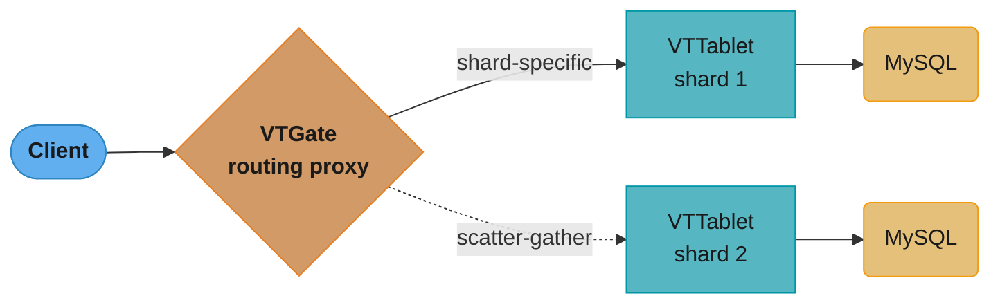
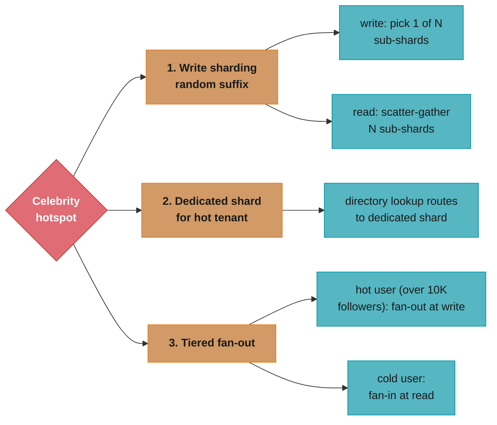
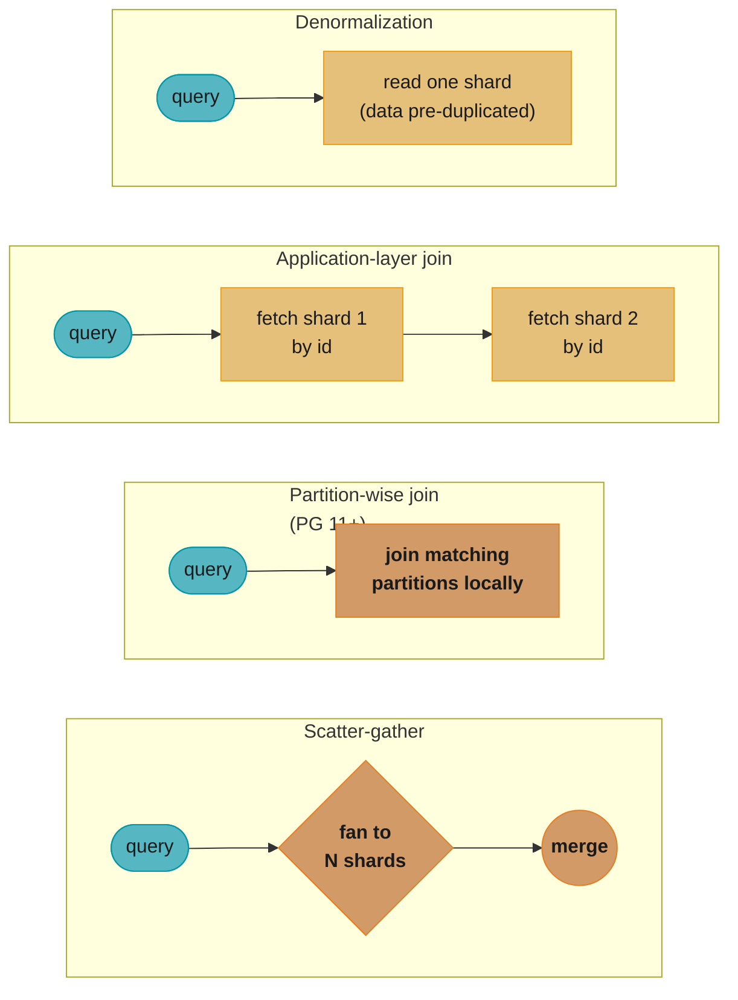
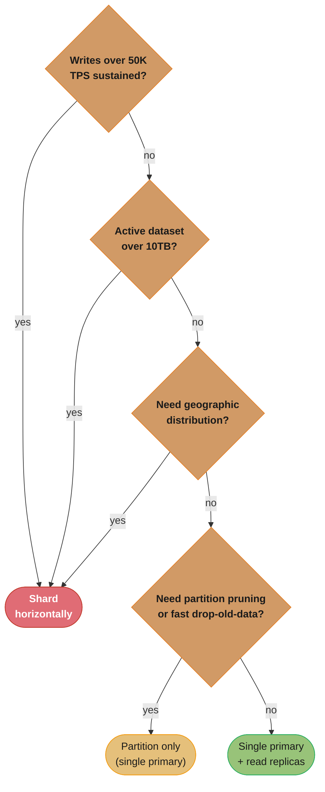

# Sharding and Partitioning

## 1. Concept Overview

Sharding (horizontal scaling) splits data across multiple independent database instances so that no single server holds all the data or handles all requests. Partitioning splits data within a single database instance into logical segments (partitions) for query performance and manageability. Both involve dividing data by a key, but sharding crosses server boundaries while partitioning stays within one database.

The fundamental challenge: every design decision that improves write distribution (uniform hashing) tends to worsen query locality (scatter-gather for range queries), and vice versa. Choosing the right shard/partition key is the most consequential architectural decision in a sharded system.

---

## 2. Intuition

Imagine a library that has grown too large for one building. Sharding is putting half the books in a second building — you now have twice the shelf space, but finding a book may require knowing which building it is in. A good sharding scheme (books by author last name: A–M in building 1, N–Z in building 2) makes the lookup predictable. A bad scheme (random assignment) requires asking both buildings every time. Partitioning is like reorganizing shelves within a single building — faster to maintain (vacuum/archive sections), same total capacity.

---

## 3. Core Principles

**Shard key determines data locality**: Every row belongs to exactly one shard based on its shard key. Queries that filter on the shard key go to one shard; queries without the shard key must go to all shards (scatter-gather).

**Uniform data distribution**: A good shard key distributes data and write load evenly. Hotspots (one shard receiving 90% of writes) negate horizontal scaling benefits.

**Minimal cross-shard operations**: Joins, foreign keys, and transactions across shards require distributed coordination — expensive and complex. Schema design should minimize cross-shard operations.

**Re-sharding is expensive**: Changing the number of shards typically requires moving large amounts of data. Plan shard count and key for future scale from the beginning.

---

## 4. Types / Architectures / Strategies

```
Strategy            | Mechanism                        | Hotspot Risk | Range Query
--------------------|----------------------------------|--------------|------------
Range sharding      | Key range → shard                | High (skewed)| Efficient
Hash sharding       | Hash(key) % N → shard            | Low          | Scatter-gather
Directory sharding  | Lookup table key → shard         | None (custom)| Depends
Consistent hashing  | Hash ring, virtual nodes         | Low          | Scatter-gather
Geographic sharding | Region/country → shard           | Medium       | Regional only
```

**Partitioning types (within one DB)**:
```
Type      | PostgreSQL syntax                     | Use case
----------|---------------------------------------|----------------------------
Range     | PARTITION BY RANGE (created_at)       | Time-series, date-based
List      | PARTITION BY LIST (region)            | Categorical, small enum
Hash      | PARTITION BY HASH (user_id)           | Even distribution, OLTP
```

---

## 5. Architecture Diagrams



Writes and shard-key reads hash the key mod 4 straight to one shard; the `age` filter carries no shard key, so it scatters to all four shards and merges the results in the router.

```
Consistent Hashing Ring with Virtual Nodes
==========================================

                0
               /\
          315 /  \ 45
             /    \
        270 ──────── 90
             \    /
          225 \  / 135
               \/
               180

Physical nodes: A, B, C (3 nodes)
Virtual nodes per physical node: 150

Node A owns:  [0-45], [90-135], [225-270]
Node B owns:  [45-90], [180-225], [315-360]
Node C owns:  [135-180], [270-315]

Key "user:12345" → hash = 210 → falls in [180-225] → Node B

Adding Node D: takes ~25% of virtual nodes from A, B, C
  → only ~25% of data moves (vs 50% in naive hash % N resizing)
```



Naive `hash(key) % N` remaps close to half of all keys whenever the node count changes; consistent hashing with virtual nodes moves only the arc handed to the new node — about 25% here, and roughly 9% when an 11th node joins a 10-node cluster (see Section 12 Q&A).

```
PostgreSQL Range Partitioning
==============================

CREATE TABLE orders (
    id BIGINT,
    created_at TIMESTAMPTZ,
    amount DECIMAL
) PARTITION BY RANGE (created_at);

CREATE TABLE orders_2024_q1 PARTITION OF orders
    FOR VALUES FROM ('2024-01-01') TO ('2024-04-01');
CREATE TABLE orders_2024_q2 PARTITION OF orders
    FOR VALUES FROM ('2024-04-01') TO ('2024-07-01');
-- etc.

Query with partition pruning:
  SELECT * FROM orders WHERE created_at >= '2024-02-01' AND created_at < '2024-03-01';
  → Planner accesses only orders_2024_q1 (one partition, not all)
  → "Partitions: orders_2024_q1" in EXPLAIN output
```

---

## 6. How It Works — Detailed Mechanics

### Consistent Hashing and Virtual Nodes

Consistent hashing places both data keys and server nodes on a hash ring (0 to 2^32). Each key is assigned to the first node clockwise on the ring. When a node is added, only the keys between the new node and its predecessor need to move — not all keys.

The remap fraction has a closed form. Growing a cluster from `N` nodes to `N+1`:

```
consistent hashing :  fraction moved = 1 / (N+1)        (only the new node's share)
mod-N hashing      :  fraction moved = N / (N+1)        (everything except the lucky residue)
```

**What this actually says.** "Consistent hashing only makes the newcomer's own slice move; mod-N reshuffles every key that does not happen to land on the same box twice." The fraction moved is the migration bill you pay in bytes, replication lag, and hours of dual-write — which is why the choice is made once, at schema-design time, and almost never revisited.

| Symbol | What it is |
|--------|------------|
| `N` | Node (or shard) count before the change |
| `N+1` | Node count after adding one node |
| `1/(N+1)` | Each node's fair share of the ring once the newcomer exists — exactly what it must be handed |
| `N/(N+1)` | Mod-N's damage: every key whose `key % N` and `key % (N+1)` disagree |
| `2^32` | Ring size — the hash output space keys and vnodes are placed on |

**Walk one example.** Three cluster sizes, both schemes, same "add one node" event:

```
  before   after    consistent hashing        mod-N hashing
  N        N+1      1/(N+1) moves             N/(N+1) moves
  ------   -----    --------------------      --------------------
   3        4        1/4  = 25.00%             3/4  = 75.00%
   4        5        1/5  = 20.00%             4/5  = 80.00%
  10       11        1/11 =  9.09%            10/11 = 90.91%

  10 -> 11 on a 20 TB dataset:
    consistent hashing : 0.0909 x 20 TB = 1.82 TB to copy
    mod-N hashing      : 0.9091 x 20 TB = 18.2 TB to copy   (10x the work)
```

The 9% vs 91% pair for a 10-node cluster is the number quoted in Section 12 — it falls straight out of `1/(N+1)` and `N/(N+1)`.

**The one case where mod-N is not terrible: exact doubling.** Go from `N` to `2N` and the arithmetic changes shape. Any key with `key % N = r` lands on either `r` or `r+N` under `% 2N`, so exactly half the keys stay put:

```
  4 -> 8 shards, mod-N:
    key % 4 = 1  ->  key % 8 is either 1 (stays) or 5 (moves)
    each residue class splits 50/50  ->  50% of data moves, never more

  4 -> 5 shards, mod-N:
    no such alignment  ->  4/5 = 80% of data moves
```

This is why Section 10's "4 to 8 shards moves 50% of data" is the *best* mod-N case, not the typical one, and why teams that must live with mod-N always resize by doubling.

**Virtual nodes (vnodes)**: Without virtual nodes, 3 physical nodes have 3 points on the ring, causing uneven distribution. Virtual nodes assign each physical node ~150 random positions on the ring. Each physical node handles ~150/N of the ring. Distribution is now statistically uniform. Adding a physical node by giving it M virtual nodes from each existing node moves ~M/total_vnodes fraction of data from each existing node.

```
Cassandra defaults: 256 virtual nodes per physical node
DynamoDB: virtual node placement managed internally
Redis Cluster: 16384 hash slots (not traditional consistent hashing)
  - slot = CRC16(key) % 16384
  - Slots evenly distributed across cluster nodes
  - Adding a node: migrate a subset of slots from existing nodes
```

**Put simply.** "Chop each machine into `V` random pieces instead of one, and the luck of where those pieces land averages out — load imbalance shrinks like the square root of `V`." Vnodes buy uniformity with nothing but bookkeeping, which is why every production ring uses them and why the vnode count is a tuning knob, not a constant.

The load a physical node carries is the sum of `V` independent random ring arcs, so it behaves like any average of `V` random draws:

```
relative spread of per-node load  ~  1 / sqrt(V)
```

| Symbol | What it is |
|--------|------------|
| `V` | Virtual nodes assigned to each physical node (Cassandra default 256, common default 150) |
| `1/sqrt(V)` | Standard deviation of a node's load as a fraction of the average load |
| `sqrt` | Square root — the reason returns diminish fast as `V` grows |
| Ring arc | The span of hash space between one vnode and the next clockwise; a node owns the sum of its arcs |

**Walk one example.** How much imbalance survives at each vnode count:

```
  V per node    1/sqrt(V)    typical node load if average = 100 GB
  ----------    ---------    -------------------------------------
      1          100.00%     anywhere from ~0 GB to ~200 GB   (wild)
     10           31.62%     ~68 GB to ~132 GB
     50           14.14%     ~86 GB to ~114 GB
    150            8.16%     ~92 GB to ~108 GB
    256            6.25%     ~94 GB to ~106 GB

  1 -> 150 vnodes  : imbalance cut 100.00 / 8.16 = 12.3x
  150 -> 256       : imbalance cut  8.16 / 6.25 =  1.3x   (diminishing returns)
```

Going from 1 vnode to 150 removes most of the imbalance; the extra 106 vnodes Cassandra adds on top buy only another 1.3x. What they cost is real: every vnode is a token entry that repair, gossip, and bootstrap must iterate, which is exactly why Cassandra 4.x recommends dropping `num_tokens` from 256 to 16 when a separate allocation algorithm keeps the arcs even.

Redis Cluster takes the fixed-slot shortcut instead of random arcs — 16384 slots is just `V` made deterministic and shared:

```
  16384 slots / 3 nodes  =  5461.33 slots each  (5461, 5461, 5462 in practice)
  add a 4th node         =  16384 / 4 = 4096 slots move  =  25.0% of keys

  matches 1/(N+1) exactly : 1/4 = 25.0%
```

### Vitess: MySQL Sharding Middleware

Vitess adds a sharding layer on top of MySQL. Key components:



A single-shard query flows client to VTGate to one VTTablet to MySQL; a cross-shard query takes the dotted scatter-gather path to every VTTablet, and VTGate merges the results before replying.

```
VTGate:
  - Receives queries using MySQL protocol
  - Parses query, reads VSchema (sharding metadata)
  - Routes shard-specific queries to one VTTablet
  - Scatter-gathers for cross-shard queries

VTTablet:
  - Sidecar process per MySQL instance
  - Connection pooling
  - Query rewriting (adding shard filters)
  - Metrics and health checks

MoveTables:
  - Online re-sharding without downtime
  - Copies data from source shards to target shards
  - VReplication tracks change stream from source
  - Cutover = brief read-only window + atomic routing switch
```

```sql
-- VSchema example: shard orders table by customer_id
{
  "sharded": true,
  "vindexes": {
    "hash": { "type": "hash" }
  },
  "tables": {
    "orders": {
      "column_vindexes": [
        { "column": "customer_id", "name": "hash" }
      ]
    }
  }
}
```

### Hotspot Problem and Solutions

A hotspot occurs when one shard receives disproportionately more reads/writes than others:

**Sequential primary key hotspot**: All inserts go to the shard containing the max key value. Fix: UUID, ULID, or hash-sharded sequences.

**Celebrity/firehose hotspot**: User ID 1 (celebrity with 100M followers) generates 1000x more write traffic than average users. A single shard hosts all of user 1's data and gets overwhelmed.

Two numbers turn "one shard feels busy" into an alert. Section 12 gives both thresholds:

```
skew factor       = max_shard_QPS / mean_shard_QPS          alert above 3.0
coefficient of    = stddev(shard_QPS) / mean_shard_QPS       alert above 0.30
  variation (CV)

effective capacity = N_shards x per_shard_limit / skew_factor
```

**Read it like this.** "A sharded cluster is only as fast as its busiest shard, so divide the capacity you paid for by the skew factor to get the capacity you actually have." The skew factor is the honest denominator: it converts a cluster spec sheet into a usable throughput number, and it is why adding shards to a skewed cluster changes nothing.

| Symbol | What it is |
|--------|------------|
| `max_shard_QPS` | Queries per second on the busiest shard — the one that will saturate first |
| `mean_shard_QPS` | Total cluster QPS divided by shard count — the throughput you thought you bought |
| Skew factor | Ratio of the two. `1.0` is perfect balance; `N_shards` means one shard does everything |
| `stddev` | Spread of per-shard QPS around the mean; squares outliers, so one hot shard dominates it |
| CV | `stddev / mean`. Unit-free, so the same 0.30 threshold works at 1K QPS and 1M QPS |
| `per_shard_limit` | What one shard node sustains before latency degrades (CPU, IOPS, or lock contention) |

**Walk one example.** Section 10's sequential-key failure — 4 shards, `AUTO_INCREMENT` shard key, 90% of the 90K TPS landing on the newest shard:

```
  shard      QPS
  -------   ------
  shard 0    3,000
  shard 1    3,000
  shard 2    3,000
  shard 3   81,000     <- holds the live ID range
  -------   ------
  total     90,000     mean = 90,000 / 4 = 22,500

  skew factor = 81,000 / 22,500 = 3.60      -> above 3.0, alert fires
  stddev      = 33,775                       -> CV = 33,775 / 22,500 = 1.50, way above 0.30

  effective capacity, per_shard_limit = 30,000 QPS:
    paid for  = 4 x 30,000            = 120,000 QPS
    actual    = 120,000 / 3.60        =  33,333 QPS   -> 28% of what was bought
    shard 3 is already at 81,000 > 30,000 and is throttling the whole cluster
```

Compare the same cluster after switching to a hashed shard key:

```
  shard QPS : 12,000  11,000  10,000  11,000     mean = 11,000
  skew factor = 12,000 / 11,000 = 1.09           CV = 707 / 11,000 = 0.064
  effective capacity = 120,000 / 1.09 = 110,000 QPS   -> 92% of what was bought
```

Note what did *not* change between the two tables: the number of shards. Doubling from 4 to 8 shards under the sequential key would have left the hot shard exactly as hot, because the newest IDs still all live in one place. Skew is a key-choice problem, and no amount of hardware fixes it — this is the whole reason Section 13 puts "choose the shard key that matches your access pattern" first.



Three independent fixes for a celebrity-tenant hotspot: shard writes across random sub-shard suffixes, pin the hot tenant to a dedicated shard through directory routing, or switch between push (fan-out) and pull (fan-in) delivery at the 10K-follower threshold.

### PostgreSQL Declarative Partitioning

```sql
-- Hash partitioning for OLTP workload
CREATE TABLE users (
    id BIGINT NOT NULL,
    email TEXT NOT NULL,
    created_at TIMESTAMPTZ DEFAULT now()
) PARTITION BY HASH (id);

CREATE TABLE users_p0 PARTITION OF users FOR VALUES WITH (modulus 4, remainder 0);
CREATE TABLE users_p1 PARTITION OF users FOR VALUES WITH (modulus 4, remainder 1);
CREATE TABLE users_p2 PARTITION OF users FOR VALUES WITH (modulus 4, remainder 2);
CREATE TABLE users_p3 PARTITION OF users FOR VALUES WITH (modulus 4, remainder 3);

-- Each partition can be on different tablespaces (different disks)
-- Indexes must be created on each partition (or use ONLY on parent)

-- Partition pruning in action
EXPLAIN SELECT * FROM users WHERE id = 12345;
-- Output: Seq Scan on users_p1 (12345 % 4 = 1)
-- Only partition p1 accessed

-- Range partition for time-series: archive by dropping old partitions
ALTER TABLE orders DETACH PARTITION orders_2022_q1;
DROP TABLE orders_2022_q1;
-- Much faster than DELETE (no WAL per row, no VACUUM needed)
```

### Cross-Shard Queries and Distributed SQL



The four strategies trade router cost for schema cost: scatter-gather fans out and merges at query time, partition-wise joins stay local when both tables share a partition key, application-layer joins chain two shard reads, and denormalization pays the duplication cost at write time so reads never leave one shard.

---

## 7. Real-World Examples

**Instagram**: Sharded PostgreSQL (5000+ logical shards on fewer physical servers) using a home-grown framework (Django-Shard-Library). Shard key = user ID. All user data co-located on one shard to eliminate cross-shard joins for user-centric queries.

**Shopify**: Uses Vitess (MySQL) for sharding. Each shop is assigned to a pod (a group of shards). Shops do not share a shard. Cross-shop operations (e.g., merchant analytics) are handled in a separate reporting database fed by CDC.

**Uber**: Migrated from PostgreSQL to MySQL with a custom sharding framework (Schemaless) for their trip data. Row key = trip UUID. Reads and writes by trip ID always go to one shard.

**Discord**: Messages table uses Cassandra with `channel_id` as partition key and `timestamp` as clustering key. Each channel's messages are co-located on one or more Cassandra nodes.

---

## 8. Tradeoffs

```
Concern              | Single DB + partitioning | Sharded (horizontal)
---------------------|--------------------------|----------------------
Max write throughput | 1 primary's capability   | N primaries' capability
Max dataset size     | Single server RAM+disk   | N servers combined
Cross-partition join | Efficient (local)        | Scatter-gather (expensive)
ACID transactions    | Full                     | Limited to single shard
Operational overhead | Low                      | High (N×operations)
Schema changes       | Single ALTER TABLE       | Apply to N shards
Monitoring           | Single DB to watch       | N DBs, aggregate metrics
Cost                 | Lower                    | Higher
```

---

## 9. When to Use / When NOT to Use

**Use sharding when**: Write throughput exceeds what a single primary can handle (typically > 50K TPS sustained), or dataset size exceeds a single server's storage (> 10TB active), or you need geographic data distribution for latency or compliance.

**Use partitioning without sharding when**: Dataset is large but write throughput is manageable on one primary; you need fast partition-level operations (drop old time partitions, tablespace relocation); query plans benefit from partition pruning.

**Avoid premature sharding**: Most applications never need it. A single PostgreSQL server with read replicas handles millions of users. Sharding adds significant operational complexity — migrate to it only when profiling proves you have exhausted vertical scaling and read replica options.



None of the three sharding triggers — sustained writes over 50K TPS, an active dataset over 10TB, or a geographic requirement — should be reached before profiling proves a single primary with read replicas is exhausted; partitioning alone covers the fast-pruning and archival cases in between.

---

## 10. Common Pitfalls

**Hotspot shard from sequential IDs**: Team migrates to sharded MySQL. They keep `AUTO_INCREMENT` as the shard key. 90% of writes hit the last shard (max ID range). Scale does not improve. Fix on day one: hash-based shard key.

**Cross-shard transaction nightmare**: Application code performs a payment: deduct from user A (shard 1) and credit user B (shard 3). Both operations succeed — but a crash between them leaves the system inconsistent. No 2PC was implemented. Fix: use the outbox pattern or saga pattern; accept eventual consistency for cross-shard operations.

**Re-sharding from 4 to 8 shards at scale**: Team initially shards into 4 databases. After growth, they need 8. Moving 50% of data (each shard splits) takes weeks and requires complex dual-write logic. Fix: use Vitess `MoveTables` for online re-sharding, or use consistent hashing with virtual nodes so shard count is logical and remapping is data-movement-minimal.

**Partition bloat from too many tiny partitions**: Team creates daily partitions for a table with 10M rows/day. After 3 years: 1095 partitions. PostgreSQL's planner overhead for partition pruning with 1000+ partitions becomes significant (~10ms plan time). Fix: use monthly partitions and sub-partition if needed; or use range partitions with rolling windows and detach/drop old partitions automatically.

**Stated plainly.** "Partition granularity is a straight trade: finer partitions prune more rows per query, but the planner pays a cost on every single query, proportional to how many partitions exist." The trap is that the pruning win is capped by your retention window while the planner cost grows without bound, so a scheme that was free in month one becomes a tax in year three.

```
partition count   = retention_period / partition_width
planner overhead ~= partition_count x per_partition_planning_cost
rows per partition = daily_rows x partition_width_in_days
```

| Symbol | What it is |
|--------|------------|
| `retention_period` | How far back the table keeps data before partitions are detached and dropped |
| `partition_width` | Time span each partition covers — the knob (daily, weekly, monthly) |
| `partition_count` | How many child tables the planner must consider on every query |
| `per_partition_planning_cost` | Roughly-constant planner work per partition; total plan time scales linearly with count |
| `daily_rows` | Ingest rate, `10M/day` here — fixed by the business, not a tuning knob |

**Walk one example.** The same 3-year, 10M-rows/day table under two widths:

```
                     daily partitions        monthly partitions
  ----------------   ---------------------   ---------------------
  partition_count    365 x 3 = 1,095         12 x 3 = 36
  rows / partition   10M                     ~304M   (10M x 365/12)
  total rows         1,095 x 10M = 10.95B    same 10.95B
  plan time          ~10 ms   (measured)     ~10 x 36/1095 = 0.33 ms

  ratio: 1,095 / 36 = 30.4x more partitions, and ~30.4x the plan time

  cost on a 5 ms query executed 2,000 times per second:
    daily   : 10.00 ms plan + 5 ms exec = 15.00 ms  -> plan is 67% of the query
    monthly :  0.33 ms plan + 5 ms exec =  5.33 ms  -> plan is  6% of the query
```

Both schemes prune to the same handful of rows for a one-day query; only the planner bill differs. That 10ms is paid *before* the first row is read, on every query, forever — which is why the fix is monthly partitions with sub-partitioning where a genuinely finer grain is needed, not daily partitions everywhere.

**Forgetting to create indexes on new partitions**: PostgreSQL CREATE INDEX on parent table creates indexes on existing partitions but not new partitions created later (before PG 11). After PG 11, indexes on parent propagate automatically. Before PG 11: scripts must CREATE INDEX on each new partition at creation time.

---

## 11. Technologies & Tools

| Tool            | Purpose                                      | Use Case
|-----------------|----------------------------------------------|---------------------------
| Vitess          | MySQL sharding middleware                    | Shopify, YouTube-scale MySQL
| Citus           | PostgreSQL sharding extension                | Multi-tenant PostgreSQL
| pg_partman      | Automatic partition management (PG)          | Time-based partition creation/dropping
| ProxySQL        | MySQL query routing + read/write split       | MySQL connection routing
| Amazon DynamoDB | Managed sharded key-value store              | Serverless, auto-scaling
| Cassandra       | Leaderless sharded wide-column store         | Write-heavy, time-series
| MongoDB Atlas   | Managed sharded document store               | Flexible schema sharding

---

## 12. Interview Questions with Answers

**Q: How do you choose a shard key for a multi-tenant SaaS database?**
Use `tenant_id` as the shard key. All data belonging to a tenant is co-located on one shard, eliminating cross-shard joins for the overwhelming majority of queries (which are tenant-scoped). Write distribution depends on tenant size distribution — if a few enterprise tenants generate 80% of writes, use directory-based sharding to assign dedicated shards to large tenants and share a shard among small tenants. Avoid shard keys based on sequential IDs or timestamps — they create hotspots on the most recently written shard.

**Q: Explain consistent hashing and why virtual nodes solve the uneven distribution problem.**
Consistent hashing maps both keys and nodes to a circular ring using a hash function. A key is assigned to the first node clockwise on the ring. When a node joins or leaves, only the keys between it and its predecessor move. Without virtual nodes (3 physical nodes = 3 points on the ring), ring arcs are unequal in size, causing uneven data distribution. With 150 virtual nodes per physical node, each physical node has 150 random positions, making arc lengths statistically uniform. Adding a new node means giving it virtual nodes taken evenly from all existing nodes, moving ~1/N of total data with each addition.

**Q: How does Vitess enable online resharding without downtime?**
Vitess MoveTables copies data from source shards to target shards in the background using VReplication (which reads the MySQL binlog as a change stream). During the copy: (1) Historical data is bulk-copied. (2) Incremental changes are captured via binlog and applied to target. (3) Once the target catches up (lag < 1 second), a brief "traffic cutover" switches reads and writes to the new shards. The cutover involves a short read-only window (typically < 5 seconds) to drain in-flight transactions, then atomically updating VTGate's routing table. The old shards are kept for a rollback window before being decommissioned.

**Q: What is the celebrity shard problem and how do you handle it?**
A celebrity user (10M followers, high activity) generates orders of magnitude more read/write traffic than average users. Since all their data is on one shard, that shard becomes a bottleneck regardless of cluster size. Solutions: (1) Dedicated shard with additional replicas for heavy reads. (2) Write sharding with random suffix keys for fan-out data (posts, activity) — writes go to N sub-shards randomly, reads scatter-gather. (3) Application-level caching (Redis) absorbs celebrity read traffic before it hits the database shard. (4) Hybrid fan-out: pre-compute and push celebrity posts to follower feeds at write time, so feed reads are local to each follower's shard.

**Q: What is the difference between vertical and horizontal partitioning?**
Vertical partitioning splits a table by columns: frequently accessed columns stay in one table, rarely accessed or large columns (e.g., BLOB, large TEXT) move to a separate table joined by primary key. This reduces I/O for queries that don't need the large columns and keeps hot data dense in pages. Horizontal partitioning (sharding) splits a table by rows: all columns for a row stay together, but different rows go to different partitions/shards based on a partition key. Both can be combined: a sharded table can also vertically separate columns (e.g., user profile vs user settings vs user media).

**Q: How do you handle cross-shard joins in a sharded system?**
Options in order of preference: (1) Redesign schema to co-locate related data on the same shard (denormalization, embedding). (2) Application-layer join: fetch data from shard A, extract IDs, query shard B by those IDs (two sequential queries). (3) Scatter-gather: send the join query to all shards, aggregate results in the application or proxy layer. (4) Use a distributed SQL layer (Vitess, Citus) that handles scatter-gather automatically. (5) Maintain a read-optimized denormalized view in a separate query database (Elasticsearch, data warehouse) that is updated via CDC. The goal is to make cross-shard operations rare by aligning shard keys with the primary access pattern.

**Q: What is consistent hashing's key advantage over mod-N hashing when adding nodes?**
With mod-N hashing (`hash(key) % N`), adding a new node changes N, causing almost all keys to remap to different nodes — effectively requiring a full data migration. With consistent hashing, adding a node to the ring moves only the keys in the arc between the new node and its predecessor (approximately 1/N of total keys). For a 10-node cluster adding the 11th node, only ~9% of keys move instead of ~91%.

**Q: How does PostgreSQL partition pruning work and what are its limitations?**
The query planner examines the partition key's constraint exclusion metadata. If a query's WHERE clause includes a condition on the partition key that can exclude certain partitions (e.g., `created_at >= '2024-01-01'` excludes all partitions with upper bounds before 2024), those partitions are not scanned. Limitations: (1) Partition pruning requires the partition key in the WHERE clause — queries without it access all partitions. (2) Dynamic pruning at execution time (for parameterized queries) was added in PostgreSQL 11. (3) With 1000+ partitions, planning overhead increases noticeably. (4) Partitioned table inheritance trees have planner overhead proportional to partition count.

**Q: How do you perform zero-downtime re-partitioning of a large table?**
Use the following approach: (1) Create the new partitioned table structure alongside the existing table. (2) Use `INSERT INTO new_table SELECT ... FROM old_table` in batches during off-peak hours (or use `pg_partman` for managed migration). (3) After historical data is loaded, set up logical replication or triggers to capture ongoing changes from old_table to new_table. (4) Once new_table is fully caught up, swap the tables using a brief lock window: rename old_table to old_table_archive, rename new_table to the production name. (5) Update application queries if needed (partition key now required for pruning). Alternative: use `ATTACH PARTITION` to attach existing table segments as partitions of a new partitioned parent, which is instantaneous.

**Q: What metrics indicate a sharding hotspot?**
Watch per-shard metrics: (1) CPU utilization per shard node — one shard at 90% while others are at 20% indicates a hotspot. (2) QPS (queries per second) per shard — compare max to average; max:average ratio > 3x is a hotspot. (3) Replication lag on the hot shard's replica — high write throughput increases lag. (4) Lock wait time on the hot shard. (5) `pg_stat_user_tables.n_tup_ins` per partition — one partition with 10x more inserts than others. Alert on per-shard CPU variance: if standard deviation across shards exceeds 30% of mean, investigate.

**Q: How does DynamoDB handle sharding internally?**
DynamoDB partitions data using a hash of the partition key. Each partition holds up to 10GB of data and handles up to 3000 Read Capacity Units and 1000 Write Capacity Units. When a partition exceeds these limits, DynamoDB automatically splits it, migrating data in the background transparently to the user. DynamoDB Adaptive Capacity (enabled by default) redistributes throughput from underutilized partitions to overloaded ones to handle moderate hotspots. For extreme hotspots (one partition key generating 100% of traffic), DynamoDB Adaptive Capacity cannot help — schema redesign (sharding key at application level with random suffix) is required.

**Q: What is the difference between application-level sharding and middleware-level sharding?**
Application-level sharding: the application code contains the shard routing logic — it hashes the key, connects to the appropriate database shard directly. Advantages: no extra network hop through a proxy, full control. Disadvantages: every service that touches sharded data must implement shard routing; schema changes and re-sharding require coordinated application deployments. Middleware-level sharding (Vitess, ProxySQL, Citus): a proxy layer handles routing, appearing as a single database to the application. Advantages: application code is shard-unaware, schema changes can be managed centrally. Disadvantages: additional network hop through the proxy, proxy becomes a bottleneck and single point of failure (requires its own HA).

**Q: How do you handle global sequence generation across shards?**
Options: (1) UUID v4 (random): guaranteed globally unique, no coordination needed, but non-sortable and larger than BIGINT. (2) ULID: globally unique, time-sortable (milisecond precision + random suffix). (3) Twitter Snowflake: 64-bit ID = timestamp (41 bits) + machine ID (10 bits) + sequence (12 bits) = 4096 IDs/ms/machine, globally unique with no coordination. (4) Dedicated sequence service: a lightweight service hands out blocks of IDs (e.g., 1000 at a time) from a Redis `INCR` counter; each shard preallocates a block. Avoid: a centralized database sequence — it becomes a hotspot and single point of failure for the entire cluster.

**Q: What is Citus and how does it extend PostgreSQL for sharding?**
Citus is a PostgreSQL extension (now open source, by Microsoft) that transforms PostgreSQL into a distributed database. A Citus cluster has one coordinator node and N worker nodes. The coordinator stores table distribution metadata (shard key → worker node mapping). Tables are distributed across workers using hash or range distribution. Queries arrive at the coordinator, which creates a distributed execution plan, sends sub-queries to the relevant worker nodes, and aggregates results. Colocation groups ensure that tables sharded on the same key store matching rows on the same worker, enabling co-located joins without cross-node data transfer. Citus is particularly popular for multi-tenant SaaS workloads where `tenant_id` is the distribution column.

**Q: How does re-sharding differ from initial sharding?**
Initial sharding: data migration from an unsharded system to a sharded one. Typically a one-time bulk migration with a cutover window. Re-sharding: changing the number of shards in an already-sharded system (e.g., 4 → 8 shards). Every key's assignment changes. With mod-N hashing, this means moving ~50% of data (split each shard). With consistent hashing + virtual nodes, only ~12.5% of data moves (new node takes from each existing node evenly). The operational challenge is doing this without downtime: dual-write to old and new location during migration, then cut over routing, then clean up old locations. Vitess MoveTables and Citus's shard rebalancing automate this.

**Q: Explain partition-wise joins in PostgreSQL and when they help.**
Partition-wise joins (PostgreSQL 11+, enabled with `enable_partitionwise_join = on`) allow the query planner to join two partitioned tables by matching partition pairs locally rather than assembling all data first. If orders and order_items are both partitioned by `month` with the same partition bounds, and you join them with a filter on month, PostgreSQL can join `orders_2024_01` with `order_items_2024_01` locally (both partitions on the same server), avoiding full table scans. This is most effective when both tables are co-partitioned on the same column and the query filters on the partition key. Without it, the planner must process all partition combinations.

---

## 13. Best Practices

- **Choose the shard key that matches your primary access pattern** — changing it later requires re-sharding all data.
- **Use UUIDs, ULIDs, or Snowflake IDs** as primary keys from day one to avoid sequential ID hotspots.
- **Over-provision logical shards relative to physical nodes** — 1024 logical shards on 4 physical nodes allows adding physical nodes without re-sharding (just rebalance logical shard assignment).
- **Co-locate related tables** by using the same shard key — tenant_id for orders, order_items, shipments all enables cross-table local joins.
- **Test re-sharding procedures** in a staging environment before you need them in production under pressure.
- **Monitor per-shard metrics independently** — aggregate cluster metrics hide hotspots; per-shard CPU, QPS, and lag must be tracked.
- **Use pg_partman** for automated time-based partition creation and maintenance in PostgreSQL to avoid manual partition management.
- **Design for scatter-gather fallback** — some queries will always scatter; design their result sets to be small and their merge to be efficient.

---

## 14. Case Study

**Scenario**: A multi-tenant B2B SaaS platform with 5000 business tenants (10 enterprise, 100 mid-market, 4890 small) uses a single unsharded PostgreSQL database. The top 10 enterprise tenants generate 70% of write traffic. The database is approaching write saturation at 40K TPS. Schema: `orders`, `order_items`, `invoices`, `payments` — all keyed by `tenant_id`.

**Sharding strategy selected**: Directory-based sharding with Citus extension.

```
Shard assignment:
  Enterprise tenants (10): each gets a dedicated worker node (10 nodes)
  Mid-market tenants (100): 5 tenants per node (20 nodes)
  Small tenants (4890): 10 tenants per node (489 nodes, but use 30 nodes with ~163 tenants each)

Total: 60 worker nodes (overprovisioned to allow node removal of small-tenant nodes as they grow)

Citus VSchema:
  Distribution column: tenant_id (all tables)
  Colocation group: orders, order_items, invoices, payments all on same worker for same tenant_id
```

**The idea behind it.** "Give each tier of tenant however many nodes its traffic needs — not however many its headcount suggests — and let the node count fall out of the arithmetic." Directory sharding exists precisely so the mapping can be uneven on purpose; hash sharding would spread 5000 tenants evenly and then let the 10 whales melt whichever 10 shards they landed on.

| Symbol | What it is |
|--------|------------|
| Tenant tier | Enterprise / mid-market / small — the traffic class a tenant is assigned to |
| Tenants per node | Packing density for a tier. `1` for enterprise, `163` for small |
| Nodes per tier | `ceil(tenants in tier / tenants per node)` |
| Skew factor | Busiest node's write rate divided by the cluster mean, from Section 6 |
| `per_shard_limit` | What one Citus worker sustains; the real ceiling a deliberate hotspot must respect |

**Walk one example.** The tier packing, then the write load it produces at the 200K TPS target:

```
  tier          tenants   per node   nodes = tenants / per node
  -----------   -------   --------   --------------------------
  enterprise         10          1    10 /   1  =  10
  mid-market        100          5   100 /   5  =  20
  small           4,890        163  4890 / 163  =  30
  -----------   -------              -------------------------
  total           5,000               total nodes =  60

  write load at 200,000 TPS, enterprise = 70% of traffic:
    enterprise  0.70 x 200,000 = 140,000 TPS / 10 nodes = 14,000 TPS per node
    other tiers 0.30 x 200,000 =  60,000 TPS / 50 nodes =  1,200 TPS per node

    cluster mean = 200,000 / 60 = 3,333 TPS per node
    skew factor  = 14,000 / 3,333 = 4.20      -> above the 3.0 alert threshold
```

A 4.20 skew factor would be an incident on a hash-sharded cluster. Here it is the design working: the busiest node runs 14,000 TPS against a worker limit well above that, and the skew is *known*, *bounded*, and *addressable* — an enterprise tenant that outgrows its node gets a second node from the directory, with no rebalance of the other 59. Skew only hurts when it is accidental and unmovable.

The 40K to 200K result is the same arithmetic read backwards. Unsharded, all 70% of enterprise writes queued behind one primary at 40K TPS, so each enterprise tenant got `0.70 x 40,000 / 10 = 2,800 TPS` and waited 45ms at P99 for the privilege. After the split, each has a private 14,000 TPS node and no queue — hence `45ms -> 8ms`, a `45 / 8 = 5.6x` latency win alongside the `200 / 40 = 5x` throughput win. The cross-tenant report paid the other side of the trade: `8 / 5 = 1.6x` slower, because scatter-gather now waits on the slowest of 60 workers instead of scanning one local table.

**Query behavior**:
```sql
-- Tenant-scoped query (99% of queries): single worker
SELECT * FROM orders WHERE tenant_id = 42 AND created_at > now() - interval '7 days';
-- Routed to the worker holding tenant 42's data

-- Cross-tenant admin report (rare): scatter-gather
SELECT tenant_id, SUM(amount) FROM orders GROUP BY tenant_id;
-- Coordinator distributes to all workers, aggregates results
-- Acceptable: run this on read replicas during off-peak hours
```

**Results**:
- Write throughput: 40K TPS → 200K TPS (5 writers for top 5 enterprise shards)
- Enterprise tenant P99 write latency: 45ms → 8ms (less contention per shard)
- Cross-tenant reports: 5s → 8s (scatter-gather overhead, acceptable for scheduled reports)
- Operational change: each shard needs its own Patroni HA, monitoring, backup — ops burden 5x higher
- Decision validated: Citus coordinator handles transparent routing; application code is unchanged
