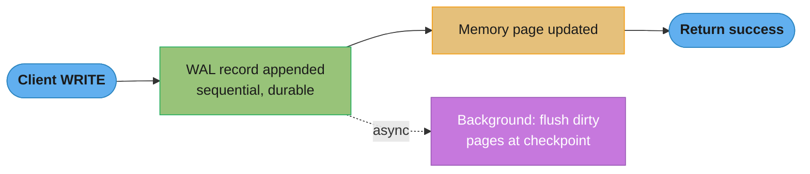
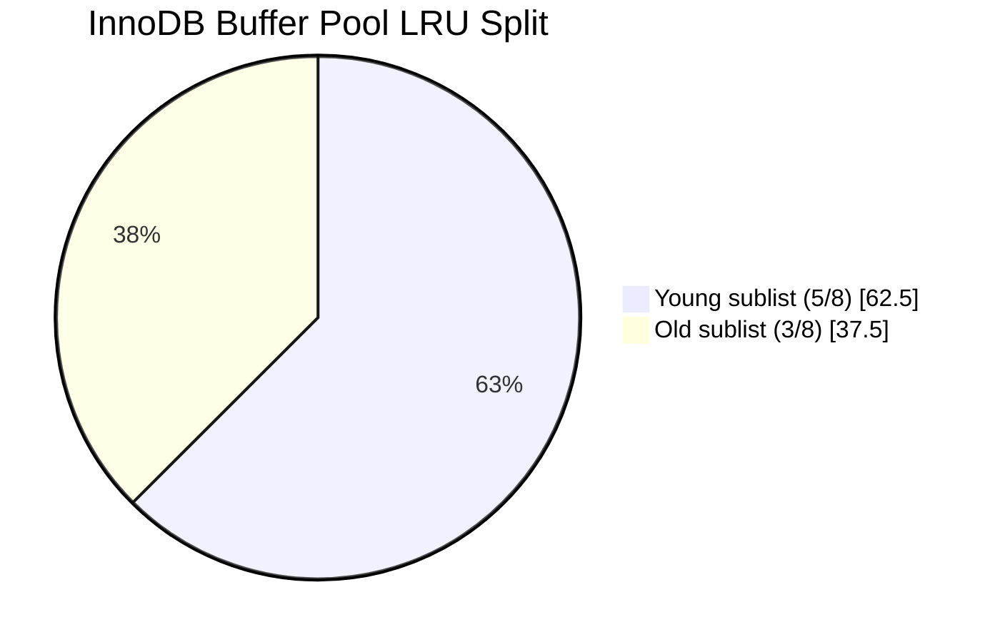
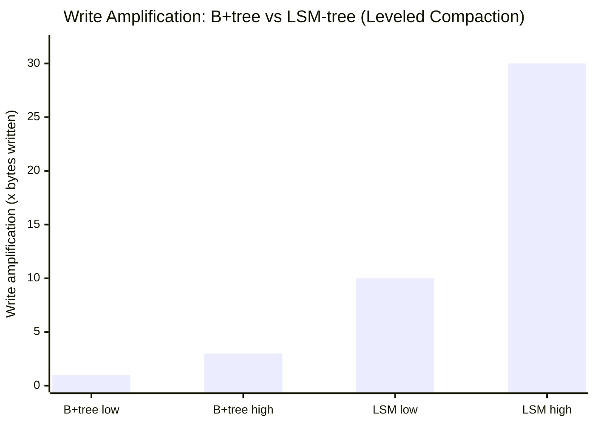
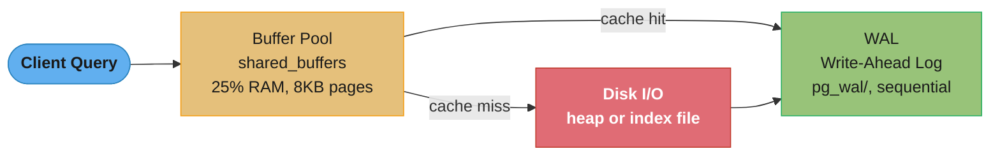
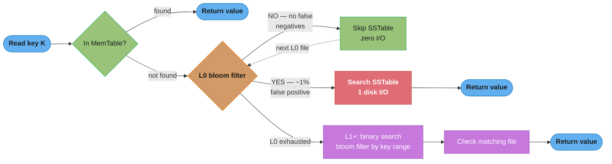
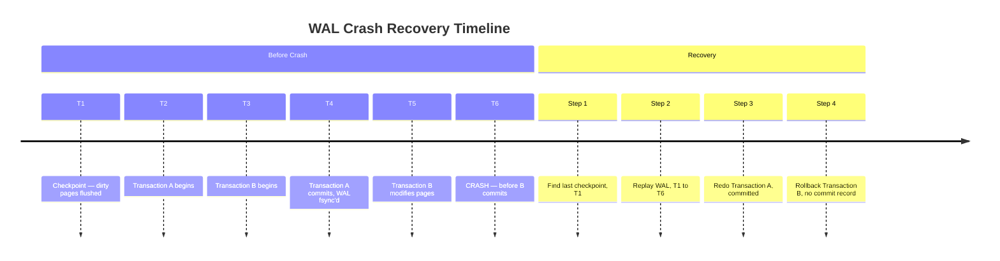
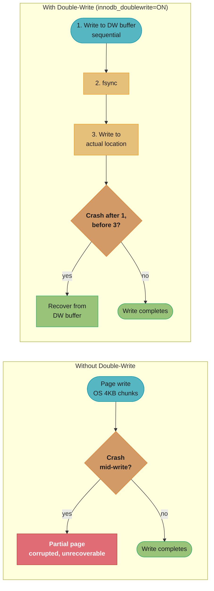

# Storage Engines Internals

## 1. Concept Overview

A storage engine is the component of a database system responsible for storing, retrieving, and managing data on disk. The choice of storage engine determines fundamental performance characteristics: read/write latency, throughput, compression ratios, recovery time, and space amplification. Two dominant storage engine families are B+tree-based engines (PostgreSQL heap + index, InnoDB) and LSM-tree-based engines (RocksDB, LevelDB, Cassandra SSTables).

---

## 2. Intuition

- **B+tree** is like a phone book: excellent for point lookups and range scans, but updating requires in-place edits that may cause page splits and random I/O.
- **LSM-tree** is like sticky notes that you periodically consolidate into organized binders: all writes go to a fast sequential log (MemTable), periodically flushed and merged. Reads must check multiple layers.
- **WAL** (Write-Ahead Log) is a safety net: before changing any page, write the intent to the log. On crash, replay the log to recover.
- **Key insight**: No storage engine is optimal for all workloads. B+tree wins for read-heavy OLTP; LSM-tree wins for write-heavy time-series and wide-column stores.

---

## 3. Core Principles

### Write-Ahead Log (WAL)

Before any data page is modified, the change is written to the WAL (a sequential append-only file). On crash, the database replays WAL from the last checkpoint to recover in-progress transactions.



The client receives success as soon as the WAL record is durable on disk; the actual dirty-page flush happens later, asynchronously, at the next checkpoint.

WAL levels (PostgreSQL):
- `minimal`: Sufficient for crash recovery only
- `replica`: Sufficient for streaming replication (includes changes needed by WAL receiver)
- `logical`: Sufficient for logical decoding (change data capture)

### Buffer Pool / Page Cache

The buffer pool is a memory-resident cache of disk pages. All reads go through the buffer pool; cache misses trigger a disk read. All writes update the buffer pool page (making it "dirty") without immediately writing to disk.

**LRU-K eviction (PostgreSQL clock-sweep, InnoDB LRU with young/old sublists)**: evicts pages not recently accessed. InnoDB uses a 5/8 (young sublist) + 3/8 (old sublist) split to protect frequently accessed pages from being evicted by large scans.



InnoDB's buffer pool LRU list is split 5/8 young to 3/8 old (62.5% / 37.5%) specifically so a single large sequential scan cannot evict the frequently-accessed working set.

Concrete numbers:
- PostgreSQL `shared_buffers` default = 128 MB; recommend 25% of RAM
- InnoDB `innodb_buffer_pool_size` recommend 70-80% of RAM
- Each page = 8 KB (PostgreSQL) or 16 KB (InnoDB)

---

## 4. Types / Architectures / Strategies

### B+Tree Storage Engine

```
Internal Node (fanout ~400 for 16KB page, 8-byte keys):
+--------+--------+--------+--------+
|  key1  | ptr1   |  key2  | ptr2   |
+--------+--------+--------+--------+

Leaf Node (data or pointers to heap):
+--------+--------+--------+--------+
| row1   | row2   | row3   | next_ptr|
+--------+--------+--------+--------+
(Leaf nodes linked as doubly-linked list for range scans)
```

Properties:
- Height: `log_fanout(N)` — for 64M rows with fanout 400: height = 3 (log_400(64,000,000) ≈ 2.9)
- I/O cost per lookup: O(log_fanout(N)) = 3 I/Os for 64M rows
- Writes cause in-place updates and potential page splits
- Fill factor: leave free space in pages to reduce split frequency

### LSM-Tree Storage Engine

**Write Path:**


**Read Path:**


Writes land in the fast in-memory MemTable and only reach disk once it fills at ~64MB; reads fall through every level in turn, taking the newest version when several layers hold the same key.

Compaction strategies:
- **STCS (Size-Tiered Compaction)**: merge SSTables of similar size. Good write amplification, bad space amplification.
- **LCS (Leveled Compaction)**: each level is a sorted run. Good space and read amplification, higher write amplification (~10-30x).
- **TWCS (Time-Window Compaction)**: groups by time window. Best for time-series (TTL expiry efficient).

Amplification factors:
- **Write amplification** (WA): bytes written to disk / bytes written by application. LSM: WA=10-30x (LCS); B+tree: WA~1-3x.
- **Read amplification** (RA): I/Os per read. LSM: RA=levels+1 (with bloom filters, often 1-2 I/Os); B+tree: RA=tree height (3-4 I/Os).
- **Space amplification** (SA): disk space / actual data size. LSM: SA=1.1-1.5x (LCS); B+tree: SA=1.3-2x (page fragmentation).



Leveled compaction pushes LSM-tree write amplification into the 10-30x range, roughly 5-15x higher than a B+tree's 1-3x — the structural cost of keeping SSTables sorted and non-overlapping within each level.

**What this actually says.** The 10-30x is not measured, it is derived:
`WA = 1 + T x (levels - 1)`, where `T` is the size ratio between adjacent levels. Every byte
promoted from `Li` to `Li+1` must be merged against roughly `T` bytes already sitting there, so
each level charges you `T` rewrites. Levels are set by data volume, so **write amplification is a
function of how much data you store**, not of how fast you write.

| Symbol | What it is |
|--------|------------|
| `T` | Level size ratio. 10 in RocksDB and Cassandra — each level 10x the one above |
| `levels` | Depth of the tree. `log_T(total_data / L1_size)`, rounded up |
| `1 +` | The MemTable flush. One rewrite of the data before any compaction happens |
| `T x (levels-1)` | Compaction. Each promotion rewrites ~`T` bytes per byte moved |
| space amp | `~1 + 1/T` for leveled — the deepest level holds ~90% of data, so 1.1x |

**Walk one example.** RocksDB defaults, `L1 = 256 MB` and `T = 10`:

```
  Level sizing:
    L1 =     256 MB
    L2 =   2,560 MB   (2.5 GB)
    L3 =  25,600 MB   ( 25 GB)
    L4 = 256,000 MB   (250 GB)

  Write amplification by dataset size:
    dataset ~2.5 GB  -> 2 levels -> WA = 1 + 10 x 1 = 11x
    dataset ~25 GB   -> 3 levels -> WA = 1 + 10 x 2 = 21x
    dataset ~250 GB  -> 4 levels -> WA = 1 + 10 x 3 = 31x

    That IS the quoted 10-30x band -- it is just 2, 3, and 4 levels.

  Physical cost at 4 levels: 1 TB of application writes -> 31 TB written to disk.
```

**Why the B+tree's 1-3x is a locality claim, not a structural one.** A B+tree writes whole pages,
so its amplification depends entirely on how many rows in a page get dirtied before the
checkpoint flushes it:

```
  8 KB page, 100-byte rows -> 81 rows per page

  rows dirtied before flush     bytes written / bytes changed
        1 (random UUID keys)         8,192 / 100   = 82x
        8 (some clustering)          8,192 / 800   = 10x
       81 (sequential keys)          8,192 / 8,100 = 1.01x

  Add the WAL (every change written twice) -> the sequential case lands at ~2x.
```

That is the whole 1-3x figure: a B+tree with sequential keys. Give it random keys and its write
amplification quietly exceeds an LSM-tree's — which is exactly the Pitfall 4 scenario, and the
reason "B+trees write less" is only true for workloads with key locality.

### Row vs Columnar Storage

**Row storage (PostgreSQL, MySQL)**:
```
Row 1: [id=1, name="Alice", age=30, salary=100000]
Row 2: [id=2, name="Bob",   age=25, salary=90000]
```
- Optimal for OLTP: fetch entire row in one I/O
- Poor compression (mixed types in same page)
- Full row scan to compute aggregates

**Columnar storage (ClickHouse, Parquet, DuckDB)**:
```
id column:     [1, 2, 3, 4, ...]
name column:   ["Alice", "Bob", "Carol", ...]
salary column: [100000, 90000, 120000, ...]
```
- Optimal for analytics: read only relevant columns
- Excellent compression (same-type data, delta/RLE encoding)
- Vectorized operations (SIMD on column arrays)
- Poor for point lookups (must reconstruct row across columns)

Compression ratios: columnar typically achieves 5-20x compression vs row storage.

### Copy-on-Write (CoW) Trees

Used in LMDB and TiKV's TitanDB:
- On write, copy modified path from root to leaf, never mutate in-place
- Old version remains accessible until readers release it
- Enables lock-free MVCC: readers always see a consistent snapshot
- Higher write amplification than B+tree in-place (must copy full path)

---

## 5. Architecture Diagrams

**B+Tree Engine (PostgreSQL heap + index):**



A cache hit is served straight from the 25%-RAM buffer pool; a miss falls through to disk I/O before either path reaches the WAL for durability.

**LSM-Tree Engine (RocksDB):**


Every write is durable in the WAL before it lands in the ~64MB in-memory MemTable; once full, data cascades through L0 into L1, L2 and beyond, each level roughly 10x the size of the one before.

---

## 6. How It Works — Detailed Mechanics

### B+Tree Page Split

```
Before insert (page full):
[10, 20, 30, 40, 50]

After insert of 35 (page split):
Parent: [... 30 ...]
         /       \
[10,20,30]    [35,40,50]

Cost:
- Write new sibling page
- Write updated parent page (pointer addition)
- In-memory: O(log n) to find insertion point
- Disk: 2-3 additional page writes for split
```

### LSM Bloom Filter

Each SSTable has a bloom filter (typically 10 bits/key, ~1% false positive rate):



Without bloom filters: O(levels) SSTable reads per lookup.
With bloom filters: O(1) SSTable reads with 99% probability.

**In plain terms.** The "10 bits/key, ~1% false positive" pairing is one formula evaluated once:
`FPR = (1 - e^(-kn/m))^k`. Read it as "the chance that all `k` hash positions for a key you never
inserted happen to already be set by other keys." Everything about a bloom filter — its size, its
error rate, why it never has false negatives — falls out of that sentence.

| Symbol | What it is |
|--------|------------|
| `m` | Bits in the filter's bit array |
| `n` | Keys inserted into it |
| `m/n` | Bits per key. The only knob that really matters. RocksDB default 10 |
| `k` | Hash functions. Each key sets `k` bits; a lookup checks the same `k` bits |
| `e^(-kn/m)` | Probability one specific bit is still 0 after inserting all `n` keys |
| `1 - e^(-kn/m)` | Probability one specific bit IS set. Raised to `k` = all `k` bits set by chance |

**Walk one example.** Start at the default `m/n = 10`, with the optimal `k = (m/n) x ln2 = 6.93`,
rounded to 7:

```
  kn/m       = 7 / 10 = 0.7
  e^(-0.7)   = 0.4966        <- chance a given bit is still 0
  1 - 0.4966 = 0.5034        <- chance a given bit is set
  0.5034 ^ 7 = 0.00819       <- all 7 positions set by accident

  FPR = 0.82%   -> the quoted "~1% false positive rate"
```

Note that the optimal `k` leaves the array almost exactly half full (0.5034). That is not a
coincidence — it is what maximizing entropy per bit looks like, and it is a fast sanity check on
any bloom filter sizing.

Now sweep both knobs. Bits per key first, each at its own optimal `k`:

```
  bits/key   optimal k   FPR         memory for 1 billion keys
      4          3       14.69%          0.47 GB
      8          6        2.16%          0.93 GB
     10          7        0.82%          1.16 GB
     16         11        0.046%         1.86 GB
     20         14        0.0067%        2.33 GB
```

Every extra bit per key cuts the error rate by about 1.6x, so going 10 -> 16 bits/key buys
`1.6^6 = 17x` fewer false positives for 0.70 GB more RAM per billion keys. That is a very cheap
exchange, which is why nobody ships a 4-bit filter. Now hold `m/n = 10` and vary `k` alone:

```
  k       FPR
   1     9.52%      too few probes -- one accidental collision is enough
   3     1.74%
   5     0.94%
   7     0.82%      <- optimum
   9     0.91%
  11     1.17%      too many probes -- the array saturates, every bit is set
```

The curve has a genuine minimum: too few hashes and one collision fools you, too many and you
fill the array so densely that every lookup matches. `k = (m/n) x ln2` is where those two
failures balance.

**Why there are no false negatives, ever.** Inserting a key only ever flips bits from 0 to 1;
nothing is ever cleared. So if a key was inserted, its `k` bits are all 1 by construction and the
filter must say "maybe." A "no" is therefore always the truth — which is precisely what the read
path needs: a `NO` lets the engine skip the SSTable with zero I/O and no correctness risk, while
a `YES` merely costs one wasted disk read 0.82% of the time.

### WAL Crash Recovery



**Result:** the database ends up consistent as of T4 — Transaction A's changes are redone because its commit record reached the WAL, while Transaction B's are rolled back because it never committed.

### Double-Write Buffer (InnoDB)

Protects against torn pages (partial 16KB write during crash):



Without the buffer, a crash mid-write can corrupt a page beyond recovery; with it enabled, InnoDB replays the last-known-good copy from the sequential double-write area, at a cost of roughly 5-10% write throughput.

---

## 7. Real-World Examples

- **PostgreSQL** uses heap files (unordered row storage) + B+tree indexes. Primary key is not the physical storage order (unlike InnoDB). Requires VACUUM to reclaim dead tuples.
- **InnoDB** (MySQL): clustered B+tree index — the primary key IS the physical storage order. Secondary indexes store the PK value as the row locator.
- **RocksDB**: LSM-tree, used by CockroachDB (range=64MB shards), TiKV, Cassandra (SSTables), MyRocks (MySQL engine).
- **LMDB**: Copy-on-write B+tree. Used by OpenLDAP, some embedded applications. Lock-free reads, single-writer constraint.
- **ClickHouse**: MergeTree family — columnar LSM variant. Each part is immutable; background merge compacts parts.

---

## 8. Tradeoffs

| Storage Engine | Write Speed | Read Speed | Compression | Space | Recovery | Best For |
|---------------|-------------|------------|-------------|-------|----------|---------|
| B+tree (PostgreSQL) | Medium | Fast | Low | Medium | Fast | OLTP reads |
| B+tree (InnoDB) | Medium | Fast | Low | Medium | Fast | OLTP mixed |
| LSM (RocksDB) | Fast | Medium | High | Low | Medium | Write-heavy |
| Columnar (ClickHouse) | Slow (batch) | Very Fast | Very High | Low | Medium | Analytics |
| CoW B+tree (LMDB) | Slow (single writer) | Fast | Low | Medium | Instant | Read-heavy embedded |

---

## 9. When to Use / When NOT to Use

**B+tree**: Use for OLTP with mixed read/write workloads, range queries, frequent point lookups. Do not use for write-heavy append-only workloads.

**LSM-tree**: Use for write-heavy workloads (time-series, log ingestion, NoSQL stores), good compression needed, sequential writes dominate. Do not use for read-heavy random-access OLTP.

**Columnar**: Use for analytics, aggregation queries on large datasets, OLAP workloads. Do not use for OLTP point lookups or frequent updates.

**In-memory**: Use for cache layers, session stores, leaderboards. Do not use as primary store without WAL/persistence for durability requirements.

---

## 10. Common Pitfalls

**Pitfall 1: LSM read amplification in production**
A team using Cassandra (LSM) noticed p99 read latency spiking to 500ms. Root cause: L0 SSTable count grew to 20 (default threshold 4) during write bursts, causing each read to check 20 files. Fix: tune `l0_file_num_compaction_trigger=4`, increase compaction throughput budget.

**Pitfall 2: WAL fsync misconfiguration**
A team set `innodb_flush_log_at_trx_commit=0` for performance. During a database server crash, they lost 1 second of transactions. This setting means WAL is only flushed to disk once per second, not per commit. Correct setting for full ACID durability: `innodb_flush_log_at_trx_commit=1`.

**Pitfall 3: Buffer pool too small causing thrashing**
Production PostgreSQL with 64GB RAM but `shared_buffers=128MB` (default). Hot pages were evicted constantly. Simple fix: set `shared_buffers=16GB`. Cache hit rate went from 60% to 99%, query latency dropped 10x.

**Pitfall 4: B+tree page fill factor too high**
An application with heavy sequential inserts near primary key (UUID v4 = random) caused constant page splits. Fix: set `FILLFACTOR=70` on the index to leave 30% free space, reducing split frequency. Alternatively, use ULIDv2 or sequential UUIDs.

**Pitfall 5: LSM compaction falling behind**
Write throughput exceeded compaction throughput → L0 files accumulate → read latency degrades → reads trigger more compaction → positive feedback loop. Fix: throttle ingestion rate, increase `compaction_throughput_mb_per_sec`, add compaction threads.

**Pitfall 6: Torn page without double-write buffer**
Team disabled InnoDB double-write buffer (`innodb_doublewrite=OFF`) for 10% write performance gain. After power failure, several 16KB pages had only their first 4KB written. The pages were unreadable — not even crash recovery could fix them. The team had to restore from backup (4 hours of data loss). Always keep double-write enabled or use SSDs with power-loss protection.

---

## 11. Technologies & Tools

| Tool | Storage Engine | Type | Use Case |
|------|---------------|------|---------|
| PostgreSQL | Heap + B+tree | Row | OLTP, HTAP |
| MySQL/InnoDB | Clustered B+tree | Row | OLTP |
| SQLite | B+tree | Row | Embedded |
| RocksDB | LSM-tree | Row | KV store, embedded NoSQL |
| LevelDB | LSM-tree | Row | Embedded KV |
| LMDB | CoW B+tree | Row | Embedded, read-heavy |
| Cassandra | LSM (SSTables) | Wide-column | Write-heavy distributed |
| ClickHouse | MergeTree | Columnar | Analytics |
| Parquet | Columnar | Columnar | Data lake analytics |
| WiredTiger | B+tree + LSM | Both | MongoDB default engine |

---

## 12. Interview Questions with Answers

**Q: Why does InnoDB use a clustered index and what is the impact on secondary indexes?**
InnoDB's primary key IS the B+tree — rows are physically stored in primary key order within leaf nodes. This makes primary key lookups require only one B+tree traversal. Secondary indexes store the primary key value as the row locator, not the physical row address. A secondary index lookup requires two B+tree traversals: first through the secondary index to get the PK, then through the clustered index (primary) to get the full row. This "double lookup" costs an extra I/O per secondary index scan if the data is not in the buffer pool.

**Q: Walk me through a write operation in RocksDB from application to durable storage.**
(1) Write is appended to the WAL file synchronously (ensures durability). (2) Write is inserted into the MemTable (an in-memory skip list, ordered by key). (3) Write is acknowledged to the application. (4) When MemTable reaches ~64MB, it becomes immutable and a new MemTable opens. (5) Background thread flushes the immutable MemTable to an SSTable on disk (L0 file). (6) Background compaction merges L0 SSTables into L1, L1 into L2, etc. Each merge step produces larger, sorted, de-duplicated SSTables.

**Q: How does WAL enable point-in-time recovery?**
The WAL is an append-only sequence of all changes ever made to the database. By archiving WAL segments continuously (pg_archivecommand, WAL-G), you accumulate a complete change log. To recover to time T: start from the last base backup before T, replay archived WAL segments one by one until reaching T. Each WAL record is idempotent (replay-safe) because it's a physical delta (page number, offset, old value, new value). PostgreSQL WAL segments are 16MB each by default.

**Q: What is write amplification in LSM-trees and how do you minimize it?**
Write amplification (WA) = bytes written to disk / bytes written by application. In Leveled Compaction (LCS), data moves through multiple levels: L0→L1→L2→L3. Each level-crossing rewrites the data. WA = sum over levels of (level_ratio), typically 10-30x. Minimization strategies: (1) Increase SSTable sizes (fewer compaction events). (2) Use Size-Tiered Compaction (STCS) which has lower WA (~10x) at cost of space amplification. (3) Tune `level0_file_num_compaction_trigger` to reduce premature compaction. (4) Use WA-optimized algorithms like RocksDB's Dynamic Leveled Compaction.

**Q: Explain the difference between B+tree and LSM-tree for a workload with 10,000 writes/second and 100 reads/second.**
With 10K writes/sec, B+tree suffers because each write potentially causes random I/O (page lookup + possible split + WAL write). This generates high IOPS demand. LSM-tree converts random writes to sequential writes (WAL + MemTable), dramatically reducing IOPS at the cost of read amplification. For this write-heavy, read-light workload, LSM-tree is superior — it can sustain higher write throughput on the same hardware. Use RocksDB, Cassandra, or similar LSM-based systems. For 100 reads/sec with bloom filters, read latency is acceptable even with 2-3 SSTable checks per read.

**Q: How does the buffer pool handle dirty pages and when does it flush them to disk?**
Dirty pages (modified but not yet written to disk) are flushed by: (1) Checkpoint process — periodically flushes all dirty pages to disk and advances the checkpoint LSN in WAL (default checkpoint_timeout=5min in PostgreSQL). (2) Background writers — bgwriter in PostgreSQL continuously flushes least-recently-used dirty pages to avoid checkpoint I/O spikes. (3) LRU eviction — when a clean page is needed but buffer pool is full, evict the LRU page; if it's dirty, flush it first. (4) explicit CHECKPOINT command.

**Q: What is a page cache and how does it differ from the buffer pool?**
The OS page cache caches file system blocks. The database buffer pool caches database pages. When a database has its own buffer pool (PostgreSQL, InnoDB), data can be cached twice: once in the buffer pool and once in the OS page cache — "double buffering." PostgreSQL uses O_RDONLY + madvise(MADV_DONTNEED) for sequential scans to avoid OS page cache pollution. `effective_cache_size` in PostgreSQL tells the query planner how much OS cache is available without actually allocating it.

**Q: Explain Copy-on-Write trees and their advantage for MVCC.**
In CoW trees (LMDB, TiKV), every write creates a new version of the modified path from root to the changed leaf — the old path remains unchanged. Readers take a pointer to the root at their snapshot time and traverse it locklessly, never seeing any in-progress write. This enables true lock-free reads: no latches, no shared memory contention, no MVCC garbage to collect. The downside: LMDB allows only one writer at a time (writer takes a file-level lock), and write amplification is proportional to tree height (typically 3-4 pages copied per write vs LSM's sequential write).

**Q: What is tombstone accumulation in LSM-trees and how does it affect performance?**
A delete in an LSM-tree writes a tombstone marker (a special delete record). The original row may still exist in older SSTables. During reads, the system must check all SSTables, find the tombstone, and skip the row — increasing read amplification. Tombstones are only removed during compaction when all SSTables containing the original row have been merged. In Cassandra with heavy deletes and slow compaction, tombstone count can reach millions, degrading read latency from <5ms to >500ms. Fix: tune `tombstone_compaction_interval`, use TTL-based expiry instead of explicit deletes, use TWCS with time-based data.

**Q: How does RocksDB's bloom filter reduce read amplification?**
Each SSTable has a per-file Bloom filter (typically 10 bits/key, ~1% false positive rate). For a read: (1) Check MemTable — exact. (2) For each SSTable (newest to oldest), check bloom filter first. Filter says NO → SSTable definitely does not have the key (skip — no I/O). Filter says YES → search the SSTable (1% chance of false positive — one extra I/O). Net effect: instead of reading N SSTable files, only ~1-2 SSTable files are read per key lookup. Memory cost: ~10 bits/key × number of keys.

**Q: Compare the recovery times for B+tree vs LSM-tree engines after a crash.**
B+tree recovery (PostgreSQL/InnoDB): Replay WAL from last checkpoint. Checkpoint interval = 5min default. WAL at 100MB/sec for 5min = 30GB WAL to replay in worst case. Recovery takes seconds to minutes depending on WAL size and replay speed. LSM-tree recovery (RocksDB): Replay WAL for only the MemTable contents (since last flush). MemTable flush happens every ~64MB. WAL to replay is much smaller. Recovery typically takes < 1 second for small MemTables. However, opening an LSM database requires reading all SSTable metadata files, which can take several seconds for large databases.

**Q: What is the doublewrite buffer in InnoDB and is it still needed on modern SSDs?**
The doublewrite buffer is a sequential area in the InnoDB tablespace where pages are written before being written to their actual locations. This prevents torn pages: if a crash occurs during the 16KB page write, InnoDB recovers the page from the doublewrite buffer. On modern SSDs with power-loss protection (PLP) capacitors (enterprise SSDs, NVMe with 'power loss data protection'), torn writes are guaranteed not to occur because the capacitor provides enough power to complete the in-flight write. With PLP SSDs, `innodb_doublewrite=OFF` is safe and eliminates ~10% write overhead. Consumer SSDs without PLP still need the doublewrite buffer.

**Q: How does columnar storage achieve 10-100x compression compared to row storage?**
Columnar stores adjacent values of the same column together. Same-type data compresses dramatically: (1) Delta encoding for sorted numeric columns (timestamps, sequential IDs) — store deltas instead of full values. Example: [1000, 1001, 1002] → delta=[1000, 1, 1], fits in fewer bits. (2) RLE (Run-Length Encoding) for low-cardinality columns (e.g., country codes) — store [US×1000, UK×500]. (3) Dictionary encoding for string columns — map values to 2-byte integers. (4) Bit-packing for small integers. ClickHouse uses LZ4 on top of these encoding, achieving 10-100x compression on typical analytical data.

**Q: What is the role of the WAL sender and WAL receiver in PostgreSQL streaming replication?**
The WAL sender is a backend process on the primary that continuously reads the WAL and streams WAL records to connected replicas. The WAL receiver is a process on the replica that receives WAL records, writes them to the replica's WAL, and applies them to update the replica's data files. This is physical replication: the replica applies the exact same byte changes as the primary. Recovery point: if the primary crashes, promote the replica (it has replayed all received WAL). Monitoring: `pg_stat_replication` on primary shows WAL sender lag per replica.

**Q: Explain the InnoDB redo log (circular) and why it has a size limit.**
The InnoDB redo log (ib_logfile0, ib_logfile1 — or auto-sized in MySQL 8) is a circular buffer. New redo records are appended at the write position. The oldest records that are no longer needed (because their dirty pages have been flushed to disk) are overwritten. If dirty pages are not flushed fast enough, the write position catches up to the oldest needed record — this triggers a "sharp checkpoint" (emergency flush of all dirty pages), causing severe I/O spikes. Default redo log size in MySQL 5.7: 48MB (way too small). Recommendation: 1-4GB or use MySQL 8's auto-sizing. Set `innodb_log_file_size` accordingly.

**Q: How do MVCC dead tuples cause table bloat in PostgreSQL?**
In PostgreSQL's MVCC, UPDATE = delete old version + insert new version. The old version (dead tuple) is marked with xmax = committing transaction's ID but remains physically in the heap until VACUUM reclaims it. Dead tuples consume disk space and increase heap scan cost. On a table with 100M rows and 10% update rate per day: after 30 days without VACUUM, 30M dead tuples accumulate. A sequential scan reads them all. VACUUM removes dead tuples by marking their space as reusable (doesn't return space to OS — that requires VACUUM FULL, which takes an exclusive lock). Auto-vacuum triggers when dead tuple count exceeds `autovacuum_vacuum_scale_factor` (default 0.2 = 20% of table) × table row count.

**Q: What is the LSM tree's space amplification and how does leveled compaction reduce it?**
Space amplification = actual disk space / minimum space needed for data. Size-Tiered Compaction (STCS) has SA up to 2x because multiple overlapping SSTables can contain different versions of the same key. Leveled Compaction (LCS) limits SA to ~1.1x because within each level (L1+), there is no key overlap — at most two versions of a key exist simultaneously (one in Lk, one being written to Lk+1 during compaction). The tradeoff: LCS has higher write amplification (10-30x) because keys are rewritten across levels more frequently.

---

## 13. Best Practices

1. Size the buffer pool to fit the working set: `shared_buffers = 25% RAM` (PostgreSQL), `innodb_buffer_pool_size = 75% RAM` (InnoDB).
2. Monitor write amplification in RocksDB/Cassandra with `rocksdb.bytes.written` metric.
3. Use `FILLFACTOR=70-90` on B+tree indexes with heavy update patterns to reduce page splits.
4. Configure WAL durability explicitly: never set `fsync=off` in production; the default `synchronous_commit=on` is correct.
5. Enable InnoDB double-write buffer unless on enterprise SSDs with power-loss protection.
6. For LSM-based systems, tune compaction to stay ahead of write throughput — falling behind causes read latency spikes.
7. Choose primary key data types carefully: random UUIDs cause random B+tree inserts (cache thrashing); use sequential ULIDs or timestamp-prefixed IDs for insert-heavy workloads.
8. Monitor buffer pool hit rate: below 99% means the working set doesn't fit in memory — increase buffer pool or add RAM.

---

## 14. Case Study

**Scenario**: A fintech company's PostgreSQL database handling 5,000 transactions/second starts showing p99 write latency spiking from 5ms to 500ms every 5 minutes, exactly at checkpoint intervals.

**Diagnosis**:
```sql
-- Check checkpoint frequency and duration
SELECT * FROM pg_stat_bgwriter;
-- Result: checkpoints_timed=288 (5min interval),
--         checkpoint_write_time=45000ms (45 seconds!),
--         buffers_checkpoint=800000 (6.4GB of dirty data per checkpoint)

-- Check WAL configuration
SHOW max_wal_size; -- 1GB (too small causing frequent checkpoints)
SHOW checkpoint_completion_target; -- 0.5 (default, compresses checkpoint into first 50% of interval)
```

**Root cause**: `max_wal_size=1GB` caused checkpoint every 60 seconds (not 5 minutes). `checkpoint_completion_target=0.5` caused all I/O to happen in first 30 seconds of the 60-second interval — massive I/O spike affecting query latency.

**Fix applied**:
```
max_wal_size = 8GB               -- Allow more WAL before forcing checkpoint
checkpoint_completion_target = 0.9 -- Spread checkpoint I/O over 90% of interval
checkpoint_timeout = 10min       -- Maximum time between checkpoints
```

**Result**: Checkpoint I/O spread over 9 minutes (vs 30 seconds), eliminating spikes. p99 write latency returned to 5-8ms consistently. Disk I/O bandwidth utilization smoothed from 100% bursts to steady 30%.

Key lesson: checkpoint tuning is one of the most impactful PostgreSQL performance levers, but it requires understanding the interaction between `max_wal_size`, `checkpoint_timeout`, and `checkpoint_completion_target`.
