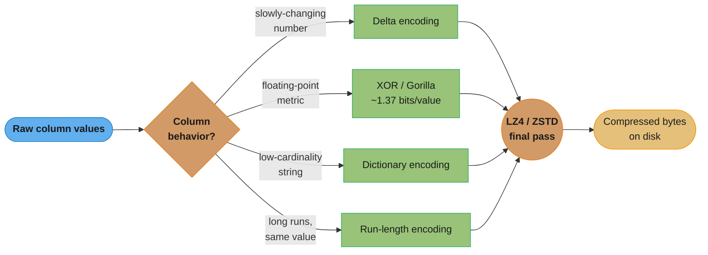
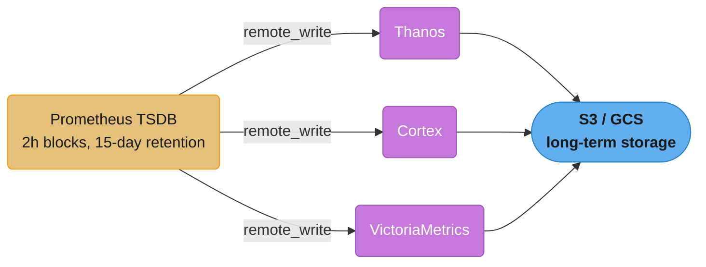
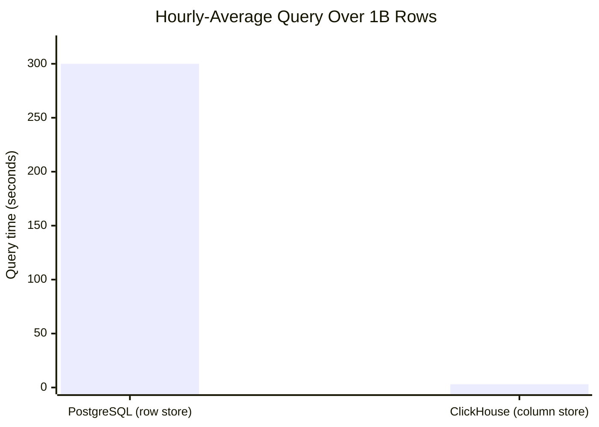
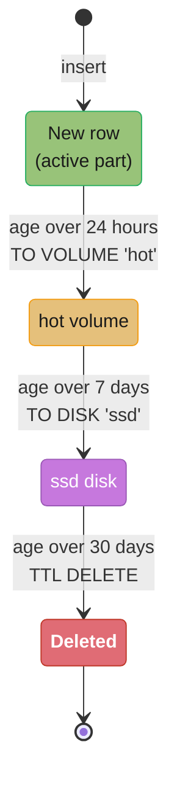
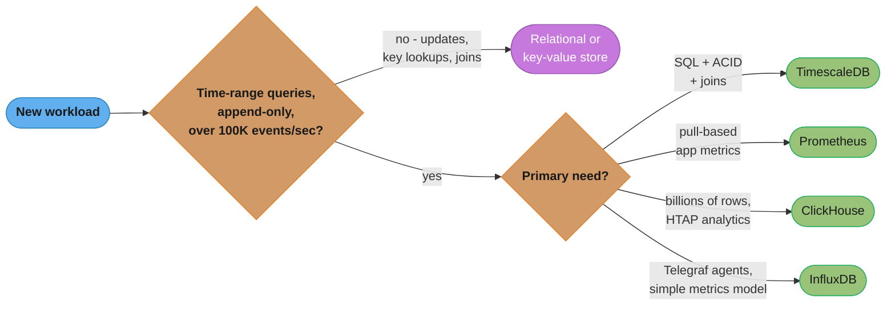

# Time-Series Databases

## 1. Concept Overview

Time-series databases (TSDBs) are optimized for data with a natural time dimension: metrics, events, sensor readings, financial ticks, and application logs. They exploit the append-only, time-ordered nature of this data for dramatic compression and query performance. Key databases: TimescaleDB (PostgreSQL-based), InfluxDB (purpose-built TSDB), ClickHouse (columnar OLAP with time-series strengths), and Prometheus (pull-based metrics).

---

## 2. Intuition

Time-series data has predictable patterns: values arrive in chronological order, old data is rarely updated, and queries typically aggregate over time ranges. These properties enable specialized optimizations: delta encoding (store differences, not values), chunk-based partitioning (drop old chunks instantly), and continuous aggregation (pre-compute hourly/daily summaries).

- **Key insight**: A well-tuned ClickHouse on commodity hardware can compress 1TB of raw time-series data to 10-50GB and return aggregation queries in milliseconds. The compression ratio alone justifies choosing a columnar TSDB over a row-based database for analytics workloads.

---

## 3. Core Principles

### Time-Series Compression

**Delta encoding**: Store the difference between consecutive values instead of absolute values. If temperature readings are [22.1, 22.3, 22.4, 22.2, 22.3], store: [22.1, +0.2, +0.1, -0.2, +0.1]. Values that change slowly compress dramatically.

**XOR compression (Gorilla algorithm, Facebook 2015)**:
```
Floating-point values often differ only in a few bits.
22.1 in IEEE 754: 0 10000011 01100001100110011001101
22.3 in IEEE 754: 0 10000011 01100100110011001100110

XOR: 0 00000000 00000101110101010001011 (many leading zeros)
→ Store only the non-zero portion with leading/trailing zero counts

Result: ~1.37 bits per timestamp (vs 64 bits raw) for typical metrics
Gorilla paper: 12x compression on real Facebook production metrics
```

**Dictionary encoding**: For string columns with low cardinality (host names, metric names), map values to small integers. 1000 unique hosts → 10-bit integer per row vs 20-50 byte string.

**Run-length encoding (RLE)**: For columns with long runs of the same value. Status field = "OK" for 10,000 consecutive rows → store "OK × 10000" rather than 10,000 copies.

**LZ4 / ZSTD as final pass**: Apply general-purpose compression on top of column-specific encoding. ClickHouse default: LZ4. Better compression: ZSTD (slower but 2-3x smaller).

These four encodings are not alternatives — a real column-store pipeline routes each column to the encoding that matches its behavior, then runs every result through the same general-purpose compressor:



Each column takes exactly one branch based on its data behavior, and every branch still passes through a final LZ4/ZSTD stage — this layering is why ClickHouse reaches the 10-50GB-from-1TB ratio cited in the intuition above rather than relying on any single technique alone.

---

## 4. Types / Architectures / Strategies

### TimescaleDB

TimescaleDB is a PostgreSQL extension that adds time-series capabilities while remaining SQL-compatible.

```sql
-- Create a hypertable (automatically partitioned by time):
CREATE TABLE sensor_readings (
    time        TIMESTAMPTZ NOT NULL,
    device_id   BIGINT NOT NULL,
    temperature DOUBLE PRECISION,
    humidity    DOUBLE PRECISION
);
SELECT create_hypertable('sensor_readings', 'time', chunk_time_interval => INTERVAL '7 days');
-- Default chunk = 7 days of data. Each chunk is a separate PostgreSQL table.

-- Compression (TimescaleDB 1.5+):
ALTER TABLE sensor_readings SET (
    timescaledb.compress,
    timescaledb.compress_segmentby = 'device_id',
    timescaledb.compress_orderby = 'time DESC'
);
SELECT add_compression_policy('sensor_readings', INTERVAL '7 days');
-- Chunks older than 7 days are automatically compressed
-- Compression ratio: typically 90-95% (10-20x smaller)

-- Continuous aggregates (pre-computed rollups):
CREATE MATERIALIZED VIEW hourly_averages
WITH (timescaledb.continuous) AS
SELECT time_bucket('1 hour', time) AS hour,
       device_id,
       AVG(temperature) AS avg_temp,
       MAX(temperature) AS max_temp,
       MIN(temperature) AS min_temp
FROM sensor_readings
GROUP BY hour, device_id;
-- Refreshes automatically when new data arrives (or on schedule)

-- Data retention (drop old chunks):
SELECT add_retention_policy('sensor_readings', INTERVAL '90 days');
-- Drops entire 7-day chunks older than 90 days — instant (DROP TABLE, not DELETE)
```

### InfluxDB

Purpose-built TSDB with its own query language (InfluxQL/Flux) and storage format.

```
InfluxDB data model:
  Measurement: like a table (e.g., "cpu", "temperature")
  Tag: indexed string dimension (host, region, sensor_id)
  Field: the actual measurement values (value, cpu_percent, temperature_celsius)
  Timestamp: nanosecond precision

Line protocol (write format):
  cpu,host=server01,region=us-east cpu_percent=95.5,idle=4.5 1711234567890000000
  └─ measurement ──┘└── tags ──────┘└────── fields ─────────┘└── timestamp (ns) ┘

TSM (Time-Structured Merge Tree) storage:
  Similar to LSM-tree but optimized for time-series:
  - Data organized by measurement + tag set + time range (TSM files)
  - Built-in compression per field type
  - Automatic compaction within time blocks

InfluxDB 3.0 (2023): switched to Apache Arrow + Parquet on object storage
```

```flux
// Flux query language (InfluxDB 2.0+):
from(bucket: "sensors")
  |> range(start: -1h)
  |> filter(fn: (r) => r._measurement == "temperature" and r.device_id == "dev-42")
  |> aggregateWindow(every: 5m, fn: mean)
  |> yield(name: "5min_avg")
```

### ClickHouse

Columnar OLAP database with exceptional time-series analytics performance.

```sql
-- MergeTree engine family (the core of ClickHouse time-series):
CREATE TABLE sensor_readings (
    device_id   UInt32,
    ts          DateTime,
    temperature Float32,
    humidity    Float32
) ENGINE = MergeTree()
PARTITION BY toYYYYMM(ts)    -- Monthly partitions (drop by dropping partition)
ORDER BY (device_id, ts)      -- Primary key: also the physical sort order
-- ORDER BY determines how rows are physically stored (like a clustered index)
-- Querying by device_id + ts range: sparse primary index skips irrelevant granules

-- Compression:
-- Default: LZ4 per column
-- Better: CODEC(Delta, ZSTD) for slowly-changing values (temperature, metrics)
-- CODEC(Gorilla) for floating-point metrics (implements XOR Gorilla algorithm)
ALTER TABLE sensor_readings MODIFY COLUMN temperature Float32 CODEC(Delta(4), ZSTD(3));

-- Materialized views (real-time pre-aggregation):
CREATE MATERIALIZED VIEW sensor_hourly
ENGINE = AggregatingMergeTree()
PARTITION BY toYYYYMM(hour)
ORDER BY (device_id, hour)
AS SELECT
    device_id,
    toStartOfHour(ts) AS hour,
    avgState(temperature) AS avg_temp_state,
    maxState(temperature) AS max_temp_state
FROM sensor_readings
GROUP BY device_id, hour;

-- Query the materialized view:
SELECT device_id, hour, avgMerge(avg_temp_state), maxMerge(max_temp_state)
FROM sensor_hourly
WHERE device_id = 42 AND hour >= now() - INTERVAL 24 HOUR
GROUP BY device_id, hour;
```

### Prometheus

Pull-based metrics system with its own time-series database.

```yaml
# Prometheus configuration: scrape targets
scrape_configs:
  - job_name: 'application'
    scrape_interval: 15s
    static_configs:
      - targets: ['app-server:8080']
    metrics_path: '/actuator/prometheus'
```

```promql
# PromQL (Prometheus Query Language):

# Rate of HTTP requests per second (over 5 minute window):
rate(http_requests_total{status="200", method="GET"}[5m])

# 95th percentile request latency:
histogram_quantile(0.95, rate(http_request_duration_seconds_bucket[5m]))

# CPU usage by instance:
100 - (avg by (instance) (rate(node_cpu_seconds_total{mode="idle"}[5m])) * 100)

# Alert: when error rate exceeds 1% for 5 minutes:
# In alertmanager:
expr: sum(rate(http_requests_total{status=~"5.."}[5m])) /
      sum(rate(http_requests_total[5m])) > 0.01
for: 5m
```

Prometheus's local TSDB stores data in 2-hour blocks (index + compressed samples, merged by compaction over time) and keeps only 15 days by default; production setups fan the same stream out to one of three long-term backends for durable, multi-cluster storage.



All three backends solve the same gap — Prometheus's own storage is deliberately short-term, so the real choice is scale and multi-tenancy, not whether to add one of them at all.

---

## 5. Architecture Diagrams

The write path fans in from many producers, buffers through Kafka, lands in the TSDB, and is pre-aggregated before it ever reaches a dashboard:

```mermaid
flowchart LR
    classDef io      fill:#61afef,stroke:#2e86c1,color:#1a1a1a,font-weight:bold
    classDef frozen  fill:#c678dd,stroke:#9b59b6,color:#fff
    classDef train   fill:#98c379,stroke:#27ae60,color:#1a1a1a
    classDef mathOp  fill:#d19a66,stroke:#e67e22,color:#1a1a1a,font-weight:bold
    classDef lossN   fill:#e06c75,stroke:#c0392b,color:#fff,font-weight:bold
    classDef req     fill:#56b6c2,stroke:#0097a7,color:#1a1a1a
    classDef base    fill:#e5c07b,stroke:#f39c12,color:#1a1a1a

    src([IoT / Sensors / Apps]) -->|"write<br/>10M events/sec"| kafka(Kafka<br/>ingestion buffer)
    kafka -->|consume| tsdb(ClickHouse / TimescaleDB<br/>/ InfluxDB)
    tsdb -->|"real-time<br/>aggregation"| mv(Materialized Views /<br/>Continuous Aggregates)
    mv -->|"query<br/>dashboards, alerts"| dash([Grafana / Kibana /<br/>dashboards])

    class src,dash io
    class kafka req
    class tsdb base
    class mv mathOp
```



**ClickHouse granule structure (primary index)**: MergeTree's sparse primary index stores one index mark per granule (default 8192 rows), not per row — the layout below shows why a query with `ORDER BY (device_id, ts)` can binary-search straight to the matching marks and skip everything else.

```
MergeTree table: ORDER BY (device_id, ts)
Primary key index (sparse): one entry per 8192 rows (default granule_size)

Index marks:
  Mark 0:  device_id=1,  ts=2024-01-01 00:00
  Mark 1:  device_id=1,  ts=2024-01-01 02:00
  Mark 2:  device_id=5,  ts=2024-01-01 00:00
  ...

Query: WHERE device_id = 1 AND ts >= '2024-01-01 01:00'
→ Binary search index marks → skip to Mark 0
→ Read granule 0 (8192 rows), filter by ts >= 01:00
→ Continue to Mark 1, etc.
→ Skip Mark 2+ (device_id=5, not relevant)

Result: read only relevant data blocks, not entire table
```

---

## 6. How It Works — Detailed Mechanics

### ClickHouse vs Row-Based Database for Time-Series

```sql
-- Query: average temperature per hour for last 7 days
-- On 1 billion rows

-- PostgreSQL (row store):
-- Must read full rows (device_id, ts, temperature, humidity, pressure...)
-- Even though we only need temperature column
-- IO: reads all columns = 100 bytes × 1B rows = 100GB data read

-- ClickHouse (column store):
-- Reads ONLY the timestamp and temperature columns
-- Compressed with Delta+ZSTD: effectively ~2-4 bytes/row
-- IO: reads 2 columns = 6 bytes × 1B rows (compressed) ≈ 6GB before decompression
-- Vectorized CPU operations on arrays (SIMD)
-- Result: ClickHouse query: ~3 seconds vs PostgreSQL: ~300 seconds

-- ClickHouse query:
SELECT toStartOfHour(ts) AS hour,
       avg(temperature) AS avg_temp
FROM sensor_readings
WHERE ts >= now() - INTERVAL 7 DAY
GROUP BY hour
ORDER BY hour;
-- Reads ~7 days × partition + sparse index → skip irrelevant data
-- Vectorized aggregation on temperature column only
```



Reading only the 2 needed columns instead of every 100-byte row cuts I/O from ~100GB to ~6GB compressed, turning a ~300-second full-row scan into a ~3-second vectorized column scan — a roughly 100x gap that comes from the columnar layout itself, not from faster hardware.

### Downsampling and Retention

```sql
-- Problem: 1B rows/day at raw resolution = 365B rows/year = petabytes
-- Solution: downsample old data, drop raw data after retention period

-- TimescaleDB: continuous aggregate + retention:
-- Keep: 1-minute resolution for 7 days
-- Keep: 1-hour aggregates for 90 days
-- Keep: 1-day aggregates forever
-- Raw data: dropped after 7 days

-- ClickHouse: TTL for automatic downsampling:
CREATE TABLE sensor_readings (
    ts          DateTime,
    device_id   UInt32,
    temperature Float32
) ENGINE = MergeTree()
ORDER BY (device_id, ts)
TTL ts + INTERVAL 30 DAY DELETE,            -- Delete raw data after 30 days
    ts + INTERVAL 7 DAY TO DISK 'ssd',     -- Move to SSD after 7 days
    ts + INTERVAL 24 HOUR TO VOLUME 'hot'; -- Move to hot tier within 24 hours
```

Each TTL clause above fires independently on row age, so a single row cools through three tiers in sequence rather than jumping straight to deletion:



Tracing one row through the multi-clause TTL statement makes the ordering concrete: active data cools into the hot volume at 24 hours, moves to SSD at 7 days, and is deleted at 30 days — the same age-based tiering that lets ClickHouse keep only what's still worth its storage tier.

---

## 7. Real-World Examples

- **Cloudflare**: Uses ClickHouse for DNS analytics — 1 trillion+ DNS queries per day, queried in < 1 second.
- **Uber**: Uses InfluxDB for ride request metrics, surge pricing triggers, driver location time-series.
- **Netflix**: Uses TimescaleDB for application performance monitoring (APM) — thousands of services emitting metrics.
- **Grafana**: Uses Prometheus + Thanos for its own infrastructure monitoring (millions of time-series).
- **Discord**: Uses ClickHouse for analytics — replaced Spark-based analytics with ClickHouse for 100x query speedup.

---

## 8. Tradeoffs

| Feature | TimescaleDB | InfluxDB | ClickHouse | Prometheus |
|---------|-------------|---------|------------|------------|
| SQL support | Full PostgreSQL | InfluxQL/Flux | SQL-like | PromQL only |
| Write throughput | High (1M rows/s) | Very High | Very High | Medium |
| Query performance | Excellent | Good | Excellent | Good |
| Compression | Excellent (90%+) | Good | Excellent (90-99%) | Good |
| Retention management | Excellent (chunk drop) | Good (bucket retention) | Excellent (TTL/partitions) | Limited (15-day default) |
| Horizontal scale | Limited (Timescale Cloud) | InfluxDB 3.0 | Excellent (distributed) | Via Thanos/Cortex |
| Operational complexity | Low (PostgreSQL) | Medium | High | Low |

---

## 9. When to Use / When NOT to Use

**Use time-series database when**:
- Primary query pattern is time-range-based aggregation
- Data is append-only (no updates to historical data)
- High ingestion rate (> 100K events/second)
- Retention policies needed (automatically drop old data)
- Compression is critical (IoT, metrics storage costs)

**TimescaleDB**: best for teams that know PostgreSQL, need full SQL, and want ACID compliance.

**InfluxDB**: best for metrics and monitoring use cases, especially with Telegraf collector ecosystem.

**ClickHouse**: best for analytics at scale (billions of rows), complex SQL aggregations, HTAP workloads, and when compression ratio is critical.

**Prometheus**: best for application monitoring with pull-based scraping; not a general-purpose TSDB.

**Do not use TSDB when**:
- Frequent updates to historical data are needed
- Random access to individual records (not time-range)
- Complex joins across many entity types (relational is better)
- Primary key lookups (key-value store is faster)

Collapsing all of the criteria above into one path shows why the four engines are not interchangeable — each wins a different branch of the same decision, not a generic "best TSDB" contest:



Every branch past the first gate still has to satisfy the same "use a TSDB" criteria stated above; the second gate is what actually separates TimescaleDB, Prometheus, ClickHouse, and InfluxDB from each other.

---

## 10. Common Pitfalls

**Pitfall 1: High cardinality tags in InfluxDB causing memory explosion**
InfluxDB maintains an in-memory index of all unique tag combinations (series cardinality). If `user_id` (millions of unique values) is used as a tag, the series cardinality explodes: 1M users × 10 metrics = 10M series in memory. Symptoms: OOM crashes, slow query performance. Fix: use user_id as a field (not a tag — not indexed), not as a tag. Only index low-cardinality dimensions (region, host, service).

**Pitfall 2: ClickHouse ORDER BY chosen incorrectly**
A ClickHouse table with `ORDER BY ts` (time only). Query pattern: `WHERE device_id = 42 AND ts > now() - 1h`. ClickHouse reads all granules for the time range — all devices. Fix: `ORDER BY (device_id, ts)` — device_id as leading key allows skipping granules for other devices. Primary key selectivity: highest-cardinality, most-filtered field should be first in ORDER BY.

**Pitfall 3: Prometheus storage filling up without long-term solution**
Prometheus default retention is 15 days. Teams forget to configure Thanos/Cortex/VictoriaMetrics for long-term storage. When the 15-day window fills: old data is dropped silently. Capacity alert: configure `--storage.tsdb.retention.size=50GB` to limit by size, not just time. For compliance or SLA reporting requiring 90 days of metrics: set up Thanos sidecar or VictoriaMetrics remote write immediately.

**Pitfall 4: Missing chunk_time_interval tuning in TimescaleDB**
Default chunk_time_interval=7 days may be wrong. For high-write workloads (1B rows/day), 7-day chunks become too large to compress efficiently — the in-memory chunk (active chunk) consumes too much RAM. Fix: smaller chunk interval (1 day or even 4 hours for very high throughput). For low-write workloads (1M rows/day), 7-day chunks are fine. Rule: active chunk should fit in ~25% of available RAM.

**Pitfall 5: Using DELETE instead of chunk drop for retention**
`DELETE FROM sensor_readings WHERE ts < now() - INTERVAL '90 days'` on a 1B-row table: takes hours, creates tombstones (PostgreSQL MVCC), causes massive table bloat. Fix: use `drop_chunks` (TimescaleDB) which performs `DROP TABLE` on old chunks — instant. ClickHouse: `ALTER TABLE DROP PARTITION 'YYYYMM'` for old monthly partitions — also instant.

---

## 11. Technologies & Tools

| Tool | Purpose |
|------|---------|
| TimescaleDB | PostgreSQL extension for time-series (hypertables, compression, continuous aggs) |
| pg_partman | Automated partition management for PostgreSQL |
| InfluxDB | Purpose-built TSDB (Flux query language) |
| Telegraf | Agent for collecting metrics (InfluxDB ecosystem) |
| ClickHouse | Columnar OLAP with time-series strengths |
| Prometheus | Pull-based metrics (PromQL, Alertmanager) |
| Thanos | Long-term storage and multi-cluster Prometheus |
| VictoriaMetrics | High-performance Prometheus-compatible TSDB |
| Grafana | Metrics visualization (supports all of the above) |
| Apache Druid | Real-time OLAP for event streams |
| OpenTSDB | Distributed TSDB built on HBase |

---

## 12. Interview Questions with Answers

**Q: How does ClickHouse achieve such high compression ratios on time-series data?**
ClickHouse achieves 10-100x compression through three layers: (1) Columnar storage: same-type values stored together, enabling type-specific encoding. Integers compress much better than mixed row data. (2) Per-column codecs: `Delta` encoding for sequences that change slowly (subtract adjacent values → small deltas → compress well). `Gorilla` codec implements XOR compression for floating-point metrics (as few as 1.37 bits per value on slowly-changing metrics). `T64` for integer columns. (3) General compression (LZ4 or ZSTD) applied on top of encoded column data. For a typical IoT temperature dataset: raw 64-bit float per reading = 8 bytes; Delta + ZSTD ≈ 0.5-1 byte per reading = 8-16x compression. Production datasets with many repeated values (status fields, hostname) achieve 100x+ compression.

**Q: What is the Gorilla XOR compression algorithm and how does it work?**
Gorilla (Facebook 2015) compresses floating-point time-series values using XOR between consecutive readings. IEEE 754 doubles representing similar physical values (e.g., server CPU = 75.2%, 75.3%, 75.4%) differ only in their mantissa bits — the exponent and sign bits are the same. XOR of consecutive values produces a result with many leading zero bits (same exponent/sign) and a small non-zero portion. Gorilla stores: (1) First value in full (64 bits). (2) For each subsequent value: if XOR=0 (same value), store 1 control bit. If XOR differs in the same bit range as the previous XOR, store 2 control bits + the non-zero bits. Otherwise, store the leading zero count + length + non-zero bits. Result: typical metrics compress to 1.37 bits/value. Real numbers like 75.200001, 75.200002 share 48+ bits in XOR — stored in 16 bits or less.

**Q: When would you choose TimescaleDB over InfluxDB?**
Choose TimescaleDB when: (1) Team knows SQL and PostgreSQL — no new query language to learn. (2) Need full ACID compliance and joins with relational data (user table + sensor table). (3) Data model has complex relationships (not purely metrics). (4) Want to use PostgreSQL ecosystem tools (pg_stat_statements, pgBouncer, Patroni, existing ORM). (5) Compression and retention needs are met by TimescaleDB (they usually are for < 1M writes/second per node). Choose InfluxDB when: (1) Pure metrics/monitoring use case with no relational joins. (2) Need the Telegraf ecosystem (agents, pre-built collectors for 200+ data sources). (3) Simple time-series model fits naturally (measurement + tags + fields). (4) Team prefers Flux language for its functional style. TimescaleDB's advantage: it's PostgreSQL underneath — you get mature RDBMS features, whereas InfluxDB is a specialized tool.

**Q: How does Prometheus TSDB store and compress time-series data?**
Prometheus TSDB stores data in 2-hour blocks (chunks). Each chunk contains: (1) Index: maps labels (metric name, tag key-value pairs) to series IDs. (2) Samples: compressed time-series data using delta-of-delta compression for timestamps (timestamps change by a constant scrape_interval — delta-of-delta is usually 0 or 1 bit) and XOR encoding for float values. Compression: delta-of-delta for 15-second intervals achieves ~1.7 bytes per sample (vs 16 bytes raw). Chunks compacted periodically into larger blocks for efficiency. Retention: 15-day default → blocks older than 15 days deleted. Long-term: use remote_write to send samples to Thanos, VictoriaMetrics, or Cortex for S3-backed storage.

**Q: What is a hypertable in TimescaleDB and how does partitioning work?**
A hypertable is a PostgreSQL table abstracted over multiple underlying "chunk" tables, automatically partitioned by time (and optionally by another dimension). `create_hypertable('sensor_readings', 'time', chunk_time_interval => '1 week')` creates the abstraction. Internally: TimescaleDB creates one child table per time interval (one per week by default). Data is automatically routed to the correct chunk on INSERT based on the timestamp. Benefits: (1) Queries with time predicates only scan relevant chunks (partition pruning). (2) Old chunks can be compressed (column-oriented, 90%+ compression). (3) Data retention: `drop_chunks` drops entire chunk tables (instant, no bloat). (4) Parallel query: PostgreSQL parallel workers can scan chunks in parallel. The hypertable is transparent to SQL queries — they still use the parent table name.

**Q: How do continuous aggregates in TimescaleDB differ from PostgreSQL materialized views?**
PostgreSQL materialized views: require manual `REFRESH MATERIALIZED VIEW` — they become stale after new data arrives. `REFRESH MATERIALIZED VIEW CONCURRENTLY` requires a unique index and still refreshes the entire view. TimescaleDB continuous aggregates: updated incrementally — only the time buckets affected by new data are recomputed, not the entire view. A continuous aggregate on 1 year of data that receives new data for the last hour: only recomputes the last hour's bucket. `refresh_continuous_aggregate` with `{start: now()-2h, end: now()}` only processes 2 hours of data. Can also be refreshed automatically via policy. This makes continuous aggregates practical for real-time dashboards — nearly zero computational cost per refresh for incremental updates.

**Q: What are ClickHouse materialized views and how do they differ from traditional materialized views?**
ClickHouse materialized views are real-time triggers: when data is inserted into the source table, the materialized view's query automatically runs on the newly inserted batch and inserts the results into the view's target table. This is incremental by design — no full refresh needed. The target table uses an aggregating engine (AggregatingMergeTree) that knows how to merge partial aggregates from multiple inserts. Example: `CREATE MATERIALIZED VIEW hourly_avg ... AS SELECT toStartOfHour(ts) AS hour, avgState(temp) ... GROUP BY hour`. Every insert of raw data automatically updates the hourly aggregate. Query the view for pre-aggregated results: `SELECT hour, avgMerge(temp_state) FROM hourly_avg`. Traditional materialized views (PostgreSQL): point-in-time snapshots, require manual or scheduled refresh of the entire result set.

**Q: How do you implement data tiering (hot/warm/cold) in ClickHouse?**
ClickHouse storage policies define multiple storage volumes (storage_policy):
```sql
-- In config.xml or disk configuration:
-- NVMe SSD: hot (last 7 days)
-- HDD: warm (7-90 days)
-- S3: cold (90+ days)

-- TTL on table:
CREATE TABLE events (
    ts DateTime, device_id UInt32, data String
) ENGINE = MergeTree()
ORDER BY (device_id, ts)
TTL ts + INTERVAL 7 DAY TO VOLUME 'warm',
    ts + INTERVAL 90 DAY TO VOLUME 'cold';
```
Moves are triggered by background merge threads. Data automatically migrates from NVMe → HDD → S3 based on age. Query still works across all tiers (ClickHouse fetches from S3 when needed). This dramatically reduces storage costs: NVMe at $2/GB, S3 at $0.023/GB-month — 87x cost difference for cold data.

**Q: What is the difference between InfluxDB tags and fields and why does cardinality matter?**
Tags: indexed dimensions, used for filtering (WHERE clause). Stored in an in-memory index (series index). Field: actual measurement values, not indexed, stored in TSM files alongside timestamps. Cardinality issue: InfluxDB creates one series per unique combination of measurement + all tag values. With user_id as a tag: 1M users × 10 metrics = 10M series in the in-memory index. At ~1-2KB per series: 10-20GB RAM just for the series index. Symptoms: startup takes hours (rebuilding index), queries slow, OOM crashes. Rule: tags should have low cardinality (< 10,000 unique values). High-cardinality dimensions (user_id, trace_id, IP address) should be fields. Filtering on a field requires scanning all matching series — acceptable if the field is not a common filter.

**Q: How does Prometheus handle high-cardinality labels and what breaks?**
Prometheus stores each unique label combination (metric{label1=val1, label2=val2}) as a separate series in memory. 1M unique label combinations = 1M series × ~4KB per series = 4GB RAM minimum for the series index (more for samples). Common sources of cardinality explosion: using user_id, session_id, or trace_id as labels. Impact: Prometheus OOM, scrape timeouts, slow queries. Detection: `prometheus_tsdb_symbol_table_size_bytes` and `prometheus_tsdb_head_series` metrics. Prevention: never use unbounded labels. Use histograms (pre-aggregated buckets) instead of recording individual request latencies. Recording rules: pre-aggregate high-cardinality metrics at Prometheus level before storing.

**Q: When would you use Apache Druid over ClickHouse for time-series analytics?**
Druid: purpose-built for interactive OLAP on streaming data. Excels at: ingesting from Kafka in real-time, sub-second queries on high-cardinality data after ingestion, approximate queries (HyperLogLog for distinct counts, quantile sketches for percentiles). Auto-pre-aggregates ("rollup") data on ingestion to reduce storage. ClickHouse: excels at exact analytics with full SQL, ad-hoc queries on raw data, extremely high compression, simple operations. Choose Druid when: need guaranteed sub-second queries on freshly-ingested streaming data (Druid is optimized for Kafka → queryable within seconds), data access patterns are predictable and metrics-focused. Choose ClickHouse when: need full SQL, exact results, arbitrary ad-hoc queries, or maximum compression is critical. Both are valid for analytics at scale; ClickHouse is operationally simpler.

**Q: How does downsampling work and why is it necessary for long-term time-series storage?**
Without downsampling: 1M metrics at 15-second intervals = 4M data points/minute = 5.76B/day. After 1 year: 2.1 trillion data points. Even with compression, this is unmanageable. Downsampling: compute aggregates at coarser time intervals and discard the original high-resolution data after a retention period. Example: raw data retained for 7 days (1-second resolution), hourly aggregates for 90 days, daily aggregates for 3 years. Query routing: Grafana queries the appropriate resolution dataset based on the time range of the dashboard. For a 1-year dashboard view, querying daily aggregates rather than raw data speeds up the query by 86,400x while losing precision that's invisible at yearly granularity. Implementation: TimescaleDB continuous aggregates, ClickHouse materialized views, Prometheus recording rules + Thanos compaction.

**Q: How does ClickHouse's sparse primary index work, and why does column order in ORDER BY matter?**
ClickHouse's MergeTree engine stores one index mark per granule of rows, 8192 rows by default, rather than one entry per row. This makes the primary index thousands of times smaller than a traditional B+tree covering every row individually, small enough to keep entirely in memory. A query filtering on the leading column of `ORDER BY` can binary-search the sparse index marks to find the right granule range and skip everything else, but a filter on a column that is not first in `ORDER BY` gains none of this benefit and forces a scan of every granule. This is exactly the mechanism behind the module's own pitfall: a table with `ORDER BY ts` alone must scan all granules across all devices for a `WHERE device_id = 42` filter, while `ORDER BY (device_id, ts)` lets the same query skip straight to that device's granules. Put the highest-selectivity, most-frequently-filtered column first in `ORDER BY`, since only the leading columns of a composite key benefit from the sparse index's binary search.

**Q: How does TimescaleDB's native columnar compression work internally?**
TimescaleDB compresses each chunk by reorganizing its rows into column-oriented arrays, grouped by `compress_segmentby` and sorted by `compress_orderby`. Segmenting by `device_id` keeps each device's readings together as one compressible unit, while ordering by `time DESC` within that segment means consecutive values are often close in magnitude, letting delta-style encoding shrink them dramatically. This is why the module's compression policy achieves a 90-95% size reduction, 10-20x smaller, on chunks older than the configured compression age: the reorganization happens once per chunk when the compression policy runs, not continuously, so recent uncompressed chunks stay in the fast row-oriented format for efficient inserts. Choosing a `compress_segmentby` column with too many distinct values spreads related rows across many tiny segments and loses most of the compression benefit. Segment by the column your queries filter on most, typically the same column you would use as a partition key, and order by time within it.

**Q: How do you tune chunk_time_interval in TimescaleDB, and what happens if it's set wrong for the write rate?**
`chunk_time_interval` controls how much time each hypertable chunk spans, and the active chunk should fit within about 25% of available RAM. The default of 7 days works fine for a low-write workload around 1M rows/day, but on a high-write workload of 1B rows/day, a 7-day active chunk grows far too large to hold efficiently in memory, forcing constant eviction and slowing both inserts and later compression. The fix is a smaller interval, as little as 1 day or even 4 hours for very high-throughput ingestion, so the active chunk stays small enough that recent writes and their index updates remain memory-resident. An interval that's too small creates the opposite problem: excessive per-chunk overhead from thousands of tiny chunk tables, each carrying its own indexes and constraint-exclusion metadata. Recalculate the interval whenever write volume changes materially, since the right chunk size is a function of write rate, not a fixed constant chosen once at table creation.

**Q: How do you choose partition granularity for ClickHouse MergeTree tables, and what breaks with too many small partitions?**
`PARTITION BY toYYYYMM(ts)` gives monthly partitions, a reasonable default for most time-series tables since it keeps partition count manageable while still allowing whole-month drops for retention. Choosing an overly fine granularity, such as partitioning by day or even by hour on a moderate-volume table, multiplies the number of partition directories and their associated metadata, and ClickHouse's merge process has to manage far more small parts, increasing background merge overhead and slowing queries that must open many partition files just to touch a small time range. This mirrors the shard-count tradeoff in Elasticsearch: too few partitions makes retention and pruning coarse-grained, while too many partitions adds coordination and file-handle overhead that outweighs any pruning benefit. Choose granularity based on drop frequency and data volume per period: partition by month if you drop data in monthly batches and each month holds a healthy multi-gigabyte volume, or by day only if the daily volume alone already justifies its own partition. Monitor partition count with `system.parts` and consolidate granularity if the count grows into the thousands.

---

## 13. Best Practices

1. Use chunk interval that keeps the active chunk (latest time period) in 25% of available RAM.
2. Apply compression policies to TimescaleDB chunks older than the active write period.
3. Use Delta + ZSTD codec for slowly-changing numeric metrics in ClickHouse.
4. Set data retention policies before going to production — disk fills silently without them.
5. For InfluxDB: keep tag cardinality below 10,000 unique values per tag.
6. For Prometheus: avoid high-cardinality labels; use recording rules to pre-aggregate.
7. Use continuous aggregates/materialized views for dashboard queries to avoid real-time scanning.
8. Configure tiered storage (hot/warm/cold) from day one — retrofitting is complex.
9. Test query performance at target data volumes before production — columnar databases show very different performance at 1M vs 1B rows.
10. Monitor write amplification and compaction lag in ClickHouse MergeTree — falling behind causes read degradation.

---

## 14. Case Study

**Scenario**: A manufacturing company monitors 100,000 industrial machines. Each machine emits 50 sensor readings (temperature, pressure, vibration, current, voltage...) every second = 5M readings/second total. Requirements: 90-day real-time retention, 3-year downsampled retention, sub-second dashboard queries, anomaly detection alerts.

**Architecture: ClickHouse + TimescaleDB hybrid**:

```sql
-- ClickHouse: raw metrics (90-day hot/warm)
CREATE TABLE machine_metrics (
    ts          DateTime64(3),           -- millisecond precision
    machine_id  UInt32,
    sensor_type LowCardinality(String),  -- enum-like encoding
    value       Float32 CODEC(Gorilla)   -- XOR compression for float metrics
) ENGINE = MergeTree()
PARTITION BY toYYYYMM(ts)
ORDER BY (machine_id, sensor_type, ts)
TTL toDateTime(ts) + INTERVAL 90 DAY DELETE;

-- Materialized view for minute-level aggregates:
CREATE MATERIALIZED VIEW machine_metrics_1min
ENGINE = AggregatingMergeTree()
PARTITION BY toYYYYMM(minute)
ORDER BY (machine_id, sensor_type, minute)
AS SELECT
    machine_id,
    sensor_type,
    toStartOfMinute(ts) AS minute,
    avgState(value) AS avg_val,
    maxState(value) AS max_val,
    minState(value) AS min_val,
    stddevPopState(value) AS stddev_val
FROM machine_metrics
GROUP BY machine_id, sensor_type, minute;
```

**Write pipeline**: 5M readings/second → Kafka → ClickHouse Kafka table engine (consumes directly, no separate consumer needed).

**Results**:
- Compression: 5M readings/sec × 16 bytes raw = 80MB/sec raw → 2-4MB/sec compressed (40:1 ratio)
- 90-day raw retention: 80MB/sec × 7.8M sec ≈ 600TB raw → 15TB compressed
- Sub-second queries on 1-minute aggregates covering all 100K machines across 90 days
- Anomaly detection: Kafka Streams computes z-scores in real-time → alert when value > 3 std devs from historical mean
