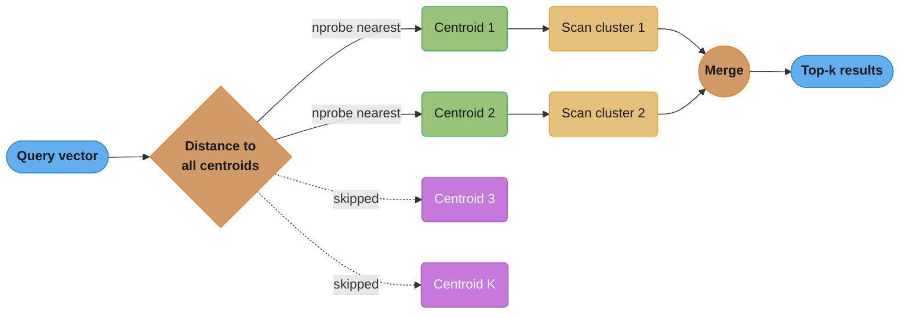
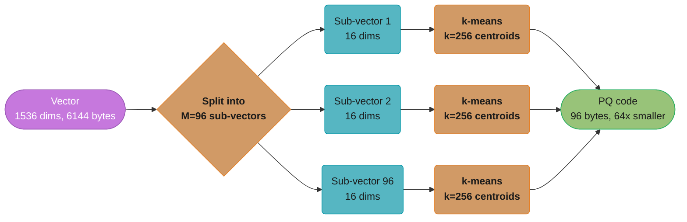
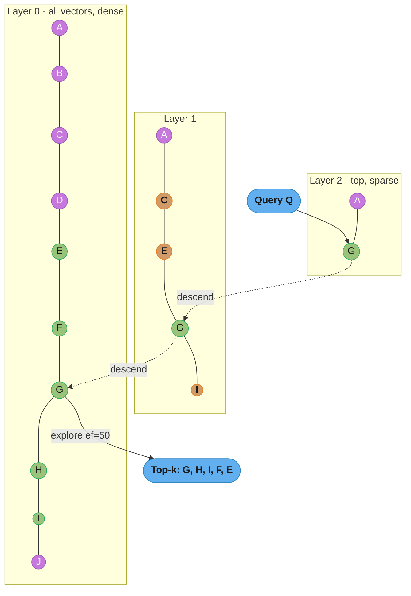
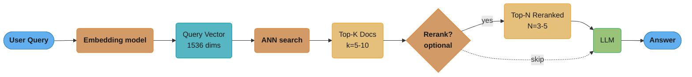

# Vector Databases

## 1. Concept Overview

Vector databases store and query high-dimensional vector embeddings — dense numerical representations of text, images, audio, and other data produced by machine learning models. They enable semantic similarity search: finding items that are conceptually similar even when they share no keywords. This is the core technology behind RAG (Retrieval-Augmented Generation), semantic search, recommendation systems, and image search.

---

## 2. Intuition

A text embedding maps meaning to position in high-dimensional space. "King minus Man plus Woman equals Queen" is the classic demonstration: vector arithmetic preserves semantic relationships. Two documents about database indexing will have embeddings close together in this space, even if they use different words.

- **Key insight**: Exact nearest-neighbor search in 1536 dimensions over 100M vectors requires comparing against every vector — O(n) operations. ANN (Approximate Nearest Neighbor) algorithms like HNSW achieve O(log n) time with ~95%+ recall via hierarchical graph structures.

---

## 3. Core Principles

### Vector Embeddings

```
Text → Embedding Model → Dense Vector

"The database uses B+tree indexing"
           ↓ (text-embedding-3-small, OpenAI)
[0.023, -0.145, 0.892, ..., -0.034]  ← 1536-dimensional vector

Dimensions:
  OpenAI text-embedding-3-small:  1536 dimensions
  OpenAI text-embedding-3-large:  3072 dimensions
  OpenAI ada-002:                 1536 dimensions (older)
  Sentence-transformers/all-MiniLM-L6-v2: 384 dimensions
  Google text-embedding-004:      768 dimensions
  Cohere embed-v3:                1024 dimensions

Memory per vector:
  1536 dimensions × 4 bytes (float32) = 6144 bytes ≈ 6KB per vector
  1M vectors × 6KB = 6GB RAM
  100M vectors × 6KB = 600GB RAM (too large for single node → distributed or quantization)
```

**In plain terms.** "Your RAM bill is decided before the database is even chosen: it is
dimensions times bytes-per-number times vector count, and no index can shrink that floor."

This framing matters because engineers habitually budget vector storage by row count. Row
count is only one of three factors — swapping a 3072-dim model for a 768-dim one cuts memory
4x without deleting a single row.

| Symbol | What it is |
|--------|------------|
| `dimensions` | Numbers in one embedding. Fixed by the model: 384 (MiniLM) to 3072 (text-embedding-3-large) |
| `4 bytes` | Size of one float32 coordinate. float16 halves it; int8 quantization quarters it |
| `N` | How many vectors you store — chunks, not documents. A 50-page PDF is often 200+ vectors |
| `dim x 4 x N` | Total raw payload. Index structures and metadata sit on top of this, never below it |

**Walk one example.** Same 1M chunks, five different embedding models:

```
  model                       dims   bytes/vector   1M vectors
  all-MiniLM-L6-v2             384       1536         1.536 GB
  text-embedding-004           768       3072         3.072 GB
  Cohere embed-v3             1024       4096         4.096 GB
  text-embedding-3-small      1536       6144         6.144 GB
  text-embedding-3-large      3072      12288        12.288 GB

  Same corpus. Same rows. 8x spread in RAM, purely from the model choice.
```

The 100M-vector line above is the same arithmetic run one step further: 6144 x 100M =
614.4 GB, which no single commodity node holds — hence the "distributed or quantization"
fork. Quantization attacks the `4 bytes` term; sharding attacks the `N` term; picking a
smaller model attacks `dimensions`. Those are the only three levers that exist.

### Similarity Metrics

```
Cosine Similarity: measures angle between vectors (ignores magnitude)
  sim(a, b) = (a · b) / (||a|| × ||b||)
  Range: [-1, 1], 1 = identical direction, 0 = orthogonal, -1 = opposite
  Use: text embeddings (OpenAI, Cohere) — magnitude is not meaningful, only direction

Dot Product: similar to cosine but magnitude matters
  sim(a, b) = a · b = Σ(aᵢ × bᵢ)
  Use: when embeddings are normalized to unit length (dot product = cosine similarity)
       OpenAI recommends dot product for normalized embeddings (fastest computation)

Euclidean Distance (L2): straight-line distance in vector space
  dist(a, b) = √(Σ(aᵢ - bᵢ)²)
  Use: image embeddings, embeddings where magnitude matters
  Smaller = more similar (opposite convention to similarity scores)

Note: for normalized vectors (||v|| = 1), cosine similarity = dot product
      OpenAI embeddings are normalized → use dot product (avoids division)
```

**Read it like this.** "Cosine similarity asks one question only: are these two arrows
pointing the same way? Divide out both lengths and all that survives is the angle."

That division is the whole point. A long document and a one-line summary about the same
topic produce vectors of very different magnitude but nearly the same direction — cosine
calls them similar, raw dot product would not.

| Symbol | What it is |
|--------|------------|
| `a · b` | Dot product: multiply matching coordinates, add them up. One number |
| `\|\|a\|\|` | Length of vector a, i.e. `sqrt(sum of its squared coordinates)` |
| `(a·b)/(\|\|a\|\| x \|\|b\|\|)` | The dot product with both lengths divided out — leaves `cos(angle)` |
| `sqrt(sum (ai - bi)^2)` | Euclidean distance: how far apart the arrow *tips* are, lengths included |

**Walk one example.** Two 3-dim vectors, both already unit length:

```
  a = [0.60, 0.80, 0.00]
  b = [0.00, 0.80, 0.60]

  dot     : 0.60x0.00 + 0.80x0.80 + 0.00x0.60 = 0.64
  ||a||   : sqrt(0.36 + 0.64 + 0.00) = sqrt(1.00) = 1.0
  ||b||   : sqrt(0.00 + 0.64 + 0.36) = sqrt(1.00) = 1.0
  cosine  : 0.64 / (1.0 x 1.0) = 0.64        -> angle = 50.21 degrees
  L2 dist : sqrt(0.36 + 0.00 + 0.36) = 0.8485

  Check: sqrt(2 - 2 x 0.64) = 0.8485. Identical.
```

That last line is why the "technically equivalent for normalized vectors" note in Pitfall 1
holds: when both lengths are 1, `L2 = sqrt(2 - 2 x cosine)`, a strictly decreasing function
of cosine. Ranking by smallest L2 and ranking by largest cosine give the *same order*. The
trap is that the identity needs `||a|| = ||b|| = 1` — feed unnormalized vectors to an L2
index and long documents drift away from everything, so the ordering silently diverges.

---

## 4. Types / Architectures / Strategies

### HNSW (Hierarchical Navigable Small World)

```
HNSW is a multi-layer graph where:
- Layer 0 (bottom): contains ALL nodes, most densely connected
- Layer 1: subset of nodes (logarithmic reduction)
- Layer 2: smaller subset
- ...
- Top layer: very few nodes (starting point for search)

Construction (index building):
For each new vector:
  1. Randomly select max layer for this vector (exponential distribution, most go to L0)
  2. Enter from top layer, find nearest neighbor (ef_construction candidate set)
  3. For each layer from top to bottom: connect to M nearest neighbors (M=16 default)

Search (query):
  1. Enter at top layer, greedily navigate to the nearest neighbor
  2. Descend to lower layer, continue navigating
  3. At L0: explore ef candidates, return the closest k

Parameters:
  ef_construction=200 (build): larger = better recall, slower build
  ef=50 (search):              larger = better recall, slower search
  M=16 (connections per layer): larger = better recall, more memory

Performance:
  Build time: O(N × M × log N) — slow for large datasets
  Query time: O(log N) — fast at query time
  Memory: O(N × M) — extra edges stored in graph
  Typical recall@10: 95-99% vs exact search
```

**What this actually says.** "M is how many friends each vector keeps permanently, ef is how
many leads the search chases before giving up. The first costs memory forever, the second
costs latency per query."

Keeping the two straight is the single most useful thing to know about HNSW tuning: raising
`M` requires an index rebuild and permanently enlarges the graph, while `ef` is a session
variable you can raise for one slow-but-accurate query and drop again.

| Symbol | What it is |
|--------|------------|
| `M` | Edges stored per node per layer, default 16. This is the `O(N x M)` memory term |
| `ef_construction` | Candidate list size while *building*, default 200. Better graph, slower build |
| `ef` | Candidate list size while *searching*, default 50. Bigger = higher recall, slower query |
| `N` | Vector count. Appears as `log N` in query time — the "highway layers" payoff |
| `O(N x M x log N)` | Build cost: every vector navigates `log N` layers wiring `M` edges at each |

**Walk one example.** 1M vectors at 1536 dims, edges stored as 8-byte node IDs:

```
  raw vector payload : 1536 x 4        = 6144 bytes/vector -> 6.144 GB
  graph edges, M=16  :   16 x 8        =  128 bytes/vector -> 0.128 GB
  total                                   6272 bytes/vector -> 6.272 GB

  M =  16  ->  6.272 GB   graph is  2.08% of the payload
  M =  32  ->  6.400 GB   graph is  4.17% of the payload
  M =  64  ->  6.656 GB   graph is  8.33% of the payload
```

The lesson interviewers want: at 1536 dims the graph is *noise* next to the vectors. Even
quadrupling `M` from 16 to 64 adds 6.1% to total memory. On 384-dim vectors the same M=16
graph is 8.33% of a 1536-byte payload — the smaller the embedding, the more the graph
matters. "HNSW uses a lot of memory" is really "HNSW keeps every raw vector resident."

**Why `ef` cannot be smaller than `k`.** `ef` is the size of the candidate frontier; the
final answer is the best `k` of it. Ask for `k=10` with `ef=5` and there are literally not
enough candidates to fill the result. The greedy descent is also a local search — with
`ef=1` it commits to the first improving neighbour and can dead-end in a pocket of the graph
that has no path to the true nearest neighbour. Enlarging `ef` to 50 keeps 50 escape routes
open at once, which is exactly how the 95-99% recall above is bought.

### IVF (Inverted File Index)

```
IVF clusters vectors into K groups (Voronoi cells) using K-means.
Each cluster has a centroid vector.

Index:
  centroid_1 → [vectors in cluster 1]
  centroid_2 → [vectors in cluster 2]
  ...

Search:
  1. Find the nprobe closest centroids to the query vector
  2. Search only those nprobe clusters (linear scan within each)
  3. Return global top-k

Parameters:
  nlist = K = number of clusters. Typical: sqrt(N) to 16*sqrt(N)
    For 1M vectors: nlist=1000-4000
  nprobe = number of clusters to search.
    nprobe=1: fastest, lowest recall
    nprobe=nlist: exact search (defeats purpose)
    nprobe=32: good balance, ~95% recall for typical data
```

**Visualizing nprobe: how many clusters actually get searched**



**Put simply.** "Sort every vector into `nlist` buckets once, then at query time open only
the `nprobe` buckets closest to the question and ignore the rest."

The tradeoff has a shape worth memorising: recall climbs steeply for the first few probes
then flattens, while work climbs linearly forever. That gap is where the useful settings
live.

| Symbol | What it is |
|--------|------------|
| `nlist` | Number of k-means clusters built at index time. Typical `sqrt(N)` to `16 x sqrt(N)` |
| `nprobe` | Clusters actually scanned per query. The only knob you turn at runtime |
| `N / nlist` | Average vectors per cluster — how much work one probe costs |
| `nlist + nprobe x (N/nlist)` | Total distance computations: pick the centroids, then scan inside |

**Walk one example.** 1M vectors, `nlist=4000`, so 1,000,000 / 4000 = 250 vectors per cluster:

```
  nprobe   centroid cmps   vectors scanned   total cmps   vs exact 1,000,000
       1        4000         1 x 250 =   250      4,250     235x fewer
       8        4000         8 x 250 = 2,000      6,000     167x fewer
      32        4000        32 x 250 = 8,000     12,000      83x fewer
     128        4000       128 x 250 =32,000     36,000      28x fewer
    4000        4000      4000 x 250 =1,000,000  1,004,000   SLOWER than exact
```

Two things fall out. First, the `nprobe=4000` row is why the parameter block says searching
every cluster "defeats the purpose" — you pay the full brute-force scan *plus* 4000 wasted
centroid comparisons. Second, look at the plateau: going from nprobe=1 to nprobe=32 costs
under 3x the work (4,250 to 12,000 comparisons) and buys the jump from the ~70% recall of a
single cluster to the ~95% balance point. Going from 32 to 128 costs another 3x for a few
recall points. The knee sits around nprobe = 1% of nlist.

**Why nlist near `sqrt(N)` is the default.** Total work is `nlist + nprobe x (N/nlist)`.
Too few clusters and each one is enormous, so every probe is a long scan; too many and the
centroid pass alone dominates before you have scanned a single vector. `sqrt(1,000,000)` =
1000 balances the two halves, and the `16 x sqrt(N)` upper end trades a bigger centroid pass
for much tighter clusters — which is the recipe the file's `nlist=1000-4000` range encodes.

With `nlist=4000` and `nprobe=32`, only 32 of 4000 clusters are ever linear-scanned — every other centroid's cluster (purple, skipped entirely) plays no part in the answer, which is why nprobe=1 gives the "fastest, lowest recall" behavior above and nprobe=32 lands at the "~95% recall" balance point.

### Product Quantization (PQ) — Compression

```
Compresses 1536-dim float32 vectors (6KB each) to ~64 bytes per vector.

Method:
1. Split the 1536-dim vector into M=96 sub-vectors of 16 dims each
2. For each sub-space: run k-means with k=256 centroids
3. For each sub-vector, store only the centroid ID (1 byte per sub-space)
4. Reconstruction: look up centroid for each sub-space

Compression: 1536 × 4 bytes → M=96 × 1 byte = 6144 bytes → 96 bytes (64x compression)
Recall loss: ~5-15% at k=256 centroids per sub-space

IVF+PQ: combine for large-scale (>100M vectors)
  - IVF partitions into clusters (coarse quantization)
  - PQ compresses within each cluster (fine quantization)
  - Query: O(nprobe × cluster_size × M) operations (fast, mostly integer ops)
```

**The idea behind it.** "Chop the vector into M slices, and replace each slice with the ID
of the nearest of 256 pre-learned prototype slices. You store the IDs, not the numbers."

The compression is not a clever encoding of the original floats — it is a deliberate
substitution of a *lookalike*. That is why PQ recall loss is irreducible: the original
coordinates are gone, and the index only ever sees the prototype it was rounded to.

| Symbol | What it is |
|--------|------------|
| `M` | Sub-vectors the embedding is split into, here 96. Each becomes exactly one stored byte |
| `dim / M` | Dimensions per sub-vector: 1536 / 96 = 16. Wider slices = harsher rounding |
| `k = 256` | Prototypes learned per sub-space. 256 is chosen so an ID fits in one byte exactly |
| `codebook` | The `M x 256` prototype table. Stored once for the whole index, not per vector |
| compression | `(dim x 4) / (M x 1)` — original bytes over code bytes |

**Walk one example.** One text-embedding-3-small vector, then the whole 100M-vector index:

```
  original : 1536 dims x 4 bytes                    = 6144 bytes
  split    : 1536 / 96                              =   16 dims per sub-vector
  encode   : 96 sub-vectors x 1 byte (a centroid ID)=   96 bytes
  ratio    : 6144 / 96                              =   64x smaller

  at 100M vectors
    float32 : 6144 x 100,000,000                    = 614.4 GB   -- needs a cluster
    PQ code :   96 x 100,000,000                    =   9.6 GB   -- fits one big node
    codebook: 96 x 256 x 16 dims x 4 bytes          =   1.57 MB  -- once, total
```

The codebook line is the punchline: 1.57 MB of prototypes, shared by all 100 million
vectors, is what buys the 604.8 GB saving. Amortised over 100M vectors the table costs
0.016 bytes each, which is why PQ's compression ratio is quoted as a flat 64x with no
per-vector footnote.

**Why `k = 256` and not 1024.** The ID has to be *stored*, and 256 prototypes is the largest
set addressable in a single byte. Jump to `k=1024` and each ID needs 10 bits, in practice
rounded up to 2 bytes — compression halves to 32x while recall improves only slightly,
because the error is dominated by squeezing 16 real dimensions into one prototype, not by
having too few prototypes. The 5-15% recall loss quoted above is the price of that
16-dims-to-1-ID collapse, and it is why production systems rescore PQ's top candidates
against the full float vectors before returning results.

**Visualizing PQ compression: splitting then quantizing a vector**



Each 16-dim sub-vector collapses to a single 1-byte centroid ID, so the 6144-byte original (purple, uncompressed) becomes a 96-byte code (green, compressed) — the 64x compression described above, at the cost of the ~5-15% recall loss from that lossy round-trip.

### pgvector — Vector Search in PostgreSQL

```sql
-- Extension setup:
CREATE EXTENSION vector;

-- Table with vector column:
CREATE TABLE documents (
    id          BIGSERIAL PRIMARY KEY,
    content     TEXT,
    embedding   vector(1536),  -- 1536-dimensional vector
    tenant_id   BIGINT,
    created_at  TIMESTAMPTZ DEFAULT now()
);

-- IVFFlat index (faster to build, good for large datasets):
CREATE INDEX idx_documents_embedding_ivf
ON documents USING ivfflat (embedding vector_cosine_ops)
WITH (lists = 100);
-- lists = number of clusters (default 100; recommend sqrt(N) for up to 1M rows)
-- After building: SET ivfflat.probes = 10 (default 1) for better recall

-- HNSW index (better recall, slower to build, more memory):
CREATE INDEX idx_documents_embedding_hnsw
ON documents USING hnsw (embedding vector_cosine_ops)
WITH (m = 16, ef_construction = 64);
-- m = max connections per layer (16 default)
-- ef_construction = candidate set size during build (64 default)

-- Query: semantic search
SELECT id, content, 1 - (embedding <=> $1) AS similarity
FROM documents
WHERE tenant_id = $2  -- Pre-filter by tenant
ORDER BY embedding <=> $1  -- <=> = cosine distance operator
LIMIT 10;

-- Operators:
-- <=>   cosine distance   (1 - cosine_similarity)
-- <->   Euclidean distance
-- <#>   negative dot product (for dot product similarity: ORDER BY embedding <#> query_vec)
```

### Vector Database Options

| Database | Architecture | Best For | Max Scale |
|----------|-------------|---------|-----------|
| pgvector | PostgreSQL extension | SQL integration, ACID, < 10M vectors | 100M+ with HNSW |
| Pinecone | Managed, proprietary | Serverless, no-ops | Billions |
| Weaviate | Open-source, modular | Multi-modal, GraphQL | Billions (distributed) |
| Qdrant | Rust-based, open-source | High performance, filtering | Billions (distributed) |
| Milvus | Distributed, open-source | Large-scale production | Trillions |
| Chroma | Embedded, simple | Prototyping, small datasets | Millions |
| Redis | RedisVL extension | Low-latency cache + vector | Millions |

---

## 5. Architecture Diagrams

**HNSW graph structure and greedy descent search:**



Fewer nodes survive at each higher layer, so the search greedily hops the top layer's long "highway" edges (reaching G in one jump) before descending into Layer 0's dense connections, where it explores ef=50 candidates and returns the top-k closest to Q.

**RAG pipeline using a vector database for retrieval:**



The optional reranking hop (Cohere Rerank, BGE-Reranker) trims the k=5-10 retrieved candidates down to a precise top-N=3-5 before the prompt is built — trading a little latency for the higher answer relevance the case study in section 14 measures.

---

## 6. How It Works — Detailed Mechanics

### Hybrid Search (Vector + Keyword)

Pure vector search has limitations: rare entity names (product IDs, proper nouns) may not be well-represented in embedding space. Hybrid search combines vector similarity with BM25 keyword scoring.

```python
# Hybrid search in Elasticsearch/OpenSearch:
{
  "query": {
    "bool": {
      "should": [
        {
          "knn": {
            "field": "embedding",
            "query_vector": [0.023, -0.145, ...],
            "k": 50,
            "num_candidates": 100
          }
        },
        {
          "match": {
            "content": "database B+tree indexing"
          }
        }
      ]
    }
  }
}
# Result: RRF (Reciprocal Rank Fusion) merges both result lists
```

```python
# Qdrant: built-in hybrid search (sparse + dense)
client.search(
    collection_name="documents",
    query_vector=NamedVector(name="dense", vector=query_embedding),
    query_sparse_vector=NamedSparseVector(
        name="sparse",
        vector=SparseVector(indices=[1, 2, 3], values=[0.1, 0.5, 0.3])
    ),
    limit=10,
)
```

### Multi-Tenancy in Vector Databases

```sql
-- pgvector: filter by tenant_id (pre-filter, most efficient)
SELECT id, content, embedding <=> $query_vector AS distance
FROM documents
WHERE tenant_id = $1  -- Filter BEFORE ANN search narrows candidates
ORDER BY embedding <=> $query_vector
LIMIT 10;
-- IMPORTANT: index must be on embedding column; tenant_id filter applied via PostgreSQL WHERE
-- For large tables: composite index or partial index per tenant

-- Pinecone: namespace isolation
index.upsert(vectors=[...], namespace=f"tenant_{tenant_id}")
results = index.query(vector=query_vector, top_k=10, namespace=f"tenant_{tenant_id}")

-- Weaviate: multi-tenancy mode (each tenant gets isolated shard)
client.collections.create("Document", multi_tenancy_config=Configure.multi_tenancy(enabled=True))
client.collections.get("Document").with_tenant("tenant-42").query.near_vector(...)

-- Qdrant: per-tenant collections or filtered search
client.search(
    collection_name="documents",
    query_vector=query_embedding,
    query_filter=Filter(must=[FieldCondition(key="tenant_id", match=MatchValue(value=tenant_id))]),
    limit=10,
)
```

---

## 7. Real-World Examples

- **Notion AI**: Semantic search across user notes using vector embeddings. pgvector for smaller workloads, dedicated vector DB for scale.
- **GitHub Copilot**: Retrieves relevant code snippets from the repository using code embeddings (CodeBERT). Repository-scale vector search to provide context.
- **Spotify**: Audio embeddings for music recommendation — songs with similar sound are near in embedding space.
- **Pinterest**: Image embeddings for visual similarity search (find similar products from photos).
- **Airbnb**: Listing embeddings combining text descriptions and image features for semantic property recommendations.

---

## 8. Tradeoffs

| Approach | Recall | Query Speed | Memory | Build Speed | Best For |
|----------|--------|-------------|--------|-------------|---------|
| Exact (brute force) | 100% | O(N) slow | O(N) | Instant | < 100K vectors |
| HNSW | 95-99% | O(log N) fast | O(N × M) high | Slow | 1M-10B vectors, high recall |
| IVF | 90-97% | O(K + nprobe×M) | O(N) medium | Fast | 1M-1B vectors, large scale |
| IVF+PQ | 80-95% | Very fast | O(N × M/64) low | Medium | 100M+ vectors, memory-limited |
| Exact + GPU | 100% | Very fast (GPU) | GPU RAM | Instant | < 10M, GPU available |

---

## 9. When to Use / When NOT to Use

**Use pgvector when**:
- Vectors < 10M (HNSW) or < 100M (IVFFlat with tuning)
- Need to join with relational data (users, products, permissions)
- ACID compliance required (vector + metadata atomicity)
- Team already uses PostgreSQL
- Cost-sensitive (no additional infrastructure)

**Use dedicated vector database (Pinecone, Qdrant, Weaviate) when**:
- Vectors > 50M
- Team wants managed service (no ops overhead)
- Need advanced features (multi-modal, automatic embedding, graph+vector)
- Performance is critical at scale

**Avoid vector databases when**:
- You just need keyword search (BM25 is better)
- All queries use exact filters with no semantic component
- Dataset is small (< 10K vectors) — brute force is fast enough

---

## 10. Common Pitfalls

**Pitfall 1: Using wrong similarity metric for the model**
OpenAI embeddings are normalized to unit length. Using Euclidean distance (L2) instead of cosine similarity: technically equivalent for normalized vectors, but if the implementation doesn't normalize, L2 gives wrong results. Always check the embedding model documentation. OpenAI recommends cosine similarity; `<=>` in pgvector = cosine distance.

**Pitfall 2: Not setting ivfflat.probes for recall**
```sql
-- Default: ivfflat.probes = 1 (searches only 1 cluster)
-- For 100 clusters (lists=100): probes=1 means 1% of vectors searched
-- Recall at probes=1: ~70% (poor)
-- Fix:
SET ivfflat.probes = 10;  -- Search 10% of clusters, recall ~95%
-- Set per-session or globally: ALTER SYSTEM SET ivfflat.probes = 10;
```

**Pitfall 3: HNSW index build OOM**
HNSW index build requires all vectors in memory simultaneously (at M connections per node). For 10M vectors at 1536 dimensions: 10M × (6KB data + 16 connections × 8 bytes) ≈ 61GB RAM just for index build. Fix: use IVFFlat (can build incrementally) or increase server RAM. In pgvector, HNSW build memory can be reduced with `maintenance_work_mem`.

**Pitfall 4: No chunking strategy for long documents**
Embedding models have token limits (8191 tokens for OpenAI ada-002). Long documents must be chunked. Naive fixed-size chunking splits mid-sentence → poor embeddings. Fix: semantic chunking (split at paragraph or sentence boundaries), sliding window chunking (chunks with 20% overlap to preserve context across boundaries).

**Pitfall 5: Embedding model mismatch**
Query embedded with model A, documents embedded with model B → completely different embedding space → no meaningful similarity. Always use the same embedding model for all data in the same collection. When upgrading embedding models: re-embed ALL documents before switching query embedding.

---

## 11. Technologies & Tools

| Tool | Purpose |
|------|---------|
| pgvector | PostgreSQL vector extension (HNSW + IVFFlat) |
| Pinecone | Managed vector database (serverless, pod-based) |
| Weaviate | Open-source vector DB with modules (OpenAI, Cohere auto-embedding) |
| Qdrant | Rust-based, high-performance, rich filtering |
| Milvus | Distributed vector database for billion-scale |
| Chroma | Embedded vector DB for prototyping and development |
| FAISS (Facebook AI) | Research library for ANN algorithms (CPU + GPU) |
| Annoy (Spotify) | Tree-based ANN, read-only index |
| LangChain VectorStores | Abstraction layer over multiple vector DBs |
| LlamaIndex VectorStoreIndex | Index abstraction for RAG pipelines |

---

## 12. Interview Questions with Answers

**Q: How does HNSW achieve sub-linear query time?**
HNSW builds a multi-layer graph where higher layers have fewer nodes and longer connections ("highways"), lower layers have more nodes and shorter connections. Search starts at the top layer (few nodes) and greedily navigates toward the query vector. At each layer, the algorithm moves to the current best neighbor, then descends to the next layer. This hierarchical approach: at the top layer, large steps eliminate most of the search space. At lower layers, fine-grained navigation within the relevant region. The total path length through layers is O(log N) — logarithmic in the number of vectors. The ef parameter controls how many candidates are tracked during descent — larger ef = better recall at cost of more computation.

**Q: What is the recall-vs-speed tradeoff in ANN search?**
ANN (Approximate Nearest Neighbor) algorithms sacrifice some recall (percentage of true nearest neighbors returned) for faster search. For HNSW: `ef` parameter controls this tradeoff at query time — ef=10 (fast, ~90% recall) vs ef=200 (slow, ~99% recall). For IVF: `nprobe` controls how many clusters are searched — nprobe=1 (~70% recall) vs nprobe=100 (near-exact, very slow). In practice for RAG: 95% recall is sufficient — missing 5% of relevant chunks rarely affects answer quality significantly. For medical or legal use cases requiring near-perfect recall: increase ef/nprobe or use exact search (small enough datasets). Benchmark your specific data and embedding model — recall degrades differently depending on data distribution.

**Q: How do you handle multi-tenancy in a vector database?**
Three approaches: (1) Namespace/collection isolation: each tenant gets a separate namespace or collection. Best for: strong isolation, different schemas per tenant, enterprise customers. Cost: cannot do cross-tenant queries, many collections have overhead. (2) Metadata filtering: single collection with `tenant_id` metadata field. Queries add `WHERE tenant_id = X` pre-filter. Best for: many small tenants, shared infrastructure. Risk: filter effectiveness depends on index structure — some vector DBs apply filter after ANN (post-filter, poor recall for large tenants) vs before (pre-filter, good recall). Use Qdrant or pgvector which support efficient pre-filtering. (3) Hybrid: shared collection for small tenants, dedicated collections for large enterprise tenants. Each approach has operational trade-offs.

**Q: When would you use pgvector vs a dedicated vector database?**
Use pgvector when: (1) Vectors are joinable to relational data (products, users, documents — query: "find similar products to X that are also in stock and available in user's region" — one query in pgvector, multiple round trips in a dedicated vector DB). (2) Transactional writes: embedding a document and its metadata atomically. (3) Compliance requirements favor single database system. (4) Scale is under 10M vectors for HNSW (scalable to 100M+ with IVFFlat and tuning). (5) Team is PostgreSQL-only and doesn't want to operate another database. Use dedicated vector DB when: (1) > 100M vectors on a single node. (2) Need managed service, auto-scaling, zero-ops. (3) Need features like multi-modal search, automatic embedding, advanced similarity functions. (4) Performance at extreme scale is critical.

**Q: What is hybrid search and when is it necessary?**
Hybrid search combines dense vector similarity (semantic) with sparse keyword similarity (BM25). Pure vector search fails for: exact keyword matches (product IDs, proper nouns, rare technical terms — the embedding model may not represent "CUDA-12.3" vs "CUDA-12.4" as distinct), domain-specific jargon, and queries where exact term match matters more than semantic similarity. Example: query "CUDA 12.3 installation error" — vector search finds semantically related documents, but BM25 helps ensure "CUDA 12.3" is specifically matched. Implementation: (1) Run both searches, merge results using RRF (Reciprocal Rank Fusion) which weights results by their rank in each list. (2) Use a single model that produces both dense and sparse vectors (SPLADE, SparseEmbed). Weaviate and Qdrant support hybrid search natively; pgvector requires combining with tsvector for hybrid.

**Q: How do embedding models affect retrieval quality in RAG systems?**
Embedding model choice affects recall (finding relevant documents) and precision (avoiding irrelevant ones). Key factors: (1) Dimensionality: higher dims (3072 vs 384) = more information but more memory and slower search. (2) Domain match: a model fine-tuned on code embeddings (e.g., CodeBERT) dramatically outperforms general models for code retrieval. (3) Context window: sentence-transformers process up to 512 tokens; OpenAI ada-002 up to 8191 tokens — longer context = can embed entire pages instead of chunks. (4) Task: asymmetric search (short queries vs long documents) needs models designed for asymmetric pairs (E5, BGE). Evaluation: use MTEB (Massive Text Embedding Benchmark) as reference, but always evaluate on your specific domain with your actual queries.

**Q: What is product quantization and what is its recall-speed tradeoff?**
Product Quantization (PQ) compresses high-dimensional vectors into compact codes (e.g., 1536 dims × 4 bytes = 6144 bytes → 96 bytes with 64x compression) by: (1) Splitting the vector into M sub-spaces. (2) For each sub-space, learning K centroids via k-means. (3) Replacing each sub-vector with the index of the nearest centroid (1 byte per sub-space at K=256). Distance computation between query and PQ-compressed vectors: look up precomputed distance tables (fast, integer operations). Recall-speed tradeoff: more sub-spaces (M) = less compression, better recall. More centroids (K) = larger codebook, better accuracy. Typical configuration: M=96, K=256 achieves 64x compression with ~90-95% recall vs exact search. IVF+PQ (used by FAISS, Milvus): IVF narrows to relevant clusters, PQ compresses for fast distance computation within clusters.

**Q: How do you measure embedding quality and which metrics matter for RAG?**
Key metrics for RAG retrieval: (1) Recall@K: percentage of queries where the relevant document appears in the top K results. For RAG, recall@5 or recall@10 matters most. (2) MRR (Mean Reciprocal Rank): 1/rank of the first relevant result, averaged across queries. (3) NDCG@K (Normalized Discounted Cumulative Gain): accounts for graded relevance and position. Evaluation approach: create a test set of (query, relevant_document) pairs from your domain. Run retrieval, measure recall@5, MRR@10. Compare embedding models on this test set. Also measure: embedding latency (query embedding time), index build time, memory per vector, and query throughput. BEIR and MTEB are public benchmarks, but domain-specific evaluation on your own data is essential for production decisions.

**Q: What is the "lost in the middle" problem for RAG and how does vector search help?**
When many relevant documents are injected into an LLM's context window, the LLM performs poorly on information in the middle of the context — it focuses on the beginning and end (attention sparsity for mid-context). Vector search helps by providing precisely the most relevant chunks (top-K) rather than entire documents. Best practices: (1) Use reranking after retrieval to ensure the most relevant chunk is at the beginning of the context. (2) Limit context to 3-5 chunks (not 20). (3) Use hybrid retrieval + reranking (e.g., Cohere Rerank, BGE-Reranker) to improve chunk precision. (4) For multi-document queries, structure prompts so critical information is at the beginning.

**Q: How does the IVFFlat index build and what happens when vectors are added after building?**
IVFFlat index build: (1) Run K-means on a sample of training vectors to learn `lists` centroids. K-means requires training data — pgvector requires 3×lists vectors minimum for training. (2) Each vector is assigned to its nearest centroid and stored in that centroid's inverted list. When new vectors are added after index build: they are assigned to existing centroids (centroids do NOT move — the centroids are frozen post-build). Over time, if the data distribution shifts significantly, the fixed centroids become suboptimal → recall degrades. Fix: periodically rebuild the index (`REINDEX INDEX CONCURRENTLY`) to recompute centroids on the current data distribution.

**Q: What is the HNSW ef_construction parameter and how does it differ from ef at query time?**
`ef_construction` (build time): the size of the dynamic candidate list when building the HNSW graph. When inserting a new vector: start a greedy search, maintaining `ef_construction` candidates. The `M` best candidates become the new vector's connections. Larger `ef_construction` = more candidates considered during build = better connections = better recall at query time. Trade-off: slow build time (O(N × ef_construction × log N)), more memory during build. `ef` (query time): the size of the dynamic candidate list during search traversal. Larger `ef` = more candidates evaluated = better recall = slower query. Default pgvector: `ef_construction=64, hnsw.ef_search=40`. For high-recall production: `ef_construction=200, hnsw.ef_search=100`.

**Q: How does cosine similarity differ from dot product similarity for normalized vectors?**
For unit-normalized vectors (||v|| = 1, where the vector has been divided by its magnitude): cosine similarity = dot product. `cos(a,b) = (a·b)/(||a||×||b||)`. If ||a|| = ||b|| = 1, this simplifies to `cos(a,b) = a·b`. OpenAI embeddings are normalized to unit length. Therefore: use dot product (`<#>` in pgvector) which avoids the division and is computationally cheaper. For non-normalized embeddings (image models, some sentence transformers): use cosine similarity (`<=>` in pgvector) which normalizes during comparison. Practical rule: check the embedding model documentation. If it says "normalized" or "unit vectors," use dot product for 10-20% faster distance computation.

**Q: What happens if queries are embedded with a different model than the stored documents?**
Similarity scores become meaningless, because each embedding model defines its own vector space and coordinates from two different models are not comparable. A query embedded with model A lands at coordinates that have no geometric relationship to documents embedded with model B — nearest-neighbor search still returns results, but the "closest" vectors are effectively arbitrary, which makes this failure mode dangerously silent. It commonly appears during embedding model upgrades, when new queries switch to the new model while the index still holds vectors from the old one. Re-embed every stored document with the new model before switching the query side, and treat the embedding model name as part of the collection's schema so a mismatch is impossible to introduce accidentally.

**Q: Why does pgvector's IVFFlat index return poor recall out of the box, and what is the fix?**
pgvector's `ivfflat.probes` defaults to 1, meaning each query searches only a single cluster out of all the lists the index was built with. With lists=100, probes=1 scans just 1% of the vectors, yielding roughly 70% recall — true nearest neighbors sitting in an adjacent cluster are simply never examined. Engineers often benchmark with the default, conclude vector search "doesn't work," and never realize a one-line session setting was the problem. Set `ivfflat.probes = 10` (or roughly sqrt(lists) as a starting point) via `SET` per session or `ALTER SYSTEM` globally, which lifts recall to around 95%, and tune upward from there against an offline recall benchmark on your own data.

**Q: How should long documents be chunked before embedding, and what goes wrong with naive chunking?**
Documents longer than the embedding model's token limit must be split into chunks, and naive fixed-size chunking that cuts mid-sentence produces embeddings of broken fragments that retrieve poorly. Models cap input length — OpenAI ada-002 accepts 8,191 tokens — so a long contract or manual cannot be embedded whole; but slicing at arbitrary byte offsets severs sentences and separates statements from their context, so the resulting vectors represent incoherent text. Better strategies: semantic chunking that splits at paragraph or sentence boundaries so each chunk is a self-contained thought, and sliding-window chunking with roughly 20% overlap so information near a boundary appears intact in at least one chunk. Match chunk size to both the embedding model's context window and the granularity of answers users need, since retrieval returns whole chunks.

**Q: Why can building an HNSW index exhaust memory, and what are the options when it does?**
HNSW construction holds every vector plus its graph edges in memory simultaneously, so build-time memory far exceeds what the raw vectors alone suggest. For 10M vectors at 1536 dimensions, the vectors are about 6KB each and the M=16 connections add roughly 128 bytes per node — around 61GB of RAM for the build, enough to OOM a modestly sized database server. The failure is specific to index construction: query-time memory is not the problem, which surprises teams whose instance comfortably serves the data until they run CREATE INDEX. Options: switch to IVFFlat, which builds incrementally without holding the whole graph; raise `maintenance_work_mem` in pgvector and provision RAM for the build; or build on a large temporary instance and restore the index to the serving instance.

---

## 13. Best Practices

1. Use the same embedding model for all vectors in a collection — mixing models destroys similarity.
2. Set `ivfflat.probes = sqrt(lists)` as a starting point for balanced recall/speed.
3. Use HNSW for production with < 10M vectors and high recall requirements.
4. Use IVFFlat for initial prototyping and larger datasets (faster build).
5. Pre-filter by metadata (tenant_id, category, date) BEFORE ANN search for multi-tenant systems.
6. Normalize embeddings before storing if using dot product similarity (pgvector: embedding / ||embedding||).
7. Monitor recall with offline evaluation before and after index parameter changes.
8. For RAG: use hybrid search (dense + sparse) for production — pure vector search misses exact keyword matches.
9. Implement reranking after top-K retrieval for precision-critical applications.
10. Choose chunk size to match the embedding model's context window and typical answer granularity.

---

## 14. Case Study

**Scenario**: A legal firm needs semantic search across 50M legal documents (briefs, contracts, case law). Requirement: find semantically similar precedents for a new case, even when different terminology is used. Query: "contract breach due to force majeure" should find cases about "acts of God" and "impossibility of performance."

**Architecture: pgvector + hybrid search**:

```sql
-- Schema:
CREATE TABLE legal_documents (
    id          BIGSERIAL PRIMARY KEY,
    doc_id      TEXT UNIQUE NOT NULL,
    content     TEXT,
    embedding   vector(1536),
    full_text_search tsvector GENERATED ALWAYS AS (to_tsvector('english', content)) STORED,
    jurisdiction TEXT,
    case_date   DATE,
    doc_type    TEXT
);

-- HNSW index (50M vectors — requires tuning):
CREATE INDEX idx_legal_hnsw ON legal_documents
USING hnsw (embedding vector_cosine_ops)
WITH (m = 16, ef_construction = 128);

-- Full-text search index:
CREATE INDEX idx_legal_fts ON legal_documents USING GIN (full_text_search);

-- Hybrid search query:
WITH vector_search AS (
    SELECT id, 1 - (embedding <=> $1::vector) AS vector_score
    FROM legal_documents
    WHERE jurisdiction = $2 AND doc_type = ANY($3)
    ORDER BY embedding <=> $1::vector
    LIMIT 50  -- Get top-50 vector candidates
),
text_search AS (
    SELECT id, ts_rank(full_text_search, plainto_tsquery('english', $4)) AS text_score
    FROM legal_documents
    WHERE full_text_search @@ plainto_tsquery('english', $4)
      AND jurisdiction = $2 AND doc_type = ANY($3)
    LIMIT 50  -- Get top-50 text candidates
),
rrf AS (
    SELECT id,
           COALESCE(1.0/(60 + ROW_NUMBER() OVER (ORDER BY v.vector_score DESC)), 0) +
           COALESCE(1.0/(60 + ROW_NUMBER() OVER (ORDER BY t.text_score DESC)), 0) AS rrf_score
    FROM vector_search v FULL OUTER JOIN text_search t USING (id)
)
SELECT d.id, d.doc_id, d.content, r.rrf_score
FROM rrf r JOIN legal_documents d ON d.id = r.id
ORDER BY r.rrf_score DESC
LIMIT 10;
```

**Reranking pass** (Cohere Rerank API):
- Send top-20 documents to reranker
- Reranker uses cross-attention (query-document pair scoring) for precision
- Return top-5 most relevant

**Result**: Retrieved relevant precedents using "acts of God" language for a "force majeure" query (vector similarity). Combined with keyword matching for specific case numbers and legal citations (BM25). Precision improved by 40% over keyword-only search. Average query time: 120ms (vector search 80ms + reranking 40ms).
