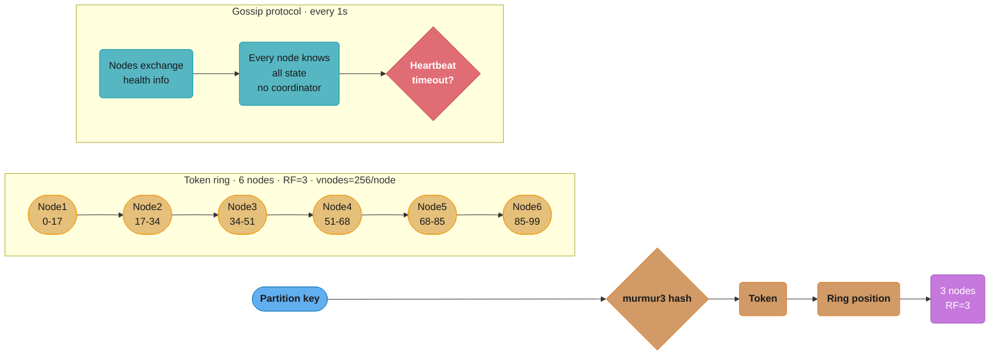
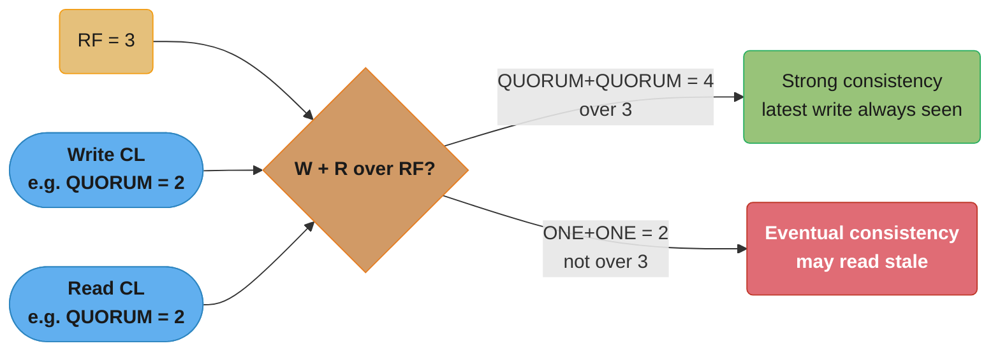
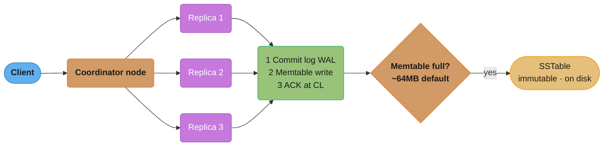
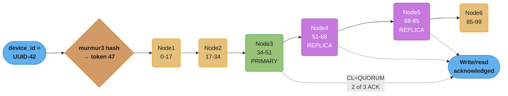
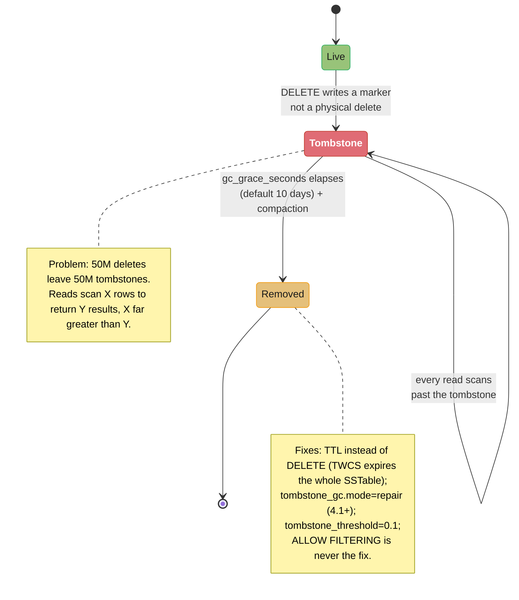
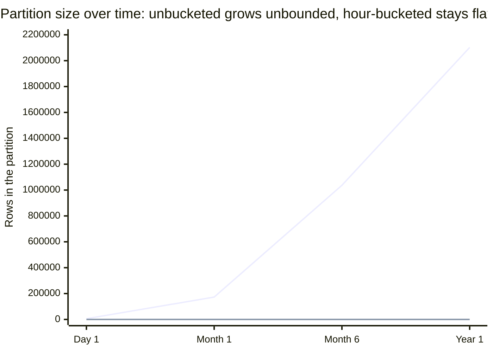

# Wide-Column Databases

## 1. Concept Overview

Wide-column databases (also called column-family stores) store data in rows with dynamic columns, where different rows can have different columns. Apache Cassandra is the dominant open-source wide-column database, offering leaderless distributed architecture, tunable consistency, and linear scalability. Unlike relational tables, Cassandra's data model is designed around query patterns, not entity relationships.

---

## 2. Intuition

Cassandra is like a distributed sorted map: each row has a partition key (determines which node), a clustering key (sort order within the partition), and arbitrary columns. Design rule: know your queries first, then design the table to answer them. Cassandra cannot do what you didn't design for.

- **Key insight**: In Cassandra, queries drive schema design — the opposite of relational modeling. One access pattern = one table. Denormalization is expected and correct.

---

## 3. Core Principles

### Cassandra Architecture (Ring / Consistent Hashing)


Vnodes (default 256 per node) scatter each physical node's ownership across many small token ranges so a partition key's murmur3 hash always lands on some node's range, which owns the key plus its RF-1 replicas; gossip lets every node learn the whole cluster's health every second with no coordinator to elect or fail over.

### Data Model

```
Keyspace (= database): defines RF (replication factor), replication strategy
  Table: defines partition key, clustering key, regular columns
    Partition: all rows with the same partition key value
      Rows: rows within a partition, sorted by clustering key

CREATE TABLE sensor_readings (
    device_id   UUID,        -- Partition key: distributes data across nodes
    ts          TIMESTAMP,   -- Clustering key: sort order WITHIN partition
    temperature DOUBLE,
    humidity    DOUBLE,
    PRIMARY KEY (device_id, ts)  -- (partition key, clustering key)
) WITH CLUSTERING ORDER BY (ts DESC);

-- Query pattern this serves:
SELECT * FROM sensor_readings
WHERE device_id = ? AND ts >= ? AND ts <= ?;
-- CANNOT do: WHERE temperature > 30 (not partition/clustering key)
-- CANNOT do: WHERE ts = ? (without device_id first)
```

### Consistency Levels

```
Replication Factor = 3

Consistency Level (CL):
  ONE:    Respond after 1 replica acknowledges. Fastest, may read stale data.
  TWO:    2 replicas. Faster than QUORUM, less consistent.
  QUORUM: ⌊RF/2⌋ + 1 = 2 replicas must respond. Balance of speed and consistency.
  ALL:    All 3 replicas. Strongest, fails if any replica is down.
  LOCAL_QUORUM: QUORUM only within local datacenter. For multi-DC deployments.

Read + Write QUORUM = "strong consistency" (for this RF):
  Write QUORUM ensures 2/3 replicas have latest value
  Read QUORUM reads 2/3 replicas → at least one has latest value

Formula: W + R > RF → strong consistency
  QUORUM + QUORUM = 2+2=4 > 3 → strong ✓
  ONE + ONE = 1+1=2 ≤ 3 → eventual ✗
```


The formula collapses to a simple pass/fail check: with RF=3, QUORUM+QUORUM clears the bar and guarantees strong consistency, while ONE+ONE does not, leaving reads eventually consistent.

**In plain terms.** `W + R > RF` says: "if the set of replicas you wrote to and the set you read from
are big enough that they cannot possibly be disjoint, the read set is guaranteed to contain at least
one replica holding the newest write." Nothing about the formula is about speed or durability — it
is purely a pigeonhole argument about *set overlap*, which is why the same inequality shows up in
Dynamo, Riak, and every other quorum system.

| Symbol | What it is |
|--------|------------|
| `RF` | Replication factor — how many nodes hold a copy of each partition |
| `W` | Write consistency level: replicas that must ACK before the write returns |
| `R` | Read consistency level: replicas that must respond before the read returns |
| `W + R - RF` | The guaranteed overlap. Must be `>= 1` for a read to see the latest write |
| `QUORUM` | Shorthand for `floor(RF/2) + 1` — the smallest `W` that always overlaps itself |

**Walk one example.** RF=3, checking each combination for guaranteed overlap:

```
                 W    R    W+R    RF    overlap = W+R-RF    strong?
  ONE + ONE      1    1     2      3          -1              no   (may miss the write)
  ONE + ALL      1    3     4      3          +1              yes  (slow reads)
  ALL + ONE      3    1     4      3          +1              yes  (write unavailable if
                                                                    any replica is down)
  QUORUM x 2     2    2     4      3          +1              yes  (balanced -- the default)

  why QUORUM self-overlaps at any RF:
    RF = 3  ->  floor(3/2)+1 = 2   ->  2 + 2 - 3 = 1
    RF = 5  ->  floor(5/2)+1 = 3   ->  3 + 3 - 5 = 1
    RF = 7  ->  floor(7/2)+1 = 4   ->  4 + 4 - 7 = 1
```

The overlap is always exactly `1` for QUORUM — the tightest possible margin that still satisfies the
inequality, which is precisely why it is the cheapest strongly-consistent setting. Note the third
row: `ALL + ONE` is equally "strong" on paper, but a single node outage stops all writes, which is
why nobody runs it. The formula tells you what is *correct*; the availability column tells you what
is *operable*.

---

## 4. Types / Architectures / Strategies

### Write Path


Writes fan out to all RF replicas in parallel; each appends to its commit log (durable) and memtable (sorted, in-memory) before ACKing, and a background flush turns a full memtable into an immutable SSTable — sequential and fast, at the cost of later write amplification from compaction. Every update writes a new row version; the highest timestamp wins.

### Read Path

```mermaid
flowchart LR
    classDef io      fill:#61afef,stroke:#2e86c1,color:#1a1a1a,font-weight:bold
    classDef frozen  fill:#c678dd,stroke:#9b59b6,color:#fff
    classDef train   fill:#98c379,stroke:#27ae60,color:#1a1a1a
    classDef mathOp  fill:#d19a66,stroke:#e67e22,color:#1a1a1a,font-weight:bold
    classDef lossN   fill:#e06c75,stroke:#c0392b,color:#fff,font-weight:bold
    classDef req     fill:#56b6c2,stroke:#0097a7,color:#1a1a1a
    classDef base    fill:#e5c07b,stroke:#f39c12,color:#1a1a1a

    client(["Client"]) --> coord("Coordinator")
    coord -->|"read, CL replicas"| replica("Replica")
    replica --> bloom{"Bloom filter:<br/>key in SSTable?"}
    bloom -->|"no · 99.9% accurate"| skip("Skip SSTable<br/>zero I/O")
    bloom -->|"maybe"| rowcache{"Row cache:<br/>partition cached?"}
    rowcache -->|"yes"| immediate(["Return immediately"])
    rowcache -->|"no"| pkcache{"Partition key<br/>cache hit?"}
    pkcache -->|"yes"| offset("Direct SSTable offset")
    pkcache -->|"no"| index("SSTable index:<br/>binary search")
    offset --> read("Read rows ·<br/>filter by clustering key")
    index --> read
    read --> merge("Merge SSTables:<br/>latest wins by timestamp")
    skip --> merge
    merge --> back("Coordinator merges<br/>replicas · checks CL")
    immediate --> back
    back --> repair{"Replicas<br/>disagree?"}
    repair -->|"yes"| rr("Read repair:<br/>patch stale replica")
    repair -->|"no"| out(["Return to client"])
    rr -.-> out

    class client,out,immediate io
    class coord,back,bloom,rowcache,pkcache,repair mathOp
    class replica frozen
    class skip,offset,index,read,merge base
    class rr lossN
```


A read checks each SSTable's Bloom filter first (99.9% accurate, a clean skip on NO costs zero I/O), falls through row-cache and partition-key-cache fast paths before walking the SSTable index, then merges versions across SSTables by timestamp; the coordinator only triggers read repair when replicas disagree.

**What this actually says.** The Bloom filter's false-positive rate, `p = (1 - e^(-kn/m))^k`, reads
as: "the chance that all `k` of a missing key's bit positions happen to have been set by *other*
keys." A Bloom filter never says a false NO — only a false YES — so the "99.9% accurate" figure is
one-sided: every NO is a guaranteed skip with zero disk I/O, and only the rare false YES costs you a
wasted seek.

| Symbol | What it is |
|--------|------------|
| `n` | Number of keys inserted into this SSTable's filter |
| `m` | Bits in the filter's bit array |
| `m/n` | Bits per element — the only knob that really matters. Memory cost per key |
| `k` | Number of hash functions. Optimal value is `k = (m/n) x ln 2` |
| `e^(-kn/m)` | Probability one specific bit is still 0 after all insertions |
| `p` | False-positive rate. `bloom_filter_fp_chance` in Cassandra's table schema |

**Walk one example.** Working backwards from the stated 99.9% (that is, `p = 0.001`):

```
  bits per element   m/n = -ln(p) / (ln 2)^2
                         = -ln(0.001) / 0.4805
                         = 14.38 bits per key

  optimal hashes     k   = (m/n) x ln 2 = 14.38 x 0.6931 = 9.97  ->  round to 10

  verify             p   = (1 - e^(-10 / 14.38))^10
                         = (1 - 0.49887)^10
                         = 0.50113^10
                         = 0.000999         ->  99.90 percent of NOs are true NOs

  memory for 1,000,000 keys in this SSTable:
                     1e6 x 14.38 bits = 14,380,000 bits = 1.71 MiB of heap

  relaxing to p = 0.01 (the STCS default fp_chance):
                     m/n = 9.59 bits, k = 7      ->  1.14 MiB     (33 percent less RAM)
```

**What breaks without the filter.** A read must consult every SSTable that could hold the partition.
With 8 SSTables and no filter, a lookup for a key that does not exist costs 8 disk seeks. At
`p = 0.01`, the expected wasted seeks fall to `8 x 0.01 = 0.08` — under one-tenth of a seek per read.
That is the entire reason LSM reads are survivable: without Bloom filters, read amplification would
scale with the SSTable count on every single miss.

### Compaction Strategies

```
STCS (Size-Tiered Compaction Strategy) — default:
  Merges SSTables of similar size
  Good: write performance (low write amplification)
  Bad:  space amplification (up to 2x), uneven read performance
  Use:  write-heavy workloads, heavy inserts with few reads

LCS (Leveled Compaction Strategy):
  Organizes into size levels, like LSM-tree
  Good: space efficiency (1.1x), consistent read performance
  Bad:  high write amplification (10-30x), more I/O
  Use:  read-heavy workloads, mixed OLTP

TWCS (Time Window Compaction Strategy):
  Groups SSTables by time window, compacts within window
  Good: excellent for time-series data with TTL (entire SSTable expires together)
  Bad:  not suitable for non-time-series data
  Use:  time-series, IoT, event logs with TTL
```

**Read it like this.** "Write amplification 10-30x" means: for every 1 byte your application writes,
the disk physically writes 10 to 30 bytes, because compaction keeps rewriting the same row as it
migrates down the levels. "Space amplification 2x" means the opposite resource: the disk holds twice
the bytes of live data because superseded copies have not been merged away yet. Choosing a
compaction strategy is choosing *which* of the two amplifications you are willing to pay.

| Symbol | What it is |
|--------|------------|
| Write amplification | Bytes written to disk per byte of logical data. STCS ~2x, LCS 10-30x |
| Space amplification | Disk occupied per byte of live data. STCS up to 2x, LCS ~1.1x |
| Read amplification | SSTables consulted per lookup. LCS bounds it at roughly one per level |
| Level multiplier | Fan-out between LSM levels, 10 by default. `Lk` holds `10^k x L1` |

**Walk one example.** A 100GB/day ingest cluster holding 1TB of live data, priced both ways:

```
  disk WRITE cost (per day)
    STCS  ~2x    100 GB x 2  =    200 GB/day  =  2.4 MB/s sustained background I/O
    LCS   10x    100 GB x 10 =  1,000 GB/day  = 11.9 MB/s
    LCS   30x    100 GB x 30 =  3,000 GB/day  = 35.6 MB/s   <- 15x the STCS burn

  disk CAPACITY cost (for 1 TB live)
    STCS  2.0x   1024 GB x 2.0  = 2048 GB provisioned
    LCS   1.1x   1024 GB x 1.1  = 1126 GB provisioned
    delta                         922 GB of disk STCS wastes on stale copies

  LCS level sizing, multiplier 10, L1 = 300 MB:
    L1     0.3 GB
    L2     3.0 GB      (10^1 x L1)
    L3    30.0 GB      (10^2 x L1)
    L4   300.0 GB      (10^3 x L1)
    L5  3000.0 GB      (10^4 x L1)  -> 1 TB of data needs 5 levels
    a row rewritten once per level it descends  ->  ~5 rewrites, plus in-level
    merges, is where the 10-30x figure comes from
```

The level count is `log10(dataset / L1)` — logarithmic, so a 10x bigger dataset adds only one level.
That is why LCS write amplification plateaus instead of running away, and why LCS is safe on
read-heavy OLTP but ruinous on a write-saturated ingest pipeline where those 35.6 MB/s of background
compaction I/O compete directly with the foreground writes.

### Lightweight Transactions (LWT) — CAS

```cql
-- Conditional INSERT (if not exists):
INSERT INTO users (id, email) VALUES (uuid(), 'alice@example.com')
IF NOT EXISTS;
-- Uses Paxos protocol: 4-round-trip coordination
-- Achieves linearizability (unlike normal Cassandra eventual consistency)
-- Cost: ~4x latency vs regular write, lower throughput

-- Conditional UPDATE:
UPDATE accounts SET balance = 600
WHERE user_id = 42
IF balance = 500;
-- Returns [applied=true] or [applied=false, balance=current_value]

-- Use LWT only when absolutely necessary (login, unique constraint emulation)
-- Performance: ~5-10x slower than regular writes
```

---

## 5. Architecture Diagrams


Hashing `device_id=UUID-42` with murmur3 lands on token 47, owned by Node3 (primary) with Node4 and Node5 as its RF-1 replicas; CL=QUORUM needs acks from 2 of these 3 nodes for either a write or a read.

```
PARTITION STRUCTURE:

Partition Key: device_id=UUID-42
┌────────────────────────────────────────────────────────┐
│ Partition: UUID-42                                     │
│ ┌──────────────┬───────────┬──────────┬─────────────┐ │
│ │ 2024-07-15   │ 100.0°F   │ 65%      │ ...         │ │
│ │ (ts=latest)  │           │          │             │ │
│ ├──────────────┼───────────┼──────────┼─────────────┤ │
│ │ 2024-07-14   │ 98.6°F    │ 60%      │ ...         │ │
│ ├──────────────┼───────────┼──────────┼─────────────┤ │
│ │ ...          │ ...       │ ...      │ ...         │ │
│ └──────────────┴───────────┴──────────┴─────────────┘ │
│ Rows sorted by ts DESC (CLUSTERING ORDER BY ts DESC)  │
└────────────────────────────────────────────────────────┘
```
Within the partition, rows are stored sorted by clustering key (`ts DESC`), so the most recent reading is always the first row a query scans.

---

## 6. How It Works — Detailed Mechanics

### Tombstone Accumulation Problem


The tombstone marker must outlive `gc_grace_seconds` (10 days by default) so it reaches every replica before compaction can drop it — for as long as it lives, every read pays the cost of scanning past it.

### Anti-Patterns

```
1. Large partitions: partition > 100MB (soft limit) or > 100K rows
   Causes: hot nodes during compaction, OOM during reads
   Fix: add a "bucket" to the partition key (device_id, date) instead of (device_id)

2. ALLOW FILTERING:
   SELECT * FROM sensor_readings WHERE temperature > 90 ALLOW FILTERING;
   → Full cluster scan (every partition on every node)
   → Production-killing, never acceptable at scale
   Fix: use a secondary index (for low-cardinality) or redesign table schema

3. IN clause with many values:
   SELECT * FROM users WHERE id IN (uuid1, uuid2, ..., uuid10000);
   → Coordinator contacts 10000 partitions across cluster = scatter-gather
   Fix: use token-aware drivers (hit correct nodes directly), or batch async reads

4. No TTL on high-cardinality time-series:
   Without TTL, data grows indefinitely. Disk fills. Compaction never reduces size.
   Fix: INSERT ... USING TTL <seconds> or set default_time_to_live on table
```

**Stated plainly.** The "partition > 100MB or > 100K rows" rule says: "a partition is the unit that
must fit on one node, be read into one heap, and be compacted as one object — so it has a ceiling,
and your partition key is what sets it." Bucketing (`(device_id, date)` instead of `(device_id)`)
does not shrink your data; it divides one unbounded partition by the number of buckets.

| Symbol | What it is |
|--------|------------|
| Partition | All rows sharing one partition key value. Lives entirely on one node per replica |
| 100MB / 100K rows | Soft limits. Above them: heap pressure on reads, slow compaction, hot nodes |
| Bucket | An extra component appended to the partition key (`month`, `date`, `hour`) |
| Divisor | How many buckets the time range yields — the factor your partition shrinks by |

**Walk one example.** Pitfall 1's chat app: 10M messages in one `(conversation_id)` over 3 years:

```
  unbucketed
    rows in partition   10,000,000            ->  100x over the 100K row limit
    bytes at 200 B/msg  10,000,000 x 200 = 2,000,000,000 B = 2.0 GB
                                              ->  20x over the 100 MB size limit

  bucket by month, (conversation_id, YYYYMM)
    buckets             3 years x 12 = 36
    rows per bucket     10,000,000 / 36  = 277,778 rows   ->  STILL 2.8x over 100K
    bytes per bucket    277,778 x 200    = 55.6 MB        ->  under the 100 MB limit

  bucket by day, (conversation_id, YYYYMMDD)
    buckets             3 x 365 = 1,095
    rows per bucket     10,000,000 / 1095 = 9,132 rows    ->  comfortably under
    bytes per bucket    9,132 x 200       = 1.83 MB
```

Monthly bucketing clears the *size* ceiling but not the *row-count* ceiling — worth noticing, since
the module's stated fix is monthly. The right divisor is not a convention, it is arithmetic: pick the
bucket width that puts your busiest key under both limits, then remember the cost — a query spanning
6 months now touches 6 partitions instead of 1, so bucket no finer than your read pattern needs.

---

## 7. Real-World Examples

- **Netflix**: Uses Cassandra for viewing history, user preferences, billing. Partition key = user_id, clustering key = show_id or timestamp.
- **Discord**: Stores message history in Cassandra. Partition key = (channel_id, bucket_id) where bucket_id = `timestamp / 1000 / BUCKET_SIZE` to avoid large partitions.
- **Instagram**: Uses Cassandra for time-series social graph (follower/following counts per user over time).
- **Apple**: 75,000+ node Cassandra clusters for iCloud data storage (the largest known Cassandra deployment).

---

## 8. Tradeoffs

| Feature | Cassandra | PostgreSQL | MongoDB |
|---------|-----------|-----------|---------|
| Write throughput | Very High (sequential writes) | High | High |
| Read latency | Low (< 5ms local DC) | Low (< 10ms indexed) | Low (< 5ms) |
| Horizontal scale | Linear, built-in | Manual (Citus) | Built-in (sharding) |
| Consistency | Tunable (eventual to strong) | Strong (ACID) | Tunable |
| Schema flexibility | Moderate | Rigid | High |
| Query flexibility | Limited (partition key required) | Very High (SQL) | High (aggregation) |
| Secondary indexes | Limited (local, materialized view) | Rich (B+tree, GIN, etc.) | Rich |
| Transactions | Single partition or LWT | Full ACID | 4.0+ transactions |

---

## 9. When to Use / When NOT to Use

**Use Cassandra when**:
- Write-heavy workloads (> 100K writes/second)
- Time-series data with natural partition key (device_id, user_id)
- Global distribution with multi-datacenter requirements
- Linear horizontal scale required
- Queries always include the partition key

**Do not use Cassandra when**:
- Complex ad-hoc queries (no partition key in WHERE clause)
- Transactions across multiple partitions required
- Rich secondary indexing needed
- Small datasets (< 1TB) — PostgreSQL is simpler and more flexible
- Team needs SQL and relational modeling

---

## 10. Common Pitfalls

**Pitfall 1: Unbound partition growth**
A chat application stores all messages in `(conversation_id)` partition. After 3 years, popular conversations have 10M messages → multi-gigabyte partitions → OOM during compaction, slow reads. Fix: bucket the partition key: `(conversation_id, month)` where month = YYYYMM. Each partition holds one month of messages. Old months can be TTL-expired or moved to cold storage.

**Pitfall 2: Tombstone explosion from time-series deletions**
An IoT platform sends DELETE for each sensor reading older than 30 days (instead of using TTL). 10M deletes/day → 300M tombstones/month. Read latency degrades from 2ms to 2 seconds as reads scan tombstones. Fix: switch to `INSERT INTO ... USING TTL 2592000` (30 days in seconds). Use TWCS compaction — entire SSTables expire and are dropped without tombstone scanning.

**What the formula is telling you.** "300M tombstones/month" is just `delete rate x retention`, and
the retention is not yours to choose — `gc_grace_seconds` pins it. The formula says: "a DELETE in
Cassandra is a *write*, and it stays readable for 10 days minimum, so your steady-state tombstone
count is your delete rate multiplied by 10 days, no matter how fast compaction runs."

| Symbol | What it is |
|--------|------------|
| Tombstone | A marker row recording "this was deleted at timestamp T". Costs a full row read |
| `gc_grace_seconds` | 864,000 (10 days). How long a tombstone must survive so every replica sees it |
| Delete rate | Deletes per day. Each one produces at least one tombstone |
| Scanned/returned | `X` rows scanned to return `Y` live rows — the ratio that drives latency |

**Walk one example.** The IoT platform deleting 10M readings/day, and why TTL fixes it:

```
  accumulation
    per day             10,000,000 deletes  ->  10,000,000 tombstones
    per month           10,000,000 x 30     = 300,000,000 tombstones

  steady state (what compaction can actually clear)
    tombstones younger than gc_grace are UNDROPPABLE:
                        10,000,000 x 10 days = 100,000,000 permanently resident
    only the 200,000,000 older ones are even eligible for removal

  read cost
    latency before      2 ms
    latency after       2,000 ms       ->  1,000x regression
    cause: a query returning 10 live rows may scan 10,000 tombstones first

  the TTL fix (USING TTL 2592000, plus TWCS)
    expired rows are dropped with the whole SSTable when its time window closes
    tombstones read during a query:  0
```

**Why `gc_grace_seconds` exists at all.** Drop a tombstone too early and a replica that was offline
during the delete will resurrect the row when it comes back and gossips its "live" copy — the deleted
data returns. The 10-day default is a bet that any node can be repaired within 10 days. Lowering it
to buy read performance is trading correctness for latency; the real fix is never generating the
tombstones, which is exactly what TTL plus TWCS does.

**Pitfall 3: Using Cassandra like a relational database**
Development team writes `SELECT * FROM orders WHERE status = 'pending' ALLOW FILTERING`. Works fine in dev (1000 rows). In production (100M rows): scans all partitions on all nodes, takes 30+ seconds, saturates network. Fix: redesign table with status as partition key component, or maintain a separate `orders_by_status` table.

**Pitfall 4: Multi-DC replication without LOCAL_QUORUM**
Using `QUORUM` in a multi-DC deployment: QUORUM requires ⌊RF/2⌋+1 total nodes — this includes nodes in other datacenters. A cross-DC read/write adds 50-300ms latency. Fix: use `LOCAL_QUORUM` — requires quorum within the local datacenter only. Use `EACH_QUORUM` only when all DCs must have the latest data (rare use case).

**Pitfall 5: Not understanding replication factor implications**
A team sets RF=1 ("we don't need replication, we'll use RAID"). Node failure → data for all partitions on that node is lost (no replicas). Cassandra's distributed model assumes nodes will fail — RF=1 provides no fault tolerance. Minimum recommended: RF=3 for production. RF=3 means any single node can fail without data loss or service interruption.

---

## 11. Technologies & Tools

| Tool | Purpose |
|------|---------|
| `nodetool status` | Cluster node health, token distribution, load |
| `nodetool tpstats` | Thread pool stats, pending tasks, dropped messages |
| `nodetool compactionstats` | Compaction progress and pending work |
| `nodetool tablestats` | Per-table stats (partition size, tombstones, bloom filter efficiency) |
| `cassandra-stress` | Built-in benchmarking tool |
| `DataStax Astra DB` | Managed Cassandra (DBaaS) |
| `DataStax Studio` | GUI for CQL development |
| `Medusa` | Backup/restore tool for Cassandra |
| `Reaper` | Cassandra repair management |
| `Cassandra Exporter` | Prometheus metrics exporter |
| ScyllaDB | C++ Cassandra-compatible alternative (shard-per-core, no JVM) |

---

## 12. Interview Questions with Answers

**Q: How do you design a Cassandra data model for time-series sensor readings?**
Start with the query: "Get all readings for device X in time range [T1, T2]." Partition key: `device_id` — distributes devices across nodes. Clustering key: `ts DESC` — reads most recent first, enables range queries within partition. Problem: one device could accumulate millions of readings over years → large partition (> 100MB). Fix: compound partition key `(device_id, bucket)` where `bucket = date_trunc('day', ts)` or `ts_epoch / 86400` — one partition per device per day. Today's data is on one partition; historical data on separate partitions that can be TTL-expired. Index: the partition key is the "index" — queries must include device_id + bucket (or date range which implies bucket range).

**Q: What causes tombstone accumulation and how does it affect read performance?**
Every DELETE in Cassandra writes a tombstone marker instead of physically removing data. Tombstones must survive for `gc_grace_seconds` (default 10 days) to allow propagation to temporarily-offline replicas. During reads, Cassandra must scan and skip tombstones to find live data. If many tombstones exist in a partition, reads must process thousands of tombstones before returning results — dramatically increasing read latency and coordinator-side CPU. Detection: `nodetool tablestats` shows `Average tombstones per read`. Prevention: use TTL (`INSERT ... USING TTL N`) instead of DELETE for time-expiring data. Use TWCS compaction for time-series — entire SSTables expire without creating individual tombstones. If using STCS, set `tombstone_compaction_interval_in_day=1` to compact tombstone-heavy SSTables frequently.

**Q: Explain how Cassandra achieves linearizability with lightweight transactions.**
Cassandra's default consistency model is eventual (tunable to strong via QUORUM, but not linearizable). Lightweight Transactions (LWT) use the Paxos consensus protocol to achieve linearizability for single-partition operations. LWT workflow: (1) Prepare: coordinator sends prepare to all replicas for the partition, each responds with the highest promised Paxos round it knows. (2) Promise: if coordinator gets majority acknowledgment, proceeds. (3) Propose: coordinator sends the conditional operation (CAS: IF balance = 500 THEN balance = 600). (4) Commit: replicas commit if the condition is still true. Cost: 4 round trips (vs 1 for regular writes) → 4x latency, ~10x less throughput. Use only for: unique constraints (INSERT IF NOT EXISTS for unique emails), distributed counters requiring exact accuracy, reservation systems.

**Q: How does Cassandra's consistent hashing with vnodes differ from simple consistent hashing?**
Simple consistent hashing: each node owns one contiguous token range. Node addition: the new node takes over one range from one existing node — only data from that one neighbor migrates. Problem: uneven distribution (some nodes get large ranges, others small). Vnodes (virtual nodes): each physical node owns multiple (default 256) non-contiguous token ranges distributed across the ring. Node addition: the new node takes a small range from many existing nodes → migration load distributed across all nodes. Benefits: (1) More uniform data distribution — each node has statistically similar data volume. (2) Faster rebalancing — only a small fraction of data from each node migrates. (3) Heterogeneous hardware: assign more vnodes to larger nodes. The tradeoff: higher coordination overhead (more token ranges to track in gossip).

**Q: What is the difference between STCS, LCS, and TWCS compaction strategies?**
STCS (Size-Tiered): merges SSTables of similar sizes. Low write amplification — SSTables are merged infrequently and only with similar-sized peers. Space amplification: up to 2x (multiple overlapping SSTables with different versions of same row). Best for: write-heavy workloads where reads are infrequent. LCS (Leveled): organizes SSTables in size levels (similar to RocksDB LCS). Each level is a sorted, non-overlapping set. Low space amplification (1.1x). Higher write amplification (10-30x). Consistent read performance (fewer SSTables to check). Best for: read-heavy workloads, mixed OLTP. TWCS (Time Window): designed for time-series with TTL. Groups SSTables by time window (e.g., 1 hour). Compacts within windows but not across windows. When a time window's TTL expires, the entire SSTable is dropped — no tombstone scanning. Best for: IoT, time-series, any data with uniform TTL.

**Q: What is the replication factor and how does it interact with consistency levels?**
Replication factor (RF): how many copies of each partition are stored across nodes. RF=3: every partition is stored on 3 different nodes. Fault tolerance: tolerate RF-1 node failures for full availability. Consistency level (CL) determines how many replicas must respond before acknowledging the operation. Strong consistency guarantee: W + R > RF. With RF=3, QUORUM (2/3) + QUORUM (2/3) = 4 > 3 → strong consistency (every read will see the latest write). With ONE + ONE = 2 ≤ 3 → eventual consistency (may read stale data). In multi-DC setup: `LOCAL_QUORUM` applies the quorum requirement only to the local datacenter, preventing cross-DC latency while maintaining local consistency.

**Q: How does Cassandra's leaderless architecture differ from a primary-replica model?**
Primary-replica (PostgreSQL, MongoDB replica set): one node is the designated writer (primary). All writes go to primary, replicated to replicas. Failure of primary → election required → brief outage. Single-region writes (limited by primary's capacity). Leaderless (Cassandra): any node can handle any request. Client (or coordinator) sends writes to all RF replicas in parallel. No election needed on failure — coordinator simply routes around the failed node to remaining replicas (if CL is satisfied). Advantages: write throughput scales horizontally (any node can accept writes), no single point of failure, no election latency. Disadvantage: no total ordering of writes (conflict resolution via LWW timestamp, not transaction order), requires Paxos (LWT) for linearizability.

**Q: What is ALLOW FILTERING in Cassandra and why is it dangerous?**
`ALLOW FILTERING` instructs Cassandra to perform a full cluster scan — it reads all partitions across all nodes, filtering at the coordinator. For a 1TB dataset across 10 nodes, a query with ALLOW FILTERING potentially reads 1TB of data to return a small result set. Cassandra disallows non-partition-key predicates by default to prevent this. When you add `ALLOW FILTERING`, you bypass this protection. In development with small data (1000 rows): returns in milliseconds. In production (100M rows): saturates network, CPU on all nodes, returns in 60+ seconds, blocks other queries. The fix is never ALLOW FILTERING — redesign the table or add a materialized view/secondary index for the access pattern.

**Q: How do you handle multi-datacenter Cassandra deployments?**
Multi-DC Cassandra uses the `NetworkTopologyStrategy` replication strategy: `CREATE KEYSPACE myapp WITH REPLICATION = {'class': 'NetworkTopologyStrategy', 'us-east': 3, 'eu-west': 3}`. This places 3 replicas in each DC (total RF=6). For writes: use `LOCAL_QUORUM` — ensures 2/3 replicas in local DC ACK (fast, no cross-DC latency), then async replication to other DCs. For reads: `LOCAL_QUORUM` reads from local DC. Cross-DC consistency: eventually consistent by default. For globally consistent reads: `EACH_QUORUM` or `ALL` — 50-300ms cross-DC latency. Conflict resolution: Cassandra uses LWW (Last Write Wins) by server timestamp. Ensure NTP is synchronized across DCs (within 1ms accuracy) to prevent incorrect conflict resolution.

**Q: What is the bloom filter in Cassandra and how does it reduce disk I/O?**
Each SSTable has a Bloom filter — a probabilistic data structure that answers "is this partition key in this SSTable?" with a controlled false positive rate. Default: 0.1% false positive rate. For a read of partition key K: for each SSTable on disk, check its Bloom filter (in memory). If the filter says NO (100% accurate, no false negatives): skip this SSTable entirely — no disk I/O. If YES (99.9% accurate, 0.1% false positive rate): check the SSTable's index and data (may be a false positive — one unnecessary I/O). Without Bloom filters: every SSTable requires an index lookup for every read (O(N SSTables) I/Os). With Bloom filters: typically 1-2 I/Os per read. Memory cost: ~10 bits/key in the filter.

**Q: Explain the read repair mechanism and when it fires.**
Read repair: during a read, the coordinator contacts multiple replicas (based on CL). If a QUORUM read returns different data from different replicas (one is stale), the coordinator sends a repair write to the stale replica with the latest value. Two modes: (1) Foreground read repair (read_repair_chance=1.0 for QUORUM reads by default): fires synchronously during every QUORUM read — all replicas are checked, stale ones repaired. Adds latency. (2) Background read repair (dclocal_read_repair_chance): fires asynchronously, does not add to read latency. When it fires: configured probability (0.0-1.0) determines what fraction of reads trigger repair. Best practice: rely on full repair (`nodetool repair`) run weekly rather than read repair, which is designed as a secondary consistency mechanism.

**Q: How do you monitor partition size and detect large partitions?**
Large partitions (> 100MB) cause problems: hot nodes during compaction, OOM during reads, slow reads (too much data in one partition). Detection: (1) `nodetool tablestats keyspace.table` → "Average partition size" and "Maximum partition size". A maximum much larger than average indicates problematic large partitions. (2) `nodetool toppartitions -s 100ms 30` → Lists top partitions by size and frequency during a sampling window. (3) Enable `large_partition_warn_threshold_mb = 100` in cassandra.yaml — logs warnings for partitions exceeding threshold. (4) Query `system.size_estimates` for partition size estimates per token range. Fix: redesign partition key to subdivide large partitions (add time bucket, shard bucket).

**Q: What happens during a Cassandra node failure and how does the system recover?**
Node failure detection: heartbeat via gossip stops → other nodes mark it DOWN within ~10 seconds. Data availability: RF=3, CL=QUORUM: 2 of 3 replicas remain → operations continue. Reads and writes are served by the remaining 2 replicas. Hinted handoff: coordinator stores "hints" for writes intended for the failed node (up to max_hint_window_in_ms = 3 hours default). On node recovery: coordinator replays stored hints to the recovered node. After hints expire (or for longer outages): run `nodetool repair` to resync the recovered node from neighboring replicas. Full repair: compares data across all replicas, fixes inconsistencies using Merkle trees (anti-entropy mechanism). Schedule weekly `nodetool repair -full` on each node.

**Q: How do Cassandra secondary indexes work, and why are they discouraged for high-cardinality columns?**
A Cassandra secondary index is built locally on each node, indexing only the rows that node stores, not as one global structure like a PostgreSQL B+tree. A query filtering only by the secondary-indexed column, with no partition key in the `WHERE` clause, still fans out to every node in the cluster and probes each node's local index, turning what looks like an indexed lookup into a scatter-gather across the ring. This works acceptably for low-cardinality columns, such as a `status` field with a handful of distinct values where each node's local index stays small, but on high-cardinality columns like user email or unique IDs, every node's local index still gets checked for what is effectively a single-row lookup, wasting cluster-wide effort on every query. The recommended fix for high-cardinality lookup patterns is a separate query table keyed by that column as the partition key, following Cassandra's "one access pattern, one table" rule, rather than relying on a secondary index at all. Reserve secondary indexes for genuinely low-cardinality filters layered on top of an already partition-key-scoped query.

**Q: Why is a large IN clause with many partition keys an anti-pattern in Cassandra, and how do token-aware drivers help?**
A Cassandra IN clause listing thousands of partition keys forces the coordinator to individually contact whichever nodes own each key, turning one query into cluster-wide scatter-gather. Every one of those lookups still pays coordinator overhead, and if the coordinator itself doesn't own most of those partitions, it becomes a single-node bottleneck relaying requests to and results from every other node in the ring. A token-aware driver fixes part of this by computing each key's token client-side and sending sub-batches of the request directly to the nodes that actually own those partitions, skipping the extra network hop through an uninvolved coordinator. The better fix is architectural rather than driver-level: replace one large `IN` query with many small, concurrent async single-partition reads issued directly by the application, which parallelizes naturally instead of serializing through one coordinator's fan-out logic. Keep `IN` clauses small, generally under a few dozen keys, and lean on the driver's async API for anything larger.

**Q: What are Cassandra counter columns, and how do they differ from a normal column update?**
A counter column is a special Cassandra data type that only supports atomic increment and decrement, not being set to an arbitrary value like a normal column. Internally, Cassandra tracks each counter as a set of per-replica shard values merged together on read, which lets increments from different coordinators land without the read-modify-write race condition a normal column would suffer under concurrent updates. This makes counters genuinely useful for high-throughput tallies, such as page views or like counts, where many clients increment the same value concurrently and only the aggregate total matters, not the order of individual increments. The tradeoff is that counter columns cannot coexist with regular columns in the same table, cannot be part of a primary key, and cannot be reliably reset to an exact value without care, since "set to zero" is actually implemented as tracking and subtracting the current total. Use counters only for simple additive tallies, and model anything needing exact values or complex updates as a normal column with application-level coordination instead.

---

## 13. Best Practices

1. Design tables around query patterns — every table serves specific query(ies).
2. Partition keys must be high-cardinality and evenly distributed. Bucket time-series by time period.
3. Use TTL (`INSERT ... USING TTL N`) instead of DELETE for time-expiring data.
4. Use TWCS compaction for time-series tables with TTL.
5. Never use ALLOW FILTERING in production queries.
6. Aim for partition sizes < 100MB and < 100K rows per partition.
7. Use LOCAL_QUORUM for multi-DC deployments to avoid cross-DC latency.
8. Run `nodetool repair` weekly on each node to prevent replica divergence.
9. Monitor tombstone counts via `nodetool tablestats` and alert when > 10K per read.
10. Set `gc_grace_seconds` to < 864000 (10 days default) for tables with frequent deletes.

---

## 14. Case Study

**Scenario**: A smart home platform collects sensor readings from 10 million IoT devices (temperature, humidity, motion, CO2) at 1-minute intervals. Requirements: 24-hour retention, query by device + time range, 500K writes/second, 100K reads/second.

**Initial design (problematic)**:
```cql
CREATE TABLE sensor_readings (
    device_id UUID,
    ts TIMESTAMP,
    sensor_type TEXT,
    value DOUBLE,
    PRIMARY KEY (device_id, ts)
);
-- Problem: after 24 hours, each device has 1440 readings × 4 sensor types = 5760 rows
-- After 1 year: 5760 × 365 = 2M rows per device → partition too large
```

**Fixed design with bucketing + TTL**:
```cql
CREATE TABLE sensor_readings (
    device_id   UUID,
    hour_bucket INT,              -- Unix timestamp / 3600 (hour bucket)
    ts          TIMESTAMP,
    sensor_type TEXT,
    value       DOUBLE,
    PRIMARY KEY ((device_id, hour_bucket), ts, sensor_type)
) WITH CLUSTERING ORDER BY (ts DESC, sensor_type ASC)
  AND default_time_to_live = 86400  -- 24-hour retention
  AND compaction = {
    'class': 'TimeWindowCompactionStrategy',
    'compaction_window_unit': 'HOURS',
    'compaction_window_size': 1
  };

-- Max partition size: 60 readings/hour × 4 sensor types = 240 rows ≈ ~30KB

-- Query last 6 hours for a device:
SELECT * FROM sensor_readings
WHERE device_id = ? AND hour_bucket IN (?, ?, ?, ?, ?, ?)
  AND ts >= ? AND ts <= ?;
-- Application generates hour_bucket values from time range

-- Write:
INSERT INTO sensor_readings (device_id, hour_bucket, ts, sensor_type, value)
VALUES (?, ?, ?, ?, ?) USING TTL 86400;

-- Monitoring table for current readings (separate table, 5-minute TTL):
CREATE TABLE sensor_current (
    device_id UUID,
    sensor_type TEXT,
    ts TIMESTAMP,
    value DOUBLE,
    PRIMARY KEY (device_id, sensor_type)
) WITH default_time_to_live = 300;  -- 5-minute TTL
```


Without bucketing, a single device's partition grows unbounded — the same 5,760 reads/day compounds past 2M rows within a year; bucketing by `(device_id, hour_bucket)` caps every partition at 240 rows no matter how long the device stays online.

**Result**: Partition size: 240 rows, ~30KB max. TWCS compaction efficiently expires 1-hour windows when their TTL passes — no tombstone accumulation. Write throughput: 500K/s with 10-node cluster, RF=3, LOCAL_QUORUM. Read latency: < 5ms for 6-hour range queries. 24-hour data volumes: 10M devices × 1440 readings × 4 types = 57.6B rows/day, distributed evenly across all nodes.
