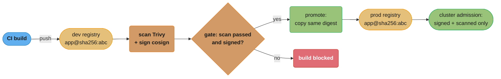
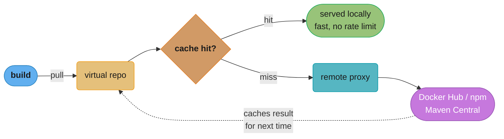
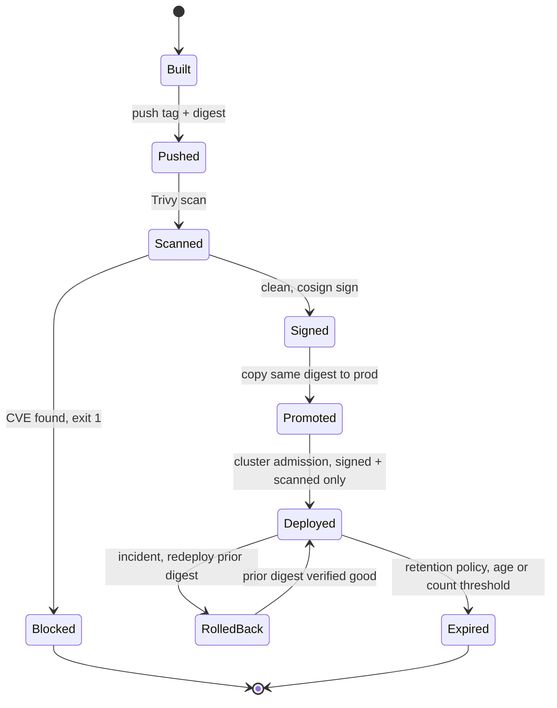
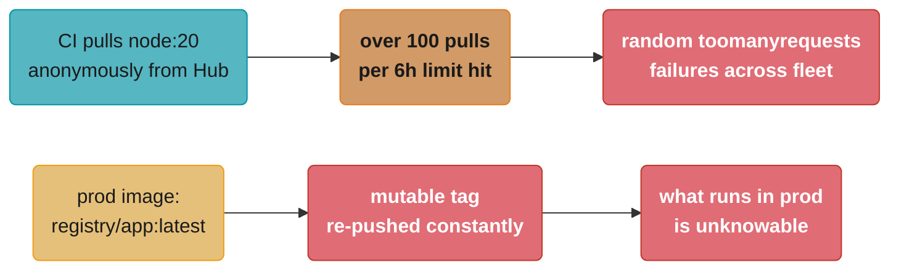

# Artifact & Registry Management

> Phase 3 — CI/CD & GitOps · Difficulty: Intermediate

Build outputs — container images, language packages (npm/Maven/PyPI), Helm charts, OS packages — are **artifacts** that must be stored, versioned, secured, and promoted from build to production. Artifact repositories (Artifactory, Nexus) and container registries (ECR, GAR, Harbor) are the system of record for "what can run." Getting versioning, immutability, retention, and promotion right is what makes "build once, promote the same artifact" (see [ci_cd_fundamentals](../ci_cd_fundamentals/)) actually work.

---

## 1. Concept Overview

An **artifact** is the immutable, versioned output of a build. A **repository/registry** stores artifacts, serves them to builds and clusters, and provides:

- **Hosting** — your own published artifacts (internal libraries, images, charts).
- **Proxying/caching** — a pull-through cache of public registries (Docker Hub, npmjs, Maven Central) so builds don't depend on (or get rate-limited by) the public internet.
- **Virtual/aggregated repos** — one URL fronting hosted + proxied repos.
- **Metadata & promotion** — labels, properties, and the ability to move an artifact through `dev → staging → prod` *without rebuilding*.
- **Security** — RBAC, vulnerability scanning, signing/verification, retention/cleanup.

Two overlapping product categories: **universal artifact managers** (JFrog Artifactory, Sonatype Nexus) that handle many package types, and **container registries** (AWS ECR, Google Artifact Registry, Harbor, GHCR) specialized for OCI images (which now also store Helm charts and other OCI artifacts).

---

## 2. Intuition

> **One-line analogy**: An artifact registry is a bonded warehouse for finished goods. Each item has an immutable serial number (digest/version), a paper trail (provenance/metadata), and a customs process to move it from the bonded zone (dev) to the showroom (prod) — you never re-manufacture the item at the showroom door, you ship the exact crate that passed inspection.

**Mental model**: The registry is the boundary between "built" and "deployed." CI pushes a versioned, immutable artifact in; CD pulls the *same* artifact out for each environment. Promotion is metadata/movement, not a rebuild. A proxy/cache layer insulates you from public-registry outages and rate limits, and retention policies stop storage from growing forever.

**Why it matters**: Without a controlled registry you get untraceable deploys (`latest` tags that change underneath you), supply-chain risk (pulling unverified public images directly), build fragility (Docker Hub rate limits or an npm outage breaks CI), and runaway storage cost. The registry is also a prime supply-chain attack target — it's where "what runs in prod" is decided.

**Key insight**: **Mutable tags are the enemy of reproducibility.** `myapp:latest` (or even `myapp:1.4`) can be re-pushed to point at different bytes. Pin and promote by **immutable digest** (`sha256:...`), enforce tag immutability where possible, and you get traceability ("this exact digest is in prod"), reproducibility, and a foundation for signing/verification.

---

## 3. Core Principles

1. **Artifacts are immutable and versioned.** Identify by digest or unique version, never a moving tag.
2. **Build once, promote — don't rebuild.** Move the same artifact through environments via metadata.
3. **Proxy/cache public dependencies.** Insulate builds from public-registry outages, rate limits, and removals.
4. **Secure the registry.** RBAC, scanning, signing/verification, and admission gating on what runs.
5. **Retention is mandatory.** Without cleanup policies, artifact storage grows without bound.
6. **The registry is supply-chain critical.** Treat provenance, signing, and access control as first-class.

---

## 4. Types / Architectures / Strategies

### Repository types

| Type | Purpose |
|------|---------|
| Hosted/local | Your published artifacts |
| Remote/proxy | Pull-through cache of a public registry (Docker Hub, npm, Maven Central) |
| Virtual/aggregated | Single URL fronting hosted + proxied repos |

### Tools

| Tool | Focus |
|------|-------|
| JFrog Artifactory | Universal (Docker, npm, Maven, PyPI, Helm, generic), promotion, replication |
| Sonatype Nexus | Universal artifact manager |
| AWS ECR / Google Artifact Registry | Cloud-native OCI registries (IAM-integrated, scanning) |
| Harbor | Self-hosted OCI registry (scanning, signing, RBAC, replication) |
| GHCR / GitLab Registry | SCM-integrated container registries |

### Promotion models

| Model | How |
|-------|-----|
| Repo-per-stage | Copy/move artifact `docker-dev → docker-prod` repos on gate pass |
| Property/label promotion | Tag the same artifact `status=prod` (Artifactory properties) |
| Registry replication | Replicate verified images to a prod/region registry |

---

## 5. Architecture Diagrams

**Build-once, promote across registries (no rebuild)**



*The exact digest that clears the scan-and-sign gate is copied — never rebuilt — into the prod registry, and cluster admission enforces that only signed, scanned digests from that registry are allowed to run.*

**Proxy/cache insulating builds from public registries**



*A cache hit is served locally with no rate-limit exposure; a miss falls through to the remote proxy and the public registry, whose result is cached for next time — so a public-registry outage or rate limit no longer blocks the build.*

**Artifact lifecycle: build to rollback or retirement**



*One digest moves through every state here without ever being rebuilt: a failed scan blocks it before signing, a bad deploy rolls back to the exact prior digest instead of an unknown rebuild, and retention only expires it once enough newer releases exist.*

---

## 6. How It Works — Detailed Mechanics

### Pin and promote by digest (not tag)

```bash
# CI: build, capture the IMMUTABLE digest, push.
docker build -t registry.example.com/dev/app:${GIT_SHA} .
docker push registry.example.com/dev/app:${GIT_SHA}
DIGEST=$(docker inspect --format='{{index .RepoDigests 0}}' registry.example.com/dev/app:${GIT_SHA})
# DIGEST = registry.example.com/dev/app@sha256:abc123...

# Scan + sign the exact digest:
trivy image --exit-code 1 --severity HIGH,CRITICAL "$DIGEST"   # fail build on serious CVEs
cosign sign "$DIGEST"                                          # supply-chain signature

# Promote the SAME digest to prod (copy, not rebuild):
crane copy "$DIGEST" registry.example.com/prod/app@$(echo "$DIGEST" | sed 's/.*@//')
# Deploy references the digest -> prod runs exactly what was scanned and signed.
```

### Enforce tag immutability (ECR example)

```hcl
resource "aws_ecr_repository" "app" {
  name                 = "app"
  image_tag_mutability = "IMMUTABLE"      # re-pushing a tag is rejected -> no silent swaps
  image_scanning_configuration { scan_on_push = true }
}
```

### Retention / lifecycle (stop unbounded growth)

```json
// ECR lifecycle policy: expire untagged images after 14 days; keep last 30 prod images.
{
  "rules": [
    {"rulePriority": 1, "selection": {"tagStatus": "untagged", "countType": "sinceImagePushed",
      "countUnit": "days", "countNumber": 14}, "action": {"type": "expire"}},
    {"rulePriority": 2, "selection": {"tagStatus": "tagged", "tagPrefixList": ["prod"],
      "countType": "imageCountMoreThan", "countNumber": 30}, "action": {"type": "expire"}}
  ]
}
```

### Pull-through cache (insulate from public outages/rate limits)

```bash
# Configure a remote/proxy repo (Artifactory/Nexus/ECR pull-through cache) for Docker Hub.
# Builds pull from the proxy; first pull caches, later pulls are local + immune to Hub rate limits.
# Anonymous Docker Hub pulls are rate-limited (e.g., ~100 pulls / 6h per IP) -> a busy CI fleet
# WILL hit it without a cache, causing intermittent "toomanyrequests" build failures.
```

### Provenance & SBOM attach (supply chain)

```bash
syft "$DIGEST" -o spdx-json > sbom.json          # generate SBOM
cosign attest --predicate sbom.json --type spdx "$DIGEST"   # attach signed SBOM attestation
# Admission can later verify both the signature AND the SBOM attestation (see devsecops module).
```

---

## 7. Real-World Examples

- **Docker Hub rate-limit outages**: many teams hit anonymous/free pull limits in CI and migrated to a pull-through cache (ECR/Artifactory) so builds stopped failing with `toomanyrequests`.
- **Artifactory promotion pipelines**: enterprises promote the same artifact across `dev → staging → release` repos by setting properties/labels on a gate pass — never rebuilding — with replication to regional/prod instances.
- **Harbor with cosign + Trivy**: self-hosted registries scan on push and store signatures, and clusters admit only signed, scan-clean images (Connaisseur/Kyverno verify-images) — see [devsecops_and_supply_chain_security](../devsecops_and_supply_chain_security/).
- **Language package registries**: internal npm/PyPI/Maven repos host private packages and proxy public ones, so a public package yank/outage doesn't break builds and internal libs are access-controlled.

---

## 8. Tradeoffs

| Decision | Option A | Option B | Key factor |
|----------|----------|----------|-----------|
| Identifier | Mutable tag (convenient) | Immutable digest (reproducible) | Always promote by digest |
| Registry | Cloud-native (ECR/GAR, IAM) | Self-hosted (Harbor/Artifactory) | Cloud integration vs control/multi-type |
| Manager | Artifactory/Nexus (universal) | Per-type registries | Many package types vs simplicity |
| Promotion | Copy across repos | Property/label same artifact | Storage cost vs simplicity |
| Public deps | Proxy/cache (resilient) | Direct pull (simple) | Build reliability + rate limits |
| Retention | Aggressive cleanup | Keep everything | Cost vs auditability/rollback depth |

---

## 9. When to Use / When NOT to Use

**Invest in artifact/registry management when:** any team running CI/CD at scale, pulling many public dependencies (rate-limit/outage risk), needing reproducible/traceable deploys, supply-chain security, or multi-region/multi-cluster distribution.

**Keep it simple when:** a tiny project can use the cloud's default registry (ECR/GHCR) with scan-on-push and a basic lifecycle policy — you don't need a full Artifactory deployment. Don't run heavyweight self-hosted managers without the need or ops capacity; don't skip retention (storage grows silently) or rely on `latest` (untraceable).

---

## 10. Common Pitfalls

**Pitfall 1 — Deploying mutable `latest`/floating tags.**

```yaml
# BROKEN: prod references a mutable tag -> the bytes can change underneath you;
# you can't say which build is running, and a re-push silently changes prod on next pull.
image: registry.example.com/prod/app:latest
```

```yaml
# FIX: reference an immutable digest (and enforce tag immutability in the registry).
image: registry.example.com/prod/app@sha256:abc123...   # exact, traceable, signable
```

**Pitfall 2 — No pull-through cache; public rate limits break CI intermittently.** A busy CI fleet pulling base images directly from Docker Hub hits anonymous rate limits and fails with `toomanyrequests` at random. FIX: configure a pull-through cache/proxy repo so builds pull cached layers locally and survive public-registry throttling/outages.

**Pitfall 3 — No retention policy; storage (and cost) grow unbounded.** Every CI run pushes an image; untagged/old images accumulate into terabytes. FIX: lifecycle policies — expire untagged images after N days, keep the last N tagged releases per repo — and exempt signed/prod artifacts you need for rollback/audit.

---

## 11. Technologies & Tools

| Tool | Purpose |
|------|---------|
| JFrog Artifactory / Sonatype Nexus | Universal artifact management, promotion, replication |
| AWS ECR / Google Artifact Registry / ACR | Cloud-native OCI registries (IAM, scan-on-push) |
| Harbor | Self-hosted OCI registry (scan, sign, RBAC, replication) |
| GHCR / GitLab Registry | SCM-integrated registries |
| Trivy / Grype | Vulnerability scanning (see [devsecops_and_supply_chain_security](../devsecops_and_supply_chain_security/)) |
| cosign / Sigstore | Sign/verify images and attestations |
| syft | SBOM generation |
| crane / skopeo | Copy/inspect images without a daemon |

---

## 12. Interview Questions with Answers

**Q1: Why promote by digest instead of tag?**
Tags are mutable — `app:1.4` or `app:latest` can be re-pushed to point at different bytes, so you can't guarantee what's running or reproduce a build. A digest (`sha256:...`) is content-addressed and immutable: it always refers to exactly the same bytes. Promoting and deploying by digest gives traceability ("this exact digest is in prod"), reproducibility, and a stable target to sign and verify.

**Q2: What does "build once, promote the artifact" require from the registry?**
The registry must store the immutable artifact (by digest) and allow you to move/copy or label it across environments without rebuilding — via repo-per-stage copies, property/label promotion (Artifactory), or replication. The deploy for each environment references the same digest. This ensures prod runs exactly what was tested and scanned, eliminating "rebuilt a different binary for prod" bugs.

**Q3: Why use a pull-through cache / proxy repository?**
It caches artifacts from public registries (Docker Hub, npm, Maven Central) locally, so builds don't depend on the public internet for every pull. Benefits: resilience to public-registry outages and removals (yanked packages), immunity to anonymous rate limits (Docker Hub throttles unauthenticated pulls, breaking busy CI), faster pulls, and a control point for scanning/allow-listing what enters your environment.

**Q4: How do you stop a registry's storage from growing forever?**
Apply retention/lifecycle policies: expire untagged images after N days (CI churn), keep only the last N tagged releases per repo, and exempt signed/prod artifacts needed for rollback and audit. Without this, every CI push accumulates, ballooning storage cost. Cloud registries (ECR lifecycle policies) and Artifactory/Nexus all support rule-based cleanup.

**Q5: Why is the registry a supply-chain security concern?**
It decides "what can run in production." Risks: pulling unverified public images (malware/typosquats), mutable tags swapped to malicious content, weak access control letting attackers push images, and missing provenance. Defenses: scan on push (Trivy), sign images and attach SBOMs (cosign/syft), enforce tag immutability, RBAC on push/pull, and cluster admission that only runs signed, scan-clean digests from your registry.

**Q6: Artifactory/Nexus vs a cloud container registry — when each?**
Universal managers (Artifactory/Nexus) handle many package types (Docker, npm, Maven, PyPI, Helm, generic) with promotion, replication, and proxying — ideal for polyglot orgs wanting one system of record. Cloud container registries (ECR/GAR/ACR) are simpler, IAM-integrated, and managed, ideal when you mostly need OCI images in one cloud. Many orgs use cloud registries for images plus an artifact manager for language packages.

**Q7: How does artifact management enable reliable rollback?**
Because every release is an immutable, retained, digest-identified artifact, rolling back is "deploy the previous digest" — which is guaranteed to be the exact bytes that previously worked. This requires retention policies that keep enough prior releases and not deleting prod artifacts. Mutable tags or aggressive cleanup that removes old releases break rollback.

**Q8: What is tag immutability and why enable it?**
Tag immutability rejects re-pushing an existing tag, so once `app:1.4.0` exists it can never be changed to point at different content. This prevents silent prod changes (a re-pushed `latest` altering what runs on the next pull), supports reproducibility, and is a prerequisite for trustworthy signing. Cloud registries (ECR `IMMUTABLE`) and Harbor support it.

**Q9: How do SBOMs and signing fit into the registry workflow?**
On push (or promotion), CI scans the image, generates an SBOM (syft), signs the image and attaches the SBOM as a signed attestation (cosign attest). The registry stores these alongside the image. Later, cluster admission (Kyverno/Connaisseur) verifies the signature and attestation before allowing the image to run — so only artifacts with known provenance and a clean bill of materials reach production (see [devsecops_and_supply_chain_security](../devsecops_and_supply_chain_security/)).

**Q10: What are hosted, proxy, and virtual repositories?**
Hosted (local) repos store artifacts your org publishes. Proxy (remote) repos are pull-through caches of external public registries. Virtual (aggregated) repos present a single URL that resolves across multiple hosted and proxied repos, so consumers configure one endpoint and the manager decides where each artifact comes from. This structure gives one clean interface while controlling both internal and external sources.

**Q11: Are digest pinning and tag immutability redundant, or do they defend different layers?**
They defend different layers, so both are worth running rather than picking one. Digest pinning secures the deploy reference itself — a manifest pointing at `app@sha256:abc123` runs those exact bytes no matter what happens to any tag afterward. Tag immutability (like ECR's `IMMUTABLE` setting) secures the registry's write path instead, blocking anyone from ever re-pushing an existing tag, which protects consumers who still pull by tag — a human running a manual `docker pull`, an older script, or a manifest nobody has migrated yet. Use digest pinning for automated deploys and tag immutability as the backstop for everything still tag-based.

**Q12: What Docker Hub rate-limit tiers does a pull-through cache protect a CI fleet from?**
Docker Hub throttles pulls by identity tier, and a pull-through cache removes your fleet from that quota entirely. Anonymous, unauthenticated pulls are capped around 100 pulls per 6 hours per IP; authenticated free accounts get a higher ceiling; paid plans remove the limit. A pull-through cache (Artifactory, Nexus, or an ECR pull-through cache rule) sits in front of all of it — after the first fetch, every later pull across hundreds of CI runners is served from the cache instead of hitting Docker Hub again, so the fleet's actual upstream request count stays tiny regardless of how many builds run. Skip the cache and a shared office or CI IP burns through the anonymous ceiling within a few busy hours, failing builds at random with `toomanyrequests`.

**Q13: How can an overly aggressive lifecycle policy delete an image that's still deployed?**
A retention rule keyed only on tag pattern or a flat keep-last-N count can expire a digest that a live deployment or a pending rollback still depends on. For example, a rule that keeps only the last 30 `prod`-prefixed images expires the 31st-oldest the moment a new one is pushed, even if a slow-rolling region or an incident runbook still expects to roll back to it. The fix is to make retention aware of what's actually running — check live deployment references before pruning, widen the keep-count with margin for your slowest rollout, and never key expiry purely on push recency. Treat "currently deployed" as a hard exemption from any age- or count-based rule, not an afterthought.

**Q14: How does cluster admission actually verify an SBOM or provenance attestation before allowing an image to run?**
Admission checks two separate things, not just a signature. First it verifies the cosign signature against a trusted public key or keyless OIDC identity, confirming the artifact wasn't tampered with; then it evaluates the attached attestation's predicate — the SBOM contents or SLSA provenance metadata (builder identity, source repo, build parameters) — against policy, for example rejecting any image whose SBOM lists a package with a known-critical CVE. Tools like Kyverno's `verifyImages` or Connaisseur do both steps inline at deploy time, so an image can be validly signed yet still blocked if its attestation fails the content check. This two-layer check is what turns "signed" into "signed and trustworthy to run."

**Q15: Why and how would you replicate a container registry across multiple regions?**
Multi-region replication copies pushed images into a registry in a second region so distributed clusters pull from a nearby copy instead of crossing regions on every deploy. It cuts pull latency and cross-region data-transfer cost, and it keeps deploys working if one region's registry has an outage. Tools like Artifactory, Harbor, and ECR support asynchronous replication that copies the same digest byte-for-byte, so the copy is still the exact artifact that was scanned and signed — replication is copying, not rebuilding. The gotcha is replication lag: a deploy in the secondary region can reference a digest that hasn't finished replicating yet, so pipelines should gate on replication completion or fall back to pulling from the primary region.

**Q16: Why doesn't deleting a tag immediately free up registry storage?**
Deleting a tag only removes the pointer to a manifest, not the underlying image layer blobs, which stay until a separate garbage-collection pass runs. Because layers are content-addressed and shared across many images (a base-image layer might back hundreds of tags), the registry can't safely delete a blob just because one manifest pointing to it was untagged — another tagged image elsewhere might still reference that same blob. Registries like Harbor and the OSS Docker Registry solve this with mark-and-sweep GC: a first pass marks every blob still reachable from a tagged manifest, and a sweep pass deletes everything left unmarked, which is why GC typically runs as a separate scheduled job rather than inline with every delete. Skipping GC is why pruning old tags alone doesn't reclaim the storage it appears to — you have to run the collector too.

---

## 13. Best Practices

- **Promote by immutable digest**; enable **tag immutability**; never deploy `latest` to prod.
- **Build once, promote** across environments (copy/label/replicate) — never rebuild per env.
- **Proxy/cache public registries** to survive outages and rate limits; control what enters.
- **Scan on push** (Trivy), **sign + attach SBOMs** (cosign/syft), and **admit only verified digests**.
- Enforce **RBAC** on push/pull; the registry holds "what runs in prod."
- Apply **retention/lifecycle policies**; keep enough prod releases for rollback/audit.
- Choose **cloud registries** for images + an **artifact manager** for polyglot packages as scale dictates.

---

## 14. Case Study

### Scenario: Docker Hub rate limits and an untraceable prod image cause a bad week

A scaling startup's CI pulls base images directly from Docker Hub. As the team grows, builds start failing intermittently with `toomanyrequests`. Separately, an incident requires answering "which build is in prod?" — but prod runs `app:latest`, which has been re-pushed dozens of times, so nobody can map it to a commit, and a rollback deploys an unknown previous `latest`.

**BROKEN**



*Two independent failures compound: anonymous Docker Hub pulls trip the rate limit and break CI at random, while the mutable `latest` tag in prod means nobody can say what is actually running or which digest to roll back to.*

```hcl
# FIX 1: pull-through cache for base images (Terraform, ECR pull-through cache rule).
resource "aws_ecr_pull_through_cache_rule" "dockerhub" {
  ecr_repository_prefix = "dockerhub"
  upstream_registry_url = "registry-1.docker.io"
}
# Dockerfile now: FROM <acct>.dkr.ecr.<region>.amazonaws.com/dockerhub/library/node:20
# -> cached locally, no Hub rate limits, survives Hub outages.
```

```hcl
# FIX 2: immutable, scanned app repo + digest-based deploys.
resource "aws_ecr_repository" "app" {
  name                 = "app"
  image_tag_mutability = "IMMUTABLE"            # tags can't be re-pushed
  image_scanning_configuration { scan_on_push = true }
}
```

```yaml
# FIX 3: CI tags by SHA, deploys reference the digest; lifecycle policy caps storage.
# CI: push registry/app:${GIT_SHA}; capture digest; deploy uses app@sha256:...
# Lifecycle: expire untagged >14d, keep last 30 prod images.
```

**Outcome:** the pull-through cache eliminated the `toomanyrequests` build failures (and made builds resilient to Docker Hub outages); immutable, SHA-tagged, digest-referenced images made "what's in prod" a one-line answer (digest → commit) and rollback deterministic; scan-on-push plus a lifecycle policy added supply-chain hygiene and capped storage growth. The registry went from an afterthought to the reliable system of record for "what runs."

**Discussion questions:**
1. Why do anonymous Docker Hub pulls break CI at scale, and how does a pull-through cache fix both rate limits and outages?
2. Why is `latest` in prod an operational and security problem, and how does digest-based deploy solve it?
3. How would signing (cosign) + admission verification extend this into a full supply-chain guarantee (see [devsecops_and_supply_chain_security](../devsecops_and_supply_chain_security/))?

---

**Cross-references:** [ci_cd_fundamentals](../ci_cd_fundamentals/) (build once, promote the artifact), [containers_and_docker](../containers_and_docker/) (image digests/layers), [devsecops_and_supply_chain_security](../devsecops_and_supply_chain_security/) (scanning, signing, SBOM, admission), [helm_and_package_management](../helm_and_package_management/) (charts as OCI artifacts), [infrastructure_as_code_terraform](../infrastructure_as_code_terraform/) (provisioning registries as code).
