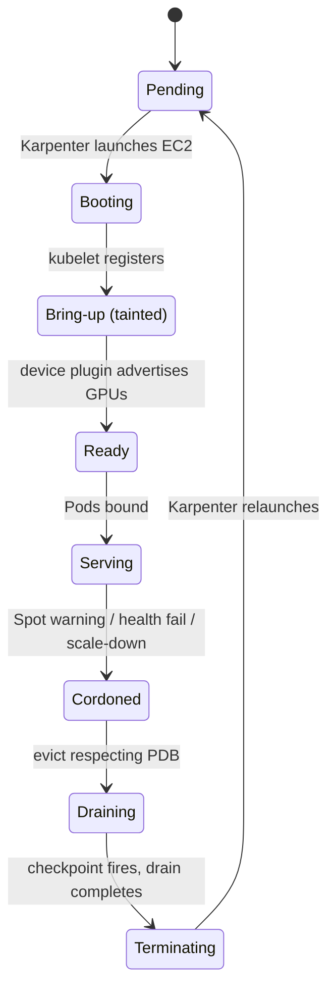
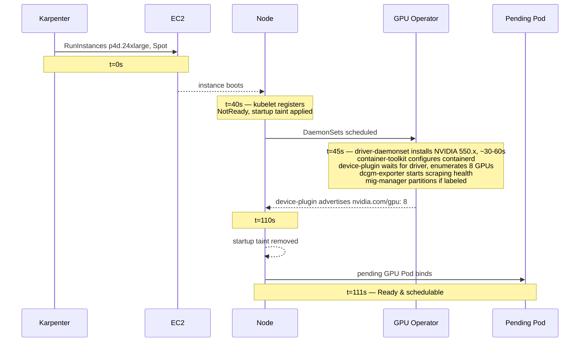
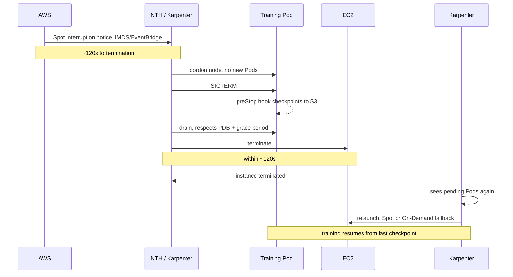
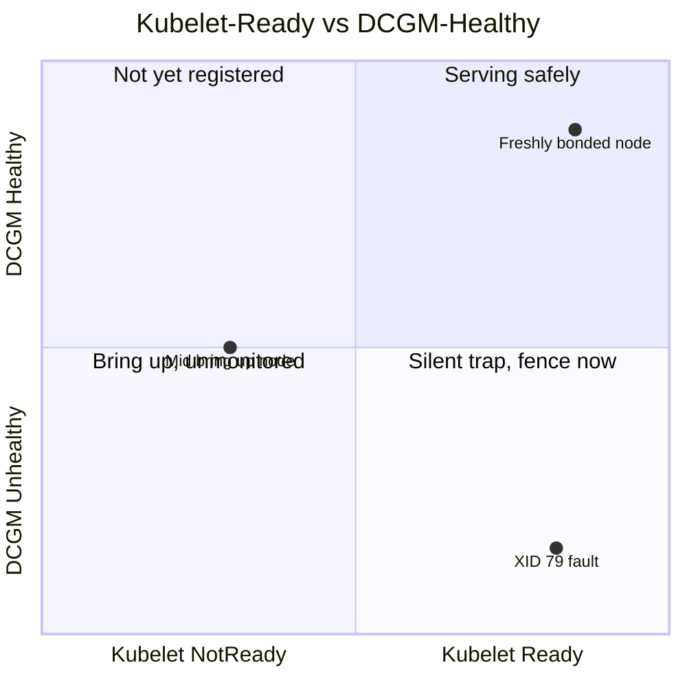
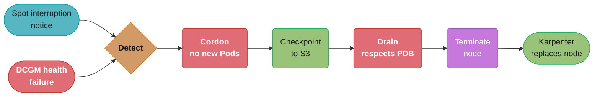

# GPU Node Lifecycle (Cross-Cutting Primitive)

> A shared infrastructure primitive referenced by the ML platform / GPU case studies. The complete lifecycle of a GPU node on Kubernetes: from "Karpenter launches an empty EC2 instance" through driver bring-up, device-plugin readiness, health monitoring, Spot-interruption handling, graceful drain, and decommission. This is the operational glue beneath every GPU workload — get it wrong and you waste $3/hour cards, lose training runs, or schedule Pods onto half-broken nodes.

Read this alongside [`../../ml_platform_and_gpu_infrastructure/`](../../ml_platform_and_gpu_infrastructure/) (the module) and [`../design_ml_platform_infrastructure.md`](../design_ml_platform_infrastructure.md) (the case study). For Kubernetes node basics and scheduling cross-reference [`../../kubernetes_scheduling_and_autoscaling/`](../../kubernetes_scheduling_and_autoscaling/) and [`../../kubernetes_architecture/`](../../kubernetes_architecture/).

---

## 1. Concept Overview

A GPU node is not a normal Kubernetes node. A normal node boots, the kubelet registers, and Pods schedule within seconds. A GPU node boots as an **expensive, half-ready machine**: the GPUs are physically present but invisible to Kubernetes until a multi-step bring-up completes — kernel driver loaded and matched to the CUDA runtime, the NVIDIA container toolkit installed so containerd can inject `/dev/nvidia*`, the device plugin enumerating GPUs and advertising `nvidia.com/gpu`, DCGM collecting health, and (optionally) MIG partitioning applied. Until all that finishes, the node reports `nvidia.com/gpu: 0` and is useless despite costing money from the moment EC2 bills it.

The **GPU node lifecycle** is the set of controls that manage this from cradle to grave:

1. **Provision** — Karpenter/Cluster Autoscaler launches the instance in response to a pending GPU Pod.
2. **Bring-up** — the GPU Operator's DaemonSets install driver → toolkit → device plugin → DCGM → MIG, gated by node labels.
3. **Readiness gating** — taints keep Pods off until GPUs are actually advertised, preventing scheduling onto a not-yet-ready node.
4. **Steady state** — DCGM health monitoring; the node serves workloads.
5. **Disruption handling** — Spot interruption (2-min warning) or health failure triggers cordon + drain + checkpoint.
6. **Decommission** — drain Pods safely, deregister, terminate; Karpenter consolidates empty nodes.

The whole point is to never let a Pod land on a node whose GPUs aren't ready, never lose work to an ungraceful termination, and never keep paying for a node that's broken or idle.

---

## 2. Intuition

> A GPU node is a **fighter jet on an aircraft carrier**. It can't just taxi off and fly the moment it's on deck — there's a pre-flight checklist (driver, toolkit, device plugin, health checks) that *must* complete, and the deck crew (taints) physically blocks the runway until the green light. When it's damaged (a failing GPU) or low on fuel (Spot reclaim), there's a strict procedure to recover the pilot (checkpoint), clear the deck (drain), and push the wreck overboard (terminate) — never just abandon it mid-runway where it blocks everything.

**Mental model:** A GPU node has a **readiness gate** that is the inverse of a normal node's. Normal nodes are "ready until proven broken." GPU nodes must be "broken (tainted) until proven ready" — the startup taint is removed only when the device plugin confirms GPUs are advertised. This flip prevents the single most common GPU-cluster bug: Pods scheduling onto a node 90 seconds before its driver finishes loading, then crash-looping with `CUDA driver not found`.

**Why it matters:** Every second of lifecycle mishandling is money or lost work. An idle-but-billed node during a 2-minute bring-up, a training run wiped by an ungraceful Spot reclaim, a Pod CrashLooping on a not-ready node, a degraded GPU silently producing NaN gradients — each is a direct, quantifiable cost on hardware that runs $1–$5/hour per GPU.

**Key insight:** The lifecycle is a **state machine guarded by taints and informed by DCGM**. Taints control *what can schedule*; DCGM controls *what is healthy*. Provisioning and decommission are just transitions, and the dangerous transitions (Spot reclaim, health failure) all share the same recovery shape: **detect → cordon → checkpoint → drain → terminate.**

---

## 3. Core Principles

1. **Taint until ready, untaint on GPU advertisement.** A startup taint (`node.cilium.io/agent-not-ready` style, or NVIDIA's `nvidia.com/gpu.deploy.*` gating) blocks workload Pods until the device plugin reports `nvidia.com/gpu > 0`.
2. **The driver must match the CUDA runtime.** A container's CUDA version cannot exceed the node driver's supported version, or every GPU op fails. Pin driver versions; gate AMI/node-image upgrades on a GPU smoke test.
3. **Health is DCGM-defined, not kubelet-defined.** The kubelet says "Ready" once it registers, but a GPU can have uncorrectable ECC errors or have "fallen off the bus" (XID 79) while the node is kubelet-Ready. GPU health needs DCGM signals.
4. **Every disruption is a checkpoint opportunity.** Spot 2-minute warnings and planned drains must trigger a final checkpoint for training workloads before the node dies.
5. **Drain respects the workload.** Training Pods need gang-aware draining (don't strand survivors); serving Pods need PodDisruptionBudgets so you don't drop below min replicas.
6. **Empty GPU nodes must die fast.** An idle GPU node burns money; consolidation/scale-down should remove it quickly — but never disrupt a node still running work.

---

## 4. The Lifecycle States

| State | Trigger | What's happening | Schedulable? |
|-------|---------|------------------|--------------|
| **Pending provision** | A GPU Pod is unschedulable | Karpenter selects instance type, calls EC2 | No node yet |
| **Booting / NotReady** | EC2 instance launching | OS boot, kubelet starting | No |
| **Bring-up (tainted)** | kubelet registered | GPU Operator installs driver→toolkit→plugin→DCGM | No (tainted, `nvidia.com/gpu: 0`) |
| **Ready** | Device plugin advertises GPUs | Startup taint removed; `nvidia.com/gpu: N` | Yes |
| **Serving** | Pods bound | DCGM monitoring; workloads run | Yes |
| **Cordoned** | Spot warning / health fail / drain | `unschedulable=true`, no new Pods | No (existing keep running briefly) |
| **Draining** | Cordon + evict | Pods evicted respecting PDB; checkpoint fires | No |
| **Terminating** | Drain complete / timeout | Node deregistered, EC2 terminated | No |


*Forward progress runs Pending → Booting → Bring-up → Ready → Serving; every disruption (Spot warning, health failure, scale-down) drains through the same Cordoned → Draining → Terminating loop before Karpenter relaunches a fresh node.*

---

## 5. Architecture Diagrams

Bring-up sequence (why a fresh node shows `nvidia.com/gpu: 0` for ~90s):


*Lesson: ~110s of billed-but-idle time per cold node — keep a warm pool for latency-sensitive serving; tolerate it for batch training.*

Spot interruption handling (the 2-minute window):


*The same shape recurs for every disruption: detect → cordon → checkpoint → drain → terminate → replace — here triggered by a Spot notice instead of a DCGM health failure (see §6.2).*

---

## 6. How It Works — Detailed Mechanics

### 6.1 Readiness gating with a startup taint

Karpenter applies a startup taint that the GPU Operator removes once GPUs are ready, so nothing schedules onto a half-built node:

```yaml
apiVersion: karpenter.sh/v1
kind: NodePool
metadata: { name: gpu-training }
spec:
  template:
    spec:
      startupTaints:                       # removed automatically once the node is fully ready
        - key: nvidia.com/gpu-not-ready
          effect: NoSchedule
      taints:                              # permanent: only GPU Pods (with toleration) ever land
        - key: nvidia.com/gpu
          effect: NoSchedule
```

The GPU Operator's `gpu-feature-discovery` and validator pods only label/untaint the node after the driver validation pod exits 0 and the device plugin advertises capacity. Verify:

```bash
kubectl get node ip-10-0-1-42 -o jsonpath='{.status.allocatable.nvidia\.com/gpu}'
# "0"  during bring-up   ->   "8"  once ready (taint then removed)
```

### 6.2 DCGM health monitoring and auto-fencing

Kubelet-Ready and DCGM-Healthy are independent signals; conflating them is the trap:


*Kubelet readiness and DCGM health are independent axes — the bottom-right quadrant (Ready but unhealthy) is exactly Pitfall 4: a node that passes Kubernetes' checks while a GPU silently degrades.*

DCGM exports health signals to Prometheus; an alert + a remediation controller cordons unhealthy nodes:

```promql
# Uncorrectable ECC errors climbing -> the GPU memory is degrading
- alert: GpuEccErrors
  expr: increase(DCGM_FI_DEV_ECC_DBE_VOL_TOTAL[10m]) > 0
  labels: { severity: page }
  annotations: { summary: "GPU double-bit ECC on {{ $labels.kubernetes_node }} — fence it" }

# XID 79 = GPU fell off the bus (hardware fault)
- alert: GpuFellOffBus
  expr: DCGM_FI_DEV_XID_ERRORS == 79
  labels: { severity: page }
```

NVIDIA's GPU Operator can run a **node health check** (`validator`) on a schedule; combined with the above, a controller (or a simple `kubectl` runbook) cordons and drains the node, and Karpenter replaces it.

Both disruption triggers converge on one pipeline:


*A Spot reclaim and a DCGM-detected fault are different triggers but the same response: the detect → cordon → checkpoint → drain → terminate → replace shape named in Sections 2 and 14.*

### 6.3 Spot interruption → checkpoint → drain

The training Pod traps SIGTERM and checkpoints in its grace period; the node termination handler orchestrates the drain:

```yaml
# Training Pod: long terminationGracePeriod + preStop hook to flush a checkpoint
spec:
  terminationGracePeriodSeconds: 110      # under the ~120s Spot window
  containers:
    - name: trainer
      lifecycle:
        preStop:
          exec:
            command: ["/bin/sh", "-c", "python /app/checkpoint.py --to s3://ckpts/$JOB_ID/latest"]
```

```python
# checkpoint.py — also wire a SIGTERM handler in the training loop itself
import signal, torch
def on_term(*_):
    torch.save({"model": model.state_dict(), "opt": opt.state_dict(),
                "step": global_step}, "/ckpt/latest.pt")  # synced to S3 by preStop or a sidecar
    raise SystemExit(0)
signal.signal(signal.SIGTERM, on_term)
```

Karpenter's interruption handling (it watches an SQS queue fed by EventBridge Spot/health events) cordons and drains automatically; on older setups the **AWS Node Termination Handler** DaemonSet does it.

### 6.4 Graceful drain that respects the workload

```bash
# Serving nodes: PodDisruptionBudget ensures drain never drops below min replicas
kubectl drain ip-10-0-1-42 --ignore-daemonsets --delete-emptydir-data \
  --grace-period=120 --timeout=300s
# Honors PDBs (kubectl drain blocks if eviction would violate a PDB),
# gives Pods their terminationGracePeriod to checkpoint/flush.
```

```yaml
# PDB so a node drain can't take serving below capacity:
apiVersion: policy/v1
kind: PodDisruptionBudget
metadata: { name: inference-pdb }
spec:
  minAvailable: 80%
  selector: { matchLabels: { app: model-serving } }
```

### 6.5 Decommission of empty/idle nodes

```yaml
# Serving NodePool: only consolidate truly empty nodes (never disrupt running serving)
spec:
  disruption:
    consolidationPolicy: WhenEmpty
    consolidateAfter: 5m         # idle GPU node gone within 5 min of emptying
  limits: { nvidia.com/gpu: 64 } # hard cap so a runaway scale-up can't bankrupt you
```

---

## 7. Real-World Examples

- **NVIDIA GPU Operator** is the reference implementation of states 2–4: it sequences driver→toolkit→plugin→DCGM→MIG via node labels and validation pods, and is used in virtually every production GPU cluster (DGX Cloud, EKS/GKE/AKS GPU node pools).
- **Karpenter** (AWS) implements provisioning and disruption with a native interruption queue (SQS+EventBridge) that catches Spot reclaims and health events, cordons, and relaunches — replacing the older standalone Node Termination Handler.
- **OpenAI / large training shops** rely on frequent checkpointing + elastic training (PyTorch Elastic / torchrun) so a lost Spot node rescales the job instead of killing it — the lifecycle's disruption-handling stage made cheap at scale.
- **GKE** offers built-in GPU node-pool management and GPU time-sharing/MIG, automating much of the bring-up and health gating that you assemble manually on EKS with the GPU Operator.
- **Meta / Lambda Labs / CoreWeave** publish guidance on GPU health-checking (DCGM-based) and auto-draining degraded nodes, because at thousands of GPUs hardware failures are routine, not rare.

---

## 8. Tradeoffs

| Decision | Option A | Option B | Guidance |
|----------|----------|----------|----------|
| Capacity readiness | Warm pool (idle nodes kept ready) | Cold (provision on demand) | Warm for latency-serving (no ~110s bring-up); cold for batch training |
| Pricing | On-Demand (stable) | Spot (~70% cheaper) | Spot for checkpointable training; On-Demand for serving SLAs |
| Health fencing | Manual runbook | Automated controller | Automate at scale; manual is fine for a handful of nodes |
| Checkpoint frequency | Frequent (every few min) | Infrequent (hourly) | Frequent bounds Spot loss; infrequent saves I/O — bound to your tolerance |
| Drain timeout | Long (let it checkpoint) | Short (fail fast) | Long enough to checkpoint, under the Spot window (~110s) |

| Warm pool | Cold provisioning |
|-----------|-------------------|
| No ~110s bring-up latency | Pays $0 when idle |
| Pays for idle GPUs | First request waits for bring-up |
| Right for serving | Right for batch/training |

---

## 9. When to Use / When NOT to Use

**Invest in full lifecycle automation when:**
- You run GPUs on Spot (interruptions are routine — you *must* checkpoint and drain gracefully).
- You operate enough GPUs that hardware failures occur regularly (auto-fencing pays off).
- You mix serving (needs warm capacity, PDBs) and training (needs checkpointing) on one cluster.
- Cold-start bring-up latency (~110s) hurts a latency-sensitive product (need a warm pool).

**Keep it simple when:**
- One or two static On-Demand GPU nodes for one team — manual cordon/drain runbooks suffice; skip controllers and warm pools.
- Pure batch with cheap-to-restart short jobs — losing a node just reruns the job; elaborate checkpointing isn't worth it.
- Using a fully-managed offering (SageMaker, GKE Autopilot GPU, Vertex) that handles the lifecycle for you.

---

## 10. Common Pitfalls

**Pitfall 1: No readiness gating → Pods crash-loop on a not-ready node.**

```yaml
# BROKEN: GPU NodePool with no startup taint. The kubelet registers Ready at t=45s,
# but the driver isn't loaded until t=110s. The scheduler binds the pending Pod at t=46s;
# it starts and immediately fails: "CUDA driver version is insufficient" -> CrashLoopBackOff.
spec:
  template:
    spec:
      taints:
        - { key: nvidia.com/gpu, effect: NoSchedule }   # permanent taint only, no startup gate
```

```yaml
# FIX: add a startup taint the GPU Operator removes only after GPUs are advertised.
spec:
  template:
    spec:
      startupTaints:
        - { key: nvidia.com/gpu-not-ready, effect: NoSchedule }
      taints:
        - { key: nvidia.com/gpu, effect: NoSchedule }
```
The broken version wastes the bring-up window in crash loops and can mark a job failed before the node is even usable.

**Pitfall 2: Spot reclaim with infrequent checkpoints.** Checkpointing hourly means a Spot reclaim at minute 55 throws away ~55 minutes of GPU time. Checkpoint every few minutes (or every N steps) so the max loss is small. (See the GPU module §14 for the $/incident math.)

**Pitfall 3: Drain ignores PodDisruptionBudgets and tanks serving.** A bulk node-image upgrade drains several serving nodes at once with no PDB, dropping replicas below the level that handles traffic → latency/availability incident. Always set PDBs on serving and let `kubectl drain` honor them.

**Pitfall 4: Treating kubelet-Ready as GPU-healthy.** A node is kubelet-Ready while a GPU silently produces ECC errors or NaN results. Without DCGM-based health checks, you schedule training onto a degrading card and get corrupted models. Fence on DCGM signals, not just node status.

**Pitfall 5: Idle GPU nodes never scale down.** A misconfigured consolidation policy (or none) leaves emptied GPU nodes running for hours at $3+/hr each. Set `consolidationPolicy: WhenEmpty` + a short `consolidateAfter`, with a hard `limits` cap as a backstop.

**Pitfall 6: Driver/AMI upgrade without a smoke test.** Bumping the node image to a driver that the workload's CUDA version doesn't support breaks every GPU Pod fleet-wide. Pin driver versions and gate node-image rollouts on a one-Pod GPU smoke test before fleet-wide rollout.

---

## 11. Technologies & Tools

| Tool | Lifecycle stage | Notes |
|------|-----------------|-------|
| Karpenter | Provision, disruption, decommission | Just-in-time launch, Spot interruption queue, consolidation |
| Cluster Autoscaler | Provision, scale-down | Per-ASG GPU node groups; cross-cloud |
| NVIDIA GPU Operator | Bring-up, health | Driver/toolkit/plugin/DCGM/MIG sequencing + node validation |
| DCGM + dcgm-exporter | Health monitoring | ECC, XID, throttle, temp, util → Prometheus |
| AWS Node Termination Handler | Disruption | Catches Spot/maintenance events, cordons + drains (Karpenter does this natively now) |
| PyTorch Elastic / torchrun | Disruption resilience | Job survives losing a worker by rescaling |
| Kueue / Volcano | Drain (gang-aware) | Don't strand survivors of a gang job during drain |
| `kubectl drain` + PDB | Drain | Respects PodDisruptionBudgets and grace periods |

---

## 12. Interview Questions with Answers

**Q: Why does a freshly provisioned GPU node report `nvidia.com/gpu: 0` for a minute or two?**
Because GPUs are invisible to Kubernetes until a multi-step bring-up finishes: the kernel driver must load and validate, the container toolkit must configure containerd, and only then does the device plugin enumerate the GPUs and advertise `nvidia.com/gpu` capacity. The kubelet registers the node as Ready around t=45s, but the driver validation and device-plugin advertisement complete closer to t=110s. During that gap the node has zero allocatable GPUs. The practical consequences: you need a startup taint so Pods don't bind during this window, and you pay ~110s of idle-but-billed time per cold node — which is why latency-sensitive serving keeps a warm pool.

**Q: What is a startup taint and why is it essential for GPU nodes?**
A startup taint (`nvidia.com/gpu-not-ready:NoSchedule`, applied by Karpenter) blocks workload Pods from scheduling onto a node until the GPU Operator removes it — which happens only after the driver validates and the device plugin advertises GPUs. It's essential because the kubelet marks the node Ready ~65 seconds *before* the GPUs are actually usable; without the startup taint, the scheduler binds a pending GPU Pod into that gap, the container starts before the driver is loaded, and it CrashLoopBackOffs with "CUDA driver insufficient." The startup taint flips the default — the node is "not ready for GPU work until proven ready" — which is the correct posture for this class of node.

**Q: How do you handle a Spot interruption on a training node without losing the run?**
AWS gives a ~2-minute interruption notice (via IMDS/EventBridge). The handler — Karpenter's interruption queue or the Node Termination Handler — cordons the node and sends SIGTERM to its Pods. The training Pod must use that window: a SIGTERM handler in the training loop (or a `preStop` hook) writes a checkpoint (model + optimizer + step) to durable storage like S3, within a `terminationGracePeriodSeconds` set below 120s. After the node dies, Karpenter sees the pending Pod and relaunches (Spot or On-Demand fallback), and training resumes from the last checkpoint. For large jobs, PyTorch Elastic lets the job rescale around the lost worker instead of restarting. The combination of frequent checkpointing + graceful drain is what makes Spot's ~70% discount safe for training.

**Q: Why isn't "node is Ready" sufficient to know a GPU node is healthy?**
Because kubelet readiness reflects the kubelet and basic node conditions, not GPU hardware health. A GPU can develop uncorrectable (double-bit) ECC memory errors, fall off the PCIe bus (XID 79), thermally throttle, or produce silently wrong results while the node remains kubelet-Ready. Scheduling training onto such a card yields corrupted models or crashed jobs. So GPU health must come from **DCGM** signals (`DCGM_FI_DEV_ECC_DBE_VOL_TOTAL`, XID errors, throttle reasons, temperature), and a controller (or runbook) fences — cordons and drains — nodes that trip those, letting Karpenter replace them. The lesson is that GPU health is a separate, hardware-specific signal layered on top of normal node readiness.

**Q: Walk through what the GPU Operator does during node bring-up and how it sequences the steps.**
It runs a set of DaemonSets gated by node labels: (1) the **driver** daemonset installs/loads the matching NVIDIA kernel driver and runs a validation pod; (2) the **container toolkit** configures containerd to inject `/dev/nvidia*` and CUDA libraries; (3) the **device plugin** waits for driver validation, enumerates GPUs, and advertises `nvidia.com/gpu`; (4) **dcgm-exporter** starts health metrics; (5) the **MIG manager** applies partitioning if the node is labeled for it. Sequencing is enforced via labels like `nvidia.com/gpu.deploy.driver` and init-container/validation gates, so each step waits for the previous — the device plugin literally can't enumerate GPUs before the driver loads. Once the device plugin advertises capacity, the startup taint is removed and the node becomes schedulable.

**Q: How do you drain a GPU serving node without causing an availability incident?**
Set a PodDisruptionBudget on the serving workload (e.g., `minAvailable: 80%`) so eviction can't drop below the replica count that handles traffic, then `kubectl drain --grace-period=120 --timeout=300s`, which honors the PDB (it blocks/paces eviction rather than violating it) and gives each Pod its termination grace period to finish in-flight requests and deregister from the load balancer. The mistake is draining several serving nodes at once with no PDB during a fleet upgrade, which drops capacity below demand. With PDBs, the drain proceeds only as fast as replacement capacity comes up. For training nodes the concern is different — you want gang-aware draining so you don't strand the survivors of a multi-worker job.

**Q: What's the right checkpoint frequency for Spot training, and what's the tradeoff?**
Frequent enough that a Spot reclaim never throws away more work than you can tolerate, balanced against checkpoint I/O cost. Checkpointing every N steps such that the interval is a few minutes is a common sweet spot: a reclaim loses at most those few minutes. Hourly checkpointing risks losing ~55 minutes if reclaimed near the top of the hour — on an 8-GPU node that's real money and time. The tradeoff is that each checkpoint writes potentially many GB (model + optimizer state) to storage, costing I/O bandwidth and pausing training briefly; too-frequent checkpoints hurt throughput. You tune the interval to your Spot interruption rate and checkpoint size — and use asynchronous/sharded checkpointing for very large models so the write doesn't stall the GPUs.

**Q: How does Karpenter decide to remove a GPU node, and how do you stop it removing one mid-training?**
Karpenter's disruption controller looks for nodes it can consolidate — empty nodes, or underutilized nodes whose Pods could fit elsewhere more cheaply. The danger is `consolidationPolicy: WhenEmptyOrUnderutilized` deciding a training node is "underutilized" and disrupting it at hour 5 of a 6-hour run. To prevent that: set `consolidationPolicy: WhenEmpty` on the training NodePool (only truly empty nodes are removed), annotate long-running training Pods with `karpenter.sh/do-not-disrupt: "true"`, and keep serving on a separate NodePool so its consolidation churn never touches training. For idle cost control you still want empty nodes gone quickly via a short `consolidateAfter`.

**Q: Why keep a warm pool of GPU nodes, and what does it cost?**
A warm pool is one or more GPU nodes kept Ready and idle so a new serving Pod (or a scaled-up replica) can schedule instantly instead of waiting the ~110s cold bring-up plus possible Karpenter provisioning time (minutes). It matters for latency-sensitive serving and scale-to-zero models where the first request after scale-up would otherwise eat tens of seconds to minutes of cold start. The cost is direct: an idle A100 still bills ~$3/hour. So you size the warm pool to your expected burst — enough to absorb a typical scale-up without cold starts, but not so many that idle cost dominates. Batch/training workloads generally don't need a warm pool because they tolerate the bring-up latency.

**Q: A GPU node is stuck in NotReady with Pods Pending against it. How do you debug?**
Start with the bring-up chain. Check `kubectl describe node` for taints and allocatable GPUs (`nvidia.com/gpu`); if it's still 0, the device plugin hasn't advertised. Then check the GPU Operator pods on that node: the driver daemonset/validator logs (did the driver fail to compile or mismatch the kernel?), the device-plugin logs (can it talk to the driver?), and the container-toolkit. Common causes: a kernel/driver version mismatch after an AMI bump, a driver compilation failure (missing headers), the node out of disk so the driver install failed, or the startup taint never removed because validation didn't pass. `nvidia-smi` via a debug pod (if the toolkit is up) confirms whether the GPUs are visible at the OS level at all. The split — GPUs invisible to the OS vs invisible only to Kubernetes — localizes the fault to hardware/driver vs the plugin.

**Q: How do you upgrade GPU node drivers across a fleet safely?**
Never roll a new driver fleet-wide blind, because a CUDA-incompatible driver breaks every GPU Pod at once. The safe path: pin the driver version in the GPU Operator's ClusterPolicy, build/test a new node image (AMI) with the target driver, deploy it to a **single canary GPU node**, run a GPU smoke test (a Pod that does a real CUDA op / a small training step) and confirm DCGM health, then roll the new image gradually across the fleet one node at a time — cordoning/draining each (respecting PDBs and checkpointing) before replacing it. Karpenter's drift detection or a controlled node-image bump drives this. Gating on the canary smoke test is the key control; the rest is just a careful rolling replacement.

**Q: What signals tell you a GPU is degrading and should be fenced?**
Primarily DCGM signals: rising uncorrectable (double-bit) ECC errors (`DCGM_FI_DEV_ECC_DBE_VOL_TOTAL`) meaning GPU memory is failing; XID errors, especially XID 79 (GPU fell off the bus) or XID 48/63/64 (ECC/page-retirement events); persistent thermal throttling (`DCGM_FI_DEV_CLOCK_THROTTLE_REASONS`); and abnormal temperature or power draw. Application-level signals corroborate: NaN losses in training, or sudden throughput drops on one node. The response is the standard fence: cordon the node, checkpoint/drain its workloads respecting PDBs, label it out of rotation, and let Karpenter replace the instance — then the bad hardware is the cloud provider's problem. At thousands of GPUs this must be automated; at a few nodes a paged runbook is fine.

**Q: How does MIG affect the node lifecycle?**
MIG adds a partitioning step to bring-up (the MIG manager applies the configured slice layout after the driver loads, advertising `nvidia.com/mig-1g.10gb`-style resources instead of whole GPUs) and a reconfiguration concern in steady state: changing a node's MIG layout requires draining the GPU Pods on it first, because you can't repartition a GPU that's in use. So a MIG layout change is itself a mini-drain-and-reconfigure cycle. It also means readiness gating must wait for MIG configuration to complete, not just the device plugin. Otherwise the lifecycle is the same — taint until ready, DCGM health, graceful drain — just with MIG-named resources and an extra partitioning gate.

**Q: Why separate training and serving GPU node pools at the lifecycle level (not just for pricing)?**
Beyond pricing (Spot vs On-Demand), they have incompatible lifecycle policies. Training wants aggressive Spot use, `consolidationPolicy: WhenEmpty` with do-not-disrupt annotations, long grace periods for checkpointing, and gang-aware draining. Serving wants stable On-Demand, PodDisruptionBudgets, a warm pool to avoid cold starts, and fast scale-down of genuinely empty nodes. Mixing them means Spot reclaims meant for training would kill latency-sensitive serving, consolidation churn would destabilize endpoints, and a single drain policy can't satisfy both gang-training and PDB-protected serving. Separate NodePools let each have its own taints, disruption policy, and capacity type — the lifecycle controls are workload-specific.

**Q: What's the failure mode if you don't cap a GPU NodePool's size?**
A runaway condition — a buggy job that keeps creating Pods, a misconfigured HPA, a retry storm, or a malicious/accidental burst — makes Karpenter keep launching GPU instances to satisfy pending Pods, and since each can cost $30+/hour (8×A100), the bill can reach thousands of dollars per hour within minutes before anyone notices. Setting `limits: { nvidia.com/gpu: N }` on the NodePool is a hard backstop: once the cap is hit, further Pods stay Pending (a visible, alertable condition) instead of silently provisioning more hardware. It's the GPU equivalent of a spending circuit breaker, and it's cheap insurance against the most expensive class of cloud accident.

**Q: How do you validate that a newly-ready GPU node is actually usable, beyond the device plugin advertising capacity?**
Capacity advertisement (`nvidia.com/gpu > 0`) confirms the device plugin enumerated GPUs, but not that they can actually do work — a card can be advertised yet throttling, ECC-degraded, or have a CUDA-incompatible driver. So the GPU Operator runs a **validator** pod as part of bring-up that executes a real CUDA workload (a small vectorAdd/`nvidia-smi` check) and only lets the node label as fully ready if it passes. For higher assurance, especially after an AMI/driver change, you run a heavier smoke test — a few training steps or an inference request — on a canary node and confirm DCGM health (no ECC/XID errors, expected clocks) before admitting production work or rolling the image fleet-wide. The principle: treat "GPU advertised" and "GPU proven healthy" as distinct gates, because the gap between them is exactly where corrupted-model and crash-loop incidents come from. The validator turns readiness from "Kubernetes thinks it's there" into "we proved it computes correctly."

---

## 13. Best Practices

- **Always use a startup taint** the GPU Operator removes on GPU advertisement; never let Pods bind during bring-up.
- **Pin driver versions** and gate node-image upgrades on a single-node GPU smoke test before fleet rollout.
- **Monitor health via DCGM**, not kubelet readiness; auto-fence on ECC/XID/throttle signals.
- **Checkpoint frequently on Spot** (every few minutes / N steps); trap SIGTERM and use `preStop` + adequate grace period.
- **Set PodDisruptionBudgets on serving**; drain respects them so capacity never drops below demand.
- **Separate training and serving NodePools** with workload-specific disruption policies and capacity types.
- **Keep a warm pool for latency-sensitive serving**; tolerate cold bring-up for batch training.
- **Consolidate empty GPU nodes fast** (`WhenEmpty` + short `consolidateAfter`) but never disrupt running work.
- **Hard-cap NodePool `limits`** on `nvidia.com/gpu` as a spending circuit breaker.
- **Use gang-aware draining** (Kueue/Volcano) so draining a node doesn't strand the survivors of a distributed job.

---

## 14. Summary

The GPU node lifecycle is a taint-guarded, DCGM-informed state machine layered on top of normal Kubernetes node management. The two non-obvious truths: GPU nodes are **born not-ready** (the ~110s bring-up means you taint until the device plugin advertises GPUs, and you keep warm pools where bring-up latency hurts), and GPU nodes **fail in expensive, hardware-specific ways** (so health is DCGM-defined, disruptions are checkpoint opportunities, and every dangerous transition follows the same detect → cordon → checkpoint → drain → terminate shape). Master those, separate training from serving so each gets its own lifecycle policy, and cap spend with NodePool limits — and a GPU cluster becomes boring, which on hardware this expensive is exactly what you want.

**See also:** [`../../ml_platform_and_gpu_infrastructure/`](../../ml_platform_and_gpu_infrastructure/) · [`../design_ml_platform_infrastructure.md`](../design_ml_platform_infrastructure.md) · [`../../kubernetes_scheduling_and_autoscaling/`](../../kubernetes_scheduling_and_autoscaling/) · [`../../kubernetes_architecture/`](../../kubernetes_architecture/) · [`../../cloud_cost_optimization_finops/`](../../cloud_cost_optimization_finops/) · [`../cross_cutting/kubernetes_production_hardening.md`](./kubernetes_production_hardening.md)
