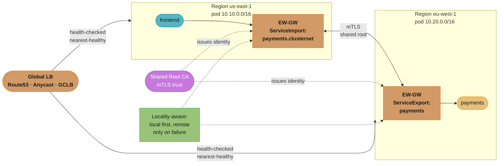
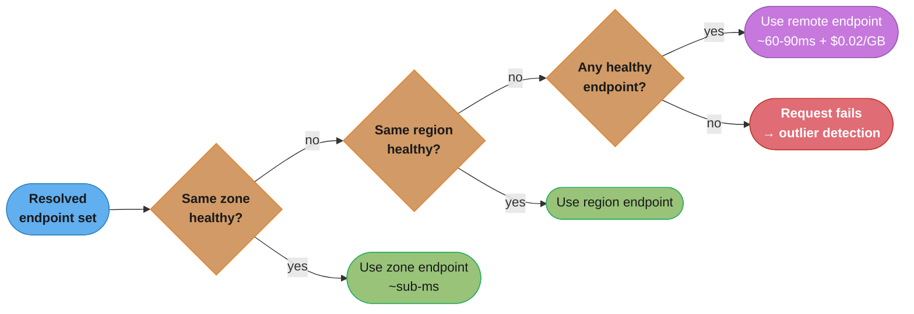
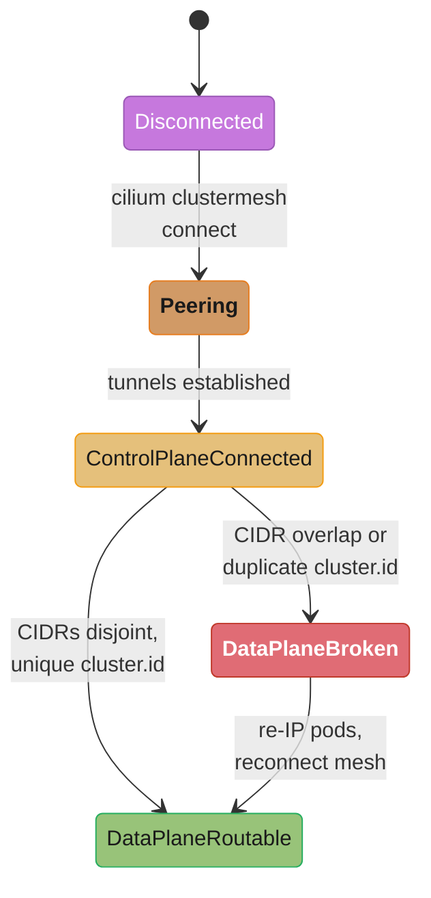

# Multi-Cluster Networking

> Cross-Cutting Primitive — DevOps Case Studies · Difficulty: Advanced

---

## 1. Concept Overview

Multi-cluster networking is the set of techniques that let workloads spanning two or more Kubernetes clusters discover, reach, secure, and load-balance traffic to each other as if they were one logical network — while keeping the clusters independent failure domains. A single cluster has practical ceilings: the upstream-tested soft limit is ~5000 nodes, ~110 pods per node, and ~150,000 pods total, and well before those numbers etcd write pressure, API-server churn, and the size of one shared blast radius push operators to split. Once you have multiple clusters — for regional latency, tenant isolation, blast-radius containment, or compliance — you need cross-cluster service discovery (a Service in cluster A resolvable from cluster B), east-west connectivity (pod-to-pod or pod-to-Service across cluster boundaries), mTLS across the trust boundary, and global load balancing that routes users to the nearest healthy cluster and fails over when one dies.

The hard problems are concrete. **Pod CIDR overlap**: most clusters default to `10.0.0.0/16`-ish ranges, and two clusters with overlapping pod CIDRs cannot route to each other because an IP is ambiguous. **Discovery**: a pod in cluster B needs `payments.prod.svc.clusterset.local` to resolve to endpoints in cluster A. **Security**: mTLS identities must be issued from a shared trust root so cluster A can verify cluster B's workload certs. **Cost**: cross-region traffic is billed — roughly $0.02/GB inter-region within a cloud, and egress to the internet is far more — so a chatty cross-region call path can dominate the bill.

The dominant implementations are service-mesh-based (Cilium Cluster Mesh at the CNI layer, Istio multi-primary or primary-remote at the L7 layer) and the vendor-neutral **MCS API** (Multi-Cluster Services: `ServiceExport`/`ServiceImport`) for standardized cross-cluster discovery, plus Submariner for flat L3 connectivity. This file is the shared reference that DevOps case studies — Kubernetes platform, multi-region DR, autoscaling — link to when they cross a cluster boundary.

---

## 2. Intuition

> **One-line analogy**: It's the difference between two office buildings with their own internal phone extensions versus a single corporate directory where dialing "payments" rings the right desk in whichever building is nearest and answering.

**Mental model**: Each cluster is a sovereign city with its own street grid (pod CIDR). To let citizens travel and trade between cities, you need non-overlapping addresses (or a translation layer), a shared phone book (cross-cluster discovery), passports issued by a common authority (shared mTLS trust root), and a traffic-routing service that sends travelers to the nearest open city and reroutes when one is shut.

**Why it matters**: Teams reflexively reach for multi-cluster to "scale" or "go multi-region," then discover their two clusters were both bootstrapped with `10.0.0.0/16` pod CIDRs and literally cannot route packets to each other. Connectivity is the easy 80%; the failure modes — CIDR overlap, asymmetric mTLS trust, unbounded cross-region data-transfer cost, and split-brain failover — are where production breaks.

**Key insight**: **Multi-cluster networking is fundamentally an addressing-and-trust problem before it is a routing problem.** You cannot mesh clusters whose pod/Service CIDRs collide, and you cannot secure cross-cluster traffic unless both clusters chain to a common root CA. Plan CIDRs and a shared trust root *before* you pick a mesh.

---

## 3. Core Principles

1. **Non-overlapping CIDRs are a prerequisite, not a detail.** Pod, Service, and node CIDRs must be globally unique across clusters that will route to each other (unless you deliberately add NAT/egress-gateway translation, which adds latency and complexity).
2. **Clusters stay independent failure domains.** The whole point is blast-radius containment: a control-plane outage or bad rollout in cluster A must not take down cluster B. Avoid designs that create a shared single point of failure (one global control plane).
3. **Discovery must be explicit and namespaced.** A Service is not globally visible by default; you export it (`ServiceExport`) and it becomes importable, scoped to a clusterset. Implicit global exposure is a security footgun.
4. **Locality-aware routing first, failover second.** Prefer endpoints in the same zone, then same region, then remote — both for latency and to avoid cross-region cost. Spill to remote only on local unavailability.
5. **Shared trust root for mTLS.** All clusters' workload certs must chain to a common root CA so identities are mutually verifiable; per-cluster self-signed roots cannot authenticate each other.
6. **Cross-region traffic is a cost line item.** At ~$0.02/GB inter-region, design to keep request fan-out local; cross-region hops should be deliberate (failover, replication), not the default path.
7. **Global load balancing belongs above the clusters.** Route53/GCLB/Anycast steers users to the nearest healthy region; the mesh handles intra/inter-cluster east-west once traffic lands.

---

## 4. Types / Architectures / Strategies

**Why split into multiple clusters:**
- **Scale ceiling** — past ~5000 nodes / ~150k pods the single control plane strains; shard into regional clusters.
- **Blast radius** — isolate a bad upgrade, a noisy tenant, or a compromised namespace to one cluster.
- **Region / latency** — place clusters near users; serve from the closest.
- **Tenant / compliance isolation** — hard isolation (separate clusters) where namespace isolation is insufficient (regulatory, hostile multi-tenant).

**Connectivity architectures:**
- **Flat L3 (Submariner, Cilium Cluster Mesh tunneling)** — pods route directly to remote pod IPs via encrypted tunnels (IPsec/WireGuard/VXLAN or native routing). Requires non-overlapping CIDRs.
- **Cilium Cluster Mesh** — connects clusters at the eBPF/CNI layer; global Services, identity-aware policy, and pod-to-pod across clusters with low overhead. Needs unique pod CIDRs and a shared cluster ID per cluster.
- **Istio multi-primary** — every cluster runs a full Istiod control plane; symmetric, resilient (no shared control plane SPOF). East-west gateways bridge clusters; endpoints discovered across clusters.
- **Istio primary-remote** — one cluster's Istiod controls remote clusters that have no local control plane; cheaper but the primary is a dependency.

**Discovery strategies:**
- **MCS API (`ServiceExport`/`ServiceImport`)** — Kubernetes-standard; export a Service, consumers resolve `name.namespace.svc.clusterset.local` to aggregated endpoints across clusters.
- **Mesh-native** — Cilium global Services (`service.cilium.io/global: "true"`) or Istio cross-cluster endpoint discovery.

**Global load balancing:**
- **DNS-based** — Route53 latency/geolocation routing, GCLB, with health checks for failover.
- **Anycast** — same IP advertised from multiple regions; the network routes to the nearest PoP.

---

## 5. Architecture Diagrams



*Cross-region hop billed ~$0.02/GB → keep fan-out LOCAL by default.*

---

## 6. How It Works — Detailed Mechanics

**Step 1 — Plan non-overlapping CIDRs.** Allocate distinct pod, Service, and node ranges per cluster *before* provisioning. Example: Cluster A pod `10.10.0.0/16`, Service `10.96.0.0/12`; Cluster B pod `10.20.0.0/16`, Service `10.112.0.0/12`. Overlap here is unrecoverable without redeploying the CNI.

**Step 2 — Establish a shared trust root.** Issue each cluster's intermediate CA from a common root so workload mTLS certs are mutually verifiable. In Istio, plant the same root in each cluster's `cacerts` secret; in Cilium Cluster Mesh, the shared CA backs cross-cluster identities.

**Step 3 — Connect the clusters.** With Cilium Cluster Mesh, each cluster gets a unique `cluster-id` and `cluster-name`, then `cilium clustermesh connect` peers them; the control planes exchange endpoint and identity information over the clustermesh-apiserver.

```bash
# Each cluster must have a UNIQUE id (1-255) and name — collisions break routing.
cilium install --set cluster.name=cluster-a --set cluster.id=1
cilium clustermesh enable --service-type LoadBalancer
cilium clustermesh connect --destination-context cluster-b
cilium clustermesh status --wait   # expect: clusters connected, tunnels up
```

**Step 4 — Export and import Services (MCS API).** Mark a Service exportable; consumers get a `ServiceImport` resolving to aggregated cross-cluster endpoints.

```yaml
# In Cluster B (the producer of "payments"):
apiVersion: multicluster.x-k8s.io/v1alpha1
kind: ServiceExport
metadata:
  name: payments
  namespace: prod
---
# Consumers in Cluster A now resolve:
#   payments.prod.svc.clusterset.local
# which aggregates endpoints from all clusters exporting "payments".
```

**Step 5 — Make routing locality-aware.** Prefer same-zone, then same-region, then remote, so latency and cross-region cost stay low and remote is failover-only.

```yaml
# Istio: weight local endpoints, fail over to remote on local unavailability.
apiVersion: networking.istio.io/v1
kind: DestinationRule
metadata:
  name: payments-locality
spec:
  host: payments.prod.svc.cluster.local
  trafficPolicy:
    outlierDetection:               # eject unhealthy endpoints so failover triggers
      consecutive5xxErrors: 5
      interval: 10s
      baseEjectionTime: 30s
    loadBalancer:
      localityLbSetting:
        enabled: true
        failover:
          - from: us-east-1
            to: eu-west-1
```

**Step 6 — Global load balancing above the clusters.** Route53 latency-based records (one per regional ingress) with health checks send users to the nearest healthy region; on health-check failure the record drops and traffic shifts. Anycast achieves the same at the network layer with a single advertised IP.

```bash
# Route53 latency record per region, each with a health check on its ingress.
# Failover is TTL-bound: TTL=30 → clients re-resolve within ~30s of a region drop.
aws route53 change-resource-record-sets --hosted-zone-id Z123 --change-batch '{
  "Changes": [{
    "Action": "UPSERT",
    "ResourceRecordSet": {
      "Name": "api.streamly.com", "Type": "A", "TTL": 30,
      "SetIdentifier": "us-east-1",
      "Region": "us-east-1",
      "HealthCheckId": "hc-use1",
      "AliasTarget": { "HostedZoneId": "Z35", "DNSName": "use1-ingress.elb.amazonaws.com", "EvaluateTargetHealth": true }
    }
  }]
}'
```

The MCS endpoint aggregation is what makes `payments.prod.svc.clusterset.local` work: the EndpointSlice controller in each cluster mirrors imported endpoints, so a DNS lookup returns both local and remote pod IPs, and the mesh's locality LB then ranks them.

```go
// Conceptual: how a locality-aware LB ranks resolved endpoints before dialing.
func pickEndpoint(eps []Endpoint, self Locality) Endpoint {
    // Tier 1: same zone (sub-ms). Tier 2: same region. Tier 3: remote (~60-90ms + $0.02/GB).
    for _, tier := range []func(Endpoint) bool{
        func(e Endpoint) bool { return e.Zone == self.Zone && e.Healthy },
        func(e Endpoint) bool { return e.Region == self.Region && e.Healthy },
        func(e Endpoint) bool { return e.Healthy }, // remote failover
    } {
        if hit := filter(eps, tier); len(hit) > 0 {
            return roundRobin(hit) // only reach remote when no healthy local exists
        }
    }
    return Endpoint{} // all unhealthy → request fails, surfaces to outlier detection
}
```



*The locality-aware LB walks the tiers in order — same zone, then same region, then any healthy remote — only paying the ~60-90ms RTT and $0.02/GB inter-region cost when every local option is unhealthy; if nothing is healthy anywhere, the request fails and surfaces to outlier detection.*

End-to-end: a user hits the global LB → lands in the nearest region's cluster → frontend calls `payments`, which resolves to *local* endpoints first (sub-ms intra-zone), only crossing to the remote cluster (adding ~60-90ms transcontinental RTT plus $0.02/GB) if local payments is unavailable.

---

## 7. Real-World Examples

- **Cilium Cluster Mesh at scale** — used by large platform teams (e.g. clouds and SaaS running Cilium as CNI) to connect dozens of clusters with global Services and identity-aware network policy at the eBPF layer, avoiding a sidecar per pod.
- **Istio multi-primary** — the documented HA pattern: each cluster runs its own Istiod so no single control plane is a cross-region SPOF; east-west gateways bridge clusters and endpoints are discovered cross-cluster. Common in financial and retail platforms needing regional resilience.
- **Google Anthos / GKE fleets** — productized multi-cluster Services and config management across a fleet, implementing the MCS API for `ServiceExport`/`ServiceImport`-style discovery across GKE clusters and on-prem.
- **AWS EKS + Route53 + Transit Gateway** — regional EKS clusters peered via Transit Gateway with non-overlapping VPC/pod CIDRs, fronted by Route53 latency routing and health checks for regional failover; inter-region data transfer billed at ~$0.02/GB.
- **Submariner (Red Hat / OpenShift)** — connects on-prem and cloud clusters with flat L3 via IPsec/WireGuard tunnels and a Lighthouse component for cross-cluster DNS discovery, used where a full mesh is overkill but pod-to-pod routing is needed.

---

## 8. Tradeoffs

| Dimension | Single large cluster | Multi-cluster (mesh) | Multi-cluster (flat L3 / Submariner) |
|---|---|---|---|
| Scale ceiling | ~5000 nodes / ~150k pods | Sum across clusters | Sum across clusters |
| Blast radius | One shared domain | Isolated per cluster | Isolated per cluster |
| Discovery | Native DNS | MCS API / mesh-native | Lighthouse / DNS |
| mTLS across boundary | N/A | Built-in (shared root) | Add-on |
| Operational complexity | Low | High (mesh + CIDR + trust) | Medium |
| Cross-region cost | N/A | ~$0.02/GB per hop | ~$0.02/GB per hop |
| Locality routing | N/A | Native | Limited |

| Approach | Control-plane SPOF | Sidecar overhead | L7 features | Setup effort |
|---|---|---|---|---|
| Cilium Cluster Mesh | No (per-cluster CNI) | None (eBPF) | L3/L4 + some L7 | Medium |
| Istio multi-primary | No (Istiod per cluster) | Yes (sidecar/ambient) | Full L7 | High |
| Istio primary-remote | Yes (primary) | Yes | Full L7 | Medium |
| Submariner | No | None | L3 only | Medium |

---

## 9. When to Use / When NOT to Use

**Go multi-cluster when:**
- You are approaching the ~5000-node / ~150k-pod single-cluster ceiling or seeing etcd/API-server strain.
- You need hard blast-radius isolation (a bad rollout or noisy tenant must not affect everyone).
- You serve users in multiple regions and want latency-local serving plus regional failover.
- Compliance or hostile multi-tenancy demands cluster-level (not namespace-level) isolation.

**Stay single-cluster when:**
- You are well under the scale ceiling; namespaces + NetworkPolicy + ResourceQuotas give you isolation at a fraction of the operational cost.
- Your team cannot yet operate a service mesh reliably — multi-cluster networking multiplies mesh complexity across clusters.
- Cross-region cost would dominate because your call graph is chatty and not cleanly partitionable by region.

**Do NOT mesh clusters when:**
- Their pod/Service CIDRs overlap and you cannot re-IP — fix addressing first or you are building on sand.
- There is no shared trust root and no path to one — cross-cluster mTLS will not authenticate.
- The "need" is really just HA within one region, which an additional AZ in a single cluster solves more cheaply.

---

## 10. Common Pitfalls

1. **Overlapping pod CIDRs.** The number-one multi-cluster failure: two clusters bootstrapped with the same default range cannot route to each other because a pod IP is ambiguous.

```bash
# BROKEN: both clusters use the default pod CIDR. Cluster mesh "connects"
# but cross-cluster pod traffic is unroutable / silently dropped.
# Cluster A:
cilium install --set ipam.operator.clusterPoolIPv4PodCIDRList=10.0.0.0/16 --set cluster.id=1
# Cluster B:
cilium install --set ipam.operator.clusterPoolIPv4PodCIDRList=10.0.0.0/16 --set cluster.id=2  # SAME CIDR!
```

```bash
# FIX: allocate globally-unique, non-overlapping pod CIDRs per cluster.
# Cluster A:
cilium install --set ipam.operator.clusterPoolIPv4PodCIDRList=10.10.0.0/16 --set cluster.id=1
# Cluster B:
cilium install --set ipam.operator.clusterPoolIPv4PodCIDRList=10.20.0.0/16 --set cluster.id=2
# Verify no overlap BEFORE connecting:  10.10.0.0/16 ∩ 10.20.0.0/16 = ∅
```

2. **Duplicate cluster IDs/names.** Cilium requires a unique `cluster.id` (1-255) and name; collisions corrupt identity mapping and routing.
3. **Per-cluster self-signed roots.** Each cluster trusting only its own root means cross-cluster mTLS handshakes fail; you must plant a shared root CA.
4. **No locality routing → cost and latency explosion.** Without `localityLbSetting`, half your `payments` calls may land cross-region, adding ~60-90ms RTT and $0.02/GB on every request.
5. **Treating multi-cluster as automatic HA.** If both clusters depend on one global control plane (primary-remote) or one shared etcd, you reintroduced the SPOF you split to avoid.
6. **Exporting every Service globally.** MCS exposure is opt-in for a reason; blanket `ServiceExport` widens the attack surface and breaks isolation.
7. **Forgetting outlier detection.** Locality failover only triggers if unhealthy local endpoints are ejected; without `outlierDetection`, traffic keeps hitting a dead local Service instead of failing over.



*Pitfalls 1 and 2 are really one state bug: `cilium clustermesh status` reporting "connected" only confirms the control-plane tunnel came up, not that pod-to-pod traffic is routable — that second, silent state depends entirely on disjoint CIDRs and unique cluster IDs.*

---

## 11. Technologies & Tools

| Tool | Layer | Cross-cluster discovery | mTLS | Notes |
|---|---|---|---|---|
| **Cilium Cluster Mesh** | CNI / eBPF | Global Services | Yes (shared identity) | No sidecar; needs unique CIDR + cluster id |
| **Istio (multi-primary)** | L7 mesh | Endpoint discovery + EW gateway | Yes (shared root) | No control-plane SPOF; full L7 |
| **Submariner** | L3 | Lighthouse DNS | Add-on | Flat pod-to-pod via IPsec/WireGuard |
| **MCS API** | K8s standard | `ServiceExport`/`ServiceImport` | Implementation-dependent | Vendor-neutral discovery contract |
| **Route53 / GCLB** | Global DNS LB | N/A (steers users) | N/A | Latency/geo routing + health-check failover |
| **Linkerd multicluster** | L7 mesh | Mirrored Services + gateway | Yes | Lightweight; gateway-based cross-cluster |

Comparison of global-LB strategies:

| Strategy | Failover speed | Granularity | Caveat |
|---|---|---|---|
| Route53 latency + health check | TTL-bound (30-60s typical) | Per-region | DNS caching delays failover |
| GCLB (anycast Global LB) | Near-instant | Per-backend | GCP-specific |
| Anycast (BGP) | Near-instant | Per-PoP | Requires network/BGP control |

---

## 12. Interview Questions with Answers

**Q: Why would you split into multiple clusters instead of growing one?**
Single clusters hit practical ceilings (~5000 nodes, ~110 pods/node, ~150k pods) where etcd and the API server strain, and one cluster is one blast radius — a bad upgrade or noisy tenant affects everything. Multi-cluster gives independent failure domains, regional latency-local serving, and hard tenant isolation. You trade those benefits for substantial networking and operational complexity.

**Q: What is the pod CIDR overlap problem and how do you solve it?**
If two clusters use overlapping pod CIDRs (e.g. both `10.0.0.0/16`), a pod IP is ambiguous and packets cannot be routed between clusters. The clean fix is allocating globally-unique, non-overlapping ranges per cluster *before* provisioning the CNI, since changing it later means redeploying networking. If re-IPing is impossible, you can add an egress-gateway/NAT translation layer, but that adds latency and complexity.

**Q: Compare Cilium Cluster Mesh and Istio multi-primary for cross-cluster connectivity.**
Cilium Cluster Mesh works at the eBPF/CNI layer with no sidecar, giving low-overhead L3/L4 cross-cluster routing and identity-aware policy; Istio multi-primary works at L7 with a full Istiod per cluster and east-west gateways, giving rich traffic management and observability at the cost of sidecar (or ambient) overhead. Both avoid a control-plane SPOF. Choose Cilium for raw connectivity and policy efficiency, Istio when you need L7 routing, retries, and fine-grained traffic shifting.

**Q: How does cross-cluster service discovery work with the MCS API?**
You create a `ServiceExport` for a Service in its producing cluster, which makes it importable; consuming clusters get a `ServiceImport` and resolve `name.namespace.svc.clusterset.local` to endpoints aggregated across all exporting clusters. It is opt-in and namespaced, so Services are not globally visible by default. The mesh or CNI implementation backs the actual endpoint aggregation and routing.

**Q: Why is a shared trust root mandatory for cross-cluster mTLS?**
Each workload presents a cert during the mTLS handshake, and the verifier must chain it to a trusted root; if each cluster only trusts its own self-signed root, certs from another cluster fail verification. Planting a common root CA (with per-cluster intermediates) makes identities mutually verifiable. Without it, cross-cluster calls fail the handshake regardless of connectivity.

**Q: What is locality-aware routing and why does it matter for cost?**
It routes requests to the nearest endpoints — same zone, then same region, then remote — falling over to remote only when local endpoints are unhealthy. Beyond latency (cross-region adds ~60-90ms RTT), it controls cost: inter-region transfer is ~$0.02/GB, so a request path that needlessly crosses regions multiplies your data-transfer bill. You configure it (e.g. Istio `localityLbSetting`) plus outlier detection so failover actually triggers.

**Q: How do you do global load balancing across regional clusters?**
Above the clusters, use DNS-based steering (Route53 latency/geolocation routing or GCLB) with health checks pointing at each region's ingress, or Anycast advertising one IP from multiple regions. The global LB sends users to the nearest healthy region and removes a region on health-check failure; the mesh then handles east-west routing once traffic lands. DNS-based failover is TTL-bound (tens of seconds) while Anycast is near-instant.

**Q: A user request to "payments" is unexpectedly going cross-region. What likely went wrong?**
Locality-aware routing is probably not configured, so the load balancer spreads across all endpoints including the remote cluster, or outlier detection is missing so unhealthy local endpoints are not ejected and failover/spread behaves oddly. The fix is enabling `localityLbSetting` to prefer local endpoints plus `outlierDetection` to eject unhealthy ones. Verify pod CIDRs and that local `payments` endpoints are actually healthy.

**Q: Why is "multi-cluster" not automatically "highly available"?**
If both clusters share a single dependency — one global control plane (Istio primary-remote), one shared etcd, or one global LB with no failover — you have reintroduced a single point of failure. True HA requires independent control planes per cluster (multi-primary), health-checked global LB failover, and no cross-cluster hard dependency in the critical path. Splitting clusters without removing shared dependencies just adds complexity without resilience.

**Q: When should you stay single-cluster?**
When you are well under the scale ceiling and your isolation needs are met by namespaces, NetworkPolicy, and ResourceQuotas — these cost a fraction of multi-cluster networking. Also stay single-cluster if your team cannot yet reliably operate a mesh, or if your call graph is too chatty to partition by region without cost blowups. Adding an AZ within one cluster often solves "HA" more cheaply than a second cluster.

**Q: What does Submariner provide and when would you choose it over a mesh?**
Submariner provides flat L3 pod-to-pod connectivity across clusters via encrypted IPsec/WireGuard tunnels, with a Lighthouse component for cross-cluster DNS discovery. Choose it when you need pods in different clusters (including on-prem to cloud) to route to each other directly but do not need full L7 mesh features like retries, traffic shifting, or per-request policy. It is lower-overhead than a full service mesh for pure connectivity.

**Q: How do you keep cross-region data-transfer cost under control?**
Partition workloads so request fan-out stays within a region, enable locality-aware routing so cross-region is failover-only, and reserve deliberate cross-region traffic for replication and DR rather than the hot path. At ~$0.02/GB inter-region, a service mesh dashboard or cloud cost report broken down by cross-AZ/cross-region byte counts surfaces offenders. Co-locate tightly-coupled services and cache aggressively to avoid repeated cross-region reads.

**Q: What breaks if two clusters in a Cilium mesh have the same cluster ID?**
Cilium uses the cluster ID (1-255) as part of identity and endpoint encoding, so duplicate IDs corrupt cross-cluster identity mapping and cause misrouted or dropped traffic and broken network policy. Each cluster must have a unique ID and name set at install time. Fixing it after the fact requires reconfiguring and reconnecting the mesh, so allocate IDs deliberately up front.

**Q: How does failover actually trigger when a local Service becomes unhealthy?**
The mesh's outlier detection ejects endpoints that exceed an error threshold (e.g. 5 consecutive 5xx over a 10s interval), removing them from the local locality's endpoint pool; once no healthy local endpoints remain, the locality LB setting's failover policy directs traffic to the configured remote region. Without outlier detection, the LB keeps sending traffic to the dead local endpoints and failover never fires. So failover is the combination of ejection (detect) plus locality failover (redirect).

**Q: What is the difference between Istio multi-primary and primary-remote?**
Multi-primary runs a full Istiod control plane in every cluster, so each cluster is self-sufficient and there is no cross-cluster control-plane dependency — the resilient choice. Primary-remote has one cluster's Istiod control remote clusters that lack a local control plane, which is cheaper to run but makes the primary a dependency: if it is unreachable, remote clusters lose control-plane functions. Choose multi-primary for resilience, primary-remote to economize when a control-plane dependency is acceptable.

---

## 13. Best Practices

1. **Plan non-overlapping pod/Service/node CIDRs before provisioning** — this is irreversible-ish later.
2. **Assign unique cluster IDs and names** (Cilium 1-255) deliberately, documented in one source of truth.
3. **Establish a shared root CA** with per-cluster intermediates before enabling cross-cluster mTLS.
4. **Enable locality-aware routing plus outlier detection** so traffic prefers local and fails over correctly.
5. **Keep each cluster an independent failure domain** — prefer multi-primary control planes; avoid shared etcd/control plane.
6. **Export Services explicitly and minimally** via MCS `ServiceExport`; do not expose everything globally.
7. **Front clusters with health-checked global LB** (Route53 latency / GCLB / Anycast) for regional failover.
8. **Budget and monitor cross-region transfer** at ~$0.02/GB; design for region-local fan-out.
9. **Verify CIDR disjointness and mesh status** (`cilium clustermesh status`) before sending production traffic.
10. **Use short DNS TTLs** for global LB records so DNS-based failover is timely (but not so short you hammer resolvers).
11. **Test failover regularly** — kill a region in a game day and confirm traffic shifts within SLA.
12. Cross-reference [Kubernetes Networking](../../kubernetes_networking/README.md) for intra-cluster CNI and policy fundamentals and [Cloud Networking & CDN](../../cloud_networking_and_cdn/README.md) for global LB, Anycast, and inter-region transit details.

---

## 14. Case Study

**Scenario.** "Streamly," a media platform, runs one large EKS cluster in us-east-1 that has grown to ~4200 nodes and is showing etcd write latency spikes and slow API-server responses during deploys. They also want EU users (currently ~140ms RTT to us-east-1) served locally. The plan: stand up a second cluster in eu-west-1, connect them with Cilium Cluster Mesh, export `payments` and `catalog` via MCS, front both with Route53 latency routing, and add locality-aware routing so EU traffic stays in EU. Targets: EU p50 latency from ~150ms to ~25ms; regional failover within ~60s; cross-region traffic limited to replication and failover only.

During the build, the second cluster is provisioned by copying the first cluster's Terraform, including its CNI config — and cross-cluster pod traffic silently fails after `cilium clustermesh connect` reports "connected."

```bash
# BROKEN: eu-west-1 cluster was cloned from us-east-1's config, inheriting
# the SAME pod CIDR. Mesh "connects" but cross-cluster routing is ambiguous.
# us-east-1:
cilium install --set ipam.operator.clusterPoolIPv4PodCIDRList=10.0.0.0/16 --set cluster.id=1 --set cluster.name=use1
# eu-west-1 (cloned):
cilium install --set ipam.operator.clusterPoolIPv4PodCIDRList=10.0.0.0/16 --set cluster.id=1 --set cluster.name=use1
# Same CIDR AND same cluster.id/name → identity collisions + unroutable pods.
```

```bash
# FIX: unique non-overlapping CIDRs and unique cluster identity per cluster.
# us-east-1:
cilium install --set ipam.operator.clusterPoolIPv4PodCIDRList=10.10.0.0/16 \
  --set cluster.id=1 --set cluster.name=use1
# eu-west-1:
cilium install --set ipam.operator.clusterPoolIPv4PodCIDRList=10.20.0.0/16 \
  --set cluster.id=2 --set cluster.name=euw1
# Verify before connecting:
cilium clustermesh status --wait     # expect both clusters, tunnels established
# 10.10.0.0/16 ∩ 10.20.0.0/16 = ∅ ; cluster.id 1 ≠ 2 ; names distinct
```

After fixing CIDRs and identities, they export Services and add locality routing so EU `payments` calls resolve to EU endpoints first, only spilling to us-east-1 if EU `payments` is unhealthy. Route53 latency records with health checks send EU users to eu-west-1 and fail the region over to us-east-1 on health-check failure (TTL set to 30s for ~60s failover).

**Outcome.** EU p50 drops to ~24ms, the us-east-1 cluster is relieved by moving EU workloads out (node count falls below the etcd strain threshold), and cross-region traffic is now only DR replication plus rare failover — measured at under 3% of total bytes, keeping the ~$0.02/GB line item negligible. A game-day test killing eu-west-1 ingress shifts traffic to us-east-1 in ~50s. The recurring lesson: multi-cluster networking is an addressing-and-identity problem first — the mesh connected fine, but cloning a cluster's CIDR and cluster ID guaranteed unroutable traffic until the addresses and identities were made globally unique.
