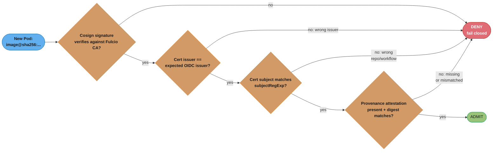
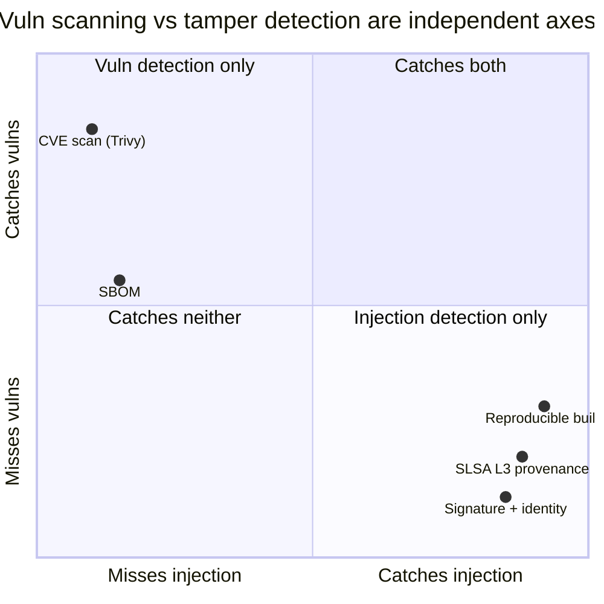

# Supply Chain Security Pipeline

> Cross-Cutting Primitive — DevOps Case Studies · Difficulty: Advanced

---

## 1. Concept Overview

A supply chain security pipeline is the end-to-end chain of controls that takes a source commit and turns it into a deployable artifact whose **origin, contents, and integrity are cryptographically verifiable** at the moment it is admitted to a cluster. The canonical flow is `build → SBOM → scan → sign → attest → admission-gate`: you build the artifact (ideally hermetically), generate a Software Bill of Materials (SBOM) enumerating every dependency, scan that SBOM and image for known CVEs, sign the digest with a key (or keylessly via OIDC), wrap build metadata in signed in-toto attestations (provenance, SBOM, vuln scan), and finally refuse to run any image at the Kubernetes admission boundary unless every one of those signatures verifies against an expected signer identity.

The threat this addresses is not a vulnerable dependency you chose on purpose — it is a malicious artifact injected somewhere between source and deploy. SolarWinds (2020) compromised the *build server* and injected a backdoor into a legitimately-signed binary. Codecov (2021) altered a bash uploader script to exfiltrate CI secrets. xz-utils (2024) planted a backdoor in release tarballs that did not exist in the git source. In all three, the artifact users consumed differed from the source they could audit. A supply chain pipeline closes that gap by making provenance — *what built this, from what source, with what builder* — a non-forgeable, machine-checkable property.

SLSA (Supply-chain Levels for Software Artifacts) is the framework that grades how strong those guarantees are, from L1 (provenance exists) to L3 (provenance is generated by a hardened, isolated builder and is non-falsifiable). Sigstore (cosign + Fulcio + Rekor) is the dominant open implementation that makes signing keyless and publicly auditable. This file is the shared reference that DevOps case studies — CI/CD platform, container registry, GitOps delivery — link to when they need the security-of-the-pipeline-itself layer rather than the delivery mechanics.

---

## 2. Intuition

> **One-line analogy**: A tamper-evident shipping seal plus a notarized chain-of-custody log — you don't trust the box because it looks fine, you trust it because the seal verifies and the notary publicly recorded who sealed it and when.

**Mental model**: Every artifact carries a verifiable passport stamped at each border crossing: a manifest of what's inside (SBOM), a customs inspection record (scan), a signature proving who packed it (cosign), and an itinerary proving the route it took (provenance attestation). The admission controller is the border guard who refuses entry if any stamp is missing, expired, or signed by the wrong authority.

**Why it matters**: An attacker who compromises one CI runner can inject a backdoor into an otherwise-legitimate release, and traditional code review never sees it because the malicious code is added *after* the source is approved. Signing the source is not enough — you must sign and verify the *built artifact* and prove which builder produced it, or you are trusting infrastructure you cannot audit.

**Key insight**: **A signature only proves identity if you verify *who* signed, not merely *that* something signed.** The most common production failure is an admission policy that checks "is this image signed?" and passes — an attacker's own valid cosign signature satisfies that. The control that matters is binding the signature to an expected OIDC identity (e.g. `https://github.com/acme/repo/.github/workflows/release.yml@refs/tags/*`) and an expected issuer.

---

## 3. Core Principles

1. **Verify the artifact, not the source.** Source review catches malicious commits; it does not catch build-time injection (SolarWinds). The deployable digest is what must be signed and gated.
2. **Provenance must be non-falsifiable.** SLSA L3 requires provenance generated *inside* the trusted builder, where the build steps themselves cannot forge it. A provenance file the build script writes itself is L1, not L3.
3. **Identity over key possession.** Keyless signing binds a signature to a short-lived OIDC identity (a workflow, a service account) rather than a long-lived private key that can leak. The cert lives ~10 minutes; the identity is what you pin.
4. **Public transparency.** Every signature is recorded in an append-only, tamper-evident log (Rekor) so that even the signer cannot later deny or alter what they signed, and defenders can audit for anomalies.
5. **Fail closed at admission.** The gate's default is *deny*. An unsigned, unscanned, or wrongly-signed image must never run. A gate that fails open on policy-engine error is not a gate.
6. **Defense in depth across the chain.** SBOM + scan + signature + provenance are independent controls; compromising one (e.g. a stale CVE DB) should not silently bypass the others.
7. **Reproducibility enables verification.** A hermetic, reproducible build lets a third party rebuild from source and bit-for-bit confirm the artifact, the strongest possible anti-tamper check.

---

## 4. Types / Architectures / Strategies

**SLSA build levels:**
- **L1** — Provenance exists and is available, but may be incomplete or self-asserted by the build script. Stops accidental "where did this come from" gaps; stops no attacker.
- **L2** — Build runs on a hosted service that generates *signed* provenance. The signature ties provenance to the platform, raising the bar.
- **L3** — Provenance is generated by a hardened, isolated builder where build steps cannot influence or forge it (e.g. GitHub's SLSA generator running in an isolated reusable workflow). Provenance is **non-falsifiable**. This is the practical target for production.
- **L4** (deprecated in SLSA v1.0; folded into stricter L3 + hermetic/reproducible) — two-party review + hermetic builds.

**Signing strategies:**
- **Key-based (cosign with a KMS key)** — `cosign sign --key awskms://...`. You own a long-lived key in AWS KMS / GCP KMS / Vault. Simple, but key rotation and access control are now your problem.
- **Keyless (cosign + Fulcio + Rekor)** — no stored key. Fulcio issues a ~10-minute X.509 cert bound to an OIDC identity; the signature and cert are logged to Rekor. Preferred for CI because there is no secret to leak.

**Attestation strategies:**
- **in-toto attestations** — signed statements about an artifact: SLSA provenance (`predicateType: https://slsa.dev/provenance/v1`), SBOM attestation, vuln-scan attestation. Each is a cosign-signed envelope over a predicate.

**Admission-gate strategies:**
- **sigstore policy-controller** — purpose-built for verifying cosign signatures and attestations.
- **Kyverno** — `verifyImages` rules; native cosign keyless support, declarative.
- **Gatekeeper / OPA** — Rego policies; more general, you wire in image verification via providers.

---

## 5. Architecture Diagrams

```mermaid
flowchart LR
    classDef io      fill:#61afef,stroke:#2e86c1,color:#1a1a1a,font-weight:bold
    classDef frozen  fill:#c678dd,stroke:#9b59b6,color:#fff
    classDef train   fill:#98c379,stroke:#27ae60,color:#1a1a1a
    classDef mathOp  fill:#d19a66,stroke:#e67e22,color:#1a1a1a,font-weight:bold
    classDef lossN   fill:#e06c75,stroke:#c0392b,color:#fff,font-weight:bold
    classDef req     fill:#56b6c2,stroke:#0097a7,color:#1a1a1a
    classDef base    fill:#e5c07b,stroke:#f39c12,color:#1a1a1a

    push(["git push tag<br/>v1.2.3"])

    subgraph CI["CI: GitHub Actions<br/>OIDC-federated, no long-lived keys"]
        direction TB
        build("1. Hermetic build<br/>→ image@sha256 digest")
        sbom("2. syft<br/>→ SBOM (CycloneDX / SPDX)")
        scan("3. trivy / grype<br/>→ vuln scan (CRITICAL gate)")
        sign("4. cosign sign")
        attest("5. cosign attest<br/>→ OIDC token")
        build --> sbom --> scan --> sign --> attest
    end

    fulcio("Fulcio CA<br/>~10-min X.509<br/>bound to OIDC")
    rekor("Rekor<br/>transparency log<br/>append-only")
    registry(["OCI Registry<br/>image + .sig + .att"])
    admission{"K8s admission:<br/>sig + identity<br/>+ provenance match?"}
    admit(["PASS → admit"])
    deny(["FAIL → deny<br/>fail closed"])

    push --> build
    attest -->|"request cert"| fulcio
    fulcio -.->|"log entry"| rekor
    fulcio -->|"sig + cert<br/>+ attestations"| registry
    registry -->|"kubectl apply /<br/>GitOps sync"| admission
    admission -->|"PASS"| admit
    admission -->|"FAIL"| deny

    class push io
    class build,sbom,scan,sign,attest mathOp
    class fulcio,rekor frozen
    class registry base
    class admission mathOp
    class admit train
    class deny lossN
```



*The canonical `build → SBOM → scan → sign → attest → admission-gate` flow: CI mints a short-lived Fulcio certificate from its OIDC identity, Rekor logs the signing event, and the registry-stored signature, cert, and attestations travel with the digest to the Kubernetes admission gate, which fails closed unless signature, identity, and provenance all verify.*

---

## 6. How It Works — Detailed Mechanics

**Step 1 — Hermetic build & digest pinning.** The build runs with no network egress except a vetted dependency proxy, producing `image@sha256:...`. Everything downstream references the *digest*, never a mutable tag, because tags can be repointed.

**Step 2 — Generate the SBOM with syft.** syft introspects the image filesystem and package managers (apk, dpkg, npm, pip, go.mod) and emits CycloneDX or SPDX.

```bash
# CycloneDX JSON, attached as an attestation later
syft "myregistry/app@sha256:abcd..." \
  -o cyclonedx-json=sbom.cdx.json
# Typical SBOM for a Go service: ~120-400 components; for a Node image: 1500-4000.
```

**Step 3 — Scan and gate on severity.** Trivy resolves CVEs against its vuln DB (~600MB, refreshed every 6h).

```bash
# Fail the build on any fixable CRITICAL; ignore unfixed to reduce noise
trivy image \
  --severity CRITICAL \
  --ignore-unfixed \
  --exit-code 1 \
  --scanners vuln \
  "myregistry/app@sha256:abcd..."
# Exit 1 fails the CI job. Scan time: ~3-8s for a 200MB image after DB warm.
```

**Step 4 — Keyless sign with cosign.** In GitHub Actions, the runner has an OIDC token. cosign exchanges it with Fulcio for a ~10-minute cert, signs the digest, and uploads the entry to Rekor.

```bash
# COSIGN_EXPERIMENTAL not needed since cosign 2.x; keyless is default with --yes
cosign sign --yes "myregistry/app@sha256:abcd..."
# cosign verify round-trip is ~200ms; the Rekor inclusion proof is what makes it auditable.
```

**Step 5 — Attach attestations (in-toto).** Wrap the SBOM and provenance as signed predicates bound to the same digest.

```bash
cosign attest --yes \
  --predicate sbom.cdx.json \
  --type cyclonedx \
  "myregistry/app@sha256:abcd..."

cosign attest --yes \
  --predicate provenance.json \
  --type slsaprovenance \
  "myregistry/app@sha256:abcd..."
```

**Step 6 — Verify at admission.** The cluster runs sigstore policy-controller. A ClusterImagePolicy pins both the identity regexp and the issuer.

```yaml
apiVersion: policy.sigstore.dev/v1beta1
kind: ClusterImagePolicy
metadata:
  name: require-acme-keyless
spec:
  images:
    - glob: "myregistry/**"
  authorities:
    - keyless:
        url: https://fulcio.sigstore.dev
        identities:
          # BOTH must match — this is the load-bearing control
          - issuer: https://token.actions.githubusercontent.com
            subjectRegExp: "^https://github.com/acme/app/.github/workflows/release.yml@refs/tags/.*$"
      ctlog:
        url: https://rekor.sigstore.dev
```

When a Pod is created, the webhook resolves the image to its digest, fetches the `.sig`/`.att` referrers from the registry, verifies the cosign signature against Fulcio's CA, confirms the signing cert's SAN matches `subjectRegExp` and `issuer`, and checks the Rekor inclusion proof. End-to-end admission verification adds ~150-400ms per new image (cached thereafter).



*Checking "is this image signed?" alone — the single most common admission-policy mistake — only satisfies the first gate; an attacker's own valid keyless signature passes it too. Only after the cert's issuer, its subject regex, and a matching provenance attestation all also verify does the Pod admit — any single "no" fails closed to DENY.*

**Putting it together — the full CI workflow.** The OIDC permission (`id-token: write`) is what lets the runner mint a token Fulcio trusts; no secret is stored.

```yaml
# .github/workflows/release.yml — runs only on tag push
name: release
on:
  push:
    tags: ["v*"]
permissions:
  contents: read
  id-token: write        # mint OIDC token for keyless signing — the key control
  packages: write        # push to GHCR
jobs:
  build-sign-attest:
    runs-on: ubuntu-latest
    steps:
      - uses: actions/checkout@v4
      - id: build
        run: |
          DIGEST=$(docker buildx build --push \
            -t ghcr.io/acme/app:${GITHUB_REF_NAME} \
            --metadata-file meta.json . && jq -r '."containerimage.digest"' meta.json)
          echo "digest=ghcr.io/acme/app@${DIGEST}" >> "$GITHUB_OUTPUT"
      - uses: anchore/sbom-action@v0          # syft under the hood
        with:
          image: ${{ steps.build.outputs.digest }}
          format: cyclonedx-json
          output-file: sbom.cdx.json
      - uses: aquasecurity/trivy-action@master
        with:
          image-ref: ${{ steps.build.outputs.digest }}
          severity: CRITICAL
          ignore-unfixed: true
          exit-code: "1"                      # CRITICAL fails the release
      - uses: sigstore/cosign-installer@v3
      - run: |
          cosign sign --yes ${{ steps.build.outputs.digest }}
          cosign attest --yes --type cyclonedx \
            --predicate sbom.cdx.json ${{ steps.build.outputs.digest }}
```

**Verifying from the CLI** (what a consumer or auditor runs) mirrors what the admission webhook does:

```bash
cosign verify ghcr.io/acme/app@sha256:abcd... \
  --certificate-identity-regexp \
    "^https://github.com/acme/app/.github/workflows/release.yml@refs/tags/v.*$" \
  --certificate-oidc-issuer https://token.actions.githubusercontent.com
# Confirms: signature valid, cert SAN matches identity, Rekor inclusion proof present.
```

**Kyverno alternative** for the same gate, for shops that prefer one policy engine over the dedicated controller:

```yaml
apiVersion: kyverno.io/v1
kind: ClusterPolicy
metadata:
  name: verify-acme-images
spec:
  validationFailureAction: Enforce       # fail closed
  webhookTimeoutSeconds: 10
  rules:
    - name: check-keyless-signature
      match:
        any:
          - resources: { kinds: [Pod] }
      verifyImages:
        - imageReferences: ["ghcr.io/acme/*"]
          attestors:
            - entries:
                - keyless:
                    issuer: https://token.actions.githubusercontent.com
                    subject: "https://github.com/acme/app/.github/workflows/release.yml@refs/tags/*"
                    rekor:
                      url: https://rekor.sigstore.dev
```

---

## 7. Real-World Examples

- **Kubernetes project** signs all release artifacts and container images with cosign keyless and publishes provenance; `cosign verify-blob --certificate-identity-regexp` is the documented consumer flow. This is the largest production keyless deployment.
- **GitHub** ships the SLSA L3 provenance generator as a reusable workflow (`slsa-framework/slsa-github-generator`) that runs in an isolated context the caller cannot tamper with, producing non-falsifiable provenance. Also offers `actions/attest-build-provenance` writing to GitHub's own transparency log.
- **Google Cloud Build / Binary Authorization** generates provenance and enforces attestation-based admission on GKE; you cannot deploy to a Binary-Authorization-enforced cluster without a matching attestation from an approved attestor.
- **Chainguard** ships "Wolfi" base images that are continuously rebuilt to drive CRITICAL CVE counts toward zero and are cosign-signed with provenance by default — a direct response to scan-gate friction.
- **xz-utils backdoor (CVE-2024-3094)** is the canonical "why provenance" case: the malicious payload existed in the *release tarball* but not the git tree. A reproducible-build verifier comparing tarball-to-source would have flagged the divergence.

---

## 8. Tradeoffs

| Dimension | Keyless (Fulcio/Rekor) | Key-based (KMS) | No signing (scan only) |
|---|---|---|---|
| Secret to leak | None (10-min cert) | Long-lived KMS key | N/A |
| Setup complexity | Medium (OIDC wiring) | Low | Lowest |
| Public auditability | Yes (Rekor) | Only if you log | None |
| Air-gapped support | Hard (needs Fulcio/Rekor or private Sigstore) | Easy | Easy |
| Identity binding | Strong (OIDC subject) | Weak (key = anyone with key) | None |
| Revocation story | Cert expires in 10 min | Manual key rotation | N/A |
| Tamper detection | Build-time injection caught | Only post-key-theft | Misses injection entirely |

| Control | Catches accidental vuln | Catches malicious injection | Cost / friction |
|---|---|---|---|
| CVE scan (Trivy) | Yes | No (zero-day backdoor) | Low (DB ~600MB) |
| SBOM | Enables later vuln lookup | No (on its own) | Low |
| Signature + identity | No | Yes (wrong signer rejected) | Medium |
| SLSA L3 provenance | No | Yes (builder tamper caught) | High (hardened builder) |
| Reproducible build | No | Yes (bit-for-bit divergence) | Highest |



*Reading the table above as coordinates: scanning and SBOMs land in the vuln-detection-only quadrant while signing, SLSA L3 provenance, and reproducible builds land in the injection-detection-only quadrant — no single control reaches "catches both," which is exactly why Core Principle #6 (defense in depth) requires layering controls from each side.*

---

## 9. When to Use / When NOT to Use

**Use the full pipeline when:**
- You deploy third-party or community base images and cannot fully audit them.
- You are subject to regulatory mandates (US EO 14028 / NIST SSDF, FedRAMP, PCI) requiring SBOMs and provenance.
- Your CI runners are shared or hosted, making build-time injection a realistic threat.
- You ship software others consume (you are *in someone else's* supply chain).

**Use a subset (scan + SBOM, defer signing) when:**
- You are early-stage with a single trusted internal builder and no external consumers — start with scan gates, add signing before you scale CI.

**Do NOT over-invest when:**
- Fully air-gapped with no OIDC IdP and no appetite to run private Sigstore infra — key-based signing is more pragmatic than forcing keyless.
- A throwaway prototype with no production deployment path — admission gating adds latency and operational burden with no payoff.
- You have not yet pinned images by digest — signing mutable tags gives false assurance; fix tag-pinning first.

---

## 10. Common Pitfalls

1. **Verifying that something signed, not who signed.** The single most dangerous mistake.

```yaml
# BROKEN: passes for ANY valid cosign signature, including the attacker's own.
authorities:
  - keyless:
      url: https://fulcio.sigstore.dev
      # No identities block → "is it signed?" → yes → admit. Useless.
```

```yaml
# FIX: bind to the exact OIDC subject AND issuer. Attacker's signature now fails.
authorities:
  - keyless:
      url: https://fulcio.sigstore.dev
      identities:
        - issuer: https://token.actions.githubusercontent.com
          subjectRegExp: "^https://github.com/acme/app/.github/workflows/release.yml@refs/tags/.*$"
      ctlog:
        url: https://rekor.sigstore.dev
```

2. **Stale Trivy DB.** A scan gate is only as fresh as its vuln DB. A runner with a 3-week-old cached DB passes images with newly-disclosed CRITICALs. Force a DB refresh or fail if DB age > 24h.
3. **Signing a tag, not a digest.** `cosign sign app:latest` signs whatever `latest` points to *now*; repoint the tag and the signature is meaningless. Always sign `@sha256:...`.
4. **Fail-open admission.** If the policy webhook times out and `failurePolicy: Ignore`, every image admits during the outage — exactly when an attacker wants it. Use `failurePolicy: Fail` for the verification webhook.
5. **Self-asserted provenance counted as L3.** A provenance file your build script writes is L1. Only provenance from an isolated, non-falsifiable builder is L3.
6. **Ignoring unfixed CVEs without tracking.** `--ignore-unfixed` reduces noise but can hide a CRITICAL with no patch; route those to a risk-acceptance register, do not silently drop.
7. **Long-lived KMS key in CI env vars.** Defeats the point — that's the SolarWinds key-theft vector. Prefer keyless or KMS with short-lived federated credentials.

---

## 11. Technologies & Tools

| Tool | Role | Format / Output | Notes |
|---|---|---|---|
| **syft** | SBOM generation | CycloneDX, SPDX | Fast filesystem + package introspection; pairs with grype |
| **Trivy** | Vuln + SBOM + IaC scan | SARIF, JSON, table | DB ~600MB, 6h refresh; `--exit-code 1` to gate |
| **Grype** | Vuln scan from SBOM | JSON, table | Consumes syft SBOM directly; SBOM-driven scanning |
| **cosign** | Sign + attest + verify | OCI artifacts (.sig/.att) | Keyless default in 2.x; verify ~200ms round-trip |
| **Fulcio** | Keyless CA | ~10-min X.509 cert | Issues cert bound to OIDC identity SAN |
| **Rekor** | Transparency log | Append-only Merkle log | Inclusion proof = non-repudiation |
| **Kyverno / policy-controller** | Admission verification | ClusterImagePolicy / verifyImages | Pin issuer + subjectRegExp; fail closed |

Comparison of admission verifiers:

| Verifier | Cosign keyless | Provenance check | Policy language | Best for |
|---|---|---|---|---|
| sigstore policy-controller | Native | Native attestation match | CRD (ClusterImagePolicy) | Pure Sigstore shops |
| Kyverno | Native (`verifyImages`) | Yes (attestations block) | YAML/CRD | Declarative, no Rego |
| Gatekeeper/OPA | Via external data/provider | Manual | Rego | General policy + admission |

---

## 12. Interview Questions with Answers

**Q: Why isn't signing the source code in git enough to secure the supply chain?**
Because the threat is build-time injection, which happens *after* the source is approved. SolarWinds compromised the build server and inserted a backdoor into a binary that was then legitimately signed; the git source was clean. You must sign and verify the built artifact's digest and prove which builder produced it, so a tampered build is detectable even when the source review passed.

**Q: What is the single most common mistake in admission-time signature verification?**
Checking that an image is signed without checking *who* signed it. An attacker can produce their own valid cosign signature, so a policy with no identity constraint admits malicious images. The fix is pinning the OIDC `issuer` and a `subjectRegExp` matching your exact release workflow identity.

**Q: Explain SLSA levels 1 through 3 and what "non-falsifiable" means.**
L1 means provenance exists but may be self-asserted by the build script; L2 means the provenance is signed by a hosted build platform; L3 means provenance is generated by a hardened, isolated builder whose build steps cannot forge or influence it. "Non-falsifiable" at L3 means even a fully-compromised build step cannot produce fake provenance, because the provenance generation runs outside the step's control.

**Q: How does keyless signing avoid having a private key to steal?**
cosign exchanges a short-lived OIDC token (the CI runner's identity) with Fulcio, which issues an X.509 cert valid for ~10 minutes bound to that identity. The signing happens within that window and the cert + signature are logged to Rekor; nothing long-lived is stored. The identity, not a key, is what verifiers pin, so there is no secret to leak from CI.

**Q: What does Rekor provide that a plain signature does not?**
Rekor is an append-only, tamper-evident transparency log that records every signing event with an inclusion proof. It gives non-repudiation (the signer cannot later deny signing) and auditability (defenders can monitor for unexpected signing identities or volumes). It also lets verifiers confirm a signature was made while the short-lived Fulcio cert was valid.

**Q: Why must you sign an image digest rather than a tag?**
Tags are mutable pointers; `latest` can be repointed to a different image after signing, breaking the binding between signature and content. Signing `@sha256:...` ties the signature to immutable content. Admission controllers should also resolve tags to digests before verifying.

**Q: A scan gate passes an image, but a CRITICAL CVE is disclosed two hours later. What failed and how do you mitigate?**
Nothing "failed" at scan time — the scan reflects the DB state then. The mitigation is continuous re-scanning of running images (admission is a point-in-time check, not ongoing) plus alerting on newly-matched CVEs against your SBOM inventory. Keep the Trivy DB fresh (it refreshes ~every 6h) and fail builds if the local DB is older than ~24h.

**Q: What is the difference between an SBOM and a provenance attestation?**
An SBOM enumerates *what is inside* the artifact (every package and version); provenance describes *how the artifact was produced* (source repo, commit, builder, build parameters). SBOM answers "am I affected by CVE-X"; provenance answers "did the right builder build this from the right source." Both are typically attached as signed in-toto attestations.

**Q: How would you secure CI against the SolarWinds-style key-theft attack?**
Eliminate long-lived signing keys from CI by using keyless signing federated through OIDC, so a runner compromise yields at most a 10-minute window bound to a specific identity rather than a reusable key. Harden and isolate the builder (SLSA L3), restrict network egress to a vetted proxy, and ensure provenance generation is non-falsifiable so a compromised build step cannot fake its own legitimacy.

**Q: Why is `failurePolicy: Fail` important on the verification webhook?**
With `failurePolicy: Ignore`, if the admission webhook is unavailable, all images admit unverified — the failure mode opens exactly the gate you built. `Fail` ensures unverifiable images are denied (fail closed). You mitigate availability risk with multiple webhook replicas and tight timeouts rather than by failing open.

**Q: What does a reproducible build add on top of signing and scanning?**
It lets an independent party rebuild from source and confirm the artifact bit-for-bit, the strongest anti-tamper guarantee — it would have caught the xz-utils backdoor, where the release tarball diverged from the git source. Signing proves who built it; reproducibility proves the build matches the auditable source.

**Q: How do you handle keyless signing in an air-gapped environment with no internet OIDC?**
Keyless depends on reachable Fulcio and Rekor, which is hard air-gapped; options are running a private Sigstore stack (Fulcio + Rekor + a local OIDC IdP) or falling back to key-based signing with a KMS/HSM. The pragmatic choice is often KMS-backed cosign signing, accepting key management in exchange for offline operability.

**Q: An attacker submits a Pod referencing a malicious image they signed with their own GitHub Actions OIDC identity. Does your gate stop it?**
Only if the policy pins `subjectRegExp` to your specific repo and workflow path. The attacker's identity would be a different `subject` (their repo/workflow), so a correctly scoped policy denies it. If the policy only required issuer `token.actions.githubusercontent.com` with no subject constraint, the attack succeeds — which is why subject pinning is mandatory.

**Q: Why attach the SBOM as an attestation instead of just storing it as a CI artifact?**
A signed attestation cryptographically binds the SBOM to the specific image digest and to the signer's identity, so it cannot be swapped or attributed to the wrong image. A loose CI artifact has no integrity guarantee and no binding to the deployed digest. Attestations also travel with the image in the registry via the referrers API.

**Q: How do you reduce CVE-scan friction without weakening the gate?**
Use minimal, continuously-rebuilt base images (distroless, Wolfi/Chainguard) so the CRITICAL count trends toward zero, gate on `--severity CRITICAL --ignore-unfixed` to avoid blocking on unpatchable noise, and route unfixed CRITICALs to a tracked risk-acceptance register rather than silently dropping them. This keeps the gate meaningful while avoiding developer revolt over unactionable findings.

---

## 13. Best Practices

1. **Pin identity, not just signature presence** — always set `issuer` and `subjectRegExp` to your exact release workflow.
2. **Sign digests, never tags** — resolve to `@sha256:` everywhere downstream.
3. **Default to keyless** in CI; reserve KMS key-based signing for air-gapped or offline constraints.
4. **Fail closed** at admission (`failurePolicy: Fail`) with redundant webhook replicas for availability.
5. **Gate on CRITICAL with `--ignore-unfixed`**, and track ignored/unfixed CVEs in a risk register.
6. **Generate provenance from an isolated builder** (SLSA L3) — never count self-asserted provenance.
7. **Continuously re-scan running images**; admission is point-in-time, CVEs are disclosed continuously.
8. **Attach SBOM + provenance as signed attestations** bound to the digest, not loose artifacts.
9. **Keep the vuln DB fresh** (≤24h) and fail the build on stale DB.
10. **Minimize base images** (distroless/Wolfi) to shrink both attack surface and scan friction.
11. **Audit Rekor** for unexpected signing identities or volume spikes.
12. Cross-reference [DevSecOps & Supply Chain Security](../../devsecops_and_supply_chain_security/README.md) for the broader control catalog and [Policy as Code & Compliance](../../policy_as_code_and_compliance/README.md) for the admission-policy authoring patterns.

---

## 14. Case Study

**Scenario.** A fintech, "Ledgerly," runs ~40 microservices on EKS, deploying ~80 times/day via GitHub Actions and Argo CD. After a security audit flagged that any compromised runner could push a backdoored image, they adopt the full pipeline: hermetic builds, syft SBOMs, Trivy CRITICAL gates, cosign keyless signing federated through GitHub OIDC, SLSA L3 provenance via the reusable generator, and sigstore policy-controller at admission. Target: no image runs unless signed by the `release.yml` workflow on a tag, with provenance and an SBOM attestation present. Admission overhead measured at ~250ms per new digest, cached afterward; Trivy adds ~5s per build; signing ~1.5s.

Three months in, an incident: a developer's PR-triggered workflow on a *feature branch* builds and signs an image with a known-bad dependency, and a Pod referencing it reaches staging. The image *is* validly signed via keyless and provenance is present — yet the security team intended only tag releases to be admissible. The gate let it through.

```yaml
# BROKEN: subjectRegExp matches ANY workflow path on ANY ref, including
# feature-branch PR builds. Provenance + signature exist, so it admits.
authorities:
  - keyless:
      url: https://fulcio.sigstore.dev
      identities:
        - issuer: https://token.actions.githubusercontent.com
          subjectRegExp: "^https://github.com/ledgerly/.*$"   # too broad
```

```yaml
# FIX: pin to the exact release workflow file AND require a tag ref.
# Feature-branch and non-release-workflow signatures are now rejected.
authorities:
  - keyless:
      url: https://fulcio.sigstore.dev
      identities:
        - issuer: https://token.actions.githubusercontent.com
          subjectRegExp: "^https://github.com/ledgerly/[^/]+/.github/workflows/release.yml@refs/tags/v.*$"
      ctlog:
        url: https://rekor.sigstore.dev
  # And require the provenance attestation, bound to the same digest:
attestations:
  - name: must-have-slsa-provenance
    predicateType: https://slsa.dev/provenance/v1
    policy:
      type: cue
      data: |
        predicate: {
          builder: id: =~"https://github.com/slsa-framework/slsa-github-generator/.*"
        }
```

**Outcome.** After the fix, only artifacts signed by the release workflow on a `v*` tag — and carrying SLSA L3 provenance from the trusted generator — are admissible. The feature-branch image is denied at admission with a clear policy message. Ledgerly also adds continuous re-scanning of running images (admission is point-in-time) and Rekor monitoring that alerts if any signing identity outside `ledgerly/*` ever signs an image referencing their registry. The lesson mirrors the recurring theme: a signature is only as strong as the *specificity of the identity you bind it to* — "signed by us" must mean "signed by our release workflow on a release tag," not merely "signed by something in our org."
