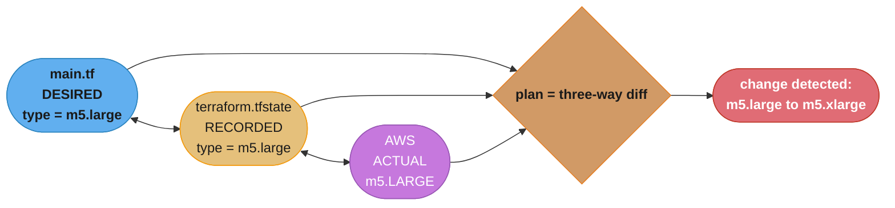
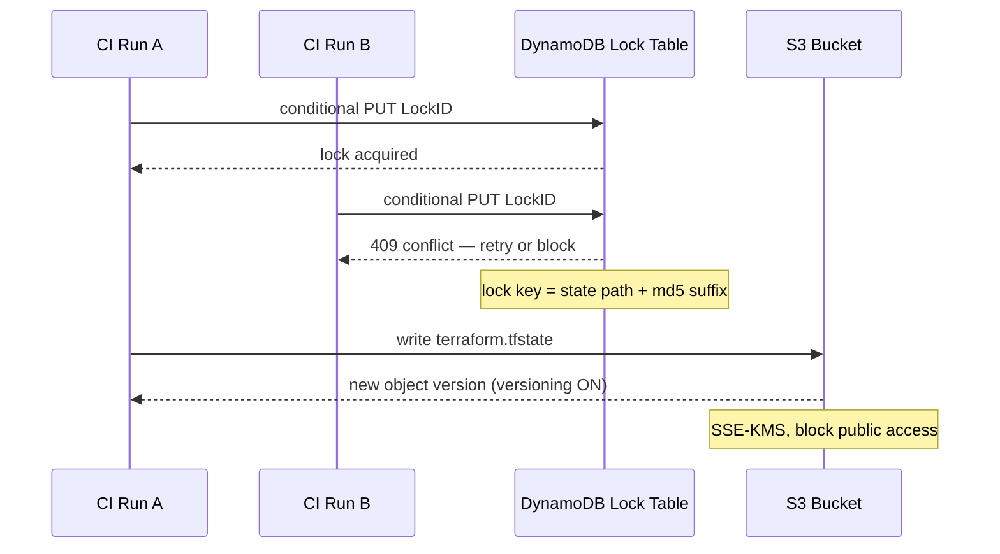
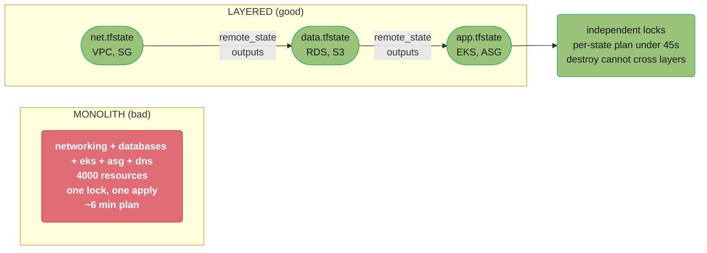
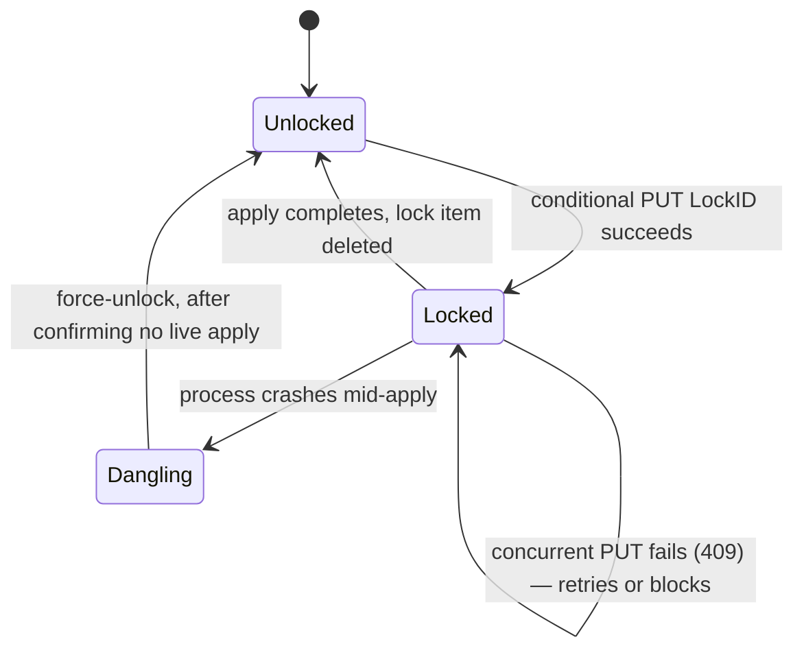
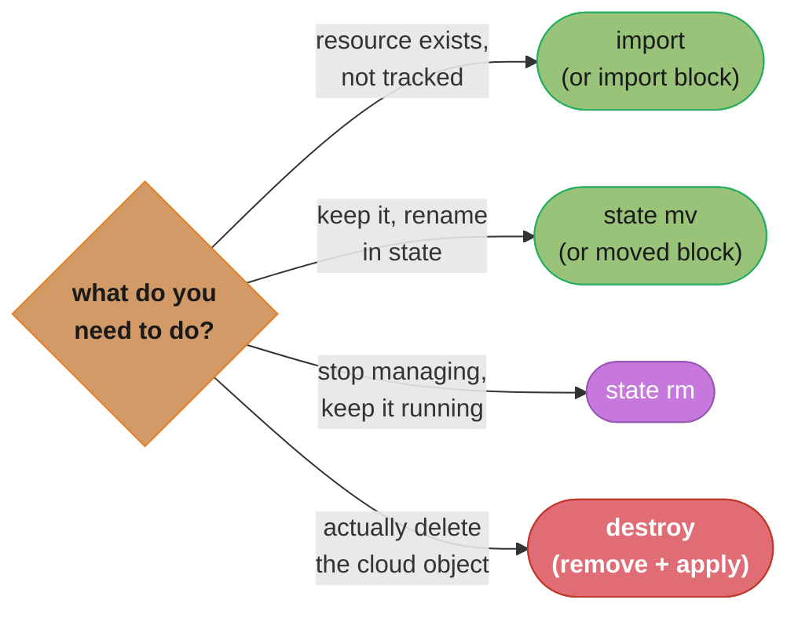

# Terraform State at Scale

> Cross-Cutting Primitive — DevOps Case Studies · Difficulty: Advanced

---

## 1. Concept Overview

Terraform's entire model rests on one file: the **state**. State is the JSON document that maps the resources declared in your configuration to the real-world objects (an AWS instance ID, an RDS ARN, a DNS record) that Terraform created. Without it, Terraform cannot tell the difference between "create this resource" and "this resource already exists, leave it alone." State is also where Terraform records resource metadata, dependency ordering, and — dangerously — any attribute returned by a provider, including secrets like database passwords and generated private keys.

At small scale, state is a local `terraform.tfstate` file and nobody thinks about it. At scale — dozens of engineers, hundreds of pipelines, thousands of resources across multiple environments and regions — state becomes the single most fragile and contested artifact in your infrastructure. The problems are concrete: two CI runs applying at once corrupt the file; a single monolithic state means one `plan` reads a thousand resources and takes minutes; a fat-fingered `terraform destroy` on a shared state takes down production; secrets sit in plaintext in an S3 bucket; and a `-target` flag papers over a problem while quietly leaving state inconsistent.

This file is the shared reference that the DevOps case studies — `design_gitops_delivery_pipeline`, `design_zero_downtime_infra_migration`, `design_internal_developer_platform` — link to for state-management depth. It covers remote backends (S3 + DynamoDB locking, GCS, azurerm), the state-as-blast-radius principle, splitting strategy, `terraform_remote_state` coupling, `import`/`state mv`/`state rm` surgery, drift detection in CI, the dangers of partial/targeted applies, the secrets-in-state problem, KMS encryption, and large-state performance. For backend syntax and the basics of the resource graph, cross-reference [`../../infrastructure_as_code_terraform/README.md`](../../infrastructure_as_code_terraform/README.md); for OpenTofu, Terragrunt, Pulumi, and Crossplane alternatives, cross-reference [`../../terraform_advanced_and_alternatives/README.md`](../../terraform_advanced_and_alternatives/README.md).

---

## 2. Intuition

> **One-line analogy**: Terraform state is the master keyring for your infrastructure — lose it and you can't tell which lock each key opens; let two people grab it at once and they re-key the same doors; leave it on a public hook and anyone can read every key's secret cut.

**Mental model**: Terraform never trusts the cloud as the source of truth — it trusts the state file, then reconciles state against reality during `refresh`. The config says what you *want*, the state says what Terraform *thinks exists*, and the cloud is what *actually exists*. Every `plan` is the three-way diff between these.

**Why it matters**: The state file is a blast-radius boundary. Everything in one state shares a lock, a `terraform apply`, a `terraform destroy`, and a `plan` runtime. A monolith means one engineer's mistake or one slow refresh affects everything; well-split state means a bad apply to the `networking` state can't accidentally recreate the `database` state.

**Key insight**: **The size and granularity of your state files is the single most important architectural decision in a Terraform codebase — more than module design, more than naming.** Splitting state is how you bound blast radius, parallelize CI, keep plan times under a minute, and limit who can destroy what. Teams that treat state as an afterthought end up with a 4,000-resource monolith that takes 6 minutes to plan and that nobody dares to `apply`.

---

## 3. Core Principles

1. **State must be remote, locked, and versioned in any team setting.** Local state cannot be shared safely. The remote backend provides shared access, a lock to serialize writes, and version history to recover from corruption.

2. **State is a blast-radius boundary.** Group resources into a state by failure domain and change cadence, not by convenience. One `destroy` should never be able to reach across boundaries.

3. **Locking is mandatory, not optional.** Concurrent applies without a lock interleave writes and corrupt state. S3 backends use a DynamoDB lock table (or, since Terraform 1.11, native S3 lockfile locking); GCS and azurerm lock natively.

4. **State contains secrets — treat it as a secret.** Any provider attribute, including passwords and private keys, is stored in plaintext within state. Encrypt at rest (SSE-KMS), restrict bucket access, and never commit state.

5. **Refresh is reality reconciliation; drift is the gap.** `terraform plan` refreshes state against the cloud and surfaces drift — manual changes that diverge from config. Detect drift continuously, not at the next deploy.

6. **Surgical state operations are sometimes necessary but always risky.** `import`, `state mv`, and `state rm` rewrite the map between config and reality. Always back up state first and run them with a lock.

7. **Targeted and partial applies are escape hatches, not workflow.** `-target` skips the dependency graph and leaves state partially reconciled; it hides problems and should be reserved for recovery.

---

## 4. Types / Architectures / Strategies

**Remote backend options**:

| Backend | Storage | Locking mechanism | Encryption |
|---------|---------|-------------------|------------|
| `s3` | S3 bucket | DynamoDB table (or native S3 lockfile, TF ≥1.11) | SSE-S3 or SSE-KMS |
| `gcs` | GCS bucket | Native object generation locking | Google-managed or CMEK |
| `azurerm` | Blob Storage | Native blob lease | Microsoft-managed or CMK |
| `remote` / `cloud` | Terraform/HCP Cloud | Built-in run queue | Managed by HCP |

**State-splitting strategies**:

- **Monolith** — one state for everything. Simple, but huge blast radius and slow plans.
- **Layer-per-state** — separate states for `networking`, `data`, `compute`, `dns`. Splits by failure domain.
- **Service-per-state** — each microservice owns its state. Maximum isolation, more wiring.
- **Account/region-per-state** — isolate by AWS account and region for compliance and blast radius.

**Environment strategies**:

- **Workspaces** — `terraform workspace new prod` keys multiple states inside one backend prefix. Cheap but error-prone (easy to apply to the wrong workspace; shared backend config).
- **Directory-per-env** — `envs/prod/`, `envs/staging/` each with its own backend config. More files, but explicit and safer; the dominant production pattern.

**Cross-state data sharing**:

- **`terraform_remote_state` data source** — read another state's outputs. Convenient but creates tight coupling and read-time dependency.
- **Loose coupling via data sources / SSM / tags** — look up the VPC by tag instead of reading another state's output. More resilient.

---

## 5. Architecture Diagrams

**Config vs. state vs. cloud — the three-way diff**



Terraform never trusts the cloud directly — every `plan` recomputes this three-way diff between desired config, recorded state, and actual cloud reality, then reports the delta.

**S3 + DynamoDB remote backend with locking**



CI Run A's conditional PUT wins the lock while CI Run B's write is rejected with a 409 and must retry or block; only the holder may write the next versioned state object into S3.

**State splitting → blast-radius containment**



Splitting the 4,000-resource monolith into per-layer state cut plan time from about 6 minutes to under 45 seconds per layer, and independent locks let three teams apply in parallel.

---

## 6. How It Works — Detailed Mechanics

**S3 + DynamoDB backend configuration.** The canonical AWS remote backend:

```hcl
terraform {
  backend "s3" {
    bucket         = "acme-tfstate-prod"
    key            = "networking/terraform.tfstate"   # path = blast-radius unit
    region         = "us-east-1"
    dynamodb_table = "acme-tf-locks"                  # lock table
    encrypt        = true
    kms_key_id     = "arn:aws:kms:us-east-1:111122223333:key/abcd-1234"
  }
}
```

The supporting resources (bootstrapped once, in their own state or by hand):

```hcl
resource "aws_s3_bucket" "tfstate" {
  bucket = "acme-tfstate-prod"
}

resource "aws_s3_bucket_versioning" "tfstate" {
  bucket = aws_s3_bucket.tfstate.id
  versioning_configuration { status = "Enabled" }   # recover corrupted/lost state
}

resource "aws_s3_bucket_public_access_block" "tfstate" {
  bucket                  = aws_s3_bucket.tfstate.id
  block_public_acls       = true
  block_public_policy     = true
  ignore_public_acls      = true
  restrict_public_buckets = true
}

resource "aws_dynamodb_table" "tf_locks" {
  name         = "acme-tf-locks"
  billing_mode = "PAY_PER_REQUEST"     # on-demand: no capacity planning for spiky CI
  hash_key     = "LockID"
  attribute {
    name = "LockID"
    type = "S"
  }
}
```

**Lock mechanics.** On `apply`/`plan -lock=true` (default), Terraform writes a conditional item to DynamoDB keyed by `LockID = <bucket>/<key>-md5`. The conditional put fails if the item exists, so a second run gets `Error acquiring the state lock` and blocks/retries. The lock item carries `Who`, `Created`, and `Operation`. If a run crashes mid-apply the lock can be left dangling and must be cleared with `terraform force-unlock <LOCK_ID>` — only after confirming no apply is actually running.

The lock item moves through a small state machine as CI runs contend for it:



A run that crashes mid-apply leaves the lock `Dangling` — the only way back to `Unlocked` is `terraform force-unlock`, and only after confirming the holder is genuinely dead.

**Refresh and the three-way diff.** Every `plan` (unless `-refresh=false`) calls the provider's Read API for each resource in state, compares to recorded state (detecting drift), then diffs against config. On a 2,000-resource state this means 2,000 API calls and is the dominant cost of plan time. `terraform plan -refresh-only` shows drift without computing config changes.

**Surgical operations**:

```bash
# Pull and back up state BEFORE any surgery.
terraform state pull > backup-$(date +%s).tfstate

# Adopt an existing, manually-created resource into state (TF >= 1.5: import block preferred).
terraform import aws_s3_bucket.legacy acme-legacy-bucket

# Rename/move a resource in state without destroy/recreate.
terraform state mv aws_instance.web aws_instance.frontend

# Stop managing a resource WITHOUT destroying it in the cloud.
terraform state rm aws_db_instance.old_replica
```

The modern (Terraform ≥1.5) declarative form avoids CLI surgery:

```hcl
import {
  to = aws_s3_bucket.legacy
  id = "acme-legacy-bucket"
}

moved {
  from = aws_instance.web
  to   = aws_instance.frontend
}
```

Which command to reach for depends on the goal, not the mechanism:



`import` and `state mv` are safe, reviewable adoption/rename operations; `state rm` only stops Terraform from tracking a resource while it keeps running; only `destroy` actually removes the cloud object.

**Cross-state reads**:

```hcl
data "terraform_remote_state" "networking" {
  backend = "s3"
  config = {
    bucket = "acme-tfstate-prod"
    key    = "networking/terraform.tfstate"
    region = "us-east-1"
  }
}

resource "aws_instance" "app" {
  subnet_id = data.terraform_remote_state.networking.outputs.private_subnet_id
}
```

This couples the `app` state to the `networking` state's outputs at read time; if `networking` removes that output, every downstream plan breaks.

**Drift detection in CI** — a scheduled job that fails if reality has diverged:

```bash
terraform plan -detailed-exitcode -refresh-only -lock=false -out=drift.plan
# exit 0 = no drift, exit 1 = error, exit 2 = drift detected
case $? in
  0) echo "no drift" ;;
  2) echo "DRIFT DETECTED"; terraform show drift.plan; exit 1 ;;
  *) echo "plan error"; exit 1 ;;
esac
```

---

## 7. Real-World Examples

- **Gruntwork / Terragrunt** popularized directory-per-env with one small state per component, generating backend blocks automatically and running plans in dependency order — the canonical answer to monolith state pain at scale.

- **HashiCorp's own guidance** evolved from monolithic state to "split by lifecycle and blast radius"; their well-architected material recommends separating long-lived foundational state (networking, IAM) from frequently-changing application state.

- **A 2,000+ resource monolith at a mid-size SaaS** measured `plan` at ~6 minutes (dominated by refresh API calls) and serialized all infra changes behind one lock; splitting into networking/data/compute states cut individual plan times to under 45 seconds and let three teams apply in parallel.

- **Spacelift / Atlantis / env0** built businesses on serializing Terraform applies safely: PR-triggered plans, lock-aware queuing, and policy gates that prevent the concurrent-apply corruption that DynamoDB locking alone can't fully coordinate across many stacks.

- **The secrets-in-state CVE class**: numerous public S3 exposures have leaked Terraform state containing RDS master passwords and TLS private keys, because teams enabled versioning but forgot block-public-access and SSE-KMS.

---

## 8. Tradeoffs

| Decision | Option A | Option B | When A wins | When B wins |
|----------|----------|----------|-------------|-------------|
| State granularity | Monolith | Split by layer/service | Tiny project, one team | Any team scale; bounded blast radius |
| Environments | Workspaces | Directory-per-env | Quick demos, identical envs | Production; explicit, safer separation |
| Cross-state | `terraform_remote_state` | Loose coupling (tags/SSM) | Tight, controlled output contracts | Resilience; avoid read-time coupling |
| Locking (S3) | DynamoDB table | Native S3 lockfile (≥1.11) | Pre-1.11, fine-grained metadata | New setups; one fewer resource |
| Backend | Self-managed S3 | HCP/Terraform Cloud | Full control, no per-run cost | Managed runs, RBAC, policy built-in |
| State surgery | CLI (`state mv/rm`) | Declarative `moved`/`import` blocks | Ad-hoc one-off recovery | Reviewable, repeatable in PRs |
| Refresh in CI | Always refresh | `-refresh=false` for speed | Drift visibility matters | Huge state, drift caught elsewhere |

---

## 9. When to Use / When NOT to Use

**Split state aggressively when:**
- The codebase exceeds a few hundred resources or plan times exceed ~60 seconds.
- Multiple teams need to apply independently without serializing behind one lock.
- Blast radius matters — networking, data, and compute should not share a `destroy`.
- Compliance requires per-account or per-region isolation.

**Keep a single state when:**
- The whole project is small (tens of resources), one team, one environment.
- Resources are tightly coupled and always change together.
- Splitting would create more `terraform_remote_state` coupling than it removes.

**Do NOT:**
- **Do NOT use workspaces to separate prod from non-prod** in serious setups — one wrong `terraform workspace select` applies dev changes to prod against the same code path. Prefer directory-per-env.
- **Do NOT make `-target` part of normal workflow** — it bypasses the dependency graph and leaves state partially reconciled; reserve it for recovery.
- **Do NOT store state locally or commit it to git** — it's shared mutable state and contains secrets.

---

## 10. Common Pitfalls

1. **State in S3 without versioning.** A corrupt write or accidental `state rm` is unrecoverable.

2. **State without locking.** Two CI runs apply concurrently and interleave writes — the classic corruption.

3. **Secrets in plaintext state in an unencrypted, public-readable bucket.** Leaks RDS passwords and private keys.

4. **`-target` as a habit.** Hides drift; the next full apply surprises with unexpected changes because earlier targeted applies skipped dependencies.

5. **`terraform_remote_state` sprawl.** Every state reads every other state's outputs; a refactor in one breaks plans everywhere.

6. **Monolith plan timeouts.** A 4,000-resource state's refresh exceeds the CI job timeout, blocking all deploys.

**BROKEN → FIX**: a `-target` partial apply leaves state inconsistent, then the next full apply destroys something unexpected.

```bash
# BROKEN: engineer wants to "just update the security group" quickly.
# -target skips the dependency graph; the SG's referenced rules and the
# instance that depends on it are NOT reconciled. State now records the SG
# but the instance's recorded SG attachment is stale.
terraform apply -target=aws_security_group.web -auto-approve

# Later, a normal full apply runs and computes a diff against the now-
# inconsistent state -> it proposes replacing the instance because the
# recorded dependency no longer matches config. Surprise downtime.
terraform apply -auto-approve   # "aws_instance.web must be replaced"
```

```bash
# FIX: never use -target for routine changes. Make the change in config,
# run a FULL plan, review the diff, then apply the whole graph atomically.
# If you MUST recover with -target, immediately follow with a full apply
# to re-converge state before walking away.
terraform plan -out=tfplan          # full graph, full refresh, reviewable diff
terraform show tfplan               # human review: no unexpected replacements
terraform apply tfplan              # atomic, dependency-ordered apply
# (If a -target was unavoidable during an incident:)
terraform plan -out=reconverge.plan && terraform apply reconverge.plan
```

---

## 11. Technologies & Tools

| Tool | Role | What it adds over raw Terraform | Notes |
|------|------|----------------------------------|-------|
| Terragrunt | Wrapper | DRY backend/env config, dependency-ordered runs, small states | Directory-per-env at scale |
| Atlantis | PR automation | Plan/apply on PR, lock-aware, audit trail | Self-hosted, free |
| Spacelift / env0 | Managed platform | RBAC, policy gates, drift detection, run queue | SaaS, OPA policies |
| terraform-docs | Docs | Auto-generates input/output docs | Keeps remote_state contracts visible |
| driftctl / `plan -refresh-only` | Drift detection | Finds unmanaged + drifted resources | driftctl now archived; native flag preferred |
| OpenTofu | Engine | Open-source TF fork; state encryption built-in (1.7+) | Encrypts state client-side, not just at-rest |

State encryption note: native Terraform encrypts state *at rest* in the backend (SSE-KMS), but the local plan/state cache is plaintext; OpenTofu 1.7+ adds client-side state encryption so the file is ciphertext everywhere.

---

## 12. Interview Questions with Answers

**Q: Why does Terraform need a state file at all — can't it read everything from the cloud?**
State exists because Terraform must map declared resources to real-world object IDs and record metadata that isn't always recoverable from the cloud, like dependency ordering and provider-only attributes. Reading the entire cloud on every run would be prohibitively slow and ambiguous — Terraform couldn't tell which of a thousand untagged instances corresponds to which config block. State is the authoritative map that makes the three-way diff (config vs state vs cloud) possible; protect it accordingly.

**Q: Walk through how S3 + DynamoDB state locking works.**
The S3 bucket stores the state object (with versioning on) while a DynamoDB table provides the lock: on apply, Terraform does a conditional put of an item keyed `LockID = <bucket>/<key>-md5`, which fails if the item already exists. A second concurrent run gets "Error acquiring the state lock" and blocks or retries, serializing writes so they can't interleave and corrupt state. Use PAY_PER_REQUEST billing for spiky CI, and clear dangling locks with `terraform force-unlock` only after confirming no apply is actually running. Since Terraform 1.11 native S3 lockfile locking can replace the DynamoDB table.

**Q: What does it mean that "state is a blast-radius boundary," and how do you use that?**
It means everything inside one state file shares a single lock, a single apply, a single destroy, and a single plan runtime, so a mistake or slow refresh affects everything in that state. You use it by splitting state along failure domains and change cadence — separate networking, data, and compute — so a bad apply or `destroy` to one layer cannot reach another, and teams can apply in parallel. The split also keeps plan times low because each refresh touches fewer resources.

**Q: Workspaces versus directory-per-environment — which for prod and why?**
Directory-per-environment for production, because workspaces share one backend configuration and code path, making it dangerously easy to `terraform workspace select` the wrong one and apply dev changes to prod. Directory-per-env makes the environment explicit in the path and backend config, so prod has its own folder, its own state key, and its own CI pipeline. Reserve workspaces for ephemeral, identical environments like per-PR preview stacks.

**Q: What is the secrets-in-state problem and how do you mitigate it?**
Terraform stores every provider-returned attribute in state as plaintext JSON, including RDS master passwords, generated private keys, and access secrets — so the state file is itself a secret. Mitigate by enabling SSE-KMS encryption on the backend, blocking all public access on the bucket, restricting IAM access to the state path, and never committing state to git. For defense in depth, use OpenTofu 1.7+ client-side state encryption so the file is ciphertext even in local caches, and avoid putting secrets in Terraform at all where a secrets manager can hold them.

**Q: How does `terraform_remote_state` create coupling, and what's the alternative?**
`terraform_remote_state` reads another state's outputs at plan time, so the consumer state depends on the producer state's output contract — remove or rename that output and every downstream plan breaks immediately. The looser alternative is to look up the dependency by a stable external identifier — a `data "aws_vpc"` filtered by tag, or an SSM parameter the producer publishes — so the consumer depends on a tag/parameter contract rather than reading another state. Use remote_state for tightly-controlled internal contracts and loose coupling for resilience across team boundaries.

**Q: When is `-target` appropriate, and why is it dangerous as a habit?**
`-target` is appropriate only for recovery — surgically applying one resource when a full apply is blocked or during incident response. It's dangerous as a habit because it bypasses the dependency graph, applying the targeted resource without reconciling its dependents, which leaves state inconsistent so the next full apply proposes surprising changes like resource replacement. If you must use it, immediately follow with a full `plan`/`apply` to re-converge state before walking away.

**Q: What's the difference between `terraform state rm` and `terraform destroy` for one resource?**
`terraform state rm` removes the resource from state only, so Terraform forgets it exists but the real cloud object keeps running — useful for handing a resource to another state or stopping management. `terraform destroy -target` (or removing it from config and applying) actually deletes the cloud object. Always back up state with `terraform state pull` before `state rm`, because forgetting a resource you didn't mean to can orphan or double-create infrastructure.

**Q: How do you adopt an existing, manually-created resource into Terraform?**
Use an import: either the imperative `terraform import aws_s3_bucket.legacy <bucket-name>` or, in Terraform 1.5+, a declarative `import { to = ...; id = ... }` block that's reviewable in a PR and runs during the next apply. After importing, run `plan` and reconcile any diff between the imported reality and your config until plan is clean, otherwise the next apply will try to "fix" the resource. The declarative form is preferred because it's version-controlled and repeatable.

**Q: Why do large state files have slow plans, and how do you fix it?**
Plan time on large state is dominated by refresh — Terraform calls the provider's Read API once per resource to detect drift, so a 2,000-resource state means ~2,000 API calls and often minutes. Fix it primarily by splitting state so each plan refreshes fewer resources, secondarily by `-refresh=false` when drift is caught by a separate scheduled job, and by using `-target` only for recovery. Splitting also unlocks parallel applies, which a monolith's single lock prevents.

**Q: How do you detect drift continuously rather than discovering it at deploy time?**
Run a scheduled CI job that executes `terraform plan -detailed-exitcode -refresh-only`, which returns exit code 2 when state has drifted from reality; fail the job and alert on that. This surfaces out-of-band manual changes — someone resized an instance in the console — before they collide with your next apply. Pair it with policy that blocks console changes (or alerts via CloudTrail) so drift becomes the exception, not the norm.

**Q: A CI run crashed mid-apply and now every run says "Error acquiring the state lock." What do you do?**
First confirm no apply is genuinely still running — check CI, check the DynamoDB lock item's `Who`/`Created`/`Operation` fields and the timestamp. Only once you're certain the holder is dead, run `terraform force-unlock <LOCK_ID>` to remove the stale lock. Then run a full `plan` to verify state wasn't left mid-write; if it was, recover from S3 object versioning. The lesson is to never force-unlock reflexively, because unlocking a live apply causes exactly the corruption the lock prevents.

**Q: How does state recovery work if the file gets corrupted?**
With S3 versioning enabled, every apply writes a new object version, so you recover by listing versions (`aws s3api list-object-versions`) and restoring the last-known-good version as the current object. Without versioning there is no recovery — a corrupt or deleted state means rebuilding the resource map by importing every resource by hand. This is why versioning on the state bucket is non-negotiable, and why you `terraform state pull > backup` before any surgical operation.

**Q: GCS and azurerm backends versus S3 — how does locking differ?**
GCS uses object generation numbers for atomic compare-and-swap locking and azurerm uses a blob lease, so both lock natively without a separate lock table, whereas classic S3 required a companion DynamoDB table (native S3 lockfile arrived in Terraform 1.11). Functionally they all serialize concurrent writes; the operational difference is one fewer resource to manage on GCS/azurerm. Encryption defaults also differ — GCS and Azure encrypt at rest by default, while S3 you must explicitly enable SSE-KMS and block public access.

**Q: How do you safely run many Terraform pipelines concurrently without lock contention stalling everyone?**
The core fix is state splitting — independent states have independent locks, so a `compute` apply and a `networking` apply never contend, which is the primary reason a monolith serializes all teams behind one lock. On top of that, run applies through a serialization platform like Atlantis or Spacelift that queues runs per stack and surfaces lock status instead of letting pipelines fight over the lock and time out. Keep individual plans fast (under ~60s) so even within one stack the lock is held briefly, minimizing contention windows.

---

## 13. Best Practices

1. **Remote, locked, versioned, encrypted — always.** S3 with versioning + SSE-KMS + DynamoDB (or native) lock + block-public-access is the non-negotiable baseline.
2. **Split state by blast radius and change cadence**, not by convenience. Keep individual plan times under ~60 seconds.
3. **Directory-per-environment, not workspaces, for prod.** Make the environment explicit.
4. **Treat state as a secret.** No plaintext secrets in public buckets; restrict IAM to the state path; never commit state.
5. **Prefer declarative `moved`/`import` blocks** over CLI surgery so changes are reviewable in PRs.
6. **Back up before surgery.** `terraform state pull > backup` before any `state mv/rm/import`.
7. **Run continuous drift detection** with `plan -refresh-only -detailed-exitcode` on a schedule.
8. **Reserve `-target` for recovery**, and always re-converge with a full apply afterward.
9. **Limit `terraform_remote_state` coupling**; prefer tag/SSM lookups across team boundaries.
10. **Serialize applies through a platform** (Atlantis/Spacelift/Terraform Cloud) so PRs, locks, and policy gates are enforced consistently.

---

## 14. Case Study

**Scenario**: A scale-up ran all infrastructure — VPC, RDS, EKS, ASGs, Route53, IAM — in a single S3 state with ~3,800 resources. Plan time was ~7 minutes, every change serialized behind one lock, and three teams contended daily. During a Friday incident, an engineer ran a targeted apply to "just fix the ALB," then a teammate's full CI apply, computing a diff against the now-inconsistent state, proposed **destroying and recreating the RDS instance**. It nearly auto-approved. Separately, a security audit found the state bucket had versioning but no SSE-KMS and a wildcard bucket policy — RDS master passwords were readable in plaintext.

**Root cause**: monolithic state (huge blast radius, slow plans, single lock), `-target` leaving state inconsistent, and unencrypted/over-permissive state storage exposing secrets.

```hcl
# BROKEN: one backend, one state key for everything. 3,800 resources,
# 7-minute plans, one lock, secrets readable.
terraform {
  backend "s3" {
    bucket = "acme-tfstate"
    key    = "infra/terraform.tfstate"   # EVERYTHING in one state
    region = "us-east-1"
    # no encrypt, no kms_key_id, no dynamodb_table
  }
}
```

```hcl
# FIX 1: split into layered states; each is its own blast-radius unit with
# its own lock, encrypted with KMS, locked via DynamoDB.

# envs/prod/networking/backend.tf
terraform {
  backend "s3" {
    bucket         = "acme-tfstate-prod"
    key            = "networking/terraform.tfstate"
    region         = "us-east-1"
    dynamodb_table = "acme-tf-locks"
    encrypt        = true
    kms_key_id     = "arn:aws:kms:us-east-1:111122223333:key/abcd-1234"
  }
}

# envs/prod/data/backend.tf  -> key = "data/terraform.tfstate"  (RDS, S3)
# envs/prod/compute/backend.tf -> key = "compute/terraform.tfstate" (EKS, ASG)
# Each plans independently in < 45s; destroy in one CANNOT reach another.
```

```hcl
# FIX 2: lock down the state bucket so secrets-in-state aren't exposed.
resource "aws_s3_bucket_versioning" "s" {
  bucket = "acme-tfstate-prod"
  versioning_configuration { status = "Enabled" }
}
resource "aws_s3_bucket_public_access_block" "s" {
  bucket                  = "acme-tfstate-prod"
  block_public_acls       = true
  block_public_policy     = true
  ignore_public_acls      = true
  restrict_public_buckets = true
}
resource "aws_s3_bucket_server_side_encryption_configuration" "s" {
  bucket = "acme-tfstate-prod"
  rule {
    apply_server_side_encryption_by_default {
      sse_algorithm     = "aws:kms"
      kms_master_key_id = "arn:aws:kms:us-east-1:111122223333:key/abcd-1234"
    }
  }
}
```

```bash
# FIX 3: ban -target from normal workflow; enforce full-plan review in CI.
# The compute layer reads networking outputs via a controlled remote_state,
# and every apply is full-graph and reviewed.
terraform plan -out=tfplan
terraform show tfplan | grep -E "must be replaced|will be destroyed" \
  && { echo "destructive change detected — blocking auto-apply"; exit 1; }
terraform apply tfplan
```

**Outcome**: per-layer plans dropped from 7 minutes to under 45 seconds, three teams applied in parallel without lock contention, and the destructive-change CI gate blocked any plan that proposed replacing stateful resources. The state bucket was encrypted with KMS and locked down, removing the plaintext-secrets exposure. A `-target` could no longer silently corrupt a shared state because each layer was small and applies were full-graph and reviewed.

For backend syntax fundamentals and the resource graph model, see [`../../infrastructure_as_code_terraform/README.md`](../../infrastructure_as_code_terraform/README.md); for Terragrunt, OpenTofu state encryption, and Pulumi/Crossplane comparisons, see [`../../terraform_advanced_and_alternatives/README.md`](../../terraform_advanced_and_alternatives/README.md).
