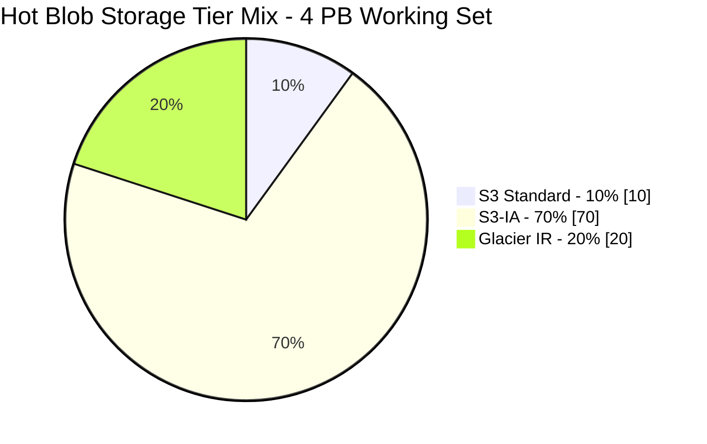
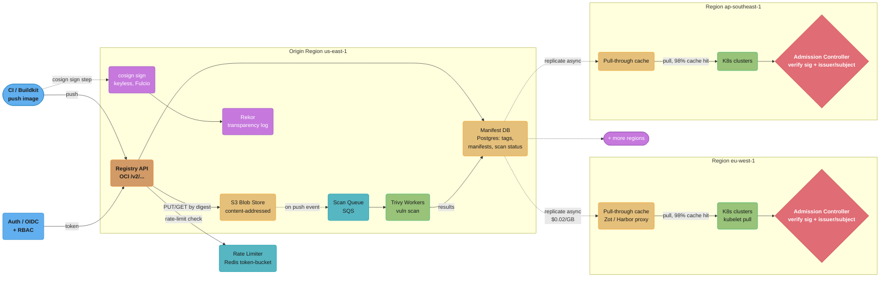
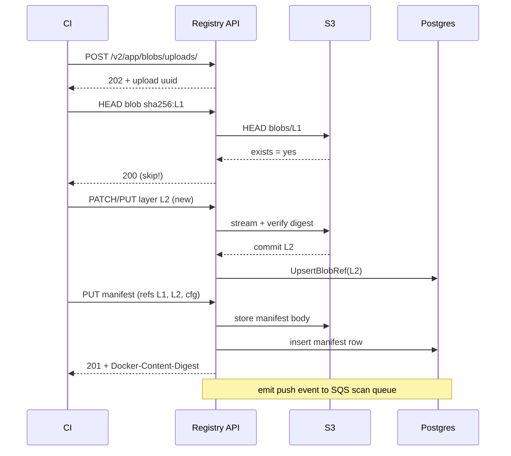
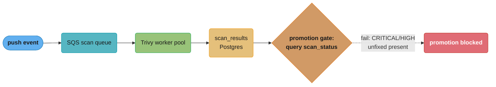
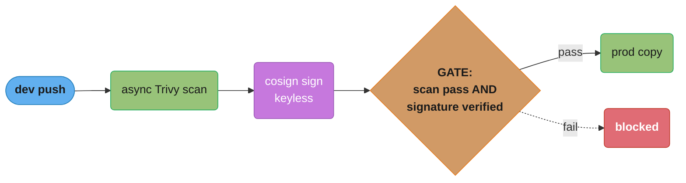

# Design a Container Registry

> A container registry is a content-addressable warehouse: every layer is a box labeled by its SHA-256 fingerprint, every image is a packing list that points at boxes, and 50 warehouses keep mirrored copies so no truck drives across the country for a box already on the shelf.

**Key insight**: A registry is not a file server — it is a **content-addressable store with a thin manifest index on top**. Blobs are immutable and deduped by digest, manifests are mutable pointers, and 95% of every "pull" is just re-confirming bytes a node already has. Everything else — scanning, signing, replication, GC — is bookkeeping over that one invariant.

---

## Intuition

> Think of it as Git for binary layers: objects addressed by hash, refs (tags) pointing at them, and `gc` reaping unreachable objects.

**Key insight**: The expensive resource is not storage — it is **cross-region egress and the long tail of cache misses**. A 200 MB image pulled 50,000 times across 3 regions is 10 TB of egress at $0.02/GB ($200) if every pull crosses a region, but $4 if a regional pull-through cache absorbs 98% of it. Design the registry so the digest-addressed cache does the heavy lifting and the origin only sees misses.

**Mental model.** Three planes:
1. **Blob plane** — immutable, content-addressed layers in S3, keyed by `sha256:...`. Identical layers across thousands of images are stored once (dedup).
2. **Manifest plane** — small JSON documents (1-30 KB) that list the blob digests making up an image, stored in a metadata DB + S3. Tags (`v1.4.2`, `latest`) are mutable refs into this plane.
3. **Control plane** — scan (Trivy), sign (cosign/Rekor), replicate, GC, rate-limit, admission-verify.

**Why this system exists.** Without a registry, every node builds or sideloads images by hand — no dedup, no provenance, no CVE gate, no single source of truth. At 50 clusters and millions of pulls/day, you need: (1) one immutable, deduped store; (2) a supply-chain gate so unscanned/unsigned images never reach production; (3) geo-locality so a node in eu-west-1 doesn't pull from us-east-1. This case study designs that system end-to-end against the [OCI Distribution Spec](https://github.com/opencontainers/distribution-spec). See [`../artifact_and_registry_management/README.md`](../artifact_and_registry_management/README.md) for the foundational module and [`../devsecops_and_supply_chain_security/README.md`](../devsecops_and_supply_chain_security/README.md) for the supply-chain context.

---

## 1. Requirements Clarification

### Functional Requirements

- **OCI push/pull**: Implement the OCI Distribution Spec v1.1 — `PUT/GET /v2/<name>/manifests/<ref>`, `POST/PATCH/PUT /v2/<name>/blobs/uploads/`, `GET /v2/<name>/blobs/<digest>`, chunked + monolithic upload, `HEAD` for existence checks.
- **Content-addressable dedup**: Store each blob exactly once keyed by `sha256:<hex>`. A `HEAD blob` mount lets a push skip layers already present (cross-repo blob mount via `?mount=<digest>`).
- **Vulnerability scanning**: Every pushed image scanned by Trivy. Results queryable; scan status gates promotion.
- **Image signing + verification**: Sign images with cosign (keyless via Fulcio + transparency log in Rekor). Admission controller verifies signature + signer identity before a pod runs.
- **Replication / geo-mirroring**: Replicate images to 3 regions (us-east-1, eu-west-1, ap-southeast-1) on push or on policy.
- **Pull-through cache**: A per-region cache proxies upstream and caches blobs locally on first miss.
- **Promotion across environments**: `dev → staging → prod` registries/namespaces; promotion is a manifest copy gated on scan + sign.
- **Garbage collection**: Reclaim blobs unreferenced by any manifest/tag.
- **Rate limiting**: Per-principal pull quotas (anonymous vs authenticated vs service account) to prevent abuse and DoS.

### Non-Functional Requirements

| Dimension | Target |
|-----------|--------|
| Pull volume | 5,000,000 pulls/day (≈ 58/sec avg, 580/sec peak at 10x) |
| Manifest fetch latency | p95 < 100 ms, p99 < 250 ms |
| Blob first-byte latency (cache hit) | p95 < 200 ms |
| Availability (pull path) | 99.95% (≤ 4.4 h downtime/yr) |
| Durability (blobs) | 99.999999999% (S3 11 nines) |
| Scan SLA | p95 < 4 min for a 200 MB image after push |
| Signature verification | enforced at admission; verify adds < 50 ms to pod admit |
| Geo-replication lag | p95 < 5 min cross-region |
| Push throughput | 500 pushes/hour sustained (CI fleet) |

### OCI API surface we must implement

| Verb + Path | Purpose | Hot? |
|-------------|---------|------|
| `GET /v2/` | API version check (returns 200 + `Docker-Distribution-API-Version`) | no |
| `HEAD /v2/<name>/manifests/<ref>` | Existence/digest check without body | yes |
| `GET /v2/<name>/manifests/<ref>` | Fetch manifest (tag or digest) | yes (p95<100ms) |
| `PUT /v2/<name>/manifests/<ref>` | Push manifest, create/move tag | push |
| `HEAD /v2/<name>/blobs/<digest>` | Dedup check before upload | yes (4,632/s peak) |
| `GET /v2/<name>/blobs/<digest>` | Download layer bytes | yes (egress) |
| `POST /v2/<name>/blobs/uploads/` | Begin upload session (or `?mount=`) | push |
| `PATCH .../uploads/<uuid>` | Chunked bytes (Content-Range) | push |
| `PUT .../uploads/<uuid>?digest=` | Finalize + verify digest | push |
| `GET /v2/<name>/tags/list` | List tags (paginated) | low |
| `GET /v2/<name>/referrers/<digest>` | List attached sigs/SBOMs/attestations | verify path |

These map 1:1 to the OCI Distribution Spec; anything not in this table (web UI, search, billing) is convenience layered above the spec, not part of the pull/push hot path.

### Out of Scope

- Building images (CI/Buildkit/Kaniko handled upstream — see [`../ci_cd_fundamentals/README.md`](../ci_cd_fundamentals/README.md)).
- Helm chart hosting beyond OCI artifacts (registry stores OCI artifacts generically; Helm-specific UX excluded).
- A full SBOM database/query engine (we store SBOM as an OCI referrer; querying it at fleet scale is a separate system).
- Multi-tenant billing/metering (assumed internal single-org).

---

## 2. Scale Estimation

### Pull traffic

```
5,000,000 pulls/day
  ÷ 86,400 s/day        = 57.9 pulls/sec average
  × 10 (peak factor)    = 579 pulls/sec peak

A "pull" = 1 manifest GET + N blob HEAD/GET.
Typical image = 8 layers. Node already has ~6 (base + common deps) → 2 blob GETs on average.

Manifest GETs:  579/sec peak
Blob HEADs:     579 × 8 = 4,632/sec peak  (existence checks, cheap, ~1 KB each)
Blob GETs:      579 × 2 = 1,158/sec peak  (actual bytes, before cache)
```

### Blob bytes and cache effect

```
Avg image uncompressed = 200 MB, ~8 layers.
Avg NEW bytes per pull (after node-side layer reuse) = 2 layers × ~25 MB = 50 MB.

Origin egress WITHOUT regional cache:
  1,158 GETs/sec × 25 MB = 28.95 GB/s  ← absurd, would cost a fortune

WITH regional pull-through cache at 98% hit rate:
  cache misses = 1,158 × 0.02 = 23.2 GETs/sec to origin
  origin egress = 23.2 × 25 MB = 580 MB/s peak ≈ 0.58 GB/s
```

The cache is not optional — it is the difference between 29 GB/s and 0.58 GB/s of origin egress (a 50x reduction).

### Storage

```
Distinct images:        20,000 repos × 50 retained tags = 1,000,000 manifests
Avg manifest size:      8 KB → 1M × 8 KB = 8 GB manifest metadata
Raw layer bytes (no dedup): 1M images × 200 MB = 200 PB  ← if naive
Dedup ratio (measured industry norm): 4:1 to 10:1 (shared base images dominate).
  Assume 5:1 → effective blob storage = 200 PB / 5 = 40 PB

Realistic working set (hot + 90-day retention) ≈ 4 PB after GC of stale tags.
```

S3 Standard at $0.023/GB-month → 4 PB = 4,194,304 GB × $0.023 = **$96,468/month** for hot blobs. Tiering 70% to S3-IA ($0.0125/GB) and 20% to Glacier IR drops this to ~$55,000/month.



The tier mix, not raw capacity, drives the bill: shifting 90% of the 4 PB working set off S3 Standard turns a flat $96,468/month into a blended ~$55,000/month.

### Egress cost

```
Cross-region replication: each pushed image replicated to 2 other regions.
  500 pushes/hr × 24 = 12,000 pushes/day, avg 50 MB NEW bytes (deduped) each
  = 600 GB/day NEW × 2 regions = 1,200 GB/day cross-region
  × $0.02/GB = $24/day = $720/month replication egress

Pull-path origin egress (cache misses), 0.58 GB/s peak, ~0.06 GB/s avg:
  0.06 GB/s × 86,400 = 5,184 GB/day × $0.02 (if cross-AZ/region) = $104/day = $3,110/month
```

### Scan throughput

```
12,000 pushes/day → 12,000 scans/day = 0.14 scans/sec avg, ~1.4/sec peak.
Trivy on a 200 MB image: ~20-40 s wall (layer extraction + vuln DB match).
At 1.4/sec peak × 30 s = 42 concurrent scans needed → fleet of ~50 scan workers
(8 vCPU each) with headroom. Vuln DB (~200 MB) cached locally, refreshed every 6 h.
```

---

## 3. High-Level Architecture



Push, scan, sign, and replication all happen inside the origin region; each downstream region runs only a thin pull-through cache and its own admission controller, so a pull crosses a region boundary just once per image — the 98% cache-hit path — instead of on every request.

### Component inventory

| Component | Role | Tech |
|-----------|------|------|
| Registry API | OCI Distribution endpoints | Docker Distribution / Harbor / Zot |
| Manifest DB | Tags, manifests, blob refs, scan status, sig metadata | PostgreSQL (HA, read replicas) |
| Blob store | Content-addressed layers | S3 (versioning off, lifecycle on) |
| Rate limiter | Per-principal token bucket | Redis |
| Auth | OIDC token issuance + RBAC | Dex / internal IdP |
| Scan pipeline | Vuln scanning + gate | SQS + Trivy workers |
| Signing | Keyless sign + transparency | cosign + Fulcio + Rekor |
| Replication | Cross-region image copy | Harbor replication / `oras cp` |
| Pull-through cache | Regional read cache | Zot or registry mirror mode |
| Admission controller | Verify sig at pod admit | Kyverno / Sigstore policy-controller |
| GC | Reclaim unreferenced blobs | mark-and-sweep job |

### Data flow narrative

1. **Push.** CI authenticates (OIDC → bearer token). For each layer it does `HEAD /v2/app/blobs/<digest>`; if present (dedup), it skips upload, else `POST` an upload session and `PUT` the bytes. Finally it `PUT`s the manifest, which references the layer digests. The registry writes blobs to S3 keyed by digest and rows to Postgres.
2. **Scan.** Push emits an event to SQS. A Trivy worker pulls the image, extracts layers, matches against the vuln DB, and writes `scan_status` + findings to Postgres.
3. **Sign.** A signing job runs cosign keyless: Fulcio issues a short-lived cert bound to the CI OIDC identity, the signature is stored as an OCI referrer, and the signing event is logged to Rekor (tamper-evident).
4. **Replicate.** A replication controller copies new manifests + missing blobs to the other 2 regions (async, digest-addressed so it never re-copies shared layers).
5. **Pull.** A kubelet in eu-west-1 pulls from the regional pull-through cache. Cache hit (98%) serves from local S3/disk; miss fetches from origin and caches.
6. **Admit.** Before the pod runs, the admission controller verifies the cosign signature, pinning the **issuer** (`https://token.actions.githubusercontent.com`) and **subject** (the exact CI workflow identity). Unsigned or wrong-signer images are rejected.

The six steps above read as a straight line, but every stage has a reject branch — an image can die at scan, at the promotion gate, or at admission, and only a digest that clears all three ever reaches a running pod:

```mermaid
stateDiagram-v2
    direction LR
    classDef io      fill:#61afef,stroke:#2e86c1,color:#1a1a1a,font-weight:bold
    classDef frozen  fill:#c678dd,stroke:#9b59b6,color:#fff
    classDef train   fill:#98c379,stroke:#27ae60,color:#1a1a1a
    classDef mathOp  fill:#d19a66,stroke:#e67e22,color:#1a1a1a,font-weight:bold
    classDef lossN   fill:#e06c75,stroke:#c0392b,color:#fff,font-weight:bold
    classDef req     fill:#56b6c2,stroke:#0097a7,color:#1a1a1a
    classDef base    fill:#e5c07b,stroke:#f39c12,color:#1a1a1a

    [*] --> Pushed
    Pushed --> Scanning: async Trivy scan
    Scanning --> ScanFailed: CRITICAL/HIGH unfixed
    Scanning --> ScanPassed: no CRITICAL unfixed
    ScanFailed --> [*]: blocked in dev
    ScanPassed --> Signed: cosign keyless + Rekor log
    Signed --> PromotionGate: scan pass AND signature present
    PromotionGate --> Rejected: wrong signer or unscanned digest
    PromotionGate --> Promoted: issuer + subject pinned, verified
    Promoted --> Replicated: async cross-region copy
    Replicated --> Cached: pull-through cache, first miss
    Cached --> AdmissionCheck: kubelet pull, pod admit
    AdmissionCheck --> Rejected: signer identity not pinned
    AdmissionCheck --> Running: signature + issuer/subject verified
    Rejected --> [*]
    Running --> [*]

    class Pushed io
    class Scanning,ScanPassed,Promoted,Running train
    class Signed,Replicated frozen
    class Cached base
    class PromotionGate,AdmissionCheck mathOp
    class ScanFailed,Rejected lossN
```



This is exactly the branching that Common Pitfalls #3 and #4 (§9) violate: a signature-exists check with no signer pinning, and a promotion gate keyed on tag instead of digest, both let an image slip past a gate straight to `Running` without ever really clearing it.

### Push sequence (digest-addressed, dedup-aware)



Only **new** layers cross the wire; L1 was deduped by a single `HEAD`. A typical 8-layer push uploads 1-2 layers in practice.

### OCI distribution primitives

- **Blob**: an immutable byte string addressed by `sha256:<hex>`. Layers and configs are blobs.
- **Manifest**: a JSON document (`application/vnd.oci.image.manifest.v1+json`) listing a config blob + ordered layer blobs, each with `digest`, `size`, `mediaType`.
- **Tag**: a mutable human ref (`v1.4.2`) that resolves to a manifest digest.
- **Index** (manifest list): a manifest of manifests for multi-arch (`amd64`, `arm64`).
- **Referrers**: artifacts (signatures, SBOMs, attestations) attached to a subject manifest via the Referrers API (`GET /v2/<name>/referrers/<digest>`).

---

## 4. Component Deep Dives

### 4.1 OCI Distribution API + content-addressable blobs

```
PUSH a layer (chunked upload):
  POST   /v2/myapp/blobs/uploads/                       → 202 + Location: .../uploads/<uuid>
  PATCH  .../uploads/<uuid>  (bytes, Content-Range)     → 202
  PUT    .../uploads/<uuid>?digest=sha256:<hex>         → 201 Created
  (registry verifies SHA-256 of received bytes == digest, else 400)

DEDUP shortcut before upload:
  HEAD   /v2/myapp/blobs/sha256:<hex>                   → 200 (skip)  or  404 (must upload)
  Cross-repo mount: POST .../uploads/?mount=<digest>&from=<other-repo>  → 201 (no bytes moved)
```

Blob storage layout in S3 is digest-sharded to avoid hot prefixes:

```
s3://reg-blobs-use1/
  blobs/sha256/ab/abcdef0123.../data      ← 2-char shard prefix spreads keys
  blobs/sha256/cd/cdef456789.../data
```

The registry's blob write/verify path (Go, simplified from Docker Distribution semantics):

```go
// PutBlob verifies content-addressability before committing. The digest IS the name;
// if the computed hash differs, the upload is poisoned and must be rejected.
func (r *Registry) PutBlob(ctx context.Context, repo string, uploadID string,
	claimedDigest digest.Digest, body io.Reader) error {

	hasher := sha256.New()
	tee := io.TeeReader(body, hasher)

	// Stream to a temp S3 key first (multipart for >5 MB).
	tmpKey := fmt.Sprintf("uploads/%s/data", uploadID)
	written, err := r.s3.PutMultipart(ctx, r.blobBucket, tmpKey, tee)
	if err != nil {
		return fmt.Errorf("stream upload: %w", err)
	}

	computed := digest.NewDigest("sha256", hasher)
	if computed != claimedDigest {
		_ = r.s3.Delete(ctx, r.blobBucket, tmpKey) // poison: do NOT commit
		return distribution.ErrBlobInvalidDigest{Digest: claimedDigest, Reason: computed}
	}

	// Commit: move to content-addressed key. Idempotent — if it exists, dedup wins.
	finalKey := blobKey(computed) // blobs/sha256/<2char>/<hex>/data
	if exists, _ := r.s3.Head(ctx, r.blobBucket, finalKey); exists {
		_ = r.s3.Delete(ctx, r.blobBucket, tmpKey)
	} else {
		if err := r.s3.Copy(ctx, r.blobBucket, tmpKey, finalKey); err != nil {
			return fmt.Errorf("commit blob: %w", err)
		}
		_ = r.s3.Delete(ctx, r.blobBucket, tmpKey)
	}

	// Record reference: this repo now references this blob (for GC reachability).
	return r.db.UpsertBlobRef(ctx, repo, computed, written)
}
```

Manifest fetch (the hot, latency-sensitive path) is served from Postgres + a Redis manifest cache so p95 stays < 100 ms:

```go
func (r *Registry) GetManifest(ctx context.Context, repo, ref string) ([]byte, string, error) {
	// ref may be a tag or a digest. Resolve tag → digest first.
	dgst, err := r.resolveRef(ctx, repo, ref) // tag lookup hits Redis, then Postgres
	if err != nil {
		return nil, "", err
	}
	if cached, ok := r.manifestCache.Get(dgst.String()); ok { // Redis, 1 KB-30 KB
		return cached.Body, cached.MediaType, nil
	}
	m, err := r.db.GetManifest(ctx, dgst) // Postgres, indexed on digest
	if err != nil {
		return nil, "", err
	}
	r.manifestCache.SetTTL(dgst.String(), m, 10*time.Minute)
	return m.Body, m.MediaType, nil
}
```

### 4.2 Scan pipeline (Trivy) + promotion gate



Every push triggers an async scan; the gate reads `scan_status` at promotion time and blocks any digest with an unresolved CRITICAL or HIGH finding.

Trivy worker (Bash, runs in the worker container):

```bash
#!/usr/bin/env bash
set -euo pipefail
IMAGE="$1"   # e.g. registry.internal/myapp@sha256:abc...

# Pull-and-scan; --exit-code 0 so we capture findings rather than failing the worker.
trivy image \
  --severity CRITICAL,HIGH \
  --ignore-unfixed \
  --format json \
  --cache-dir /var/cache/trivy \
  --timeout 5m \
  --output /tmp/scan.json \
  "$IMAGE"

CRIT=$(jq '[.Results[].Vulnerabilities[]? | select(.Severity=="CRITICAL")] | length' /tmp/scan.json)
HIGH=$(jq '[.Results[].Vulnerabilities[]? | select(.Severity=="HIGH")] | length' /tmp/scan.json)

STATUS="pass"
if [[ "$CRIT" -gt 0 ]]; then STATUS="fail"; fi

# Persist result keyed by image DIGEST (immutable), not tag.
curl -fsS -X POST "$REGISTRY_API/internal/scan-results" \
  -H "Authorization: Bearer ${SVC_TOKEN}" \
  -d "$(jq -n --arg img "$IMAGE" --arg s "$STATUS" \
        --argjson c "$CRIT" --argjson h "$HIGH" \
        '{image:$img, status:$s, critical:$c, high:$h}')"
```

The promotion gate (CI step) refuses to promote `dev → prod` unless the **exact digest** passed scan AND is signed:

```yaml
# .github/workflows/promote.yml  (promotion gate)
- name: Verify scan + signature before promote
  run: |
    DIGEST=$(crane digest "$DEV_IMAGE")
    STATUS=$(curl -fsS "$REGISTRY_API/internal/scan-results?digest=$DIGEST" | jq -r .status)
    if [[ "$STATUS" != "pass" ]]; then
      echo "::error::scan status=$STATUS for $DIGEST — blocking promotion"; exit 1
    fi
    cosign verify \
      --certificate-identity-regexp '^https://github.com/myorg/.+' \
      --certificate-oidc-issuer 'https://token.actions.githubusercontent.com' \
      "${REGISTRY}/myapp@${DIGEST}"
    # Promotion = copy manifest by digest to prod namespace (blobs deduped, near-zero bytes).
    crane copy "${REGISTRY}/dev/myapp@${DIGEST}" "${REGISTRY}/prod/myapp@${DIGEST}"
```

### 4.3 cosign signing + Rekor + admission verify (with BROKEN→FIX)

Keyless signing in CI binds the signature to the workflow's OIDC identity and records it in Rekor:

```bash
# Sign in CI (keyless: Fulcio issues a short-lived cert for the OIDC identity).
COSIGN_EXPERIMENTAL=1 cosign sign --yes \
  "${REGISTRY}/myapp@${DIGEST}"
# Signature stored as an OCI referrer; entry appended to the Rekor transparency log.
```

The admission controller verifies at pod admit time. Here is the critical mistake teams make:

```yaml
# Kyverno ClusterPolicy — admission-time signature verification
apiVersion: kyverno.io/v1
kind: ClusterPolicy
metadata:
  name: verify-image-signature
spec:
  validationFailureAction: Enforce
  rules:
    - name: check-signature
      match:
        any:
          - resources:
              kinds: [Pod]
      verifyImages:
        - imageReferences:
            - "registry.internal/prod/*"

          # ─────────────────────────────────────────────────────────────
          # BROKEN: this only checks that *a* keyless signature EXISTS.
          # ANY Fulcio-issued identity passes — an attacker who can run a
          # GitHub Action in ANY public repo can sign your image and admit it.
          # attestors:
          #   - entries:
          #       - keyless:
          #           roots: |
          #             -----BEGIN CERTIFICATE-----  (Fulcio root)
          #           # no subject/issuer pinning → "signed by SOMEONE" == pass
          # ─────────────────────────────────────────────────────────────

          # FIX: pin BOTH the OIDC issuer AND the exact signer subject.
          # Only your org's workflow identity can produce an admissible signature.
          attestors:
            - entries:
                - keyless:
                    roots: |
                      -----BEGIN CERTIFICATE-----
                      MIIB... (Fulcio root CA)
                      -----END CERTIFICATE-----
                    subject: "https://github.com/myorg/*/.github/workflows/release.yml@refs/heads/main"
                    issuer: "https://token.actions.githubusercontent.com"
                    rekor:
                      url: https://rekor.sigstore.dev   # require transparency-log inclusion
```

The same pin in cosign CLI form (used by the policy-controller and CI gate):

```bash
# FIX equivalent for cosign verify — both flags are mandatory.
cosign verify \
  --certificate-oidc-issuer  "https://token.actions.githubusercontent.com" \
  --certificate-identity-regexp "^https://github.com/myorg/.+/release\.yml@refs/heads/main$" \
  "${REGISTRY}/prod/myapp@${DIGEST}"
```

The lesson: "is it signed?" is the wrong question. "Is it signed by an identity I trust, recorded in a transparency log?" is the right one. See [`cross_cutting/supply_chain_security_pipeline.md`](cross_cutting/supply_chain_security_pipeline.md).

### 4.4 Replication + pull-through cache + garbage collection

**Pull-through cache** (regional mirror) config (Zot):

```json
{
  "http": { "address": "0.0.0.0", "port": 5000 },
  "storage": { "rootDirectory": "/var/lib/registry", "gc": true, "dedupe": true },
  "extensions": {
    "sync": {
      "registries": [{
        "urls": ["https://registry.internal.us-east-1"],
        "onDemand": true,
        "tlsVerify": true,
        "maxRetries": 3,
        "content": [{ "prefix": "**" }]
      }]
    }
  }
}
```

On a cache miss the regional cache fetches from origin once, stores the blob locally (deduped), and serves all subsequent regional pulls from disk/S3 — turning 1,158 origin GETs/sec into 23 (98% hit). See [`cross_cutting/multi_cluster_networking.md`](cross_cutting/multi_cluster_networking.md) for the regional routing.

**Garbage collection** is mark-and-sweep over reachability: a blob is live if any tag → manifest → references it. The classic bug:

```go
// GC: delete blobs not referenced by any manifest reachable from a live tag.
func (gc *GarbageCollector) Sweep(ctx context.Context) error {
	live := map[digest.Digest]bool{}

	// MARK: walk every tag → manifest → its referenced blobs + config + referrers.
	tags, _ := gc.db.AllTags(ctx)
	for _, t := range tags {
		m, _ := gc.db.GetManifest(ctx, t.ManifestDigest)
		live[t.ManifestDigest] = true
		for _, layer := range m.Layers {
			live[layer.Digest] = true
		}
		live[m.Config.Digest] = true

		// ───────────────────────────────────────────────────────────
		// BROKEN: forgets that a blob referenced by ANOTHER tag's manifest
		// is still live. If we only mark from THIS tag and a layer is shared,
		// sweeping per-tag in isolation would delete a blob another image needs.
		// (Also: ignores referrers — deletes the cosign signature blob,
		//  silently un-signing a live, admitted image.)
		// ───────────────────────────────────────────────────────────

		// FIX: (1) accumulate `live` across ALL tags before deleting anything
		//      (two-phase: full mark, THEN sweep), and
		//      (2) include referrers (signatures, SBOMs, attestations).
		refs, _ := gc.db.GetReferrers(ctx, t.ManifestDigest)
		for _, ref := range refs {
			live[ref.Digest] = true
			rm, _ := gc.db.GetManifest(ctx, ref.Digest)
			for _, l := range rm.Layers {
				live[l.Digest] = true
			}
		}
	}

	// SWEEP: only after the FULL mark across all tags is complete.
	allBlobs, _ := gc.db.AllBlobs(ctx)
	for _, b := range allBlobs {
		if !live[b.Digest] {
			// Grace window: skip blobs uploaded < 2h ago (in-flight push race).
			if time.Since(b.CreatedAt) < 2*time.Hour {
				continue
			}
			if err := gc.s3.Delete(ctx, gc.bucket, blobKey(b.Digest)); err != nil {
				return err
			}
			_ = gc.db.DeleteBlobRow(ctx, b.Digest)
		}
	}
	return nil
}
```

Two non-negotiables: (1) GC is **two-phase** — mark everything across all tags before sweeping anything, or you delete shared layers; (2) GC runs in **read-only/maintenance mode** or with a generous grace window, or a push racing the sweep loses its just-uploaded blob.

---

## 5. Design Decisions & Tradeoffs

### Decision 1: Managed (ECR/GCR/Artifact Registry) vs self-hosted (Harbor/Zot)

- **Alternatives**: AWS ECR, GCP Artifact Registry, vs self-hosted Harbor or Zot.
- **Rationale**: At 50 clusters across 3 clouds/regions with custom promotion + signing policy, self-hosted Harbor gives replication, RBAC, Trivy integration, and cosign in one box without per-pull pricing. Managed ECR is simpler operationally but charges egress and is single-cloud.
- **Consequences**: We own upgrades, HA Postgres, and S3 lifecycle. We gain policy control + multi-cloud + no per-pull fees. Hybrid in practice: Harbor as origin, Zot as lightweight regional pull-through.

### Decision 2: S3 blob backend vs local filesystem

- **Alternatives**: S3 object store vs EBS/local-disk filesystem driver.
- **Rationale**: S3 gives 11-nines durability, infinite scale, and decouples blobs from registry compute (stateless API pods). Filesystem requires replicated block storage and couples capacity to node disks.
- **Consequences**: Slightly higher per-GET latency (mitigated by regional cache + Redis manifest cache); lifecycle tiering reduces cost. Filesystem would be faster cold but operationally heavier at 4 PB.

### Decision 3: Synchronous vs asynchronous scanning

- **Alternatives**: Block the push until Trivy passes vs scan async and gate at promotion.
- **Rationale**: Async — pushes complete in seconds; scan (20-40 s) runs behind SQS. The **promotion gate**, not the push, enforces "no CRITICAL to prod." Synchronous scanning would add 30 s to every CI push and couple push availability to scan-worker availability.
- **Consequences**: A vulnerable image can exist in `dev` briefly, but admission + promotion gates prevent it reaching prod. Requires the gate to be the real enforcement point.

### Decision 4: Pull-through cache vs full mirror replication

- **Alternatives**: Lazy regional pull-through cache (fetch on miss) vs eager full mirror (replicate every image to every region).
- **Rationale**: Pull-through for the long tail (cache only what's pulled); eager replication only for prod-critical images that must be locally present before a regional failover. Full mirroring 40 PB to 3 regions = 120 PB and huge egress.
- **Consequences**: First pull of a rarely used image in a region pays a cross-region miss (~hundreds of ms). Acceptable for 2% of pulls; prod-critical images are pre-warmed via eager replication.

### Decision 5: GC strategy — online mark-and-sweep vs offline maintenance window

- **Alternatives**: Online GC (with grace window) vs stop-the-world read-only GC window.
- **Rationale**: Online two-phase GC with a 2-hour upload grace window avoids downtime; the grace window covers the push-vs-sweep race. Offline GC is simpler/safer but means a maintenance window on a 24/7 system.
- **Consequences**: Online GC reclaims slightly less (recent blobs spared) but keeps the registry writable. Requires careful referrer-aware reachability.

### Decision 6: Keyless cosign (Fulcio/Rekor) vs long-lived key pairs

- **Alternatives**: Keyless (short-lived Fulcio cert bound to OIDC) vs static KMS key.
- **Rationale**: Keyless removes key-management burden and ties provenance to the CI identity + transparency log. Static keys leak and have no built-in identity binding.
- **Consequences**: Depends on Fulcio/Rekor availability (mitigate with a private Sigstore deployment). Verification must pin issuer + subject (see §4.3 BROKEN→FIX).

### Decision 7: Per-principal rate limiting vs global limits

- **Alternatives**: Per-principal token buckets vs a single global rate cap.
- **Rationale**: Per-principal (anonymous: 100 pulls/6h, authenticated: 5,000/6h, service-account: unlimited-but-metered) prevents one noisy tenant from starving others, mirroring Docker Hub's model.
- **Consequences**: Needs Redis-backed distributed counters; misconfigured CI hammering anonymous limits is a common support ticket (see §9).

### Comparison table

| Decision | Choice | Primary win | Primary cost |
|----------|--------|-------------|-------------|
| Backend | Harbor + Zot (self-host) | policy control, no per-pull fee | run HA Postgres + S3 |
| Blob store | S3 | 11-nines, infinite, stateless API | per-GET latency (cached away) |
| Scanning | async + promotion gate | fast pushes | vulnerable image briefly in dev |
| Geo | pull-through + selective eager | low egress, low storage | first-miss latency |
| GC | online two-phase + grace | no downtime | reclaims a bit less |
| Signing | keyless cosign | no key mgmt, provenance | Sigstore dependency |
| Rate limit | per-principal | fairness, DoS protection | Redis + tuning |

---

## 6. Real-World Implementations

**Docker Hub (Docker Inc.)** serves billions of pulls. In November 2020 it introduced pull-rate limits: 100 pulls/6h anonymous, 200/6h authenticated free — explicitly to control egress cost and abuse. It uses content-addressable storage with cross-repo blob mounts so shared base layers (e.g. `alpine`, `ubuntu`) are stored once. The rate-limit rollout broke thousands of CI pipelines overnight, popularizing pull-through caches and mirroring as standard practice.

**GitHub Container Registry (ghcr.io)** integrates tightly with GitHub Actions OIDC for keyless cosign signing — the workflow identity becomes the signer subject. It backs blobs on object storage with global CDN fronting for pull locality and exposes the OCI Referrers API for SBOMs and attestations attached to images.

**Harbor (CNCF graduated)** is the de facto self-hosted choice at enterprise scale. It bundles Trivy/Clair scanning, cosign signing via the policy engine, project-scoped RBAC, robot accounts, and **replication rules** (push-based or pull-based, filtered by tag/label) to mirror between Harbor instances or to ECR/GCR. Large deployments run Harbor as origin with PostgreSQL HA + S3, fronted by regional read caches.

**Uber Kraken** is a P2P registry built for Uber's scale: thousands of hosts pulling the same large image simultaneously would melt a centralized origin, so Kraken distributes blobs via a BitTorrent-like peer swarm. Origin seeds the torrent; hosts pull layers from each other. Uber reported distributing 20,000+ host pulls of multi-GB images in seconds where a centralized registry would saturate. This is the extreme of "the bottleneck is egress, not storage."

**Cloudflare** runs its own OCI registry backed by R2 (zero-egress-fee object store) and serves pulls from its global edge, eliminating cross-region egress charges — a structural cost advantage over S3-based registries that pay $0.02/GB cross-region.

**Shopify** runs Kubernetes at large scale and uses regional pull-through registry mirrors plus image pre-warming (pre-pulling critical images to nodes before traffic shifts) so deploys and node autoscaling events don't generate origin pull storms.

---

## 7. Technologies & Tools

| Tool | Type | Scan | Signing | Replication | Storage backends | Best fit |
|------|------|------|---------|-------------|------------------|----------|
| Harbor | Self-hosted (CNCF) | Trivy/Clair built-in | cosign via policy | rich rules (push/pull) | S3/GCS/Azure/FS | enterprise origin, full features |
| AWS ECR | Managed | basic + enhanced (Inspector) | cosign supported | cross-region (CRR) | S3 (managed) | AWS-native, low ops |
| GCP Artifact Registry | Managed | Container Analysis | cosign/Binary Auth | multi-region buckets | GCS (managed) | GCP-native, Binary Authorization |
| Quay (Red Hat) | Self-host/managed | Clair built-in | cosign | mirror/geo-replication | S3/Swift/local | OpenShift shops |
| Zot | Self-hosted (CNCF) | Trivy ext | cosign/notation | sync (on-demand/periodic) | S3/local | lightweight pull-through cache |
| Docker Distribution | Self-hosted (library) | none (bring own) | none (bring own) | none (build it) | S3/GCS/Azure/FS | embed/build-your-own origin |

Rule of thumb: **Harbor as origin** (policy, scan, sign, replicate), **Zot as the regional pull-through cache** (small footprint, S3 dedup), managed ECR/Artifact Registry when single-cloud and ops-minimal matters more than policy control.

---

## 8. Operational Playbook

### (a) Scan/sign promotion gate

The promotion pipeline is a hard gate keyed on the **image digest** (immutable), never the tag:



Implementation is the `promote.yml` snippet in §4.2 + the pinned `cosign verify` in §4.3. The gate runs in CI and is double-enforced by the admission controller at the cluster — defense in depth, so a bypassed CI gate still can't run an unsigned image. See [`../devsecops_and_supply_chain_security/README.md`](../devsecops_and_supply_chain_security/README.md).

### (b) Observability

Key metrics (Prometheus), cardinality kept bounded per [`cross_cutting/prometheus_cardinality_and_scale.md`](cross_cutting/prometheus_cardinality_and_scale.md) — label by `region`, `repo_class`, `result`, NOT by full `repo`/`tag`/`digest` (which would explode cardinality into millions of series):

```promql
# Manifest fetch latency p95 per region (SLI for the 100ms target)
histogram_quantile(0.95,
  sum by (le, region) (rate(registry_manifest_request_duration_seconds_bucket[5m])))

# Blob cache hit ratio (the egress-saving SLI)
sum(rate(registry_cache_hits_total[5m]))
  / sum(rate(registry_cache_requests_total[5m]))

# Scan queue depth (alert > 200 sustained 10m → scaling needed)
registry_scan_queue_depth

# Pull error rate (feeds the error budget)
sum(rate(registry_pull_requests_total{code=~"5.."}[5m]))
  / sum(rate(registry_pull_requests_total[5m]))
```

OTel span hierarchy for a pull: `pull → resolve_tag → get_manifest (Redis/Postgres) → for-each blob: head_blob → get_blob (cache | origin | s3)`. Error budget on the 99.95% pull-path SLO is computed per [`cross_cutting/slo_error_budget_math.md`](cross_cutting/slo_error_budget_math.md): a 99.95% target allows ~21.6 min/month of pull errors; burning > 2%/hour of that budget pages on-call.

### (c) Incident runbooks

**Runbook 1 — Pull latency spike (p95 > 250 ms).**
- Symptom: kubelet `ImagePullBackOff`, manifest p95 climbing.
- Diagnosis: check cache hit ratio (dropped?), Redis manifest-cache eviction rate, Postgres replica lag, S3 5xx rate. A cold cache after a deploy or a Redis eviction storm are the usual causes.
- Mitigation: scale registry API pods + Redis; pre-warm the regional cache for the hot image (`crane pull` on a warmer job).
- Resolution: raise Redis maxmemory, add a Postgres read replica, set cache TTL ≥ 10 min for manifests.

**Runbook 2 — Scan backlog (queue depth > 200, scans aging > 15 min).**
- Symptom: promotions stalling because `scan_status` is `pending`.
- Diagnosis: SQS depth rising, Trivy worker CPU saturated, or vuln-DB refresh failing (stale DB → slow matches).
- Mitigation: scale the Trivy worker HPA (target queue depth, not CPU); confirm vuln-DB cache is fresh.
- Resolution: add workers, pin a regional Trivy DB mirror, set HPA on queue depth metric.

**Runbook 3 — GC deleted a live blob (`manifest unknown` / `blob unknown` on pull).**
- Symptom: a previously working tag fails to pull with `BLOB_UNKNOWN`; pods crash-loop.
- Diagnosis: inspect last GC run logs; the blob digest is referenced by a live manifest but absent in S3 — a marking bug or grace-window miss (see §4.4 BROKEN→FIX).
- Mitigation: restore the blob from S3 versioning/backup or re-push from a CI cache; freeze GC immediately.
- Resolution: enforce two-phase mark across all tags + referrers, widen grace window to 2 h, run GC dry-run first comparing delete-set against live-set.

**Runbook 4 — Replication lag (cross-region p95 > 15 min).**
- Symptom: a region's pulls miss to origin; failover region missing recent prod images.
- Diagnosis: replication worker throughput, cross-region bandwidth saturation, S3 throttling (503 SlowDown) on the destination bucket.
- Mitigation: prioritize prod-namespace replication queue; throttle dev replication; add destination-bucket request-rate headroom.
- Resolution: shard replication workers by namespace, eager-replicate only prod-critical images, alert on lag SLI.

---

## 9. Common Pitfalls & War Stories

**1. Docker Hub rate-limit rollout (Nov 2020) — thousands of CI pipelines broke.** When Docker introduced 100/6h anonymous limits, organizations pulling base images anonymously from CI hit `429 Too Many Requests` across their entire fleet on day one. One mid-size company reported ~400 builds/day failing for two days until they stood up a pull-through cache. Lesson: never pull from a public registry anonymously in CI at scale — mirror it.

**2. GC deleted a shared base layer — 30 minutes of fleet-wide ImagePullBackOff.** A per-tag GC (the §4.4 BROKEN case) swept a layer still referenced by 1,200 other images, deleting it from S3. The next deploy across ~30 clusters failed with `BLOB_UNKNOWN`; ~600 pods couldn't start. Recovery required re-pushing from a build cache. Quantified impact: 30 min partial outage, deploys blocked org-wide. Fix: two-phase mark + 2 h grace window.

**3. Signature-exists-but-not-signer — a poisoned image admitted.** A team's admission policy verified only that *a* keyless signature existed (§4.3 BROKEN), not the signer identity. In a red-team exercise, an engineer signed a tampered image with a personal GitHub identity and it admitted to a staging cluster. No production breach, but it proved the gate was theater. Fix: pin issuer + subject. See [`cross_cutting/supply_chain_security_pipeline.md`](cross_cutting/supply_chain_security_pipeline.md).

**4. A CRITICAL CVE shipped because the gate keyed on tag, not digest.** Promotion verified scan status for tag `v2.1`, but a re-push moved `v2.1` to a new, unscanned digest before promotion. The gate read the old (passing) digest's status. A `log4shell`-class CVE reached production for ~6 hours across 4 clusters before detection. Fix: always gate on the immutable digest, resolve tag→digest at gate time.

**5. Scan backlog blocked all releases for 3 hours.** The Trivy vuln-DB refresh job failed silently for 18 hours; scans slowed to a crawl and the SQS queue grew to 4,000. Every promotion stalled because `scan_status` stayed `pending`. ~25 release pipelines were blocked. Fix: alert on vuln-DB age + queue depth, HPA on queue depth.

**6. Replication egress bill spiked to $9,000/month.** Eager full-mirroring of every dev image (including ephemeral PR builds) to 3 regions generated 450 GB/day cross-region. Most of those images were pulled zero times in the other regions. Switching to pull-through for dev and eager-only for prod cut replication egress 92% to ~$720/month. Lesson: replicate on demand, not on hope.

---

## 10. Capacity Planning

### Scaling formulas

```
Effective blob storage  = (images × avg_image_size) / dedup_ratio
Manifest metadata        = images × avg_manifest_size
Origin egress bandwidth  = peak_pulls/sec × new_layer_bytes × (1 − cache_hit_ratio)
Scan worker count        = ceil(peak_scans/sec × scan_seconds / utilization_target)
Replication bandwidth    = pushes/day × new_bytes_per_push × (regions − 1) / 86400
```

### Worked example (target: 5M pulls/day, 1M images, 3 regions)

```
Blob storage:
  images = 1,000,000 ; avg_image_size = 200 MB ; dedup_ratio = 5
  = (1,000,000 × 200 MB) / 5 = 40,000,000 MB = 40 PB raw
  After tiered lifecycle + 90-day retention GC, hot working set ≈ 4 PB.

  Cost (4 PB hot S3 Standard): 4,194,304 GB × $0.023 = $96,468/mo
  Tiered (70% IA, 20% Glacier-IR, 10% Std):
     Std  0.4 PB × $0.023 = $9,647
     IA   2.8 PB × $0.0125 = $36,700... → blended ≈ $55,000/mo

Manifest metadata:
  1,000,000 × 8 KB = 8 GB Postgres (trivial; index size dominates, ~3 GB).

Origin egress bandwidth (peak):
  peak_pulls = 579/sec ; new_layer_bytes = 50 MB ; cache_hit = 0.98
  = 579 × 50 MB × 0.02 = 579 MB/s ≈ 0.58 GB/s peak
  Daily: avg 0.06 GB/s × 86,400 = 5,184 GB/day × $0.02 = $104/day = $3,110/mo

Scan workers:
  peak_scans = 1.4/sec ; scan_seconds = 30 ; utilization_target = 0.7
  = ceil(1.4 × 30 / 0.7) = ceil(60) = 60 worker slots
  At 4 scans/worker (8 vCPU) → ~15 worker pods (with HPA headroom → cap 25).

Replication bandwidth:
  pushes/day = 12,000 ; new_bytes = 50 MB ; regions−1 = 2
  = 12,000 × 50 MB × 2 / 86,400 = 13.9 MB/s sustained
  Egress: 12,000 × 50 MB × 2 = 1,200 GB/day × $0.02 = $24/day = $720/mo
```

**Total infra estimate**: ~$55k storage + $3.1k pull egress + $0.7k replication + compute (registry API ~20 pods, 15 scan workers, Redis, Postgres HA) ≈ **$62-70k/month**. Routing and regional placement detailed in [`cross_cutting/multi_cluster_networking.md`](cross_cutting/multi_cluster_networking.md).

When pull volume 10x's to 50M/day, the bottleneck is **not storage** (grows slowly) but **origin egress and manifest QPS** — scale by adding regional caches (push cache_hit toward 0.99) and Redis manifest-cache capacity, which is far cheaper than scaling origin bandwidth.

---

## 11. Interview Discussion Points

**Q: Why is a container registry content-addressable, and what does that buy you?**
Because blobs are named by the SHA-256 of their content, identical layers are physically stored once regardless of how many images reference them. This buys deduplication (a shared base image stored once across 1,000 images), integrity verification (recompute the hash on pull), and trivial caching (a digest is a perfect cache key that never goes stale). The manifest plane on top is just mutable pointers into this immutable store — the same model as Git objects and refs.

**Q: How do you keep manifest fetch p95 under 100 ms at 580 pulls/sec?**
Serve manifests from a Redis cache fronting Postgres, since manifests are tiny (1-30 KB) and immutable by digest, so cache TTL can be long (10 min) with no staleness risk for digest lookups. Tags are mutable, so tag→digest resolution is cached separately with shorter TTL and invalidated on push. Postgres carries a read replica for the resolution queries; the actual manifest body is keyed by immutable digest and rarely misses cache.

**Q: Where does the cross-region egress cost actually come from, and how do you minimize it?**
From blob GETs that cross a region boundary at $0.02/GB; at naive scale this is 29 GB/s of origin egress. A regional pull-through cache at 98% hit ratio cuts origin egress 50x to ~0.58 GB/s because each blob crosses a region once and then serves locally forever. You replicate eagerly only for prod-critical images (failover readiness) and lazily (pull-through) for the long tail — eager-mirroring everything would balloon both storage (120 PB) and egress.

**Q: Why scan asynchronously instead of blocking the push?**
Because Trivy takes 20-40 s and pushes must complete in seconds; blocking would add 30 s to every CI push and couple push availability to scan-worker availability. The real enforcement point is the promotion gate and the admission controller, which refuse to move or run an image whose digest hasn't passed scan. A vulnerable image may exist briefly in dev, but it can never reach prod — defense is at the gate, not the push.

**Q: What is the difference between "signed" and "signed by someone I trust," and why does it matter at admission?**
"Signed" only proves a valid signature exists; "signed by someone I trust" pins the OIDC issuer and the signer subject so only your CI workflow identity produces an admissible signature (see §4.3). Without pinning, any Fulcio-issued identity — including an attacker running a GitHub Action in any repo — can produce a "valid" keyless signature that passes a naive policy. The fix is mandatory issuer + subject pinning plus Rekor transparency-log inclusion.

**Q: How does garbage collection avoid deleting a layer that's still in use?**
With two-phase mark-and-sweep: first accumulate the full live set across all tags, all reachable manifests, and all referrers (signatures/SBOMs), then sweep only blobs absent from that complete set. The classic bug is marking per-tag in isolation and deleting a layer another image shares, or forgetting referrers and silently deleting a signature. A grace window (2 h) further protects blobs from an in-flight push racing the sweep, and a dry-run diff catches anomalies before any delete.

**Q: How do you prevent one tenant from starving the registry with pull traffic?**
Per-principal token-bucket rate limiting in Redis: anonymous (100/6h), authenticated (5,000/6h), service accounts (metered, high). This is exactly Docker Hub's model and prevents a runaway CI loop or a single noisy tenant from consuming all origin bandwidth. The limits live at the auth layer so they apply before any blob bytes move, and CI is configured to authenticate (never pull anonymously) and to use a regional cache.

**Q: Why store blobs in S3 instead of a filesystem, and what's the cost?**
S3 gives 11-nines durability, effectively infinite capacity, and lets registry API pods stay stateless (blobs aren't on node disks). The cost is higher per-GET latency than local disk, which you erase with a Redis manifest cache and a regional blob pull-through cache. A filesystem driver is faster cold but requires replicated block storage and couples capacity to nodes — untenable at 4 PB hot working set.

**Q: How do you promote an image from dev to prod without re-uploading gigabytes?**
Promotion is a manifest copy by digest (`crane copy dev/app@sha256:... prod/app@sha256:...`); since blobs are content-addressed and already present, only the small manifest moves and the layers are deduped. The copy is gated: the exact digest must have a passing Trivy scan and a valid cosign signature with pinned issuer/subject. Keying on the immutable digest (not the tag) prevents a re-pushed tag from sneaking an unscanned image past the gate.

**Q: What's the worst-case failure mode of this system and how do you bound it?**
A pull-path outage — if the origin and all regional caches fail, no node can pull and deploys/autoscaling stall fleet-wide. You bound it with the 99.95% pull-path SLO (≤ 21.6 min/month error budget), multi-region caches that serve independently of origin, S3's 11-nines durability for the blobs themselves, and pre-warming critical images onto nodes so a registry blip doesn't block already-scheduled pods. GC and signature bugs are bounded by two-phase reachability and issuer/subject pinning respectively.

**Q: How would you handle a 10x growth from 5M to 50M pulls/day?**
The bottleneck shifts to origin egress and manifest QPS, not storage (which grows slowly with dedup). Add more regional pull-through caches and push the cache hit ratio from 0.98 toward 0.99, which roughly halves origin egress again; scale Redis manifest-cache capacity and Postgres read replicas for tag resolution; and shard the scan and replication worker pools by namespace. For extreme co-pull scenarios (thousands of nodes pulling one image at once), adopt a P2P distribution layer like Uber Kraken so hosts seed layers to each other instead of hammering origin.

**Q: How do referrers (signatures, SBOMs, attestations) fit into the OCI model, and why must GC know about them?**
Referrers are OCI artifacts attached to a subject manifest via the Referrers API, stored as their own manifests + blobs that point at the image digest. GC must treat them as live whenever their subject is live, or it will delete a cosign signature blob and silently un-sign a running, admitted image — which then fails the next admission check or breaks audit. Reachability marking must walk subject→referrers, not just tag→layers.
