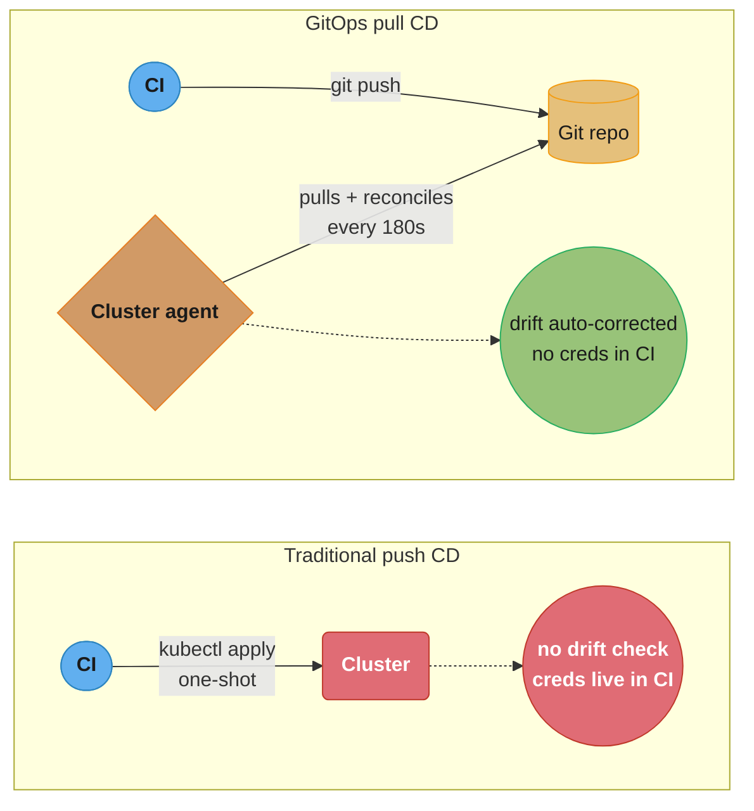
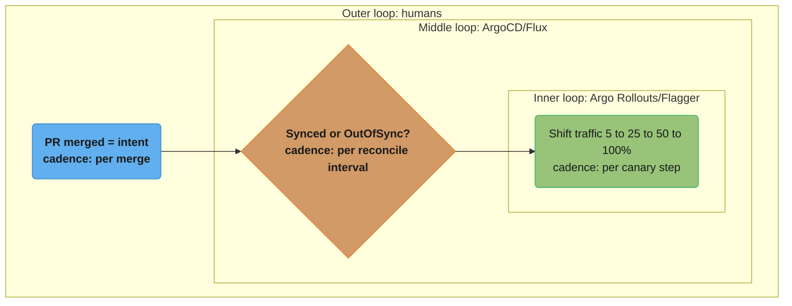
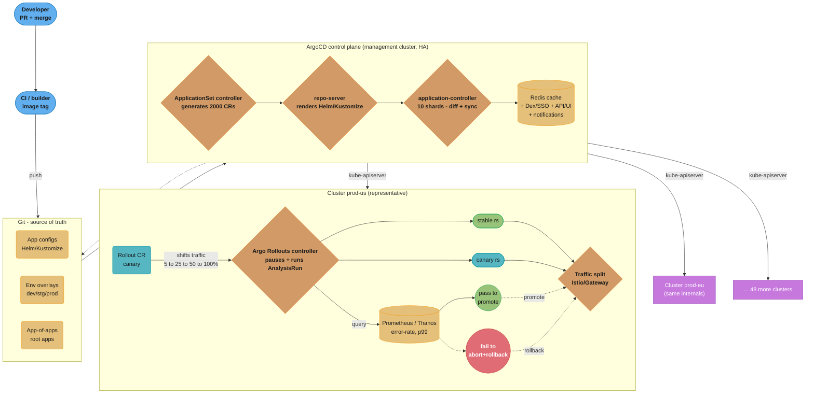
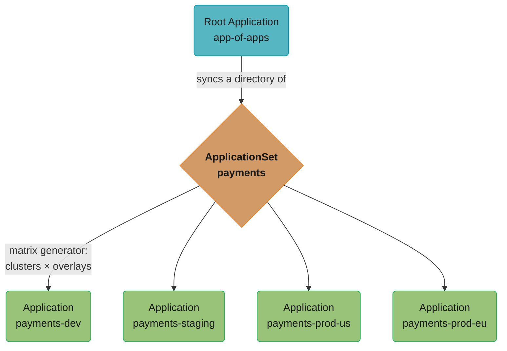
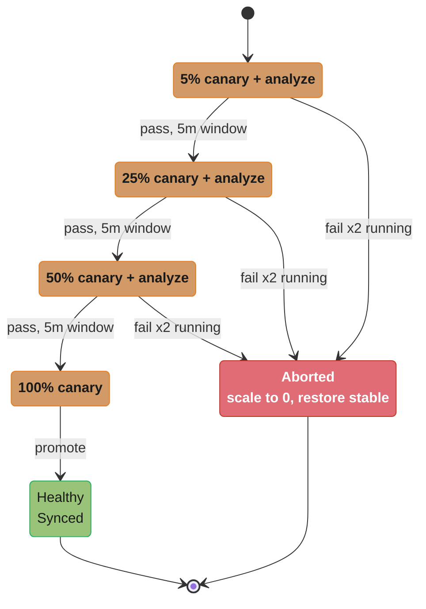
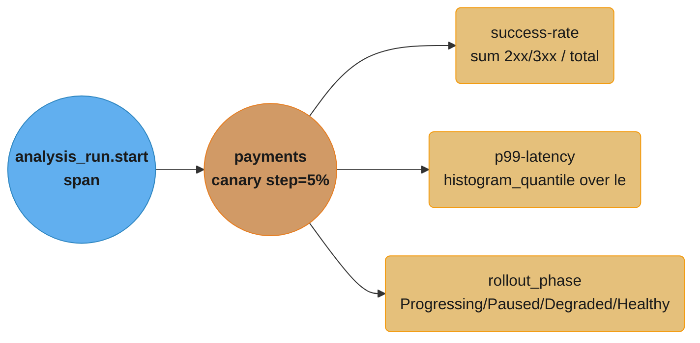

# Design a GitOps Progressive Delivery Pipeline

> Git is the air-traffic-control tower and every cluster is a runway: planes (Deployments) only land when the tower's flight plan (the Git commit) says so, and a delivery controller continuously walks the apron confirming each parked plane matches its slip — any plane that taxis on its own gets towed back into position.

**Key insight:** GitOps inverts the deployment direction. Nothing is *pushed* into clusters; an in-cluster agent *pulls* the declared state from Git and reconciles reality toward it on a loop. Progressive delivery then layers a *control loop on top of the control loop*: a rollout controller shifts traffic in slices, queries metrics, and either promotes or aborts — so the riskiest moment of any release (the first 1% of production traffic) is gated by data, not by a human staring at Grafana at 2am.

---

## Intuition

A traditional CD pipeline is a *fire-and-forget* push: Jenkins runs `kubectl apply`, exits 0, and walks away. If someone later hand-edits a Deployment, drift accumulates silently until an incident. If the new image crashes only under real traffic, you find out from PagerDuty.

GitOps fixes both problems with a single primitive: **a desired-state reconciliation loop running inside the cluster**, with Git as the single source of truth.



*Same information flow, inverted: push CD hands cluster credentials to CI and never notices drift; pull CD keeps credentials in-cluster while an agent reconciles toward Git every 180s and self-corrects drift.*

The mental model has three nested loops:

1. **Outer loop (humans):** engineers open PRs that change YAML in Git. Merge = intent.
2. **Middle loop (ArgoCD/Flux):** the controller diffs Git vs. live cluster state every reconcile interval, and `Synced`/`OutOfSync` is a first-class status.
3. **Inner loop (Argo Rollouts/Flagger):** for one Deployment being updated, a rollout controller shifts 5% → 25% → 50% → 100% of traffic, pausing at each step to run *metric analysis*. A bad p99 or error-rate spike triggers automatic rollback in seconds.



*A control loop nested inside a control loop inside a control loop: a human's PR merge (outer) triggers a Git-vs-cluster diff (middle), and a drifted Rollout resource kicks off a metric-gated traffic shift (inner) — each ring runs on its own cadence, from "per merge" down to "per canary step."*

Why this system exists: at 50 clusters × 500 apps, no human can `kubectl apply` reliably, no human can detect drift across 25,000 live objects, and no human can babysit every one of the ~300 daily deployments. The pipeline must be **declarative** (auditable in Git), **convergent** (self-healing), and **safe-by-default** (metric-gated promotion with automatic rollback). This file designs exactly that, building on [`../gitops_argocd_flux/README.md`](../gitops_argocd_flux/README.md) and [`../deployment_strategies/README.md`](../deployment_strategies/README.md).

---

## 1. Requirements Clarification

### Functional Requirements

- **FR1 — Declarative delivery:** Every workload across all clusters is described by manifests in Git. Applying a change = merging a PR. No out-of-band `kubectl edit`.
- **FR2 — Multi-cluster fan-out:** A single platform team manages **50 clusters** (dev/staging/prod × regions) hosting **500 applications**. New clusters onboard by adding one config entry, not by hand-registering 500 apps.
- **FR3 — App-of-apps / templated generation:** Apps are generated, not hand-written per cluster. Adding a region must not require copying 500 `Application` manifests.
- **FR4 — Sync ordering:** Within an app, resources apply in waves (CRDs → namespaces → DB migrations → Deployments → ingress). DB migration Jobs must complete before the new pods roll.
- **FR5 — Progressive delivery:** Production deploys are canary or blue-green with **metric-driven promotion** (error rate, p99 latency, custom SLIs). No "deploy to 100% and pray."
- **FR6 — Automated rollback:** On SLO breach during a canary, the system aborts and restores the previous version **without human action**.
- **FR7 — Drift detection & self-heal:** Manual changes to live objects are detected within one reconcile cycle and (optionally) auto-reverted.
- **FR8 — Promotion across environments:** A release flows dev → staging → prod through Git promotion (PR / image-updater / merge), with environment-specific config overlays.
- **FR9 — Secrets:** Secrets are delivered declaratively without plaintext in Git (SOPS, Sealed Secrets, or External Secrets Operator).

### Non-Functional Requirements

| NFR | Target |
|-----|--------|
| Sync latency (commit → cluster reconcile begins) | **< 60s** via webhook (vs. 180s default poll) |
| Reconcile coverage | All **500 apps × 50 clusters** ≈ 25,000 `Application`-equivalents reconciled within one interval |
| Automated rollback on SLO breach | **< 2 min** from breach detection to traffic restored |
| Delivery success rate | **99.9%** of syncs reach `Synced/Healthy` without manual intervention |
| Drift detection latency | < 1 reconcile interval (≤ 180s) |
| Controller availability | 99.95% (HA, sharded) |
| Audit | 100% of state changes traceable to a Git commit + author |
| Blast radius | A bad release reaches ≤ 1% of prod traffic before metric gate can abort |

### Out of Scope

- CI / image build (covered by [`../ci_cd_fundamentals/README.md`](../ci_cd_fundamentals/README.md)).
- Cluster provisioning / IaC (Terraform — see [`cross_cutting/terraform_state_at_scale.md`](cross_cutting/terraform_state_at_scale.md)).
- Service mesh internals (assumed: Istio or a Gateway-API ingress for traffic splitting).
- Application-level feature flags (complementary, not replaced).
- Supply-chain signing/provenance details — referenced in §9 via [`cross_cutting/supply_chain_security_pipeline.md`](cross_cutting/supply_chain_security_pipeline.md).

---

## 2. Scale Estimation

### Application object count

```
apps                = 500
clusters            = 50  (but each app does not run on all 50)
avg targets per app = 4  (dev, staging, prod-us, prod-eu)
Application objects  = 500 apps × 4 targets = 2,000 Application CRs
live K8s objects/app ≈ 12 (Deploy, Svc, Ingress, HPA, CM, Secret, SA, 2×RBAC, PDB, Rollout, AnalysisTemplate)
total live objects   = 2,000 × 12 = 24,000 objects under management
```

We round NFR2 to "~25,000 managed objects." That's the number the controller's informer caches must hold in memory and re-diff each interval.

### Reconcile throughput

ArgoCD's default `timeout.reconciliation` is **180s**. To touch 2,000 Applications every 180s:

```
required throughput = 2,000 apps / 180s ≈ 11.1 reconciles/sec (steady state)
```

A single application-controller replica handles roughly **25–50 reconciles/sec** depending on manifest size and repo-server cache hit rate, so one shard *can* cover 2,000 apps — but reconcile is CPU-spiky on git-generation. Production rule of thumb: **~150–250 apps per controller shard** to keep p99 reconcile latency < 10s. So:

```
shards = ceil(2,000 / 200) = 10 application-controller shards
```

### Git repo size & manifest volume

```
manifests per app    = 12 files avg, ~80 lines each ≈ ~1 KB/file
per-app repo footprint = 12 KB rendered; with Kustomize overlays ~30 KB
2,000 targets × 30 KB = 60 MB of rendered YAML
mono-repo .git size (with history, 2 yrs, ~300 deploys/day) ≈ 4–8 GB packed
```

This is why repo-server caching and shallow clones matter — a cold `git clone` of an 8 GB repo across 10 repo-server replicas is a thundering herd.

### Deployment volume & canary windows

```
deployments/day        = 500 apps × ~0.6 deploys/day = ~300 deploys/day
prod deploys/day       ≈ 100 (the rest are dev/staging)
canary steps           = 5% → 25% → 50% → 75% → 100% (5 steps)
analysis window/step   = 5 min (need enough requests for stable metrics)
total canary duration  = 5 steps × 5 min = 25 min/prod release
concurrent prod canaries = 100/day over ~10 active hours ≈ 10/hr → ~4 in-flight on average
```

Metric stability sanity check: at 5% traffic, a service doing 2,000 req/s sends **100 req/s to the canary**. Over a 5-min window that's **30,000 requests** — enough for a stable error-rate estimate (95% CI width ≈ ±0.25% at p=1% error). At 50 req/s a service, 5% = 2.5 req/s → only 750 requests/window → noisy; such low-traffic apps need longer windows or synthetic load (see §8 promotion math).

### Webhook vs. poll

```
poll-only:  2,000 apps × (1 git ls-remote / 180s) = 11 ls-remote/sec against Git host
            → Git host sees ~960k requests/day just for change detection
webhook:    Git push → ArgoCD webhook → reconcile only the affected app
            → change-detection requests ≈ number of pushes (~300/day) — a 3000× reduction
```

Conclusion: **webhook is mandatory at this scale**; polling is the safety-net fallback (lengthen to 300s).

---

## 3. High-Level Architecture



*CI pushes only an image tag into Git; ArgoCD's control plane renders and diffs against all 50 clusters via webhook (under 60s) or a 300s poll fallback, and inside each cluster the Argo Rollouts controller shifts canary traffic in steps gated by a Prometheus query — pass promotes, fail rolls back to the untouched stable ReplicaSet.*

### Component inventory

| Component | Role |
|-----------|------|
| **Git repo(s)** | Single source of truth: app manifests, env overlays, app-of-apps roots. |
| **ApplicationSet controller** | Templated generation of 2,000 `Application` CRs from cluster/list/git generators. |
| **repo-server** | Clones Git, renders Helm/Kustomize/jsonnet → plain manifests; heavy cache. |
| **application-controller (sharded)** | Diffs desired vs. live, runs sync, detects drift, reports health. |
| **Redis** | Manifest cache + app state cache shared by repo-server and controller. |
| **Argo Rollouts controller** (per workload cluster) | Owns the `Rollout` CR; orchestrates canary traffic steps + `AnalysisRun`. |
| **AnalysisTemplate / AnalysisRun** | Declarative metric queries (Prometheus/Datadog) that gate promotion. |
| **Prometheus / Thanos** | Source of SLIs the analysis queries; see [`cross_cutting/prometheus_cardinality_and_scale.md`](cross_cutting/prometheus_cardinality_and_scale.md). |
| **Traffic router** | Istio VirtualService / Gateway API HTTPRoute / SMI — splits stable vs. canary. |
| **Secrets backend** | External Secrets Operator + AWS Secrets Manager, or SOPS-encrypted files. |

### Data flow narrative

1. CI builds an image and writes the new tag into Git (via Argo CD Image Updater or a CI PR).
2. Git webhook hits the ArgoCD API; the affected `Application` is queued for immediate reconcile (<60s vs. 180s poll).
3. repo-server renders the manifests (Kustomize overlay for that env) and returns them to the controller shard owning that app.
4. The controller diffs rendered manifests against live cluster state. If `OutOfSync`, it applies in **sync-wave order**, running pre-sync hooks (DB migration Job) first.
5. The applied `Rollout` spec change triggers the Argo Rollouts controller in the target cluster, which spins a canary ReplicaSet and shifts 5% of traffic.
6. At each pause, an `AnalysisRun` queries Prometheus for error-rate and p99. **Pass → next step. Fail → abort, scale canary to 0, route 100% back to stable.**
7. On full promotion the canary becomes stable; ArgoCD now reports `Synced/Healthy`.

Multi-region topology and cross-cluster routing detail lives in [`cross_cutting/multi_cluster_networking.md`](cross_cutting/multi_cluster_networking.md).

---

## 4. Component Deep Dives

### 4.1 App-of-apps + ApplicationSet (fan-out generation)

The naive approach is one hand-written `Application` per app per cluster — 2,000 files. That doesn't scale: onboarding a new region means 500 copy-paste PRs. Instead, an **app-of-apps root** points at a directory of `ApplicationSet`s, and each `ApplicationSet` uses generators to multiply across clusters.



*One root Application fans out through the ApplicationSet's matrix generator (clusters × overlay paths) into one child Application per combination — the mechanism that avoids hand-writing 2,000 manifests.*

```yaml
apiVersion: argoproj.io/v1alpha1
kind: ApplicationSet
metadata:
  name: payments
  namespace: argocd
spec:
  goTemplate: true
  goTemplateOptions: ["missingkey=error"]
  generators:
    - matrix:
        generators:
          # Generator A: every cluster labelled env=prod or env=staging
          - clusters:
              selector:
                matchLabels: { managed-by: argocd }
          # Generator B: the overlay paths inside the repo
          - list:
              elements:
                - overlay: dev
                - overlay: staging
                - overlay: prod
  template:
    metadata:
      name: 'payments-{{.values.overlay}}-{{.name}}'   # name + cluster name
    spec:
      project: payments
      source:
        repoURL: https://git.internal/platform/apps.git
        targetRevision: main
        path: 'apps/payments/overlays/{{.values.overlay}}'
      destination:
        server: '{{.server}}'
        namespace: payments
      syncPolicy:
        automated:
          prune: true
          selfHeal: true
        syncOptions:
          - CreateNamespace=true
          - ApplyOutOfSyncOnly=true   # only PATCH changed objects → fewer API calls
```

`ApplyOutOfSyncOnly=true` is the scale lever: without it the controller re-applies all 24,000 objects every sync; with it only the drifted subset is PATCHed, cutting kube-apiserver write load by ~95% in steady state.

### 4.2 Sync waves & hooks (ordering)

Within an app, resources must apply in order. ArgoCD uses the `argocd.argoproj.io/sync-wave` annotation (lower = earlier). Negative waves run before positive ones; hooks run at defined phases.

```yaml
# Wave -2: CRDs must exist before anything references them
apiVersion: apiextensions.k8s.io/v1
kind: CustomResourceDefinition
metadata:
  annotations: { argocd.argoproj.io/sync-wave: "-2" }
---
# Wave -1, PreSync hook: DB migration Job must finish before pods roll
apiVersion: batch/v1
kind: Job
metadata:
  name: db-migrate
  annotations:
    argocd.argoproj.io/hook: PreSync
    argocd.argoproj.io/hook-delete-policy: HookSucceeded
    argocd.argoproj.io/sync-wave: "-1"
spec:
  backoffLimit: 2
  template:
    spec:
      restartPolicy: Never
      containers:
        - name: migrate
          image: registry.internal/payments:migrate-v42
          command: ["/app/migrate", "up"]
---
# Wave 0: the workload (default)
apiVersion: argoproj.io/v1alpha1
kind: Rollout
metadata:
  annotations: { argocd.argoproj.io/sync-wave: "0" }
```

ArgoCD blocks wave N+1 until every resource in wave N is `Healthy`. A failed PreSync migration Job aborts the whole sync — the new Deployment never rolls against an unmigrated schema.

### 4.3 Argo Rollouts canary with AnalysisTemplate — BROKEN → FIX

This is where most teams get burned. Here is a canary that **looks** safe but silently promotes broken releases.

**BROKEN:**

```yaml
apiVersion: argoproj.io/v1alpha1
kind: Rollout
metadata: { name: payments }
spec:
  strategy:
    canary:
      steps:
        - setWeight: 5
        - pause: { duration: 60s }      # PROBLEM 1: time-based pause, no metric gate
        - setWeight: 50
        - pause: { duration: 60s }
        - setWeight: 100
---
apiVersion: argoproj.io/v1alpha1
kind: AnalysisTemplate
metadata: { name: success-rate }
spec:
  metrics:
    - name: success-rate
      interval: 30s
      provider:
        prometheus:
          address: http://prometheus.monitoring:9090
          query: |
            sum(rate(http_requests_total{job="payments",code!~"5.."}[2m]))
            / sum(rate(http_requests_total{job="payments"}[2m]))
      # PROBLEM 2: no successCondition AND no failureCondition
      # → the AnalysisRun can NEVER fail. It always reports Successful.
```

Two defects:
1. The canary uses **time-based `pause` only** — it never references the analysis at all, so even a template with a failure condition would be ignored.
2. The `AnalysisTemplate` defines a query but **no `successCondition` and no `failureCondition`**, so Argo Rollouts has no rule to evaluate against; an `AnalysisRun` with measurements but no condition is treated as `Successful`. A release returning 100% HTTP 500s promotes to 100% traffic. Real outage shape: 4 minutes of total payment failure before someone notices.

**FIX:**

```yaml
apiVersion: argoproj.io/v1alpha1
kind: Rollout
metadata: { name: payments }
spec:
  strategy:
    canary:
      maxSurge: "25%"
      maxUnavailable: 0
      analysis:                       # FIX: run analysis as a background gate
        templates:
          - templateName: success-rate
        startingStep: 1               # begin analyzing after the first weight step
        args:
          - name: service
            value: payments
      steps:
        - setWeight: 5
        - pause: { duration: 5m }     # 5% for 5m → ~30k canary requests, stable signal
        - setWeight: 25
        - pause: { duration: 5m }
        - setWeight: 50
        - pause: { duration: 5m }
        - setWeight: 100
      trafficRouting:
        istio:
          virtualService: { name: payments-vs }
---
apiVersion: argoproj.io/v1alpha1
kind: AnalysisTemplate
metadata: { name: success-rate }
spec:
  args:
    - name: service
  metrics:
    - name: success-rate
      interval: 30s
      count: 8                        # 8 measurements over the step window
      successCondition: result[0] >= 0.99      # FIX: explicit pass rule
      failureCondition: result[0] <  0.95      # FIX: explicit hard fail
      failureLimit: 2                 # 2 consecutive failures → abort the rollout
      provider:
        prometheus:
          address: http://prometheus.monitoring:9090
          query: |
            sum(rate(http_requests_total{job="{{args.service}}",code!~"5.."}[2m]))
            / sum(rate(http_requests_total{job="{{args.service}}"}[2m]))
    - name: p99-latency
      interval: 30s
      count: 8
      successCondition: result[0] <= 0.300     # 300ms p99 ceiling
      failureCondition: result[0] >  0.500
      failureLimit: 2
      provider:
        prometheus:
          address: http://prometheus.monitoring:9090
          query: |
            histogram_quantile(0.99,
              sum(rate(http_request_duration_seconds_bucket{job="{{args.service}}"}[2m]))
              by (le))
```

Now the rollout is metric-gated: two consecutive measurements below 95% success **or** above 500ms p99 abort the rollout, scale the canary to 0, and route 100% back to stable — all without human action, satisfying NFR6 (< 2 min rollback). The `failureLimit: 2` prevents a single noisy scrape from aborting a healthy release.



*The FIX turns each canary step into a gated state transition: two consecutive `failureCondition` breaches at any weight abort to the untouched stable ReplicaSet in under 2 minutes (NFR6), while the BROKEN version had no such gate and could only ever reach Healthy.*

### 4.4 Drift detection & self-heal — BROKEN → FIX (the PVC-deleting prune)

Self-heal reverts manual changes; prune deletes objects no longer in Git. Combined carelessly they can **delete stateful data**.

**BROKEN:** an app sets `prune: true, selfHeal: true` and the team manually creates a PVC via `kubectl` during an incident (to attach a debug volume). On the next reconcile, ArgoCD sees the PVC is not in Git and **prunes it** — taking the bound PV and its data with it if the StorageClass `reclaimPolicy: Delete`.

```yaml
syncPolicy:
  automated:
    prune: true       # deletes anything not in Git, including that PVC...
    selfHeal: true    # ...and reverts any field you hand-edit
```

**FIX:** protect stateful and out-of-band resources with sync options and prune protection, and never let prune cascade to data.

```yaml
syncPolicy:
  automated:
    prune: true
    selfHeal: true
  syncOptions:
    - PruneLast=true            # prune only after everything else is healthy
    - PrunePropagationPolicy=foreground
---
# On the PVC itself: opt out of pruning so a hand-created or retained volume survives
apiVersion: v1
kind: PersistentVolumeClaim
metadata:
  name: payments-data
  annotations:
    argocd.argoproj.io/sync-options: Prune=false      # never prune this
    argocd.argoproj.io/compare-options: IgnoreExtraneous
```

Belt-and-suspenders: set `reclaimPolicy: Retain` on the StorageClass so even an erroneous PVC delete leaves the PV (and data) intact for re-binding. Drift on stateful objects should alert, not auto-delete. The reconcile loop in Go terms is conceptually:

```go
// Simplified application-controller reconcile (pseudocode of the real loop)
func (c *Controller) reconcile(app *Application) {
    desired := c.repoServer.Render(app.Spec.Source)        // render Git → manifests
    live    := c.cluster.List(app.Spec.Destination)        // current cluster state
    diff    := Diff(desired, live)                          // structured 3-way merge

    app.Status.Sync = Synced
    for _, d := range diff {
        if d.Type == Extraneous && !d.PruneAllowed() {     // FIX honored here
            continue                                        // skip prune-protected objects
        }
        if d.OutOfSync {
            app.Status.Sync = OutOfSync
            if app.Spec.SyncPolicy.SelfHeal {
                c.applyInWaveOrder(d)                       // self-heal respects sync-waves
            }
        }
    }
    c.recordHealth(app)                                    // drives Synced/Healthy status
}
```

---

## 5. Design Decisions & Tradeoffs

### Decision 1 — ArgoCD vs. Flux

- **Choice:** ArgoCD as the primary controller.
- **Alternatives:** Flux v2 (GitOps Toolkit), Spinnaker.
- **Rationale:** ArgoCD ships a powerful UI/RBAC, `ApplicationSet` for fan-out, and tight Argo Rollouts integration — valuable when 50 clusters and a platform team of humans need visibility. Flux is more Kubernetes-native (everything is a CRD, no central UI), composes cleanly, and has a smaller footprint, but multi-cluster fan-out and the human-facing dashboard need extra glue.
- **Consequences:** ArgoCD becomes a centralized control plane (a blast-radius concern — mitigated by sharding + HA). Flux's per-cluster model has no single dashboard but no single point of failure either.

### Decision 2 — Pull vs. Push delivery

- **Choice:** Pull (agent reconciles from Git).
- **Alternatives:** Push (CI runs `kubectl apply`).
- **Rationale:** Pull keeps **cluster credentials out of CI**, enables drift detection, and makes Git the audit log. Push is simpler for a single cluster but leaks creds and detects no drift.
- **Consequences:** Slight latency (reconcile interval) vs. instant push; needs in-cluster agents to be healthy.

### Decision 3 — Mono-repo vs. per-app repo

- **Choice:** Mono-repo for config, per-team directories with CODEOWNERS.
- **Alternatives:** One repo per app (2,000 repos).
- **Rationale:** Mono-repo gives atomic cross-app changes and one webhook; per-app repos isolate blast radius but multiply webhook/clone overhead 2,000×.
- **Consequences:** Mono-repo `.git` grows to multi-GB (see §2) and a bad root commit can affect many apps — mitigated by path-scoped ApplicationSets and CODEOWNERS gates.

### Decision 4 — Canary vs. Blue-Green

- **Choice:** Canary with metric analysis for stateless web apps; blue-green for apps needing instant atomic cutover (schema-coupled services).
- **Alternatives:** Pure blue-green everywhere, or recreate.
- **Rationale:** Canary limits blast radius to ≤ 1% (NFR) and gives gradual metric signal; blue-green doubles capacity cost but gives instant rollback.
- **Consequences:** Canary needs a traffic router (Istio/Gateway API) and good SLIs; blue-green needs 2× capacity during the cutover window.

### Decision 5 — Self-heal ON vs. OFF

- **Choice:** ON in prod for stateless apps; OFF (alert-only) for stateful and break-glass namespaces.
- **Rationale:** Auto-revert enforces Git as truth and kills config drift; but it fights legitimate incident-time manual fixes and can delete data (§4.4).
- **Consequences:** Need prune protection annotations and a documented break-glass flow that pauses an app's auto-sync.

### Decision 6 — Secrets approach

- **Choice:** External Secrets Operator (ESO) syncing from AWS Secrets Manager.
- **Alternatives:** Sealed Secrets, SOPS-in-Git, Vault Agent Injector.
- **Rationale:** ESO keeps zero ciphertext in Git and rotates centrally; Sealed Secrets keeps encrypted blobs in Git (simple, but rotation is awkward); SOPS is great for small teams; Vault is powerful but heavier to operate.
- **Consequences:** ESO adds a runtime dependency on the cloud secrets API; an outage there blocks new secret materialization.

### Comparison table

| Dimension | ArgoCD | Flux v2 | Spinnaker |
|-----------|--------|---------|-----------|
| Model | Central control plane + UI | Per-cluster CRDs, no UI | Pipeline engine, heavy |
| Multi-cluster fan-out | ApplicationSet (strong) | Kustomize + cluster API (manual) | Native but complex |
| Drift detection | First-class | First-class | Weak |
| Progressive delivery | Argo Rollouts | Flagger | Built-in (deck) |
| Operational weight | Medium | Light | Heavy |
| Best fit here | **Primary** | Edge/per-cluster | Legacy multi-cloud |

| Secrets option | Ciphertext in Git? | Rotation | Runtime dep |
|----------------|--------------------|----------|-------------|
| Sealed Secrets | Yes (encrypted) | Manual reseal | Controller only |
| SOPS + age/KMS | Yes (encrypted) | Re-encrypt + commit | KMS at apply |
| External Secrets Operator | **No** | Central, automatic | Cloud secrets API |
| Vault Agent Injector | No | Central, automatic | Vault cluster |

---

## 6. Real-World Implementations

- **Intuit (ArgoCD's birthplace).** ArgoCD was created by Intuit's platform team and donated to the CNCF (now graduated). Intuit runs **thousands of applications across hundreds of clusters**; they drove the sharded application-controller and `ApplicationSet` precisely because a single controller could not reconcile their app count. Public KubeCon talks describe per-shard reconcile tuning and Redis cache sizing — the exact bottleneck modeled in §2 and §10.

- **Adobe.** Runs ArgoCD at large multi-cluster scale for internal platforms, contributing to ApplicationSet and progressive-delivery patterns. Adobe publicly discussed managing thousands of Application objects and using cluster generators to onboard new clusters without per-app PRs — the FR3 requirement made concrete.

- **BlackRock.** Standardized on ArgoCD + Argo Rollouts for regulated financial workloads, emphasizing **Git as the audit trail** (every prod change traceable to a signed commit + approver) and metric-gated canaries to satisfy change-management controls. Their constraint set is closest to NFR's "100% audit" line.

- **Red Hat OpenShift GitOps.** Ships ArgoCD as a supported Operator (OpenShift GitOps), giving enterprises a vendor-backed control plane with RBAC integrated into OpenShift SSO. This is how many regulated shops adopt ArgoCD without self-operating it.

- **Weaveworks / Flux.** Weaveworks coined "GitOps" (2017) and built Flux + Flagger. Flagger pioneered the Flagger-style canary with automated metric analysis and webhooks for load testing during analysis windows — the conceptual ancestor of the AnalysisTemplate in §4.3. Flux is now CNCF-graduated and runs the per-cluster GitOps model at organizations preferring no central UI.

- **Codefresh (now Octopus).** Built a commercial ArgoCD distribution (GitOps Cloud) adding dashboards across many ArgoCD instances, runtime metrics, and a hosted control plane — addressing the "single control plane is a blast radius" concern from Decision 1 by federating multiple ArgoCD installs.

---

## 7. Technologies & Tools

| Tool | Type | Strengths | Weaknesses | Use when |
|------|------|-----------|------------|----------|
| **ArgoCD** | GitOps CD controller | UI, RBAC, ApplicationSet fan-out, Rollouts integration | Central control plane = blast radius; needs sharding at scale | Many clusters + human-facing platform |
| **Flux v2** | GitOps CD toolkit | Native CRDs, light, composable, no SPOF UI | No central UI; multi-cluster fan-out is manual | Per-cluster GitOps, edge, GitOps-toolkit composition |
| **Argo Rollouts** | Progressive delivery | Canary + blue-green, AnalysisTemplate, traffic routing (Istio/SMI/Gateway) | Adds a `Rollout` CR (not vanilla Deployment) | Metric-gated canary on ArgoCD |
| **Flagger** | Progressive delivery | Works with Deployments directly, webhooks for load test, Slack alerts | Couples to a mesh; less flexible step DSL than Rollouts | Flux shops, mesh-native canaries |
| **Spinnaker** | Pipeline CD | Multi-cloud, mature canary (Kayenta) | Heavy, JVM-hungry, complex ops | Legacy multi-cloud orgs |

Picks for this design: **ArgoCD + ApplicationSet** (delivery + fan-out), **Argo Rollouts + AnalysisTemplate** (progressive delivery), **Prometheus/Thanos** (SLIs), **External Secrets Operator** (secrets), **Istio or Gateway API** (traffic split).

---

## 8. Operational Playbook

### (a) Progressive-analysis / promotion gate — the metric math

Promotion is a hypothesis test: *"is the canary's error rate not worse than stable?"* You need enough samples per step for the decision to be statistically meaningful rather than noise.

```
Let p          = baseline error rate (e.g. 0.5% = 0.005)
Let canary_rps = total_rps × weight  (e.g. 2000 × 0.05 = 100 rps)
Let window     = step pause (5 min = 300 s)
samples        = canary_rps × window = 100 × 300 = 30,000 requests

95% CI half-width for error-rate estimate:
  ε ≈ 1.96 × sqrt(p(1-p) / samples)
    = 1.96 × sqrt(0.005 × 0.995 / 30000)
    ≈ 1.96 × sqrt(1.66e-7)
    ≈ 1.96 × 4.07e-4 ≈ 0.0008  → ±0.08%
```

So with 30,000 requests you can resolve a true error rate to ±0.08% — a `failureCondition: result[0] < 0.95` (5% errors) is detected almost instantly and reliably. But for a **low-traffic app at 50 rps**, 5% weight = 2.5 rps → only 750 samples/window → ε ≈ ±0.5%, too noisy for a 1% threshold. Remedies: (1) lengthen the window, (2) raise the first weight to 25%, or (3) drive synthetic load during analysis (Flagger-style webhook load test).

Tie the failure threshold to your **error budget**: if the SLO is 99.9% (budget 0.1%), a canary burning budget at >14× the sustainable rate should abort. The burn-rate math for choosing that multiplier is in [`cross_cutting/slo_error_budget_math.md`](cross_cutting/slo_error_budget_math.md).

```
# Canary abort decision (per analysis interval)
abort if  (canary_error_rate − stable_error_rate) > threshold  for failureLimit intervals
threshold derived from: error_budget × burn_rate_multiplier
```

### (b) Observability for rollouts (OTel / Prometheus)

Instrument three layers and expose them as Prometheus series the AnalysisTemplate can query:



*Each AnalysisRun step emits one span with three child metrics — success-rate and p99-latency gate promotion, while rollout_phase reports controller state for alerting.*

Required labels: `app`, `version` (stable vs. canary — this is the dimension the query splits on), `cluster`, `rollout_step`. **Watch cardinality:** `version` is a per-release churning label; if you also add `pod`, `commit_sha`, and `replicaset`, the series count for one app explodes to thousands and Prometheus OOMs across 500 apps. Keep canary-comparison labels to `{app, version, cluster}` and drop high-churn ones at scrape time — the cardinality budget and relabeling rules are in [`cross_cutting/prometheus_cardinality_and_scale.md`](cross_cutting/prometheus_cardinality_and_scale.md).

Export Argo Rollouts' own `/metrics`: `rollout_info`, `rollout_phase`, `analysis_run_metric_phase` — alert on `analysis_run_metric_phase{phase="Error"}` (the analysis itself failing, e.g. Prometheus unreachable, which would otherwise stall a rollout).

### (c) Runbooks

**Runbook 1 — Stuck sync (`OutOfSync` won't converge).**
- *Symptom:* App stuck `OutOfSync`/`Progressing` for >10 min; no error in UI.
- *Diagnosis:* `argocd app diff <app>` shows a field that keeps reverting → likely a mutating webhook or controller injecting a field not in Git (e.g. `replicas` owned by HPA). Check repo-server logs for render errors and `argocd app get <app> --show-operation`.
- *Mitigation:* Add `ignoreDifferences` for HPA-owned `spec.replicas`; if a PreSync hook Job is failing, inspect its pod logs.
- *Resolution:* Codify the ignore rule in the Application; re-sync. Add an alert on `argocd_app_sync_total{phase="Error"}`.

**Runbook 2 — Failed/incomplete rollback during canary.**
- *Symptom:* AnalysisRun went `Failed` but traffic still partly on canary.
- *Diagnosis:* `kubectl argo rollouts get rollout <name>` — is the traffic router (Istio VirtualService) actually updated? A mismatch between Rollout's `trafficRouting` and the live VS means the abort scaled the canary RS but didn't reset weights.
- *Mitigation:* `kubectl argo rollouts abort <name>` then `undo`; manually patch the VirtualService to 100% stable if the router is wedged.
- *Resolution:* Validate the `trafficRouting` block references the correct VS name; add an integration test that asserts weights reset on abort.

**Runbook 3 — Drift storm (mass `OutOfSync` across many apps).**
- *Symptom:* Hundreds of apps flip `OutOfSync` simultaneously.
- *Diagnosis:* Usually a cluster-wide change — a mutating admission webhook deployed, a new default annotation, or a Kustomize base bumped. Check whether the diff is identical across apps (`argocd app diff` on a sample).
- *Mitigation:* If self-heal is ON it will fight the webhook — temporarily set `selfHeal: false` on affected ApplicationSet to stop the thrash; add the injected field to `ignoreDifferences`.
- *Resolution:* Fix the base or add the global ignore; re-enable self-heal. See [`cross_cutting/kubernetes_production_hardening.md`](cross_cutting/kubernetes_production_hardening.md) for admission-webhook ordering pitfalls.

**Runbook 4 — App-of-apps cascade (a bad root commit breaks many children).**
- *Symptom:* One PR to the root app-of-apps deletes or misconfigures dozens of child Applications.
- *Diagnosis:* `argocd app history <root>` to find the offending revision; check whether children were *pruned* (deleted) vs. just `OutOfSync`.
- *Mitigation:* Revert the root commit in Git (GitOps rollback = `git revert`); set the root app's `prune: false` temporarily to stop further child deletion.
- *Resolution:* Protect the root with CODEOWNERS + required reviews, and gate root changes behind a staging ArgoCD instance first.

---

## 9. Common Pitfalls & War Stories

1. **The non-failing canary (anonymized fintech, ~$180k).** A team shipped the §4.3 BROKEN config — analysis template with no `failureCondition`. A release that returned 100% HTTP 500 on the payments path promoted straight to 100% over 8 minutes of time-based pauses. **Impact:** ~8 min of total payment-API outage, ~$180k in failed transactions and ~6,000 affected checkouts. Root cause: AnalysisRun always `Successful` with no condition. Fix: mandatory `failureCondition` lint in CI; added `failureLimit: 2`.

2. **Prune ate the database (anonymized SaaS, 90 min downtime).** `prune: true` plus a hand-created PVC during an incident; next reconcile pruned the PVC with `reclaimPolicy: Delete`, destroying a 40 GB Postgres volume. **Impact:** 90 min restore from snapshot, ~12,000 users degraded. Fix: `Prune=false` annotation on all PVCs + `reclaimPolicy: Retain` (see §4.4).

3. **Reconcile thundering herd (platform team, 30 min control-plane down).** A single ArgoCD application-controller managed 1,800 apps; a Redis cache flush forced full re-render of every app at once, pegging repo-server CPU and stalling all syncs for 30 min. **Impact:** no deploys org-wide for half an hour during a release freeze deadline. Fix: shard to 10 controllers (§10), size Redis for the full manifest set, stagger reconciles.

4. **Webhook missing → 3-hour stale prod (e-commerce).** Git webhook was misconfigured after a Git host migration; ArgoCD silently fell back to the 180s poll, but the poll interval had been lengthened to 1h "to reduce Git load." A hotfix sat unmerged-to-cluster for ~3 hours. **Impact:** known bug live 3h longer than believed. Fix: alert on `argocd_app_reconcile` age; keep poll fallback ≤ 300s; monitor webhook delivery.

5. **Supply-chain: unsigned image promoted to 50 clusters (security incident).** Image Updater auto-promoted a `latest`-tagged image that had not passed signing/provenance checks; it deployed to all prod clusters before scanning flagged a vulnerable base layer. **Impact:** emergency rollback across 50 clusters, 4-hour incident, mandatory CVE disclosure. Fix: admission policy requiring a valid signature + SBOM before any image runs; pin digests not tags. Full pipeline controls in [`cross_cutting/supply_chain_security_pipeline.md`](cross_cutting/supply_chain_security_pipeline.md).

6. **Self-heal vs. autoscaler fight (latency spikes, ~$0 but pages galore).** ArgoCD self-heal kept resetting `replicas: 3` while HPA scaled to 20 under load, causing it to repeatedly scale back down mid-traffic-spike. **Impact:** p99 latency 5× for ~20 min, on-call paged 14 times. Fix: `ignoreDifferences` on `spec.replicas` for HPA-managed Deployments; remove `replicas` from Git entirely.

---

## 10. Capacity Planning

### Controller sharding formula

```
shards            = ceil(total_apps / apps_per_shard)
apps_per_shard    = chosen so p99 reconcile latency < 10s  (≈ 150–250 apps)
reconcile_rate    = total_apps / reconcile_interval         (steady-state floor)
controller_cpu    ≈ 0.5–1.0 vCPU per 100 apps (render-heavy Helm pushes higher)
controller_mem    ≈ informer cache: ~1–2 KB per managed object
```

### Worked example (2,000 Applications, 24,000 objects)

```
apps_per_shard    = 200
shards            = ceil(2000 / 200) = 10 application-controller replicas
reconcile_rate    = 2000 / 180s ≈ 11.1 reconciles/sec (floor); webhook handles spikes

Per-shard sizing (200 apps, ~2,400 objects):
  CPU   = ~1.5 vCPU (render + diff bursts)  → request 1, limit 2
  Mem   = informer cache 2,400 obj × 1.5 KB ≈ 3.6 MB cache
          + Go runtime + diff buffers       → request 1.5 Gi, limit 2 Gi

repo-server (manifest render, the real CPU hog):
  replicas = 6, each 2 vCPU / 2 Gi, with Redis manifest cache (hit rate >90%)
  Redis    = manifests for 2,000 apps × ~30 KB ≈ 60 MB working set → 4 GB instance (headroom)

Total control-plane footprint:
  10 controllers × (1.5 vCPU, 1.5 Gi)  = 15 vCPU, 15 Gi
   6 repo-servers × (2 vCPU, 2 Gi)     = 12 vCPU, 12 Gi
   Redis (4 GB) + API/UI + Dex         ≈ 4 vCPU, 8 Gi
  Total ≈ 31 vCPU, 35 Gi  → ~4× m6i.2xlarge (8 vCPU/32Gi) on EKS
  Cost ≈ 4 × ~$0.38/hr × 730 hr ≈ $1,110/mo + Git host + Prometheus
```

This control-plane cost (~$1.1k/mo) manages 50 clusters and 500 apps — the marginal cost of GitOps is tiny relative to the workload clusters themselves. As app count grows, add shards linearly; the binding constraint is repo-server render throughput, not the controller diff. For workload-cluster sizing, node-level hardening, and PodDisruptionBudget/QoS settings that keep these controllers stable, see [`cross_cutting/kubernetes_production_hardening.md`](cross_cutting/kubernetes_production_hardening.md).

Scaling trigger table:

| Signal | Threshold | Action |
|--------|-----------|--------|
| p99 reconcile latency | > 10s sustained | add a controller shard |
| repo-server CPU | > 70% sustained | add repo-server replica |
| Redis cache hit rate | < 85% | grow Redis / raise cache TTL |
| webhook delivery lag | > 60s | check Git host + webhook queue |
| AnalysisRun `Error` rate | > 1% | check Prometheus reachability from clusters |

---

## 11. Interview Discussion Points

**Q1. Why pull-based GitOps over a push pipeline that just runs `kubectl apply`?**
Pull keeps cluster credentials out of CI, enables continuous drift detection, and makes Git the audit log of record. A push pipeline is a one-shot fire-and-forget: it can't tell you that someone hand-edited a Deployment afterward, and it must hold prod kube-creds in the CI system (a juicy attack target). The tradeoff is a small reconcile-interval latency vs. push's instant apply, and you depend on in-cluster agents being healthy — both acceptable given the audit and drift wins.

**Q2. How do you fan out 500 apps to 50 clusters without writing 2,000 Application manifests?**
ApplicationSet with generators. A matrix generator crosses a `clusters` generator (every cluster matching a label selector) with a `list` or `git` generator (the overlay paths), templating one `Application` per combination. Onboarding a new cluster is then a one-line label on the cluster secret, and ApplicationSet materializes all relevant apps automatically — satisfying the "new region without 500 PRs" requirement.

**Q3. What makes a canary actually safe, beyond just shifting traffic gradually?**
The metric gate. Shifting 5% → 100% with time-based pauses alone promotes broken releases on schedule (the §4.3 BROKEN case). Safety comes from an AnalysisTemplate with explicit `successCondition` *and* `failureCondition`, a `failureLimit` to ignore single noisy scrapes, enough requests per window for statistical significance, and traffic routing wired so abort actually resets weights. Without the failure condition the AnalysisRun can never fail.

**Q4. How fast can you roll back, and what triggers it?**
Sub-2-minute automated rollback. During canary, an AnalysisRun queries Prometheus every 30s; two consecutive measurements past `failureCondition` (e.g. <95% success or >500ms p99) abort the rollout — scale canary to 0 and route 100% to the untouched stable ReplicaSet. Because stable was never removed, rollback is just a traffic-weight reset, not a redeploy, so it completes in seconds.

**Q5. Self-heal: when do you turn it off?**
On for stateless prod apps (it enforces Git as truth and kills config drift). Off — or alert-only — for stateful resources, HPA-managed replica counts, and break-glass namespaces. Two classic failures: self-heal fighting the HPA over `spec.replicas` (fix with `ignoreDifferences`), and self-heal + prune deleting a hand-created PVC's data. Always pair prune with `Prune=false` annotations on stateful objects and `reclaimPolicy: Retain`.

**Q6. Mono-repo or per-app repos for config?**
Mono-repo with per-team directories and CODEOWNERS for most orgs: atomic cross-app changes, one webhook, simple cloning. Per-app repos give tighter blast-radius isolation but multiply webhook/clone overhead by the app count and make org-wide changes painful. The mono-repo's risks (multi-GB `.git`, a bad root commit) are mitigated with path-scoped ApplicationSets, shallow clones, and protected root branches.

**Q7. How does ArgoCD scale to thousands of apps — what's the bottleneck?**
The application-controller is shardable: `shards = ceil(apps / ~200)`, each shard owning a slice of Applications. But the real CPU hog is the repo-server doing Helm/Kustomize rendering, so you scale repo-server replicas and lean on the Redis manifest cache (>90% hit rate). The diff itself is cheap; rendering and the kube-apiserver write load are the limits. `ApplyOutOfSyncOnly` cuts write load ~95% by PATCHing only drifted objects.

**Q8. How do you handle secrets without plaintext in Git?**
Three viable patterns. External Secrets Operator syncs from a cloud secrets manager so zero ciphertext lives in Git and rotation is central (my default). Sealed Secrets stores encrypted blobs in Git — simple but rotation means resealing. SOPS encrypts values with KMS/age and is decrypted at apply time — great for small teams. The ESO tradeoff is a runtime dependency on the cloud secrets API; if it's down, new secret materialization stalls.

**Q9. Webhook vs. polling for change detection — why does it matter at scale?**
At 2,000 apps, polling means ~11 `git ls-remote`/sec (~960k requests/day) just to detect change, hammering the Git host and adding up to 180s latency. A webhook reconciles only the affected app on push (~300 requests/day) and cuts commit-to-sync latency below 60s. Polling stays as a safety-net fallback at ≤300s — but if you lengthen the fallback to an hour "to save Git load," a missing webhook silently strands prod (a real incident in §9).

**Q10. How do you choose the canary failure threshold?**
Tie it to the error budget and burn rate. If the SLO is 99.9% (0.1% budget), a canary burning budget far faster than sustainable (e.g. >14× over a short window) should abort. Then sanity-check sample size: at 5% weight a 2,000-rps service sends 30,000 requests over a 5-min window, resolving error rate to ±0.08% — plenty. A 50-rps service only gets 750 samples, too noisy, so raise the first weight, lengthen the window, or drive synthetic load. The burn-rate derivation is in [`cross_cutting/slo_error_budget_math.md`](cross_cutting/slo_error_budget_math.md).

**Q11. Sync waves — what problem do they solve and how?**
Ordering within an app. CRDs must exist before CRs reference them; DB migrations must finish before new pods hit the schema; ingress should come last. The `sync-wave` annotation orders resources (lower applies first), and PreSync hooks run migration Jobs before the workload wave. ArgoCD blocks wave N+1 until wave N is Healthy, so a failed migration aborts the sync rather than rolling pods against an unmigrated database.

**Q12. What's the blast radius of the GitOps control plane itself, and how do you contain it?**
A central ArgoCD is a single point of failure and a single bad root commit (app-of-apps) can prune dozens of children. Containment: shard + HA the controllers, protect the root app with `prune: false` and CODEOWNERS, stage root changes through a separate ArgoCD instance, and treat GitOps rollback as `git revert`. Some orgs federate multiple ArgoCD installs (the Codefresh model) so no single control plane owns all clusters.

**Q13. ArgoCD vs. Flux — when would you actually pick Flux?**
Pick Flux when you want a pure Kubernetes-native, CRD-only model with no central UI/SPOF, per-cluster autonomy (edge/IoT, strict tenant isolation), and composition via the GitOps Toolkit. Pick ArgoCD when a platform team needs a dashboard, rich RBAC/SSO, and ApplicationSet fan-out across many clusters. For this 50-cluster/500-app design with a central platform team, ArgoCD's visibility and fan-out win; Flux suits the per-cluster edge cases.
