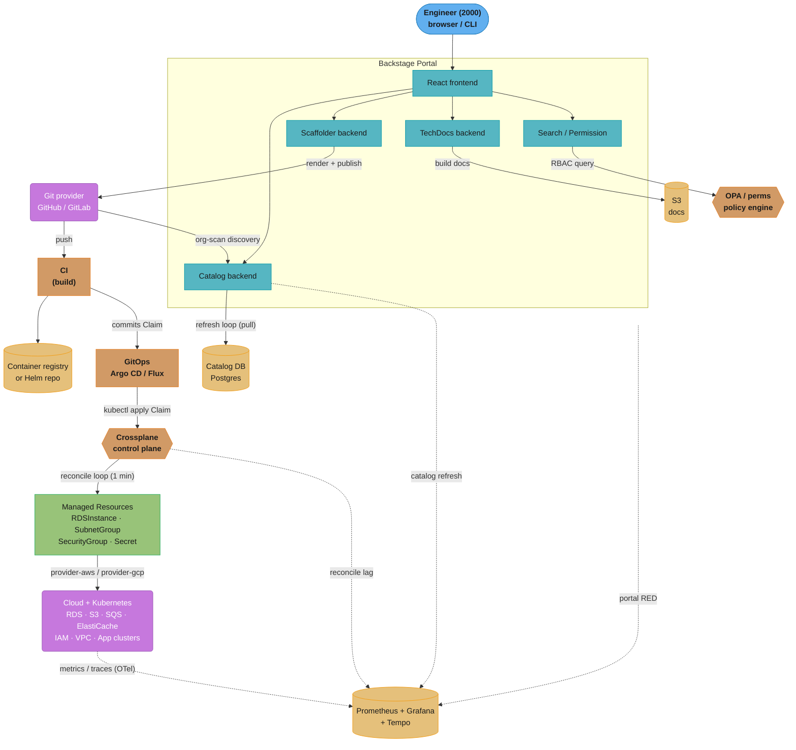
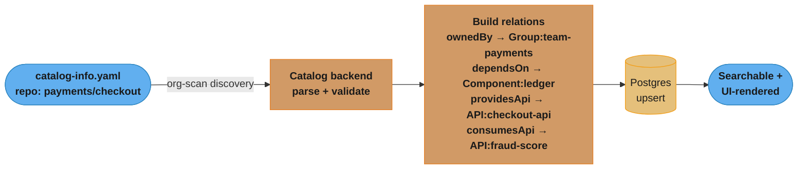
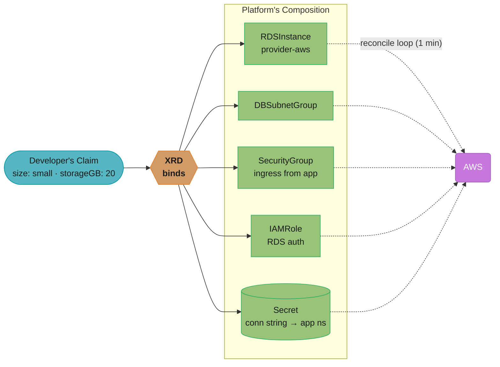
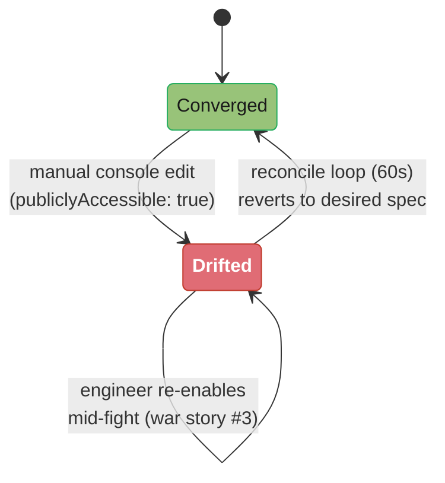
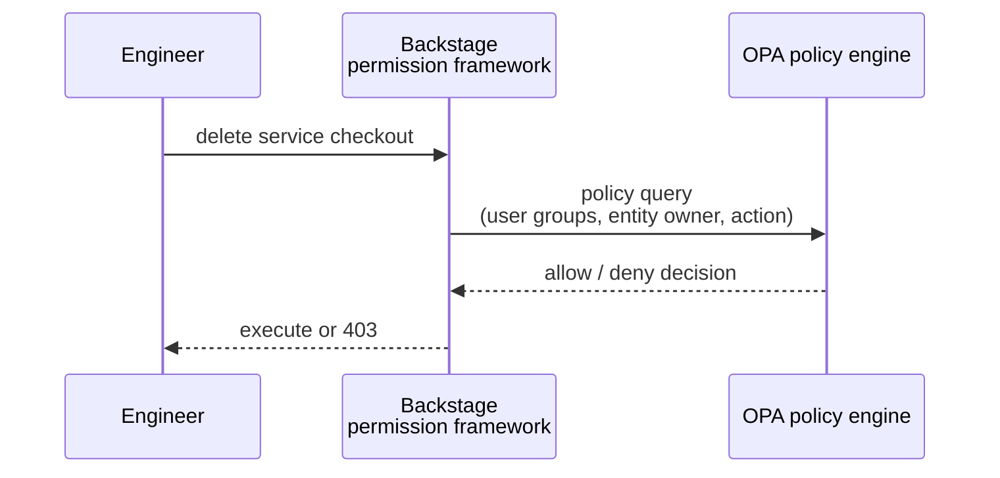
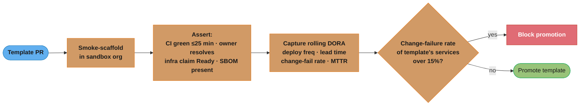
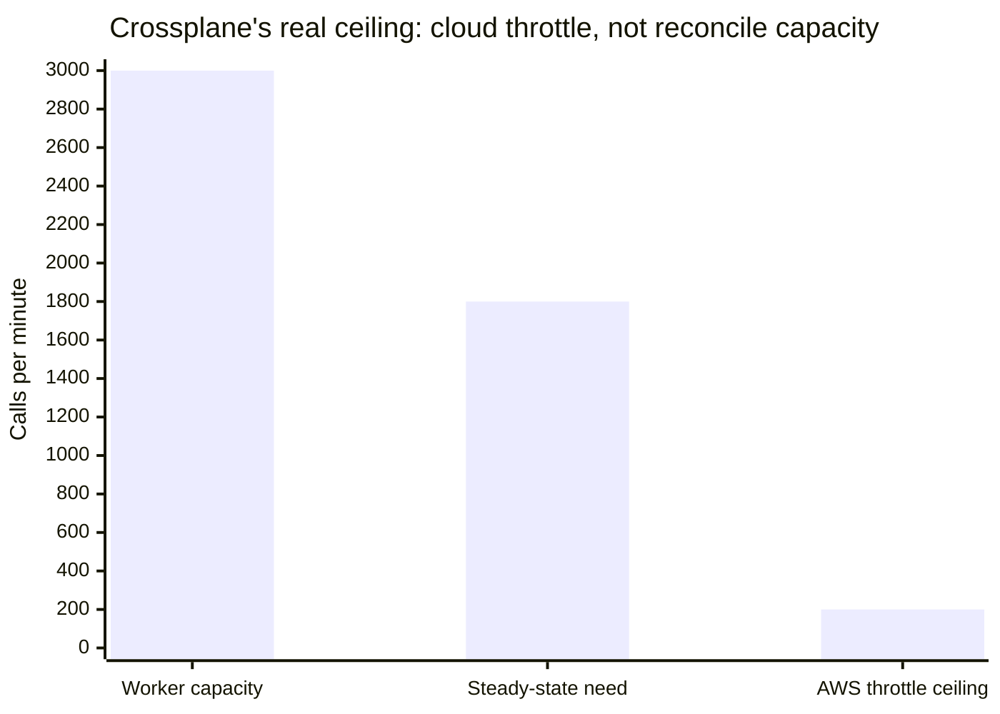

# Design an Internal Developer Platform

> An IDP is the self-checkout lane of infrastructure: the platform team stocks the shelves with paved roads, and any engineer walks up, scans what they need, and walks out with a production-ready service — no ticket queue, no specialist at the register.

**Key insight**: An IDP is not a portal — it is a *control plane*. The UI is the cheap part; the durable value is a reconciliation loop that turns a declarative developer intent ("I want a service named `checkout` with a Postgres") into real, ownership-tagged, policy-compliant cloud resources, and keeps them converged forever.

---

## Intuition

**Analogy.** Think of the platform team as a restaurant kitchen that publishes a *menu* (golden paths). Engineers are diners: they order from the menu instead of walking into the kitchen and operating the stove themselves. The kitchen guarantees every dish is consistent, safe, and traceable to who ordered it. A diner *can* request something off-menu, but that path is slower and explicitly owned.

**Mental model.** Three planes stacked on each other:

1. **Discovery plane** — the software catalog: a graph of every service, API, resource, team, and dependency (4000 entities). Answers "what exists and who owns it."
2. **Creation plane** — the scaffolder: golden-path templates that emit a Git repo, CI pipeline, infra claim, and catalog registration in one transaction. Answers "make me a new thing the right way."
3. **Provisioning plane** — the infra control plane (Crossplane): declarative claims reconciled into live cloud resources. Answers "give me a database / queue / bucket without a ticket."

The portal (Backstage) is the windshield over all three. If you only build the windshield, you have a wiki. The engineering is in the reconciliation underneath.

**Why this system exists.** At 2000 engineers and 4000 services, the bottleneck is no longer compute — it is *coordination*. Without an IDP, every new service is a 6–9 day scavenger hunt across Confluence pages, Slack pings to the platform team, hand-copied Terraform, and a CODEOWNERS file nobody updates. Cognitive load is the tax. An IDP amortizes that tax: the platform team encodes the "right way" once into a template and a composition, and 2000 engineers consume it self-service in under 25 minutes. The shift is from *ticket-ops* (humans translating intent to infra) to *platform-as-product* (intent declared, machines reconcile). See [`../platform_engineering_and_idp/README.md`](../platform_engineering_and_idp/README.md) for the discipline framing.

---

## 1. Requirements Clarification

### Functional Requirements

- **Software catalog**: ingest and index 4000 entities (Components, APIs, Resources, Systems, Domains, Groups, Users). Surface ownership, dependencies, lifecycle, docs, and runtime links per entity.
- **Golden-path scaffolding**: self-service templates that generate a new service (repo + CI + Helm chart + infra claim + catalog registration) end-to-end. Target: a new service is live in CI in **under 25 minutes** vs the pre-IDP baseline of **6–9 business days**.
- **Self-service infrastructure**: developers request infra (Postgres, S3 bucket, SQS queue, Redis, K8s namespace) through the portal; resources provisioned in **under 10 minutes** without a platform-team ticket.
- **TechDocs**: docs-as-code rendered per entity from Markdown in the service repo, searchable, always co-located with the code.
- **RBAC & ownership**: every entity has a required owner (a `Group`); actions (provision DB, delete service) gated by team membership and policy.
- **Plugin ecosystem**: pluggable tabs (CI status, cost, SLO, on-call, security findings) per entity; teams extend the portal without forking it.
- **Search & discovery**: full-text + faceted search across catalog and docs returning in **< 1s p95**.

### Non-Functional Requirements

| Dimension | Target |
|-----------|--------|
| New-service onboarding (intent → CI green) | < 25 min (p90) |
| Self-service infra provision (claim → Ready) | < 10 min (p90) for standard DB/bucket/queue |
| Portal page p95 latency | < 500 ms |
| Catalog search p95 | < 1 s |
| Catalog freshness (Git change → catalog updated) | < 15 min |
| Portal availability | 99.9% (43.2 min/month error budget) |
| Provisioning success rate | > 99.5% of claims reconcile without manual intervention |
| DORA (platform-served services) | Deploy frequency: on-demand (multiple/day); Lead time for change: < 1 day; Change failure rate: < 15%; MTTR: < 1 hour — **elite** band |

### Out of Scope

- The runtime serving plane itself (K8s cluster ops) — cross-referenced, not designed here; see [`cross_cutting/kubernetes_production_hardening.md`](cross_cutting/kubernetes_production_hardening.md).
- The CI/CD execution engine internals (runners, caching) — the IDP *triggers* CI; see [`../gitops_argocd_flux/README.md`](../gitops_argocd_flux/README.md) for the delivery half.
- Cost-allocation/FinOps billing pipelines (consumed as a plugin data source, not built here).
- Identity provider (assume Okta/Entra exists; we consume OIDC groups).

---

## 2. Scale Estimation

**Population.** 2000 engineers, ~200 teams (avg 10 engineers/team), 4000 catalog entities.

**Entity breakdown** (typical ratios at this scale):

```
Components (services/libs/websites)  ~2600   (65%)
APIs (OpenAPI/gRPC/async)             ~700   (17.5%)
Resources (DBs/buckets/queues)       ~450   (11.25%)
Systems                              ~150
Domains                               ~20
Groups (teams)                       ~200
Users                                ~2000  (separate identity entities)
--------------------------------------------------
Catalog total (modeled entities)     ~4000  (excl. user mirrors)
```

**Catalog refresh load.** Backstage refreshes each entity on a schedule (default 100s loop; we set 600s for stability at scale). With 4000 entities and a 10-minute target freshness:

```
Refresh rate = 4000 entities / 600 s = ~6.7 entity-processings/sec
Each processing = 1 source fetch (Git/HTTP) + parse + DB upsert + relation rebuild
At p95 ~300 ms/processing -> ~2 concurrent processors sustain it.
We provision 7 processing threads for headroom + burst (mass re-ingest).
```

A full re-ingest (e.g., after a processor bug fix) must drain 4000 entities. At 7 threads × ~3 entities/sec/thread = 21/sec → **~3.2 min** to fully reconcile the catalog. Acceptable.

**Scaffolder runs.** Empirically ~1 new service per engineer per quarter for active builders, plus library/infra scaffolds:

```
New services/year       ~2000 engineers x 0.5 services/yr ~= 1000/yr
Infra/component scaffolds (more frequent) ~= 4x services = 4000/yr
Total scaffolder runs    ~5000/yr -> ~20/business day -> ~2-3/hr peak
```

Bursty (Monday mornings, new-quarter ramp): plan for **10 concurrent scaffolder tasks**. Each task runs 30s–4min (Git create + template render + CI bootstrap). The scaffolder is *not* the hot path; the catalog and provisioning are.

**Infra claims/day.** Standing infra is stable; new claims track scaffolds + ad-hoc:

```
Claims/day      ~30-50 (new DBs, buckets, queues, namespaces)
Reconcile churn ~450 existing Resources x periodic drift-check
Crossplane managed resources (MRs)  ~450 claims x avg 4 MRs/claim = ~1800 MRs
Reconcile interval 1 min (default) -> 1800 MRs / 60s = 30 reconciles/sec steady-state
```

**Backstage backend DB size.** PostgreSQL stores entities + relations + refresh state + search index + scaffolder task history:

```
Entity rows           ~4000 x ~8 KB (spec+metadata+status JSON)  = ~32 MB
Relations             ~4000 x avg 6 edges x ~200 B               = ~5 MB
final_entities (proc) ~2x entity raw                             = ~64 MB
search index rows     ~50k tokens                                = ~30 MB
scaffolder_tasks      ~5000/yr x 3 yr x ~20 KB (logs)            = ~300 MB
refresh_state + locks                                            = ~20 MB
------------------------------------------------------------------------
Total active dataset                                             ~= 450 MB - 1.5 GB
```

Tiny. A `db.r6g.large` (2 vCPU / 16 GB) is overprovisioned — the constraint is *write contention* on the refresh loop, not data volume.

**Plugin count.** A mature IDP runs **20–40 plugins** (catalog, scaffolder, techdocs, CI/CD, Kubernetes, cost-insights, SLO, on-call/PagerDuty, security, search, permission, 5–10 custom internal plugins). Each backend plugin is a route on the backend; each frontend plugin a bundle chunk. Plugin bundle bloat is the #1 portal-latency cause (see §9).

**Portal traffic.**

```
DAU         ~2000 eng x 40% daily portal touch = ~800 DAU
Sessions    ~800 x 3 sessions/day              = 2400 sessions/day
Page views  ~2400 x 8 views                    = ~19k views/day
Peak RPS    ~19k / (8 active hrs x 3600) x 5 burst factor = ~3-4 RPS sustained, ~30 RPS burst
```

Low RPS — the portal is a *low-traffic, high-leverage* system. You do not scale it for QPS; you scale it for *catalog graph size* and *reconcile throughput*.

---

## 3. High-Level Architecture



Three planes stack top-to-bottom: the portal fields the engineer's request, Git is the source of truth for both code and infra Claims, and Crossplane's 1-minute reconcile loop continuously converges Managed Resources against the cloud. Observability threads back through every layer (portal RED, catalog refresh, reconcile lag), and the whole path from engineer intent to CI green targets under 25 minutes.

### Component Inventory

| Component | Responsibility | Tech |
|-----------|----------------|------|
| Portal frontend | Catalog UI, scaffolder wizard, TechDocs, plugin tabs | Backstage React app |
| Catalog backend | Entity ingestion, relation graph, refresh loop | Backstage `catalog-backend` + Postgres |
| Scaffolder backend | Template execution (fetch → render → publish → register) | Backstage `scaffolder-backend` |
| TechDocs backend | Docs-as-code build + serve | Backstage `techdocs-backend` + S3 |
| Permission/RBAC | Authorize actions against ownership/policy | Backstage permission framework + OPA |
| Git provider | Source of truth for code + catalog-info + infra claims | GitHub Enterprise / GitLab |
| GitOps controller | Apply infra Claims to control plane | Argo CD / Flux |
| Crossplane control plane | Reconcile Claims → cloud resources | Crossplane + provider-aws |
| Observability | RED metrics, reconcile lag, traces | Prometheus, Grafana, Tempo |

### Data Flow Narratives

**A. Onboard a new service (creation plane).**
1. Engineer opens scaffolder, picks "Golden Path: Go HTTP Service," fills name (`checkout`), owner (`team-payments`), wants a Postgres.
2. Scaffolder validates input (DNS-1123 name, owner must be a real `Group`), renders the template skeleton.
3. Publishes a new Git repo with: source skeleton, CI workflow, Helm chart, `catalog-info.yaml`, and a Crossplane `Claim` YAML committed to the GitOps infra-claims repo.
4. Registers the new entity into the catalog (immediate, so it appears without waiting for refresh).
5. CI runs on first push; GitOps applies the Claim; Crossplane provisions Postgres; service deploys. Total: under 25 minutes.

**B. Catalog stays fresh (discovery plane).**
The catalog backend runs a *pull* refresh loop: every 600s it re-fetches each entity's source `catalog-info.yaml` from Git, re-parses, rebuilds relations, upserts the DB. GitHub org-scan discovery finds new `catalog-info.yaml` files automatically.

**C. Self-service infra (provisioning plane).**
A `Claim` (e.g., `XPostgresInstance`) lands in the GitOps repo → Argo applies it → Crossplane's composition fans it out into managed resources (RDS instance, subnet group, security group, connection secret) → reconcile loop converges → secret injected into the app namespace.

---

## 4. Component Deep Dives

### 4.1 Catalog & the Entity Model

The catalog is a graph database expressed as YAML files living *next to the code they describe*. The unit is `catalog-info.yaml`.



The relation-building step is what turns a flat YAML file into typed graph edges at ingest time — the reason a blast-radius query (who depends on `ledger-api`?) answers in milliseconds instead of a manual search.

A correct, ownership-complete entity:

```yaml
# catalog-info.yaml  (lives in the service repo root)
apiVersion: backstage.io/v1alpha1
kind: Component
metadata:
  name: checkout
  description: Checkout orchestration service
  annotations:
    github.com/project-slug: payments/checkout
    backstage.io/techdocs-ref: dir:.
    pagerduty.com/service-id: PXYZ123
    prometheus.io/service-name: checkout
  tags: [go, http, tier1]
spec:
  type: service
  lifecycle: production          # experimental | production | deprecated
  owner: group:default/team-payments
  system: payments
  providesApis: [checkout-api]
  consumesApis: [fraud-score, ledger-api]
  dependsOn: [resource:default/checkout-db]
```

The relation graph is what makes the catalog more than a spreadsheet. A query like "if `ledger-api` has an incident, which services are blast-radius?" is a graph traversal over `consumesApis`/`dependsOn` edges — answerable in milliseconds because relations are materialized at ingest time.

---

### 4.2 Scaffolder Golden Paths — the BROKEN → FIX

The scaffolder template is the single highest-leverage artifact in the platform: it is executed by 2000 engineers and silently encodes every default. A sloppy template manufactures technical debt at scale.

**BROKEN — a template that produces un-ownable, un-routable services:**

```yaml
# template.yaml  -- BROKEN: free-text name, optional owner
apiVersion: scaffolder.backstage.io/v1beta3
kind: Template
metadata:
  name: go-service-broken
spec:
  parameters:
    - title: Service details
      properties:
        name:
          title: Service name
          type: string            # BROKEN: any string. "Checkout Service!", "test 2", "MyApp"
        owner:
          title: Owner
          type: string            # BROKEN: free text, not validated against real groups
          # and not even marked required
  steps:
    - id: publish
      action: publish:github
      input:
        repoUrl: github.com?owner=acme&repo=${{ parameters.name }}   # "test 2" -> invalid repo
        defaultBranch: main
    - id: register
      action: catalog:register
      input:
        catalogInfoUrl: .../catalog-info.yaml
```

What breaks in production:
- `name: "Checkout Service!"` → invalid Git repo name, invalid K8s label, invalid DNS — the service can never be addressed by `checkout-service` consistently. Some systems slugify it, some don't; you get drift.
- `owner` free-text → `owner: "payments team"` does not resolve to any `Group` entity. The catalog shows the service as **orphaned**. When it pages at 3am, nobody owns it. This is the single most common IDP failure mode (see §9).
- No CI ownership gate → the bad `catalog-info.yaml` merges and pollutes the catalog.

**FIX — constrained name, required `OwnerPicker` bound to real groups, plus a CI ownership gate:**

```yaml
# template.yaml  -- FIXED
apiVersion: scaffolder.backstage.io/v1beta3
kind: Template
metadata:
  name: go-service
  title: "Golden Path: Go HTTP Service"
  tags: [recommended, go]
spec:
  owner: group:default/platform-team
  type: service
  parameters:
    - title: Service details
      required: [name, owner]               # FIX: owner now mandatory
      properties:
        name:
          title: Service name
          type: string
          description: lowercase, DNS-1123, e.g. "checkout"
          pattern: '^[a-z]([-a-z0-9]{0,61}[a-z0-9])?$'   # FIX: DNS-1123 label, max 63
          maxLength: 63
          ui:autofocus: true
        owner:
          title: Owner
          type: string
          description: Team that owns this service
          ui:field: OwnerPicker            # FIX: picker resolves to real Group entities
          ui:options:
            catalogFilter:
              kind: Group                  # FIX: cannot pick a non-existent team
        withDatabase:
          title: Provision a Postgres?
          type: boolean
          default: false
  steps:
    - id: fetch
      name: Fetch skeleton
      action: fetch:template
      input:
        url: ./skeleton
        values:
          name: ${{ parameters.name }}
          owner: ${{ parameters.owner }}
          withDatabase: ${{ parameters.withDatabase }}

    - id: publish
      name: Publish repo
      action: publish:github
      input:
        repoUrl: github.com?owner=acme&repo=${{ parameters.name }}
        defaultBranch: main
        protectDefaultBranch: true
        requireCodeOwnerReviews: true       # FIX: enforce review on the new repo
        gitAuthorName: backstage-scaffolder

    - id: provision-db
      name: Commit infra claim
      if: ${{ parameters.withDatabase }}
      action: publish:github:pull-request
      input:
        repoUrl: github.com?owner=acme&repo=infra-claims
        branchName: claim-${{ parameters.name }}
        title: "infra: Postgres for ${{ parameters.name }}"
        targetPath: claims/${{ parameters.name }}.yaml

    - id: register
      name: Register in catalog
      action: catalog:register
      input:
        repoContentsUrl: ${{ steps.publish.output.repoContentsUrl }}
        catalogInfoPath: /catalog-info.yaml

  output:
    links:
      - title: Repository
        url: ${{ steps.publish.output.remoteUrl }}
      - title: Open in catalog
        icon: catalog
        entityRef: ${{ steps.register.output.entityRef }}
```

The CI ownership gate (a check on the catalog repo and every service repo) that closes the loop:

```yaml
# .github/workflows/catalog-ownership-gate.yml
name: catalog-ownership-gate
on: [pull_request]
jobs:
  validate:
    runs-on: ubuntu-latest
    steps:
      - uses: actions/checkout@v4
      - name: Validate catalog-info.yaml
        run: |
          # 1. schema-valid against Backstage entity schema
          npx @backstage/cli@latest repo lint || true
          # 2. owner MUST be a known group (fail closed)
          OWNER=$(yq '.spec.owner' catalog-info.yaml)
          if [ -z "$OWNER" ] || [ "$OWNER" = "null" ]; then
            echo "::error::catalog-info.yaml has no owner — orphan services are blocked"; exit 1
          fi
          # 3. owner must resolve in the org's groups manifest
          if ! grep -q "${OWNER##*/}" org/groups.yaml; then
            echo "::error::owner '$OWNER' is not a registered team"; exit 1
          fi
```

Now a service cannot exist without a valid name and a real owning team. The fix is enforced in three places — picker (input), repo protection (creation), CI gate (merge) — defense in depth, because templates get copy-pasted and bypassed.

---

### 4.3 Crossplane Composite Resources — Self-Service Infra

Self-service infra is the difference between an IDP and a glorified wiki. The contract is: developer writes a tiny *Claim*; the platform team's *Composition* expands it into the real, policy-compliant cloud topology.



The XRD (CompositeResourceDefinition) — the API the platform offers:

```yaml
apiVersion: apiextensions.crossplane.io/v1
kind: CompositeResourceDefinition
metadata:
  name: xpostgresinstances.platform.acme.io
spec:
  group: platform.acme.io
  names: { kind: XPostgresInstance, plural: xpostgresinstances }
  claimNames: { kind: PostgresInstance, plural: postgresinstances }
  versions:
    - name: v1alpha1
      served: true
      referenceable: true
      schema:
        openAPIV3Schema:
          type: object
          properties:
            spec:
              type: object
              required: [size, storageGB, owner]
              properties:
                size:
                  type: string
                  enum: [small, medium, large]   # paved-road tiers only — no arbitrary instance class
                storageGB: { type: integer, minimum: 20, maximum: 1000 }
                owner: { type: string }            # propagated to cost-allocation tags
```

The developer's Claim is trivial — that is the point:

```yaml
# claims/checkout-db.yaml  (committed by the scaffolder, applied via GitOps)
apiVersion: platform.acme.io/v1alpha1
kind: PostgresInstance
metadata:
  name: checkout-db
  namespace: payments
spec:
  size: small
  storageGB: 20
  owner: team-payments
  writeConnectionSecretToRef:
    name: checkout-db-conn         # secret lands in the app namespace for the service to consume
```

The Composition translates `size: small` into real, governed AWS resources (abbreviated; in practice authored with a Composition Function in Go for logic):

```yaml
apiVersion: apiextensions.crossplane.io/v1
kind: Composition
metadata:
  name: xpostgres.aws.small
spec:
  compositeTypeRef:
    apiVersion: platform.acme.io/v1alpha1
    kind: XPostgresInstance
  resources:
    - name: rds-instance
      base:
        apiVersion: rds.aws.upbound.io/v1beta1
        kind: Instance
        spec:
          forProvider:
            engine: postgres
            engineVersion: "15.5"
            instanceClass: db.t4g.small      # 'small' tier pinned by platform, not the dev
            allocatedStorage: 20
            storageEncrypted: true           # paved road = encrypted by default
            backupRetentionPeriod: 7
            multiAz: false
            autoMinorVersionUpgrade: true
            region: us-east-1
      patches:
        - fromFieldPath: spec.storageGB
          toFieldPath: spec.forProvider.allocatedStorage
        - fromFieldPath: spec.owner          # cost tag for FinOps
          toFieldPath: spec.forProvider.tags.owner
      connectionDetails:
        - name: endpoint
          fromConnectionSecretKey: endpoint
```

A Composition Function (Go) for logic the patch DSL cannot express — e.g., deriving `instanceClass` from `size` and enforcing a CIDR allowlist:

```go
// fn.go -- a Crossplane composition function (KCL/Go), runs in the reconcile pipeline
func RunFunction(ctx context.Context, req *fnv1.RunFunctionRequest) (*fnv1.RunFunctionResponse, error) {
    rsp := response.To(req, response.DefaultTTL)
    xr, _ := request.GetObservedCompositeResource(req)

    var size string
    _ = xr.Resource.GetValueInto("spec.size", &size)

    classBySize := map[string]string{
        "small":  "db.t4g.small",
        "medium": "db.r6g.large",
        "large":  "db.r6g.xlarge",
    }
    class, ok := classBySize[size]
    if !ok {
        response.Fatal(rsp, fmt.Errorf("unsupported size %q; allowed: small|medium|large", size))
        return rsp, nil   // fail closed — no off-menu instance classes
    }

    desired, _ := request.GetDesiredComposedResources(req)
    rds := desired["rds-instance"]
    _ = rds.Resource.SetValue("spec.forProvider.instanceClass", class)
    // enforce: RDS never publicly accessible
    _ = rds.Resource.SetValue("spec.forProvider.publiclyAccessible", false)

    _ = response.SetDesiredComposedResources(rsp, desired)
    return rsp, nil
}
```

The reconcile loop guarantees *convergence*: if someone manually flips `publiclyAccessible: true` in the AWS console, Crossplane detects drift on its next 1-minute pass and reverts it. This is the property a Terraform-behind-a-portal design lacks (Terraform reconciles only when you run `apply`).



The mechanic behind war story #3 in §9: Crossplane's 60-second reconcile loop makes drift self-correcting by design, so an engineer fighting it by hand (re-enabling `publiclyAccessible` for ~20 minutes) is racing a controller that always wins the next pass — the fix is the break-glass `crossplane.io/paused` annotation, not a standoff with the loop.

---

### 4.4 RBAC & Ownership Enforcement

Ownership is not metadata — it is the authorization boundary. The Backstage permission framework asks a policy engine (OPA/Rego) for every sensitive action.



```rego
# authz.rego — only the owning team (or platform admins) may mutate an entity
package backstage.authz

default allow = false

# read is open to all authenticated users
allow {
  input.action == "catalog.entity.read"
}

# mutate (delete/unregister/provision) requires owning-team membership
allow {
  input.action == "catalog.entity.delete"
  some g
  g := input.identity.ownershipEntityRefs[_]
  g == input.resource.spec.owner            # caller belongs to the owning group
}

# platform-team override
allow {
  "group:default/platform-team" == input.identity.ownershipEntityRefs[_]
}

# provisioning expensive infra (large tier) requires a senior approver group
allow {
  input.action == "scaffolder.action.execute"
  input.resource.template == "go-service"
  not large_db_requested
}
large_db_requested {
  input.resource.parameters.size == "large"
}
```

Coupling RBAC to the catalog's `spec.owner` field is why §4.2's ownership gate matters: if owners are garbage, *authorization is garbage*. The catalog is the identity substrate for the whole platform.

---

## 5. Design Decisions & Tradeoffs

### Decision 1 — Backstage vs build-your-own portal

- **Decision**: Adopt Backstage (CNCF graduated) rather than building a bespoke portal.
- **Alternatives**: Build-your-own React app; buy a SaaS portal (Port/Cortex).
- **Rationale**: Backstage gives the catalog, scaffolder, TechDocs, and a plugin SDK out of the box, plus a huge plugin ecosystem (CI, K8s, PagerDuty, cost). At 2000 engineers, a custom portal is a 5–8 engineer standing team forever.
- **Consequences**: You inherit Backstage's operational complexity — it is a *framework you fork and run*, not a product. Upgrades (monthly releases, plugin API churn) are real toil. You need 2–3 platform engineers who know TypeScript and React.

### Decision 2 — Crossplane vs Terraform-behind-a-portal

- **Decision**: Crossplane control plane for self-service infra; Terraform for foundational/one-off infra (VPCs, org accounts).
- **Alternatives**: Wrap Terraform modules behind the scaffolder and run `terraform apply` in CI per request.
- **Rationale**: Crossplane *continuously reconciles* — drift self-heals, the API surface (Claims) is narrow and validated by an XRD schema, and it is K8s-native (RBAC, GitOps, audit for free). Terraform-in-CI reconciles only on demand; state-file locking and concurrent applies become a coordination nightmare at 30–50 claims/day across 200 teams.
- **Consequences**: Crossplane is a newer paradigm with a steeper learning curve; provider coverage occasionally lags Terraform; composition authoring (functions) is a specialized skill. Terraform's module ecosystem is broader and more battle-tested.

### Decision 3 — Golden paths vs full flexibility

- **Decision**: Offer a small set of opinionated paved roads (Go service, Python service, frontend, infra tiers small/medium/large) and make off-road explicitly slower/owned.
- **Alternatives**: Expose every knob (any instance class, any framework).
- **Rationale**: 80% of services fit 3 shapes. Constraining choices is the entire value proposition — it is what lets a service onboard in 25 min and stay compliant.
- **Consequences**: Teams with genuinely novel needs feel boxed in; you need an "escape hatch" process or the platform becomes a blocker and adoption craters.

### Decision 4 — Mono-catalog vs federated catalog

- **Decision**: Single logical catalog backend (one Postgres) with org-scan discovery, not per-team federated catalogs.
- **Alternatives**: Federated/sharded catalogs per domain stitched at query time.
- **Rationale**: 4000 entities is small (≤1.5 GB). The graph value comes from *cross-team* relations (dependencies span teams); federation breaks the graph. One catalog = one consistent dependency graph.
- **Consequences**: The refresh loop is a shared bottleneck; a misbehaving processor (e.g., a slow custom provider) can stall ingestion for everyone (see §8 runbook). Mitigate with processing concurrency and per-source error isolation.

### Decision 5 — Push vs pull catalog ingestion

- **Decision**: Pull (refresh loop fetches `catalog-info.yaml`) as the default, with optional push (webhook-triggered immediate register) for new scaffolds.
- **Alternatives**: Pure push (CI emits entity changes to the catalog API).
- **Rationale**: Pull is self-healing — if the catalog DB is rebuilt, it re-derives truth from Git. Push alone makes Git and catalog drift if a webhook is missed.
- **Consequences**: Pull has latency (up to the 600s refresh interval); we add an immediate `catalog:register` step in the scaffolder so new services appear instantly without waiting for the loop.

### Decision 6 — TechDocs hosted (S3) vs built-on-the-fly

- **Decision**: Build docs in CI, store rendered static sites in S3, serve from there.
- **Alternatives**: Build docs on-demand in the TechDocs backend per page view.
- **Rationale**: On-the-fly builds add seconds of latency and CPU per view; pre-built in CI is fast and cacheable.
- **Consequences**: A docs change is only visible after CI rebuilds — slightly stale, acceptable for docs.

### Decision 7 — Self-hosted Backstage vs SaaS (Port/Cortex/Roadie)

- **Decision**: Self-host Backstage.
- **Alternatives**: SaaS IDP.
- **Rationale**: At 2000 engineers, deep customization (internal plugins, on-prem Git, custom Crossplane integration) and data residency favor self-hosting; SaaS per-seat pricing at this headcount is expensive.
- **Consequences**: You own uptime, upgrades, and security patching of the portal.

| Dimension | Backstage (self-host) | Port (SaaS) | Terraform-in-portal | Crossplane |
|-----------|----------------------|-------------|---------------------|------------|
| Catalog | First-class, graph | First-class, no-code | n/a | n/a |
| Self-service infra | via plugin + Crossplane | builder + actions | imperative apply | declarative reconcile |
| Drift self-heal | n/a | n/a | No | Yes |
| Customization | Unlimited (fork) | Config-driven | High | High |
| Ops burden | High (you run it) | Low (managed) | Medium | Medium-High |
| Cost at 2000 eng | infra + 3 eng | per-seat $$$ | CI minutes | control-plane cluster |
| Lock-in | Low (OSS) | Medium | Low | Low (OSS) |

---

## 6. Real-World Implementations

**Spotify (Backstage origin).** Backstage was built at Spotify to tame ~2000 engineers and thousands of microservices; they reported new engineers shipping to production in days instead of weeks, and onboarding a service dropping from ~weeks to a self-service flow. Spotify open-sourced it in 2020; it became a CNCF project and graduated in 2024. Their internal version (Spotify Portal / premium plugins) adds Soundcheck (tech health scorecards) and Skill Exchange — concrete proof that the *scorecard* layer (not just the catalog) drives standardization. The key lesson Spotify publicizes: the catalog's value compounds only when ownership is mandatory and enforced — orphaned services are treated as bugs.

**American Airlines.** Publicly described (KubeCon talks, Backstage blog) building a Backstage IDP integrated with their cloud platform, exposing self-service environment provisioning and golden-path templates to thousands of developers. They emphasized using Backstage scaffolder templates to standardize how teams stamp out new services with built-in compliance (security scanning, observability wired in by default) — paved roads where compliance is the default, not an afterthought.

**Expedia Group.** Adopted Backstage to unify a sprawling multi-brand engineering org. They invested heavily in custom plugins and used the catalog as the system-of-record for service ownership and on-call mapping. A documented win: cutting the time to find "who owns this and how do I page them" from minutes-of-Slack-archaeology to a single catalog page — directly improving MTTR.

**Netflix.** Netflix runs a long-standing internal developer portal predating Backstage's open-sourcing, built around their paved-road philosophy: tooling like Newt/Metatron and a service catalog that makes the golden path the path of least resistance. Netflix's framing — "the paved road is optional but it's the only road that's supported" — is the canonical articulation of the golden-path tradeoff in Decision 3.

**HelloFresh.** Documented their Backstage rollout focused on scaffolder golden paths and reducing cognitive load; they reported significant reductions in service-creation time and used the catalog to drive migration campaigns (e.g., "all services must adopt X") by querying entities lacking a given annotation — turning the catalog into a fleet-wide compliance lever.

**Booking.com.** Has spoken about platform-engineering investments and self-service infrastructure to support thousands of engineers, emphasizing that the control-plane reconciliation model (declare intent, machines converge) was essential to scale infra provisioning without a linearly-growing platform team.

---

## 7. Technologies & Tools

| Tool | Type | Catalog | Scaffolding | Self-service infra | Hosting | Best for |
|------|------|---------|-------------|--------------------|---------|----------|
| **Backstage** | OSS framework | Graph, code-first | Templates (YAML) | via plugin (Crossplane/TF) | Self-host | Large orgs wanting deep customization |
| **Port** | SaaS, no-code | Flexible blueprints | Self-service actions | Action automations | Managed | Fast adoption, low ops, config-driven |
| **Cortex** | SaaS | Catalog + scorecards | Scaffolder | Workflows | Managed | Scorecard-driven engineering excellence |
| **OpsLevel** | SaaS | Catalog + maturity | Templates | Actions | Managed | Service maturity/standards enforcement |
| **Humanitec** | Platform orchestrator | Resource graph | Score workloads | First-class (PDC) | Self-host/managed | Infra-centric IDP, dynamic env config |
| **Build-your-own** | Bespoke | Custom | Custom | Custom | Self-host | Hyperscale orgs with unique needs |

| Provisioning engine | Reconciliation | API surface | K8s-native | Drift heal | Maturity |
|---------------------|----------------|-------------|-----------|-----------|----------|
| **Crossplane** | Continuous (1 min) | XRD/Claim (typed) | Yes | Yes | Mature, CNCF |
| **Terraform (in CI)** | On-demand apply | HCL modules | No | No | Very mature |
| **Pulumi** | On-demand apply | Real languages | No | No | Mature |
| **Humanitec PDC** | Continuous | Score spec | Partial | Yes | Mature commercial |

---

## 8. Operational Playbook

### (a) Golden-path / template eval gate (DORA)

Every golden-path template change runs through an eval gate before merge, measured against DORA outcomes for services *created from it*:



DORA targets (elite band): deploy on-demand, lead time < 1 day, change-failure < 15%, MTTR < 1 hr. The error-budget math that turns these into ship/hold decisions is in [`cross_cutting/slo_error_budget_math.md`](cross_cutting/slo_error_budget_math.md).

### (b) Observability

Instrument the three planes with OTel traces and Prometheus RED metrics. Watch cardinality — `entity_ref` and `template_name` labels can explode; see [`cross_cutting/prometheus_cardinality_and_scale.md`](cross_cutting/prometheus_cardinality_and_scale.md).

```
Portal (RED):
  http_request_duration_seconds{route,method}     # p95 < 500ms SLI
  http_requests_total{route,status}
Catalog:
  catalog_entities_count{kind}                     # ~4000 total
  catalog_processing_duration_seconds              # refresh loop health
  catalog_stitching_queue_length                   # backlog -> stalled ingestion
  catalog_processed_errors_total{source}           # per-source isolation
Scaffolder:
  scaffolder_task_count{template,status}
  scaffolder_task_duration_seconds{template}       # < 25 min onboarding SLI
Provisioning (Crossplane):
  crossplane_managed_resource_ready{kind}          # 0 = stuck claim
  crossplane_reconcile_duration_seconds
  upbound_provider_aws_api_errors_total            # throttle/quota signal
```

PromQL for the onboarding SLI (fraction of scaffolds completing < 25 min):

```promql
sum(rate(scaffolder_task_duration_seconds_bucket{le="1500",status="completed"}[1d]))
  /
sum(rate(scaffolder_task_duration_seconds_count{status="completed"}[1d]))
```

### (c) Incident Runbooks

**Runbook 1 — Catalog ingestion stalled (entities go stale).**
- *Symptom*: `catalog_stitching_queue_length` climbing; new `catalog-info.yaml` changes not reflected; freshness SLO breached.
- *Diagnosis*: `catalog_processed_errors_total{source=...}` spiking on one source. Usually a single slow/broken provider (e.g., a custom plugin doing a synchronous external call) holding processing threads.
- *Mitigation*: Temporarily disable the offending entity provider; raise `processingInterval` headroom; scale catalog backend replicas (it is stateless aside from the DB).
- *Resolution*: Wrap the bad provider with a timeout/circuit-breaker; isolate it on its own processing pipeline so one slow source cannot starve the loop.

**Runbook 2 — Scaffolder task failures (onboarding broken).**
- *Symptom*: `scaffolder_task_count{status="failed"}` rising; engineers report "create service hangs."
- *Diagnosis*: Inspect task logs in the scaffolder DB. Common causes: Git API rate-limit (403), expired GitHub App token, template render error after a template PR, or `OwnerPicker` returning empty (catalog Groups not ingested).
- *Mitigation*: Rotate/renew the Git App credentials; roll back the last template change; if Groups missing, fix Group ingestion first (scaffolder depends on catalog).
- *Resolution*: Add a pre-flight check in the scaffolder validating Git auth + Group availability before accepting the task; alert on token expiry 7 days out.

**Runbook 3 — Crossplane provision stuck (claim never Ready).**
- *Symptom*: `crossplane_managed_resource_ready{kind="Instance"} == 0` for a claim for > 15 min; developer's DB never appears.
- *Diagnosis*: `kubectl describe` the managed resource → AWS error in `status.conditions`: quota exceeded, IAM permission missing, subnet exhaustion, or invalid parameter from a Composition bug.
- *Mitigation*: For quota → request increase / point Composition at another AZ; for IAM → patch the provider role; for a bad Composition → roll back the Composition revision (Crossplane keeps revisions).
- *Resolution*: Add AWS quota dashboards + alerts; validate Composition changes against a sandbox account in the eval gate (§8a) before promotion.

**Runbook 4 — Portal latency spike (p95 > 500 ms).**
- *Symptom*: `http_request_duration_seconds` p95 over SLO; engineers report slow catalog pages.
- *Diagnosis*: Trace shows time in catalog DB queries (missing index after a schema migration, or a huge fan-out relation query) or a frontend bundle bloat from a newly added plugin. Check Postgres slow-query log and the bundle size diff.
- *Mitigation*: Add the missing index; enable read replica for catalog queries; lazy-load the heavy plugin chunk; cache entity pages at the CDN.
- *Resolution*: Add a bundle-size budget check to the portal CI; load-test catalog queries against a 4000-entity fixture in CI.

---

## 9. Common Pitfalls & War Stories

**1. The orphaned-service epidemic ($430k/yr in misrouted incidents).** A team shipped the BROKEN template from §4.2 — free-text owner, optional. Within 8 months, **310 of ~2600 services (12%)** had unresolvable owners. When `ledger-api` went down at 02:40, the dependency page showed three downstream services with no owner; the incident bounced across three teams for 90 minutes before someone with tribal knowledge intervened. Aggregated across the year: an estimated **2 extra hours MTTR on ~40 incidents involving orphaned services × ~3 responders × $90/hr blended ≈ $43k direct**, plus an internal post-incident review pegged customer-facing downtime cost at roughly **$430k/yr**. Fix: the §4.2 `OwnerPicker` + CI ownership gate; a one-time backfill campaign (catalog query for `spec.owner == null`) re-homed all 310.

**2. The catalog refresh meltdown (4-hour platform-wide stall).** A team added a custom entity provider that called an internal HR API synchronously to enrich `Group` entities. The HR API got slow (800 ms → 12 s). With the default processing concurrency, the slow provider consumed all processing threads; the *entire* catalog stopped refreshing for everyone. For **~4 hours**, every team's catalog was stale — scaffolder `OwnerPicker`s went empty, blocking ~12 in-flight onboards. Lost: **~12 engineers × ~3 hrs blocked ≈ 36 engineer-hours (~$3.2k)** plus a credibility hit. Fix: timeout + circuit-breaker around custom providers; per-source isolation (Runbook 1). Supply-chain hardening for plugin code is covered in [`cross_cutting/supply_chain_security_pipeline.md`](cross_cutting/supply_chain_security_pipeline.md).

**3. Crossplane drift fight with a "helpful" engineer (silent data exposure risk).** An on-call engineer manually flipped an RDS instance to `publiclyAccessible: true` in the AWS console to debug a connectivity issue, then forgot. The Composition's reconcile loop reverted it within 60 seconds — *correct behavior* — but the engineer kept re-enabling it for 20 minutes, fighting the controller, while the DB was intermittently internet-exposed. Near-miss: a publicly reachable production Postgres for cumulative ~10 minutes. Fix: the §4.3 Composition Function *pins* `publiclyAccessible: false` and a break-glass procedure (annotate `crossplane.io/paused: true` with an audit trail) replaces console-poking.

**4. Plugin bundle bloat (portal TTI from 1.8s to 9s, 22% adoption drop).** Over two quarters the portal accumulated 34 frontend plugins, all eagerly loaded. Time-to-interactive ballooned to **~9 s**; a survey showed weekly active portal users **dropped ~22%** because "it's faster to just ask in Slack." The platform's entire value (self-service) was being eroded by its own UI. Fix: code-split plugins with lazy routes, a CI bundle-size budget (fail if main chunk > 2 MB gzipped), CDN caching of static assets. TTI recovered to ~2.2 s and weekly actives rebounded.

**5. The golden path with no escape hatch (a team forked the whole platform).** The paved road only offered `db.t4g.small/medium/large` Postgres. A data-intensive team needed an Aurora cluster with specific parameter groups; the platform said "not supported, file a request." Frustrated, they stood up their own Terraform + their own mini-portal, fragmenting tooling and ownership for **~6 months**. Lost: duplicated platform effort and a service tree the central catalog couldn't see. Fix: an explicit "off-road" Claim path (slower, requires platform review, but exists) so power users stay inside the catalog graph.

**6. Search index corruption after an upgrade (catalog "looked empty").** A Backstage minor upgrade changed the search backend schema; the index wasn't rebuilt post-migration, so search returned near-zero results even though the catalog DB was intact. Engineers concluded "the catalog lost everything" and stopped trusting it for a week. Real impact: **~1 week of degraded trust**, measurable as a dip in catalog page views. Fix: search-index rebuild as a mandatory post-upgrade step in the runbook; a synthetic check asserting "search for `checkout` returns ≥1 result" gates the upgrade.

---

## 10. Capacity Planning

### Backstage backend sizing

The backend is gated by the **catalog refresh loop**, not page QPS. Sizing formula:

```
required_processing_throughput = entity_count / freshness_target_seconds
                               = 4000 / 600 = 6.7 entities/sec

threads_needed = required_throughput / per_thread_throughput
per_thread_throughput ~= 1 / p95_processing_latency = 1 / 0.3s = 3.3 entities/sec/thread
threads_needed = 6.7 / 3.3 ~= 2  (provision 7 for burst + re-ingest)

full_reingest_time = entity_count / (threads x per_thread_throughput)
                   = 4000 / (7 x 3.3) ~= 173s ~= 2.9 min
```

CPU: catalog processing is I/O-bound (Git fetch + DB upsert). 2 vCPU per backend replica handles steady state; run **2 replicas** for HA (stateless; only the DB is shared).

Memory: the entity graph + processing buffers fit in **~2–4 GB**; allocate 4 GB/replica.

### Crossplane reconcile throughput

```
managed_resources (MRs) = claims x MRs_per_claim = 450 x 4 = 1800 MRs
reconciles_per_sec = MRs / reconcile_interval = 1800 / 60 = 30 reconciles/sec

worker_capacity: provider concurrency (MaxConcurrentReconciles) default 10/provider.
sustained = 10 workers x (1 reconcile / ~200ms) = ~50 reconciles/sec  -> headroom OK at 30/sec.
```

The real ceiling is **cloud-provider API rate limits**, not Crossplane CPU. AWS RDS `DescribeDBInstances` etc. throttle around the low hundreds/min per account; at 1800 MRs reconciling every 60s you generate ~1800 describe calls/min — *exceeding default throttles*. Mitigation: raise the reconcile interval to 5 min for stable resources (`--poll-interval=5m`), shard across multiple AWS accounts/providers, and back off on throttle. This makes account-sharding a capacity lever, not just an isolation one. Control-plane cluster hardening (resource limits, etcd, node sizing) is in [`cross_cutting/kubernetes_production_hardening.md`](cross_cutting/kubernetes_production_hardening.md).



Worker capacity (3000/min) comfortably clears the steady-state need (1800/min) — but AWS's own low-hundreds/min throttle (shown here at a representative 200/min) sits far below both, which is why 5-minute polling and account-sharding, not more Crossplane replicas, are the actual capacity levers.

### Worked example with real instances and cost (AWS, monthly)

| Component | Instance / config | Qty | Monthly cost |
|-----------|-------------------|-----|--------------|
| Backstage backend pods | 2 vCPU / 4 GB (on EKS, ~0.06 vCPU-hr) | 2 | ~$70 |
| Catalog Postgres | `db.r6g.large` (2 vCPU/16 GB), Multi-AZ | 1 | ~$340 |
| Search (optional ES) or PG search | reuse PG or `t3.medium.search` x2 | — | ~$120 |
| Crossplane control-plane cluster | EKS, 3 × `m6g.large` nodes | 3 | ~$310 |
| TechDocs S3 + CloudFront | ~50 GB + egress | — | ~$25 |
| GitOps (Argo CD) | shares control-plane cluster | — | ~$0 (co-located) |
| Observability (Prometheus/Grafana/Tempo) | `m6g.large` x2 + storage | — | ~$220 |
| **Platform infra subtotal** | | | **~$1,085/mo** |
| Platform engineering team | 3 engineers (fully loaded ~$200k/yr) | 3 | ~$50,000/mo |

The infra is a **rounding error (~$1.1k/mo) against the team cost (~$50k/mo)** — which reinforces the thesis: an IDP is justified by *engineer-time saved across 2000 people*, not infra efficiency. If the IDP saves each of 2000 engineers just 30 min/week (onboarding, finding owners, provisioning), that is 1000 engineer-hours/week ≈ **$90k/week of recovered productivity** against a ~$51k/mo all-in cost — a ~7x return.

---

## 11. Interview Discussion Points

**Q: Why is an IDP a control plane and not just a portal?**
Because the durable engineering value is the reconciliation loop, not the UI. A portal that only displays links is a wiki that rots; a control plane takes a declarative intent (a Claim, a `catalog-info.yaml`) and *continuously converges* real-world state to match it — self-healing drift, re-deriving the catalog from Git, re-provisioning lost resources. The UI is the cheap, replaceable layer; if you remove the reconciliation underneath, you have a directory, not a platform.

**Q: How do you onboard a new service in under 25 minutes when it used to take 6–9 days?**
You collapse a multi-team handoff chain into one declarative transaction. The scaffolder template emits, in one run, the repo + CI pipeline + Helm chart + infra Claim + catalog registration — all the artifacts a human used to chase across teams. The old 6–9 days was *coordination latency* (tickets, Slack, waiting on the platform team), not work time; encoding the "right way" once into a template removes the humans from the critical path. The remaining ~25 min is just CI building and Crossplane provisioning.

**Q: Why Crossplane over wrapping Terraform behind the portal?**
Continuous reconciliation and a typed, narrow API. Terraform-in-CI applies only when triggered, so drift (someone changing a resource in the console) persists until the next apply, and concurrent applies across 200 teams turn state-file locking into a coordination bottleneck. Crossplane reconciles every minute, self-heals drift, and exposes infra as a validated K8s API (XRD/Claim) with RBAC, GitOps, and audit for free. Terraform still wins for foundational one-off infra (VPCs, accounts) where reconciliation churn isn't wanted — so use both.

**Q: What makes the software catalog more valuable than a spreadsheet of services?**
The materialized relation graph. The catalog stores typed edges (`ownedBy`, `dependsOn`, `providesApi`, `consumesApi`) built at ingest time, so blast-radius questions ("who breaks if `ledger-api` fails?") are millisecond graph traversals, not manual archaeology. A spreadsheet has no edges and goes stale instantly; the catalog pulls truth from `catalog-info.yaml` next to the code, so it stays fresh and is the authorization substrate for RBAC.

**Q: How do you guarantee every service has a real owner?**
Defense in depth at three layers: the scaffolder uses an `OwnerPicker` bound to actual `Group` entities (you literally cannot type a fake team), required so it can't be skipped; repo creation enforces branch protection and CODEOWNERS; and a CI ownership gate fails closed if `spec.owner` is missing or doesn't resolve to a registered group. Ownership is the auth boundary (RBAC keys off `spec.owner`), so garbage owners mean garbage authorization — which is why it's enforced redundantly. Plus a periodic catalog query for `spec.owner == null` catches any leakage.

**Q: Golden paths constrain choices — how do you avoid the platform becoming a blocker?**
Provide an explicit, slower escape hatch. The paved road covers ~80% of cases at maximum speed; for the genuine 20% (an Aurora cluster, an exotic framework), offer an off-road Claim path that still goes through the catalog and platform review — slower and explicitly owned, but supported. Without an escape hatch, frustrated power-user teams fork the platform (war story #5), fragmenting tooling and creating services the catalog can't see. The path of least resistance should be the golden path, but it must not be the *only* path.

**Q: Mono-catalog or federated — and what's the failure mode?**
Mono-catalog at this scale (4000 entities, ≤1.5 GB) because the value is cross-team relations and federation breaks the dependency graph. The failure mode is a shared refresh loop: one slow/broken entity provider can starve processing for everyone (war story #2 — a 4-hour stall). You mitigate with processing concurrency, per-source error isolation, and timeouts/circuit-breakers around custom providers, not by federating the catalog and losing the graph.

**Q: The catalog is "always stale" with pull ingestion — is that acceptable?**
Yes, with one tweak. Pull (refresh loop) is self-healing and re-derives truth from Git, but has up-to-600s latency. For the one case where staleness hurts UX — a freshly scaffolded service not appearing — the scaffolder runs an immediate `catalog:register` so new entities show instantly. Everything else tolerates ≤10-min freshness, which is well within the requirement. Pure push would be lower-latency but loses the self-healing property: a missed webhook permanently desyncs Git and catalog.

**Q: How do you keep portal p95 under 500 ms as you add plugins?**
Treat the frontend bundle and catalog queries as the two latency budgets. Plugins must be code-split and lazy-loaded (war story #4: eager-loading 34 plugins pushed TTI to 9s and dropped adoption 22%), enforced by a CI bundle-size budget. On the backend, catalog queries hit Postgres with proper indexes (a missing index after a migration is a classic spike), optionally a read replica, and CDN caching for entity pages. Page QPS is tiny (~30 RPS burst); the latency risk is bundle bloat and unindexed graph queries, not load.

**Q: What's the real capacity bottleneck for Crossplane at this scale?**
Cloud-provider API rate limits, not Crossplane CPU. With ~1800 managed resources reconciling every 60s you generate ~1800 describe calls/min, which exceeds default AWS per-account throttles. You fix it by raising the reconcile interval for stable resources (5 min), sharding providers across multiple AWS accounts (which doubles as tenant isolation), and honoring throttle backoff. Crossplane's own worker concurrency (~50 reconciles/sec available vs 30 needed) has headroom; the external API is the wall.

**Q: How do you measure whether the IDP is actually working?**
DORA metrics on services served by the platform plus adoption signals. Track deploy frequency, lead time for change (< 1 day), change-failure rate (< 15%), and MTTR (< 1 hr) for services born from golden paths, gating template promotion on these (an eval gate). Pair that with adoption (weekly active portal users, % services onboarded self-service) and the onboarding-time SLI (< 25 min p90). A platform with great DORA numbers but falling adoption is failing — engineers routing around it (back to Slack) is the canary.

**Q: How do you justify the IDP's cost to leadership?**
On recovered engineer-time, not infra savings. The infra is ~$1.1k/mo and the platform team ~$50k/mo; that's negligible against 2000 engineers. If the IDP saves each engineer just 30 min/week (faster onboarding, instant owner lookup, self-service infra), that's ~1000 engineer-hours/week ≈ ~$90k/week of recovered productivity — roughly a 7x return on the all-in cost. You frame it as cognitive-load amortization: encode the "right way" once, 2000 people consume it cheaply, and the platform team scales sub-linearly with the org.

**Q: How do you secure the plugin and provisioning supply chain?**
Treat plugins and Compositions as code with full supply-chain controls — signed artifacts, SBOMs, pinned dependencies, and review gates — because a malicious or buggy plugin runs inside the backend (war story #2 showed a benign one stalling the whole catalog). Provisioning is constrained by XRD schemas (only paved-road tiers), Composition Functions that pin safe defaults (`publiclyAccessible: false`), and OPA policies on who can provision expensive infra. The detailed pipeline — provenance, signing, admission — is in [`cross_cutting/supply_chain_security_pipeline.md`](cross_cutting/supply_chain_security_pipeline.md), and the GitOps delivery half is in [`../gitops_argocd_flux/README.md`](../gitops_argocd_flux/README.md).
