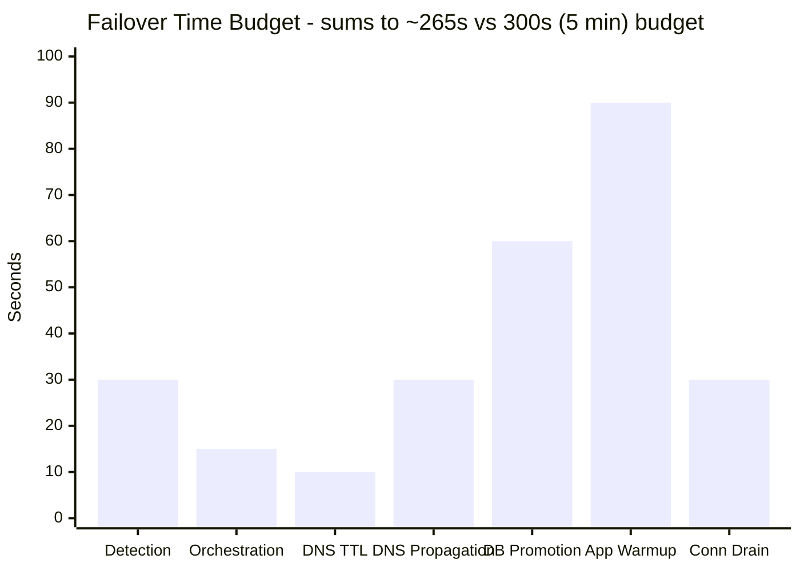
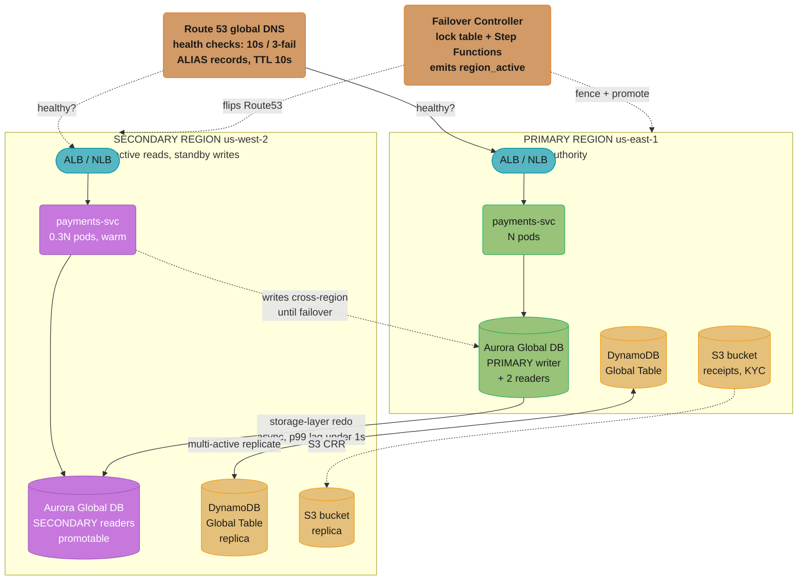
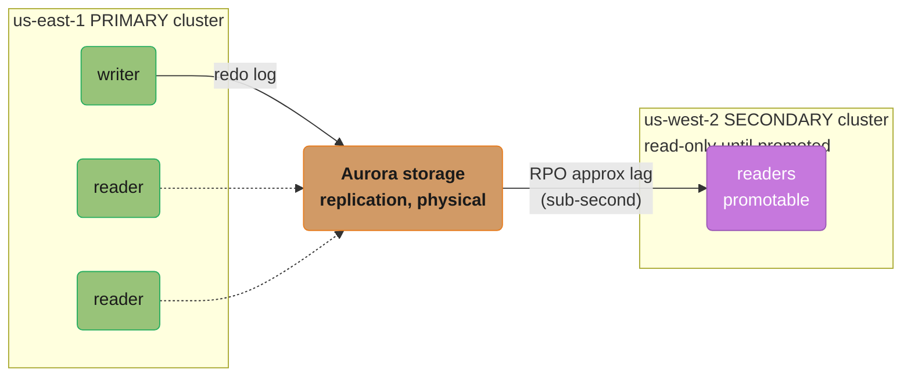
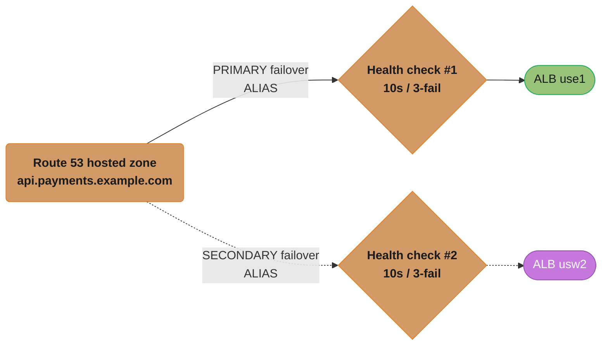
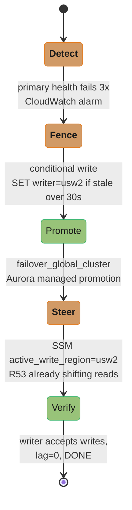
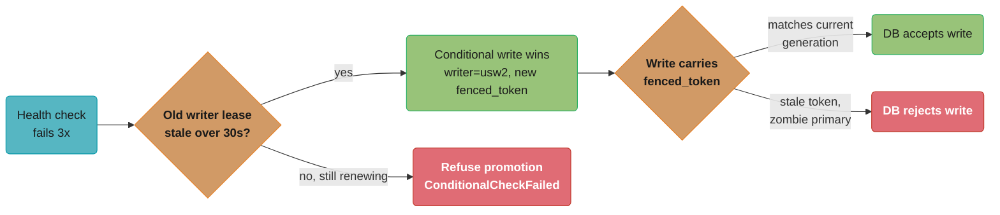
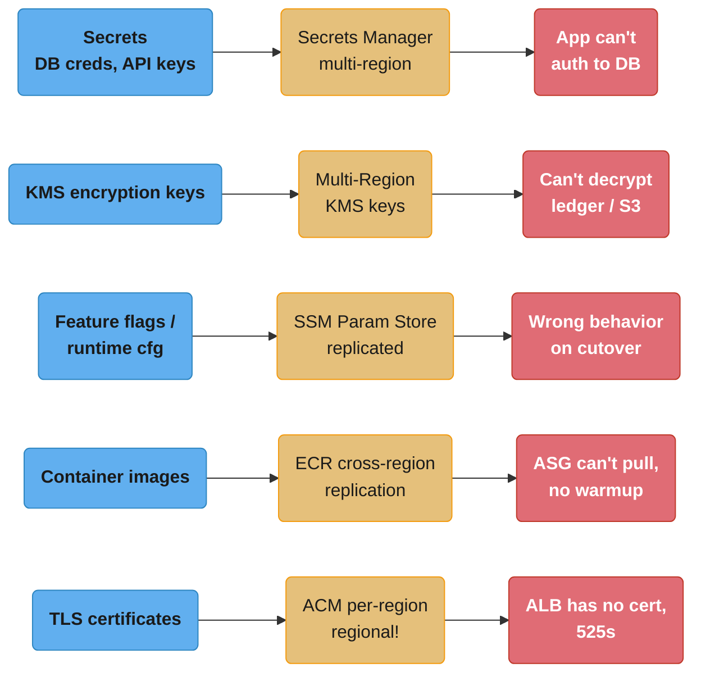
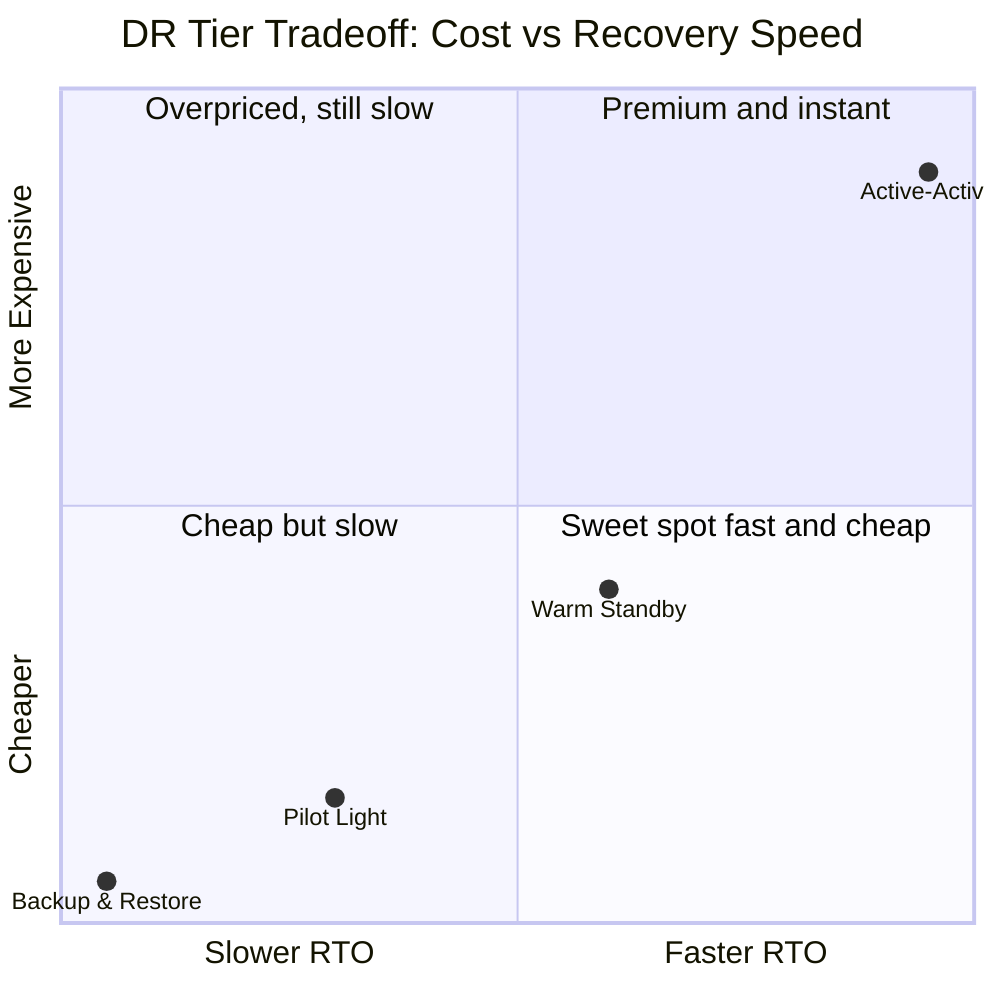

# Design a Multi-Region DR Architecture

> Like a hospital with a fully-staffed second operating theatre in another city: not a generator you start when the lights go out, but a live room with the same patient charts, the same instruments, and a surgeon already scrubbed in — so when the first city floods, the operation continues without the patient ever noticing.

**Key insight:** Disaster recovery is not a backup strategy, it is a *replication and traffic-steering* problem. The hard parts are never "can we copy the data" — they are "how stale is the copy at the instant of failure (RPO)", "how fast can traffic find the survivor (RTO)", and "how do we guarantee both regions never accept conflicting writes at once (split-brain)". For a payments workload, getting RPO wrong by one second means lost money and broken ledgers; getting split-brain wrong means *double-charged customers* and a multi-week reconciliation nightmare.

---

## Intuition

A single region — even a multi-AZ deployment — shares correlated failure domains: one control plane, one regional DNS resolver, one Aurora cluster, one set of regional service APIs (KMS, STS, S3 endpoints). AWS us-east-1 has had region-scoped control-plane outages (Dec 2021, Dec 2020, Feb 2017 S3) that took down resources across *every* AZ simultaneously. Multi-AZ buys you 99.99%; surviving a full region requires a second region that can serve production traffic.

**Mental model — three numbers govern everything:**

- **RPO (Recovery Point Objective)** = how much data you can afford to lose = the replication lag at the moment of failure. Async replication → RPO equals lag (sub-second to seconds). Sync replication → RPO = 0 but you pay cross-region write latency on every commit.
- **RTO (Recovery Time Objective)** = how long until service is restored = detection + decision + DNS/traffic cutover + standby warmup. Each term has a hard floor (health-check intervals, DNS TTL, ASG scale-out).
- **Cost** = how much idle capacity you keep hot. Active-active ≈ 2x. Pilot-light ≈ 1.1x. The DR tier you pick is the point on the cost↔RTO curve your business can afford.

**Why this system exists:** A payments platform that processes $50M/day cannot tell regulators "us-east-1 was down for 4 hours so we stopped settling." The architecture's entire job is to make a region failure a *non-event* visible only in dashboards, not in the customer's bank statement.

This builds on [`../disaster_recovery_and_resilience/README.md`](../disaster_recovery_and_resilience/README.md) (DR strategy taxonomy) and [`../cloud_networking_and_cdn/README.md`](../cloud_networking_and_cdn/README.md) (DNS, anycast, global load balancing).

---

## 1. Requirements Clarification

### Functional Requirements

- **FR1** — Serve the payments API (authorize, capture, refund, balance query) from at least one healthy region at all times.
- **FR2** — Replicate the transactional ledger (Aurora PostgreSQL) and the idempotency/session store (DynamoDB) cross-region continuously.
- **FR3** — Replicate object data (signed receipts, KYC documents, settlement files) in S3 cross-region.
- **FR4** — Automatically detect a region failure and fail traffic over to the surviving region with no manual DNS edits.
- **FR5** — Provide a controlled, audited **failback** path once the failed region recovers.
- **FR6** — Guarantee a single authoritative writer at all times (no split-brain / no conflicting ledger writes).
- **FR7** — Run scheduled game-day drills that measure *actual* RTO/RPO against targets and gate releases on them.

### Non-Functional Requirements

| NFR | Target | Notes |
|-----|--------|-------|
| RTO | **< 5 minutes** | Detection + cutover + warmup combined. |
| RPO | **< 1 second** | Max acceptable ledger data loss on hard region failure. |
| Availability | **99.99%** | = 52.6 min downtime/year; 4.32 min/month. |
| Region survival | Survive **full loss of 1 of 2 regions** | us-east-1 (primary) + us-west-2 (secondary). |
| Failover correctness | **Zero double-writes** | Split-brain prohibited even during a network partition. |
| Replication lag SLO | p99 < 1s, alert at > 800ms | Lag is the leading indicator of RPO risk. |
| Drill cadence | Monthly automated game-day | Failover + failback exercised, RTO/RPO measured. |

### Out of Scope

- Multi-cloud DR (AWS-only here; cross-cloud adds a 2–3x complexity tax and is rarely justified for RTO < 5 min).
- Per-record GDPR data-residency partitioning (assume both regions are in-jurisdiction).
- Application-level business logic and PCI scope details (covered elsewhere).
- Backup/restore *archival* (point-in-time restore from snapshots) — that is a separate, longer-RTO tier we keep as a last resort, not the primary DR mechanism.

---

## 2. Scale Estimation

Assume a mid-size payments platform.

### Traffic & Write Rate

- 5,000 transactions/sec (TPS) peak, 1,500 TPS average.
- Each transaction → ~4 ledger writes (authorize, hold, capture, audit) ≈ 20,000 row-writes/sec peak.
- Average ledger row + WAL overhead ≈ 1.5 KB on the wire (Aurora replicates redo log, not full pages).

### Replication Bandwidth

```
Peak redo throughput = 20,000 writes/s × 1.5 KB
                     = 30,000 KB/s
                     = 30 MB/s
                     = 240 Mbps
```

Aurora Global DB replicates the storage-layer redo stream, typically ~1.5–2x the logical write volume after metadata → budget **~60 MB/s (480 Mbps)** sustained, peaks to ~100 MB/s during batch settlement. Well within cross-region backbone capacity; the constraint is *latency*, not bandwidth (us-east-1 ↔ us-west-2 RTT ≈ 60–70 ms).

DynamoDB Global Tables: idempotency keys + sessions ≈ 8,000 writes/s × 400 bytes ≈ 3.2 MB/s replicated. S3 CRR: ~50 receipts/s × 80 KB ≈ 4 MB/s, bursty.

### Cross-Region Transfer Cost

Inter-region data transfer ≈ **$0.02/GB** (us-east-1 → us-west-2).

```
Aurora:   60 MB/s avg → 60 × 86,400 = 5.18 GB/s... no:
          60 MB/s × 86,400 s/day = 5,184,000 MB/day = 5,184 GB/day = 5.18 TB/day
          5,184 GB/day × $0.02 = $103.68/day → ~$3,110/month
DynamoDB: 3.2 MB/s × 86,400 = 276,480 MB = 270 GB/day × $0.02 = $5.4/day → ~$162/mo
S3 CRR:   ~330 GB/day × $0.02 = $6.6/day → ~$198/mo (+ replication request charges)
```

Cross-region replication transfer ≈ **$3,470/month**. Modest relative to the standby compute below.

### Standby Capacity Cost (the real money)

| Strategy | Standby footprint | Relative monthly compute cost |
|----------|-------------------|-------------------------------|
| Active-active | Full prod in *both* regions (each sized for 100% so either survives alone) | **~2.0x** |
| Warm standby | Secondary at ~30% capacity, scales up on failover | ~1.3x |
| Pilot light | Secondary: data replicating, app tier scaled to ~0, infra defined | ~1.1x |
| Backup/restore | Snapshots only, rebuild from IaC | ~1.0x |

For RTO < 5 min and RPO < 1s on a payments workload, **active-active or warm-standby** are the only viable tiers — pilot-light's ASG cold-start + DB-promotion blows the 5-minute budget. We choose **active-active reads + single-region writes (active-passive at the write layer)** — explained in §5.

If full prod is ~$180K/month in one region, the standby region adds ~$150K/month (slightly less; both regions amortize shared data-transfer). DR is a **~$1.8M/year insurance premium** — the conversation with leadership is whether a 4-hour outage costs more than that. For a $50M/day payments business, a single 4-hour outage at peak ≈ **$8.3M of un-processed volume** + SLA penalties + reputational/regulatory cost. The premium pays for itself the first time it is used.

### Failover Time Budget (must sum to < 5 min)



This leaves ~35 s of slack. Every term above is a thing we *engineer down* in §4 — and the single biggest lever is making reads active-active so only the *writer* needs promotion.

---

## 3. High-Level Architecture



Route 53 steers healthy traffic to the primary and keeps the secondary standing by; both regions serve reads locally off their own Aurora readers, but only the primary writer accepts commits until the Failover Controller fences the lock table and promotes us-west-2.

### Component Inventory

| Component | Role | Failure behavior |
|-----------|------|------------------|
| Route 53 | Global DNS, health-check-driven failover | Anycast, 100% SLA; the steering layer |
| ALB/NLB per region | L7/L4 ingress | Regional; health-checked by R53 |
| EKS payments-svc | Stateless app tier | Active-active for reads; warm in secondary |
| Aurora Global DB | Transactional ledger, 1 writer + replicated secondary | Managed cross-region failover ≈ 1 min |
| DynamoDB Global Tables | Idempotency keys, sessions (multi-active) | Last-writer-wins; no promotion needed |
| S3 + CRR | Receipts, KYC, settlement files | Async object replication |
| Failover Controller | Orchestrates promotion + DNS flip + fencing | Lives outside both data regions |
| DynamoDB lock table | Split-brain fence (single source of truth for "who is writer") | Strongly-consistent conditional writes |

### Data Flow (steady state)

1. Client resolves `api.payments.example.com` → Route 53 returns the healthy primary (us-east-1) ALB via latency/failover policy.
2. App writes go to the **Aurora primary writer** in us-east-1. Reads served from the *local* reader in whichever region the request landed (active-active reads).
3. Aurora ships the redo stream to us-west-2 (RPO target < 1s). DynamoDB global tables replicate both directions. S3 CRR copies new objects.
4. The failover controller continuously asserts `region_active=us-east-1` in the lock table; the secondary region's app tier refuses writes unless it holds that lock.

### Data Flow (failover)

1. Route 53 health check on the primary ALB fails 3x → Route 53 stops returning us-east-1.
2. The failover controller detects primary unhealthy, acquires the writer lock via a conditional DynamoDB write, triggers **Aurora Global DB managed failover** (us-west-2 secondary promoted to writer), and flips the Route 53 failover record to us-west-2.
3. Secondary app tier sees it now holds the lock → begins accepting writes against the newly-promoted local writer.
4. Clients re-resolve DNS (TTL 10s) and reconnect to us-west-2.

---

## 4. Component Deep Dives

### 4.1 Data Replication Tier — Aurora Global DB + DynamoDB Global Tables

Aurora Global Database replicates at the **storage layer** (the redo log), not via logical replication. This gives typical cross-region lag < 1s and decouples replication from the database engine's CPU. A "managed failover" promotes the secondary to a full standalone cluster with RPO 0 for committed transactions; an "unplanned/manual failover" (detach-and-promote) is used when the primary region is *unreachable* and accepts the small RPO of in-flight redo not yet shipped.



An unplanned (manual) failover promotes the secondary's readers directly, accepting whatever redo had not yet replicated; a managed failover instead drains in-flight redo first for RPO 0.

**Terraform — Aurora Global Database:**

```hcl
resource "aws_rds_global_cluster" "payments" {
  global_cluster_identifier = "payments-global"
  engine                    = "aurora-postgresql"
  engine_version            = "15.4"
  database_name             = "ledger"
  storage_encrypted         = true
  deletion_protection       = true
}

# PRIMARY in us-east-1
resource "aws_rds_cluster" "primary" {
  provider                  = aws.use1
  cluster_identifier        = "payments-use1"
  engine                    = "aurora-postgresql"
  engine_version            = "15.4"
  global_cluster_identifier = aws_rds_global_cluster.payments.id
  master_username           = "app"
  manage_master_user_password = true
  db_subnet_group_name      = aws_db_subnet_group.use1.name
  vpc_security_group_ids    = [aws_security_group.aurora_use1.id]
  backup_retention_period   = 35
  # Force commit durability to majority before ack — keeps RPO tight
  db_cluster_parameter_group_name = aws_rds_cluster_parameter_group.strict.name
}

resource "aws_rds_cluster_instance" "primary_writer" {
  provider           = aws.use1
  count              = 3                       # 1 writer + 2 readers
  cluster_identifier = aws_rds_cluster.primary.id
  instance_class     = "db.r6g.4xlarge"
  engine             = aws_rds_cluster.primary.engine
}

# SECONDARY in us-west-2 (headless cluster, joins global)
resource "aws_rds_cluster" "secondary" {
  provider                  = aws.usw2
  cluster_identifier        = "payments-usw2"
  engine                    = "aurora-postgresql"
  engine_version            = "15.4"
  global_cluster_identifier = aws_rds_global_cluster.payments.id
  db_subnet_group_name      = aws_db_subnet_group.usw2.name
  vpc_security_group_ids    = [aws_security_group.aurora_usw2.id]
  # No master credentials here — inherited from global primary
  depends_on = [aws_rds_cluster_instance.primary_writer]
}

resource "aws_rds_cluster_instance" "secondary_readers" {
  provider           = aws.usw2
  count              = 2
  cluster_identifier = aws_rds_cluster.secondary.id
  instance_class     = "db.r6g.4xlarge"       # pre-sized to take writes on promote
  engine             = aws_rds_cluster.secondary.engine
}
```

#### BROKEN → FIX: the app pinned to a hard-coded writer endpoint

A subtle but catastrophic bug — the app config points directly at the *primary region's* cluster writer endpoint. After failover, the secondary is promoted, but every pod keeps trying to reach a writer endpoint in the dead region. Writes hang, the 5-minute RTO is blown, and on-call discovers it only when the secondary's reader endpoint starts rejecting writes.

```yaml
# BROKEN — config.yaml baked into the image
database:
  writer_endpoint: "payments-use1.cluster-abc123.us-east-1.rds.amazonaws.com"  # pinned!
  # After failover to us-west-2 this host is GONE. App cannot write. RTO blown.
```

The fix: resolve the writer endpoint *dynamically* from the region the pod is running in, driven by the failover controller's authoritative `region_active` flag — never hard-code a region into the connection string.

```python
# FIXED — region-aware writer resolution, re-evaluated on every reconnect
import boto3, os

def current_writer_endpoint() -> str:
    """Resolve the Aurora writer for the region that currently holds write authority.
    The failover controller writes the authoritative active region into SSM.
    """
    ssm = boto3.client("ssm", region_name=os.environ["LOCAL_REGION"])
    active_region = ssm.get_parameter(Name="/payments/active_write_region")["Parameter"]["Value"]
    # Per-region cluster writer endpoints, published by Terraform outputs into SSM
    endpoint = ssm.get_parameter(
        Name=f"/payments/{active_region}/aurora_writer_endpoint"
    )["Parameter"]["Value"]
    return endpoint

# Connection pool refreshes its target whenever a write fails with a
# "read-only transaction" error (SQLSTATE 25006) — the unambiguous signal that
# this region is no longer the writer.
```

**DynamoDB Global Tables** need no promotion — they are multi-active with last-writer-wins. For idempotency keys this is exactly right: a given key is owned by one customer's flow, conflicting concurrent writes to the *same* key are vanishingly rare, and LWW with cell-level timestamps is acceptable. We do **not** use Global Tables for the ledger (LWW would silently drop a financial write).

```hcl
resource "aws_dynamodb_table" "idempotency" {
  name             = "payments-idempotency"
  billing_mode     = "PAY_PER_REQUEST"
  hash_key         = "idempotency_key"
  stream_enabled   = true
  stream_view_type = "NEW_AND_OLD_IMAGES"

  attribute { name = "idempotency_key"; type = "S" }

  replica { region_name = "us-west-2" }   # turns this into a Global Table

  ttl { attribute_name = "expires_at"; enabled = true }
  point_in_time_recovery { enabled = true }
}
```

---

### 4.2 DNS / Global Traffic Failover (Route 53)



Each health check is an HTTPS GET /healthz against the ALB target, 10s interval with a 3-failure threshold — the 30s detection budget already used in the §2 time budget.

#### BROKEN → FIX: failover record with 1-hour TTL and no health check

The classic DR-on-paper mistake. The record "exists" so the architecture diagram looks correct, but the TTL is 3600s and there is no health check, so DNS keeps handing clients the dead region for up to an hour.

```hcl
# BROKEN — looks like failover, behaves like a brick
resource "aws_route53_record" "api_broken" {
  zone_id = aws_route53_zone.main.zone_id
  name    = "api.payments.example.com"
  type    = "A"
  ttl     = 3600                      # 1 HOUR — clients cache the dead IP
  records = ["203.0.113.10"]          # static IP, no health check, no failover
  # RTO is now bounded by 1 hour of DNS caching. Target was 5 minutes.
}
```

```hcl
# FIXED — ALIAS + health check + 10s TTL + failover routing policy
resource "aws_route53_health_check" "primary" {
  fqdn              = aws_lb.use1.dns_name
  port              = 443
  type              = "HTTPS"
  resource_path     = "/healthz"
  request_interval  = 10            # 10s checks
  failure_threshold = 3            # 3 fails → 30s detection
  regions           = ["us-east-1", "us-west-2", "eu-west-1"]  # multi-vantage
}

resource "aws_route53_record" "api_primary" {
  zone_id        = aws_route53_zone.main.zone_id
  name           = "api.payments.example.com"
  type           = "A"
  set_identifier = "primary-use1"

  failover_routing_policy { type = "PRIMARY" }
  health_check_id = aws_route53_health_check.primary.id

  alias {
    name                   = aws_lb.use1.dns_name           # ALIAS — no TTL caching of an IP
    zone_id                = aws_lb.use1.zone_id
    evaluate_target_health = true
  }
}

resource "aws_route53_record" "api_secondary" {
  zone_id        = aws_route53_zone.main.zone_id
  name           = "api.payments.example.com"
  type           = "A"
  set_identifier = "secondary-usw2"

  failover_routing_policy { type = "SECONDARY" }
  health_check_id = aws_route53_health_check.secondary.id

  alias {
    name                   = aws_lb.usw2.dns_name
    zone_id                = aws_lb.usw2.zone_id
    evaluate_target_health = true
  }
}
```

ALIAS records are resolved by Route 53 itself (the IP is never cached by the client for an ALB), so the only client-side cache is the short A-record TTL where applicable. Health checks run from multiple AWS vantage points to avoid a single checker's network blip triggering a false failover. See [`../cloud_networking_and_cdn/README.md`](../cloud_networking_and_cdn/README.md) for anycast-vs-DNS tradeoffs (anycast — Cloudflare/Global Accelerator — removes DNS-TTL from the RTO entirely; covered in §5).

---

### 4.3 Failover Orchestration Automation

Pure DNS failover handles *reads*. The ledger writer must be promoted in a coordinated, fenced way. The controller lives in a **third region (eu-west-1)** so a us-east-1 loss cannot take down the brain making the failover decision.



Only the Fence to Promote transition is destructive; Decision 3 in §5 gates it behind a 90-second auto-promote-or-on-call-confirmation window so a transient partition can't trigger an unnecessary failover.

**Go — the split-brain fence (single-writer guarantee):**

```go
// Acquire write authority via a strongly-consistent conditional write.
// Only ONE caller can transition the writer; everyone else fails.
func acquireWriteAuthority(ctx context.Context, ddb *dynamodb.Client,
	from, to string) error {

	now := time.Now().Unix()
	_, err := ddb.UpdateItem(ctx, &dynamodb.UpdateItemInput{
		TableName: aws.String("payments-writer-lock"),
		Key: map[string]types.AttributeValue{
			"lock_id": &types.AttributeValueMemberS{Value: "global-writer"},
		},
		// The fence: we may only become writer if the current writer is `from`
		// AND its lease has not been renewed in > 30s (i.e. it is truly down).
		ConditionExpression: aws.String(
			"active_region = :from AND lease_renewed_at < :stale"),
		UpdateExpression: aws.String(
			"SET active_region = :to, fenced_token = :tok, lease_renewed_at = :now"),
		ExpressionAttributeValues: map[string]types.AttributeValue{
			":from":  &types.AttributeValueMemberS{Value: from},
			":to":    &types.AttributeValueMemberS{Value: to},
			":stale": &types.AttributeValueMemberN{Value: fmt.Sprint(now - 30)},
			":now":   &types.AttributeValueMemberN{Value: fmt.Sprint(now)},
			":tok":   &types.AttributeValueMemberS{Value: uuid.NewString()},
		},
	})
	var ccf *types.ConditionalCheckFailedException
	if errors.As(err, &ccf) {
		// Someone else is (still) the writer, or the old primary renewed its
		// lease (it is NOT actually down). Refuse to promote — prevents split-brain.
		return fmt.Errorf("write authority not granted: another region holds the lock")
	}
	return err
}
```

The current primary **renews its lease every 5s**; a partition where the primary is alive but unreachable from the controller will *not* trigger promotion as long as the primary keeps renewing — the fence requires `lease_renewed_at < now-30s`. This is how we reconcile "fail fast" with "never split-brain": detection is 30s on the *health check*, but promotion additionally requires the old writer to have genuinely stopped renewing.

Every write the app issues carries the `fenced_token`; the database rejects writes whose token does not match the current generation, so a "zombie" primary that comes back cannot write stale data. This is a **fencing token** (the standard distributed-lock correctness primitive).



Two independent checks prevent split-brain: the lock only transfers if the old writer's lease has gone stale for over 30s (so a reachable-but-partitioned primary keeps authority), and every write afterward carries a fencing token so a zombie primary that wakes up mid-partition still gets its writes rejected.

---

### 4.4 State & Config Replication

Stateless app tiers still depend on *out-of-band* state: feature flags, secrets, KMS keys, TLS certs, and configuration. If these are not present in the secondary region, failover lands traffic on a region that cannot decrypt the database or validate JWTs.



If any row's replication mechanism is missing in the DR region, the app comes up looking healthy but fails at the exact moment it needs that piece — which is why this mapping, not the architecture diagram, is what a game-day drill actually has to exercise.

A frequently-missed item: **ACM certificates are regional and cannot be copied.** You must request the cert in *both* regions (or use a wildcard issued separately per region). KMS keys must be **multi-Region keys** so ciphertext written in us-east-1 is decryptable in us-west-2 — a single-region key makes your replicated, encrypted S3 objects unreadable in the DR region, which is a silent data-availability bomb that only detonates during a real failover.

```hcl
# Multi-Region KMS key — same key material in both regions, ciphertext portable
resource "aws_kms_key" "primary_mrk" {
  provider                = aws.use1
  multi_region            = true
  description             = "payments ledger + S3 envelope key (MRK)"
  enable_key_rotation     = true
}

resource "aws_kms_replica_key" "usw2" {
  provider        = aws.usw2
  primary_key_arn = aws_kms_key.primary_mrk.arn
  description     = "MRK replica in us-west-2"
}

# Secrets Manager replicated to the DR region
resource "aws_secretsmanager_secret" "db_creds" {
  provider = aws.use1
  name     = "payments/db-creds"
  kms_key_id = aws_kms_key.primary_mrk.id
  replica { region = "us-west-2"; kms_key_id = aws_kms_replica_key.usw2.arn }
}

# ECR cross-region replication so the warm ASG can pull the image post-failover
resource "aws_ecr_replication_configuration" "images" {
  replication_configuration {
    rule {
      destination { region = "us-west-2"; registry_id = data.aws_caller_identity.cur.account_id }
    }
  }
}
```

For the Kubernetes-side hardening of the warm standby tier (pod-disruption budgets, topology spread, pre-pulled images, readiness gates so the LB only routes to truly-ready pods), see [`cross_cutting/kubernetes_production_hardening.md`](cross_cutting/kubernetes_production_hardening.md).

---

## 5. Design Decisions & Tradeoffs

### Decision 1 — Active-active reads + single-writer (active-passive writes)

- **Alternatives:** full active-active multi-writer; pure active-passive (cold reads in standby).
- **Rationale:** Multi-writer for a financial ledger means distributed conflict resolution on money — unacceptable. Pure active-passive wastes the standby and slows reads. We split the difference: reads served locally in both regions (cuts read latency, keeps secondary warm and proven-working), but **exactly one region holds write authority** at a time, fenced by the lock table.
- **Consequences:** Cross-region write latency for requests that land in the secondary during steady state (mitigated by latency-based DNS keeping users near the writer). Writer promotion is the only thing on the critical RTO path.

### Decision 2 — Async storage-layer replication (Aurora Global DB), not synchronous

- **Alternatives:** synchronous cross-region commit (e.g., a stretched quorum).
- **Rationale:** Synchronous cross-region commit adds the full 60–70 ms RTT to *every* write — at 20K writes/s that destroys throughput and tail latency, and a network blip stalls all commits. Async storage replication keeps p99 lag < 1s, which meets RPO < 1s.
- **Consequences:** A hard region loss can lose up to ~1s of in-flight redo (the RPO we accepted). For the rare case where RPO must be truly 0, only a managed (graceful) failover gives it; an unplanned failover accepts the lag-bounded loss.

### Decision 3 — Automated failover with a human-confirmed promotion gate

- **Alternatives:** fully automatic promotion; fully manual.
- **Rationale:** Fully automatic risks promoting on a false positive (a transient network partition) and causing an unnecessary failover + the failback cost. Fully manual blows the 5-min RTO waiting for a human to wake up. We automate detection, fencing, DNS, and *read* failover instantly, and gate only the **destructive writer-promotion** behind either (a) auto-promote after 90s of sustained failure, or (b) a one-click on-call confirmation — whichever fires first. The fence guarantees correctness either way.
- **Consequences:** Slightly higher RTO in the human-gate path; near-zero risk of an avoidable split-brain.

### Decision 4 — DNS-based failover, with Global Accelerator as an evolution path

- **Alternatives:** AWS Global Accelerator / anycast (steers at the network edge, no DNS TTL); pure DNS.
- **Rationale:** DNS failover is simple, cheap, and well-understood; the 10s TTL + 30s propagation is within budget. Global Accelerator removes DNS caching from the RTO entirely (sub-30s edge re-steer) at higher cost — we keep it as the documented upgrade if RTO must drop below 3 min.
- **Consequences:** A long-tail of clients with broken DNS caching (ignoring TTL) may stick to the dead region for minutes — Global Accelerator eliminates that class of client.

### Decision 5 — Warm standby app tier (~30%), not pilot-light

- **Alternatives:** pilot-light (scale-to-zero app tier); full active-active app tier (2x).
- **Rationale:** Pilot-light's ASG cold start + image pull + JIT warmup easily costs 3–5 min — alone it blows RTO. Warm standby at 30% keeps the path proven and scales the remaining 70% under the failover event with pre-pulled images. Full 2x is the cost-no-object option.
- **Consequences:** ~1.3x compute cost vs ~1.1x pilot-light; the extra 0.2x is the price of meeting RTO.

### Decision 6 — Fencing tokens, not just a lock, for split-brain

- **Alternatives:** rely on the lock alone; rely on STONITH/network isolation.
- **Rationale:** A lock alone does not stop a *zombie* old-primary that was paused (GC, VM freeze) and resumes thinking it still holds the lock. Monotonic fencing tokens stamped on every write let the database reject stale-generation writes. This is the textbook fix for the "process pause" failure mode.
- **Consequences:** Every write path must carry and validate the token; small added complexity for a hard correctness guarantee.

### DR Tier Comparison Table

| Tier | RTO | RPO | Standby cost | When to use |
|------|-----|-----|--------------|-------------|
| Backup & Restore | hours–days | hours | ~1.0x | Non-critical, cost-sensitive |
| Pilot Light | 10–30 min | seconds–minutes | ~1.1x | Important but RTO-tolerant |
| Warm Standby | 1–10 min | seconds | ~1.3x | **Payments-grade, our choice** |
| Active-Active (multi-writer) | seconds | ~0 (read), conflict-bound (write) | ~2.0x+ | Highest tier, conflict-tolerant data |



The bottom-right quadrant is otherwise empty: Backup and Pilot Light are cheap but too slow for a 5-minute RTO, Active-Active buys seconds-level recovery at ~2.0x+ cost, and Warm Standby (~1.3x) is the only tier that clears RTO under 5 min without paying the active-active premium.

Our build is **warm-standby app + active-active reads + active-passive single-writer DB** — the sweet spot for RTO < 5 min / RPO < 1s on financial data.

---

## 6. Real-World Implementations

**Netflix — active-active across 3 AWS regions + Chaos Kong.** Netflix runs its control plane active-active across us-east-1, us-west-2, and eu-west-1, with Zuul/Eureka steering traffic and Cassandra replicating eventually-consistent data multi-region. They built **Chaos Kong** to evacuate an *entire region* on a schedule and prove the other regions absorb the load — they discovered (and fixed) that regional failover only works if you continuously exercise it. Their published target is to evacuate a region in well under an hour with no member-facing impact; the key lesson is that active-active is only real if you regularly *use* it.

**Stripe — cell-based, multi-region with strict idempotency.** Stripe's API is built around idempotency keys (exactly our DynamoDB pattern) so that retries across a failover never double-charge. Their infrastructure isolates failure domains into cells and replicates state such that a zonal/regional event degrades rather than drops payment processing. The idempotency-key-as-first-class-citizen design is what makes safe client retries during a cutover possible — without it, a region failover causes duplicate charges.

**Shopify — pods and regional resiliency for Black Friday scale.** Shopify shards merchants into "pods" (self-contained units of MySQL + app) and can move a pod's traffic between regions. During BFCM they process ~$11B+ and rely on the ability to drain a region/datacenter. Their published work on database resiliency emphasizes load-shedding and the ability to fail a pod over without taking down unrelated merchants — DR at the *shard* granularity rather than all-or-nothing.

**AWS's own services (DynamoDB Global Tables, Aurora Global DB).** AWS dogfoods cross-region replication primitives we use. The Dec 2021 us-east-1 outage (a network device congestion event in the internal network) is the canonical reason payments shops keep a second region: customers with *only* us-east-1 were down for hours; those with active secondaries failed over.

**A tier-1 bank (anonymized) — synchronous metro + async geo.** Large banks commonly run **synchronous replication within a metro** (two datacenters < 100 km, RTT < 2 ms, RPO 0) and **asynchronous replication to a geo-distant DR site** (RPO seconds). This two-tier model — sync for the common datacenter loss, async for the rare regional disaster — is how regulated finance squares RPO-0 ambitions with the physics of cross-continent latency.

---

## 7. Technologies & Tools

| Capability | Aurora Global DB | DynamoDB Global Tables | Azure Cosmos DB | Cloud Spanner | Self-managed Postgres (logical/streaming) |
|------------|------------------|------------------------|-----------------|---------------|-------------------------------------------|
| Replication model | Storage-layer redo, async | Multi-active, async (LWW) | Multi-region, tunable consistency | Synchronous (TrueTime), strong global | Streaming/logical, async |
| Typical cross-region lag | < 1s | ~1s | ms–s (consistency-dependent) | strongly consistent (no "lag") | seconds–minutes |
| Writer model | Single writer + promotable secondary | Multi-writer (LWW) | Multi-region writes | Single logical writer, global txns | Single primary + replicas |
| Failover | Managed (~1 min) / unplanned | Automatic (no promotion) | Automatic | Automatic (managed) | Manual / Patroni / pg_auto_failover |
| RPO on region loss | ~lag (sub-second) | ~lag | tunable | 0 | lag (often larger) |
| Operational burden | Low (managed) | Lowest (managed) | Low (managed) | Low (managed) | **High** (you own failover) |
| Best for | Financial ledger (our pick) | Idempotency/session KV | Globally-distributed apps | Strong-global SQL | Full control / cost / portability |

Aurora Global DB is chosen for the ledger because it gives managed, low-lag, single-writer semantics without us building promotion logic. Spanner is the only option offering true RPO-0 global writes, but it locks you to GCP and pays a global-commit latency tax. Self-managed Postgres is the most portable and cheapest but moves the entire failover-correctness burden onto your team — for payments, that is rarely worth it.

---

## 8. Operational Playbook

### (a) Game-Day / Restore-Drill Eval Gate

DR that is never exercised is DR that does not work. We run a **monthly automated game-day** that fails over to us-west-2, measures actual RTO/RPO, and **gates the release pipeline** if the measured numbers regress past target.

```bash
#!/usr/bin/env bash
# gameday.sh — measured failover drill. Run monthly; fail the build on regression.
set -euo pipefail

RTO_BUDGET=300   # seconds (5 min)
RPO_BUDGET=1     # second

# 1. Record a sentinel write + its commit LSN in the PRIMARY
SENTINEL="gameday-$(date +%s)"
PRIMARY_LSN=$(psql "$PRIMARY_DSN" -tAc \
  "INSERT INTO drill_sentinel(token, ts) VALUES ('$SENTINEL', now()) RETURNING pg_current_wal_lsn();")

# 2. Trigger the orchestrated failover (controller does fence → promote → steer)
START=$(date +%s)
aws stepfunctions start-execution --state-machine-arn "$FAILOVER_SM" \
  --input '{"reason":"gameday","target":"us-west-2","mode":"drill"}'

# 3. Poll until the secondary serves writes (RTO clock)
until curl -fsS "https://api.payments.example.com/healthz?require_writer=usw2" >/dev/null 2>&1; do
  sleep 2
  NOW=$(date +%s); ELAPSED=$((NOW-START))
  if (( ELAPSED > RTO_BUDGET )); then echo "FAIL: RTO ${ELAPSED}s > ${RTO_BUDGET}s"; exit 1; fi
done
RTO_ACTUAL=$(( $(date +%s) - START ))

# 4. Verify the sentinel made it across (RPO check)
FOUND=$(psql "$SECONDARY_DSN" -tAc \
  "SELECT count(*) FROM drill_sentinel WHERE token='$SENTINEL';")
[[ "$FOUND" == "1" ]] || { echo "FAIL: RPO breach — sentinel lost"; exit 1; }

echo "PASS: measured RTO=${RTO_ACTUAL}s (budget ${RTO_BUDGET}s), RPO sentinel present"
# Pipeline gate: a regression here BLOCKS the next production deploy.
```

The error-budget framing for "how often may a drill (or real failover) breach SLO before we freeze features" is in [`cross_cutting/slo_error_budget_math.md`](cross_cutting/slo_error_budget_math.md).

### (b) Observability — Replication Lag + Health

The leading indicator of RPO risk is replication lag; the leading indicator of RTO risk is health-check flap. Both must be first-class metrics with OTel/Prometheus.

```yaml
# Prometheus alerting rules — replication lag is the RPO early-warning
groups:
  - name: dr_replication
    rules:
      - alert: AuroraGlobalReplicaLagHigh
        expr: aws_rds_aurora_global_db_replication_lag_milliseconds > 800
        for: 30s
        labels: { severity: page, team: payments-sre }
        annotations:
          summary: "Aurora global replication lag {{ $value }}ms (RPO budget 1000ms)"
      - alert: DynamoGlobalTableReplLagHigh
        expr: aws_dynamodb_replication_latency_milliseconds:p99 > 1000
        for: 1m
        labels: { severity: page }
      - alert: PrimaryHealthCheckFlapping
        expr: changes(route53_health_check_status[5m]) > 4
        labels: { severity: warn }
        annotations: { summary: "Primary R53 health check flapping — false-failover risk" }
```

OTel spans tag every write with `region`, `writer_generation` (the fencing token), and `replication_lag_ms` so a failover's blast radius is queryable. Keep label cardinality bounded — do not put `idempotency_key` or `customer_id` on metrics; see [`cross_cutting/prometheus_cardinality_and_scale.md`](cross_cutting/prometheus_cardinality_and_scale.md) for the cardinality budget that keeps this monitoring stack from melting.

### (c) Incident Runbooks

**Runbook 1 — Region Failover (primary us-east-1 unhealthy).**
Symptom: Route 53 primary health check failing 3x; `payments-svc` 5xx spiking in us-east-1.
Diagnosis: confirm it is *regional* (multiple AZs/services affected), not a single bad deploy — check AWS Health Dashboard + multi-service error correlation.
Mitigation: controller auto-fences and promotes us-west-2; on-call confirms the writer-promotion gate within 90s if not auto-fired. Verify `active_write_region=usw2` in SSM.
Resolution: confirm writes succeeding in us-west-2, replication-lag metric resets, customer error rate recovers. Open a postmortem; do **not** fail back until the primary region is fully healthy.

**Runbook 2 — Split-Brain Suspected (both regions claim writer).**
Symptom: writes succeeding in *both* regions; duplicate ledger entries; fencing-token mismatch alarms.
Diagnosis: read the lock table — there must be exactly one `active_region` with a current `fenced_token`. If two app tiers have different tokens, the older-token region is the zombie.
Mitigation: immediately revoke the stale generation — the DB rejects writes carrying the old `fenced_token`; scale the zombie region's writers to 0.
Resolution: reconcile any writes that slipped through using the fencing-token timeline; the token ordering tells you which writes are authoritative. Root-cause the dual-promotion (usually a VM pause + an over-eager auto-promote).

**Runbook 3 — Replication Lag Spike (RPO at risk).**
Symptom: `AuroraGlobalReplicaLagHigh` firing, lag climbing toward / past 1s.
Diagnosis: check for a write burst (batch settlement), cross-region network degradation, or undersized secondary readers (replication apply is CPU-bound on the secondary).
Mitigation: throttle/queue non-critical writes; scale up secondary reader instance class; if lag is unbounded, declare RPO-at-risk and consider draining writes until it recovers.
Resolution: lag back under 800ms; if the spike was capacity, right-size the secondary readers to match the writer (they must be promotion-ready, never undersized).

**Runbook 4 — Failback to Primary (after us-east-1 recovers).**
Symptom: primary region healthy again; running on secondary.
Diagnosis: confirm the original primary has fully recovered, rejoined the global cluster as a *secondary*, and replication has caught up (lag ≈ 0).
Mitigation: schedule a *graceful, managed* failback during low traffic — never an emergency failback. Re-fence: `acquireWriteAuthority(from=usw2, to=use1)`.
Resolution: promote us-east-1 back to writer via managed failover (RPO 0), flip Route 53 + SSM, verify, then scale us-west-2 back to warm-standby footprint. Document the round-trip RTO.

---

## 9. Common Pitfalls & War Stories

**1. The DR region was never tested — and the KMS key was single-region.** A fintech declared DR "done" with replicated S3 and Aurora, but the envelope-encryption KMS key was a *single-region* key in us-east-1. During an actual us-east-1 event, the replicated, encrypted S3 objects in us-west-2 were undecryptable. They were "up" but could not read 100% of customer documents for **3.5 hours** until a key-policy workaround was hacked together. Lesson: encrypt cross-region data with **multi-Region KMS keys** and test a real decrypt in the DR region.

**2. 1-hour DNS TTL turned a 90-second failover into a 55-minute outage.** A SaaS provider's Aurora failed over in 90s, but their A-record TTL was 3600s with aggressive client-side resolver caching. Roughly 40% of traffic kept hitting the dead region for ~55 minutes. Estimated impact: **~$420K** in failed transactions over the window. Fix: ALIAS records + 10s TTL + Route 53 health-check failover (our §4.2 FIX).

**3. AWS us-east-1 Dec 2021 — single-region shops down for hours.** The Dec 7, 2021 us-east-1 networking event impaired the internal network and the API control plane region-wide. Companies with us-east-1-only deployments saw multi-hour outages; the cost across the industry ran into the **tens of millions**. The teams that failed over cleanly were the ones who had *practiced* it — paper DR plans largely failed because untested automation broke on first real use. (See cross-region network-path considerations in [`cross_cutting/multi_cluster_networking.md`](cross_cutting/multi_cluster_networking.md).)

**4. Split-brain double-charged customers for a week of reconciliation.** A payments startup with naive active-active (no fencing token) had a network partition where both regions briefly accepted writes. ~**11,000 transactions** were duplicated; customers were double-charged. Reconciliation + refunds + a regulatory inquiry consumed an engineering team for **~2 weeks** and cost real trust. Lesson: single-writer + fencing tokens are non-negotiable for money.

**5. Warm standby that wasn't warm — cold image pull blew RTO.** A team thought they had warm standby, but the secondary ECR had no replicated images and the ASG min was 0. On failover, every node had to cold-pull a 2.1 GB image; the tier took **6m40s** to serve traffic — past the 5-min RTO, during which ~$190K of volume queued/failed. Fix: ECR cross-region replication + pre-pulled images + ASG warm pool + readiness gates (see [`cross_cutting/kubernetes_production_hardening.md`](cross_cutting/kubernetes_production_hardening.md)).

**6. Failback during peak caused a second outage.** After a clean failover to us-west-2, an eager engineer failed *back* to us-east-1 during peak hours before replication had fully caught up, causing a brief RPO breach and a second ~12-minute incident. Lesson: failback is a *scheduled, low-traffic, replication-caught-up, graceful* operation — never an emergency reflex. (Runbook 4.)

---

## 10. Capacity Planning

### Standby Capacity Sizing

The secondary must be able to absorb **100% of production load** the instant it becomes primary, even if it idles at 30% warm.

```
Steady-state secondary pods      = ceil(0.30 × N_primary)
Failover target pods             = N_primary   (must reach this within RTO warmup budget)
Warm-pool pre-provisioned nodes  = enough to host (N_primary - 0.30·N_primary) without
                                   waiting on a fresh EC2 launch (≈ 70% of fleet pre-warmed)
```

### Replication Bandwidth Sizing

```
Replication bandwidth (sustained) = peak_write_rows/s × avg_wire_bytes/row × redo_amplification
                                  = 20,000 × 1.5 KB × ~2
                                  = 60 MB/s ≈ 480 Mbps  (well under backbone capacity)
Headroom rule: provision for 2× peak (batch settlement bursts) → plan for ~120 MB/s.
```

### Worked Example (real instance types + costs)

Primary fleet: payments-svc on **24 × m6i.2xlarge** (8 vCPU/32 GB) EKS nodes, Aurora **3 × db.r6g.4xlarge** (16 vCPU/128 GB: 1 writer + 2 readers).

| Resource | Primary (us-east-1) | Secondary (us-west-2) | Notes |
|----------|---------------------|------------------------|-------|
| EKS app nodes | 24 × m6i.2xlarge (~$280/mo ea on-demand) ≈ **$6,720/mo** | 8 hot + 16 warm-pool (stopped) ≈ **$2,240/mo + ~$300 warm-pool** | Warm = ~30% running |
| Aurora instances | 3 × db.r6g.4xlarge (~$1,750/mo ea) ≈ **$5,250/mo** | 2 × db.r6g.4xlarge (promotion-ready) ≈ **$3,500/mo** | Secondary readers sized = writer |
| Aurora storage + I/O | shared global storage | replicated | metered once + replication |
| Cross-region transfer | — | ~**$3,470/mo** (from §2) | Aurora + DynamoDB + S3 CRR |
| DynamoDB Global Table | on-demand | replica writes (2× WCU billed) | idempotency/sessions |

Rough monthly DR overhead of the *secondary* + replication ≈ **$2,240 + $3,500 + $3,470 + warm-pool/DDB ≈ $9,700–$11,000/mo** on top of a ~$12K/mo primary stack — i.e. the DR premium is **~0.8–0.9x** the primary for warm-standby (vs ~2x for full active-active). Annualized ≈ **$120K–$132K/year**, against a single-4-hour-peak-outage exposure of **~$8.3M**. The insurance ratio is ~60:1 in favor of paying for DR.

Sizing rule of thumb: the secondary's Aurora readers must equal the primary writer's instance class (so promotion doesn't degrade), and the warm app tier must be able to reach 100% within the warmup portion of the RTO budget (90s here) — which means pre-pulled images and an EC2 warm pool, not a cold ASG. Kubernetes-side specifics in [`cross_cutting/kubernetes_production_hardening.md`](cross_cutting/kubernetes_production_hardening.md).

---

## 11. Interview Discussion Points

**Q1: What is the difference between RTO and RPO, and which is harder for a payments system?**
RTO is how long until service is restored after a disaster; RPO is how much data you can afford to lose, measured as replication lag at the failure instant. For payments, RPO is harder because losing even one second of ledger writes means money moved without a record — you cannot reconcile what you never replicated. RTO is bounded by engineering (faster health checks, lower DNS TTL, warm standby); RPO is bounded by physics (cross-region latency vs synchronous commit cost). The practical answer is async replication tuned so p99 lag < your RPO target, plus idempotency so retries during the gap don't compound the loss.

**Q2: Active-active vs active-passive — when would you choose each?**
Active-passive (warm standby) is right when a single writer simplifies correctness — financial ledgers, anything where conflicting concurrent writes are unacceptable. Active-active is right for read-heavy or conflict-tolerant workloads (content, sessions, analytics) where you want zero-RTO and can resolve conflicts. The nuanced production answer is hybrid: active-active for *reads* (latency + keeps standby proven) but single-writer for the *ledger*. Pure active-active multi-writer on money requires distributed conflict resolution that almost no payments team should build.

**Q3: How do you prevent split-brain during a network partition?**
Two layers: a single-writer lock (strongly-consistent conditional write naming the active region) and a fencing token (a monotonic generation number stamped on every write that the database validates). The lock prevents two regions from *deciding* to be writer; the fencing token prevents a paused "zombie" old-writer from succeeding when it resumes, because its token is stale and the DB rejects it. Crucially, promotion also requires the old writer to have stopped renewing its lease (e.g., > 30s) — so a reachable-but-partitioned primary keeps authority and we never split. A lock alone is insufficient; the fencing token is the part juniors miss.

**Q4: Walk me through your 5-minute RTO budget.**
~30s health-check detection (3 failures × 10s), ~15s orchestration/fencing, ~10s DNS TTL + ~30s resolver propagation, ~60s Aurora managed writer promotion, ~90s warm-standby app warmup, ~30s client reconnect/backoff — ~4m25s with ~35s slack. The biggest levers are making reads active-active (so only the writer is on the critical path), keeping the standby warm (so warmup is 90s not 5 min), and short DNS TTL with ALIAS records. If we needed sub-3-min, we'd move to Global Accelerator to remove DNS from the path.

**Q5: Why async replication instead of synchronous for RPO < 1s?**
Synchronous cross-region commit adds the full ~60–70 ms RTT to every write; at 20K writes/s that destroys throughput and tail latency, and any network blip stalls all commits — it trades availability for RPO 0. Async storage-layer replication (Aurora Global DB) keeps p99 lag under 1s, which *meets* RPO < 1s without the latency tax. We accept losing up to ~1s of in-flight redo on a hard, unplanned region loss; for a planned/managed failover we get RPO 0 anyway. Synchronous only makes sense within a metro (RTT < 2ms), which is the bank two-tier pattern.

**Q6: How does DNS failover actually work, and what are its limits?**
Route 53 runs health checks (HTTPS GET /healthz, 10s interval, 3-failure threshold) from multiple vantage points; on failure it stops returning the unhealthy region's ALIAS record and serves the secondary per the failover routing policy. Limits: client/resolver DNS caching can ignore your TTL, so a long tail of traffic sticks to the dead region for minutes; ALIAS records (resolved by Route 53, not cached as a raw IP) and a 10s TTL minimize this. To remove DNS from the RTO entirely you use anycast / Global Accelerator, which re-steers at the network edge in seconds regardless of client caching.

**Q7: What's the worst DR mistake you've seen, and how do you avoid it?**
DR that exists only on paper — replicated data, a diagram, and automation no one has ever run. It fails on first real use: a single-region KMS key makes encrypted data unreadable in the DR region, ECR has no replicated images so the standby cold-starts past RTO, or the failover Lambda has a permissions bug. The avoidance is monthly automated game-days that *measure* actual RTO/RPO and gate releases on regression. If your DR isn't exercised on a schedule, assume it's broken.

**Q8: How do you handle the config and state that stateless apps depend on across regions?**
Replicate everything out-of-band the app needs to function: secrets (Secrets Manager multi-region replicas), encryption keys (multi-Region KMS keys so ciphertext is portable), feature flags/runtime config (SSM Parameter Store replicated), container images (ECR cross-region replication), and TLS certs (ACM is regional — you must request the cert in each region, you cannot copy it). The silent killers are single-region KMS keys and missing ACM certs, because they only fail at the moment of a real failover when you can least afford to debug them.

**Q9: How do you decide between the DR tiers (backup/restore, pilot light, warm standby, active-active)?**
Plot your business's RTO/RPO requirement against cost tolerance. Backup/restore (~1.0x cost, hours RTO) for non-critical; pilot light (~1.1x, 10–30 min) for important-but-tolerant; warm standby (~1.3x, 1–10 min) for critical; active-active (~2x+, seconds) for the highest tier. For payments at RTO < 5 min / RPO < 1s, pilot light's cold start disqualifies it, so warm standby is the floor. The decision is fundamentally: does a region-outage cost more than the standby premium? For a $50M/day business, yes — overwhelmingly.

**Q10: Why automate failover but gate the writer promotion behind confirmation?**
Detection, fencing, DNS, and read failover are safe to fully automate — they're reversible and have no correctness risk. Writer promotion is destructive and irreversible-ish (it changes who owns the money ledger), and a false positive (transient partition) would cause an unnecessary failover plus a costly failback. So we auto-promote after 90s of sustained, multi-signal failure *or* on one-click on-call confirmation, whichever fires first, with the fencing token guaranteeing correctness either way. This balances "don't wait for a human" against "don't promote on a network blip."

**Q11: How do you do a safe failback after the primary recovers?**
Failback is a scheduled, graceful operation, never an emergency reflex. First confirm the original primary has fully recovered and rejoined the global cluster as a secondary with replication caught up (lag ≈ 0). Then, during low traffic, re-fence write authority (from=secondary, to=primary), perform a *managed* failover (RPO 0), flip Route 53 + the SSM active-region flag, verify writes succeed, and only then scale the other region back to warm-standby footprint. The classic mistake is failing back at peak before replication caught up, causing a second outage.

**Q12: How do you monitor whether your DR is actually healthy day-to-day?**
The two leading indicators are replication lag (RPO risk) and health-check stability (RTO/false-failover risk). Alert on Aurora global replica lag > 800ms (before it breaches the 1s RPO) and on DynamoDB replication latency; alert on health-check flapping (which signals false-failover risk). Tag every write with region and fencing-generation in OTel so a failover's blast radius is queryable, and keep metric cardinality bounded (no per-customer labels). And the ultimate health check is the monthly game-day that measures real RTO/RPO — green dashboards without a tested failover are a false sense of security.
