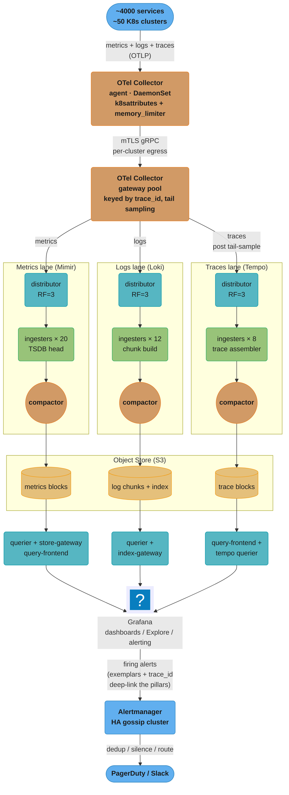
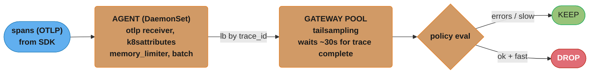
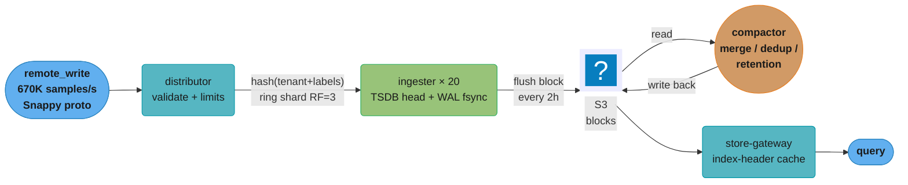
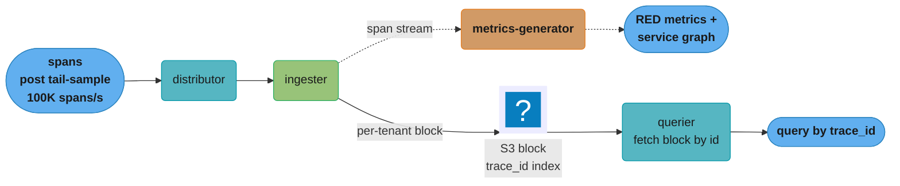
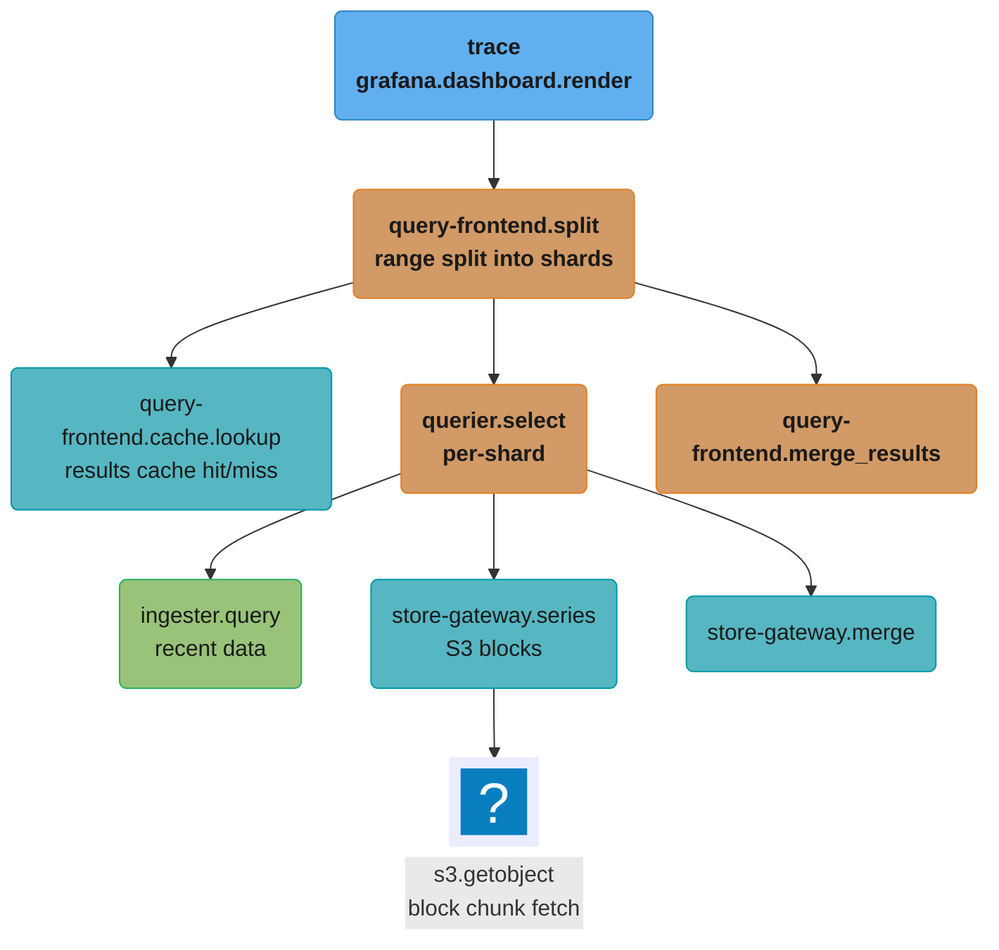
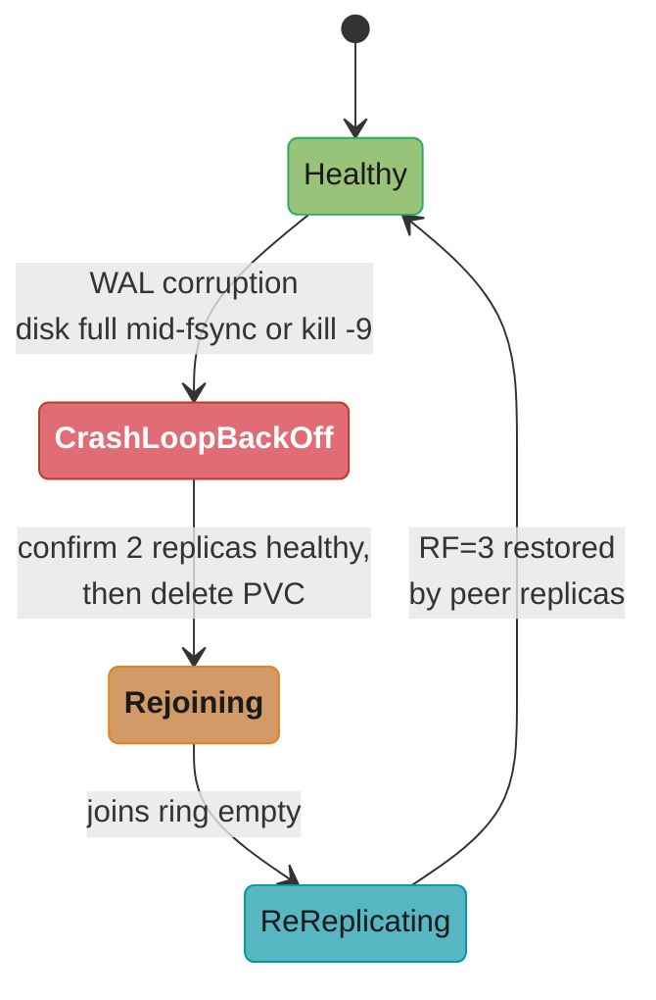
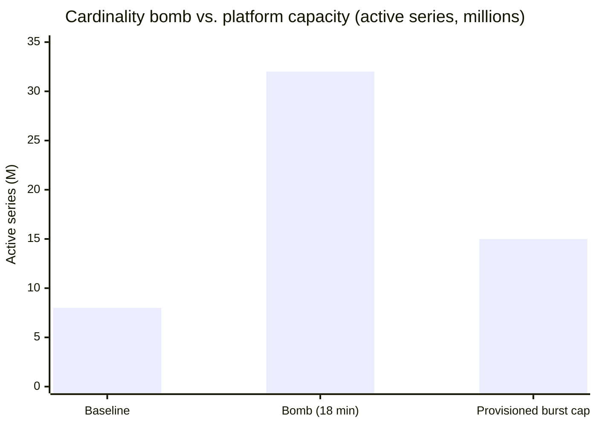

# Design an Observability Platform

## Intuition

> An observability platform is the flight data recorder for a 2000-engineer fleet: every request, every error, every saturation curve gets written somewhere durable, indexed cheaply, and queryable in seconds — so that when an aircraft starts shaking at 03:00, the on-call engineer reads the black box instead of guessing.

**Key insight:** The three pillars (metrics, logs, traces) are not three products — they are three *cardinality regimes* of the same telemetry stream. Metrics are cheap-per-sample but explode on label cardinality; logs are cheap-per-write but expensive-per-query; traces are cheap-per-span but useless without correlation. A platform succeeds or fails on how it controls cardinality and cost across all three, not on any single ingest path.

The mental model: telemetry is a firehose where 99% of the data is never read and 1% saves the company during an incident. The platform's job is to ingest the 100% durably and cheaply, while making the 1% retrievable in under two seconds — without letting one noisy tenant's 50-million-series cardinality bomb take down everyone else's dashboards.

This platform exists because at 2000 engineers and ~4000 microservices, no single Prometheus, no single Elasticsearch cluster, and no single Jaeger instance can hold the working set. You must shard, replicate, tier to object storage, and enforce per-tenant limits — or you spend your engineering budget firefighting the monitoring system instead of the product.

---

## 1. Requirements Clarification

### Functional Requirements

- **Metrics ingestion**: accept Prometheus `remote_write` and OTLP metrics from ~4000 services across ~50 Kubernetes clusters. Support PromQL queries, recording rules, and alerting rules.
- **Log ingestion**: accept structured (JSON) and unstructured logs via OTLP, Fluent Bit, and the Grafana Alloy / Loki push API. Support LogQL queries with label filtering and line-pattern matching.
- **Trace ingestion**: accept OTLP/gRPC and OTLP/HTTP spans. Support trace-by-ID lookup, service-graph generation, and trace search by attributes (latency, status, service).
- **Correlation**: a single click from a metric spike to the logs of that pod to the exemplar trace that caused the latency (exemplars link metrics → traces; `trace_id` in logs links logs → traces).
- **Multi-tenancy**: hard isolation per team/tenant — separate ingestion limits, query quotas, retention, and RBAC. ~120 tenants.
- **Dashboards & alerting**: Grafana for visualization; Alertmanager for routing, deduplication, silencing, and on-call paging (PagerDuty).
- **Self-service**: teams onboard via GitOps — a tenant manifest sets limits, retention, and alert routes without platform-team intervention.

### Non-Functional Requirements

| Dimension | Target |
|-----------|--------|
| Active metric series | 10M active series steady-state, burst to 15M |
| Metric ingest rate | ~670K samples/sec sustained (10M series ÷ a 15s scrape interval), ~1M/sec at the 15M burst |
| Log volume | 20 TB/day raw (RF=3 across ingesters; chunks deduplicate to ~1 copy in object storage) |
| Trace volume | 2M spans/sec pre-sampling; ~100K spans/sec stored (5% effective) |
| Query latency | p99 < 2s for dashboard PromQL (1h range, ~20 series); p99 < 5s for LogQL grep over 1h |
| Ingest availability | 99.9% (cannot lose telemetry during a partial AZ outage) |
| Query availability | 99.5% (read path may degrade before write path) |
| Metric retention | 15 days raw at full resolution; **13 months** of recording-rule aggregates for SLO/capacity (Mimir has no downsampling — see §5.1) |
| Log retention | 30 days hot-queryable; 90 days cold in object store |
| Trace retention | 7 days |
| Ingest-to-queryable lag | < 30s for metrics, < 60s for logs/traces |
| Per-tenant blast radius | one tenant's cardinality bomb must not degrade another tenant's queries |

### Out of Scope

- Application-level instrumentation libraries (we standardize on OpenTelemetry SDKs but do not build them).
- RUM (Real User Monitoring) / front-end browser telemetry — separate product.
- Long-term (multi-year) compliance log archival to Glacier — handled by the security/SIEM pipeline.
- Synthetic monitoring / probing (Blackbox exporter is referenced but its design is a separate doc).

See [`../observability_metrics_prometheus/observability_metrics_prometheus.md`](../observability_metrics_prometheus/observability_metrics_prometheus.md), [`../observability_logging/observability_logging.md`](../observability_logging/observability_logging.md), and [`../observability_tracing_and_otel/observability_tracing_and_otel.md`](../observability_tracing_and_otel/observability_tracing_and_otel.md) for the underlying single-system modules this case study composes.

---

## 2. Scale Estimation

All numbers derived from the §1 targets. The point of this section is that the *metrics ingester fleet* and the *log object-storage* line dominate the bill.

### Metrics: memory and ingest

Sizing comes straight from Grafana's published Mimir capacity ratios: an ingester needs **1 core and 2.5 GB per 300,000 in-memory series**, and Grafana recommends capping an ingester at **1.5M series**. (The often-quoted "2 KB per head series" is the bare label-set + sample-buffer cost in Prometheus; Mimir's real footprint is ~4x that once the WAL, mmapped head chunks, out-of-order buffers and Go GC headroom are counted, which is why you size from the published ratio and not from the label set.)

```
Active series:            10,000,000
Replication factor:       3  (Mimir RF=3)
Series held in memory:    10M × 3                    = 30M
Ingester RAM (aggregate): 30M / 300K × 2.5 GB        = 250 GB
Ingester CPU (aggregate): 30M / 300K × 1 core        = 100 cores
```

At Grafana's 1.5M-series-per-ingester ceiling:

```
ingesters needed        = 30M / 1.5M                 = 20 ingesters
Per ingester at the cap = 12.5 GB, 5 cores
Instance: r6i.2xlarge (8 vCPU / 64 GiB)
  -> CPU is the binding constraint: 100 cores needed / 160 provisioned = ~62%
  -> RAM sits ~5x over the steady-state need, which is the headroom that
     absorbs churn, compaction spikes and GC without an OOM
```

Ingest byte rate (compressed TSDB, ~1.3 bytes/sample on disk; in-flight remote_write ~3.5 bytes/sample wire):

```
Samples/sec:              10M series / 15s scrape     = ~670,000 samples/s
Wire bytes/sample:        ~3.5 B (Snappy-compressed protobuf)
Ingest wire throughput:   670K × 3.5 B                = 2.3 MB/s × RF3 = ~7 MB/s
On-disk compressed:       670K × 1.3 B × 86400        = ~75 GB/day raw blocks (post-dedup)
```

The samples/sec figure is *not* a free parameter — it is `active_series ÷ scrape_interval`. Quoting a sample rate that does not divide out of the series count is the most common self-inconsistency in an observability capacity plan.

### Metrics: long-term object storage (13 months)

**Mimir does not implement Thanos-style downsampling** — the compactor merges, deduplicates replicas, and applies per-tenant retention, and that is all. Grafana's own guidance for shrinking the long-term tier is recording rules plus retention limits, so the 13-month SLO tier here is a small set of pre-aggregated series written to a separate long-term tenant whose `compactor_blocks_retention_period` is 13 months, while the raw high-cardinality tenant keeps 15 days.

```
Raw 15-day tier (compacted):   ~75 GB/day × 15        = ~1.1 TB
13-month SLO tier: ~5,000 recording-rule series at 1m resolution
                   5,000 × 1,440 samples/day × 1.3 B  = ~9 MB/day
                   ~9 MB/day × 395 days               = ~3.6 GB
Total metric object storage:   ~1.1 TB
S3 Standard cost:              1,100 GB × $0.023/GB   = ~$26/month
```

Object storage for metrics is almost free at this scale. The expensive resource is the **ingester fleet** (the 20× r6i instances), sized by in-memory series — not storage.

### Logs: the dominant storage line

```
Raw log volume:           20 TB/day
Loki compression (gzip/snappy, ~10x on structured logs): 2 TB/day stored chunks
Replication in S3:         S3 already 11-nines durable; Loki keeps 1 copy + S3 RF
30-day hot:                2 TB/day × 30          = 60 TB
90-day cold (same bucket, lifecycle to IA):       2 TB/day × 60 extra = 120 TB
Total log object storage:  ~180 TB
S3 cost (60 TB Standard + 120 TB IA):
   60 TB × $0.023  = $1,380
   120 TB × $0.0125 = $1,500
   ≈ $2,880/month
```

Logs are two orders of magnitude more expensive to store than metrics ($2,880 vs $26). Index is tiny because Loki indexes only labels, not log lines (~1-2% of chunk size → ~2-4 GB/day index in object store).

### Traces: sampling is everything

```
Pre-sample span rate:     2,000,000 spans/sec
Tail-sampling keep rate:  5% effective (100% of errors + slow, ~3% of OK)
Stored span rate:         ~100,000 spans/sec
Bytes/span (compressed):  ~300 B
Trace ingest throughput:  100K × 300 B           = 30 MB/s
Daily stored trace bytes: 30 MB/s × 86400        = ~2.6 TB/day
7-day retention:          ~18 TB
S3 cost:                  18 TB × $0.023          = ~$414/month
```

### Cost summary (monthly, object storage + headline compute)

| Resource | Monthly |
|----------|---------|
| Metric object storage (1.1 TB) | ~$26 |
| Log object storage (180 TB tiered) | ~$2,880 |
| Trace object storage (18 TB) | ~$414 |
| 20 metric ingesters (r6i.2xlarge ~$0.50/hr) | ~$7,300 |
| Loki ingesters/distributors (~12 × m6i.2xlarge) | ~$3,300 |
| OTel collector fleet (~30 c6i.xlarge gateways) | ~$3,700 |
| Queriers + store-gateways (~25 mixed) | ~$5,500 |
| **Total order-of-magnitude** | **~$23K/month** |

The lesson: **compute (ingesters + collectors + queriers) is ~86% of the bill ($19.8K), object storage ~14% ($3.3K) — and log chunks are 87% of that storage.** Cardinality control reduces ingester count, which is where the savings are. See [`cross_cutting/prometheus_cardinality_and_scale.md`](cross_cutting/prometheus_cardinality_and_scale.md).

---

## 3. High-Level Architecture



*Telemetry flows agent to gateway to a per-pillar distributor/ingester/compactor stack, lands in S3, and is read back through queriers into Grafana, with Alertmanager routing alerts out to PagerDuty/Slack.*

### Component inventory

| Component | Role | State |
|-----------|------|-------|
| OTel collector (agent) | Node-local scrape + tail-batch + forward | Stateless |
| OTel collector (gateway) | Trace-ID-consistent routing + tail sampling | Stateful (in-flight trace assembly window) |
| Mimir distributor | Validate, dedup, hash-ring shard, replicate RF=3 | Stateless |
| Mimir ingester | TSDB head, 2h block build, WAL | Stateful (replicated) |
| Mimir compactor | Compact blocks, deduplicate the RF=3 replicas, apply per-tenant retention (no downsampling — Mimir has none) | Stateless (singleton per tenant shard) |
| Mimir store-gateway | Serve blocks from S3 with index-header cache | Stateful (cache) |
| Loki distributor/ingester/compactor | Same shape for logs; chunk = compressed log stream | Stateful ingesters |
| Tempo distributor/ingester/compactor | Trace span storage; block per tenant | Stateful ingesters |
| Query-frontend | Splitting, caching, queueing, per-tenant fairness | Stateless |
| Grafana | Unified UI; datasources for Mimir/Loki/Tempo | Stateless (DB-backed) |
| Alertmanager | Alert routing/dedup; HA via gossip | Stateful (gossip + notification log) |

### Data flow narrative

1. An app emits OTLP to the node-local **agent collector**, which enriches with k8s metadata (`k8sattributes`) and applies a `memory_limiter` so a log storm cannot OOM the node.
2. The agent forwards to a **regional gateway pool**. For traces, the agent uses the `loadbalancing` exporter keyed on `trace_id` so that *all spans of one trace land on the same gateway* — a precondition for tail sampling.
3. The gateway runs **tail sampling** (decide *after* the trace completes), then fans out: metrics → Mimir, logs → Loki, traces → Tempo.
4. Each backend **distributor** validates, applies per-tenant limits, hashes onto a ring, and replicates RF=3 to **ingesters**.
5. Ingesters build in-memory structures (TSDB head / log chunks / trace blocks), persist a WAL, and **flush to S3** every ~2h (metrics) or on chunk-full (logs).
6. **Compactors** merge blocks, deduplicate the RF=3 replicas, and enforce per-tenant retention.
7. Reads go through a **query-frontend** (split, cache, queue) to **queriers** + **store-gateways** that fetch recent data from ingesters and historical from S3.
8. **Grafana** unifies all three; exemplars embed `trace_id` in metric scrapes so a latency spike deep-links to the trace and its logs.

For multi-region trace-ID-consistent routing and cross-cluster mesh, see [`cross_cutting/multi_cluster_networking.md`](cross_cutting/multi_cluster_networking.md).

---

## 4. Component Deep Dives

### 4.1 OTel Collector pipeline + tail sampling



*Agent batches spans and load-balances by `trace_id` so every span of one trace lands on the same gateway, where a ~30s decision window buffers the trace before the policy keeps errors/slow traces and drops the rest.*

**Why tail over head:** Head sampling decides at the *first* span — before you know whether the request errored or was slow. So head sampling at 5% throws away 95% of your error traces, which are the only ones you want. Tail sampling buffers the whole trace and decides with full context.

**BROKEN — head sampling in the SDK loses the error traces:**

```yaml
# agent collector — WRONG: probabilistic sampler at the head
processors:
  probabilistic_sampler:
    sampling_percentage: 5    # keeps 5% of ALL traces, blind to outcome
service:
  pipelines:
    traces:
      processors: [probabilistic_sampler, batch]
```

Result: during an incident, an engineer searches for the failing checkout trace and finds nothing — it was one of the 95% dropped. You are blind exactly when you need traces most.

**FIX — tail sampling at the gateway, keyed routing at the agent:**

```yaml
# agent collector — route all spans of a trace to ONE gateway
exporters:
  loadbalancing:
    routing_key: traceID
    protocol:
      otlp:
        tls: { insecure: false }
    resolver:
      dns:
        hostname: otel-gateway.observability.svc.cluster.local
        port: 4317
service:
  pipelines:
    traces:
      receivers: [otlp]
      processors: [memory_limiter, k8sattributes, batch]
      exporters: [loadbalancing]   # NO sampling here
---
# gateway collector — tail sampling with outcome-aware policies
processors:
  memory_limiter:
    check_interval: 1s
    limit_percentage: 80
    spike_limit_percentage: 25
  tail_sampling:
    decision_wait: 30s          # buffer window: wait for the whole trace
    num_traces: 200000          # in-flight trace cap per gateway (bounded memory)
    expected_new_traces_per_sec: 5000   # ~100K traces/s spread over ~30 gateways
    policies:
      - name: keep-errors
        type: status_code
        status_code: { status_codes: [ERROR] }
      - name: keep-slow
        type: latency
        latency: { threshold_ms: 500 }
      - name: keep-sampled-ok
        type: probabilistic
        probabilistic: { sampling_percentage: 3 }   # baseline for healthy traffic
exporters:
  otlp/tempo:
    endpoint: tempo-distributor:4317
service:
  pipelines:
    traces:
      receivers: [otlp]
      processors: [memory_limiter, tail_sampling, batch]
      exporters: [otlp/tempo]
```

Now **100% of error and >500ms traces are kept**, plus a 3% baseline of healthy traffic for service-graph statistics. Effective keep rate ~5%, but the *useful* traces survive. The `num_traces` cap bounds gateway memory so a span flood cannot OOM the pool — see the meta-monitoring note in §8.

### 4.2 Mimir: distributor → ingester → compactor → store-gateway



*Distributors hash `tenant+labels` onto the ring and replicate RF=3 to ingesters; the compactor merges and deduplicates blocks already sitting in S3 before store-gateways serve queries.*

**The cardinality bomb (BROKEN):** A team adds a label `user_id` to an HTTP histogram. Each unique user creates a new series per bucket. With 2M users × 12 buckets = 24M *new* series from one metric. The ingesters' head RAM blows past the limit and they OOM-kill in a loop, taking the whole metrics write path down.

```promql
# BROKEN instrumentation (conceptually): unbounded label
http_request_duration_seconds_bucket{
  service="checkout", user_id="a3f...", le="0.1"
}   # one series PER user PER bucket -> cardinality explosion
```

**FIX — enforce limits at the distributor and drop the offending label:**

```yaml
# Mimir per-tenant overrides (runtime config, GitOps-managed)
overrides:
  team-checkout:
    max_global_series_per_user:        2000000   # hard cap; reject beyond
    max_global_series_per_metric:      200000
    ingestion_rate:                    250000     # samples/sec
    ingestion_burst_size:              2500000
    max_label_names_per_series:        30
    # drop the offending label at ingest via relabel:
    metric_relabel_configs:
      - source_labels: [__name__]
        regex: 'http_request_duration_seconds_bucket'
        target_label: user_id
        replacement: ''        # strip high-cardinality label
        action: replace
```

When the cap is hit, the distributor returns HTTP 429 `per_user_series_limit` for the *offending tenant only* — its bad metric is rejected, every other tenant keeps writing. This is the multi-tenant blast-radius guarantee in action. Detection query for SREs:

```promql
# Top cardinality offenders right now
topk(10,
  count by (__name__, tenant) ({__name__=~".+"})
)
# Ingestion rejections by reason (the alarm signal)
sum by (reason, tenant) (rate(cortex_discarded_samples_total[5m]))
```

Because Mimir has no downsampling, the 13-month SLO tier cannot be built by thinning old blocks — it is built by **recording rules** that pre-aggregate SLO numerators/denominators into a few thousand low-cardinality series, remote-written to a long-term tenant with a 13-month `compactor_blocks_retention_period`. The 13-month queries then hit pre-computed series, not raw histograms — see [`cross_cutting/slo_error_budget_math.md`](cross_cutting/slo_error_budget_math.md).

### 4.3 Loki: label index vs log content

```mermaid
flowchart LR
    classDef io      fill:#61afef,stroke:#2e86c1,color:#1a1a1a,font-weight:bold
    classDef frozen  fill:#c678dd,stroke:#9b59b6,color:#fff
    classDef train   fill:#98c379,stroke:#27ae60,color:#1a1a1a
    classDef mathOp  fill:#d19a66,stroke:#e67e22,color:#1a1a1a,font-weight:bold
    classDef lossN   fill:#e06c75,stroke:#c0392b,color:#fff,font-weight:bold
    classDef req     fill:#56b6c2,stroke:#0097a7,color:#1a1a1a
    classDef base    fill:#e5c07b,stroke:#f39c12,color:#1a1a1a

    logs(["log lines (OTLP)<br/>20 TB/day"]) --> dist("distributor<br/>validate")
    dist -->|"hash ring RF=3<br/>stream = label set"| ing("ingester<br/>build + compress chunk")
    ing -->|"flush at 1.5MB"| s3@{ icon: "logos:aws-s3", form: "square", label: "S3<br/>chunks + TSDB index", pos: "b", h: 44 }
    s3 --> ig("index-gateway<br/>cache")
    ig --> q("querier")
    q --> lq(["query (LogQL)"])

    class logs io
    class dist req
    class ing train
    class ig req
    class q req
    class lq io
```



*Loki hashes each unique label set (a "stream") onto the ring, builds a compressed chunk per stream, and flushes to S3 once a chunk hits 1.5MB; reads flow back through the index-gateway cache to the querier.*

Loki's trick: **it indexes only labels, never log content.** A query is `{labels} |= "pattern"` — the label matcher narrows to a few chunks via the index, then a brute-force grep runs over those decompressed chunks. This makes ingest cheap (no full-text index) but means a query with *no* label filter must scan everything.

**BROKEN LogQL — a matcher that excludes nothing, so every stream in the window is scanned:**

```logql
# WRONG: matches every stream that has a namespace label at all
{namespace=~".+"} |= "OutOfMemoryError"
```

Note that a literally empty selector — `{} |= "OutOfMemoryError"` — is *rejected by the parser*, not merely slow: LogQL requires at least one matcher that is not empty-compatible, which is also why `{namespace=~".*"}` is refused while `{namespace=~".+"}` is accepted. The dangerous query is therefore the one that parses fine and matches everything. On 2 TB/day of chunks this reads hundreds of GB and times out at the query-frontend's 5s limit.

**FIX — always pin labels first, filter lines second:**

```logql
# label matcher narrows to ~handful of streams, THEN grep the lines
{namespace="payments", app="checkout", level="error"}
  |= "OutOfMemoryError"
  | json
  | line_format "{{.trace_id}} {{.msg}}"
```

To keep Loki ingest healthy, cap **stream cardinality** the same way as metrics — never put `pod`, `request_id`, or `trace_id` in *labels* (put them in the log body). A label set should be `cluster/namespace/app/level` only:

```yaml
# Loki per-tenant limits
limits_config:
  max_global_streams_per_user:  10000    # stream = label-set; cap it
  max_label_names_per_series:   15
  ingestion_rate_mb:            50
  ingestion_burst_size_mb:      100
  reject_old_samples:           true
  reject_old_samples_max_age:   168h
  retention_period:             720h     # 30 days hot
  # Query-side discipline: reject the everything-matches query at the frontend
  required_labels:              [namespace, app]
  required_number_labels:       2
```

A common Loki incident: a team sets `level` from a free-text field, and a malformed log injects `level="<full stack trace>"`, creating a new stream per log line — a stream-cardinality bomb identical in shape to the metric one. The `max_global_streams_per_user` cap contains it.

### 4.4 Tempo: trace block store + service graphs



*The metrics-generator derives RED metrics and service-graph edges straight from the span stream, so every stored trace also feeds Grafana dashboards without extra instrumentation.*

Tempo stores traces by `trace_id` with a minimal index (block-level bloom filters keyed on trace ID). Trace-by-ID lookup is O(blocks-with-matching-bloom). For *search by attribute*, Tempo uses TraceQL over a columnar block format (Parquet-like):

```
# TraceQL: find slow checkout traces with a DB error span
{ resource.service.name = "checkout" && duration > 500ms }
  && { span.db.system.name = "postgresql" && status = error }
```

The **metrics-generator** turns the span stream into RED (Rate/Errors/Duration) metrics and service-graph edges, written back into Mimir — so you get service dashboards *for free* from traces, and a metric exemplar links straight back to the source trace. Closing the loop: metric exemplar → `trace_id` → Tempo trace → `trace_id` in log line → Loki logs. That is the three-pillar correlation the platform exists to deliver.

For hardening these stateful ingesters (PodDisruptionBudgets, anti-affinity, graceful WAL flush on rollout), see [`cross_cutting/kubernetes_production_hardening.md`](cross_cutting/kubernetes_production_hardening.md).

---

## 5. Design Decisions & Tradeoffs

### 5.1 Mimir vs Thanos vs Cortex for metrics

**Decision:** Grafana Mimir as the metrics backend.
**Alternatives:** Thanos (sidecar + store-gateway federation), Cortex (Mimir's ancestor), VictoriaMetrics.
**Rationale:** Mimir is Grafana Labs' AGPLv3 fork of Cortex, optimized for horizontal scale — it has demonstrated 1B+ active series in a single cluster, a split-and-merge compactor, a shuffle-sharding tenant isolation model, and a single binary that runs all microservices. Thanos is simpler to bolt onto existing Prometheus servers (sidecar uploads blocks) but federation queries fan out to every store-gateway and get slow at our scale. Cortex is **not** a dead ancestor: it is still an actively maintained CNCF project under Apache 2.0, and for some organizations the licence alone decides it — Mimir's AGPLv3 is a non-starter wherever the legal team bans copyleft in the serving path.
**Consequences:** Three things we give up. (1) The "just add a sidecar to existing Prometheus" simplicity of Thanos; instead apps `remote_write` to Mimir. (2) **Downsampling** — Thanos downsamples old blocks to 5m and 1h, and Mimir has no equivalent; Grafana's guidance is recording rules plus retention limits, which is the 13-month tier described in §2. (3) A permissive licence. What we gain is shuffle sharding (a noisy tenant only touches a subset of ingesters) and a single operational model.

### 5.2 Loki vs Elasticsearch for logs

**Decision:** Loki.
**Alternatives:** Elasticsearch/OpenSearch (full-text inverted index), ClickHouse.
**Rationale:** At 20 TB/day, Elasticsearch's full-text index would cost more than the raw logs themselves (index can be 1x the data size, plus replicas, plus the JVM heap pressure). Loki indexes only labels (~1-2% overhead) and greps chunks on demand. Our query pattern is "filter by service+level, then grep for a string in a 1h window" — perfect for Loki. Elasticsearch wins for arbitrary full-text analytics across all logs with no label discipline, which we deliberately do not need.
**Consequences:** Queries *must* carry a label filter or they scan everything; we enforce LogQL discipline and stream-cardinality limits. We trade ad-hoc full-text power for 8-10x lower cost.

### 5.3 Tail sampling vs head sampling for traces

**Decision:** Tail sampling at the gateway (100% errors + slow, 3% baseline).
**Alternatives:** Head/probabilistic sampling in the SDK, no sampling (store 100%).
**Rationale:** Covered in §4.1 — head sampling discards error traces blindly; storing 100% at 2M spans/sec is ~52 TB/day, which at our 7-day retention is 363 TB and ~$8.3K/month in S3 alone, 20x the ~$414/month the sampled stream costs. The storage line is the *small* half of that bill: a 20x span rate also multiplies the Tempo ingester and compactor fleet, which is where the real money goes.
**Consequences:** Gateways become stateful (must buffer a trace until `decision_wait`), require trace-ID-consistent routing (the `loadbalancing` exporter), and add ~30s ingest latency for traces. We accept that trace latency for the guarantee that no error trace is lost.

### 5.4 Push (remote_write/OTLP) vs Pull (Prometheus scrape) at the edge

**Decision:** Pull at the node (Prometheus/agent scrapes local targets) → push (remote_write) to the central platform.
**Alternatives:** Central Prometheus scraping all 4000 services directly (pull everywhere), full push from SDKs.
**Rationale:** Pull-at-the-edge keeps service-discovery local to each cluster and gives natural up/down detection (a missed scrape = target down). Central pull across 50 clusters and NAT boundaries is a networking nightmare. Push to the center via remote_write is the only thing that scales across cluster/region boundaries.
**Consequences:** We run a per-cluster agent that scrapes then forwards; we lose the "central Prometheus can scrape anything" model but gain clean multi-cluster topology.

### 5.5 remote_write vs Prometheus federation for aggregation

**Decision:** remote_write everything to Mimir; do *not* use hierarchical federation.
**Alternatives:** Federation (a top-level Prometheus scrapes `/federate` from leaf Prometheis).
**Rationale:** Federation pulls aggregated series up a tree; it is lossy (you choose what to federate), the top node becomes a cardinality bottleneck, and it cannot do 13-month retention. remote_write ships *all* raw samples to a horizontally scalable backend.
**Consequences:** Higher network egress (full sample stream vs aggregated), mitigated by Snappy compression and per-cluster relabel drops of useless series.

### 5.6 Per-tenant hard limits vs best-effort fair sharing

**Decision:** Hard per-tenant series/ingestion-rate caps + shuffle sharding.
**Alternatives:** Soft global limits, no isolation.
**Rationale:** §4.2 cardinality bomb shows why: without hard caps, one tenant OOMs the shared ingesters. Shuffle sharding assigns each tenant a random subset of ingesters, so a tenant's overload touches only its subset.
**Consequences:** Tenants occasionally hit 429s and must request limit increases via GitOps; that friction is the price of blast-radius isolation.

### Comparison table

| Decision | Chosen | Rejected | Key reason |
|----------|--------|----------|-----------|
| Metrics backend | Mimir | Thanos / Cortex | Horizontal scale to 1B series, shuffle sharding (accepting AGPLv3 and no downsampling) |
| Logs backend | Loki | Elasticsearch | 8-10x cheaper at 20 TB/day (label-only index) |
| Trace sampling | Tail | Head / none | Keeps 100% of error traces |
| Edge collection | Pull→Push | Central pull | Clean multi-cluster topology |
| Aggregation | remote_write | Federation | Lossless, 13-month retention |
| Isolation | Hard caps + shuffle | Best-effort | Blast-radius containment |

---

## 6. Real-World Implementations

### Grafana Labs — Mimir at 1 billion+ series

Grafana Labs publicly demonstrated Mimir handling **1 billion active series** in a single cluster (their "1 billion series" blog and benchmark). Key techniques: **shuffle sharding** (each tenant maps to a deterministic subset of ingesters, drastically reducing the probability that two noisy tenants collide), **split-and-merge compactor** to parallelize compaction of huge tenants, and a **store-gateway with index-header lazy loading** so historical queries don't need the full index in RAM. Grafana Cloud runs this as their multi-tenant SaaS metrics backend.

### Cloudflare — from OpenTSDB to a Prometheus/Thanos-style stack

Cloudflare runs metrics across an edge network spanning 330+ cities. They publicly documented running large Prometheus deployments with long-term storage, ingesting **tens of millions of samples/sec**, and built tooling (`pint`, their PromQL linter) to catch broken recording/alerting rules in CI before deploy — exactly the recording-rule eval gate in §8a. Their edge model is pull-at-the-PoP, aggregate centrally.

### Uber — M3 (M3DB) for tens of billions of series

Uber built **M3** (open-sourced M3DB + M3 Coordinator + M3 Query) because at their scale (tens of millions of metrics/sec, **10+ billion** time series) off-the-shelf Prometheus storage could not keep up. M3 introduced aggressive **downsampling tiers** (e.g., 10s for 2 days, 1m for 30 days, 1h for years) and a custom compressed time-series database. M3 does this natively; Mimir does not, so we reach the same end — a cheap long-horizon tier — with recording rules and a separate long-retention tenant instead of block downsampling. The tiering *idea* is what carries over, not the mechanism.

### Netflix — Atlas

Netflix's **Atlas** is an in-memory dimensional time-series database optimized for *operational* queries (the last few hours at very high cardinality). Atlas keeps recent data in memory for sub-second alerting queries and rolls older data to cheaper storage. Netflix's key lesson, widely cited, is that **cardinality is the cost driver** — they invest heavily in tooling to find and kill high-cardinality "metric explosions."

### Datadog / Shopify — managed ingestion at scale

Datadog publicly discusses ingesting **trillions of points/day** with a Kafka-fronted ingestion pipeline that decouples spiky producers from storage, plus aggressive tagging cardinality controls (their "custom metrics" billing is literally cardinality-based). Shopify documented running large Prometheus + Thanos with **per-team tenancy** and recording-rule discipline to keep dashboard queries fast during Black Friday Cyber Monday traffic spikes. The Kafka-buffer-in-front pattern is a common variant of our distributor tier for absorbing ingest bursts.

---

## 7. Technologies & Tools

| Tool | Model | Strength | Weakness | Best for |
|------|-------|----------|----------|----------|
| Prometheus + Thanos | Sidecar uploads TSDB blocks; store-gateway federation | Drop-in for existing Prometheus; simple mental model; **5m/1h block downsampling** (Mimir has none); Apache 2.0 | Fan-out queries slow at very high scale; weaker tenant isolation | Mid-scale, many existing Prometheis to unify |
| Grafana Mimir | Cortex fork, microservices; remote_write in | 1B+ series, shuffle sharding, split-and-merge compactor | Heavier to operate; remote_write only; **no downsampling**; AGPLv3 | Large multi-tenant orgs (our choice) |
| Cortex | The project Mimir forked from; still active in the CNCF | Mature, battle-tested, **Apache 2.0** | Smaller contributor base than Mimir post-fork | Orgs that cannot take an AGPLv3 dependency |
| VictoriaMetrics | Single-binary or cluster TSDB | Very memory-efficient, fast ingest, MetricsQL | Smaller ecosystem, non-Prometheus query dialect extensions | Cost-sensitive teams wanting low RAM/series |
| Datadog | SaaS, agent-based | Turnkey, integrated APM/logs/metrics | Cardinality-based billing gets expensive fast | Teams that want zero ops, accept cost |
| Grafana Cloud | Managed Mimir/Loki/Tempo | Same stack, fully managed | Vendor egress + per-series pricing | Teams wanting the OSS stack without running it |

For logs: Loki (chosen) vs OpenSearch (full-text, costlier) vs ClickHouse (SQL analytics on logs, rising in popularity). For traces: Tempo (chosen, object-store native) vs Jaeger v2 (now built on the OpenTelemetry Collector and OTLP-native, but its Cassandra/Elasticsearch/ClickHouse backends are heavier to run than object storage) vs Grafana Cloud Traces.

---

## 8. Operational Playbook

### 8a. Recording-rule and alert eval gate

Recording rules and alerting rules ship via GitOps and **must pass CI before merge**. Broken rules (typos, missing labels, queries that match nothing) are caught by linting and unit tests, not in production at 03:00.

```yaml
# CI step: lint + unit-test rules before they touch the cluster
# 1) cloudflare/pint static analysis catches dead/expensive queries
- run: pint lint rules/*.yaml
# 2) promtool unit tests assert rules fire on synthetic series
- run: promtool test rules tests/*.yaml
```

```yaml
# tests/checkout_slo_test.yaml — assert the SLO alert fires correctly
rule_files: [../rules/checkout_slo.yaml]
evaluation_interval: 1m
tests:
  - interval: 1m
    input_series:
      - series: 'http_requests_total{service="checkout",code="500"}'
        values: '0+10x10'      # 10 errors/min
      - series: 'http_requests_total{service="checkout",code="200"}'
        values: '0+90x10'      # 90 ok/min  -> 10% error rate
    alert_rule_test:
      - eval_time: 10m
        alertname: CheckoutHighErrorRate
        exp_alerts:
          - exp_labels: { service: checkout, severity: page }
```

Recording rules pre-compute SLO numerators/denominators so 13-month error-budget queries hit cheap pre-aggregated series — the math and burn-rate alerting are detailed in [`cross_cutting/slo_error_budget_math.md`](cross_cutting/slo_error_budget_math.md).

### 8b. Meta-monitoring (observability of the observability stack)

The platform must monitor *itself* with a **separate, smaller Prometheus** (the "meta" instance) so that if the main platform dies, the thing watching it is still alive. Never let the platform be its own only monitor.

OTel span hierarchy for a single query through the read path (used to debug slow dashboards):



Golden signals to alarm on for the platform itself:

```promql
# Write path: are we dropping samples?
sum(rate(cortex_discarded_samples_total[5m])) by (reason) > 0
# Ingester saturation (the OOM predictor) — Mimir exposes the configured
# instance limit as a labelled gauge, not as a *_limit metric
max by (pod) (cortex_ingester_memory_series)
  / max by (pod) (cortex_ingester_instance_limits{limit="max_series"}) > 0.80
# Read path: query-frontend queue building up
sum(cortex_query_frontend_queue_length) > 100
# Ingest-to-queryable lag. The metric is a GAUGE holding the unix timestamp of the
# latest sample seen per tenant, so the lag is time() minus it — a histogram_quantile
# over it is meaningless and will silently return nonsense.
max by (user) (time() - cortex_distributor_latest_seen_sample_timestamp_seconds) > 30
```

Detailed cardinality dashboards and per-metric cost attribution: [`cross_cutting/prometheus_cardinality_and_scale.md`](cross_cutting/prometheus_cardinality_and_scale.md).

### 8c. Named runbooks

**Runbook 1 — Ingester OOM loop**
- *Symptom:* Mimir ingesters CrashLoopBackOff; `cortex_ingester_memory_series` near limit; write 429s climbing.
- *Diagnosis:* Run the top-cardinality query (§4.2). Almost always a single tenant added a high-cardinality label (`user_id`, `request_id`, `path` with IDs).
- *Mitigation:* Apply an emergency `metric_relabel_configs` drop for the offending series + lower that tenant's `max_global_series_per_metric` via the runtime overrides (hot-reloaded, no restart). Scale ingesters +25% to absorb churn while the offender clears.
- *Resolution:* File a ticket to the owning team to fix instrumentation; keep the relabel drop until confirmed. Add the label to the org's banned-label list enforced in CI.

**Runbook 2 — Query overload / dashboards timing out**
- *Symptom:* p99 query latency > 2s; `cortex_query_frontend_queue_length` rising; users see "504 from datasource."
- *Diagnosis:* Identify the heavy query — usually an unbounded LogQL `{}` scan or a PromQL with a huge range and no recording rule. Check `cortex_query_frontend_queue_duration_seconds`.
- *Mitigation:* The query-frontend's per-tenant queue + `max_query_parallelism` and `max_query_length` already cap the blast radius; lower the offending tenant's limits temporarily. Add a results-cache TTL bump.
- *Resolution:* Convert the expensive dashboard query into a recording rule; enforce LogQL label requirements.

**Runbook 3 — WAL corruption on an ingester**
- *Symptom:* Ingester fails to replay WAL on restart; logs show `corruption in segment`.
- *Diagnosis:* Disk full mid-fsync, or a kill -9 during flush. Because RF=3, the data exists on two other replicas.
- *Mitigation:* Do **not** try to repair the WAL live. Delete the corrupt ingester's PVC and let it re-join empty; the ring + RF=3 means no data loss (other replicas serve and re-replicate). Confirm the other 2 replicas are healthy *before* deleting.
- *Resolution:* Add disk-full alerting (`< 15% free`) and ensure graceful shutdown (SIGTERM → flush → exit) via a long enough `terminationGracePeriodSeconds`. See [`cross_cutting/kubernetes_production_hardening.md`](cross_cutting/kubernetes_production_hardening.md).



*Because RF=3, a corrupt WAL is never repaired live — the ingester rejoins the ring empty and the other two replicas re-replicate it back to full redundancy, which is why confirming their health comes before deleting the PVC.*

**Runbook 4 — Alertmanager split-brain (no pages firing)**
- *Symptom:* An incident is clearly happening (dashboards red) but no page arrived; or duplicate pages.
- *Diagnosis:* Alertmanager HA gossip mesh is partitioned — replicas can't reach each other, so dedup/notification-log isn't shared. Check `alertmanager_cluster_members` < expected and `alertmanager_cluster_failed_peers`.
- *Mitigation:* Restore network connectivity between AM replicas (the gossip port, usually 9094). If a replica is permanently unreachable, remove it from the peer list so the remaining ones form a healthy cluster.
- *Resolution:* Run AM with at least 3 replicas across AZs; ensure the gossip port is open in the mesh ([`cross_cutting/multi_cluster_networking.md`](cross_cutting/multi_cluster_networking.md)); meta-monitor `ALERTS{alertname="Watchdog"}` — an always-firing heartbeat alert that pages if it *stops* arriving (dead-man's switch).

---

## 9. Common Pitfalls & War Stories

**1. The `user_id` cardinality bomb — 24M series, 18 minutes blind.** A checkout team shipped a histogram labeled by `user_id`. Within minutes, head series jumped from 8M to 32M; ingesters OOM-looped and the metrics write path was down for **18 minutes** across all 120 tenants before shuffle sharding + an emergency relabel drop contained it. Post-incident, a banned-label CI check was added. Quantified: 18 min × ~$3K/min revenue-impacting blindness on a Friday deploy, plus the entire org flying blind. Root cause and prevention dashboards: [`cross_cutting/prometheus_cardinality_and_scale.md`](cross_cutting/prometheus_cardinality_and_scale.md).



*A single `user_id` label pushed head series from an 8M baseline to 32M within minutes — more than double the platform's provisioned 15M burst ceiling from §1 — which is exactly why ingesters OOM-looped across all 120 tenants until shuffle sharding and the emergency relabel drop contained it.*

**2. Head sampling discarded every error trace.** A team used SDK probabilistic sampling at 5%. During a payment outage, the on-call searched Tempo for the failing trace and found **zero** error traces — all dropped. MTTR ballooned to ~90 minutes because they debugged from logs alone. Switching to gateway tail sampling (100% errors) cut subsequent similar-incident MTTR to ~15 minutes.

**3. The unbounded LogQL scan that DDoS'd Loki.** An engineer ran `{namespace=~".+"} |= "error"` over 24h in Grafana Explore — a query that passes LogQL's non-empty-matcher check while still selecting every stream. The querier tried to decompress ~2 TB of chunks, exhausted the query-frontend worker pool, and **every other team's log queries 504'd for ~25 minutes**. Fix: `required_labels: [namespace, app]` plus `required_number_labels: 2` so a single catch-all matcher is rejected, and a `max_query_length` of 720h with split-by-interval.

**4. Stream-cardinality bomb from a free-text label.** A service set the Loki label `route` to the raw URL path including IDs (`/order/8a3f.../item/...`). Every request created a new stream; Loki ingester memory spiked and flush latency exceeded the chunk timeout, **dropping ~40 GB of logs** during a 12-minute window. Fix: `max_global_streams_per_user=10000` and moving high-cardinality fields out of labels into the log body.

**5. Compactor fell behind → query path slowed for days.** The Mimir compactor (a singleton per tenant shard) was under-provisioned. Blocks accumulated un-compacted in S3; store-gateway queries had to open thousands of small blocks, pushing dashboard p99 from 1.2s to **9s for three days** until the compactor was scaled and split-and-merge enabled. Lesson: compactor lag (`cortex_compactor_last_successful_run_timestamp_seconds`) is a first-class alert.

**6. Alertmanager dead-man's-switch never configured — 47 minutes undetected.** A misconfigured route silently sent a whole severity tier to a Slack channel nobody watched. A real DB outage went **47 minutes** before a human noticed via customer complaints, costing an estimated **~$140K** in failed transactions. Fix: a `Watchdog` heartbeat alert that *always* fires; an external system (Dead Man's Snitch) pages if the heartbeat stops — catching both broken routes and a dead Alertmanager.

---

## 10. Capacity Planning

### Scaling formulas

```
# Metric ingesters (Grafana's published Mimir ratios)
samples_per_sec = active_series / scrape_interval        # not a free parameter
ingester_ram    = (active_series × RF) / 300,000 × 2.5 GB
ingester_cores  = (active_series × RF) / 300,000 × 1 core
ingesters       = ceil( (active_series × RF) / series_per_ingester )
   series_per_ingester ≈ 1.5M  (Grafana's recommended per-ingester ceiling)

# Metric long-term storage (object store). Mimir has NO downsampling, so the
# long tier is recording-rule output, sized from series count and not from raw.
raw_bytes/day  = samples_per_sec × bytes_per_sample_disk × 86400
storage_raw    = raw_bytes/day × raw_retention_days
storage_long   = rule_series × (86400 / rule_interval) × bytes_per_sample_disk
                 × long_retention_days
metric_storage = storage_raw + storage_long

# Log storage
log_storage = (raw_TB_per_day / compression_ratio) × retention_days

# Trace storage
trace_storage = span_rate × keep_rate × bytes_per_span × 86400 × retention_days

# Collector gateways (trace tail sampling is the memory bottleneck).
# The pool must hold every trace that is inside the decision window at once.
traces_inflight = (span_rate / spans_per_trace) × decision_wait
gateways        = ceil( traces_inflight / num_traces_per_gateway )
```

### Worked example (our targets)

**Metric ingesters:**
```
ingesters = ceil( (10,000,000 × 3) / 1,500,000 ) = 20 ingesters
Aggregate need: 30M / 300K × 2.5 GB = 250 GB RAM, and × 1 core = 100 cores
Instance: r6i.2xlarge (8 vCPU / 64 GiB) -> 160 cores, 1,280 GiB provisioned
   CPU utilisation ~62% (the binding constraint); RAM ~5x headroom for churn
Cost: 20 × r6i.2xlarge @ ~$0.504/hr × 730 = ~$7,358/month
```

**Metric storage (from §2):** ~1.1 TB raw + ~3.6 GB of 13-month recording-rule output → ~$26/month S3.

**Log storage:**
```
log_storage = (20 TB / 10) × 30 days hot = 60 TB hot
            + (2 TB/day × 60 extra days IA) = 120 TB cold
Cost: 60 TB × $0.023 + 120 TB × $0.0125 = ~$2,880/month
Loki ingesters: 20 TB/day / ~1.7 TB-per-ingester-day = ~12 ingesters
   12 × m6i.2xlarge @ ~$0.384/hr × 730 = ~$3,365/month
```

**Trace gateways (tail-sampling memory):**
```
trace rate      = 2M spans/s / 20 spans/trace          = 100,000 traces/s
traces_inflight = 100,000 traces/s × 30s decision_wait = 3,000,000 traces
bytes buffered  = 3M × 20 spans × 300 B                = ~18 GB across the pool
per gateway     = num_traces 200,000 × 20 × 300 B      = ~1.2 GB
gateways (mem)  = 3,000,000 / 200,000                  = 15 minimum
Round to 30 c6i.xlarge (4 vCPU / 8 GiB) for CPU headroom, AZ spread and the
loss of a gateway mid-window: 30 @ ~$0.17/hr × 730     = ~$3,723/month
trace_storage   = 2M × 0.05 × 300 B × 86400 × 7        = ~18 TB -> ~$414/month
```

Note the units trap in that first line: the pool is sized in *traces*, and dividing a span rate by a per-gateway *trace* rate is the kind of dimensional slip that silently produces a plausible-looking gateway count.

**Total infra (compute-dominated):** ~$23K/month as summarized in §2. To grow from 10M → 20M series, ingesters scale **linearly to 40** (the formula is linear in active series), and the single biggest lever to *avoid* that doubling is killing high-cardinality labels — see [`cross_cutting/prometheus_cardinality_and_scale.md`](cross_cutting/prometheus_cardinality_and_scale.md). Metric object storage stays negligible because the long tier is recording-rule output whose size depends on rule count, not on raw series; log storage, by contrast, scales straight with log volume and is the line to watch.

---

## 11. Interview Discussion Points

**Q1. Why are metrics, logs, and traces treated as one platform instead of three separate products?**
They are three cardinality regimes of the same telemetry stream and they must *correlate*. The value is the join: a metric exemplar carries a `trace_id`, the trace carries `trace_id`-tagged spans, and the logs carry the same `trace_id`. A click goes spike → trace → logs in seconds. Treating them separately breaks correlation and triples the operational surface. The mechanism that makes this work is consistent context propagation (W3C trace context) from the SDK through every pillar.

**Q2. What is the single biggest cost and reliability driver, and how do you control it?**
Cardinality — specifically active series for metrics and stream count for logs. Cost scales with the number of unique label sets, not the number of samples. A single high-cardinality label (`user_id`, `request_id`, full URL path) can 10x your series count and OOM ingesters. Control it with hard per-tenant/per-metric series caps at the distributor, relabel drops, a banned-label CI check, and `topk` cardinality dashboards. Practically: never put unbounded identifiers in labels — put them in exemplars or the log body.

**Q3. Why tail sampling over head sampling, and what does tail sampling cost you?**
Head sampling decides at the first span, before you know if the request errored or was slow — so 5% head sampling drops ~95% of error traces, exactly the ones you need. Tail sampling buffers the whole trace and keeps 100% of errors + slow traces plus a small baseline. The cost: gateways become stateful, you need trace-ID-consistent routing (load-balancing exporter keyed on trace_id) so all spans of a trace reach the same gateway, and you add ~30s ingest latency. The bounded in-flight trace count caps memory so a span flood can't OOM the gateway.

**Q4. How does multi-tenancy prevent one team from taking down everyone?**
Three layers: (1) hard per-tenant limits at the distributor (series, ingestion rate, query length) so a bad tenant gets 429'd, not its neighbors; (2) shuffle sharding so each tenant maps to a deterministic *subset* of ingesters — two noisy tenants rarely collide; (3) per-tenant query queues in the query-frontend so one tenant's expensive query can't starve others' dashboard refreshes. The §9 cardinality-bomb war story is what happens when layer (1) limits are too loose.

**Q5. Why Loki over Elasticsearch at 20 TB/day?**
Loki indexes only labels (~1-2% overhead) and greps compressed chunks on demand; Elasticsearch builds a full-text inverted index that can equal or exceed the raw data size, plus replicas and JVM heap pressure — at 20 TB/day that index cost is prohibitive. Our query pattern is "filter by service+level, grep a string in 1h," which Loki serves cheaply. The tradeoff: every LogQL query must carry a label matcher or it scans everything, so we enforce label discipline. Elasticsearch wins only if you need arbitrary full-text analytics with no label structure.

**Q6. Walk through what happens on `remote_write` from a service to a queryable metric.**
The service's local agent scrapes targets and `remote_write`s Snappy-compressed protobuf to a Mimir distributor. The distributor validates, applies tenant limits, hashes (tenant + labels) onto the ring, and replicates RF=3 to ingesters. Ingesters append to the in-memory TSDB head + WAL (fsync for durability). Every ~2h the head flushes a block to S3; the compactor later merges the blocks, deduplicates the 3 replicas, and applies the tenant's retention. Reads hit the query-frontend (split + cache + queue) → queriers, which merge recent data from ingesters with historical blocks from store-gateways.

**Q7. How do you keep 13-month SLO queries fast and cheap?**
Recording rules plus per-tenant retention — and specifically *not* downsampling, because Mimir does not have it (that is a Thanos feature, and the assumption that Mimir inherited it is a common interview mistake). Recording rules pre-aggregate the SLO numerator (good events) and denominator (total events) into a few thousand low-cardinality series, which are remote-written to a separate long-term tenant whose `compactor_blocks_retention_period` is 13 months while the raw tenant keeps 15 days. A 13-month error-budget query then reads a handful of pre-computed series instead of re-evaluating histograms over a year of raw data, and the long tier costs single-digit gigabytes. Burn-rate alerting runs over those same recording-rule series — detailed in `cross_cutting/slo_error_budget_math.md`.

**Q8. Why pull at the edge but push to the center?**
Pull-at-the-node keeps service discovery local and gives free liveness detection (a missed scrape = target down). But central pull across 50 clusters and NAT/firewall boundaries doesn't scale and is a networking nightmare. So each cluster runs an agent that pulls locally then `remote_write`/OTLP-pushes to the central platform — push is the only model that cleanly crosses cluster and region boundaries. Federation was rejected because it's lossy and can't do long retention.

**Q9. How do you monitor the monitoring system without circular dependency?**
Run a small, separate "meta" Prometheus that watches the main platform — never let the platform be its own only monitor, or a platform outage blinds you to the platform outage. Add a Dead Man's Switch: an always-firing `Watchdog` alert; an external service (e.g., Dead Man's Snitch) pages if the heartbeat *stops* arriving, which catches a dead Alertmanager, a broken alert route, or a dead platform. Golden signals: discarded samples, ingester series-vs-limit ratio, query-frontend queue length, ingest-to-queryable lag.

**Q10. An ingester is CrashLoopBackOff-ing with WAL corruption. What do you do?**
Do not attempt a live WAL repair. Because RF=3, the data exists on two other replicas — first confirm those two are healthy, then delete the corrupt ingester's PVC and let it rejoin empty; the ring re-replicates to restore RF=3. Then address the root cause: usually disk-full mid-fsync or a kill -9 during flush. Add `< 15% disk free` alerting and a long enough `terminationGracePeriodSeconds` so SIGTERM triggers a graceful flush before exit. Hardening details in `cross_cutting/kubernetes_production_hardening.md`.

**Q11. How do you absorb ingest bursts (deploy storms, retry floods) without dropping data?**
Three buffers: the agent's `batch` + `memory_limiter` processors smooth at the edge; the distributor's `ingestion_burst_size` allows short bursts above the steady rate; and many large orgs (Datadog, Shopify) front the distributor with Kafka to decouple spiky producers from storage entirely. The key is that bounded memory + backpressure (429 with retry-after) is preferable to unbounded buffering that OOMs — drop-the-excess-from-one-tenant beats crash-the-shared-ingesters.

**Q12. Alertmanager is up but no pages fired during a real incident. Root cause and fix?**
Likely an HA gossip split-brain: the Alertmanager replicas can't reach each other on the gossip port (9094), so they don't share the dedup/notification-log state and routing breaks — or, worse, a misconfigured route sent the severity tier to a dead channel. Diagnose with `alertmanager_cluster_members` and `alertmanager_cluster_failed_peers`. Fix the mesh connectivity (multi-cluster networking), run ≥3 replicas across AZs, and rely on the Watchdog dead-man's-switch so a silent failure pages externally rather than going undetected (the §9 47-minute / ~$140K war story).

**Q13. What is the upgrade/rollout risk for stateful ingesters, and how do you mitigate it?**
Ingesters hold in-memory series and an un-flushed WAL; a naive rolling restart can drop in-flight data or, worse, restart too many replicas at once and break RF=3 quorum. Mitigate with a PodDisruptionBudget (max 1 ingester down), anti-affinity across AZs, a graceful SIGTERM → flush-to-S3 → exit sequence with adequate `terminationGracePeriodSeconds`, and rolling one replica at a time while confirming the ring is healthy before proceeding. This is standard stateful-workload hardening — see `cross_cutting/kubernetes_production_hardening.md`.
