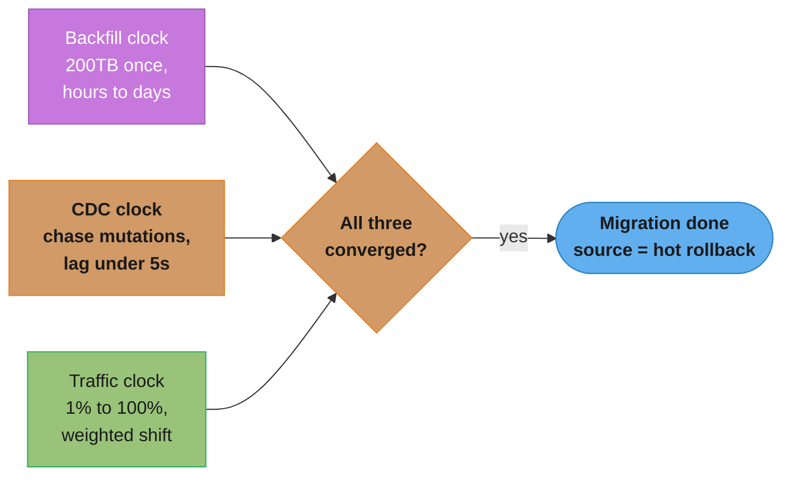
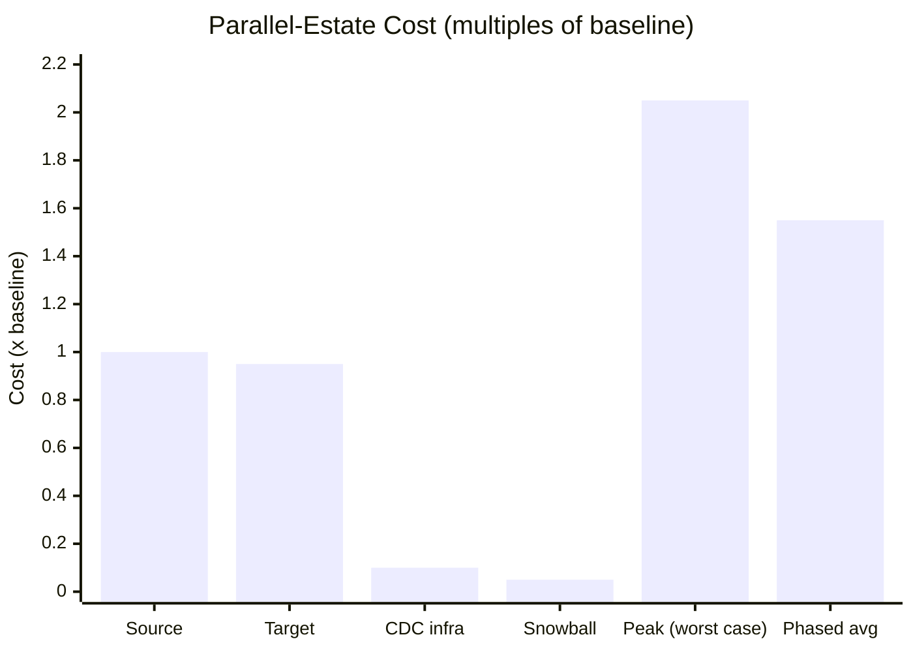
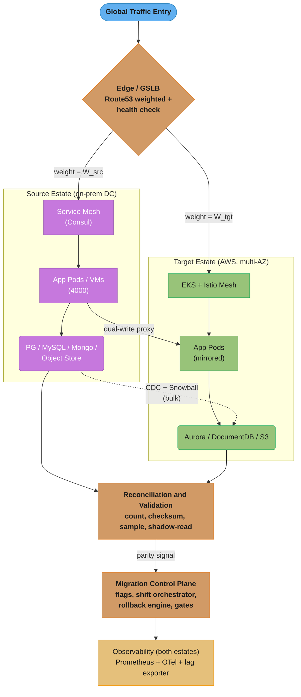
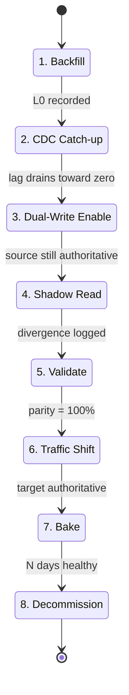
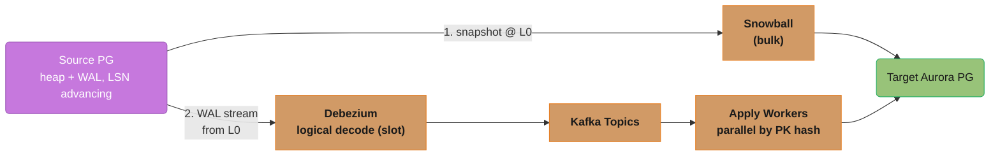
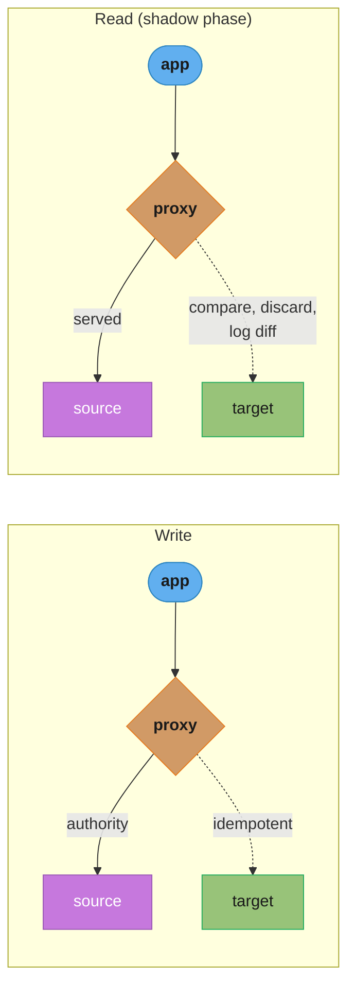
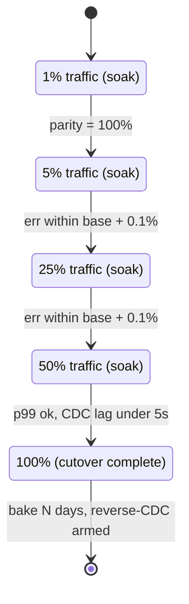
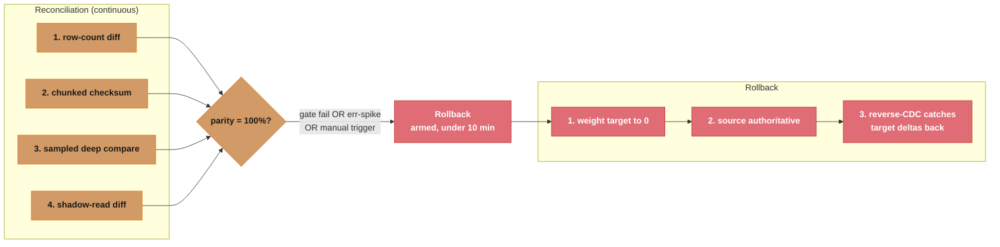
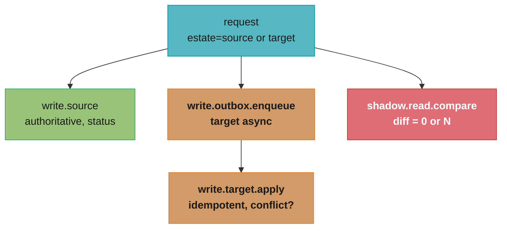

# Design a Zero-Downtime Infrastructure Migration

> Migrating a live production estate is like replacing the engines of a 747 mid-flight — passengers must not feel a single bump, and you keep the old engines spinning until the new ones are proven.

**Key insight**: Zero downtime is not a cutover event — it is a *long period of running both estates simultaneously* with replication keeping them in lock-step, traffic shifted in tiny weighted increments, and a sub-10-minute rollback armed at every step until parity is proven to 100%.

---

## Intuition

> You do not move a city by demolishing it and rebuilding elsewhere. You build the new city next door, lay a bridge, move residents one block at a time, and keep the old water and power running until the last family crosses.

**Key insight**: The hard part of a migration is never the copy — it is the *change that happens during the copy*. 200TB takes ~44 hours to stream at 10Gbps, but the source database keeps mutating the whole time, so you need Change Data Capture (CDC) to chase the delta, dual-write to keep both sides hot, and reconciliation to *prove* the two estates agree before you trust the new one.

**Mental model**: Think of three overlapping clocks running for the entire 6-month window:
1. **The backfill clock** — bulk-copies the historical 200TB once (hours to days).
2. **The CDC clock** — replicates every mutation since the backfill snapshot, continuously, with bounded lag (target < 5s).
3. **The traffic clock** — shifts user requests from old to new in weighted increments (1% → 5% → 25% → 50% → 100%), each step health-gated and reversible.

The migration is "done" only when all three clocks have converged: backfill complete, CDC lag near zero, and 100% of traffic served by the target with the source kept as a hot rollback for a bake period.



*The migration is "done" only when all three clocks converge — backfill complete, CDC lag near zero, and 100% of traffic on the target — with the source retained as a hot rollback through the bake period.*

**Why this system exists**: Companies migrate estates for cost (data-center lease expiry, cloud arbitrage), capability (managed services, autoscaling, multi-region), compliance (data residency), or end-of-life (a vendor sunset). A "maintenance window" big-bang migration of 4000 services and 200TB is impossible — there is no 44-hour window where a global product can be down. The only viable path is an *online* migration where the business never notices. This is the strangler-fig pattern applied to infrastructure: the new system slowly grows around the old until the old can be cut away.

---

## 1. Requirements Clarification

### Functional Requirements

- **FR1 — Strangler cutover per service**: Each of 4000 services can be cut over from source (on-prem data center) to target (AWS EKS + Aurora) independently, in dependency order, without a global flag day.
- **FR2 — Online data migration**: Migrate 200TB across heterogeneous stores (PostgreSQL 9.6 → Aurora PostgreSQL 15, self-managed MySQL → Aurora MySQL, MongoDB → DocumentDB, on-prem object store → S3) with the source remaining the system of record until cutover.
- **FR3 — Dual-write / dual-read**: During a service's transition window, writes land in both estates and reads can be served from either, with shadow reads validating the target.
- **FR4 — Weighted traffic shift**: Route a configurable percentage of production traffic to the target per service (1/5/25/50/100), adjustable in seconds.
- **FR5 — Continuous reconciliation**: Compare source and target row counts, checksums, and sampled records continuously; surface divergence as a blocking signal.
- **FR6 — Rollback**: Any service or data store can revert to source-only in under 10 minutes, at any phase, without data loss.
- **FR7 — Feature-flagged routing**: Cutover decisions are runtime flags (not deploys), per service, per tenant, with kill switches.

### Non-Functional Requirements

| Requirement | Target |
|---|---|
| User-visible downtime | **0 seconds** (no maintenance window) |
| RPO for DB cutover | **0** (no acknowledged write lost) |
| RTO (rollback) | **< 10 minutes** per phase |
| Total migration window | **6 months** for 4000 services + 200TB |
| CDC replication lag (steady state) | **p99 < 5s**, hard alert at 30s |
| Data parity at cutover | **100%** (count + checksum + sampled-row equality) |
| Added p99 latency from dual-write | **< 15ms** per write |
| Parallel-estate cost overhead | **≤ 1.6×** baseline during overlap |
| Cutover blast radius | **≤ 1 service / ≤ 1% traffic** per increment |

### Out of Scope

- Application re-architecture (microservice splits, language rewrites) — this is a **lift-and-shift-first** migration; re-platforming happens *after* the estate is on AWS.
- Networking primitives (cross-cluster connectivity, service mesh internals) — see [`cross_cutting/multi_cluster_networking.md`](./cross_cutting/multi_cluster_networking.md).
- Terraform backend/state mechanics at scale — see [`cross_cutting/terraform_state_at_scale.md`](./cross_cutting/terraform_state_at_scale.md).
- DR strategy for the *target* estate post-migration — see [`../disaster_recovery_and_resilience/README.md`](../disaster_recovery_and_resilience/README.md).
- Cost optimization (Reserved Instances, Savings Plans) of the steady-state target — only the *overlap* cost is in scope.

---

## 2. Scale Estimation

### Bulk Backfill: how long to copy 200TB?

Network-bound copy at a sustained **10 Gbps** (≈ 1.25 GB/s after framing):

```
200 TB = 200 * 1024 * 1024 MB = 209,715,200 MB
Throughput at 10 Gbps ≈ 1,250 MB/s (optimistic, full pipe)
Time = 209,715,200 / 1,250 = 167,772 s ≈ 46.6 hours
```

At a realistic **70% link utilization** (875 MB/s): **~66.5 hours ≈ 2.8 days** of continuous transfer for a single stream. With 8 parallel streams (sharded by table/key range) over a 100 Gbps Direct Connect aggregate: **~6 hours** for the wire transfer, but the bottleneck shifts to *target write throughput* (Aurora ingest, S3 PUT limits).

**Snowball comparison**: AWS Snowball Edge holds ~80 TB usable; 200TB ≈ 3 devices. Round trip (order → ship → load → return → import) is **5–7 days**, but it consumes **zero** of your production WAN bandwidth — critical when the Direct Connect link is also carrying CDC and dual-write traffic. Decision rule:

```
If (data_TB / link_Gbps) gives a transfer time exceeding the time to
physically ship Snowball, OR the WAN is needed for live replication,
prefer Snowball for the historical bulk and DMS/Debezium CDC for the delta.

200TB over a shared 10Gbps link = ~2.8 days AND we need the link for CDC
=> Snowball for bulk, CDC for delta.  (Chosen.)
```

### Change Rate During Migration (CDC volume)

Assume the estate sustains **120,000 writes/sec** aggregate at peak across all DBs, average row delta **1.5 KB** (post-image):

```
CDC throughput  = 120,000 * 1.5 KB = 180 MB/s = 1.44 Gbps
Daily WAL/binlog volume = 180 MB/s * 86,400 s ≈ 15.2 TB/day
```

So CDC alone consumes ~1.44 Gbps continuously. The Direct Connect link must reserve headroom: with a 10 Gbps link, dedicate ~3 Gbps to CDC (peak + burst), leaving ~7 Gbps for dual-write and app traffic. If the Snowball-import window is 6 days, CDC must buffer/replay **~91 TB** of WAL to catch up from the snapshot point — feasible only if the target ingests faster than the source produces (it must, to converge).

### CDC Lag Math (convergence)

For CDC to *catch up* after backfill, target apply rate must exceed source produce rate:

```
Backlog at backfill snapshot = 6 days of WAL = 91 TB
If target applies at 250 MB/s and source produces at 180 MB/s,
net drain = 70 MB/s.
Catch-up time = 91 TB / 70 MB/s = 91,000,000 MB / 70 MB/s
             ≈ 1,300,000 s ≈ 15 days.
```

15 days to converge per large store is too long. Mitigation: take the backfill snapshot **closer to cutover** (Snowball in parallel with CDC from snapshot LSN), and shard CDC by table so apply parallelism raises the drain rate to ~600 MB/s → catch-up in **~3.6 days**.

### Dual-Write Overhead

Dual-write doubles write fan-out for services in transition. Added per-write latency = target-write RTT + serialization. With async target write (fire-and-forget into a durable queue) the user-facing add is **< 5ms**; with sync dual-write (block on both) it is the slower of the two, typically **+8–15ms** at p99. At 120k writes/s, dual-write adds 120k extra writes/s to absorb — sized into the queue (see §4).

### Traffic-Shift Increments

Per service, shift in steps **1% → 5% → 25% → 50% → 100%**, each baked for a soak period (15 min – 2 h depending on service tier). With 4000 services and ~5 increments each, that is **20,000 shift operations** over 6 months ≈ **~110 shift ops/day** — must be automated; no human clicks a console 20,000 times.

### Parallel-Estate Cost (overlap)



Four cost components — source (1.00x), target (0.95x), CDC infra (0.10x), one-time Snowball (0.05x) — sum to a 2.05x worst-case peak if both estates ran at full parallel footprint; phasing the cutover so only the in-flight fraction dual-runs brings the six-month average down to 1.55x.

Target the **≤ 1.6×** NFR by never running 100% of both estates hot simultaneously — decommission source per service immediately after its bake period.

---

## 3. High-Level Architecture



*Traffic enters through GSLB and splits by weight across two fully parallel estates; the source (purple) stays authoritative while dual-write and CDC keep the target (green) converged, and both feed a shared reconciliation-to-observability spine that gates the cutover.*

### Component Inventory

| Component | Role |
|---|---|
| **GSLB / Route53 weighted** | Coarse cross-estate traffic split (per service, per region). |
| **Mesh (Consul ↔ Istio)** | Fine-grained per-request routing & shadow mirroring during overlap. |
| **Dual-write proxy / sidecar** | Intercepts writes, fans out to source + target with idempotency keys. |
| **DMS / Debezium CDC** | Streams every source mutation to the target, post-backfill. |
| **Snowball** | One-time bulk historical copy (200TB) off the production WAN. |
| **Reconciliation service** | Continuous count/checksum/sample/shadow-read comparison. |
| **Migration control plane** | Flag store + shift orchestrator + rollback engine + gates. |
| **Observability** | Federated Prometheus + OTel + replication-lag exporter. |

### Data Flow Across Both Estates

1. **Backfill**: Snapshot source at LSN `L0`, ship 200TB via Snowball, import into target. Record `L0`.
2. **CDC catch-up**: Debezium/DMS streams all mutations from `L0` forward into the target; lag drains toward zero.
3. **Dual-write enable**: For a service, the write proxy begins writing to *both* source and target (source authoritative).
4. **Shadow read**: Reads execute against source (served) and target (compared, discarded) — divergence logged.
5. **Validate**: Reconciliation proves count + checksum + sample parity = 100% for the service's tables.
6. **Traffic shift**: GSLB/mesh moves reads, then writes, in weighted increments; target becomes authoritative.
7. **Bake**: Source kept hot as rollback for N days; CDC may *reverse* (target → source) for safety.
8. **Decommission**: Disable dual-write, stop reverse CDC, tear down source for that service.



*Each service moves through this eight-phase lifecycle independently and in dependency order — Section 4's four deep dives (replication, dual-write, traffic shift, rollback) each zoom into one phase of this same journey.*

---

## 4. Component Deep Dives

### 4.1 Data Replication: Backfill + CDC (DMS / Debezium)



Replication lag is measured as `now() - source_commit_ts(last applied)` per slot and exported to the control plane so it can gate the traffic shift on lag (see the Go exporter below).

Debezium PostgreSQL connector config (logical replication slot, snapshot already done by Snowball so we start from the recorded LSN):

```json
{
  "name": "src-pg-orders-cdc",
  "config": {
    "connector.class": "io.debezium.connector.postgresql.PostgresConnector",
    "database.hostname": "src-pg.internal",
    "database.dbname": "orders",
    "plugin.name": "pgoutput",
    "slot.name": "mig_orders_slot",
    "publication.autocreate.mode": "filtered",
    "snapshot.mode": "never",
    "snapshot.lsn": "2A/3F8B1240",
    "heartbeat.interval.ms": "5000",
    "topic.prefix": "mig.orders",
    "table.include.list": "public.orders,public.order_items",
    "decimal.handling.mode": "precise",
    "tombstones.on.delete": "true"
  }
}
```

`snapshot.mode: never` plus an explicit `snapshot.lsn` is the critical pairing: Snowball already moved the historical data as of `L0`, so the connector must **resume from `L0`** rather than re-snapshotting 200TB over the WAN. The 5s heartbeat advances the slot even on idle tables, preventing WAL bloat (a classic incident — see §9).

**Lag exporter** (Prometheus), so the control plane can gate on it:

```go
// cdc_lag_exporter.go — emits replication lag per table/slot.
func recordLag(reg *prometheus.GaugeVec, slot string, srcTs, appliedTs time.Time) {
    lagSeconds := srcTs.Sub(appliedTs).Seconds()
    reg.WithLabelValues(slot).Set(lagSeconds)
    // Control plane gate: refuse traffic shift if any slot lag > 30s.
}
```

### 4.2 Dual-Write / Dual-Read with Shadow Validation



On the write path the proxy fans out synchronously to source (authoritative) and asynchronously to target (idempotent apply); on the read path only source is served while target is shadow-compared, discarded, and any diff logged for reconciliation.

#### BROKEN — dual-write with no idempotency, producing duplicate / divergent rows

```go
// BROKEN: retries and at-least-once delivery create duplicate inserts
// and ordering races between the two estates.
func (p *Proxy) WriteBroken(ctx context.Context, w Write) error {
    if err := p.source.Insert(ctx, w); err != nil {
        return err // returned to user as failure...
    }
    // ...but source already committed. Target write below may retry,
    // or the request may be retried by the client, double-applying.
    if err := p.target.Insert(ctx, w); err != nil {
        // We swallow target errors to "keep latency low".
        log.Warn("target write failed", "err", err) // SILENT DIVERGENCE
        return nil
    }
    return nil
}
```

Two defects: (1) no idempotency key, so a client retry after a partial failure double-inserts; (2) target errors are *swallowed*, so source and target silently diverge and reconciliation later screams. Real incidents from this pattern produced **0.3–1.2% divergent rows** — enough to block cutover for weeks.

#### FIX — idempotency key + durable outbox + reconcilable failure

```go
// FIXED: idempotent upsert keyed by a deterministic write-id; target
// write goes through a durable outbox so a target failure NEVER loses
// the mutation and NEVER blocks the user-facing source write.
func (p *Proxy) Write(ctx context.Context, w Write) error {
    if w.IdempotencyKey == "" {
        w.IdempotencyKey = deterministicKey(w) // hash(table,pk,op,payload-version)
    }

    // 1. Source is system-of-record: must succeed for user-visible success.
    if err := p.source.Upsert(ctx, w); err != nil {
        return err // honest failure to the client
    }

    // 2. Target write is decoupled via a durable outbox (same source txn
    //    if same DB, else a persistent queue). Guarantees at-least-once
    //    with idempotent apply => effectively-once on the target.
    if err := p.outbox.Enqueue(ctx, OutboxRecord{
        Key:     w.IdempotencyKey,
        Target:  "aurora-orders",
        Payload: w.Marshal(),
        Op:      w.Op, // upsert/delete carry the same key
    }); err != nil {
        // Outbox enqueue failure is rare (local durable write); if it
        // happens we count it and reconciliation will repair via CDC.
        migMetrics.OutboxEnqueueFail.Inc()
    }
    return nil
}

// Target apply worker — idempotent upsert; replaying the same key is a no-op.
func (a *ApplyWorker) Apply(ctx context.Context, r OutboxRecord) error {
    // ON CONFLICT makes the second apply harmless.
    return a.target.Exec(ctx,
        `INSERT INTO orders (...) VALUES (...)
         ON CONFLICT (id) DO UPDATE SET ... WHERE orders.write_id < EXCLUDED.write_id`,
        r.Fields()...)
}
```

The `WHERE orders.write_id < EXCLUDED.write_id` guard enforces *last-writer-by-version*, so out-of-order replays cannot regress newer data. Shadow-read comparison:

```go
func (p *Proxy) ShadowRead(ctx context.Context, q Query) Result {
    served := p.source.Read(ctx, q)        // user gets this
    go func() {
        shadow := p.target.Read(ctx, q)    // off the hot path
        if !equalIgnoringVolatile(served, shadow) {
            migMetrics.ShadowDiff.WithLabelValues(q.Table).Inc()
            recordDiffSample(q, served, shadow) // feeds reconciliation
        }
    }()
    return served
}
```

### 4.3 Traffic Shifting at LB / DNS / Mesh



Each increment is a gated state: the shift advances to the next percentage only once its own gate condition is satisfied, and even 100% still leads to a bake period with reverse-CDC armed before the source is decommissioned.

#### BROKEN — flip DNS with a 1h TTL and no health-gated rollback

```hcl
# BROKEN: a single weighted -> 100% flip on a record with TTL 3600.
# If the target is unhealthy, resolvers cache the bad answer for up to
# an hour. There is no automatic rollback. RTO becomes ~60 minutes,
# blowing the <10min NFR and causing a full outage for cached clients.
resource "aws_route53_record" "api_broken" {
  zone_id = var.zone_id
  name    = "api.example.com"
  type    = "A"
  ttl     = 3600                      # <-- 1 hour cache, fatal
  records = [aws_lb.target.dns_name]  # <-- instant 100%, no weighting
}
```

#### FIX — low-TTL weighted records + health checks + automated rollback

```hcl
# FIXED: low TTL, explicit weights, health-checked failover. The control
# plane adjusts `weight` in small increments; a failing health check
# automatically drains the target back to the source.
resource "aws_route53_health_check" "target" {
  fqdn              = aws_lb.target.dns_name
  type              = "HTTPS"
  resource_path     = "/healthz/deep"   # checks DB reachability + CDC lag
  failure_threshold = 2
  request_interval  = 10                # detect in ~20s
}

resource "aws_route53_record" "api_source" {
  zone_id        = var.zone_id
  name           = "api.example.com"
  type           = "A"
  ttl            = 30                    # 30s cache => fast rollback
  set_identifier = "source"
  weighted_routing_policy { weight = var.weight_source } # e.g. 95
  records        = [aws_lb.source.dns_name]
}

resource "aws_route53_record" "api_target" {
  zone_id         = var.zone_id
  name            = "api.example.com"
  type            = "A"
  ttl             = 30
  set_identifier  = "target"
  weighted_routing_policy { weight = var.weight_target } # e.g. 5
  health_check_id = aws_route53_health_check.target.id    # auto-drain on fail
  records         = [aws_lb.target.dns_name]
}
```

For finer-grained, instantaneous control (no DNS cache at all), the mesh does request-level weighting. Istio `VirtualService` shifting reads to the target:

```yaml
apiVersion: networking.istio.io/v1beta1
kind: VirtualService
metadata:
  name: orders-shift
spec:
  hosts: ["orders.svc"]
  http:
    - route:
        - destination: { host: orders-source.svc }
          weight: 95
        - destination: { host: orders-target.svc }
          weight: 5
      mirror: { host: orders-target.svc }   # shadow ALL traffic to target
      mirrorPercentage: { value: 100 }       # validate before shifting weight
```

Mesh weighting takes effect in **< 1s** (config push) versus DNS at **TTL seconds** — hence DNS for coarse cross-estate failover, mesh for the surgical per-request shift. See [`cross_cutting/multi_cluster_networking.md`](./cross_cutting/multi_cluster_networking.md) for the cross-estate connectivity that makes mesh mirroring possible, and [`../deployment_strategies/README.md`](../deployment_strategies/README.md) for the canary mechanics this reuses.

### 4.4 Rollback + Reconciliation



Reconciliation continuously computes four parity checks; any gate failure, error spike, or manual trigger arms the under-10-minute rollback, which zeroes target weight, restores source authority, and drains target-only writes back via reverse CDC.

Chunked checksum reconciliation (so we never full-scan 200TB at once):

```sql
-- Per-chunk checksum: hash a key range on BOTH estates, compare. A chunk
-- that matches is "clean"; a mismatch narrows to a binary-search subrange.
SELECT
    width_bucket(id, 0, 1000000000, 1000) AS chunk,   -- 1M-row buckets
    md5(string_agg(
          md5(id::text || '|' || coalesce(updated_at::text,'') || '|' ||
              coalesce(payload_version::text,'')),
          ',' ORDER BY id)) AS chunk_hash,
    count(*) AS chunk_rows
FROM orders
WHERE id >= :lo AND id < :hi
GROUP BY 1;
```

The control plane runs this on source and target, diffs `chunk_hash`/`chunk_rows`, and only chunks that disagree get a sampled deep-compare and a CDC re-sync. **Cutover gate**: 100% of chunks must match AND CDC lag < 5s AND zero shadow diffs in the last soak window. Rollback engine:

```go
// Rollback in <10 minutes: weight->0 (DNS 30s TTL or mesh <1s), make
// source authoritative, and replay target-side deltas back via reverse CDC
// so nothing written during the target window is lost (RPO 0 preserved).
func (r *Rollback) Execute(ctx context.Context, svc string) error {
    r.shift.SetWeight(ctx, svc, /*target*/ 0)          // ~1s (mesh) / ~30s (DNS)
    r.flags.Set(ctx, svc, "authoritative", "source")    // writes -> source only
    r.reverseCDC.DrainTo(ctx, svc, "source")            // recover target deltas
    migMetrics.RollbackExecuted.WithLabelValues(svc).Inc()
    return r.verifyParity(ctx, svc)                      // confirm convergence
}
```

Reverse CDC (target → source) during the bake window is what makes rollback *lossless*: any write that landed only on the target after the shift is streamed back to the source before the source resumes authority.

---

## 5. Design Decisions & Tradeoffs

### Decision 1 — Phased strangler vs big-bang cutover

- **Chosen**: Phased strangler — migrate per service in dependency order, with overlap.
- **Alternatives**: Big-bang (freeze, copy, flip everything in one window).
- **Rationale**: 4000 services + 200TB has no feasible global freeze window; phased limits blast radius to one service at a time.
- **Consequences**: 6-month overlap with dual-running cost (~1.55× avg) and the operational burden of two estates; but rollback is per-service and cheap.

### Decision 2 — CDC replication vs dual-write as the primary sync

- **Chosen**: CDC for the *historical + backlog* convergence; dual-write only during the *active transition window* of a service.
- **Alternatives**: Dual-write everything from day one (no CDC); CDC only (no dual-write).
- **Rationale**: CDC is non-invasive (no app change, captures everything including out-of-band writes); dual-write requires code/proxy changes and risks divergence. But CDC alone cannot make the target authoritative instantly at cutover — dual-write bridges the final window so the switch is seamless.
- **Consequences**: Two sync mechanisms to operate; dual-write window kept short (hours–days per service) to bound risk.

### Decision 3 — DNS vs mesh vs LB for traffic shift

- **Chosen**: Mesh (Istio/Consul) for surgical per-request shift; Route53 weighted (low TTL) for coarse cross-estate failover.
- **Alternatives**: DNS-only; ALB-only.
- **Rationale**: DNS suffers resolver caching (TTL-bound rollback); mesh changes take < 1s and support mirroring; ALB can't span on-prem + cloud cleanly.
- **Consequences**: Requires a working cross-estate mesh ([multi_cluster_networking](./cross_cutting/multi_cluster_networking.md)); DNS retained as the coarse safety net.

### Decision 4 — Lift-and-shift vs re-architect during migration

- **Chosen**: Lift-and-shift first, re-architect later.
- **Alternatives**: Re-platform (containerize/refactor) as part of the move.
- **Rationale**: Coupling a risky migration with risky rewrites multiplies failure modes; move the running system as-is, prove parity, then modernize on stable ground.
- **Consequences**: Carries tech debt to AWS short-term; faster, safer cutover.

### Decision 5 — Synchronous vs asynchronous dual-write to target

- **Chosen**: Async (durable outbox) for the target write; sync only for the source.
- **Alternatives**: Sync dual-write (block on both).
- **Rationale**: Sync doubles tail latency and couples user success to target health; async via outbox keeps p99 add < 5ms and makes target failure recoverable, not user-facing.
- **Consequences**: Brief target lag behind source (sub-second) — acceptable because source is authoritative until cutover.

### Decision 6 — Snowball bulk vs WAN-only transfer

- **Chosen**: Snowball for the 200TB historical bulk; WAN reserved for CDC + dual-write.
- **Alternatives**: Stream all 200TB over Direct Connect.
- **Rationale**: 2.8 days of WAN at full pipe would starve CDC; Snowball offloads bulk physically.
- **Consequences**: 5–7 day shipping latency; snapshot LSN must be recorded for CDC resume.

### Decision 7 — RPO 0 via reverse CDC vs accept small data loss

- **Chosen**: Reverse CDC during bake to guarantee RPO 0 on rollback.
- **Alternatives**: Accept loss of writes made on the target after shift.
- **Rationale**: For payments/orders, losing even one acknowledged write is unacceptable.
- **Consequences**: Reverse-CDC pipeline to build and operate; extra cost during bake.

### Comparison Table

| Dimension | Phased strangler | Big-bang |
|---|---|---|
| Blast radius | 1 service | Entire estate |
| Rollback | Per-service, <10min | Full restore, hours |
| Cost during overlap | ~1.55× avg | ~1.0× (short) |
| Duration | 6 months | Days |
| Feasible at 4000 svc / 200TB | Yes | No |
| User-visible downtime | 0 | Hard to guarantee 0 |

| Sync mechanism | CDC | Dual-write | Snowball bulk |
|---|---|---|---|
| App change required | No | Yes (proxy) | No |
| Captures out-of-band writes | Yes | No | N/A (snapshot) |
| Makes target instantly authoritative | No | Yes | No |
| WAN cost | Continuous (~1.44 Gbps) | Per-write | Zero (physical) |
| Best for | Backlog convergence | Final transition window | 200TB historical |

---

## 6. Real-World Implementations

### Netflix — data-center to AWS (2008–2016)

Netflix took **seven years** to fully exit its own data centers, deliberately moving service by service rather than big-bang. They migrated the billing system last (2016) because of its consistency requirements, using a phased cutover with extensive shadow traffic. Their tooling investment — **chaos engineering (Chaos Monkey)** and resilience patterns (Hystrix) — was a *prerequisite*, not an afterthought: they hardened the target's failure handling before shifting real traffic. Key lesson Netflix published: migrate stateless services first to build muscle, save the stateful/transactional systems for when the team and tooling are battle-tested.

### Dropbox — "Magic Pocket," the exodus from Amazon S3 (2015–2016)

Dropbox migrated **~600 PB** of user file data *off* S3 onto their own custom storage system, Magic Pocket — the reverse direction but the same pattern. They ran a **dual-write/dual-read** scheme: every block written to both S3 and Magic Pocket, with a verifier continuously reading from both and comparing checksums before trusting Magic Pocket. They ran with **multiple independent verification layers** (cross-zone replication checks, per-block hash verification) and only deleted from S3 after extended validation. The migration completed in ~6 months of active traffic shifting, saving an estimated **\$75M+ over two years** in storage costs.

### Airbnb — service extraction and migration (SmartStack era)

Airbnb migrated from a Rails monolith toward services, using **SmartStack (Nerve + Synapse)** for service discovery so traffic could be re-pointed without app redeploys — effectively a routing-layer cutover. They used dark/shadow traffic (replay production reads to the new service, compare responses) before shifting real load, catching response-divergence bugs before users saw them.

### Stripe — API migrations with versioned dual-running

Stripe is famous for **never breaking an API**: they pin each merchant to the API version active when they integrated, then run translation layers between versions. The same discipline informs their *infrastructure* migrations — they shadow new backends, compare outputs against the legacy path, and only cut over once the diff rate is provably zero. Stripe engineers have written about running new and old code paths simultaneously and gating cutover on a measured "0 divergence over N requests" signal.

### Segment — backend store migration with reconciliation gates

Segment migrated core pipeline stores while ingesting **hundreds of thousands of events/sec**. They used CDC-style replication plus a reconciliation job that compared counts and sampled payloads, and they explicitly gated each traffic-shift increment on parity metrics — refusing to advance the weight if divergence exceeded a tiny threshold. Their public postmortems emphasize that the reconciliation system was the *most important* component, more than the replication itself.

---

## 7. Technologies & Tools

### Data Replication / CDC

| Tool | Sources | Snapshot + CDC | Strengths | Weaknesses |
|---|---|---|---|---|
| **AWS DMS** | RDBMS, Mongo, S3 | Yes (full-load + CDC) | Managed, multi-engine, heterogeneous PG→Aurora | Limited DDL handling; large-object quirks; task tuning needed |
| **Debezium** | PG, MySQL, Mongo, etc. | Yes (snapshot/never) | Open, Kafka-native, fine control (LSN resume) | You operate Kafka + Connect; ops-heavy |
| **Native logical replication** | Same-engine (PG→PG) | CDC (no snapshot copy) | Lowest overhead, exact fidelity | Same-engine only; no transform; version constraints |
| **Snowball / DataSync** | Bulk files/objects | Bulk only | Offloads WAN for 200TB; fast for cold data | No live delta; shipping latency (Snowball) |

### Traffic Shifting

| Tool | Granularity | Shift latency | Rollback speed | Mirroring | Notes |
|---|---|---|---|---|---|
| **Route53 weighted** | Per record / DNS | TTL seconds (30s) | TTL-bound | No | Coarse; resolver caching risk if TTL high |
| **Istio / Consul mesh** | Per request | < 1s (config push) | < 1s | Yes (mirror) | Needs cross-estate mesh; surgical |
| **ALB weighted target groups** | Per LB | Seconds | Seconds | No (echo) | Cloud-side only; can't span on-prem cleanly |

Decision: **DMS** for heterogeneous engine changes (PG 9.6 → Aurora 15) where managed convenience wins; **Debezium** where we need LSN-precise resume after Snowball and Kafka fan-out to many consumers; **mesh** for the surgical shift, **Route53** as the coarse safety net.

---

## 8. Operational Playbook

### (a) Data-Parity Validation — the cutover gate

Reconciliation produces a single boolean gate. The math, per table:

```
count_match    = (src_rows == tgt_rows)
checksum_match = (∀ chunk c: src_hash[c] == tgt_hash[c])   # chunked md5
sample_match   = (deep-compare of N random rows == 100%)    # N = 10,000 / table
shadow_clean   = (shadow_diff_rate over soak window == 0)

PARITY = count_match AND checksum_match AND sample_match AND shadow_clean
CUTOVER_ALLOWED = PARITY AND (cdc_lag_p99 < 5s) AND (target_error_rate <= baseline)
```

Sampling confidence: with 10,000 uniformly random rows and an observed 0 mismatches, the upper bound on the true mismatch rate at 95% confidence is ≈ 3/10,000 = **0.03%** (rule of three). For payment-grade tables we therefore *also* require full chunked-checksum match, not just sampling. The error-budget framing for "how much divergence is acceptable before the shift" follows the math in [`cross_cutting/slo_error_budget_math.md`](./cross_cutting/slo_error_budget_math.md).

### (b) Observability — both estates

Federate Prometheus across source and target; emit one consistent metric set per estate so dashboards diff them directly:

```yaml
# Recording rules — replication lag + cross-estate error/latency diff.
groups:
  - name: migration
    rules:
      - record: migration:cdc_lag_seconds:p99
        expr: histogram_quantile(0.99, sum by (slot, le) (rate(cdc_lag_bucket[5m])))
      - record: migration:error_rate:by_estate
        expr: sum by (estate, service) (rate(http_requests_total{code=~"5.."}[5m]))
               / sum by (estate, service) (rate(http_requests_total[5m]))
      - alert: CDCLagHigh
        expr: migration:cdc_lag_seconds:p99 > 30
        for: 2m
        labels: { severity: page }
      - alert: TargetErrorRegression
        expr: migration:error_rate:by_estate{estate="target"}
               > migration:error_rate:by_estate{estate="source"} + 0.001
        for: 5m
        labels: { severity: page }
```

OTel span hierarchy makes dual-write and shadow paths visible:



Each request span forks a synchronous `write.source` path that must succeed, plus two decoupled paths — the async outbox apply and the shadow-read comparison — so a slow or failed target shows up in traces without ever blocking the user-facing write.

Beware metric cardinality: labeling by `service` (4000 values) × `estate` (2) × `chunk` would explode the series count — keep `chunk` out of long-lived metrics and use it only in reconciliation job logs. See [`cross_cutting/prometheus_cardinality_and_scale.md`](./cross_cutting/prometheus_cardinality_and_scale.md).

### (c) Incident Runbooks

**Runbook 1 — Cutover rollback**
- *Symptom*: Target error rate > source + 0.1% after a shift increment, or a deep `/healthz` failure.
- *Diagnosis*: Compare `migration:error_rate:by_estate` for the service; check OTel traces for `write.target.apply` failures and CDC lag.
- *Mitigation*: Invoke rollback engine — `SetWeight(target, 0)` (mesh < 1s / DNS 30s), flip authoritative to source, arm reverse CDC.
- *Resolution*: Confirm parity reconverges, root-cause the target failure (capacity? schema? config drift), re-attempt shift after fix.

**Runbook 2 — CDC lag spike**
- *Symptom*: `CDCLagHigh` alert; `cdc_lag_seconds:p99 > 30`.
- *Diagnosis*: Is the source producing a write burst (batch job?) or is the target apply path throttled (Aurora write IOPS, Kafka consumer lag, apply-worker saturation)?
- *Mitigation*: Scale target apply workers / increase Aurora write capacity; throttle the offending source batch job; if cutover imminent, *hold* the shift (gate auto-blocks at lag > 5s).
- *Resolution*: Re-shard CDC by table to raise drain rate; add apply parallelism so steady-state lag returns < 5s.

**Runbook 3 — Dual-write divergence**
- *Symptom*: `ShadowDiff` counter climbing; reconciliation chunk mismatches appear.
- *Diagnosis*: Inspect diff samples — is it ordering (out-of-order apply), missing idempotency, or a target-write that silently failed?
- *Mitigation*: Pause the traffic shift; replay the affected chunk via CDC re-sync; verify the `write_id` version guard is enforced.
- *Resolution*: Fix the proxy/apply bug (e.g., enforce `ON CONFLICT ... WHERE write_id <`), backfill the chunk, re-run reconciliation to 100%.

**Runbook 4 — Traffic-shift error spike**
- *Symptom*: 5xx or latency regression begins exactly at a weight increment.
- *Diagnosis*: Correlate the spike timestamp with the shift event; check whether it is target capacity (HPA not scaled), a cold cache, or a dependency the target can't reach (cross-estate network).
- *Mitigation*: Step the weight back one increment; pre-warm target caches/connections; verify cross-estate connectivity per [multi_cluster_networking](./cross_cutting/multi_cluster_networking.md).
- *Resolution*: Right-size target HPA/capacity, add a soak step, resume the shift with smaller increments (1% → 2% → 5%).

---

## 9. Common Pitfalls & War Stories

1. **The 1-hour DNS TTL outage** (anonymized fintech). A team flipped `api.example.com` straight to the target on a record with **TTL 3600**. The target's connection pool was misconfigured and started 5xx-ing. Rollback took **58 minutes** because resolvers cached the bad answer. Impact: **~52 minutes of partial outage**, ~**$420K** in failed transactions. Fix: 30s TTL, weighted increments, health-gated auto-drain (§4.3 FIX).

2. **Silent dual-write divergence** (e-commerce). Target write errors were swallowed "to keep latency low." Over 3 weeks, **0.8% of orders** (≈ 240,000 rows) existed only on the source. Cutover was blocked, reconciliation took **11 days** to repair via full re-sync. Fix: durable outbox + idempotent apply + reconcilable failure counting.

3. **Replication slot WAL explosion** (SaaS, PostgreSQL). A Debezium slot on a low-traffic table stopped advancing because the connector paused during a deploy; with no heartbeat, the source retained WAL until the **disk hit 100%**, taking the *source* primary read-only for **23 minutes**. Impact: write outage on the system of record during a migration meant to have zero downtime. Fix: `heartbeat.interval.ms: 5000` + disk-usage alerting on `pg_replication_slots` retained bytes.

4. **Snowball snapshot LSN mismatch** (logistics). The bulk Snowball import used a snapshot taken at LSN `L0`, but the CDC connector was (mis)configured to `snapshot.mode: initial`, so it **re-snapshotted 200TB over the WAN**, saturating Direct Connect for 2.6 days and starving dual-write — adding **+340ms p99** to live traffic. Fix: `snapshot.mode: never` with explicit `snapshot.lsn` (§4.1).

5. **Cross-estate connectivity gap at 25% shift** (media). At the 25% increment, target pods began failing to reach a *source-resident* dependency the team forgot wasn't migrated, because cross-estate routes weren't established for that subnet. Error rate jumped **6%** for 9 minutes before auto-rollback. Impact: ~**$90K** ad revenue. Fix: pre-flight cross-estate reachability checks per [multi_cluster_networking](./cross_cutting/multi_cluster_networking.md); validate *every* downstream dependency before shifting.

6. **Reconciliation that never finished** (adtech). A naive reconciliation tried to `SELECT md5(...) FROM 8B-row table` in one query; it ran for **14 hours**, held locks, and never produced a result, blocking cutover. Impact: 3-week schedule slip. Fix: chunked checksums (1M-row buckets) with binary-search narrowing on mismatch (§4.4), turning a 14-hour scan into thousands of parallel sub-second chunk hashes.

---

## 10. Capacity Planning

### Backfill time formula

```
backfill_time = data_size / effective_throughput

Snowball path:    200 TB / (3 devices, parallel load ~250 MB/s each)
                  ≈ load 200TB at 750 MB/s ≈ 74 hours load + 5-7 days ship
WAN path (avoid): 200 TB / 875 MB/s (70% of 10Gbps) ≈ 66 hours continuous
```

### CDC catch-up formula

```
catch_up_time = backlog / (apply_rate - produce_rate)

backlog at snapshot = produce_rate * snapshot_to_cdc_gap
                    = 180 MB/s * 6 days = 91 TB
With sharded apply at 600 MB/s, produce 180 MB/s:
catch_up = 91 TB / (600 - 180) MB/s = 91,000,000 / 420 ≈ 216,667 s ≈ 2.5 days
```

### Parallel-estate cost formula

```
overlap_cost(t) = source_cost + (migrated_fraction(t) * target_cost) + cdc_cost
total = ∫ overlap_cost(t) dt   over the 6-month window
```

### Worked example — DB tier sizing + monthly cost during overlap

Target Aurora PostgreSQL for the orders cluster, sized for 120k writes/s aggregate (orders is ~30k/s of that):

| Resource | Spec | Qty | Monthly (on-demand, us-east-1, approx) |
|---|---|---|---|
| Aurora writer | `db.r6g.4xlarge` (16 vCPU, 128 GB) | 1 | ~$2,100 |
| Aurora readers | `db.r6g.4xlarge` | 2 | ~$4,200 |
| Aurora storage + I/O | ~40 TB + I/O | — | ~$5,800 |
| DMS replication | `dms.c5.4xlarge` ×3 (sharded) | 3 | ~$3,200 |
| EKS for apply/proxy | `m6i.2xlarge` ×12 | 12 | ~$3,000 |
| Data transfer (CDC, cross-estate) | ~15 TB/day × 30 × $0.02/GB | — | ~$9,000 |
| **Target subtotal (orders)** | | | **~$27,300/mo** |
| Source on-prem (orders, amortized) | | | **~$22,000/mo** |
| **Overlap total (orders, during transition)** | | | **~$49,300/mo (~2.05× source)** |

Across the whole estate the **peak** parallel cost is ~2.05× source, but because the phased plan only dual-runs the *in-flight* fraction (and decommissions source per service immediately after bake), the **6-month average is ~1.55×**, inside the ≤ 1.6× NFR. Cross-estate transfer cost ($9K/mo for orders alone, ~15 TB/day CDC) is the largest variable line item — minimizing the dual-write window per service is the biggest cost lever. Target-cluster hardening (PDBs, anti-affinity, HPA, resource limits) before any traffic shift follows [`cross_cutting/kubernetes_production_hardening.md`](./cross_cutting/kubernetes_production_hardening.md).

---

## 11. Interview Discussion Points

**Q: How do you guarantee zero user-visible downtime when the database itself must move?**
You never have a "down" moment because the source remains the system of record until the instant of cutover, and the cutover is a *weighted shift*, not a flip. Backfill (Snowball) + CDC keep the target hot and converged; dual-write bridges the final transition window so both estates are current; then traffic shifts in 1/5/25/50/100 increments with the source still serving the rest. The user always hits a healthy estate; the switch is invisible because at no point is any portion of traffic pointed at an unready target.

**Q: Why CDC *and* dual-write — isn't one enough?**
They solve different time horizons. CDC converges the *historical and ongoing* delta non-invasively (no app change, captures out-of-band writes), but it has lag and can't make the target instantly authoritative. Dual-write makes the *active transition window* seamless by writing both estates synchronously-enough that a flip loses nothing. Use CDC for the long backlog, dual-write only for the short final window per service to bound its risk and cost.

**Q: How do you achieve RPO 0 on rollback after some writes have already landed on the target?**
Reverse CDC during the bake period. After a shift makes the target authoritative, any write that landed only on the target is streamed *back* to the source continuously. So if you roll back, the source already has (or quickly receives) those deltas — no acknowledged write is lost. Without reverse CDC, rollback would silently drop target-only writes, violating RPO 0 for payment/order data.

**Q: Why is DNS a poor primary mechanism for traffic shifting?**
Resolver caching. A high TTL means clients keep resolving to a stale (possibly unhealthy) target for up to the TTL, so rollback is TTL-bound — a 1-hour TTL turns a 1-second decision into a 1-hour outage. DNS is fine as a *coarse* cross-estate failover at low TTL (30s), but the surgical per-request shift belongs in the mesh, where weight changes take effect in under a second and you can mirror traffic for validation first.

**Q: What is the single most important component, and why?**
Reconciliation. Replication is mechanical; *proving the two estates agree* is what lets you trust the cutover. Count + chunked checksum + sampled deep-compare + shadow-read diff produce the parity gate that blocks the shift until divergence is provably zero. Segment and Stripe both emphasize that the validation layer mattered more than the replication itself — you can re-run a copy, but you cannot un-corrupt data you cut over to blindly.

**Q: How do you prevent dual-write from corrupting data?**
Idempotency plus versioned conflict resolution. Every write carries a deterministic idempotency key, the target apply is an `ON CONFLICT DO UPDATE ... WHERE write_id < EXCLUDED.write_id` upsert (so replays and out-of-order applies are harmless and never regress newer data), and target writes go through a durable outbox so a failure is reconcilable, never silently swallowed. The broken version that swallowed target errors produced 0.8% divergence and an 11-day repair — see §4.2 and §9.

**Q: Why Snowball instead of just streaming 200TB over Direct Connect?**
WAN contention. Streaming 200TB at 70% of a 10 Gbps link takes ~2.8 days of *full* pipe, during which CDC and dual-write would be starved, adding hundreds of ms to live latency. Snowball moves the cold historical bulk physically (zero production bandwidth) and you reserve the WAN for the live delta. The trade is 5–7 days of shipping latency and the discipline of recording the snapshot LSN so CDC resumes from exactly the right point.

**Q: How do you bound the blast radius of a bad cutover?**
Two levers: increment size and per-service scope. Each shift moves at most 1% of a single service's traffic before a soak-and-gate check, and services migrate independently rather than in a flag day. So a bad target affects at most 1% of one service for the soak duration, and auto-rollback (mesh weight → 0 in < 1s) drains it. The whole estate is never exposed at once — that's the strangler-fig discipline.

**Q: How do you decide migration order across 4000 services?**
Dependency order, stateless-first. Migrate leaf/stateless services first to build operational muscle and prove the pipeline cheaply, then services with simple state, and stateful/transactional systems (billing, payments) last — exactly Netflix's published sequence. Within that, respect the dependency graph: never cut over a service before the dependencies it calls are reachable cross-estate, or you reproduce the 25%-shift connectivity incident in §9.

**Q: What gates must pass before you advance a traffic-shift increment?**
Parity = 100% (count + checksum + sample + zero shadow diffs over the soak window), CDC lag p99 < 5s, and target error/latency no worse than source baseline (within +0.1%). All three are automated control-plane gates — if any fails, the shift holds or rolls back. Human judgment sets the soak duration per service tier; the gates themselves are machine-enforced because 20,000 shift operations cannot be hand-verified.

**Q: How do you keep observability cardinality sane with 4000 services across two estates?**
Label the long-lived metrics by `service` × `estate` only, and keep high-cardinality dimensions (`chunk`, per-row ids) out of Prometheus entirely — they live in reconciliation job logs. `service` (4000) × `estate` (2) is ~8,000 series per metric, which is fine; adding `chunk` (1000s) would multiply that into the millions and melt the TSDB. The cardinality discipline and federation approach follow [`cross_cutting/prometheus_cardinality_and_scale.md`](./cross_cutting/prometheus_cardinality_and_scale.md).

**Q: How do you control the cost of running two estates for six months?**
Minimize the *overlap window per service*. Peak dual-running is ~2.05× source, but because you only dual-run the in-flight fraction and decommission source immediately after each service's bake, the 6-month average lands ~1.55×. The biggest single lever is the cross-estate CDC transfer bill (~$9K/mo for one cluster at 15 TB/day), so keep the dual-write window short and tear down replication the moment parity is proven and bake completes.

**Q: When would you accept a big-bang cutover instead?**
Only for small, low-traffic, non-critical estates where a short maintenance window is acceptable and the data fits a single copy faster than the rollback risk of a long overlap. For anything resembling 4000 services + 200TB with a 24/7 product, big-bang is infeasible: there is no global freeze window, blast radius is the entire estate, and rollback means a multi-hour full restore. The cost of phased overlap buys you per-service, sub-10-minute reversibility — a price worth paying for a live business.
