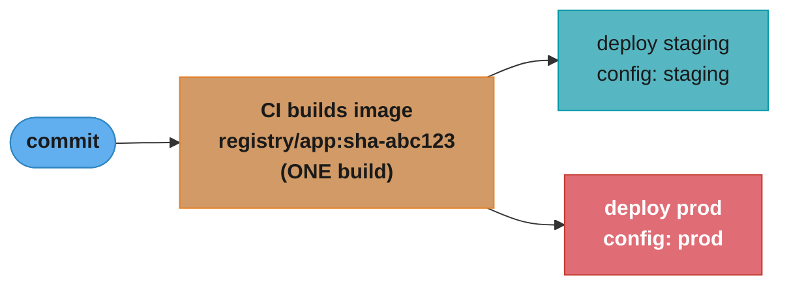
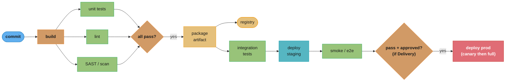
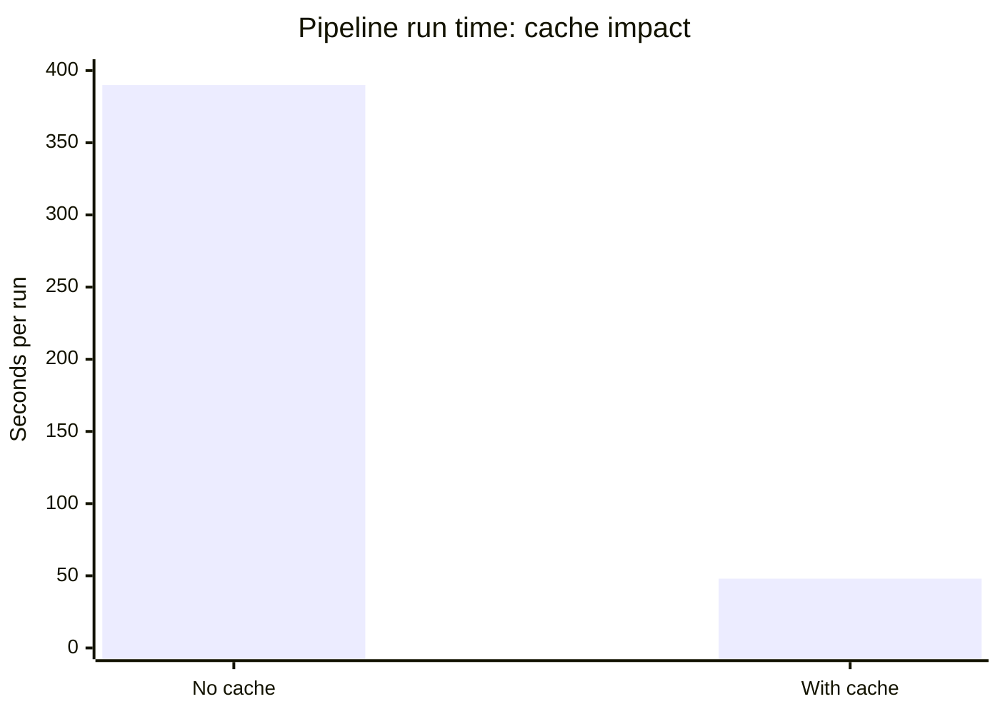
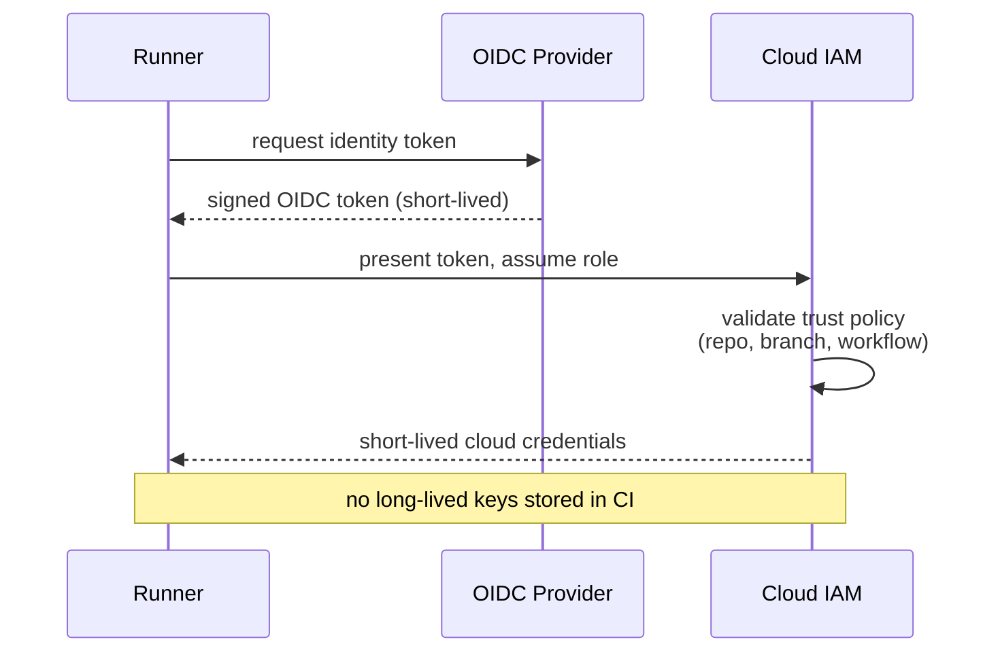
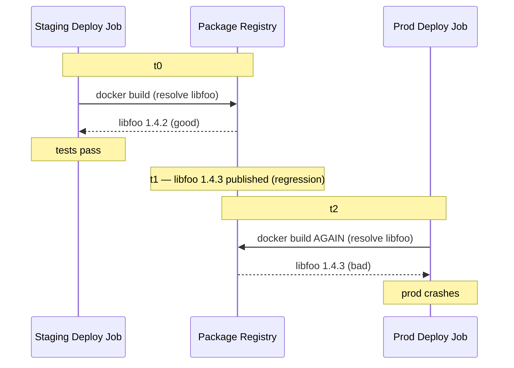

# CI/CD Fundamentals

> Phase 3 — CI/CD & GitOps · Difficulty: Intermediate

CI/CD is the automated path from a code commit to running software. **Continuous Integration** merges and verifies every change frequently (build + test on each commit); **Continuous Delivery/Deployment** automates the release of verified changes to production. Done well, it turns deployment from a risky quarterly event into a boring, many-times-a-day non-event — the single biggest lever on engineering velocity and reliability.

---

## 1. Concept Overview

The pipeline is a sequence of stages a commit must pass to reach production:

```mermaid
flowchart LR
    classDef io      fill:#61afef,stroke:#2e86c1,color:#1a1a1a,font-weight:bold
    classDef frozen  fill:#c678dd,stroke:#9b59b6,color:#fff
    classDef train   fill:#98c379,stroke:#27ae60,color:#1a1a1a
    classDef mathOp  fill:#d19a66,stroke:#e67e22,color:#1a1a1a,font-weight:bold
    classDef lossN   fill:#e06c75,stroke:#c0392b,color:#fff,font-weight:bold
    classDef req     fill:#56b6c2,stroke:#0097a7,color:#1a1a1a
    classDef base    fill:#e5c07b,stroke:#f39c12,color:#1a1a1a

    commit([commit]) --> build["build"]
    build --> unit["unit test"]
    unit --> scan["scan / lint"]
    scan --> pkg["package<br/>artifact"]
    pkg --> integ["integration<br/>test"]
    integ --> stage["deploy<br/>staging"]
    stage --> prod["deploy<br/>prod"]

    class commit io
    class build mathOp
    class unit,scan,integ train
    class pkg base
    class stage req
    class prod lossN
```



*Any stage can stop the line; only a commit that clears every gate reaches production.*

Definitions that interviews probe:
- **Continuous Integration (CI)** — every commit is automatically built and tested, integrated into the mainline frequently (catches breakage early).
- **Continuous Delivery** — every passing change is *deployable* to production at the push of a button (a human approves the release).
- **Continuous Deployment** — every passing change is *automatically* deployed to production (no human gate).

Key mechanics: **artifacts** (the built, versioned, immutable output — e.g., a container image — promoted unchanged through environments), **caching** (reuse dependencies/layers to speed builds), **parallelism** (run independent jobs concurrently), and **ephemeral runners** (clean, isolated execution environments per job).

**The golden rule: build once, promote the same artifact.** You build the artifact a single time and deploy that exact, immutable artifact to staging then prod — never rebuild per environment.

---

## 2. Intuition

> **One-line analogy**: CI/CD is a factory assembly line with quality gates. Raw material (a commit) moves through stations (build, test, scan); any station can stop the line (fail the pipeline); a part that passes every gate is the *same* part shipped to the customer — you don't re-manufacture it at the loading dock.

**Mental model**: Think of the pipeline as a function from commit → (verified artifact → environments). The artifact is produced once and is immutable; environments differ only in *configuration*, not in the binary. Each stage is a gate that either passes the change forward or stops it with clear feedback. Speed (cache, parallelism) and isolation (ephemeral runners) determine whether the loop is tight enough that developers trust and use it.

**Why it matters**: Deployment frequency and lead time for changes are the DORA metrics that correlate with high-performing teams. Slow, flaky, or manual pipelines push teams toward big-bang releases — which are riskier and harder to debug. A fast, reliable pipeline makes small, frequent, low-risk deploys the path of least resistance.

**Key insight**: "Build once, promote the same artifact" is the principle that prevents an entire class of "works in staging, breaks in prod" bugs. If you rebuild per environment, the prod artifact was never the thing you tested. Inject environment differences as *configuration at deploy time*, not by recompiling.

---

## 3. Core Principles

1. **Integrate frequently, fail fast.** Every commit builds and tests; breakage surfaces in minutes, not weeks.
2. **Build once, promote the artifact.** Immutable, versioned artifact deployed unchanged across environments.
3. **Pipeline as code.** The pipeline lives in the repo, versioned and reviewed like any code.
4. **Fast feedback.** Cache and parallelize so developers get results quickly; slow pipelines get bypassed.
5. **Ephemeral, reproducible runners.** Clean isolated environment per job; no state bleed between builds.
6. **Shift left.** Run cheap, fast checks (lint, unit, scan) early; expensive checks (integration, e2e) later.

---

## 4. Types / Architectures / Strategies

### CI vs CD vs CD

| Term | Automated up to | Human gate before prod? |
|------|-----------------|-------------------------|
| Continuous Integration | Build + test on every commit | N/A (no deploy) |
| Continuous Delivery | Deployable artifact, deploy to staging | Yes — a button to release to prod |
| Continuous Deployment | Auto-deploy to prod | No — fully automated |

### Pipeline stages (typical)

| Stage | Purpose | Speed |
|-------|---------|-------|
| Build/compile | Produce binaries | Fast-ish |
| Unit tests | Verify logic | Fast (run first) |
| Lint / static analysis / SAST | Style, bugs, security | Fast |
| Package artifact | Build + tag image, push to registry | Medium |
| Integration / contract tests | Cross-component verification | Medium |
| Deploy staging + smoke/e2e | Real-environment verification | Slow |
| Deploy prod (progressive) | Release (canary/blue-green) | Gated |

### Runner models

| Model | Notes |
|-------|-------|
| Ephemeral (container/VM per job) | Clean state, reproducible, scalable (the standard) |
| Static/self-hosted | Persistent; risk of state bleed; for special hardware |
| Managed (GitHub/GitLab cloud) | No infra to run; cost per minute |

---

## 5. Architecture Diagrams

**Build once, promote the same artifact:**



*The image is built exactly once and promoted unchanged to every environment — only the deploy-time configuration differs; the binary itself (the digest) is identical in staging and prod.*

**Pipeline with gates and parallelism:**



*Unit tests, lint, and SAST/scan run in parallel so wall-clock time is bounded by the slowest check, not their sum; the final canary-then-full prod rollout waits behind a pass-plus-approval gate under Continuous Delivery.*

---

## 6. How It Works — Detailed Mechanics

### A pipeline as code (GitHub Actions shape; concepts apply to any platform)

```yaml
name: ci-cd
on: {push: {branches: [main]}, pull_request: {}}
jobs:
  test:
    runs-on: ubuntu-latest          # ephemeral runner: fresh VM per job
    steps:
      - uses: actions/checkout@v4
      - uses: actions/setup-node@v4
        with: {node-version: 20, cache: npm}    # dependency cache -> faster installs
      - run: |
          set -euo pipefail          # fail fast (see shell module)
          npm ci
          npm run lint
          npm test                   # unit tests run early/fast
  build:
    needs: test                      # gate: only build if tests pass
    runs-on: ubuntu-latest
    steps:
      - uses: actions/checkout@v4
      - uses: docker/build-push-action@v6
        with:
          push: true
          tags: registry/app:${{ github.sha }}   # tag by commit SHA -> traceable, immutable
          cache-from: type=gha                    # reuse layer cache across runs
          cache-to: type=gha,mode=max
  deploy-staging:
    needs: build
    runs-on: ubuntu-latest
    steps:
      - run: deploy.sh staging registry/app:${{ github.sha }}   # promote THIS artifact
  deploy-prod:
    needs: deploy-staging
    environment: production          # requires approval (Continuous Delivery gate)
    runs-on: ubuntu-latest
    steps:
      - run: deploy.sh prod registry/app:${{ github.sha }}      # SAME artifact, prod config
```

### Caching (the biggest speed lever)



*Caching turns a 6.5-minute run (90s npm ci + 5min docker build) into about 50 seconds (8s + 40s) — roughly an 8x speedup, the single biggest lever on pipeline wall-clock time.*
Cache dependency directories and build layers keyed by lockfile/Dockerfile hashes; invalidate when inputs change.

```
speedup       = uncached wall-clock / cached wall-clock
saved per run = uncached - cached
```

**Put simply.** "A cache does not shave a percentage off every step — it deletes whole steps, so the speedup is set by how much of the run was cacheable work in the first place."

That is why caching is the single biggest lever here and not merely one optimization among several: the dependency install and the image build were essentially *all* of the runtime, so removing them collapses the run rather than trimming it.

| Symbol | What it is |
|--------|------------|
| `uncached wall-clock` | Cold run: every dependency downloaded, every layer rebuilt |
| `cached wall-clock` | Warm run: cache restored, only genuinely-changed work re-executed |
| `speedup` | Ratio of the two — the "8x" figure, not a subtraction |
| `saved per run` | Absolute seconds returned to every developer waiting on the PR |

**Walk one example.** The two bars in the chart above, step by step:

```
                       npm ci    docker build    total
  no cache               90s        300s          390s   (6.5 min)
  with cache              8s         40s           48s   (about 50s)

  speedup       = 390 / 48  = 8.125x
  saved per run = 390 - 48  = 342s
  over 100 runs = 342 x 100 = 34,200s = 9.5 engineer-hours per day
```

The 8x is a ratio, so it is unaffected by which step dominates; the 342s is what a developer actually feels per push. Multiply it by daily pipeline volume and the cache stops looking like a nicety — at 100 runs a day it is 9.5 hours of returned waiting, which is exactly the difference between the sub-10-minute PR feedback the Best Practices call for and the 40-minute pipeline Pitfall 3 warns gets bypassed.

### Parallelism and the dependency graph

```yaml
# Independent jobs run concurrently; `needs:` expresses ordering.
# test + lint + scan in parallel -> the slowest determines wall-clock, not the sum.
```

### Secrets in pipelines

```yaml
# Never echo secrets; use the platform's secret store + OIDC to the cloud (no static keys).
- uses: aws-actions/configure-aws-credentials@v4
  with: {role-to-assume: arn:aws:iam::...:role/ci-deploy, aws-region: us-east-1}
  # OIDC: the runner exchanges a short-lived token for the role -> no long-lived AWS keys in CI.
```

**How OIDC federation replaces static keys:**



*The runner never holds a static cloud key — it trades a short-lived, workflow-scoped identity token for temporary credentials on every run, eliminating the most commonly leaked secret class.*

---

## 7. Real-World Examples

- **DORA / "Accelerate" research**: elite performers deploy on-demand (many times/day) with lead times under an hour and change-failure rates under 15% — enabled by fast, automated pipelines.
- **Monorepo affected-target CI** (Google/Meta with Bazel; Nx/Turborepo): only build/test the projects a commit actually affects, keeping CI fast at huge scale (see [version_control_and_git_workflows](../version_control_and_git_workflows/)).
- **OIDC to cloud** (GitHub Actions → AWS/GCP): replaced long-lived CI cloud keys with short-lived federated tokens, eliminating the most-leaked secret class.
- **Build once, promote**: shipping the identical container digest from CI through staging to prod is the standard at virtually every container-native org.

---

## 8. Tradeoffs

| Decision | Option A | Option B | Key factor |
|----------|----------|----------|-----------|
| Release model | Continuous Delivery (human gate) | Continuous Deployment (auto) | Risk tolerance, test confidence |
| Runners | Managed (no infra) | Self-hosted (control/cost/HW) | Scale, special hardware, cost |
| Artifact | Build once, promote | Rebuild per env | Always build once |
| Test depth in PR | Full e2e (safe, slow) | Unit+contract (fast) | Feedback speed vs coverage |
| Mono- vs multi-pipeline | One big pipeline | Per-service pipelines | Coupling, repo layout |
| Cache | Aggressive (fast) | Minimal (simple, fresh) | Speed vs cache-correctness risk |

---

## 9. When to Use / When NOT to Use

**Invest in CI/CD when:** any team shipping software regularly — it's table stakes. Deeper automation (progressive delivery, full CD) pays off as deploy frequency and team size grow.

**Right-size when:** a tiny project may need only build+test+manual deploy. Don't add full Continuous Deployment before you have the test coverage and observability to trust it — auto-shipping unverified changes is worse than a manual gate. Don't build elaborate pipelines that are slower than the work they automate.

---

## 10. Common Pitfalls

**Pitfall 1 — Rebuilding the artifact per environment.**

```yaml
# BROKEN: build in staging deploy, build AGAIN in prod deploy -> prod runs a DIFFERENT binary
# than the one tested in staging. "Worked in staging" means nothing.
deploy-staging: {steps: [{run: docker build -t app:staging . && deploy staging app:staging}]}
deploy-prod:    {steps: [{run: docker build -t app:prod . && deploy prod app:prod}]}   # rebuilt!
```

```yaml
# FIX: build once, tag by SHA, promote the SAME digest; environments differ only in config.
build:       {steps: [{run: docker build -t registry/app:${SHA} . && docker push registry/app:${SHA}}]}
deploy-staging: {needs: build, steps: [{run: deploy staging registry/app:${SHA}}]}
deploy-prod:    {needs: deploy-staging, steps: [{run: deploy prod registry/app:${SHA}}]}  # same artifact
```

**Pitfall 2 — Flaky tests eroding trust.** Tests that fail randomly (timing, shared state, network) train developers to "just re-run it," which masks real failures and lets bugs through. FIX: quarantine flaky tests, make them deterministic (no real sleeps/network, isolated state), and track flakiness as a first-class defect (see [`../../backend/backend_testing_strategies`](../../backend/backend_testing_strategies/)).

**Pitfall 3 — Slow pipelines that get bypassed.** A 40-minute pipeline pushes developers to batch changes and skip CI locally. FIX: cache aggressively, parallelize, run only affected tests, and put fast checks first — keep PR feedback under ~10 minutes.

---

## 11. Technologies & Tools

| Tool | Purpose |
|------|---------|
| GitHub Actions / GitLab CI / Jenkins | Pipeline orchestration (see [ci_cd_platforms](../ci_cd_platforms/)) |
| Argo Workflows / Tekton | Kubernetes-native pipelines |
| Docker buildx / Kaniko | Image builds (with cache) |
| Artifact registries (ECR, GAR, Artifactory) | Store/promote artifacts (see [artifact_and_registry_management](../artifact_and_registry_management/)) |
| Trivy / SonarQube / Semgrep | Scanning, SAST, quality gates |
| OIDC (cloud federation) | Keyless cloud auth from CI |
| Nx / Turborepo / Bazel | Affected-target builds (monorepos) |
| k6 / Gatling | Load testing in pipeline (see [`../../backend/load_and_performance_testing`](../../backend/load_and_performance_testing/)) |

---

## 12. Interview Questions with Answers

**Q1: Define CI, Continuous Delivery, and Continuous Deployment.**
CI automatically builds and tests every commit and integrates changes frequently, catching breakage early. Continuous Delivery extends this so every passing change is *deployable* to production on demand — a human presses the button. Continuous Deployment removes that human gate: every change passing the pipeline is *automatically* released to production. The progression is about how far automation extends and whether a human approves the prod release.

**Q2: Why "build once, promote the same artifact"?**
Because rebuilding per environment means prod runs a different binary than the one tested in staging, reintroducing the "works in staging, breaks in prod" class of bugs. You build the artifact once, version it (by commit SHA/digest), and deploy that exact immutable artifact through environments, injecting differences as *configuration at deploy time*. What you tested is precisely what ships.

**Q3: What makes a pipeline fast, and why does speed matter?**
Caching (reuse dependencies and build layers), parallelism (run independent jobs concurrently so wall-clock = slowest job, not the sum), running only affected tests, and ordering fast cheap checks first. Speed matters because slow pipelines erode trust: developers batch changes, skip checks, and lose the tight feedback loop that makes small, safe, frequent deploys possible — the behavior that correlates with high-performing teams.

**Q4: What are ephemeral runners and why prefer them?**
Ephemeral runners are fresh, isolated execution environments (container/VM) created per job and destroyed after. They guarantee reproducibility (no leftover state from a previous build), prevent cross-job contamination and secret leakage, and scale horizontally. Persistent/static runners risk "works because of leftover state" bugs and are a security/cleanliness liability — used only for special hardware needs.

**Q5: How should secrets be handled in CI/CD?**
Store them in the platform's encrypted secret store (never in the repo or logs), mask them in output, and scope them to the minimum jobs. Best practice for cloud access is OIDC federation: the runner exchanges a short-lived identity token for a cloud role, so no long-lived cloud keys live in CI at all — eliminating the most commonly leaked secret. Rotate any secret that must be static.

**Q6: What is "shift left" and give examples?**
Shift left means running checks as early (and cheaply) as possible in the lifecycle. Examples: linting and unit tests on every commit/PR, SAST and dependency scanning in CI before merge, and infrastructure policy checks before apply. Catching a bug or vulnerability at PR time is far cheaper than in production, and early fast checks give developers immediate feedback.

**Q7: How do flaky tests damage a pipeline, and how do you handle them?**
Flaky tests (random pass/fail) train developers to reflexively re-run, which masks genuine failures and lets real bugs through, destroying trust in the suite. Handle them by quarantining flaky tests out of the gating path, fixing the root cause (timing, shared mutable state, real network/sleep), and tracking flakiness as a defect with metrics — not by adding retries that hide the problem.

**Q8: What's the difference between Continuous Delivery and Continuous Deployment, and when choose each?**
Both fully automate up to production-readiness; the difference is the final gate. Continuous Delivery keeps a human approval before prod (appropriate when test confidence/observability isn't yet sufficient, or compliance requires sign-off). Continuous Deployment auto-ships every passing change (appropriate when you have strong automated tests, progressive delivery, and fast rollback). Many teams start with Delivery and graduate to Deployment as confidence grows.

**Q9: How do you keep CI fast in a large monorepo?**
Use affected-target detection (Bazel, Nx, Turborepo) to build and test only the projects a commit actually touches, rather than the whole repo. Combine with remote build caching (reuse outputs across runs/developers) and parallelism. Without this, monorepo CI time grows with the repo, not the change — the classic monorepo scaling failure.

**Q10: What artifact should move through the pipeline, and how is it identified?**
An immutable, versioned artifact — typically a container image — built once and identified by content (the image digest) or commit SHA, not a mutable tag like `latest`. This gives full traceability (which commit is in prod), reproducibility (the digest is exact bits), and supply-chain integrity (you can sign/scan that specific artifact and gate on it — see [devsecops_and_supply_chain_security](../devsecops_and_supply_chain_security/)).

**Q11: What are the DORA metrics and how do they relate to CI/CD?**
The four DORA metrics are deployment frequency, lead time for changes, change failure rate, and time to restore service. High performers score well on all four, and a fast, reliable, automated CI/CD pipeline is the primary enabler: it shortens lead time, raises deployment frequency, and (with good tests + fast rollback) lowers change failure rate and restore time. They're the standard way to measure delivery performance.

**Q12: How does CI/CD relate to GitOps?**
CI produces and verifies the artifact (build, test, scan, push image). CD can be push-based (the pipeline runs `kubectl apply`) or pull-based GitOps (CI updates a manifests repo, and an in-cluster agent like ArgoCD reconciles). GitOps separates "build/verify" (CI) from "deploy" (Git-driven reconciliation), giving auditability and drift detection (see [gitops_argocd_flux](../gitops_argocd_flux/)). CI/CD fundamentals underpin both models.

**Q13: Should a pull request pipeline run the full end-to-end test suite before merge?**
Usually not — PRs should run fast unit and contract tests to keep feedback under about 10 minutes, saving full end-to-end coverage for the later staging stage. Full e2e and integration suites are slower and more expensive, so they run against the deployed staging environment rather than gating every commit. The tradeoffs table frames this exact choice as full e2e (safe, slow) versus unit+contract (fast) — you're trading feedback speed for coverage at the PR stage. Running everything on every PR is what turns a fast pipeline into the 40-minute pipeline that Pitfall 3 warns gets bypassed. Reserve full e2e for the staging/pre-prod gate and keep the PR gate limited to fast, deterministic checks.

**Q14: How should build caches be keyed, and what breaks if you get it wrong?**
Cache dependency directories and build layers by hashing the lockfile or Dockerfile, so the cache invalidates only when those inputs actually change. This is the mechanism behind the module's roughly 8x cache speedup — a 6.5-minute run collapsing to about 50 seconds — where `cache-from`/`cache-to` keyed on `type=gha` reuses layers whenever the Dockerfile and its context are unchanged. Key the cache too loosely (say, ignoring the lockfile) and a dependency bump silently reuses a stale cached install, exactly the drift "build once, promote the same artifact" is meant to prevent. Key it too tightly and you lose the speedup entirely because every run counts as a cache miss. Hash the actual inputs that determine build output so cache correctness and cache speed move together instead of trading off.

**Q15: When would you choose self-hosted runners over a managed CI runner fleet?**
Choose self-hosted runners for special hardware (GPUs, ARM) or tighter cost/environment control; managed runners trade that control for zero infrastructure upkeep billed per minute. The runner-models table frames ephemeral container/VM-per-job as the reproducible standard regardless of who hosts it, static self-hosted runners as existing mainly for special hardware needs, and managed cloud runners (GitHub/GitLab) as removing infrastructure ownership entirely. Self-hosted runners should still be ephemeral — spin up a fresh container per job on your own hardware rather than reusing one long-lived box. At high build volume, self-hosted can undercut per-minute managed pricing, but you take on patching, scaling, and runner security yourself. Default to managed runners unless a concrete hardware or cost driver forces you to operate your own fleet.

**Q16: In a multi-service repo, would you run one big pipeline or a separate pipeline per service?**
It depends on coupling: tightly coupled services in a monorepo often share one pipeline, while independently deployable services are better served by per-service pipelines. The tradeoffs table lists this exactly as mono- versus multi-pipeline, with the deciding factor being coupling and repo layout rather than a universal rule. A single pipeline is simpler to reason about but means one team's unrelated change can block or slow another team's deploy if the whole repo builds together. Per-service pipelines isolate blast radius and let each service deploy independently, pairing naturally with the monorepo affected-target tooling (Bazel/Nx/Turborepo) that only builds what a commit actually touches. Pick per-service pipelines once services deploy independently in production, and keep one pipeline only while the codebase truly ships as a single unit.

---

## 13. Best Practices

- **Build once, promote the same artifact**; inject env differences as config at deploy time.
- Keep PR feedback **fast (<~10 min)**: cache, parallelize, run affected tests, fast checks first.
- **Pipeline as code** in the repo; reviewed and versioned like application code.
- Use **ephemeral runners**; **OIDC** for keyless cloud auth; never log secrets.
- **Shift left**: lint/unit/SAST/dependency-scan early; integration/e2e later.
- Treat **flaky tests as defects**; quarantine and fix, don't paper over with retries.
- Tag artifacts by **commit SHA/digest**; sign and scan them (supply chain).
- Track **DORA metrics**; graduate from Delivery to Deployment as test/observability confidence grows.

---

## 14. Case Study

### Scenario: "It passed staging" — a prod outage from a rebuilt artifact

A team's pipeline builds the image separately in the staging-deploy and prod-deploy jobs. A change merges, passes all tests against the staging-built image, and is promoted. Minutes later prod crashes: a transitive dependency published a new patch version *between* the two builds, and the prod-built image pulled the broken version. Staging was fine; prod was a different binary.

**BROKEN: two builds, two binaries**



*The artifact tested != the artifact shipped.*

```yaml
# FIX: single build, immutable digest, promoted unchanged; deps locked.
build:
  steps:
    - run: |
        docker build -t registry/app:${{ github.sha }} .
        docker push registry/app:${{ github.sha }}
        # capture the immutable digest for promotion
        echo "DIGEST=$(docker inspect --format='{{index .RepoDigests 0}}' registry/app:${{ github.sha }})" >> $GITHUB_ENV
deploy-staging:
  needs: build
  steps: [{run: "deploy.sh staging ${{ env.DIGEST }}"}]      # exact digest
deploy-prod:
  needs: deploy-staging
  environment: production                                    # human approval (Delivery)
  steps: [{run: "deploy.sh prod ${{ env.DIGEST }}"}]         # SAME digest tested in staging
# Plus: lockfiles committed (package-lock.json) so dependency versions are pinned and reproducible.
```

**Outcome:** prod now runs the byte-identical image validated in staging; the "different binary in prod" failure class is eliminated. The team also pinned dependencies via committed lockfiles so even the *build* is reproducible, and added image scanning on the single artifact so a known-bad dependency would block promotion rather than surface in prod.

**Discussion questions:**
1. Why is "passed staging" meaningless when the prod artifact is rebuilt?
2. How do committed lockfiles and "build once" together guarantee reproducibility from commit to prod?
3. Where would image signing + an admission gate (see [devsecops_and_supply_chain_security](../devsecops_and_supply_chain_security/)) add another layer of "only this exact, scanned artifact runs in prod"?

---

**Cross-references:** [ci_cd_platforms](../ci_cd_platforms/) (GitHub Actions/GitLab/Jenkins/Tekton), [deployment_strategies](../deployment_strategies/) (canary/blue-green for the prod stage), [gitops_argocd_flux](../gitops_argocd_flux/) (pull-based CD), [artifact_and_registry_management](../artifact_and_registry_management/) (artifact storage/promotion), [version_control_and_git_workflows](../version_control_and_git_workflows/) (commit → pipeline trigger), [devsecops_and_supply_chain_security](../devsecops_and_supply_chain_security/) (scan/sign in the pipeline).
