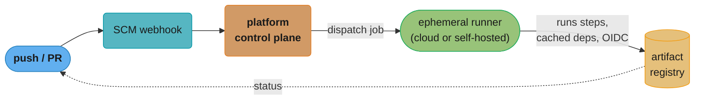
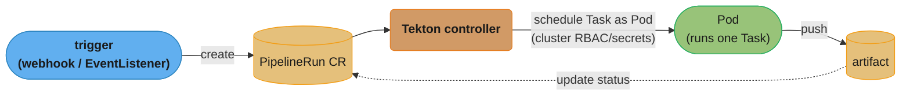
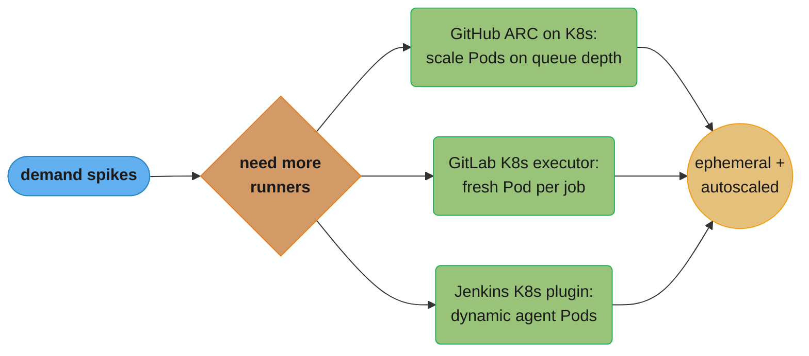
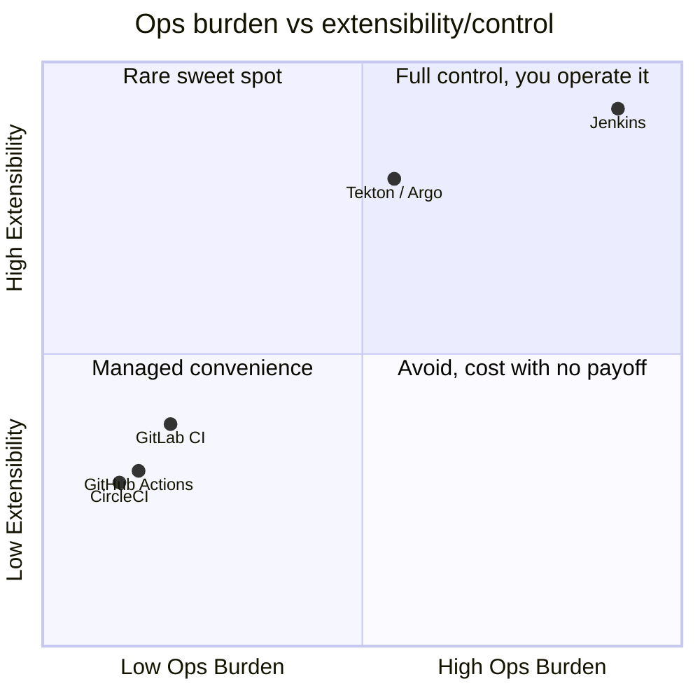
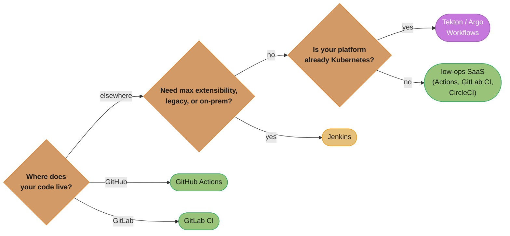
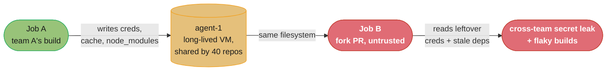

# CI/CD Platforms

> Phase 3 — CI/CD & GitOps · Difficulty: Intermediate

Knowing CI/CD *principles* (see [ci_cd_fundamentals](../ci_cd_fundamentals/)) is necessary but not sufficient — you must also know the *platforms* that implement them and how to choose between them. GitHub Actions, GitLab CI, Jenkins, and Kubernetes-native engines (Tekton, Argo Workflows) make very different tradeoffs around hosting, configuration model, ecosystem, and where they run. This module compares them and covers the cross-cutting concerns (runners, secrets, reusability) that apply to all.

---

## 1. Concept Overview

A CI/CD platform provides: a way to **define pipelines** (YAML/Groovy/DSL), **runners/agents** that execute jobs, **triggers** (push, PR, schedule, manual, webhook), **secret management**, an **artifact/cache store**, and an **extension ecosystem** (actions/plugins/tasks).

The major families:
- **SCM-integrated SaaS** — GitHub Actions, GitLab CI. Pipeline lives next to code; tight VCS integration; managed runners (plus self-hosted option).
- **Standalone server** — Jenkins. Self-hosted, infinitely extensible via plugins, language-agnostic; you operate it.
- **Kubernetes-native** — Tekton, Argo Workflows. Pipelines are Kubernetes CRDs; each step is a Pod; ideal when your platform *is* Kubernetes.
- **Other SaaS** — CircleCI, Buildkite, Drone, etc.

The choice hinges on: where your code lives, whether you want to operate the system, how much extensibility/customization you need, and whether you want pipelines running as first-class Kubernetes workloads.

---

## 2. Intuition

> **One-line analogy**: CI/CD platforms are like kitchens. GitHub Actions/GitLab CI are a fully-equipped rental kitchen attached to your apartment (code) — convenient, stocked, you just cook. Jenkins is a warehouse where you build and wire every appliance yourself — ultimate flexibility, but you maintain the plumbing. Tekton/Argo is a kitchen *inside your existing restaurant* (Kubernetes) — same staff, tools, and supply chain as everything else you run.

**Mental model**: Every platform reduces to "events trigger jobs that run on runners and produce artifacts," but they differ in *who operates the runners and control plane*, *how pipelines are expressed*, and *how much you assemble yourself*. SaaS platforms trade flexibility/control for zero-ops convenience; Jenkins trades convenience for unlimited extensibility; Kubernetes-native trades simplicity for unifying CI/CD with your existing cluster ops.

**Why it matters**: The platform shapes your entire delivery workflow — config model, secret handling, runner scaling, and cost. Picking the wrong one (e.g., heavyweight Jenkins for a small GitHub-hosted team, or self-managed runners you can't keep patched) creates ongoing toil. The platform is also a security boundary: it holds deploy credentials and runs arbitrary code.

**Key insight**: For most teams the dominant factor is **where your code already lives and whether you want to run infrastructure**. GitHub repo + don't-want-ops → GitHub Actions. GitLab → GitLab CI. Heavy customization/legacy/on-prem → Jenkins. Platform *is* Kubernetes and you want pipelines as cluster workloads → Tekton/Argo. Don't over-think it past those axes.

---

## 3. Core Principles

1. **Pipeline as code, in the repo.** Versioned, reviewed config — true of all modern platforms.
2. **Match the platform to your SCM and ops appetite.** SaaS for low-ops; Jenkins for control; K8s-native for cluster-centric.
3. **Ephemeral runners by default.** Clean isolation per job (see [ci_cd_fundamentals](../ci_cd_fundamentals/)).
4. **Reuse, don't repeat.** Reusable workflows / shared libraries / templates avoid copy-paste pipelines.
5. **Secrets via the platform store + OIDC.** No long-lived cloud keys; least-privilege deploy creds.
6. **The platform is a high-value attack target.** It holds deploy credentials and runs your code — secure it.

---

## 4. Types / Architectures / Strategies

### Platform comparison

| Platform | Hosting | Config | Runners | Best for |
|----------|---------|--------|---------|----------|
| GitHub Actions | SaaS (+ self-hosted runners) | YAML in `.github/workflows` | GitHub-hosted or self | GitHub repos, marketplace ecosystem |
| GitLab CI | SaaS or self-hosted | `.gitlab-ci.yml` | Shared or self-managed | GitLab repos, all-in-one DevOps |
| Jenkins | Self-hosted | Groovy `Jenkinsfile` | Static/dynamic agents | Max extensibility, legacy/on-prem, any language |
| Tekton | In Kubernetes | CRDs (Task/Pipeline) | Pods | K8s-native, reusable Tasks |
| Argo Workflows | In Kubernetes | CRD (Workflow DAG) | Pods | Complex DAGs, ML/data pipelines on K8s |
| CircleCI | SaaS | `config.yml` | Cloud/self | Fast SaaS, orbs ecosystem |

### Reusability mechanisms

| Platform | Reuse unit |
|----------|-----------|
| GitHub Actions | Reusable workflows, composite actions, marketplace actions |
| GitLab CI | `include:`, `extends:`, templates |
| Jenkins | Shared libraries, plugins |
| Tekton | Reusable `Task`s (Artifact Hub) |

---

## 5. Architecture Diagrams

**SaaS-integrated pipeline (GitHub Actions / GitLab CI):**



The push/PR triggers a webhook, the control plane dispatches an ephemeral runner, and status flows back to the PR (dotted) while artifacts land in the registry.

**Kubernetes-native pipeline (Tekton / Argo Workflows):**



Each Task runs as a Pod scheduled by the controller, sharing the cluster's RBAC, secrets, and scaling — status writes back onto the same PipelineRun CR.

---

## 6. How It Works — Detailed Mechanics

### GitHub Actions: reusable workflow (DRY across repos)

```yaml
# .github/workflows/reusable-build.yml  (called by many repos)
on: {workflow_call: {inputs: {image: {required: true, type: string}}}}
jobs:
  build:
    runs-on: ubuntu-latest
    permissions: {id-token: write, contents: read}   # OIDC for keyless cloud auth
    steps:
      - uses: actions/checkout@v4
      - uses: docker/build-push-action@v6
        with: {push: true, tags: "${{ inputs.image }}:${{ github.sha }}", cache-from: type=gha, cache-to: "type=gha,mode=max"}
---
# caller repo workflow:
jobs:
  ci: {uses: org/.github/.github/workflows/reusable-build.yml@v1, with: {image: registry/app}}
```

### GitLab CI: templates + DAG

```yaml
# .gitlab-ci.yml
include: {project: org/ci-templates, file: build.yml}    # shared template
stages: [test, build, deploy]
test:  {stage: test, script: ["npm ci", "npm test"], cache: {paths: [node_modules/]}}
build: {stage: build, needs: [test], script: ["docker build -t $IMG:$CI_COMMIT_SHA ."]}   # needs = DAG, not just stage order
deploy:{stage: deploy, needs: [build], environment: production, when: manual, script: ["deploy.sh $IMG:$CI_COMMIT_SHA"]}
```

### Jenkins: declarative pipeline + shared library

```groovy
// Jenkinsfile
@Library('org-shared') _      // reusable steps from a shared library
pipeline {
  agent { kubernetes { yaml podTemplate() } }   // dynamic K8s agent per build
  stages {
    stage('Test')  { steps { sh 'npm ci && npm test' } }
    stage('Build') { steps { buildAndPush(image: 'registry/app', tag: env.GIT_COMMIT) } } // shared-lib step
    stage('Deploy'){ when { branch 'main' }; steps { input 'Deploy to prod?'; sh 'deploy.sh' } }
  }
  post { failure { notifySlack() } }
}
```

### Tekton: pipelines as Kubernetes CRDs

```yaml
apiVersion: tekton.dev/v1
kind: Pipeline
metadata: {name: build-deploy}
spec:
  tasks:
    - name: test  ; taskRef: {name: npm-test}        # reusable Task
    - name: build ; runAfter: [test] ; taskRef: {name: kaniko-build}   # in-cluster image build
    - name: deploy; runAfter: [build]; taskRef: {name: kubectl-apply}
# A PipelineRun executes this; each Task runs as a Pod with cluster RBAC/secrets.
```

### Self-hosted runner autoscaling (the ops concern)



Demand spikes fan out to each platform's own autoscaling mechanism, but all three converge on the same principle: ephemeral, queue-driven runners so idle cost and cross-job state never accumulate.

---

## 7. Real-World Examples

- **GitHub Actions + ARC (Actions Runner Controller)**: orgs run autoscaling ephemeral self-hosted runners as Kubernetes Pods — combining Actions' ecosystem with their own compute and network access to private resources.
- **GitLab all-in-one**: teams use GitLab for SCM + CI + registry + security scanning in one platform, with the Kubernetes executor spawning a fresh Pod per job.
- **Jenkins in the enterprise**: long-standing on-prem/regulated environments rely on Jenkins' plugin ecosystem and language-agnostic agents — at the cost of operating (and securing/patching) the server.
- **Tekton/Argo for platform teams**: organizations building internal delivery platforms express pipelines as CRDs so CI/CD shares the cluster's RBAC, secrets, autoscaling, and observability with everything else they run (see [platform_engineering_and_idp](../platform_engineering_and_idp/)).

---

## 8. Tradeoffs

| Decision | Option A | Option B | Key factor |
|----------|----------|----------|-----------|
| Hosting | SaaS (no ops) | Self-hosted (control, private access) | Ops appetite, network/compliance |
| Config model | YAML (simple, declarative) | Groovy/code (Jenkins, flexible) | Simplicity vs programmability |
| Where it runs | External runners | Kubernetes-native (Tekton/Argo) | Cluster integration |
| Extensibility | Marketplace/orbs (curated) | Jenkins plugins (vast, variable quality) | Need vs maintenance/security |
| Lock-in | Tied to SCM (Actions/GitLab) | Portable (Jenkins/Tekton) | Flexibility vs convenience |
| Runner scaling | Managed autoscale | Self-managed (ARC/K8s) | Cost vs control |

**Where each platform sits on the ops-vs-control tradeoff:**



SaaS platforms cluster in the low-ops/low-extensibility corner (managed convenience); Jenkins sits at maximum ops burden and maximum extensibility; Tekton/Argo reaches high control without a separate control plane to operate, provided a Kubernetes platform already exists.

---

## 9. When to Use / When NOT to Use

**GitHub Actions / GitLab CI**: your code is on GitHub/GitLab and you want low-ops, fast setup, strong VCS integration. **Jenkins**: you need maximum extensibility, run on-prem/regulated, support many languages/legacy, or already have deep Jenkins investment. **Tekton/Argo Workflows**: your platform is Kubernetes and you want pipelines as cluster-native workloads with shared RBAC/observability.

**Choosing a platform:**



This collapses §1's "the choice hinges on" heuristic and Q1's answer into one path: SCM first, then ops appetite, then whether the platform is already Kubernetes.

**Avoid:** running Jenkins for a small GitHub team that just needs build+test+deploy (operational overhead with no payoff); adopting Kubernetes-native CI before you have a Kubernetes platform; or piling on unvetted Jenkins plugins (security and maintenance debt).

---

## 10. Common Pitfalls

**Pitfall 1 — Self-hosted runners that persist state (and bleed secrets).**

```yaml
# BROKEN: a long-lived self-hosted runner reused across jobs accumulates files, caches,
# and credentials; one repo's job can read artifacts/secrets left by another -> breach + flaky builds.
runs-on: self-hosted        # static, persistent VM shared across many repos/jobs
```

```yaml
# FIX: ephemeral runners (one job per runner, then destroyed), e.g., ARC on Kubernetes.
runs-on: [self-hosted, ephemeral]    # ARC provisions a fresh Pod per job, deletes after
# Each job gets a clean filesystem; no cross-job secret/state leakage.
```

**Pitfall 2 — Copy-pasted pipelines across dozens of repos.** A change to the build process means editing N repos, and they drift. FIX: reusable workflows (Actions), `include`/`extends` (GitLab), or shared libraries (Jenkins) — define once, reference everywhere (see the DRY mechanisms in §4).

**Pitfall 3 — Over-broad CI credentials / unpatched Jenkins.** CI holds deploy credentials and runs arbitrary code; a compromised pipeline or vulnerable Jenkins plugin is a direct path to production. FIX: OIDC + least-privilege deploy roles (no static admin keys), pin and review third-party actions/plugins, patch the control plane, and isolate runners (see [devsecops_and_supply_chain_security](../devsecops_and_supply_chain_security/)).

---

## 11. Technologies & Tools

| Tool | Purpose |
|------|---------|
| GitHub Actions + ARC | SaaS CI/CD; autoscaling self-hosted runners |
| GitLab CI | All-in-one SCM + CI/CD + registry |
| Jenkins + Kubernetes plugin | Extensible self-hosted CI; dynamic agents |
| Tekton | Kubernetes-native pipelines (CRDs, reusable Tasks) |
| Argo Workflows | K8s-native DAG workflows (CI, ML, data) |
| CircleCI / Buildkite | SaaS alternatives |
| act | Run GitHub Actions locally |
| Renovate / Dependabot | Keep pipeline action/plugin versions current |

---

## 12. Interview Questions with Answers

**Q1: How do you choose a CI/CD platform?**
Primarily by where your code lives and your ops appetite: GitHub → GitHub Actions, GitLab → GitLab CI (low-ops, tight integration); need maximum extensibility / on-prem / many languages → Jenkins (you operate it); platform is Kubernetes and you want pipelines as cluster workloads → Tekton/Argo. Secondary factors: ecosystem, secret handling, runner scaling, cost, and lock-in tolerance.

**Q2: SaaS (GitHub Actions/GitLab CI) vs Jenkins — core tradeoff?**
SaaS platforms are low-ops (no control plane to run/patch), tightly integrated with the SCM, and YAML-configured, at the cost of flexibility and some lock-in. Jenkins is self-hosted and infinitely extensible via plugins and Groovy pipelines (any language, on-prem, custom workflows), at the cost of operating, securing, and patching the server and its plugin sprawl. Choose SaaS for convenience, Jenkins for control.

**Q3: What's distinctive about Kubernetes-native CI (Tekton/Argo)?**
Pipelines are Kubernetes CRDs and each step runs as a Pod, so CI/CD shares the cluster's RBAC, secrets, autoscaling, networking, and observability with your applications — no separate runner fleet to manage. It's ideal when your platform is already Kubernetes. The tradeoff is added conceptual complexity and that you need a cluster to run pipelines at all.

**Q4: Why insist on ephemeral runners regardless of platform?**
Ephemeral runners (fresh container/VM per job, destroyed after) guarantee reproducibility and isolation: no leftover state causes "passes only because of a previous build," and no cross-job leakage of files, caches, or credentials. Persistent self-hosted runners shared across repos are a security and flakiness liability. Autoscaling ephemeral runners (e.g., ARC on Kubernetes) also avoids paying for idle capacity.

**Q5: How do you avoid copy-pasted pipelines across many repos?**
Use the platform's reuse mechanism: reusable workflows and composite actions (GitHub Actions), `include`/`extends`/templates (GitLab), or shared libraries (Jenkins), and reusable Tasks (Tekton). Define the build/test/deploy logic once in a central, versioned location and reference it from each repo, so a single change updates everyone and pipelines can't drift.

**Q6: Why is the CI/CD platform a high-value security target?**
It holds the credentials to deploy to production and executes arbitrary code (your build scripts, third-party actions/plugins). A compromised pipeline, a malicious dependency in a build, or a vulnerable Jenkins plugin is a direct route to prod. Defenses: OIDC + least-privilege deploy roles (no static admin keys), pinned/reviewed third-party actions, patched control plane, isolated ephemeral runners, and secret masking.

**Q7: How does OIDC improve CI security over stored cloud keys?**
With OIDC federation, the runner presents a short-lived, signed identity token to the cloud, which exchanges it for temporary scoped credentials for a specific IAM role — so no long-lived cloud access keys are stored in the CI platform at all. This eliminates the most commonly leaked secret class and limits blast radius (the role is scoped and the credentials expire).

**Q8: What does "pipeline as code" buy you, and do all platforms support it?**
It means the pipeline definition lives in the repo (YAML/Groovy/CRD), versioned and code-reviewed alongside the application. Benefits: history/auditability, review of pipeline changes, reproducibility, and the ability to branch pipeline changes. All modern platforms support it — GitHub `.github/workflows`, GitLab `.gitlab-ci.yml`, Jenkins `Jenkinsfile`, Tekton CRDs — though older Jenkins setups with UI-clicked freestyle jobs are an anti-pattern to migrate away from.

**Q9: How do you scale self-hosted runners with demand?**
Autoscale ephemeral runners on a Kubernetes cluster: GitHub's Actions Runner Controller (ARC) provisions runner Pods based on queue depth and tears them down after each job; GitLab's Kubernetes executor and Jenkins' Kubernetes plugin do the equivalent. This gives clean isolation, elastic capacity for spikes, and no payment for idle runners — versus a fixed pool that's either over- or under-provisioned.

**Q10: GitLab CI `needs:` vs stages — what's the difference?**
Stages enforce sequential ordering (all `test` jobs finish before any `build` job starts). `needs:` creates a directed acyclic graph: a job starts as soon as its specific dependencies complete, regardless of stage, enabling more parallelism and faster pipelines. For example, a `deploy-docs` job needing only `build-docs` can run while unrelated test jobs are still going, rather than waiting for the whole `test` stage.

**Q11: In GitHub Actions, what's the actual difference between a reusable workflow and a composite action?**
A reusable workflow is called with `uses:` at the job level and runs as its own separate job on its own runner. A composite action is called with `uses:` as a single step inside an existing job, so it runs in that job's runner and shares its filesystem and environment with the surrounding steps. Reusable workflows can contain multiple jobs of their own and support `secrets: inherit` to pass the caller's secrets through, which makes them the right tool for packaging an entire job like "build, scan, and push"; composite actions are the right tool for bundling a handful of steps into an existing job without spinning up a separate runner. The two nest — a reusable workflow's job can call composite actions as steps within it.

**Q12: Beyond scheduling order, what else does GitLab CI's `needs:` control?**
It also controls artifact propagation, not just execution order. By default a GitLab job downloads artifacts from every job in all earlier stages; once a job defines `needs:`, it downloads artifacts only from the specific jobs listed in that array, ignoring everything else from earlier stages. This matters at scale — a `deploy` job that only needs `build` won't accidentally pull artifacts from unrelated `lint` or `docs` jobs it never depended on, which keeps the deploy environment's filesystem smaller and avoids stale or irrelevant files leaking into it. You can also fine-tune this further by pairing a `needs:` entry with `artifacts: true/false` to control exactly which upstream outputs are actually pulled.

**Q13: How do you keep a Jenkins shared library from silently breaking every pipeline that uses it?**
Pin every consumer to an explicit library version instead of tracking the default branch. `@Library('org-shared') _` floats — it resolves to whatever is currently on the library repo's default branch, so a change merged there changes behavior for every Jenkinsfile using it at once, with no review step in the consuming repos; `@Library('org-shared@v2.3') _` pins to a tag or commit, so upgrades are deliberate and per-repo. Treat the shared library itself like a released dependency: code review its changes, tag releases, and test it with its own pipeline before consumers adopt a new version. Without pinning, one bad merge to the library's main branch can break dozens of pipelines simultaneously with no single obvious cause.

**Q14: Why is `pull_request_target` risky for fork-PR workflows, and how does plain `pull_request` avoid the risk?**
`pull_request_target` runs in the context of the base repository with full access to its secrets and a write-scoped token, even though it's triggered by an untrusted fork. If that workflow checks out and executes the fork's code (a common pattern for "build the PR"), the fork's author can smuggle in a script that reads and exfiltrates those secrets — a well-known supply-chain hole. Plain `pull_request` from a fork instead runs with a read-only `GITHUB_TOKEN` and no access to repository secrets at all, so even a malicious fork's build script has nothing sensitive to steal. If a workflow genuinely needs secrets on fork PRs, keep the checkout of untrusted code and the secret-bearing steps in separate jobs, gated by required approval.

**Q15: What do ephemeral runners give up in exchange for their isolation guarantees?**
Ephemeral runners pay a cold-start cost on every single job that a persistent, warm runner doesn't. A fresh Pod or VM has to pull the toolchain image and re-fetch dependencies from scratch each time — no warm `node_modules`, no locally cached layers — which can add anywhere from several seconds to a minute or more before the job even starts, versus a persistent runner that's already primed. The fix isn't to give up ephemerality; it's to pair it with a remote cache (registry layer cache, GitHub Actions cache, S3-backed dependency cache) so a fresh runner rehydrates quickly instead of rebuilding from nothing. That combination — ephemeral isolation plus remote caching — gets you both the security property and most of the speed.

**Q16: What are the four core Tekton CRDs and how do they relate to each other?**
`Task` defines a reusable unit of work (like a function), and a `TaskRun` is one execution of a Task with concrete inputs. `Pipeline` defines a DAG that references Tasks by name (with `runAfter` for ordering), and a `PipelineRun` is one execution of that Pipeline, which the controller expands into a `TaskRun` — and ultimately a Pod — for every Task in the graph. This mirrors a class/instance split: `Task`/`Pipeline` are the reusable definitions checked into Git, while `TaskRun`/`PipelineRun` are the ephemeral objects the cluster creates and garbage-collects for each execution. Because it's all CRDs, `kubectl get pipelinerun` shows pipeline execution state exactly the way `kubectl get deployment` shows an app's.

---

## 13. Best Practices

- Choose by **SCM + ops appetite**; don't run Jenkins for a small SaaS-hosted team.
- Keep pipelines **as code** in the repo; **reuse** via reusable workflows/templates/shared libraries.
- Use **ephemeral, autoscaled runners** (ARC/K8s executors); never share persistent runners across repos.
- Secrets via the platform store + **OIDC**; least-privilege deploy roles; mask all secret output.
- **Pin and review** third-party actions/plugins; **patch** self-hosted control planes.
- Prefer **Kubernetes-native CI** only when you already operate Kubernetes as your platform.
- Keep the **artifact build once** and consistent across platforms (see [ci_cd_fundamentals](../ci_cd_fundamentals/)).

---

## 14. Case Study

### Scenario: A shared self-hosted Jenkins runner leaks one team's secrets to another

A company runs a few persistent self-hosted Jenkins agents shared across 40 repos to save cost. A build for team A's repo writes a cloud credential to the agent's workspace and a temp file. Later, team B's job (a forked PR build) runs on the same agent, reads the leftover credential, and exfiltrates it. Builds are also intermittently flaky from stale `node_modules` left by prior jobs.

**Broken: persistent shared agent leaks state across jobs**



Team A's job leaves credentials and caches on the shared agent; team B's untrusted fork-PR job later runs on the same filesystem and scavenges what A left behind — the exact failure the fix below eliminates.

```yaml
# FIX: ephemeral, isolated agents per job via the Jenkins Kubernetes plugin,
# OIDC/short-lived creds instead of files, and no fork-PR builds on trusted runners.
pipeline {
  agent {
    kubernetes {                 // a FRESH Pod per build, destroyed after
      yaml '''
        apiVersion: v1
        kind: Pod
        spec:
          serviceAccountName: ci-build      # IRSA -> short-lived scoped cloud creds, no files
          containers:
            - name: build
              image: registry/ci-toolbox@sha256:...   # pinned toolchain
      '''
    }
  }
  stages { stage('Build') { steps { sh 'npm ci && npm test && build.sh' } } }
}
// Org policy: fork/untrusted PRs run only on disposable runners with NO deploy credentials.
```

After the change, each build runs in a fresh Pod with a clean filesystem and obtains cloud access via IRSA (short-lived, scoped) rather than a credentials file that can be left behind — so there's nothing for a later job to scavenge, and stale-state flakiness disappears. Untrusted fork PRs are isolated to credential-free runners.

**Outcome:** the cross-team credential-leak class was eliminated (no persistent filesystem, no static credential files), build flakiness from leftover state dropped to near zero, and the move to per-job Pods also gave elastic capacity. The lesson: shared persistent runners are a false economy — ephemeral isolation is both safer and more reliable.

**Discussion questions:**
1. Why do persistent shared runners create *both* a security and a reliability problem?
2. How does IRSA/OIDC remove the specific thing that was leaked (a credentials file)?
3. Why should untrusted fork PRs run on credential-free, isolated runners, and how do platforms gate this?

---

**Cross-references:** [ci_cd_fundamentals](../ci_cd_fundamentals/) (principles these platforms implement), [deployment_strategies](../deployment_strategies/) (what the deploy stage does), [gitops_argocd_flux](../gitops_argocd_flux/) (pull-based CD as an alternative deploy model), [kubernetes_workloads_and_objects](../kubernetes_workloads_and_objects/) (runners as Pods), [devsecops_and_supply_chain_security](../devsecops_and_supply_chain_security/) (securing the pipeline + third-party actions).
