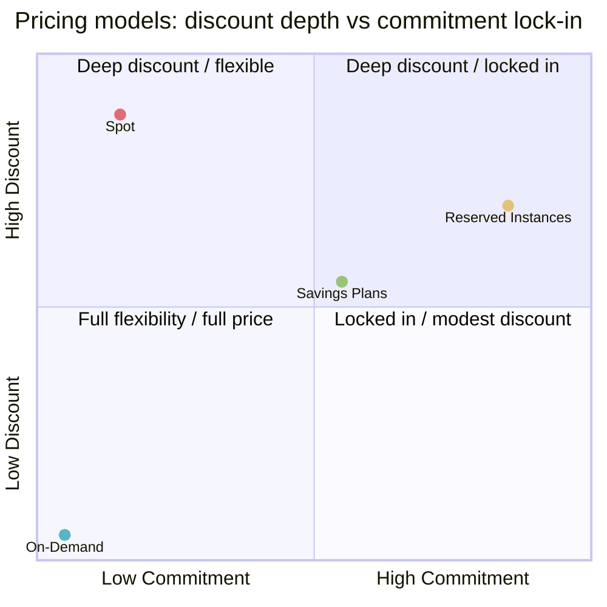
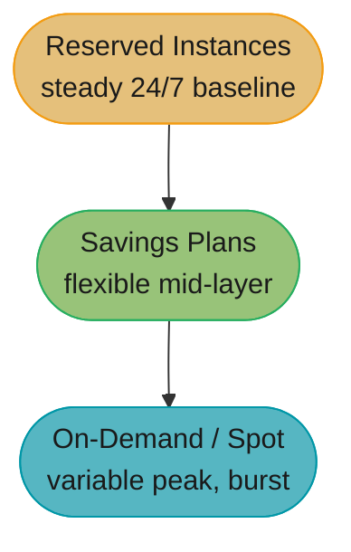
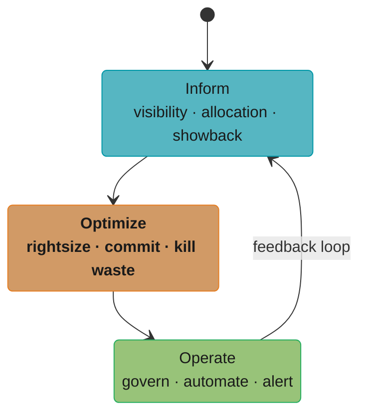
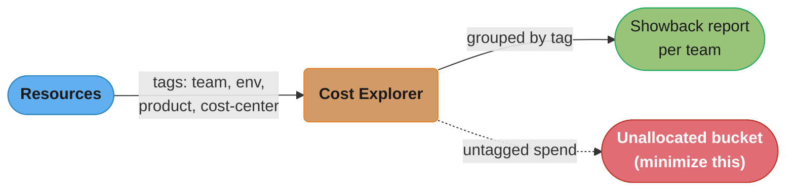
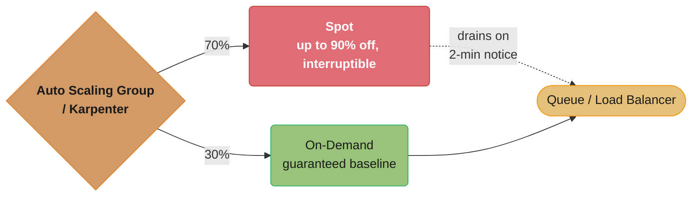
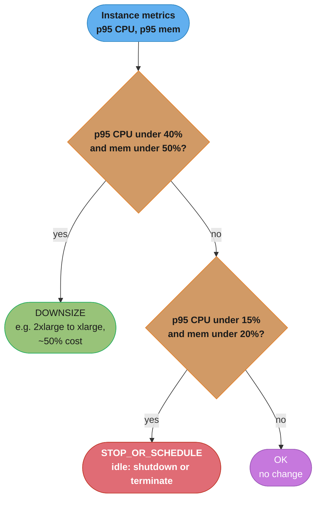

# Cloud Cost Optimization & FinOps

> Phase 5 — Cloud Platforms · Difficulty: Intermediate

Cloud bills grow silently — idle resources, over-provisioned instances, untagged spend nobody owns, and on-demand pricing on steady workloads. **FinOps** is the operating model that brings engineering, finance, and product together to manage cloud cost as a continuous discipline, not an annual surprise. This module covers the levers — **tagging**, **rightsizing**, **Spot/Reserved/Savings Plans**, **commitment strategy** — and the practices — **cost allocation**, **showback/chargeback**, and the FinOps Inform-Optimize-Operate lifecycle — with concrete numbers (Spot up to 90% off, Savings Plans/RIs in 1- or 3-year terms for ~30-72% discounts, rightsizing routinely cutting 20-40%).

---

## 1. Concept Overview

FinOps (a portmanteau of Finance + DevOps) is the practice of maximizing the business value of cloud spend through cross-functional ownership and data-driven decisions. The FinOps Foundation defines an iterative lifecycle:

- **Inform** — visibility and allocation. You can't optimize what you can't see: tagging, cost allocation, showback/chargeback, and budgets/forecasts so every team knows its spend.
- **Optimize** — act on the data: rightsizing, eliminating waste (idle/orphaned resources), and applying commitment discounts (Reserved Instances, Savings Plans, Spot).
- **Operate** — continuous governance: policies, automation, anomaly detection, and embedding cost awareness into engineering culture.

Core pricing models (AWS, with equivalents on GCP/Azure):

- **On-Demand** — pay-per-use, no commitment, highest unit price. Default; use for spiky/unpredictable workloads.
- **Spot Instances** — spare capacity at up to 90% off, but can be reclaimed with a 2-minute warning. For fault-tolerant, interruptible workloads (batch, CI, stateless web behind a queue).
- **Reserved Instances (RIs)** — commit to a specific instance family/Region for 1 or 3 years for ~40-72% off. (GCP: Committed Use Discounts; Azure: Reserved VM Instances.)
- **Savings Plans** — commit to a $/hour spend for 1 or 3 years for ~30-66% off, more flexible than RIs (apply across instance families/Regions, or compute-wide).

Rightsizing matches resource size to actual utilization; tagging attributes every dollar to a team/product/environment; showback reports cost to teams; chargeback bills it back to their budgets.

---

## 2. Intuition

> **One-line analogy**: Cloud cost is a household with a stack of always-running utilities. FinOps is the family budget meeting: first you read every meter and label which room uses what (tagging/allocation), then you turn off lights in empty rooms and switch to a cheaper plan for predictable usage (rightsizing/commitments), and then you set up alerts so nobody leaves the AC on all month again (operate/anomaly detection).

**Mental model**: Cost is an engineering metric like latency or error rate — owned by the teams that create it, made visible in near-real-time, and continuously optimized. FinOps is not a finance team policing engineers; it's a shared loop where engineers see the cost of their choices and finance gets predictable forecasts.

**Why it matters**: Cloud spend is one of the largest variable costs in a tech company, and waste of 20-40% is common (idle dev environments, over-provisioned instances, on-demand pricing on 24/7 workloads, orphaned volumes/IPs). Small structural changes — committing to steady baseline, Spot for batch, deleting waste — routinely cut bills by a third without touching reliability.

**Key insight**: **The biggest savings come from organizational visibility, not clever discounts.** Until every dollar is tagged and owned, you can't rightsize or commit confidently. Allocation (Inform) precedes optimization — a team that sees its own bill optimizes itself far more effectively than any top-down mandate.

---

## 3. Core Principles

1. **Teams own their spend.** Cost is a first-class engineering metric, attributed via tags.
2. **Visibility before optimization.** Tag everything; allocate every dollar; show teams their bill.
3. **Match pricing to workload shape.** On-Demand for spiky, Spot for interruptible, Commitments for steady baseline.
4. **Eliminate waste first.** Idle, orphaned, and over-provisioned resources are free savings.
5. **Commit to the baseline, burst on-demand/spot.** Cover steady-state with Savings Plans/RIs; flex the rest.
6. **Automate governance.** Budgets, anomaly alerts, policy-as-code, scheduled shutdowns.
7. **Cross-functional collaboration.** Engineering + finance + product, continuously (the FinOps loop).

---

## 4. Types / Architectures / Strategies

### Pricing models compared

| Model | Discount | Commitment | Risk | Best for |
|-------|----------|-----------|------|----------|
| On-Demand | 0% (baseline) | None | None | Spiky/unpredictable, short-lived |
| Spot | Up to 90% | None | 2-min interruption | Batch, CI, stateless/fault-tolerant |
| Reserved Instances | ~40-72% | 1 or 3 yr, specific family | Lock-in to family/Region | Steady, known instance type |
| Savings Plans (Compute) | ~30-66% | 1 or 3 yr, $/hr | Spend commitment | Steady spend, flexible across families |
| Savings Plans (EC2 Instance) | ~up to 72% | 1 or 3 yr, family in Region | Less flexible than Compute SP | Stable EC2 family usage |



The two axes explain why the cheapest options aren't free: Spot buys its up-to-90% discount with zero commitment but full interruption risk (top-left), while Reserved Instances/Savings Plans buy ~30-72% off by locking in spend for 1-3 years (top-right) — On-Demand pays full price for full flexibility (bottom-left).

### Cross-cloud commitment mapping

| Concept | AWS | GCP | Azure |
|---------|-----|-----|-------|
| Reserved capacity | Reserved Instances | Committed Use Discounts (CUD) | Reserved VM Instances |
| Spend commitment | Savings Plans | Spend-based CUD | Savings Plans for compute |
| Spare capacity | Spot Instances | Spot VMs / Preemptible | Spot VMs |
| Cost explorer | Cost Explorer | Cost Management / BigQuery billing export | Cost Management + Billing |
| Budgets/alerts | AWS Budgets | Budgets & Alerts | Budgets |

### Waste-elimination targets

| Waste | Detection | Fix |
|-------|-----------|-----|
| Over-provisioned instances | CPU/mem < 40% sustained | Rightsize down / Graviton |
| Idle dev/test environments | No traffic off-hours | Scheduled shutdown (nights/weekends) |
| Orphaned EBS volumes | Unattached | Delete / snapshot then delete |
| Unattached Elastic IPs | Not associated | Release (billed when idle) |
| Old snapshots | Age > retention | Lifecycle delete |
| Idle load balancers / NAT | Low traffic | Consolidate / remove |
| Over-broad NAT egress | S3/DDB via NAT | VPC Endpoints (free) |

### Commitment strategy (layered)



Cover the stable baseline with the cheapest commitment; flex the top.

---

## 5. Architecture Diagrams

**FinOps lifecycle (continuous loop)**



The FinOps Foundation's three phases run as a continuous loop, not a one-time project: Inform's visibility feeds Optimize's actions, which feed Operate's governance, which feeds back into Inform.

**Tag-driven cost allocation**



Every resource's tags flow into Cost Explorer, which groups tagged spend into a per-team showback report; anything untagged drops into the unallocated bucket that FinOps practice tries to shrink to zero.

**Spot + On-Demand mixed fleet (resilient + cheap)**



The Auto Scaling Group (or Karpenter) splits capacity 70/30 between Spot and On-Demand; a queue or load balancer in front absorbs the 2-minute Spot reclaim as a graceful retry, not an outage.

---

## 6. How It Works — Detailed Mechanics

### Enforced tagging via policy (AWS Organizations Tag Policy / SCP)

```json
{
  "tags": {
    "team":    { "tag_key": {"@@assign": "team"},    "enforced_for": {"@@assign": ["ec2:instance", "s3:bucket"]} },
    "env":     { "tag_key": {"@@assign": "env"} },
    "cost-center": { "tag_key": {"@@assign": "cost-center"} }
  }
}
```

```hcl
# Terraform: default tags applied to every resource in the provider (no resource forgotten)
provider "aws" {
  default_tags {
    tags = {
      team        = "orders"
      env         = "prod"
      cost-center = "CC-1042"
      managed-by  = "terraform"
    }
  }
}
```

### Rightsizing decision (utilization-driven)

```python
# Pull CloudWatch utilization; flag instances < 40% sustained CPU as rightsizing candidates
def rightsize(instance, p95_cpu, p95_mem):
    if p95_cpu < 40 and p95_mem < 50:
        return "DOWNSIZE"          # e.g., m6i.2xlarge -> m6i.xlarge (~50% cost)
    if p95_cpu < 15 and p95_mem < 20:
        return "STOP_OR_SCHEDULE"  # idle: schedule off-hours shutdown or terminate
    return "OK"
# Also consider Graviton (arm64): ~20% cheaper at equal/better perf for many workloads
```



The checks run in order and return on first match: DOWNSIZE's wider band (under 40%/50%) is tested before STOP_OR_SCHEDULE's narrower idle band (under 15%/20%), so only instances clearing both fall through to OK.

### Spot with graceful interruption handling

```yaml
# Kubernetes: handle the 2-min Spot interruption notice (drain pods before reclaim)
apiVersion: apps/v1
kind: Deployment
spec:
  template:
    spec:
      terminationGracePeriodSeconds: 90   # < 120s Spot warning -> graceful shutdown
      nodeSelector: { karpenter.sh/capacity-type: spot }
# Node Termination Handler cordons+drains the node on the interruption signal,
# rescheduling pods onto other Spot/On-Demand capacity -> no dropped requests.
```

### Savings Plan / RI coverage analysis

```text
Look at the steady 24/7 baseline (the floor of your usage graph over 30 days):
  - that floor is "always on" -> cover with a 1- or 3-yr Compute Savings Plan / RI
  - example: $10k/mo steady compute, 3-yr Compute SP at ~50% off -> ~$5k/mo, save $60k/yr
Target coverage 70-90% of baseline (not 100%): leave headroom for variability so you
don't over-commit and pay for unused commitment. Track utilization & coverage monthly.
```

### Scheduled shutdown of non-prod (free savings)

```bash
# Stop dev/staging instances nights + weekends: ~108 of 168 weekly hours off = ~64% savings
# EventBridge cron -> Lambda -> stop tagged env=dev instances at 19:00, start at 07:00 weekdays
aws ec2 stop-instances --instance-ids $(aws ec2 describe-instances \
  --filters "Name=tag:env,Values=dev" "Name=instance-state-name,Values=running" \
  --query "Reservations[].Instances[].InstanceId" --output text)
```

### Budgets + anomaly detection

```hcl
resource "aws_budgets_budget" "team_orders" {
  name         = "orders-monthly"
  budget_type  = "COST"
  limit_amount = "12000"
  limit_unit   = "USD"
  time_unit    = "MONTHLY"
  cost_filter { name = "TagKeyValue"; values = ["user:team$orders"] }   # per-team budget
  notification {
    comparison_operator = "GREATER_THAN"
    threshold           = 80          # alert at 80% of budget
    threshold_type      = "PERCENTAGE"
    notification_type   = "ACTUAL"
    subscriber_email_addresses = ["orders-oncall@example.com"]
  }
}
```

---

## 7. Real-World Examples

- **Airbnb / Lyft / Pinterest** publicly described large savings from a mix of Spot for batch/data workloads, Graviton migration, and rightsizing — often double-digit-percent reductions on multi-million-dollar bills.
- **Spot for CI and data pipelines**: teams run CI runners and Spark/EMR jobs on Spot at up to 90% off, designed to tolerate interruption (retry the job), turning compute into a near-commodity.
- **Scheduled non-prod shutdown**: many organizations stop all dev/staging environments outside business hours, cutting those environments' compute cost by ~70-76% with zero impact (nobody's working at 3am).
- **FinOps team + showback**: companies stand up a FinOps function that publishes a monthly per-team cost dashboard (showback); teams that suddenly see their own spend voluntarily delete idle resources and rightsize, often the single highest-ROI intervention.

---

## 8. Tradeoffs

| Decision | Option A | Option B | Key factor |
|----------|----------|----------|-----------|
| Pricing for baseline | On-Demand (flexible) | RI/Savings Plan (cheaper, locked) | Flexibility vs ~30-72% savings |
| Commitment type | Reserved Instances | Savings Plans | Lowest price (specific) vs flexibility |
| Commitment term | 1-year | 3-year | Less lock-in vs deeper discount |
| Coverage target | 100% baseline | 70-90% baseline | Max discount vs over-commit risk |
| Interruptible compute | Spot (90% off) | On-Demand | Cost vs reliability/complexity |
| Cost reporting | Showback (visibility) | Chargeback (billed back) | Awareness vs accountability/friction |
| Architecture | Cheapest instance | Graviton/serverless | Migration effort vs sustained savings |

---

## 9. When to Use / When NOT to Use

**Adopt FinOps practices when:** your cloud bill is material and growing, multiple teams share accounts, spend is hard to attribute, or finance and engineering are misaligned on cost. **Use Spot when:** workloads are fault-tolerant and interruptible (batch, CI, stateless behind a queue). **Use Reserved/Savings Plans when:** you have a stable 24/7 baseline you're confident will persist for 1-3 years. **Use scheduled shutdown when:** non-prod environments sit idle off-hours.

**Reconsider when:** the workload is too small for the overhead of a FinOps function (a tiny startup just needs basic budgets and tagging, not a team); committing before you understand your baseline risks paying for unused commitments; or putting stateful/latency-critical production on Spot, where a 2-minute reclaim causes outages. Don't over-commit (100% coverage) on volatile usage, and don't let cost optimization compromise reliability — the goal is value, not the smallest bill.

---

## 10. Common Pitfalls

**Pitfall 1 — Untagged resources making cost unallocatable.**

```hcl
# BROKEN: resources with no cost tags -> spend lands in "unallocated", nobody owns it
resource "aws_instance" "worker" {
  ami           = "ami-123"
  instance_type = "m6i.2xlarge"
  # no tags -> can't attribute to a team/product; can't build showback or budgets
}
```

```hcl
# FIX: enforce tags via provider default_tags + an Organizations tag policy
provider "aws" {
  default_tags { tags = { team = "data", env = "prod", cost-center = "CC-2001", managed-by = "terraform" } }
}
resource "aws_instance" "worker" {
  ami           = "ami-123"
  instance_type = "m6i.2xlarge"   # also: is 2xlarge justified? rightsize from utilization
}
# A tag policy in AWS Organizations rejects/flags resources missing required tags.
```

**Pitfall 2 — Over-committing Reserved Instances/Savings Plans.** Buying 3-year RIs for 100% of current usage, then refactoring or shrinking — you pay for unused commitments. FIX: cover only the stable 70-90% baseline, prefer flexible Compute Savings Plans, and stagger 1-year commitments while usage is still evolving.

**Pitfall 3 — Putting stateful production on Spot.** A database or stateful service on Spot gets reclaimed with 2 minutes' notice and goes down. FIX: Spot only for fault-tolerant/interruptible workloads with graceful drain (Node Termination Handler) and a mixed fleet (e.g., 70% Spot / 30% On-Demand) behind a queue or load balancer.

**Pitfall 4 — No anomaly detection, discovering overspend at month-end.** A misconfigured job or runaway autoscaler can 10x a bill silently. FIX: enable AWS Cost Anomaly Detection and per-team Budgets with 80% alerts, so spikes surface in hours, not at the invoice.

---

## 11. Technologies & Tools

| Tool/Service | Purpose |
|--------------|---------|
| AWS Cost Explorer / Cost Anomaly Detection | Visibility, trends, anomaly alerts |
| AWS Budgets / GCP Budgets / Azure Budgets | Per-team budgets and alerts |
| AWS Compute Optimizer / Trusted Advisor | Rightsizing and waste recommendations |
| Cost allocation tags / Organizations Tag Policy | Attribution and enforcement |
| Savings Plans / RIs / CUDs | Commitment discounts |
| Spot / Karpenter / Spot Fleet | Interruptible discounted compute |
| Kubecost / OpenCost | Kubernetes cost allocation ([kubernetes_architecture](../kubernetes_architecture/)) |
| CloudHealth / Cloudability / Infracost | Third-party FinOps + IaC cost estimates |
| BigQuery / Athena billing export | Detailed cost analysis |

---

## 12. Interview Questions with Answers

**Q1: What is FinOps and what are its three lifecycle phases?**
FinOps is a cross-functional operating model — engineering, finance, and product together — for managing cloud cost as a continuous discipline that maximizes business value, not just minimizes spend. Its lifecycle is Inform (visibility and cost allocation via tagging, showback, budgets), Optimize (rightsizing, eliminating waste, applying commitment discounts), and Operate (governance, automation, anomaly detection, culture). The loop is iterative — you continuously inform, optimize, and operate as usage and the business evolve.

**Q2: Compare On-Demand, Spot, Reserved Instances, and Savings Plans.**
On-Demand is pay-per-use with no commitment at the highest unit price, for spiky/unpredictable workloads. Spot uses spare capacity at up to 90% off but can be reclaimed with a 2-minute warning, so it's for fault-tolerant, interruptible workloads. Reserved Instances commit to a specific instance family/Region for 1 or 3 years for ~40-72% off, while Savings Plans commit to a $/hour spend for ~30-66% off with more flexibility across families/Regions. The strategy is to cover the steady baseline with commitments, burst on On-Demand, and run interruptible work on Spot.

**Q3: Why is tagging the foundation of cost optimization?**
Because you can't optimize what you can't attribute — until every resource is tagged with team/product/environment/cost-center, spend pools into an "unallocated" bucket that no one owns, making rightsizing and chargeback impossible. Tags enable cost allocation reports, per-team budgets, and showback that drives teams to self-optimize. Enforce tagging with provider default tags and an Organizations tag policy so no resource slips through untagged.

**Q4: What's the difference between showback and chargeback?**
Showback reports each team or product its cloud cost for visibility and accountability without moving money, while chargeback actually bills those costs back to the team's budget or P&L. Showback is lower-friction and often enough to change behavior (teams optimize once they see their bill), whereas chargeback creates harder financial accountability but more organizational friction and disputes. Many organizations start with showback and graduate to chargeback as the FinOps practice matures.

**Q5: How do you decide what to put on Spot instances?**
Put fault-tolerant, interruptible, stateless workloads on Spot — batch jobs, CI runners, data pipelines, and stateless web behind a queue or load balancer — where a 2-minute reclaim can be absorbed by rescheduling or retrying. Never put stateful services or latency-critical databases on Spot, since reclamation causes outages. Use a mixed fleet (e.g., 70% Spot / 30% On-Demand) with a Node Termination Handler to drain gracefully on the interruption notice.

**Q6: How do you avoid over-committing with Reserved Instances or Savings Plans?**
Commit only to the stable 24/7 baseline (typically 70-90% of it, not 100%), prefer flexible Compute Savings Plans over family-specific RIs while your architecture is still evolving, and consider staggering 1-year terms instead of locking 3 years on uncertain usage. Track commitment utilization and coverage monthly. The risk is paying for commitments you no longer use after a refactor or downsizing, so leave headroom for change.

**Q7: What are the biggest sources of cloud waste and how do you eliminate them?**
Over-provisioned instances (CPU/memory under ~40% — rightsize down or move to Graviton), idle non-prod environments (schedule off-hours shutdown for ~70-76% savings), orphaned EBS volumes and unattached Elastic IPs (delete/release), old snapshots (lifecycle expiry), and S3/DynamoDB traffic routed through NAT instead of free VPC endpoints. Detection comes from utilization metrics and tools like Compute Optimizer/Trusted Advisor. Eliminating waste is the highest-ROI first step because it requires no commitment and no reliability tradeoff.

**Q8: How does rightsizing work and how much can it save?**
Rightsizing compares an instance's actual sustained utilization (e.g., p95 CPU/memory over 30 days) against its provisioned size and recommends a smaller instance or family when utilization is consistently low, commonly cutting 20-40% per right-sized resource. Tools like AWS Compute Optimizer surface candidates automatically. Combine it with Graviton (arm64) migration, which often gives ~20% lower cost at equal or better performance for compatible workloads.

**Q9: How do you catch cost overruns before the monthly invoice?**
Enable cost anomaly detection (AWS Cost Anomaly Detection or equivalent) to alert on unusual spend patterns within hours, and set per-team AWS Budgets with threshold alerts (e.g., at 80% of the monthly budget). Tie budgets to cost-allocation tags so each team is alerted on its own overspend. This shifts cost from a month-end surprise to a near-real-time signal engineers can act on immediately.

**Q10: How do you allocate and optimize cost in a shared Kubernetes cluster?**
A shared cluster mixes many teams' workloads on the same nodes, so node-level billing doesn't map to teams; tools like Kubecost or OpenCost allocate cost by namespace, label, or workload using pod resource requests/usage to produce per-team showback. Optimize by right-sizing pod requests/limits (over-requesting wastes node capacity), using cluster autoscaling/Karpenter with Spot for bin-packed efficiency, and scaling non-prod namespaces down off-hours. This brings the same tag-driven allocation and rightsizing discipline inside the cluster — see [kubernetes_architecture](../kubernetes_architecture/) and [cloud_fundamentals_and_aws](../cloud_fundamentals_and_aws/).

**Q11: What's the difference between enforcing tags with an SCP versus an AWS Organizations Tag Policy?**
An SCP can hard-block resource creation outright, while a Tag Policy only standardizes and reports. A `Deny` statement on `ec2:RunInstance` keyed on the `aws:RequestTag` condition stops an untagged instance from ever being created, whereas a Tag Policy defines allowed tag keys/values and flags non-compliant resources in a compliance dashboard without blocking creation by default. In practice, teams use Tag Policies to stop tag-value drift (`Team` vs `team` vs `TEAM` inconsistency) and layer an SCP on top where they need a hard gate that nothing untagged gets created at all. Both feed the same goal as the module's `default_tags` block: zero resources landing in the "unallocated" bucket.

**Q12: Why do rightsizing decisions use p95 utilization instead of average CPU?**
Average CPU hides bursty peak load, so sizing off it risks under-provisioning exactly when the instance is busiest. An instance averaging 25% CPU can still spike to 90% during a daily batch job or traffic peak; downsizing based on the average alone would leave it starved at the one moment it matters, while p95 (the value CPU stays under 95% of the time) captures that near-peak behavior and still discounts rare one-off spikes as noise. This is why the module's rightsizing check tests p95 CPU under 40% and p95 memory under 50% before recommending a downsize, rather than testing the mean. Percentile-based thresholds are standard practice precisely because mean-based sizing has caused real under-provisioning incidents after a seemingly safe downsize.

**Q13: Mechanically, how does a workload detect and react to a Spot interruption within the 2-minute window?**
AWS delivers the interruption warning about two minutes before reclaiming the instance, via the Instance Metadata Service and an EventBridge event. Workload tooling polls or subscribes to that signal to start draining immediately; on Kubernetes, the Node Termination Handler watches for it and cordons plus drains the node, rescheduling pods onto other capacity. The pod spec's `terminationGracePeriodSeconds` — commonly set to about 90 seconds — must stay comfortably under the roughly 120-second warning so the pod finishes shutting down before reclaim actually happens. Set the grace period too close to 120 seconds and a slow shutdown hook can still get killed mid-drain, turning a graceful handoff into a dropped request.

**Q14: What's the difference between Savings Plan "coverage" and "utilization," and what does a low value in each mean?**
Coverage measures what percentage of your actual usage is covered by a commitment, while utilization measures what percentage of the commitment you purchased is actually being used. Low coverage means you're leaving discount on the table — a lot of steady, predictable usage is still running at full On-Demand price because you haven't committed enough. Low utilization means the opposite problem: you bought more commitment than you're using, so you're paying for capacity that's sitting idle, typically because usage shrank after a refactor or the commitment was sized too aggressively. Track both monthly — the healthy target is high coverage and high utilization together, not just one of the two.

**Q15: What is "unit economics" in FinOps, and why do teams track cost per request or per customer?**
Unit economics ties cloud spend to a business metric — cost per request, per transaction, or per active customer — instead of tracking the raw bill in isolation. A raw bill going from $100k to $150k a month looks alarming, but if it happened because the customer base tripled, the cost per customer actually dropped, meaning the platform got more efficient even as total spend rose; without a unit metric that story is invisible and the raw number alone drives the wrong conversation. Computing it requires the same tag-driven cost allocation this module uses for showback, joined against a business metric (requests served, orders processed, active users) from application telemetry. Unit economics is what turns "our bill grew" into "our bill grew slower than our business," which is the practical definition of FinOps efficiency.

**Q16: If you run non-prod on a 12-hours-a-day, 5-days-a-week schedule instead of nights-plus-weekends, what's the savings?**
A 12x5 schedule (on 12 hours a day, weekdays only) leaves the instance running 60 of the week's 168 hours, which works out to roughly 64% savings versus running it around the clock. That figure comes straight from `(168 - on_hours) / 168`: to push savings past ~70%, shrink the on-window further — an 8x5 schedule (8 hours a day, weekdays only) cuts on-hours to 40 and off-hours to 128, for roughly 76% savings — or keep a 12-hour weekday window but add full weekend-and-holiday stops on top of it. This is why sizing a shutdown schedule is a deliberate tradeoff and not a fixed number: a wider on-window saves less but tolerates people working odd hours, while a narrower one saves more but risks blocking someone's early start or late fix. Either way, the mechanism is the same EventBridge-cron-to-Lambda pattern used for stopping and starting tagged instances — pick the on-window to match your team's actual working hours, then verify the resulting percentage with the formula instead of assuming a round number.

---

## 13. Best Practices

- **Tag everything** and enforce it (default tags + tag policy); drive "unallocated" spend toward zero.
- **Inform before optimize**: stand up showback dashboards so teams see and own their cost.
- **Cover the stable baseline** with Savings Plans/RIs (70-90% coverage), burst on On-Demand, batch on Spot.
- **Eliminate waste first**: rightsize, delete orphaned volumes/IPs, schedule non-prod shutdowns, use VPC endpoints.
- **Migrate to Graviton/serverless** where workloads fit for sustained savings.
- **Automate governance**: budgets with 80% alerts, anomaly detection, policy-as-code ([policy_as_code_and_compliance](../policy_as_code_and_compliance/)).
- **Estimate cost in CI** (Infracost on Terraform PRs) so cost is visible before merge ([infrastructure_as_code_terraform](../infrastructure_as_code_terraform/)).
- **Optimize for value, not the smallest bill** — never trade away required reliability.

---

## 14. Case Study

### Scenario: A scale-up's cloud bill tripled in a year with no one accountable

A scale-up's AWS bill grew from $80k to $240k/month in a year. Nobody could say which team or product drove the increase — most resources were untagged. Everything ran On-Demand, including a steady 24/7 baseline; dev environments ran around the clock; data jobs ran on expensive On-Demand instances; and a runaway autoscaler had quietly added $30k/month that surfaced only at the next invoice.

```text
BROKEN:
  - ~60% of resources untagged -> spend "unallocated", no team accountability
  - 100% On-Demand, including a stable 24/7 baseline (~$120k/mo of always-on compute)
  - dev/staging running 24/7 (used ~40 of 168 weekly hours)
  - Spark jobs on On-Demand (could tolerate interruption)
  - no budgets/anomaly detection -> $30k/mo overrun found at month-end
```

```hcl
# FIX (Inform): enforce tags everywhere + per-team budgets with anomaly alerts
provider "aws" { default_tags { tags = { team = var.team, env = var.env, cost-center = var.cc } } }

resource "aws_budgets_budget" "per_team" {
  for_each     = toset(["orders", "data", "platform"])
  name         = "${each.key}-monthly"
  budget_type  = "COST"; limit_amount = var.limits[each.key]; limit_unit = "USD"; time_unit = "MONTHLY"
  cost_filter { name = "TagKeyValue"; values = ["user:team$${each.key}"] }
  notification { comparison_operator = "GREATER_THAN"; threshold = 80; threshold_type = "PERCENTAGE"; notification_type = "ACTUAL"; subscriber_email_addresses = [var.alerts[each.key]] }
}
```

```text
# FIX (Optimize):
  - cover the ~$120k/mo steady baseline with a 1-yr Compute Savings Plan (~40% off) -> ~$72k/mo
  - move Spark/EMR + CI to Spot (up to 90% off) with retry-on-interruption
  - scheduled shutdown of dev/staging nights+weekends -> ~76% off those envs
  - rightsize 30 over-provisioned instances (p95 CPU < 30%) -> ~30% off each
  - migrate suitable services to Graviton -> ~20% off
# FIX (Operate): Cost Anomaly Detection caught the runaway autoscaler in 3 hours, not 30 days
```

Within two quarters, the company turned cost into an owned engineering metric: tagging enabled a per-team showback dashboard, and once teams saw their own bills they voluntarily deleted idle resources. A Compute Savings Plan covered the steady baseline, Spot absorbed batch/CI, non-prod shut down off-hours, and rightsizing plus Graviton trimmed the rest. Anomaly detection turned month-end surprises into same-day alerts.

**Outcome:** the bill dropped from $240k to ~$150k/month (~37%) with no reliability impact, every dollar became attributable to a team, and the runaway-autoscaler class of incident now surfaces in hours. The decisive move was **Inform first** — visibility and ownership unlocked all the downstream optimization; the discounts and Spot were the easy part once teams could see and own their spend.

**Discussion questions:**
1. Why did the team start with tagging/showback (Inform) rather than immediately buying Savings Plans?
2. How do you size a Savings Plan commitment from a usage graph without over-committing?
3. Which workloads were safe to move to Spot, and what made them safe?

---

**Cross-references:** [cloud_fundamentals_and_aws](../cloud_fundamentals_and_aws/) (pricing models, instance families, Graviton, VPC endpoints), [cloud_networking_and_cdn](../cloud_networking_and_cdn/) (data-transfer/egress cost), [serverless_and_faas](../serverless_and_faas/) (per-invocation vs always-on cost), [kubernetes_architecture](../kubernetes_architecture/) (Kubecost, cluster autoscaling), [infrastructure_as_code_terraform](../infrastructure_as_code_terraform/) (Infracost, tagging via IaC), [policy_as_code_and_compliance](../policy_as_code_and_compliance/) (tag/cost governance policies), [gcp_and_azure_essentials](../gcp_and_azure_essentials/) (CUDs, Spot VMs equivalents).
