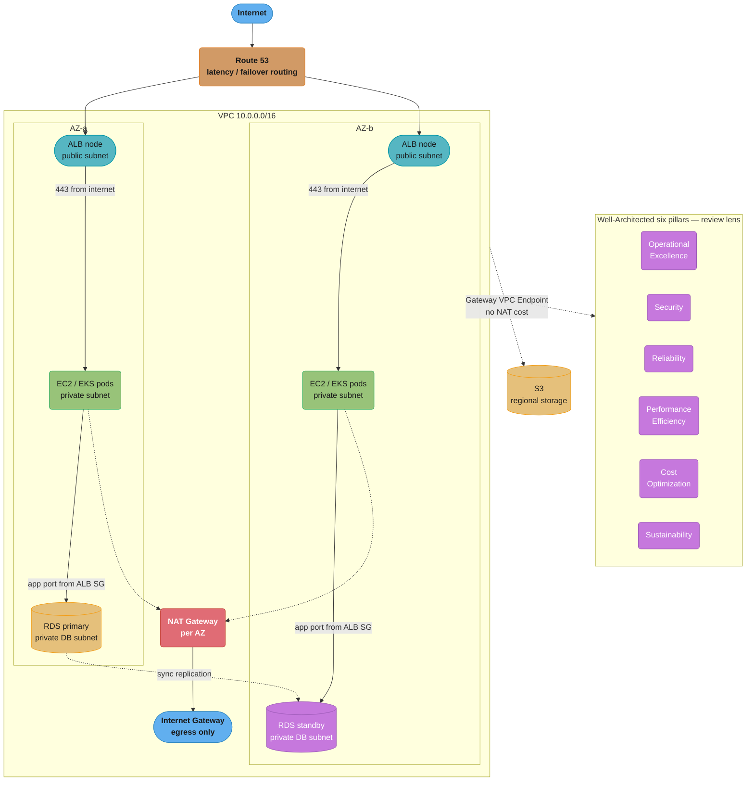
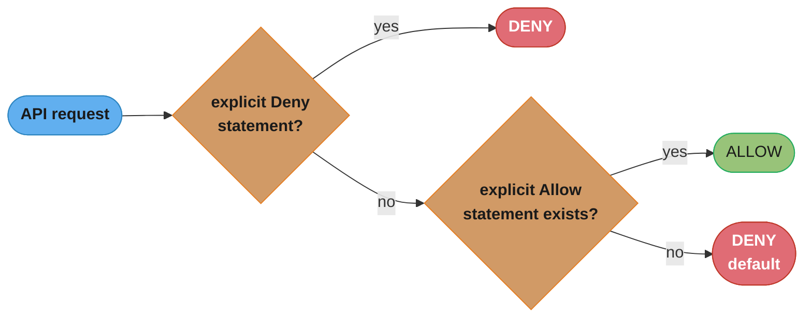
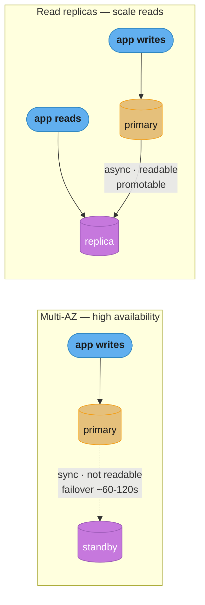

# Cloud Fundamentals & AWS

> Phase 5 — Cloud Platforms · Difficulty: Intermediate

AWS is the dominant public cloud, and its primitives — **IAM** for identity, **VPC** for networking, **EC2** for compute, **S3/EBS** for storage, **ELB** for load balancing, **Route 53** for DNS, **RDS** for managed databases, and **EKS** for Kubernetes — are the building blocks every cloud architect composes. This module covers what each service does, how they fit together, the concrete limits and pricing that drive design decisions, and the **Well-Architected Framework** lens (six pillars) that ties them into defensible architectures.

---

## 1. Concept Overview

Public cloud replaces capital-expense data centers with on-demand, API-driven, pay-per-use infrastructure. AWS exposes ~200 services, but a working architect leans on a small core:

- **IAM (Identity and Access Management)** — who can do what. Users, roles, policies (JSON), and the principle of least privilege. The control plane for every API call.
- **VPC (Virtual Private Cloud)** — your isolated network: subnets (public/private), route tables, internet/NAT gateways, security groups, and NACLs. See [networking_for_devops](../networking_for_devops/) for the underlying TCP/IP, and [cloud_networking_and_cdn](../cloud_networking_and_cdn/) for cross-VPC connectivity.
- **EC2 (Elastic Compute Cloud)** — virtual machines. Instance families (general/compute/memory/GPU), AMIs, instance store vs EBS-backed, Auto Scaling Groups.
- **S3 (Simple Storage Service)** — object storage, 11 nines (99.999999999%) durability, storage classes, lifecycle policies. **EBS (Elastic Block Store)** — network-attached block volumes for EC2.
- **ELB (Elastic Load Balancing)** — ALB (L7/HTTP), NLB (L4/TCP), GWLB (appliances). Distributes traffic across targets.
- **Route 53** — DNS + health checks + routing policies (weighted, latency, geolocation, failover).
- **RDS (Relational Database Service)** — managed PostgreSQL/MySQL/Aurora etc. Internals owned by [../../database/](../../database/); this module covers the cloud-operational side (Multi-AZ, read replicas, backups).
- **EKS (Elastic Kubernetes Service)** — managed Kubernetes control plane. See [kubernetes_architecture](../kubernetes_architecture/).

The **Well-Architected Framework** organizes design review into six pillars: Operational Excellence, Security, Reliability, Performance Efficiency, Cost Optimization, and Sustainability.

---

## 2. Intuition

> **One-line analogy**: AWS is a city's utility grid. IAM is the keycard system (who enters which building), VPC is the gated district with its own roads (subnets) and checkpoints (security groups), EC2 is the rentable office space, S3 is the warehouse with guaranteed inventory survival, and Route 53 is the city directory that sends visitors to the nearest open branch.

**Mental model**: Every AWS resource lives inside an account, inside a Region, usually inside one or more Availability Zones (AZs — physically separate data centers). IAM gates every API call; VPC gates every network packet. Compute (EC2/EKS) runs inside subnets; storage (S3) is regional and accessed over the network; the load balancer is the front door; Route 53 is the signpost.

**Why it matters**: Misunderstanding the IAM-VPC-AZ model is the root of most cloud incidents — over-permissive roles cause breaches, single-AZ deployments cause outages, and public subnets with open security groups expose databases. Knowing the concrete limits (a Region has 3+ AZs, gp3 gives 3000 IOPS baseline, ALB scales automatically, S3 is 11 nines) lets you size and price designs correctly the first time.

**Key insight**: **Availability comes from spreading across AZs, not from bigger instances.** A single huge EC2 in one AZ is less reliable than two small ones in two AZs behind an ELB. The cloud's reliability primitive is the *Region/AZ topology*, and almost every managed service (RDS Multi-AZ, S3, ALB) is built to exploit it.

### Decoding "spread, don't enlarge": availability composition

That insight is a claim about arithmetic, and there are exactly two ways components compose:

```
  SERIAL   (every part must work):   A_total  =  A_1 x A_2 x ... x A_n
  PARALLEL (any one part suffices):  A_total  =  1 - (1 - A_1) x (1 - A_2) x ... x (1 - A_n)
```

**What it means.** "Chaining things together multiplies your availability downward; putting things side by side multiplies your *un*availability downward." A bigger instance is still one term in a serial chain, whereas a second instance adds a parallel term — and only the parallel form has an exponent working in your favour.

| Symbol | What it is |
|--------|------------|
| `A` | Availability as a fraction — 0.995 for AWS's single-instance EC2 SLA of 99.5% |
| `1 - A` | Unavailability; the quantity that gets multiplied (and so shrinks fast) in parallel |
| Serial | A dependency chain — ALB, then app, then database; any one down means the request fails |
| Parallel | Redundant peers behind a health-checked balancer; the request survives if any one is up |

**Walk one example.** The single m5.large from §14 versus the ASG across two AZs, at EC2's 99.5% single-instance SLA:

```
  ONE instance (serial, n = 1)
    A = 0.995                        ->  downtime = 0.005 x 8760 h  =  43.8 h/year

  TWO instances behind an ELB (parallel, n = 2)
    A = 1 - (0.005 x 0.005) = 0.999975
                                     ->  downtime = 0.000025 x 8760 h x 60
                                                 =  13.1 min/year

  THREE instances (parallel, n = 3)
    A = 1 - 0.005^3 = 0.999999875    ->  downtime = 0.066 min/year  =  ~4 seconds
```

Two small instances beat one big one by a factor of 200 in downtime, and the second instance is where nearly all of the win lives — the third buys far less. Doubling instance *size* moves nothing in either formula, which is the whole point of the insight.

The serial form is the sobering half. A realistic three-tier request path composes downward, never upward:

```
  ALB              0.99990
  app tier (2 AZs) 0.999975
  RDS Multi-AZ     0.99950
  ---------------------------------------------------------------
  A_total = 0.99990 x 0.999975 x 0.99950  =  0.999375  ->  5.5 h/year
```

The chain is worse than every single link in it — you cannot be more available than your least available dependency, only less. This is also why the two formulas must be applied in the right places: the parallel form applies *within* a tier, and the serial form applies *across* tiers. And both assume independent failures, which an AZ outage violates by definition. That is exactly why the redundancy has to cross AZs: two instances in one AZ are parallel on paper and serial in reality.

For reference, the "nines" those decimals correspond to:

| Availability | Downtime per month | Downtime per year |
|--------------|--------------------|-------------------|
| 99% ("two nines") | 432 min (7.2 h) | 5,256 min (3.65 days) |
| 99.9% ("three nines") | 43.2 min | 525.6 min (8.76 h) |
| 99.95% | 21.6 min | 262.8 min (4.38 h) |
| 99.99% ("four nines") | 4.32 min | 52.6 min |
| 99.999% ("five nines") | 26 sec | 5.26 min |

Each added nine divides downtime by 10, which is why the cost of an SLA rises so steeply: going from 99.9% to 99.99% means removing 473 minutes of failure per year from a system you do not fully control.

---

## 3. Core Principles

1. **Least privilege via IAM.** Grant the minimum permissions; prefer roles (temporary credentials) over long-lived access keys.
2. **Design for failure across AZs.** Assume any single AZ or instance can die; spread workloads and use Multi-AZ managed services.
3. **Private by default.** Databases and app servers live in private subnets; only load balancers and bastions touch the internet.
4. **Managed over self-managed** where it fits — RDS over self-hosted Postgres, EKS over self-managed control plane — to offload undifferentiated heavy lifting.
5. **Everything is an API.** Provision with IaC ([infrastructure_as_code_terraform](../infrastructure_as_code_terraform/)), not the console.
6. **Tag and budget from day one.** Cost and ownership are attributes ([cloud_cost_optimization_finops](../cloud_cost_optimization_finops/)).
7. **Apply the Well-Architected pillars** as a recurring review, not a one-time checklist.

---

## 4. Types / Architectures / Strategies

### EC2 instance families

| Family | Prefix | Use case | Example |
|--------|--------|----------|---------|
| General purpose | m, t | Balanced web/app servers | m7i.large, t3.micro (burstable) |
| Compute optimized | c | CPU-bound (batch, gaming) | c7g.xlarge (Graviton) |
| Memory optimized | r, x | In-memory DB, caches | r7g.2xlarge |
| Storage optimized | i, d | High local IOPS | i4i.large (NVMe) |
| Accelerated | p, g, inf | GPU/ML inference | p5.48xlarge (H100), inf2 |

### S3 storage classes

| Class | Retrieval | Use case | Relative cost |
|-------|-----------|----------|---------------|
| Standard | Instant | Hot data | Baseline (~$0.023/GB-mo) |
| Standard-IA | Instant (fee) | Infrequent access | ~$0.0125/GB-mo |
| Intelligent-Tiering | Instant | Unknown/changing access | Auto-moves + monitoring fee |
| Glacier Instant | Instant | Archive, occasional read | ~$0.004/GB-mo |
| Glacier Flexible | Minutes-hours | Backups | ~$0.0036/GB-mo |
| Glacier Deep Archive | 12 hours | Compliance/cold | ~$0.00099/GB-mo |

### EBS volume types

| Type | Baseline | Max | Use case |
|------|----------|-----|----------|
| gp3 (SSD) | 3000 IOPS, 125 MB/s | 16000 IOPS, 1000 MB/s | Default general purpose |
| io2 Block Express (SSD) | Provisioned | 256000 IOPS | Critical DBs |
| st1 (HDD) | Throughput | 500 MB/s | Big sequential (logs, data lakes) |
| sc1 (HDD) | Cold | Lowest cost | Infrequent |

### Load balancers

| LB | Layer | Protocol | Use case |
|----|-------|----------|----------|
| ALB | L7 | HTTP/HTTPS/gRPC | Path/host routing, microservices |
| NLB | L4 | TCP/UDP/TLS | Ultra-low latency, static IP, millions of req/s |
| GWLB | L3/4 | GENEVE | Inserting firewalls/appliances |

---

## 5. Architecture Diagrams



The ALB is the only internet-facing tier in each AZ; app and database tiers stay private behind security groups scoped to the tier above them, and RDS replicates synchronously to the standby for an automatic failover in roughly 60-120 seconds. S3 traffic reaches the bucket through a Gateway VPC Endpoint, bypassing the NAT Gateway — and its ~$0.045/GB processing charge — entirely, while the six Well-Architected pillars remain the recurring review lens applied over the whole topology.

---

## 6. How It Works — Detailed Mechanics

### IAM policy (least privilege)

```json
{
  "Version": "2012-10-17",
  "Statement": [{
    "Sid": "ReadOnlyOneBucket",
    "Effect": "Allow",
    "Action": ["s3:GetObject", "s3:ListBucket"],
    "Resource": [
      "arn:aws:s3:::orders-prod",
      "arn:aws:s3:::orders-prod/*"
    ],
    "Condition": {"StringEquals": {"aws:PrincipalTag/team": "orders"}}
  }]
}
```

IAM evaluation: an explicit `Deny` always wins; otherwise an `Allow` must exist or the request is denied by default. Prefer **roles** assumed via STS (temporary credentials, default 1-hour) — for EC2 use an **instance profile**, for EKS use **IRSA** (IAM Roles for Service Accounts).



An explicit Deny anywhere in the evaluated policies wins immediately; otherwise the request needs at least one explicit Allow or IAM denies it by default — the precedence that makes a stray wildcard Deny airtight but a missing Allow silently block access (Pitfall 3).

### VPC + security group (Terraform)

```hcl
resource "aws_vpc" "main" { cidr_block = "10.0.0.0/16" }

resource "aws_subnet" "private_a" {
  vpc_id            = aws_vpc.main.id
  cidr_block        = "10.0.1.0/24"   # 256 addresses (251 usable; AWS reserves 5)
  availability_zone = "us-east-1a"
}

resource "aws_security_group" "app" {
  vpc_id = aws_vpc.main.id
  ingress {                            # stateful: only allow from the ALB's SG
    from_port       = 8080
    to_port         = 8080
    protocol        = "tcp"
    security_groups = [aws_security_group.alb.id]
  }
  egress { from_port = 0; to_port = 0; protocol = "-1"; cidr_blocks = ["0.0.0.0/0"] }
}
```

Security groups are **stateful** (return traffic auto-allowed) and allow-only; NACLs are **stateless** subnet-level and support explicit deny.

**In plain terms.** "The number after the slash is how many bits are locked as the network's identity; whatever bits are left are yours to hand out as addresses." So the prefix length and the host count move in opposite directions — a *bigger* number after the slash means a *smaller* subnet, which is the part that trips people up:

```
  total addresses  =  2 ^ (32 - prefix_length)
  usable addresses =  total - 5          (AWS reserves 5 in every subnet)
  subnets of size /m that fit in a /n  =  2 ^ (m - n)
```

| Symbol | What it is |
|--------|------------|
| `prefix_length` | The `/24` — count of leading bits fixed as the network portion |
| `32 - prefix_length` | Host bits left over; each one doubles the address count |
| The 5 reserved | Network address, VPC router, AWS DNS, one held for future use, and broadcast |
| VPC CIDR | The outer block (`10.0.0.0/16`) that every subnet must be carved from |

**Walk one example.** The `10.0.0.0/16` VPC and `10.0.1.0/24` subnet above:

```
  VPC   10.0.0.0/16   ->  2^(32-16) = 2^16  =  65,536 addresses total
  subnet 10.0.1.0/24  ->  2^(32-24) = 2^8   =     256 addresses
                                      minus 5 reserved  =  251 usable

  how many /24 subnets fit in the /16?   2^(24-16)  =  2^8  =  256

  smaller carve-outs, where the reservation really bites:
     /26  ->  2^6  =  64 addresses  -  5  =   59 usable   ( 7.8% lost)
     /28  ->  2^4  =  16 addresses  -  5  =   11 usable   (31.3% lost)
```

The fixed 5-address reservation is the term to remember, because it is a *constant* subtracted from an *exponential*: negligible in a /24 but a third of a /28. Sizing EKS subnets is where this bites hardest — with the VPC CNI every pod consumes a subnet IP, so a /24 per AZ caps you near 251 pods regardless of how much CPU the nodes have, and the failure mode is pods stuck in `ContainerCreating` with no obvious cause.

### EC2 launch + Auto Scaling

```hcl
resource "aws_autoscaling_group" "web" {
  min_size            = 2          # one per AZ minimum for HA
  max_size            = 10
  desired_capacity    = 2
  vpc_zone_identifier = [aws_subnet.private_a.id, aws_subnet.private_b.id]
  target_group_arns   = [aws_lb_target_group.web.arn]
  health_check_type   = "ELB"      # replace if the LB health check fails, not just EC2 status
}
```

### RDS Multi-AZ vs read replicas

```hcl
resource "aws_db_instance" "orders" {
  engine               = "postgres"
  instance_class       = "db.r7g.large"
  allocated_storage    = 100
  multi_az             = true     # synchronous standby in another AZ -> ~60-120s failover
  backup_retention_period = 7     # automated daily snapshots + 5-min PITR
  storage_encrypted    = true
}
```

Multi-AZ = **HA** (synchronous standby, automatic failover, not readable). Read replicas = **scale reads** (asynchronous, readable, can promote). For DB internals see [../../database/](../../database/).



Multi-AZ keeps a synchronous standby that is never readable, purely for a ~60-120s automatic failover; read replicas are asynchronous, readable copies that offload read traffic and can be promoted to a standalone primary — different problems, which is why production systems often run both at once (Q4).

### Route 53 failover

```hcl
resource "aws_route53_record" "api" {
  zone_id = var.zone_id
  name    = "api.example.com"
  type    = "A"
  set_identifier = "primary"
  failover_routing_policy { type = "PRIMARY" }
  health_check_id = aws_route53_health_check.primary.id
  alias { name = aws_lb.primary.dns_name; zone_id = aws_lb.primary.zone_id; evaluate_target_health = true }
}
```

---

## 7. Real-World Examples

- **Netflix** runs almost entirely on AWS across thousands of EC2/ASG instances, multi-Region active-active, with Route 53 + their own Zuul gateway; chaos engineering (Chaos Monkey) validates AZ-failure resilience.
- **Airbnb** moved from a Rails monolith on EC2 to services on EKS, using RDS/Aurora for transactional data and S3 + Glacier for the photo archive with lifecycle policies.
- **A typical SaaS** uses the 3-tier pattern above: ALB -> EKS in private subnets -> Aurora Multi-AZ, with S3 for uploads behind CloudFront, IRSA for per-service S3 access, and Route 53 latency routing across two Regions.
- **Data lakes**: S3 Standard for hot partitions, Intelligent-Tiering or lifecycle rules transitioning to Glacier Deep Archive after 90 days, cutting storage cost ~95% on cold data.

---

## 8. Tradeoffs

| Decision | Option A | Option B | Key factor |
|----------|----------|----------|-----------|
| HA model | Single large EC2 | ASG across AZs + ELB | Resilience vs simplicity |
| DB resilience | Multi-AZ (HA) | Read replicas (scale) | Failover vs read throughput (often both) |
| Storage | EBS (block, per-instance) | S3 (object, shared, durable) | Latency/POSIX vs durability/scale |
| Load balancer | ALB (L7 routing) | NLB (L4, static IP, speed) | Smart routing vs raw performance |
| Egress | NAT Gateway | VPC Gateway/Interface Endpoint | Cost (NAT ~$0.045/GB) vs reach |
| Compute pricing | On-Demand | Spot / Savings Plans | Flexibility vs up-to-90% savings ([finops](../cloud_cost_optimization_finops/)) |
| Identity | Access keys | IAM roles (STS) | Convenience vs security |

---

## 9. When to Use / When NOT to Use

**Use AWS managed services when:** you want to offload operational toil (RDS, EKS, ELB), need proven Multi-AZ durability, are building net-new and want to move fast, or your scale/burst patterns favor elastic pay-per-use. The default for most cloud-native architectures.

**Reconsider when:** strict data-residency or regulatory constraints rule out a Region; predictable steady-state workloads where on-prem/colo is cheaper at scale; you're locked into a heavily multi-cloud strategy (then prefer portable primitives — see [gcp_and_azure_essentials](../gcp_and_azure_essentials/)); or ultra-low-latency hardware needs that VMs can't meet. Also avoid self-managing what AWS manages well (don't run your own Postgres on EC2 without a strong reason).

---

## 10. Common Pitfalls

**Pitfall 1 — Database in a public subnet with an open security group.**

```hcl
# BROKEN: RDS reachable from the entire internet on 5432
resource "aws_db_instance" "orders" {
  publicly_accessible = true
}
resource "aws_security_group_rule" "db_open" {
  type        = "ingress"
  from_port   = 5432
  to_port     = 5432
  protocol    = "tcp"
  cidr_blocks = ["0.0.0.0/0"]   # the entire internet can attempt to connect
}
```

```hcl
# FIX: private subnet, allow only the app's security group
resource "aws_db_instance" "orders" {
  publicly_accessible    = false
  db_subnet_group_name   = aws_db_subnet_group.private.name
  vpc_security_group_ids = [aws_security_group.db.id]
}
resource "aws_security_group_rule" "db_from_app" {
  type                     = "ingress"
  from_port                = 5432
  to_port                  = 5432
  protocol                 = "tcp"
  source_security_group_id = aws_security_group.app.id   # only app tier
  security_group_id        = aws_security_group.db.id
}
```

**Pitfall 2 — Single-AZ deployment.** Putting all instances and a non-Multi-AZ RDS in one AZ means an AZ outage (which happens) takes you fully down. FIX: spread ASG across 2+ AZs and enable RDS `multi_az = true`.

**Pitfall 3 — Wildcard IAM policies.** `"Action": "*", "Resource": "*"` grants full account access; a leaked key is then catastrophic. FIX: scope actions and resources, add conditions, use roles with short-lived STS credentials, and run IAM Access Analyzer.

**Pitfall 4 — NAT Gateway data charges for S3.** Routing S3 traffic through NAT costs ~$0.045/GB processed. FIX: add an **S3 Gateway VPC Endpoint** (free) so S3 traffic bypasses NAT entirely.

**The idea behind it.** "Every per-GB price in AWS is a monthly bill waiting for you to multiply it by your actual traffic." The rates look trivial in isolation; the arithmetic is what turns a routing decision into a line item:

```
  monthly cost  =  rate_per_GB  x  GB_moved_per_month
  monthly cost  =  rate_per_GB_month  x  GB_stored          (for storage)
```

| Symbol | What it is |
|--------|------------|
| `$0.045/GB` | NAT Gateway *processing*, charged on top of the hourly NAT charge and any egress |
| Gateway Endpoint | A route-table entry sending S3/DynamoDB traffic off the NAT path — no data charge |
| `$/GB-month` | Storage rate; multiplied by bytes at rest, not bytes moved |
| Lifecycle rule | Automatic transition between storage classes after N days |

**Walk one example.** Both cost claims in this module, worked backwards and forwards:

```
  NAT -> Gateway Endpoint (the ~$600/month saving in §14)
    600 / 0.045  =  13,333 GB/month  =  ~13 TB of S3 traffic that was crossing NAT
    after the endpoint: same 13 TB, $0/GB processing        -> saving is the full $600

  S3 lifecycle to Deep Archive (the "~95%" claim in §7), 10 TB of cold data
    Standard      10240 GB x $0.023    =  $235.52 / month
    Deep Archive  10240 GB x $0.00099  =  $10.14  / month
    reduction  =  (0.023 - 0.00099) / 0.023  =  95.7%
```

Both are one-line configuration changes — a route-table entry and a lifecycle rule — with no application impact, which is why they are the first two things to check on any surprising AWS bill. The Deep Archive figure carries a real tradeoff the percentage hides, though: retrieval takes up to 12 hours, so the 95.7% only applies to data you genuinely will not read.

While on the subject of nines, S3's headline durability is a different quantity from the availability table in §2 — it describes bytes lost, not requests failed:

```
  11 nines durability  =  99.999999999%  ->  annual loss probability per object = 1e-11

  10,000,000 objects x 1e-11  =  0.0001 objects lost per year
                              ->  expect to lose ONE object every 10,000 years
```

Durability that high means media failure stops being the risk worth designing against; the realistic ways to lose S3 data are an accidental delete, a bad lifecycle rule, or a compromised credential. None of those are covered by the eleven nines, which is exactly why versioning, MFA-delete, and Object Lock exist.

---

## 11. Technologies & Tools

| Tool/Service | Purpose |
|--------------|---------|
| IAM / IAM Identity Center | Identity, roles, SSO |
| VPC, Security Groups, NACLs | Networking and isolation |
| EC2 / Auto Scaling / EKS | Compute (VMs, scaling, Kubernetes) |
| S3 / EBS / EFS | Object / block / shared-file storage |
| ELB (ALB/NLB/GWLB) | Load balancing ([cloud_networking_and_cdn](../cloud_networking_and_cdn/)) |
| Route 53 | DNS, health checks, routing policies |
| RDS / Aurora | Managed relational DB ([../../database/](../../database/)) |
| CloudWatch / CloudTrail | Metrics/logs / API audit ([observability_metrics_prometheus](../observability_metrics_prometheus/)) |
| Terraform / CloudFormation / CDK | IaC ([infrastructure_as_code_terraform](../infrastructure_as_code_terraform/)) |
| AWS Well-Architected Tool | Pillar-based architecture review |

---

## 12. Interview Questions with Answers

**Q1: What is the difference between a Region and an Availability Zone, and why does it matter for design?**
A Region is a geographic area (e.g., us-east-1); an Availability Zone is one or more discrete data centers within a Region with independent power/cooling/networking, and each Region has at least 3 AZs. It matters because AZs fail independently, so spreading instances and using Multi-AZ managed services gives you fault tolerance against a data-center-level outage. Always deploy across at least two AZs for any production workload.

**Q2: Explain IAM roles vs IAM users and when to use each.**
An IAM user has long-lived credentials (password/access keys) tied to a human or legacy app; an IAM role has no permanent credentials and is *assumed* via STS to get temporary tokens (default 1-hour). Use roles for workloads (EC2 instance profiles, EKS IRSA, cross-account access) and for humans via SSO, because temporary credentials drastically reduce the blast radius of a leak. Reserve users for break-glass or systems that genuinely can't assume roles, and rotate their keys.

**Q3: Security groups vs network ACLs — what's the difference?**
Security groups are stateful, instance/ENI-level, allow-only rules — return traffic is automatically permitted. NACLs are stateless, subnet-level, and support both allow and explicit deny, so you must define inbound and outbound rules separately. Use security groups as the primary control (they're easier and stateful) and NACLs for coarse subnet-wide deny rules like blocking a bad CIDR.

**Q4: RDS Multi-AZ vs read replicas — what problem does each solve?**
Multi-AZ maintains a synchronous standby in another AZ for high availability with automatic failover (~60-120s) but the standby is not readable. Read replicas are asynchronous copies you can read from to scale read traffic, and they can be promoted to standalone primaries. They solve different problems — HA vs read scaling — and are often used together: Multi-AZ for resilience plus replicas for read-heavy workloads.

**Q5: How do you choose between ALB and NLB?**
Choose ALB for HTTP/HTTPS/gRPC when you need Layer-7 features: path/host-based routing, WAF integration, TLS termination, and sticky sessions. Choose NLB for Layer-4 TCP/UDP when you need ultra-low latency, millions of requests per second, a static IP, or to preserve the client source IP. A common pattern is NLB in front of ALB only when you specifically need NLB's static IP plus ALB's routing.

**Q6: What gives S3 its durability, and what are the storage classes for?**
S3 stores objects redundantly across multiple devices in at least three AZs, yielding 99.999999999% (11 nines) durability — statistically you'd lose one object in 10 million every 10,000 years. Storage classes trade retrieval latency/cost for storage cost: Standard for hot data, Standard-IA and Glacier Instant for infrequent access, and Glacier Flexible/Deep Archive for archives (minutes to 12 hours retrieval). Use lifecycle policies to transition data automatically and cut cost by up to ~95% on cold data.

**Q7: How does EC2 Auto Scaling decide when and how to scale?**
An Auto Scaling Group has min/desired/max sizes and scaling policies — target tracking (e.g., keep CPU at 50%), step scaling on CloudWatch alarms, or scheduled scaling. It uses health checks (EC2 status or ELB) to replace unhealthy instances and launches new ones from a launch template across the configured AZs. Set the health check type to `ELB` so an instance failing the application health check (not just the hypervisor check) gets replaced.

**Q8: What's the role of a NAT Gateway, and how can it bite you on cost?**
A NAT Gateway lets instances in private subnets make outbound internet connections (e.g., to download packages) without being inbound-reachable. It charges per hour (~$0.045) plus ~$0.045 per GB processed, so high-volume egress — especially to S3 or other AWS services routed through it — gets expensive fast. Use VPC Gateway Endpoints for S3/DynamoDB (free) and Interface Endpoints (PrivateLink) for other services to bypass NAT.

**Q9: Walk through the six pillars of the Well-Architected Framework.**
Operational Excellence (run and monitor systems, automate, learn from failures), Security (least privilege, defense in depth, encryption), Reliability (recover from failure, scale horizontally, test recovery), Performance Efficiency (use the right resource types, scale, experiment), Cost Optimization (right-size, use the right pricing model, measure), and Sustainability (minimize resource use and carbon footprint). It's a recurring review lens, not a one-time checklist — you run a Well-Architected Review to surface risks against each pillar.

**Q10: How does EKS differ from running Kubernetes on EC2 yourself?**
EKS provides a managed, Multi-AZ Kubernetes control plane (API server, etcd) that AWS patches and scales, while you manage the worker nodes (or use Fargate/managed node groups). Self-managed Kubernetes on EC2 gives full control but you operate the control plane, including etcd backups, upgrades, and HA. Choose EKS to offload the hardest operational part (the control plane) and integrate with IAM via IRSA — see [kubernetes_architecture](../kubernetes_architecture/).

**Q11: How would you give an application running on EKS access to a specific S3 bucket securely?**
Use IRSA (IAM Roles for Service Accounts): create an IAM role with a least-privilege policy scoped to that bucket, associate it with a Kubernetes service account via an OIDC trust relationship, and run the pod under that service account. The pod then gets temporary STS credentials automatically, with no static keys in the container. This is far safer than node-wide instance-profile permissions, which would grant access to every pod on the node.

**Q12: What are the main ways to reduce VPC data transfer and egress costs?**
Keep traffic in-Region and in-AZ where possible (cross-AZ transfer is billed, internet egress more so), use VPC Gateway Endpoints for S3/DynamoDB to avoid NAT data charges, and place chatty services in the same AZ when latency and cost matter more than AZ isolation. For cross-VPC or cross-account traffic, use PrivateLink or peering instead of routing through the internet, and use CloudFront to offload origin egress. Tag and monitor with Cost Explorer to find the biggest transfer line items — see [cloud_cost_optimization_finops](../cloud_cost_optimization_finops/).

**Q13: How does IAM resolve a conflict when one policy allows an action and another explicitly denies it?**
An explicit Deny in any evaluated policy always wins, overriding any Allow; if no explicit Deny exists, the request needs at least one explicit Allow or IAM denies it by default. This is the evaluation order shown in the module's IAM decision flowchart in section 6: check for an explicit Deny first, then check for an explicit Allow, defaulting to Deny if neither is found. The practical trap is asymmetric — a single stray wildcard Deny statement is airtight and blocks access everywhere it applies, while a missing Allow silently blocks access too, since IAM never grants access by default. This is also why Pitfall 3's wildcard `"Action": "*", "Resource": "*"` policy is so dangerous: an overly broad Allow with no offsetting Deny grants everything a leaked key's holder could want. When debugging an unexplained "access denied," look for an explicit Deny before assuming an Allow is simply missing.

**Q14: How do you choose an EC2 instance family for a given workload?**
Match the family to the resource the workload is bound by: compute-optimized (c) for CPU-bound jobs, memory-optimized (r/x) for in-memory databases, and accelerated (p/g/inf) for GPU workloads. General purpose (m, t) covers balanced web/app servers — t3.micro is burstable for spiky-but-light traffic, while m7i.large suits steady balanced load. Storage-optimized (i, d) instances like i4i.large add local NVMe for high local IOPS workloads such as caches or scratch space. Graviton (ARM, e.g. c7g.xlarge) variants of most families give better price-performance for workloads that don't need x86-specific binaries. Default to general purpose until profiling shows you're actually CPU-, memory-, or IOPS-bound, then move to the matching specialized family.

**Q15: When would you choose io2 Block Express over the default gp3 EBS volume?**
Choose io2 Block Express for the most demanding, latency-sensitive databases that need provisioned IOPS beyond gp3's ceiling, since it scales up to 256,000 IOPS versus gp3's maximum of 16,000. gp3 is the default general-purpose SSD, baselined at 3000 IOPS and 125 MB/s and scalable up to 16,000 IOPS — more than enough for most application volumes. io2 Block Express is provisioned IOPS storage reserved for critical databases where you pay for guaranteed throughput rather than accepting a shared baseline. For big sequential workloads like log ingestion or a data lake, st1 (HDD, up to 500 MB/s throughput) is cheaper than either SSD type since sequential throughput, not IOPS, is the bottleneck. Start every volume on gp3 and only move to io2 Block Express once a specific database's measured IOPS requirement exceeds what gp3 can provision.

**Q16: What's the tradeoff between On-Demand, Spot, and Savings Plans pricing on EC2?**
On-Demand offers full flexibility at the highest price, Savings Plans cut cost via a 1- or 3-year commitment, and Spot can save up to 90% but may be reclaimed with little notice. On-Demand has no commitment and no discount — the baseline for unpredictable or short-lived workloads. Savings Plans (and Reserved Instances) trade a 1- or 3-year commitment for a lower effective hourly rate on steady-state, predictable capacity. Spot instances bid on AWS's unused capacity for up to 90% off On-Demand, but AWS can reclaim them with a two-minute interruption warning, so they suit fault-tolerant, stateless, or checkpointable workloads like batch jobs and CI runners, not a primary database. Mix all three in one fleet — Savings Plans for the steady baseline, Spot for elastic burst capacity, and On-Demand as the fallback when Spot is unavailable.

---

## 13. Best Practices

- **Least privilege everywhere**: scoped IAM policies, roles over keys, IAM Access Analyzer, MFA on root.
- **Multi-AZ by default**: ASG across 2+ AZs, RDS `multi_az = true`, AZ-aware NAT.
- **Private by default**: DBs/app tiers in private subnets; only LBs/bastions are public.
- **Provision with IaC** ([infrastructure_as_code_terraform](../infrastructure_as_code_terraform/)); never click-ops production.
- **Encrypt at rest and in transit**: KMS for EBS/S3/RDS, TLS on ELB.
- **Use VPC Endpoints** for S3/DynamoDB to cut NAT cost and keep traffic private.
- **Tag for cost and ownership** from day one ([cloud_cost_optimization_finops](../cloud_cost_optimization_finops/)).
- **Run Well-Architected Reviews** periodically against all six pillars.

---

## 14. Case Study

### Scenario: A startup's "it works" architecture survives a load test but fails an AZ outage

A startup launched on a single m5.large EC2 running both the app and a self-managed Postgres, with an Elastic IP and a wide-open security group. It worked in demos. Then us-east-1a had a partial outage, the instance went unreachable, and there was no standby — full outage for 4 hours plus a manual database restore.

```hcl
# BROKEN: single instance, single AZ, DB on the same box, open SG
resource "aws_instance" "app" {
  ami           = "ami-123"
  instance_type = "m5.large"
  subnet_id     = aws_subnet.public_a.id   # one AZ
  # Postgres installed on the same instance, Elastic IP, SG allows 0.0.0.0/0
}
```

```hcl
# FIX: 3-tier, Multi-AZ, managed DB, private subnets
resource "aws_autoscaling_group" "app" {
  min_size            = 2
  max_size            = 8
  vpc_zone_identifier = [aws_subnet.private_a.id, aws_subnet.private_b.id]  # 2 AZs
  target_group_arns   = [aws_lb_target_group.app.arn]
  health_check_type   = "ELB"
}

resource "aws_lb" "app" {                  # ALB in public subnets, app stays private
  load_balancer_type = "application"
  subnets            = [aws_subnet.public_a.id, aws_subnet.public_b.id]
  security_groups    = [aws_security_group.alb.id]   # 443 from internet only
}

resource "aws_db_instance" "orders" {      # managed, Multi-AZ, encrypted, private
  engine                  = "postgres"
  instance_class          = "db.r7g.large"
  multi_az                = true
  publicly_accessible     = false
  storage_encrypted       = true
  backup_retention_period = 7
}
```

After the redesign, an AZ failure now drains traffic to the healthy AZ via the ALB health checks, the ASG launches replacement instances, and RDS fails over to its standby automatically in ~90 seconds. Route 53 health checks add a second Region as a failover target for Region-level events. The team also added an S3 Gateway Endpoint, cutting their NAT bill by ~$600/month.

**Outcome:** availability went from a single point of failure to surviving any single-AZ event with sub-2-minute database failover, the database was no longer internet-exposed, and recovery became automatic rather than a manual restore. The architectural shift — "reliability comes from AZ spread and managed services, not bigger instances" — was the key lesson.

**Discussion questions:**
1. Why is a single large instance less reliable than two small instances across two AZs?
2. What concrete Well-Architected pillars did the original design violate, and how does the fix address each?
3. When would you add a second Region with Route 53 failover, and what new failure modes does that introduce?

---

**Cross-references:** [networking_for_devops](../networking_for_devops/) (TCP/IP under VPC), [cloud_networking_and_cdn](../cloud_networking_and_cdn/) (cross-VPC connectivity, CDN), [kubernetes_architecture](../kubernetes_architecture/) (EKS control plane), [infrastructure_as_code_terraform](../infrastructure_as_code_terraform/) (provision all of this), [cloud_cost_optimization_finops](../cloud_cost_optimization_finops/) (pricing models, tagging), [gcp_and_azure_essentials](../gcp_and_azure_essentials/) (multi-cloud equivalents), [../../database/](../../database/) (RDS/Aurora internals), [secrets_management](../secrets_management/) (KMS, secrets).
