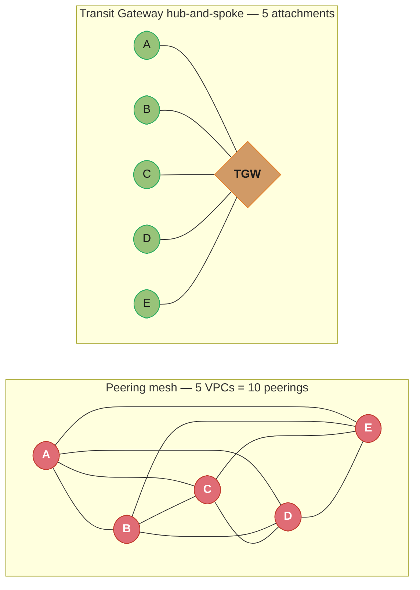
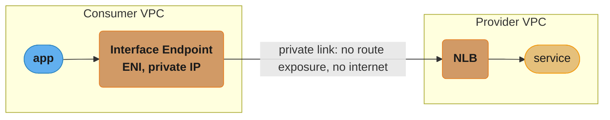
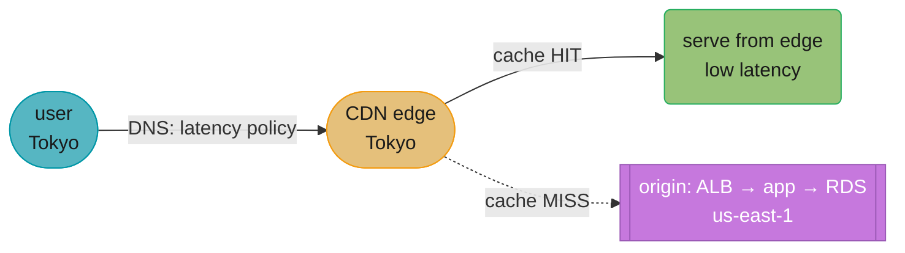
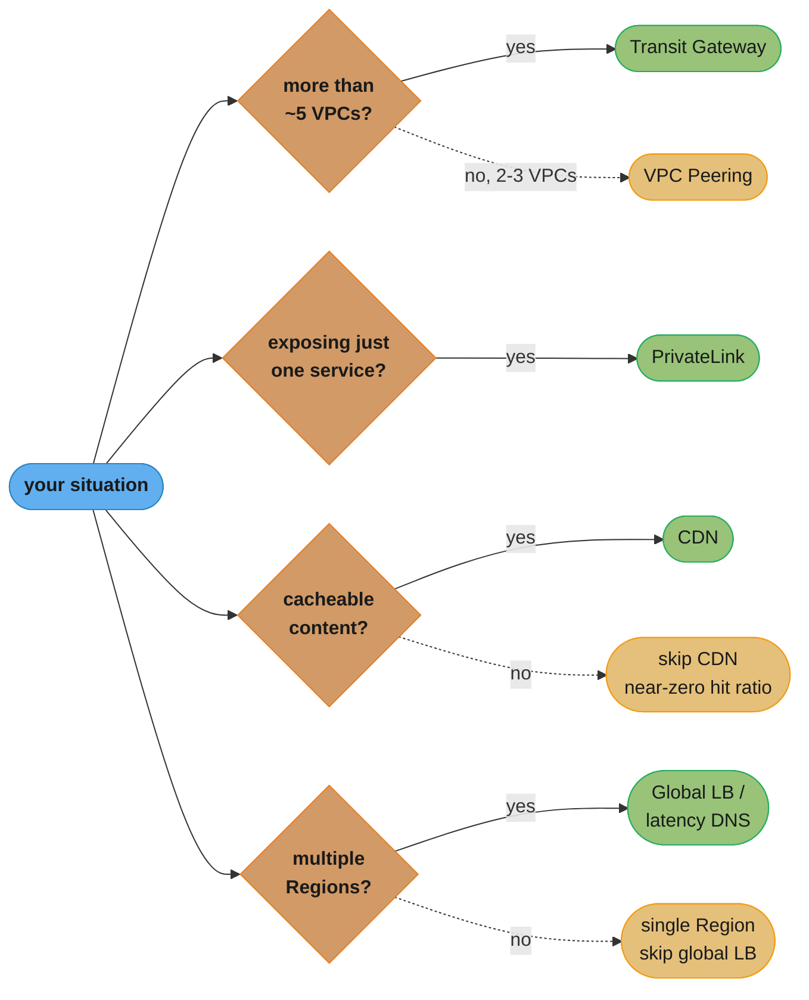
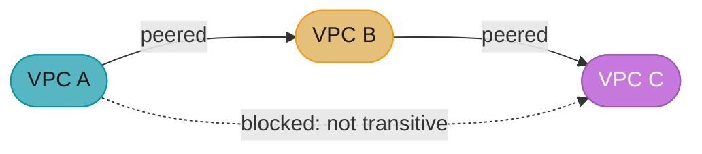

# Cloud Networking & CDN

> Phase 5 — Cloud Platforms · Difficulty: Advanced

Once you have more than one VPC, account, or Region, the central problem becomes connecting them securely and cheaply, and serving content to users worldwide with low latency. This module covers **VPC peering**, **Transit Gateway** (hub-and-spoke), **PrivateLink** (private service access), **CDNs** (CloudFront, Cloudflare), **global load balancing**, and **DNS strategies** (latency/geo/failover routing). The recurring theme: keep traffic private, avoid the public internet where possible, push static and cacheable content to the edge, and route users to the nearest healthy endpoint — all while controlling the data-transfer costs that quietly dominate cloud bills.

---

## 1. Concept Overview

Cloud networking layers on top of the single-VPC basics from [cloud_fundamentals_and_aws](../cloud_fundamentals_and_aws/) and the TCP/IP fundamentals in [networking_for_devops](../networking_for_devops/).

- **VPC peering** — a direct, private, one-to-one connection between two VPCs (same or cross-account/Region). Non-transitive: A-B and B-C does not give A-C. Simple but doesn't scale past a handful of VPCs (full mesh = N(N-1)/2 connections).
- **Transit Gateway (TGW)** — a regional hub that connects many VPCs, VPNs, and Direct Connect in a hub-and-spoke topology, solving the peering mesh explosion. Supports route tables for segmentation. (GCP: Network Connectivity Center; Azure: Virtual WAN.)
- **PrivateLink** — exposes a service in one VPC to consumers in other VPCs/accounts via private IPs (an interface endpoint backed by an NLB), with no peering, no route exposure, and traffic that never touches the public internet. (GCP: Private Service Connect; Azure: Private Link.)
- **CDN (Content Delivery Network)** — a globally distributed cache (CloudFront, Cloudflare, Fastly) that serves content from edge locations near users, offloading the origin and cutting latency. Also provides TLS termination, WAF, DDoS protection, and edge compute.
- **Global load balancing** — routes users to the nearest/healthiest Regional backend, via anycast (Cloudflare, GCP Global LB) or DNS-based (Route 53, AWS Global Accelerator uses anycast IPs).
- **DNS strategies** — Route 53 routing policies (simple, weighted, latency, geolocation, geoproximity, failover, multivalue) decide which endpoint a resolver returns.

---

## 2. Intuition

> **One-line analogy**: Cloud networking is a country's highway system. VPC peering is a private bridge between two towns; a Transit Gateway is the central interchange that connects every town without building a bridge between each pair; PrivateLink is a private delivery dock where a supplier hands you goods without opening a public road; and a CDN is a network of local warehouses so customers pick up nearby instead of driving to the distant factory.

**Mental model**: Think in terms of "how does a packet get from A to B privately, and how does a user reach the nearest copy of my content/service." Connectivity choices trade off mesh complexity (peering) vs centralization (TGW) vs service-level exposure (PrivateLink). Edge choices (CDN, global LB, DNS) trade off latency, cache hit ratio, and failover speed.

**Why it matters**: Networking topology determines security blast radius (who can reach what), latency (how far packets travel), and cost (cross-AZ/Region/internet transfer is billed and often dominates). Get peering vs TGW vs PrivateLink wrong and you either expose too much, build an unmanageable mesh, or pay for unnecessary internet egress. Get CDN/DNS wrong and users get slow, stale, or failed responses.

**Key insight**: **Default to keeping traffic private and close to users.** Use PrivateLink/endpoints instead of internet egress, a hub (TGW) instead of a peering mesh, and a CDN + global routing to terminate connections at the edge. Public internet hops are slower, less secure, and more expensive than private backbone — design them out.

---

## 3. Core Principles

1. **Keep traffic off the public internet** — use PrivateLink, VPC endpoints, peering, or backbone before internet egress.
2. **Hub-and-spoke over full mesh** at scale — Transit Gateway instead of N(N-1)/2 peerings.
3. **Least-exposure connectivity** — PrivateLink exposes a single service, not whole networks.
4. **Cache at the edge** — CDN offloads origin, cuts latency, absorbs DDoS.
5. **Route to the nearest healthy endpoint** — latency/geo routing + health checks + automatic failover.
6. **Mind data-transfer cost** — cross-AZ, cross-Region, and internet egress are billed line items.
7. **Segment with route tables / security groups** — control which spokes can reach which.

---

## 4. Types / Architectures / Strategies

### Connectivity options compared

| Option | Topology | Transitive? | Use case | Scale limit |
|--------|----------|-------------|----------|-------------|
| VPC peering | Point-to-point | No | 2-5 VPCs, simple | Mesh explodes past ~5 |
| Transit Gateway | Hub-and-spoke | Yes (via TGW) | Many VPCs/VPN/DX | Thousands of attachments |
| PrivateLink | Service endpoint | N/A | Expose one service privately | Per-service |
| VPN / Direct Connect | On-prem link | Via TGW | Hybrid connectivity | Bandwidth tiers |

### Cross-cloud connectivity mapping

| Concept | AWS | GCP | Azure |
|---------|-----|-----|-------|
| Peering | VPC Peering | VPC Network Peering | VNet Peering |
| Hub | Transit Gateway | Network Connectivity Center | Virtual WAN |
| Private service | PrivateLink | Private Service Connect | Private Link |
| Global LB | Global Accelerator | Global HTTP(S) LB | Front Door |
| CDN | CloudFront | Cloud CDN | Front Door/CDN |
| DNS | Route 53 | Cloud DNS | Azure DNS / Traffic Manager |

### DNS routing policies (Route 53)

| Policy | Returns | Use case |
|--------|---------|----------|
| Simple | One record | Single endpoint |
| Weighted | Split by weight | A/B, canary, gradual migration |
| Latency | Lowest-latency Region | Global low-latency |
| Geolocation | By user country/continent | Compliance, localization |
| Geoproximity | By geographic distance + bias | Traffic shaping by region |
| Failover | Primary/secondary + health check | Active-passive DR |
| Multivalue | Up to 8 healthy records | Simple client-side LB |

### Global LB approaches

| Approach | How it routes | Failover speed |
|----------|---------------|----------------|
| DNS-based (Route 53 latency/failover) | Resolver gets nearest IP | TTL-bound (seconds-minutes) |
| Anycast (Global Accelerator, Cloudflare, GCP Global LB) | Single IP, BGP routes to nearest edge | Near-instant (no DNS TTL) |

---

## 5. Architecture Diagrams

**Peering mesh vs Transit Gateway hub**



*A 5-VPC mesh needs 10 peering connections (N(N-1)/2); the same 5 VPCs need only 5 attachments through a Transit Gateway hub, and route tables still segment which spokes can reach which.*

**In plain terms.** "Peering cost grows like every VPC shaking hands with every other VPC; a hub costs one handshake per VPC."

That is the whole argument for Transit Gateway compressed into a growth rate: the mesh is quadratic in the number of VPCs, the hub is linear. Everything else — segmentation, transitivity, on-prem attachment — is a bonus on top of a curve that has already decided the outcome.

| Symbol | What it is |
|--------|------------|
| `N` | Number of VPCs you need to connect to each other |
| `N(N-1)` | Ordered pairs — every VPC paired with every other one |
| `/2` | Divide by 2 because A-to-B and B-to-A are one connection, not two |
| `N(N-1)/2` | Peering connections for a full mesh (quadratic growth) |
| `N` (hub) | TGW attachments — one per VPC, no matter how many VPCs exist |

**Walk one example.** Push the VPC counts from this module through both formulas:

```
    VPCs N     full mesh N(N-1)/2      TGW attachments N      mesh / hub
        2          2x1/2 =      1                      2          0.5x
        3          3x2/2 =      3                      3          1.0x
        5          5x4/2 =     10                      5          2.0x
       10         10x9/2 =     45                     10          4.5x
       30        30x29/2 =    435                     30         14.5x
       50        50x49/2 =   1225                     50         24.5x
```

At 2-3 VPCs the mesh is genuinely cheaper, which is why section 9 says "reconsider TGW below ~5 VPCs." At 5 the two are level. Past that the ratio is just `(N-1)/2`, so it never stops widening: the 30-VPC company in the section 14 case study faces 435 peerings against 30 attachments, and the 50-VPC enterprise in section 7 faces 1225. The mesh number is also a *maintenance* number, not just a bill — each of those 435 connections needs a route entry on both sides.

**PrivateLink — consume a service privately, no peering**



*The consumer never joins the provider's network — its Interface Endpoint reaches the provider's NLB over a private connection, with no peering, no route exposure, and no internet hop.*

**Global edge: CDN + global LB + DNS**



*A cache HIT is served straight from the nearest edge, offloading the origin; a cache MISS falls through to the regional origin over the backbone. Global Accelerator's anycast IP steers around a failed Region via BGP withdrawal — near-instant, unlike DNS-TTL-bound failover.*

---

## 6. How It Works — Detailed Mechanics

### VPC peering (Terraform) — note non-transitivity

```hcl
resource "aws_vpc_peering_connection" "a_to_b" {
  vpc_id      = aws_vpc.a.id
  peer_vpc_id = aws_vpc.b.id
  auto_accept = true
}
# You MUST add routes on BOTH sides; peering carries no routes by itself.
resource "aws_route" "a_to_b" {
  route_table_id            = aws_route_table.a.id
  destination_cidr_block    = aws_vpc.b.cidr_block
  vpc_peering_connection_id = aws_vpc_peering_connection.a_to_b.id
}
# A<->B and B<->C does NOT give A<->C. Use TGW for transitive routing.
```

### Transit Gateway hub-and-spoke

```hcl
resource "aws_ec2_transit_gateway" "hub" { description = "central hub" }

resource "aws_ec2_transit_gateway_vpc_attachment" "vpc_a" {
  transit_gateway_id = aws_ec2_transit_gateway.hub.id
  vpc_id             = aws_vpc.a.id
  subnet_ids         = [aws_subnet.a_tgw.id]   # one TGW subnet per AZ
}
# Spokes route to other spokes via the TGW route table:
resource "aws_route" "a_to_all" {
  route_table_id         = aws_route_table.a.id
  destination_cidr_block = "10.0.0.0/8"        # all internal -> TGW
  transit_gateway_id     = aws_ec2_transit_gateway.hub.id
}
```

### PrivateLink endpoint service + consumer endpoint

```hcl
# Provider exposes an NLB-backed service
resource "aws_vpc_endpoint_service" "svc" {
  acceptance_required        = false
  network_load_balancer_arns = [aws_lb.svc_nlb.arn]
}
# Consumer creates a private interface endpoint to it
resource "aws_vpc_endpoint" "consume" {
  vpc_id              = aws_vpc.consumer.id
  service_name        = aws_vpc_endpoint_service.svc.service_name
  vpc_endpoint_type   = "Interface"
  subnet_ids          = [aws_subnet.consumer_a.id]
  security_group_ids  = [aws_security_group.endpoint.id]
  private_dns_enabled = true   # service DNS name resolves to the private ENI IP
}
```

### CloudFront distribution with cache behavior

```hcl
resource "aws_cloudfront_distribution" "cdn" {
  enabled = true
  origin {
    domain_name = aws_lb.origin.dns_name
    origin_id   = "alb"
    custom_origin_config { http_port = 80; https_port = 443; origin_protocol_policy = "https-only"; origin_ssl_protocols = ["TLSv1.2"] }
  }
  default_cache_behavior {
    target_origin_id       = "alb"
    viewer_protocol_policy = "redirect-to-https"
    allowed_methods        = ["GET", "HEAD", "OPTIONS"]
    cached_methods         = ["GET", "HEAD"]
    min_ttl = 0; default_ttl = 86400; max_ttl = 31536000   # 1 day default, 1 year max
    compress = true
  }
  # cache key = which headers/query/cookies matter; over-broad keys destroy hit ratio
  restrictions { geo_restriction { restriction_type = "none" } }
  viewer_certificate { acm_certificate_arn = var.cert_arn; ssl_support_method = "sni-only" }
}
```

### Reading the cache-hit numbers

Two pieces of arithmetic sit underneath every `default_ttl` and cache-key decision above: what fraction of requests the origin still sees, and what the TTL does to that fraction.

```
origin requests = (1 - h) x total requests          where h = cache hit ratio
origin offload  = 1 / (1 - h)                       how many times smaller the origin load is
hit ratio       h = 1 - 1 / (lambda x TTL)          lambda = requests/sec for one object at one edge
```

**What this actually says.** "The origin only sees the misses, and an object only misses once per TTL window per edge — so the more requests that arrive inside one TTL, the closer the hit ratio gets to 1."

The second line is the one people misjudge. Hit ratio feels linear but offload is a reciprocal, so the last few percentage points do almost all the work: going from 90% to 99% does not buy you 10% more, it buys you 10x more.

| Symbol | What it is |
|--------|------------|
| `h` | Cache hit ratio — fraction of requests the edge answers without touching origin |
| `1 - h` | Miss ratio — the fraction that becomes an origin request |
| `1 / (1 - h)` | Origin offload factor: how many edge requests each origin request now covers |
| `lambda` | Request rate for one object at one edge location, per second |
| `TTL` | How long the edge is allowed to reuse the cached copy (`default_ttl`, seconds) |
| `lambda x TTL` | Requests arriving per TTL window — of which exactly one is a miss |

**Walk one example.** A site serving 100M requests/day, at the hit ratios this module names:

```
      h        misses = (1-h) x 100M      origin req/day      offload 1/(1-h)
    0.00        1.00 x 100M                 100,000,000            1x
    0.50        0.50 x 100M                  50,000,000            2x
    0.90        0.10 x 100M                  10,000,000           10x
    0.95        0.05 x 100M                   5,000,000           20x
    0.99        0.01 x 100M                   1,000,000          100x
```

The section 14 team pushed static hit ratio "above 90%", which is the row that takes a saturated origin ALB from 100M to 10M requests/day. Note the top row: pitfall 3's per-user cache key drives `h` toward 0, and at `h = 0` the CDN forwards *every* request — you pay for the edge and still get 1x offload.

**Walk one more.** Now the TTL relation, using this config's `default_ttl = 86400` (1 day) versus the 60s TTL from pitfall 4, for one object at one edge:

```
   lambda (req/s)     TTL (s)     lambda x TTL     h = 1 - 1/(lambda x TTL)
        2.00           86400          172800              99.9994%
        2.00            3600            7200              99.9861%
        2.00              60             120              99.1667%
        0.05              60               3              66.6667%
```

A hot object is insensitive to TTL — at 2 req/s even a 60s TTL still hits 99.17%. A cold object is where TTL decides everything: at 0.05 req/s (one request every 20s), a 60s TTL yields only 3 requests per window, so 1 in 3 is a miss and the hit ratio collapses to 66.67%. This is why long TTLs plus versioned URLs (the section 8 "cache forever" row) matter most for the long tail, not for your homepage.

### Route 53 latency routing + failover

```hcl
resource "aws_route53_record" "us" {
  zone_id = var.zone; name = "app.example.com"; type = "A"
  set_identifier         = "us-east-1"
  latency_routing_policy { region = "us-east-1" }
  health_check_id        = aws_route53_health_check.us.id   # unhealthy -> not returned
  alias { name = aws_lb.us.dns_name; zone_id = aws_lb.us.zone_id; evaluate_target_health = true }
}
# A matching record for eu-west-1; resolvers get the lowest-latency healthy Region.
```

### Cache invalidation

```bash
# Invalidate cached objects after a deploy (first 1000 paths/month free, then ~$0.005/path)
aws cloudfront create-invalidation --distribution-id E123 --paths "/static/*"
# BETTER: version asset URLs (app.a1b2c3.js) so you never invalidate; cache forever
```

**Read it like this.** "The first 1000 invalidation paths each month are free; after that you are billed half a cent per path, every month, forever."

The bill is small per path and large per habit — a team that invalidates on every deploy is buying a recurring cost to undo a caching decision it made on purpose.

| Symbol | What it is |
|--------|------------|
| `paths` | Invalidation paths submitted in a calendar month (`/static/*` counts as one path) |
| `1000` | Free-tier paths per month, reset monthly |
| `$0.005` | Price per path beyond the free tier |
| `max(0, paths - 1000) x 0.005` | The monthly invalidation bill |

**Walk one example.** Four deploy cadences, same formula:

```
   paths/month     billable = max(0, paths - 1000)     cost at $0.005
          500                        0                     $0.00
         1000                        0                     $0.00
         5000                     4000                    $20.00
        20000                    19000                    $95.00
```

Versioned URLs move you permanently into the first two rows: a new content hash is a new object, so there is nothing to invalidate and the cached old copy simply ages out. That is the whole reason section 8's tradeoff table lists "versioned URLs (cache forever)" against "invalidation" — one has a $0 steady state and a higher hit ratio, the other has a monthly line item.

---

## 7. Real-World Examples

- **Netflix Open Connect** places CDN appliances inside ISPs so streams come from within the user's ISP network — extreme edge caching to minimize backbone traffic.
- **Cloudflare** fronts millions of sites with an anycast network: one IP, BGP routes each user to the nearest of 300+ edge locations, terminating TLS, caching, running edge Workers, and absorbing DDoS before traffic reaches origins.
- **A multi-account enterprise** connects 50+ VPCs across teams via a central Transit Gateway with segmented route tables (prod can't reach dev), plus PrivateLink for shared services (a central logging/auth service consumed privately), avoiding a 1225-connection peering mesh.
- **SaaS providers** expose their API to customers' VPCs via PrivateLink so the customer reaches the service over private IPs without internet egress or peering — common for security-conscious B2B (e.g., Snowflake, Datadog).

---

## 8. Tradeoffs

| Decision | Option A | Option B | Key factor |
|----------|----------|----------|-----------|
| Multi-VPC connectivity | Peering (simple) | Transit Gateway (hub) | Few VPCs vs many (mesh explosion) |
| Service exposure | Peering (whole network) | PrivateLink (one service) | Least exposure vs simplicity |
| Global routing | DNS-based (Route 53) | Anycast (Global Accelerator) | TTL-bound failover vs near-instant |
| CDN provider | CloudFront (AWS-native) | Cloudflare/Fastly (multi-origin) | Integration vs flexibility/features |
| Cache strategy | Versioned URLs (cache forever) | Invalidation | Simplicity/hit ratio vs control |
| Egress | NAT/internet | VPC Endpoints/PrivateLink | Cost + security |
| Cache key | Narrow (high hit ratio) | Broad (per-user) | Hit ratio vs correctness |

---

## 9. When to Use / When NOT to Use

**Use Transit Gateway when:** you have more than ~5 VPCs, need transitive routing, connect on-prem (VPN/Direct Connect), or want centralized route segmentation. **Use PrivateLink when:** exposing a single service privately across accounts/VPCs (especially SaaS to customers) without exposing whole networks. **Use a CDN when:** serving static assets, media, or cacheable API responses globally, or you want edge TLS/WAF/DDoS protection. **Use global LB/latency DNS when:** you run multiple Regions and want users routed to the nearest healthy one.

**Reconsider when:** you have only 2-3 VPCs (peering is simpler and cheaper than TGW's per-attachment + per-GB charges); content is fully dynamic and per-user (CDN cache hit ratio will be near zero — though edge TLS/DDoS may still help); a single Region serves your users well (global LB adds complexity for no latency win). Don't add a TGW or CDN reflexively — each has per-hour/per-GB costs.



*These four checks are independent, not mutually exclusive — most platforms end up running Transit Gateway, PrivateLink, a CDN, and global LB together; the dotted branches are the "reconsider" guardrails from the paragraph above.*

---

## 10. Common Pitfalls

**Pitfall 1 — Expecting VPC peering to be transitive.**



*A is peered with B, and B is peered with C, but A still cannot reach C — peering never forwards traffic through an intermediate VPC. Only a Transit Gateway (the hub-and-spoke diagram in section 5) gives every VPC transitive reachability.*

```hcl
# BROKEN: peer A<->B and B<->C, then expect A to reach C through B
resource "aws_vpc_peering_connection" "a_b" { vpc_id = aws_vpc.a.id; peer_vpc_id = aws_vpc.b.id }
resource "aws_vpc_peering_connection" "b_c" { vpc_id = aws_vpc.b.id; peer_vpc_id = aws_vpc.c.id }
# A's packets to C are dropped: peering is NON-transitive, B does not route A->C.
```

```hcl
# FIX: use a Transit Gateway (transitive hub) for many-VPC routing
resource "aws_ec2_transit_gateway" "hub" {}
resource "aws_ec2_transit_gateway_vpc_attachment" "a" { transit_gateway_id = aws_ec2_transit_gateway.hub.id; vpc_id = aws_vpc.a.id; subnet_ids = [aws_subnet.a.id] }
resource "aws_ec2_transit_gateway_vpc_attachment" "b" { transit_gateway_id = aws_ec2_transit_gateway.hub.id; vpc_id = aws_vpc.b.id; subnet_ids = [aws_subnet.b.id] }
resource "aws_ec2_transit_gateway_vpc_attachment" "c" { transit_gateway_id = aws_ec2_transit_gateway.hub.id; vpc_id = aws_vpc.c.id; subnet_ids = [aws_subnet.c.id] }
# Now A, B, C all route to each other via the TGW route table.
```

**Pitfall 2 — Overlapping CIDR ranges.** Two VPCs using `10.0.0.0/16` can't be peered or attached to the same TGW — routing is ambiguous. FIX: plan a non-overlapping IP address scheme (IPAM) up front; you can't renumber a live VPC easily.

**Pitfall 3 — CDN cache key too broad (caching per-user).** Including `Authorization` or all cookies/query strings in the cache key makes every request unique, dropping hit ratio to ~0% and hammering the origin. FIX: cache only on the headers/query params that actually vary the response; strip the rest. Conversely, caching authenticated/personalized responses with a narrow key serves one user's data to another — exclude truly per-user content from caching.

**Pitfall 4 — Long DNS TTL defeats failover.** A 3600s TTL on a failover record means clients keep hitting the dead Region for up to an hour. FIX: use short TTLs (30-60s) on records used for failover, or use anycast (Global Accelerator) for near-instant failover independent of DNS caching.

**What it means.** "Your failover time is not decided by your health check — it is bounded below by the TTL you published to every resolver on the internet."

```
worst-case client blackhole = TTL          (resolver cached the dead IP right before the outage)
average client blackhole    = TTL / 2      (outages land uniformly inside the cached window)
```

| Symbol | What it is |
|--------|------------|
| `TTL` | Seconds a resolver is allowed to reuse the cached answer before re-querying |
| `worst case = TTL` | A resolver that cached one second before the failure waits a full TTL |
| `TTL / 2` | Mean wait across clients, since failures land uniformly in the window |
| anycast | No cached answer to expire — BGP withdraws the route, so the bound disappears |

**Walk one example.** The two TTLs this module uses, on a Region that dies at t = 0:

```
   TTL (s)      worst-case stale      average stale      vs 3600s baseline
      3600          3600s = 60m          1800s = 30m               1x
        60            60s =  1m            30s = 0.5m              60x faster
```

Dropping the TTL from 3600s to 60s is a 60x improvement in the failover bound, which is exactly the "up to an hour" to "under a minute" result in section 14. But note the floor: 60s of blackholed users is still 60s of errors, and no health check anywhere makes it smaller. Anycast is qualitatively different rather than just faster — there is no cached answer to expire, so section 4's "near-instant (no DNS TTL)" is a statement about the formula not applying at all.

---

## 11. Technologies & Tools

| Tool/Service | Purpose |
|--------------|---------|
| VPC Peering | Point-to-point private VPC link |
| Transit Gateway / NCC / Virtual WAN | Hub-and-spoke multi-VPC connectivity |
| PrivateLink / PSC / Private Link | Private single-service exposure |
| CloudFront / Cloudflare / Fastly | CDN, edge TLS/WAF/DDoS, edge compute |
| Global Accelerator | Anycast global routing, near-instant failover |
| Route 53 / Cloud DNS / Traffic Manager | DNS + routing policies + health checks |
| Direct Connect / VPN | Hybrid on-prem connectivity |
| ACM / Let's Encrypt | TLS certificates |
| AWS IPAM | Non-overlapping CIDR planning |

---

## 12. Interview Questions with Answers

**Q1: Why isn't VPC peering transitive, and what do you use instead at scale?**
VPC peering is a direct one-to-one connection that doesn't forward traffic through an intermediate VPC, so peering A-B and B-C does not give A-C — by design, to keep routing explicit and secure. At scale, a full mesh requires N(N-1)/2 peerings (50 VPCs = 1225 connections), which is unmanageable. Use a Transit Gateway, a regional hub that provides transitive routing and centralized route segmentation across many VPCs, VPNs, and Direct Connect links.

**Q2: What is PrivateLink and how does it differ from VPC peering?**
PrivateLink exposes a single service (behind an NLB) to consumer VPCs via interface endpoints with private IPs, without peering networks or sharing route tables — the consumer reaches only that service, never the whole provider VPC. Peering, by contrast, connects entire networks and requires non-overlapping CIDRs and route entries. Use PrivateLink for least-exposure service access (especially SaaS-to-customer), and peering/TGW when you genuinely need network-to-network routing.

**Q3: How does a CDN reduce latency and origin load?**
A CDN caches content at edge locations geographically close to users, so requests are served from the nearest edge instead of traveling to a distant origin, cutting round-trip latency and offloading the origin (a high cache hit ratio means most requests never reach it). It also terminates TLS at the edge, can run edge compute, and absorbs DDoS. The key metric is cache hit ratio — the higher it is, the more latency and origin cost you save.

**Q4: What is a cache key and why does getting it wrong destroy a CDN's value?**
The cache key is the set of attributes (path, plus chosen headers/query strings/cookies) the CDN uses to decide whether a request matches a cached object. If the key is too broad — e.g., including `Authorization` or a unique session cookie — every request looks unique, the hit ratio collapses toward 0%, and traffic floods the origin. If too narrow on personalized content, one user could receive another's cached response, so you must cache only on attributes that genuinely vary the response and exclude per-user data.

**Q5: Compare DNS-based global routing with anycast-based (Global Accelerator).**
DNS-based routing (Route 53 latency/failover policies) returns the nearest/healthy Region's IP to the resolver, but failover is bounded by DNS TTL and resolver caching — clients can keep hitting a dead Region for the TTL duration. Anycast (Global Accelerator, Cloudflare, GCP Global LB) advertises a single static IP and uses BGP to route each user to the nearest healthy edge, so failover is near-instant with no DNS-cache delay. Use anycast when fast, reliable failover and stable IPs matter; DNS routing is simpler and often sufficient.

**Q6: How do you choose between the Route 53 routing policies?**
Use simple for one endpoint; weighted for canary/A-B/gradual migration; latency for routing global users to the lowest-latency Region; geolocation for compliance/localization by country; failover for active-passive DR with health checks; and multivalue for simple health-checked client-side load balancing. The choice follows the goal — performance (latency), compliance (geolocation), resilience (failover), or rollout control (weighted). Pair them with health checks so unhealthy endpoints are removed from responses.

**Q7: Why are overlapping CIDR ranges a problem, and how do you avoid them?**
Two VPCs with overlapping CIDRs (e.g., both `10.0.0.0/16`) can't be peered or share a Transit Gateway because the router can't unambiguously decide where a given IP lives. You avoid it by planning a non-overlapping address scheme up front — typically with an IPAM tool that allocates distinct ranges per VPC/account/Region — because renumbering a live, in-use VPC is disruptive. Treat IP planning as a foundational design step, not an afterthought.

**Q8: How do you keep data-transfer costs under control in a multi-VPC/multi-Region setup?**
Keep traffic in-AZ and in-Region where possible (cross-AZ and especially cross-Region/internet transfer are billed), use VPC Gateway Endpoints for S3/DynamoDB (free) and PrivateLink instead of internet egress, and front user traffic with a CDN to offload origin egress. Be aware that Transit Gateway charges per attachment-hour plus per-GB processed, so for just two VPCs, peering (no per-GB TGW fee within a Region) can be cheaper. Use Cost Explorer to find the largest transfer line items — see [cloud_cost_optimization_finops](../cloud_cost_optimization_finops/).

**Q9: How do you handle cache invalidation after a deploy?**
The cleanest approach is to avoid invalidation entirely by versioning asset URLs (e.g., `app.a1b2c3.js`) so a deploy produces new URLs and old cached objects simply age out — you can then cache assets for a year. When you must invalidate (e.g., a fixed path like `/index.html`), issue a CDN invalidation, but it's slower and, beyond the free tier, costs per path (~$0.005 on CloudFront). Prefer content-hashed filenames for static assets and short TTLs only for genuinely dynamic content.

**Q10: When should you NOT put a CDN in front of your service?**
When the content is fully dynamic and per-user (e.g., a personalized authenticated dashboard), the cache hit ratio approaches zero, so the CDN adds a hop and cost without latency savings on the cacheable dimension — though it may still be worth it for edge TLS termination, DDoS protection, and a single global entry point. For purely internal services not exposed to end users, a CDN is irrelevant. Evaluate based on cacheability and whether you need the edge security/DDoS benefits, not as a reflex.

**Q11: What is a Transit Gateway route table used for?**
A TGW route table controls which attachments (VPCs/VPNs) can route to which others, enabling network segmentation — for example, allowing prod spokes to reach a shared-services spoke but not each other, or isolating dev from prod. You associate attachments with route tables and propagate routes selectively, so the hub doesn't become a flat any-to-any network. This is how you enforce blast-radius boundaries in a hub-and-spoke topology.

**Q12: How does global load balancing interact with health checks for failover?**
Both DNS-based and anycast global LBs continuously health-check each Regional backend and stop directing traffic to one that fails — Route 53 removes the unhealthy record from responses (subject to TTL), while anycast withdraws the BGP route from the failed edge/Region almost immediately. This automatic, health-driven steering is what turns multi-Region deployments into active-passive or active-active DR. Tune TTLs short for DNS-based failover, or use anycast when you need failover faster than DNS caching allows — see [disaster_recovery_and_resilience](../disaster_recovery_and_resilience/).

**Q13: What is the difference between a Gateway VPC endpoint and an Interface VPC endpoint (PrivateLink)?**
A Gateway endpoint is a free VPC route-table entry limited to S3 and DynamoDB; an Interface endpoint is a billed, ENI-backed PrivateLink connection to nearly everything else. Gateway endpoints add a prefix-list route to your subnet's route table — no ENI, no security group, no per-GB charge — making them the default fix for NAT-gateway cost on S3/DynamoDB traffic. Interface endpoints consume an ENI per subnet/AZ, can be locked down with security groups, and are what backs the custom-service PrivateLink pattern in section 4. Default to the gateway endpoint whenever only S3/DynamoDB access is the goal, since it is strictly cheaper.

**Q14: In the case study, why did multi-hop traffic across the peering mesh fail 'silently' instead of raising a clear error?**
Non-transitive peering doesn't route or reject cross-hop traffic explicitly — packets from A destined for C are simply dropped because no route exists via B, producing a timeout rather than an error message. This looks identical to a firewall block, a dead target, or ordinary packet loss, so engineers often chase the wrong hypothesis before realizing the topology itself cannot forward the packet. The case study's fix was structural, not diagnostic: replacing the 30-VPC mesh with a Transit Gateway hub so every VPC could reach every other VPC by design. Treat an unexplained cross-VPC timeout as a topology question first — trace the actual peering/TGW attachments before chasing application-level causes.

**Q15: Besides caching, what other capabilities does a CDN edge provide, and when do they matter even if cache hit ratio is low?**
A CDN edge also terminates TLS, absorbs DDoS traffic, runs a WAF, and can execute edge compute such as Cloudflare Workers close to the user. These matter even for fully dynamic, near-zero-hit-ratio traffic, since offloading TLS handshakes and filtering malicious requests at 300+ edge locations protects the origin regardless of whether content is cacheable. Netflix Open Connect goes further, placing CDN appliances inside ISP networks so streams barely cross the public backbone at all. Evaluate a CDN on its security and edge-compute value, not cache hit ratio alone, before ruling it out for personalized traffic.

**Q16: How do AWS's Transit Gateway and PrivateLink map onto GCP and Azure?**
AWS Transit Gateway maps to GCP Network Connectivity Center and Azure Virtual WAN; AWS PrivateLink maps to GCP Private Service Connect and Azure Private Link. Both hub concepts solve the same peering-mesh-explosion problem, and both private-service concepts expose a single service without network-level peering. All three clouds also mirror CloudFront and Route 53 with their own CDN and DNS-routing offerings — GCP Cloud CDN/Cloud DNS and Azure Front Door/Traffic Manager. Recognize the pattern behind the product name so you can translate an AWS-centric design onto another cloud without re-deriving the concepts from scratch.

---

## 13. Best Practices

- **Plan non-overlapping CIDRs** with IPAM before creating VPCs.
- **Use Transit Gateway** (not a peering mesh) past ~5 VPCs; segment with TGW route tables.
- **Expose services with PrivateLink** for least exposure across accounts/customers.
- **Keep traffic private**: VPC endpoints/PrivateLink over internet egress to cut cost and risk.
- **Front user traffic with a CDN**; version asset URLs to cache forever and avoid invalidations.
- **Tune cache keys narrowly** for high hit ratio; never cache per-user data on a shared key.
- **Use short TTLs (30-60s) for failover DNS**, or anycast for near-instant failover.
- **Pair global routing with health checks** for automatic multi-Region failover.

---

## 14. Case Study

### Scenario: A growing platform drowns in a peering mesh and pays for stale, uncached global traffic

A company grew from 3 to 30 VPCs across teams, connecting them with VPC peering. New connections required updating routes on both sides of dozens of peerings, and a request that needed to traverse two hops just failed silently (peering is non-transitive). Meanwhile, global users complained of slow page loads, and the origin ALB was saturated because every static asset request traveled to us-east-1 — with no CDN. DNS used a 3600s TTL, so a Regional outage kept users hitting the dead Region for an hour.

```text
BROKEN:
  - 30 VPCs in a peering mesh (would need 435 peerings for full connectivity)
  - non-transitive routing -> multi-hop traffic silently dropped
  - no CDN -> all global static traffic hits us-east-1 ALB; origin saturated
  - DNS TTL 3600s -> failover takes up to an hour
```

```hcl
# FIX 1: replace the mesh with a Transit Gateway hub + segmented route tables
resource "aws_ec2_transit_gateway" "hub" {}
# each VPC attaches once; prod/dev/shared segmented via TGW route tables

# FIX 2: put CloudFront in front; version assets so they cache for a year
resource "aws_cloudfront_distribution" "cdn" {
  origin { domain_name = aws_lb.origin.dns_name; origin_id = "alb"
           custom_origin_config { http_port = 80; https_port = 443; origin_protocol_policy = "https-only"; origin_ssl_protocols = ["TLSv1.2"] } }
  default_cache_behavior {
    target_origin_id = "alb"; viewer_protocol_policy = "redirect-to-https"
    allowed_methods = ["GET","HEAD","OPTIONS"]; cached_methods = ["GET","HEAD"]
    default_ttl = 86400; max_ttl = 31536000; compress = true   # versioned URLs -> cache 1yr
  }
}

# FIX 3: short TTL + health-checked failover (or Global Accelerator for instant failover)
resource "aws_route53_record" "app" {
  zone_id = var.zone; name = "app.example.com"; type = "A"; ttl = 60
  set_identifier = "primary"; failover_routing_policy { type = "PRIMARY" }
  health_check_id = aws_route53_health_check.primary.id
}
```

The team replaced the unmanageable mesh with a single Transit Gateway: each VPC attaches once, and TGW route tables segment prod from dev while allowing access to shared services — onboarding a new VPC became one attachment, and transitive routing "just worked." CloudFront fronted the app with content-hashed asset URLs, pushing the static cache hit ratio above 90% and slashing origin load and global latency. DNS TTL dropped to 60s with health-checked failover (later upgraded to Global Accelerator for near-instant failover).

**Outcome:** connectivity went from 435 hypothetical peerings to 30 TGW attachments with clean segmentation, global page-load latency dropped sharply as the CDN served most requests from the edge, the origin ALB was no longer saturated, and Regional failover went from up to an hour to under a minute. The lessons: **hub-and-spoke beats a mesh at scale, the edge beats the origin for cacheable content, and failover speed is bounded by your DNS TTL unless you use anycast.**

**Discussion questions:**
1. Why does a peering mesh become unmanageable, and how does a Transit Gateway change the math?
2. How did versioned asset URLs let the team cache aggressively without stale-content risk?
3. When would you choose Global Accelerator (anycast) over short-TTL DNS failover, and what does each cost?

---

**Cross-references:** [cloud_fundamentals_and_aws](../cloud_fundamentals_and_aws/) (VPC, subnets, ELB, Route 53 basics), [networking_for_devops](../networking_for_devops/) (TCP/IP, DNS, BGP fundamentals), [gcp_and_azure_essentials](../gcp_and_azure_essentials/) (PSC, Virtual WAN, Front Door equivalents), [cloud_cost_optimization_finops](../cloud_cost_optimization_finops/) (data-transfer/egress cost), [disaster_recovery_and_resilience](../disaster_recovery_and_resilience/) (multi-Region failover), [serverless_and_faas](../serverless_and_faas/) (API Gateway/edge), [../../hld/](../../hld/) (CDN and global load-balancing concepts).
