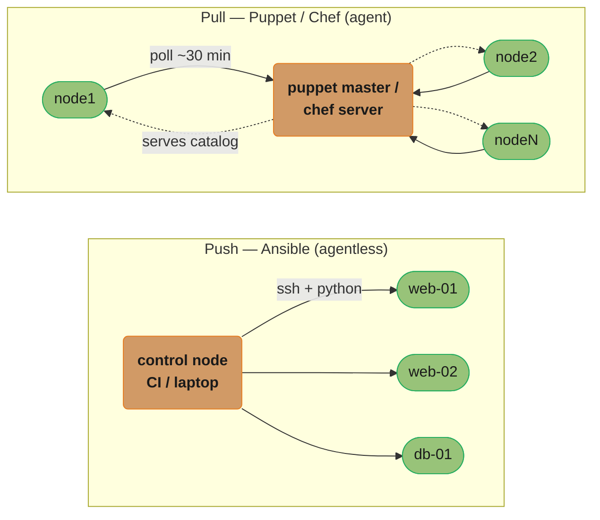
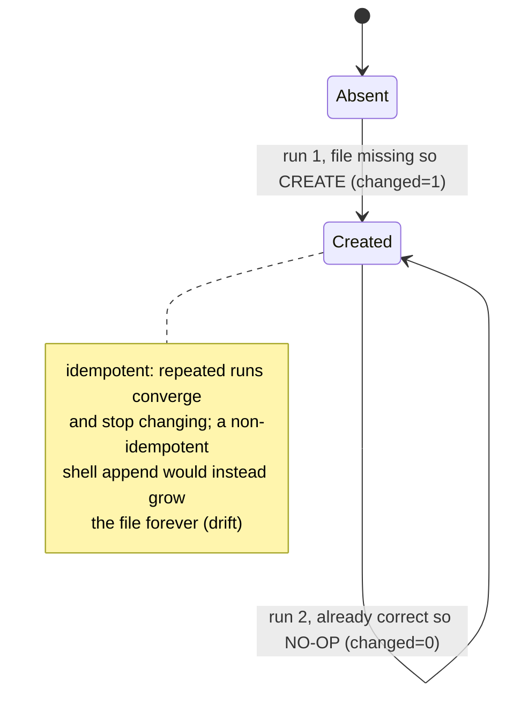
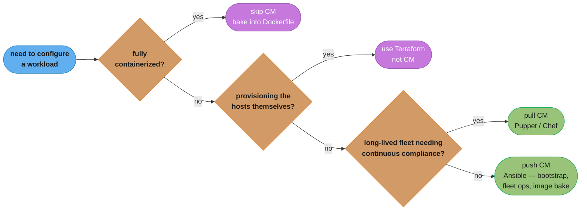
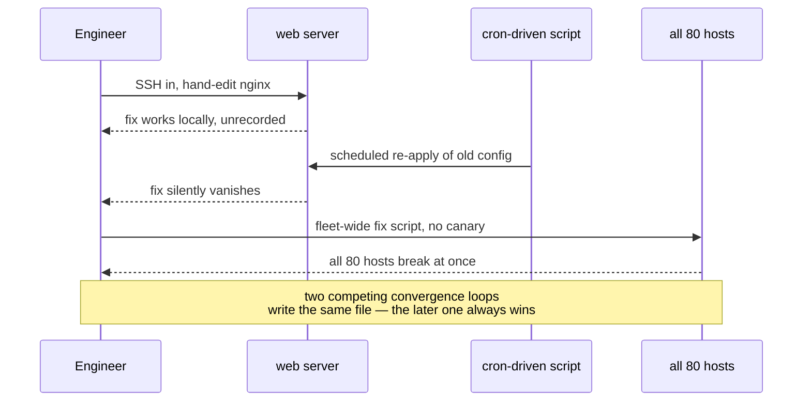

# Configuration Management

> Phase 4 — Infrastructure as Code & Config · Difficulty: Intermediate

Where [infrastructure_as_code_terraform](../infrastructure_as_code_terraform/) provisions the *boxes* (VMs, networks, load balancers), configuration management decides **what goes inside them** — packages, files, services, users, kernel settings — and keeps that state correct over time. Tools like **Ansible, Chef, Puppet, and SaltStack** declare the desired in-host state and converge each machine to it **idempotently**: run the same playbook twice and the second run changes nothing. The modern counter-philosophy is **immutable infrastructure** — don't reconfigure a running server, bake a golden image with **Packer** and replace the server entirely.

---

## 1. Concept Overview

Configuration management (CM) automates the in-host layer that provisioning leaves blank. Its model:

1. **Declare desired state** — "nginx 1.24 installed, `/etc/nginx/nginx.conf` from this template, service running and enabled."
2. **Converge** — the CM tool inspects the host, computes the gap, and applies only the missing changes.
3. **Idempotency** — re-running converges to the same state and reports zero changes; this is the defining property.

Two axes separate the tools:

- **Push vs pull.** **Ansible** is *push* (a control node SSHes out and runs tasks; agentless). **Puppet/Chef/Salt** are classically *pull* (an agent on each node periodically fetches its catalog/recipes from a master and self-converges), though Salt and Chef also support push-style runs.
- **Mutable vs immutable.** Classic CM *mutates* long-lived servers in place. Immutable infrastructure says servers are disposable: **Packer** bakes a versioned machine image (AMI) with everything pre-installed, and you deploy by launching new instances and terminating old ones — no in-place drift possible.

The big shift over the last decade: CM moved from "carefully tend pet servers" toward "bake an image, replace the cattle." Packer-baked AMIs deployed via [infrastructure_as_code_terraform](../infrastructure_as_code_terraform/) auto-scaling groups, plus container images (see [containers_and_docker](../containers_and_docker/)), have absorbed much of what Puppet/Chef once did — but CM is still essential for image-baking steps, bootstrap, on-prem fleets, and compliance enforcement.

---

## 2. Intuition

> **One-line analogy**: Mutable configuration management is a live-in handyman who keeps fixing the same house — patching, repainting, swapping fixtures — and over years no two houses on the street are alike. Immutable infrastructure is a factory that stamps out identical prefab houses; when one needs a change, you don't renovate it, you ship a new model and demolish the old.

**Mental model**: A CM tool is a convergence loop: read actual host state, diff against declared state, apply the delta, and ideally do nothing on the next run. Idempotency means the operation is "ensure X is true," not "do X" — `package: present` not `apt-get install`. Immutable infra removes the loop entirely: state is frozen at image-build time, and "change" means "build a new image and replace."

**Why it matters**: Hand-tended servers drift into snowflakes — each subtly different, none reproducible, debuggable only by the one engineer who built it. CM makes host state declarative, reviewable, and reproducible. Immutable infra goes further: it makes drift *impossible* during the server's life and turns rollback into "launch the previous image."

**Key insight**: **Idempotency is what makes automation safe to re-run, and immutability is what makes drift impossible.** A non-idempotent script appends a line every run until the file is corrupt; an idempotent task ensures the line exists exactly once. The strongest position is to use idempotent CM tooling to *build immutable images*, getting both properties at once.

---

## 3. Core Principles

1. **Declarative desired state** — describe what the host should be, not the commands to get there.
2. **Idempotency** — re-running converges and reports no changes; "ensure," never "append/do."
3. **Convergence** — apply only the gap between actual and desired; report what changed.
4. **Push vs pull** — choose by agent tolerance and scale (agentless push vs agent pull).
5. **Immutable over mutable** — prefer baking and replacing over reconfiguring long-lived hosts.
6. **Versioned and reviewed** — playbooks/recipes/manifests live in Git, reviewed like application code.
7. **Test before fleet rollout** — lint, dry-run (`--check`), and stage on a canary before all nodes.

---

## 4. Types / Architectures / Strategies

### The four classic CM tools

| Tool | Language | Model | Agent | Order semantics |
|------|----------|-------|-------|-----------------|
| Ansible | YAML (playbooks) + Python | Push (SSH) | Agentless | Procedural (top-to-bottom tasks) |
| Puppet | Puppet DSL (Ruby-like) | Pull (agent ↔ master) | Agent | Declarative (graph; explicit deps) |
| Chef | Ruby (recipes/cookbooks) | Pull (agent ↔ server) | Agent | Procedural (resource order) |
| SaltStack | YAML + Jinja (states) | Push or pull (ZeroMQ) | Agent (minion) or agentless | Declarative (with `require`/`order`) |

### Push vs pull

| Aspect | Push (Ansible) | Pull (Puppet/Chef) |
|--------|----------------|--------------------|
| Trigger | Operator/CI runs from control node | Agent polls master on interval (e.g., every 30 min) |
| Agent on node | None (SSH + Python) | Yes (puppet-agent / chef-client) |
| New node onboarding | Add to inventory | Node checks in, master assigns catalog |
| Scale ceiling | SSH fan-out (use forks/AWX) | Master scales to thousands of agents |
| Continuous drift correction | Only when re-run | Automatic each interval |

### Mutable vs immutable infrastructure

| Aspect | Mutable (in-place CM) | Immutable (bake + replace) |
|--------|----------------------|----------------------------|
| Change method | Re-converge running host | Build new image, launch new instance |
| Drift | Possible between runs | Impossible during instance life |
| Rollback | Re-run old config (slow, risky) | Launch previous image (fast, clean) |
| Boot time | Fast (host exists) | Slower (provision new instance) |
| Debuggability | Snowflake risk | Identical, reproducible |
| Tooling | Ansible/Puppet/Chef/Salt | Packer + Terraform + ASG/containers |

---

## 5. Architecture Diagrams

**Push model (Ansible) vs. pull model (Puppet / Chef)**



Ansible's control node runs tasks over SSH the moment it is invoked and needs no agent on the targets; Puppet/Chef instead run an agent on every node that polls its master roughly every 30 minutes and self-converges, which is what gives pull mode continuous drift correction between explicit runs.

**Immutable pipeline (the modern default)**


Packer bakes a versioned, immutable AMI using the same Ansible playbook as a provisioner; Terraform then rolls that AMI through an Auto Scaling Group, so a "patch" is always a new AMI replacing instances wholesale, never an SSH-and-edit on a live host.

**Idempotency (the defining property)**



The first run finds `/etc/app.conf` absent and creates it (`changed=1`); every run after that finds it already correct and reports `changed=0` — the exact property a raw `echo line >> file` would violate by appending on every single run.

**Choosing where configuration management fits**



This operationalizes Section 9's guidance into a single path: containerized workloads skip CM entirely (the image is the config), provisioning the boxes themselves is Terraform's job, long-lived fleets needing continuous drift correction want pull-mode Puppet/Chef, and everything else — bootstrap, fleet-wide ops, image-baking — defaults to push-mode Ansible.

---

## 6. How It Works — Detailed Mechanics

### Ansible playbook (push, agentless, idempotent)

```yaml
# site.yml -- run with: ansible-playbook -i inventory site.yml --check (dry run) then for real
- name: Configure web tier
  hosts: web
  become: true                       # sudo
  vars:
    nginx_version: "1.24.*"
  tasks:
    - name: Install nginx               # idempotent: "ensure present", not "apt-get install"
      ansible.builtin.apt:
        name: "nginx={{ nginx_version }}"
        state: present
        update_cache: true

    - name: Template the config         # only writes if rendered content differs
      ansible.builtin.template:
        src: nginx.conf.j2
        dest: /etc/nginx/nginx.conf
        mode: "0644"
      notify: reload nginx              # handler fires ONLY when this task changes

    - name: Ensure nginx running and enabled at boot
      ansible.builtin.service:
        name: nginx
        state: started
        enabled: true

  handlers:
    - name: reload nginx                # runs once at end, only if notified
      ansible.builtin.service: { name: nginx, state: reloaded }
```

```ini
# inventory
[web]
web-01.prod.internal
web-02.prod.internal
```

### Puppet manifest (pull, declarative graph)

```puppet
# nginx.pp -- agent fetches this catalog from master and self-converges
class profile::nginx {
  package { 'nginx': ensure => '1.24.0-1' }

  file { '/etc/nginx/nginx.conf':
    ensure  => file,
    content => template('profile/nginx.conf.erb'),
    require => Package['nginx'],          # explicit dependency edge in the graph
    notify  => Service['nginx'],          # refresh service when file changes
  }

  service { 'nginx':
    ensure => running,
    enable => true,
  }
}
```

### Packer — bake an immutable image (using Ansible as provisioner)

```hcl
# web.pkr.hcl -- packer build web.pkr.hcl  -> produces a versioned AMI
source "amazon-ebs" "web" {
  region        = "us-east-1"
  instance_type = "t3.medium"
  source_ami    = "ami-0base"          # clean base
  ami_name      = "web-{{timestamp}}"  # versioned, immutable artifact
  ssh_username  = "ubuntu"
}

build {
  sources = ["source.amazon-ebs.web"]
  provisioner "ansible" {              # reuse the SAME Ansible playbook to bake the image
    playbook_file = "./site.yml"
  }
  provisioner "shell" {
    inline = ["sudo apt-get clean", "sudo cloud-init clean"]   # shrink + reset for reuse
  }
}
```

```hcl
# Terraform consumes the baked AMI -> immutable deploy via ASG
data "aws_ami" "web" {
  most_recent = true
  owners      = ["self"]
  filter { name = "name", values = ["web-*"] }   # latest baked image
}
# launch template uses data.aws_ami.web.id; a new AMI rolls the ASG, replacing instances
```

### Dry-run and convergence checking

```bash
ansible-playbook -i inventory site.yml --check --diff   # show changes WITHOUT applying
puppet agent --test --noop                              # Puppet dry-run
ansible-lint site.yml                                   # catch non-idempotent patterns
molecule test                                           # test an Ansible role in a container
```

---

## 7. Real-World Examples

- **Packer + Ansible golden images at scale**: Netflix popularized "immutable AMIs" — bake everything with their Aminator/Packer pipeline, deploy via auto-scaling groups, never SSH to fix. A "patch" is a new image and a rolling ASG replacement.
- **Ansible for orchestration and bootstrap**: agentless push fits CI-driven runs and one-off fleet tasks (rotate a cert across 200 hosts, apply a CVE patch) without installing agents.
- **Puppet/Chef for large pull fleets**: enterprises with thousands of long-lived servers use agents polling a master every ~30 minutes for continuous drift correction and compliance enforcement.
- **SaltStack for high fan-out**: its ZeroMQ transport pushes commands to tens of thousands of minions in seconds, used for real-time fleet operations.
- **CM inside container builds**: some teams run Ansible during `docker build` to assemble images, then ship immutable containers (see [containers_and_docker](../containers_and_docker/)).

---

## 8. Tradeoffs

| Decision | Option A | Option B | Key factor |
|----------|----------|----------|-----------|
| Model | Push (Ansible, agentless) | Pull (Puppet/Chef, agent) | Simplicity/onboarding vs continuous drift correction |
| Philosophy | Mutable in-place CM | Immutable bake + replace | Boot speed/simplicity vs no-drift + clean rollback |
| Language | YAML (Ansible/Salt) | Ruby DSL (Chef/Puppet) | Readability vs expressiveness |
| Ordering | Procedural (Ansible/Chef) | Declarative graph (Puppet) | Predictable order vs auto-dependency resolution |
| Scale path | SSH fan-out + AWX | Agent + master | Operational overhead vs master maintenance |
| Where CM runs | On live hosts | At image-bake time (Packer) | Continuous control vs immutability |

---

## 9. When to Use / When NOT to Use

**Use configuration management when:** you must configure the inside of hosts (packages, files, services, users, hardening), bake golden images (Ansible/Chef as a Packer provisioner), run fleet-wide operational tasks (cert rotation, CVE patching), or enforce continuous compliance on long-lived servers (pull-mode Puppet/Chef). Ansible is the pragmatic default for push/bootstrap; Puppet/Chef for large always-on fleets needing drift correction.

**Reconsider when:** you're running everything in containers — the image *is* the configuration, so build it with a Dockerfile and skip in-host CM (see [containers_and_docker](../containers_and_docker/)). For provisioning cloud resources (the boxes themselves), use Terraform, not CM. If you can adopt immutable infrastructure, prefer baking images over maintaining mutable-host playbooks — it eliminates drift. And don't use CM to manage secrets in plaintext; integrate [secrets_management](../secrets_management/).

---

## 10. Common Pitfalls

**Pitfall 1 — Non-idempotent tasks that drift on every run.**

```yaml
# BROKEN: shell append runs every time -> the line is duplicated on each converge.
- name: Add app to PATH
  ansible.builtin.shell: echo 'export PATH=$PATH:/opt/app/bin' >> /etc/profile.d/app.sh
  # run 3 times -> three identical export lines; the file grows unbounded and may break login.
```

```yaml
# FIX: use an idempotent module that ensures the line exists exactly once.
- name: Add app to PATH
  ansible.builtin.lineinfile:
    path: /etc/profile.d/app.sh
    line: 'export PATH=$PATH:/opt/app/bin'
    create: true
    state: present        # converges to exactly one matching line; re-runs report changed=0
```

**Pitfall 2 — Mutable servers drift into snowflakes.** Years of one-off SSH fixes leave each host subtly unique; nobody can reproduce a server, and an outage is undebuggable. FIX: move to immutable infrastructure — bake the host with Packer (provisioned by your playbook), deploy via an auto-scaling group, and forbid SSH-and-edit; "fixes" become new images.

**Pitfall 3 — `--check` lies for shell/command tasks.** A playbook reported "no changes" in check mode but broke production, because `command`/`shell` tasks can't be accurately simulated. FIX: prefer real modules over `shell`, mark unavoidable commands with `changed_when`/`check_mode`, and stage on a canary host before the whole fleet.

**Pitfall 4 — Plaintext secrets in playbooks/recipes committed to Git.** A database password sits in a `vars.yml` in the repo. FIX: use Ansible Vault for encryption at rest and, better, pull secrets at runtime from Vault/Secrets Manager via lookups (see [secrets_management](../secrets_management/)) so the secret of record lives outside the CM repo.

**Pitfall 5 — Big-bang fleet runs with no canary.** A bad config templated to all 500 hosts at once takes the whole tier down. FIX: use rolling execution (`serial: 10%` in Ansible) and run on a canary group first, gating the rest on its health.

---

## 11. Technologies & Tools

| Tool | Purpose |
|------|---------|
| Ansible | Agentless push CM/orchestration (YAML playbooks) |
| Ansible AWX / Tower | Web UI, scheduling, RBAC, scale for Ansible |
| Puppet | Agent/pull declarative CM (Puppet DSL) |
| Chef | Agent/pull procedural CM (Ruby cookbooks) |
| SaltStack | High-fan-out push/pull CM (YAML + Jinja) |
| Packer | Bake versioned, immutable machine images |
| Ansible Vault | Encrypt secrets in playbooks at rest |
| ansible-lint | Catch non-idempotent / anti-pattern tasks |
| Molecule | Test Ansible roles in containers |
| Test Kitchen / InSpec | Test + compliance-verify Chef/Puppet output |
| cloud-init | First-boot bootstrap on cloud instances |

---

## 12. Interview Questions with Answers

**Q1: What is idempotency in configuration management and why does it matter?**
Idempotency means applying the same configuration repeatedly produces the same end state, with runs after the first reporting zero changes. It matters because CM tools re-run constantly (on a schedule or every deploy), and a non-idempotent task — like `echo line >> file` — would corrupt state by appending every run. You achieve it by declaring desired state ("ensure the package is present," "ensure the line exists once") instead of issuing imperative commands, which is exactly what modules like `apt`, `template`, and `lineinfile` provide.

**Q2: Push vs pull configuration management — explain the difference and a use case for each.**
In push (Ansible), a control node connects out over SSH and runs tasks on demand, with no agent on the targets — ideal for orchestration, bootstrap, and CI-driven runs where you want to trigger changes explicitly. In pull (Puppet/Chef), an agent on each node polls a master on an interval (e.g., every 30 minutes) and self-converges, which gives continuous drift correction across large always-on fleets. Push is simpler to start (agentless) and great for ad-hoc fleet tasks; pull scales to thousands of long-lived nodes that must stay continuously compliant.

**Q3: What is immutable infrastructure and how does it relate to configuration management?**
Immutable infrastructure treats servers as disposable: instead of reconfiguring a running host, you bake a versioned image (with Packer) containing everything pre-installed and deploy by launching new instances and terminating old ones. It relates to CM because you typically use a CM tool (Ansible/Chef) as the *provisioner during image build*, getting idempotent assembly plus the immutability guarantee. The payoff is that drift becomes impossible during an instance's life and rollback is just relaunching the previous image, rather than re-running old config on a mutated host.

**Q4: How does Packer fit into the IaC and CM ecosystem?**
Packer builds golden machine images (AMIs, VM images, container images) by booting a base, running provisioners (shell, Ansible, Chef), and snapshotting the result into a versioned, immutable artifact. It sits between CM and provisioning: CM tooling provisions the image, and Terraform then references that AMI to launch instances or auto-scaling groups. This pipeline — Packer bakes, Terraform deploys, ASG replaces — is the canonical immutable-infrastructure workflow.

**Q5: Ansible vs Puppet vs Chef vs Salt — how do you choose?**
Ansible (YAML, agentless push) is the pragmatic default for orchestration, bootstrap, and image-baking with the gentlest learning curve; Puppet (declarative DSL, agent pull) suits large fleets needing continuous compliance via a dependency graph; Chef (Ruby, agent pull) gives maximum programmability for complex procedural logic; Salt (YAML+Jinja, ZeroMQ) excels at very high fan-out real-time fleet operations. Choose by team language comfort, scale, and whether you need continuous pull-based drift correction or on-demand push. Most greenfield teams start with Ansible and adopt immutable images over time.

**Q6: How do you handle secrets in configuration management?**
Never commit plaintext secrets in playbooks or recipes; at minimum encrypt them at rest (Ansible Vault, `chef-vault`, Hiera eyaml), and better, fetch them at runtime from a dedicated store like HashiCorp Vault or AWS Secrets Manager via lookups so the secret of record lives outside the CM repo. This keeps Git free of credentials and lets you rotate centrally. Combine with least-privilege access on the CM control node — see [secrets_management](../secrets_management/).

**Q7: What's the difference between procedural and declarative configuration management?**
Procedural tools (Ansible, Chef) execute tasks/resources in the order written, so you control sequencing explicitly; declarative tools (Puppet, Salt states) build a dependency graph from `require`/`notify` relationships and resolve ordering automatically. Declarative is more robust to refactoring (it figures out order) but less obvious to read; procedural is predictable but you must order dependencies yourself. In practice both can be idempotent — the procedural/declarative distinction is about *ordering*, not about whether re-runs are safe.

**Q8: How do you safely roll out a configuration change across a large fleet?**
Test it first: lint (`ansible-lint`), dry-run (`--check --diff` or `--noop`), and verify a role in isolation (Molecule/Test Kitchen). Then roll it out gradually — a canary host or small percentage first, with health checks gating the rest (Ansible `serial: 10%`) — rather than a big-bang run that can take the whole tier down at once. Watch metrics between batches and have a rollback path (re-converge prior config, or relaunch the prior image under immutable infra).

**Q9: Why is "mutable server drift into snowflakes" a problem, and how do you prevent it?**
Long-lived hosts patched by ad-hoc SSH commands accumulate undocumented differences, so no two servers are identical, none can be reproduced, and incidents are debuggable only by whoever made the last change. You prevent it by enforcing that all changes flow through reviewed, idempotent CM in Git (so the host is reproducible from code) and, more strongly, by adopting immutable infrastructure where SSH-and-edit is forbidden and changes ship as new images. The goal is "cattle, not pets."

**Q10: When would you skip configuration management entirely?**
When you run everything in containers, the container image *is* the configuration — you build it with a Dockerfile and deploy immutable images, so in-host CM is redundant (see [containers_and_docker](../containers_and_docker/)). You also skip CM for provisioning the infrastructure itself (that's Terraform's job) and for fully managed/serverless platforms where there's no host to configure. CM remains valuable for image-baking provisioners, on-prem fleets, bootstrap, and compliance enforcement on long-lived VMs.

**Q11: End-to-end, what happens when a Puppet agent "pulls" its configuration?**
The agent gathers local facts (OS, hostname, IP, custom facts), sends them to the Puppet master, and the master compiles a node-specific catalog from the manifests using those facts. The agent then applies that catalog locally — creating, modifying, or leaving alone each resource depending on current state — and reports the result (changed, unchanged, or failed per resource) back to the master, which is what populates compliance dashboards. This whole cycle repeats on the polling interval (commonly around every 30 minutes), so "pull" really means the agent drives both the fetch and the apply; the master only ever compiles and serves, it never reaches out and pushes anything itself. Contrast this with Ansible, where the control node does the compiling (rendering the playbook) and the applying (running tasks over SSH) in one pass, with nothing agent-side at all.

**Q12: How can two independent, correctly-idempotent processes still fight over the same config file?**
Idempotency only guarantees a single process converges to its own desired state — it says nothing about two different processes that each believe they own the same file. A manual SSH hot-fix and a cron-driven CM re-apply are each internally consistent, but they disagree about what the file should contain, so every time the CM run fires it silently overwrites the hand-edit, and the fix appears to vanish with no error anywhere. The fix isn't a smarter idempotency check — it's eliminating the second writer entirely: forbid SSH-and-edit as a matter of policy, route every change (including "hot fixes") through the same reviewed CM pipeline, or better, adopt an immutable image rebuild where there's no live host to edit at all. Two convergence loops writing the same resource is a process problem, not a tooling bug.

**Q13: Why reuse the exact same Ansible playbook as both a Packer provisioner and a live-host CM run?**
Reusing one playbook means the baked image and any live-configured host converge to the same definition of correct, instead of two definitions that can quietly drift apart. If Packer used one playbook and live hosts used a slightly different one, you'd eventually get a baked AMI that doesn't match what a hand-run or CI-triggered convergence produces on an existing box, and nobody could say which one was "right" during an incident. Treating the playbook as the single source of truth — invoked identically by `packer build` (via the `ansible` provisioner) and by `ansible-playbook` against a live inventory — means there's exactly one place to fix a bug, and both paths pick it up. This is also what makes it safe to migrate a fleet from mutable CM to Packer-baked images gradually: the target state never changes, only the delivery mechanism does.

**Q14: What operational problem do secrets-lookup plugins solve that Ansible Vault alone doesn't?**
Ansible Vault still requires distributing and rotating a vault password to every operator and CI system that runs the playbook. That password is itself a secret-bootstrapping problem, and every Vault-encrypted secret's ciphertext history sits permanently in Git even after rotation. A lookup plugin (`community.hashi_vault`, AWS Secrets Manager, etc.) instead fetches the plaintext secret at run time from an external store and never writes even ciphertext into the repo, shifting trust onto that store's own IAM/auth — an instance role or IRSA binding, for example — so there's no vault password to distribute at all. The tradeoff is availability: a Vault-encrypted file still works if the external secret store is briefly unreachable, while a lookup-based run fails outright if it can't reach that store at that moment.

**Q15: What's a known blind spot of Ansible's `--check` (dry-run) mode?**
`--check` can't accurately simulate `command` or `shell` tasks, so a playbook can report "no changes" in check mode and still break production when actually run. Ansible's built-in modules (`apt`, `template`, `service`) know how to predict their own effect without applying it, but raw `command`/`shell` invocations are opaque shell scripts with no generic way to preview their outcome, so check mode either skips them or guesses wrong. The fix is to prefer real idempotent modules wherever possible, and for any unavoidable `command`/`shell` task, annotate it explicitly with `changed_when` (to control what "changed" means) or `check_mode: false` (to force it to actually run even during a dry run) rather than trusting the dry-run report blindly. Treat `--check` as a strong signal for module-based tasks and effectively a no-op for shell-based ones.

**Q16: What does dynamic inventory give you that the static inventory file shown earlier in this module doesn't?**
A static inventory file is a manually maintained list of hostnames, so it silently goes stale the moment an auto-scaling group launches or terminates an instance. Dynamic inventory plugins (`aws_ec2`, `azure_rm`, `gcp_compute`) instead query the cloud provider's API at run time and build the target list from live tags and filters — for example, every running instance tagged `role=web` — so a playbook always runs against whatever actually exists right now, with no manual edits required. This matters most for elastic fleets: with a static file, a newly launched instance simply never gets configured until someone remembers to add it, and a terminated one lingers as a dead entry that fails every run. Dynamic inventory trades a small amount of setup complexity (credentials, filters) for inventory that's always correct by construction.

---

## 13. Best Practices

- Write **idempotent tasks** — use real modules (`apt`, `template`, `lineinfile`), never `shell` appends; verify with `ansible-lint`.
- Prefer **immutable infrastructure**: bake with Packer (provisioned by your playbook), deploy via ASG, forbid SSH-and-edit.
- Keep all **playbooks/recipes/manifests in Git**, reviewed like application code.
- **Test before the fleet**: lint, dry-run (`--check`/`--noop`), Molecule/Test Kitchen, then canary with rolling `serial`.
- **Never store plaintext secrets** — encrypt at rest and prefer runtime fetch from [secrets_management](../secrets_management/).
- Pick **push (Ansible) for orchestration/bootstrap** and **pull (Puppet/Chef) for continuous-compliance fleets**.
- Pin **package/image versions** for reproducibility; treat "latest" as a future surprise.
- Use **handlers/notify** so services restart only when their config actually changes.

---

## 14. Case Study

### Scenario: A team's hand-tended fleet drifts, and one bad SSH fix takes down the tier

A team runs 80 long-lived EC2 web servers configured by years of ad-hoc SSH commands plus a half-maintained shell script. The script appends to `/etc/hosts` on every run, no two servers are identical, and there's no way to reproduce a host. During an incident, an engineer SSHes into one server, edits nginx by hand, the fix works there — then a separate cron-driven script re-applies the old config and the change vanishes. A later "fix everywhere" loop runs an unguarded script across all 80 hosts simultaneously and crashes the tier.

**Anatomy of the incident: two competing convergence loops**



The engineer's manual SSH fix and the cron-driven script are two independent convergence loops writing the same file, so the scheduled run always overwrites the hand-edit — and because there was no canary, the next "fix everywhere" pass took down all 80 hosts simultaneously (see Pitfall 5 and Discussion Q2 below).

```yaml
# BROKEN: non-idempotent shell, big-bang fan-out, no canary, secret inline.
- hosts: web
  tasks:
    - name: Configure (anti-pattern)
      ansible.builtin.shell: |
        echo '127.0.0.1 app.local' >> /etc/hosts        # appends EVERY run -> drift
        sed -i 's/old/new/' /etc/nginx/nginx.conf        # not idempotent / not reviewable
        export DB_PASS='Sup3rSecret!'                    # plaintext secret in repo
      # runs on all 80 hosts at once -> a bad edit takes the whole tier down
```

```yaml
# FIX: idempotent modules, rolling canary, secret from Vault, baked into an image.
- hosts: web
  become: true
  serial: "10%"                                          # roll 10% at a time, gate on health
  vars:
    db_pass: "{{ lookup('community.hashi_vault.vault_kv2_get', 'app/db').secret.password }}"
  tasks:
    - name: Pin nginx version
      ansible.builtin.apt: { name: "nginx=1.24.*", state: present }

    - name: Render nginx config (idempotent template)
      ansible.builtin.template:
        src: nginx.conf.j2
        dest: /etc/nginx/nginx.conf
        mode: "0644"
      notify: reload nginx                               # reload only when config changes

    - name: Ensure /etc/hosts entry exactly once
      ansible.builtin.lineinfile:
        path: /etc/hosts
        line: "127.0.0.1 app.local"
        state: present                                   # converges; no duplication
  handlers:
    - name: reload nginx
      ansible.builtin.service: { name: nginx, state: reloaded }
```

The team then goes a step further: the same playbook becomes a **Packer provisioner** that bakes a versioned AMI, and Terraform deploys it via an auto-scaling group. A "fix" is now a new AMI rolled through the ASG, and SSH-and-edit is forbidden — so the drift, the vanishing hot-fix, and the big-bang outage all become structurally impossible.

**Outcome:** the `/etc/hosts` growth stopped (idempotent `lineinfile`), the all-at-once outage became impossible (`serial: 10%` rolling), the secret left the repo (Vault lookup), and drift was eliminated entirely once the fleet moved to baked immutable AMIs. Reproducing any server became "launch the current AMI," and rollback became "redeploy the prior AMI."

**Discussion questions:**
1. Exactly why does `echo >> /etc/hosts` corrupt state over time, and how does `lineinfile` fix it?
2. The hot-fix kept vanishing because of a competing converge loop — how does immutable infrastructure remove that whole class of problem?
3. How would you choose between staying on rolling Ansible runs vs fully adopting baked AMIs for these 80 servers?

---

**Cross-references:** [infrastructure_as_code_terraform](../infrastructure_as_code_terraform/) (provisions the hosts CM configures), [containers_and_docker](../containers_and_docker/) (the image-is-config alternative to in-host CM), [secrets_management](../secrets_management/) (keeping secrets out of playbooks), [linux_and_os_fundamentals](../linux_and_os_fundamentals/) (the host layer CM operates on), [ci_cd_fundamentals](../ci_cd_fundamentals/) (running playbooks/Packer builds in pipelines), [disaster_recovery_and_resilience](../disaster_recovery_and_resilience/) (reproducible hosts aid recovery).
