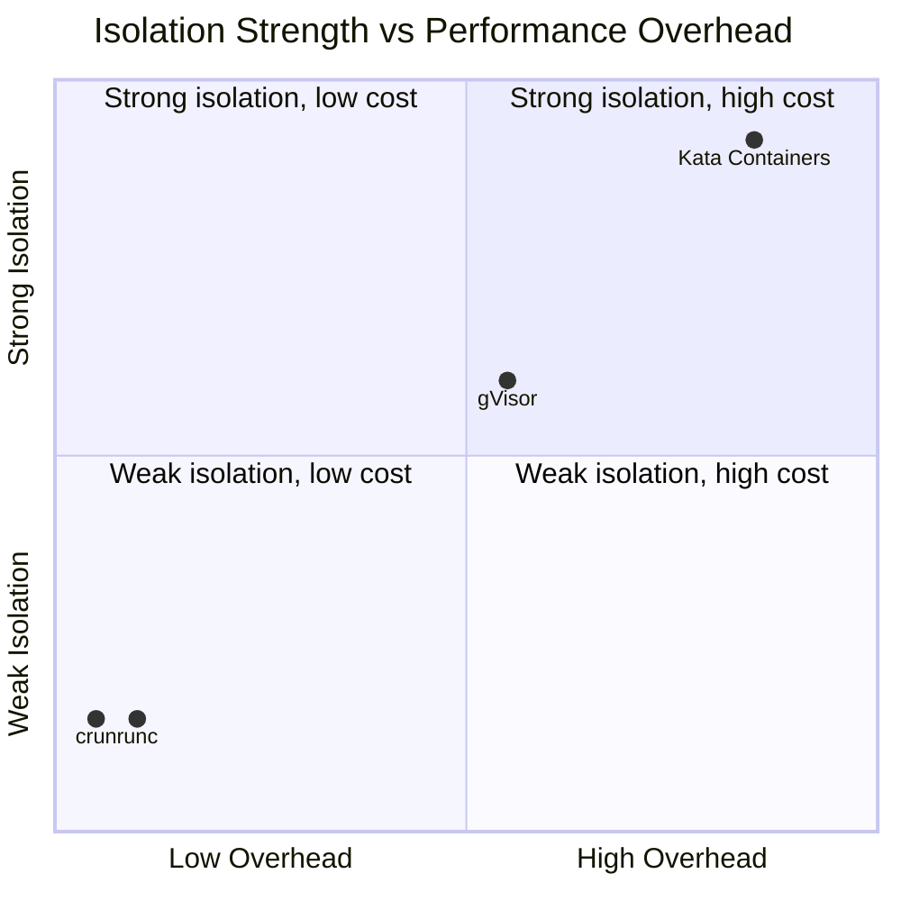
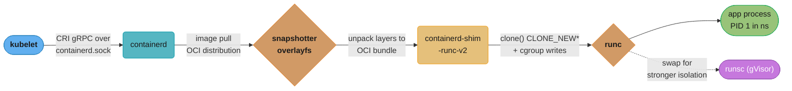
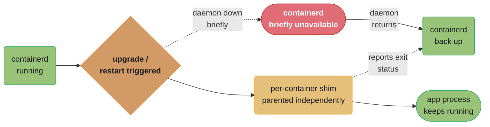
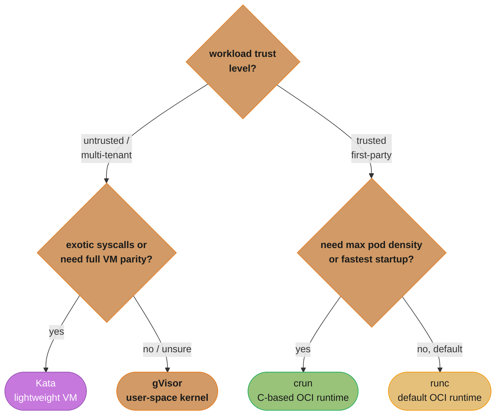
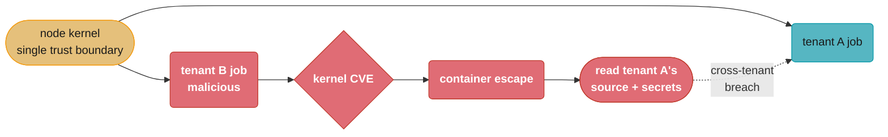

# Container Runtimes & OCI

> Phase 2 — Containers & Kubernetes · Difficulty: Advanced

When Kubernetes "runs a container," Docker is not involved in production — a CRI runtime (containerd or CRI-O) pulls the image, sets up namespaces/cgroups, and hands off to a low-level OCI runtime (runc) that actually `execve`s the process. Understanding this stack explains the "dockershim removal", why a node can run pods without Docker installed, and how sandboxed runtimes (gVisor, Kata) provide stronger isolation.

---

## 1. Concept Overview

The runtime stack has three layers, standardized by the **OCI (Open Container Initiative)**:

1. **High-level runtime (CRI)** — `containerd`, `CRI-O`. Manages images, snapshots, the container lifecycle, and implements Kubernetes' **Container Runtime Interface (CRI)** gRPC API the kubelet calls.
2. **Low-level/OCI runtime** — `runc` (default), `crun`, `gVisor (runsc)`, `Kata`. Given an OCI bundle (rootfs + `config.json`), it creates the namespaces/cgroups and starts the process.
3. **Shim** — a small per-container process that keeps the container running independently of the runtime daemon (so restarting containerd doesn't kill pods).

The **OCI specs** define three things: the **image spec** (layered image format), the **runtime spec** (the `config.json` bundle a runtime consumes), and the **distribution spec** (registry pull/push API). Because these are open standards, an image built by Docker runs on containerd, and runc can be swapped for gVisor transparently.

---

## 2. Intuition

> **One-line analogy**: It's a kitchen brigade — the kubelet is the head chef placing orders (CRI), containerd is the sous-chef managing inventory and prep (images, snapshots, lifecycle), and runc is the line cook who actually fires the dish (creates namespaces and starts the process). Each has a narrow, well-defined job and a standard ticket format (OCI).

**Mental model**: The kubelet never talks to runc directly. It speaks CRI gRPC to containerd, which prepares an OCI bundle and invokes runc to spawn the process, then steps back — a shim holds the container open. Swapping the line cook (runc → gVisor) changes *how* isolation is done without changing any ticket above it.

**Why it matters**: Knowing this stack lets you debug nodes with `crictl` when `docker` isn't installed, understand why "Docker was removed from Kubernetes" didn't break your images (they're OCI, and containerd already ran them), and choose stronger isolation (gVisor/Kata) for untrusted multi-tenant workloads.

**Key insight**: "Docker" was always a bundle — CLI + builder + daemon + containerd + runc. Kubernetes only ever needed the bottom of that stack. Removing the Docker-specific shim (dockershim, removed in 1.24) just cut out a translation layer; containerd/CRI-O run your OCI images natively.

---

## 3. Core Principles

1. **Separation of concerns via OCI.** Image format, runtime bundle, and registry API are independent standards.
2. **CRI decouples kubelet from runtime.** Any CRI-compliant runtime plugs in (containerd, CRI-O).
3. **Shims provide daemon independence.** Restarting containerd must not kill running pods.
4. **runc is the reference, not the only, OCI runtime.** Swap it for stronger isolation (gVisor, Kata) or speed (crun).
5. **Isolation is a spectrum.** Shared-kernel namespaces (runc) → user-space kernel (gVisor) → lightweight VM (Kata/Firecracker).
6. **Snapshotters manage layers.** overlayfs by default; pluggable (e.g., stargz for lazy pulling).

---

## 4. Types / Architectures / Strategies

### The runtime stack

| Layer | Examples | Role |
|-------|----------|------|
| Orchestrator | kubelet | Schedules pods, calls CRI |
| CRI runtime | containerd, CRI-O | Image mgmt, snapshots, lifecycle, CRI server |
| Shim | `containerd-shim-runc-v2` | Keeps container alive independent of daemon |
| OCI runtime | runc, crun, runsc (gVisor), kata | Creates namespaces/cgroups, starts process |

### Isolation models

| Runtime | Isolation mechanism | Overhead | Use |
|---------|---------------------|----------|-----|
| runc | Shared host kernel + namespaces/cgroups | Minimal | Default, trusted workloads |
| crun | Same as runc, C-based (faster, lower mem) | Minimal | High pod-density nodes |
| gVisor (runsc) | User-space kernel intercepts syscalls | Moderate (syscall cost) | Untrusted/multi-tenant code |
| Kata Containers | Each container in a lightweight VM (Firecracker/QEMU) | Higher (VM boot, memory) | Strong isolation, hostile multi-tenancy |



*runc and crun sit in the cheap/weak-isolation corner — minimal overhead because both share the host kernel. gVisor's user-space kernel buys real isolation at a moderate syscall-interception cost, while Kata's per-container VM lands in the strong-isolation/high-overhead corner, trading VM boot time and memory for hardware-level separation.*

---

## 5. Architecture Diagrams



*The kubelet never talks to runc directly — it speaks CRI gRPC to containerd, which pulls and unpacks the image via a snapshotter, then hands off to a per-container shim that invokes runc. Swapping runc for runsc (gVisor) changes only the isolation layer below the shim; every layer above is unchanged.*

```
OCI bundle that runc consumes

  /bundle/
    config.json     <- runtime spec: process, env, mounts, namespaces, cgroups, caps
    rootfs/         <- the unioned image filesystem
```

---

## 6. How It Works — Detailed Mechanics

### Debugging with crictl (the docker CLI replacement on nodes)

```bash
# On a node where Docker isn't installed, talk to the CRI runtime directly:
crictl ps                         # running containers (CRI view)
crictl pods                       # pod sandboxes
crictl images                     # images known to containerd
crictl logs <container-id>        # container logs
crictl inspect <container-id>     # OCI config, mounts, state
ctr -n k8s.io containers ls       # containerd-native (namespace k8s.io)
```

### The OCI runtime spec (config.json excerpt)

```json
{
  "process": {
    "args": ["nginx", "-g", "daemon off;"],
    "user": {"uid": 101, "gid": 101},
    "capabilities": {"bounding": ["CAP_NET_BIND_SERVICE"]}
  },
  "linux": {
    "namespaces": [{"type": "pid"}, {"type": "network"}, {"type": "mount"}],
    "resources": {"memory": {"limit": 536870912}, "cpu": {"quota": 50000, "period": 100000}}
  }
}
```

containerd generates this from the pod spec; runc reads it and makes the `clone()`/cgroup syscalls.

### Selecting a runtime per workload with RuntimeClass

```yaml
# Define a non-default runtime once:
apiVersion: node.k8s.io/v1
kind: RuntimeClass
metadata:
  name: gvisor
handler: runsc          # maps to a containerd runtime handler
---
# Opt a Pod into it (e.g., for untrusted tenant code):
apiVersion: v1
kind: Pod
spec:
  runtimeClassName: gvisor    # this pod runs under gVisor; others stay on runc
  containers:
    - name: untrusted
      image: tenant/job:latest
```

### Why the shim exists



*Restarting containerd never kills a running container because each one is parented to its own shim, not to containerd — the shim keeps the process alive through the brief outage and reports its exit status back once containerd returns. Without shims, upgrading the runtime daemon would kill every pod on the node.*

---

## 7. Real-World Examples

- **dockershim removal (Kubernetes 1.24, 2022)**: the kubelet stopped supporting Docker via a special shim; clusters moved to containerd/CRI-O. Images kept working because they're OCI — only the node's runtime plumbing changed.
- **AWS Fargate & gVisor-style isolation**: serverless container platforms run each task in a microVM-isolated sandbox so untrusted tenant workloads can't escape to the host or each other.
- **AWS Lambda / Firecracker**: Firecracker microVMs (which Kata can use) boot in ~125 ms, giving VM-grade isolation with near-container density — the model behind Lambda and Fargate.
- **GKE Sandbox (gVisor)**: Google offers `runsc` as a RuntimeClass so a single cluster can run trusted workloads on runc and untrusted ones on gVisor.

---

## 8. Tradeoffs

| Decision | Option A | Option B | Key factor |
|----------|----------|----------|-----------|
| CRI runtime | containerd (lean, ubiquitous) | CRI-O (K8s-only, Red Hat) | Ecosystem/distro alignment |
| OCI runtime | runc (default, Go) | crun (C, faster, lower mem) | Pod density, startup speed |
| Isolation | runc (fast, shared kernel) | gVisor/Kata (strong, overhead) | Trust level of workload |
| gVisor vs Kata | gVisor (no VM, syscall cost) | Kata (real VM, boot+RAM cost) | Compatibility vs isolation strength |
| Debug tooling | `crictl`/`ctr` (CRI-native) | none (distroless nodes) | Familiarity vs minimalism |

---

## 9. When to Use / When NOT to Use

**Care about the runtime layer when:** debugging node-level container issues, running untrusted/multi-tenant code (choose gVisor/Kata via RuntimeClass), optimizing pod density/startup (crun), or migrating off Docker shim.

**Don't over-engineer when:** you run trusted first-party workloads — the default containerd + runc is the right answer and tuning the runtime adds complexity without benefit.



*Trust level is the first fork: untrusted/multi-tenant code needs gVisor or Kata (choose Kata when the workload needs broader syscall parity and can absorb VM boot cost); trusted first-party workloads stay on runc by default, moving to crun only when pod density or startup latency is the binding constraint.*

---

## 10. Common Pitfalls

**Pitfall 1 — Assuming you need Docker on Kubernetes nodes.**

```bash
# BROKEN mental model: "kubectl exec failing means I should install Docker on the node"
docker ps    # command not found — there is no Docker daemon; this is expected on containerd nodes
```

```bash
# FIX: use the CRI-native tools that talk to containerd directly.
crictl ps                      # list containers
crictl logs <id>               # logs
crictl exec -it <id> sh        # exec (if the image has a shell)
```

**Pitfall 2 — Running untrusted code on runc.** A tenant's malicious workload on shared-kernel runc is one kernel CVE away from host compromise. FIX: isolate untrusted workloads with a `RuntimeClass` pointing to gVisor or Kata, accepting the overhead for the isolation.

**Pitfall 3 — gVisor compatibility surprises.** gVisor implements a *subset* of Linux syscalls in user space; some apps using exotic syscalls, raw `/proc` features, or certain `mmap` patterns misbehave. FIX: test the specific workload under gVisor before adopting it broadly; don't assume 100% syscall parity.

---

## 11. Technologies & Tools

| Tool | Purpose |
|------|---------|
| containerd | Default CRI runtime; image/snapshot/lifecycle |
| CRI-O | K8s-focused CRI runtime (OpenShift) |
| runc | Reference OCI runtime |
| crun | Faster C-based OCI runtime |
| gVisor (runsc) | User-space kernel sandbox |
| Kata Containers | Per-container lightweight VM isolation |
| Firecracker | MicroVM (Lambda/Fargate underpinning) |
| `crictl` / `ctr` | CRI / containerd debugging CLIs |
| RuntimeClass | K8s API to select runtime per pod |

---

## 12. Interview Questions with Answers

**Q1: Walk through what happens when the kubelet starts a pod.**
The kubelet calls the CRI runtime (containerd/CRI-O) over gRPC to create a pod sandbox, pull/unpack the image into an OCI bundle (rootfs + config.json) via a snapshotter, and start containers. containerd spawns a per-container shim and invokes the OCI runtime (runc), which makes the `clone()` syscall with namespace flags and writes cgroup limits, then `execve`s the entrypoint. The shim keeps the container alive independent of the containerd daemon.

**Q2: What is the CRI and why does it exist?**
The Container Runtime Interface is a gRPC API the kubelet uses to manage pods/containers/images, decoupling Kubernetes from any specific runtime. Before CRI, runtime support was hardcoded; with CRI, any compliant runtime (containerd, CRI-O) plugs in interchangeably. It's why "removing dockershim" was possible without breaking workloads.

**Q3: Did "Docker removal from Kubernetes" break container images?**
No. Images are OCI-standard, and containerd (which Docker itself uses) already ran them. What was removed (1.24) was *dockershim* — the kubelet's special adapter to the Docker daemon. Clusters switched the kubelet to talk CRI directly to containerd/CRI-O; the same images run unchanged. Only `docker`-CLI-on-the-node workflows had to move to `crictl`.

**Q4: What are the three OCI specifications?**
The **image spec** (layered, content-addressed image format), the **runtime spec** (the bundle — rootfs + `config.json` — that a low-level runtime consumes to create a container), and the **distribution spec** (the registry pull/push HTTP API). Together they make images portable and runtimes interchangeable across the ecosystem.

**Q5: runc vs gVisor vs Kata — how do they differ in isolation?**
runc uses host-kernel namespaces/cgroups — fast but shares the kernel (a kernel exploit can escape). gVisor (runsc) interposes a user-space kernel that intercepts syscalls, isolating the host kernel at the cost of syscall overhead and partial compatibility. Kata runs each container in a lightweight VM (Firecracker/QEMU), giving hardware-virtualization isolation at the cost of VM boot time and per-container memory.

**Q6: Why does a container runtime use a shim process?**
The shim is a small process that parents the container so it survives restarts/upgrades of the containerd daemon — you can upgrade the runtime without killing running pods. It also reports the container's exit status back to containerd and handles I/O streams. Without it, the container's lifecycle would be tied to the daemon's.

**Q7: How do you run a specific workload under a different runtime?**
Define a `RuntimeClass` mapping to a containerd handler (e.g., `runsc` for gVisor), then set `runtimeClassName` on the Pod. This lets a single cluster run trusted workloads on runc and untrusted/multi-tenant ones on gVisor/Kata, choosing isolation per workload rather than per cluster.

**Q8: You're on a node with no `docker` command — how do you inspect containers?**
Use `crictl` (CRI-level: `crictl ps`, `crictl logs`, `crictl inspect`, `crictl exec`) or `ctr -n k8s.io` (containerd-native). These talk to the containerd socket directly. On distroless container images there's no shell, so you'd use `kubectl debug` ephemeral containers or host-side `nsenter` into the process namespaces.

**Q9: What is a snapshotter and why does it matter?**
A snapshotter manages how image layers are assembled into a container rootfs — overlayfs is the default. Pluggable snapshotters enable features like lazy/"stargz" pulling (start the container before the whole image downloads), which slashes cold-start time for large images. The choice affects pull time, disk usage, and start latency.

**Q10: crun vs runc — when would you switch?**
crun is a C implementation of the OCI runtime (vs runc's Go), with lower memory per container and faster startup. On high pod-density nodes or latency-sensitive scale-up, crun's lower overhead measurably improves container start time and node capacity. Functionally it's a drop-in OCI runtime; you select it via the runtime handler.

**Q11: What are the security tradeoffs of shared-kernel containers?**
All runc containers share the host kernel, so the kernel is the trust boundary: a privilege-escalation or container-escape kernel bug can compromise the host and every container on it. Mitigations include dropping capabilities, seccomp/AppArmor profiles, non-root users, and — for untrusted code — moving to gVisor/Kata which don't share the host kernel directly.

**Q12: How does Firecracker enable both isolation and density?**
Firecracker is a minimal VMM that boots a stripped microVM in ~125 ms with a tiny memory footprint, giving hardware-level isolation without a full VM's overhead. It underpins AWS Lambda and Fargate, where each function/task gets VM-grade isolation yet the platform still packs thousands per host — bridging the container-density vs VM-isolation gap.

---

## 13. Best Practices

- Use **containerd + runc** as the default; debug nodes with `crictl`/`ctr`, not Docker.
- Isolate **untrusted/multi-tenant workloads** with a gVisor/Kata `RuntimeClass`.
- Apply **seccomp** (`RuntimeDefault`), AppArmor/SELinux, dropped capabilities, and non-root even on runc.
- Pin runtime versions and patch promptly — the kernel/runtime is a shared trust boundary.
- Consider **crun** for high pod-density or fast-startup needs.
- Evaluate **lazy-pull snapshotters** (stargz) to cut cold starts for large images.
- Test workloads under gVisor before broad adoption (syscall compatibility).

---

## 14. Case Study

### Scenario: Multi-tenant CI runners need to execute untrusted customer code safely

A CI SaaS runs customer-supplied build jobs as pods on shared nodes. A customer's job attempts a container escape via a known kernel exploit. On the default runc, success would compromise the node and every other tenant's job on it.



*The shared node kernel is the only trust boundary between tenant A and tenant B — one kernel CVE lets the malicious tenant escape its container and read straight across into tenant A's source and secrets.*

```yaml
# BROKEN: untrusted jobs scheduled with no isolation beyond namespaces.
apiVersion: v1
kind: Pod
metadata: {name: ci-job-untrusted}
spec:
  containers:
    - name: build
      image: customer/build:latest      # runs on default runc, shares host kernel
```

```yaml
# FIX: isolate untrusted jobs in a gVisor sandbox via RuntimeClass; harden further.
apiVersion: node.k8s.io/v1
kind: RuntimeClass
metadata: {name: gvisor}
handler: runsc
---
apiVersion: v1
kind: Pod
metadata: {name: ci-job-untrusted}
spec:
  runtimeClassName: gvisor               # user-space kernel; host kernel not directly exposed
  automountServiceAccountToken: false    # no API credentials in the sandbox
  securityContext:
    runAsNonRoot: true
    seccompProfile: {type: RuntimeDefault}
  containers:
    - name: build
      image: customer/build:latest
      securityContext:
        allowPrivilegeEscalation: false
        capabilities: {drop: ["ALL"]}
        readOnlyRootFilesystem: true
```

**Outcome:** the same kernel-exploit attempt now hits gVisor's user-space kernel, which doesn't expose the host kernel syscall surface, containing the blast radius to the sandbox. Throughput dropped ~10–15% for syscall-heavy builds (the gVisor tax), an accepted cost for multi-tenant safety. Trusted first-party jobs stayed on runc for full speed.

**Discussion questions:**
1. Why is runc insufficient for untrusted multi-tenant code even with seccomp and dropped capabilities?
2. When would you choose Kata (microVM) over gVisor here, and what's the cost? (Stronger isolation/compatibility vs VM boot + memory.)
3. How would you measure the gVisor performance tax for a given workload before rolling it out fleet-wide?

---

**Cross-references:** [linux_and_os_fundamentals](../linux_and_os_fundamentals/) (namespaces/cgroups/capabilities runc uses), [containers_and_docker](../containers_and_docker/) (the OCI images runtimes execute), [kubernetes_architecture](../kubernetes_architecture/) (kubelet → CRI), [kubernetes_security](../kubernetes_security/) (seccomp, RuntimeClass, multi-tenant isolation).
