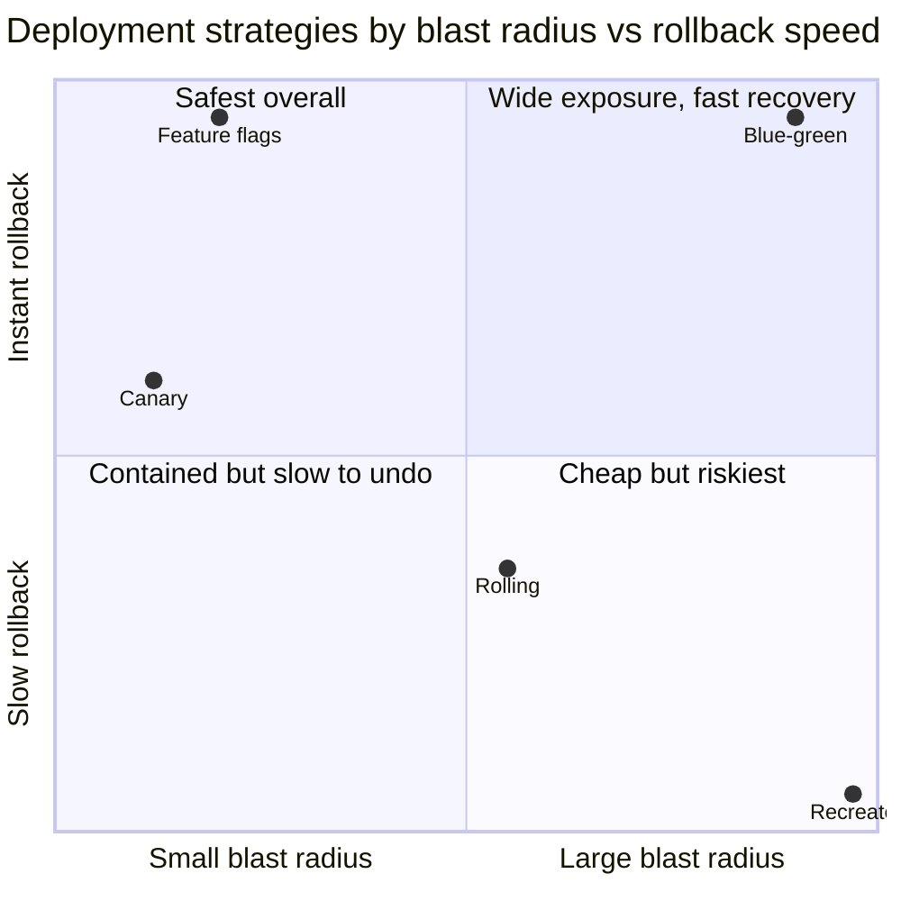
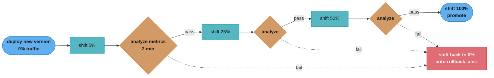
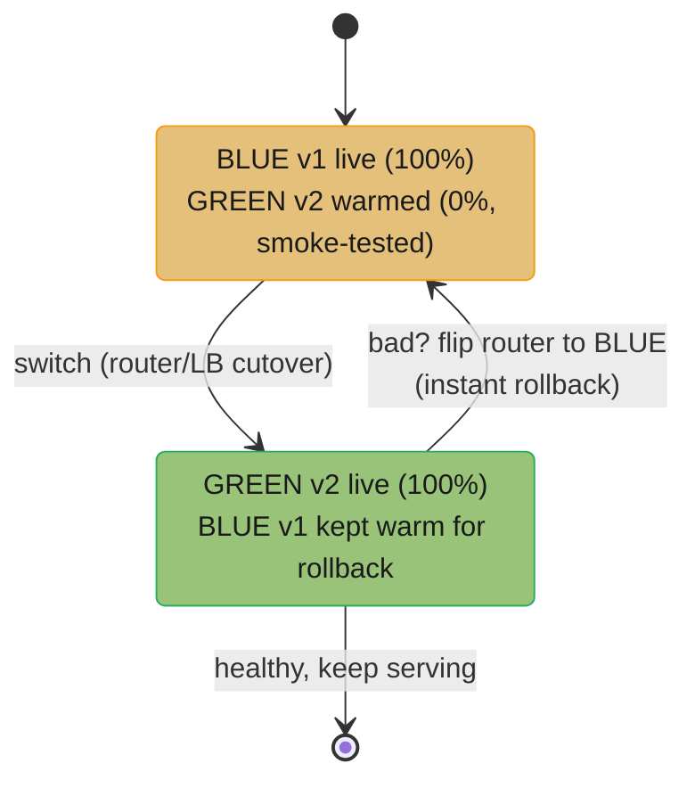
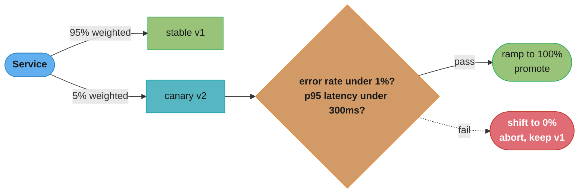
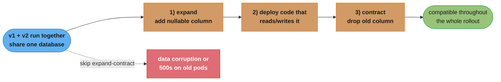
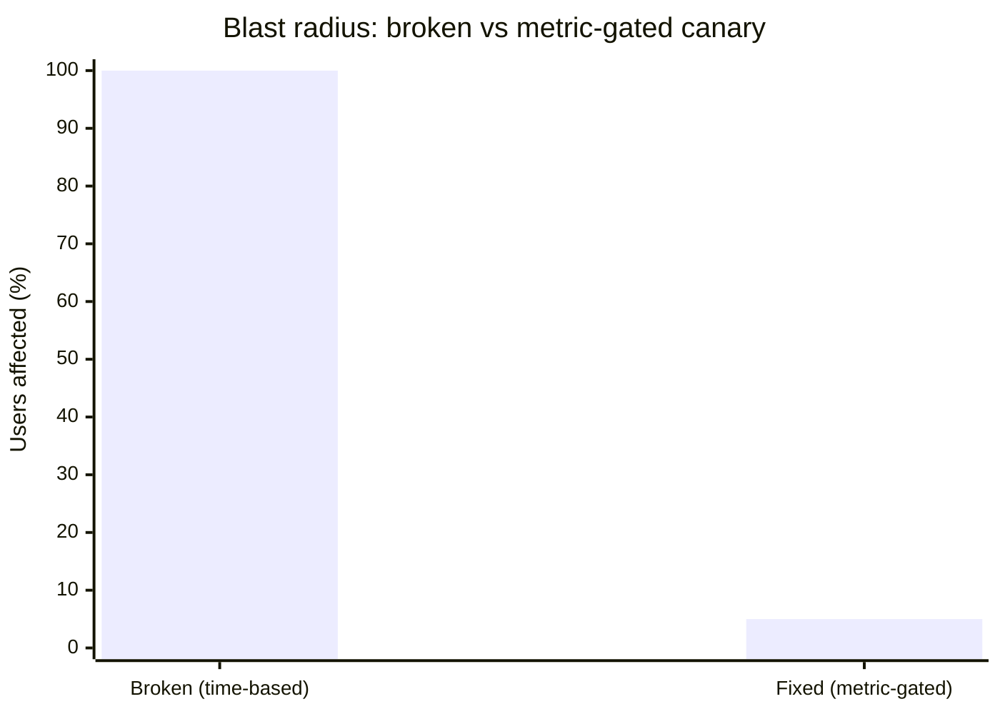

# Deployment Strategies

> Phase 3 — CI/CD & GitOps · Difficulty: Advanced

How you *release* a new version determines your blast radius when (not if) a deploy is bad. Rolling, blue-green, canary, and feature-flag strategies trade off speed, cost, rollback time, and risk exposure. Progressive delivery automates the safest of these — shifting a small fraction of traffic to the new version, watching metrics, and promoting or aborting automatically. Choosing and tuning the right strategy is a core production-readiness skill.

---

## 1. Concept Overview

Deployment strategies control *how traffic moves from the old version to the new*:

- **Recreate** — kill all old, start all new. Downtime; simplest. (Only for non-prod or maintenance windows.)
- **Rolling update** — replace instances incrementally (Kubernetes default). Zero downtime with readiness gates; both versions serve simultaneously during the roll.
- **Blue-green** — run two full environments (blue=current, green=new); switch all traffic at once; instant rollback by switching back. Doubles resources during cutover.
- **Canary** — route a small % of traffic to the new version, observe, then gradually increase. Limits blast radius; needs metric analysis.
- **Feature flags** — deploy code dark, then enable per-cohort at runtime (decouples deploy from release).

**Progressive delivery** = canary/blue-green *automated by metrics*: a controller (Argo Rollouts, Flagger) shifts traffic in steps, queries success metrics (error rate, latency) against thresholds, and promotes or rolls back without a human.

---

## 2. Intuition

> **One-line analogy**: Releasing is like changing a tire on a moving car. Recreate stops the car (downtime). Rolling swaps one wheel at a time while driving. Blue-green keeps a second fully-built car alongside and you hop into it (and back instantly if it's wrong). Canary lets a few passengers ride the new car first and watches whether they arrive safely before moving everyone. Feature flags build the new car but keep the doors locked until you choose to open them.

**Mental model**: Every strategy is a point on two axes — **blast radius** (how many users hit a bad version before you notice) and **rollback speed** (how fast you can undo). Canary minimizes blast radius (only X% exposed); blue-green minimizes rollback time (flip back instantly); rolling is a cheap middle ground; feature flags decouple "the code is deployed" from "users see it," giving instant on/off without a redeploy.



*Canary and feature flags sit in the safest quadrant (small blast radius, near-instant rollback); blue-green trades a full-exposure switch for the fastest possible recovery; recreate is worst on both axes, which is why it's reserved for non-prod.*

**Why it matters**: Most outages are self-inflicted by deploys. The strategy decides whether a bad release affects 2% of users for 90 seconds (canary with auto-rollback) or 100% until someone notices and manually reverts (rolling with no gates). At scale, that difference is enormous in dollars and trust.

**Key insight**: Deploy and release are different events. Feature flags (and canary) let you **deploy** code to production while controlling **release** (who actually experiences it). Separating them means you can ship continuously, dark-launch risky changes, and turn features off instantly without the latency and risk of a redeploy/rollback.

---

## 3. Core Principles

1. **Minimize blast radius.** Expose new versions to the smallest viable audience first (canary/flags).
2. **Make rollback fast and boring.** Instant traffic-switch (blue-green) or auto-abort (progressive delivery).
3. **Gate on metrics, not vibes.** Promote based on error rate/latency/business KPIs, not a stopwatch.
4. **Decouple deploy from release.** Feature flags let you ship dark and toggle exposure at runtime.
5. **Always have a tested rollback path.** A strategy without a proven rollback is incomplete.
6. **Both versions coexist during transitions.** Ensure backward/forward compatibility (DB schema, APIs).

---

## 4. Types / Architectures / Strategies

| Strategy | Downtime | Rollback speed | Resource cost | Blast radius | Complexity |
|----------|----------|----------------|---------------|--------------|------------|
| Recreate | Yes | Slow (redeploy) | 1x | 100% | Lowest |
| Rolling | No | Medium (roll back) | ~1x | Grows during roll | Low |
| Blue-green | No | Instant (switch) | 2x during cutover | 100% at switch | Medium |
| Canary | No | Fast (shift back) | ~1x + canary | Small (X%) | High (needs metrics) |
| Feature flags | No | Instant (toggle) | 1x | Controlled per cohort | Medium (flag mgmt) |

### Progressive delivery (automated canary)



*The controller shifts traffic in steps (5% → 25% → 50% → 100%), pausing to analyze metrics at each step; any failed analysis snaps traffic back to 0% and alerts — no human in the loop.*

---

## 5. Architecture Diagrams

**Blue-green (instant switch + instant rollback):**



*The router/LB always points at exactly one fully-live environment; cutover and rollback are the same operation — flipping where it points — so rollback is as fast as the original switch.*

**Canary / progressive delivery (metric-gated):**



*The mesh/ingress splits traffic by weight; the canary's slice is analyzed against error-rate and latency thresholds each step — a pass advances the weight toward 100%, any failure snaps back to zero while stable keeps serving everyone.*

---

## 6. How It Works — Detailed Mechanics

### Rolling update (Kubernetes native)

```yaml
spec:
  strategy:
    type: RollingUpdate
    rollingUpdate: {maxUnavailable: 0, maxSurge: 1}   # add a ready pod before removing an old one
# Zero-downtime IF readiness probes gate traffic (see kubernetes_workloads_and_objects).
```

### Argo Rollouts canary with automated analysis

```yaml
apiVersion: argoproj.io/v1alpha1
kind: Rollout
spec:
  strategy:
    canary:
      steps:
        - setWeight: 5
        - pause: {duration: 2m}
        - analysis:                       # query metrics; abort if they fail
            templates: [{templateName: success-rate}]
        - setWeight: 25
        - pause: {duration: 2m}
        - setWeight: 50
        - pause: {duration: 2m}
        - setWeight: 100                  # full promotion
---
apiVersion: argoproj.io/v1alpha1
kind: AnalysisTemplate
metadata: {name: success-rate}
spec:
  metrics:
    - name: success-rate
      interval: 30s
      successCondition: result[0] >= 0.99       # >=99% success
      failureLimit: 2                            # 2 failed checks -> auto-rollback
      provider:
        prometheus:
          address: http://prometheus:9090
          query: |
            sum(rate(http_requests_total{job="app",code!~"5.."}[2m]))
              / sum(rate(http_requests_total{job="app"}[2m]))
```

If the canary's success rate drops below 99% during any pause, Argo Rollouts automatically shifts traffic back to stable and halts — no human in the loop.

### Decoding the analysis numbers

Four values in that manifest — `setWeight: 5`, `interval: 30s`, `failureLimit: 2`, and the
`successCondition` ratio — are usually copied without anyone computing what they buy. They
combine into two quantities: how fast you abort, and how many users pay for the bad version.

```
time_to_abort  = pause_duration + (failureLimit x interval)
blast_radius   = traffic_weight x time_to_abort        (user-minutes of exposure)
```

**What the formula is telling you.** "Exposure is an area, not a percentage — how wide the
slice is, multiplied by how long you leave it open." Two rollouts with the same 5% weight are
not equally safe if one takes 30 seconds to abort and the other takes 20 minutes.

| Symbol | What it is |
|--------|------------|
| `traffic_weight` | The `setWeight` at the current step, as a fraction of live traffic |
| `pause_duration` | `pause: {duration: 2m}` — how long the step runs before analysis concludes |
| `interval` | `interval: 30s` — how often the AnalysisRun re-queries Prometheus |
| `failureLimit` | Failed checks tolerated before abort; 2 here, 1 in the §14 template |
| `successCondition` | The Prometheus ratio that must hold; `>= 0.99` means under 1% 5xx |

**Walk one example.** The first step of this rollout, against the Section 14 incident:

```
                     weight   pause    checks to abort   time to abort   blast radius
  broken (§14)        100%     none      none (timer)         8 min       800 %-min
  this manifest         5%     2 min     2 x 30s = 1 min      3 min        15 %-min
```

53x less exposure, which is exactly the "~5% for a few minutes instead of 30% errors for
everyone for 8 minutes" outcome §14 reports — the 3 minutes it cites is `2m + 2 x 30s`, not
a round number someone chose.

**Put simply.** The weight also has to be large enough for the metric to *mean* anything. At
a 5% weight the canary sees `5% x rps` requests, and the query window must contain enough of
them to distinguish a real regression from noise:

```
canary_requests_per_window = rps x traffic_weight x window_seconds
```

**Walk one example.** At 1,000 rps with the `[2m]` rate window in the query:

```
  step        weight    canary rps    requests in the 2m window    errors seen at 1% error rate
  first          5%          50                6,000                          60
  second        25%         250               30,000                         300
  third         50%         500               60,000                         600
```

6,000 requests is plenty to resolve a 1%-vs-0.1% error rate. Halve the traffic to 100 rps and
the same step observes 600 requests with ~6 errors, where one unlucky client retry storm flips
the ratio past 0.99 and aborts a healthy release. That is why low-traffic services need longer
pauses or wider weights: the `failureLimit: 2` exists precisely to absorb a single noisy
sample, and on a thin canary it is the only thing standing between you and flaky rollbacks.

### Blue-green with Argo Rollouts

```yaml
spec:
  strategy:
    blueGreen:
      activeService: app-active        # serves prod traffic
      previewService: app-preview      # green, for smoke tests before switch
      autoPromotionEnabled: false      # require manual/gated promotion
      scaleDownDelaySeconds: 300       # keep blue warm 5min after switch for instant rollback
```

### Feature flags (deploy ≠ release)

```python
# Code ships dark; the flag decides exposure at runtime — no redeploy to toggle.
if flags.is_enabled("new_checkout", user=user, default=False):
    return new_checkout(user)     # progressively enabled: 1% -> internal -> 10% -> 100%
return old_checkout(user)
# Bad behavior? flip the flag off instantly (sub-second) -- no rollback deploy needed.
```

### The compatibility constraint



*Because v1 and v2 read/write the same database mid-rollout, schema changes must go expand → deploy → contract across separate releases, dropping the old column only after all old pods are gone; collapsing the steps into one release is what corrupts data or 500s the old pods (see the Pitfall 1 SQL example below).*

---

## 7. Real-World Examples

- **Netflix/Argo Rollouts/Flagger**: automated canaries gated on real-time error-rate and latency from Prometheus, promoting or rolling back without human intervention — the progressive-delivery standard.
- **Feature flags at scale** (LaunchDarkly, Flagsmith, Unleash): companies deploy dozens of times a day with risky changes shipped dark and rolled out per cohort, decoupling deploy cadence from release decisions.
- **Blue-green for databases/stateful cutovers**: teams run a parallel green environment, smoke-test it, then switch DNS/router — with the blue kept warm for instant rollback.
- **Kubernetes rolling updates**: the default for stateless services; with readiness probes and `maxUnavailable: 0` it's zero-downtime out of the box (see [kubernetes_workloads_and_objects](../kubernetes_workloads_and_objects/)).

---

## 8. Tradeoffs

| Decision | Option A | Option B | Key factor |
|----------|----------|----------|-----------|
| Strategy | Rolling (cheap, simple) | Canary (safe, complex) | Risk tolerance + metric maturity |
| Rollback | Blue-green (instant switch) | Rolling (roll back) | RTO target vs 2x cost |
| Release control | Feature flags (runtime toggle) | Redeploy to change | Decoupling deploy/release |
| Promotion | Manual gate | Automated (metric-gated) | Confidence in metrics/SLOs |
| Cost | 1x (rolling/canary) | 2x (blue-green cutover) | Budget vs rollback speed |
| Canary analysis | Time-based (simple) | Metric-based (safe) | Observability maturity |

---

## 9. When to Use / When NOT to Use

**Rolling**: default for stateless services with good readiness probes. **Blue-green**: when you need instant rollback and can afford 2x during cutover, or for risky stateful/cutover migrations. **Canary/progressive delivery**: high-traffic, high-stakes services where limiting blast radius justifies the metric-analysis investment. **Feature flags**: when you want to decouple deploy from release, dark-launch, or do per-cohort rollouts.

**Avoid:** canary without trustworthy metrics (you can't gate on noise); blue-green if you can't afford 2x or schema isn't compatible; feature flags without lifecycle management (stale flags become tech debt and incidents). Recreate only for non-prod or accepted maintenance windows.

---

## 10. Common Pitfalls

**Pitfall 1 — Backward-incompatible DB migration during a rolling/canary deploy.**

```sql
-- BROKEN: drop/rename a column in the same release that v2 needs renamed.
ALTER TABLE orders RENAME COLUMN total TO total_amount;
-- During the roll, v1 pods (still running) query `total` -> 500s; or v2 reads a column v1 hasn't written.
```

```sql
-- FIX: expand-contract across releases (both versions coexist safely).
-- Release 1 (expand): add the new column, keep the old; code writes BOTH.
ALTER TABLE orders ADD COLUMN total_amount numeric;   -- nullable, additive
-- Release 2: code reads/writes total_amount only.
-- Release 3 (contract): drop `total` ONLY after no old pods remain.
ALTER TABLE orders DROP COLUMN total;
```

**Pitfall 2 — Time-based "canary" with no metric analysis.** Waiting 5 minutes then promoting regardless of health isn't a canary — it just delays a full rollout of a bad version. FIX: gate promotion on real metrics (error rate, latency, business KPIs) with automated abort (see §6 AnalysisTemplate).

**Pitfall 3 — Stale feature flags.** Flags left on/off forever accumulate as dead code paths and "why is this behaving differently" incidents; a forgotten kill-switch flag defaulting wrong causes an outage. FIX: treat flags as inventory — owner, expiry, and a cleanup task to remove flags once a feature is fully rolled out.

---

## 11. Technologies & Tools

| Tool | Purpose |
|------|---------|
| Argo Rollouts | Canary/blue-green for Kubernetes, metric analysis |
| Flagger | Progressive delivery (mesh/ingress-driven) |
| Kubernetes Deployment | Native rolling updates |
| LaunchDarkly / Unleash / Flagsmith | Feature flag management |
| Istio / Linkerd / ingress | Traffic weighting for canaries (see [`../../backend/service_mesh_and_service_discovery`](../../backend/service_mesh_and_service_discovery/)) |
| Prometheus | Metric source for canary analysis (see [observability_metrics_prometheus](../observability_metrics_prometheus/)) |
| Spinnaker | Multi-cloud deployment pipelines |

---

## 12. Interview Questions with Answers

**Q1: Compare rolling, blue-green, and canary.**
Rolling replaces instances incrementally (zero downtime with readiness gates, cheap, but blast radius grows as the roll proceeds and rollback means rolling back). Blue-green runs two full environments and switches all traffic at once — instant rollback by switching back, at ~2x resource cost during cutover and 100% blast radius at the switch. Canary routes a small % of traffic to the new version first, limiting blast radius and enabling metric-gated promotion, at the cost of needing traffic-splitting and metric analysis.

**Q2: What is progressive delivery?**
It's automated canary (or blue-green) where a controller (Argo Rollouts/Flagger) shifts traffic in increments, queries success metrics (error rate, latency, custom KPIs) against thresholds at each step, and automatically promotes if healthy or rolls back if not — removing the human from the loop. It turns "deploy and watch dashboards" into a codified, repeatable, metric-gated process.

**Q3: How do deploy and release differ, and why does it matter?**
Deploy = the new code is running in production; release = users actually experience it. Feature flags (and canary weighting) separate them: you can deploy code dark and toggle exposure at runtime per cohort. This lets you ship continuously, decouple risky features from deploy cadence, dark-launch for testing, and turn a misbehaving feature off in sub-seconds without a rollback deploy.

**Q4: Why is blue-green's rollback faster than rolling's?**
Blue-green keeps the entire previous version (blue) running and warm; rollback is just pointing the router back to it — effectively instant. Rolling has already replaced old instances incrementally, so rolling back means deploying the old version again (re-pulling images, restarting pods, re-warming), which takes minutes. Blue-green trades 2x resource cost during cutover for that instant rollback.

**Q5: What's the danger of running two versions simultaneously, and how do you handle schema changes?**
During any rolling/canary/blue-green transition, v1 and v2 run at once and may share a database, so a backward-incompatible schema change breaks the version that doesn't expect it (500s, data corruption). Use expand-contract: first expand (additive, nullable changes both versions tolerate), deploy code using the new shape, then contract (remove old columns) only after all old pods are gone — never in the same release.

**Q6: How does an automated canary decide to promote or roll back?**
A controller shifts a small traffic weight to the canary and, during pauses, queries metric providers (e.g., Prometheus) for success conditions — error rate ≥ 99%, p95 latency < threshold, or business KPIs. If the conditions hold across the analysis, it advances the weight; if they fail (beyond a failure limit), it shifts traffic back to stable and halts, alerting. The gates are codified (AnalysisTemplate), not a human eyeballing dashboards.

**Q7: When is blue-green the wrong choice?**
When you can't afford ~2x resources during cutover, when the workload is huge (doubling is prohibitively expensive), or when database/state can't support both versions writing — the instant switch still exposes 100% of users at once, so a bad-but-passing-smoke-test version hits everyone. In those cases canary (gradual exposure) limits blast radius better, and rolling is cheaper.

**Q8: What are the risks of feature flags and how do you manage them?**
Stale flags become permanent dead code paths and a source of "why is prod behaving differently" confusion; a forgotten flag with a wrong default can cause an outage; and flag logic sprinkled everywhere increases complexity. Manage them as inventory: each flag has an owner, a purpose, and an expiry; remove flags once a feature is fully rolled out; and centralize evaluation through a flag service with audit/targeting.

**Q9: How does a service mesh or ingress enable canaries?**
They provide weighted traffic routing: the mesh/ingress can send, say, 5% of requests to the canary Service and 95% to stable, and adjust the weights as the rollout progresses. Argo Rollouts/Flagger drive these weights via the mesh (Istio/Linkerd) or ingress API. Without traffic-splitting capability, "canary" degrades to replica-ratio approximations, which are coarser and less precise.

**Q10: What's a complete rollback strategy, and why isn't "redeploy the old version" always enough?**
A complete strategy has a *fast, tested* path to the previous good state: blue-green switch-back, canary shift-to-zero, or feature-flag toggle — ideally automated and exercised regularly. "Redeploy the old version" can be slow (image pulls, restarts), and if the bad release made an incompatible schema change, redeploying old code may not even work. Rollback must account for data/schema and be proven, not assumed.

**Q11: How do you choose a strategy for a high-traffic payment service?**
Favor canary/progressive delivery to minimize blast radius (a payment bug must not hit 100% of users), gated on strict metrics (error rate, latency, and payment-success KPIs) with automated rollback. Combine with feature flags for risky logic (toggle off instantly) and strict expand-contract schema discipline. Blue-green is an option if instant full rollback is required and 2x cost is acceptable, but gradual exposure is usually safer for money flows.

**Q12: How do deployment strategies relate to GitOps?**
Under GitOps, the desired state (including the Rollout/canary spec) lives in Git, and a controller (ArgoCD + Argo Rollouts) reconciles it; a promotion or rollback can be a Git change or an automated metric-gated step. The strategy (canary/blue-green) is declared as a Rollout CR, and rollback is `git revert` or the controller's auto-abort — combining progressive delivery with Git as the audited source of truth (see [gitops_argocd_flux](../gitops_argocd_flux/)).

**Q13: In a Kubernetes rolling update, what do `maxUnavailable` and `maxSurge` control?**
They bound how many pods can be down at once (`maxUnavailable`) and how many extra pods can run above the desired count (`maxSurge`) during the rollout. Setting `maxUnavailable: 0` guarantees capacity never drops below the desired replica count, since Kubernetes must start a new, ready pod (via `maxSurge: 1`) before terminating an old one — the mechanism behind a zero-downtime rolling update. Neither field alone prevents a broken new pod from receiving traffic, though; that guarantee comes from readiness probes gating when a pod joins the Service's endpoints. Set both explicitly and pair them with readiness probes rather than relying on Kubernetes' rolling-update defaults.

**Q14: In Argo Rollouts blue-green, what do `previewService`, `activeService`, and `scaleDownDelaySeconds` do?**
`activeService` sends production traffic to the live version, while `previewService` points only at the new (green) pods so they can be smoke-tested before cutover. Promotion switches `activeService` to green; `scaleDownDelaySeconds` (e.g., 300) then keeps the old blue pods running and warm for that long afterward, so a bad release rolls back instantly by flipping `activeService` back instead of waiting for blue to be recreated from scratch. `autoPromotionEnabled: false` forces a human or external gate to approve that switch rather than promoting automatically once smoke tests pass. Set `scaleDownDelaySeconds` to cover your realistic detection window, not just the duration of an automated smoke test.

**Q15: When, if ever, should you use the Recreate strategy in production?**
Recreate should be limited to non-production environments or accepted maintenance windows, since it kills all old instances before starting new ones and causes full downtime. It sits at the worst point on both the blast-radius and rollback-speed axes — 100% of users are affected simultaneously, and rollback means a slow redeploy because no old version is left running to fall back to. The rare production exception is a singleton stateful workload that cannot run two versions at once, where downtime is unavoidable regardless of strategy. Default to rolling or canary for anything that can tolerate two versions coexisting briefly, and reserve Recreate for cases where coexistence is genuinely impossible.

**Q16: Why can a canary release that "passes" its checks still take down the entire service once promoted to 100%?**
A canary can pass because its small traffic slice happened to miss the specific request pattern that triggers the bug, so the failure only appears once real full traffic hits 100%. In the module's case study, a canary held 5% of traffic for a 2-minute time-based pause with no metric analysis, that 5% slice never included the rare cart type that broke checkout, and the release was promoted straight to 100%, where errors spiked to 30% and needed a manual 8-minute rollback to fix. The fix combines two changes: add real metric-gated analysis at each step (checkout-success ≥ 99.5%, p95 latency < 400ms, `failureLimit: 1`) so a bad signal auto-aborts, and extend the canary's duration and traffic share so rare-but-important paths actually get exercised before promotion. After the fix, the same class of bug was caught and auto-rolled-back within 3 minutes at about 5% blast radius instead of 8 minutes at 100%. Size and duration your canary steps to be representative of production traffic, not just long enough to satisfy a timer.

---

## 13. Best Practices

- Default to **rolling** for stateless services (readiness probes + `maxUnavailable: 0`); upgrade to **canary/progressive delivery** for high-stakes services.
- **Gate promotion on metrics** (error rate, latency, KPIs) with automated rollback — not on time alone.
- Keep a **fast, tested rollback** (blue-green switch, canary shift-to-zero, flag toggle).
- Use **feature flags** to decouple deploy from release; manage flags as inventory with owners/expiry.
- Enforce **expand-contract** for schema/API changes so coexisting versions stay compatible.
- Keep the previous version **warm** (blue-green `scaleDownDelay`) for instant rollback.
- Drive it all through **GitOps + Argo Rollouts/Flagger** for auditable, repeatable releases.

---

## 14. Case Study

### Scenario: A canary that "passed" still took down 100% of checkout

A high-traffic shop uses Argo Rollouts canary. A release passes the canary and promotes to 100% — then checkout error rate spikes to 30% across all users. The canary had only checked container readiness and waited 2 minutes; it never analyzed real error metrics. The bug only manifested under the *full* traffic mix the canary never saw at 5%.

**BROKEN canary (time-based, no metric analysis):**

```mermaid
flowchart LR
    classDef io      fill:#61afef,stroke:#2e86c1,color:#1a1a1a,font-weight:bold
    classDef frozen  fill:#c678dd,stroke:#9b59b6,color:#fff
    classDef train   fill:#98c379,stroke:#27ae60,color:#1a1a1a
    classDef mathOp  fill:#d19a66,stroke:#e67e22,color:#1a1a1a,font-weight:bold
    classDef lossN   fill:#e06c75,stroke:#c0392b,color:#fff,font-weight:bold
    classDef req     fill:#56b6c2,stroke:#0097a7,color:#1a1a1a
    classDef base    fill:#e5c07b,stroke:#f39c12,color:#1a1a1a

    W5["setWeight 5"] --> Pause["pause 2m<br/>just waits, no analysis"]
    Pause --> Miss["5% slice never hit<br/>the rare cart type"]
    Miss --> W100["setWeight 100<br/>marked passed"]
    W100 --> Errors(["30% errors at 100%<br/>manual rollback: 8 min"])

    class W5,Pause mathOp
    class Miss,W100,Errors lossN
```



*The canary only paused on a timer and never queried real metrics, so the untested 5% slice was marked "passed" and promoted to 100%, where the rare cart type triggered 30% checkout errors and an 8-minute manual rollback.*

```yaml
# FIX: metric-gated analysis at each step + a longer, representative canary + auto-abort.
strategy:
  canary:
    steps:
      - setWeight: 5
      - pause: {duration: 5m}
      - analysis: {templates: [{templateName: checkout-health}]}   # real metrics
      - setWeight: 25
      - pause: {duration: 5m}
      - analysis: {templates: [{templateName: checkout-health}]}
      - setWeight: 50
      - analysis: {templates: [{templateName: checkout-health}]}
      - setWeight: 100
---
apiVersion: argoproj.io/v1alpha1
kind: AnalysisTemplate
metadata: {name: checkout-health}
spec:
  metrics:
    - name: checkout-success
      interval: 30s
      successCondition: result[0] >= 0.995          # 99.5% checkout success
      failureLimit: 1                                # one bad check -> abort
      provider:
        prometheus:
          address: http://prometheus:9090
          query: |
            sum(rate(checkout_total{result="ok"}[2m]))
              / sum(rate(checkout_total[2m]))
    - name: p95-latency
      successCondition: result[0] < 0.4              # p95 < 400ms
      provider: {prometheus: {address: ..., query: 'histogram_quantile(0.95, ...)'}}
```

With real metric analysis, the bug would have driven `checkout_total{result="ok"}` down within the first 5% step, the analysis would have failed, and Argo Rollouts would have **automatically shifted traffic back to stable** — capping exposure at ~5% of users for a few minutes instead of 30% errors for everyone for 8 minutes. The team also extended the canary duration so rare-but-important code paths get exercised before promotion.

**Outcome:** the next latent bug was caught at the 5% step with automatic rollback in under 3 minutes and ~5% blast radius, versus the prior 100%/8-minute incident. The lesson: a canary without metric analysis is just a slow full rollout.



*The time-based canary exposed 100% of users for 8 minutes before a manual rollback; the metric-gated fix caps exposure at about 5% and auto-rolls-back in under 3 minutes.*

**Discussion questions:**
1. Why did a 5% time-based canary fail to catch a bug that a metric-gated one would?
2. How do you choose canary metrics and thresholds that reflect real user/business impact, not just HTTP 200s?
3. What's the tradeoff in canary duration/steps between catching rare-path bugs and slowing every release?

---

**Cross-references:** [kubernetes_workloads_and_objects](../kubernetes_workloads_and_objects/) (rolling update, readiness), [gitops_argocd_flux](../gitops_argocd_flux/) (Argo Rollouts under GitOps), [observability_metrics_prometheus](../observability_metrics_prometheus/) (metrics that gate canaries), [sre_principles_and_slos](../sre_principles_and_slos/) (SLO-based release gates), [`../../database/database_migrations_zero_downtime`](../../database/database_migrations_zero_downtime/) (expand-contract).
