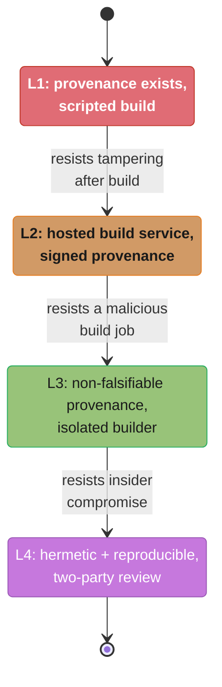
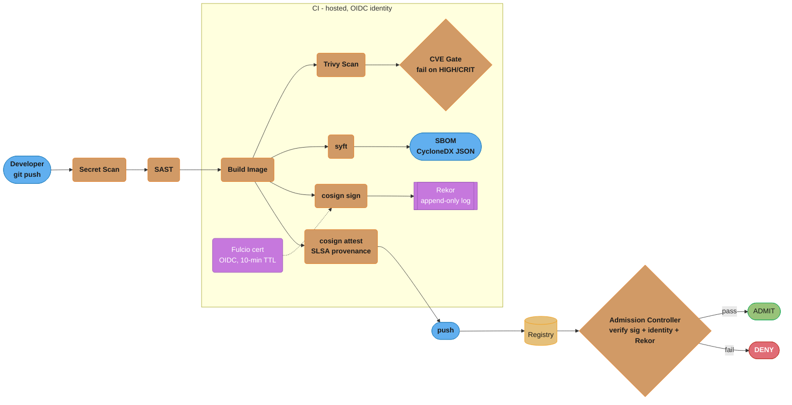
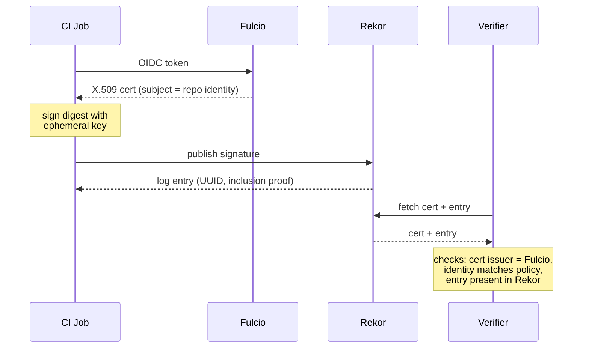
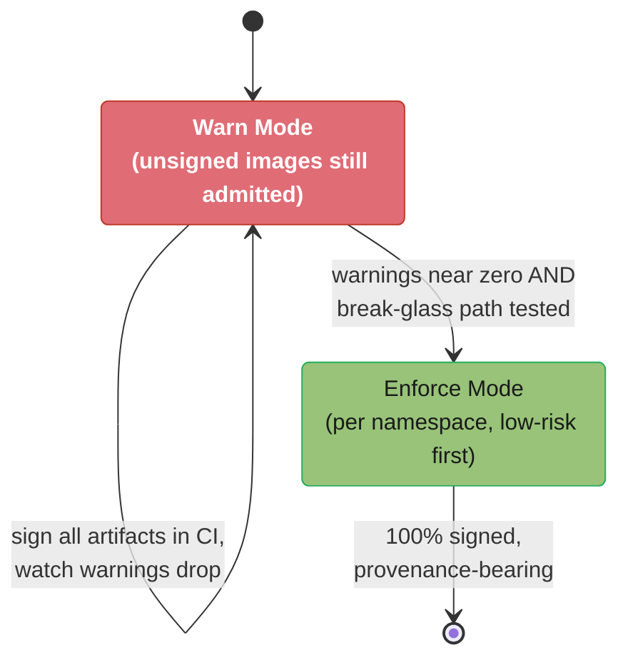

# DevSecOps and Supply Chain Security

> Phase 7 — DevSecOps & Reliability · Difficulty: Advanced

---

## 1. Concept Overview

DevSecOps embeds security controls into every stage of the software delivery lifecycle rather than bolting them on as a pre-release gate. Supply chain security is the subset that protects the integrity of everything that flows into a build: source code, third-party dependencies, base images, build tooling, and the artifacts you ship. The 2020 SolarWinds compromise (18,000 organizations affected via a poisoned build server) and the 2021 Log4Shell vulnerability (CVE-2021-44228, CVSS 10.0, present in an estimated 35,000 Java packages) turned supply chain security from a niche concern into a board-level priority.

The practical surface area covers four pillars. **Code-level scanning**: SAST (static analysis of source), DAST (dynamic analysis of a running app), and SCA (software composition analysis of dependencies). **Artifact integrity**: image scanning with Trivy or Grype, SBOM generation with syft, and cryptographic signing with cosign. **Provenance**: SLSA attestations that prove how and where an artifact was built, anchored in a tamper-evident transparency log (Rekor). **Admission enforcement**: a Kubernetes gate that refuses to run any image lacking a valid signature and provenance.

This module assumes you already understand pod-level controls (see [`../kubernetes_security/README.md`](../kubernetes_security/README.md)) and secret storage (see [`../secrets_management/README.md`](../secrets_management/README.md)). Here the focus is the pipeline: shift-left scanning, signing with Sigstore keyless flows, SLSA levels 1-4, and the verification chain that ends at an admission controller.

---

## 2. Intuition

> **One-line analogy**: DevSecOps is a food-safety chain — every supplier is inspected, every ingredient is traceable to its origin, and the kitchen door refuses any crate without an unbroken tamper seal.

**Mental model**: Think of an artifact as a sealed package with a notarized chain-of-custody slip. Each handoff (commit, build, scan, sign) adds a tamper-evident stamp, and the consumer at the end verifies the entire chain before opening the box. If any stamp is missing or forged, the box is rejected at the door, not after it's already on the shelf.

**Why it matters**: An attacker who can inject one malicious line into a widely used dependency reaches thousands of downstream consumers at once. Catching that injection at deploy time is too late — by then it has been built, signed by your own pipeline, and trusted. The only defense is verifiable provenance at every step plus enforcement that fails closed.

**Key insight**: **You cannot trust an artifact you cannot trace.** A green CI run proves your tests passed; it proves nothing about whether the binary in production is the one that emerged from that pipeline. Provenance and signatures convert "I think this is safe" into "I can cryptographically prove this is the artifact my hardened builder produced from this exact commit."

---

## 3. Core Principles

- **Shift left, but verify right.** Run cheap fast checks (SAST, secret scanning, lint) on every push; run expensive checks (DAST, full SCA) on PRs; enforce non-bypassable gates (signature verification) at admission. A scan that developers can skip is decoration.
- **Fail closed, not open.** When the signature service is unreachable or a scan times out, default to rejecting the deploy. SolarWinds-class attacks succeed precisely when controls fail open under operational pressure.
- **Provenance over inspection.** Scanning an image tells you what known-bad things it contains today; provenance tells you whether the image is even the one you built. The second is stronger because it resists unknown threats.
- **Non-falsifiable evidence.** Signatures and attestations must be produced by infrastructure the developer cannot tamper with — a hosted runner with OIDC identity, not a laptop. SLSA Level 3 formalizes this.
- **Least-privilege CI.** A build job that can push to any registry and read every secret is a single point of total compromise. Scope tokens to one repo, one registry path, short TTL (OIDC tokens default to 1 hour).
- **Reproducibility aids forensics.** When you can rebuild the exact artifact from a commit, you can compare it byte-for-byte against what shipped and detect tampering.
- **Defense in depth, no single gate.** Secret scanning, SCA, image scan, signing, and admission each catch a different class of failure. No one control is sufficient; the SolarWinds attack passed code review and tests but would have been caught by reproducible-build verification.
- **Time-box every suppression.** A waiver without an expiry becomes permanent technical debt. Encode VEX justifications with a review date so the gate stays meaningful and the suppression list does not silently grow unbounded.

---

## 4. Types / Architectures / Strategies

**Scanning categories:**

| Category | What it analyzes | Example tools | Stage |
|----------|------------------|---------------|-------|
| SAST | Source code patterns (taint, injection) | Semgrep, CodeQL, SonarQube | Pre-commit / PR |
| DAST | Running application (HTTP fuzzing) | OWASP ZAP, Burp | Staging |
| SCA | Dependency manifests vs CVE DB | Trivy, Grype, Snyk, Dependabot | PR / build |
| Image scan | OS + language layers in container | Trivy, Grype, Clair | Build / registry |
| Secret scan | Hardcoded credentials in git | gitleaks, trufflehog | Pre-commit / push |
| IaC scan | Terraform/K8s misconfig | Checkov, tfsec, Conftest | PR |

**Signing strategies:**

- **Key-based signing**: a long-lived private key (KMS-backed) signs artifacts. Strong but key rotation and theft are operational burdens.
- **Keyless signing (Sigstore)**: cosign requests a short-lived certificate from Fulcio bound to an OIDC identity (GitHub Actions token, Google account). The signature plus certificate are recorded in Rekor, a public append-only transparency log. No long-lived key to steal — the certificate expires in 10 minutes.

**SLSA (Supply-chain Levels for Software Artifacts) ladder:**

| Level | Requirement | Resists |
|-------|-------------|---------|
| L1 | Provenance exists, scripted build | Mistakes, basic tampering |
| L2 | Hosted build service, signed provenance | Tampering after build |
| L3 | Non-falsifiable provenance, isolated builds | A malicious build job |
| L4 | Hermetic + reproducible builds, two-party review | Insider compromise of build platform |

Each level only defends against a strictly stronger adversary than the one before it; the climb is cumulative, not additive — you cannot skip from L1 to L3.



The L2-to-L3 jump matters most: it is the point where even a malicious build job running inside your own pipeline can no longer forge its own provenance, which is why most mature platforms target L3 as a pragmatic ceiling and treat L4's hermetic reproducibility as an expensive final step.

---

## 5. Architecture Diagrams

**Supply chain — end to end.**



Every artifact fans out from the build step into four parallel checks — the Trivy CVE gate, the syft SBOM, keyless signing through Fulcio and Rekor, and the SLSA attestation — before the registry hands the image to the cluster, where the admission controller performs the one non-bypassable gate: verifying signature, identity, and Rekor inclusion before it admits or denies the pod.

**Keyless signing trust flow.**



The CI job never holds a long-lived key: it trades a short-lived OIDC token for a 10-minute Fulcio certificate, signs with an ephemeral key, and publishes the event to Rekor; a verifier later fetches the cert and log entry to confirm the issuer, the identity, and transparency-log inclusion before trusting the artifact.

---

## 6. How It Works — Detailed Mechanics

**Step 1 — Secret scanning on push.** gitleaks scans the diff against ~150 built-in regex rules plus entropy heuristics. A leaked AWS key (`AKIA[0-9A-Z]{16}`) blocks the push in under 2 seconds for a typical commit.

```bash
gitleaks protect --staged --redact --exit-code 1
# scans staged changes; exit 1 fails the pre-commit hook
```

**Step 2 — SCA + image scan with Trivy.** Trivy pulls a vulnerability DB (~600 MB, refreshed every 6 hours) and matches it against OS packages and language lockfiles. Gate the build on severity.

```bash
trivy image --severity HIGH,CRITICAL --exit-code 1 \
  --ignore-unfixed myrepo/api:${GIT_SHA}
# exit 1 → pipeline fails; --ignore-unfixed avoids noise from unpatchable CVEs
```

**Step 3 — Generate an SBOM with syft.** A Software Bill of Materials lists every component. CycloneDX and SPDX are the two standard formats.

```bash
syft myrepo/api:${GIT_SHA} -o cyclonedx-json > sbom.json
# typical microservice SBOM: 200-800 components, ~1-3 MB JSON
```

**Step 4 — Keyless sign with cosign.** In GitHub Actions, the `id-token: write` permission mints an OIDC token. cosign exchanges it at Fulcio for a 10-minute certificate, signs the image digest, and uploads the entry to Rekor. A `cosign verify` later takes ~200ms.

```bash
cosign sign --yes myrepo/api@${DIGEST}
# Fulcio cert subject = https://github.com/org/repo/.github/workflows/ci.yml@refs/heads/main
# Rekor returns an entry UUID; the signature is now publicly auditable
```

**Step 5 — Attach SLSA provenance.** cosign attest binds the build metadata (builder ID, source commit, materials) as an in-toto attestation. SLSA L3 requires this provenance be produced by the hosted runner, not the user job, so it cannot be forged.

```bash
cosign attest --yes --type slsaprovenance \
  --predicate provenance.json myrepo/api@${DIGEST}
```

**Step 6 — Admission verification.** The Sigstore policy-controller (or Kyverno) admission webhook intercepts every pod and runs the equivalent of `cosign verify`, checking the signature, the certificate identity regexp, and Rekor inclusion. Unsigned or wrong-identity images are denied. See [`../kubernetes_security/README.md`](../kubernetes_security/README.md) for how this sits alongside Pod Security Standards.

**GitHub Actions OIDC** is the keystone: instead of storing a long-lived `AWS_SECRET_ACCESS_KEY`, the workflow assumes an IAM role via a federated OIDC trust, getting credentials scoped to ~1 hour. This also feeds the Fulcio identity. See [`../secrets_management/README.md`](../secrets_management/README.md) for the broader OIDC-to-cloud pattern. The workflow declares the minimal permissions explicitly:

```yaml
permissions:
  id-token: write    # mint OIDC token for Fulcio + AWS role assumption
  contents: read     # checkout source, nothing more
  packages: write    # push to this repo's registry path only
```

**Dependency pinning** closes the typosquat and dependency-confusion gap. Lockfiles must pin to a digest or exact version with an integrity hash, never a floating range. A `package.json` entry of `"left-pad": "^1.0.0"` lets a hijacked 1.9.9 land silently; the `package-lock.json` integrity hash (`sha512-...`) is what actually protects you, so the lockfile must be committed and CI must run `npm ci` (lockfile-strict), not `npm install`.

---

## 7. Real-World Examples

- **Kubernetes project itself** signs all release artifacts with cosign keyless and publishes SLSA L3 provenance; consumers verify against the `kubernetes-release` identity before deploying.
- **Google's Binary Authorization** (GKE) enforces an admission policy requiring attestations from named attestors; a deploy of an unattested image is rejected at the API server.
- **Chainguard Images** ship with SBOMs and signatures by default and are rebuilt nightly to keep CVE counts near zero — a direct response to the cost of patching long-lived base images.
- **The npm `ua-parser-js` hijack (2021)**: a maintainer account takeover pushed crypto-mining payloads to a package with 8 million weekly downloads. Provenance signing (npm now supports Sigstore attestations) is the structural fix.
- **GitHub's own artifact attestations** GA in 2024 let any repo produce SLSA provenance with one workflow step, verified by `gh attestation verify`.

---

## 8. Tradeoffs

| Dimension | Lightweight (scan-only) | Full supply chain (sign + provenance + admission) |
|-----------|-------------------------|---------------------------------------------------|
| Setup effort | Low — add Trivy step | High — Fulcio/Rekor, policy-controller, identity policy |
| Resists unknown threats | No (CVE-DB bound) | Yes (provenance is threat-agnostic) |
| Deploy latency added | ~10-30s scan | +~200ms verify per image at admission |
| Failure mode risk | Scan noise blocks merges | Fail-closed can block all deploys if Rekor is down |
| Key management | None | Keyless removes keys; key-based needs KMS rotation |
| Auditability | Local scan logs | Public Rekor entries, queryable forever |
| Best for | Small teams, internal tools | Regulated / high-blast-radius platforms |

Keyless signing trades a private-key-theft risk for a dependency on Sigstore public-good infrastructure availability; mirroring Rekor or running a private Sigstore stack mitigates this for critical paths.

---

## 9. When to Use / When NOT to Use

**Use the full chain when:**
- You ship software to external customers or run a multi-tenant platform (blast radius is large).
- You face SOC2, FedRAMP, or EO 14028 requirements that mandate SBOMs and provenance.
- Your supply chain includes many third-party dependencies or base images you do not control.
- A compromised artifact would be catastrophic (payments, healthcare, infrastructure).

**Use lighter controls (scan + secret-scan only) when:**
- The artifact never leaves an isolated internal network with no untrusted consumers.
- You are an early-stage team where fail-closed admission would block more deploys than it protects.
- Build volume is tiny and provenance overhead outweighs the marginal risk reduction.

**Do NOT** enable fail-closed admission verification before you have a tested break-glass path and Rekor/registry monitoring — a transparency-log outage will otherwise freeze all deployments.

---

## 10. Common Pitfalls

- **Scanning the wrong tag.** Scanning `:latest` while deploying a different digest means you verified nothing. Always pin to the immutable digest.
- **Treating SBOM generation as compliance theater.** An SBOM you never query during an incident is wasted effort; wire it into a tool that answers "which images contain log4j 2.14?".
- **Fail-open verification.** A webhook that admits pods when the verifier errors is worse than no webhook because it creates false confidence.
- **Overly broad CI tokens.** A `GITHUB_TOKEN` with `packages: write` on every job lets one compromised step poison every package.

**BROKEN → FIX: admission verification that fails open and matches any signer.**

```yaml
# BROKEN: policy-controller image policy with no identity binding and silent passthrough
apiVersion: policy.sigstore.dev/v1beta1
kind: ClusterImagePolicy
metadata:
  name: any-signature
spec:
  images:
    - glob: "myrepo/**"
  authorities:
    - keyless:
        url: https://fulcio.sigstore.dev   # accepts ANY Fulcio identity
  mode: warn   # warn-only: unsigned/forged images are ADMITTED
```

```yaml
# FIX: pin the exact OIDC identity, require Rekor, and enforce (deny on failure)
apiVersion: policy.sigstore.dev/v1beta1
kind: ClusterImagePolicy
metadata:
  name: ci-signed-only
spec:
  images:
    - glob: "myrepo/**"
  authorities:
    - keyless:
        url: https://fulcio.sigstore.dev
        identities:
          - issuer: https://token.actions.githubusercontent.com
            subjectRegExp: "^https://github.com/org/repo/.github/workflows/ci.yml@refs/heads/main$"
        ctlog:
          url: https://rekor.sigstore.dev   # require transparency-log inclusion
  mode: enforce   # deny pods whose images fail verification
```

The fix pins the signer to one workflow on one branch, requires Rekor inclusion, and enforces denial — a forged or unsigned image is now rejected at the API server.

---

## 11. Technologies & Tools

| Tool | Role | Key trait | Notable limit |
|------|------|-----------|---------------|
| Trivy | Image + SCA + IaC scan | One binary, ~600 MB DB, fast | DB freshness lag up to 6h |
| Grype | Image + SCA scan | Pairs with syft SBOMs | OS coverage narrower than Trivy |
| syft | SBOM generation | CycloneDX + SPDX output | Not a scanner itself |
| cosign | Sign + attest + verify | Keyless via Sigstore | Depends on Fulcio/Rekor uptime |
| gitleaks | Secret scanning | ~150 rules + entropy, fast | Regex false positives |
| Kyverno / policy-controller | Admission verification | Native K8s CRDs | Webhook latency on every pod |

---

## 12. Interview Questions with Answers

**Q: What is the difference between SAST, DAST, and SCA?**
SAST analyzes source code statically for vulnerable patterns; DAST probes a running application with crafted requests; SCA inspects your dependency manifests against a CVE database. SAST catches injection-style bugs in your own code early but produces false positives, DAST catches runtime-only issues like misconfigured auth but needs a deployed environment, and SCA catches the vast majority of real-world risk because most code is third-party. Run all three but gate hardest on SCA since vulnerable dependencies are the most common attack vector.

**Q: Why is keyless signing considered more secure than key-based signing?**
Keyless signing eliminates the long-lived private key, which is the single most stolen secret in signing systems. cosign requests a 10-minute certificate from Fulcio bound to an OIDC identity, signs with an ephemeral key, and records the event in Rekor; there is no key sitting in a vault to exfiltrate. The tradeoff is a runtime dependency on Sigstore infrastructure, so for critical paths you mirror Rekor or run a private Sigstore deployment.

**Q: What is an SBOM and why does it matter operationally?**
An SBOM is a machine-readable inventory of every component in an artifact, typically in CycloneDX or SPDX format. Its operational value appears during an incident like Log4Shell: instead of guessing which of 400 services are affected, you query your SBOM store for `log4j-core < 2.17` and get an exact list in seconds. Generate SBOMs with syft at build time and store them queryably; an SBOM you cannot search is compliance theater.

**Q: Walk through the SLSA levels.**
SLSA L1 requires that provenance exists and the build is scripted; L2 adds a hosted build service producing signed provenance, resisting post-build tampering; L3 requires non-falsifiable provenance generated by an isolated builder the user job cannot tamper with; L4 adds hermetic and reproducible builds plus two-party review, resisting insider compromise. The jump from L2 to L3 is the most important because L3 means even a malicious build step cannot forge the provenance. Most mature platforms target L3 as a pragmatic ceiling since L4's hermetic reproducibility is expensive.

**Q: What does Rekor provide that a signature alone does not?**
Rekor is an append-only transparency log that provides tamper-evident, publicly auditable proof that a signature existed at a point in time. A bare signature can be created and discarded silently; a Rekor entry (with its UUID and inclusion proof) means an attacker cannot retroactively sign a malicious artifact without leaving a permanent public record. Verifiers should require Rekor inclusion so that signing events are auditable and non-repudiable.

**Q: How does GitHub Actions OIDC remove the need for stored cloud credentials?**
The workflow requests an OIDC token from GitHub's identity provider, and the cloud (e.g., AWS via an IAM OIDC trust) exchanges it for temporary credentials scoped to a specific role, typically valid ~1 hour. There is no long-lived `AWS_SECRET_ACCESS_KEY` in repo secrets to leak, and the trust policy can restrict which repo, branch, or environment may assume the role. This same OIDC identity also feeds Fulcio, binding signatures to the exact workflow that produced them.

**Q: Why must admission verification fail closed?**
Failing closed means that when the verifier cannot confirm a signature — Rekor is down, the cert is invalid, no signature exists — the pod is denied rather than admitted. Failing open creates false confidence: operators believe verification is protecting them while compromised images sail through during any outage, which is exactly when an attacker would strike. Pair fail-closed with a tested break-glass annotation and monitoring on Sigstore availability so you are not frozen during a legitimate outage.

**Q: A dependency has a CRITICAL CVE but no fix is available. How do you handle the gate?**
First assess exploitability in your context — is the vulnerable code path reachable? If unreachable, use `--ignore-unfixed` or a documented VEX (Vulnerability Exploitability eXchange) statement to suppress it with a recorded justification, rather than blanket-ignoring all CRITICALs. The goal is to keep the gate meaningful: unconditional suppression trains developers to ignore the scanner, so every waiver must be time-boxed and reviewed.

**Q: What is provenance and why is it stronger than scanning?**
Provenance is signed metadata describing how an artifact was built — the source commit, builder identity, and inputs — bound to the artifact's digest. It is stronger than scanning because scanning only finds known-bad things present today, while provenance lets you reject any artifact that did not come from your trusted builder, defending against unknown and future threats. Scanning answers "is this dirty?"; provenance answers "is this even mine?".

**Q: How do you prevent a single compromised CI step from poisoning all artifacts?**
Scope every token to least privilege: a job that builds repo A should hold a token that can push only to repo A's registry path with a short TTL, not org-wide write. Use OIDC federation instead of static secrets, separate the signing step into an isolated job with its own narrow identity, and require SLSA L3 so the provenance itself is generated outside the user-controlled job. This way a compromised build step cannot forge provenance or reach other repositories.

**Q: What is the practical difference between CycloneDX and SPDX?**
Both are standard SBOM formats; CycloneDX (OWASP) is security-focused with first-class vulnerability and VEX support, while SPDX (Linux Foundation, ISO/IEC 5962) is license-and-compliance-focused and broader in scope. In practice CycloneDX is more common in security tooling pipelines and SPDX in legal/compliance contexts. syft emits both, so generate the format your downstream consumers expect rather than betting on one.

**Q: How would you roll out signature enforcement without breaking existing deploys?**
Start the policy in `warn` mode so it logs violations without denying, sign all artifacts in CI, then watch the warning rate drop toward zero as old unsigned images age out. Once warnings are near zero and a break-glass path is tested, flip the policy to `enforce` per-namespace, starting with low-risk namespaces. This staged rollout surfaces unsigned legacy workloads before they cause an outage and gives teams time to onboard their signing pipelines.

**Q: What does IaC scanning catch that SAST and SCA don't?**
IaC scanning (Checkov, tfsec, Conftest) analyzes Terraform and Kubernetes manifests for misconfiguration, catching things like a public S3 bucket or an overly permissive security group. SAST looks at application source and SCA looks at dependency manifests, so neither would catch an `aws_s3_bucket_acl` resource set to `public-read`; IaC scanning is the category that treats infrastructure definitions as the attack surface they actually are. Run it as its own PR gate alongside SAST and SCA, not as a substitute for either.

**Q: Why is pre-commit secret scanning not sufficient by itself?**
A pre-commit hook runs entirely on the developer's machine, so it can always be bypassed with `git commit --no-verify` or by simply not installing it, meaning a leaked credential can still reach the remote repository. The fix is defense in depth: pre-commit for fast local feedback plus a server-side push-time check (or a CI job) that re-scans every commit regardless of what ran locally, so the control cannot be silently skipped. Treat pre-commit as a courtesy to developers, not the actual security boundary.

**Q: How does lockfile pinning defend against dependency confusion and typosquatting?**
A lockfile like `package-lock.json` records an integrity hash for every dependency, so `npm ci` fails the install if the fetched bytes don't match what was originally locked. A floating range like `"left-pad": "^1.0.0"` in `package.json` alone lets a hijacked or typosquatted `1.9.9` install silently on the next `npm install`, since nothing pins it to known-good bytes. The practical guidance is to commit the lockfile and run `npm ci` (lockfile-strict) in CI, never `npm install`, so builds are reproducible and tamper-evident.

**Q: Why did Log4Shell become a board-level incident rather than just another CVE?**
Log4Shell (CVE-2021-44228) scored a maximum CVSS 10.0 and sat inside an estimated 35,000 Java packages, so it was transitively present across most of the Java ecosystem rather than confined to one application. Exploitation required only a single crafted string reaching a log statement, making it trivially remote-executable with no authentication, and it was often buried several dependency layers deep where teams didn't know it existed. It became the canonical case for supply chain tooling because scanning your own code was useless; only an SBOM or dependency-tree query could answer "which of our 400 services are exposed" fast enough to matter.

---

## 13. Best Practices

- Pin images by immutable digest (`@sha256:...`), never by mutable tag, everywhere from scan to admission.
- Make secret scanning a pre-commit hook AND a server-side push check — pre-commit can be bypassed.
- Generate and store SBOMs in a searchable system; rehearse a "find all images with package X" query before you need it in an incident.
- Sign with keyless cosign and require Rekor inclusion; pin the signer identity regexp to one workflow on one branch.
- Use OIDC federation for all cloud and registry access; eliminate long-lived static credentials.
- Run scanners in fail-fast mode on PRs and fail-closed verification at admission, but always ship a tested break-glass path.
- Target SLSA L3 (non-falsifiable provenance) as the pragmatic bar; document VEX justifications for every suppressed CVE with an expiry date.
- Rebuild base images on a schedule (nightly or weekly) so CVE counts do not silently accumulate.

---

## 14. Case Study

**Scenario.** A fintech platform ships 40 microservices to EKS. An audit finds that any image pushed to the registry — including a developer's laptop build — can be deployed, and a near-miss occurs when a typosquatted PyPI package (`reqeusts` instead of `requests`) lands in a build. The mandate: only images built by the official CI pipeline, scanned clean, and signed may run in production, verifiable cryptographically.

**Design.** GitHub Actions builds each service with `id-token: write`, scans with Trivy gating on HIGH/CRITICAL, generates a CycloneDX SBOM with syft, signs keyless with cosign, and attaches SLSA provenance. A Sigstore policy-controller admission webhook in `enforce` mode verifies every pod against the CI workflow identity and Rekor.

**BROKEN → FIX: the CI signing step that signed a mutable tag.**

```bash
# BROKEN: sign the tag, deploy the digest — they can diverge
docker build -t myrepo/api:latest .
docker push myrepo/api:latest
cosign sign --yes myrepo/api:latest    # signs whatever :latest points to NOW
# Later a different push overwrites :latest; deploy pulls an unsigned digest.
```

```bash
# FIX: capture the immutable digest and sign/deploy exactly that
docker build -t myrepo/api:${GIT_SHA} .
DIGEST=$(docker push myrepo/api:${GIT_SHA} | grep -oE 'sha256:[a-f0-9]{64}')
trivy image --severity HIGH,CRITICAL --exit-code 1 myrepo/api@${DIGEST}
syft myrepo/api@${DIGEST} -o cyclonedx-json > sbom.json
cosign sign --yes myrepo/api@${DIGEST}
cosign attest --yes --type slsaprovenance --predicate provenance.json myrepo/api@${DIGEST}
# Deployment manifest references myrepo/api@${DIGEST} — the exact signed artifact.
```

**Outcome.** After a 3-week staged rollout (warn → enforce per namespace), 100% of production images are signed and provenance-bearing. The next typosquat attempt is caught at the Trivy gate, and an attempted manual `kubectl apply` of a laptop-built image is denied by the webhook in ~200ms with a clear "no matching signatures" error. The SBOM store later answers a Log4Shell-style query across all 40 services in under 5 seconds. See [`../kubernetes_security/README.md`](../kubernetes_security/README.md) for the complementary pod-runtime controls and [`../secrets_management/README.md`](../secrets_management/README.md) for the OIDC-to-cloud trust setup.

**The staged rollout that got there without an outage:**



The policy spends its first stretch in warn mode, admitting everything but logging every violation, and only flips to enforce — namespace by namespace, low-risk first — once the warning rate has fallen to near zero and the break-glass path has been tested; that ordering is what let this rollout finish in three weeks with zero blocked deploys.
