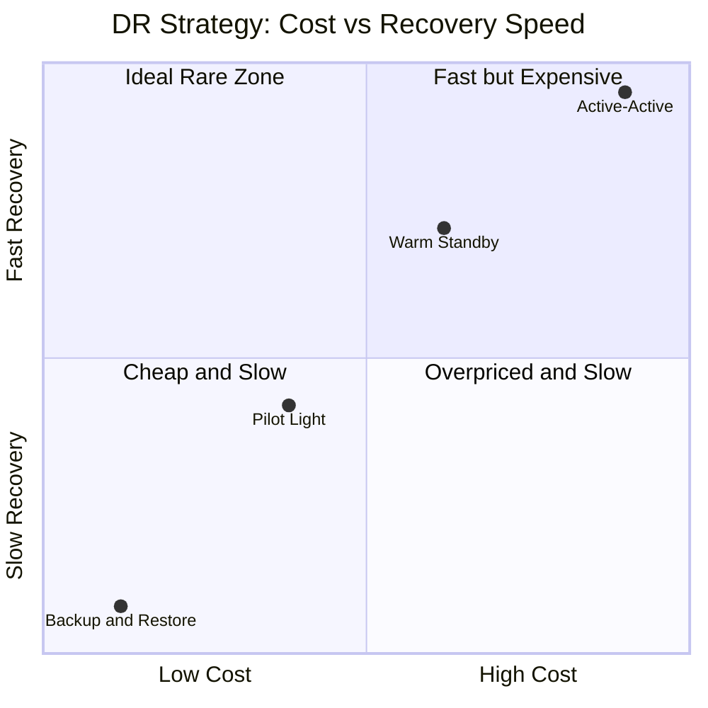
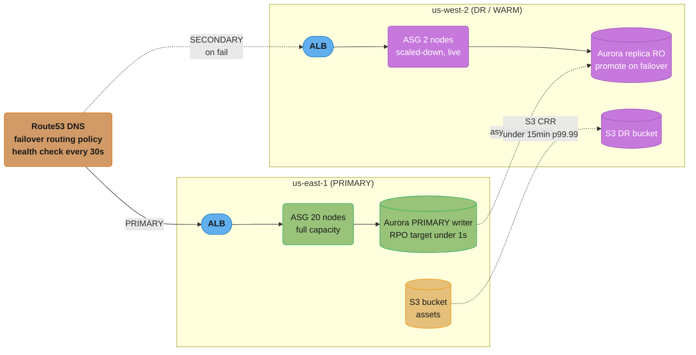
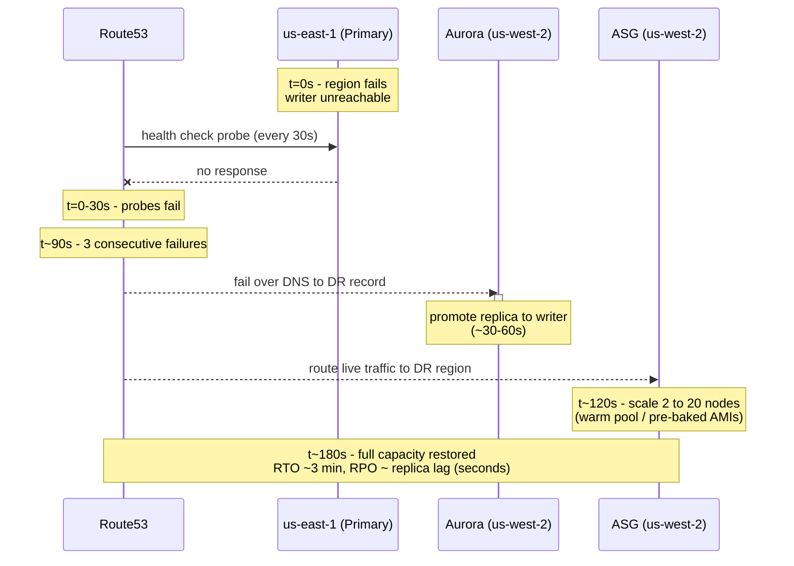
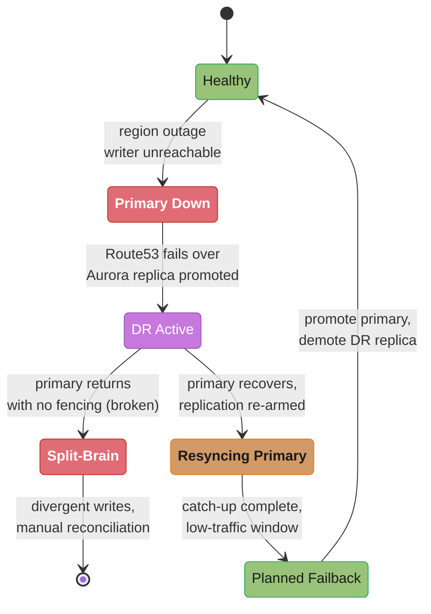

# Disaster Recovery and Resilience

> Phase 7 — DevSecOps & Reliability · Difficulty: Advanced

---

## 1. Concept Overview

Disaster recovery (DR) is the set of policies, tooling, and tested procedures that restore a system to working order after a catastrophic event: a region outage, a corrupted database, a ransomware encryption sweep, or a botched deploy that wipes production data. Resilience is the broader discipline of designing systems that absorb failure gracefully — degrading instead of collapsing — so that most "disasters" never escalate into outages at all.

DR is governed by two numbers. **RTO (Recovery Time Objective)** is the maximum tolerable time to restore service: how long can you be down? **RPO (Recovery Point Objective)** is the maximum tolerable data loss measured in time: how many minutes of writes can you afford to lose? A bank ledger might demand RTO 60 seconds and RPO 0; an internal analytics dashboard might accept RTO 24 hours and RPO 24 hours. Every architectural and budget decision flows from these two targets.

AWS codifies four DR strategies that trade cost against RTO/RPO: **Backup & Restore** (cheapest, RTO hours, RPO hours), **Pilot Light** (RTO 10–30 min, RPO minutes), **Warm Standby** (RTO minutes, RPO seconds), and **Multi-Site Active/Active** (RTO seconds, RPO near zero, highest cost). The engineering job is to map each workload to the cheapest tier that still meets its business-mandated RTO/RPO — not to over-build active/active for a reporting service, nor under-build backup-restore for a payments ledger.

This module cross-references [`../../../database/backup_recovery_and_disaster_recovery`](../../../database/backup_recovery_and_disaster_recovery) for database-level replication and PITR detail, and [`../cloud_networking_and_cdn/README.md`](../cloud_networking_and_cdn/README.md) for the DNS and CDN failover plumbing. Chaos engineering — deliberately injecting failure to validate resilience — is covered generically here and ties into the backend chaos-engineering practices.

---

## 2. Intuition

> **One-line analogy**: DR is the fire drill and the sprinkler system for your data — the sprinkler limits how much burns (RPO), the drill determines how fast everyone is back at their desks (RTO).

**Mental model**: Think of two stopwatches. One started the instant the last successful backup or replica write committed — that gap is your RPO, the data you have already lost. The other starts the moment disaster strikes and stops when service is restored — that span is your RTO. DR engineering is shrinking both stopwatches to the point the business will accept, and not one second further (because each second costs money).

**Why it matters**: Without a tested DR plan, "are we covered?" is answered by hope. Backups that have never been restored are not backups — they are untested assumptions. The 2017 GitLab incident lost 6 hours of production data precisely because five separate backup mechanisms had all silently failed; nobody had run a restore drill.

**Key insight**: **A backup you have never restored is a liability, not an asset.** RTO and RPO are not achieved by configuring replication — they are *proven* by game days that restore from cold and measure the wall-clock time. Untested DR has an effective RTO of infinity.

---

## 3. Core Principles

1. **RTO and RPO drive everything**. Pick them per-workload from business impact, then choose the cheapest DR tier that satisfies both. Never let the technology pick the targets.

2. **Test the recovery, not the backup**. A green backup job tells you bytes were written. Only a restore drill tells you the bytes are usable, the runbook is correct, and the RTO is real. Run drills quarterly at minimum.

3. **Isolate the blast radius**. A disaster in one region, account, or failure domain must not propagate to the recovery target. Store backups in a separate account/region with restricted delete permissions (immutable / object-lock) to survive ransomware and fat-finger deletes.

4. **Automate failover, gate failback**. Failover should be one button or fully automatic (Route53 health checks). Failback — returning to the primary — is riskier (data reconciliation) and should be a deliberate, reviewed action.

5. **Replication lag is your RPO floor**. Asynchronous replication means RPO equals the replication lag at the moment of failure. Synchronous replication gives RPO 0 but adds write latency and a cross-AZ/region availability coupling.

6. **Degrade, don't collapse**. Resilience patterns — circuit breakers, bulkheads, load shedding, graceful read-only modes — keep the system partially useful during failure, often avoiding a DR event entirely.

7. **Capacity must exist at failover time**. A warm standby with 10% capacity that must scale to 100% during a regional outage may hit cloud capacity limits exactly when every other tenant is also failing over. Pre-provision or reserve.

---

## 4. Types / Architectures / Strategies

The four AWS DR strategies, ordered by increasing cost and decreasing RTO/RPO:

- **Backup & Restore** — Periodic backups (RDS snapshots, S3, AMIs) replicated to the DR region. No standby infrastructure runs. On disaster, you provision everything from scratch (IaC) and restore data. RTO: hours (often 4–24h). RPO: hours (the backup interval). Cost: lowest — you pay only for stored snapshots (~$0.05/GB-month for S3 Standard plus cross-region transfer).

- **Pilot Light** — A minimal always-on core in the DR region: the database is continuously replicated (RDS cross-region read replica or Aurora replica) but kept small; application servers are switched off (AMIs ready, ASGs at 0). On disaster, scale the ASGs up and promote the replica. RTO: 10–30 min. RPO: minutes (replication lag). Cost: pay for the replicated DB + storage, not compute.

- **Warm Standby** — A scaled-down but fully functional copy runs continuously in the DR region (e.g., 2 app servers instead of 20). It can serve traffic immediately, then auto-scale to full capacity. RTO: minutes. RPO: seconds (continuous async replication). Cost: moderate — you run real (if small) infrastructure 24/7.

- **Multi-Site Active/Active** — Full production capacity runs in 2+ regions simultaneously, both serving live traffic behind Route53 latency/weighted routing. Data replicates bidirectionally (Aurora Global Database, DynamoDB Global Tables). On region loss, Route53 drains the dead region; surviving regions absorb the load. RTO: seconds. RPO: near zero (Aurora Global DB RPO typically <1s). Cost: highest — 2× full footprint plus replication egress.

Plotting the four strategies by relative cost against recovery speed shows why the choice is a straight line, not a free lunch — there is no cheap-and-fast option in the top-left quadrant:



Failover mechanisms layered on top:

- **DNS failover (Route53 health checks)**: health checks probe an endpoint every 30s (or 10s "fast" mode); after a configurable failure threshold (default 3), Route53 marks the record unhealthy and serves the failover record. End-to-end DNS failover completes in roughly 60–90s plus client TTL.
- **ALB / Target Group health checks**: intra-region, removes unhealthy targets in seconds.
- **Application-level failover**: client SDK retries to a secondary endpoint; fastest, no DNS propagation.

---

## 5. Architecture Diagrams

Warm standby with Route53 DNS failover and cross-region replication:



Failover timeline (warm standby):



---

## 6. How It Works — Detailed Mechanics

**Aurora Global Database** is the backbone of low-RPO multi-region DR. A primary region holds the writer; up to 5 secondary regions hold read-only replicas. Replication uses a dedicated, purpose-built storage-layer replication (not binlog), achieving typical RPO <1s and cross-region replica lag under 1s. Managed planned failover promotes a secondary to writer in under 1 minute; unplanned ("detach and promote") is a manual or automated API call.

```hcl
# Aurora Global Database: primary in us-east-1, secondary in us-west-2
resource "aws_rds_global_cluster" "global" {
  global_cluster_identifier = "app-global"
  engine                    = "aurora-postgresql"
  engine_version            = "15.4"
}

resource "aws_rds_cluster" "primary" {
  provider                  = aws.use1
  cluster_identifier        = "app-primary"
  engine                    = "aurora-postgresql"
  global_cluster_identifier = aws_rds_global_cluster.global.id
  master_username           = "app"
  master_password           = var.db_password
  db_subnet_group_name      = aws_db_subnet_group.use1.name
}

resource "aws_rds_cluster" "secondary" {
  provider                  = aws.usw2
  cluster_identifier        = "app-secondary"
  engine                    = "aurora-postgresql"
  global_cluster_identifier = aws_rds_global_cluster.global.id
  db_subnet_group_name      = aws_db_subnet_group.usw2.name
  depends_on                = [aws_rds_cluster.primary]
}
```

**Route53 health-checked failover** swings DNS when the primary is down:

```hcl
resource "aws_route53_health_check" "primary" {
  fqdn              = "primary.app.example.com"
  port              = 443
  type              = "HTTPS"
  resource_path     = "/healthz"
  request_interval  = 30   # "30" standard, "10" for fast health checks
  failure_threshold = 3    # 3 x 30s ~ 90s to mark unhealthy
}

resource "aws_route53_record" "primary" {
  zone_id         = var.zone_id
  name            = "app.example.com"
  type            = "A"
  set_identifier  = "primary"
  health_check_id = aws_route53_health_check.primary.id
  failover_routing_policy { type = "PRIMARY" }
  alias {
    name                   = aws_lb.primary.dns_name
    zone_id                = aws_lb.primary.zone_id
    evaluate_target_health = true
  }
}

resource "aws_route53_record" "secondary" {
  zone_id        = var.zone_id
  name           = "app.example.com"
  type           = "A"
  set_identifier = "secondary"
  failover_routing_policy { type = "SECONDARY" }
  alias {
    name                   = aws_lb.dr.dns_name
    zone_id                = aws_lb.dr.zone_id
    evaluate_target_health = true
  }
}
```

**S3 Cross-Region Replication (CRR)** replicates objects asynchronously; with S3 Replication Time Control (RTC) AWS contractually replicates 99.99% of objects within 15 minutes. Enabling object lock on the destination protects against ransomware deletes.

**Failback** is the reverse: once the primary region recovers, you re-establish replication *back* into it (now as a secondary), let it catch up, then perform a planned, low-traffic-window failover to promote it again. Skipping the catch-up step risks split-brain and data loss.

The region lifecycle below makes the "gate failback" rule concrete: the happy path (green) resyncs and promotes deliberately, while skipping fencing on the primary's return falls into the split-brain danger path (red) instead:



---

## 7. Real-World Examples

- **Netflix** runs active/active across 3 AWS regions. Their Chaos Kong exercise deliberately fails an entire region; Route53 and Zuul reroute traffic so members never notice. They evacuate a region in under 7 minutes routinely, validated continuously rather than annually.

- **GitLab (2017 postmortem)** accidentally `rm -rf`'d the primary PostgreSQL data directory and discovered all 5 backup/replication methods were broken or stale. They restored from a 6-hour-old staging snapshot, losing 6 hours of issues, merge requests, and comments. The lesson became industry canon: untested backups are not backups.

- **AWS US-EAST-1 outages (2020, 2021)** repeatedly demonstrated why even single-cloud shops with global ambitions multi-region: Kinesis and then the network control plane in us-east-1 cascaded into dozens of dependent services. Workloads pinned to a single region went dark; those with warm standby in us-west-2 stayed up.

- **Salesforce / Hyperforce** uses active/active across availability zones with synchronous database replication for RPO 0 on transactional data, plus async cross-region for regional DR, sized to a sub-4-hour RTO contractual commitment.

---

## 8. Tradeoffs

| Strategy | RTO | RPO | Relative cost | Standby compute | Best for |
|---|---|---|---|---|---|
| Backup & Restore | 4–24 h | hours | 1x (storage only) | none | Dev/test, low-tier internal apps |
| Pilot Light | 10–30 min | minutes | ~1.5x | DB only, app off | Cost-sensitive prod, tolerant of short outage |
| Warm Standby | minutes | seconds | ~2–3x | scaled-down, live | Customer-facing apps, moderate budget |
| Active/Active | seconds | ~0 (<1s) | ~2x+ full | full in both regions | Payments, trading, tier-0 critical |

| Dimension | Sync replication | Async replication |
|---|---|---|
| RPO | 0 | replication lag (seconds–minutes) |
| Write latency | +cross-region RTT (10–80 ms) | unaffected |
| Failure coupling | high (remote outage stalls writes) | low (independent) |
| Typical use | same-region multi-AZ, finance | cross-region DR |

---

## 9. When to Use / When NOT to Use

**Use multi-site active/active when**: the workload is tier-0 (payments, auth, trading), every minute of downtime is quantifiably expensive (>$10k/min), and RPO 0 / RTO seconds is contractually required. Also when you already need geo-distributed read latency.

**Use warm standby when**: you are a customer-facing SaaS that can tolerate a few minutes of failover but not hours, and cannot justify doubling the full production footprint. This is the pragmatic default for most production systems.

**Use pilot light / backup-restore when**: the workload is internal, batch, or analytical; RTO of tens of minutes to hours is acceptable; and budget pressure is real. Backup-restore is also the correct floor for *every* system regardless of tier — even active/active needs immutable backups to survive logical corruption.

**Do NOT** build active/active for a system that has no real-time write requirement — you pay double for capacity and fight bidirectional-replication conflict resolution for no business gain. **Do NOT** rely on a DR plan you have not drilled in the last quarter. **Do NOT** put backups in the same account/region as production — a compromised credential or regional outage takes both.

---

## 10. Common Pitfalls

1. **Backups never restored**. The single most common and most catastrophic failure. Schedule automated restore drills.

2. **Standby capacity that cannot scale at failover**. Reserving 2 nodes that must become 20 during a *regional* outage — exactly when capacity is scarce — can fail. Use capacity reservations or warm pools.

3. **DNS TTL too high**. A 3600s TTL means clients keep hitting the dead region for up to an hour after Route53 fails over.

4. **Forgetting the failback plan**, causing split-brain when the primary returns and both regions accept writes.

Broken Route53 failover record — no health check attached and a 1-hour TTL, so failover never triggers and clients cache the dead region for an hour:

```hcl
# BROKEN: failover record with no health check + huge TTL
resource "aws_route53_record" "primary" {
  zone_id        = var.zone_id
  name           = "app.example.com"
  type           = "A"
  ttl            = 3600          # clients cache dead region for 1 hour
  records        = ["203.0.113.10"]
  set_identifier = "primary"
  failover_routing_policy { type = "PRIMARY" }
  # no health_check_id -> Route53 cannot detect failure -> never fails over
}
```

```hcl
# FIX: attach a health check, use an alias with evaluate_target_health,
# and a low TTL (alias to ALB needs no explicit TTL).
resource "aws_route53_health_check" "primary" {
  fqdn              = "primary-alb.example.com"
  type              = "HTTPS"
  resource_path     = "/healthz"
  request_interval  = 10   # fast health check, ~30s to detect
  failure_threshold = 3
}

resource "aws_route53_record" "primary" {
  zone_id         = var.zone_id
  name            = "app.example.com"
  type            = "A"
  set_identifier  = "primary"
  health_check_id = aws_route53_health_check.primary.id
  failover_routing_policy { type = "PRIMARY" }
  alias {
    name                   = aws_lb.primary.dns_name
    zone_id                = aws_lb.primary.zone_id
    evaluate_target_health = true   # health drives failover, no stale TTL cache
  }
}
```

5. **Replication lag ignored**. An async replica 5 minutes behind means RPO is 5 minutes, not "seconds" — monitor `AuroraReplicaLag` / `ReplicaLag` and alert above your RPO budget.

---

## 11. Technologies & Tools

| Tool | Layer | RPO capability | RTO capability | Notes |
|---|---|---|---|---|
| Aurora Global Database | Database | <1s | <1 min (managed failover) | Storage-layer replication, up to 5 secondaries |
| RDS cross-region read replica | Database | seconds–minutes | 10–30 min (promote) | Binlog-based, manual promote |
| DynamoDB Global Tables | Database | sub-second | seconds | Multi-active, last-writer-wins |
| AWS Route53 health checks | DNS failover | n/a | 60–90s detection + TTL | 30s/10s intervals, failover routing |
| S3 CRR + RTC | Object storage | <15 min p99.99 | n/a (always available) | Object lock for ransomware protection |
| AWS Elastic Disaster Recovery (DRS) | Block/host | seconds (CDP) | minutes | Continuous block replication, pilot-light style |

GCP equivalents: Cloud SQL cross-region replicas, Spanner multi-region (RPO 0), Cloud DNS routing policies. Azure: Azure Site Recovery, SQL auto-failover groups, Cosmos DB multi-region writes, Traffic Manager / Front Door for DNS failover.

---

## 12. Interview Questions with Answers

**Q: Define RTO and RPO and explain how each drives architecture.**
RTO is the maximum acceptable downtime (time to restore service); RPO is the maximum acceptable data loss measured in time. RTO pushes you toward standby infrastructure and automated failover (warm/active-active shrink RTO to minutes/seconds), while RPO pushes you toward replication frequency and synchronicity (sync replication or sub-second async gives RPO near zero). Set both from business impact first, then pick the cheapest DR tier that satisfies both.

**Q: Walk through the four AWS DR strategies and their tradeoffs.**
Backup & Restore (RTO hours, RPO hours, cheapest, no standby), Pilot Light (RTO 10–30 min, RPO minutes, DB replicated but app off), Warm Standby (RTO minutes, RPO seconds, scaled-down live copy), Active/Active (RTO seconds, RPO ~0, full footprint in both regions, most expensive). Cost and complexity rise as RTO/RPO fall. Map each workload to the lowest tier meeting its targets — active/active for payments, backup-restore for internal reporting.

**Q: How does Route53 DNS failover work and what is its realistic detection time?**
Route53 attaches a health check (probing an endpoint every 30s standard or 10s fast) to a PRIMARY failover record; after a failure threshold (default 3 consecutive failures) it stops returning the primary and serves the SECONDARY record. Detection takes roughly 90s at standard interval (~30s fast), plus client-side DNS TTL caching. Keep TTLs low (or use ALB aliases with evaluate_target_health) so clients pick up the change quickly.

**Q: Why is "the backup succeeded" insufficient, and what do you do instead?**
A successful backup job only proves bytes were written, not that they are restorable, complete, or that your runbook works. GitLab in 2017 had five backup methods all silently broken and lost 6 hours of data. Run scheduled restore drills (game days) that restore from cold into a clean environment and measure the actual wall-clock RTO and the data gap (RPO).

**Q: What RPO does Aurora Global Database provide and how?**
Typically under 1 second, via dedicated storage-layer replication (not binlog) that ships changes from the primary region's storage volume to secondary regions with sub-second lag. Managed planned failover promotes a secondary to writer in under a minute; unplanned failover is an API call. Monitor `AuroraGlobalDBReplicationLag` and alert if it exceeds your RPO budget.

**Q: What is the difference between synchronous and asynchronous replication for DR?**
Synchronous replication acknowledges a write only after the replica has it, giving RPO 0 but adding the cross-region round-trip (10–80 ms) to every write and coupling availability to the remote site. Asynchronous replication acknowledges locally and ships changes in the background, keeping write latency low but making RPO equal to the replication lag at failure. Use sync within a region (multi-AZ) and async across regions.

**Q: What is split-brain in failover and how do you prevent it?**
Split-brain is when both the primary and the promoted secondary accept writes simultaneously (e.g., the primary recovers but the secondary was already promoted), producing divergent, conflicting data. Prevent it with fencing — ensure the old primary is demoted/isolated before promoting the secondary — and use a single source of truth for "who is writer" (a managed failover API rather than ad-hoc promotion). Gate failback through a deliberate, reviewed process with replication catch-up.

**Q: Your warm standby runs 2 nodes and must scale to 20 during a regional failover. What can go wrong?**
At a regional outage every tenant fails over at once, so the DR region's spare capacity is in contention and your scale-from-2-to-20 request may be throttled or denied exactly when you need it. Mitigate with On-Demand Capacity Reservations, EC2 warm pools (pre-initialized stopped instances), or running closer to full capacity. Pre-baked AMIs also cut the per-node boot time materially.

**Q: How do you protect backups against ransomware and accidental deletion?**
Store backups in a separate AWS account with cross-account replication, enable S3 Object Lock (WORM) in compliance mode so even root cannot delete before retention expires, and use MFA-delete. This breaks the blast radius — a compromised production credential cannot reach the immutable backup copy. Combine with versioning and at least one offline or logically-airgapped copy for tier-0 data.

**Q: What is chaos engineering and how does it relate to DR?**
Chaos engineering deliberately injects failures (kill instances, blackhole a region, add latency) into production-like systems to validate that resilience mechanisms actually work before a real disaster tests them. It turns DR from an untested assumption into a continuously verified property — Netflix's Chaos Kong fails entire regions on a schedule. Start small (one instance) with a defined blast radius and abort conditions, then escalate to region evacuation game days.

**Q: How do you calculate the RPO you are actually achieving in production?**
RPO equals the replication lag at the moment of failure for async systems, or the backup interval for backup-restore. Continuously measure the lag metric (`ReplicaLag`, `AuroraGlobalDBReplicationLag`, or replication queue depth) and the age of the most recent successful backup, then alert when either exceeds the target. Your worst-case RPO is the maximum observed lag, not the average — design and alert against the tail.

**Q: Design a DR strategy for a multi-tenant SaaS with a 5-minute RTO and 30-second RPO requirement.**
Warm standby in a second region: continuous async replication (Aurora cross-region replica or Global DB for sub-second lag, comfortably under 30s RPO) plus a scaled-down but live app tier behind Route53 failover with a fast (10s) health check. Pre-bake AMIs and use warm pools so scaling from minimal to full completes within the 5-minute RTO, and reserve capacity in the DR region. Validate the full failover quarterly with a game day that measures actual RTO/RPO, and store immutable cross-account backups as the logical-corruption safety net.

---

## 13. Best Practices

1. **Set RTO/RPO per workload tier** and document them; review against business impact yearly.
2. **Run restore game days quarterly** — restore from cold, measure real RTO/RPO, fix the runbook gaps you find.
3. **Use Infrastructure as Code for the DR region** so it is reproducible and drift-free; the recovery procedure is `terraform apply` plus data restore.
4. **Keep backups immutable and cross-account** (S3 Object Lock, separate account) to survive ransomware and fat-fingers.
5. **Monitor and alert on replication lag** against the RPO budget, not just on backup success.
6. **Keep DNS TTLs low** (or use ALB aliases with health evaluation) so failover is not defeated by client caching.
7. **Pre-provision or reserve failover capacity**; never assume on-demand will be available during a regional event.
8. **Automate failover, gate failback** through a reviewed process with replication catch-up to avoid split-brain.
9. **Practice chaos engineering** with bounded blast radius to continuously prove resilience, not just assume it.
10. **Run a post-incident review** after every real DR event or drill and feed corrections back into the runbook.

---

## 14. Case Study

**Scenario**: A fintech payments API processes 4,000 transactions/sec, generating roughly $2.4M/hour. The business mandates RTO 5 minutes and RPO 0 for the ledger. The team initially deployed a single-region multi-AZ stack and "DR" consisted of nightly RDS snapshots — an effective RTO of 6+ hours and RPO of 24 hours, wildly out of spec.

The redesign uses **active/active across us-east-1 and us-west-2**: Aurora Global Database (RPO <1s, but the ledger writer is pinned to one region with sync multi-AZ for true RPO 0 on committed transactions), Route53 latency routing with health-checked failover, and full app capacity in both regions. Failover is automatic; a region loss drains via Route53 in ~90s and the surviving region absorbs traffic it was already partly serving.

The first failover game day exposed a latent bug: the application's database connection string was hardcoded to the primary region's writer endpoint, so even after Aurora promoted the secondary, the app kept dialing the dead region.

```bash
# BROKEN: hardcoded primary-region writer endpoint in the deployed config.
# After failover, Aurora promotes us-west-2, but the app still dials us-east-1
# and every write fails -> RTO blown despite a healthy DR database.
export DATABASE_URL="postgres://app@app-primary.cluster-abc123.us-east-1.rds.amazonaws.com:5432/ledger"
```

```bash
# FIX: dial the Global Database *cluster* endpoint (region-local writer
# resolution) and resolve the region at runtime from instance metadata,
# so the app always talks to whichever region is currently the writer.
REGION=$(curl -s http://169.254.169.254/latest/meta-data/placement/region)
export DATABASE_URL="postgres://app@app-global.cluster-write.${REGION}.rds.amazonaws.com:5432/ledger?target_session_attrs=read-write"
# target_session_attrs=read-write ensures the driver only commits to a true
# writer, rejecting a stale read-only endpoint after a partial failover.
```

**Outcome**: After fixing the endpoint resolution and adding `target_session_attrs=read-write` so the driver refuses to write to a read-only node, the next game day measured RTO of 2 minutes 50 seconds and RPO 0 for committed transactions (verified by reconciling the last committed ledger ID across regions). The team now runs the region-evacuation game day monthly, and replication lag is alerted at 500 ms — half the RPO budget — giving headroom before any breach.
