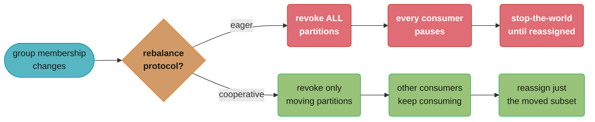
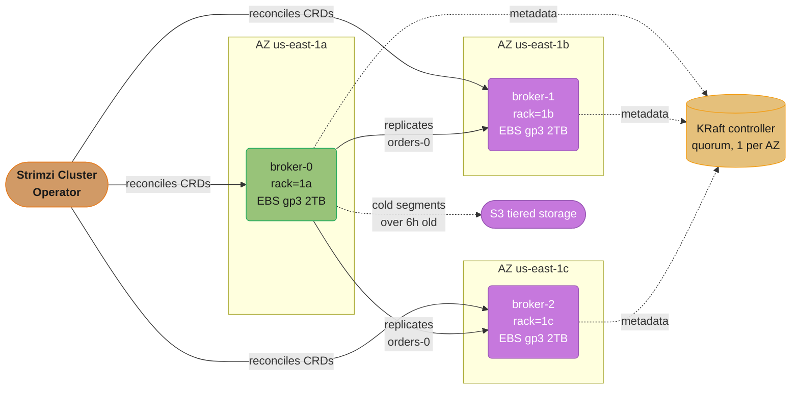
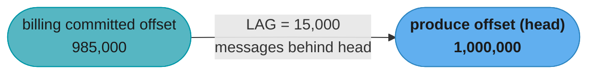
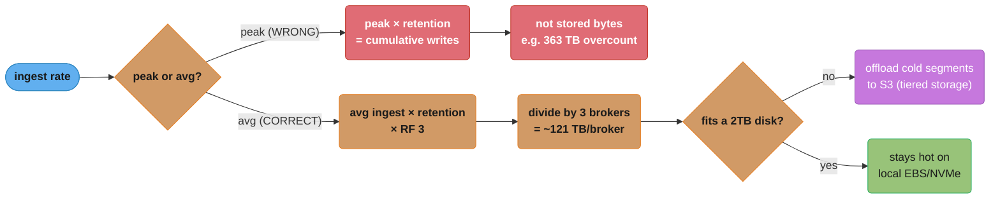
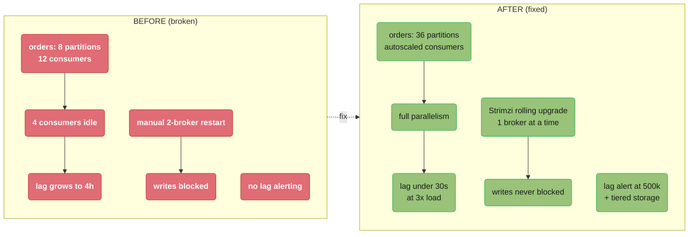

# Event Streaming Operations

> Phase 8 — Specialized Platforms & Performance · Difficulty: Advanced · Q&A target: 12

Operating Apache Kafka (and Kafka-compatible streaming) as platform infrastructure: the Strimzi operator on Kubernetes, partition and disk capacity sizing, consumer-lag monitoring, rebalancing without latency spikes, rack awareness for AZ-failure survival, and tiered storage for cost. This module owns the **run-it-at-scale** angle. For the *messaging concepts* themselves (delivery semantics, partitioning theory, log compaction, the dual-write/outbox pattern) cross-reference [`../../hld/`](../../hld/) and the backend messaging material; for *application consumer/producer code patterns* see [`../../spring/spring_messaging/`](../../spring/spring_messaging/). Here we focus on keeping the cluster alive, sized, and observable.

---

## 1. Concept Overview

A streaming platform team runs Kafka so that dozens of producer and consumer teams don't each operate their own brokers. The platform must guarantee durability (no acknowledged message is ever lost), availability (survive a broker or whole-AZ failure), throughput (sustain peak ingest), and bounded cost (disk is the dominant expense). None of that is automatic — Kafka is a **stateful distributed log** where every broker holds gigabytes-to-terabytes of partition data on disk, and a careless config or operation (an under-replicated topic, a naive rolling restart, an unthrottled rebalance) can drop data or stall every consumer.

The operational surface area:

- **Cluster topology** — brokers, the controller (KRaft has replaced ZooKeeper as of Kafka 3.5+; ZooKeeper removed in 4.0), replication factor, `min.insync.replicas`, rack awareness across AZs.
- **Capacity** — partition count (the unit of parallelism *and* of open file handles), disk per broker, retention, throughput per partition.
- **Consumer health** — consumer-group **lag** (the single most important streaming metric), rebalance frequency, partition assignment.
- **Operations** — rolling upgrades without downtime, partition reassignment/rebalancing with throttling, scaling brokers, tiered storage to offload cold segments to S3.
- **The operator** — Strimzi turns all of this into Kubernetes CRDs (`Kafka`, `KafkaTopic`, `KafkaUser`, `KafkaRebalance`) so the cluster is declarative and self-healing, rather than a fleet of hand-tuned VMs.

---

## 2. Intuition

> A Kafka cluster is a **fleet of append-only ledgers in a bank vault**. Each partition is one ledger; you only ever write to the bottom and read forward. Replication factor 3 means three clerks keep identical copies in three different vault rooms (AZs), so a fire in one room loses nothing. Consumer lag is *how many pages behind the slowest reader is* — if it grows without bound, someone is falling behind and will eventually be locked out (data expires past retention) before they catch up. A rebalance is *reshuffling which clerk reads which ledger* — necessary, but everyone stops reading while the reshuffle happens.

**Mental model:** Partitions are the atom of everything. Parallelism is capped at partition count (you cannot have more active consumers in a group than partitions). Disk cost scales with `partitions × retention × throughput × replication factor`. Open file handles scale with partitions. So "how many partitions" is the load-bearing capacity decision.

**Why it matters:** Streaming sits on the critical path of event-driven systems — payments, order pipelines, CDC, metrics. When Kafka stalls, *everything downstream stalls silently*; producers may keep accepting writes while consumers fall hours behind, and you only notice when a customer-facing freshness SLA breaks. Lag is the early-warning system.

**Key insight:** Almost every Kafka incident is a **capacity or rebalance** problem in disguise — disk filled because retention × partitions was mis-sized, or consumers stalled because a deploy triggered a stop-the-world rebalance. Get partition sizing and rebalance discipline right and the cluster is boring, which is the goal.

---

## 3. Core Principles

1. **Durability is `acks=all` + `min.insync.replicas=2` + RF=3.** Producers must wait for all in-sync replicas; the topic must require at least 2 ISR to accept a write. RF=3 with `min.insync.replicas=2` survives one broker loss and still accepts writes; lose two and writes block (correctly — better than losing data).
2. **Partitions are the unit of parallelism and the unit of cost.** More partitions = more consumer parallelism and more producer throughput, but also more open files, more memory for the page cache, longer leader-election and rebalance times, and more replication traffic. There is a real upper bound per broker (~4,000 partitions/broker is a common practical ceiling; KRaft raised cluster totals into the millions but per-broker limits remain).
3. **Lag, not throughput, is the health signal.** A consumer group keeping up has near-zero lag; growing lag means consume rate < produce rate, and the consumer will eventually hit the retention edge and lose data.
4. **Rebalances are stop-the-world by default.** When group membership changes (a consumer joins/leaves/dies, or a deploy), the group pauses all consumption to reassign partitions. Frequent or slow rebalances are a top cause of lag spikes; cooperative/incremental rebalancing and static membership mitigate this.
5. **Rack awareness is mandatory for AZ-failure survival.** Without `broker.rack` set to the AZ, Kafka may place all 3 replicas of a partition in one AZ; that AZ failing takes the partition offline despite RF=3.
6. **Reassignment must be throttled.** Moving partitions between brokers (to rebalance load or add a broker) copies data; unthrottled, it saturates the network and starves client traffic. Always set a replication throttle.

---

## 4. Types / Architectures / Strategies

**Deployment models:**

| Model | What it is | When |
|-------|-----------|------|
| Self-managed on VMs | Brokers on EC2 with EBS, manual ops | Legacy / full control; high ops burden |
| Strimzi on Kubernetes | Operator-managed Kafka via CRDs | Cloud-native default; declarative, self-healing |
| Amazon MSK | AWS-managed Kafka | Offload ops; less tuning control, AWS-priced |
| MSK Serverless / Confluent Cloud / Redpanda Cloud | Fully serverless | No capacity planning; premium price, vendor lock |

**Controller modes:**

| Mode | Metadata store | Status |
|------|---------------|--------|
| ZooKeeper | External ZK ensemble | Deprecated; removed in Kafka 4.0 |
| KRaft | Internal Raft quorum of controllers | Default since 3.5+; scales to millions of partitions, faster failover |

**Rebalance protocols:**

| Protocol | Behavior | Tradeoff |
|----------|----------|----------|
| Eager (range/round-robin) | Revoke ALL partitions, reassign | Simple; full stop-the-world pause |
| Cooperative (incremental) | Revoke only moving partitions | Much smaller pause; default for new clients |
| Static membership | `group.instance.id` pins assignment | Survives transient restarts without rebalancing at all |

Why cooperative pauses less than eager — same trigger, different blast radius:


Both protocols react to the same trigger (a consumer joins, leaves, crashes, or a deploy restarts pods); eager revokes every partition from every consumer, while cooperative revokes only the partitions actually moving — the mechanical reason a large deploy pauses the whole group under eager but barely dents it under cooperative.

**Storage tiers:**

| Tier | Location | Use |
|------|----------|-----|
| Hot | Broker local disk (EBS gp3 / NVMe) | Recent segments, low-latency reads |
| Tiered (cold) | S3 / object store (KIP-405, MSK Tiered Storage) | Old segments offloaded; cheap long retention |

---

## 5. Architecture Diagrams

Strimzi-managed Kafka spread across 3 AZs with rack awareness:


Topic `orders` partition 0 (RF=3): broker-0 leads and replicates one-per-rack to broker-1 and broker-2, so losing a whole AZ still leaves 2 ISR and the partition stays online.

Consumer-group lag, the core health view:


LAG = `log-end-offset − committed-offset`, summed across all partitions; flat near zero is healthy, while a widening gap (consume rate < produce rate) must be caught before it reaches the retention edge.

**In plain terms.** "Lag counts messages, but what you actually care about is time — divide the message count by the produce rate and you get how many seconds of history the consumer is standing behind."

| Symbol | What it is |
|--------|------------|
| `log-end-offset` | The offset of the newest message in the partition — the head of the log |
| `committed-offset` | The last offset the consumer group durably committed as processed |
| LAG | `log-end-offset - committed-offset`, per partition, summed over the group |
| Produce rate `p` | Messages per second being appended to the partition |
| Time behind | `LAG / p` — how stale the consumer's view of the world is |
| Retention edge | Where `LAG / p` reaches `retention.ms`; past it, unread data is deleted |

**Walk one example.** Take the diagram's numbers, then a topic producing 50,000 msg/s with 7-day retention:

```
  from the diagram:
    LAG = 1,000,000 - 985,000 = 15,000 messages
    at 50,000 msg/s  ->  15,000 / 50,000 = 0.3 seconds behind  (healthy)

  what the retention edge is, in messages:
    7 days = 604,800 s  x  50,000 msg/s = 30,240,000,000 messages retained

  a consumer that stops entirely (consume rate = 0):
    lag grows at the full produce rate, 50,000 msg/s
    time to hit the edge = 604,800 s / 1 = 7 days   <- exactly the retention window

  a consumer running at 90% of produce rate (45,000 msg/s):
    lag grows at 50,000 - 45,000 = 5,000 msg/s
    time to the edge = 30,240,000,000 / 5,000 = 6,048,000 s = 70 days
```

**The bound worth memorizing.** A completely dead consumer reaches the retention edge in exactly `retention.ms`, never sooner — retention is your hard deadline to notice and fix a stall. A partially-slow consumer gets proportionally longer, which is why a lag graph that is *rising slowly* is a ticket while one *rising at the full produce rate* is a page: the second one means nobody is consuming at all, and the clock is the retention window itself.

---

## 6. How It Works — Detailed Mechanics

### 6.1 A durable Strimzi Kafka cluster (KRaft, rack-aware)

```yaml
apiVersion: kafka.strimzi.io/v1beta2
kind: Kafka
metadata:
  name: prod
spec:
  kafka:
    replicas: 3
    config:
      default.replication.factor: 3
      min.insync.replicas: 2          # with acks=all -> survive 1 broker, still writable
      offsets.topic.replication.factor: 3
      transaction.state.log.min.isr: 2
      # spread replicas one-per-AZ:
      replica.selector.class: org.apache.kafka.common.replica.RackAwareReplicaSelector
    rack:
      topologyKey: topology.kubernetes.io/zone   # Strimzi sets broker.rack from the node's AZ
    storage:
      type: persistent-claim
      size: 2Ti
      class: gp3
    resources:
      requests: { memory: 32Gi, cpu: "4" }
      limits:   { memory: 32Gi, cpu: "8" }
    jvmOptions:
      "-Xms": "8g"     # heap small; leave the rest of RAM for the page cache (Kafka's real cache)
      "-Xmx": "8g"
  # KRaft controllers (no ZooKeeper):
  # (Strimzi uses KafkaNodePool CRDs for controller/broker roles in recent versions)
```

A topic declared as a CRD (so it's GitOps-managed, not `kafka-topics.sh`):

```yaml
apiVersion: kafka.strimzi.io/v1beta2
kind: KafkaTopic
metadata:
  name: orders
  labels: { strimzi.io/cluster: prod }
spec:
  partitions: 36          # sized for parallelism + throughput (see 6.2)
  replicas: 3
  config:
    retention.ms: "604800000"   # 7 days
    min.insync.replicas: "2"
    cleanup.policy: delete      # or "compact" for changelog/CDC topics
```

### 6.2 Partition and disk sizing (the capacity math)

Two independent sizings: **partition count** (for throughput/parallelism) and **disk** (for retention).

Partition count — size to peak throughput and target per-partition limits:
```
target throughput        = 600 MB/s peak
per-partition write limit = ~10–25 MB/s (depends on hardware; use a measured number)
min partitions for write  = 600 / 20  = 30
also: partitions >= max desired consumer parallelism in any one group
choose 36 (round up, leave headroom; avoid frequent re-partitioning which is disruptive)
```

**What the formula is telling you.** "Partition count is a max of two independent floors — one set by bytes per second, one set by how many consumers you want working at once — and you take whichever is larger, then add headroom because raising it later is disruptive."

| Symbol | What it is |
|--------|------------|
| Target throughput | Peak write rate the topic must sustain, 600 MB/s here |
| Per-partition limit | Measured write ceiling for one partition, ~10-25 MB/s on typical hardware |
| Throughput floor | `target / per_partition_limit` — partitions needed for bytes alone |
| Parallelism floor | Max consumers you want active in one group; a partition feeds exactly one consumer |
| Chosen count | `max(floors)` rounded up for headroom — 36 here |

**Walk one example.** Watch how sensitive the answer is to the per-partition number you assume, then stress it:

```
  per-partition limit assumed     partitions required = 600 / limit
    10 MB/s (conservative)          600 / 10 = 60
    20 MB/s (the module's choice)   600 / 20 = 30
    25 MB/s (optimistic)            600 / 25 = 24

  chosen 36 against the 30 floor  ->  36 / 30 = 1.2 = 20% headroom
  actual load per partition at 36 ->  600 / 36 = 16.7 MB/s  (comfortably under 20)

  now apply the case study's 3x Black Friday spike:
    1,800 MB/s / 36 partitions = 50.0 MB/s per partition  -> 2x over the 25 MB/s
      optimistic ceiling; the topic is now partition-bound
    partitions needed at 20 MB/s = 1,800 / 20 = 90
```

**Why "measure the per-partition limit" is not optional.** The same 600 MB/s target produces answers between 24 and 60 partitions depending purely on which per-partition number you believe — a 2.5x spread. Guessing high under-provisions the topic and guessing low burns file handles and lengthens every rebalance. And because increasing partitions later rewrites the key-to-partition mapping (the case study's discussion question 1), the cost of getting it wrong is not symmetric: too few is a re-partition under load, too many is merely wasteful.

Disk per broker — retention drives this:
```
ingest          = 600 MB/s
retention       = 7 days = 604,800 s
raw data        = 600 MB/s × 604,800 s ≈ 363 TB over the window... 
  (that's the WRONG way — that's cumulative writes, not stored bytes)

Correct: stored bytes = average_ingest_rate × retention_window × replication_factor
  avg ingest (not peak) say 200 MB/s
  stored = 200 MB/s × 604,800 s ≈ 121 TB raw  × RF 3 = 363 TB replicated
  across 3 brokers = ~121 TB/broker  -> too much for 2TB disks
=> either cut retention, add brokers, or use TIERED STORAGE to push cold to S3.
```

The wrong-path/right-path branch, visualized:


Peak ingest (600 MB/s) over-counts cumulative writes as if they were stored bytes; the correct path — avg ingest (200 MB/s) × retention × RF 3, divided across 3 brokers — is the ~121 TB/broker that actually has to fit on disk, well past a 2TB broker.

This is exactly why tiered storage exists: keep ~6–24h hot on EBS, offload the rest to S3.

**What it means.** "Stored bytes are a standing pool, not a running total: the log only ever holds one retention window's worth of data, so the rate that matters is the average over that window, not the peak you sized partitions with."

| Symbol | What it is |
|--------|------------|
| Peak ingest | 600 MB/s — the right input for *partition* sizing, the wrong one for disk |
| Average ingest | 200 MB/s — the sustained rate over the whole retention window |
| Retention | 7 days = 604,800 seconds |
| RF | Replication factor 3 — every byte is stored three times, on three brokers |
| Stored bytes | `avg_ingest x retention x RF` |
| Per broker | `stored_bytes / broker_count` |

**Walk one example.** Run both paths and then find the hot window that actually fits a 2 TB disk:

```
  WRONG path (peak x retention, treated as stored):
    600 MB/s x 604,800 s = 362,880,000 MB = 362.88 TB
    this is cumulative bytes WRITTEN, and only if peak were sustained all week

  CORRECT path:
    200 MB/s x 604,800 s = 120,960,000 MB = 120.96 TB raw
    x RF 3               = 362.88 TB replicated
    / 3 brokers          = 120.96 TB per broker
    vs a 2 TB disk       = 120.96 / 2 = 60.5x oversubscribed

  so what hot window DOES fit 2 TB per broker?
    per-broker bytes = avg_ingest x window   (the RF 3 and the 3 brokers cancel)
    2,000,000 MB / 200 MB/s = 10,000 s = 2.78 hours

  and to hold the recommended 6h hot window:
    200 MB/s x 21,600 s = 4,320,000 MB = 4.32 TB per broker needed
```

Note the numerical coincidence that makes the wrong path easy to miss: `600 x retention` and `200 x retention x 3` both land on 362.88 TB, because peak happens to be 3x average here. Change the peak-to-average ratio and the two diverge immediately — at 800 MB/s peak the wrong path gives 483.84 TB while the correct answer stays 362.88 TB.

**Why the `/3 brokers` step cancels the RF.** Multiplying by RF 3 and then dividing across 3 brokers returns you to the raw figure, so with one broker per replica each broker holds a full copy of the log. Adding brokers is what actually reduces per-broker bytes: the same workload on 6 brokers stores `362.88 / 6 = 60.48` TB each. That is the third option the text offers — cut retention, add brokers, or tier to S3.

### 6.3 Monitoring consumer lag

Lag is exported by the broker and by tools like **Kafka Lag Exporter** / **Burrow** / Strimzi's metrics into Prometheus:

```promql
# Total lag for the billing consumer group across all partitions:
sum(kafka_consumergroup_lag{consumergroup="billing"})

# Alert: lag rising for 10m AND projected to exceed retention
- alert: ConsumerLagGrowing
  expr: sum(kafka_consumergroup_lag{consumergroup="billing"}) > 500000
  for: 10m
  labels: { severity: page }
  annotations:
    summary: "billing consumer falling behind (lag {{ $value }})"
```

CLI spot-check:
```bash
kafka-consumer-groups.sh --bootstrap-server prod-kafka:9092 \
  --describe --group billing
# TOPIC   PARTITION  CURRENT-OFFSET  LOG-END-OFFSET  LAG
# orders  0          985000          1000000         15000   <- this partition is behind
```

**Put simply.** "A raw lag threshold like 500,000 is meaningless until you divide it by your produce rate — and once you do, the second question is whether you have any spare consume capacity to work the backlog off with."

| Symbol | What it is |
|--------|------------|
| Threshold 500,000 | Total messages of lag across the group that trips the alert |
| `for: 10m` | The lag must stay above the threshold for 10 minutes — ignores deploy blips |
| Produce rate `p` | Messages/s arriving; converts the threshold into seconds of staleness |
| Consume rate `c` | Messages/s the group can process; must exceed `p` to ever catch up |
| Surplus `c - p` | The only rate at which a backlog actually shrinks |

**Walk one example.** Interpret the threshold, then price the case study's 4-hour backlog at 50,000 msg/s:

```
  what 500,000 lag means at p = 50,000 msg/s:
    500,000 / 50,000 = 10 seconds behind the head   <- an EARLY warning, not a crisis
    the retention edge sits at 7 days = 604,800 s of lag, so this fires with
    604,800 / 10 = 60,480x the runway still remaining

  the case study's 4-hour backlog:
    4 x 3,600 x 50,000 = 720,000,000 messages of lag

  draining it depends ENTIRELY on surplus, not on total capacity:
    c = 50,000 (matches produce)  surplus = 0        -> never drains
    c = 60,000 (+20% headroom)    surplus = 10,000   -> 720,000,000 / 10,000
                                                     = 72,000 s = 20 hours
    c = 100,000 (2x capacity)     surplus = 50,000   -> 14,400 s = 4 hours
```

**Why the drain is so much slower than intuition says.** Doubling consumer capacity does not halve the recovery time — it takes a backlog that would never clear and clears it in 4 hours, while a 20% boost takes 20 hours to undo a 4-hour outage. That 5:1 penalty (20 hours to recover 4 hours) is the argument for the case study's KEDA autoscaler: you need surplus capacity to appear automatically during the incident, because provisioning it by hand after the fact means the backlog is still draining long after the traffic spike that caused it has passed.

**The `for: 10m` clause is doing real work.** Every deploy of the consumer group triggers a rebalance pause, so lag spikes and then recovers within a minute or two. Without the 10-minute hold, the page fires on every routine deploy — the exact alert-fatigue pattern that trains on-call to ignore lag alerts entirely.

### 6.4 Rebalancing brokers with Cruise Control (throttled)

Strimzi integrates **Cruise Control** to rebalance partitions across brokers safely. You request a rebalance via a CRD; it computes a plan and executes it under a throttle:

```yaml
apiVersion: kafka.strimzi.io/v1beta2
kind: KafkaRebalance
metadata:
  name: rebalance-after-scaleout
  labels: { strimzi.io/cluster: prod }
spec:
  goals:
    - RackAwareGoal
    - ReplicaCapacityGoal
    - DiskCapacityGoal
    - NetworkInboundCapacityGoal
# Cruise Control moves partitions gradually under a replication throttle so
# client traffic is never starved. Approve with: kubectl annotate kafkarebalance ... strimzi.io/rebalance=approve
```

Manual reassignment must always set a throttle:
```bash
kafka-reassign-partitions.sh --bootstrap-server prod-kafka:9092 \
  --reassignment-json-file plan.json --execute \
  --throttle 50000000     # 50 MB/s cap so reassignment doesn't saturate the NICs
```

**The idea behind it.** "The throttle is a budget split: whatever bandwidth you hand to replication is bandwidth clients do not get, so you are choosing directly between how long the migration runs and how much client latency it costs."

| Symbol | What it is |
|--------|------------|
| `--throttle 50000000` | Bytes per second, so 50,000,000 B/s = 50 MB/s of replication traffic |
| Bytes to move | Total partition data being relocated onto the new or rebalanced broker |
| Migration time | `bytes_to_move / throttle` |
| NIC capacity | The physical ceiling; replication plus client traffic must fit under it |
| Under-replicated partitions | The metric that must return to 0 before the throttle is removed |

**Walk one example.** Move 2 TB of partition data onto a freshly added broker:

```
  2 TB = 2,000,000 MB

  throttle    migration time                       share of a 10 Gbps (1,250 MB/s) NIC
   50 MB/s    2,000,000 /  50 = 40,000 s = 11.1 h    50 / 1,250 =  4%
  100 MB/s    2,000,000 / 100 = 20,000 s =  5.6 h   100 / 1,250 =  8%
  250 MB/s    2,000,000 / 250 =  8,000 s =  2.2 h   250 / 1,250 = 20%
  unthrottled up to line rate  ->  minutes            100% -> clients starve
```

The unthrottled row is the pitfall: replication is a bulk sequential copy that will happily consume the entire NIC, and Kafka gives it no inherent priority below client traffic. Producers then start timing out and consumers fall behind — an operator-caused incident during what was meant to be a routine capacity addition.

**Why 50 MB/s and an 11-hour migration is usually the right answer.** Nothing about the rebalance is urgent; the cluster was already serving traffic before the new broker arrived. Trading 11 hours of background copying for a 4% bandwidth footprint is almost always better than a 20-minute migration that spikes client p99. This is also why Cruise Control is preferred over the manual script — it moves partitions gradually under its own throttle and watches capacity goals, rather than relying on an operator remembering the `--throttle` flag at 2am.

### 6.5 Rolling upgrades without downtime

Strimzi performs rolling restarts respecting **PodDisruptionBudgets** and waiting for ISR to fully recover between brokers — it restarts one broker, waits until all its partitions are back in-sync, then proceeds. Doing this by hand and restarting two brokers of an RF=3/`min.insync.replicas=2` topic at once would drop ISR below 2 and block writes.

---

## 7. Real-World Examples

- **LinkedIn** (Kafka's birthplace) runs trillions of messages/day across thousands of brokers; they built **Cruise Control** specifically to automate rebalancing and broker repair at that scale — manual partition reassignment was unsustainable.
- **Netflix** runs Kafka (the "Keystone" pipeline) for ~trillions of events/day for telemetry and analytics, with heavy investment in monitoring lag and auto-remediation.
- **Cloudflare** publicly documented running Kafka for their pipeline and tuning producer/consumer configs and partition counts to handle millions of messages/second.
- **Strimzi** (a CNCF project, originating from Red Hat) is the standard way enterprises run Kafka on OpenShift/Kubernetes; the `KafkaRebalance` + Cruise Control integration is widely used in production.
- **Amazon MSK** is chosen by teams who want Kafka's API without operating brokers; MSK added **Tiered Storage** (KIP-405-style) so retention can extend to months by offloading to S3 without growing broker EBS.

---

## 8. Tradeoffs

| Decision | Option A | Option B | Guidance |
|----------|----------|----------|----------|
| Run-it | Strimzi on K8s | MSK / Confluent Cloud | Strimzi for control + K8s-native ops; managed for less ops burden |
| Partition count | Few large | Many small | Few = less overhead but caps parallelism; many = parallelism but file-handle/rebalance cost |
| Retention | Long on local disk | Short hot + tiered to S3 | Tiered for cheap long retention; local-only for lowest read latency |
| Rebalance protocol | Eager | Cooperative + static membership | Cooperative+static for low-pause; eager only for old clients |
| Replication factor | 3 | 2 | 3 for prod durability/AZ survival; 2 only for non-critical, cost-sensitive topics |
| Controller | ZooKeeper | KRaft | KRaft for all new clusters (ZK removed in 4.0) |

| Partition count effect | Too few | Too many |
|------------------------|---------|----------|
| Consumer parallelism | Capped, consumers idle | Fine |
| Rebalance/election time | Fast | Slow (more to reassign) |
| Open files / memory | Low | High (can exhaust ulimits) |
| Throughput ceiling | Low | High |

---

## 9. When to Use / When NOT to Use

**Use a Kafka streaming platform when:**
- You need a durable, replayable event log many consumers read independently (CDC, event sourcing, metrics, fan-out).
- High sustained throughput (hundreds of MB/s to GB/s) with ordering per key.
- Decoupling producers from consumers with buffering against downstream slowness.

**Do NOT reach for self-managed Kafka when:**
- You have low volume and a simple work-queue need — SQS/RabbitMQ or a managed queue is far less operational burden.
- Request/response or RPC semantics — Kafka is a log, not an RPC bus.
- You lack the team to operate stateful infra — use MSK Serverless / Confluent Cloud and pay for someone else to run it.
- You need per-message TTL, priority queues, or selective ack — those are queue semantics Kafka doesn't natively provide.

---

## 10. Common Pitfalls

**Pitfall 1: `min.insync.replicas` mis-set so a broker loss either drops data or blocks all writes.**

```yaml
# BROKEN: RF=3 but min.insync.replicas=1 with acks=all.
# A write is acked when only the leader has it; if the leader dies before
# replication, the message is LOST despite "acks=all".
config:
  default.replication.factor: 3
  min.insync.replicas: 1
```

```yaml
# FIX: require 2 in-sync replicas. Now acks=all means at least 2 brokers
# have the message before the producer is told "done" -> survive 1 broker loss
# with no data loss. (Producer must also set acks=all.)
config:
  default.replication.factor: 3
  min.insync.replicas: 2
```
The broken config silently loses acknowledged messages on leader failure — the worst kind of bug because producers think they succeeded.

**Pitfall 2: Disk fills because retention × partitions was never sized.** A topic with 100 partitions, 30-day retention, and growing ingest quietly consumes the broker disk; at 100% disk Kafka crashes and the partition is unavailable. Always size disk to `avg_ingest × retention × RF`, alert at 75% disk, and use tiered storage for long retention.

**Pitfall 3: Deploy storms cause rebalance storms.** A rolling deploy of a 20-pod consumer group with eager rebalancing triggers ~20 stop-the-world rebalances, each pausing all consumption → lag spikes every deploy. Fix: cooperative rebalancing + static membership (`group.instance.id`) so transient restarts don't reassign partitions.

**Pitfall 4: No rack awareness → AZ failure takes topics offline.** Without `broker.rack`, all 3 replicas can land in one AZ; that AZ failing drops the partition despite RF=3. Set `rack.topologyKey` (Strimzi) / `broker.rack` (manual).

**Pitfall 5: Unthrottled partition reassignment saturates the network.** Adding a broker and rebalancing without `--throttle` floods the NICs with replication traffic, starving producers/consumers and spiking client latency. Always throttle reassignment.

**Pitfall 6: Heap too large, page cache too small.** Kafka relies on the OS **page cache** for read performance, not the JVM heap. Setting `-Xmx24g` on a 32GB broker starves the page cache and tanks throughput. Keep heap ~6–8 GB; leave the rest for the page cache.

---

## 11. Technologies & Tools

| Tool | Category | Notes |
|------|----------|-------|
| Strimzi | Kafka operator | CRDs: `Kafka`, `KafkaTopic`, `KafkaUser`, `KafkaRebalance`; rolling ops, KRaft |
| Cruise Control | Rebalancing | Goal-based partition rebalancing, broker add/remove, anomaly detection |
| Kafka Lag Exporter / Burrow | Lag monitoring | Per-group lag → Prometheus; Burrow adds lag-trend evaluation |
| Cluster Operator + Kafka Exporter | Metrics | JMX → Prometheus → Grafana dashboards |
| Amazon MSK / MSK Serverless | Managed Kafka | AWS-run brokers; Tiered Storage; less tuning surface |
| Confluent Cloud | Managed Kafka | Fully managed, ksqlDB, Schema Registry, connectors |
| Redpanda | Kafka-compatible broker | C++/no-JVM, no ZK, thread-per-core; drop-in Kafka API |
| Schema Registry | Schema governance | Avro/Protobuf/JSON schema evolution, compatibility checks |
| Kafka Connect | Integration | Source/sink connectors (CDC via Debezium, S3 sink, etc.) |

**AWS ↔ GCP ↔ Azure streaming mapping:**

| Capability | AWS | GCP | Azure |
|-----------|-----|-----|-------|
| Managed Kafka | MSK / MSK Serverless | Managed Service for Kafka | Event Hubs (Kafka API) |
| Native streaming | Kinesis Data Streams | Pub/Sub | Event Hubs |
| Tiered storage | MSK Tiered Storage | (Kafka KIP-405) | Event Hubs Capture |
| Stream processing | Kinesis Data Analytics / Flink | Dataflow | Stream Analytics |

---

## 12. Interview Questions with Answers

**Q: How do you guarantee no acknowledged message is ever lost in Kafka?**
Three settings must align: replication factor 3, `min.insync.replicas=2` on the topic, and `acks=all` on the producer. With `acks=all`, the producer's write is only acknowledged once all *in-sync* replicas have it; `min.insync.replicas=2` means the broker refuses the write unless at least 2 replicas are in sync, so an acked message lives on ≥2 brokers. Lose one broker and the data survives and the topic stays writable; lose two and writes block (correctly — blocking beats silent data loss). The classic bug is RF=3 with `min.insync.replicas=1`: a leader can ack a write it hasn't replicated, then die, and the message is gone despite `acks=all`.

**Q: How do you decide how many partitions a topic needs?**
Take the max of two requirements: throughput and consumer parallelism. For throughput, divide target peak write rate by a measured per-partition write limit (often ~10–25 MB/s) — 600 MB/s ÷ 20 = 30 partitions. For parallelism, partitions must be ≥ the maximum number of consumers you want active in any one group, since a partition is consumed by exactly one consumer in a group. Round up for headroom because *increasing* partitions later is disruptive (it breaks key-to-partition ordering and triggers reassignment). But don't over-provision: each partition costs open file handles, memory, replication traffic, and longer rebalance/leader-election times, with a practical ceiling around a few thousand partitions per broker.

**Q: What is consumer lag and why is it the most important streaming metric?**
Lag is `log-end-offset − committed-offset` summed across a group's partitions — how many messages the consumer is behind the head of the log. It's the key metric because it directly measures whether consumers are keeping up: flat near zero is healthy, steadily rising means consume rate < produce rate. The danger is hitting the **retention edge** — if lag grows until the oldest un-consumed messages expire past `retention.ms`, you permanently lose data the consumer never read. So you alert on rising lag *before* it approaches the retention window, which buys time to scale consumers or fix the bottleneck. Throughput alone can look healthy while lag silently grows.

**Q: Explain what happens during a consumer-group rebalance and why frequent rebalances hurt.**
A rebalance triggers whenever group membership changes — a consumer joins, leaves, crashes, or a deploy restarts pods. With the default eager protocol, the group coordinator revokes **all** partition assignments from **all** consumers, then reassigns them; during this stop-the-world pause, no one consumes, so lag spikes. Frequent rebalances (e.g., on every deploy of a large group) cause repeated pauses and unstable consumption. Mitigations: cooperative/incremental rebalancing (only the moving partitions are revoked, not all), and static membership (`group.instance.id`) so a consumer that briefly restarts rejoins with its old assignment without triggering a reassignment at all.

**Q: Why is rack awareness critical and what breaks without it?**
Rack awareness tells Kafka which AZ each broker is in (`broker.rack`), so it places the replicas of a partition across *different* racks/AZs. Without it, Kafka can place all 3 replicas of a partition on brokers in the same AZ — so when that AZ fails (a common cloud event), the partition goes fully offline despite RF=3, and you've paid for replication that bought you nothing. With rack awareness, RF=3 across 3 AZs survives a whole-AZ outage with 2 ISR remaining and the topic still writable. In Strimzi you set `rack.topologyKey: topology.kubernetes.io/zone`.

**Q: How do you add a broker and rebalance data without impacting clients?**
A new broker starts empty — it holds no partitions until you reassign some to it. The reassignment copies partition data over the network, which, unthrottled, saturates NICs and starves producer/consumer traffic. The safe procedure: use Cruise Control (or `kafka-reassign-partitions.sh`) to generate a balanced plan, execute it with a **replication throttle** (e.g., `--throttle 50000000` for 50 MB/s) so client traffic is preserved, and let it move gradually. Cruise Control automates this with capacity/rack goals and built-in throttling, which is why LinkedIn built it. Verify under-replicated partitions return to zero before removing the throttle.

**Q: Why do you keep the Kafka JVM heap small on a large-memory broker?**
Because Kafka's read performance comes from the **OS page cache**, not the JVM heap — recently written segments stay in page cache and are served to consumers without disk I/O. If you set the heap to most of the machine's RAM (say `-Xmx24g` on 32GB), you starve the page cache, force disk reads, and tank throughput, while also creating long GC pauses. The standard guidance is a modest heap (~6–8 GB) and leaving the bulk of RAM to the page cache. This is counterintuitive to people who tune other JVM apps by maximizing heap.

**Q: KRaft vs ZooKeeper — what changed and why does it matter operationally?**
KRaft replaces the external ZooKeeper ensemble with an internal Raft-based controller quorum that stores cluster metadata in a Kafka log itself. Operationally it means one fewer distributed system to run, secure, and upgrade; faster controller failover and metadata propagation; and a much higher partition ceiling (millions cluster-wide) because metadata is no longer bottlenecked on ZK. KRaft is the default since Kafka 3.5+, and ZooKeeper support was **removed in Kafka 4.0**, so all new clusters should be KRaft. The migration path for existing ZK clusters is a documented, staged process — but greenfield is always KRaft now.

**Q: How does tiered storage change capacity planning?**
Tiered storage (KIP-405; MSK Tiered Storage) lets brokers keep only recent ("hot") segments on local EBS/NVMe and offload older segments to object storage (S3). This decouples retention from broker disk: you can keep months of data cheaply in S3 while broker disks stay small (hours of hot data). Capacity planning splits into hot disk sizing (`avg_ingest × hot_window × RF`) and cold object-storage cost (cheap per GB). The tradeoff is that reads of cold data are slower (fetched from S3) — fine for replay/backfill, not for latency-critical consumers. It's the standard way to offer long retention without a fleet of huge, expensive broker disks.

**Q: A consumer group's lag suddenly spiked across all partitions at the same time. What are the likely causes?**
Simultaneous spike across all partitions points to a group-wide event, not a single slow partition. Most likely: (1) a rebalance — a deploy or a crashed consumer triggered a stop-the-world reassignment that paused everyone; (2) a downstream dependency the consumers all write to (a database, an API) slowed or went down, so processing stalled uniformly; (3) a poison message or code bug causing all consumers to retry/block. I'd check rebalance metrics and consumer logs first (was there a deploy?), then downstream health. A single-partition lag spike, by contrast, suggests a hot key or one stuck consumer. The diagnostic split — all partitions vs one — immediately narrows the cause.

**Q: How do you do a zero-downtime Kafka version upgrade?**
Roll the brokers one at a time, waiting for full ISR recovery between each, so the cluster never drops below `min.insync.replicas`. Strimzi automates this respecting PodDisruptionBudgets and ISR — it restarts a broker, waits until all its partitions are back in-sync, then moves to the next. You also stage the `inter.broker.protocol.version` and `log.message.format.version`: upgrade binaries first while keeping the old protocol version, confirm stability, then bump the protocol version in a second roll. The cardinal sin is restarting two brokers of an RF=3/min-ISR=2 topic simultaneously — that drops ISR below the minimum and blocks writes. The whole point of the slow, one-at-a-time roll is preserving the ISR invariant.

**Q: When would you choose MSK/Confluent Cloud over self-managed Strimzi Kafka?**
Choose managed (MSK, MSK Serverless, Confluent Cloud) when the operational burden of running stateful Kafka — capacity planning, upgrades, rebalancing, broker repair, on-call — outweighs the cost premium and you'd rather your team build on top of streaming than operate it. Managed is especially compelling for smaller teams, spiky/unknown load (MSK Serverless auto-scales), or when you want bundled Schema Registry/connectors (Confluent). Choose self-managed Strimzi when you need fine-grained tuning control, are already deep in Kubernetes and want GitOps-managed topics as CRDs, want to avoid per-GB managed pricing at very high volume, or have data-residency/network constraints. It's the classic build-vs-buy: managed trades money and control for less ops.

**Q: Why does a streaming platform need a Schema Registry, and what breaks without one?**
A Schema Registry (Confluent, Apicurio, AWS Glue Schema Registry) stores the Avro/Protobuf/JSON schema for each topic and enforces **compatibility rules** as producers evolve their data. Without it, a producer that adds a required field or renames one silently ships messages that every consumer fails to deserialize — a cluster-wide outage triggered by one team's deploy, discovered only when consumers start erroring. The registry prevents this by rejecting incompatible schema changes at publish time (e.g., `BACKWARD` compatibility means new schemas can read old data, so consumers can upgrade after producers). Operationally it decouples producer and consumer release cycles, which is the entire point of an event-streaming platform — teams evolve independently. It also shrinks messages (the schema ID replaces inline schema) and gives you a governance audit trail. Skipping it works until the first breaking change, then it's a painful incident.

**Q: Why does sizing broker disk on peak ingest instead of average ingest lead to a wildly wrong capacity number?**
Peak ingest times the retention window computes cumulative bytes written over that period, not bytes actually stored on disk, overstating capacity whenever peak traffic isn't sustained for the whole window. At 800 MB/s peak over a 7-day retention that arithmetic yields roughly 484 TB, well above the correct figure. The correct formula is average ingest times retention times replication factor: at a 200 MB/s average with RF 3, stored bytes come out to about 363 TB replicated, or roughly 121 TB per broker across 3 brokers — still far past a 2 TB disk, which is exactly why tiered storage exists. Always size disk from measured average ingest, not the peak figure used for partition-count sizing.

**Q: When would you set `cleanup.policy: compact` instead of `delete` on a Kafka topic?**
Compaction keeps only the latest value per key forever, discarding older records for the same key, instead of deleting records once they age past a retention window. This makes it the right choice for changelog and CDC-style topics where each key represents current state — a user's latest profile, an order's latest status — rather than an immutable event history. A `delete` topic is right for pure event streams (orders placed, clicks) where you want every event and only care about a bounded time window; setting the wrong policy either loses events you needed or lets a state topic grow unbounded with stale key versions.

**Q: When would you choose Redpanda over Kafka/Strimzi for a new streaming platform?**
Redpanda is a Kafka-API-compatible broker written in C++ with no JVM and no ZooKeeper/KRaft dependency, using a thread-per-core architecture that typically delivers lower tail latency. Because it speaks the Kafka wire protocol, existing producers, consumers, and tools like Kafka Connect work unmodified, making it a drop-in swap rather than a rewrite, and its single-binary design means no JVM GC pauses to tune. Choose it when JVM tail latency or ZooKeeper/broker operational overhead is the pain point; stick with Kafka/Strimzi when ecosystem maturity or existing JVM-centric expertise matters more.

---

## 13. Best Practices

- **Always RF=3 + `min.insync.replicas=2` + `acks=all`** for any topic you can't afford to lose.
- **Set rack awareness** so replicas span AZs; verify no partition has all replicas in one AZ.
- **Size partitions to the max of throughput and parallelism needs**, round up modestly, avoid frequent re-partitioning.
- **Size disk to `avg_ingest × retention × RF`**; alert at 75% disk; use tiered storage for long retention.
- **Monitor consumer lag as the primary health signal**; alert on rising lag before it nears the retention edge.
- **Use cooperative rebalancing + static membership** to make deploys non-disruptive.
- **Throttle every partition reassignment**; prefer Cruise Control for automated, goal-based rebalancing.
- **Keep JVM heap small (~6–8 GB)**; leave RAM for the page cache.
- **Manage topics as `KafkaTopic` CRDs under GitOps**, not ad-hoc `kafka-topics.sh`.
- **Roll upgrades one broker at a time**, waiting for ISR recovery; never break the `min.insync.replicas` invariant.

---

## 14. Case Study

**Scenario:** A logistics company runs Strimzi Kafka (3 brokers, RF=3) carrying order events. Black Friday traffic 3×'d ingest. Two incidents hit the same week: (1) the `orders` consumer group fell 4 hours behind during the evening peak and a freshness SLA broke; (2) a routine broker upgrade caused a 6-minute write outage.

**Diagnosis:**
- Incident 1: the `orders` group had 12 consumers but the topic had only **8 partitions** — 4 consumers sat idle, capping parallelism below the produce rate, so lag grew unbounded under 3× load.
- Incident 2: the on-call engineer restarted **two** brokers at once to save time; with `min.insync.replicas=2` and RF=3, dropping two brokers left only 1 ISR → all writes to those partitions blocked for 6 minutes.

**Stated plainly.** "A partition is assigned to exactly one consumer in a group, so effective parallelism is `min(partitions, consumers)` — adding consumers past the partition count adds nothing but idle pods."

| Symbol | What it is |
|--------|------------|
| Partitions | 8 before the fix, 36 after — the hard ceiling on group parallelism |
| Group consumers | 12 running pods in the `orders` group |
| Effective workers | `min(partitions, consumers)` |
| Idle consumers | `max(0, consumers - partitions)` — running, assigned nothing, still costing money |
| `maxReplicaCount: 36` | The KEDA cap, deliberately set equal to the partition count |

**Walk one example.** Price the before/after against the 3x Black Friday load:

```
  BEFORE:  partitions =  8    consumers = 12
    effective workers = min(8, 12)  =  8
    idle consumers    = 12 - 8      =  4   ->  4 / 12 = 33% of the fleet doing nothing
    ceiling: the group can never exceed 8 partitions' worth of throughput,
             no matter how many pods are added, so lag grew unbounded at 3x load

  AFTER:   partitions = 36    consumers scale 4 -> 36 via KEDA
    effective workers = min(36, 36) = 36
    parallelism gain  = 36 / 8      = 4.5x
    idle consumers    = 0 at every scale point, because maxReplicaCount == partitions

  the KEDA trigger: lagThreshold 10,000 means one consumer is added per 10,000 lag
    lag  40,000 ->  4 consumers    lag 360,000 -> 36 consumers (cap reached)
    lag 500,000 ->  still 36       <- past the cap, only repartitioning helps
```

**What the cap is protecting you from.** Setting `maxReplicaCount` above 36 would let KEDA spin up pods that get no partition assignment at all — they consume nothing, cost the same, and every one of them joining or leaving triggers a rebalance that pauses the consumers that *are* working. The rule "never exceed partition count" is not a cost optimization; it is the difference between scaling out and inducing a rebalance storm.

The fixes map directly onto the two root causes:



**Fix 1 — repartition for parallelism (carefully):**
```bash
# Increasing partitions is safe for throughput but changes key->partition mapping.
# Coordinated with consumers that don't depend on strict cross-key ordering.
kafka-topics.sh --bootstrap-server prod-kafka:9092 \
  --alter --topic orders --partitions 36
# Then enable consumer autoscaling (KEDA on lag) up to 36 consumers.
```

**Fix 2 — KEDA autoscaling on lag:**
```yaml
# Scale the consumer Deployment on Kafka lag, not CPU:
apiVersion: keda.sh/v1alpha1
kind: ScaledObject
metadata: { name: orders-consumer }
spec:
  scaleTargetRef: { name: orders-consumer }
  minReplicaCount: 4
  maxReplicaCount: 36          # never exceed partition count (extra consumers idle)
  triggers:
    - type: kafka
      metadata:
        bootstrapServers: prod-kafka:9092
        consumerGroup: orders
        topic: orders
        lagThreshold: "10000"   # add a consumer per 10k lag
```

**Broken upgrade procedure (and the fix):**
```bash
# BROKEN: parallel restart of 2 brokers -> ISR drops to 1 -> writes blocked 6 min
kubectl delete pod prod-kafka-0 prod-kafka-1   # never do this
```
```yaml
# FIX: let Strimzi roll one broker at a time, waiting for ISR recovery.
# Triggered declaratively (e.g., bump version in the Kafka CR); Strimzi:
#   restart broker-0 -> wait under-replicated partitions == 0 -> restart broker-1 -> ...
# A manual annotation also forces a safe rolling restart:
kubectl annotate pod prod-kafka-0 strimzi.io/manual-rolling-update=true
```

**Result:** With 36 partitions and KEDA lag-based autoscaling, the `orders` group held lag under 30 seconds even at 3× peak (vs 4 hours before), and the freshness SLA held through Black Friday. Switching to Strimzi's rolling upgrade eliminated the self-inflicted write outage — the next upgrade had zero downtime. Tiered storage was added afterward to extend retention from 3 to 30 days without growing broker disks, giving consumers a much larger replay buffer if they ever fall behind again.

**Discussion questions:**
1. Repartitioning changed key→partition mapping. Which consumers would this break, and how would you migrate a topic that needs strict per-key ordering?
2. KEDA caps consumers at partition count. What do you do when 36 consumers still can't keep up — and why isn't "add more consumers" the answer?
3. The team wants RF=2 on a high-volume metrics topic to save 33% disk. When is that acceptable, and what's the failure-mode tradeoff?
4. How would you set lag alerting thresholds so they fire early enough to act but don't page on normal deploy-time blips?

---

**See also:** [kubernetes_storage_and_state](../kubernetes_storage_and_state/) · [kubernetes_operators_and_crds](../kubernetes_operators_and_crds/) · [kubernetes_scheduling_and_autoscaling](../kubernetes_scheduling_and_autoscaling/) · [observability_metrics_prometheus](../observability_metrics_prometheus/) · [`../../hld/`](../../hld/) · [`../../spring/spring_messaging/`](../../spring/spring_messaging/)
