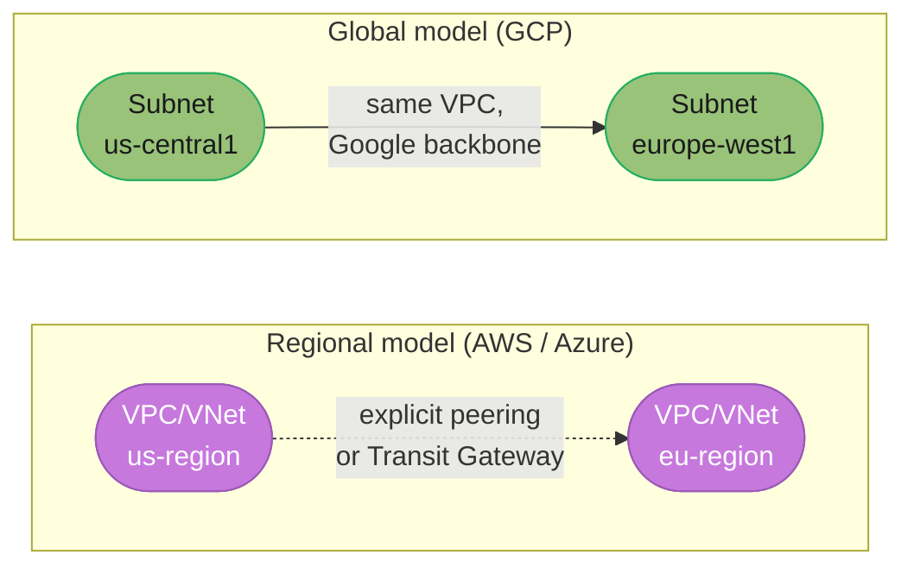
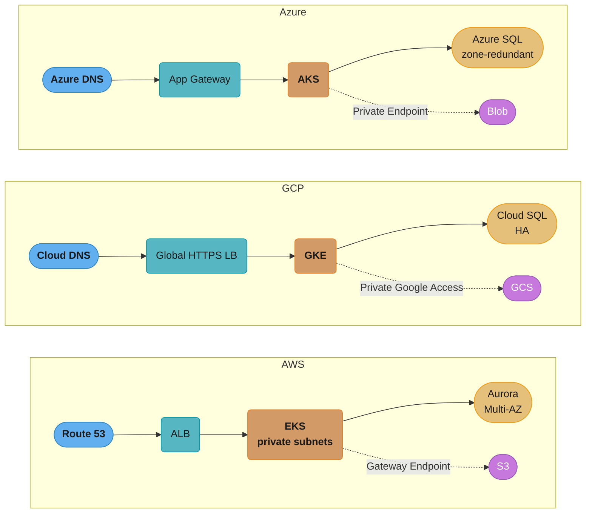
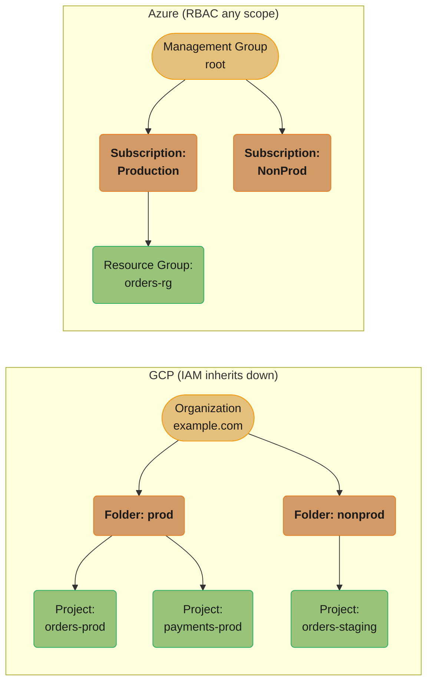
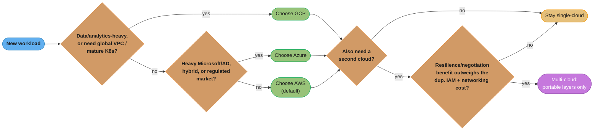

# GCP & Azure Essentials

> Phase 5 — Cloud Platforms · Difficulty: Intermediate

Most architects work primarily on AWS, but real organizations run multi-cloud or migrate between clouds, and interviews probe whether you can map concepts across providers. This module covers the **Google Cloud Platform** (GKE, GCS, Cloud Run, Cloud IAM, BigQuery) and **Microsoft Azure** (AKS, Blob Storage, Microsoft Entra ID, Azure Functions) essentials, and — most importantly — a thorough **AWS ↔ GCP ↔ Azure service-mapping table** so you can translate any design instantly. AWS remains the default reference; this module is about transferring that knowledge.

---

## 1. Concept Overview

All three hyperscalers share the same primitives — identity, virtual networks, VMs, object storage, managed Kubernetes, serverless, managed databases — but differ in naming, IAM model, and a few architectural choices.

- **GCP** organizes resources in a hierarchy: Organization -> Folders -> Projects -> resources. IAM grants roles to members on resources, inheriting down the hierarchy. Strengths: data/analytics (BigQuery), networking (global VPC, global load balancer), and Kubernetes (GKE — Google invented Kubernetes).
- **Azure** organizes resources in: Management Groups -> Subscriptions -> Resource Groups -> resources. Identity is **Microsoft Entra ID** (formerly Azure AD), and RBAC assigns roles at any scope. Strengths: enterprise/Microsoft integration (Active Directory, Office 365), hybrid (Azure Arc), and government/regulated markets.

The single most useful skill is fluent **cross-cloud translation**: knowing that an AWS ALB is a GCP HTTP(S) Load Balancer is an Azure Application Gateway, that S3 is GCS is Blob Storage, that EKS is GKE is AKS. Concepts transfer; only the labels and a few semantics change.

See [cloud_fundamentals_and_aws](../cloud_fundamentals_and_aws/) for the AWS baseline this module maps from.

---

## 2. Intuition

> **One-line analogy**: The three clouds are like three car manufacturers. They all have engines, brakes, and steering (compute, network, identity), but Toyota calls a part one thing and BMW another. Once you know "this is the alternator," you can find it in any car — you don't relearn driving for each brand.

**Mental model**: Pick one cloud as your mental "reference frame" (usually AWS) and translate everything else through a mapping table. The hierarchy and IAM model are where clouds genuinely differ (AWS accounts vs GCP projects vs Azure subscriptions/resource groups), so learn those carefully; the rest is renaming.

**Why it matters**: Multi-cloud architectures, vendor negotiations, acquisitions, and migrations all require translating designs. Interviewers ask "you've used AWS — how would you do this on GCP?" to test whether you understand concepts or just memorized service names. A solid mapping table makes you instantly portable.

**Key insight**: **The hard part of multi-cloud is not the compute or storage — it's identity and networking semantics.** GCP's hierarchy-inherited IAM, Azure's Entra ID + RBAC scopes, and AWS's account/role model differ enough that copy-pasting an identity design across clouds is the most common and most dangerous mistake.

---

## 3. Core Principles

1. **Map, don't relearn.** Translate AWS designs through a service-mapping table; concepts are portable.
2. **Identity is per-cloud.** GCP IAM (hierarchy-inherited), Azure RBAC over Entra ID, AWS IAM — design each natively.
3. **Resource hierarchy drives everything**: GCP Project, Azure Resource Group/Subscription, AWS Account are the unit of isolation and billing.
4. **Use managed Kubernetes for portability** (GKE/AKS/EKS) — workloads move more easily than provider-specific services.
5. **Avoid deep lock-in for portable layers** (compute, K8s, object storage); accept lock-in where the managed service is worth it (BigQuery, DynamoDB).
6. **Networking semantics differ** — GCP VPC is global; AWS/Azure VNets are regional. Design accordingly.

---

## 4. Types / Architectures / Strategies

### The master service-mapping table (AWS ↔ GCP ↔ Azure)

| Category | AWS | GCP | Azure |
|----------|-----|-----|-------|
| Account/project unit | Account | Project | Subscription / Resource Group |
| Org structure | Organizations / OUs | Org -> Folders -> Projects | Management Groups |
| Identity | IAM | Cloud IAM | Microsoft Entra ID + RBAC |
| Federated SSO | IAM Identity Center | Cloud Identity / Workforce Identity | Entra ID |
| VMs | EC2 | Compute Engine (GCE) | Virtual Machines |
| Autoscaling | Auto Scaling Group | Managed Instance Group (MIG) | VM Scale Sets |
| Managed Kubernetes | EKS | GKE | AKS |
| Serverless container | Fargate / App Runner | Cloud Run | Container Apps |
| FaaS | Lambda | Cloud Functions | Azure Functions |
| Object storage | S3 | Cloud Storage (GCS) | Blob Storage |
| Block storage | EBS | Persistent Disk | Managed Disks |
| File storage | EFS | Filestore | Azure Files |
| Virtual network | VPC (regional) | VPC (global) | Virtual Network (VNet) |
| L7 load balancer | ALB | HTTP(S) Load Balancer (global) | Application Gateway |
| L4 load balancer | NLB | Network Load Balancer | Azure Load Balancer |
| DNS | Route 53 | Cloud DNS | Azure DNS |
| CDN | CloudFront | Cloud CDN | Azure Front Door / CDN |
| Private connectivity | PrivateLink | Private Service Connect | Private Link |
| NAT | NAT Gateway | Cloud NAT | NAT Gateway |
| Managed relational DB | RDS / Aurora | Cloud SQL / AlloyDB / Spanner | Azure SQL / Database for PostgreSQL |
| NoSQL (key-value) | DynamoDB | Firestore / Bigtable | Cosmos DB |
| Data warehouse | Redshift | BigQuery | Synapse Analytics |
| In-memory cache | ElastiCache | Memorystore | Azure Cache for Redis |
| Object message queue | SQS | Pub/Sub | Service Bus / Storage Queues |
| Pub/sub streaming | Kinesis / MSK | Pub/Sub / Managed Kafka | Event Hubs |
| Secrets | Secrets Manager | Secret Manager | Key Vault |
| KMS | KMS | Cloud KMS | Key Vault / Managed HSM |
| IaC native | CloudFormation/CDK | Deployment Manager / Config Controller | ARM / Bicep |
| Monitoring | CloudWatch | Cloud Monitoring (ops suite) | Azure Monitor |
| Audit log | CloudTrail | Cloud Audit Logs | Activity Log |
| Container registry | ECR | Artifact Registry | Azure Container Registry (ACR) |
| Workflow orchestration | Step Functions | Workflows | Logic Apps / Durable Functions |

### Where the semantics genuinely differ

| Difference | AWS | GCP | Azure |
|------------|-----|-----|-------|
| VPC scope | Regional | **Global** (subnets are regional) | Regional |
| Workload identity | IRSA (OIDC) | Workload Identity (built-in) | Workload Identity / Managed Identity |
| Serverless containers | Fargate (needs ECS/EKS) | **Cloud Run** (fully managed, scales to zero) | Container Apps |
| Billing/isolation unit | Account | Project | Resource Group within Subscription |

**Why the VPC row matters most.** AWS/Azure VPCs are pinned to a region, so reaching a second region needs an explicit bridge; a GCP VPC is one global object with only its subnets pinned to regions, so cross-region traffic needs no bridge at all — the root cause behind Pitfall 1 below.



---

## 5. Architecture Diagrams

**Same 3-tier app, three clouds (conceptually identical).** The stack is DNS to load balancer to managed Kubernetes to managed database, with object storage reachable over a private path — only the provider names change.



**Resource hierarchy: GCP vs Azure.** IAM (GCP) and RBAC (Azure) both inherit downward — a role granted on `prod` (or on the Management Group) cascades to every Project/Resource Group beneath it, which is exactly the over-permissioning trap in Pitfall 2 below.



---

## 6. How It Works — Detailed Mechanics

### GCP: GKE + Workload Identity (Terraform)

```hcl
resource "google_container_cluster" "primary" {
  name     = "orders"
  location = "us-central1"            # regional cluster spans 3 zones
  workload_identity_config { workload_pool = "my-project.svc.id.goog" }
}

# Bind a GCP service account to a Kubernetes service account (like AWS IRSA)
resource "google_service_account_iam_member" "wi" {
  service_account_id = google_service_account.app.name
  role               = "roles/iam.workloadIdentityUser"
  member             = "serviceAccount:my-project.svc.id.goog[orders/app-ksa]"
}
```

### GCP: Cloud Run (serverless container, scales to zero)

```bash
gcloud run deploy orders \
  --image us-docker.pkg.dev/proj/repo/orders:v1 \
  --region us-central1 \
  --min-instances 0 \           # scale to zero (cold start) or set >0 to keep warm
  --max-instances 100 \
  --concurrency 80 \            # requests handled per container instance
  --memory 512Mi --cpu 1
```

### GCP: Cloud Storage bucket with lifecycle

```hcl
resource "google_storage_bucket" "uploads" {
  name          = "orders-uploads"
  location      = "US"                 # multi-region for high availability
  storage_class = "STANDARD"
  lifecycle_rule {
    condition { age = 30 }
    action { type = "SetStorageClass"; storage_class = "NEARLINE" }  # like S3 Standard-IA
  }
  uniform_bucket_level_access = true   # disables per-object ACLs; IAM-only (best practice)
}
```

### Azure: AKS + Managed Identity (Bicep)

```bicep
resource aks 'Microsoft.ContainerService/managedClusters@2024-02-01' = {
  name: 'orders'
  location: 'eastus'
  identity: { type: 'SystemAssigned' }       // cluster gets a managed identity
  properties: {
    dnsPrefix: 'orders'
    agentPoolProfiles: [{ name: 'np', count: 3, vmSize: 'Standard_D4s_v5', mode: 'System' }]
    oidcIssuerProfile: { enabled: true }      // enables workload identity federation
  }
}
```

### Azure: Blob Storage + Azure Functions

```bash
# Blob container (like an S3 bucket)
az storage container create --name uploads --account-name ordersstorage

# Azure Function (FaaS) - consumption (serverless) plan
az functionapp create --name orders-fn --resource-group orders-rg \
  --consumption-plan-location eastus --runtime python --runtime-version 3.11 \
  --functions-version 4 --storage-account ordersstorage
```

### Azure: Entra ID + RBAC role assignment

```bash
# Assign a built-in role at resource-group scope (RBAC inherits to all resources within)
az role assignment create \
  --assignee <entra-principal-object-id> \
  --role "Storage Blob Data Reader" \
  --scope /subscriptions/<sub>/resourceGroups/orders-rg
```

---

## 7. Real-World Examples

- **Spotify** runs on GCP, using GKE for services, Pub/Sub for event streaming, BigQuery for analytics, and Dataflow for pipelines — leaning on GCP's data/analytics strengths.
- **Snap (Snapchat)** historically split workloads between GCP and AWS, using GCP for serving and AWS for other components — a real multi-cloud arrangement requiring service mapping.
- **Walmart, Maersk, and many enterprises** use Azure heavily because of existing Microsoft/Active Directory investments — Entra ID for identity, AKS for containers, Azure SQL for data, and Azure Arc for hybrid on-prem.
- **Cross-cloud DR**: some teams run primary on AWS (EKS + Aurora) and a warm standby on GCP (GKE + Cloud SQL), using portable Kubernetes manifests and replicating object storage across S3 and GCS.

---

## 8. Tradeoffs

| Decision | Option A | Option B | Key factor |
|----------|----------|----------|-----------|
| Provider | AWS (breadth/maturity) | GCP (data/network/K8s) / Azure (enterprise/MS) | Existing skills, ecosystem fit |
| Portability | Managed K8s (EKS/GKE/AKS) | Provider serverless (Lambda/Cloud Run/Functions) | Portability vs operational simplicity |
| VPC model | GCP global VPC | AWS/Azure regional VNet | Simpler global networking vs explicit regional control |
| Identity | Native IAM per cloud | Federated identity broker | Native fit vs unified SSO |
| Serverless container | Cloud Run (true scale-to-zero) | Fargate (needs ECS/EKS) | Simplicity vs AWS-ecosystem integration |
| Data warehouse | BigQuery (serverless) | Redshift / Synapse | Serverless scaling vs ecosystem |
| Multi-cloud | Single cloud | Multi-cloud | Resilience/negotiation vs complexity/cost |

---

## 9. When to Use / When NOT to Use

**Use GCP when:** you're data/analytics-heavy (BigQuery is best-in-class), want a global VPC and global load balancer, or want the most mature managed Kubernetes (GKE Autopilot). **Use Azure when:** you have heavy Microsoft/Active Directory investment, need tight Office 365/Entra ID integration, operate in regulated/government markets, or want strong hybrid via Azure Arc. **Use AWS when:** you want the broadest service catalog and deepest ecosystem (the default).

**Reconsider multi-cloud when:** the operational complexity (duplicate IAM, networking, tooling, egress costs) outweighs the resilience/negotiation benefits — most organizations are better served being excellent on one cloud than mediocre on three. Avoid copy-pasting an identity or networking design across clouds; their semantics differ enough to cause subtle security gaps.

**Turning the two paragraphs above into a decision procedure:**



---

## 10. Common Pitfalls

**Pitfall 1 — Assuming a regional VPC mental model on GCP (or vice versa).**

```hcl
# BROKEN: treating GCP VPC as regional like AWS, creating one VPC per region
# and peering them manually -> wasted effort, GCP VPCs are already global.
resource "google_compute_network" "us"   { name = "vpc-us";   auto_create_subnetworks = false }
resource "google_compute_network" "eu"   { name = "vpc-eu";   auto_create_subnetworks = false }
# then manually peering vpc-us <-> vpc-eu ...
```

```hcl
# FIX: one global VPC with regional subnets; no peering needed for cross-region
resource "google_compute_network" "main" { name = "vpc"; auto_create_subnetworks = false }
resource "google_compute_subnetwork" "us" { name = "us"; region = "us-central1"; network = google_compute_network.main.id; ip_cidr_range = "10.0.0.0/20" }
resource "google_compute_subnetwork" "eu" { name = "eu"; region = "europe-west1"; network = google_compute_network.main.id; ip_cidr_range = "10.1.0.0/20" }
# instances in us and eu subnets reach each other over the global VPC backbone
```

**Pitfall 2 — Granting GCP IAM at the wrong hierarchy level.** Granting an `Editor` role at the Organization or Folder level instead of a single Project means it inherits to every project — massive over-permission. FIX: grant the narrowest predefined or custom role at the lowest scope (a single Project or resource).

**Pitfall 3 — Confusing Azure Subscriptions and Resource Groups for isolation.** Putting prod and dev in the same Subscription with mixed Resource Groups muddies billing, quotas, and RBAC blast radius. FIX: separate Subscriptions for prod vs non-prod, Resource Groups per app/lifecycle, and RBAC scoped to the Resource Group.

**Pitfall 4 — Forgetting Cloud Run/Functions cold starts when scaling to zero.** `min-instances 0` saves cost but adds latency on the first request. FIX: set `min-instances` > 0 for latency-sensitive endpoints — see [serverless_and_faas](../serverless_and_faas/).

---

## 11. Technologies & Tools

| Tool/Service | Purpose |
|--------------|---------|
| GKE / AKS | Managed Kubernetes (GCP / Azure) |
| Cloud Run / Azure Container Apps | Serverless containers |
| Cloud Functions / Azure Functions | FaaS |
| GCS / Blob Storage | Object storage |
| Cloud IAM / Microsoft Entra ID + RBAC | Identity |
| Cloud SQL / Azure SQL | Managed relational DB ([../../database/](../../database/)) |
| BigQuery / Synapse | Data warehouse |
| Cloud DNS / Azure DNS | DNS ([cloud_networking_and_cdn](../cloud_networking_and_cdn/)) |
| Terraform | Cloud-agnostic IaC ([infrastructure_as_code_terraform](../infrastructure_as_code_terraform/)) |
| gcloud / az CLIs | Provider CLIs |
| Secret Manager / Key Vault | Secrets ([secrets_management](../secrets_management/)) |

---

## 12. Interview Questions with Answers

**Q1: Map the core AWS services to their GCP and Azure equivalents.**
EC2 maps to GCP Compute Engine and Azure VMs; S3 to GCS and Blob Storage; EKS to GKE and AKS; Lambda to Cloud Functions and Azure Functions; RDS to Cloud SQL and Azure SQL; DynamoDB to Firestore/Bigtable and Cosmos DB; Route 53 to Cloud DNS and Azure DNS; IAM to Cloud IAM and Entra ID + RBAC. The concepts are identical — identity, network, compute, storage, managed DB — only the names and a few semantics change. The key skill is translating a design through this table rather than relearning each cloud.

**Q2: How do the resource hierarchies differ across the three clouds?**
AWS uses Accounts grouped into Organizations/OUs; GCP uses Organization -> Folders -> Projects with IAM inheriting downward; Azure uses Management Groups -> Subscriptions -> Resource Groups with RBAC assignable at any scope. The Project (GCP), Account (AWS), and Subscription/Resource Group (Azure) are the units of billing and isolation. Understanding the hierarchy is critical because IAM/RBAC inherits down it, so granting at the wrong level over-permissions everything below.

**Q3: Why is GCP's VPC model different, and what's the practical consequence?**
A GCP VPC is a global resource with regional subnets, whereas AWS VPCs and Azure VNets are regional. The practical consequence is that instances in different regions of the same GCP VPC can communicate over Google's private backbone without VPC peering, simplifying global architectures. On AWS/Azure you'd create regional VPCs/VNets and connect them with peering or Transit Gateway — see [cloud_networking_and_cdn](../cloud_networking_and_cdn/).

**Q4: What is Cloud Run and how does it compare to AWS Fargate and Lambda?**
Cloud Run is a fully managed serverless platform that runs containers, scales to zero, and bills per request/CPU-time, handling concurrency (multiple requests per instance). Compared to Lambda it accepts any container and supports higher concurrency per instance; compared to Fargate it requires no ECS/EKS cluster — it's truly managed. Use Cloud Run for stateless HTTP services where you want serverless economics without the Lambda packaging model.

**Q5: How does identity differ between AWS IAM, GCP IAM, and Azure RBAC?**
AWS IAM attaches policies to users/roles and evaluates them per request with explicit deny precedence; GCP IAM binds roles (predefined/custom) to members on resources and inherits down the Org/Folder/Project hierarchy; Azure uses Microsoft Entra ID for identity plus RBAC role assignments scoped at management group, subscription, resource group, or resource level. The biggest design difference is GCP's hierarchy inheritance — a role at a Folder applies to all Projects beneath it. Always grant at the narrowest scope.

**Q6: What is the GCP/Azure equivalent of AWS IRSA for giving pods cloud permissions?**
GCP uses Workload Identity, which binds a Kubernetes service account to a GCP service account via the cluster's workload identity pool, so pods get short-lived GCP credentials with no static keys. Azure uses Workload Identity (federated) or Managed Identities, mapping a Kubernetes service account to an Entra ID identity via the cluster's OIDC issuer. All three (IRSA, Workload Identity) achieve the same goal: per-pod least-privilege cloud access without embedding keys.

**Q7: When would you choose Azure over AWS or GCP?**
Choose Azure when the organization is heavily invested in Microsoft — Active Directory, Office 365, Windows Server, .NET — because Entra ID integrates natively and licensing (Azure Hybrid Benefit) is cheaper. Azure is also strong for hybrid cloud via Azure Arc and in regulated/government sectors. The deciding factor is usually existing enterprise identity and Microsoft ecosystem rather than raw technical capability.

**Q8: What's GCP's standout service, and why do data teams favor it?**
BigQuery, a serverless data warehouse that separates storage and compute and scales query compute automatically with no cluster to manage. Data teams favor it because you load data and query petabytes with standard SQL while paying per query/storage, avoiding the cluster provisioning and tuning that Redshift historically required. It exemplifies GCP's data/analytics strength.

**Q9: How do you approach a multi-cloud architecture without doubling operational pain?**
Standardize on portable layers — Kubernetes (EKS/GKE/AKS), containers, object storage, Terraform IaC — so workloads move with minimal change, and isolate provider-specific services behind interfaces. Keep one cloud as primary and the other as DR or for specific best-of-breed services (e.g., BigQuery), rather than running everything everywhere. Be deliberate: multi-cloud doubles IAM, networking, monitoring, and egress costs, so adopt it only when resilience or negotiation leverage justifies the complexity.

**Q10: What are the cross-cloud equivalents for private connectivity and CDN?**
For private connectivity to services without traversing the public internet: AWS PrivateLink maps to GCP Private Service Connect and Azure Private Link. For CDN: AWS CloudFront maps to GCP Cloud CDN and Azure Front Door/CDN. These map one-to-one conceptually, though features (e.g., edge compute, WAF integration) differ in detail — see [cloud_networking_and_cdn](../cloud_networking_and_cdn/) for how they're used in a global architecture.

---

## 13. Best Practices

- **Maintain a service-mapping table** and design through it; don't relearn each cloud from scratch.
- **Grant identity at the narrowest scope** (GCP lowest Project/resource; Azure Resource Group) and use workload identity, not static keys.
- **Separate environments** by Project (GCP) or Subscription (Azure), mirroring AWS account separation.
- **Use Terraform** for cloud-agnostic IaC ([infrastructure_as_code_terraform](../infrastructure_as_code_terraform/)); keep provider-specific modules isolated.
- **Exploit each cloud's strength**: BigQuery on GCP, Entra ID/hybrid on Azure, breadth on AWS.
- **Prefer portable layers** (managed K8s, object storage) for multi-cloud; accept lock-in only where the managed service is clearly worth it.
- **Set `min-instances` > 0** for latency-sensitive Cloud Run/Functions endpoints ([serverless_and_faas](../serverless_and_faas/)).

---

## 14. Case Study

### Scenario: An AWS-native team must add an Azure region for an enterprise customer

A SaaS company runs entirely on AWS (EKS + Aurora + S3) but lands a large enterprise customer with a contractual requirement to host their data in Azure (their existing cloud, with Entra ID SSO). The team must replicate the architecture on Azure without rewriting the app.

```text
BROKEN: lift-and-shift the AWS IAM/networking design verbatim
  - tried to recreate "IAM roles" and "VPC per region" on Azure literally
  - bolted on a custom SSO instead of using the customer's Entra ID
  - result: over-permissioned identities, mismatched networking, failed security review
```

```bicep
// FIX: design natively on Azure using the service mapping, integrate Entra ID
resource aks 'Microsoft.ContainerService/managedClusters@2024-02-01' = {
  name: 'orders'
  location: 'westeurope'
  identity: { type: 'SystemAssigned' }
  properties: {
    oidcIssuerProfile: { enabled: true }   // workload identity == AWS IRSA equivalent
    aadProfile: { managed: true, enableAzureRBAC: true }  // cluster auth via Entra ID
  }
}
// Azure SQL (== Aurora), Blob (== S3), App Gateway (== ALB), Azure DNS (== Route 53)
// RBAC scoped at the Resource Group (== narrowest AWS account/role scope)
// Customer's Entra ID provides SSO directly -> no custom auth, passes security review
```

The team kept the application portable by running it on AKS with the same Kubernetes manifests used on EKS, mapped each AWS dependency to its Azure equivalent (Aurora -> Azure SQL, S3 -> Blob, ALB -> Application Gateway, Route 53 -> Azure DNS), and used the customer's Entra ID for SSO instead of a bespoke broker. Identity was designed natively with RBAC scoped at the Resource Group, and workload identity replaced IRSA for pod permissions. Terraform/Bicep modules isolated the provider differences.

**Outcome:** the Azure region passed the customer's security review, the app deployed with unchanged container images, and identity was least-privilege and integrated with the customer's existing SSO. The lesson: **map concepts natively per cloud — especially identity and networking — rather than transliterating the AWS design.** The portable layer (Kubernetes) carried the workload; the provider-specific layers (IAM, networking, managed DB) were redesigned, not copied.

**Discussion questions:**
1. Which layers of the AWS design were portable to Azure, and which required native redesign?
2. Why is copy-pasting an IAM/networking design across clouds dangerous, and what specifically breaks?
3. How would you decide whether to keep AWS as primary with Azure as a satellite region vs going fully multi-cloud active-active?

---

**Cross-references:** [cloud_fundamentals_and_aws](../cloud_fundamentals_and_aws/) (the AWS baseline this maps from), [serverless_and_faas](../serverless_and_faas/) (Cloud Run/Functions cold starts), [cloud_networking_and_cdn](../cloud_networking_and_cdn/) (global VPC, Private Service Connect, CDN), [kubernetes_architecture](../kubernetes_architecture/) (GKE/AKS control planes), [infrastructure_as_code_terraform](../infrastructure_as_code_terraform/) (cloud-agnostic IaC), [secrets_management](../secrets_management/) (Secret Manager/Key Vault), [../../database/](../../database/) (Cloud SQL/Azure SQL internals).
