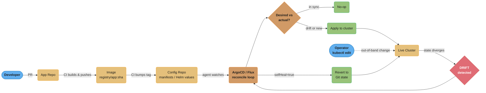
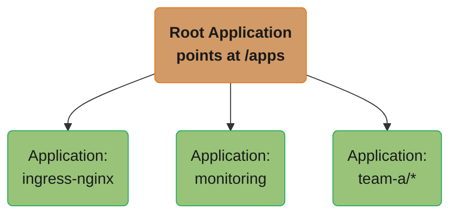
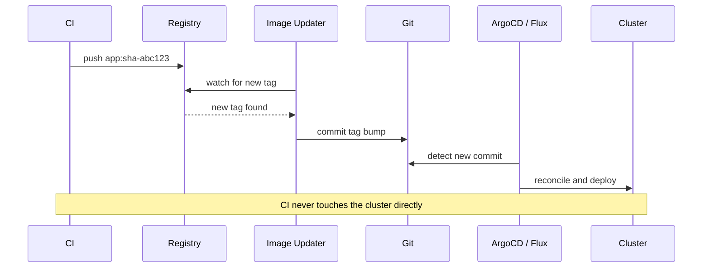
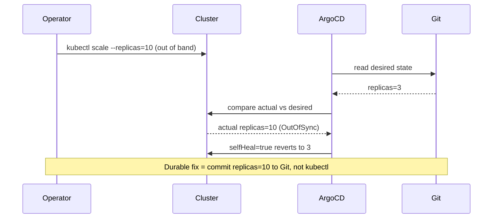
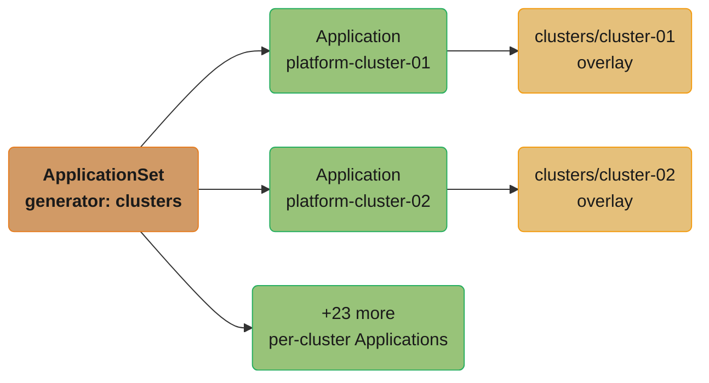

# GitOps (ArgoCD & Flux)

> Phase 3 — CI/CD & GitOps · Difficulty: Advanced

GitOps makes **Git the single source of truth for the desired state of your infrastructure**, and an in-cluster agent continuously reconciles reality to match it. Instead of a pipeline pushing `kubectl apply` with cluster credentials, an operator (ArgoCD or Flux) *pulls* from Git, detects drift, and self-heals. The result: every change is a reviewed, audited Git commit; rollback is `git revert`; and the cluster can never silently diverge from what's declared.

---

## 1. Concept Overview

GitOps rests on four principles (the OpenGitOps definition):
1. **Declarative** — the entire desired state is expressed declaratively (manifests/Helm/Kustomize).
2. **Versioned and immutable** — that state is stored in Git, the single source of truth, with full history.
3. **Pulled automatically** — an in-cluster agent pulls and applies the desired state (no external push).
4. **Continuously reconciled** — the agent constantly compares actual vs desired and corrects drift.

This flips traditional CI/CD's deploy step. In **push-based** CD, the pipeline holds cluster credentials and runs `kubectl apply`. In **pull-based** GitOps, the cluster runs an agent (ArgoCD/Flux) that watches a Git repo and reconciles — no external system needs cluster access, drift is detected and corrected, and Git history is a complete audit log.

The two leading tools: **ArgoCD** (UI-centric, `Application` CRD, app-of-apps, strong visualization) and **Flux** (CLI/CRD-centric, GitOps Toolkit controllers, tight Kustomize/Helm integration).

---

## 2. Intuition

> **One-line analogy**: GitOps is a self-correcting autopilot. You file a flight plan (commit desired state to Git); the autopilot (ArgoCD/Flux) continuously compares the plane's actual position to the plan and adjusts. If a passenger nudges the controls (someone `kubectl edit`s the cluster), the autopilot detects the deviation and steers back to the filed plan — and the flight plan's revision history records every change and who made it.

**Mental model**: Git holds the desired state; the cluster holds the actual state; the GitOps agent is a reconciliation loop (like any Kubernetes controller — see [kubernetes_architecture](../kubernetes_architecture/)) whose "spec" is the Git repo. A deploy is `git push`; a rollback is `git revert`; an out-of-band `kubectl` change is *drift* that the agent reverts (or flags). The cluster is a cache of Git, not an independent source of truth.

**Why it matters**: Push-based pipelines scatter cluster credentials across CI systems, allow undetected manual drift, and have no inherent audit trail of "what's actually deployed." GitOps centralizes the source of truth, eliminates external cluster credentials, makes every change reviewable and revertible, and detects/heals drift — dramatically improving auditability, security, and recoverability, especially across many clusters.

**Key insight**: Under GitOps, **the cluster is downstream of Git**. The correct way to change production is to change Git, not the cluster. Hot-patching the cluster (`kubectl edit`) creates drift the agent will revert — which surprises engineers who don't internalize that Git, not the live cluster, is the source of truth (a lesson from [version_control_and_git_workflows](../version_control_and_git_workflows/) §14).

---

## 3. Core Principles

1. **Git is the single source of truth** for desired state — declarative, versioned, immutable.
2. **Pull, don't push.** An in-cluster agent reconciles; no external system holds cluster credentials.
3. **Continuous reconciliation + drift detection.** Actual is constantly corrected toward desired.
4. **Change production by changing Git.** Deploy = commit; rollback = `git revert`.
5. **Everything is auditable.** Git history (ideally with signed commits) is the change log.
6. **Separate config repo from app code repo** (often) — CI updates the config repo; CD reconciles it.

---

## 4. Types / Architectures / Strategies

### Push vs pull CD

| Aspect | Push (pipeline applies) | Pull (GitOps) |
|--------|-------------------------|---------------|
| Cluster credentials | In CI system (exposed) | Only in-cluster agent (none external) |
| Drift detection | None | Built-in, continuous |
| Audit trail | Pipeline logs | Git history (complete) |
| Rollback | Re-run pipeline | `git revert` |
| Multi-cluster | Pipeline per cluster | Agent per cluster, one repo |
| Source of truth | Implicit (last apply) | Git (explicit) |

### ArgoCD vs Flux

| Dimension | ArgoCD | Flux |
|-----------|--------|------|
| Interface | Rich UI + CLI + `Application` CRD | CLI + CRDs (GitOps Toolkit) |
| Multi-app | App-of-apps, ApplicationSets | Kustomization/HelmRelease CRs |
| Visualization | Strong (sync status, diff, topology) | Minimal (CLI/3rd-party) |
| Multi-tenancy | Projects, RBAC | Namespaced controllers |
| Progressive delivery | + Argo Rollouts | + Flagger |
| Style | App-centric, GUI-friendly | Composable controllers, GitOps-native |

### Repo structures

| Pattern | Notes |
|---------|-------|
| App code + config in same repo | Simple; couples app and deploy changes |
| Separate config (manifests) repo | CI pushes image tag bump; CD reconciles — clean separation |
| App-of-apps (ArgoCD) | One root Application manages many child Applications |
| ApplicationSets | Templated apps across many clusters/environments |

---

## 5. Architecture Diagrams

**GitOps pull-based flow.** The agent watches the config repo and reconciles the cluster to match Git; if someone edits the live cluster directly, that out-of-band drift is detected and self-healed back to the committed state.



**App-of-apps (ArgoCD).** One root `Application` manages a directory of child Applications — a single commit to `/apps` onboards or removes whole applications declaratively.



---

## 6. How It Works — Detailed Mechanics

### An ArgoCD Application (the unit of GitOps)

```yaml
apiVersion: argoproj.io/v1alpha1
kind: Application
metadata: {name: orders, namespace: argocd}
spec:
  project: shop
  source:
    repoURL: https://github.com/org/config.git
    targetRevision: main                 # track main (or a tag/branch per env)
    path: apps/orders/overlays/prod      # Kustomize overlay (or Helm chart path)
  destination: {server: https://kubernetes.default.svc, namespace: shop}
  syncPolicy:
    automated: {prune: true, selfHeal: true}   # auto-apply, delete removed objects, revert drift
    syncOptions: [CreateNamespace=true]
    retry: {limit: 5, backoff: {duration: 5s, factor: 2}}
```

`selfHeal: true` reverts manual cluster changes; `prune: true` deletes objects removed from Git; together they make Git authoritative.

### Flux equivalent (GitOps Toolkit)

```yaml
apiVersion: source.toolkit.fluxcd.io/v1
kind: GitRepository
metadata: {name: config, namespace: flux-system}
spec: {interval: 1m, url: https://github.com/org/config.git, ref: {branch: main}}
---
apiVersion: kustomize.toolkit.fluxcd.io/v1
kind: Kustomization
metadata: {name: orders, namespace: flux-system}
spec:
  interval: 5m
  sourceRef: {kind: GitRepository, name: config}
  path: ./apps/orders/overlays/prod
  prune: true               # delete objects removed from Git
  wait: true                # wait for resources to become Ready
```

### The CI/CD handoff (image tag bump)

```yaml
# CI (app repo) builds registry/app:sha-abc123, then updates the config repo:
# - either commits a new tag into the manifests, or
# - uses an image-updater (Argo CD Image Updater / Flux image automation) that watches
#   the registry and commits the new tag automatically.
# CD (ArgoCD/Flux) reconciles the config repo -> deploys. CI never touches the cluster.
```

**CI/CD handoff via image automation.** CI only ever writes to the registry and, indirectly, to Git — the image-updater and GitOps agent are what actually reach the cluster.



### Drift detection and self-heal



A manual `kubectl` change creates drift from Git's desired state; ArgoCD detects the mismatch and, with self-heal on, reverts it — the only durable fix is a Git commit.

### Rollback

```bash
git revert <bad-commit> && git push    # ArgoCD/Flux reconciles -> previous good state
# or in ArgoCD: roll the Application back to a previous synced revision (argocd app rollback)
```

### Secrets in GitOps (the hard part)

```
You can't commit plaintext secrets to Git. Options:
  - SOPS-encrypted secrets in Git (Flux/ArgoCD decrypt via KMS key)
  - Sealed Secrets (encrypt to a cluster-specific key; only the controller can decrypt)
  - External Secrets Operator: commit a reference; ESO pulls the real value from Vault
(see secrets_management)
```

---

## 7. Real-World Examples

- **ArgoCD app-of-apps for platform bootstrapping**: a single root Application installs ingress, monitoring, cert-manager, and all team apps — `git commit` onboards an entire cluster's workloads declaratively.
- **Flux + image automation**: CI builds an image; Flux's image-update controller detects the new tag, commits the bump to Git, and reconciles — closing the loop with Git as the record.
- **Fleet management (ApplicationSets / Flux)**: companies manage hundreds of clusters by templating Applications across them from one repo, with per-cluster overlays.
- **Disaster recovery via Git**: because the entire desired state is in Git, rebuilding a cluster is "point a fresh ArgoCD/Flux at the repo and let it reconcile" — the cluster is reproducible (see [disaster_recovery_and_resilience](../disaster_recovery_and_resilience/)).

---

## 8. Tradeoffs

| Decision | Option A | Option B | Key factor |
|----------|----------|----------|-----------|
| CD model | Push (pipeline applies) | Pull (GitOps) | Auditability/drift/security vs simplicity |
| Tool | ArgoCD (UI, app-centric) | Flux (CRDs, composable) | UI/visualization vs GitOps-native composability |
| Repo layout | App+config together | Separate config repo | Coupling vs clean CI/CD separation |
| Self-heal | On (strict, no drift) | Off (allow temporary manual) | Strictness vs operational flexibility |
| Secrets | SOPS/Sealed (in Git) | External Secrets (refs) | In-Git encryption vs external store |
| Multi-cluster | ApplicationSets/Flux fleet | Per-cluster manual | Scale vs simplicity |

---

## 9. When to Use / When NOT to Use

**Use GitOps when:** managing Kubernetes (especially multiple clusters/environments), you want auditability, drift detection, easy rollback, and to remove external cluster credentials. It's the modern default for Kubernetes delivery.

**Reconsider when:** you have a single tiny cluster and a simple push pipeline suffices (GitOps adds an agent + repo structure to learn); non-Kubernetes targets where the tooling fits less naturally; or teams not ready for "change prod by changing Git" discipline (hot-patching habits cause friction). Secrets handling requires deliberate design before adopting.

---

## 10. Common Pitfalls

**Pitfall 1 — Hot-patching the cluster instead of changing Git.**

```bash
# BROKEN: fix an incident by editing the live cluster under GitOps with selfHeal on.
kubectl scale deploy/orders --replicas=10
#  -> ArgoCD sees drift (Git says 3) and REVERTS to 3 on the next sync -> fix undone, fire reignites.
```

```bash
# FIX: change the source of truth.
# edit replicas: 10 in the config repo, commit, push -> agent reconciles -> sticks.
# (For genuine break-glass, temporarily disable auto-sync, but reconcile Git ASAP.)
```

**Pitfall 2 — Plaintext secrets committed to the GitOps repo.** Because everything goes in Git, naive teams commit Secret manifests with base64 (≈plaintext) values — leaking them permanently. FIX: SOPS/Sealed Secrets (encrypted in Git) or External Secrets Operator (commit a *reference*, real value stays in Vault) — see [secrets_management](../secrets_management/).

**Pitfall 3 — `prune: true` plus an accidental Git deletion wiping production.** Removing a manifest from Git (or a bad refactor) with prune enabled deletes the live resources. FIX: protect the config repo (required reviews, CODEOWNERS), preview diffs (`argocd app diff`), use sync windows, and consider `prune` with confirmation/`PruneLast` for critical apps.

---

## 11. Technologies & Tools

| Tool | Purpose |
|------|---------|
| ArgoCD | Pull-based GitOps (UI, Application CRD, app-of-apps) |
| Flux (GitOps Toolkit) | Pull-based GitOps (composable controllers) |
| Argo Rollouts / Flagger | Progressive delivery on top of GitOps |
| SOPS / Sealed Secrets | Encrypted secrets in Git |
| External Secrets Operator | Secret refs → Vault/cloud (see [secrets_management](../secrets_management/)) |
| Kustomize / Helm | Manifest templating/overlays (see [helm_and_package_management](../helm_and_package_management/)) |
| ArgoCD Image Updater / Flux image automation | Auto-bump image tags in Git |
| ApplicationSets | Templated apps across clusters/envs |

---

## 12. Interview Questions with Answers

**Q1: What is GitOps and what are its core principles?**
GitOps is an operational model where the desired state of the system is declared in Git (the single source of truth) and an in-cluster agent continuously reconciles the actual state to match. Its four principles: the state is declarative, versioned/immutable in Git, pulled automatically by an agent, and continuously reconciled (drift is detected and corrected). Deploy = commit; rollback = revert; the cluster is downstream of Git.

**Q2: Push-based CD vs pull-based GitOps — what's the difference and why prefer pull?**
In push-based CD the pipeline holds cluster credentials and runs `kubectl apply` — credentials are exposed in CI, there's no drift detection, and the audit trail is just pipeline logs. In pull-based GitOps an in-cluster agent watches Git and reconciles, so no external system needs cluster access, drift is continuously detected and corrected, and Git history is a complete audit log. Pull improves security (no external creds), auditability, and recoverability.

**Q3: How does drift detection and self-healing work?**
The GitOps agent continuously diffs the desired state (Git) against the actual cluster state. If they differ — because someone made an out-of-band change or a resource was deleted — it marks the app OutOfSync and, with self-heal enabled, re-applies the Git state to correct the drift. This guarantees the cluster matches Git and that manual changes don't silently persist; the only durable change is a Git change.

**Q4: How do you roll back under GitOps?**
`git revert` the offending commit and push — the agent reconciles the cluster back to the previous good state, and the revert is itself an audited commit. ArgoCD also offers `argocd app rollback` to revert the live Application to a previously synced revision for immediate relief. Either way, the rollback is declarative and traceable, unlike re-running a push pipeline.

**Q5: Why shouldn't you `kubectl edit` production under GitOps?**
Because Git, not the cluster, is the source of truth. A manual `kubectl` change is drift that the agent (with self-heal) reverts on the next sync — so your fix is undone, often reigniting the incident. The correct action is to change the Git repo (commit the fix), which the agent then applies durably. For emergencies you can temporarily pause auto-sync, but you must reconcile Git promptly.

**Q6: ArgoCD vs Flux — how do they differ?**
ArgoCD is app-centric with a rich web UI, the `Application` CRD, app-of-apps and ApplicationSets, and strong visualization/diffing — popular where teams want a GUI and clear sync status. Flux is a set of composable GitOps Toolkit controllers (Source, Kustomize, Helm, Image automation) driven via CRDs/CLI, favoring a more GitOps-native, automation-first style with minimal UI. Both implement the same pull-based reconciliation; choice is largely workflow/UI preference.

**Q7: How do you handle secrets in GitOps if everything is in Git?**
You never commit plaintext secrets. Options: SOPS-encrypted manifests (the agent decrypts via a KMS key), Sealed Secrets (encrypted to a cluster-specific key only the in-cluster controller can decrypt), or the External Secrets Operator (commit a *reference*; ESO fetches the real value from Vault/cloud at runtime). The Git repo holds ciphertext or references, never the secret value itself.

**Q8: What is the app-of-apps pattern?**
An ArgoCD pattern where a single root `Application` points at a directory of child `Application` definitions, so one Application manages many. Committing to that directory onboards or removes entire applications declaratively — used to bootstrap a whole cluster (ingress, monitoring, cert-manager, team apps) from one root. ApplicationSets generalize this further with templating across clusters/environments.

**Q9: How does CI hand off to GitOps CD?**
CI builds and pushes the artifact (image), then updates the *config* repo — either by committing a new image tag into the manifests, or via an image-update controller (Argo CD Image Updater / Flux image automation) that watches the registry and commits the bump automatically. The GitOps agent then reconciles the config repo and deploys. Crucially, CI never touches the cluster — it only writes to Git.

**Q10: What's the risk of `prune` and how do you mitigate it?**
With prune enabled, removing a manifest from Git deletes the corresponding live resource — so an accidental deletion or bad refactor can wipe production resources. Mitigate with config-repo protections (required reviews, CODEOWNERS), diff previews before sync, sync windows, and options like `PruneLast`/manual confirmation for critical apps. Prune is powerful (keeps the cluster matching Git) but demands repo discipline.

**Q11: How does GitOps improve disaster recovery?**
Because the entire desired state lives in Git, recovering a cluster is "deploy a fresh ArgoCD/Flux and point it at the repo" — the agent reconciles everything back. The cluster is reproducible from Git rather than a hand-tuned snowflake. Combined with etcd/PVC backups for stateful data, GitOps makes the *configuration* portion of DR fast and deterministic (see [disaster_recovery_and_resilience](../disaster_recovery_and_resilience/)).

**Q12: How does GitOps relate to progressive delivery?**
GitOps provides the source of truth and reconciliation; progressive delivery (Argo Rollouts/Flagger) provides metric-gated canary/blue-green. They compose: you declare a Rollout CR in Git, ArgoCD/Flux reconciles it, and the Rollouts controller executes the canary with automated analysis and rollback. The release strategy is declarative and audited in Git, and an auto-abort is reflected as the controller reverting to the stable version (see [deployment_strategies](../deployment_strategies/)).

---

## 13. Best Practices

- Make **Git the single source of truth**; change production by changing Git, never by hot-patching.
- Enable **self-heal + prune** for strict drift control; protect the config repo (reviews, CODEOWNERS).
- **Separate the config repo** from app code; let CI bump image tags, CD reconcile.
- Handle secrets with **SOPS/Sealed Secrets/External Secrets** — never commit plaintext.
- Use **signed commits** and Git history as the audit log; gate config changes with policy checks (see [policy_as_code_and_compliance](../policy_as_code_and_compliance/)).
- Preview with **`argocd app diff`** before sync; use **sync windows** for sensitive apps.
- Manage fleets with **app-of-apps/ApplicationSets**; combine with **Argo Rollouts/Flagger** for progressive delivery.

---

## 14. Case Study

### Scenario: A multi-cluster fleet drifts, and an incident hot-fix keeps reverting

A company runs 25 EKS clusters with push-based pipelines. Over time, engineers have hand-edited clusters during incidents, so no two clusters are identical and nobody can say what's actually deployed where. During an outage, an on-call engineer scales a deployment up to cope — but a leftover automation re-applies the old manifest and undoes it, prolonging the incident.

```
BROKEN: push CD + manual drift
  - 25 clusters, each `kubectl apply`-ed by pipelines + hand-edited in incidents
  - no source of truth: "what's deployed on cluster-17?" -> nobody knows
  - drift everywhere; reproducing a cluster is impossible
  - incident hot-fix fights an old pipeline re-apply
```

```yaml
# FIX: adopt pull-based GitOps with ArgoCD + ApplicationSets across the fleet.
apiVersion: argoproj.io/v1alpha1
kind: ApplicationSet
metadata: {name: platform, namespace: argocd}
spec:
  generators:
    - clusters: {}                         # one Application per registered cluster
  template:
    metadata: {name: 'platform-{{name}}'}
    spec:
      project: platform
      source:
        repoURL: https://github.com/org/fleet-config.git
        targetRevision: main
        path: 'clusters/{{name}}'          # per-cluster overlay
      destination: {server: '{{server}}', namespace: platform}
      syncPolicy:
        automated: {prune: true, selfHeal: true}   # drift is impossible; Git is truth
```

Now every cluster's desired state is a per-cluster overlay in one repo; ArgoCD reconciles all 25, self-heals drift, and "what's deployed on cluster-17" is answered by reading `clusters/cluster-17` in Git. During incidents, the team changes Git (or pauses auto-sync for genuine break-glass), so fixes stick and there's no old pipeline to fight. Rebuilding a lost cluster is "register it; ArgoCD reconciles it from Git."

**ApplicationSet fan-out.** One generator templates a per-cluster `Application` for all 25 clusters, each pointing at its own `clusters/{{name}}` overlay — one repo, no per-cluster copy-paste.



**Outcome:** configuration drift across the fleet went to zero (self-heal), the source of truth became unambiguous and auditable (Git history per cluster), incident fixes stopped getting reverted (change Git, not the cluster), and cluster recovery became a reconcile rather than a manual rebuild. The cultural shift — "production changes are Git changes" — was the hardest and most valuable part.

**Discussion questions:**
1. Why does push-based CD across many clusters inevitably drift, and how does pull-based reconciliation prevent it?
2. How should the on-call engineer have made the emergency scale-up "stick" under GitOps?
3. How do ApplicationSets let one repo manage 25 clusters without 25 copies of everything?

---

**Cross-references:** [ci_cd_fundamentals](../ci_cd_fundamentals/) (CI builds the artifact GitOps deploys), [deployment_strategies](../deployment_strategies/) (Argo Rollouts under GitOps), [version_control_and_git_workflows](../version_control_and_git_workflows/) (Git as source of truth, revert), [helm_and_package_management](../helm_and_package_management/) (Helm/Kustomize rendered by the agent), [secrets_management](../secrets_management/) (secrets in GitOps), [kubernetes_architecture](../kubernetes_architecture/) (the reconcile model GitOps extends).
