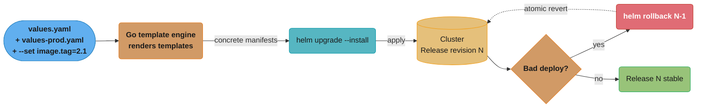
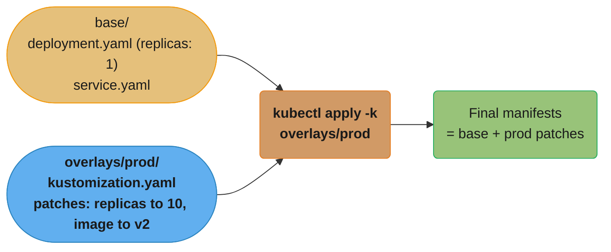
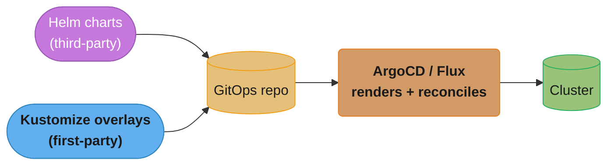
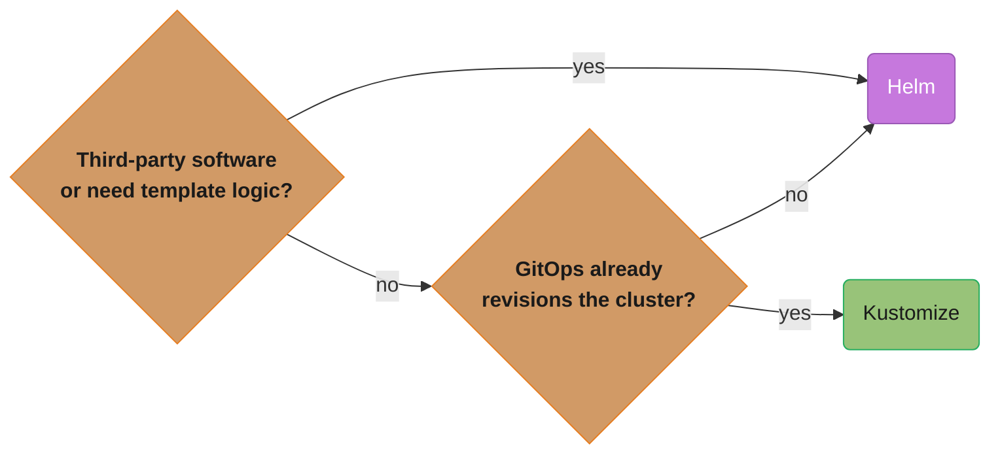
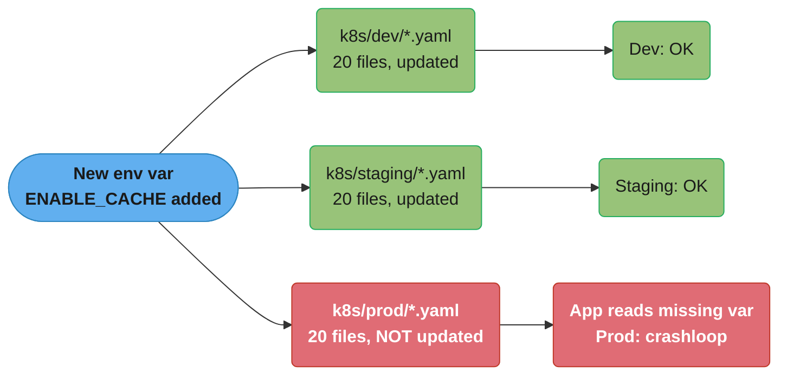

# Helm & Package Management

> Phase 2 — Containers & Kubernetes · Difficulty: Intermediate

Raw Kubernetes YAML doesn't scale: the same Deployment differs across dev/staging/prod, and a real app is a dozen interrelated objects. **Helm** packages them into versioned, templated, parameterized **charts** with release tracking and rollback. **Kustomize** takes the opposite, template-free approach — patch a base with overlays. Knowing both, and when each fits, is core DevOps fluency.

---

## 1. Concept Overview

Two dominant approaches to managing Kubernetes manifests across environments:

**Helm** — a package manager for Kubernetes:
- A **chart** is a versioned bundle of templated manifests (`templates/`) + default values (`values.yaml`) + metadata (`Chart.yaml`).
- `helm install`/`upgrade` renders templates with values and applies them, tracking a **release** (a named, versioned installation) with revision history for **rollback**.
- Charts can depend on subcharts and are distributed via **repositories** (or OCI registries).

**Kustomize** — template-free overlays (built into `kubectl`):
- A **base** holds common manifests; **overlays** apply patches (strategic-merge or JSON6902) per environment.
- No templating language — pure YAML patching, so output is predictable and diffable.

Both solve "one definition, many environments" and "manage many objects as a unit." Helm adds packaging/versioning/rollback; Kustomize adds simplicity and transparency.

---

## 2. Intuition

> **One-line analogy**: Helm is like an installer package (`.deb`/`.msi`) for your app — parameterized, versioned, with an uninstall and a rollback. Kustomize is like applying a diff/patch to a known-good base config — no magic substitution, just "take this YAML and change these specific fields for prod."

**Mental model**: Helm is a *templating + release* engine: values flow into Go templates to produce manifests, and Helm remembers what it installed so it can upgrade or roll back atomically. Kustomize is a *patch* engine: you never template; you declare a base and say "for prod, set replicas to 10 and image to v2" as overlays merged at apply time. Helm trades transparency for power (logic, packaging, sharing); Kustomize trades power for predictability.

**Why it matters**: Configuration drift across environments is a top incident source. A packaging tool gives you one source of truth parameterized per environment, plus the ability to roll back a bad release in one command. Choosing Helm vs Kustomize (or both) shapes how your whole deployment pipeline and GitOps repo are structured.

**Key insight**: Helm's superpower isn't templating — it's the **release**: Helm records each install/upgrade as a revision, so `helm rollback` reverts to a previous known-good state atomically. Kustomize has no concept of a release or rollback; that's why GitOps tools (which provide their own revisioning via Git) often pair beautifully with Kustomize, while Helm shines for distributing third-party apps.

---

## 3. Core Principles

1. **One definition, many environments.** Parameterize (Helm values) or patch (Kustomize overlays) per env.
2. **Manage related objects as a unit.** Install/upgrade/delete an app's many manifests together.
3. **Version everything.** Charts have versions; releases have revisions; rollback is first-class (Helm).
4. **Template power vs predictability.** Helm = logic + packaging; Kustomize = transparent patching.
5. **Don't template secrets.** Keep sensitive values out of `values.yaml`; inject via external stores.
6. **Pin and review dependencies.** Subcharts/third-party charts are supply-chain surface.

---

## 4. Types / Architectures / Strategies

### Helm vs Kustomize

| Dimension | Helm | Kustomize |
|-----------|------|-----------|
| Mechanism | Go templating + values | Strategic-merge / JSON patches |
| Logic | Conditionals, loops, functions | None (declarative patches) |
| Packaging/sharing | Charts in repos/OCI | No packaging (just dirs) |
| Release tracking | Yes (revisions, rollback) | No (relies on Git/GitOps) |
| Transparency | Rendered output can surprise | Output = base + patch, predictable |
| Install | `helm` CLI | Built into `kubectl -k` |
| Best for | Distributing apps, third-party software | First-party env overlays, GitOps |

### Chart anatomy

```
mychart/
  Chart.yaml          # name, version, appVersion, dependencies
  values.yaml         # default parameters
  values-prod.yaml    # env override (or -f at install)
  templates/
    deployment.yaml   # Go-templated manifests
    service.yaml
    _helpers.tpl      # reusable template snippets
  charts/             # vendored subcharts (dependencies)
```

---

## 5. Architecture Diagrams

**Helm render + release lifecycle.** Values flow into the Go template engine to produce concrete manifests; `helm upgrade --install` applies them and records a new Release revision, and a failed rollout can be reverted atomically with `helm rollback`.



**Kustomize overlay model.** A base of common manifests merges with a per-environment overlay's patches at apply time — the output is exactly base + patch, so it stays predictable and diffable.



---

## 6. How It Works — Detailed Mechanics

### A Helm template (values-driven)

```yaml
# templates/deployment.yaml
apiVersion: apps/v1
kind: Deployment
metadata:
  name: {{ include "mychart.fullname" . }}
spec:
  replicas: {{ .Values.replicaCount }}        # from values.yaml / -f / --set
  template:
    spec:
      containers:
        - name: {{ .Chart.Name }}
          image: "{{ .Values.image.repository }}:{{ .Values.image.tag }}"
          resources:
            {{- toYaml .Values.resources | nindent 12 }}   # inject a values block
          {{- if .Values.env }}
          env:
            {{- range $k, $v := .Values.env }}
            - name: {{ $k }}
              value: {{ $v | quote }}
            {{- end }}
          {{- end }}
```

```yaml
# values.yaml (defaults) ; override per env with -f values-prod.yaml or --set
replicaCount: 1
image: {repository: registry/web, tag: "1.0"}
resources:
  requests: {cpu: 100m, memory: 128Mi}
  limits:   {memory: 256Mi}
```

### Install, upgrade, rollback

```bash
helm upgrade --install web ./mychart -f values-prod.yaml --set image.tag=2.1 --atomic --wait
#  --install: install if absent; --atomic: roll back automatically if the upgrade fails;
#  --wait: block until resources are Ready.
helm history web                 # list revisions
helm rollback web 4              # revert to revision 4 atomically
helm diff upgrade web ./mychart  # (plugin) preview changes before applying
```

### Dependencies (subcharts)

```yaml
# Chart.yaml
dependencies:
  - name: postgresql
    version: "15.x.x"
    repository: "https://charts.bitnami.com/bitnami"
    condition: postgresql.enabled       # toggle via values
```

```bash
helm dependency update     # vendors subcharts into charts/
```

### Kustomize overlay

```yaml
# base/kustomization.yaml
resources: [deployment.yaml, service.yaml]
---
# overlays/prod/kustomization.yaml
resources: [../../base]
replicas: [{name: web, count: 10}]
images: [{name: registry/web, newTag: "2.1"}]
patches:
  - target: {kind: Deployment, name: web}
    patch: |-
      - op: add
        path: /spec/template/spec/containers/0/resources/limits/memory
        value: 1Gi
```

```bash
kubectl apply -k overlays/prod
kubectl kustomize overlays/prod    # render to stdout (inspect before applying)
```

### Helm + Kustomize together (and GitOps)

ArgoCD/Flux can render a Helm chart *and* post-process with Kustomize, or use either natively. A common pattern: third-party software via Helm charts, first-party apps via Kustomize overlays, all committed to a GitOps repo (see [gitops_argocd_flux](../gitops_argocd_flux/)).

**Combined GitOps flow.** Both artifact types live in the same Git repo; ArgoCD/Flux renders each and reconciles the live cluster to match, so the Git repo — not `helm history` — becomes the single source of truth for what's running.



---

## 7. Real-World Examples

- **Bitnami / community charts**: installing Postgres, Redis, Kafka, Prometheus via `helm install` is the standard way to deploy complex third-party software with sane defaults and configurability.
- **kube-prometheus-stack**: a single Helm chart deploying Prometheus, Grafana, Alertmanager, and dozens of CRDs/dashboards — manually managing those manifests would be untenable (see [observability_metrics_prometheus](../observability_metrics_prometheus/)).
- **ArgoCD + Kustomize for first-party apps**: many teams keep app manifests as Kustomize bases + per-env overlays in Git, letting ArgoCD provide the revisioning/rollback that Helm would otherwise supply.
- **Helm chart museums / OCI registries**: organizations publish internal charts to OCI registries (`helm push`) for reuse across teams (see [artifact_and_registry_management](../artifact_and_registry_management/)).

---

## 8. Tradeoffs

| Decision | Helm | Kustomize | Key factor |
|----------|------|-----------|-----------|
| Templating logic | Powerful (loops/conditionals) | None | Need conditionals vs want predictability |
| Packaging/sharing | First-class (charts/repos) | None | Distributing reusable software |
| Rollback | Built-in (`helm rollback`) | Via Git/GitOps | Do you have GitOps revisioning? |
| Transparency | Rendered output can surprise | Output is base+patch | Auditability |
| Learning curve | Higher (template language) | Lower (plain YAML) | Team familiarity |
| Third-party software | Excellent | Awkward | Source of the manifests |

---

## 9. When to Use / When NOT to Use

**Helm when:** distributing/consuming reusable software (your own or third-party), you need conditionals/loops in manifests, or you want built-in release rollback without GitOps.

**Kustomize when:** managing first-party apps across environments where you value transparency and diffability, especially under GitOps (which supplies revisioning). **Both** is common: Helm for third-party, Kustomize for first-party.

**Avoid:** over-templating Helm charts into unreadable logic; putting secrets in `values.yaml`; using Helm's Tiller-era mental model (Helm 3 is client-only, no Tiller).

**Which tool do I reach for?** The decision collapses to two questions: does the software need packaging or template logic, and does GitOps already provide release revisioning — if not, Helm's built-in rollback earns its place even for first-party apps.



---

## 10. Common Pitfalls

**Pitfall 1 — Secrets committed in `values.yaml`.**

```yaml
# BROKEN: real credentials in values.yaml, committed to Git -> leaked forever.
database:
  password: "S3cr3tP@ss!"        # in the chart, in Git history
```

```yaml
# FIX: never template secrets. Reference an externally-managed Secret, and inject the
# real value via External Secrets Operator / Vault (see secrets_management).
env:
  - name: DB_PASSWORD
    valueFrom: {secretKeyRef: {name: db-secret, key: password}}   # Secret synced from Vault
```

**Pitfall 2 — `helm upgrade` without `--atomic`, leaving a half-applied release.** A failed upgrade (bad image, failing readiness) can leave some objects updated and others not. FIX: `--atomic --wait` auto-rolls-back on failure; preview with `helm diff` first.

**Pitfall 3 — Unpinned chart/subchart versions.** `helm install bitnami/postgresql` without a version pulls "latest," so the same command yields different results over time and pulls unreviewed changes (supply-chain risk). FIX: pin `--version`, vendor dependencies, and review chart contents.

---

## 11. Technologies & Tools

| Tool | Purpose |
|------|---------|
| Helm 3 | Chart packaging, releases, rollback |
| Kustomize (`kubectl -k`) | Template-free overlays |
| helm-diff (plugin) | Preview upgrade changes |
| helm-secrets / SOPS | Encrypt values for Git |
| chart-testing (ct) | Lint/test charts in CI |
| Artifact Hub | Discover public charts |
| ArgoCD / Flux | Render Helm/Kustomize under GitOps |
| OCI registries | Distribute charts (`helm push`) |

---

## 12. Interview Questions with Answers

**Q1: What problem does Helm solve over raw `kubectl apply`?**
A real app is many interrelated manifests that differ per environment. Helm packages them into a versioned, templated chart with default values you override per environment, manages them as one named release, and provides atomic upgrade and rollback. Raw YAML forces you to copy-paste per-env variants and manually track what's installed — Helm gives you parameterization, packaging, and release lifecycle.

**Q2: Helm vs Kustomize — how do they differ fundamentally?**
Helm uses Go templating: values are substituted into templates to produce manifests, and it tracks releases for rollback. Kustomize is template-free: you patch a base with overlays (strategic-merge/JSON patches), so the output is base+patch — predictable and diffable, with no logic. Helm offers power and packaging; Kustomize offers transparency and simplicity. They're often combined.

**Q3: What is a Helm release and why does it matter?**
A release is a named, versioned instance of a chart installed in the cluster. Each `install`/`upgrade` creates a new revision, and Helm stores the rendered manifests, enabling `helm rollback` to atomically revert to a prior known-good revision. This release lifecycle — not templating — is Helm's distinguishing capability versus plain manifests or Kustomize.

**Q4: How do you safely perform a Helm upgrade?**
Use `helm upgrade --install --atomic --wait`: `--install` handles first-time installs, `--wait` blocks until resources are Ready, and `--atomic` automatically rolls back if the upgrade fails (so you never end up half-applied). Preview changes first with the `helm diff` plugin, pin chart versions, and keep `--timeout` sane so a stuck rollout fails cleanly.

**Q5: How do you handle secrets in Helm charts?**
Never put secrets in `values.yaml` — it ends up in Git. Reference an externally-managed Kubernetes Secret via `secretKeyRef`, and populate that Secret from an external store (Vault) using the External Secrets Operator, or encrypt values with SOPS/helm-secrets if they must live in Git. The chart should reference secret *names*, not secret *values*.

**Q6: What changed between Helm 2 and Helm 3?**
Helm 3 removed Tiller — the in-cluster server component that was a major security concern (it held broad cluster permissions). Helm 3 is client-only, using your kubeconfig credentials and RBAC, storing release state as Secrets in the namespace. It also added OCI registry support, improved upgrade strategy, and three-way merge for better drift handling.

**Q7: When would you choose Kustomize over Helm?**
For first-party applications where you want transparent, diffable, logic-free environment overlays — especially under GitOps, where the GitOps tool (ArgoCD/Flux) already provides revisioning and rollback, so Helm's release feature is redundant. Kustomize's predictability (output is exactly base+patch) also eases code review and avoids template surprises.

**Q8: How do chart dependencies (subcharts) work?**
A chart's `Chart.yaml` lists dependencies (other charts + versions + repos), optionally toggled by `condition`. `helm dependency update` vendors them into `charts/`. On install, subcharts render with their own (overridable) values. This lets an app chart bundle its datastore (e.g., a PostgreSQL subchart) — but pin versions and review subcharts, as they're third-party code in your cluster.

**Q9: What's a common Helm anti-pattern?**
Over-templating: cramming so much conditional logic and indirection into templates that the chart becomes unreadable and the rendered output is hard to predict — the opposite of Kustomize's transparency. Other anti-patterns: secrets in values, unpinned dependency versions, and skipping `--atomic`. Keep charts as simple as the use case allows; `helm template` to inspect rendered output.

**Q10: How do Helm/Kustomize fit into GitOps?**
GitOps tools (ArgoCD/Flux) natively render Helm charts or Kustomize overlays from a Git repo and reconcile the cluster to match. A common split: third-party software via Helm charts (values in Git), first-party apps via Kustomize overlays. The Git repo is the source of truth and provides revisioning, so a `git revert` rolls back the change (see [gitops_argocd_flux](../gitops_argocd_flux/)).

---

## 13. Best Practices

- Use **`helm upgrade --install --atomic --wait`**; preview with **`helm diff`**.
- **Pin chart and subchart versions**; review/vendor third-party charts (supply chain).
- **Never put secrets in values**; reference external-managed Secrets (Vault/ESO/SOPS).
- Keep templates **simple and readable**; inspect with `helm template`; lint with `chart-testing`.
- Prefer **Kustomize for first-party apps under GitOps**, **Helm for distributing software**.
- Store charts in an **OCI registry** for internal reuse; version with SemVer.
- Use **`--atomic` rollback** or GitOps `git revert` as the rollback mechanism — define which is authoritative.

---

## 14. Case Study

### Scenario: Config drift across environments causes a prod-only outage

A team manages three environments (dev/staging/prod) by maintaining three near-duplicate copies of ~20 YAML files. A new env var added to dev/staging is forgotten in prod's copy; a deploy ships and prod crashes on startup because the var is missing. The duplicated YAML has silently diverged in a dozen places.

**BROKEN: three hand-edited copies drift apart.** The same `ENABLE_CACHE` change reaches dev and staging but is never copied into prod — replica counts, image tags, and limits have also diverged ad hoc across the three trees, and nothing catches it until prod crashloops on deploy.



```yaml
# FIX (Kustomize): one base, thin per-env overlays. The env var is defined ONCE in base,
# so it can't be "forgotten" in prod; overlays only express true per-env differences.
# base/kustomization.yaml
resources: [deployment.yaml, service.yaml, configmap.yaml]   # ENABLE_CACHE lives here, once
---
# overlays/prod/kustomization.yaml
resources: [../../base]
replicas: [{name: web, count: 10}]            # prod-only: more replicas
images: [{name: registry/web, newTag: "2.1"}] # prod-only: pinned tag
patches:
  - target: {kind: Deployment, name: web}
    patch: |-
      - op: replace
        path: /spec/template/spec/containers/0/resources/limits/memory
        value: 1Gi                            # prod-only: bigger limit
```

The team committed base + overlays to a GitOps repo; ArgoCD renders `overlays/<env>` and reconciles. Now a shared change (like a new env var) is made once in `base/` and automatically applies to every environment — drift is structurally impossible for shared config, and `kubectl kustomize overlays/prod` shows exactly what prod will get.

**Outcome:** prod-only "forgot to copy the change" outages went to zero; environment diffs shrank from "20 files, unknown drift" to "a 15-line overlay listing only real differences"; reviewers can see at a glance what makes prod different. (A Helm chart with `values-<env>.yaml` would solve the same problem the templating way — the lesson is *one parameterized source of truth*, not three copies.)

**Discussion questions:**
1. Why does duplicating full manifests per environment inevitably drift, and how do overlays/values prevent it structurally?
2. When would Helm's `values-prod.yaml` be a better fit than Kustomize overlays here, and vice versa?
3. How does committing this to GitOps (ArgoCD) change the rollback story versus `helm rollback`?

---

**Cross-references:** [kubernetes_workloads_and_objects](../kubernetes_workloads_and_objects/) (the manifests being packaged), [gitops_argocd_flux](../gitops_argocd_flux/) (rendering charts/overlays under GitOps), [secrets_management](../secrets_management/) (keeping secrets out of values), [artifact_and_registry_management](../artifact_and_registry_management/) (chart distribution via OCI).
