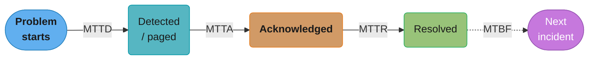
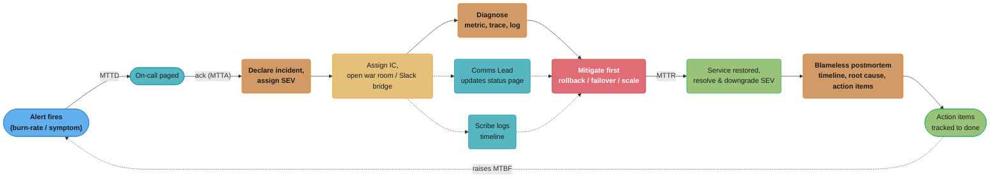
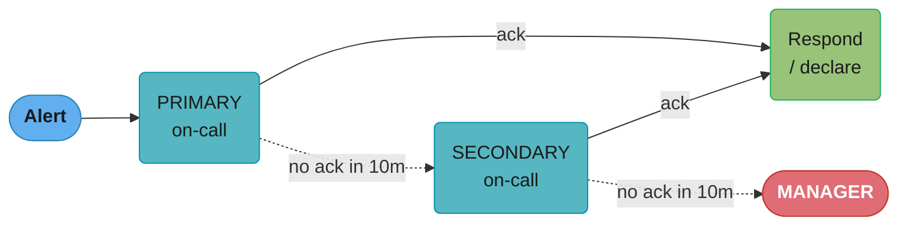
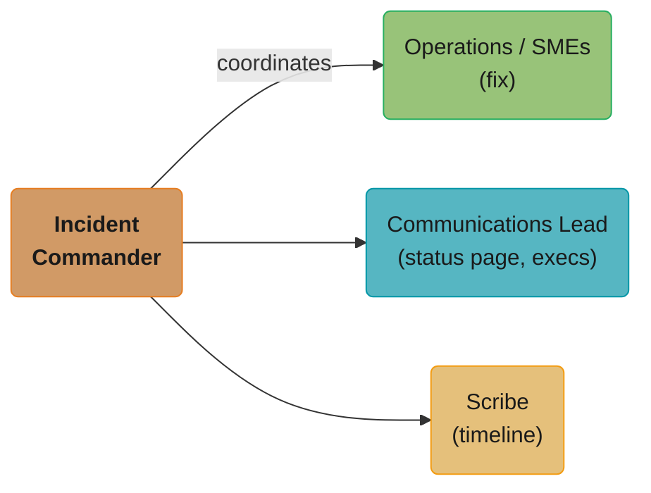
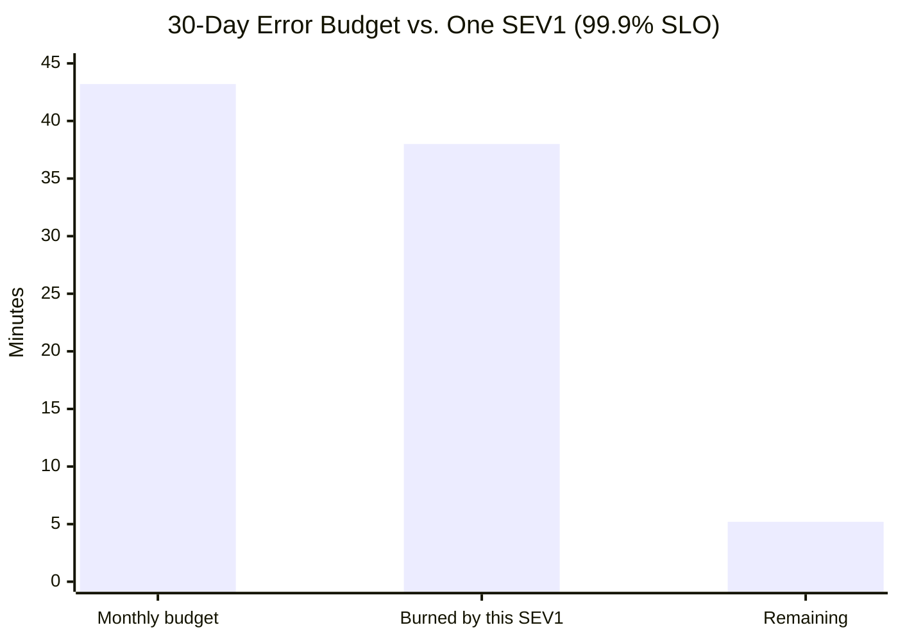

# Incident Management & On-Call

> Phase 6 — Observability & SRE · Difficulty: Intermediate

Incident management is the **structured, repeatable process for responding to and learning from outages** — so that under the stress of a production fire, the team has clear roles, defined severities, working communication, and a path to resolution instead of chaos. On-call is the **human readiness layer** that makes someone responsible for responding 24/7, sustainably. The two metrics that quantify how well you do this are **MTTD** (mean time to detect) and **MTTR** (mean time to resolve), and the cultural practice that keeps you improving is the **blameless postmortem**.

---

## 1. Concept Overview

When a service degrades, an organization needs three things working together:

1. **Detection** — alerts (see [visualization_and_alerting](../visualization_and_alerting/)) page on-call when a user-impacting symptom crosses a burn-rate threshold. MTTD measures how long from problem-starts to someone-knows.

2. **Response** — a defined **incident management process** kicks in: declare an incident, assign a **severity** (SEV1–SEV4), establish **incident command** roles, open a communication channel (war room / Slack / bridge), diagnose using runbooks and observability, mitigate, then resolve. MTTR measures problem-starts (or detected) to resolved.

3. **Learning** — after resolution, a **blameless postmortem** documents the timeline, root cause(s), what went well/poorly, and produces tracked **action items** so the same failure can't recur the same way.

The **Incident Command System (ICS)**, borrowed from emergency services, defines roles so nobody steps on each other under pressure: an **Incident Commander (IC)** owns coordination and decisions (not the fix); **Operations/Subject-Matter Experts (SMEs)** do the technical work; a **Communications Lead** keeps stakeholders/status-page updated; a **Scribe** records the timeline. The IC's job is explicitly *not* to fix the problem — it's to keep the response organized, prevent duplicate or conflicting actions, and make decisions (declare, escalate, page more people, communicate externally).

**Severity levels** map impact to response intensity: a SEV1 (full outage / major customer impact / data loss risk) pages broadly, may wake leadership, and demands an IC immediately; a SEV3 (minor degradation, workaround exists) might be handled by on-call alone during business hours. Severity drives who's involved, how fast, and how much you communicate.

**On-call** rotations (primary + secondary, with escalation) distribute the burden of being reachable. Healthy on-call is *sustainable*: reasonable rotation length, fair compensation/time-off, a manageable page volume (low alert fatigue — see [visualization_and_alerting](../visualization_and_alerting/)), good runbooks, and follow-the-sun scheduling for global teams to avoid chronic night pages.

The whole system is judged by **MTTD/MTTR** (lower is better — fast detection and resolution) and by whether postmortem action items actually get done (preventing recurrence). **Runbooks** — step-by-step diagnosis/mitigation guides linked from every alert — are the single highest-leverage artifact for cutting MTTR.

---

## 2. Intuition

> **One-line analogy**: Incident management is the fire department's command structure. When the building's on fire you don't want everyone grabbing a different hose — you want one incident commander directing, firefighters fighting the fire, someone talking to the press, and someone logging what happened. And afterward you investigate *why the building was flammable*, not *which person dropped the match*.

**Mental model**: An incident is a temporary, high-stress project with a clear lifecycle — detect → declare → diagnose → mitigate → resolve → learn. Structure (roles, severity, comms) exists precisely because human judgment degrades under stress and at 3am; the process is a checklist that compensates. Mitigate first (stop the bleeding — roll back, failover, scale), find true root cause later.

**Why it matters**: The difference between a 5-minute blip and a 2-hour outage is rarely the underlying bug — it's how fast you detect it and how organized the response is. A team with good runbooks, clear roles, and a blameless culture resolves incidents quickly and gets *better* over time; a team without them flails, repeats the same failures, and burns out its on-call engineers.

**Key insight**: **Mitigate before you diagnose, and blame systems not people.** Restoring service (rollback/failover) takes priority over understanding the root cause — find the cause in the postmortem, not while customers are down. And the postmortem must be blameless: the moment people fear blame, they hide information, and you lose the ability to learn — which guarantees the failure recurs.

---

## 3. Core Principles

1. **Mitigate first, diagnose later.** Stop user impact (rollback, failover, scale) before root-causing.
2. **One Incident Commander coordinates;** the IC decides and delegates but does not personally fix.
3. **Severity drives response.** Impact level determines who's paged, how fast, and how much you communicate.
4. **Communicate proactively** — internal channel + external status page; over-communicate during SEV1/2.
5. **Blameless postmortems.** Target systems and process, never individuals; psychological safety enables learning.
6. **Action items are tracked to completion**, with owners and due dates — a postmortem with no follow-through is theater.
7. **On-call must be sustainable** — bounded page volume, fair rotations, good runbooks, follow-the-sun where possible.
8. **Measure MTTD/MTTR** and drive them down with detection, runbooks, and automation.

---

## 4. Types / Architectures / Strategies

### Severity levels (typical 4-tier)

| Severity | Impact | Response | Comms |
|----------|--------|----------|-------|
| SEV1 | Full outage / major customer impact / data loss | Page broadly, IC + SMEs now, possibly wake leadership | Status page + exec updates every 15–30m |
| SEV2 | Significant degradation, many users affected | IC + on-call, urgent | Status page, regular internal updates |
| SEV3 | Minor degradation, workaround exists | On-call handles, business hours OK | Internal channel |
| SEV4 | Cosmetic / negligible impact | Ticket, no urgency | None / changelog |

### Incident Command roles (ICS)

| Role | Owns | Does NOT |
|------|------|----------|
| Incident Commander (IC) | Coordination, decisions, delegation | Personally fix the bug |
| Operations / SME | Technical diagnosis and mitigation | Manage comms/coordination |
| Communications Lead | Stakeholder + status-page updates | Touch the system |
| Scribe | Timeline, decisions, action items | Make decisions |

### On-call rotation patterns

| Pattern | Notes |
|---------|-------|
| Primary + Secondary | Secondary backs up / escalation target if primary misses |
| Follow-the-sun | Hand off across time zones so nobody is on-call overnight |
| Weekly rotation | Common; balance handoff overhead vs fatigue |
| Escalation policy | Ack within N min (5–15) → escalate to secondary → manager |

### Key metrics

| Metric | Meaning | Improve by |
|--------|---------|-----------|
| MTTD (detect) | Problem start → someone knows | Better alerting/SLO burn-rate alerts |
| MTTA (acknowledge) | Page sent → acked | Reliable paging, escalation, low fatigue |
| MTTR (resolve) | Detect → resolved | Runbooks, automation, clear roles |
| MTBF (between failures) | Reliability over time | Postmortem action items, hardening |

**Metrics as one incident timeline**



*The four metrics are consecutive segments of one incident's timeline, not independent numbers: MTTD ends at detection, MTTA at acknowledgement, MTTR at resolution, and MTBF is the gap until the next incident starts.*

**Read it like this.** "Each metric is a subtraction between two timestamps on the same incident, so the only thing you ever have to be careful about is which timestamp you subtract from."

| Symbol | What it is |
|--------|------------|
| `started` | When user impact actually began — usually reconstructed after the fact from metrics |
| `detected` | When the alert fired and a page was sent |
| `acked` | When a human accepted the page in the on-call tool |
| `resolved` | When user impact ended and the incident was closed |
| MTTD | `detected - started` |
| MTTA | `acked - detected` |
| MTTR | `resolved - detected` (this module's definition; see the caution below) |
| MTBF | `next_started - resolved` |

**Walk one example.** Subtract the timestamps straight out of the module's own payments postmortem:

```
  14:02  started    deploy v2.7.0 goes out, checkout begins failing
  14:09  detected   burn-rate alert pages primary          MTTD = 14:09 - 14:02 =  7 min
  14:11  acked      on-call accepts the page               MTTA = 14:11 - 14:09 =  2 min
  14:14  declared   SEV1 declared, IC assigned             (+3 min of process)
  14:21  correlated deploy identified as the cause
  14:23  mitigated  rollback issued
  14:40  resolved   5xx back under 1%, incident closed

  MTTR measured from detection: 14:40 - 14:09 = 31 min
  MTTR measured from start:     14:40 - 14:02 = 38 min   <- what the user experienced
  time-to-mitigate from start:  14:23 - 14:02 = 21 min   <- the postmortem's "21m"
```

**Why the denominator matters more than the number.** The same incident is honestly reportable as 21, 31, or 38 minutes depending on whether you measure to mitigation or resolution, and from detection or from impact start. Only the 38-minute figure matches what a customer felt. Teams that quietly switch to "from detection, to mitigation" watch their MTTR improve without a single incident getting better — pick one definition, write it down, and never change it mid-quarter.

---

## 5. Architecture Diagrams

**Incident lifecycle**



*Detection (MTTD) chains into mitigation and resolution (MTTR); the blameless postmortem's tracked action items close the loop by raising MTBF and shrinking the next incident's MTTR.*

**Escalation policy (paging tool)**



*A missed acknowledgement inside the 10-minute window bumps the page up a tier — primary to secondary to manager — so an unanswered page is never silently dropped.*

**Roles in a SEV1 (nobody steps on anyone)**



*The IC coordinates but never personally fixes the bug — Operations/SMEs own the technical fix while Comms and Scribe run in parallel, so no one is doing two jobs during a SEV1.*

---

## 6. How It Works — Detailed Mechanics

### Escalation policy as code (PagerDuty-style)

```yaml
# escalation policy: ack within 10 min or escalate.
escalation_policy:
  name: payments-oncall
  rules:
    - escalation_delay_in_minutes: 10
      targets: [{ type: schedule, id: payments-primary }]
    - escalation_delay_in_minutes: 10
      targets: [{ type: schedule, id: payments-secondary }]
    - escalation_delay_in_minutes: 10
      targets: [{ type: user, id: eng-manager }]
schedule:
  payments-primary:
    rotation: weekly
    handoff: "Monday 10:00 America/New_York"
    layers: [follow-the-sun: [na-team, eu-team, apac-team]]   # avoid 3am pages
```

**Stated plainly.** "The escalation delays are a countdown chain, not a single timeout: each unanswered tier hands the page up after its own delay, so the worst case before a human is guaranteed to be looking is the sum of the delays above them."

| Symbol | What it is |
|--------|------------|
| `escalation_delay_in_minutes` | How long that tier has to acknowledge before the page moves up |
| Rule order | Tier sequence — primary, then secondary, then the engineering manager |
| `rotation: weekly` | How often the person holding the primary schedule changes |
| `handoff` | The fixed moment the rotation changes hands, pinned to a named timezone |
| `layers: follow-the-sun` | Three regional schedules stitched into one 24-hour cover |

**Walk one example.** Trace the worst case, where every tier sleeps through its window:

```
  t =  0 min   alert fires  ->  paged: payments-primary
  t = 10 min   no ack       ->  paged: payments-secondary   (rule 1 delay expires)
  t = 20 min   no ack       ->  paged: eng-manager          (rule 2 delay expires)
  t = 30 min   no ack       ->  policy exhausted            (rule 3 delay expires)

  worst-case time to a guaranteed human = 10 + 10 = 20 min before the manager is even paged
  this delay is pure MTTA, and it lands on top of MTTD before any fixing starts

  follow-the-sun cover: 3 regional layers over a 24-hour day
    24 / 3 = 8 hours of coverage per region -> everyone is paged inside their workday
    without it, one region carries all 24 hours and eats the 03:00 pages
```

**Why the delay is 10 minutes and not 2 or 30.** Two minutes escalates before a woken engineer has reached their laptop, so the secondary and manager get dragged into every incident and quickly start ignoring pages themselves. Thirty minutes adds half an hour of pure MTTA to any page the primary genuinely missed. Ten minutes is the usual compromise, and the reason step 1 of the on-page runbook below is "ACK within the escalation window" — acknowledging is what stops the countdown, and it is deliberately separate from actually fixing anything.

### Declaring an incident (the runbook for the first 5 minutes)

```
ON PAGE:
  1. ACK within the escalation window (so it doesn't escalate while you're already on it).
  2. Look at the alert's runbook link + the service dashboard (RED + SLO burn).
  3. Decide: real incident? assign SEVERITY (SEV1-4) based on user impact.
  4. If SEV1/SEV2: declare an incident -> spins up Slack channel + bridge, assign IC.
     (one command: `/incident declare sev2 "payments 5xx spike"`)
  5. IC: page SMEs, assign Comms + Scribe, start the timeline.
  6. MITIGATE FIRST: is there a recent deploy? -> roll back. Regional? -> failover.
```

### Mitigation-first patterns (stop the bleeding)

```bash
# A bad deploy is the most common incident cause -> roll back BEFORE root-causing.
kubectl rollout undo deployment/payments        # revert to previous ReplicaSet
# or under GitOps: git revert <bad-commit> && git push  (see ../gitops_argocd_flux)

# Regional/zonal failure -> shift traffic.
# (DNS/LB weight change to healthy region; see ../disaster_recovery_and_resilience)

# Saturation -> scale out NOW, investigate the leak later.
kubectl scale deployment/payments --replicas=20
```

The discipline: **the first goal is restoring service, not understanding why it broke.** A 30-second rollback that ends customer impact beats a 40-minute root-cause investigation while the site is down.

### A runbook (the highest-leverage MTTR artifact)

```markdown
# RUNBOOK: payments-high-5xx-rate
## Symptom
  Alert PaymentsBudgetBurnFast firing; dashboard shows 5xx ratio > 5%.
## Diagnose (in order)
  1. Recent deploy in last 30m? -> `kubectl rollout history deployment/payments`
  2. Dependency down? -> check db/payment-gateway dashboards + their SLOs
  3. Saturation? -> CPU/memory/conn-pool panels; check HPA status
  4. Trace a failing request -> copy trace_id -> logs (see observability_tracing_and_otel)
## Mitigate
  - If deploy-correlated: `kubectl rollout undo deployment/payments`  (fastest fix)
  - If dependency: enable circuit breaker / degrade gracefully (queue + retry)
  - If saturation: `kubectl scale deployment/payments --replicas=N`
## Escalate
  - If not mitigated in 15m or data-loss risk -> escalate to SEV1, page DB on-call + IC lead.
## Verify resolved
  - 5xx ratio < 1% for 10m; SLO burn rate back under 1x.
```

Every alert annotation should link to its runbook (see the `runbook:` field in [visualization_and_alerting](../visualization_and_alerting/)). Runbooks turn a 3am scramble into a checklist.

### Blameless postmortem template

```markdown
# POSTMORTEM: payments 5xx outage 2026-06-02 (SEV1, 38 min)
## Impact
  - 38 min, ~4.2% of checkout attempts failed; ~$310k delayed/lost revenue; SLO budget 71% burned.
## Timeline (UTC) — facts, no blame
  14:02 deploy v2.7.0 rolled out
  14:09 burn-rate alert paged primary on-call (MTTD 7m)
  14:11 acked; 14:14 declared SEV1, IC assigned
  14:21 identified deploy correlation; 14:23 rollback issued (mitigated, MTTR-to-mitigate 21m)
  14:40 5xx back under 1%; incident resolved
## Root cause (5 whys — systemic)
  v2.7.0 introduced a config that exhausted the DB connection pool under peak load;
  the canary stage ran at off-peak traffic so the pool exhaustion never triggered.
## What went well / poorly
  + rollback was fast once correlation found.   - canary didn't exercise peak load.
## Action items (owner, due date, tracked)
  - [ ] Canary must hold through a peak window before full rollout  (owner: A, due 06/16)
  - [ ] Add a connection-pool-saturation SLI + alert                 (owner: B, due 06/12)
  - [ ] Auto-rollback on burn-rate page during a rollout             (owner: C, due 06/30)
## NO names assigned to "who caused it" — the SYSTEM allowed it.
```

### MTTD / MTTR math

```
MTTD = mean(detected_time - started_time) across incidents   -> lower with better alerting
MTTR = mean(resolved_time - detected_time) across incidents  -> lower with runbooks/automation
Availability impact: a 99.9% / 30d SLO = 43.2 min budget. One 38-min SEV1 burns 88% of it.
  -> cutting MTTR via runbooks/auto-rollback directly protects the error budget (see ../sre_principles_and_slos).
```



*A single 38-minute SEV1 burns 88% of the entire month's 43.2-minute error budget, leaving about 5 minutes to spare — this is why cutting MTTR via runbooks and auto-rollback directly protects the budget.*

**What this actually says.** "A month of reliability budget for a 99.9% service is 43 minutes long, so MTTR is not an engineering vanity metric — every minute of an outage is a minute spent out of a wallet that only refills once a month."

| Symbol | What it is |
|--------|------------|
| 99.9% / 30d | The SLO: at most 0.1% of the month may be bad |
| 43,200 | Minutes in 30 days, `30 x 24 x 60` |
| 43.2 min | The budget: `43,200 x (1 - 0.999)` |
| Incident minutes | Wall-clock user impact, i.e. MTTD + MTTR for that incident |
| Budget burned | `incident_minutes / 43.2` |

**Walk one example.** Price the module's SEV1 against the month, then price the fix:

```
  budget      = 43,200 x 0.001            = 43.2 minutes for the whole month
  the SEV1    = 14:40 - 14:02             = 38.0 minutes of impact
  burned      = 38.0 / 43.2               = 0.8796 = 88%
  remaining   = 43.2 - 38.0               =  5.2 minutes for the rest of the month

  the same incident with the case study's post-fix response (under 10 min):
    burned    = 10.0 / 43.2               = 0.2315 = 23%
    remaining = 43.2 - 10.0               = 33.2 minutes

  so cutting MTTR from 38 min to 10 min buys back 33.2 - 5.2 = 28 minutes of budget,
  which is 28 / 43.2 = 65 percentage points of the month's reliability allowance
```

**Two ways to count "bad", and why they disagree.** The 88% figure above treats the incident as full unavailability for 38 minutes. A request-ratio SLI counts differently: the same postmortem records that roughly 4.2% of checkout attempts failed, so on a pure request-ratio basis the failing share of those 38 minutes is `38 x 0.042 = 1.6` minute-equivalents, about 3.7% of the budget. Both are legitimate; they answer different questions ("how long was it broken" vs "how many requests did it break"). Always state which SLI a burn percentage was computed against — comparing a time-based burn to a request-based one is one of the most common ways incident reports end up quietly inconsistent with each other.

---

## 7. Real-World Examples

- **Google SRE incident management**: codified the IC role, mitigate-first, and blameless postmortems; the practice that "the IC coordinates and does not fix" is widely adopted from their model.
- **PagerDuty's incident response framework**: publicly documented severity definitions, IC/Scribe/Comms roles, and escalation policies that many companies adopt wholesale.
- **Blameless postmortem culture (Etsy, Google)**: Etsy's "Just Culture" and Google's blameless postmortems are the canonical examples — engineers who caused outages have written the postmortems with no punishment, maximizing learning.
- **Major public postmortems**: AWS, Cloudflare, and GitHub publish detailed blameless postmortems of large outages (e.g. config-push and BGP incidents) — exemplary timelines, root-cause analyses, and action items, and proof that even hyperscalers fail and learn publicly.
- **Follow-the-sun on-call**: global companies (e.g. Atlassian, large SaaS vendors) hand off on-call across NA/EU/APAC so engineers are paged during their working day, not at 3am — directly improving on-call sustainability.

---

## 8. Tradeoffs

| Decision | Option A | Option B | Key factor |
|----------|----------|----------|-----------|
| Response | Mitigate first | Diagnose root cause first | Restore service fast vs full understanding |
| Severity granularity | Few levels (SEV1-3) | Many levels | Simplicity vs precise response calibration |
| IC model | Dedicated IC role | Whoever's on-call does everything | Coordination vs overhead for small incidents |
| On-call rotation | Follow-the-sun | Single-region with night pages | Sustainability vs staffing cost/complexity |
| Postmortem | Blameless | Accountability-focused | Learning/safety vs (illusory) deterrence |
| Automation | Auto-remediate (auto-rollback) | Human-in-the-loop | Speed vs control/safety |
| Comms | Over-communicate | Minimal updates | Trust/transparency vs noise |

---

## 9. When to Use / When NOT to Use

**Apply formal incident management when:** you run production services with real user/revenue impact, you have an on-call team, and outages need coordinated multi-person response. Severity tiers, IC roles, runbooks, and blameless postmortems pay off the moment an incident involves more than one person or has customer impact.

**Scale it down when:** an incident is trivially handled by one on-call engineer in minutes (a full ICS activation with IC/Scribe/Comms is overkill for a SEV4 — just fix it and log it); a tiny team where everyone is already in the loop (lightweight process beats ceremony); or a pre-production system with no user impact. The anti-pattern is over-processing minor issues (declaring SEV1 for cosmetic bugs erodes the meaning of severity) *and* under-processing major ones (winging a multi-team outage with no IC). Match the process weight to the severity — and never skip the postmortem for a genuine customer-impacting incident.

---

## 10. Common Pitfalls

**Pitfall 1 — Diagnosing root cause while customers are down (instead of mitigating).**

```bash
# BROKEN: site is 500-ing after a deploy; the team spends 40 min reading logs to understand
# the exact bug while customers can't check out. MTTR balloons, error budget incinerated.
#   (debugging the WHY before stopping the bleeding)
```

```bash
# FIX: mitigate first - the deploy is the obvious correlation, so roll it back NOW.
kubectl rollout undo deployment/payments      # service restored in ~30s
# THEN, with the site healthy, do the root-cause analysis calmly in the postmortem.
```

**Pitfall 2 — The Incident Commander also trying to fix the bug.** When the IC dives into debugging, nobody is coordinating: SMEs duplicate work, comms goes silent, and decisions stall. FIX: the IC's job is coordination and decisions only — delegate the fix to SMEs, keep the Comms Lead and Scribe active, and stay at the "10,000-foot view." For a small SEV3 one person can wear multiple hats, but for SEV1/2 separate the roles.

**Pitfall 3 — Blameful postmortems that punish the person who triggered the outage.** Blaming the engineer who pushed the bad deploy teaches everyone to hide mistakes and withhold information, destroying the org's ability to learn — and the next person hides their near-miss. FIX: run blameless postmortems focused on *what systemic gap allowed* the failure (why did the canary not catch it? why was there no auto-rollback?); the person is a symptom, the system is the cause.

**Pitfall 4 — Postmortem action items that never get done.** A beautifully written postmortem whose action items aren't tracked, owned, or prioritized means the same incident recurs in three months. FIX: every action item has a named owner and a due date, is filed as a tracked ticket, and is reviewed in regular ops/SRE meetings; treat overdue postmortem items as a leading indicator of repeat incidents.

---

## 11. Technologies & Tools

| Tool | Purpose |
|------|---------|
| PagerDuty | On-call scheduling, escalation, incident workflow |
| OpsGenie | On-call/escalation (Atlassian) |
| Grafana OnCall / Incident | Open-source on-call + incident management |
| incident.io / FireHydrant / Rootly | Incident lifecycle automation (declare, roles, comms, retro) |
| Slack / Microsoft Teams | War room / incident channel + bots |
| Statuspage / Atlassian Statuspage | External status communication |
| Jira / Linear | Track postmortem action items |
| Runbook tooling (Confluence, runbooks-as-code) | Diagnosis/mitigation guides linked from alerts |
| Blameless / Jeli | Postmortem authoring + learning analytics |
| Alertmanager | Feeds alerts into the on-call/escalation flow (see [visualization_and_alerting](../visualization_and_alerting/)) |

---

## 12. Interview Questions with Answers

**Q1: Why mitigate before diagnosing root cause?**
Because the first goal during an incident is to stop user impact, and you can almost always restore service faster than you can fully understand why it broke — a 30-second rollback that ends customer-facing errors beats a 40-minute investigation while the site is down. Root-cause analysis is calmer and more accurate once the pressure of an active outage is gone, so you do it in the postmortem. The discipline "mitigate first, diagnose later" directly protects MTTR and the error budget.

**Q2: What is the role of an Incident Commander, and what should they NOT do?**
The IC owns coordination and decision-making during an incident — declaring severity, assigning roles, deciding to escalate or page more people, and keeping the response organized so SMEs don't duplicate or conflict. Critically, the IC should NOT personally fix the bug, because diving into debugging means no one is coordinating, comms go dark, and decisions stall. The IC stays at the high-level view and delegates the technical work to subject-matter experts.

**Q3: How do severity levels work and why have them?**
Severity maps user/business impact to response intensity — a SEV1 (full outage/data-loss risk) pages broadly, demands an IC immediately, and triggers exec and status-page communication, while a SEV3 (minor, workaround exists) is handled by on-call alone in business hours. They exist so the response is proportionate: you don't activate a full incident command for a cosmetic bug, and you don't wing a major outage with one engineer. Consistent severity definitions also let you measure and compare incidents.

**Q4: What makes a postmortem blameless, and why does it matter?**
A blameless postmortem analyzes the systemic and process gaps that allowed the failure — why the canary didn't catch it, why there was no auto-rollback — rather than blaming the person who triggered it. It matters because the moment people fear punishment they hide mistakes and withhold the information you need to learn, which guarantees the failure recurs; psychological safety is what makes honest, complete analysis possible. The output is concrete, owned action items, not a scapegoat.

**Q5: Explain MTTD vs MTTR and how you improve each.**
MTTD (mean time to detect) is from problem-start to someone-knowing, improved by better alerting — especially SLO burn-rate alerts that page on user-impacting symptoms quickly. MTTR (mean time to resolve) is from detection to service-restored, improved by good runbooks, clear roles, automation (auto-rollback), and mitigate-first discipline. Both directly affect availability: cutting MTTR via a fast rollback can turn a budget-incinerating 40-minute outage into a 5-minute blip.

**Q6: What is a runbook and why is it the highest-leverage MTTR artifact?**
A runbook is a step-by-step guide for diagnosing and mitigating a specific alert — symptom, ordered diagnosis steps, mitigation actions, escalation criteria, and how to verify resolution. It's the highest-leverage MTTR artifact because it turns a stressful 3am scramble (where a tired engineer has to reason from scratch) into following a checklist that a previous responder already worked out. Linking every alert annotation to its runbook means the responder is one click from "here's exactly what to try first."

**Q7: How should on-call rotations be structured to stay sustainable?**
Use a primary plus secondary (the secondary is the escalation target and backup), with an escalation policy that pages the next responder if the primary doesn't ack within ~10 minutes, and a manager as the final tier. Keep page volume low (fight alert fatigue so on-call isn't woken for non-actionable noise), rotate fairly (commonly weekly) with adequate compensation/time-off, and use follow-the-sun scheduling across time zones so engineers are paged during their workday rather than overnight. Sustainable on-call is a retention and reliability issue, not just a logistics one.

**Q8: What are the ICS roles and why separate them?**
Incident Commander (coordination/decisions), Operations/SMEs (technical fix), Communications Lead (stakeholder and status-page updates), and Scribe (timeline and decisions log). You separate them so that under stress nobody is doing two jobs poorly — if the IC is also debugging, coordination collapses; if the engineer fixing the bug is also writing status updates, both suffer. For small incidents one person can hold multiple roles, but for SEV1/SEV2 the separation prevents the chaos of everyone doing everything.

**Q9: How does incident management connect to SLOs and error budgets?**
Incidents consume the error budget — a 38-minute SEV1 can burn most of a 99.9% service's 43.2-minute monthly budget — so fast detection and resolution directly protect the budget and thus feature velocity (see [sre_principles_and_slos](../sre_principles_and_slos/)). Burn-rate alerts are the detection trigger that starts the incident process, and the error-budget policy may freeze launches after a budget-burning incident. Postmortem action items raise MTBF and lower future MTTR, improving the SLI over time.

**Q10: How do you decide what to communicate during an incident, and to whom?**
Severity drives it: a SEV1 needs proactive, regular external communication (status page updates every 15–30 minutes) plus internal exec updates, while a SEV3 may only need an internal channel note. The Communications Lead owns this so the engineers fixing the problem aren't distracted, and the principle is to over-communicate during high-severity incidents — customers and stakeholders trust transparency far more than silence. Always communicate impact and ETA-to-update (not necessarily ETA-to-fix, which you often don't know).

**Q11: What's the value of declaring an incident early versus waiting?**
Declaring early spins up the structure — IC, channel, roles, comms — while the problem is still small, so if it escalates you already have coordination in place instead of scrambling mid-crisis. The cost of a "false alarm" declaration is low (you downgrade and close it), while the cost of declaring late is a disorganized response to a now-large incident. The guidance is to err toward declaring: it's cheaper to stand down an incident than to stand one up under fire.

**Q12: How do you ensure postmortem action items actually reduce future incidents?**
Give every action item a named owner, a due date, and a tracked ticket, and review overdue items in regular ops/SRE meetings so they don't silently rot — an untracked action item means the same incident recurs in months. Prioritize them against the roadmap (the error-budget policy can force this after a budget-burning incident), and measure the loop: are repeat incidents declining? A postmortem without followed-through action items is theater; the action items are the entire point of doing the postmortem.

**Q13: What is the exact sequence an on-call engineer follows in the first five minutes after being paged, before real diagnosis starts?**
The on-call engineer acknowledges the page inside the escalation window, opens the runbook and RED/SLO-burn dashboard, and assigns a severity before touching anything else. For a SEV1 or SEV2, a single command like `/incident declare sev2 "payments 5xx spike"` spins up the Slack channel and bridge and assigns an IC, who then pages SMEs and assigns Comms and Scribe before the team starts mitigating. Fixing this order as a checklist matters because human judgment degrades at 3am, and jumping straight to debugging is exactly the coordination failure ICS exists to prevent. Treat the first five minutes as a scripted checklist, not an improvised decision.

**Q14: What sections make up a blameless postmortem document, beyond the root-cause narrative?**
A postmortem template has five parts: impact, a facts-only UTC timeline, root cause via five whys, what went well or poorly, and owned action items. In the module's payments outage example, the impact section quantifies a 38-minute SEV1 as roughly 4.2% of checkout attempts failing and about $310k in delayed or lost revenue with 71% of the SLO budget burned, and the timeline logs each milestone in UTC — 14:09 paged (MTTD 7m), 14:14 declared, 14:23 rollback issued (MTTR-to-mitigate 21m) — with no names attached to "who caused it." Structuring the document this way keeps the analysis factual and systemic instead of a narrative that can drift toward blame. Fill in every section for a SEV1/SEV2 postmortem, not just the root-cause paragraph people default to writing.

**Q15: What's the tradeoff between auto-remediation (auto-rollback) and human-in-the-loop mitigation?**
Auto-remediation trades human oversight for speed, while human-in-the-loop trades speed for a safety check before acting. An auto-rollback triggered directly off a burn-rate page can cut MTTR to near zero by skipping the manual diagnosis step entirely — exactly the action item the case study's postmortem tracked ("auto-rollback on burn-rate page during a rollout"). The risk is a bad automatic decision compounding an already-bad situation with no human check, such as auto-rolling-back a deploy that wasn't actually the cause of the alert. Reserve full automation for well-understood, low-risk mitigations like rollback-on-deploy-correlated-alerts, and keep a human in the loop for ambiguous or high-blast-radius actions.

**Q16: Why are MTTD, MTTA, MTTR, and MTBF described as segments of one continuous timeline rather than four independent numbers?**
They chain end-to-end across a single incident's life span, so each metric's endpoint is the next metric's starting point. MTTD ends when the page fires, MTTA ends when it's acknowledged, MTTR ends at resolution, and MTBF is the gap from that resolution until the next incident starts. Because the segments are sequential, a fast one can't compensate for a slow one — a 2-minute MTTA followed by a 90-minute MTTR still means 90-plus minutes of user impact, which is why teams track all four instead of a single blended "time to fix" number. Watch whichever segment is trending worst rather than an average, since each points at a different fix: alerting for MTTD, paging reliability for MTTA, runbooks for MTTR, and postmortem hardening for MTBF.

---

## 13. Best Practices

- **Mitigate first** (rollback/failover/scale), diagnose in the postmortem; restoring service beats understanding it.
- **Assign one Incident Commander** who coordinates and decides but does not personally fix; separate IC/SME/Comms/Scribe for SEV1/2.
- **Define clear severity tiers** and match response weight to severity; declare incidents early and downgrade if needed.
- **Link every alert to a runbook;** runbooks are the cheapest way to cut MTTR.
- **Run blameless postmortems** targeting systemic gaps; produce owned, dated, tracked action items and follow through.
- **Keep on-call sustainable** — low page volume (fight fatigue), fair rotations, follow-the-sun, secondary + escalation.
- **Communicate proactively** during high-severity incidents via a status page and internal updates.
- **Measure MTTD/MTTR/MTBF** and connect incident outcomes to the error budget (see [sre_principles_and_slos](../sre_principles_and_slos/)).

---

## 14. Case Study

### Scenario: A SEV1 outage drags for two hours because of chaos, blame, and no runbook

A SaaS company ships `payments v2.7.0`. Minutes later, checkout starts failing. The alert is a vague `HighErrorRate` page with no runbook link. The first on-call engineer starts reading logs to understand the bug. Two more engineers jump in and independently restart pods and tweak config — stepping on each other. No one declares an incident or assigns an IC; the status page stays green while customers complain on Twitter. After 90 minutes someone finally correlates the deploy and rolls back. In the retro, a director asks "who pushed this?" and the engineer is reprimanded. MTTD was 12 minutes, MTTR was ~2 hours, and the same class of bug recurs a month later.

```
# BROKEN: no structure, diagnose-first, blameful.
#  - alert has no runbook -> on-call starts from scratch at the worst time
#  - no IC -> 3 people make conflicting changes (restart vs config vs nothing)
#  - no incident declared -> status page green, customers blindsided, no comms
#  - diagnose-before-mitigate -> 90 min before the obvious rollback
#  - blameful retro -> engineer punished -> team hides future mistakes -> bug recurs
```

```markdown
# FIX 1: actionable alert + runbook (cuts MTTR).
alert: PaymentsBudgetBurnFast
annotations:
  summary: "Payments burning budget 14.4x"
  runbook: "https://runbooks/payments-high-5xx-rate"   # ordered diagnose -> MITIGATE: rollback first
```

```bash
# FIX 2: declare + structure + mitigate first.
/incident declare sev1 "payments checkout 5xx"   # spins channel, assigns IC, starts timeline
# IC assigns: SME (fix), Comms (status page), Scribe (timeline). One person does NOT do all.
# Runbook step 1: deploy in last 30m? YES -> mitigate immediately:
kubectl rollout undo deployment/payments          # ~30s to restore, before root-causing
```

```markdown
# FIX 3: blameless postmortem with tracked action items.
Root cause (systemic): canary ran at off-peak load, so v2.7.0's connection-pool exhaustion
  never triggered before full rollout. (NOT "engineer X pushed a bad deploy.")
Action items (owner, due, tracked):
  - [ ] Canary must hold through a peak window         (A, 06/16)
  - [ ] Connection-pool saturation SLI + alert         (B, 06/12)
  - [ ] Auto-rollback on burn-rate page during rollout (C, 06/30)
```

After adopting the process: the next deploy-induced incident was detected by the burn-rate alert in 3 minutes, the on-call engineer followed the runbook, declared a SEV2, the IC coordinated while an SME rolled back within 6 minutes, and the Comms Lead kept the status page current. MTTR dropped from ~2 hours to under 10 minutes. The blameless postmortem's action items (peak-load canary, pool SLI, auto-rollback) were tracked to completion, and the connection-pool class of bug stopped recurring.

**The idea behind it.** "The 12x improvement did not come from fixing bugs faster — it came from deleting the three stretches of the timeline where nobody was fixing anything at all."

| Symbol | What it is |
|--------|------------|
| MTTD before / after | 12 minutes with a vague alert, 3 minutes with a burn-rate alert |
| MTTR before / after | ~120 minutes (2 hours) down to under 10 minutes |
| Improvement factor | `120 / 10` = 12x |
| Dead time | Minutes spent orienting, colliding, or diagnosing rather than mitigating |
| Rollback cost | ~30 seconds, unchanged before and after |

**Walk one example.** Decompose where the two hours actually went:

```
  before                                          after
    12 min  MTTD, vague HighErrorRate alert         3 min  MTTD, burn-rate alert
    ~0 min  runbook lookup (there was none)         ~1 min  open linked runbook
    ~90 min diagnosing + 3 people colliding         ~1 min  runbook step 1: recent deploy? yes
            with no IC and no declaration
    ~0.5min the actual rollback                     ~0.5min the actual rollback
    ------                                          ------
    ~120 min total                                  <10 min total

  improvement = 120 / 10 = 12x
  the rollback itself took ~30 seconds in BOTH columns -> 0.5 / 120 = 0.4% of the
  original outage was spent doing the thing that fixed it
```

Under a 99.9% SLO that is the difference between burning 88% of the month's 43.2-minute budget and burning 23% of it. The lesson generalizes past this one story: when MTTR is measured in hours, the fix is almost never a faster fix — it is a runbook that removes the guessing and an IC who stops three engineers from undoing each other's changes.

**Outcome:** MTTR fell ~12x, customers got transparent communication instead of silence, conflicting actions ceased (one IC, clear roles), and the blameless culture surfaced the *systemic* fix (canary at peak load + auto-rollback) that a blame-focused retro would never have produced. The error budget, previously incinerated by the 2-hour outage, was protected by the fast rollback.

**Discussion questions:**
1. Why did diagnosing-before-mitigating and having no IC turn a quick rollback into a 2-hour outage?
2. How did the blameful retro guarantee the bug would recur, and what did the blameless version fix instead?
3. How does linking a runbook to the alert and declaring an incident with clear roles cut MTTR?

---

**Cross-references:** [visualization_and_alerting](../visualization_and_alerting/) (the alerts/escalation that page on-call and start the process), [sre_principles_and_slos](../sre_principles_and_slos/) (error budget consumed by incidents; blameless culture; MTTD/MTTR), [observability_tracing_and_otel](../observability_tracing_and_otel/) and [observability_logging](../observability_logging/) (diagnosis via metric→trace→log), [gitops_argocd_flux](../gitops_argocd_flux/) (rollback via `git revert` as mitigation), [disaster_recovery_and_resilience](../disaster_recovery_and_resilience/) (failover as mitigation for regional incidents), [../../backend/chaos_engineering](../../backend/chaos_engineering) (practice incident response via game days).
