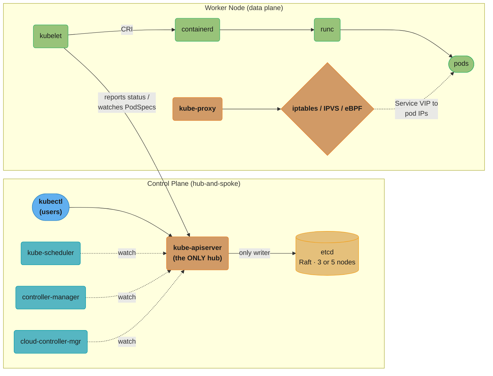
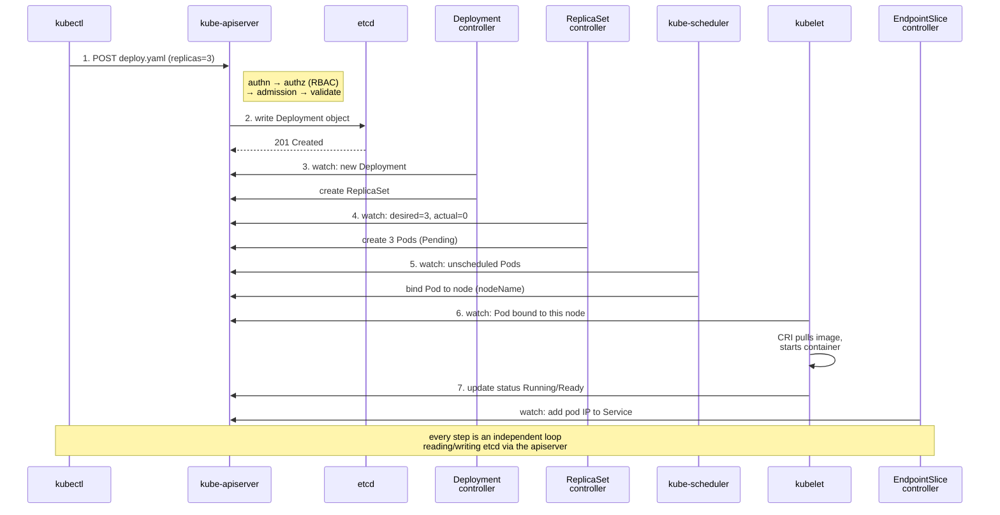
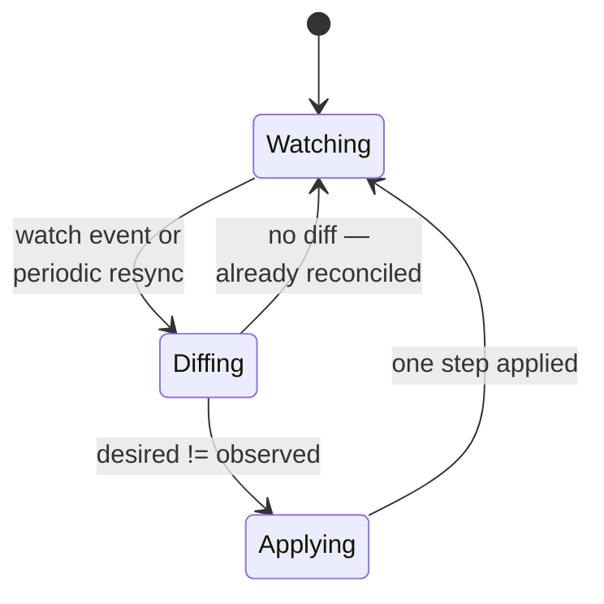
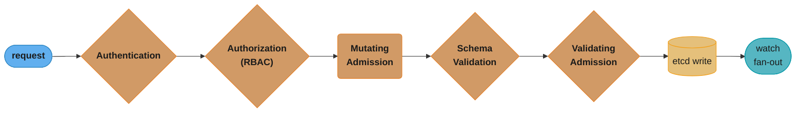
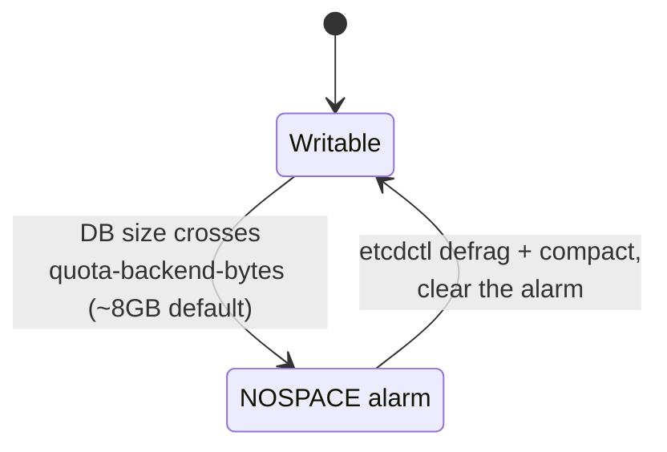
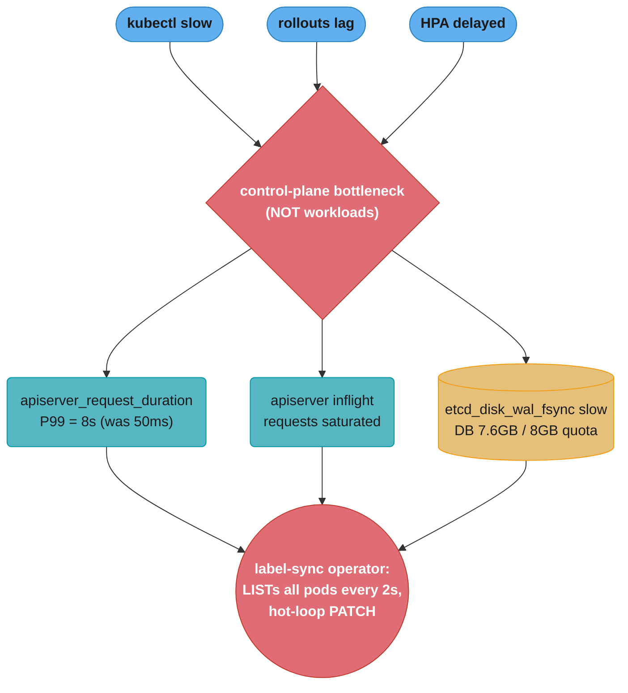

# Kubernetes Architecture

> Phase 2 — Containers & Kubernetes · Difficulty: Advanced

Kubernetes is the de-facto container orchestrator and the single most-tested DevOps interview topic. Its genius is one idea applied everywhere: **declare desired state; controllers continuously reconcile reality toward it.** Understanding the control plane (API server, etcd, scheduler, controller-manager) and node components (kubelet, kube-proxy) — and how they communicate only through the API server — explains nearly every Kubernetes behavior and failure mode.

---

## 1. Concept Overview

A Kubernetes cluster has two planes:

**Control plane** (the brain):
- **kube-apiserver** — the only component that talks to etcd; the front door for all reads/writes; validates, authenticates, authorizes, and admits every request.
- **etcd** — the distributed key-value store holding *all* cluster state (the single source of truth). Raft-based, strongly consistent.
- **kube-scheduler** — watches for unscheduled pods and binds each to a node based on resources, affinity, taints.
- **kube-controller-manager** — runs the control loops (Deployment, ReplicaSet, Node, Job controllers, etc.) that drive actual → desired.
- **cloud-controller-manager** — integrates with the cloud (provisions LBs, attaches volumes, manages node lifecycle).

**Node/data plane** (the muscle, on every worker):
- **kubelet** — the node agent; ensures the containers described in PodSpecs are running and healthy; talks CRI to the runtime.
- **kube-proxy** — programs node networking (iptables/IPVS/eBPF) so Service virtual IPs route to pod IPs.
- **container runtime** — containerd/CRI-O (see [container_runtimes_and_oci](../container_runtimes_and_oci/)).

Everything communicates through the API server — components **never** talk to each other directly. This hub-and-spoke design is why the API server is both the most critical and most load-bearing component.

---

## 2. Intuition

> **One-line analogy**: Kubernetes is a thermostat for your applications. You set the target ("I want 3 replicas of this app"); independent controllers constantly compare the current temperature (2 running) to the target and act (start 1 more), forever. Nobody issues imperative "start a container" commands — you change the setpoint and the system converges.

**Mental model**: The cluster is a set of independent reconciliation loops, all reading from and writing to one shared database (etcd) via one gatekeeper (the API server). Each controller watches for objects of interest, computes the difference between desired (`spec`) and observed (`status`), and takes one step to close the gap, then repeats. The system is **level-triggered**, not edge-triggered: it cares about the current state, not the event that caused it — which is why it self-heals after missed events, restarts, and partial failures.

**Why it matters**: Almost every Kubernetes question — "what happens when I `kubectl apply`?", "why did my pod reschedule?", "why is the cluster slow?" — is answered by tracing the reconciliation loops and the API-server-as-hub. Operational failures (etcd full, API server overloaded, a controller wedged) all map to this architecture.

**Key insight**: Desired state lives in `spec`; observed state in `status`; controllers exist solely to make `status` match `spec`. Once you internalize "everything is a controller reconciling spec→status through the API server," Kubernetes stops being magic.

---

## 3. Core Principles

1. **Declarative, not imperative.** You declare desired state; controllers reconcile. `kubectl apply`, not `kubectl run` scripts.
2. **Level-triggered reconciliation.** Controllers act on current state, not on events — so they recover from missed events and crashes.
3. **The API server is the sole hub.** All components read/write state through it; only it touches etcd.
4. **etcd is the single source of truth.** Lose etcd (without backup) and you lose the cluster's state.
5. **Controllers are independent loops.** Watch → diff → act → repeat, each owning one resource type.
6. **Everything is an API object.** Pods, Services, even cluster config are REST resources with `spec`/`status`.

---

## 4. Types / Architectures / Strategies

### Control-plane topologies

| Topology | etcd | API servers | Use |
|----------|------|-------------|-----|
| Single control plane | 1 | 1 | Dev/test only (SPOF) |
| Stacked HA | 3 (co-located w/ control plane) | 3 (behind LB) | Standard self-managed HA |
| External etcd HA | 3+ (dedicated nodes) | 3 | Large clusters, etcd isolation |
| Managed (EKS/GKE/AKS) | Cloud-operated | Cloud-operated | Most production — cloud owns the control plane |

etcd uses Raft, so it needs an **odd number** (3 or 5) for quorum: 3 tolerates 1 failure, 5 tolerates 2. Even numbers add no fault tolerance and risk split-brain.

#### The quorum arithmetic behind "always odd"

```
quorum        = floor(N / 2) + 1        (a strict majority of ALL members, not of survivors)
faultsTolerated = N - quorum
```

**Read it like this.** "Any decision needs more than half the members to agree, so the number you can afford to lose is whatever is left over once you have set that majority aside."

The reason a strict majority is required — rather than, say, any two nodes — is that two majorities of the same cluster must always share at least one member. That overlap is what makes it impossible for two halves of a partitioned cluster to both elect a leader and both accept writes.

| Symbol | What it is |
|--------|------------|
| `N` | Total configured etcd members, including ones currently down |
| `floor(N/2) + 1` | Strict majority — the smallest set that cannot coexist with a rival set |
| `faultsTolerated` | Members that may fail while the cluster still accepts writes |
| split-brain | Two leaders accepting conflicting writes. Impossible when every majority overlaps |
| quorum loss | Fewer than `quorum` members alive; etcd goes **read-only**, not degraded-writable |

**Walk one example.** Odd and even sizes side by side, which is where the rule earns its keep:

```
   N    quorum = floor(N/2)+1    faultsTolerated = N - quorum
   1            1                        0
   2            2                        0     <- 2x the cost of N=1, same tolerance
   3            2                        1     <- standard HA
   4            3                        1     <- 2x the etcd nodes of N=3, SAME tolerance
   5            3                        2     <- large clusters
   6            4                        2     <- again no gain over N=5
   7            4                        3
```

Look at the `N=3` and `N=4` rows. Adding a fourth member raises quorum from 2 to 3, so you still tolerate exactly one failure — you have bought an extra machine, an extra fsync participant on every write, and zero additional resilience. Even sizes are strictly worse, never merely neutral, which is why the guidance is a hard "odd only" rather than a preference.

Note also what `faultsTolerated` does *not* mean. At `N=3` losing two members does not give you a degraded single-node cluster; `quorum = 2` is unreachable, so etcd refuses all writes and the entire control plane freezes — the same read-only outcome as the NOSPACE alarm in Section 6, reached from a different direction.

### Key controllers

| Controller | Reconciles |
|-----------|-----------|
| Deployment | ReplicaSets (rollouts, rollbacks) |
| ReplicaSet | Pod count = desired replicas |
| Node | Node health, marks NotReady, evicts |
| Job/CronJob | Run-to-completion / scheduled pods |
| Endpoint(Slice) | Service → pod IP mappings |
| StatefulSet/DaemonSet | Stable identity / one-per-node pods |

---

## 5. Architecture Diagrams



*The API server is the only hub: kubectl and the kubelet send requests into it, the scheduler and both controller-managers only watch it, and it alone is allowed to write etcd. On the worker node, the kubelet drives the CRI chain to start containers while kube-proxy programs the network rules that route a Service's virtual IP to live pod IPs.*



*Seven independent reconciliation loops, chained only by what each one watches through the apiserver in etcd — no controller ever calls another directly.*

---

## 6. How It Works — Detailed Mechanics

### The reconciliation loop (pseudo-code every controller runs)

```go
for {
    desired := apiserver.Get(spec)          // what the user wants
    observed := apiserver.Get(status)        // what actually exists
    for _, diff := range computeDiff(desired, observed) {
        apiserver.Apply(diff)                // take ONE step toward desired
    }
    // level-triggered: re-runs on watch events AND on a periodic resync,
    // so a missed event or controller crash self-corrects on the next pass.
}
```



*Every controller runs this same loop independently. Because it is level-triggered — re-entering at Watching on a periodic resync, not only on the event that changed something — a crashed or restarted controller simply re-converges on its next tick instead of losing state.*

### The request path through the API server



*A request must clear five checks — two of them gates that can reject it outright — before it is ever written to etcd; only after the write does the change fan out to every watcher.*

Admission webhooks (mutating, then validating) are where policy engines (OPA Gatekeeper, Kyverno) and sidecar injectors hook in — see [kubernetes_security](../kubernetes_security/) and [policy_as_code_and_compliance](../policy_as_code_and_compliance/).

### Watches, not polling

```bash
# Controllers and kubelets use long-lived watch streams (HTTP/2) on the API server,
# receiving deltas as etcd changes. This is why a busy cluster's load concentrates
# on the apiserver + etcd, and why "list-watch" efficiency dominates scalability.
kubectl get pods --watch        # the same primitive controllers use
```

### etcd: the source of truth

```bash
# All state is here. Back it up; losing it (without a snapshot) means rebuilding the cluster.
ETCDCTL_API=3 etcdctl snapshot save /backup/etcd-$(date +%F).db \
  --endpoints=https://127.0.0.1:2379 \
  --cacert=/etc/kubernetes/pki/etcd/ca.crt \
  --cert=...  --key=...
# Defaults that bite: etcd has an ~8 GB DB size quota (--quota-backend-bytes).
# Exceeding it puts etcd into a read-only "alarm" state -> the whole cluster stops accepting writes.
```



*The ~8 GB default quota is a hard boundary, not a soft warning: crossing it flips etcd into the NOSPACE alarm, and the whole cluster — including the self-healing writes that would normally fix things — stops accepting writes until a defrag brings the DB back below quota.*

### Why the scheduler is separate

The scheduler's only job: for each Pod with no `nodeName`, score feasible nodes (resources, affinity/anti-affinity, taints/tolerations, topology spread) and write the binding. It does *not* start containers — the kubelet does, after observing the binding. This separation is covered in [kubernetes_scheduling_and_autoscaling](../kubernetes_scheduling_and_autoscaling/).

---

## 7. Real-World Examples

- **Managed control planes (EKS/GKE/AKS)**: the cloud runs and scales the API server + etcd; you manage only worker nodes. GKE Autopilot abstracts nodes too. This is how most production clusters run.
- **etcd outages = cluster-wide impact**: multiple public postmortems trace total cluster unavailability to etcd disk saturation or the 8 GB quota alarm — because no writes (including self-healing) can proceed.
- **API server overload**: a misbehaving controller or operator doing unbounded list-watches (no field selectors, hot loops) can saturate the API server, slowing every other component — a frequent large-cluster incident.
- **Operators extend the same model**: tools like Prometheus Operator and cert-manager add CRDs and custom controllers that reconcile just like built-in ones (see [kubernetes_operators_and_crds](../kubernetes_operators_and_crds/)).

---

## 8. Tradeoffs

| Decision | Option A | Option B | Key factor |
|----------|----------|----------|-----------|
| Control plane | Managed (EKS/GKE) | Self-managed (kubeadm) | Ops burden vs control/cost |
| etcd layout | Stacked | External | Simplicity vs isolation at scale |
| etcd nodes | 3 (tolerates 1) | 5 (tolerates 2) | Fault tolerance vs write latency |
| Cluster size | Many small clusters | Few large clusters | Blast radius vs overhead/fleet mgmt |
| API access | Direct kubectl | GitOps only | Auditability/drift vs flexibility |
| kube-proxy mode | iptables (default) | IPVS/eBPF (scale) | Service count + performance |

---

## 9. When to Use / When NOT to Use

**Kubernetes fits when:** you run many containerized services needing self-healing, horizontal scaling, rolling deploys, and declarative ops at scale; you have or can build the operational maturity.

**Kubernetes is overkill when:** you run a single app or a handful of services (a PaaS like Cloud Run/App Runner/Fargate is simpler), the team lacks ops capacity, or the workload is a managed-service fit (databases, queues). The control-plane and operational complexity is a real cost — don't adopt it for a monolith.

---

## 10. Common Pitfalls

**Pitfall 1 — No etcd backups; control-plane node dies; cluster state is gone.**

```bash
# BROKEN: relying on "the cloud will handle it" on a self-managed cluster with no snapshots.
#   single etcd node, no backup -> disk failure -> all Deployments/Services/Secrets lost.
```

```bash
# FIX: scheduled etcd snapshots + tested restore; HA etcd (3 nodes); monitor DB size.
ETCDCTL_API=3 etcdctl snapshot save /backup/etcd.db ...   # cron/systemd timer
# Alert on etcd_mvcc_db_total_size_in_bytes approaching --quota-backend-bytes (default ~8GB).
# Practice restore: etcdctl snapshot restore -> re-point apiserver -> verify objects.
```

**Pitfall 2 — A custom controller/operator hammering the API server.**

```go
// BROKEN: tight loop calling List() with no field selector, no informer cache, no backoff
for {
    pods, _ := clientset.CoreV1().Pods("").List(ctx, metav1.ListOptions{}) // full list, every iteration
    process(pods)
}
```

```go
// FIX: use a shared informer (watch-backed local cache) + workqueue with rate limiting.
informer := factory.Core().V1().Pods().Informer()   // one watch, cached locally
informer.AddEventHandler(handlers)                    // react to deltas, not polling
// + a rate-limited workqueue so retries back off instead of spinning.
```

**Pitfall 3 — Treating the API server as free.** Listing all pods/secrets cluster-wide on a hot path, or per-request `kubectl` in scripts, adds load that compounds at scale and degrades every component. FIX: use label/field selectors, informer caches, and pagination.

---

## 11. Technologies & Tools

| Tool | Purpose |
|------|---------|
| `kubectl` | CLI to the API server |
| `kubeadm` | Bootstrap self-managed clusters |
| EKS / GKE / AKS | Managed control planes |
| `etcdctl` | etcd snapshot/restore/inspection |
| k9s / Lens | Cluster TUIs/UIs |
| `kube-bench` | CIS benchmark checks |
| metrics-server | Resource metrics for `kubectl top`/HPA |
| client-go / controller-runtime | Build controllers/operators |
| kube-state-metrics | Object-state metrics for Prometheus |

---

## 12. Interview Questions with Answers

**Q1: Describe the Kubernetes control plane components and their roles.**
The **API server** is the front door and sole hub — it authenticates, authorizes, admits, validates, and persists every change, and is the only component that talks to etcd. **etcd** is the Raft-based key-value store holding all cluster state (the source of truth). The **scheduler** binds unscheduled pods to nodes. The **controller-manager** runs the reconciliation loops (Deployment, ReplicaSet, Node, etc.). The **cloud-controller-manager** integrates with the cloud (LBs, volumes, node lifecycle).

**Q2: Walk through exactly what happens when you `kubectl apply` a Deployment with 3 replicas.**
kubectl POSTs to the API server, which runs authn → authz (RBAC) → mutating/validating admission → schema validation, then writes the Deployment to etcd. The Deployment controller observes it and creates a ReplicaSet; the ReplicaSet controller sees desired=3, actual=0 and creates 3 Pod objects (Pending). The scheduler picks nodes and writes each Pod's `nodeName`. Each node's kubelet sees its bound Pod, calls the CRI runtime to pull the image and start the container, then reports status; the EndpointSlice controller adds ready pod IPs to the Service.

**Q3: What does "declarative" and "level-triggered" mean, and why does it matter?**
Declarative means you specify the desired end state (`spec`), not the steps to get there; controllers compute and apply the diff. Level-triggered means controllers act on the *current* state rather than reacting to a specific event. Together they make the system self-healing: a controller that crashes, misses an event, or restarts simply re-reconciles current vs desired on its next pass and converges anyway — no lost-event fragility.

**Q4: Why do components communicate only through the API server?**
It centralizes authentication, authorization, admission, validation, and auditing in one place, and gives every component a consistent, watchable view of state via etcd. Direct component-to-component calls would fragment security and consistency. The cost is that the API server (and etcd) is the scalability and reliability bottleneck — which is why protecting it (rate limits, efficient watches) is critical.

**Q5: What is etcd, and what happens if it fails or fills up?**
etcd is the strongly-consistent, Raft-based key-value store holding all cluster state. Lose it without a backup and you lose the cluster's desired state (Deployments, Secrets, everything). It has a default DB size quota (~8 GB); exceeding it raises a NOSPACE alarm and puts etcd read-only, so the cluster stops accepting writes — including self-healing — until you compact/defragment and clear the alarm. Hence: HA (3/5 nodes), scheduled snapshots, tested restores, and size monitoring.

**Q6: Why 3 or 5 etcd nodes and not 2 or 4?**
etcd needs a majority quorum to commit writes (Raft). With N nodes, quorum is ⌊N/2⌋+1: 3 → quorum 2 (tolerates 1 failure), 5 → quorum 3 (tolerates 2). An even count adds no extra fault tolerance (4 still only tolerates 1, same as 3) while adding write latency and split-vote risk — so you always use odd numbers.

**Q7: What's the difference between `spec` and `status` on an object?**
`spec` is the user's declared desired state (e.g., `replicas: 3`); `status` is the system's observed actual state (e.g., `readyReplicas: 2`), written by controllers. The entire job of a controller is to drive `status` toward `spec`. When you debug "why isn't this happening," you compare the two and find which controller isn't closing the gap.

**Q8: How does the kubelet fit in — does it talk to etcd?**
No. The kubelet watches the API server for Pods bound to its node, then uses the CRI to pull images and start/stop containers via the runtime, runs probes, and reports Pod status back to the API server. It never touches etcd directly — only the API server does. It's the node-level reconciler ensuring its node's actual containers match the PodSpecs assigned to it.

**Q9: What does kube-proxy do?**
kube-proxy programs node-level networking so that a Service's stable virtual IP load-balances to the current set of backing pod IPs. It watches Services/EndpointSlices and installs rules via iptables (default), IPVS (better at large Service counts), or is replaced entirely by eBPF dataplanes (Cilium). It implements Service routing; it does not proxy most traffic itself in iptables/IPVS modes (the kernel does).

**Q10: How does the scheduler decide where a pod goes?**
For each unscheduled Pod it runs a two-phase process: **filtering** (which nodes are feasible — enough CPU/memory, tolerations match taints, node selectors/affinity satisfied) and **scoring** (rank feasible nodes by spread, resource balance, affinity preferences), then binds the Pod to the top node by writing `nodeName`. It only schedules; the kubelet then starts the containers.

**Q11: A controller you wrote is slowing the whole cluster. What's likely wrong?**
It's almost certainly overloading the API server: polling with full `List()` calls instead of using a watch-backed informer cache, lacking field/label selectors, hot-looping without rate-limited backoff, or doing unbounded reconciles. Fix with shared informers (single watch + local cache), label/field selectors, a rate-limited workqueue, and exponential backoff on errors.

**Q12: Managed vs self-managed control plane — tradeoffs?**
Managed (EKS/GKE/AKS) offloads API server + etcd operation, scaling, patching, and backups to the cloud, removing the riskiest ops burden, at a per-cluster fee and with less control over control-plane internals/versions. Self-managed (kubeadm) gives full control and avoids the fee but makes you responsible for etcd HA/backups, upgrades, and availability — the failure modes most teams shouldn't own.

**Q13: What are admission controllers and where do they run in the request path?**
Admission controllers intercept authorized requests *before* they're persisted to etcd, after authn/authz: first **mutating** webhooks (e.g., sidecar injection, defaulting), then schema validation, then **validating** webhooks (e.g., policy checks). They're how OPA Gatekeeper/Kyverno enforce policy and how service meshes inject sidecars — a powerful, cluster-wide enforcement point (and a latency/availability risk if a webhook is slow or down).

**Q14: How does Kubernetes self-heal when a node dies?**
The Node controller stops receiving heartbeats, marks the node `NotReady` after a grace period, and (after the pod-eviction timeout) the pods on it are marked for deletion. Their owning controllers (ReplicaSet/StatefulSet) observe replicas below desired and create replacement pods, which the scheduler places on healthy nodes. The level-triggered loops make recovery automatic — no human action needed.

**Q15: Why might a cluster be "slow" even though apps have spare CPU/memory?**
The bottleneck is usually the control plane, not the workloads: an overloaded API server (heavy list-watch traffic, slow/failing admission webhooks), etcd under disk pressure or near its size quota (slow writes, defrag pauses), or DNS (CoreDNS) saturation. Symptoms are slow `kubectl`, laggy rollouts, and delayed self-healing. You diagnose via API server/etcd latency metrics and request rates, not app dashboards.

---

## 13. Best Practices

- Run an **HA control plane** (3/5 etcd) or use a **managed** one; take **scheduled, tested etcd backups**.
- **Monitor API server and etcd** (request latency, etcd DB size vs quota, defrag, leader changes).
- Protect the API server: efficient informer-based controllers, label/field selectors, rate limits, pagination.
- Keep **admission webhooks fast and fail-safe** (timeouts, `failurePolicy` chosen deliberately).
- Use **GitOps** for desired state so changes are auditable and drift is detected (see [gitops_argocd_flux](../gitops_argocd_flux/)).
- Prefer **many smaller clusters** to limit blast radius unless fleet overhead dominates.
- Right-size: don't adopt Kubernetes for a single app a PaaS could run.

---

## 14. Case Study

### Scenario: A 4,000-pod cluster grinds to a halt; apps are fine but everything is slow

A growing platform team notices `kubectl` taking 10+ seconds, rollouts stalling, and HPA reacting minutes late — yet application CPU/memory dashboards are green. The cluster has one custom "label-sync" operator deployed last week.



*Symptom map: three user-visible symptoms and the control-plane metrics behind them all trace back to one operator treating the API server and etcd as free — the root cause confirmed below.*

```go
// BROKEN: the operator's core loop.
func (o *Operator) run() {
  for {
    pods, _ := o.client.CoreV1().Pods("").List(ctx, metav1.ListOptions{}) // 4000 objects, every 2s
    for _, p := range pods.Items {
      o.client.CoreV1().Pods(p.Namespace).Patch(...)  // patches even when unchanged -> new etcd revisions
    }
    time.Sleep(2 * time.Second)
  }
}
```

```go
// FIX: informer cache (one watch), reconcile only changed pods, rate-limited workqueue,
// and idempotent patch (skip when label already correct -> no needless etcd writes).
informer := factory.Core().V1().Pods().Informer()
informer.AddEventHandler(cache.ResourceEventHandlerFuncs{
  UpdateFunc: func(_, obj any) { queue.Add(key(obj)) },   // react to deltas only
})
// worker:
for key := range queue {                    // rate-limited workqueue
  pod := lister.Get(key)                     // from local cache, not the apiserver
  if desiredLabel(pod) == pod.Labels["team"] { continue }  // idempotent: no write if unchanged
  patchLabel(pod)                            // one bounded write
}
```

### Sizing the damage: what that loop actually costs

The broken loop's numbers are all in the code above; multiplying them out is what turns "this operator is inefficient" into "this operator is the outage":

```
readLoad   = objectCount / interval
writeLoad  = objectCount / interval          (because the patch is unconditional)
etcdGrowth = writeLoad x revisionsPerWrite   (every patch mints a new MVCC revision)
```

**The idea behind it.** "One `List` of everything on a 2-second timer is not one request — it is a sustained request rate equal to the whole cluster's object count divided by your sleep."

The dangerous term is `objectCount`, because it grows with the cluster while `interval` stays whatever the author hardcoded. The loop was harmless in a 40-pod dev cluster and lethal at 4,000 pods; nothing about the code changed.

| Symbol | What it is |
|--------|------------|
| `objectCount` | `4000` pods — every one deserialized on every pass, no field selector |
| `interval` | The hardcoded `time.Sleep(2 * time.Second)` |
| `revisionsPerWrite` | 1 per patch, even a no-op patch that sets a label to its current value |
| inflight limit | The apiserver's concurrency cap; saturating it queues *every other* component |
| `etcdGrowth` | Why the DB reached `7.6 GB` against the `8 GB` quota |

**Walk one example.** Broken versus fixed, at steady state with no pods actually changing:

```
                              BROKEN (list+patch every 2s)     FIXED (informer + idempotent)
  object reads / sec          4000 / 2      = 2,000            0 (served from local cache)
  etcd writes / sec           4000 / 2      = 2,000            0 (no diff -> no patch)
  etcd writes / hour          2,000 x 3600  = 7,200,000        0
  apiserver P99                              8 s                45 ms

  P99 improvement: 8000 ms / 45 ms = ~178x
```

Seven million writes an hour, none of which change anything, is the whole story: it saturates the inflight limit (starving the scheduler, HPA, and `kubectl` alike), and each revision is retained until compaction, which is what walked the DB to 95% of its 8 GB quota with only 0.4 GB of headroom left. The idempotent guard — `if desiredLabel(pod) == pod.Labels["team"] { continue }` — takes the steady-state write rate to literally zero, which is a far bigger win than merely making the writes cheaper.

Operationally the team also defragmented etcd (`etcdctl defrag`) to reclaim space below the quota and added alerts on `apiserver_current_inflight_requests` and `etcd_mvcc_db_total_size_in_bytes`.

**Outcome:** API server P99 returned from 8 s to ~45 ms, etcd DB shrank after defrag and stopped growing (idempotent writes), and rollouts/HPA returned to normal latency. The root cause was never the workloads — it was an operator that treated the API server and etcd as free.

**Discussion questions:**
1. Why did application dashboards stay green while the whole cluster was "slow"? (The bottleneck was the control plane, not workload resources.)
2. How does an informer cache reduce API server load versus repeated `List()` calls?
3. What two metrics would have alerted you *before* this became an outage, and what thresholds would you set?

---

**Cross-references:** [kubernetes_workloads_and_objects](../kubernetes_workloads_and_objects/) (the objects controllers manage), [kubernetes_networking](../kubernetes_networking/) (kube-proxy, Services), [kubernetes_scheduling_and_autoscaling](../kubernetes_scheduling_and_autoscaling/) (the scheduler in depth), [kubernetes_operators_and_crds](../kubernetes_operators_and_crds/) (extend the controller model), [container_runtimes_and_oci](../container_runtimes_and_oci/) (kubelet → CRI), [`case_studies/cross_cutting/kubernetes_production_hardening.md`](../case_studies/cross_cutting/kubernetes_production_hardening.md).
