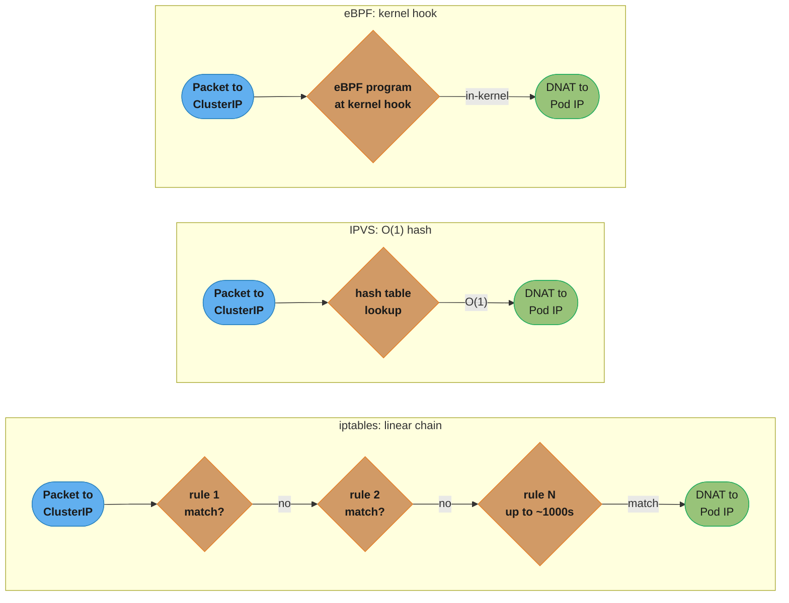
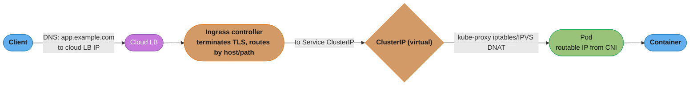
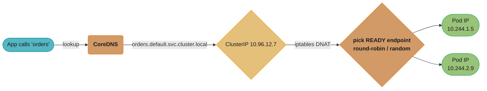
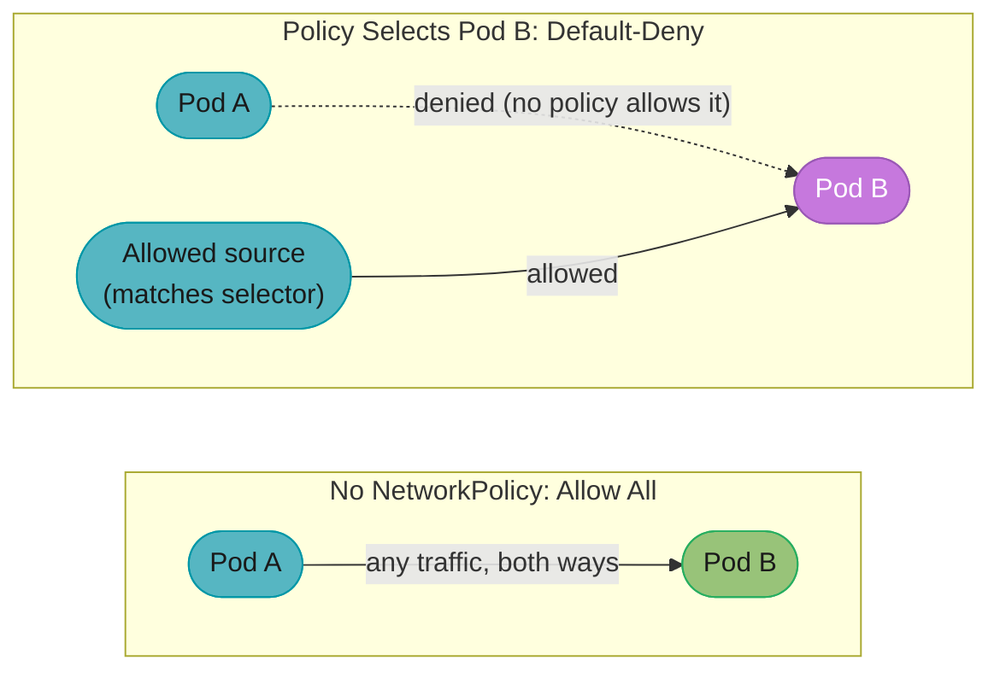
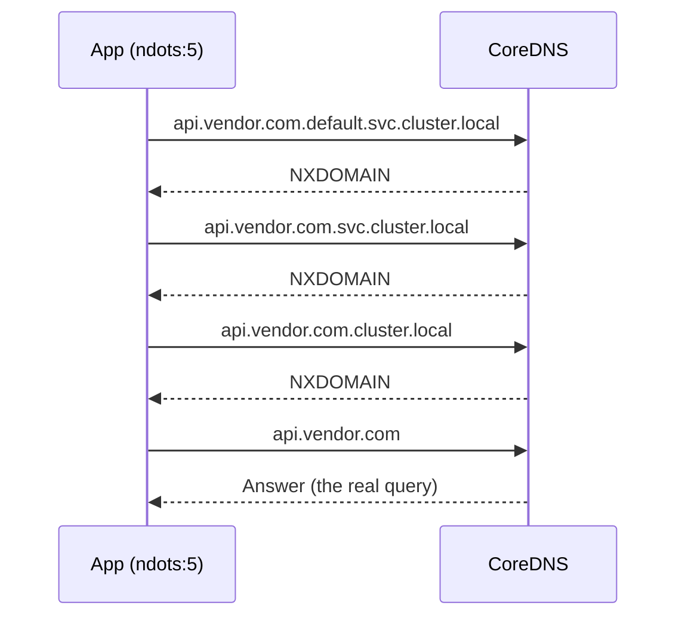
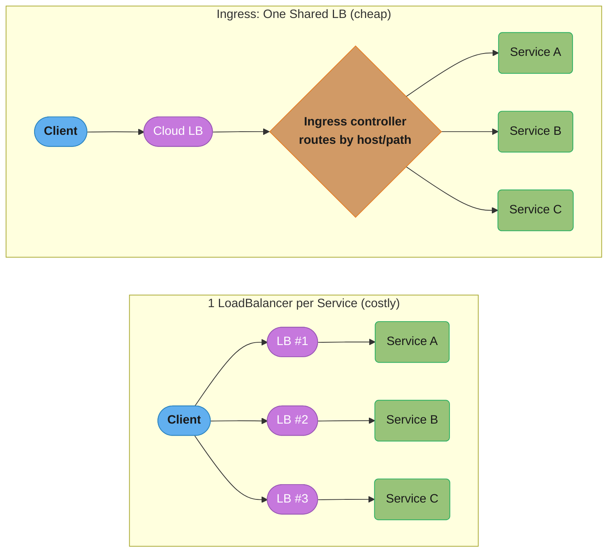
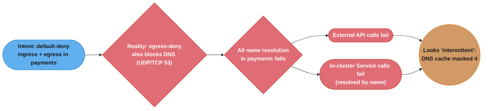

# Kubernetes Networking

> Phase 2 — Containers & Kubernetes · Difficulty: Advanced

Kubernetes networking is where many engineers' understanding gets fuzzy — and where interviewers probe hardest. The model rests on a few rules (every Pod gets a routable IP; all Pods can reach each other without NAT) implemented by pluggable layers: the **CNI** (Pod IPs and connectivity), **Services + kube-proxy** (stable virtual IPs), **CoreDNS** (service discovery), **Ingress/Gateway API** (L7 entry), and **NetworkPolicy** (segmentation). This module traces a packet from the internet to a container and back.

> Operational networking primitives (DNS, CIDR, LB types, TLS) are in [networking_for_devops](../networking_for_devops/). Service mesh internals are in [`../../backend/service_mesh_and_service_discovery`](../../backend/service_mesh_and_service_discovery/). This module is the Kubernetes-specific dataplane.

---

## 1. Concept Overview

The Kubernetes network model has four foundational rules:
1. Every **Pod gets its own IP** (no port-mapping gymnastics).
2. **Pods can reach all other Pods** across nodes **without NAT**.
3. **Nodes can reach all Pods** without NAT.
4. A Pod sees its own IP as the same IP others use to reach it.

These rules are *implemented* by a **CNI plugin** (Calico, Cilium, AWS VPC CNI, Flannel) the kubelet calls when a Pod is created, to allocate an IP and wire up routing/overlay.

On top of Pod networking:
- **Service** — a stable virtual IP (ClusterIP) and DNS name front-ending a changing set of Pods; **kube-proxy** programs the dataplane (iptables/IPVS) so the VIP load-balances to Pod IPs.
- **CoreDNS** — resolves Service names (`svc.ns.svc.cluster.local`) to ClusterIPs and headless Services to Pod IPs.
- **Ingress / Gateway API** — L7 HTTP routing (host/path) into Services via an ingress controller.
- **NetworkPolicy** — firewall rules between Pods (default is allow-all; policies restrict).

---

## 2. Intuition

> **One-line analogy**: Pods are apartments each with a unique mailing address (Pod IP), but tenants move constantly. A Service is the building's permanent front-desk number (ClusterIP) that always reaches *a* current tenant of the right type; CoreDNS is the phone book mapping names to those desk numbers; Ingress is the street-facing reception that routes visitors by who they're asking for.

**Mental model**: Pod IPs are ephemeral and churn with every deploy, so you never address Pods directly — you address a Service's stable VIP, and kube-proxy (or an eBPF dataplane) rewrites that to a live Pod IP. DNS gives the VIP a stable name. Ingress terminates external HTTP and routes to internal Services. NetworkPolicy is the segmentation layer that, once any policy selects a Pod, flips it from "allow all" to "deny except what's allowed."

**Why it matters**: Half of Kubernetes incidents are network-shaped: a Service with no ready endpoints, CoreDNS overload causing slow resolution, an Ingress misroute, a NetworkPolicy that accidentally cuts off a dependency, or subnet IP exhaustion blocking Pod scheduling. Knowing each layer's job makes "service unreachable" a 5-minute diagnosis instead of an afternoon.

**Key insight**: A ClusterIP is virtual — no machine has it. kube-proxy installs rules so that packets *to* the VIP get DNAT'd to a real Pod IP. There is nothing listening on the ClusterIP itself; understanding this dissolves most "why can't I reach my Service" confusion.

---

## 3. Core Principles

1. **Flat Pod network, no NAT between Pods.** The CNI guarantees this.
2. **Services are stable virtual IPs over ephemeral Pod IPs.** Address Services, not Pods.
3. **kube-proxy programs the dataplane, doesn't proxy (usually).** iptables/IPVS rules DNAT VIP→Pod; the kernel forwards.
4. **DNS is service discovery.** CoreDNS resolves Service names; it's a critical, easily-overloaded component.
5. **NetworkPolicy is default-allow until a policy selects the Pod.** Then it's default-deny for that direction.
6. **Ingress/Gateway is the L7 edge.** One controller fronts many Services by host/path.

---

## 4. Types / Architectures / Strategies

### CNI plugins

| CNI | Dataplane | Notes |
|-----|-----------|-------|
| AWS VPC CNI | Pod gets a real VPC IP (ENI) | Native AWS routing; subnet IP exhaustion risk |
| Calico | BGP routing / overlay; iptables/eBPF | Strong NetworkPolicy, scalable |
| Cilium | eBPF | Replaces kube-proxy, rich policy/observability (Hubble) |
| Flannel | VXLAN overlay | Simple, no policy |

### kube-proxy modes

| Mode | Mechanism | Scaling |
|------|-----------|---------|
| iptables (default) | Linear-ish iptables chains | Fine to ~1000s of Services; rule updates slow at high churn |
| IPVS | Kernel hash-table LB | Better at large Service counts, more algorithms |
| eBPF (Cilium, no kube-proxy) | eBPF programs | Best scale + observability |



*Why scaling differs: iptables re-evaluates a growing chain of sequential rules per packet (linear in Service count — "rule updates slow at high churn"), IPVS does one O(1) hash lookup regardless of Service count, and eBPF runs a single in-kernel hook — the mechanical reason IPVS/eBPF stay fast past ~1000s of Services where iptables degrades.*

### Service discovery DNS

```
<service>.<namespace>.svc.cluster.local        -> ClusterIP
<pod-ip-dashed>.<ns>.pod.cluster.local         -> specific Pod
<pod>.<headless-svc>.<ns>.svc.cluster.local    -> headless Service member (StatefulSet)
```

---

## 5. Architecture Diagrams

**Internet to container — the full request path:**



*A cloud LB (from `type=LoadBalancer` or the Ingress controller's own LB) hands off to the ingress controller Pod, which terminates TLS and routes by host/path to a Service ClusterIP; kube-proxy's DNAT then rewrites the destination to a ready Pod IP.*

**Service VIP resolution:**



*CoreDNS resolves the Service name to its ClusterIP; the packet to that virtual IP is DNAT'd by an iptables rule to one of the ready endpoints only, round-robin or random.*

**NetworkPolicy — default-deny once a policy selects a Pod:**



*No policy means Pod A and Pod B can reach each other freely; the instant a policy selects Pod B for a direction, that direction flips to default-deny and only explicitly-allowed sources still get through — the same Pod B shown healthy-open on the left, locked-down on the right.*

---

## 6. How It Works — Detailed Mechanics

### Service + selector → endpoints

```yaml
apiVersion: v1
kind: Service
metadata: {name: orders}
spec:
  selector: {app: orders}        # finds Pods with app=orders
  ports: [{port: 80, targetPort: 8080}]   # Service:80 -> container:8080
  # type: ClusterIP (default)
```

```bash
kubectl get svc orders                      # shows the ClusterIP (virtual)
kubectl get endpointslices -l kubernetes.io/service-name=orders
#  lists the READY Pod IPs:8080. EMPTY here = the #1 cause of "connection refused".
```

### Diagnosing in-cluster DNS

```bash
kubectl run -it --rm dnsutils --image=tutum/dnsutils -- bash
> nslookup orders.default.svc.cluster.local      # should return the ClusterIP
> cat /etc/resolv.conf
#  nameserver 10.96.0.10   (CoreDNS ClusterIP)
#  search default.svc.cluster.local svc.cluster.local cluster.local
#  options ndots:5         <- the latency trap (see below)
```

### The `ndots:5` performance trap

With `ndots:5`, any name with fewer than 5 dots is first tried against every `search` domain. So an external lookup `api.vendor.com` (2 dots) becomes:



*Every search-domain suffix is tried before the bare name — three wasted round trips before the one that succeeds.*

Four queries instead of one — multiplied across every request, this overloads CoreDNS. Fix: use a trailing dot (`api.vendor.com.`), set `dnsConfig` to lower `ndots`, or cache with NodeLocal DNSCache.

### Ingress (L7 routing)

```yaml
apiVersion: networking.k8s.io/v1
kind: Ingress
metadata:
  name: web
  annotations: {nginx.ingress.kubernetes.io/ssl-redirect: "true"}
spec:
  tls: [{hosts: [app.example.com], secretName: app-tls}]   # TLS terminated at the controller
  rules:
    - host: app.example.com
      http:
        paths:
          - {path: /api, pathType: Prefix, backend: {service: {name: api, port: {number: 80}}}}
          - {path: /,    pathType: Prefix, backend: {service: {name: web, port: {number: 80}}}}
```

The newer **Gateway API** (GA) replaces Ingress with a richer, role-oriented model (`GatewayClass`/`Gateway`/`HTTPRoute`) supporting traffic splitting, header matching, and cross-namespace routing natively.



*One `LoadBalancer` Service per app (left) multiplies cloud LB cost with no L7 features; an Ingress controller behind a single shared LB (right) fronts every Service by host/path — the pattern that lets ingress-nginx/Gateway API "front dozens of microservices behind one cloud LB" (see Real-World Examples).*

### NetworkPolicy (default-deny + explicit allow)

```yaml
# Default-deny all ingress in a namespace (zero-trust baseline):
apiVersion: networking.k8s.io/v1
kind: NetworkPolicy
metadata: {name: default-deny-ingress, namespace: payments}
spec:
  podSelector: {}            # all pods in the namespace
  policyTypes: [Ingress]
  # no ingress rules = deny all inbound
---
# Then explicitly allow only the api tier to reach the db:
apiVersion: networking.k8s.io/v1
kind: NetworkPolicy
metadata: {name: allow-api-to-db, namespace: payments}
spec:
  podSelector: {matchLabels: {app: db}}
  policyTypes: [Ingress]
  ingress:
    - from: [{podSelector: {matchLabels: {app: api}}}]
      ports: [{protocol: TCP, port: 5432}]
```

NetworkPolicy is only enforced if the CNI supports it (Calico/Cilium yes; Flannel no, AWS VPC CNI needs the policy add-on).

---

## 7. Real-World Examples

- **AWS VPC CNI** assigns each Pod a real VPC IP via ENIs, giving native security-group integration but creating **subnet IP exhaustion** at scale (a `/24` ≈ 250 Pods) — a top EKS sizing pitfall.
- **Cilium + eBPF** replaces kube-proxy entirely, scaling Service routing past iptables limits and providing flow observability (Hubble) — increasingly the default for large clusters.
- **NodeLocal DNSCache** is widely deployed to fix CoreDNS overload: a per-node DNS cache absorbs the `ndots` amplification and cuts CoreDNS QPS dramatically.
- **ingress-nginx / Gateway API** front dozens of microservices behind one cloud LB with host/path routing and TLS termination, instead of one expensive `LoadBalancer` Service per app.

---

## 8. Tradeoffs

| Decision | Option A | Option B | Key factor |
|----------|----------|----------|-----------|
| CNI | AWS VPC CNI (native IPs) | Calico/Cilium (overlay/eBPF) | VPC integration vs IP conservation + policy |
| kube-proxy | iptables (default) | IPVS / eBPF | Service count + churn |
| Edge | Ingress (one LB, shared) | LoadBalancer per Service | Cost + L7 features |
| Ingress API | Ingress (mature, simple) | Gateway API (richer, future) | Feature needs vs ecosystem maturity |
| DNS | Cluster CoreDNS | + NodeLocal DNSCache | QPS scale |
| Segmentation | No policy (flat, simple) | NetworkPolicy (zero-trust) | Security posture |

---

## 9. When to Use / When NOT to Use

**Invest in network design when:** running multi-tenant clusters (NetworkPolicy segmentation), large clusters (CNI/IP planning, IPVS/eBPF), or internet-facing apps (Ingress/Gateway + TLS).

**Keep it simple when:** a small single-tenant cluster — defaults (managed CNI, iptables kube-proxy, one Ingress) are fine. Don't hand-roll a service mesh for three services; don't add NetworkPolicy complexity without a segmentation requirement.

---

## 10. Common Pitfalls

**Pitfall 1 — Service has zero endpoints (selector/readiness mismatch).**

```bash
# BROKEN symptom: "connection refused" / timeouts to a Service that "exists".
kubectl get svc orders            # has a ClusterIP, looks fine
kubectl get endpointslices -l kubernetes.io/service-name=orders   # EMPTY
#  Cause: Service selector doesn't match Pod labels, OR no Pod is passing readiness.
```

```bash
# FIX: align selector with pod labels; ensure pods are Ready.
kubectl get pods --show-labels | grep orders     # confirm labels match the selector
kubectl describe pod <orders-pod> | grep -A3 Readiness   # confirm readiness passes
```

**Pitfall 2 — NetworkPolicy locks out a needed dependency (and DNS).** Applying a default-deny *egress* policy without explicitly allowing DNS (UDP/TCP 53 to kube-system CoreDNS) breaks *all* name resolution in the namespace — every outbound call fails with NXDOMAIN-like errors.

```yaml
# FIX: when default-denying egress, always allow DNS egress.
egress:
  - to: [{namespaceSelector: {matchLabels: {kubernetes.io/metadata.name: kube-system}}}]
    ports: [{protocol: UDP, port: 53}, {protocol: TCP, port: 53}]
```

**Pitfall 3 — `ndots:5` DNS amplification.** External hostnames in app config trigger 4–5 failed lookups each, overloading CoreDNS and adding latency. FIX: use FQDNs with trailing dots, deploy NodeLocal DNSCache, or set a lower `ndots` in the Pod's `dnsConfig`.

---

## 11. Technologies & Tools

| Tool | Purpose |
|------|---------|
| Calico / Cilium / AWS VPC CNI / Flannel | CNI (Pod networking, policy) |
| CoreDNS + NodeLocal DNSCache | Service discovery + per-node cache |
| ingress-nginx / Gateway API | L7 routing, TLS termination |
| kube-proxy (iptables/IPVS) / Cilium eBPF | Service dataplane |
| Hubble (Cilium) | Flow-level network observability |
| `kubectl get endpointslices` | Endpoint debugging |
| `dnsutils` pod / `nslookup` | DNS debugging |
| MetalLB | LoadBalancer for on-prem clusters |

---

## 12. Interview Questions with Answers

**Q1: What are the rules of the Kubernetes network model?**
Every Pod gets its own IP; all Pods can communicate with all other Pods across nodes without NAT; nodes can reach all Pods without NAT; and a Pod sees its own IP as the same one others use to reach it. This flat model is implemented by the CNI plugin and is what lets Services and DNS work uniformly regardless of which node a Pod lands on.

**Q2: What is a ClusterIP, and what's actually listening on it?**
A ClusterIP is a *virtual* IP for a Service — no machine or NIC holds it. kube-proxy installs iptables/IPVS rules so packets destined for the ClusterIP are DNAT'd to one of the Service's ready Pod IPs. Nothing listens on the ClusterIP itself; the kernel rewrites the destination. Understanding this resolves most "I can't reach my Service" confusion.

**Q3: What does the CNI do?**
The Container Network Interface plugin is invoked by the kubelet when a Pod is created to allocate the Pod's IP and wire up connectivity (routes, overlay/VXLAN, or BGP) so the network-model rules hold. Different CNIs implement it differently — AWS VPC CNI hands out real VPC IPs, Calico uses BGP/overlay, Cilium uses eBPF — and some (Calico/Cilium) also enforce NetworkPolicy.

**Q4: How does kube-proxy work, and what are its modes?**
kube-proxy watches Services and EndpointSlices and programs the node's dataplane so Service VIPs route to ready Pod IPs. In iptables mode (default) it installs chains the kernel evaluates; in IPVS mode it uses a kernel hash-table load balancer (better at thousands of Services); with Cilium/eBPF, kube-proxy is replaced by eBPF programs entirely. In iptables/IPVS modes it doesn't proxy bytes itself — the kernel forwards.

**Q5: Walk a packet from the internet to a container.**
Client DNS resolves to a cloud LB; the LB forwards to the ingress controller Pod, which terminates TLS and routes by host/path to a Service ClusterIP; kube-proxy's rules DNAT the ClusterIP to a ready Pod IP; the CNI's routing delivers the packet to that Pod on its node; the container receives it on `targetPort`. The response retraces the path (with SNAT where needed).

**Q6: How does service discovery / DNS work in Kubernetes?**
CoreDNS runs as a Service and resolves names like `orders.default.svc.cluster.local` to the Service's ClusterIP (and headless Services to individual Pod IPs). Pods get `/etc/resolv.conf` pointing at CoreDNS with a `search` list and `ndots:5`. Apps call Services by name; CoreDNS returns the stable VIP, decoupling clients from churning Pod IPs.

**Q7: Explain the `ndots:5` problem.**
`ndots:5` means any name with fewer than 5 dots is tried against each `search` domain before being queried as-is. So `api.vendor.com` (2 dots) triggers 4 lookups (3 failed search-domain attempts + the real one). Across many requests this multiplies CoreDNS load and adds latency. Fixes: trailing-dot FQDNs, NodeLocal DNSCache, or lowering `ndots` via Pod `dnsConfig`.

**Q8: A Service exists but clients get "connection refused." How do you debug?**
Check the EndpointSlices: `kubectl get endpointslices -l kubernetes.io/service-name=<svc>`. If empty, either the Service selector doesn't match any Pod labels, or no Pod is passing its readiness probe (only ready Pods become endpoints). Verify Pod labels match the selector and that readiness succeeds. If endpoints exist but it still fails, check NetworkPolicy and the `targetPort`.

**Q9: How does NetworkPolicy work and what's the default?**
By default all Pod-to-Pod traffic is allowed. The moment a NetworkPolicy selects a Pod for a direction (Ingress/Egress), that direction becomes default-deny for that Pod, and only the policy's explicit `from`/`to` rules are permitted. Policies are additive (union of allows). Crucially, NetworkPolicy is only enforced if the CNI supports it — Flannel doesn't, AWS VPC CNI needs an add-on.

**Q10: Ingress vs LoadBalancer Service vs Gateway API?**
A `LoadBalancer` Service provisions one cloud LB per Service (costly, L4). Ingress lets one ingress controller (behind a single LB) route HTTP by host/path to many Services with TLS termination — far cheaper and L7-aware. Gateway API is the newer, more expressive successor (role-separated `Gateway`/`HTTPRoute`, native traffic splitting and header matching), addressing Ingress's annotation-driven limitations.

**Q11: Why does AWS VPC CNI risk IP exhaustion?**
It assigns each Pod a real IP from the VPC subnet (via ENIs), so Pod IPs consume subnet address space directly. A `/24` subnet (~250 usable IPs) supports only ~250 Pods regardless of node count, so dense clusters exhaust subnets and Pods get stuck Pending with IP-allocation errors. Mitigations: larger/secondary CIDRs, prefix delegation (assign /28 prefixes per ENI), or an overlay CNI.

**Q12: What happens to a Service's traffic during a rolling update?**
As new Pods pass readiness, the EndpointSlice controller adds their IPs to the Service's endpoints; as old Pods are terminated and fail readiness/are deleted, their IPs are removed. kube-proxy updates the dataplane accordingly. With readiness probes and `maxUnavailable: 0`, only ready Pods ever receive traffic, so the Service load-balances seamlessly across the transition.

**Q13: Why might in-cluster DNS suddenly get slow under load?**
CoreDNS is a finite, shared Service; high QPS — often amplified by `ndots:5` search-domain expansion and per-request lookups (no client caching/keep-alive) — saturates its CPU and causes slow or timed-out resolution, which then looks like app latency. NodeLocal DNSCache, autoscaling CoreDNS, FQDNs, and connection reuse address it.

**Q14: What is a headless Service and when do you need it?**
A headless Service (`clusterIP: None`) has no virtual IP; DNS returns the individual Pod IPs instead. It's used by StatefulSets so each Pod has a stable, directly-addressable DNS name (`db-0.db.ns.svc`), which clustered systems need to reach specific members (e.g., a database primary) rather than load-balancing blindly across all replicas.

**Q15: How does eBPF (Cilium) change the dataplane?**
Cilium uses eBPF programs attached to kernel hooks to implement Service load balancing, NetworkPolicy, and observability directly in the kernel datapath — bypassing iptables entirely (it can replace kube-proxy). This scales far better at high Service/endpoint counts (no linear iptables chains), enables identity-based policy and L7 visibility (Hubble), and reduces latency from rule traversal.

---

## 13. Best Practices

- Address **Services, not Pods**; verify EndpointSlices are non-empty when debugging.
- Use **Ingress/Gateway API** behind one LB instead of per-Service `LoadBalancer`.
- Plan **CIDR/IP capacity** for peak Pod count (especially AWS VPC CNI); consider prefix delegation.
- Deploy **NodeLocal DNSCache** and use FQDNs to dodge `ndots` amplification.
- Adopt **default-deny NetworkPolicy** in sensitive namespaces — but always allow DNS egress.
- Choose **IPVS/eBPF** for large Service counts; pick a CNI that enforces policy if you need segmentation.
- Terminate **TLS at the edge** (Ingress) with automated certs (cert-manager — see [networking_for_devops](../networking_for_devops/)).

---

## 14. Case Study

### Scenario: After enabling zero-trust NetworkPolicies, half the services start failing intermittently

A security initiative rolls out default-deny NetworkPolicies namespace by namespace. The `payments` namespace immediately starts throwing connection errors — but only on *some* calls, and DNS lookups in that namespace begin failing with resolution errors.

Tracing the failure from stated intent to observed symptom:



*Denying egress without a DNS carve-out silently kills every name lookup in the namespace; the outage looked intermittent only because cached DNS answers kept some calls alive briefly.*

```yaml
# BROKEN: default-deny egress with no DNS carve-out.
apiVersion: networking.k8s.io/v1
kind: NetworkPolicy
metadata: {name: default-deny, namespace: payments}
spec:
  podSelector: {}
  policyTypes: [Ingress, Egress]      # egress denied -> DNS to CoreDNS blocked too
  ingress:
    - from: [{podSelector: {matchLabels: {app: api}}}]
  # no egress rules at all
```

```yaml
# FIX: explicitly allow DNS egress (and any required dependencies) alongside the deny.
apiVersion: networking.k8s.io/v1
kind: NetworkPolicy
metadata: {name: allow-dns-egress, namespace: payments}
spec:
  podSelector: {}
  policyTypes: [Egress]
  egress:
    - to:
        - namespaceSelector: {matchLabels: {kubernetes.io/metadata.name: kube-system}}
      ports: [{protocol: UDP, port: 53}, {protocol: TCP, port: 53}]
---
# Plus explicit egress for the api tier to the db, and to known external endpoints.
apiVersion: networking.k8s.io/v1
kind: NetworkPolicy
metadata: {name: api-egress-db, namespace: payments}
spec:
  podSelector: {matchLabels: {app: api}}
  policyTypes: [Egress]
  egress:
    - to: [{podSelector: {matchLabels: {app: db}}}]
      ports: [{protocol: TCP, port: 5432}]
```

The team learned to **always pair default-deny egress with a DNS-allow policy**, and to validate policies in audit/log mode (Cilium/Calico support policy logging) before enforcing, so blocked flows surface as logs instead of outages.

**Outcome:** resolution and inter-service calls recovered immediately once DNS egress was allowed; the rollout continued namespace by namespace with a standard "default-deny + allow-DNS" base policy plus per-app explicit allows. The "intermittent" symptom was a red herring — DNS caching masked the systematic break.

**Discussion questions:**
1. Why did DNS caching make a systematic failure look intermittent?
2. How would you safely validate a NetworkPolicy before enforcing it cluster-wide? (Audit/log mode, staging soak.)
3. Why is forgetting DNS the single most common NetworkPolicy mistake, and how do you make the DNS-allow a non-optional baseline? (Bake it into every namespace's base policy via a chart/policy template.)

---

**Cross-references:** [networking_for_devops](../networking_for_devops/) (DNS, CIDR, LB, TLS fundamentals), [kubernetes_workloads_and_objects](../kubernetes_workloads_and_objects/) (Services, Ingress, readiness→endpoints), [kubernetes_security](../kubernetes_security/) (NetworkPolicy as zero-trust), [`../../backend/service_mesh_and_service_discovery`](../../backend/service_mesh_and_service_discovery/) (mesh internals), [`case_studies/cross_cutting/multi_cluster_networking.md`](../case_studies/cross_cutting/multi_cluster_networking.md).
